黑马 JavaWeb 最新完整讲义地址：[https://heuqqdmbyk.feishu.cn/wiki/G9W0wL5KYiKWrykH8UAcmxnbnuh](https://heuqqdmbyk.feishu.cn/wiki/G9W0wL5KYiKWrykH8UAcmxnbnuh)

---

# 1. HTTP 协议

## 1.1. HTTP-概述

- **概念**：Hyper Text Transfer Protocol，超文本传输协议，规定了浏览器和服务器之间数据传输的规则。

---

**说明**

- **HTTP**（HyperText Transfer Protocol）是互联网上应用最为广泛的一种网络协议。
- 它定义了客户端（如浏览器）与服务器之间如何交换信息，包括请求（Request）和响应（Response）的格式。
- HTTP 是**无状态**的，即每次请求都是独立的，服务器不会保留上下文信息。
- 常用端口：80（HTTP）、443（HTTPS，加密版本）。

📌 补充：

- HTTP/1.1、HTTP/2、HTTP/3 是其不同版本，逐步提升性能与安全性。
- HTTPS = HTTP + SSL/TLS 加密，用于安全通信。


**特点：**

1. 基于TCP协议：面向连接，安全
2. 基于请求-响应模型的：一次请求对应一次响应
3. HTTP协议是无状态的协议：对于事务处理没有记忆能力。每次请求-响应都是独立的。

- 缺点：多次请求间不能共享数据。
- 优点：速度快

---

## 1.2. HTTP-请求协议

**HTTP-请求数据格式**

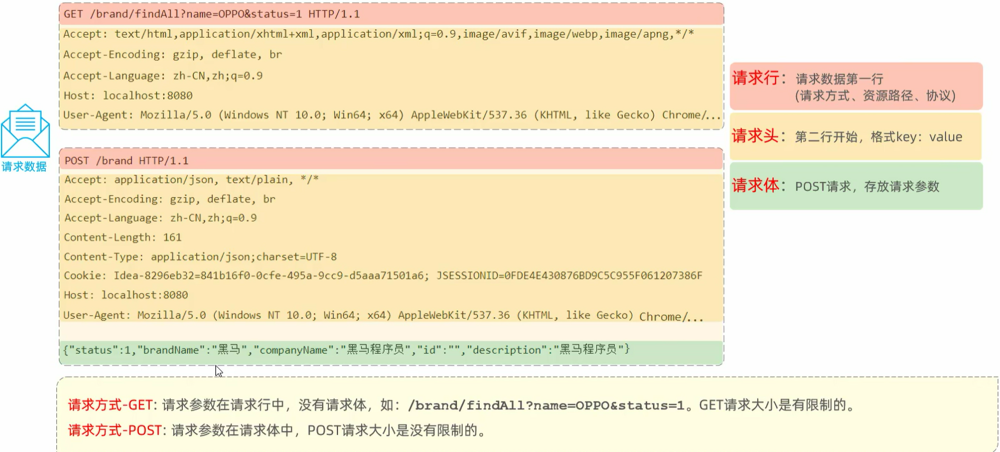

---

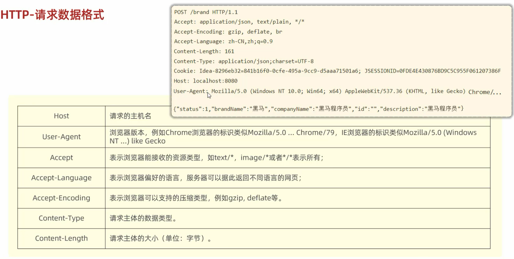

---

## 1.3. HTTP-响应协议

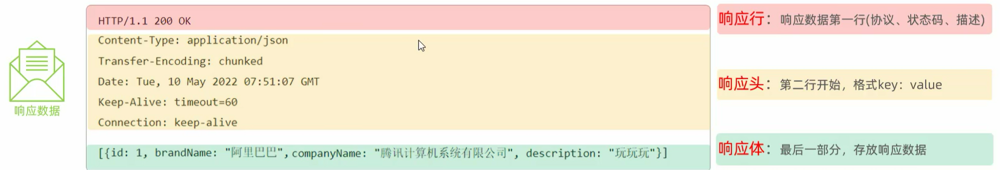

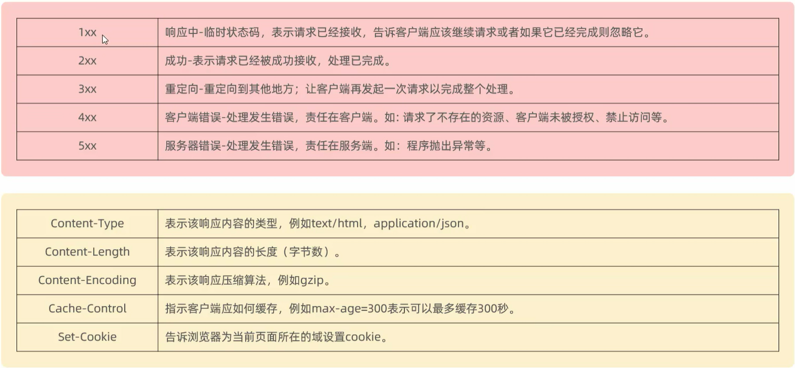

---

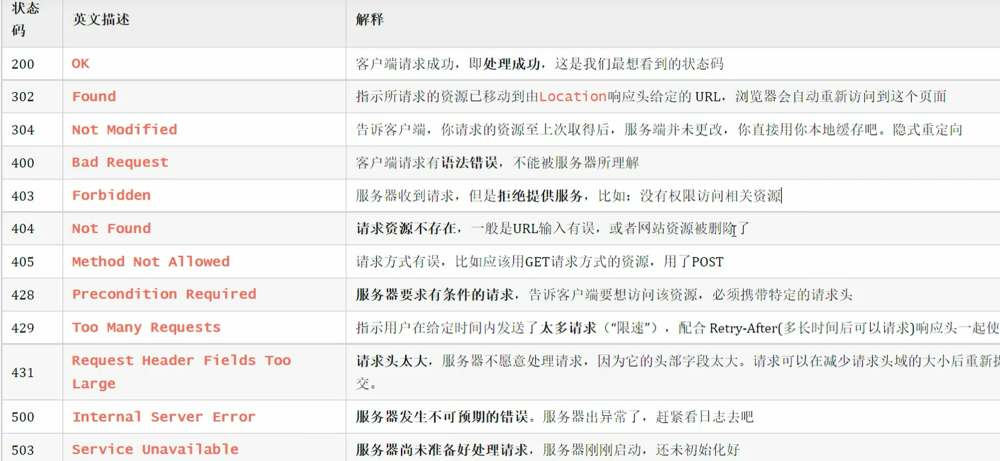

---

## 1.4. HTTP-协议解析

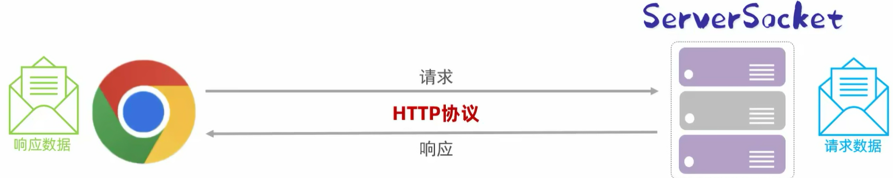

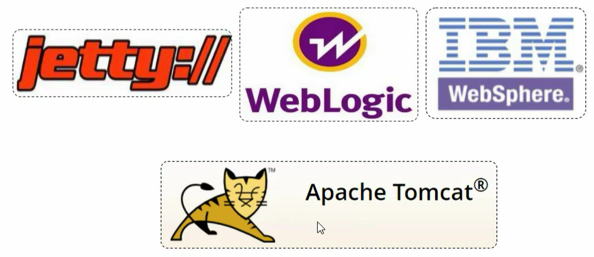

---

# 2. Web 服务器

Web服务器是一个软件程序，对HTTP协议的操作进行封装，使得程序员不必直接对协议进行操作，让Web开发更加便捷。主要功能是"提供网上信息浏览服务"。

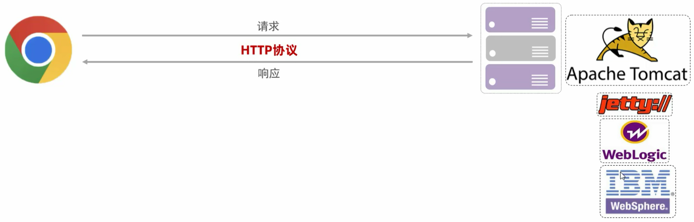

---

**说明**

- **Web服务器**：如 Apache HTTP Server、Nginx、Tomcat 等，负责接收客户端（浏览器）的 HTTP 请求，并返回相应的资源（如 HTML 页面、图片、JSON 数据等）。
- **封装HTTP协议**：开发者无需手动解析 HTTP 请求头、响应体等，只需关注业务逻辑。
- **核心功能**：

- 接收并处理 HTTP 请求
- 返回静态资源（HTML、CSS、JS、图片等）
- 支持动态内容（通过 CGI、Servlet、PHP 等技术）
- 提供安全、高效的信息浏览服务

示例：

- 用户访问 `http://example.com/index.html`，Web 服务器读取文件并返回给浏览器。
- 若请求的是 `/login` 接口，服务器可能调用后端程序处理登录逻辑并返回结果。

📌 总结：

- 对 HTTP 协议操作进行封装，简化 Web 程序开发
- 部署 Web 项目，对外提供网上信息浏览服务

# 3. Web 服务器 - Tomcat

## 3.1. 简介

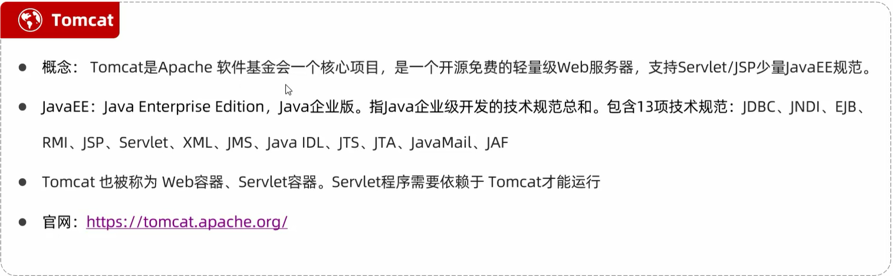

- 一个轻量级 Web 服务器，支持 Servlet、jsp 等少量 javaEE 规范
- 也被称为 Web 服务器、Servlet 容器

---

## 3.2. 基本使用

- **下载**：官网下载，地址 [https://tomcat.apache.org/download-90.cgi](https://tomcat.apache.org/download-90.cgi)
- **安装**：绿色版，直接解压即可
- **卸载**：直接删除目录即可
- **启动**：双击 `bin\startup.bat`

➤ 控制台中文乱码：修改 `conf/logging.properties`

```
java.util.logging.ConsoleHandler.level = FINE
java.util.logging.ConsoleHandler.formatter = org.apache.juli.OneLineFormatter
java.util.logging.ConsoleHandler.encoding = UTF-8  → 修改为 GBK
```

- **关闭**：

- ➤ 直接 × 掉运行窗口：强制关闭
- ➤ `bin\shutdown.bat`：正常关闭
- ➤ `Ctrl+C`：正常关闭

---

**说明**

- Apache Tomcat 是一个开源的 Java Web 服务器，用于运行 Java Servlet、JSP 等技术。
- 由于是绿色版，无需安装程序，解压后即可使用。
- **中文乱码问题**：

- 默认编码为 `UTF-8`，在 Windows 命令行中可能显示乱码。
- 将 `encoding` 改为 `GBK` 可解决中文输出乱码问题（适用于中文操作系统环境）。

- **关闭方式建议**：

- 使用 `shutdown.bat` 或 `Ctrl+C` 可确保服务正常停止，避免资源泄漏或数据不一致。

提示：

- 启动时需确保已配置好 Java 环境（JDK 安装并设置 `JAVA_HOME`）。
- 若需远程访问，需配置防火墙和端口（默认 8080）。

---

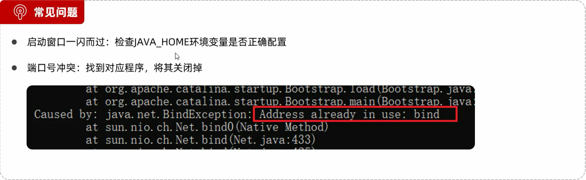

---

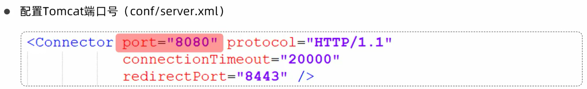

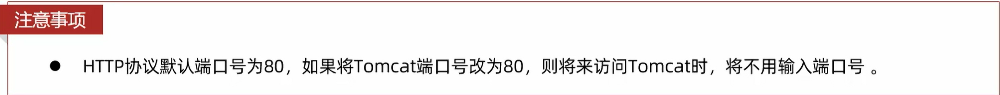

---

- **Tomcat 部署项目：**  
    将项目放置到 `webapps` 目录下，即部署完成

---

**说明**

- Tomcat 的 `webapps` 目录是默认的 Web 应用部署目录。
- 支持以下部署方式：

- **直接放置文件夹**：将项目文件夹（如 `myapp`）复制到 `webapps/` 下，Tomcat 启动时会自动加载。
- **放置 WAR 包**：将项目打包为 `.war` 文件并放入 `webapps/`，Tomcat 会自动解压并部署。

- 部署完成后，可通过浏览器访问：

```
http://localhost:8080/项目名/
```

例如：`http://localhost:8080/myapp/`

**注意事项：**

- 项目名称不能重复。
- 若修改了项目内容，需重启 Tomcat 或删除 `work` 和 `temp` 目录以清除缓存。
- 可通过 `conf/server.xml` 配置自定义上下文路径或使用 `context.xml` 进行高级配置。

📌 总结：简单、快捷的部署方式，适合开发和测试环境。生产环境建议使用更稳定的部署方案（如外部管理工具或容器化部署）。

---

# 4. SpringBootWeb-入门程序解析

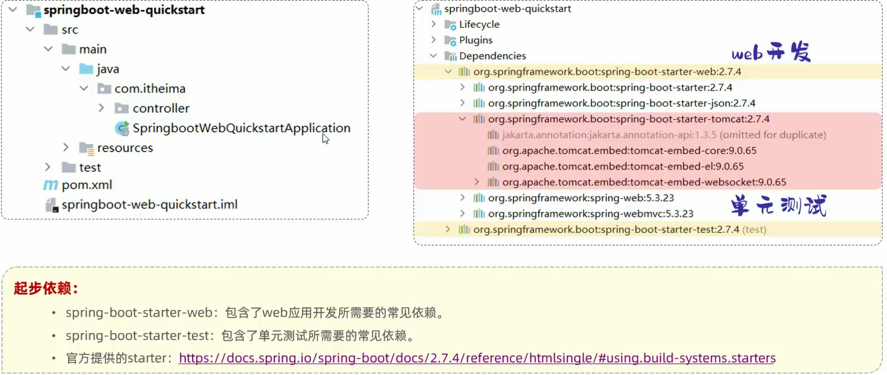

---

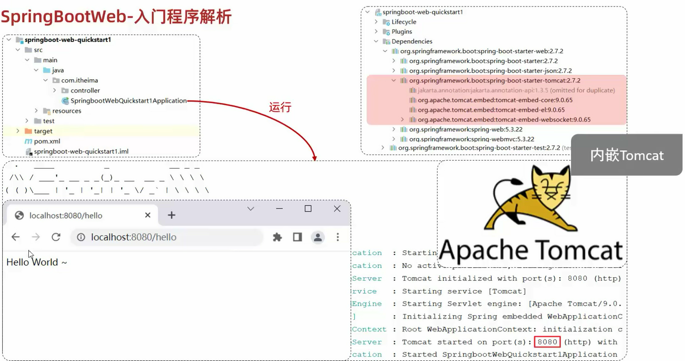

---

# 5. 请求与响应📡

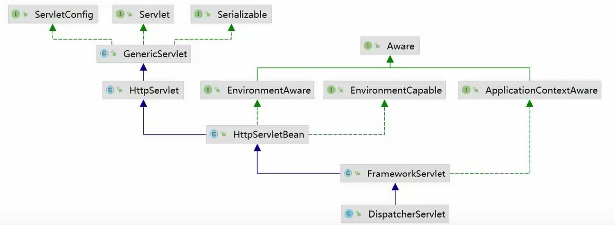

---

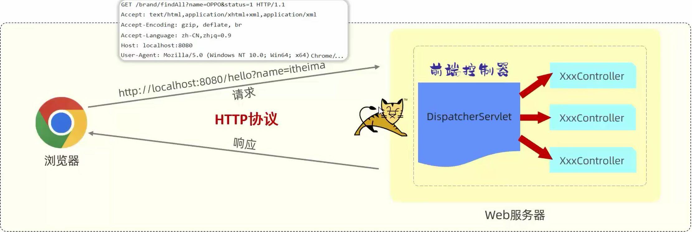

---

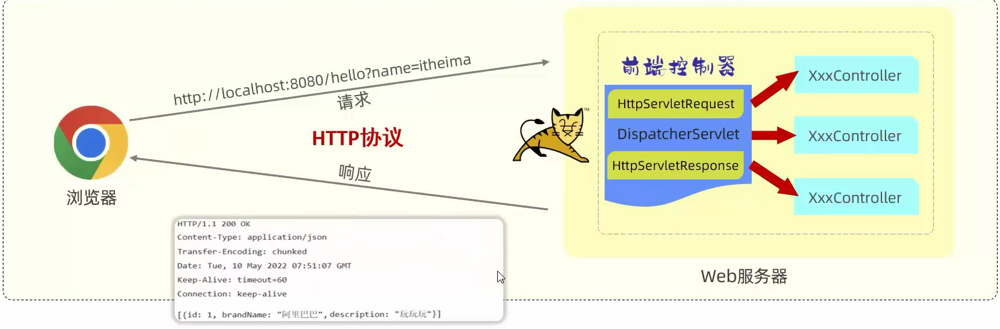

---

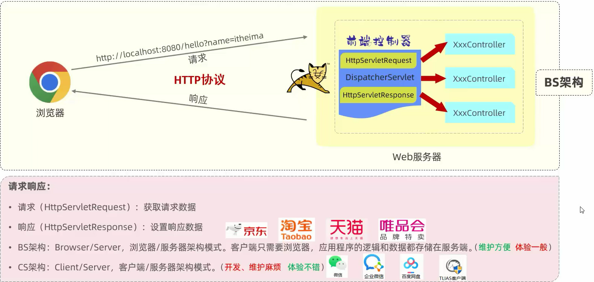

---

## 5.1. 一、从浏览器到 JVM 的完整链路

### 5.1.1. 1. 网络通信底层流程

```
浏览器输入 URL
    ↓
DNS 解析域名 → IP 地址
    ↓
TCP 三次握手建立连接 (端口 80/443)
    ↓
发送 HTTP 请求报文 (字节流)
    ↓
Tomcat 监听 Socket → 接收字节流
    ↓
解析 HTTP 协议 → 创建 HttpServletRequest 对象
    ↓
Servlet 处理业务 → 创建 HttpServletResponse 对象
    ↓
Tomcat 将响应对象转为 HTTP 响应报文 (字节流)
    ↓
TCP 传输回浏览器 → 渲染页面
```

### 5.1.2. 2. HTTP 请求报文结构（底层字节流）

```
POST /login HTTP/1.1\r\n          ← 请求行 (方法、路径、协议)
Host: localhost:8080\r\n          ← 请求头
Content-Type: application/json\r\n
Content-Length: 35\r\n
\r\n                               ← 空行 (分隔头和体)
{"username":"jack","pwd":"123"}   ← 请求体
```

---

## 5.2. 二、HttpServletRequest 底层实现

### 5.2.1. 1. 核心接口继承关系

```
// Servlet 规范定义的接口
public interface HttpServletRequest extends ServletRequest {
    String getMethod();                      // GET/POST
    String getRequestURI();                  // /hmall/api/login
    String getQueryString();                 // ?id=1&name=jack
    String getHeader(String name);           // 获取请求头
    ServletInputStream getInputStream();     // 获取请求体字节流
    BufferedReader getReader();              // 获取请求体字符流
    Map<String, String[]> getParameterMap(); // 获取表单参数
}
```

### 5.2.2. 2. Tomcat 中的真实实现类

```
// Tomcat 源码中的实现 (简化版)
public class Request implements HttpServletRequest {
    
    private SocketWrapperBase<?> socketWrapper; // 底层 Socket 连接
    private InputBuffer inputBuffer;            // 输入缓冲区
    private ByteChunk bodyChunk;                // 请求体字节块
    private Parameters parameters;              // 参数解析器
    private Headers headers;                    // 请求头集合
    
    @Override
    public String getHeader(String name) {
        // 从 MimeHeaders 中查找
        MessageBytes value = headers.getValue(name);
        return value.toString();
    }
    
    @Override
    public ServletInputStream getInputStream() {
        // 从 Socket 读取字节流
        return new ServletInputStream() {
            @Override
            public int read() throws IOException {
                return inputBuffer.read();
            }
        };
    }
}
```

### 5.2.3. 3. 直接使用底层 API 示例

```
@WebServlet("/raw-request")
public class RawRequestServlet extends HttpServlet {
    
    @Override
    protected void doPost(HttpServletRequest req, HttpServletResponse resp) 
            throws ServletException, IOException {
        
        // 1. 获取请求行信息
        String method = req.getMethod();           // POST
        String uri = req.getRequestURI();          // /hmall/raw-request
        String protocol = req.getProtocol();       // HTTP/1.1
        
        // 2. 获取请求头
        String contentType = req.getContentType(); // application/json
        String userAgent = req.getHeader("User-Agent");
        int contentLength = req.getContentLength(); // 请求体字节数
        
        // 3. 获取请求体 (字节流方式 - 适合文件/二进制)
        ServletInputStream inputStream = req.getInputStream();
        byte[] buffer = new byte[1024];
        int len;
        ByteArrayOutputStream baos = new ByteArrayOutputStream();
        while ((len = inputStream.read(buffer)) != -1) {
            baos.write(buffer, 0, len);
        }
        String body = baos.toString("UTF-8");
        
        // 4. 获取请求体 (字符流方式 - 适合文本/JSON)
        // 注意：InputStream 和 Reader 只能二选一！
        BufferedReader reader = req.getReader();
        StringBuilder sb = new StringBuilder();
        String line;
        while ((line = reader.readLine()) != null) {
            sb.append(line);
        }
        
        // 5. 获取表单参数 (自动解析 application/x-www-form-urlencoded)
        String username = req.getParameter("username");
        Map<String, String[]> paramMap = req.getParameterMap();
        
        System.out.println("收到请求：" + method + " " + uri);
        System.out.println("请求体：" + body);
    }
}
```

### 5.2.4. 4. 参数解析底层原理

```
// Tomcat 如何解析表单参数
public class Parameters {
    
    private boolean parsed = false;
    private HashMap<String, String[]> paramHash = new HashMap<>();
    
    public void parse() {
        if (parsed) return;
        
        // 1. 解析 URL 中的查询参数 (?id=1&name=jack)
        parseQueryParameters();
        
        // 2. 如果是 POST 且 Content-Type 是表单
        if ("POST".equals(method) && 
            contentType.startsWith("application/x-www-form-urlencoded")) {
            // 从请求体读取字节
            byte[] body = readBody();
            // 按 & 分割，再按 = 分割键值对
            parseFormBody(body);
        }
        
        parsed = true;
    }
    
    private void parseFormBody(byte[] body) {
        String bodyStr = new String(body, StandardCharsets.UTF_8);
        String[] pairs = bodyStr.split("&");  // username=jack&pwd=123
        for (String pair : pairs) {
            String[] kv = pair.split("=");
            String key = URLDecoder.decode(kv[0], "UTF-8");
            String value = URLDecoder.decode(kv[1], "UTF-8");
            paramHash.computeIfAbsent(key, k -> new String[1])[0] = value;
        }
    }
}
```

---

## 5.3. 三、HttpServletResponse 底层实现

### 5.3.1. 1. 核心接口定义

```
public interface HttpServletResponse extends ServletResponse {
    void setStatus(int sc);                    // 设置状态码
    void setHeader(String name, String value); // 设置响应头
    void setContentType(String type);          // 设置内容类型
    void setContentLength(int len);            // 设置内容长度
    ServletOutputStream getOutputStream();     // 获取输出字节流
    PrintWriter getWriter();                   // 获取输出字符流
    void sendRedirect(String location);        // 重定向
}
```

### 5.3.2. 2. 响应报文组装过程

```
// Tomcat  Response 实现 (简化版)
public class Response implements HttpServletResponse {
    
    private OutputBuffer outputBuffer;    // 输出缓冲区
    private ByteChunk bodyChunk;          // 响应体字节块
    private Headers headers;              // 响应头
    private int status = 200;             // 状态码
    
    @Override
    public ServletOutputStream getOutputStream() {
        return new ServletOutputStream() {
            @Override
            public void write(int b) throws IOException {
                // 写入缓冲区
                outputBuffer.write(b);
            }
            
            @Override
            public void write(byte[] b, int off, int len) {
                // 批量写入
                outputBuffer.write(b, off, len);
            }
        };
    }
    
    // 当 Servlet 处理完毕，Tomcat 调用此方法发送响应
    public void finishResponse() throws IOException {
        // 1. 组装 HTTP 响应行
        StringBuilder sb = new StringBuilder();
        sb.append("HTTP/1.1 ").append(status).append(" OK\r\n");
        
        // 2. 组装响应头
        for (Header header : headers) {
            sb.append(header.getName()).append(": ")
              .append(header.getValue()).append("\r\n");
        }
        
        // 3. 空行分隔
        sb.append("\r\n");
        
        // 4. 写入 Socket 输出流
        SocketOutputStream socketOut = socketWrapper.getOutputStream();
        socketOut.write(sb.toString().getBytes());
        socketOut.write(bodyChunk.getBytes());
        socketOut.flush();
    }
}
```

### 5.3.3. 3. 直接使用底层 API 示例

```
@WebServlet("/raw-response")
public class RawResponseServlet extends HttpServlet {
    
    @Override
    protected void doGet(HttpServletRequest req, HttpServletResponse resp) 
            throws ServletException, IOException {
        
        // 1. 设置状态码
        resp.setStatus(200);
        // resp.sendError(404, "资源不存在");  // 发送错误状态
        
        // 2. 设置响应头
        resp.setHeader("Server", "MyTomcat/1.0");
        resp.setHeader("Cache-Control", "no-cache");
        resp.setDateHeader("Expires", 0);
        
        // 3. 设置内容类型 (必须!)
        resp.setContentType("text/html;charset=UTF-8");
        // 等同于：
        // resp.setHeader("Content-Type", "text/html;charset=UTF-8");
        
        // 4. 写入响应体 (字符流 - 适合文本/HTML/JSON)
        PrintWriter writer = resp.getWriter();
        writer.println("<html>");
        writer.println("<head><title>测试</title></head>");
        writer.println("<body>");
        writer.println("<h1>Hello, Bottom Layer!</h1>");
        writer.println("</body>");
        writer.println("</html>");
        writer.flush(); // 必须刷新
        
        // 或者使用字节流 (适合文件/图片/下载)
        // ServletOutputStream out = resp.getOutputStream();
        // out.write(fileBytes);
    }
}
```

### 5.3.4. 4. 文件下载底层实现

```
@WebServlet("/download")
public class DownloadServlet extends HttpServlet {
    
    @Override
    protected void doGet(HttpServletRequest req, HttpServletResponse resp) 
            throws IOException {
        
        File file = new File("/data/report.pdf");
        
        // 1. 设置响应头：告诉浏览器这是附件，需要下载
        resp.setContentType("application/octet-stream");
        // URL 编码文件名，防止中文乱码
        String filename = URLEncoder.encode(file.getName(), "UTF-8");
        resp.setHeader("Content-Disposition", 
            "attachment;filename=" + filename);
        resp.setContentLength((int) file.length());
        
        // 2. 读取文件并写入响应流
        try (FileInputStream fis = new FileInputStream(file);
             ServletOutputStream out = resp.getOutputStream()) {
            
            byte[] buffer = new byte[8192];
            int len;
            while ((len = fis.read(buffer)) != -1) {
                out.write(buffer, 0, len);
            }
            out.flush();
        }
    }
}
```

---

## 5.4. 四、请求转发 vs 重定向 (底层区别)

### 5.4.1. 1. 请求转发 (Forward) - 服务器内部跳转

```
// 底层原理：同一个 Request/Response 对象
req.getRequestDispatcher("/success.jsp").forward(req, resp);

// Tomcat 内部实现
public void forward(ServletRequest req, ServletResponse res) {
    // 1. 不向客户端发送任何数据
    // 2. 直接在服务器内部调用目标 Servlet 的 service() 方法
    // 3. 共享同一个 Request 对象 (可以传递数据)
    targetServlet.service(req, res);
}
```

**特点**：

- 浏览器地址栏**不变**
- 只有**一次** HTTP 请求
- 可以共享 `request.setAttribute()` 数据
- 只能转发到**当前应用内**的资源

### 5.4.2. 2. 重定向 (Redirect) - 客户端重新请求

```
// 底层原理：告诉浏览器去访问新地址
resp.sendRedirect("/login.html");

// Tomcat 发送的响应报文
HTTP/1.1 302 Found\r\n
Location: /login.html\r\n
Content-Length: 0\r\n
\r\n
```

**特点**：

- 浏览器地址栏**改变**
- 产生**两次** HTTP 请求
- 不能共享 request 数据 (可以用 URL 参数或 Session)
- 可以重定向到**任何** URL

---

## 5.5. 五、字符编码底层原理

### 5.5.1. 1. 为什么会有乱码？

```
字节流 (Byte) → 字符流 (Char) 需要编码转换
    ↓
GBK 编码的中文 → 用 UTF-8 解码 → 乱码!
```

### 5.5.2. 2. 完整的编码设置

```
@Override
protected void doPost(HttpServletRequest req, HttpServletResponse resp) 
        throws IOException {
    
    // ========== 请求编码 ==========
    // 必须在获取参数之前设置！
    req.setCharacterEncoding("UTF-8");
    
    // Tomcat 内部处理
    // 1. 从 Socket 读取字节流 (ISO-8859-1 默认)
    // 2. 按指定编码解码为字符
    // 3. 填充到 ParameterMap
    
    // ========== 响应编码 ==========
    // 方式 1：设置 Content-Type (推荐)
    resp.setContentType("text/html;charset=UTF-8");
    
    // 方式 2：分别设置
    // resp.setCharacterEncoding("UTF-8");  // 输出流编码
    // resp.setHeader("Content-Type", "text/html"); // 告知浏览器编码
    
    // 写入中文
    resp.getWriter().println("你好，世界！");
}
```

### 5.5.3. 3. Tomcat 编码配置 (server.xml)

```
<!-- 解决 GET 请求 URL 参数乱码 -->
<Connector port="8080" protocol="HTTP/1.1"
           connectionTimeout="20000"
           URIEncoding="UTF-8"  ← 关键配置
           redirectPort="8443" />
```

---

## 5.6. 六、文件上传底层原理

### 5.6.1. 1. multipart/form-data 报文格式

```
POST /upload HTTP/1.1
Content-Type: multipart/form-data; boundary=----WebKitFormBoundary7MA4YWxkTrZu0gW

------WebKitFormBoundary7MA4YWxkTrZu0gW
Content-Disposition: form-data; name="username"

jack
------WebKitFormBoundary7MA4YWxkTrZu0gW
Content-Disposition: form-data; name="avatar"; filename="photo.jpg"
Content-Type: image/jpeg

(二进制图片数据...)
------WebKitFormBoundary7MA4YWxkTrZu0gW--
```

### 5.6.2. 2. 底层解析实现

```
@WebServlet("/upload")
@MultipartConfig  // 必须标注，否则 getPart() 返回 null
public class UploadServlet extends HttpServlet {
    
    @Override
    protected void doPost(HttpServletRequest req, HttpServletResponse resp) 
            throws IOException, ServletException {
        
        // 1. 获取普通字段
        Part usernamePart = req.getPart("username");
        String username = readPartContent(usernamePart);
        
        // 2. 获取文件字段
        Part filePart = req.getPart("avatar");
        String fileName = getFileName(filePart);
        
        // 3. 读取文件内容 (字节流)
        InputStream fileInput = filePart.getInputStream();
        byte[] fileBytes = fileInput.readAllBytes();
        
        // 4. 保存到服务器
        String savePath = "/data/uploads/" + fileName;
        try (FileOutputStream fos = new FileOutputStream(savePath)) {
            fos.write(fileBytes);
        }
        
        resp.getWriter().println("上传成功：" + fileName);
    }
    
    // 从 Part 中读取文本内容
    private String readPartContent(Part part) throws IOException {
        Scanner scanner = new Scanner(part.getInputStream(), "UTF-8");
        return scanner.hasNext() ? scanner.next() : "";
    }
    
    // 从 Content-Disposition 中提取文件名
    private String getFileName(Part part) {
        String header = part.getHeader("Content-Disposition");
        // 解析：form-data; name="avatar"; filename="photo.jpg"
        for (String token : header.split(";")) {
            if (token.trim().startsWith("filename")) {
                return token.substring(token.indexOf('=') + 1)
                                 .trim().replace("\"", "");
            }
        }
        return "";
    }
}
```

---

## 5.7. 七、异步处理 (Servlet 3.0+)

### 5.7.1. 1. 为什么需要异步？

**同步阻塞模型**：

```
请求 → Tomcat 线程池 (200 个线程) → 处理业务 (5 秒) → 响应
问题：200 个线程全部被占用，新请求被拒绝！
```

**异步非阻塞模型**：

```
请求 → Tomcat 线程释放 → 业务线程池处理 → 完成后通知 Tomcat → 响应
优势：Tomcat 线程可以处理更多请求！
```

### 5.7.2. 2. 异步处理代码示例

```
@WebServlet(value = "/async", asyncSupported = true)
public class AsyncServlet extends HttpServlet {
    
    @Override
    protected void doGet(HttpServletRequest req, HttpServletResponse resp) {
        
        // 1. 开启异步上下文 (Tomcat 线程立即释放)
        AsyncContext asyncContext = req.startAsync();
        asyncContext.setTimeout(30000); // 设置超时
        
        // 2. 提交到业务线程池处理
        asyncContext.start(() -> {
            try {
                // 模拟耗时操作 (查询数据库/调用第三方 API)
                Thread.sleep(5000);
                
                // 3. 获取响应对象写入数据
                HttpServletResponse response = 
                    (HttpServletResponse) asyncContext.getResponse();
                response.setContentType("text/html;charset=UTF-8");
                response.getWriter().println("异步处理完成！");
                
                // 4. 完成异步 (必须调用！)
                asyncContext.complete();
                
            } catch (Exception e) {
                asyncContext.complete(); // 异常时也要 complete
            }
        });
        
        // 这行代码会立即执行，不会等待上面线程完成
        System.out.println("Tomcat 线程已释放，可以处理新请求");
    }
}
```

---

## 5.8. 八、Spring MVC 对底层的封装

### 5.8.1. 1. DispatcherServlet 核心流程

```
// Spring MVC 的核心 Servlet
public class DispatcherServlet extends FrameworkServlet {
    
    @Override
    protected void doService(HttpServletRequest request, 
                           HttpServletResponse response) {
        
        // 1. 封装请求对象
        ServletWebRequest webRequest = new ServletWebRequest(request, response);
        
        // 2. 查找匹配的 Controller 方法
        HandlerExecutionChain chain = getHandler(request);
        
        // 3. 执行参数解析 (@RequestBody, @PathVariable 等)
        // 底层：调用 RequestBodyMethodArgumentResolver
        Object[] args = handlerMethod.resolveArguments(request);
        
        // 4. 反射调用 Controller 方法
        Object result = handlerMethod.invoke(args);
        
        // 5. 处理返回值 (转为 JSON/视图)
        ModelAndView mav = handlerMethod.returnValue(result);
        
        // 6. 渲染响应
        render(mav, request, response);
    }
}
```

### 5.8.2. 2. @RequestBody 底层解析

```
public class RequestResponseBodyMethodProcessor {
    
    @Override
    public Object resolveArgument(MethodParameter parameter, 
                                  NativeWebRequest request) {
        
        // 1. 获取原始的 HttpServletRequest
        HttpServletRequest servletRequest = 
            request.getNativeRequest(HttpServletRequest.class);
        
        // 2. 读取请求体
        ServletInputStream inputStream = servletRequest.getInputStream();
        String body = StreamUtils.copyToString(inputStream, StandardCharsets.UTF_8);
        
        // 3. 使用 Jackson 反序列化为 Java 对象
        ObjectMapper mapper = new ObjectMapper();
        return mapper.readValue(body, parameter.getParameterType());
    }
}
```

### 5.8.3. 3. 对比：原始 Servlet vs Spring MVC

```
// ========== 原始 Servlet 写法 ==========
@WebServlet("/login")
public class LoginServlet extends HttpServlet {
    @Override
    protected void doPost(HttpServletRequest req, HttpServletResponse resp) 
            throws IOException {
        // 1. 手动读取请求体
        BufferedReader reader = req.getReader();
        String json = reader.lines().collect(Collectors.joining());
        
        // 2. 手动解析 JSON
        ObjectMapper mapper = new ObjectMapper();
        LoginFormDTO form = mapper.readValue(json, LoginFormDTO.class);
        
        // 3. 调用业务层
        UserLoginVO vo = userService.login(form);
        
        // 4. 手动设置响应
        resp.setContentType("application/json;charset=UTF-8");
        resp.getWriter().write(mapper.writeValueAsString(vo));
    }
}

// ========== Spring MVC 写法 ==========
@RestController
public class LoginController {
    
    @PostMapping("/login")
    public UserLoginVO login(@RequestBody LoginFormDTO form) {
        // 底层自动完成：JSON 解析、参数绑定、响应序列化
        return userService.login(form);
    }
}
```

---

## 5.9. 九、性能优化底层技巧

### 5.9.1. 1. 响应压缩 (GZIP)

```
// Tomcat 配置 (server.xml)
<Connector port="8080" compression="on" 
           compressionMinSize="2048"
           compressableMimeType="text/html,text/xml,application/json"/>

// 底层原理：
// 1. 浏览器请求头：Accept-Encoding: gzip, deflate
// 2. Tomcat 检测到支持压缩
// 3. 使用 GZIPOutputStream 压缩响应体
// 4. 响应头：Content-Encoding: gzip
// 5. 浏览器自动解压
```

### 5.9.2. 2. 连接池与长连接

```
// HTTP/1.1 默认启用 Keep-Alive
Connection: keep-alive
Keep-Alive: timeout=5, max=100

// 底层 Socket 处理
while (keepAlive) {
    // 复用同一个 TCP 连接
    request = parseRequest(socket.getInputStream());
    response = handleRequest(request);
    writeResponse(socket.getOutputStream(), response);
    // 不关闭 Socket，等待下一个请求
}
```

---

## 5.10. 十、调试底层技巧

### 5.10.1. 1. 使用 Wireshark 抓包

```
# 过滤 HTTP 流量
tcp.port == 8080 and http

# 可以看到完整的 TCP 三次握手、HTTP 报文
```

### 5.10.2. 2. 开启 Tomcat 调试日志

```
<!-- logging.properties -->
org.apache.catalina.core.ContainerBase.[Catalina].[localhost].level = FINE
org.apache.catalina.servlets.level = FINE
```

### 5.10.3. 3. 使用 Curl 测试底层

```
# 查看完整请求/响应报文
curl -v http://localhost:8080/api/test

# 发送原始 HTTP 请求
curl -X POST http://localhost:8080/login \
     -H "Content-Type: application/json" \
     -d '{"username":"jack","pwd":"123"}'
```

---

## 5.11. 📌 核心总结

|   |   |   |
|---|---|---|
|层次|技术|职责|
|**物理层**|TCP/IP|字节流传输、三次握手|
|**协议层**|HTTP|报文格式、状态码、方法|
|**容器层**|Tomcat|Socket 监听、协议解析、线程池|
|**规范层**|Servlet API|Request/Response 对象封装|
|**框架层**|Spring MVC|参数绑定、返回值处理、AOP|
|**业务层**|Controller|具体业务逻辑|

**一句话理解**：

浏览器发 HTTP 报文 → Tomcat 监听 Socket 接收 → 解析为 HttpServletRequest → Spring 封装为 Controller 参数 → 业务处理 → 返回值封装为 HttpServletResponse → Tomcat 转为 HTTP 报文发回浏览器。

---

# 6. Servlet生命周期与原理

# 7. Cookie与Session机制

# 8. JSP基础（了解即可）

# 9. Filter过滤器与Listener监听器

# 10. 异常处理机制

---

## 🔗 关联笔记
- [[Spring6笔记]]
- [[SpringMVC笔记]]
- [[Java后端学习笔记]]
