**回顾三层架构**：

1. **表现层（Controller / Web 层）**：负责接收用户的请求（比如浏览器发来的请求），返回页面或数据。（接收数据，响应数据）
2. **业务逻辑层（Service 层）**：处理具体的业务规则，比如“用户注册时要检查手机号是否重复”。（业务逻辑处理）
3. **数据访问层（或持久层）（DAO / Mapper 层）**：专门和数据库打交道，比如增删改查。 （数据访问操作）

**表现层**调用**业务逻辑层**，**业务逻辑层**调用**持久层（数据访问层）**，都需要创建他们的对象后再进行调用

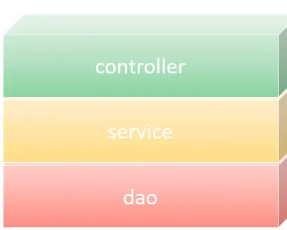

# 一、Spring启示录

阅读以下代码：

```
package com.powernode.oa.controller;

import com.powernode.oa.service.UserService;
import com.powernode.oa.service.impl.UserServiceImpl;

public class UserController {

    private UserService userServiceImpl = new UserServiceImpl();

    public void login(){
        String username = "admin";
        String password = "123456";
        boolean success = userServiceImpl.login(username, password);
        if (success) {
            // 登录成功
        } else {
            // 登录失败
        }
    }
}
```

```
package com.powernode.oa.service.impl;

import com.powernode.oa.bean.User;
import com.powernode.oa.dao.UserDao;
import com.powernode.oa.dao.impl.UserDaoImplForMySQL;
import com.powernode.oa.service.UserService;

public class UserServiceImpl implements UserService {

    private UserDao userDao = new UserDaoImplForMySQL();

    public boolean login(String username, String password) {
        User user = userDao.selectByUsernameAndPassword(username, password);
        if (user != null) {
            return true;
        }
        return false;
    }
}
```

```
package com.powernode.oa.dao.impl;

import com.powernode.oa.bean.User;
import com.powernode.oa.dao.UserDao;

public class UserDaoImplForMySQL implements UserDao {
    public User selectByUsernameAndPassword(String username, String password) {
        // 连接MySQL数据库，根据用户名和密码查询用户信息
        return null;
    }
}
```

可以看出，**UserDaoImplForMySQL**中主要是连接MySQL数据库进行操作。如果更换到Oracle数据库上，则需要再提供一个**UserDaoImplForOracle**，如下：

```
package com.powernode.oa.dao.impl;

import com.powernode.oa.bean.User;
import com.powernode.oa.dao.UserDao;

public class UserDaoImplForOracle implements UserDao {
    public User selectByUsernameAndPassword(String username, String password) {
        // 连接Oracle数据库，根据用户名和密码查询用户信息
        return null;
    }
}
```

很明显，以上的操作正在进行功能的扩展，添加了一个新的类UserDaoImplForOracle来应付数据库的变化，这里的变化会引起连锁反应吗？当然会，如果想要切换到Oracle数据库上，**UserServiceImpl**类代码就需要修改，如下：

```
package com.powernode.oa.service.impl;

import com.powernode.oa.bean.User;
import com.powernode.oa.dao.UserDao;
import com.powernode.oa.dao.impl.UserDaoImplForOracle;
import com.powernode.oa.service.UserService;

public class UserServiceImpl implements UserService {

    //private UserDao userDao = new UserDaoImplForMySQL();
    private UserDao userDao = new UserDaoImplForOracle();

    public boolean login(String username, String password) {
        User user = userDao.selectByUsernameAndPassword(username, password);
        if (user != null) {
            return true;
        }
        return false;
    }
}
```

## 1.1 OCP开闭原则

**什么是 OCP？**

OCP 是软件七大开发原则当中最基本的一个原则：**开闭原则**

对什么开？对扩展开放

对什么闭？对修改关闭

**OCP 原则是最核心的，最基本的，其他的六个都是为这个原则服务的**

**OCP 开闭原则的核心是什么？**

只要你扩展功能的时候，没有修改以前写好的代码，那么你就是符合 OCP 原则

反之，如果在扩展系统功能的时候，你修改了之前的代码，那么这个设计是失败的，违背 OCP 原则

这样一来就违背了开闭原则OCP。开闭原则是这样说的：在软件开发过程中应当对扩展开放，对修改关闭。也就是说，如果在进行功能扩展的时候，添加额外的类是没问题的，但因为功能扩展而修改之前运行正常的程序，这是忌讳的，不被允许的。因为一旦修改之前运行正常的程序，就会导致项目整体要进行全方位的重新测试。这是相当麻烦的过程。导致以上问题的主要原因是：代码和代码之间的耦合度太高。如下图所示：  
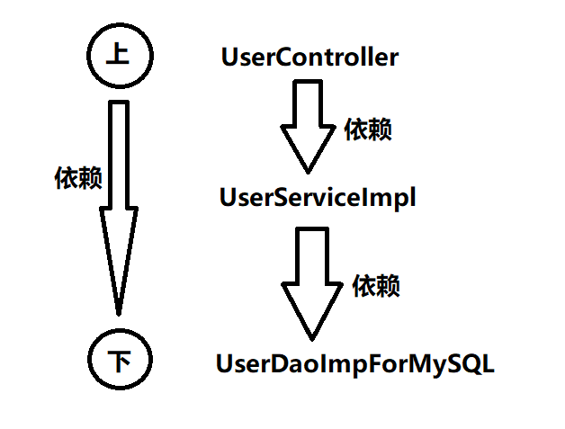  
可以很明显的看出，**上层**是依赖**下层**的。UserController依赖UserServiceImpl，而UserServiceImpl依赖UserDaoImplForMySQL，这样就会导致**下面只要改动**，**上面必然会受牵连（跟着也会改）**，所谓牵一发而动全身。这样也就同时违背了另一个开发原则：**依赖倒置原则**。

## 1.2 DIP依赖倒置原则

依赖倒置原则(Dependence Inversion Principle)，简称**DIP**

**什么是依赖倒置原则？**

面向接口编程，面向抽象编程，不要面向具体编程

**依赖倒置的原则的目的？**

降低耦合度，提高扩展力

**什么叫做符合依赖倒置？**

上 不依赖 下，就是符合

**什么叫违背依赖倒置？**

上 依赖 下，就是违背

只要“下”一改动，“上”就受到牵连  
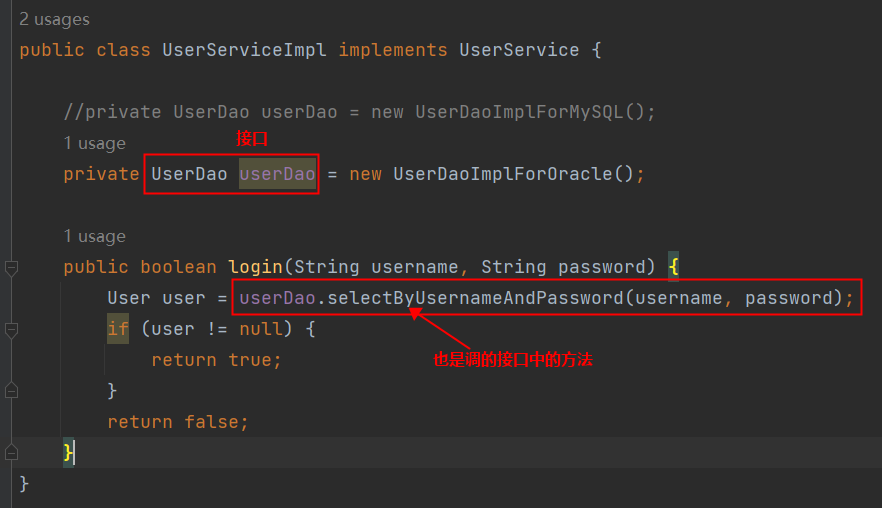  
确实已经面向接口编程了，但对象的创建是：new UserDaoImplForOracle()显然并没有完全面向接口编程，还是使用到了具体的接口实现类。什么叫做完全面向接口编程？什么叫做完全符合依赖倒置原则呢？请看以下代码：  
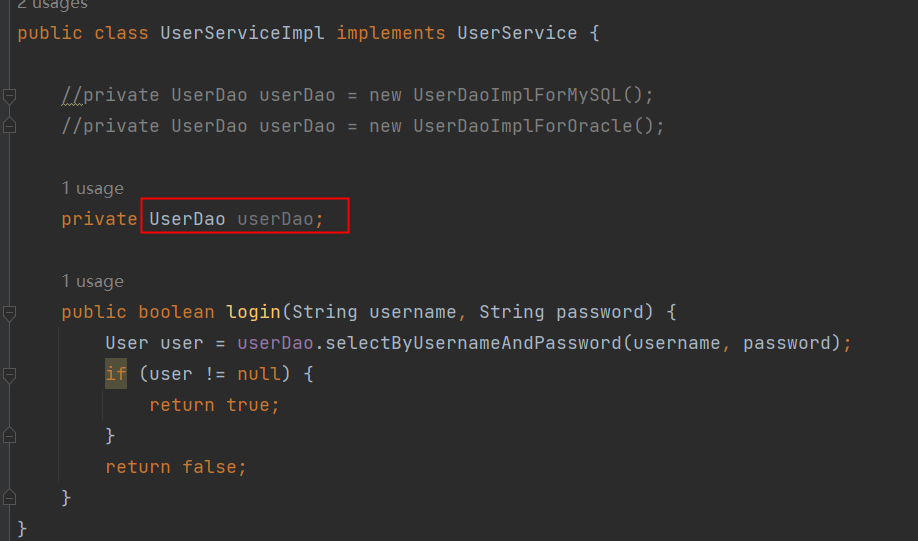  
如果代码是这样编写的，才算是完全面向接口编程，才符合依赖倒置原则。那你可能会问，这样userDao是null，在执行的时候就会出现空指针异常呀。你说的有道理，确实是这样的，所以我们要解决这个问题。解决空指针异常的问题，其实就是解决两个核心的问题：

- 第一个问题：谁来负责对象的创建。【也就是说谁来：**new** UserDaoImplForOracle()/**new** UserDaoImplForMySQL()】
- 第二个问题：谁来负责把创建的对象赋到这个属性上。【也就是说谁来把上面创建的对象赋给userDao属性】

如果我们把以上两个核心问题解决了，就可以做到既符合OCP开闭原则，又符合依赖倒置原则。  
很荣幸的通知你：Spring框架可以做到。  
在Spring框架中，它可以帮助我们new对象，并且它还可以将new出来的对象赋到属性上。换句话说，Spring框架可以帮助我们创建对象，并且可以帮助我们维护对象和对象之间的关系。比如：  
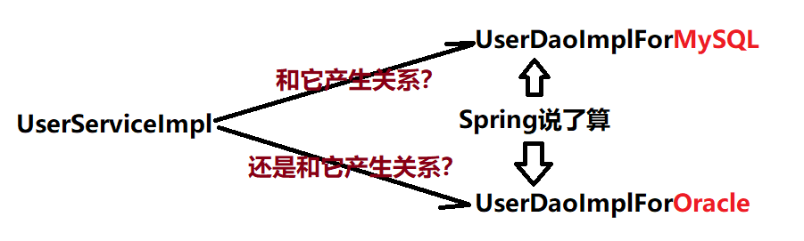  
Spring可以new出来UserDaoImplForMySQL对象，也可以new出来UserDaoImplForOracle对象，并且还可以让new出来的dao对象和service对象产生关系（产生关系其实本质上就是**给属性赋值**）。  
很显然，这种方式是将对象的创建权/管理权交出去了，不再使用硬编码的方式了。同时也把对象关系的管理权交出去了，也不再使用硬编码的方式了。像这种把对象的创建权交出去，把对象关系的管理权交出去，被称为**控制反转**。

## 1.3 控制反转IoC

**控制反转**（**I**nversion **o**f **C**ontrol，缩写为**IoC**），是面向对象编程中的一种设计思想，可以用来降低代码之间的耦合度，符合**依赖倒置原则**。

使用对象时，由主动 new 产生对象转换为由**外部**提供对象，此过程中对象创建控制权由程序转移到**外部**，此思想称为控制反转。  
控制反转的核心：**将对象的创建权交出去，将对象和对象之间关系的管理权交出去，由第三方容器来负责创建与维护**。

IoC可以认为是一种**全新的设计模式**，但是理论和时间成熟相对较晚，并没有包含在GoF中。（GoF指的是23种设计模式）

**反转是什么呢？**

反转的两件事：

第一件事：我不在程序中采用硬编码的方式来 new 对象。（new 对象我不管了，new 对象的权利交出去）

第二件事：我不在程序中采用硬编码的方式来维护对象的关系了。（对象之间关系的维护权，我也不管了，交出去）

**Spring框架就是一个实现了IoC思想的容器。**

Spring 框架可以帮你 new 对象

Sprin 框架可以帮你维护对象和对象之间的关系

控制反转是一种编程思想，而依赖注入是这种思想的具体实现  
控制反转常见的实现方式：**依赖注入（**Dependency Injection，简称DI）

**”依赖“是什么意思？”注入“又是什么意思？**

依赖：A 对象和 B 对象的关系

注入：是一种手段，通过这种手段，可以让 A 对象和 B 对象产生关系

依赖注入：对象 A 和对象 B 之间的关系，通过注入的手段来维护  
通常，依赖注入的实现又包括两种方式：

- **set方法注入**
- **构造方法注入**

术语：

**OCP**：开闭原则（开发原则）

**DIP**：依赖倒置原则（开发原则）

**IoC**：控制反转（一种思想，一种新型的设计模式）

**DI**：依赖注入（控制反转思想的具体实现方式）

# 二、Spring概述

## 2.1 Spring简介

  
来自百度百科

Spring是一个开源框架，它由Rod Johnson创建。它是为了解决企业应用开发的复杂性而创建的。  
从简单性、可测试性和松耦合的角度而言，任何Java应用都可以从Spring中受益。  
**Spring是一个轻量级的控制反转(IoC)和面向切面(AOP)的容器框架。**  
**Spring最初的出现是为了解决EJB臃肿的设计，以及难以测试等问题。**  
**Spring为简化开发而生，让程序员只需关注核心业务的实现，尽可能的不再关注非业务逻辑代码（事务控制，安全日志等）。**

## 2.2 Spring8大模块

注意：Spring5版本之后是8个模块。在Spring5中新增了WebFlux模块。  
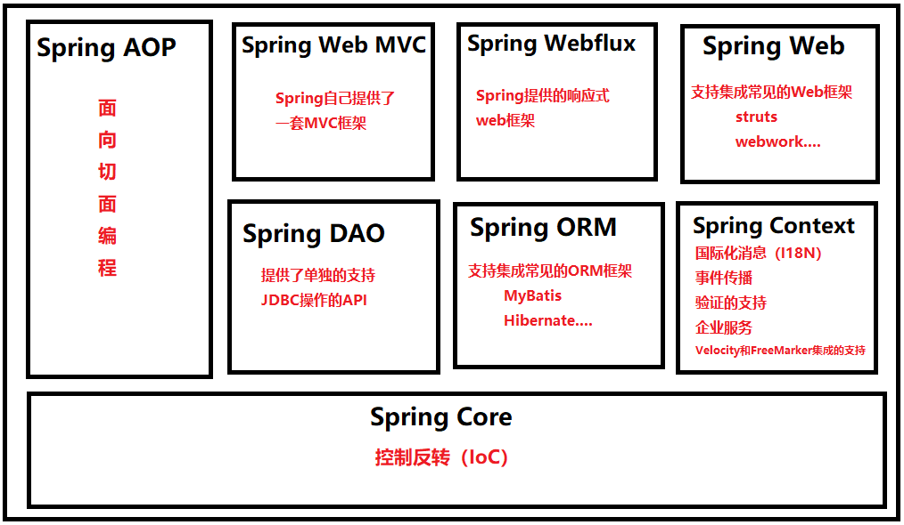

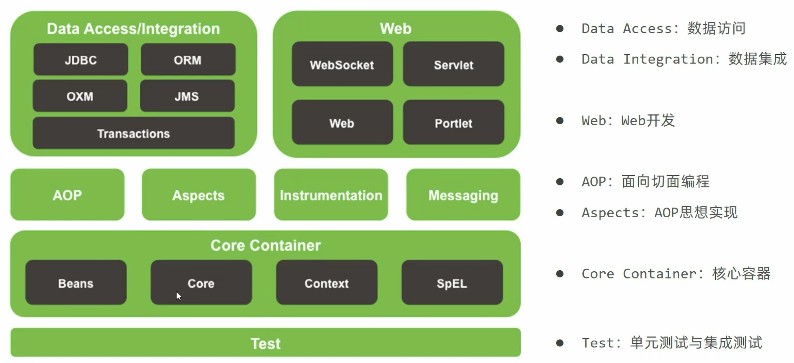

1. **Spring Core模块**

这是Spring框架最基础的部分，它提供了**依赖注入（DependencyInjection）**特征来实现容器对**Bean**的管理。核心容器的主要组件是 **BeanFactory**，BeanFactory是工厂模式的一个实现，是任何Spring应用的核心。它使用IoC将应用配置和依赖从实际的应用代码中分离出来。

2. **Spring Context模块**

如果说核心模块中的BeanFactory使Spring成为容器的话，那么上下文模块就是Spring成为框架的原因。  
这个模块扩展了BeanFactory，增加了对国际化（I18N）消息、事件传播、验证的支持。另外提供了许多企业服务，例如电子邮件、JNDI访问、EJB集成、远程以及时序调度（scheduling）服务。也包括了对模版框架例如Velocity和FreeMarker集成的支持

3. **Spring AOP模块**

Spring在它的AOP模块中提供了对**面向切面编程**的丰富支持，Spring AOP 模块为基于 Spring 的应用程序中的对象提供了事务管理服务。通过使用 Spring AOP，不用依赖组件，就可以将声明性事务管理集成到应用程序中，可以自定义拦截器、切点、日志等操作。

4. **Spring DAO模块**

提供了一个JDBC的抽象层和异常层次结构，消除了烦琐的JDBC编码和数据库厂商特有的错误代码解析，用于简化JDBC。

5. **Spring ORM模块**

Spring提供了ORM模块。Spring并不试图实现它自己的ORM解决方案，而是为几种流行的ORM框架提供了集成方案，包括Hibernate、JDO和iBATIS SQL映射，这些都遵从 Spring 的通用事务和 DAO 异常层次结构。

6. **Spring Web MVC模块**

Spring为构建Web应用提供了一个功能全面的MVC框架。虽然Spring可以很容易地与其它MVC框架集成，例如Struts，但Spring的MVC框架使用IoC对控制逻辑和业务对象提供了完全的分离。

7. **Spring WebFlux模块**

Spring Framework 中包含的原始 Web 框架 Spring Web MVC 是专门为 Servlet API 和 Servlet 容器构建的。反应式堆栈 Web 框架 Spring WebFlux 是在 5.0 版的后期添加的。它是完全非阻塞的，支持反应式流(Reactive Stream)背压，并在Netty，Undertow和Servlet 3.1+容器等服务器上运行。  
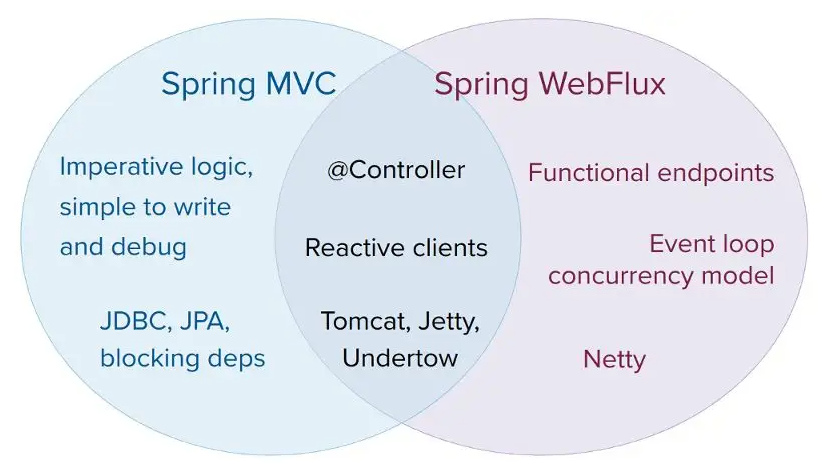

8. **Spring Web模块**

Web 上下文模块建立在应用程序上下文模块之上，为基于 Web 的应用程序提供了上下文，提供了Spring和其它Web框架的集成，比如Struts、WebWork。还提供了一些面向服务支持，例如：实现文件上传的multipart请求。

---

## 2.3 Spring特点

1. **轻量**

2. 从大小与开销两方面而言Spring都是轻量的。完整的Spring框架可以在一个大小只有1MB多的JAR文件里发布。并且Spring所需的处理开销也是微不足道的。
3. Spring是非侵入式的：Spring应用中的对象不依赖于Spring的特定类。

4. **控制反转**

5. Spring通过一种称作控制反转（IoC）的技术促进了**松耦合**。当应用了IoC，一个对象依赖的其它对象会通过被动的方式传递进来，而不是这个对象自己创建或者查找依赖对象。你可以认为IoC与JNDI相反——不是对象从容器中查找依赖，而是容器在对象初始化时不等对象请求就主动将依赖传递给它。

6. **面向切面**

7. Spring提供了面向切面编程的丰富支持，允许通过分离应用的业务逻辑与系统级服务（例如审计（auditing）和事务（transaction）管理）进行内聚性的开发。应用对象只实现它们应该做的——完成业务逻辑——仅此而已。它们并不负责（甚至是意识）其它的系统级关注点，例如日志或事务支持。

8. **容器**

9. Spring包含并管理应用对象的配置和生命周期，在这个意义上它是一种容器，你可以配置你的每个bean如何被创建——基于一个可配置原型（prototype），你的bean可以创建一个单独的实例或者每次需要时都生成一个新的实例——以及它们是如何相互关联的。然而，Spring不应该被混同于传统的重量级的EJB容器，它们经常是庞大与笨重的，难以使用。

10. **框架**

11. Spring可以将简单的组件配置、组合成为复杂的应用。在Spring中，应用对象被声明式地组合，典型地是在一个XML文件里。Spring也提供了很多基础功能（事务管理、持久化框架集成等等），将应用逻辑的开发留给了你。

所有Spring的这些特征使你能够编写更干净、更可管理、并且更易于测试的代码。它们也为Spring中的各种模块提供了基础支持。

---

# 三、Spring的入门程序

## 3.1 Spring的下载

官网地址：[https://spring.io/](https://spring.io/)  
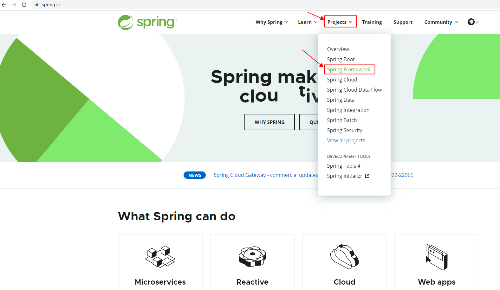  
官网地址（中文）：[http://spring.p2hp.com/](http://spring.p2hp.com/)  
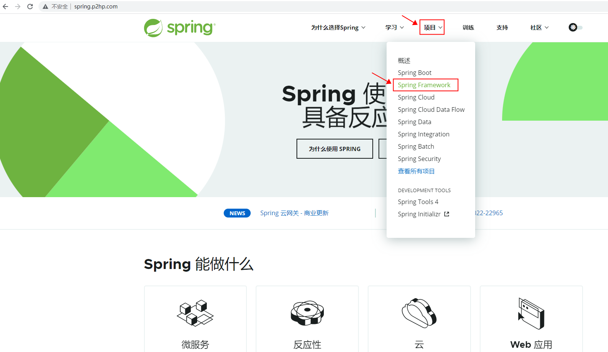  
打开Spring官网后，可以看到Spring Framework，以及通过Spring Framework衍生的其它框架：  
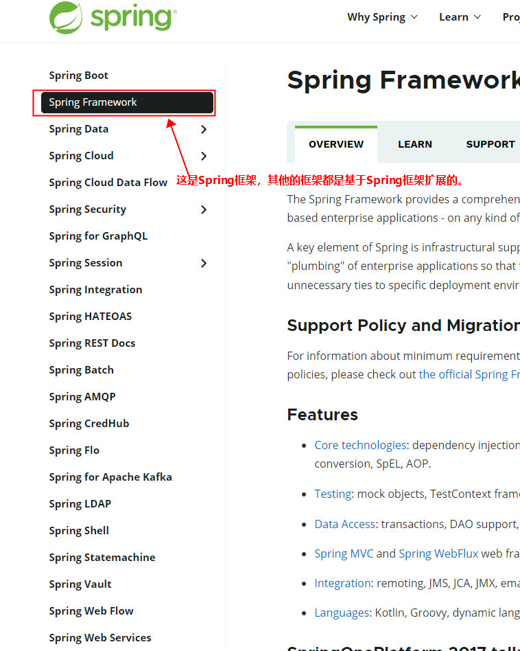  
我们即将要学习的就是Spring Framework。  
怎么下载呢？

- 第一步：进入github

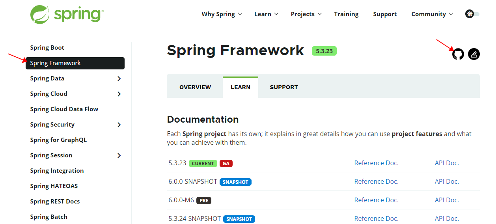

- 第二步：找到下图位置，点击超链接

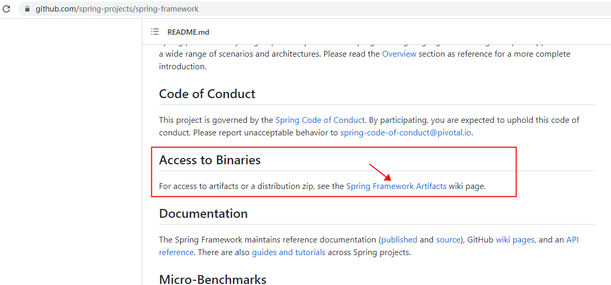

- 第三步：找到下图位置，点击超链接

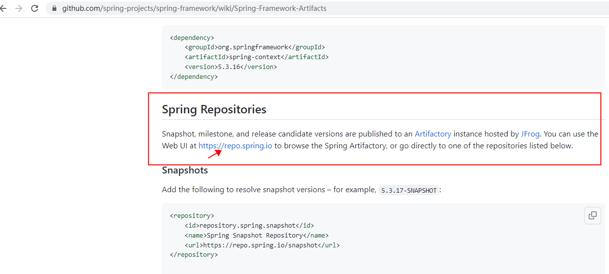

- 第四步：按照下图步骤操作

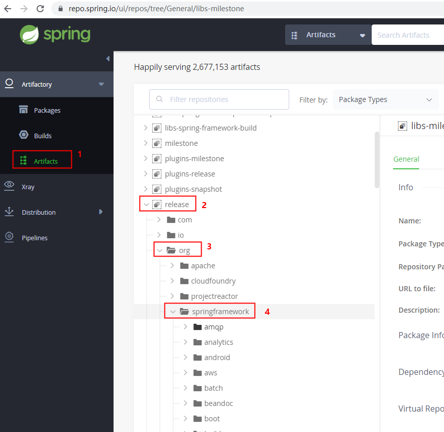

- 第五步：继续在springframework目录下找下图的spring，点开之后你会看到很多不同的版本

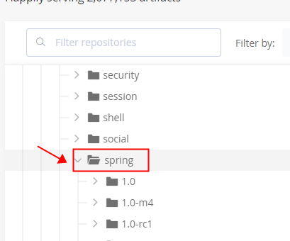

- 第六步：选择对应的版本

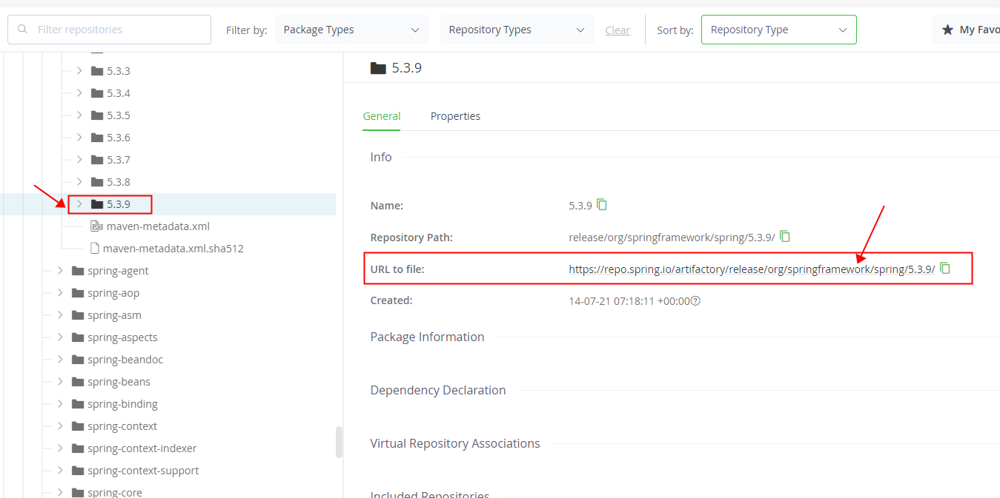

- 第七步：点击上图的url

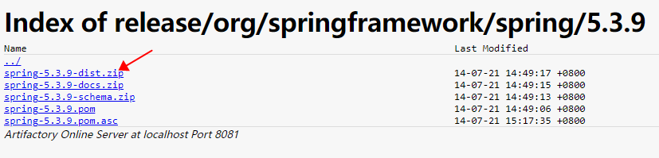  
点击spring-5.3.9-dist.zip下载spring框架。  
将下载的zip包解压：  
  
docs：spring框架的API帮助文档  
libs：spring框架的jar文件（**用spring框架就是用这些jar包**）  
schema：spring框架的XML配置文件相关的约束文件

## 3.2 Spring的jar文件

打开libs目录，会看到很多jar包：  
  
spring-core-5.3.9.jar：字节码（**这个是支撑程序运行的jar包**）  
spring-core-5.3.9-javadoc.jar：代码中的注释  
spring-core-5.3.9-sources.jar：源码  
我们来看一下spring框架都有哪些jar包：  
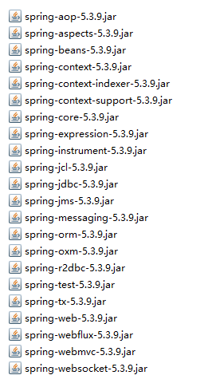

|   |   |
|---|---|
|**JAR文件**|**描述**|
|spring-aop-5.3.9.jar|**这个jar 文件包含在应用中使用Spring 的AOP 特性时所需的类**|
|spring-aspects-5.3.9.jar|**提供对AspectJ的支持，以便可以方便的将面向切面的功能集成进IDE中**|
|spring-beans-5.3.9.jar|**这个jar 文件是所有应用都要用到的，它包含访问配置文件、创建和管理bean 以及进行Inversion ofControl / Dependency Injection（IoC/DI）操作相关的所有类。如果应用只需基本的IoC/DI 支持，引入spring-core.jar 及spring-beans.jar 文件就可以了。**|
|spring-context-5.3.9.jar|**这个jar 文件为Spring 核心提供了大量扩展。可以找到使用Spring ApplicationContext特性时所需的全部类，JDNI 所需的全部类，instrumentation组件以及校验Validation 方面的相关类。**|
|spring-context-indexer-5.3.9.jar|虽然类路径扫描非常快，但是Spring内部存在大量的类，添加此依赖，可以通过在编译时创建候选对象的静态列表来提高大型应用程序的启动性能。|
|spring-context-support-5.3.9.jar|用来提供Spring上下文的一些扩展模块,例如实现邮件服务、视图解析、缓存、定时任务调度等|
|spring-core-5.3.9.jar|**Spring 框架基本的核心工具类。Spring 其它组件要都要使用到这个包里的类，是其它组件的基本核心，当然你也可以在自己的应用系统中使用这些工具类。**|
|spring-expression-5.3.9.jar|Spring表达式语言。|
|spring-instrument-5.3.9.jar|Spring3.0对服务器的代理接口。|
|spring-jcl-5.3.9.jar|Spring的日志模块。JCL，全称为"Jakarta Commons Logging"，也可称为"Apache Commons Logging"。|
|spring-jdbc-5.3.9.jar|**Spring对JDBC的支持。**|
|spring-jms-5.3.9.jar|这个jar包提供了对JMS 1.0.2/1.1的支持类。JMS是Java消息服务。属于JavaEE规范之一。|
|spring-messaging-5.3.9.jar|为集成messaging api和消息协议提供支持|
|spring-orm-5.3.9.jar|**Spring集成ORM框架的支持，比如集成hibernate，mybatis等。**|
|spring-oxm-5.3.9.jar|为主流O/X Mapping组件提供了统一层抽象和封装，OXM是Object Xml Mapping。对象和XML之间的相互转换。|
|spring-r2dbc-5.3.9.jar|Reactive Relational Database Connectivity (关系型数据库的响应式连接) 的缩写。这个jar文件是Spring对r2dbc的支持。|
|spring-test-5.3.9.jar|对Junit等测试框架的简单封装。|
|spring-tx-5.3.9.jar|**为JDBC、Hibernate、JDO、JPA、Beans等提供的一致的声明式和编程式事务管理支持。**|
|spring-web-5.3.9.jar|**Spring集成MVC框架的支持，比如集成Struts等。**|
|spring-webflux-5.3.9.jar|**WebFlux是 Spring5 添加的新模块，用于 web 的开发，功能和 SpringMVC 类似的，Webflux 使用当前一种比较流程响应式编程出现的框架。**|
|spring-webmvc-5.3.9.jar|**SpringMVC框架的类库**|
|spring-websocket-5.3.9.jar|Spring集成WebSocket框架时使用|

**注意：**  
**如果你只是想用Spring的****IoC****功能，仅需要引入：****spring-context****即可。将这个jar包添加到classpath当中。**  
**如果采用maven只需要引入context的依赖即可。**

```
<!--Spring6的正式版发布之前，这个仓库地址是需要的-->
<repositories>
  <repository>
    <id>repository.spring.milestone</id>
    <name>Spring Milestone Repository</name>
    <url>https://repo.spring.io/milestone</url>
  </repository>
</repositories>

<dependencies>
  <!--spring context依赖：使用的是6.0.0-M2里程碑版-->
  <dependency>
    <groupId>org.springframework</groupId>
    <artifactId>spring-context</artifactId>
    <version>6.0.0-M2</version>
  </dependency>
  
</dependencies>
```

## 3.3 第一个Spring程序

**前期准备**：

- 打开IDEA创建Empty Project：spring6

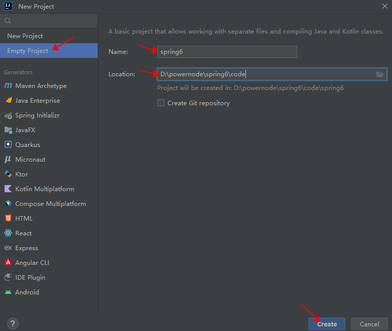

- 设置JDK版本17，编译器版本17

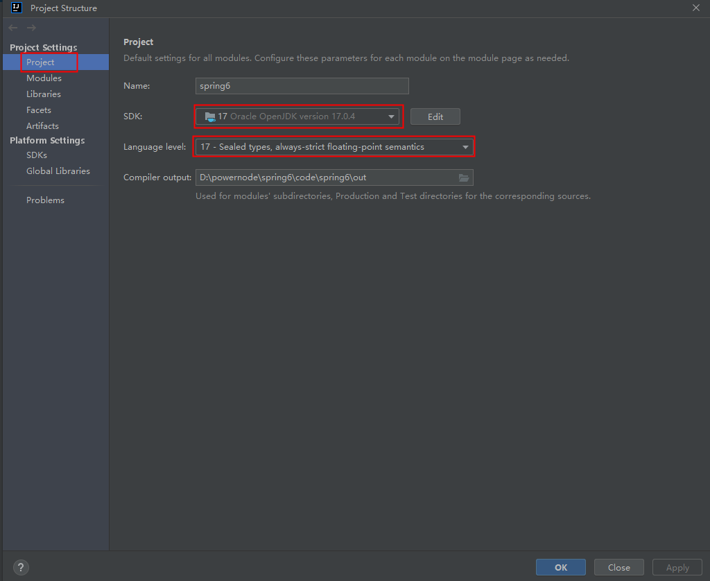

- 设置IDEA的Maven：关联自己的maven

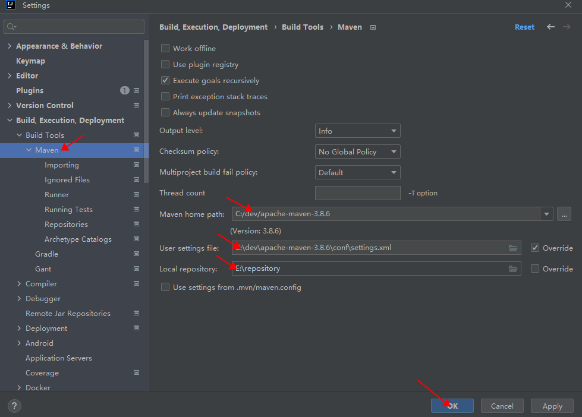

- 在空的工程spring6中创建第一个模块：spring6-001-first

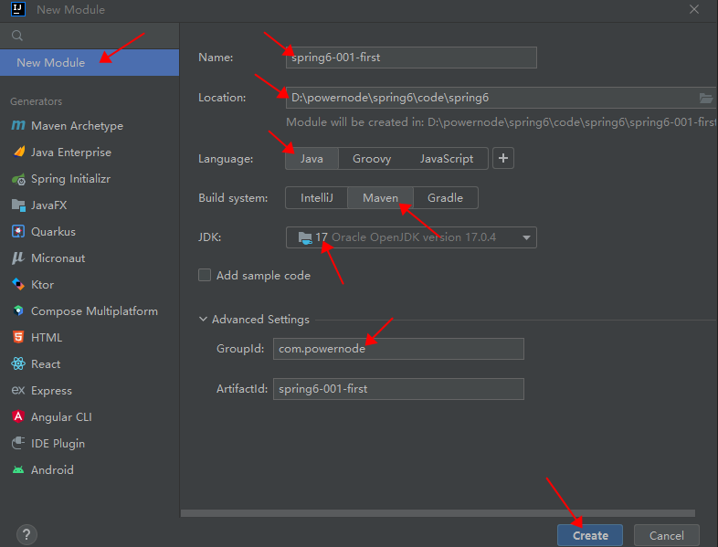  
**第一步：添加spring context的依赖，pom.xml配置如下**

```
<?xml version="1.0" encoding="UTF-8"?>
<project xmlns="http://maven.apache.org/POM/4.0.0"
         xmlns:xsi="http://www.w3.org/2001/XMLSchema-instance"
         xsi:schemaLocation="http://maven.apache.org/POM/4.0.0 http://maven.apache.org/xsd/maven-4.0.0.xsd">
    <modelVersion>4.0.0</modelVersion>
    <groupId>com.powernode</groupId>
    <artifactId>spring6-001-first</artifactId>
    <version>1.0-SNAPSHOT</version>
    <packaging>jar</packaging>
    <repositories>
        <repository>
            <id>repository.spring.milestone</id>
            <name>Spring Milestone Repository</name>
            <url>https://repo.spring.io/milestone</url>
        </repository>
    </repositories>
  
    <dependencies>
      
        <!--spring context依赖-->
        <dependency>
            <groupId>org.springframework</groupId>
            <artifactId>spring-context</artifactId>
            <version>6.0.0-M2</version>
        </dependency>
      
    </dependencies>
  
    <properties>
        <maven.compiler.source>17</maven.compiler.source>
        <maven.compiler.target>17</maven.compiler.target>
    </properties>
</project>
```

**注意：打包方式jar。**  
当加入spring context的依赖之后，会关联引入其他依赖：  
spring aop：面向切面编程  
spring beans：IoC核心  
spring core：spring的核心工具包  
spring jcl：spring的日志包  
spring expression：spring表达式  
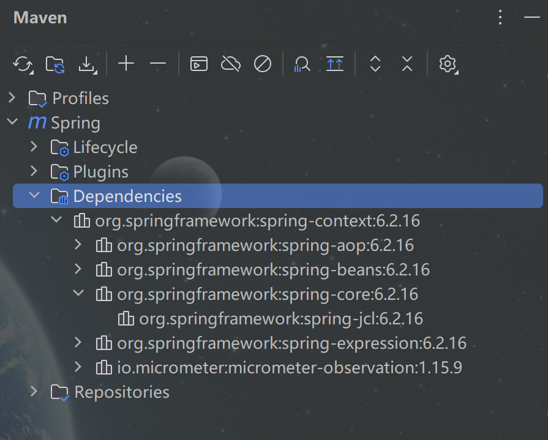  
**第二步：添加junit依赖**

```
<?xml version="1.0" encoding="UTF-8"?>
<project xmlns="http://maven.apache.org/POM/4.0.0"
         xmlns:xsi="http://www.w3.org/2001/XMLSchema-instance"
         xsi:schemaLocation="http://maven.apache.org/POM/4.0.0 http://maven.apache.org/xsd/maven-4.0.0.xsd">
    <modelVersion>4.0.0</modelVersion>
    <groupId>com.powernode</groupId>
    <artifactId>spring6-001-first</artifactId>
    <version>1.0-SNAPSHOT</version>
    <packaging>jar</packaging>
    <repositories>
        <repository>
            <id>repository.spring.milestone</id>
            <name>Spring Milestone Repository</name>
            <url>https://repo.spring.io/milestone</url>
        </repository>
    </repositories>
  
    <dependencies>
        <!--spring context依赖-->
        <dependency>
            <groupId>org.springframework</groupId>
            <artifactId>spring-context</artifactId>
            <version>6.0.0-M2</version>
        </dependency>
        <!--junit-->
        <dependency>
            <groupId>junit</groupId>
            <artifactId>junit</artifactId>
            <version>4.13.2</version>
            <scope>test</scope>
        </dependency>
    </dependencies>
  
    <properties>
        <maven.compiler.source>17</maven.compiler.source>
        <maven.compiler.target>17</maven.compiler.target>
    </properties>
</project>
```

**第三步：定义bean：User**

```
package com.powernode.spring6.bean;

/**
 * bean，封装用户信息。
 */
public class User {
}
```

**第四步：编写spring的配置文件：****beans.xml****。该文件放在类的根路径下。**  
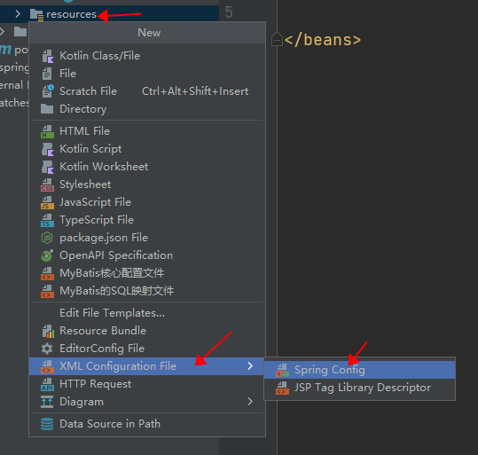  
上图是使用IDEA工具自带的spring配置文件的模板进行创建。  
配置文件中进行bean的配置。

```
<?xml version="1.0" encoding="UTF-8"?>
<beans xmlns="http://www.springframework.org/schema/beans"
       xmlns:xsi="http://www.w3.org/2001/XMLSchema-instance"
       xsi:schemaLocation="http://www.springframework.org/schema/beans http://www.springframework.org/schema/beans/spring-beans.xsd">
    
    <bean id="userBean" class="com.powernode.spring6.bean.User"/>
  
</beans>
```

bean的id和class属性：

- **id属性：代表对象的唯一标识。可以看做一个人的身份证号。**
- **class属性：用来指定要创建的java对象的全限定类名（带包名）。**

**第五步：编写测试程序**

```
package com.powernode.spring6.test;

import org.junit.Test;
import org.springframework.context.ApplicationContext;
import org.springframework.context.support.ClassPathXmlApplicationContext;

public class Spring6Test {

    @Test
    public void testFirst(){
        // 初始化Spring容器上下文（解析beans.xml文件，创建所有的bean对象）
        ApplicationContext applicationContext = new ClassPathXmlApplicationContext("beans.xml");
        // 根据id获取bean对象
        Object userBean = applicationContext.getBean("userBean");
        System.out.println(userBean);
    }
}
```

**第七步：运行测试程序**  
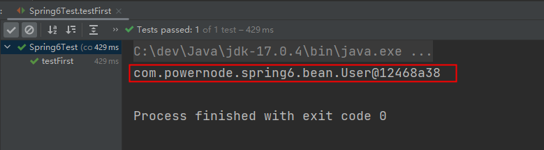  
  

## 3.4 第一个Spring程序详细剖析

```
<bean id="userBean" class="com.powernode.spring6.bean.User"/>
```

```
ApplicationContext applicationContext = new ClassPathXmlApplicationContext("beans.xml");
Object userBean = applicationContext.getBean("userBean");
```

1. **bean标签的id属性可以重复吗？**

```
package com.powernode.spring6.bean;

public class Vip {
}
```

```
<?xml version="1.0" encoding="UTF-8"?>
<beans xmlns="http://www.springframework.org/schema/beans"
       xmlns:xsi="http://www.w3.org/2001/XMLSchema-instance"
       xsi:schemaLocation="http://www.springframework.org/schema/beans http://www.springframework.org/schema/beans/spring-beans.xsd">

    <bean id="userBean" class="com.powernode.spring6.bean.User"/>
    <bean id="userBean" class="com.powernode.spring6.bean.Vip"/>
  
</beans>
```

运行测试程序：  
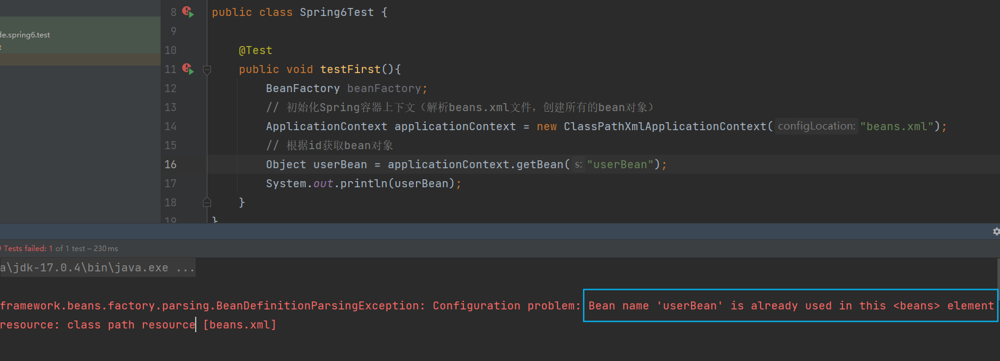  
**通过测试得出：在spring的配置文件中id是不能重名。**

2. **底层是怎么创建对象的，是通过反射机制调用无参数构造方法吗？**

```
package com.powernode.spring6.bean;
/**
 * bean，封装用户信息。
 */
public class User {
    
    public User() {
        System.out.println("User的无参数构造方法执行");
    }
}
```

在User类中添加无参数构造方法，如上。  
运行测试程序：  
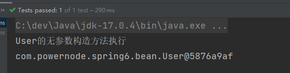  
**通过测试得知：创建对象时确实调用了无参数构造方法。**  
如果提供一个有参数构造方法，不提供无参数构造方法会怎样呢？

```
package com.powernode.spring6.bean;
/**
 * bean，封装用户信息。
 */
public class User {
    /*public User() {
        System.out.println("User的无参数构造方法执行");
    }*/

    public User(String name){
        System.out.println("User的有参数构造方法执行");
    }
}
```

运行测试程序：  
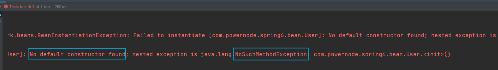  
**通过测试得知：spring是通过调用类的无参数构造方法来创建对象的，所以要想让spring给你创建对象，必须保证无参数构造方法是存在的。**  
Spring是如何创建对象的呢？原理是什么？

```
// dom4j解析beans.xml文件，从中获取class的全限定类名
// 通过反射机制调用无参数构造方法创建对象
Class clazz = Class.forName("com.powernode.spring6.bean.User");
Object obj = clazz.newInstance();
```

3. **把创建好的对象存储到一个什么样的数据结构当中了呢？**

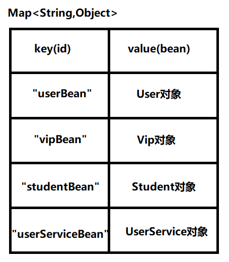

4. **spring配置文件的名字必须叫做beans.xml吗？**

```
ApplicationContext applicationContext = new ClassPathXmlApplicationContext("beans.xml");
```

通过以上的java代码可以看出，这个spring配置文件名字是我们负责提供的，显然spring配置文件的名字是随意的。

5. **像这样的beans.xml文件可以有多个吗？**

再创建一个spring配置文件，起名：spring.xml

```
<?xml version="1.0" encoding="UTF-8"?>
<beans xmlns="http://www.springframework.org/schema/beans"
       xmlns:xsi="http://www.w3.org/2001/XMLSchema-instance"
       xsi:schemaLocation="http://www.springframework.org/schema/beans http://www.springframework.org/schema/beans/spring-beans.xsd">
    
  <bean id="vipBean" class="com.powernode.spring6.bean.Vip"/>
  
</beans>
```

```
package com.powernode.spring6.test;

import org.junit.Test;
import org.springframework.context.ApplicationContext;
import org.springframework.context.support.ClassPathXmlApplicationContext;

public class Spring6Test {

    @Test
    public void testFirst(){
        // 初始化Spring容器上下文（解析beans.xml文件，创建所有的bean对象）
        ApplicationContext applicationContext = new ClassPathXmlApplicationContext("beans.xml","spring.xml");

        // 根据id获取bean对象
        Object userBean = applicationContext.getBean("userBean");
        Object vipBean = applicationContext.getBean("vipBean");

        System.out.println(userBean);
        System.out.println(vipBean);
    }
}
```

运行测试程序：  
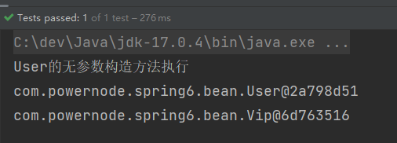  
通过测试得知，spring的配置文件可以有多个，在**ClassPathXmlApplicationContext**构造方法的参数上传递文件路径即可。这是为什么呢？通过源码可以看到：  
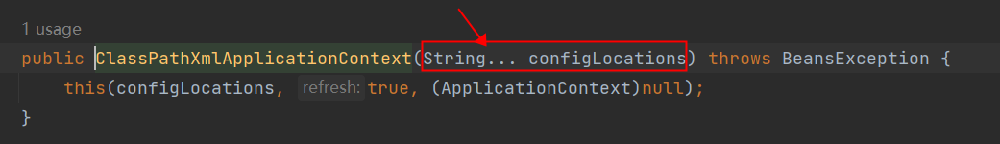

6. **在配置文件中配置的类必须是自定义的吗，可以使用JDK中的类吗，例如：java.util.Date？**

```
<?xml version="1.0" encoding="UTF-8"?>
<beans xmlns="http://www.springframework.org/schema/beans"
       xmlns:xsi="http://www.w3.org/2001/XMLSchema-instance"
       xsi:schemaLocation="http://www.springframework.org/schema/beans http://www.springframework.org/schema/beans/spring-beans.xsd">

    <bean id="userBean" class="com.powernode.spring6.bean.User"/>
    <!--<bean id="userBean" class="com.powernode.spring6.bean.Vip"/>-->

    <bean id="dateBean" class="java.util.Date"/>
</beans>
```

```
package com.powernode.spring6.test;

import org.junit.Test;
import org.springframework.context.ApplicationContext;
import org.springframework.context.support.ClassPathXmlApplicationContext;

public class Spring6Test {

    @Test
    public void testFirst(){
        // 初始化Spring容器上下文（解析beans.xml文件，创建所有的bean对象）
        ApplicationContext applicationContext = new ClassPathXmlApplicationContext("beans.xml","spring.xml");

        // 根据id获取bean对象
        Object userBean = applicationContext.getBean("userBean");
        Object vipBean = applicationContext.getBean("vipBean");
        Object dateBean = applicationContext.getBean("dateBean");

        System.out.println(userBean);
        System.out.println(vipBean);
        System.out.println(dateBean);
    }
}
```

运行测试程序：  
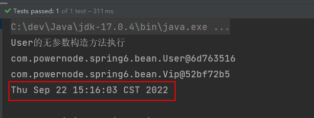  
通过测试得知，在spring配置文件中配置的bean可以任意类，只要这个类不是抽象的，并且提供了无参数构造方法。

---

7. **getBean()方法调用时，如果指定的id不存在会怎样？**

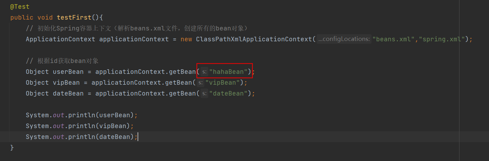  
运行测试程序：  
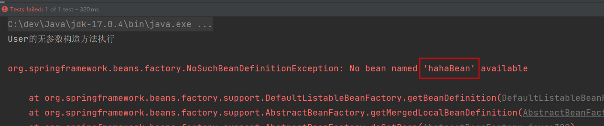  
通过测试得知，当id不存在的时候，会出现异常。

---

8. **getBean()方法返回的类型是Object，如果访问子类的特有属性和方法时，还需要向下转型，有其它办法可以解决这个问题吗？**

```
User user = applicationContext.getBean("userBean", User.class);
```

---

9. **ClassPathXmlApplicationContext是从类路径中加载配置文件，如果没有在类路径当中，又应该如何加载配置文件呢？**

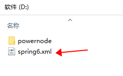

```
<?xml version="1.0" encoding="UTF-8"?>
<beans xmlns="http://www.springframework.org/schema/beans"
       xmlns:xsi="http://www.w3.org/2001/XMLSchema-instance"
       xsi:schemaLocation="http://www.springframework.org/schema/beans http://www.springframework.org/schema/beans/spring-beans.xsd">
    
  <bean id="vipBean2" class="com.powernode.spring6.bean.Vip"/>
  
</beans>
```

```
ApplicationContext applicationContext2 = new FileSystemXmlApplicationContext("d:/spring6.xml");
Vip vip = applicationContext2.getBean("vipBean2", Vip.class);
System.out.println(vip);
```

没有在类路径中的话，需要使用**FileSystemXmlApplicationContext**类进行加载配置文件。  
这种方式较少用。一般都是将配置文件放到类路径当中，这样可移植性更强。

---

10. **ApplicationContext的超级父接口BeanFactory。**

Spring 底层的 IoC 是怎么实现的：**XML 解析 + 工厂模式 + 反射机制**

```
BeanFactory beanFactory = new ClassPathXmlApplicationContext("spring.xml");
Object vipBean = beanFactory.getBean("vipBean");
System.out.println(vipBean);
```

**BeanFactory**是Spring容器的超级接口。**ApplicationContext**是BeanFactory的子接口。

注意不是在调用 getBean()方法的时候创建对象，执行以下代码的时候就会实例化对象

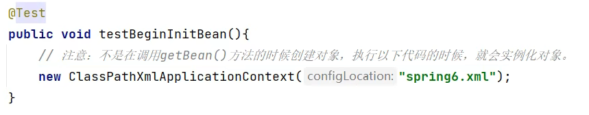

## 3.5 Spring6启用Log4j2日志框架

从Spring5之后，Spring框架支持集成的日志框架是**Log4j2**.如何启用日志框架：  
第一步：引入Log4j2的依赖

```
<!--log4j2的依赖-->
<dependency>
  <groupId>org.apache.logging.log4j</groupId>
  <artifactId>log4j-core</artifactId>
  <version>2.19.0</version>
</dependency>
<dependency>
  <groupId>org.apache.logging.log4j</groupId>
  <artifactId>log4j-slf4j2-impl</artifactId>
  <version>2.19.0</version>
</dependency>
```

第二步：在类的根路径下提供**log4j2.xml**配置文件（文件名固定为：log4j2.xml，文件必须放到类根路径下。）

level指定日志级别，从低到高的优先级：

**ALL < TRACE < DEBUG < INFO < WARN < ERROR < FATAL < OFF**

```
<?xml version="1.0" encoding="UTF-8"?>

<configuration>

    <loggers>
        <!--
            level指定日志级别，从低到高的优先级：
                ALL < TRACE < DEBUG < INFO < WARN < ERROR < FATAL < OFF
        -->
        <root level="DEBUG">
            <appender-ref ref="spring6log"/>
        </root>
    </loggers>
    <appenders>
        <!--输出日志信息到控制台-->
        <console name="spring6log" target="SYSTEM_OUT">
            <!--控制日志输出的格式-->
            <PatternLayout pattern="%d{yyyy-MM-dd HH:mm:ss SSS} [%t] %-3level %logger{1024} - %msg%n"/>
        </console>
    </appenders>
</configuration>
```

第三步：使用日志框架

```
Logger logger = LoggerFactory.getLogger(FirstSpringTest.class);
logger.info("我是一条日志消息");
```

---

# 四、Spring对IoC的实现

## 4.1 IoC 控制反转

- 控制反转是一种思想。
- 控制反转是为了降低程序耦合度，提高程序扩展力，达到OCP原则，达到DIP原则。
- 控制反转，反转的是什么？

- 将对象的创建权利交出去，交给第三方容器负责。
- 将对象和对象之间关系的维护权交出去，交给第三方容器负责。

- 控制反转这种思想如何实现呢？

- DI（Dependency Injection）：依赖注入

---

## 4.2 依赖注入

依赖注入实现了控制反转的思想。  
**Spring通过依赖注入的方式来完成Bean管理的。**  
**Bean管理说的是：Bean对象的创建，以及Bean对象中属性的赋值（或者叫做Bean对象之间关系的维护）。**  
依赖注入：

- 依赖指的是对象和对象之间的关联关系。
- 注入指的是一种数据传递行为，通过注入行为来让对象和对象产生关系。

依赖注入常见的实现方式包括两种：

- 第一种：set注入
- 第二种：构造注入

---

### 4.2.1 setter 注入

setter 注入，基于set方法实现的，底层会通过**反射机制**调用属性对应的**set方法**然后给属性赋值。这种方式要求**属性必须对外提供set方法**。

```
package com.powernode.spring6.dao;

public class UserDao {

    public void insert(){
        System.out.println("正在保存用户数据。");
    }
}
```

```
package com.powernode.spring6.service;

import com.powernode.spring6.dao.UserDao;

public class UserService {

    private UserDao userDao;

    // 使用set方式注入，必须提供set方法。
    // 反射机制要调用这个方法给属性赋值的。
    public void setUserDao(UserDao userDao) {
        this.userDao = userDao;
    }

    public void save(){
        userDao.insert();
    }
}
```

```
<?xml version="1.0" encoding="UTF-8"?>
<beans xmlns="http://www.springframework.org/schema/beans"
       xmlns:xsi="http://www.w3.org/2001/XMLSchema-instance"
       xsi:schemaLocation="http://www.springframework.org/schema/beans http://www.springframework.org/schema/beans/spring-beans.xsd">

    <bean id="userDaoBean" class="com.powernode.spring6.dao.UserDao"/>

    <bean id="userServiceBean" class="com.powernode.spring6.service.UserService">
        <property name="userDao" ref="userDaoBean"/>
    </bean>
  
</beans>
```

---

🔹 第一步：创建 `UserDao` 实例（`userDaoBean`）

```
<bean id="userDaoBean" class="edu.cqie.spring6.dao.UserDao"/>
```

- 这行代码告诉 Spring 容器：

“请帮我创建一个 `UserDao` 类的实例，并把它注册到容器中，ID 是 `userDaoBean`。”

- 后续其他 Bean 可以通过 `ref="userDaoBean"` 引用它。

❗️ 如果没有这行，Spring 就不知道 `UserDao` 是什么，也无法注入给 `UserService`。

---

🔹 第二步：创建 `UserService` 并注入 `UserDao`

```
<bean id="userServiceBean" class="edu.cqie.spring6.service.UserService">
    <property name="userDao" ref="userDaoBean"/>
</bean>
```

- 这行代码表示：

“创建一个 `UserService` 实例，并将之前定义的 `userDaoBean` 注入到它的 `userDao` 字段中。”

- 具体是如何注入的？

- `UserService` 中有 `private UserDao userDao;`
- 提供了 `setUserDao(UserDao userDao)` 方法（setter 方法）
- Spring 会自动调用这个 setter 方法，把 `userDaoBean` 实例传进去

这就是所谓的 **基于 setter 方法的依赖注入（DI）。**

---

**结论**

**必须在** `**beans.xml**` **中先定义** `**userDaoBean**`**，才能在** `**userServiceBean**` **中引用它进行依赖注入。**

这是 Spring IoC 容器工作的基础机制：**先创建依赖对象，再注入到需要它的对象中。**

---

```
package com.powernode.spring6.test;

import com.powernode.spring6.service.UserService;
import org.junit.Test;
import org.springframework.context.ApplicationContext;
import org.springframework.context.support.ClassPathXmlApplicationContext;

public class DITest {

    @Test
    public void testSetDI(){
        ApplicationContext applicationContext = new ClassPathXmlApplicationContext("spring.xml");
        UserService userService = applicationContext.getBean("userServiceBean", UserService.class);
        userService.save();
    }
}
```

  
重点内容是，什么原理：

```
<?xml version="1.0" encoding="UTF-8"?>
<beans xmlns="http://www.springframework.org/schema/beans"
       xmlns:xsi="http://www.w3.org/2001/XMLSchema-instance"
       xsi:schemaLocation="http://www.springframework.org/schema/beans http://www.springframework.org/schema/beans/spring-beans.xsd">

    <bean id="userDaoBean" class="com.powernode.spring6.dao.UserDao"/>

    <bean id="userServiceBean" class="com.powernode.spring6.service.UserService">
        <property name="userDao" ref="userDaoBean"/>
    </bean>
</beans>
```

实现原理：  
通过**property**标签获取到属性名：userDao  
通过属性名推断出set方法名：setUserDao  
通过反射机制调用setUserDao()方法给属性赋值  
property标签的**name**是属性名。  
property标签的**ref**是要注入的bean对象的id。**(通过ref属性来完成bean的装配，这是bean最简单的一种装配方式。装配指的是：创建系统组件之间关联的动作)**  
  
property标签的name是：setUserDao()方法名演变得到的。演变的规律是：

- setUsername() 演变为 username
- setPassword() 演变为 password
- setUserDao() 演变为 userDao
- setUserService() 演变为 userService

另外，对于property标签来说，ref属性也可以采用**标签**的方式，但使用ref**属性**是多数的：

```
<bean id="userServiceBean" class="com.powernode.spring6.service.UserService">
  <property name="userDao">
    <ref bean="userDaoBean"/>
  </property>
</bean>
```

**总结：setter 注入的核心实现原理：通过反射机制调用set方法来给属性赋值，让两个对象之间产生关系。**

---

### 4.2.2 构造器注入

核心原理：通过调用**构造方法**来给属性赋值。  
**如果构造方法有两个参数：**

```
package com.powernode.spring6.service;

import com.powernode.spring6.dao.OrderDao;
import com.powernode.spring6.dao.UserDao;


public class OrderService {
    private OrderDao orderDao;
    private UserDao userDao;

    // 通过反射机制调用构造方法给属性赋值
    public OrderService(OrderDao orderDao, UserDao userDao) {
        this.orderDao = orderDao;
        this.userDao = userDao;
    }

    public void delete(){
        orderDao.deleteById();
        userDao.insert();
    }
}
```

spring配置文件：

index 属性指定参数下标，第一个参数是 0，第二个参数是 1，第三个参数是 2，以此类推

ref 属性用来指定注入的 bean 的 id

1. **使用参数下标** **index**

解决参数类型重复的问题，使用位置解决参数匹配

```
<bean id="orderServiceBean" class="com.powernode.spring6.service.OrderService">
  <constructor-arg index="0" ref="xxxx"/>
  <constructor-arg index="1" ref="yyyy"/>
</bean>
```

2. **使用** `**type**` **属性（推荐用于类型唯一的情况）**

解决形参名称的问题，与形参名不耦合

```

<bean id="orderServiceBean" class="com.powernode.spring6.service.OrderService">
  <constructor-arg type="com.powernode.spring6.dao.OrderDao" ref="orderDaoBean"/>
  <constructor-arg type="com.powernode.spring6.dao.UserDao" ref="userDaoBean"/>
</bean>
```

Spring 会根据类型来匹配，而不是顺序。**但注意：只有当每个类型只有一个 bean 时才安全**

3. **使用参数的名字** **name**

这种方式耦合度较高

通过构造方法参数的名字进行注入

```
<bean id="orderDaoBean" class="com.powernode.spring6.dao.OrderDao"/>

<bean id="orderServiceBean" class="com.powernode.spring6.service.OrderService">
  <!--这里使用了构造方法上参数的名字-->
  <constructor-arg name="orderDao" ref="orderDaoBean"/>
  <constructor-arg name="userDao" ref="userDaoBean"/>
</bean>
<bean id="userDaoBean" class="com.powernode.spring6.dao.UserDao"/>
```

4. **不指定参数下标，不指定参数名字，使用** **ref**

也可以不指定下标和参数名，可以类型自动推断

```
<bean id="orderDaoBean" class="com.powernode.spring6.dao.OrderDao"/>
<bean id="orderServiceBean" class="com.powernode.spring6.service.OrderService">
  <!--没有指定下标，也没有指定参数名字-->
  <constructor-arg ref="orderDaoBean"/>
  <constructor-arg ref="userDaoBean"/>
</bean>
<bean id="userDaoBean" class="com.powernode.spring6.dao.UserDao"/>
```

**配置文件中构造方法参数的类型顺序和构造方法参数的类型顺序不一致呢？**

```
<bean id="orderDaoBean" class="com.powernode.spring6.dao.OrderDao"/>

<bean id="orderServiceBean" class="com.powernode.spring6.service.OrderService">
  <!--顺序已经和构造方法的参数顺序不同了-->
  <constructor-arg ref="userDaoBean"/>
  <constructor-arg ref="orderDaoBean"/>
</bean>
<bean id="userDaoBean" class="com.powernode.spring6.dao.UserDao"/>
```

这会导致 **类型不匹配**，Spring 无法完成依赖注入，抛出异常

正确做法：确保 `<constructor-arg>` 的顺序 **与构造方法参数的声明顺序完全一致**。

---

**依赖注入方式选择**

1. 强制依赖使用构造器进行，使用 setter 注入有概率不进行注入导致 null 对象出现
2. 可选依赖使用 setter 注入进行，灵活性强
3. Spring 框架倡导使用构造器，第三方框架内部大多数采用构造器注入的形式进行数据初始化，相对严谨
4. 如果有必要可以两者同时使用，使用构造器注入完成强制依赖的注入，使用 setter 注入完成可选依赖的注入
5. 实际开发过程中还要根据实际情况分析，如果受控对象没有提供 setter 方法就必须使用构造器注入
6. **自己开发的模块推荐使用 setter 注入**

---

## 4.3 set注入专题

### 4.3.1 注入外部Bean

在之前4.2.1中使用的案例就是注入外部Bean的方式。

```
<?xml version="1.0" encoding="UTF-8"?>
<beans xmlns="http://www.springframework.org/schema/beans"
       xmlns:xsi="http://www.w3.org/2001/XMLSchema-instance"
       xsi:schemaLocation="http://www.springframework.org/schema/beans http://www.springframework.org/schema/beans/spring-beans.xsd">

    <bean id="userDaoBean" class="com.powernode.spring6.dao.UserDao"/>

    <bean id="userServiceBean" class="com.powernode.spring6.service.UserService">
        <property name="userDao" ref="userDaoBean"/>
    </bean>
</beans>
```

外部Bean的特点：bean定义到外面，在property标签中使用**ref**属性进行注入。通常这种方式是常用。

### 4.3.2 注入内部Bean

内部Bean的方式：在bean标签中嵌套bean标签。

```
<?xml version="1.0" encoding="UTF-8"?>
<beans xmlns="http://www.springframework.org/schema/beans"
       xmlns:xsi="http://www.w3.org/2001/XMLSchema-instance"
       xsi:schemaLocation="http://www.springframework.org/schema/beans http://www.springframework.org/schema/beans/spring-beans.xsd">

    <bean id="userServiceBean" class="com.powernode.spring6.service.UserService">
        <property name="userDao">
            <bean class="com.powernode.spring6.dao.UserDao"/>
        </property>
    </bean>
</beans>
```

```
@Test
public void testInnerBean(){
    ApplicationContext applicationContext = new ClassPathXmlApplicationContext("spring-inner-bean.xml");
    UserService userService = applicationContext.getBean("userServiceBean", UserService.class);
    userService.save();
}
```

---

### 4.3.3 注入简单类型

spring配置文件：spring-simple-type.xml

```
<?xml version="1.0" encoding="UTF-8"?>
<beans xmlns="http://www.springframework.org/schema/beans"
       xmlns:xsi="http://www.w3.org/2001/XMLSchema-instance"
       xsi:schemaLocation="http://www.springframework.org/schema/beans http://www.springframework.org/schema/beans/spring-beans.xsd">
    
  <bean id="userBean" class="com.powernode.spring6.beans.User">
        <!--如果像这种int类型的属性，我们称为简单类型，这种简单类型在注入的时候要使用value属性，不能使用ref-->
        <!--<property name="age" value="20"/>-->
        <property name="age">
            <value>20</value>
        </property>
  </bean>
  
</beans>
```

**需要特别注意：如果给简单类型赋值，使用value属性或value标签。而不是ref。**  
简单类型包括哪些呢？可以通过Spring的源码来分析一下：BeanUtils类

```
public class BeanUtils{
    
    //.......
    
    /**
     * Check if the given type represents a "simple" property: a simple value
     * type or an array of simple value types.
     * <p>See {@link #isSimpleValueType(Class)} for the definition of <em>simple
     * value type</em>.
     * <p>Used to determine properties to check for a "simple" dependency-check.
     * @param type the type to check
     * @return whether the given type represents a "simple" property
     * @see org.springframework.beans.factory.support.RootBeanDefinition#DEPENDENCY_CHECK_SIMPLE
     * @see org.springframework.beans.factory.support.AbstractAutowireCapableBeanFactory#checkDependencies
     * @see #isSimpleValueType(Class)
     */
    public static boolean isSimpleProperty(Class<?> type) {
        Assert.notNull(type, "'type' must not be null");
        return isSimpleValueType(type) || (type.isArray() && isSimpleValueType(type.getComponentType()));
    }

    /**
     * Check if the given type represents a "simple" value type: a primitive or
     * primitive wrapper, an enum, a String or other CharSequence, a Number, a
     * Date, a Temporal, a URI, a URL, a Locale, or a Class.
     * <p>{@code Void} and {@code void} are not considered simple value types.
     * @param type the type to check
     * @return whether the given type represents a "simple" value type
     * @see #isSimpleProperty(Class)
     */
    public static boolean isSimpleValueType(Class<?> type) {
        return (Void.class != type && void.class != type &&
                (ClassUtils.isPrimitiveOrWrapper(type) ||
                Enum.class.isAssignableFrom(type) ||
                CharSequence.class.isAssignableFrom(type) ||
                Number.class.isAssignableFrom(type) ||
                Date.class.isAssignableFrom(type) ||
                Temporal.class.isAssignableFrom(type) ||
                URI.class == type ||
                URL.class == type ||
                Locale.class == type ||
                Class.class == type));
    }
    
}
```

**通过源码分析得知，简单类型包括：**

- **基本数据类型**
- **基本数据类型对应的包装类**
- **String或其他的CharSequence子类**
- **Number子类**
- **Date子类**
- **Enum子类**
- **URI**
- **URL**
- **Temporal子类**
- **Locale**
- **Class**
- **另外还包括以上简单值类型对应的数组类型。**

**经典案例：给数据源的属性注入值：**  
假设我们现在要自己手写一个数据源，我们都知道所有的数据源都要实现javax.sql.DataSource接口，并且数据源中应该有连接数据库的信息，例如：driver、url、username、password等。

```
package com.powernode.spring6.beans;

import javax.sql.DataSource;
import java.io.PrintWriter;
import java.sql.Connection;
import java.sql.SQLException;
import java.sql.SQLFeatureNotSupportedException;
import java.util.logging.Logger;


public class MyDataSource implements DataSource {
    private String driver;
    private String url;
    private String username;
    private String password;

    public void setDriver(String driver) {
        this.driver = driver;
    }

    public void setUrl(String url) {
        this.url = url;
    }

    public void setUsername(String username) {
        this.username = username;
    }

    public void setPassword(String password) {
        this.password = password;
    }
    
    @Override
    public String toString() {
        return "MyDataSource{" +
                "driver='" + driver + '\'' +
                ", url='" + url + '\'' +
                ", username='" + username + '\'' +
                ", password='" + password + '\'' +
                '}';
    }

    @Override
    public Connection getConnection() throws SQLException {
        return null;
    }

    @Override
    public Connection getConnection(String username, String password) throws SQLException {
        return null;
    }

    @Override
    public PrintWriter getLogWriter() throws SQLException {
        return null;
    }

    @Override
    public void setLogWriter(PrintWriter out) throws SQLException {

    }

    @Override
    public void setLoginTimeout(int seconds) throws SQLException {

    }

    @Override
    public int getLoginTimeout() throws SQLException {
        return 0;
    }

    @Override
    public Logger getParentLogger() throws SQLFeatureNotSupportedException {
        return null;
    }

    @Override
    public <T> T unwrap(Class<T> iface) throws SQLException {
        return null;
    }

    @Override
    public boolean isWrapperFor(Class<?> iface) throws SQLException {
        return false;
    }
}
```

我们给driver、url、username、password四个属性分别提供了setter方法，我们可以使用spring的依赖注入完成数据源对象的创建和属性的赋值吗？看配置文件

```
<?xml version="1.0" encoding="UTF-8"?>
<beans xmlns="http://www.springframework.org/schema/beans"
       xmlns:xsi="http://www.w3.org/2001/XMLSchema-instance"
       xsi:schemaLocation="http://www.springframework.org/schema/beans http://www.springframework.org/schema/beans/spring-beans.xsd">
  
    <bean id="dataSource" class="edu.cqie.spring6.beans.MyDataSource">
        <property name="driver" value="com.mysql.cj.jdbc.Driver"/>
        <property name="url" value="jdbc:mysql://localhost:3306/spring"/>
        <property name="username" value="root"/>
        <property name="password" value="123456"/>
    </bean>
  
</beans>
```

测试程序：

```
@Test
public void testDataSource(){
    ApplicationContext applicationContext = new ClassPathXmlApplicationContext("spring-datasource.xml");
    MyDataSource dataSource = applicationContext.getBean("dataSource", MyDataSource.class);
    System.out.println(dataSource);
}
```

执行测试程序：  
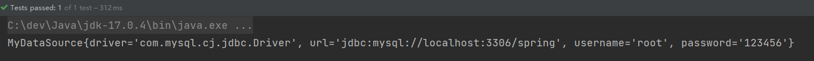  
  
**接下来，我们编写一个程序，把所有的简单类型全部测试一遍：**  
编写一个类A：

```
package edu.cqie.spring6.beans;

import java.net.URI;
import java.net.URL;
import java.time.LocalDate;
import java.util.Date;
import java.util.Locale;


public class A {
    private byte b;
    private short s;
    private int i;
    private long l;
    private float f;
    private double d;
    private boolean flag;
    private char c;

    private Byte b1;
    private Short s1;
    private Integer i1;
    private Long l1;
    private Float f1;
    private Double d1;
    private Boolean flag1;
    private Character c1;

    private String str;

    private Date date;

    private Season season;

    private URI uri;

    private URL url;

    private LocalDate localDate;

    private Locale locale;

    private Class clazz;
    
    // 生成setter方法
    // 生成toString方法
}

enum Season {
    SPRING, SUMMER, AUTUMN, WINTER
}
```

```
<?xml version="1.0" encoding="UTF-8"?>
<beans xmlns="http://www.springframework.org/schema/beans"
       xmlns:xsi="http://www.w3.org/2001/XMLSchema-instance"
       xsi:schemaLocation="http://www.springframework.org/schema/beans http://www.springframework.org/schema/beans/spring-beans.xsd">

    <bean id="a" class="com.powernode.spring6.beans.A">
        <property name="b" value="1"/>
        <property name="s" value="1"/>
        <property name="i" value="1"/>
        <property name="l" value="1"/>
        <property name="f" value="1"/>
        <property name="d" value="1"/>
        <property name="flag" value="false"/>

        <property name="c" value="a"/>
        <property name="b1" value="2"/>
        <property name="s1" value="2"/>
        <property name="i1" value="2"/>
        <property name="l1" value="2"/>
        <property name="f1" value="2"/>
        <property name="d1" value="2"/>
        <property name="flag1" value="true"/>
        <property name="c1" value="a"/>

        <property name="str" value="zhangsan"/>
        <!--注意：value后面的日期字符串格式不能随便写，必须是Date对象toString()方法执行的结果。-->
        <!--如果想使用其他格式的日期字符串，就需要进行特殊处理了。具体怎么处理，可以看后面的课程！！！！-->
        <property name="date" value="Fri Sep 30 15:26:38 CST 2022"/>
        <property name="season" value="WINTER"/>
        <property name="uri" value="/save.do"/>
        <!--spring6之后，会自动检查url是否有效，如果无效会报错。-->
        <property name="url" value="http://www.baidu.com"/>
        <property name="localDate" value="EPOCH"/>
        <!--java.util.Locale 主要在软件的本地化时使用。它本身没有什么功能，更多的是作为一个参数辅助其他方法完成输出的本地化。-->
        <property name="locale" value="CHINESE"/>
        <property name="clazz" value="java.lang.String"/>
    </bean>
</beans>
```

编写测试程序：

```
@Test
public void testAllSimpleType(){
    ApplicationContext applicationContext = new ClassPathXmlApplicationContext("spring-all-simple-type.xml");
    A a = applicationContext.getBean("a", A.class);
    System.out.println(a);
}
```

执行结果如下：  
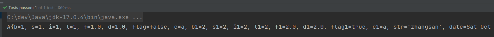  
**需要注意的是：**

**在实际开发中，我们一般不会把 Date 当做简单类型，虽然它是简单类型，一般会采用 ref 给 Date 类型的属性赋值**

- 如果把Date当做简单类型的话，日期字符串格式不能随便写。格式必须符合Date的toString()方法格式。显然这就比较鸡肋了。如果我们提供一个这样的日期字符串：2010-10-11，在这里是无法赋值给Date类型的属性的。
- spring6之后，当注入的是URL，那么这个url字符串是会进行有效性检测的。如果是一个存在的url，那就没问题。如果不存在则报错。

---

### 4.3.4 级联属性赋值（了解）

```
package edu.cqie.spring6.beans;


public class Clazz {
    private String name;

    public Clazz() {
    }

    public Clazz(String name) {
        this.name = name;
    }

    public String getName() {
        return name;
    }

    public void setName(String name) {
        this.name = name;
    }

    @Override
    public String toString() {
        return "Clazz{" +
                "name='" + name + '\'' +
                '}';
    }
}
```

**要点：**

- **在spring配置文件中，如上，****注意顺序****。**
- **在spring配置文件中，****clazz属性必须提供getter方法****。**

---

### 4.3.5 注入数组

**当数组中的元素是****简单类型**：

```
package edu.cqie.spring6.beans;

import java.util.Arrays;

public class Person {
    private String[] favariteFoods;

    public void setFavariteFoods(String[] favariteFoods) {
        this.favariteFoods = favariteFoods;
    }

    @Override
    public String toString() {
        return "Person{" +
                "favariteFoods=" + Arrays.toString(favariteFoods) +
                '}';
    }
}
```

```
<?xml version="1.0" encoding="UTF-8"?>
<beans xmlns="http://www.springframework.org/schema/beans"
  xmlns:xsi="http://www.w3.org/2001/XMLSchema-instance"
  xsi:schemaLocation="http://www.springframework.org/schema/beans http://www.springframework.org/schema/beans/spring-beans.xsd">

  <bean id="person" class="com.powernode.spring6.beans.Person">
    <property name="favariteFoods">
      <array>
        <value>鸡排</value>
        <value>汉堡</value>
        <value>鹅肝</value>
      </array>
    </property>
  </bean>
</beans>
```

```
@Test
public void testArraySimple(){
    ApplicationContext applicationContext = new ClassPathXmlApplicationContext("spring-array-simple.xml");
    Person person = applicationContext.getBean("person", Person.class);
    System.out.println(person);
}
```

**当数组中的元素是****非简单类型****：一个订单中包含多个商品。**

```
package edu.cqie.spring6.beans;

public class Goods {
    private String name;

    public Goods() {
    }

    public Goods(String name) {
        this.name = name;
    }

    public String getName() {
        return name;
    }

    public void setName(String name) {
        this.name = name;
    }

    @Override
    public String toString() {
        return "Goods{" +
                "name='" + name + '\'' +
                '}';
    }
}
```

```
package edu.cqie.spring6.beans;

import java.util.Arrays;


public class Order {
    // 一个订单中有多个商品
    private Goods[] goods;

    public Order() {
    }

    public Order(Goods[] goods) {
        this.goods = goods;
    }

    public void setGoods(Goods[] goods) {
        this.goods = goods;
    }

    @Override
    public String toString() {
        return "Order{" +
                "goods=" + Arrays.toString(goods) +
                '}';
    }
}
```

ref 标签后面还要加上 bean

```
<?xml version="1.0" encoding="UTF-8"?>
<beans xmlns="http://www.springframework.org/schema/beans"
       xmlns:xsi="http://www.w3.org/2001/XMLSchema-instance"
       xsi:schemaLocation="http://www.springframework.org/schema/beans http://www.springframework.org/schema/beans/spring-beans.xsd">

    <bean id="goods1" class="com.powernode.spring6.beans.Goods">
        <property name="name" value="西瓜"/>
    </bean>
    <bean id="goods2" class="com.powernode.spring6.beans.Goods">
        <property name="name" value="苹果"/>
    </bean>
  
    <bean id="order" class="com.powernode.spring6.beans.Order">
        <property name="goods">
            <array>
                <!--这里使用ref标签即可-->
                <ref bean="goods1"/>
                <ref bean="goods2"/>
            </array>
        </property>
    </bean>
</beans>
```

测试程序：

```
@Test
public void testArray(){
    ApplicationContext applicationContext = new ClassPathXmlApplicationContext("spring-array.xml");
    Order order = applicationContext.getBean("order", Order.class);
    System.out.println(order);
}
```

执行结果：  
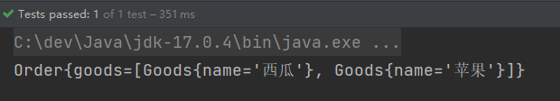  
**要点：**

- 如果数组中是**简单类型**，使用**value标签**。
- 如果数组中是**非简单类型**，使用**ref标签**。

---

### 4.3.6 注入List集合

List集合：有序可重复

```
package edu.cqie.spring6.beans;

import java.util.List;

public class People {
    // 一个人有多个名字
    private List<String> names;

    public void setNames(List<String> names) {
        this.names = names;
    }

    @Override
    public String toString() {
        return "People{" +
                "names=" + names +
                '}';
    }
}
```

```
<?xml version="1.0" encoding="UTF-8"?>
<beans xmlns="http://www.springframework.org/schema/beans"
       xmlns:xsi="http://www.w3.org/2001/XMLSchema-instance"
       xsi:schemaLocation="http://www.springframework.org/schema/beans http://www.springframework.org/schema/beans/spring-beans.xsd">

    <bean id="peopleBean" class="com.powernode.spring6.beans.People">
        <property name="names">
            <list>
                <value>铁锤</value>
                <value>张三</value>
                <value>张三</value>
                <value>张三</value>
                <value>狼</value>
            </list>
        </property>
    </bean>
</beans>
```

```
@Test
public void testCollection(){
    ApplicationContext applicationContext = new ClassPathXmlApplicationContext("spring-collection.xml");
    People peopleBean = applicationContext.getBean("peopleBean", People.class);
    System.out.println(peopleBean);
}
```

执行结果：  
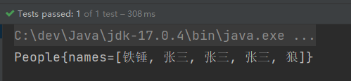  
**注意：注入List集合的时候使用list标签，如果List集合中是简单类型使用value标签，反之使用ref标签。**

---

### 4.3.7 注入Set集合

Set集合：无序不可重复

```
package edu.cqie.spring6.beans;

import java.util.List;
import java.util.Set;

public class People {
    // 一个人有多个电话
    private Set<String> phones;

    public void setPhones(Set<String> phones) {
        this.phones = phones;
    }
    
    //......
    
    @Override
    public String toString() {
        return "People{" +
                "phones=" + phones +
                ", names=" + names +
                '}';
    }
}
```

```
<?xml version="1.0" encoding="UTF-8"?>
<beans xmlns="http://www.springframework.org/schema/beans"
  xmlns:xsi="http://www.w3.org/2001/XMLSchema-instance"
  xsi:schemaLocation="http://www.springframework.org/schema/beans http://www.springframework.org/schema/beans/spring-beans.xsd">

  <bean id="peopleBean" class="com.powernode.spring6.beans.People">
    <property name="phones">
      <set>
        <!--非简单类型可以使用ref，简单类型使用value-->
        <value>110</value>
        <value>110</value>
        <value>120</value>
        <value>120</value>
        <value>119</value>
        <value>119</value>
      </set>
    </property>
  </bean>
</beans>
```

执行结果：  
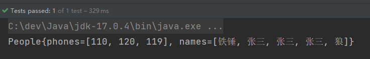  
**要点：**

- **使用****标签**
- **set集合中元素是简单类型的使用value标签，反之使用ref标签。**

---

### 4.3.8 注入Map集合

```
package edu.cqie.spring6.beans;

import java.util.List;
import java.util.Map;
import java.util.Set;

public class People {
    // 一个人有多个住址
    private Map<Integer, String> addrs;

    public void setAddrs(Map<Integer, String> addrs) {
        this.addrs = addrs;
    }
    
    //......
    
    @Override
    public String toString() {
        return "People{" +
                "addrs=" + addrs +
                ", phones=" + phones +
                ", names=" + names +
                '}';
    }

}
```

```
<?xml version="1.0" encoding="UTF-8"?>
<beans xmlns="http://www.springframework.org/schema/beans"
       xmlns:xsi="http://www.w3.org/2001/XMLSchema-instance"
       xsi:schemaLocation="http://www.springframework.org/schema/beans http://www.springframework.org/schema/beans/spring-beans.xsd">

    <bean id="peopleBean" class="com.powernode.spring6.beans.People">
        <property name="addrs">
            <map>
                <!--如果key不是简单类型，使用 key-ref 属性-->
                <!--如果value不是简单类型，使用 value-ref 属性-->
                <entry key="1" value="北京大兴区"/>
                <entry key="2" value="上海浦东区"/>
                <entry key="3" value="深圳宝安区"/>
            </map>
        </property>
    </bean>
</beans>
```

执行结果：  
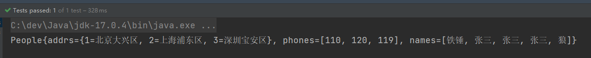  
**要点：**

- **使用****标签**
- **如果key是简单类型，使用 key 属性，反之使用** **key-ref** **属性。**
- **如果value是简单类型，使用 value 属性，反之使用** **value-ref** **属性。**

---

### 4.3.9 注入Properties

java.util.Properties继承java.util.Hashtable，所以Properties 本质也是一个Map集合。

Properties 的 key 和 Value 只能是 String 类型

```
package edu.cqie.spring6.beans;

import java.util.List;
import java.util.Map;
import java.util.Properties;
import java.util.Set;

public class People {

    private Properties properties;

    public void setProperties(Properties properties) {
        this.properties = properties;
    }
    
    //......

    @Override
    public String toString() {
        return "People{" +
                "properties=" + properties +
                ", addrs=" + addrs +
                ", phones=" + phones +
                ", names=" + names +
                '}';
    }
}
```

```
<?xml version="1.0" encoding="UTF-8"?>
<beans xmlns="http://www.springframework.org/schema/beans"
	xmlns:xsi="http://www.w3.org/2001/XMLSchema-instance"
	xsi:schemaLocation="http://www.springframework.org/schema/beans http://www.springframework.org/schema/beans/spring-beans.xsd">

	<bean id="peopleBean" class="com.powernode.spring6.beans.People">
		<property name="properties">
			<props>
				<prop key="driver">com.mysql.cj.jdbc.Driver</prop>
				<prop key="url">jdbc:mysql://localhost:3306/spring</prop>
				<prop key="username">root</prop>
				<prop key="password">123456</prop>
			</props>
		</property>
	</bean>
</beans>
```

执行测试程序：  
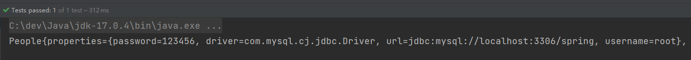  
**要点：**

- **使用标签嵌套标签完成。**

---

### 4.3.10 注入null和空字符串

注入空字符串使用： 或者 value=""注入null使用： 或者 不为该属性赋值

- 我们先来看一下，怎么注入空字符串。

```
package com.powernode.spring6.beans;

public class Vip {
    private String email;

    public void setEmail(String email) {
        this.email = email;
    }

    @Override
    public String toString() {
        return "Vip{" +
                "email='" + email + '\'' +
                '}';
    }
}
```

```
<?xml version="1.0" encoding="UTF-8"?>
<beans xmlns="http://www.springframework.org/schema/beans"
       xmlns:xsi="http://www.w3.org/2001/XMLSchema-instance"
       xsi:schemaLocation="http://www.springframework.org/schema/beans http://www.springframework.org/schema/beans/spring-beans.xsd">

    <bean id="vipBean" class="com.powernode.spring6.beans.Vip">
        <!--空串的第一种方式-->
        <!--<property name="email" value=""/>-->
        <!--空串的第二种方式-->
        <property name="email">
            <value/>
        </property>
    </bean>
</beans>
```

```
@Test
public void testNull(){
    ApplicationContext applicationContext = new ClassPathXmlApplicationContext("spring-null.xml");
    Vip vipBean = applicationContext.getBean("vipBean", Vip.class);
    System.out.println(vipBean);
}
```

执行结果：  
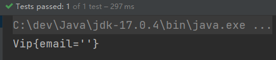

- 怎么注入null呢？

第一种方式：不给属性赋值

```
<?xml version="1.0" encoding="UTF-8"?>
<beans xmlns="http://www.springframework.org/schema/beans"
       xmlns:xsi="http://www.w3.org/2001/XMLSchema-instance"
       xsi:schemaLocation="http://www.springframework.org/schema/beans http://www.springframework.org/schema/beans/spring-beans.xsd">

    <bean id="vipBean" class="com.powernode.spring6.beans.Vip" />

</beans>
```

执行结果：  
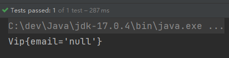  
第二种方式：使用

```
<?xml version="1.0" encoding="UTF-8"?>
<beans xmlns="http://www.springframework.org/schema/beans"
       xmlns:xsi="http://www.w3.org/2001/XMLSchema-instance"
       xsi:schemaLocation="http://www.springframework.org/schema/beans http://www.springframework.org/schema/beans/spring-beans.xsd">

    <bean id="vipBean" class="com.powernode.spring6.beans.Vip">
        <property name="email">
            <null/>
        </property>
    </bean>
</beans>
```

执行结果：  


---

### 4.3.11 注入的值中含有特殊符号

XML中有5个特殊字符，分别是：<、>、'、"、&  
以上5个特殊符号在XML中会被特殊对待，会被当做XML语法的一部分进行解析，如果这些特殊符号直接出现在注入的字符串当中，会报错。  
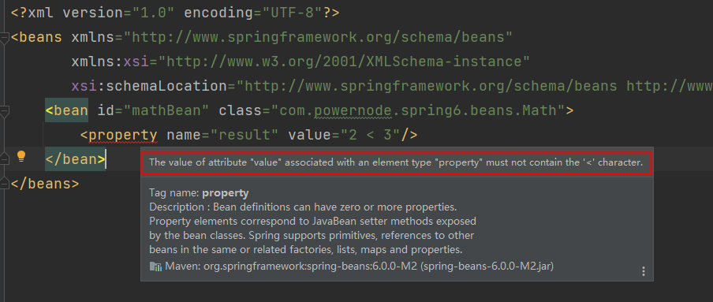  
解决方案包括两种：

- 第一种：特殊符号使用转义字符代替。
- 第二种：将含有特殊符号的字符串放到： 当中。因为放在CDATA区中的数据不会被XML文件解析器解析。

5个特殊字符对应的转义字符分别是：

|   |   |
|---|---|
|**特殊字符**|**转义字符**|
|>|&gt;|
|<|&lt;|
|'|&apos;|
|"|&quot;|
|&|&amp;|

先使用转义字符来代替：

```
package com.powernode.spring6.beans;


public class Math {
    private String result;

    public void setResult(String result) {
        this.result = result;
    }

    @Override
    public String toString() {
        return "Math{" +
                "result='" + result + '\'' +
                '}';
    }
}
```

```
<?xml version="1.0" encoding="UTF-8"?>
<beans xmlns="http://www.springframework.org/schema/beans"
       xmlns:xsi="http://www.w3.org/2001/XMLSchema-instance"
       xsi:schemaLocation="http://www.springframework.org/schema/beans http://www.springframework.org/schema/beans/spring-beans.xsd">
    <bean id="mathBean" class="com.powernode.spring6.beans.Math">
        <property name="result" value="2 &lt; 3"/>
    </bean>
</beans>
```

```
@Test
public void testSpecial(){
    ApplicationContext applicationContext = new ClassPathXmlApplicationContext("spring-special.xml");
    Math mathBean = applicationContext.getBean("mathBean", Math.class);
    System.out.println(mathBean);
}
```

  
我们再来使用CDATA方式：<![CDATA[ ]]>

```
<?xml version="1.0" encoding="UTF-8"?>
<beans xmlns="http://www.springframework.org/schema/beans"
       xmlns:xsi="http://www.w3.org/2001/XMLSchema-instance"
       xsi:schemaLocation="http://www.springframework.org/schema/beans http://www.springframework.org/schema/beans/spring-beans.xsd">

    <bean id="mathBean" class="com.powernode.spring6.beans.Math">
        <property name="result">
            <!--只能使用value标签-->
            <value><![CDATA[2 < 3]]></value>
        </property>
    </bean>
</beans>
```

**注意：使用CDATA时，不能使用value属性，只能使用value标签。**

---

## 4.4 p命名空间注入

底层还是 **set 注入**，只不过 p 命名空间注入可以让 Spring 配置变得更加简单

目的：简化配置。  
使用p命名空间注入的前提条件包括两个：

- 第一：在XML头部信息中添加p命名空间的配置信息：xmlns:p="[http://www.springframework.org/schema/p"](http://www.springframework.org/schema/p")
- 第二：p命名空间注入是基于setter方法的，所以需要对应的属性提供setter方法。

**简单类型直接 p：****属性 = “属性值”** ，**非简单类型 p：****属性 - ref = “属性值”**

```
<?xml version="1.0" encoding="UTF-8"?>
<beans xmlns="http://www.springframework.org/schema/beans"
       xmlns:p="http://www.springframework.org/schema/p"
       xmlns:xsi="http://www.w3.org/2001/XMLSchema-instance"
       xsi:schemaLocation="http://www.springframework.org/schema/beans http://www.springframework.org/schema/beans/spring-beans.xsd">

   <bean id="dogBean" class="com.powernode.spring6.bean.Dog" p:name="zhangsan" p:age="20" p: birth-ref = "birthBean"/>
   <bean id="birthBean" class = "java.util.Date"/>

</beans>
```

## 4.5 c命名空间注入

c命名空间是简化构造方法注入的也是基于**构造方法**。  
使用c命名空间的两个前提条件：  
第一：需要在xml配置文件头部添加信息：xmlns:c="[http://www.springframework.org/schema/c](http://www.springframework.org/schema/c)"  
第二：需要提供构造方法。

```
package com.powernode.spring6.beans;

/**
 * @author 动力节点
 * @version 1.0
 * @className MyTime
 * @since 1.0
 **/
public class MyTime {
    private int year;
    private int month;
    private int day;

    public MyTime(int year, int month, int day) {
        this.year = year;
        this.month = month;
        this.day = day;
    }

    @Override
    public String toString() {
        return "MyTime{" +
                "year=" + year +
                ", month=" + month +
                ", day=" + day +
                '}';
    }
}
```

第一种方式：

下划线后面跟着的数字表示类中的第几个参数

<bean id="myTimeBean" class="com.powernode.spring6.beans.MyTime" c:_0="zhangsan" c:_1="30" c:_2="true"/>

第二种方式：

直接跟参数名

<bean id="myTimeBean" class="com.powernode.spring6.beans.MyTime" c:name="zhangsan" c:age="30" c:sex="true"/>

```
<?xml version="1.0" encoding="UTF-8"?>
<beans xmlns="http://www.springframework.org/schema/beans"
       xmlns:c="http://www.springframework.org/schema/c"
       xmlns:xsi="http://www.w3.org/2001/XMLSchema-instance"
       xsi:schemaLocation="http://www.springframework.org/schema/beans http://www.springframework.org/schema/beans/spring-beans.xsd">

    <!--<bean id="myTimeBean" class="com.powernode.spring6.beans.MyTime" c:year="1970" c:month="1" c:day="1"/>-->

    <bean id="myTimeBean" class="com.powernode.spring6.beans.MyTime" c:_0="2008" c:_1="8" c:_2="8"/>

</beans>
```

```
@Test
public void testC(){
    ApplicationContext applicationContext = new ClassPathXmlApplicationContext("spring-c.xml");
    MyTime myTimeBean = applicationContext.getBean("myTimeBean", MyTime.class);
    System.out.println(myTimeBean);
}
```

所以，c命名空间是依靠构造方法的。  
**注意：不管是p命名空间还是c命名空间，注入的时候都可以注入简单类型以及非简单类型。**

## 4.6 util命名空间

使用util命名空间可以让**配置复用**。  
使用util命名空间的前提是：在spring配置文件头部添加配置信息。与之前不同需要再两个地方进行修改，如下：

```
<?xml version="1.0" encoding="UTF-8"?>
<beans xmlns="http://www.springframework.org/schema/beans"
  xmlns:xsi="http://www.w3.org/2001/XMLSchema-instance"
  xmlns:util="http://www.springframework.org/schema/util"
  xsi:schemaLocation="http://www.springframework.org/schema/beans http://www.springframework.org/schema/beans/spring-beans.xsd
                      http://www.springframework.org/schema/util http://www.springframework.org/schema/util/spring-util.xsd">
```

```
<!--数据源1-->
<bean id="ds1" class="com.powernode.spring6.jdbc.MyDataSources1">
  <property name="properties">
    <props>
      <prop key="driver">com.mysql.cj.jdbc.Driver</prop>
      <prop key="url">jdbc:mysql://localhost:3306/spring6</prop>
      <prop key="username">root</prop>
      <prop key="password">123456</prop>
    </props>
  </property>
</bean>
```

```
package com.powernode.spring6.jdbc;

import javax.sql.DataSource;
import java.io.PrintWriter;
import java.sql.Connection;
import java.sql.SQLException;
import java.sql.SQLFeatureNotSupportedException;
import java.util.Properties;
import java.util.logging.Logger;

public class MyDataSources1 implements DataSource {

    // 数据库连接信息
    /*private String driver;
    private String url;
    private String username;
    private String password;*/

    // properties属性类对象，这是一个Map集合，key和Value都是String类
    private Properties properties;

    public void setProperties(Properties properties) {
        this.properties = properties;
    }

    @Override
    public String toString() {
        return "MyDataSources1{" +
                "properties=" + properties +
                '}';
    }

    @Override
    public Connection getConnection() throws SQLException {
        return null;
    }

    @Override
    public Connection getConnection(String username, String password) throws SQLException {
        return null;
    }

    @Override
    public PrintWriter getLogWriter() throws SQLException {
        return null;
    }

    @Override
    public void setLogWriter(PrintWriter out) throws SQLException {

    }

    @Override
    public void setLoginTimeout(int seconds) throws SQLException {

    }

    @Override
    public int getLoginTimeout() throws SQLException {
        return 0;
    }

    @Override
    public Logger getParentLogger() throws SQLFeatureNotSupportedException {
        return null;
    }

    @Override
    public <T> T unwrap(Class<T> iface) throws SQLException {
        return null;
    }

    @Override
    public boolean isWrapperFor(Class<?> iface) throws SQLException {
        return false;
    }
}
```

```
<?xml version="1.0" encoding="UTF-8"?>
<beans xmlns="http://www.springframework.org/schema/beans"
       xmlns:xsi="http://www.w3.org/2001/XMLSchema-instance"
       xmlns:util="http://www.springframework.org/schema/util"
       xsi:schemaLocation="http://www.springframework.org/schema/beans http://www.springframework.org/schema/beans/spring-beans.xsd
                           http://www.springframework.org/schema/util http://www.springframework.org/schema/util/spring-util.xsd">

    <util:properties id="prop">
        <prop key="driver">com.mysql.cj.jdbc.Driver</prop>
        <prop key="url">jdbc:mysql://localhost:3306/spring</prop>
        <prop key="username">root</prop>
        <prop key="password">123456</prop>
    </util:properties>
    <bean id="dataSource1" class="com.powernode.spring6.beans.MyDataSource1">
        <property name="properties" ref="prop"/>
    </bean>
    <bean id="dataSource2" class="com.powernode.spring6.beans.MyDataSource2">
        <property name="properties" ref="prop"/>
    </bean>
</beans>
```

## 4.7 基于XML的自动装配

Spring还可以完成自动化的注入，自动化注入又被称为自动装配。它可以根据**名字**进行自动装配，也可以根据**类型**进行自动装配。

### 4.7.1 根据名称自动装配

**autowire="byName"**

自动装配也是基于 **set** 方法实现的

Spring的配置文件这样配置：

```
<?xml version="1.0" encoding="UTF-8"?>
<beans xmlns="http://www.springframework.org/schema/beans"
       xmlns:xsi="http://www.w3.org/2001/XMLSchema-instance"
       xsi:schemaLocation="http://www.springframework.org/schema/beans http://www.springframework.org/schema/beans/spring-beans.xsd">

    <bean id="userService" class="com.powernode.spring6.service.UserService" autowire="byName"/>
    
    <bean id="aaa" class="com.powernode.spring6.dao.UserDao"/>

</beans>
```

根据名字自动装配的时候，被注入的对象的 bean 的 id 不能随便写，set 方法的方法名去掉 set ，剩下单词首字母小写

这个配置起到关键作用：

- UserService Bean中需要添加autowire="byName"，表示通过名称进行装配。
- UserService类中有一个UserDao属性，而UserDao属性的名字是aaa，**对应的set方法是setAaa()**，正好和UserDao Bean的id是一样的。这就是根据名称自动装配。

如果根据名称装配(byName)，底层会调用set方法进行注入。  
例如：setAge() 对应的名字是age，setPassword()对应的名字是password，setEmail()对应的名字是email。

---

### 4.7.2 根据类型自动装配（常用）

**autowire="byType"**

```
<?xml version="1.0" encoding="UTF-8"?>
<beans xmlns="http://www.springframework.org/schema/beans"
       xmlns:xsi="http://www.w3.org/2001/XMLSchema-instance"
       xsi:schemaLocation="http://www.springframework.org/schema/beans http://www.springframework.org/schema/beans/spring-beans.xsd">

    <!--byType表示根据类型自动装配-->
    <bean class="com.powernode.spring6.dao.VipDao"/>
    <bean class="com.powernode.spring6.dao.UserDao"/>
    <bean id="accountService" class="com.powernode.spring6.service.CustomerService" autowire="byType"/>

</beans>
```

无论是**byName**还是**byType**，在装配的时候都是**基于set方法**的。所以set方法是必须要提供的。

根据类型进行自动装配的时候，在有效的配置文件当中，某种类型的实例只能有一个  
不然会报错，程序不知道要用哪一个

```
<?xml version="1.0" encoding="UTF-8"?>
<beans xmlns="http://www.springframework.org/schema/beans"
       xmlns:xsi="http://www.w3.org/2001/XMLSchema-instance"
       xsi:schemaLocation="http://www.springframework.org/schema/beans http://www.springframework.org/schema/beans/spring-beans.xsd">

    <bean id="accountService" class="com.powernode.spring6.service.AccountService" autowire="byType"/>

    <bean id="x" class="com.powernode.spring6.dao.AccountDao"/>
    <bean id="y" class="com.powernode.spring6.dao.AccountDao"/>

</beans>
```

**依赖自动装配特征：**

- 自动装配用于引用类型依赖注入，不能对简单类型进行操作
- 使用按类型装配时（byType）必须保障容器中相同类型的bean唯一，推荐使用
- 使用按名称装配时（byName）必须保障容器中具有指定名称的bean，因变量名与配置耦合，不推荐使用
- 自动装配优先级低于setter注入与构造器注入，同时出现时自动装配配置失效

---

## 4.8 Spring引入外部属性配置文件

写数据源的时候是需要连接数据库的信息的，

例如：**driver** **url** **username** **password**等信息。这些信息可以单独写到一个属性配置文件中吗，这样用户修改起来会更加的方便。  
第一步：写一个数据源类，提供相关属性。

```
package com.powernode.spring6.beans;

import javax.sql.DataSource;
import java.io.PrintWriter;
import java.sql.Connection;
import java.sql.SQLException;
import java.sql.SQLFeatureNotSupportedException;
import java.util.logging.Logger;

/**
 * @author DriftBoat
 * @version 1.0
 * @className MyDataSource
 * @since 1.0
 **/
public class MyDataSource implements DataSource {
    @Override
    public String toString() {
        return "MyDataSource{" +
                "driver='" + driver + '\'' +
                ", url='" + url + '\'' +
                ", username='" + username + '\'' +
                ", password='" + password + '\'' +
                '}';
    }

    private String driver;
    private String url;
    private String username;
    private String password;

    public void setDriver(String driver) {
        this.driver = driver;
    }

    public void setUrl(String url) {
        this.url = url;
    }

    public void setUsername(String username) {
        this.username = username;
    }

    public void setPassword(String password) {
        this.password = password;
    }

    //......
}
```

第二步：在类路径下新建**jdbc.properties**文件，并配置信息。

```
driver=com.mysql.cj.jdbc.Driver
url=jdbc:mysql://localhost:3306/spring
username=root
password=root123
```

第三步：在spring配置文件中引入**context**命名空间。

```
<?xml version="1.0" encoding="UTF-8"?>
<beans xmlns="http://www.springframework.org/schema/beans"
       xmlns:xsi="http://www.w3.org/2001/XMLSchema-instance"
       xmlns:context="http://www.springframework.org/schema/context"
       xsi:schemaLocation="http://www.springframework.org/schema/beans http://www.springframework.org/schema/beans/spring-beans.xsd
                           http://www.springframework.org/schema/context http://www.springframework.org/schema/context/spring-context.xsd">

</beans>
```

第四步：在spring中配置使用jdbc.properties文件。

**location** 属性来指定属性配置文件的路径

location 默认从类的根路径下加载资源

**<property name="driver" value="****${key}****"/>**

```
<?xml version="1.0" encoding="UTF-8"?>
<beans xmlns="http://www.springframework.org/schema/beans"
       xmlns:xsi="http://www.w3.org/2001/XMLSchema-instance"
       xmlns:context="http://www.springframework.org/schema/context"
       xsi:schemaLocation="http://www.springframework.org/schema/beans 
                           http://www.springframework.org/schema/beans/spring-beans.xsd
                           http://www.springframework.org/schema/context 
                           http://www.springframework.org/schema/context/spring-context.xsd">

    <!--1.开启context命名空间 -->
    <!--2.使用context空间加载properties文件 -->
    <context:property-placeholder location="jdbc.properties"/>

    <!--3.使用属性占位符${}读取properties文件中的属性  -->
    <bean id="dataSource" class="com.powernode.spring6.beans.MyDataSource">
        <property name="driver" value="${driver}"/>
        <property name="url" value="${url}"/>
        <property name="username" value="${username}"/>
        <property name="password" value="${password}"/>
    </bean>
  
</beans>
```

如果需要加载多个配置文件

① 使用 **,** 分隔：**<context:****property-placeholder location=****"jdbc.properties，jdbc2.properties"** **system-properties-mode=****"NEVER"/>** 。

② 使用 ***** 号：**<context:****property-placeholder location=****"classpath * : * .properties"** **system-properties-mode=****"NEVER"/>**

- **不加载系统属性**

```
<context:property-placeholder location="jdbc.properties" system-properties-mode="NEVER"/>
```

- **加载多个 properties 文件**

```
<context:property-placeholder location="jdbc.properties,msg.properties"/>
```

- **加载所有 properties 文件**

```
<context:property-placeholder location="*.properties"/>
```

- **加载 properties 文件标准格式**

```
<context:property-placeholder location="classpath:*.*.properties"/>
```

- **从类路径或 jar 包中搜索并加载 properties 文件**

```
<context:property-placeholder location="classpath*:*.*.properties"/>
```

注：`classpath*:` 表示递归搜索类路径下的所有匹配文件（包括 JAR 包中的文件），而 `classpath:` 仅搜索当前类路径。

---

**注意：不在 properties 配置文件中写 jdbc 的话默认先加载系统的环境变量**

username = 'Administrator'

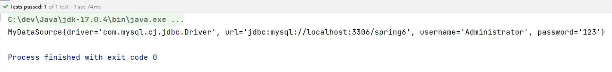

所以在 **jdbc.properties** 配置文件中在 key 属性前面加上 **jdbc**

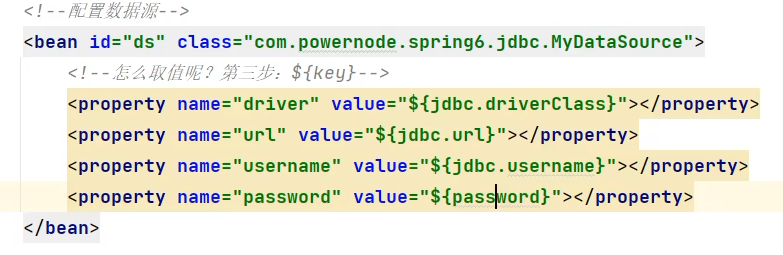

还可以使用 **system-properties-mode="NEVER"**

```
<context:property-placeholder location="jdbc.properties" system-properties-mode="NEVER"/>
```

**说明：**  
该配置用于 Spring 的上下文中，加载 `jdbc.properties` 文件中的属性，并设置系统属性模式为 `"NEVER"`，表示不从系统属性中获取值，仅从指定的属性文件中读取。

---

## 4.9 容器

### 4.9.1 创建容器

**创建容器**

- **方式一：类路径加载配置文件**

```
ApplicationContext ctx = new ClassPathXmlApplicationContext("applicationContext.xml");
```

- **方式二：文件路径加载配置文件**

```
ApplicationContext ctx = new FileSystemXmlApplicationContext("D:\\applicationContext.xml");
```

- **加载多个配置文件**

```
ApplicationContext ctx = new ClassPathXmlApplicationContext("bean1.xml", "bean2.xml");
```

### 4.9.2 获取 bean

**获取bean**

- **方式一：使用bean名称获取**

```
BookDao bookDao = (BookDao) ctx.getBean("bookDao");
```

- **方式二：使用bean名称获取并指定类型**

```
BookDao bookDao = ctx.getBean("bookDao", BookDao.class);
```

- **方式三：使用bean类型获取**

```
BookDao bookDao = ctx.getBean(BookDao.class);
```

---

### **4.9.3 容器类层次结构图：**

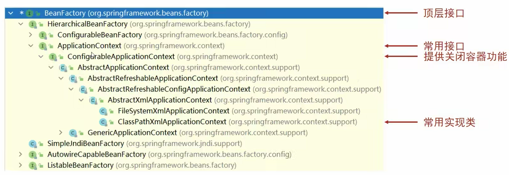

- BeanFactory是IoC容器的顶层接口，初始化BeanFactory对象时，加载的bean延迟加载
- ApplicationContext接口是Spring容器的核心接口，初始化时bean立即加载
- ApplicationContext接口提供基础的bean操作相关方法，通过其他接口扩展其功能
- ApplicationContext接口常用初始化类

- ClassPathXmlApplicationContext
- FileSystemXmlApplicationContext

---

### **4.9.4BeanFactory初始化**

- **类路径加载配置文件**

```
Resource resources = new ClassPathResource("applicationContext.xml");
BeanFactory bf = new XmlBeanFactory(resources);
BookDao bookDao = bf.getBean("bookDao", BookDao.class);
bookDao.save();
```

- **BeanFactory创建完毕后，所有的bean均为延迟加载**

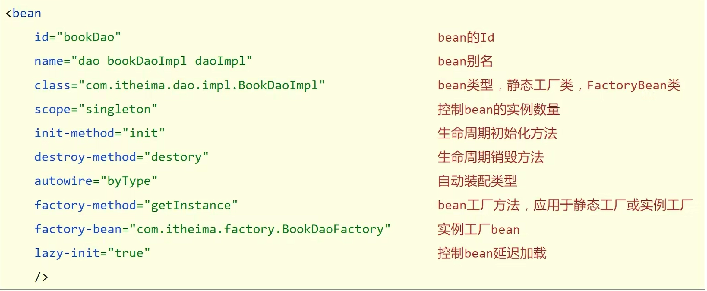

### **4.9.5 依赖注入相关：**

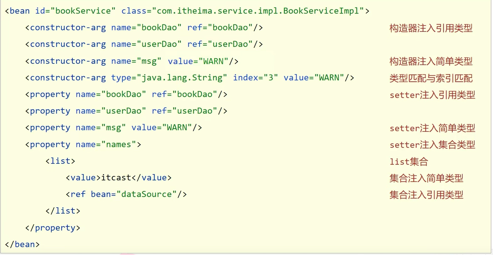

---

# 五、Bean的作用域

## 5.1 singleton

默认情况下，**Spring的IoC容器创建的Bean对象是单例**的。

```
package com.powernode.spring6.beans;

public class SpringBean {
}
```

```
<?xml version="1.0" encoding="UTF-8"?>
<beans xmlns="http://www.springframework.org/schema/beans"
       xmlns:xsi="http://www.w3.org/2001/XMLSchema-instance"
       xsi:schemaLocation="http://www.springframework.org/schema/beans http://www.springframework.org/schema/beans/spring-beans.xsd">

    <bean id="sb" class="com.powernode.spring6.beans.SpringBean" />
    
</beans>
```

```
@Test
public void testScope(){
    ApplicationContext applicationContext = new ClassPathXmlApplicationContext("spring-scope.xml");

    SpringBean sb1 = applicationContext.getBean("sb", SpringBean.class);
    System.out.println(sb1);

    SpringBean sb2 = applicationContext.getBean("sb", SpringBean.class);
    System.out.println(sb2);
}
```

执行结果：  
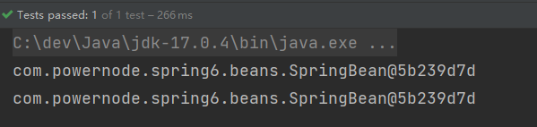  
通过测试得知：Spring的IoC容器中，默认情况下，Bean对象是单例的。  
这个对象在什么时候创建的呢？可以为SpringBean提供一个无参数构造方法，测试一下，如下：

```
package com.powernode.spring6.beans;

public class SpringBean {
    public SpringBean() {
        System.out.println("SpringBean的无参数构造方法执行。");
    }
}
```

将测试程序中getBean()所在行代码注释掉：

```
@Test
public void testScope(){
    ApplicationContext applicationContext = new ClassPathXmlApplicationContext("spring-scope.xml");
}
```

执行测试程序：  
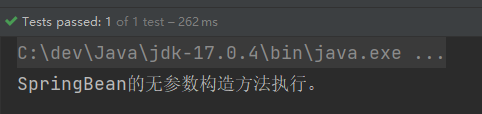  
通过测试得知，**默认情况下，Bean对象的创建是在初始化Spring上下文的时候就完成的每一次调用 getBean()方法的时候，都会返回那个单例的对象。**

---

## 5.2 prototype

如果想让Spring的Bean对象以**多例**的形式存在，可以在bean标签中指定**scope**属性的值为：**prototype**，这样Spring会在每一次执行getBean()方法的时候创建Bean对象，调用几次则创建几次。

```
<?xml version="1.0" encoding="UTF-8"?>
<beans xmlns="http://www.springframework.org/schema/beans"
       xmlns:xsi="http://www.w3.org/2001/XMLSchema-instance"
       xsi:schemaLocation="http://www.springframework.org/schema/beans http://www.springframework.org/schema/beans/spring-beans.xsd">

    <bean id="sb" class="com.powernode.spring6.beans.SpringBean" scope="prototype" />

</beans>
```

```
@Test
public void testScope(){
    ApplicationContext applicationContext = new ClassPathXmlApplicationContext("spring-scope.xml");

    SpringBean sb1 = applicationContext.getBean("sb", SpringBean.class);
    System.out.println(sb1);

    SpringBean sb2 = applicationContext.getBean("sb", SpringBean.class);
    System.out.println(sb2);
}
```

执行结果：  
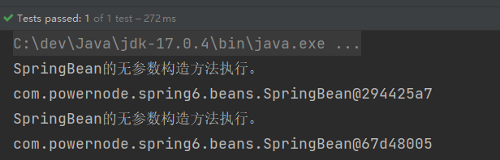  
我们可以把测试代码中的getBean()方法所在行代码注释掉：

```
@Test
public void testScope(){
    ApplicationContext applicationContext = new ClassPathXmlApplicationContext("spring-scope.xml");
}
```

执行结果：  
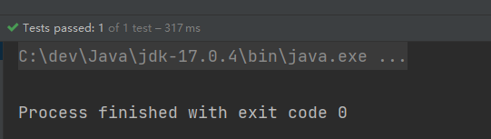  
可以看到这一次在初始化Spring上下文的时候，并没有创建Bean对象。  
那你可能会问：scope如果没有配置，它的默认值是什么呢？默认值是**singleton**，单例的。

```
<?xml version="1.0" encoding="UTF-8"?>
<beans xmlns="http://www.springframework.org/schema/beans"
       xmlns:xsi="http://www.w3.org/2001/XMLSchema-instance"
       xsi:schemaLocation="http://www.springframework.org/schema/beans http://www.springframework.org/schema/beans/spring-beans.xsd">

    <bean id="sb" class="com.powernode.spring6.beans.SpringBean" scope="singleton" />

</beans>
```

```
@Test
public void testScope(){
    ApplicationContext applicationContext = new ClassPathXmlApplicationContext("spring-scope.xml");

    SpringBean sb1 = applicationContext.getBean("sb", SpringBean.class);
    System.out.println(sb1);

    SpringBean sb2 = applicationContext.getBean("sb", SpringBean.class);
    System.out.println(sb2);
}
```

执行结果：  
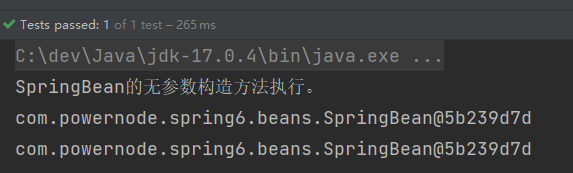  
通过测试得知，没有指定scope属性时，默认是singleton单例的。

---

## 5.3 其它scope

**scope属性的值不止两个，它一共包括8个选项：**

- **singleton**：默认的，单例。
- **prototype**：原型。每调用一次getBean()方法则获取一个新的Bean对象。或每次注入的时候都是新对象。

当引入了 SpringMVC 框架的时候，就可以使用了

```
<dependency>
  <groupId>org.springframework</groupId>
  <artifactId>spring-webmvc</artifactId>
  <version>6.2.12</version>
</dependency>
```

- **request**：一次请求对应一个Bean。**仅限于在WEB应用中使用**。
- **session**：会话对应一个Bean。**仅限于在WEB应用中使用**。
- **global session**：**portlet应用中专用的**。如果在Servlet的WEB应用中使用global session的话，和session一个效果。（portlet和servlet都是规范。servlet运行在servlet容器中，例如Tomcat。portlet运行在portlet容器中。）
- **application**：一个应用对应一个Bean。**仅限于在WEB应用中使用。**
- **websocket**：一个websocket生命周期对应一个Bean。**仅限于在WEB应用中使用。**
- **自定义scope**：很少使用。

接下来咱们自定义一个Scope，线程级别的Scope，在同一个线程中，获取的Bean都是同一个。跨线程则是不同的对象：（以下内容作为了解）

- 第一步：自定义Scope。（**实现Scope接口**）

- spring内置了线程范围的类：org.springframework.context.support.SimpleThreadScope，可以直接用。

- 第二步：将自定义的Scope注册到Spring容器中。

```
<bean class="org.springframework.beans.factory.config.CustomScopeConfigurer">
  <property name="scopes">
    <map>
      <entry key="myThread">
        <bean class="org.springframework.context.support.SimpleThreadScope"/>
      </entry>
    </map>
  </property>
</bean>
```

- 第三步：使用Scope。

```
<bean id="sb" class="com.powernode.spring6.beans.SpringBean" scope="myThread" />
```

编写测试程序：

```
@Test
public void testCustomScope(){
    ApplicationContext applicationContext = new ClassPathXmlApplicationContext("spring-scope.xml");
    SpringBean sb1 = applicationContext.getBean("sb", SpringBean.class);
    SpringBean sb2 = applicationContext.getBean("sb", SpringBean.class);
    System.out.println(sb1);
    System.out.println(sb2);
    // 启动线程
    new Thread(new Runnable() {
        @Override
        public void run() {
            SpringBean a = applicationContext.getBean("sb", SpringBean.class);
            SpringBean b = applicationContext.getBean("sb", SpringBean.class);
            System.out.println(a);
            System.out.println(b);
        }
    }).start();
}
```

执行结果：  
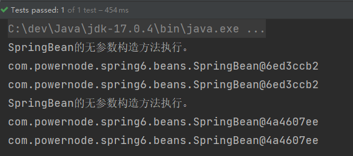

---

# 六、GoF之工厂模式

Spring 的底层原理就是工厂模式加 XML 文件，反射机制

- 设计模式：一种可以被重复利用的解决方案。
- GoF（Gang of Four），中文名——四人组。
- 《Design Patterns: Elements of Reusable Object-Oriented Software》（即《设计模式》一书），1995年由 Erich Gamma、Richard Helm、Ralph Johnson 和 John Vlissides 合著。这几位作者常被称为"四人组（Gang of Four）"。
- 该书中描述了23种设计模式。我们平常所说的设计模式就是指这23种设计模式。
- 不过除了GoF23种设计模式之外，还有其它的设计模式，比如：JavaEE的设计模式（DAO模式、MVC模式等）。
- GoF23种设计模式可分为三大类：

- **创建型**（5个）：解决对象创建问题。

- 单例模式
- 工厂方法模式
- 抽象工厂模式
- 建造者模式
- 原型模式

- **结构型**（7个）：一些类或对象组合在一起的经典结构。

- 代理模式
- 装饰模式
- 适配器模式
- 组合模式
- 享元模式
- 外观模式
- 桥接模式

- **行为型**（11个）：解决类或对象之间的交互问题。

- 策略模式
- 模板方法模式
- 责任链模式
- 观察者模式
- 迭代子模式
- 命令模式
- 备忘录模式
- 状态模式
- 访问者模式
- 中介者模式
- 解释器模式

- 工厂模式是解决对象创建问题的，所以工厂模式属于创建型设计模式。这里为什么学习工厂模式呢？这是因为Spring框架底层使用了大量的工厂模式。

## 6.1 工厂模式的三种形态

工厂模式通常有三种形态：

- 第一种：**简单工厂模式（Simple Factory）：不属于23种设计模式之一。简单工厂模式又叫做：静态 工厂方法模式。简单工厂模式是工厂方法模式的一种特殊实现。**
- 第二种：工厂方法模式（Factory Method）：是23种设计模式之一。
- 第三种：抽象工厂模式（Abstract Factory）：是23种设计模式之一。

## 6.2 简单工厂模式

简单工厂模式的角色包括三个：

- 抽象产品 角色
- 具体产品 角色
- 工厂类 角色

简单工厂模式的代码如下：  
抽象产品角色：

```
package com.powernode.factory;

/**
 * 武器（抽象产品角色）
 * @author 动力节点
 * @version 1.0
 * @className Weapon
 * @since 1.0
 **/
public abstract class Weapon {
    /**
     * 所有的武器都有攻击行为
     */
    public abstract void attack();
}
```

具体产品角色：

```
package com.powernode.factory;

/**
 * 坦克（具体产品角色）
 * @author 动力节点
 * @version 1.0
 * @className Tank
 * @since 1.0
 **/
public class Tank extends Weapon{
    @Override
    public void attack() {
        System.out.println("坦克开炮！");
    }
}
```

```
package com.powernode.factory;

/**
 * 战斗机（具体产品角色）
 * @author 动力节点
 * @version 1.0
 * @className Fighter
 * @since 1.0
 **/
public class Fighter extends Weapon{
    @Override
    public void attack() {
        System.out.println("战斗机投下原子弹！");
    }
}
```

```
package com.powernode.factory;

/**
 * 匕首（具体产品角色）
 * @author 动力节点
 * @version 1.0
 * @className Dagger
 * @since 1.0
 **/
public class Dagger extends Weapon{
    @Override
    public void attack() {
        System.out.println("砍他丫的！");
    }
}
```

工厂类角色：

```
package com.powernode.factory;

/**
 * 工厂类角色
 * @author 动力节点
 * @version 1.0
 * @className WeaponFactory
 * @since 1.0
 **/
public class WeaponFactory {
    /**
     * 根据不同的武器类型生产武器
     * @param weaponType 武器类型
     * @return 武器对象
     */
    public static Weapon get(String weaponType){
        if (weaponType == null || weaponType.trim().length() == 0) {
            return null;
        }
        Weapon weapon = null;
        if ("TANK".equals(weaponType)) {
            weapon = new Tank();
        } else if ("FIGHTER".equals(weaponType)) {
            weapon = new Fighter();
        } else if ("DAGGER".equals(weaponType)) {
            weapon = new Dagger();
        } else {
            throw new RuntimeException("不支持该武器！");
        }
        return weapon;
    }
}
```

测试程序（客户端程序）：

```
package com.powernode.factory;

/**
 * @author 动力节点
 * @version 1.0
 * @className Client
 * @since 1.0
 **/
public class Client {
    public static void main(String[] args) {
        Weapon weapon1 = WeaponFactory.get("TANK");
        weapon1.attack();

        Weapon weapon2 = WeaponFactory.get("FIGHTER");
        weapon2.attack();

        Weapon weapon3 = WeaponFactory.get("DAGGER");
        weapon3.attack();
    }
}
```

执行结果：  
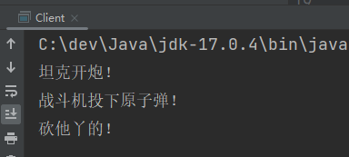  
简单工厂模式的**优点**：

- 客户端程序不需要关心对象的创建细节，需要哪个对象时，只需要向工厂索要即可，初步实现了责任的分离。客户端只负责“消费”，工厂负责“生产”。生产和消费分离。

简单工厂模式的**缺点**：

- 缺点1：工厂类集中了所有产品的创造逻辑，形成一个无所不知的全能类，有人把它叫做上帝类。显然工厂类非常关键，不能出问题，一旦出问题，整个系统瘫痪。
- 缺点2：不符合OCP开闭原则，在进行系统扩展时，需要修改工厂类。

**Spring中的BeanFactory就使用了简单工厂模式。**

## 6.3 工厂方法模式

工厂方法模式既保留了简单工厂模式的优点，同时又解决了简单工厂模式的缺点。  
工厂方法模式的角色包括：

- **抽象工厂角色**
- **具体工厂角色**
- 抽象产品角色
- 具体产品角色

代码如下：

```
package com.powernode.factory;

/**
 * 武器类（抽象产品角色）
 * @author 动力节点
 * @version 1.0
 * @className Weapon
 * @since 1.0
 **/
public abstract class Weapon {
    /**
     * 所有武器都有攻击行为
     */
    public abstract void attack();
}
```

```
package com.powernode.factory;

/**
 * 具体产品角色
 * @author 动力节点
 * @version 1.0
 * @className Gun
 * @since 1.0
 **/
public class Gun extends Weapon{
    @Override
    public void attack() {
        System.out.println("开枪射击！");
    }
}
```

```
package com.powernode.factory;

/**
 * 具体产品角色
 * @author 动力节点
 * @version 1.0
 * @className Fighter
 * @since 1.0
 **/
public class Fighter extends Weapon{
    @Override
    public void attack() {
        System.out.println("战斗机发射核弹！");
    }
}
```

```
package com.powernode.factory;

/**
 * 武器工厂接口(抽象工厂角色)
 * @author 动力节点
 * @version 1.0
 * @className WeaponFactory
 * @since 1.0
 **/
public interface WeaponFactory {
    Weapon get();
}
```

```
package com.powernode.factory;

/**
 * 具体工厂角色
 * @author 动力节点
 * @version 1.0
 * @className GunFactory
 * @since 1.0
 **/
public class GunFactory implements WeaponFactory{
    @Override
    public Weapon get() {
        return new Gun();
    }
}
```

```
package com.powernode.factory;

/**
 * 具体工厂角色
 * @author 动力节点
 * @version 1.0
 * @className FighterFactory
 * @since 1.0
 **/
public class FighterFactory implements WeaponFactory{
    @Override
    public Weapon get() {
        return new Fighter();
    }
}
```

客户端程序：

```
package com.powernode.factory;

/**
 * @author 动力节点
 * @version 1.0
 * @className Client
 * @since 1.0
 **/
public class Client {
    public static void main(String[] args) {
        WeaponFactory factory = new GunFactory();
        Weapon weapon = factory.get();
        weapon.attack();

        WeaponFactory factory1 = new FighterFactory();
        Weapon weapon1 = factory1.get();
        weapon1.attack();
    }
}
```

执行客户端程序：  
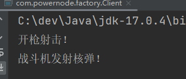  
如果想扩展一个新的产品，只要新增一个产品类，再新增一个该产品对应的工厂即可，例如新增：匕首

```
package com.powernode.factory;

/**
 * @author 动力节点
 * @version 1.0
 * @className Dagger
 * @since 1.0
 **/
public class Dagger extends Weapon{
    @Override
    public void attack() {
        System.out.println("砍丫的！");
    }
}
```

```
package com.powernode.factory;

/**
 * @author 动力节点
 * @version 1.0
 * @className DaggerFactory
 * @since 1.0
 **/
public class DaggerFactory implements WeaponFactory{
    @Override
    public Weapon get() {
        return new Dagger();
    }
}
```

客户端程序：

```
package com.powernode.factory;

/**
 * @author 动力节点
 * @version 1.0
 * @className Client
 * @since 1.0
 **/
public class Client {
    public static void main(String[] args) {
        WeaponFactory factory = new GunFactory();
        Weapon weapon = factory.get();
        weapon.attack();

        WeaponFactory factory1 = new FighterFactory();
        Weapon weapon1 = factory1.get();
        weapon1.attack();

        WeaponFactory factory2 = new DaggerFactory();
        Weapon weapon2 = factory2.get();
        weapon2.attack();
    }
}
```

执行结果如下：  
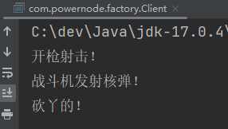  
我们可以看到在进行功能扩展的时候，不需要修改之前的源代码，显然工厂方法模式符合OCP原则。  
工厂方法模式的优点：

- 一个调用者想创建一个对象，只要知道其名称就可以了。
- 扩展性高，如果想增加一个产品，只要扩展一个工厂类就可以。
- 屏蔽产品的具体实现，调用者只关心产品的接口。

工厂方法模式的缺点：

- 每次增加一个产品时，都需要增加一个具体类和对象实现工厂，使得系统中类的个数成倍增加，在一定程度上增加了系统的复杂度，同时也增加了系统具体类的依赖。这并不是什么好事。

## 6.4 抽象工厂模式（了解）

抽象工厂模式相对于工厂方法模式来说，就是工厂方法模式是针对一个产品系列的，而抽象工厂模式是针对多个产品系列的，即工厂方法模式是一个产品系列一个工厂类，而抽象工厂模式是多个产品系列一个工厂类。  
抽象工厂模式特点：抽象工厂模式是所有形态的工厂模式中最为抽象和最具一般性的一种形态。抽象工厂模式是指当有多个抽象角色时，使用的一种工厂模式。抽象工厂模式可以向客户端提供一个接口，使客户端在不必指定产品的具体的情况下，创建多个产品族中的产品对象。它有多个抽象产品类，每个抽象产品类可以派生出多个具体产品类，一个抽象工厂类，可以派生出多个具体工厂类，每个具体工厂类可以创建多个具体产品类的实例。每一个模式都是针对一定问题的解决方案，工厂方法模式针对的是一个产品等级结构；而抽象工厂模式针对的是多个产品等级结果。  
抽象工厂中包含4个角色：

- 抽象工厂角色
- 具体工厂角色
- 抽象产品角色
- 具体产品角色

抽象工厂模式的类图如下：  
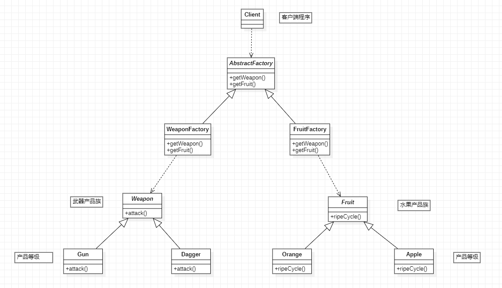  
抽象工厂模式代码如下：  
第一部分：武器产品族

```
package com.powernode.product;

/**
 * 武器产品族
 * @author 动力节点
 * @version 1.0
 * @className Weapon
 * @since 1.0
 **/
public abstract class Weapon {
    public abstract void attack();
}
```

```
package com.powernode.product;

/**
 * 武器产品族中的产品等级1
 * @author 动力节点
 * @version 1.0
 * @className Gun
 * @since 1.0
 **/
public class Gun extends Weapon{
    @Override
    public void attack() {
        System.out.println("开枪射击！");
    }
}
```

```
package com.powernode.product;

/**
 * 武器产品族中的产品等级2
 * @author 动力节点
 * @version 1.0
 * @className Dagger
 * @since 1.0
 **/
public class Dagger extends Weapon{
    @Override
    public void attack() {
        System.out.println("砍丫的！");
    }
}
```

第二部分：水果产品族

```
package com.powernode.product;

/**
 * 水果产品族
 * @author 动力节点
 * @version 1.0
 * @className Fruit
 * @since 1.0
 **/
public abstract class Fruit {
    /**
     * 所有果实都有一个成熟周期。
     */
    public abstract void ripeCycle();
}
```

```
package com.powernode.product;

/**
 * 水果产品族中的产品等级1
 * @author 动力节点
 * @version 1.0
 * @className Orange
 * @since 1.0
 **/
public class Orange extends Fruit{
    @Override
    public void ripeCycle() {
        System.out.println("橘子的成熟周期是10个月");
    }
}
```

```
package com.powernode.product;

/**
 * 水果产品族中的产品等级2
 * @author 动力节点
 * @version 1.0
 * @className Apple
 * @since 1.0
 **/
public class Apple extends Fruit{
    @Override
    public void ripeCycle() {
        System.out.println("苹果的成熟周期是8个月");
    }
}
```

第三部分：抽象工厂类

```
package com.powernode.factory;

import com.powernode.product.Fruit;
import com.powernode.product.Weapon;

/**
 * 抽象工厂
 * @author 动力节点
 * @version 1.0
 * @className AbstractFactory
 * @since 1.0
 **/
public abstract class AbstractFactory {
    public abstract Weapon getWeapon(String type);
    public abstract Fruit getFruit(String type);
}
```

第四部分：具体工厂类

```
package com.powernode.factory;

import com.powernode.product.Dagger;
import com.powernode.product.Fruit;
import com.powernode.product.Gun;
import com.powernode.product.Weapon;

/**
 * 武器族工厂
 * @author 动力节点
 * @version 1.0
 * @className WeaponFactory
 * @since 1.0
 **/
public class WeaponFactory extends AbstractFactory{

    public Weapon getWeapon(String type){
        if (type == null || type.trim().length() == 0) {
            return null;
        }
        if ("Gun".equals(type)) {
            return new Gun();
        } else if ("Dagger".equals(type)) {
            return new Dagger();
        } else {
            throw new RuntimeException("无法生产该武器");
        }
    }

    @Override
    public Fruit getFruit(String type) {
        return null;
    }
}
```

```
package com.powernode.factory;

import com.powernode.product.*;

/**
 * 水果族工厂
 * @author 动力节点
 * @version 1.0
 * @className FruitFactory
 * @since 1.0
 **/
public class FruitFactory extends AbstractFactory{
    @Override
    public Weapon getWeapon(String type) {
        return null;
    }

    public Fruit getFruit(String type){
        if (type == null || type.trim().length() == 0) {
            return null;
        }
        if ("Orange".equals(type)) {
            return new Orange();
        } else if ("Apple".equals(type)) {
            return new Apple();
        } else {
            throw new RuntimeException("我家果园不产这种水果");
        }
    }
}
```

第五部分：客户端程序

```
package com.powernode.client;

import com.powernode.factory.AbstractFactory;
import com.powernode.factory.FruitFactory;
import com.powernode.factory.WeaponFactory;
import com.powernode.product.Fruit;
import com.powernode.product.Weapon;

/**
 * @author 动力节点
 * @version 1.0
 * @className Client
 * @since 1.0
 **/
public class Client {
    public static void main(String[] args) {
        // 客户端调用方法时只面向AbstractFactory调用方法。
        AbstractFactory factory = new WeaponFactory(); // 注意：这里的new WeaponFactory()可以采用 简单工厂模式 进行隐藏。
        Weapon gun = factory.getWeapon("Gun");
        Weapon dagger = factory.getWeapon("Dagger");

        gun.attack();
        dagger.attack();

        AbstractFactory factory1 = new FruitFactory(); // 注意：这里的new FruitFactory()可以采用 简单工厂模式 进行隐藏。
        Fruit orange = factory1.getFruit("Orange");
        Fruit apple = factory1.getFruit("Apple");

        orange.ripeCycle();
        apple.ripeCycle();
    }
}
```

执行结果：  
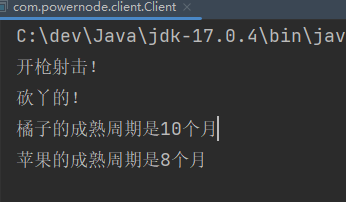  
抽象工厂模式的优缺点：

- 优点：当一个产品族中的多个对象被设计成一起工作时，它能保证客户端始终只使用同一个产品族中的对象。
- 缺点：产品族扩展非常困难，要增加一个系列的某一产品，既要在AbstractFactory里加代码，又要在具体的里面加代码。

---

# 七、Bean的实例化方式

Spring为Bean提供了多种实例化方式，通常包括4种方式。（也就是说在Spring中为Bean对象的创建准备了多种方案，目的是：更加灵活）

- 第一种：通过构造方法实例化
- 第二种：通过简单工厂模式实例化
- 第三种：通过factory-bean（工厂方法模式）实例化
- 第四种：通过FactoryBean接口实例化

## 7.1 构造方法实例化（最常用）

我们之前一直使用的就是这种方式。默认情况下，会调用Bean的无参数构造方法。

```
package com.powernode.spring6.bean;

public class User {
    public User() {
        System.out.println("User类的无参数构造方法执行。");
    }
}
```

```
<?xml version="1.0" encoding="UTF-8"?>
<beans xmlns="http://www.springframework.org/schema/beans"
       xmlns:xsi="http://www.w3.org/2001/XMLSchema-instance"
       xsi:schemaLocation="http://www.springframework.org/schema/beans http://www.springframework.org/schema/beans/spring-beans.xsd">

    <bean id="userBean" class="com.powernode.spring6.bean.User"/>

</beans>
```

```
package com.powernode.spring6.test;

import com.powernode.spring6.bean.User;
import org.junit.Test;
import org.springframework.context.ApplicationContext;
import org.springframework.context.support.ClassPathXmlApplicationContext;


public class SpringInstantiationTest {

    @Test
    public void testConstructor(){
        ApplicationContext applicationContext = new ClassPathXmlApplicationContext("spring.xml");
        User user = applicationContext.getBean("userBean", User.class);
        System.out.println(user);
    }
}
```

执行结果：  
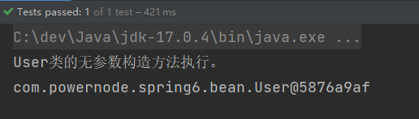

---

## 7.2 静态工厂模式实例化

第一步：定义一个Bean

```
package com.powernode.spring6.bean;

public class Vip {
}
```

第二步：编写简单工厂模式当中的工厂类

```
package com.powernode.spring6.bean;

public class VipFactory {
    public static Vip get(){
        return new Vip();
    }
}
```

第三步：在Spring配置文件中指定创建该Bean的方法

使用**factory-method**属性指定的是工厂类当中的静态方法，也就是告诉 Spring 框架，调用这个方法获取 bean

还是调用的构造方法

```
<bean id="vipBean" class="com.powernode.spring6.bean.VipFactory" factory-method="get"/>
```

第四步：编写测试程序

```
@Test
public void testSimpleFactory(){
    ApplicationContext applicationContext = new ClassPathXmlApplicationContext("spring.xml");
    Vip vip = applicationContext.getBean("vipBean", Vip.class);
    System.out.println(vip);
}
```

执行结果：  
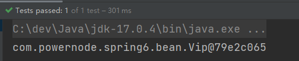

---

## 7.3 实例工厂 factory-bean实例化

这种方式本质上是：通过工厂方法模式进行实例化。

通过 factory-bean 属性 + factory-method 属性共同完成，告诉 Spring 框架，调用哪个对象的哪个方法来获取 bean  
第一步：定义一个Bean

```
package com.powernode.spring6.bean;

public class Order {
}
```

第二步：定义具体工厂类，工厂类中定义实例方法

```
package com.powernode.spring6.bean;

public class OrderFactory {
    public Order get(){
        return new Order();
    }
}
```

第三步：在Spring配置文件中指定**factory-bean**以及**factory-method**

```
<bean id="orderFactory" class="com.powernode.spring6.bean.OrderFactory"/>
<bean id="orderBean" factory-bean="orderFactory" factory-method="get"/>
```

第四步：编写测试程序

```
@Test
public void testSelfFactoryBean(){
    ApplicationContext applicationContext = new ClassPathXmlApplicationContext("spring.xml");
    Order orderBean = applicationContext.getBean("orderBean", Order.class);
    System.out.println(orderBean);
}
```

执行结果：  
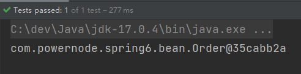

---

## 7.4 FactoryBean接口实例化（实用）

以上的第三种方式中，factory-bean是我们自定义的，factory-method也是我们自己定义的。  
在Spring中，当你编写的类直接实现FactoryBean接口之后，factory-bean不需要指定了，factory-method也不需要指定了。  
factory-bean会自动指向实现FactoryBean接口的类，factory-method会自动指向getObject()方法。  
第一步：定义一个Bean

```
package com.powernode.spring6.bean;

public class Person {
}
```

第二步：编写一个类实现FactoryBean接口

```
package com.powernode.spring6.bean;

import org.springframework.beans.factory.FactoryBean;

public class PersonFactoryBean implements FactoryBean<Person> {

    @Override
    public Person getObject() throws Exception {
        
        return new Person();
    }

    @Override
    public Class<?> getObjectType() {
        return null;
    }
    //这个方法在接口中有默认实现
    // 默认返回true表示单例，false表示多例
    @Override
    public boolean isSingleton() {
        // true表示单例
        // false表示原型
        return true;
    }
}
```

第三步：在Spring配置文件中配置FactoryBean

```
<bean id="personBean" class="com.powernode.spring6.bean.PersonFactoryBean"/>
```

测试程序：

```
@Test
public void testFactoryBean(){
    ApplicationContext applicationContext = new ClassPathXmlApplicationContext("spring.xml");
    Person personBean = applicationContext.getBean("personBean", Person.class);
    System.out.println(personBean);

    Person personBean2 = applicationContext.getBean("personBean", Person.class);
    System.out.println(personBean2);
}
```

执行结果：  
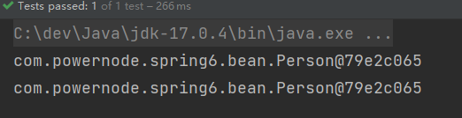  
**FactoryBean****在Spring中是一个接口。被称为“工厂Bean”。“工厂Bean”是一种特殊的Bean。所有的“工厂Bean”都是用来协助Spring框架来创建其他Bean对象的。**

## 7.5 BeanFactory和FactoryBean的区别

### 7.5.1 BeanFactory

ApplicationContext 继承了BeanFactory

Spring IoC容器的顶级对象，BeanFactory被翻译为“Bean工厂”，在Spring的IoC容器中，“Bean工厂”负责创建Bean对象。  
BeanFactory是**工厂**。

### 7.5.2 FactoryBean

凡是实现了 FactoryBean 这个接口的类都是工厂 bean

FactoryBean：它是一个Bean，是一个能够**辅助Spring**实例化其它Bean对象的一个Bean。  
在Spring中，Bean可以分为两类：

- 第一类：普通Bean
- 第二类：工厂Bean（记住：工厂Bean也是一种Bean，只不过这种Bean比较特殊，它可以辅助Spring实例化其它Bean对象。）

---

## 7.6 注入自定义Date

java.util.Date在Spring中被当做简单类型，简单类型在注入的时候可以直接使用value属性或value标签来完成。

对于Date类型来说，采用value属性或value标签赋值的时候，对日期字符串的格式要求非常严格，必须是这种格式的：Mon Oct 10 14:30:26 CST 2022。其他格式是不会被识别的。

  
编写DateFactoryBean实现**FactoryBean接口**：

```
package com.powernode.spring6.bean;

import org.springframework.beans.factory.FactoryBean;

import java.text.SimpleDateFormat;
import java.util.Date;

/**
 * @author DriftBoat
 * @version 1.0
 * @className DateFactoryBean
 * @since 1.0
 **/
public class DateFactoryBean implements FactoryBean<Date> {

    // 定义属性接收日期字符串
    private String date;

    // 通过构造方法给日期字符串属性赋值
    public DateFactoryBean(String date) {
        this.date = date;
    }

    @Override
    public Date getObject() throws Exception {
        SimpleDateFormat sdf = new SimpleDateFormat("yyyy-MM-dd");
        return sdf.parse(this.date);
    }

    @Override
    public Class<?> getObjectType() {
        return Date.class;
    }
}
```

编写spring配置文件：

```
<!--通过工厂bean；DateFactoryBean来返回普通bean：java.util.Date  -->
<bean id="dateBean" class="com.powernode.spring6.bean.DateFactoryBean">
  <constructor-arg name="date" value="1999-10-11"/>
</bean>

<bean id="studentBean" class="com.powernode.spring6.bean.Student">
  <property name="birth" ref="dateBean"/>
</bean>
```

执行测试程序：  
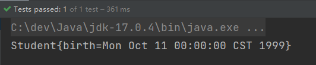  
  

### 7.61 为什么 `getObject()` 没有被显式调用，却能输出时间？

**Spring 容器在创建 Bean 的时候，会自动调用** `**getObject()**`

Spring 在解析这个 `<bean>` 元素时，发现它的类是 `FactoryBean<Date>`，于是它会：

1. **实例化** `**DateFactoryBean**` **对象**
2. **调用** `**getObject()**` **方法**，获取真正的对象（即 `Date`）
3. 把 `getObject()` 返回的 `Date` 对象注册到容器中，作为名为 `birthDate` 的 Bean

### 7.62 关键点：`FactoryBean` 的作用

`FactoryBean` 是一个工厂接口，它的作用是：

- 让你自定义如何创建某个对象。
- 你可以封装复杂的初始化逻辑（例如解析字符串、从数据库读取等）。
- 最终返回的对象不是 `FactoryBean` 本身，而是 `getObject()` 返回的那个对象。

# 八、Bean的生命周期

## 8.1 什么是Bean的生命周期

Spring其实就是一个管理Bean对象的工厂。它负责对象的创建，对象的销毁等。  
所谓的生命周期就是：对象从创建开始到最终销毁的整个过程。

四个问题：  
什么时候创建Bean对象？  
创建Bean对象的前后会调用什么方法？  
Bean对象什么时候销毁？  
Bean对象的销毁前后调用什么方法？

## 8.2 为什么要知道Bean的生命周期

其实生命周期的本质是：在哪个时间节点上调用了哪个类的哪个方法。  
我们需要充分的了解在这个生命线上，都有哪些特殊的时间节点。  
只有我们知道了特殊的时间节点都在哪，到时我们才可以确定代码写到哪。  
我们可能需要在某个特殊的时间点上执行一段特定的代码，这段代码就可以放到这个节点上。当生命线走到这里的时候，自然会被调用。

## 8.3 Bean的生命周期之5步

Bean生命周期的管理，可以参考Spring的源码：**AbstractAutowireCapableBeanFactory类的doCreateBean()方法。**  
Bean生命周期可以粗略的划分为五大步：

- 第一步：**实例化Bean**

调用无参数构造方法

- 第二步：**Bean属性赋值**

调用 set 方法

- 第三步：**初始化Bean**

会调用 bean 的 init 方法。注意：这个 init 方法需要自己写，自己配

- 第四步：**使用Bean**
- 第五步：**销毁Bean**

会调用 bean 的 **destroy** 方法，注意：这个 destroy 方法需要自己写，自己配

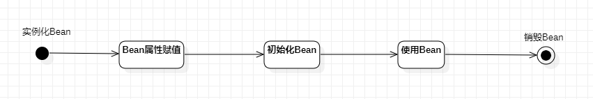  
编写测试程序：  
定义一个Bean

```
package com.powernode.spring6.bean;

public class User {
    private String name;

    public User() {
        System.out.println("1.实例化Bean");
    }

    public void setName(String name) {
        this.name = name;
        System.out.println("2.Bean属性赋值");
    }

    public void initBean(){
        System.out.println("3.初始化Bean");
    }

    public void destroyBean(){
        System.out.println("5.销毁Bean");
    }

}
```

init-method属性指定初始化方法。

destroy-method属性指定销毁方法。

<bean id="userBean" class="com.powernode.spring6.bean.User" init-method="initBean" destroy-method="destroyBean">

```
<?xml version="1.0" encoding="UTF-8"?>
<beans xmlns="http://www.springframework.org/schema/beans"
       xmlns:xsi="http://www.w3.org/2001/XMLSchema-instance"
       xsi:schemaLocation="http://www.springframework.org/schema/beans http://www.springframework.org/schema/beans/spring-beans.xsd">

    <!--
    init-method属性指定初始化方法。
    destroy-method属性指定销毁方法。
    -->
    <bean id="userBean" class="com.powernode.spring6.bean.User" init-method="initBean" destroy-method="destroyBean">
        <property name="name" value="zhangsan"/>
    </bean>
</beans>
```

```
package com.powernode.spring6.test;

import com.powernode.spring6.bean.User;
import org.junit.Test;
import org.springframework.context.ApplicationContext;
import org.springframework.context.support.ClassPathXmlApplicationContext;

public class BeanLifecycleTest {
    @Test
    public void testLifecycle(){
        ApplicationContext applicationContext = new ClassPathXmlApplicationContext("spring.xml");
        //ClassPathXmlApplicationContext ctx = new ClassPathXmlApplicationContext("spring.xml");
        //ctx.registerShutdownHook();
        User userBean = applicationContext.getBean("userBean", User.class);
        System.out.println("4.使用Bean");
        // 只有正常关闭spring容器才会执行销毁方法
        ClassPathXmlApplicationContext context = (ClassPathXmlApplicationContext) applicationContext;
        context.close();
    }
}
```

执行结果：  
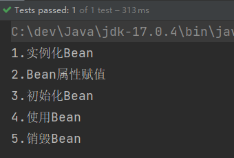  
需要注意的：

- 第一：只有正常关闭spring容器，bean的销毁方法才会被调用。
- 第二：ClassPathXmlApplicationContext类才有close()方法。
- 第三：配置文件中的init-method指定初始化方法。destroy-method指定销毁方法。

**容器关闭前触发 bean 的销毁**

- **关闭容器方式：**

- 手工关闭容器  
    `ConfigurableApplicationContext` 接口的 `close()` 操作
- 注册关闭钩子，在虚拟机退出前先关闭容器再退出虚拟机  
    `ConfigurableApplicationContext` 接口的 `registerShutdownHook()` 操作

```
public class AppForLifeCycle {
    public static void main(String[] args) {
        ClassPathXmlApplicationContext ctx = new ClassPathXmlApplicationContext("applicationContext.xml");
        ctx.close();
    }
}
```

**使用接口控制生命周期：**

实现**InitializingBean**，**DisposableBean** 接口

就不需要写 init-method="initBean" destroy-method="destroyBean" 这些了

```
public class BookServiceImpl implements BookService, InitializingBean, DisposableBean {
    private BookDao bookDao;

    public void setBookDao(BookDao bookDao) {
        System.out.println("set .....");
        this.bookDao = bookDao;
    }

    public void save() {
        System.out.println("book service save ...");
        bookDao.save();
    }

    public void destroy() throws Exception {
        System.out.println("service destroy");
    }

    //当属性运行完之后才运行这个操作
    public void afterPropertiesSet() throws Exception {
        System.out.println("service init");
    }
}
```

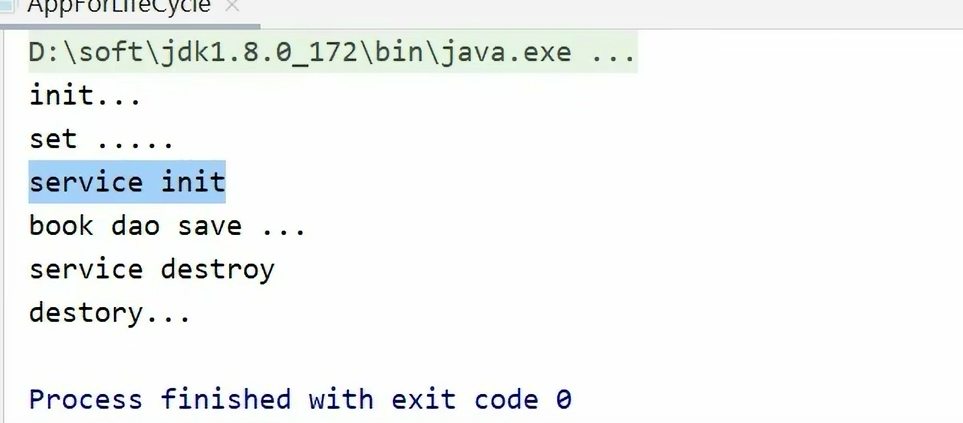

## 8.4 Bean生命周期之7步

在以上的5步中，第3步是初始化Bean，如果你还想在初始化前和初始化后添加代码，可以加入**“Bean后处理器”**。  
编写一个类实现**BeanPostProcessor**类，并且重写before和after方法：

```
package com.powernode.spring6.bean;

import org.springframework.beans.BeansException;
import org.springframework.beans.factory.config.BeanPostProcessor;

public class LogBeanPostProcessor implements BeanPostProcessor {
    @Override
    public Object postProcessBeforeInitialization(Object bean, String beanName) throws BeansException {
        System.out.println("Bean后处理器的before方法执行，即将开始初始化");
        return bean;
    }

    @Override
    public Object postProcessAfterInitialization(Object bean, String beanName) throws BeansException {
        System.out.println("Bean后处理器的after方法执行，已完成初始化");
        return bean;
    }
}
```

方法有两个参数：

第一个参数：刚创建的 bean 对象

第二个参数：bean 的名字

在spring.xml文件中配置“Bean后处理器”：

```
<!--配置Bean后处理器。这个后处理器将作用于当前配置文件中所有的bean。-->
<bean class="com.powernode.spring6.bean.LogBeanPostProcessor"/>
```

**注意：在spring.xml文件中配置的Bean后处理器将作用于当前配置文件中****所有的Bean****。**

  
执行测试程序：  
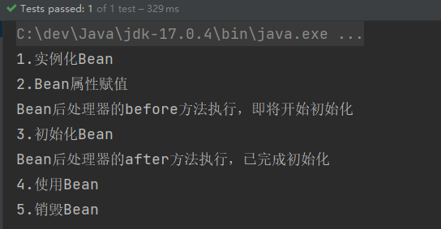  
如果加上Bean后处理器的话，Bean的生命周期就是7步了：  
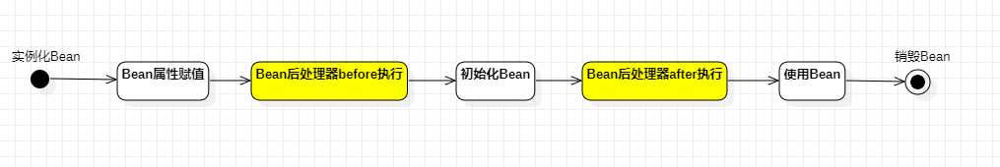

## 8.5 Bean生命周期之10步

如果根据源码跟踪，可以划分更细粒度的步骤，10步：  
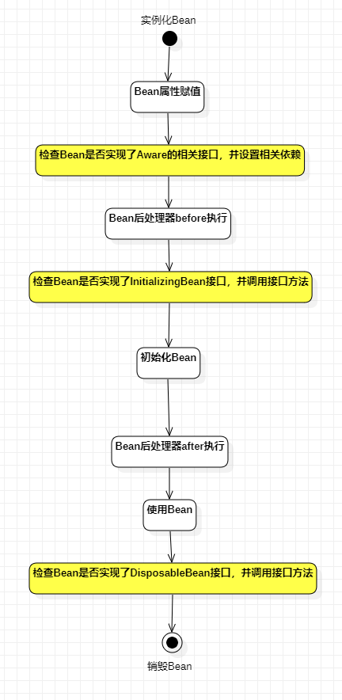x

添加的三个点位的特点：

都是检查你这个 bean 是否实现了某些特定的接口，如果实现了这些接口，则 Spring 容器会调用这个接口的方法

  
上图中检查Bean是否实现了**Aware**的相关接口是什么意思？  
Aware相关的接口包括：**BeanNameAware**、**BeanClassLoaderAware**、**BeanFactoryAware**

- 当Bean实现了BeanNameAware，Spring会将Bean的名字传递给Bean。
- 当Bean实现了BeanClassLoaderAware，Spring会将加载该Bean的类加载器传递给Bean。
- 当Bean实现了BeanFactoryAware，Spring会将Bean工厂对象传递给Bean。

测试以上10步，可以让User类实现5个接口，并实现所有方法：

- BeanNameAware
- BeanClassLoaderAware
- BeanFactoryAware
- InitializingBean
- DisposableBean

代码如下：

```
package com.powernode.spring6.bean;

import org.springframework.beans.BeansException;
import org.springframework.beans.factory.*;

/**
 * @author 动力节点
 * @version 1.0
 * @className User
 * @since 1.0
 **/
public class User implements BeanNameAware, BeanClassLoaderAware, BeanFactoryAware, InitializingBean, DisposableBean {
    private String name;

    public User() {
        System.out.println("1.实例化Bean");
    }

    public void setName(String name) {
        this.name = name;
        System.out.println("2.Bean属性赋值");
    }

    public void initBean(){
        System.out.println("6.初始化Bean");
    }

    public void destroyBean(){
        System.out.println("10.销毁Bean");
    }

    @Override
    public void setBeanClassLoader(ClassLoader classLoader) {
        System.out.println("3.类加载器：" + classLoader);
    }

    @Override
    public void setBeanFactory(BeanFactory beanFactory) throws BeansException {
        System.out.println("3.Bean工厂：" + beanFactory);
    }

    @Override
    public void setBeanName(String name) {
        System.out.println("3.bean名字：" + name);
    }

    @Override
    public void destroy() throws Exception {
        System.out.println("9.DisposableBean destroy");
    }

    @Override
    public void afterPropertiesSet() throws Exception {
        System.out.println("5.afterPropertiesSet执行");
    }
}
```

```
package com.powernode.spring6.bean;

import org.springframework.beans.BeansException;
import org.springframework.beans.factory.config.BeanPostProcessor;

/**
 * @author 动力节点
 * @version 1.0
 * @className LogBeanPostProcessor
 * @since 1.0
 **/
public class LogBeanPostProcessor implements BeanPostProcessor {
    @Override
    public Object postProcessBeforeInitialization(Object bean, String beanName) throws BeansException {
        System.out.println("4.Bean后处理器的before方法执行，即将开始初始化");
        return bean;
    }

    @Override
    public Object postProcessAfterInitialization(Object bean, String beanName) throws BeansException {
        System.out.println("7.Bean后处理器的after方法执行，已完成初始化");
        return bean;
    }
}
```

执行结果：  
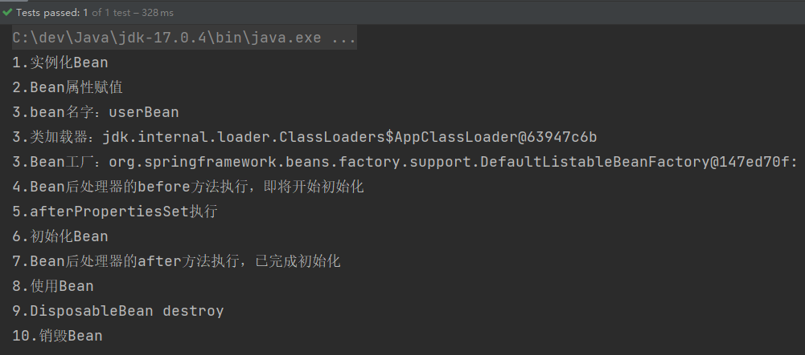  
**通过测试可以看出来：**

- **InitializingBean的方法早于init-method的执行。**
- **DisposableBean的方法早于destroy-method的执行。**

对于SpringBean的生命周期，掌握之前的7步即可。

## 8.6 Bean的作用域不同，管理方式不同

Spring 根据Bean的作用域来选择管理方式。

- 对于**singleton**作用域的Bean，Spring 能够精确地知道该Bean何时被创建，何时初始化完成，以及何时被销毁（进行完整的生命周期管理）；
- 而对于 **prototype** 作用域的 Bean，Spring 只负责创建（初始化完毕），当容器创建了 Bean 的实例后，Bean 的实例就交给客户端代码管理，Spring 容器将不再跟踪其生命周期。

User类的spring.xml文件中的配置scope设置为prototype：

```
<?xml version="1.0" encoding="UTF-8"?>
<beans xmlns="http://www.springframework.org/schema/beans"
       xmlns:xsi="http://www.w3.org/2001/XMLSchema-instance"
       xsi:schemaLocation="http://www.springframework.org/schema/beans http://www.springframework.org/schema/beans/spring-beans.xsd">

    <!--
    init-method属性指定初始化方法。
    destroy-method属性指定销毁方法。
    -->
    <bean id="userBean" class="com.powernode.spring6.bean.User" init-method="initBean" destroy-method="destroyBean" scope="prototype">
        <property name="name" value="zhangsan"/>
    </bean>
    <!--配置Bean后处理器。这个后处理器将作用于当前配置文件中所有的bean。-->
    <bean class="com.powernode.spring6.bean.LogBeanPostProcessor"/>

</beans>
```

执行测试程序：  
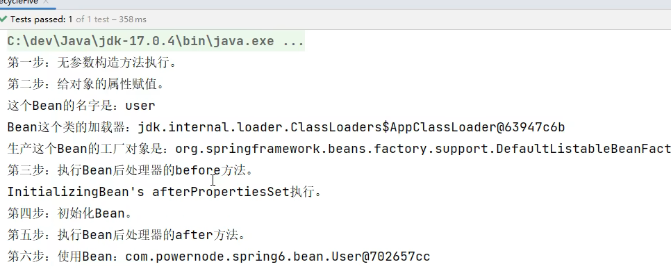  
  

## 8.7 自己new的对象如何让Spring管理

有些时候可能会遇到这样的需求，某个java对象是我们自己new的，然后我们希望这个对象被Spring容器管理，怎么实现？

```
package com.powernode.spring6.bean;

/**
 * @author 动力节点
 * @version 1.0
 * @className User
 * @since 1.0
 **/
public class User {
}
```

```
package com.powernode.spring6.test;

import com.powernode.spring6.bean.User;
import org.junit.Test;
import org.springframework.beans.factory.support.DefaultListableBeanFactory;

/**
 * @author 动力节点
 * @version 1.0
 * @className RegisterBeanTest
 * @since 1.0
 **/
public class RegisterBeanTest {

    @Test
    public void testBeanRegister(){
        // 自己new的对象
        User user = new User();
        System.out.println(user);

        // 创建 默认可列表BeanFactory 对象
        DefaultListableBeanFactory factory = new DefaultListableBeanFactory();
        // 注册Bean
        factory.registerSingleton("userBean", user);
        // 从spring容器中获取bean
        User userBean = factory.getBean("userBean", User.class);
        System.out.println(userBean);
    }
}
```

执行结果：  
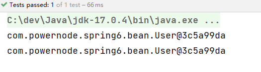

# 九、Bean的循环依赖问题

## 9.1 什么是Bean的循环依赖

A对象中有B属性。B对象中有A属性。这就是循环依赖。我依赖你，你也依赖我。  
比如：丈夫类Husband，妻子类Wife。Husband中有Wife的引用。Wife中有Husband的引用。  
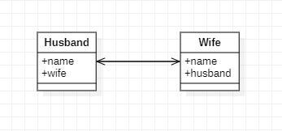

```
package com.powernode.spring6.bean;

public class Husband {
    private String name;
    private Wife wife;
}
```

```
package com.powernode.spring6.bean;

/**
 * @author 动力节点
 * @version 1.0
 * @className Wife
 * @since 1.0
 **/
public class Wife {
    private String name;
    private Husband husband;
}
```

---

## 9.2 singleton下的set注入产生的循环依赖

我们来编写程序，测试一下在singleton+setter的模式下产生的循环依赖，Spring是否能够解决？

```
package com.powernode.spring6.bean;

public class Husband {
    private String name;
    private Wife wife;

    public void setName(String name) {
        this.name = name;
    }

    public String getName() {
        return name;
    }

    public void setWife(Wife wife) {
        this.wife = wife;
    }

    // toString()方法重写时需要注意：不能直接输出wife，输出wife.getName()。要不然会出现递归导致的栈内存溢出错误。
    @Override
    public String toString() {
        return "Husband{" +
                "name='" + name + '\'' +
                ", wife=" + wife.getName() +
                '}';
    }
}
```

```
package com.powernode.spring6.bean;

public class Wife {
    private String name;
    private Husband husband;

    public void setName(String name) {
        this.name = name;
    }

    public String getName() {
        return name;
    }

    public void setHusband(Husband husband) {
        this.husband = husband;
    }

    // toString()方法重写时需要注意：不能直接输出husband，输出husband.getName()。要不然会出现递归导致的栈内存溢出错误。
    @Override
    public String toString() {
        return "Wife{" +
                "name='" + name + '\'' +
                ", husband=" + husband.getName() +
                '}';
    }
}
```

singleton + setter 模式下的循环依赖

singleton 表示在整个 Spring 容器当中是单例的，独一无二的对象

```
<?xml version="1.0" encoding="UTF-8"?>
<beans xmlns="http://www.springframework.org/schema/beans"
       xmlns:xsi="http://www.w3.org/2001/XMLSchema-instance"
       xsi:schemaLocation="http://www.springframework.org/schema/beans http://www.springframework.org/schema/beans/spring-beans.xsd">

    <bean id="husbandBean" class="com.powernode.spring6.bean.Husband" scope="singleton">
        <property name="name" value="张三"/>
        <property name="wife" ref="wifeBean"/>
    </bean>
  
    <bean id="wifeBean" class="com.powernode.spring6.bean.Wife" scope="singleton">
        <property name="name" value="小花"/>
        <property name="husband" ref="husbandBean"/>
    </bean>
  
</beans>
```

```
package com.powernode.spring6.test;

import com.powernode.spring6.bean.Husband;
import com.powernode.spring6.bean.Wife;
import org.junit.Test;
import org.springframework.context.ApplicationContext;
import org.springframework.context.support.ClassPathXmlApplicationContext;

public class CircularDependencyTest {

    @Test
    public void testSingletonAndSet(){
        ApplicationContext applicationContext = new ClassPathXmlApplicationContext("spring.xml");
        Husband husbandBean = applicationContext.getBean("husbandBean", Husband.class);
        Wife wifeBean = applicationContext.getBean("wifeBean", Wife.class);
        System.out.println(husbandBean);
        System.out.println(wifeBean);
    }
}
```

执行结果：  
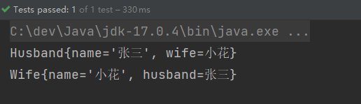  
**通过测试得知：在singleton + set注入的情况下，循环依赖是没有问题的。Spring可以解决这个问题。**

在singleton + setter 模式下，为什么循环依赖不会出现问题，Spring 是如何应对的？

主要的原因是，在这种设计模式下 Spring 和 Bean 的管理主要分为清晰的两个阶段：

第一个阶段：在 Spring 容器加载的时候，实例化 bean，只要其中任意一个 bean 实例化之后，马上进行“曝光”【不等属性赋值就曝光】

第二阶段：bean“曝光”之后，再进行属性的赋值（调用 set 方法）

核心解决方案是：实例化对象和对象的属性赋值是分为两个阶段来完成的

注意：只有在 scope 是 singleton 的情况下，bean 才会采取提前“曝光”的措施

## 9.3 prototype下的set注入产生的循环依赖

我们再来测试一下：prototype+set注入的方式下，循环依赖会不会出现问题？

```
<?xml version="1.0" encoding="UTF-8"?>
<beans xmlns="http://www.springframework.org/schema/beans"
       xmlns:xsi="http://www.w3.org/2001/XMLSchema-instance"
       xsi:schemaLocation="http://www.springframework.org/schema/beans http://www.springframework.org/schema/beans/spring-beans.xsd">

    <bean id="husbandBean" class="com.powernode.spring6.bean.Husband" scope="prototype">
        <property name="name" value="张三"/>
        <property name="wife" ref="wifeBean"/>
    </bean>
    <bean id="wifeBean" class="com.powernode.spring6.bean.Wife" scope="prototype">
        <property name="name" value="小花"/>
        <property name="husband" ref="husbandBean"/>
    </bean>
</beans>
```

执行测试程序：发生了异常，异常信息如下：  
Caused by: org.springframework.beans.factory.**BeanCurrentlyInCreationException**: Error creating bean with name 'husbandBean': Requested bean is currently in creation: Is there an unresolvable circular reference?  
at org.springframework.beans.factory.support.AbstractBeanFactory.doGetBean(AbstractBeanFactory.java:265)  
at org.springframework.beans.factory.support.AbstractBeanFactory.getBean(AbstractBeanFactory.java:199)  
at org.springframework.beans.factory.support.BeanDefinitionValueResolver.resolveReference(BeanDefinitionValueResolver.java:325)  
... 44 more  
翻译为：创建名为“husbandBean”的bean时出错：请求的bean当前正在创建中：是否存在无法解析的循环引用？  
通过测试得知，当循环依赖的**所有Bean**的scope="prototype"的时候，产生的循环依赖，Spring是无法解决的，会出现**BeanCurrentlyInCreationException**异常。  
大家可以测试一下，以上两个Bean，如果其中一个是singleton，另一个是prototype，是没有问题的。  
为什么两个Bean都是prototype时会出错呢？  
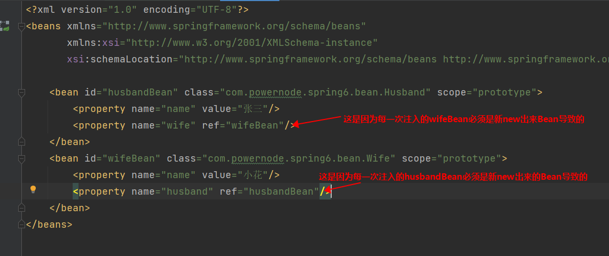

---

## 9.4 singleton下的构造注入产生的循环依赖

我们再来测试一下**singleton + 构造注入**的方式下，spring是否能够解决这种循环依赖。

```
package com.powernode.spring6.bean2;

public class Husband {
    private String name;
    private Wife wife;

    public Husband(String name, Wife wife) {
        this.name = name;
        this.wife = wife;
    }

    // -----------------------分割线--------------------------------
    public String getName() {
        return name;
    }

    @Override
    public String toString() {
        return "Husband{" +
                "name='" + name + '\'' +
                ", wife=" + wife +
                '}';
    }
}
```

```
package com.powernode.spring6.bean2;

/**
 * @author 动力节点
 * @version 1.0
 * @className Wife
 * @since 1.0
 **/
public class Wife {
    private String name;
    private Husband husband;

    public Wife(String name, Husband husband) {
        this.name = name;
        this.husband = husband;
    }

    // -------------------------分割线--------------------------------
    public String getName() {
        return name;
    }

    @Override
    public String toString() {
        return "Wife{" +
                "name='" + name + '\'' +
                ", husband=" + husband +
                '}';
    }
}
```

```
<?xml version="1.0" encoding="UTF-8"?>
<beans xmlns="http://www.springframework.org/schema/beans"
       xmlns:xsi="http://www.w3.org/2001/XMLSchema-instance"
       xsi:schemaLocation="http://www.springframework.org/schema/beans http://www.springframework.org/schema/beans/spring-beans.xsd">

    <bean id="hBean" class="com.powernode.spring6.bean2.Husband" scope="singleton">
        <constructor-arg name="name" value="张三"/>
        <constructor-arg name="wife" ref="wBean"/>
    </bean>
    <bean id="wBean" class="com.powernode.spring6.bean2.Wife" scope="singleton">
        <constructor-arg name="name" value="小花"/>
        <constructor-arg name="husband" ref="hBean"/>
    </bean>
</beans>
```

```
@Test
public void testSingletonAndConstructor(){
    ApplicationContext applicationContext = new ClassPathXmlApplicationContext("spring2.xml");
    Husband hBean = applicationContext.getBean("hBean", Husband.class);
    Wife wBean = applicationContext.getBean("wBean", Wife.class);
    System.out.println(hBean);
    System.out.println(wBean);
}
```

执行结果：发生了异常，信息如下：  
**BeanCurrentlyInCreationException**  
注意：基于构造注入的方式下产生的循环依赖也是无法解决的，所以编写代码的时候一定要注意  
  
**主要原因：**

**是因为通过构造方法注入导致的：因为构造方法注入会导致实例化对象的过程和对象属性赋值的过程没有分离开，必须在一起完成导致的。**

## 9.5 Spring解决循环依赖的机理

Spring为什么可以解决set + singleton模式下循环依赖？  
根本的原因在于：这种方式可以做到将“实例化Bean”和“给Bean属性赋值”这两个动作分开去完成。  
实例化Bean的时候：调用无参数构造方法来完成。**此时可以先不给属性赋值，可以提前将该Bean对象“曝光”给外界。**  
给Bean属性赋值的时候：调用setter方法来完成。  
两个步骤是完全可以分离开去完成的，并且这两步不要求在同一个时间点上完成。  
也就是说，Bean都是单例的，我们可以先把所有的单例Bean实例化出来，放到一个集合当中（我们可以称之为缓存），所有的单例Bean全部实例化完成之后，以后我们再慢慢的调用setter方法给属性赋值。这样就解决了循环依赖的问题。  
那么在Spring框架底层源码级别上是如何实现的呢？请看：  
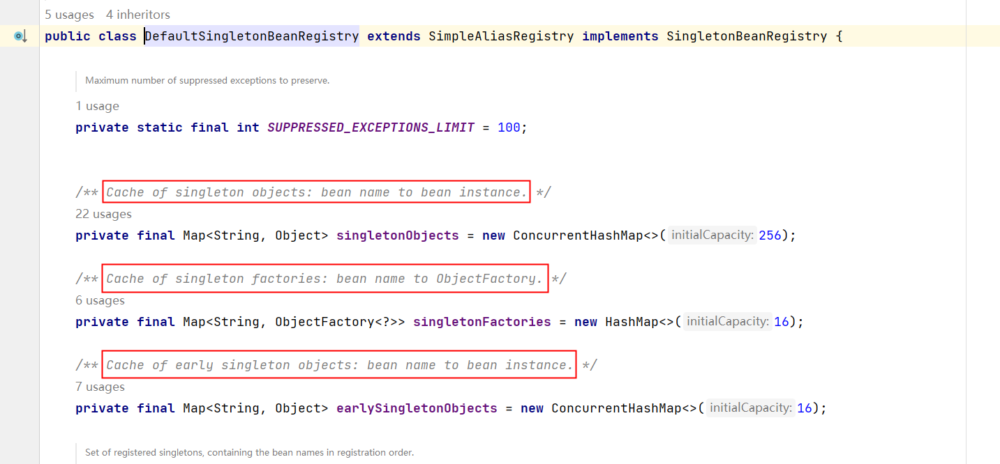  
在以上类中包含三个重要的属性：  
_**Cache of singleton objects: bean name to bean instance. **_**单例对象的缓存：key存储bean名称，value存储Bean对象【一级缓存】**  
_**Cache of early singleton objects: bean name to bean instance. **_**早期单例对象的缓存：key存储bean名称，value存储早期的Bean对象【二级缓存】**  
_**Cache of singleton factories: bean name to ObjectFactory. **_**单例工厂缓存：key存储bean名称，value存储该Bean对应的ObjectFactory对象【三级缓存】**  
这三个缓存其实本质上是三个Map集合。  
我们再来看，在该类中有这样一个方法addSingletonFactory()，这个方法的作用是：将创建Bean对象的ObjectFactory对象提前曝光。  
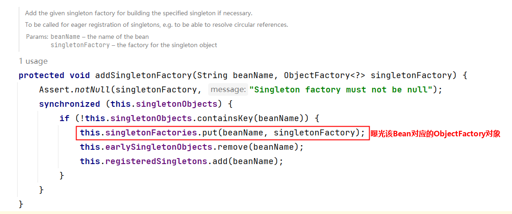  
再分析下面的源码：  
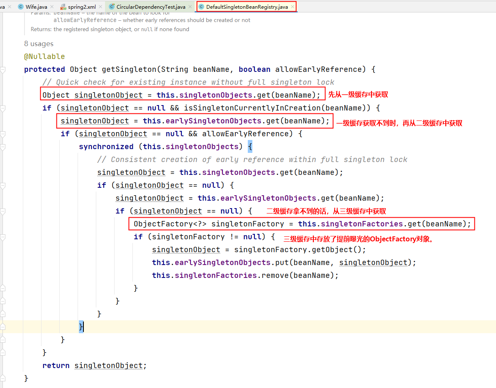  
从源码中可以看到，spring会先从一级缓存中获取Bean，如果获取不到，则从二级缓存中获取Bean，如果二级缓存还是获取不到，则从三级缓存中获取之前曝光的ObjectFactory对象，通过ObjectFactory对象获取Bean实例，这样就解决了循环依赖的问题。  
**总结：**  
**Spring只能解决setter方法注入的单例bean之间的循环依赖。ClassA依赖ClassB，ClassB又依赖ClassA，形成依赖闭环。Spring在创建ClassA对象后，不需要等给属性赋值，直接将其曝光到bean缓存当中。在解析ClassA的属性时，又发现依赖于ClassB，再次去获取ClassB，当解析ClassB的属性时，又发现需要ClassA的属性，但此时的ClassA已经被提前曝光加入了正在创建的bean的缓存中，则无需创建新的的ClassA的实例，直接从缓存中获取即可。从而解决循环依赖问题。**  
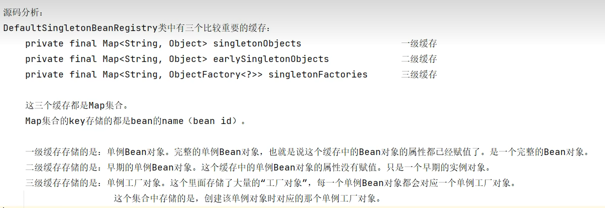

# 十、回顾反射机制

## 10.1 分析方法四要素

我们先来看一下，不使用反射机制调用一个方法需要几个要素的参与。  
有一个这样的类：

```
package com.powernode.reflect;

/**
 * @author 动力节点
 * @version 1.0
 * @className SystemService
 * @since 1.0
 **/
public class SystemService {
    
    public void logout(){
        System.out.println("退出系统");
    }

    public boolean login(String username, String password){
        if ("admin".equals(username) && "admin123".equals(password)) {
            return true;
        }
        return false;
    }
}
```

编写程序调用方法：

```
package com.powernode.reflect;

/**
 * @author 动力节点
 * @version 1.0
 * @className ReflectTest01
 * @since 1.0
 **/
public class ReflectTest01 {
    public static void main(String[] args) {

        // 创建对象
        SystemService systemService = new SystemService();

        // 调用方法并接收方法的返回值
        boolean success = systemService.login("admin", "admin123");

        System.out.println(success ? "登录成功" : "登录失败");
    }
}
```

执行结果：  
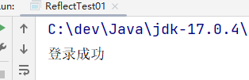  
通过以上第16行代码可以看出，调用一个方法，一般涉及到4个要素：

- 调用哪个对象的（systemService）
- 哪个方法（login）
- 传什么参数（"admin", "admin123"）
- 返回什么值（success）

## 10.2 获取Method

要使用反射机制调用一个方法，首先你要获取到这个方法。  
在反射机制中Method实例代表的是一个方法。那么怎么获取Method实例呢？  
有这样一个类：

```
package com.powernode.reflect;

/**
 * @author 动力节点
 * @version 1.0
 * @className SystemService
 * @since 1.0
 **/
public class SystemService {

    public void logout(){
        System.out.println("退出系统");
    }

    public boolean login(String username, String password){
        if ("admin".equals(username) && "admin123".equals(password)) {
            return true;
        }
        return false;
    }
    
    public boolean login(String password){
        if("110".equals(password)){
            return true;
        }
        return false;
    }
}
```

我们如何获取到 logout()、login(String,String)、login(String) 这三个方法呢？  
要获取方法Method，首先你需要获取这个类Class。

```
Class clazz = Class.forName("com.powernode.reflect.SystemService");
```

当拿到Class之后，调用getDeclaredMethod()方法可以获取到方法。  
假如你要获取这个方法：login(String username, String password)

```
Method loginMethod = clazz.getDeclaredMethod("login", String.class, String.class);
```

假如你要获取到这个方法：login(String password)

```
Method loginMethod = clazz.getDeclaredMethod("login", String.class);
```

获取一个方法，需要告诉Java程序，你要获取的方法的名字是什么，这个方法上每个形参的类型是什么。这样Java程序才能给你拿到对应的方法。  
这样的设计也非常合理，因为在同一个类当中，方法是支持重载的，也就是说方法名可以一样，但参数列表一定是不一样的，所以获取一个方法需要提供方法名以及每个形参的类型。  
假设有这样一个方法：

```
public void setAge(int age){
    this.age = age;
}
```

你要获取这个方法的话，代码应该这样写：

```
Method setAgeMethod = clazz.getDeclaredMethod("setAge", int.class);
```

其中setAge是方法名，int.class是形参的类型。  
如果要获取上面的logout方法，代码应该这样写：

```
Method logoutMethod = clazz.getDeclaredMethod("logout");
```

因为这个方法形式参数的个数是0个。所以只需要提供方法名就行了。你学会了吗？

## 10.3 调用Method

要让一个方法调用的话，就关联到四要素了：

- 调用哪个对象的
- 哪个方法
- 传什么参数
- 返回什么值

```
package com.powernode.reflect;

/**
 * @author 动力节点
 * @version 1.0
 * @className SystemService
 * @since 1.0
 **/
public class SystemService {

    public void logout(){
        System.out.println("退出系统");
    }

    public boolean login(String username, String password){
        if ("admin".equals(username) && "admin123".equals(password)) {
            return true;
        }
        return false;
    }

    public boolean login(String password){
        if("110".equals(password)){
            return true;
        }
        return false;
    }
}
```

假如我们要调用的方法是：login(String, String)  
第一步：创建对象（四要素之首：调用哪个对象的）

```
Class clazz = Class.forName("com.powernode.reflect.SystemService");
Object obj = clazz.newInstance();
```

第二步：获取方法login(String,String)（四要素之一：哪个方法）

```
Method loginMethod = clazz.getDeclaredMethod("login", String.class, String.class);
```

第三步：调用方法

```
Object retValue = loginMethod.invoke(obj, "admin", "admin123");
```

解说四要素：

- 哪个对象：obj
- 哪个方法：loginMethod
- 传什么参数："admin", "admin123"
- 返回什么值：retValue

```
package com.powernode.reflect;

import java.lang.reflect.Method;

/**
 * @author 动力节点
 * @version 1.0
 * @className ReflectTest02
 * @since 1.0
 **/
public class ReflectTest02 {
    public static void main(String[] args) throws Exception{
        Class clazz = Class.forName("com.powernode.reflect.SystemService");
        Object obj = clazz.newInstance();
        Method loginMethod = clazz.getDeclaredMethod("login", String.class, String.class);
        Object retValue = loginMethod.invoke(obj, "admin", "admin123");
        System.out.println(retValue);
    }
}
```

执行结果：  
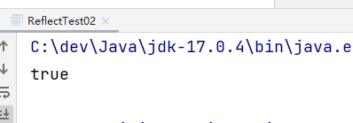  
那如果调用既没有参数，又没有返回值的logout方法，应该怎么做？

```
package com.powernode.reflect;

import java.lang.reflect.Method;

/**
 * @author 动力节点
 * @version 1.0
 * @className ReflectTest03
 * @since 1.0
 **/
public class ReflectTest03 {
    public static void main(String[] args) throws Exception{
        Class clazz = Class.forName("com.powernode.reflect.SystemService");
        Object obj = clazz.newInstance();
        Method logoutMethod = clazz.getDeclaredMethod("logout");
        logoutMethod.invoke(obj);
    }
}
```

执行结果：  
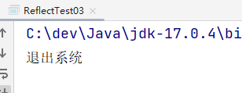


## 10.4 假设你知道属性名

假设有这样一个类：

```
package com.powernode.reflect;

/**
 * @author 动力节点
 * @version 1.0
 * @className User
 * @since 1.0
 **/
public class User {
    private String name;
    private int age;

    public String getName() {
        return name;
    }

    public void setName(String name) {
        this.name = name;
    }

    public int getAge() {
        return age;
    }

    public void setAge(int age) {
        this.age = age;
    }

    @Override
    public String toString() {
        return "User{" +
                "name='" + name + '\'' +
                ", age=" + age +
                '}';
    }
}
```

你知道以下这几条信息：

- 类名是：com.powernode.reflect.User
- 该类中有String类型的name属性和int类型的age属性。
- 另外你也知道该类的设计符合javabean规范。（也就是说属性私有化，对外提供setter和getter方法）

你如何通过反射机制给User对象的name属性赋值zhangsan，给age属性赋值20岁。

```
package com.powernode.reflect;

import java.lang.reflect.Method;

/**
 * @author 动力节点
 * @version 1.0
 * @className UserTest
 * @since 1.0
 **/
public class UserTest {
    public static void main(String[] args) throws Exception{
        // 已知类名
        String className = "com.powernode.reflect.User";
        // 已知属性名
        String propertyName = "age";

        // 通过反射机制给User对象的age属性赋值20岁
        Class<?> clazz = Class.forName(className);
        Object obj = clazz.newInstance(); // 创建对象

        // 根据属性名获取setter方法名
        String setMethodName = "set" + propertyName.toUpperCase().charAt(0) + propertyName.substring(1);

        // 获取Method
        Method setMethod = clazz.getDeclaredMethod(setMethodName, int.class);

        // 调用Method
        setMethod.invoke(obj, 20);

        System.out.println(obj);
    }
}
```

执行结果：  
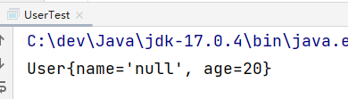  
给User的name属性赋值zhangsan，这个大家可以尝试自己完成哦！！！


# 十一、手写Spring框架

Spring IoC容器的实现原理：工厂模式 + 解析XML + 反射机制。  
我们给自己的框架起名为：myspring（我的春天）

## 第一步：创建模块myspring

采用Maven方式新建Module：myspring  
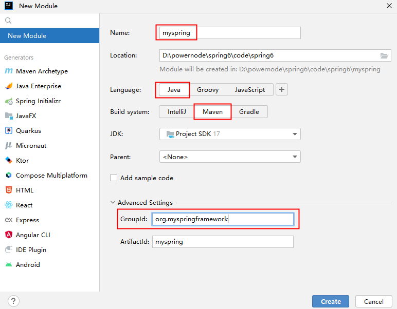  
打包方式采用jar，并且引入dom4j和jaxen的依赖，因为要使用它解析XML文件，还有junit依赖。

```
<?xml version="1.0" encoding="UTF-8"?>
<project xmlns="http://maven.apache.org/POM/4.0.0"
         xmlns:xsi="http://www.w3.org/2001/XMLSchema-instance"
         xsi:schemaLocation="http://maven.apache.org/POM/4.0.0 http://maven.apache.org/xsd/maven-4.0.0.xsd">
    <modelVersion>4.0.0</modelVersion>
    <groupId>org.myspringframework</groupId>
    <artifactId>myspring</artifactId>
    <version>1.0.0</version>
    <packaging>jar</packaging>
    <dependencies>
        <dependency>
            <groupId>org.dom4j</groupId>
            <artifactId>dom4j</artifactId>
            <version>2.1.3</version>
        </dependency>
        <dependency>
            <groupId>jaxen</groupId>
            <artifactId>jaxen</artifactId>
            <version>1.2.0</version>
        </dependency>
        <dependency>
            <groupId>junit</groupId>
            <artifactId>junit</artifactId>
            <version>4.13.2</version>
            <scope>test</scope>
        </dependency>
    </dependencies>
    <properties>
        <maven.compiler.source>17</maven.compiler.source>
        <maven.compiler.target>17</maven.compiler.target>
    </properties>
</project>
```

## 第二步：准备好我们要管理的Bean

准备好我们要管理的Bean（**这些Bean在将来开发完框架之后是要删除的**）  
注意包名，不要用org.myspringframework包，因为这些Bean不是框架内置的。是将来使用我们框架的程序员提供的。

```
package com.powernode.myspring.bean;

/**
 * @author 动力节点
 * @version 1.0
 * @className Address
 * @since 1.0
 **/
public class Address {
    private String city;
    private String street;
    private String zipcode;

    public Address() {
    }

    public String getCity() {
        return city;
    }

    public void setCity(String city) {
        this.city = city;
    }

    public String getStreet() {
        return street;
    }

    public void setStreet(String street) {
        this.street = street;
    }

    public String getZipcode() {
        return zipcode;
    }

    public void setZipcode(String zipcode) {
        this.zipcode = zipcode;
    }

    @Override
    public String toString() {
        return "Address{" +
                "city='" + city + '\'' +
                ", street='" + street + '\'' +
                ", zipcode='" + zipcode + '\'' +
                '}';
    }
}
```

```
package com.powernode.myspring.bean;

/**
 * @author 动力节点
 * @version 1.0
 * @className User
 * @since 1.0
 **/
public class User {
    private String name;
    private int age;
    private Address addr;

    public User() {
    }

    public String getName() {
        return name;
    }

    public void setName(String name) {
        this.name = name;
    }

    public int getAge() {
        return age;
    }

    public void setAge(int age) {
        this.age = age;
    }

    public Address getAddr() {
        return addr;
    }

    public void setAddr(Address addr) {
        this.addr = addr;
    }

    @Override
    public String toString() {
        return "User{" +
                "name='" + name + '\'' +
                ", age=" + age +
                ", addr=" + addr +
                '}';
    }
}
```

## 第三步：准备myspring.xml配置文件

将来在框架开发完毕之后，这个文件也是要删除的。因为这个配置文件的提供者应该是使用这个框架的程序员。  
文件名随意，我们这里叫做：myspring.xml  
文件放在类路径当中即可，我们这里把文件放到类的根路径下。

```
<?xml version="1.0" encoding="UTF-8"?>
<beans>

    <bean id="userBean" class="com.powernode.myspring.bean.User">
        <property name="name" value="张三"/>
        <property name="age" value="20"/>
        <property name="addr" ref="addrBean"/>
    </bean>
    
    <bean id="addrBean" class="com.powernode.myspring.bean.Address">
        <property name="city" value="北京"/>
        <property name="street" value="大兴区"/>
        <property name="zipcode" value="1000001"/>
    </bean>
</beans>
```

使用value给简单属性赋值。使用ref给非简单属性赋值。

## 第四步：编写ApplicationContext接口

ApplicationContext接口中提供一个getBean()方法，通过该方法可以获取Bean对象。  
注意包名：这个接口就是myspring框架中的一员了。

```
package org.myspringframework.core;

/**
 * @author 动力节点
 * @version 1.0
 * @className ApplicationContext
 * @since 1.0
 **/
public interface ApplicationContext {
    /**
     * 根据bean的id获取bean实例。
     * @param beanId bean的id
     * @return bean实例
     */
    Object getBean(String beanId);
}
```

## 第五步：编写ClassPathXmlApplicationContext

ClassPathXmlApplicationContext是ApplicationContext接口的实现类。该类从类路径当中加载myspring.xml配置文件。

```
package org.myspringframework.core;

/**
 * @author 动力节点
 * @version 1.0
 * @className ClassPathXmlApplicationContext
 * @since 1.0
 **/
public class ClassPathXmlApplicationContext implements ApplicationContext{
    @Override
    public Object getBean(String beanId) {
        return null;
    }
}
```

## 第六步：确定采用Map集合存储Bean

确定采用Map集合存储Bean实例。Map集合的key存储beanId，value存储Bean实例。Map<String,Object>  
在ClassPathXmlApplicationContext类中添加Map<String,Object>属性。  
并且在ClassPathXmlApplicationContext类中添加构造方法，该构造方法的参数接收myspring.xml文件。  
同时实现getBean方法。

```
package org.myspringframework.core;

import java.util.HashMap;
import java.util.Map;

/**
 * @author 动力节点
 * @version 1.0
 * @className ClassPathXmlApplicationContext
 * @since 1.0
 **/
public class ClassPathXmlApplicationContext implements ApplicationContext{
    /**
     * 存储bean的Map集合
     */
    private Map<String,Object> beanMap = new HashMap<>();

    /**
     * 在该构造方法中，解析myspring.xml文件，创建所有的Bean实例，并将Bean实例存放到Map集合中。
     * @param resource 配置文件路径（要求在类路径当中）
     */
    public ClassPathXmlApplicationContext(String resource) {

    }

    @Override
    public Object getBean(String beanId) {
        return beanMap.get(beanId);
    }
}
```

## 第七步：解析配置文件实例化所有Bean

在ClassPathXmlApplicationContext的构造方法中解析配置文件，获取所有bean的类名，通过反射机制调用无参数构造方法创建Bean。并且将Bean对象存放到Map集合中。

```
/**
* 在该构造方法中，解析myspring.xml文件，创建所有的Bean实例，并将Bean实例存放到Map集合中。
* @param resource 配置文件路径（要求在类路径当中）
*/
public ClassPathXmlApplicationContext(String resource) {
    try {
        SAXReader reader = new SAXReader();
        Document document = reader.read(ClassLoader.getSystemClassLoader().getResourceAsStream(resource));
        // 获取所有的bean标签
        List<Node> beanNodes = document.selectNodes("//bean");
        // 遍历集合
        beanNodes.forEach(beanNode -> {
            Element beanElt = (Element) beanNode;
            // 获取id
            String id = beanElt.attributeValue("id");
            // 获取className
            String className = beanElt.attributeValue("class");
            try {
                // 通过反射机制创建对象
                Class<?> clazz = Class.forName(className);
                Constructor<?> defaultConstructor = clazz.getDeclaredConstructor();
                Object bean = defaultConstructor.newInstance();
                // 存储到Map集合
                beanMap.put(id, bean);
            } catch (Exception e) {
                e.printStackTrace();
            }
        });
    } catch (Exception e) {
        e.printStackTrace();
    }
}
```

获取有多个同名的标签在前面加上//

List<Node> beanNodes = document.selectNodes("//bean");

## 第八步：测试能否获取到Bean

编写测试程序。

```
package com.powernode.myspring.test;

import org.junit.Test;
import org.myspringframework.core.ApplicationContext;
import org.myspringframework.core.ClassPathXmlApplicationContext;

/**
 * @author 动力节点
 * @version 1.0
 * @className MySpringTest
 * @since 1.0
 **/
public class MySpringTest {
    @Test
    public void testMySpring(){
        ApplicationContext applicationContext = new ClassPathXmlApplicationContext("myspring.xml");
        Object userBean = applicationContext.getBean("userBean");
        Object addrBean = applicationContext.getBean("addrBean");
        System.out.println(userBean);
        System.out.println(addrBean);
    }
}
```

执行结果：  
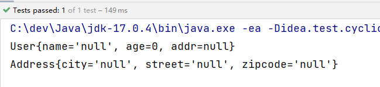  
通过测试Bean已经实例化成功了，属性的值是null，这是我们能够想到的，毕竟我们调用的是无参数构造方法，所以属性都是默认值。  
下一步就是我们应该如何给Bean的属性赋值呢？

## 第九步：给Bean的属性赋值

通过反射机制调用set方法，给Bean的属性赋值。  
继续在ClassPathXmlApplicationContext构造方法中编写代码。

```
package org.myspringframework.core;

import org.dom4j.Document;
import org.dom4j.Element;
import org.dom4j.Node;
import org.dom4j.io.SAXReader;

import java.lang.reflect.Constructor;
import java.lang.reflect.Method;
import java.util.HashMap;
import java.util.List;
import java.util.Map;

/**
 * @author 动力节点
 * @version 1.0
 * @className ClassPathXmlApplicationContext
 * @since 1.0
 **/
public class ClassPathXmlApplicationContext implements ApplicationContext{
    /**
     * 存储bean的Map集合
     */
    private Map<String,Object> beanMap = new HashMap<>();

    /**
     * 在该构造方法中，解析myspring.xml文件，创建所有的Bean实例，并将Bean实例存放到Map集合中。
     * @param resource 配置文件路径（要求在类路径当中）
     */
    public ClassPathXmlApplicationContext(String resource) {
        try {
            SAXReader reader = new SAXReader();
            Document document = reader.read(ClassLoader.getSystemClassLoader().getResourceAsStream(resource));
            // 获取所有的bean标签
            List<Node> beanNodes = document.selectNodes("//bean");
            // 遍历集合（这里的遍历只实例化Bean，不给属性赋值。为什么要这样做？）
            beanNodes.forEach(beanNode -> {
                Element beanElt = (Element) beanNode;
                // 获取id
                String id = beanElt.attributeValue("id");
                // 获取className
                String className = beanElt.attributeValue("class");
                try {
                    // 通过反射机制创建对象
                    Class<?> clazz = Class.forName(className);
                    Constructor<?> defaultConstructor = clazz.getDeclaredConstructor();
                    Object bean = defaultConstructor.newInstance();
                    // 存储到Map集合
                    beanMap.put(id, bean);
                } catch (Exception e) {
                    e.printStackTrace();
                }
            });
            // 再重新遍历集合，这次遍历是为了给Bean的所有属性赋值。
            // 思考：为什么不在上面的循环中给Bean的属性赋值，而在这里再重新遍历一次呢？
            // 通过这里你是否能够想到Spring是如何解决循环依赖的：实例化和属性赋值分开。
            beanNodes.forEach(beanNode -> {
                Element beanElt = (Element) beanNode;
                // 获取bean的id
                String beanId = beanElt.attributeValue("id");
                // 获取所有property标签
                List<Element> propertyElts = beanElt.elements("property");
                // 遍历所有属性
                propertyElts.forEach(propertyElt -> {
                    try {
                        // 获取属性名
                        String propertyName = propertyElt.attributeValue("name");
                        // 获取属性类型
                        Class<?> propertyType = beanMap.get(beanId).getClass().getDeclaredField(propertyName).getType();
                        // 获取set方法名
                        String setMethodName = "set" + propertyName.toUpperCase().charAt(0) + propertyName.substring(1);
                        // 获取set方法
                        Method setMethod = beanMap.get(beanId).getClass().getDeclaredMethod(setMethodName, propertyType);
                        // 获取属性的值，值可能是value，也可能是ref。
                        // 获取value
                        String propertyValue = propertyElt.attributeValue("value");
                        // 获取ref
                        String propertyRef = propertyElt.attributeValue("ref");
                        Object propertyVal = null;
                        if (propertyValue != null) {
                            // 该属性是简单属性
                            String propertyTypeSimpleName = propertyType.getSimpleName();
                            switch (propertyTypeSimpleName) {
                                case "byte": case "Byte":
                                    propertyVal = Byte.valueOf(propertyValue);
                                    break;
                                case "short": case "Short":
                                    propertyVal = Short.valueOf(propertyValue);
                                    break;
                                case "int": case "Integer":
                                    propertyVal = Integer.valueOf(propertyValue);
                                    break;
                                case "long": case "Long":
                                    propertyVal = Long.valueOf(propertyValue);
                                    break;
                                case "float": case "Float":
                                    propertyVal = Float.valueOf(propertyValue);
                                    break;
                                case "double": case "Double":
                                    propertyVal = Double.valueOf(propertyValue);
                                    break;
                                case "boolean": case "Boolean":
                                    propertyVal = Boolean.valueOf(propertyValue);
                                    break;
                                case "char": case "Character":
                                    propertyVal = propertyValue.charAt(0);
                                    break;
                                case "String":
                                    propertyVal = propertyValue;
                                    break;
                            }
                            setMethod.invoke(beanMap.get(beanId), propertyVal);
                        }
                        if (propertyRef != null) {
                            // 该属性不是简单属性
                            setMethod.invoke(beanMap.get(beanId), beanMap.get(propertyRef));
                        }
                    } catch (Exception e) {
                        e.printStackTrace();
                    }
                });
            });

        } catch (Exception e) {
            e.printStackTrace();
        }
    }

    @Override
    public Object getBean(String beanId) {
        return beanMap.get(beanId);
    }
}
```

重点处理：当property标签中是value怎么办？是ref怎么办？  
执行测试程序：  
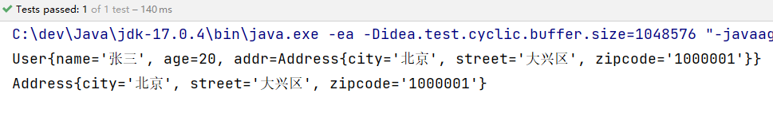

## 第十步：打包发布

将多余的类以及配置文件删除，使用maven打包发布。  
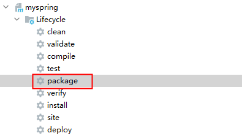  
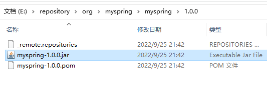

## 第十一步：站在程序员角度使用myspring框架

新建模块：myspring-test  
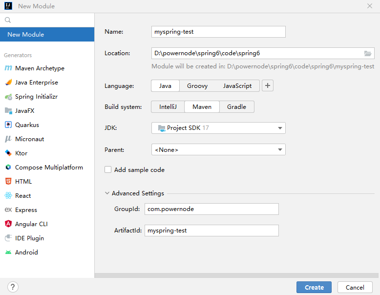  
引入myspring框架的依赖：

```
<?xml version="1.0" encoding="UTF-8"?>
<project xmlns="http://maven.apache.org/POM/4.0.0"
         xmlns:xsi="http://www.w3.org/2001/XMLSchema-instance"
         xsi:schemaLocation="http://maven.apache.org/POM/4.0.0 http://maven.apache.org/xsd/maven-4.0.0.xsd">
    <modelVersion>4.0.0</modelVersion>
    <groupId>com.powernode</groupId>
    <artifactId>myspring-test</artifactId>
    <version>1.0-SNAPSHOT</version>
    <packaging>jar</packaging>
    <dependencies>
        <dependency>
            <groupId>org.myspringframework</groupId>
            <artifactId>myspring</artifactId>
            <version>1.0.0</version>
        </dependency>
        <dependency>
            <groupId>junit</groupId>
            <artifactId>junit</artifactId>
            <version>4.13.2</version>
            <scope>test</scope>
        </dependency>
    </dependencies>
    <properties>
        <maven.compiler.source>17</maven.compiler.source>
        <maven.compiler.target>17</maven.compiler.target>
    </properties>
</project>
```

编写Bean

```
package com.powernode.myspring.bean;

/**
 * @author 动力节点
 * @version 1.0
 * @className UserDao
 * @since 1.0
 **/
public class UserDao {
    public void insert(){
        System.out.println("UserDao正在插入数据");
    }
}
```

```
package com.powernode.myspring.bean;

/**
 * @author 动力节点
 * @version 1.0
 * @className UserService
 * @since 1.0
 **/
public class UserService {
    private UserDao userDao;

    public void setUserDao(UserDao userDao) {
        this.userDao = userDao;
    }

    public void save(){
        System.out.println("UserService开始执行save操作");
        userDao.insert();
        System.out.println("UserService执行save操作结束");
    }
}
```

编写myspring.xml文件

```
<?xml version="1.0" encoding="UTF-8"?>

<beans>

    <bean id="userServiceBean" class="com.powernode.myspring.bean.UserService">
        <property name="userDao" ref="userDaoBean"/>
    </bean>
    <bean id="userDaoBean" class="com.powernode.myspring.bean.UserDao"/>

</beans>
```

编写测试程序

```
package com.powernode.myspring.test;

import com.powernode.myspring.bean.UserService;
import org.junit.Test;
import org.myspringframework.core.ApplicationContext;
import org.myspringframework.core.ClassPathXmlApplicationContext;

/**
 * @author 动力节点
 * @version 1.0
 * @className MySpringTest
 * @since 1.0
 **/
public class MySpringTest {

    @Test
    public void testMySpring(){
        ApplicationContext applicationContext = new ClassPathXmlApplicationContext("myspring.xml");
        UserService userServiceBean = (UserService) applicationContext.getBean("userServiceBean");
        userServiceBean.save();
    }
}
```

执行结果  
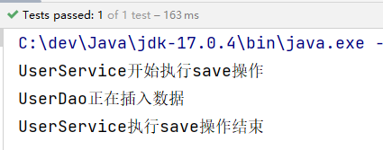

---

# 十二、Spring IoC注解式开发

## 12.1 回顾注解

注解的存在主要是为了简化XML的配置。**Spring6倡导全注解开发**。  
我们来回顾一下：

- 第一：注解怎么定义，注解中的属性怎么定义？
- 第二：注解怎么使用？
- 第三：通过反射机制怎么读取注解？

**注解怎么定义，注解中的属性怎么定义？**

```
package com.powernode.annotation;

import java.lang.annotation.ElementType;
import java.lang.annotation.Retention;
import java.lang.annotation.RetentionPolicy;
import java.lang.annotation.Target;

@Target(value = {ElementType.TYPE})
@Retention(value = RetentionPolicy.RUNTIME)
public @interface Component {
    String value();
}
```

以上是自定义了一个注解：使用**@Component** 定义 **bean**  
该注解上面修饰的注解包括：**Target**注解和**Retention**注解，这两个注解被称为元注解。

**@Target(value = {ElementType.TYPE})**  
**@Target**注解用来设置**@Component**注解可以出现的位置，以上代表表示Component注解只能用在类和接口上。

使用某个注解是时候，如果注解的属性名是 **Value** 的话，Value 可以省略

使用某个注解的时候，如果注解的属性值是数组，并且数组中只用一个元素，大括号可以省略  
**@Retention**注解用来设置**@Component**注解的保持性策略，以上代表Component注解可以被反射机制读取。

**@Retention(value = RetentionPolicy.RUNTIME)**

如果设置为 **SOURCE** 表示只在 Java 源文件有，编译成 Class 文件就没有了

如果设置为 **CLASS** 表示只在 Java 源文件有，编译成 Class 文件也有但是不能被反射机制读取

如果设置为 **RUNTIME**（推荐）表示只在 Java 源文件有，编译成 Class 文件也有而且还能被反射机制读取  
  
String value(); 是Component注解中的一个属性。该属性类型String，属性名是value。  
**注解怎么使用？**

```
package com.powernode.bean;

import com.powernode.annotation.Component;

@Component(value = "userBean")
public class User {
}
```

用法简单，语法格式：@注解类型名(属性名=属性值, 属性名=属性值, 属性名=属性值......)  
userBean为什么使用双引号括起来，因为value属性是String类型，字符串。  
另外如果属性名是value，则在使用的时候可以省略属性名，例如：

```
package com.powernode.bean;

import com.powernode.annotation.Component;

//@Component(value = "userBean")
@Component("userBean")
public class User {
}
```

**通过反射机制怎么读取注解？**  
当Bean类上有Component注解时，则实例化Bean对象，如果没有，则不实例化对象。  
我们准备两个Bean，一个上面有注解，一个上面没有注解。

```
package com.powernode.bean;

import com.powernode.annotation.Component;

@Component("userBean")
public class User {
}
```

```
package com.powernode.bean;

public class Vip {
}
```

假设我们现在只知道包名：com.powernode.bean。至于这个包下有多少个Bean我们不知道。哪些Bean上有注解，哪些Bean上没有注解，这些我们都不知道，如何通过程序全自动化判断。

```
package com.powernode.test;

import com.powernode.annotation.Component;

import java.io.File;
import java.net.URL;
import java.util.Arrays;
import java.util.Enumeration;
import java.util.HashMap;
import java.util.Map;


public class Test {
    public static void main(String[] args) throws Exception {
        // 存放Bean的Map集合。key存储beanId。value存储Bean。
        Map<String,Object> beanMap = new HashMap<>();

        String packageName = "com.powernode.bean";
        String path = packageName.replaceAll("\\.", "/");
        URL url = ClassLoader.getSystemClassLoader().getResource(path);
        File file = new File(url.getPath());
        File[] files = file.listFiles();
        Arrays.stream(files).forEach(f -> {
            String className = packageName + "." + f.getName().split("\\.")[0];
            try {
                Class<?> clazz = Class.forName(className);
                if (clazz.isAnnotationPresent(Component.class)) {
                    Component component = clazz.getAnnotation(Component.class);
                    String beanId = component.value();
                    Object bean = clazz.newInstance();
                    beanMap.put(beanId, bean);
                }
            } catch (Exception e) {
                e.printStackTrace();
            }
        });

        System.out.println(beanMap);
    }
}
```

执行结果：  
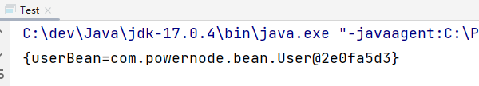

---

## 12.2 声明Bean的注解

负责声明Bean的注解，常见的包括四个：

- **@Component** 组件
- **@Controller** 控制器
- **@Service** 业务
- **@Repository** dao

**@Component** 是后面几个的老大，后面三个注解对应三层架构可以增强程序的可读性

源码如下：

```
package com.powernode.annotation;

import java.lang.annotation.ElementType;
import java.lang.annotation.Retention;
import java.lang.annotation.RetentionPolicy;
import java.lang.annotation.Target;

@Target(value = {ElementType.TYPE})
@Retention(value = RetentionPolicy.RUNTIME)
public @interface Component {
    String value();
}
```

```
package org.springframework.stereotype;

import java.lang.annotation.Documented;
import java.lang.annotation.ElementType;
import java.lang.annotation.Retention;
import java.lang.annotation.RetentionPolicy;
import java.lang.annotation.Target;
import org.springframework.core.annotation.AliasFor;

@Target({ElementType.TYPE})
@Retention(RetentionPolicy.RUNTIME)
@Documented
@Component
public @interface Controller {
    @AliasFor(
        annotation = Component.class
    )
    String value() default "";
}
```

```
package org.springframework.stereotype;

import java.lang.annotation.Documented;
import java.lang.annotation.ElementType;
import java.lang.annotation.Retention;
import java.lang.annotation.RetentionPolicy;
import java.lang.annotation.Target;
import org.springframework.core.annotation.AliasFor;

@Target({ElementType.TYPE})
@Retention(RetentionPolicy.RUNTIME)
@Documented
@Component
public @interface Service {
    @AliasFor(
        annotation = Component.class
    )
    String value() default "";
}
```

```
package org.springframework.stereotype;

import java.lang.annotation.Documented;
import java.lang.annotation.ElementType;
import java.lang.annotation.Retention;
import java.lang.annotation.RetentionPolicy;
import java.lang.annotation.Target;
import org.springframework.core.annotation.AliasFor;

@Target({ElementType.TYPE})
@Retention(RetentionPolicy.RUNTIME)
@Documented
@Component
public @interface Repository {
    @AliasFor(
        annotation = Component.class
    )
    String value() default "";
}
```

通过源码可以看到，@Controller、@Service、@Repository这三个注解都是@Component注解的别名。  
也就是说：这四个注解的功能都一样。用哪个都可以。  
只是为了增强程序的可读性，建议：

- 控制器类上使用：@Controller
- service类上使用：@Service
- dao类上使用：@Repository

他们都是只有一个value属性。**value**属性用来指定**bean的id**，也就是bean的名字。  
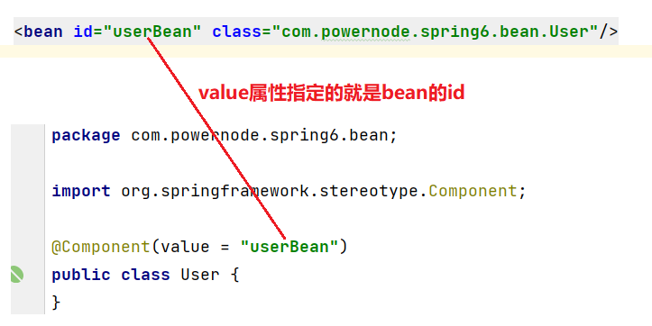

---

## 12.3 Spring注解的使用

如何使用以上的注解呢？

- 第一步：加入aop的依赖
- 第二步：在配置文件中添加context命名空间
- 第三步：在配置文件中指定扫描的包
- 第四步：在Bean类上使用注解

**第一步：加入aop的依赖**  
我们可以看到当加入**spring-context**依赖之后，会关联加入**aop**的依赖。所以这一步不用做。  
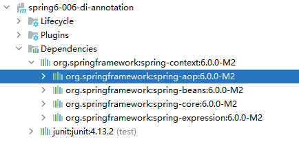  
**第二步：在配置文件中添加context命名空间**

```
<?xml version="1.0" encoding="UTF-8"?>
<beans xmlns="http://www.springframework.org/schema/beans"
       xmlns:xsi="http://www.w3.org/2001/XMLSchema-instance"
       xmlns:context="http://www.springframework.org/schema/context"
       xsi:schemaLocation="http://www.springframework.org/schema/beans http://www.springframework.org/schema/beans/spring-beans.xsd
                           http://www.springframework.org/schema/context http://www.springframework.org/schema/context/spring-context.xsd">

</beans>
```

**第三步：在配置文件中指定要扫描的包**

```
<?xml version="1.0" encoding="UTF-8"?>
<beans xmlns="http://www.springframework.org/schema/beans"
       xmlns:xsi="http://www.w3.org/2001/XMLSchema-instance"
       xmlns:context="http://www.springframework.org/schema/context"
       xsi:schemaLocation="http://www.springframework.org/schema/beans http://www.springframework.org/schema/beans/spring-beans.xsd
                           http://www.springframework.org/schema/context http://www.springframework.org/schema/context/spring-context.xsd">
    
  <context:component-scan base-package="com.powernode.spring6.bean"/>
  
</beans>
```

**第四步：在Bean类上使用注解**

```
package com.powernode.spring6.bean;

import org.springframework.stereotype.Component;

@Component(value = "userBean")
public class User {
}
```

编写测试程序：

```
package com.powernode.spring6.test;

import com.powernode.spring6.bean.User;
import org.junit.Test;
import org.springframework.context.ApplicationContext;
import org.springframework.context.support.ClassPathXmlApplicationContext;

public class AnnotationTest {
    @Test
    public void testBean(){
        ApplicationContext applicationContext = new ClassPathXmlApplicationContext("spring.xml");
        User userBean = applicationContext.getBean("userBean", User.class);
        System.out.println(userBean);
    }
}
```

执行结果：  
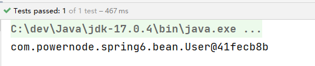  
**如果注解的属性名是****value****，那么value是可以省略的。**

```
package com.powernode.spring6.bean;

import org.springframework.stereotype.Component;

@Component("vipBean")
public class Vip {
}
```

```
package com.powernode.spring6.test;

import com.powernode.spring6.bean.Vip;
import org.junit.Test;
import org.springframework.context.ApplicationContext;
import org.springframework.context.support.ClassPathXmlApplicationContext;

public class AnnotationTest {
    @Test
    public void testBean(){
        ApplicationContext applicationContext = new ClassPathXmlApplicationContext("spring.xml");
        Vip vipBean = applicationContext.getBean("vipBean", Vip.class);
        System.out.println(vipBean);
    }
}
```

执行结果：  
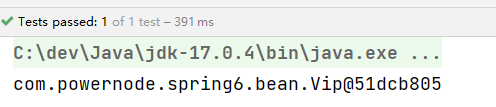  
**如果把value属性彻底去掉，spring会被Bean自动取名。并且默认名字的规律是：Bean类名首字母小写即可。**

```
package com.powernode.spring6.bean;

import org.springframework.stereotype.Component;

@Component
public class BankDao {
}
```

也就是说，这个BankDao的bean的名字为：bankDao  
测试一下：

```
package com.powernode.spring6.test;

import com.powernode.spring6.bean.BankDao;
import org.junit.Test;
import org.springframework.context.ApplicationContext;
import org.springframework.context.support.ClassPathXmlApplicationContext;

public class AnnotationTest {
    @Test
    public void testBean(){
        ApplicationContext applicationContext = new ClassPathXmlApplicationContext("spring.xml");
        BankDao bankDao = applicationContext.getBean("bankDao", BankDao.class);
        System.out.println(bankDao);
    }
}
```

执行结果：  
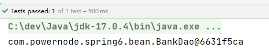  
我们将Component注解换成其它三个注解，看看是否可以用：

```
package com.powernode.spring6.bean;

import org.springframework.stereotype.Controller;

@Controller
public class BankDao {
}
```

执行结果：  
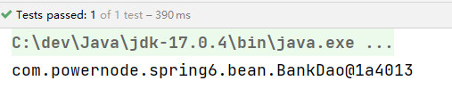  
剩下的两个注解大家可以测试一下。  
**如果是多个包怎么办？有两种解决方案：**

- **第一种：在配置文件中指定多个包，用逗号隔开。（推荐）**
- **第二种：指定多个包的共同父包。（会牺牲一部分效率）**

先来测试一下逗号（英文）的方式：  
创建一个新的包：bean2，定义一个Bean类。

```
package com.powernode.spring6.bean2;

import org.springframework.stereotype.Service;

@Service
public class Order {
}
```

配置文件修改：

```
<?xml version="1.0" encoding="UTF-8"?>
<beans xmlns="http://www.springframework.org/schema/beans"
       xmlns:xsi="http://www.w3.org/2001/XMLSchema-instance"
       xmlns:context="http://www.springframework.org/schema/context"
       xsi:schemaLocation="http://www.springframework.org/schema/beans http://www.springframework.org/schema/beans/spring-beans.xsd
                           http://www.springframework.org/schema/context http://www.springframework.org/schema/context/spring-context.xsd">
    <context:component-scan base-package="com.powernode.spring6.bean,com.powernode.spring6.bean2"/>
</beans>
```

测试程序：

```
package com.powernode.spring6.test;

import com.powernode.spring6.bean.BankDao;
import com.powernode.spring6.bean2.Order;
import org.junit.Test;
import org.springframework.context.ApplicationContext;
import org.springframework.context.support.ClassPathXmlApplicationContext;

public class AnnotationTest {
    @Test
    public void testBean(){
        ApplicationContext applicationContext = new ClassPathXmlApplicationContext("spring.xml");
        BankDao bankDao = applicationContext.getBean("bankDao", BankDao.class);
        System.out.println(bankDao);
        Order order = applicationContext.getBean("order", Order.class);
        System.out.println(order);
    }
}
```

执行结果：  
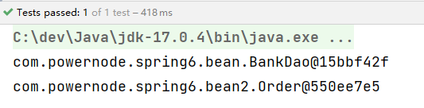  
我们再来看看，指定共同的父包行不行：

```
<?xml version="1.0" encoding="UTF-8"?>
<beans xmlns="http://www.springframework.org/schema/beans"
       xmlns:xsi="http://www.w3.org/2001/XMLSchema-instance"
       xmlns:context="http://www.springframework.org/schema/context"
       xsi:schemaLocation="http://www.springframework.org/schema/beans http://www.springframework.org/schema/beans/spring-beans.xsd
                           http://www.springframework.org/schema/context http://www.springframework.org/schema/context/spring-context.xsd">
    <context:component-scan base-package="com.powernode.spring6"/>
</beans>
```

执行测试程序：  
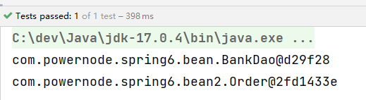

---

## 12.4 选择性实例化Bean

假设在某个包下有很多Bean，有的Bean上标注了Component，有的标注了Controller，有的标注了Service，有的标注了Repository，现在由于某种特殊业务的需要，只允许其中所有的Controller参与Bean管理，其他的都不实例化。这应该怎么办呢？

```
package com.powernode.spring6.bean3;

import org.springframework.stereotype.Component;
import org.springframework.stereotype.Controller;
import org.springframework.stereotype.Repository;
import org.springframework.stereotype.Service;

@Component
public class A {
    public A() {
        System.out.println("A的无参数构造方法执行");
    }
}

@Controller
class B {
    public B() {
        System.out.println("B的无参数构造方法执行");
    }
}

@Service
class C {
    public C() {
        System.out.println("C的无参数构造方法执行");
    }
}

@Repository
class D {
    public D() {
        System.out.println("D的无参数构造方法执行");
    }
}

@Controller
class E {
    public E() {
        System.out.println("E的无参数构造方法执行");
    }
}

@Controller
class F {
    public F() {
        System.out.println("F的无参数构造方法执行");
    }
}
```

我只想实例化bean3包下的Controller。配置文件这样写：

```
<?xml version="1.0" encoding="UTF-8"?>
<beans xmlns="http://www.springframework.org/schema/beans"
       xmlns:xsi="http://www.w3.org/2001/XMLSchema-instance"
       xmlns:context="http://www.springframework.org/schema/context"
       xsi:schemaLocation="http://www.springframework.org/schema/beans http://www.springframework.org/schema/beans/spring-beans.xsd
                           http://www.springframework.org/schema/context http://www.springframework.org/schema/context/spring-context.xsd">

    <context:component-scan base-package="com.powernode.spring6.bean3" use-default-filters="false">
        <context:include-filter type="annotation" expression="org.springframework.stereotype.Controller"/>
    </context:component-scan>
    
</beans>
```

use-default-filters="true" 表示：使用spring默认的规则，只要有Component、Controller、Service、Repository中的任意一个注解标注，则进行实例化。

  
**use-default-filters="false"** 表示：不再spring默认实例化规则，即使有Component、Controller、Service、Repository这些注解标注，也不再实例化。<context:include-filter type="annotation" expression="org.springframework.stereotype.Controller"/> 表示只有Controller进行实例化。

expression 后面要写注解的全限定名

```
@Test
public void testChoose(){
    ApplicationContext applicationContext = new ClassPathXmlApplicationContext("spring-choose.xml");
}
```

执行结果：  
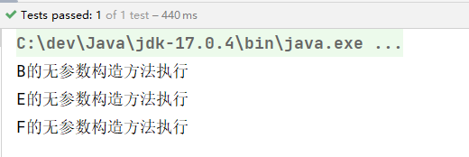  
也可以将use-default-filters设置为true（不写就是true），并且采用exclude-filter方式排出哪些注解标注的Bean不参与实例化：

```
<context:component-scan base-package="com.powernode.spring6.bean3">
  <context:exclude-filter type="annotation" expression="org.springframework.stereotype.Repository"/>
  <context:exclude-filter type="annotation" expression="org.springframework.stereotype.Service"/>
  <context:exclude-filter type="annotation" expression="org.springframework.stereotype.Controller"/>
</context:component-scan>
```

执行测试程序：  
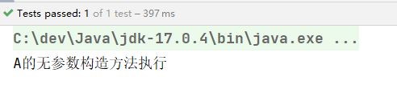

---

## 12.5 负责注入的注解

@Component @Controller @Service @Repository 这四个注解是用来声明Bean的，声明后这些Bean将被实例化。接下来我们看一下，如何给Bean的属性赋值。

给Bean属性赋值需要用到的注解：

- @Value
- @Autowired
- @Qualifier
- @Resource

### 12.5.1 @Value

当属性的类型是**简单类型**时，可以使用**@Value**注解进行注入。

```
package com.powernode.spring6.bean4;

import org.springframework.beans.factory.annotation.Value;
import org.springframework.stereotype.Component;

@Component
public class User {
    @Value(value = "zhangsan")
    private String name;
    @Value("20")
    private int age;

    @Override
    public String toString() {
        return "User{" +
                "name='" + name + '\'' +
                ", age=" + age +
                '}';
    }
}
```

开启包扫描：

```
<?xml version="1.0" encoding="UTF-8"?>
<beans xmlns="http://www.springframework.org/schema/beans"
       xmlns:xsi="http://www.w3.org/2001/XMLSchema-instance"
       xmlns:context="http://www.springframework.org/schema/context"
       xsi:schemaLocation="http://www.springframework.org/schema/beans http://www.springframework.org/schema/beans/spring-beans.xsd
                           http://www.springframework.org/schema/context http://www.springframework.org/schema/context/spring-context.xsd">
  
    <context:component-scan base-package="com.powernode.spring6.bean4"/>
</beans>
```

```
@Test
public void testValue(){
    ApplicationContext applicationContext = new ClassPathXmlApplicationContext("spring-injection.xml");
    Object user = applicationContext.getBean("user");
    System.out.println(user);
}
```

执行结果：  
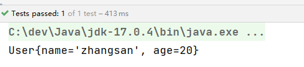  
通过以上代码可以发现，我们并没有给属性提供setter方法，但仍然可以完成属性赋值。

  
如果提供setter方法，并且在setter方法上添加@Value注解，可以完成注入吗？尝试一下：

```
package com.powernode.spring6.bean4;

import org.springframework.beans.factory.annotation.Value;
import org.springframework.stereotype.Component;

@Component
public class User {
    
    private String name;

    private int age;

    @Value("李四")
    public void setName(String name) {
        this.name = name;
    }

    @Value("30")
    public void setAge(int age) {
        this.age = age;
    }

    @Override
    public String toString() {
        return "User{" +
                "name='" + name + '\'' +
                ", age=" + age +
                '}';
    }
}
```

执行结果：  
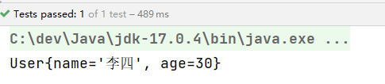  
通过测试可以得知，**@Value**注解可以直接使用在属性上，也可以使用在setter方法上。都是可以的。都可以完成属性的赋值。  
为了简化代码，以后我们一般不提供setter方法，直接在属性上使用@Value注解完成属性赋值。  
出于好奇，我们再来测试一下，是否能够通过构造方法完成注入：

```
package com.powernode.spring6.bean4;

import org.springframework.beans.factory.annotation.Value;
import org.springframework.stereotype.Component;

@Component
public class User {

    private String name;

    private int age;

    public User(@Value("隔壁老王") String name, @Value("33") int age) {
        this.name = name;
        this.age = age;
    }

    @Override
    public String toString() {
        return "User{" +
                "name='" + name + '\'' +
                ", age=" + age +
                '}';
    }
}
```

执行结果：  
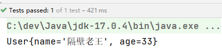  
通过测试得知：**@Value**注解可以出现在属性上、setter方法上、以及构造方法的形参上。

---

### 12.5.2 @Autowired与@Qualifier

**@Autowired**注解可以用来注入**非简单类型**。被翻译为：自动连线的，或者自动装配。  
单独使用**@Autowired**注解，**默认根据类型装配**。【默认是byType】  
看一下它的源码：

```
package org.springframework.beans.factory.annotation;

import java.lang.annotation.Documented;
import java.lang.annotation.ElementType;
import java.lang.annotation.Retention;
import java.lang.annotation.RetentionPolicy;
import java.lang.annotation.Target;

@Target({ElementType.CONSTRUCTOR, ElementType.METHOD, ElementType.PARAMETER, ElementType.FIELD, ElementType.ANNOTATION_TYPE})
@Retention(RetentionPolicy.RUNTIME)
@Documented
public @interface Autowired {
    boolean required() default true;
}
```

源码中有两处需要注意：

- 第一处：该注解可以标注在哪里？

- 构造方法上
- 方法上
- 形参上
- 属性上
- 注解上

- 第二处：该注解有一个**required**属性，默认值是**true**，表示在注入的时候要求被注入的Bean必须是存在的，如果不存在则报错。

如果required属性设置为**false**，表示注入的Bean存在或者不存在都没关系，存在的话就注入，不存在的话，也不报错。

**使用@Autowired注解不需要指定任何属性，直接使用这个注解即可，根据类型选择 byType 进行自动装配**

**只使用@Autowired注解如果有多个接口实现类会报错，想要解决的话需要配合使用**

**@Qualifier 注解，根据名字进行装配**

**我们先在属性上使用@Autowired注解：**

```
package com.powernode.spring6.dao;

public interface UserDao {
    void insert();
}
```

```
package com.powernode.spring6.dao;

import org.springframework.stereotype.Repository;

@Repository //纳入bean管理
public class UserDaoForMySQL implements UserDao{
    @Override
    public void insert() {
        System.out.println("正在向mysql数据库插入User数据");
    }
}
```

```
package com.powernode.spring6.service;

import com.powernode.spring6.dao.UserDao;
import org.springframework.beans.factory.annotation.Autowired;
import org.springframework.stereotype.Service;

@Service // 纳入bean管理
public class UserService {

    @Autowired // 在属性上注入
    private UserDao userDao;
    
    // 没有提供构造方法和setter方法。

    public void save(){
        userDao.insert();
    }
}
```

```
<?xml version="1.0" encoding="UTF-8"?>
<beans xmlns="http://www.springframework.org/schema/beans"
       xmlns:xsi="http://www.w3.org/2001/XMLSchema-instance"
       xmlns:context="http://www.springframework.org/schema/context"
       xsi:schemaLocation="http://www.springframework.org/schema/beans http://www.springframework.org/schema/beans/spring-beans.xsd
                           http://www.springframework.org/schema/context http://www.springframework.org/schema/context/spring-context.xsd">
    
  <context:component-scan base-package="com.powernode.spring6.dao,com.powernode.spring6.service"/>
  
</beans>
```

```
@Test
public void testAutowired(){
    ApplicationContext applicationContext = new ClassPathXmlApplicationContext("spring-injection.xml");
    UserService userService = applicationContext.getBean("userService", UserService.class);
    userService.save();
}
```

执行结果：  
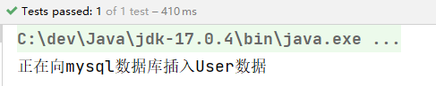  
以上构造方法和setter方法都没有提供，经过测试，仍然可以注入成功。  
**接下来，再来测试一下@Autowired注解出现在setter方法上：**

```
package com.powernode.spring6.service;

import com.powernode.spring6.dao.UserDao;
import org.springframework.beans.factory.annotation.Autowired;
import org.springframework.stereotype.Service;

@Service
public class UserService {

    private UserDao userDao;

    @Autowired
    public void setUserDao(UserDao userDao) {
        this.userDao = userDao;
    }

    public void save(){
        userDao.insert();
    }
}
```

执行结果：  
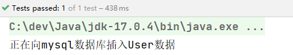  
**我们再来看看能不能出现在构造方法上：**

```
package com.powernode.spring6.service;

import com.powernode.spring6.dao.UserDao;
import org.springframework.beans.factory.annotation.Autowired;
import org.springframework.stereotype.Service;

@Service
public class UserService {

    private UserDao userDao;

    @Autowired
    public UserService(UserDao userDao) {
        this.userDao = userDao;
    }

    public void save(){
        userDao.insert();
    }
}
```

执行结果：  
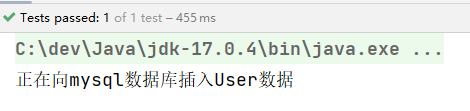  
**再来看看，这个注解能不能只标注在构造方法的形参上：**

```
package com.powernode.spring6.service;

import com.powernode.spring6.dao.UserDao;
import org.springframework.beans.factory.annotation.Autowired;
import org.springframework.stereotype.Service;

@Service
public class UserService {

    private UserDao userDao;

    public UserService(@Autowired UserDao userDao) {
        this.userDao = userDao;
    }

    public void save(){
        userDao.insert();
    }
}
```

执行结果：  
  
**还有更劲爆的，当有参数的构造方法只有一个时，@Autowired注解可以省略。**

```
package com.powernode.spring6.service;

import com.powernode.spring6.dao.UserDao;
import org.springframework.stereotype.Service;

@Service
public class UserService {

    private UserDao userDao;

    public UserService(UserDao userDao) {
        this.userDao = userDao;
    }

    public void save(){
        userDao.insert();
    }
}
```

执行结果：  
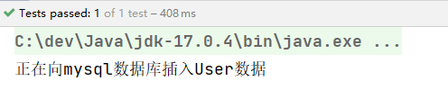  
**当然，如果有多个构造方法，@Autowired肯定是不能省略的。**

```
package com.powernode.spring6.service;

import com.powernode.spring6.dao.UserDao;
import org.springframework.stereotype.Service;

@Service
public class UserService {

    private UserDao userDao;

    public UserService(UserDao userDao) {
        this.userDao = userDao;
    }
    
    public UserService(){
        
    }

    public void save(){
        userDao.insert();
    }
}
```

执行结果：  
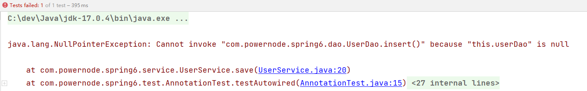  
到此为止，我们已经清楚@Autowired注解可以出现在哪些位置了。  
@Autowired注解默认是byType进行注入的，也就是说根据类型注入的，如果以上程序中，UserDao接口还有另外一个实现类，会出现问题吗？

```
package com.powernode.spring6.dao;

import org.springframework.stereotype.Repository;

@Repository //纳入bean管理
public class UserDaoForOracle implements UserDao{
    @Override
    public void insert() {
        System.out.println("正在向Oracle数据库插入User数据");
    }
}
```

当你写完这个新的实现类之后，此时IDEA工具已经提示错误信息了：  
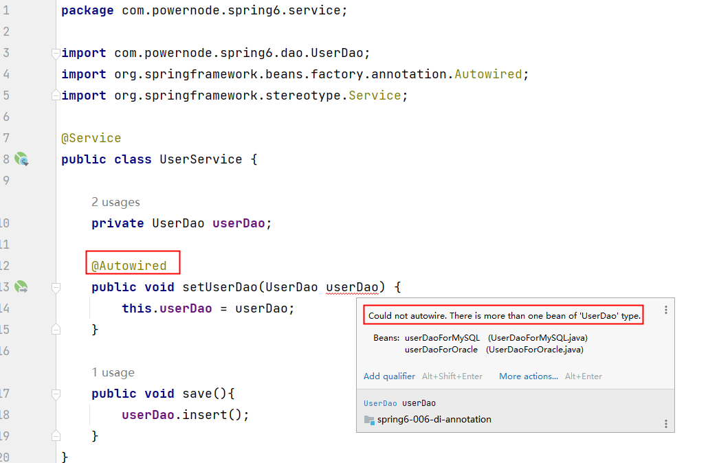  
错误信息中说：不能装配，UserDao这个Bean的数量大于1.  
怎么解决这个问题呢？**当然要byName，根据名称进行装配了。**  
**@Autowired**注解和**@Qualifier**注解联合起来才可以根据名称进行装配，在@Qualifier注解中指定Bean名称。

```
package com.powernode.spring6.dao;

import org.springframework.stereotype.Repository;

@Repository // 这里没有给bean起名，默认名字是：userDaoForOracle
public class UserDaoForOracle implements UserDao{
    @Override
    public void insert() {
        System.out.println("正在向Oracle数据库插入User数据");
    }
}
```

```
package com.powernode.spring6.service;

import com.powernode.spring6.dao.UserDao;
import org.springframework.beans.factory.annotation.Autowired;
import org.springframework.beans.factory.annotation.Qualifier;
import org.springframework.stereotype.Service;

@Service
public class UserService {

    private UserDao userDao;

    @Autowired
    @Qualifier("userDaoForOracle") // 这个是bean的名字。
    public void setUserDao(UserDao userDao) {
        this.userDao = userDao;
    }

    public void save(){
        userDao.insert();
    }
}
```

执行结果：  
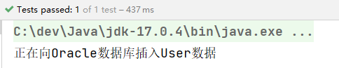

**注意：**

- 注意：自动装配基于反射设计创建对象，并通过暴力反射访问私有属性来初始化数据，因此无需提供 setter 方法。
- 注意：自动装配建议使用无参构造方法创建对象（默认）；如果不提供无参构造方法，请提供唯一的构造方法。

总结：

- @Autowired注解可以出现在：属性上、构造方法上、构造方法的参数上、setter方法上。
- 当带参数的构造方法只有一个，@Autowired注解可以省略。
- @Autowired注解默认根据类型注入。如果要根据名称注入的话，需要配合@Qualifier注解一起使用。

---

### 12.5.3 @Resource

**@Resource**注解也可以完成**非简单类型**注入。那它和@Autowired注解有什么区别？

- @Resource注解是JDK扩展包中的，也就是说属于JDK的一部分。所以该注解是标准注解，更加具有通用性。(JSR-250标准中制定的注解类型。JSR是Java规范提案。)
- @Autowired注解是Spring框架自己的。
- **@Resource注解默认根据名称装配byName，未指定name时，使用属性名作为name。通过name找不到的话会自动启动通过类型byType装配。**
- **@Autowired注解默认根据类型装配byType，如果想根据名称装配，需要配合@Qualifier注解一起用。**
- @Resource注解用在属性上、setter方法上。
- @Autowired注解用在属性上、setter方法上、构造方法上、构造方法参数上。

@Resource注解属于JDK扩展包，所以不在JDK当中，需要额外引入以下依赖：【**如果是JDK8的话不需要额外引入依赖。高于JDK11或低于JDK8需要引入以下依赖。**】

```
<dependency>
  <groupId>jakarta.annotation</groupId>
  <artifactId>jakarta.annotation-api</artifactId>
  <version>2.1.1</version>
</dependency>
```

一定要注意：**如果你用Spring6，要知道Spring6不再支持JavaEE，它支持的是JakartaEE9。（Oracle把JavaEE贡献给Apache了，Apache把JavaEE的名字改成JakartaEE了，大家之前所接触的所有的 javax.* 包名统一修改为 jakarta.*包名了。）**

```
<dependency>
  <groupId>javax.annotation</groupId>
  <artifactId>javax.annotation-api</artifactId>
  <version>1.3.2</version>
</dependency>
```

@Resource注解的源码如下：  
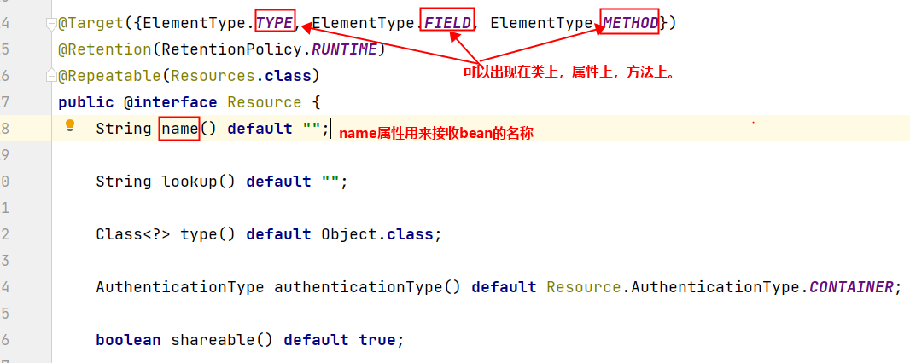  
测试一下：

```
package com.powernode.spring6.dao;

import org.springframework.stereotype.Repository;

@Repository("xyz")
public class UserDaoForOracle implements UserDao{
    @Override
    public void insert() {
        System.out.println("正在向Oracle数据库插入User数据");
    }
}
```

```
package com.powernode.spring6.service;

import com.powernode.spring6.dao.UserDao;
import jakarta.annotation.Resource;
import org.springframework.stereotype.Service;

@Service
public class UserService {

    @Resource(name = "xyz")
    private UserDao userDao;

    public void save(){
        userDao.insert();
    }
}
```

执行测试程序：  
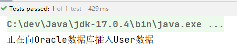  
**我们把UserDaoForOracle的名字xyz修改为userDao，让这个Bean的名字和UserService类中的UserDao属性名一致：**

```
package com.powernode.spring6.dao;

import org.springframework.stereotype.Repository;

@Repository("userDao")
public class UserDaoForOracle implements UserDao{
    @Override
    public void insert() {
        System.out.println("正在向Oracle数据库插入User数据");
    }
}
```

```
package com.powernode.spring6.service;

import com.powernode.spring6.dao.UserDao;
import jakarta.annotation.Resource;
import org.springframework.stereotype.Service;

@Service
public class UserService {

    @Resource
    private UserDao userDao;

    public void save(){
        userDao.insert();
    }
}
```

执行测试程序：  
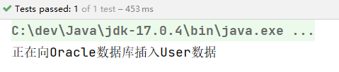  
通过测试得知，当@Resource注解使用时没有指定name的时候，还是根据name进行查找，这个name是属性名。  
接下来把UserService类中的属性名修改一下：

```
package com.powernode.spring6.service;

import com.powernode.spring6.dao.UserDao;
import jakarta.annotation.Resource;
import org.springframework.stereotype.Service;

@Service
public class UserService {

    @Resource
    private UserDao userDao2;

    public void save(){
        userDao2.insert();
    }
}
```

执行结果：  
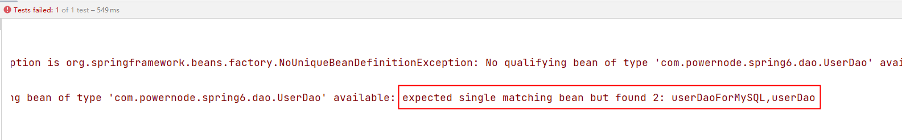  
根据异常信息得知：显然当通过name找不到的时候，自然会启动byType进行注入。以上的错误是因为UserDao接口下有两个实现类导致的。所以根据类型注入就会报错。  
我们再来看@Resource注解使用在setter方法上可以吗？

```
package com.powernode.spring6.service;

import com.powernode.spring6.dao.UserDao;
import jakarta.annotation.Resource;
import org.springframework.stereotype.Service;

@Service
public class UserService {

    private UserDao userDao;

    @Resource
    public void setUserDao(UserDao userDao) {
        this.userDao = userDao;
    }

    public void save(){
        userDao.insert();
    }
}
```

注意这个setter方法的方法名，setUserDao去掉set之后，将首字母变小写userDao，userDao就是name  
执行结果：  
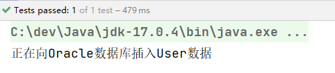  
当然，也可以指定name：

```
package com.powernode.spring6.service;

import com.powernode.spring6.dao.UserDao;
import jakarta.annotation.Resource;
import org.springframework.stereotype.Service;

@Service
public class UserService {

    private UserDao userDao;

    @Resource(name = "userDaoForMySQL")
    public void setUserDao(UserDao userDao) {
        this.userDao = userDao;
    }

    public void save(){
        userDao.insert();
    }
}
```

执行结果：  
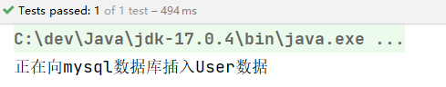  
一句话总结@Resource注解：默认byName注入，没有指定name时把属性名当做name，根据name找不到时，才会byType注入。byType注入时，某种类型的Bean只能有一个。

---

## 12.6 全注解式开发

所谓的全注解开发就是不再使用spring配置文件了。

### 1. **@Configuration** **标明配置类**来代替配置文件使用

```
package com.powernode.spring6.config;

import org.springframework.context.annotation.ComponentScan;
import org.springframework.context.annotation.ComponentScans;
import org.springframework.context.annotation.Configuration;

@Configuration
@ComponentScan({"com.powernode.spring6.dao", "com.powernode.spring6.service"})
public class Spring6Configuration {
}
```

编写测试程序：不再new ClassPathXmlApplicationContext()对象了。

```
@Test
public void testNoXml(){
    //加载配置类初始化容器
    ApplicationContext applicationContext = new AnnotationConfigApplicationContext(Spring6Configuration.class);
    UserService userService = applicationContext.getBean("userService", UserService.class);
    userService.save();
}
```

执行结果：  
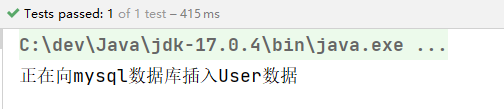

---

### 2. @Scope 注解定义 bean 作用范围

**bean作用范围**

- 使用 `@Scope` 定义 bean 作用范围

```
@Repository
@Scope("singleton")
public class BookDaoImpl implements BookDao {
}
```

**说明：**

- `@Repository`：表示该类是一个持久层组件（DAO）。
- `@Scope("singleton")`：指定该 Bean 的作用域为单例（singleton），即在整个 Spring 容器中仅创建一个实例，是默认的作用域。

---

### 3. @PostConstruct、@PreDestroy 定义 bean 的生命周期

```
@Repository
@Scope("singleton")
public class BookDaoImpl implements BookDao {

    public BookDaoImpl() {
        System.out.println("book dao constructor ...");
    }

    @PostConstruct
    public void init() {
        System.out.println("book init ...");
    }

    @PreDestroy
    public void destroy() {
        System.out.println("book destory ...");
    }
}
```

**说明：**

- `@Repository`：标记该类为持久层组件（DAO）。
- `@Scope("singleton")`：指定 Bean 的作用域为单例，容器中仅存在一个实例。
- `@PostConstruct`：标注的方法在依赖注入完成后、Bean初始化之前执行，用于初始化操作。
- `@PreDestroy`：标注的方法在容器销毁 Bean 前执行，用于清理资源。

**生命周期顺序：**

1. 构造函数执行 → 输出 "book dao constructor ..."
2. `@PostConstruct` 方法执行 → 输出 "book init ..."
3. 使用完毕后，容器关闭时 → `@PreDestroy` 方法执行 → 输出 "book destory ..."

---

### 4. @PropertySource 加载 properties 文件

**使用** `**@PropertySource**` **注解加载 properties 文件**

```
@Configuration
@ComponentScan("com.itheima")
@PropertySource("classpath:jdbc.properties")
public class SpringConfig {
}
```

**注意：**

- 路径仅支持单一文件配置，若需加载多个文件，请使用数组格式配置，不支持通配符 `*`。

**示例（多个文件）：**

```
@PropertySource({"classpath:jdbc.properties", "classpath:msg.properties"})
```

---

```
@Repository("bookDao")
public class BookDaoImpl implements BookDao {

    @Value("${name}")
    private String name;

    public void save() {
        System.out.println("book dao save ..." + name);
    }
}
```

**说明：**

- `@Repository("bookDao")`：将该类注册为 Spring 容器中的 Bean，ID 为 `"bookDao"`。
- `@Value("${name}")`：从配置文件（如 `application.properties` 或 `jdbc.properties`）中读取名为 `name` 的属性值，并注入到 `name` 字段中。
- `save()` 方法输出信息，包含注入的 `name` 值。

**注意：**  
需确保在配置文件中定义了 `name` 属性，例如：

```
name=MyBook
```

---

### 5. 第三方 bean 管理

```
@Configuration
public class SpringConfig {

    @Bean
    public DataSource dataSource() {
        DruidDataSource ds = new DruidDataSource();
        ds.setDriverClassName("com.mysql.jdbc.Driver");
        ds.setUrl("jdbc:mysql://localhost:3306/spring_db");
        ds.setUsername("root");
        ds.setPassword("root");
        return ds;
    }
}
```

**说明：**

- 使用 `@Configuration` 注解标记该类为 Spring 配置类。
- 使用 `@Bean` 注解定义一个名为 `dataSource` 的 Bean，用于创建并配置 `DruidDataSource` 实例。
- 该方法返回一个 `DataSource` 类型的对象，Spring 容器会将其注册为 Bean，供其他组件使用。
- 配置了 MySQL 数据库连接信息：

- JDBC 驱动：`com.mysql.jdbc.Driver`
- 数据库 URL：`jdbc:mysql://localhost:3306/spring_db`
- 用户名：`root`
- 密码：`123456`

**注意**：`com.mysql.jdbc.Driver` 是较旧的驱动包名，建议使用新版本 `com.mysql.cj.jdbc.Driver`（MySQL 8.0+）。

---

```
public class JdbcConfig {

    @Bean
    public DataSource dataSource() {
        DruidDataSource ds = new DruidDataSource();
        ds.setDriverClassName("com.mysql.jdbc.Driver");
        ds.setUrl("jdbc:mysql://localhost:3306/spring_db");
        ds.setUsername("root");
        ds.setPassword("root");
        return ds;
    }
}
```

**说明：**

- 使用独立的配置类 `JdbcConfig` 来管理第三方 Bean（如数据库连接池）。
- `@Bean` 注解用于声明一个方法返回的对象将作为 Spring 容器中的 Bean 注册。

**提示**：此类通常需要被 `@Configuration` 类扫描或通过 `@Import` 引入，才能被 Spring 容器识别和加载。

---

**方法一：导入式（推荐写法）**

```
public class JdbcConfig {

    @Bean
    public DataSource dataSource() {
        DruidDataSource ds = new DruidDataSource();
        // 相关配置
        return ds;
    }
}
```

---

```
@Configuration
@Import(JdbcConfig.class)
public class SpringConfig {
}
```

---

**说明：**

- **独立配置类** `**JdbcConfig**`：定义了 `dataSource()` 方法，使用 `@Bean` 注解将 `DruidDataSource` 实例注册为 Spring 容器中的 Bean。
- `**@Import**` **注解**：用于将独立的配置类（如 `JdbcConfig`）导入到核心配置类中，使其被 Spring 容器加载和管理。
- **使用方式**：

- 在主配置类 `SpringConfig` 上添加 `@Import(JdbcConfig.class)`，即可引入 `JdbcConfig` 中定义的 Bean。
- `@Import` 只能添加一次，若需导入多个配置类，可使用数组格式，例如：

```
@Import({JdbcConfig.class, RedisConfig.class})
```

**注意**：`@Import` 是手动引入配置类的方式，适用于模块化、分层配置场景。

---

**方法二：扫描式**

```
@Configuration
public class JdbcConfig {

    @Bean
    public DataSource dataSource() {
        DruidDataSource ds = new DruidDataSource();
        // 相关配置
        return ds;
    }
}
```

---

```
@Configuration
@ComponentScan({"com.itheima.config", "com.itheima.service", "com.itheima.dao"})
public class SpringConfig {
}
```

---

**说明：**

- **独立配置类** `**JdbcConfig**`：使用 `@Configuration` 注解标记为配置类，内部通过 `@Bean` 方法定义并注册 `DataSource` Bean。
- **扫描式引入方式**：

- 使用 `@ComponentScan` 注解扫描指定包路径（如 `"com.itheima.config"`）。
- Spring 容器在启动时会自动发现并加载该包下的所有配置类（包括 `JdbcConfig`），从而将其中定义的 Bean 注册到容器中。

- **适用场景**：

- 当项目中有多个配置类分散在不同包中时，可通过 `@ComponentScan` 扫描特定包来自动加载配置。
- 无需手动使用 `@Import` 引入，实现配置类的自动发现和管理。

**注意**：`@ComponentScan` 不仅能扫描组件（如 `@Service`, `@Repository`），也能扫描 `@Configuration` 配置类。

---

### 6. 第三方 bean 依赖注入

- **简单类型注入（成员变量）**

```
public class JdbcConfig {

    @Value("com.mysql.cj.jdbc.Driver")
    private String driver;

    @Value("jdbc:mysql://localhost:3306/spring_db")
    private String url;

    @Value("root")
    private String userName;

    @Value("root")
    private String password;

    @Bean
    public DataSource dataSource() {
        DruidDataSource ds = new DruidDataSource();
        ds.setDriverClassName(driver);
        ds.setUrl(url);
        ds.setUsername(userName);
        ds.setPassword(password);
        return ds;
    }
}
```

---

**说明：**

- 使用 `@Value` 注解将字符串类型的配置值直接注入到字段中，实现**简单类型依赖注入**。
- 字段 `driver`, `url`, `userName`, `password` 分别被赋值为对应的数据库连接参数。
- 在 `dataSource()` 方法中，使用这些注入的值配置 `DruidDataSource` 实例。
- 该方式适用于硬编码或静态配置场景，但更推荐从外部配置文件（如 `application.properties`）中读取。

**建议改进**：  
将 `@Value` 的值改为从属性文件中读取，例如：

```
@Value("${jdbc.driver}")
private String driver;
```

并在 `application.properties` 中定义：

```
jdbc.driver=com.mysql.jdbc.Driver
jdbc.url=jdbc:mysql://localhost:3306/spring_db
jdbc.username=root
jdbc.password=root
```

---

- **引用类型注入（方法形参）**

```
@Bean
public DataSource dataSource(BookService bookService) {
    System.out.println(bookService);
    DruidDataSource ds = new DruidDataSource();
    // 属性设置
    return ds;
}
```

---

**说明：**

- **引用类型依赖注入**：在 `@Bean` 方法中通过形参声明依赖的 Bean 类型（如 `BookService`），Spring 容器会自动装配对应类型的 Bean 实例。
- 该方法接收一个 `BookService` 类型的参数，Spring 会自动将容器中匹配的 `BookService` Bean 注入进来。
- 可用于实现 Bean 之间的依赖关系，例如数据源需要使用服务层对象进行初始化或日志记录等操作。

**注意**：

- Spring 会根据类型自动装配，若存在多个相同类型的 Bean，则需通过 `@Qualifier` 指定具体实例。
- 此方式适用于复杂依赖场景，是 Spring 依赖注入机制的重要体现。

---

### 7. XML 配置对比注解配置

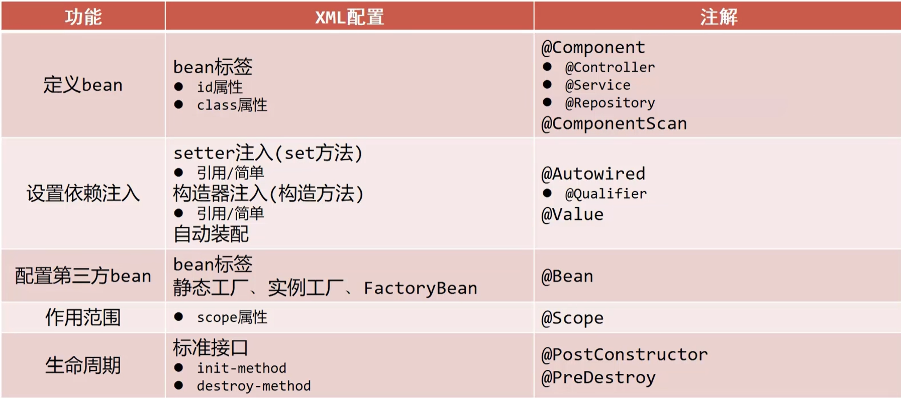

---

# 十三、JdbcTemplate

**JdbcTemplate**是Spring提供的一个JDBC模板类，是对JDBC的封装，简化JDBC代码。  
当然，你也可以不用，可以让Spring集成其它的**ORM**框架，例如：**MyBatis**、**Hibernate**等。

## 13.1 环境准备

数据库表：t_user  
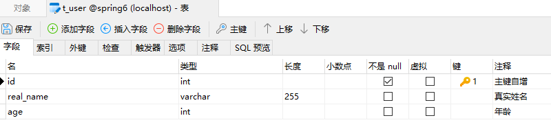  
IDEA中新建模块：spring6-007-jdbc  
  
引入相关依赖：

```
<?xml version="1.0" encoding="UTF-8"?>
<project xmlns="http://maven.apache.org/POM/4.0.0"
         xmlns:xsi="http://www.w3.org/2001/XMLSchema-instance"
         xsi:schemaLocation="http://maven.apache.org/POM/4.0.0 http://maven.apache.org/xsd/maven-4.0.0.xsd">
    <modelVersion>4.0.0</modelVersion>
    <groupId>com.powernode</groupId>
    <artifactId>spring6-007-jdbc</artifactId>
    <version>1.0-SNAPSHOT</version>
    <packaging>jar</packaging>
    <repositories>
        <repository>
            <id>repository.spring.milestone</id>
            <name>Spring Milestone Repository</name>
            <url>https://repo.spring.io/milestone</url>
        </repository>
    </repositories>
    <dependencies>
        <dependency>
            <groupId>org.springframework</groupId>
            <artifactId>spring-context</artifactId>
            <version>6.0.0-M2</version>
        </dependency>
        <dependency>
            <groupId>junit</groupId>
            <artifactId>junit</artifactId>
            <version>4.13.2</version>
            <scope>test</scope>
        </dependency>
        <!--新增的依赖:mysql驱动-->
        <dependency>
            <groupId>mysql</groupId>
            <artifactId>mysql-connector-java</artifactId>
            <version>8.0.30</version>
        </dependency>
        <!--新增的依赖：spring jdbc，这个依赖中有JdbcTemplate-->
        <dependency>
            <groupId>org.springframework</groupId>
            <artifactId>spring-jdbc</artifactId>
            <version>6.0.0-M2</version>
        </dependency>
    </dependencies>
    <properties>
        <maven.compiler.source>17</maven.compiler.source>
        <maven.compiler.target>17</maven.compiler.target>
    </properties>
</project>
```

准备实体类：表t_user对应的实体类User。

```
package com.powernode.spring6.bean;

public class User {
    private Integer id;
    private String realName;
    private Integer age;

    @Override
    public String toString() {
        return "User{" +
                "id=" + id +
                ", realName='" + realName + '\'' +
                ", age=" + age +
                '}';
    }

    public User() {
    }

    public User(Integer id, String realName, Integer age) {
        this.id = id;
        this.realName = realName;
        this.age = age;
    }

    public Integer getId() {
        return id;
    }

    public void setId(Integer id) {
        this.id = id;
    }

    public String getRealName() {
        return realName;
    }

    public void setRealName(String realName) {
        this.realName = realName;
    }

    public Integer getAge() {
        return age;
    }

    public void setAge(Integer age) {
        this.age = age;
    }
}
```

编写Spring配置文件：  
JdbcTemplate是Spring提供好的类，这类的完整类名是：org.springframework.jdbc.core.JdbcTemplate  
我们怎么使用这个类呢？new对象就可以了。怎么new对象，Spring最在行了。直接将这个类配置到Spring配置文件中，纳入Bean管理即可。

```
<?xml version="1.0" encoding="UTF-8"?>
<beans xmlns="http://www.springframework.org/schema/beans"
       xmlns:xsi="http://www.w3.org/2001/XMLSchema-instance"
       xsi:schemaLocation="http://www.springframework.org/schema/beans http://www.springframework.org/schema/beans/spring-beans.xsd">
    <bean id="jdbcTemplate" class="org.springframework.jdbc.core.JdbcTemplate"></bean>
</beans>
```

我们来看一下这个JdbcTemplate源码：  
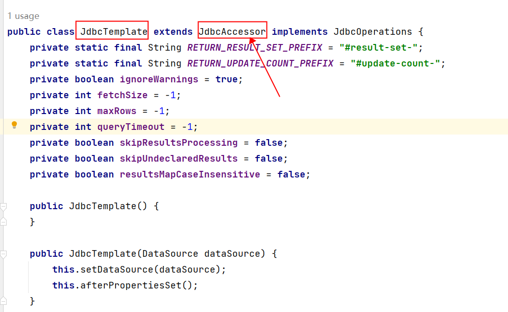  
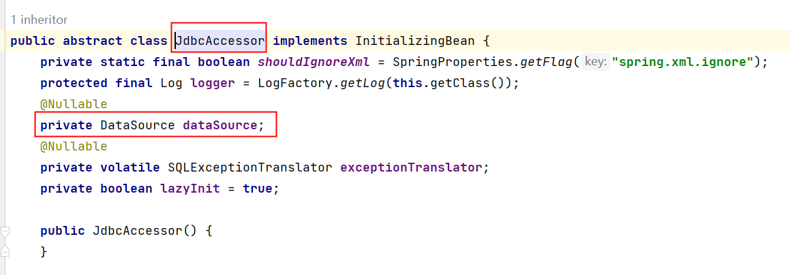  
可以看到JdbcTemplate中有一个DataSource属性，这个属性是数据源，我们都知道连接数据库需要Connection对象，而生成Connection对象是数据源负责的。所以我们需要给JdbcTemplate设置数据源属性。  
所有的数据源都是要实现javax.sql.DataSource接口的。这个数据源可以自己写一个，也可以用写好的，比如：阿里巴巴的德鲁伊连接池，c3p0，dbcp等。我们这里自己先手写一个数据源。

```
package com.powernode.spring6.jdbc;

import javax.sql.DataSource;
import java.io.PrintWriter;
import java.sql.Connection;
import java.sql.DriverManager;
import java.sql.SQLException;
import java.sql.SQLFeatureNotSupportedException;
import java.util.logging.Logger;


public class MyDataSource implements DataSource {
    // 添加4个属性
    private String driver;
    private String url;
    private String username;
    private String password;

    // 提供4个setter方法
    public void setDriver(String driver) {
        this.driver = driver;
    }

    public void setUrl(String url) {
        this.url = url;
    }

    public void setUsername(String username) {
        this.username = username;
    }

    public void setPassword(String password) {
        this.password = password;
    }

    // 重点写怎么获取Connection对象就行。其他方法不用管。
    @Override
    public Connection getConnection() throws SQLException {
        try {
            Class.forName(driver);
            Connection conn = DriverManager.getConnection(url, username, password);
            return conn;
        } catch (Exception e) {
            e.printStackTrace();
        }
        return null;
    }

    @Override
    public Connection getConnection(String username, String password) throws SQLException {
        return null;
    }

    @Override
    public PrintWriter getLogWriter() throws SQLException {
        return null;
    }

    @Override
    public void setLogWriter(PrintWriter out) throws SQLException {

    }

    @Override
    public void setLoginTimeout(int seconds) throws SQLException {

    }

    @Override
    public int getLoginTimeout() throws SQLException {
        return 0;
    }

    @Override
    public Logger getParentLogger() throws SQLFeatureNotSupportedException {
        return null;
    }

    @Override
    public <T> T unwrap(Class<T> iface) throws SQLException {
        return null;
    }

    @Override
    public boolean isWrapperFor(Class<?> iface) throws SQLException {
        return false;
    }
}
```

写完数据源，我们需要把这个数据源传递给JdbcTemplate。因为JdbcTemplate中有一个DataSource属性：

```
<?xml version="1.0" encoding="UTF-8"?>
<beans xmlns="http://www.springframework.org/schema/beans"
       xmlns:xsi="http://www.w3.org/2001/XMLSchema-instance"
       xsi:schemaLocation="http://www.springframework.org/schema/beans http://www.springframework.org/schema/beans/spring-beans.xsd">

    <bean id="myDataSource" class="com.powernode.spring6.jdbc.MyDataSource">
        <property name="driver" value="com.mysql.cj.jdbc.Driver"/>
        <property name="url" value="jdbc:mysql://localhost:3306/spring6"/>
        <property name="username" value="root"/>
        <property name="password" value="123456"/>
    </bean>
    <bean id="jdbcTemplate" class="org.springframework.jdbc.core.JdbcTemplate">
        <property name="dataSource" ref="myDataSource"/>
    </bean>
</beans>
```

---

## 13.2 新增

在 JdbcTemplate 当中，只要是 **Insert,delete,update** 语句，都是调用 **update** 方法

编写测试程序：

```
package com.powernode.spring6.test;

import org.junit.Test;
import org.springframework.context.ApplicationContext;
import org.springframework.context.support.ClassPathXmlApplicationContext;
import org.springframework.jdbc.core.JdbcTemplate;

public class JdbcTest {
    @Test
    public void testInsert(){
        // 获取JdbcTemplate对象
        ApplicationContext applicationContext = new ClassPathXmlApplicationContext("spring.xml");
        JdbcTemplate jdbcTemplate = applicationContext.getBean("jdbcTemplate", JdbcTemplate.class);
        // 执行插入操作
        // 注意：insert delete update的sql语句，都是执行update方法。
        String sql = "insert into t_user(id,real_name,age) values(?,?,?)";
        int count = jdbcTemplate.update(sql, null, "张三", 30);
        System.out.println("插入的记录条数：" + count);
    }
}
```

update方法有两个参数：

- 第一个参数：要执行的SQL语句。（SQL语句中可能会有占位符 ? ）
- 第二个参数：可变长参数，参数的个数可以是0个，也可以是多个。一般是SQL语句中有几个问号，则对应几个参数。

---

## 13.3 修改

```
@Test
public void testUpdate(){
    // 获取JdbcTemplate对象
    ApplicationContext applicationContext = new ClassPathXmlApplicationContext("spring.xml");
    JdbcTemplate jdbcTemplate = applicationContext.getBean("jdbcTemplate", JdbcTemplate.class);
    // 执行更新操作
    String sql = "update t_user set real_name = ?, age = ? where id = ?";
    int count = jdbcTemplate.update(sql, "张三丰", 55, 1);
    System.out.println("更新的记录条数：" + count);
}
```

执行结果：  
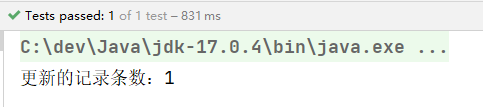

---

## 13.4 删除

```
@Test
public void testDelete(){
    // 获取JdbcTemplate对象
    ApplicationContext applicationContext = new ClassPathXmlApplicationContext("spring.xml");
    JdbcTemplate jdbcTemplate = applicationContext.getBean("jdbcTemplate", JdbcTemplate.class);
    // 执行delete
    String sql = "delete from t_user where id = ?";
    int count = jdbcTemplate.update(sql, 1);
    System.out.println("删除了几条记录：" + count);
}
```

执行结果：  
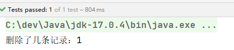

## 13.5 查询一个对象

**Spring 的** `**BeanPropertyRowMapper**` **默认支持下划线命名（snake_case）到驼峰命名（camelCase）的自动转换**。

`**BeanPropertyRowMapper**` **是用于将数据库查询结果（ResultSet）映射为 Java 对象的工具。而** `**update()**` **方法并不需要将数据库返回的结果映射成对象，因此不需要** `**RowMapper**`**。**

```
@Test
public void testSelectOne(){
    // 获取JdbcTemplate对象
    ApplicationContext applicationContext = new ClassPathXmlApplicationContext("spring.xml");
    JdbcTemplate jdbcTemplate = applicationContext.getBean("jdbcTemplate", JdbcTemplate.class);
    // 执行select
    String sql = "select id, real_name, age from t_user where id = ?";
    User user = jdbcTemplate.queryForObject(sql, new BeanPropertyRowMapper<>(User.class), 2);
    System.out.println(user);
}
```

执行结果：  
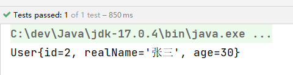  
queryForObject方法三个参数：

- 第一个参数：sql语句
- 第二个参数：Bean属性值和数据库记录行的映射对象。在构造方法中指定映射的对象类型。new BeanPropertyRowMapper<>(User.class)，bean 类属性和行的映射
- 第三个参数：可变长参数，给sql语句的占位符问号传值。

## 13.6 查询多个对象

jdbcTemplate.query(sql, new BeanPropertyRowMapper<>(User.class))

```
@Test
public void testSelectAll(){
    // 获取JdbcTemplate对象
    ApplicationContext applicationContext = new ClassPathXmlApplicationContext("spring.xml");
    JdbcTemplate jdbcTemplate = applicationContext.getBean("jdbcTemplate", JdbcTemplate.class);
    // 执行select
    String sql = "select id, real_name, age from t_user";
    List<User> users = jdbcTemplate.query(sql, new BeanPropertyRowMapper<>(User.class));
    System.out.println(users);
}
```

执行结果：  
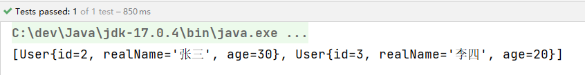

## 13.7 查询一个值

```
@Test
public void testSelectOneValue(){
    // 获取JdbcTemplate对象
    ApplicationContext applicationContext = new ClassPathXmlApplicationContext("spring.xml");
    JdbcTemplate jdbcTemplate = applicationContext.getBean("jdbcTemplate", JdbcTemplate.class);
    // 执行select
    String sql = "select count(1) from t_user";
    Integer count = jdbcTemplate.queryForObject(sql, int.class); // 这里用Integer.class也可以
    System.out.println("总记录条数：" + count);
}
```

执行结果：  
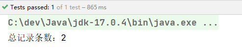

## 13.8 批量添加

```
@Test
public void testAddBatch(){
    // 获取JdbcTemplate对象
    ApplicationContext applicationContext = new ClassPathXmlApplicationContext("spring.xml");
    JdbcTemplate jdbcTemplate = applicationContext.getBean("jdbcTemplate", JdbcTemplate.class);
    // 批量添加
    String sql = "insert into t_user(id,real_name,age) values(?,?,?)";

    Object[] objs1 = {null, "小花", 20};
    Object[] objs2 = {null, "小明", 21};
    Object[] objs3 = {null, "小刚", 22};
    List<Object[]> list = new ArrayList<>();
    list.add(objs1);
    list.add(objs2);
    list.add(objs3);

    int[] count = jdbcTemplate.batchUpdate(sql, list);
    System.out.println(Arrays.toString(count));
}
```

执行结果：  
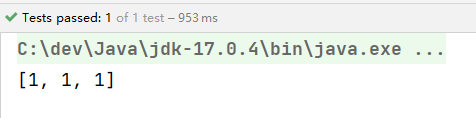

## 13.9 批量修改

```
@Test
public void testUpdateBatch(){
    // 获取JdbcTemplate对象
    ApplicationContext applicationContext = new ClassPathXmlApplicationContext("spring.xml");
    JdbcTemplate jdbcTemplate = applicationContext.getBean("jdbcTemplate", JdbcTemplate.class);
    // 批量修改
    String sql = "update t_user set real_name = ?, age = ? where id = ?";
    Object[] objs1 = {"小花11", 10, 2};
    Object[] objs2 = {"小明22", 12, 3};
    Object[] objs3 = {"小刚33", 9, 4};
    List<Object[]> list = new ArrayList<>();
    list.add(objs1);
    list.add(objs2);
    list.add(objs3);

    int[] count = jdbcTemplate.batchUpdate(sql, list);
    System.out.println(Arrays.toString(count));
}
```

执行结果：  
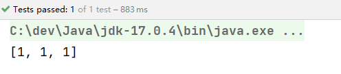

## 13.10 批量删除

```
@Test
public void testDeleteBatch(){
    // 获取JdbcTemplate对象
    ApplicationContext applicationContext = new ClassPathXmlApplicationContext("spring.xml");
    JdbcTemplate jdbcTemplate = applicationContext.getBean("jdbcTemplate", JdbcTemplate.class);
    // 批量删除
    String sql = "delete from t_user where id = ?";
    Object[] objs1 = {2};
    Object[] objs2 = {3};
    Object[] objs3 = {4};
    List<Object[]> list = new ArrayList<>();
    list.add(objs1);
    list.add(objs2);
    list.add(objs3);
    int[] count = jdbcTemplate.batchUpdate(sql, list);
    System.out.println(Arrays.toString(count));
}
```

执行结果：  
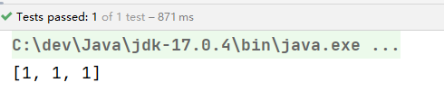

## 13.11 使用回调函数（了解）

使用回调函数，可以参与的更加细节：

```
@Test
public void testCallback(){
    // 获取JdbcTemplate对象
    ApplicationContext applicationContext = new ClassPathXmlApplicationContext("spring.xml");
    JdbcTemplate jdbcTemplate = applicationContext.getBean("jdbcTemplate", JdbcTemplate.class);
    String sql = "select id, real_name, age from t_user where id = ?";

    User user = jdbcTemplate.execute(sql, new PreparedStatementCallback<User>() {
        @Override
        public User doInPreparedStatement(PreparedStatement ps) throws SQLException, DataAccessException {
            User user = null;
            ps.setInt(1, 5);
            ResultSet rs = ps.executeQuery();
            if (rs.next()) {
                user = new User();
                user.setId(rs.getInt("id"));
                user.setRealName(rs.getString("real_name"));
                user.setAge(rs.getInt("age"));
            }
            return user;
        }
    });
    System.out.println(user);
}
```

执行结果：  
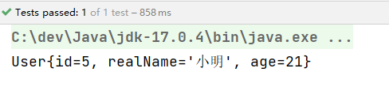

## 13.12 使用德鲁伊连接池

之前数据源是用我们自己写的。也可以使用别人写好的。例如比较牛的德鲁伊连接池。  
第一步：引入德鲁伊连接池的依赖。（毕竟是别人写的）

```
<dependency>
  <groupId>com.alibaba</groupId>
  <artifactId>druid</artifactId>
  <version>1.1.8</version>
</dependency>
```

第二步：将德鲁伊中的数据源配置到spring配置文件中。和配置我们自己写的一样。

```
<?xml version="1.0" encoding="UTF-8"?>
<beans xmlns="http://www.springframework.org/schema/beans"
       xmlns:xsi="http://www.w3.org/2001/XMLSchema-instance"
       xsi:schemaLocation="http://www.springframework.org/schema/beans http://www.springframework.org/schema/beans/spring-beans.xsd">

    <bean id="druidDataSource" class="com.alibaba.druid.pool.DruidDataSource">
        <property name="driverClassName" value="com.mysql.cj.jdbc.Driver"/>
        <property name="url" value="jdbc:mysql://localhost:3306/spring6"/>
        <property name="username" value="root"/>
        <property name="password" value="root"/>
    </bean>
    <bean id="jdbcTemplate" class="org.springframework.jdbc.core.JdbcTemplate">
        <property name="dataSource" ref="druidDataSource"/>
    </bean>
</beans>
```

测试结果：  
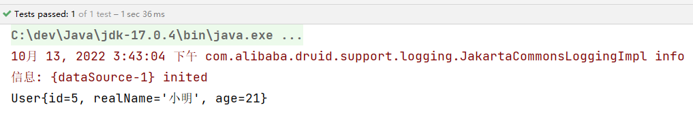

# 十四、GoF之代理模式

## 14.1 对代理模式的理解

**生活场景1**：牛村的牛二看上了隔壁村小花，牛二不好意思直接找小花，于是牛二找来了媒婆王妈妈。这里面就有一个非常典型的代理模式。牛二不能和小花直接对接，只能找一个中间人。其中王妈妈是代理类，牛二是目标类。王妈妈代替牛二和小花先见个面。（现实生活中的婚介所）【在程序中，对象A和对象B无法直接交互时。】  
**生活场景2**：你刚到北京，要租房子，可以自己找，也可以找链家帮你找。其中链家是代理类，你是目标类。你们两个都有共同的行为：找房子。不过链家除了满足你找房子，另外会收取一些费用的。(现实生活中的房产中介)【在程序中，功能需要增强时。】  
**西游记场景**：八戒和高小姐的故事。八戒要强抢民女高翠兰。悟空得知此事之后怎么做的？悟空幻化成高小姐的模样。代替高小姐与八戒会面。其中八戒是客户端程序。悟空是代理类。高小姐是目标类。那天夜里，在八戒眼里，眼前的就是高小姐，对于八戒来说，他是不知道眼前的高小姐是悟空幻化的，在他内心里这就是高小姐。所以悟空代替高小姐和八戒亲了嘴儿。这是非常典型的代理模式实现的保护机制。**代理模式中有一个非常重要的特点：对于客户端程序来说，使用代理对象时就像在使用目标对象一样。【在程序中，目标需要被保护时】**  
**业务场景**：系统中有A、B、C三个模块，使用这些模块的前提是需要用户登录，也就是说在A模块中要编写判断登录的代码，B模块中也要编写，C模块中还要编写，这些判断登录的代码反复出现，显然代码没有得到复用，可以为A、B、C三个模块提供一个代理，在代理当中写一次登录判断即可。代理的逻辑是：请求来了之后，判断用户是否登录了，如果已经登录了，则执行对应的目标，如果没有登录则跳转到登录页面。【在程序中，目标不但受到保护，并且代码也得到了复用。】  
代理模式是GoF23种设计模式之一。属于结构型设计模式。  
代理模式的作用是：为其他对象提供一种代理以控制对这个对象的访问。在某些情况下，一个客户不想或者不能直接引用一个对象，此时可以通过一个称之为“代理”的第三者来实现间接引用。代理对象可以在客户端和目标对象之间起到中介的作用，并且可以通过代理对象去掉客户不应该看到的内容和服务或者添加客户需要的额外服务。 通过引入一个新的对象来实现对真实对象的操作或者将新的对象作为真实对象的一个替身，这种实现机制即为代理模式，通过引入代理对象来间接访问一个对象，这就是代理模式的模式动机。  
代理模式中的角色：

- 代理类（代理主题）
- 目标类（真实主题）
- 代理类和目标类的公共接口（抽象主题）：客户端在使用代理类时就像在使用目标类，不被客户端所察觉，所以代理类和目标类要有共同的行为，也就是实现共同的接口。

代理模式的类图：  
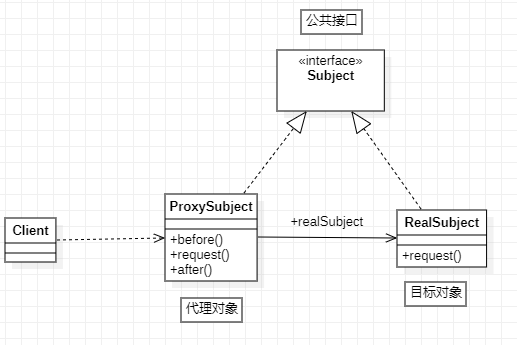  
代理模式在代码实现上，包括两种形式：

- 静态代理
- 动态代理

---

## 14.2 静态代理

现在有这样一个接口和实现类：

```
package com.powernode.mall.service;


public interface OrderService {
    /**
     * 生成订单
     */
    void generate();

    /**
     * 查看订单详情
     */
    void detail();

    /**
     * 修改订单
     */
    void modify();
}
```

```
package com.powernode.mall.service.impl;

import com.powernode.mall.service.OrderService;


public class OrderServiceImpl implements OrderService {
    @Override
    public void generate() {
        try {
            Thread.sleep(1234);
        } catch (InterruptedException e) {
            e.printStackTrace();
        }
        System.out.println("订单已生成");
    }

    @Override
    public void detail() {
        try {
            Thread.sleep(2541);
        } catch (InterruptedException e) {
            e.printStackTrace();
        }
        System.out.println("订单信息如下：******");
    }

    @Override
    public void modify() {
        try {
            Thread.sleep(1010);
        } catch (InterruptedException e) {
            e.printStackTrace();
        }
        System.out.println("订单已修改");
    }
}
```

其中Thread.sleep()方法的调用是为了模拟操作耗时。  
项目已上线，并且运行正常，只是客户反馈系统有一些地方运行较慢，要求项目组对系统进行优化。于是项目负责人就下达了这个需求。首先需要搞清楚是哪些业务方法耗时较长，于是让我们统计每个业务方法所耗费的时长。如果是你，你该怎么做呢？

  
第一种方案：直接修改Java源代码，在每个业务方法中添加统计逻辑：

缺点：

缺点一：违背 OCP 开闭原则

缺点二：代码没有复用（写了很多重复代码）

  
第二种方案：编写一个子类继承OrderServiceImpl，在子类中重写每个方法，代码如下：

```
package com.powernode.mall.service.impl;


public class OrderServiceImplSub extends OrderServiceImpl{
    @Override
    public void generate() {
        long begin = System.currentTimeMillis();
        super.generate();
        long end = System.currentTimeMillis();
        System.out.println("耗时"+(end - begin)+"毫秒");
    }

    @Override
    public void detail() {
        long begin = System.currentTimeMillis();
        super.detail();
        long end = System.currentTimeMillis();
        System.out.println("耗时"+(end - begin)+"毫秒");
    }

    @Override
    public void modify() {
        long begin = System.currentTimeMillis();
        super.modify();
        long end = System.currentTimeMillis();
        System.out.println("耗时"+(end - begin)+"毫秒");
    }
}
```

这种方式可以解决，但是存在两个问题：

- 第一个问题：假设系统中有100个这样的业务类，需要提供100个子类，并且之前写好的创建Service对象的代码，都要修改为创建子类对象。
- 第二个问题：由于采用了继承的方式，导致代码之间的耦合度较高。继承关系是一种耦合度非常高的关系，不建议使用
- 第三个问题：代码也没有复用

  
第三种方案：**使用代理模式**（这里采用**静态代理**）  
可以为OrderService接口提供一个代理类。

```
package com.powernode.mall.service;


public class OrderServiceProxy implements OrderService{ // 代理对象

    // 目标对象
    private OrderService orderService;

    // 通过构造方法将目标对象传递给代理对象
    public OrderServiceProxy(OrderService orderService) {
        this.orderService = orderService;
    }

    @Override
    public void generate() {
        long begin = System.currentTimeMillis();
        // 执行目标对象的目标方法
        orderService.generate();
        long end = System.currentTimeMillis();
        System.out.println("耗时"+(end - begin)+"毫秒");
    }

    @Override
    public void detail() {
        long begin = System.currentTimeMillis();
        // 执行目标对象的目标方法
        orderService.detail();
        long end = System.currentTimeMillis();
        System.out.println("耗时"+(end - begin)+"毫秒");
    }

    @Override
    public void modify() {
        long begin = System.currentTimeMillis();
        // 执行目标对象的目标方法
        orderService.modify();
        long end = System.currentTimeMillis();
        System.out.println("耗时"+(end - begin)+"毫秒");
    }
}
```

这种方式的优点：符合OCP开闭原则，同时采用的是关联关系，所以程序的耦合度较低。所以这种方案是被推荐的。  
编写客户端程序：

```
package com.powernode.mall;

import com.powernode.mall.service.OrderService;
import com.powernode.mall.service.OrderServiceProxy;
import com.powernode.mall.service.impl.OrderServiceImpl;


public class Client {
    public static void main(String[] args) {
        // 创建目标对象
        OrderService target = new OrderServiceImpl();
        // 创建代理对象
        OrderService proxy = new OrderServiceProxy(target);
        // 调用代理对象的代理方法
        proxy.generate();
        proxy.modify();
        proxy.detail();
    }
}
```

运行结果：  
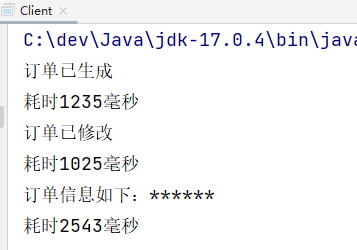  
以上就是代理模式中的静态代理，其中OrderService接口是代理类和目标类的共同接口。OrderServiceImpl是目标类。OrderServiceProxy是代理类。  
大家思考一下：如果系统中业务接口很多，一个接口对应一个代理类，显然也是不合理的，会导致类爆炸。怎么解决这个问题？**动态代理**可以解决。因为在动态代理中可以在内存中动态的为我们生成代理类的字节码。代理类不需要我们写了。类爆炸解决了，而且代码只需要写一次，代码也会得到复用。

---

## 14.3 动态代理（推荐使用）

在程序运行阶段，在内存中动态生成代理类，被称为动态代理，目的是为了减少代理类的数量。解决代码复用的问题。

动态代理还是代理模式，只不过添加了字节码生成技术，可以在内存中为我们动态的生成一个 Class 字节码。这个字节码就是代理类。

  
在内存当中动态生成类的技术常见的包括：

- JDK动态代理技术：**只能代理接口**。
- CGLIB动态代理技术：CGLIB(Code Generation Library)是一个开源项目。是一个强大的，高性能，高质量的Code生成类库，它可以在运行期扩展Java类与实现Java接口。它**既可以代理接口，又可以代理类**，**底层是通过继承的方式实现的**。性能比JDK动态代理要好。**（底层有一个小而快的字节码处理框架ASM。）**
- Javassist动态代理技术：Javassist是一个开源的分析、编辑和创建Java字节码的类库。是由东京工业大学的数学和计算机科学系的 Shigeru Chiba （千叶 滋）所创建的。它已加入了开放源代码JBoss 应用服务器项目，通过使用Javassist对字节码操作为JBoss实现动态"AOP"框架。

---

### 14.3.1 JDK动态代理

我们还是使用静态代理中的例子：一个接口和一个实现类。

```
package com.powernode.mall.service;

/**
 * 订单接口
 * @author DB
 * @version 1.0
 * @className OrderService
 * @since 1.0
 **/
public interface OrderService {
    /**
     * 生成订单
     */
    void generate();

    /**
     * 查看订单详情
     */
    void detail();

    /**
     * 修改订单
     */
    void modify();
}
```

```
package com.powernode.mall.service.impl;

import com.powernode.mall.service.OrderService;

/**
 * @author DB
 * @version 1.0
 * @className OrderServiceImpl
 * @since 1.0
 **/
public class OrderServiceImpl implements OrderService {
    @Override
    public void generate() {
        try {
            Thread.sleep(1234);
        } catch (InterruptedException e) {
            e.printStackTrace();
        }
        System.out.println("订单已生成");
    }

    @Override
    public void detail() {
        try {
            Thread.sleep(2541);
        } catch (InterruptedException e) {
            e.printStackTrace();
        }
        System.out.println("订单信息如下：******");
    }

    @Override
    public void modify() {
        try {
            Thread.sleep(1010);
        } catch (InterruptedException e) {
            e.printStackTrace();
        }
        System.out.println("订单已修改");
    }
}
```

我们在静态代理的时候，除了以上一个接口和一个实现类之外，是不是要写一个代理类UserServiceProxy呀！在动态代理中UserServiceProxy代理类是可以动态生成的。这个类不需要写。我们直接写客户端程序即可：

```
package com.powernode.mall;

import com.powernode.mall.service.OrderService;
import com.powernode.mall.service.impl.OrderServiceImpl;

import java.lang.reflect.Proxy;

/**
 * @author DB
 * @version 1.0
 * @className Client
 * @since 1.0
 **/
public class Client {
    public static void main(String[] args) {
        // 第一步：创建目标对象
        OrderService target = new OrderServiceImpl();
        // 第二步：创建代理对象
        OrderService orderServiceProxy = Proxy.newProxyInstance(
                                        target.getClass().getClassLoader(), 
                                        arget.getClass().getInterfaces(), 
                                        调用处理器对象);
        // 第三步：调用代理对象的代理方法
        orderServiceProxy.detail();
        orderServiceProxy.modify();
        orderServiceProxy.generate();
    }
}
```

以上第二步创建代理对象是需要大家理解的：  
OrderService orderServiceProxy = Proxy.newProxyInstance(target.getClass().getClassLoader(), target.getClass().getInterfaces(), 调用处理器对象);  
这行代码做了两件事：

- 第一件事：在内存中生成了代理类的字节码
- 第二件事：创建代理对象

**Proxy**类全名：java.lang.reflect.Proxy。这是JDK提供的一个类（所以称为JDK动态代理）。主要是**通过这个类在内存中生成代理类的字节码。**

  
关于**newProxyInstance方法**的参数：

第一个参数**ClassLoade**r：类加载器

在内存中生成的字节码也是Class文件，要执行也得先加载到内存当中，加载类就需要类加载器，所以这里需要**指定类加载器**

jdk要求，目标类加载器必须和代理类加载器使用同一个

第二个参数**Class<?>[] interfaces**：

代理类和目标类要实现同一个接口或同一些接口

在内存中生成的代理类的时候，这个代理类是需要你告诉它实现哪些接口

第三个参数：**InvocationHandler**：

被翻译为：调用处理器，是一个接口

**在调用处理器接口中编写的就是：增强代码**

因为具体的要增强什么代码，jdk动态代理技术它实猜不到的，没有那么神

**既然是接口，就要写接口的实现类**

所以接下来我们要写一下java.lang.reflect.InvocationHandler接口的实现类，并且实现接口中的方法，代码如下：

```
package com.powernode.mall.service;

import java.lang.reflect.InvocationHandler;
import java.lang.reflect.Method;

/**
 * @author DB
 * @version 1.0
 * @className TimerInvocationHandler
 * @since 1.0
 **/
public class TimerInvocationHandler implements InvocationHandler {
    @Override
    public Object invoke(Object proxy, Method method, Object[] args) throws Throwable {
        return null;
    }
}
```

InvocationHandler接口中有一个方法invoke，这个invoke方法上有三个参数：

- 第一个参数：Object proxy。代理对象。设计这个参数只是为了后期的方便，如果想在invoke方法中使用代理对象的话，尽管通过这个参数来使用。
- 第二个参数：Method method。目标方法。
- 第三个参数：Object[] args。目标方法调用时要传的参数。

我们将来肯定是要调用“目标方法”的，但要调用目标方法的话，需要“目标对象”的存在，“目标对象”从哪儿来呢？我们可以给TimerInvocationHandler提供一个构造方法，可以通过这个构造方法传过来“目标对象”，代码如下：

```
package com.powernode.mall.service;

import java.lang.reflect.InvocationHandler;
import java.lang.reflect.Method;

/**
 * @author DB
 * @version 1.0
 * @className TimerInvocationHandler
 * @since 1.0
 **/
public class TimerInvocationHandler implements InvocationHandler {
    // 目标对象
    private Object target;

    // 通过构造方法来传目标对象
    public TimerInvocationHandler(Object target) {
        this.target = target;
    }

    @Override
    public Object invoke(Object proxy, Method method, Object[] args) throws Throwable {
        return null;
    }
}
```

有了目标对象我们就可以在invoke()方法中调用目标方法了。代码如下：

```
package com.powernode.mall.service;

import java.lang.reflect.InvocationHandler;
import java.lang.reflect.Method;

/**
 * @author DB
 * @version 1.0
 * @className TimerInvocationHandler
 * @since 1.0
 **/
public class TimerInvocationHandler implements InvocationHandler {
    // 目标对象
    private Object target;

    // 通过构造方法来传目标对象
    public TimerInvocationHandler(Object target) {
        this.target = target;
    }

    @Override
    public Object invoke(Object proxy, Method method, Object[] args) throws Throwable {
        // 目标执行之前增强。
        long begin = System.currentTimeMillis();
        // 调用目标对象的目标方法
        Object retValue = method.invoke(target, args);
        // 目标执行之后增强。
        long end = System.currentTimeMillis();
        System.out.println("耗时"+(end - begin)+"毫秒");
        // 一定要记得返回哦。
        return retValue;
    }
}
```

到此为止，调用处理器就完成了。接下来，应该继续完善Client程序：

```
package com.powernode.mall;

import com.powernode.mall.service.OrderService;
import com.powernode.mall.service.TimerInvocationHandler;
import com.powernode.mall.service.impl.OrderServiceImpl;

import java.lang.reflect.Proxy;

/**
 * @author DB
 * @version 1.0
 * @className Client
 * @since 1.0
 **/
public class Client {
    public static void main(String[] args) {
        // 创建目标对象
        OrderService target = new OrderServiceImpl();
        // 创建代理对象
        OrderService orderServiceProxy = (OrderService) Proxy.newProxyInstance(target.getClass().getClassLoader(),
                                                                                target.getClass().getInterfaces(),
                                                                                new TimerInvocationHandler(target));
        // 调用代理对象的代理方法
        orderServiceProxy.detail();
        orderServiceProxy.modify();
        orderServiceProxy.generate();
    }
}
```

大家可能会比较好奇：那个InvocationHandler接口中的invoke()方法没看见在哪里调用呀？  
注意：当你调用代理对象的代理方法的时候，注册在InvocationHandler接口中的invoke()方法会被调用。也就是上面代码第24 25 26行，这三行代码中任意一行代码执行，注册在InvocationHandler接口中的invoke()方法都会被调用。  
执行结果：  
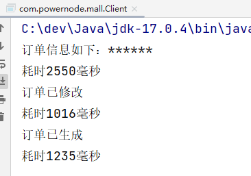  
学到这里可能会感觉有点懵，折腾半天，到最后这不是还得写一个接口的实现类吗？没省劲儿呀？  
你要这样想就错了!!!!  
我们可以看到，不管你有多少个Service接口，多少个业务类，这个TimerInvocationHandler接口是不是只需要写一次就行了，代码是不是得到复用了！！！！  
而且最重要的是，以后程序员只需要关注核心业务的编写了，像这种统计时间的代码根本不需要关注。因为这种统计时间的代码只需要在调用处理器中编写一次即可。  
到这里，JDK动态代理的原理就结束了。  
不过我们看以下这个代码确实有点繁琐，对于客户端来说，用起来不方便：  
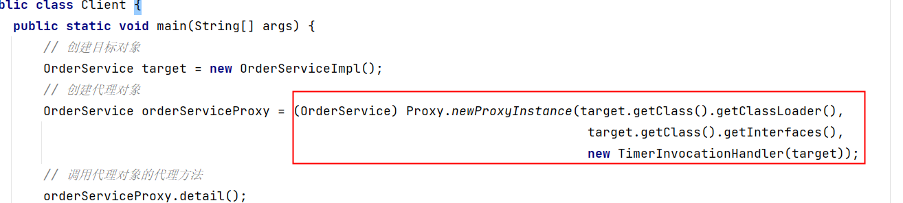  
我们可以提供一个工具类：ProxyUtil，封装一个方法：

```
package com.powernode.mall.util;

import com.powernode.mall.service.TimerInvocationHandler;

import java.lang.reflect.Proxy;

/**
 * @author DB
 * @version 1.0
 * @className ProxyUtil
 * @since 1.0
 **/
public class ProxyUtil {
    public static Object newProxyInstance(Object target) {
        return Proxy.newProxyInstance(target.getClass().getClassLoader(), 
                target.getClass().getInterfaces(), 
                new TimerInvocationHandler(target));
    }
}
```

这样客户端代码就不需要写那么繁琐了：

```
package com.powernode.mall;

import com.powernode.mall.service.OrderService;
import com.powernode.mall.service.TimerInvocationHandler;
import com.powernode.mall.service.impl.OrderServiceImpl;
import com.powernode.mall.util.ProxyUtil;

import java.lang.reflect.Proxy;

/**
 * @author DB
 * @version 1.0
 * @className Client
 * @since 1.0
 **/
public class Client {
    public static void main(String[] args) {
        // 创建目标对象
        OrderService target = new OrderServiceImpl();
        // 创建代理对象
        OrderService orderServiceProxy = (OrderService) ProxyUtil.newProxyInstance(target);
        // 调用代理对象的代理方法
        orderServiceProxy.detail();
        orderServiceProxy.modify();
        orderServiceProxy.generate();
    }
}
```

执行结果：  
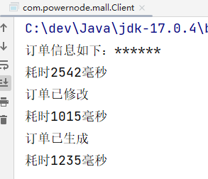

---

### 14.3.2 CGLIB动态代理

CGLIB**既可以代理接口，又可以代理类**。底层采用继承的方式实现。所以被代理的目标类不能使用final修饰。  
使用CGLIB，需要引入它的依赖：

```
<dependency>
  <groupId>cglib</groupId>
  <artifactId>cglib</artifactId>
  <version>3.3.0</version>
</dependency>
```

我们准备一个没有实现接口的类，如下：

```
package com.powernode.mall.service;

/**
 * @author DB
 * @version 1.0
 * @className UserService
 * @since 1.0
 **/
public class UserService {

    public void login(){
        System.out.println("用户正在登录系统....");
    }

    public void logout(){
        System.out.println("用户正在退出系统....");
    }
}
```

使用CGLIB在内存中为UserService类生成代理类，并创建对象：

```
package com.powernode.mall;

import com.powernode.mall.service.UserService;
import net.sf.cglib.proxy.Enhancer;

/**
 * @author DB
 * @version 1.0
 * @className Client
 * @since 1.0
 **/
public class Client {
    public static void main(String[] args) {
        // 创建字节码增强器
        Enhancer enhancer = new Enhancer();
        // 告诉cglib要继承哪个类
        enhancer.setSuperclass(UserService.class);
        // 设置回调接口
        enhancer.setCallback(方法拦截器对象);
        // 生成源码，编译class，加载到JVM，并创建代理对象
        UserService userServiceProxy = (UserService)enhancer.create();

        userServiceProxy.login();
        userServiceProxy.logout();

    }
}
```

和JDK动态代理原理差不多，在CGLIB中需要提供的不是InvocationHandler，而是：net.sf.cglib.proxy.MethodInterceptor  
编写MethodInterceptor接口实现类：

```
package com.powernode.mall.service;

import net.sf.cglib.proxy.MethodInterceptor;
import net.sf.cglib.proxy.MethodProxy;

import java.lang.reflect.Method;

/**
 * @author DB
 * @version 1.0
 * @className TimerMethodInterceptor
 * @since 1.0
 **/
public class TimerMethodInterceptor implements MethodInterceptor {
    @Override
    public Object intercept(Object target, Method method, Object[] objects, MethodProxy methodProxy) throws Throwable {
        return null;
    }
}
```

MethodInterceptor接口中有一个方法intercept()，该方法有4个参数：  
第一个参数：目标对象  
第二个参数：目标方法  
第三个参数：目标方法调用时的实参  
第四个参数：代理方法  
在MethodInterceptor的intercept()方法中调用目标以及添加增强：

```
package com.powernode.mall.service;

import net.sf.cglib.proxy.MethodInterceptor;
import net.sf.cglib.proxy.MethodProxy;

import java.lang.reflect.Method;

/**
 * @author DB
 * @version 1.0
 * @className TimerMethodInterceptor
 * @since 1.0
 **/
public class TimerMethodInterceptor implements MethodInterceptor {
    @Override
    public Object intercept(Object target, Method method, Object[] objects, MethodProxy methodProxy) throws Throwable {
        // 前增强
        long begin = System.currentTimeMillis();
        // 调用目标
        Object retValue = methodProxy.invokeSuper(target, objects);
        // 后增强
        long end = System.currentTimeMillis();
        System.out.println("耗时" + (end - begin) + "毫秒");
        // 一定要返回
        return retValue;
    }
}
```

回调已经写完了，可以修改客户端程序了：

```
package com.powernode.mall;

import com.powernode.mall.service.TimerMethodInterceptor;
import com.powernode.mall.service.UserService;
import net.sf.cglib.proxy.Enhancer;

/**
 * @author DB
 * @version 1.0
 * @className Client
 * @since 1.0
 **/
public class Client {
    public static void main(String[] args) {
        // 创建字节码增强器
        Enhancer enhancer = new Enhancer();
        // 告诉cglib要继承哪个类
        enhancer.setSuperclass(UserService.class);
        // 设置回调接口
        enhancer.setCallback(new TimerMethodInterceptor());
        // 生成源码，编译class，加载到JVM，并创建代理对象
        UserService userServiceProxy = (UserService)enhancer.create();

        userServiceProxy.login();
        userServiceProxy.logout();

    }
}
```

对于高版本的JDK，如果使用CGLIB，需要在启动项中添加两个启动参数：  
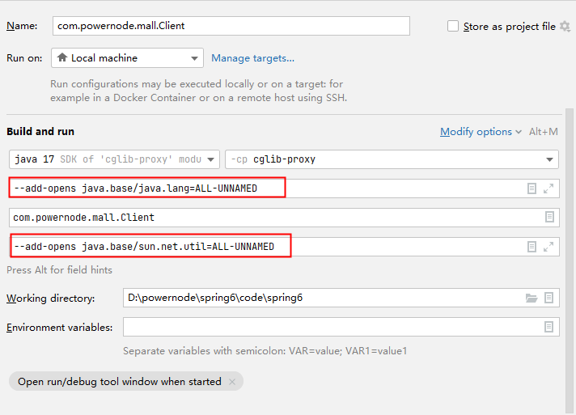

- --add-opens java.base/java.lang=ALL-UNNAMED
- --add-opens java.base/sun.net.util=ALL-UNNAMED

执行结果：  
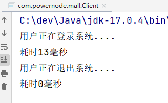

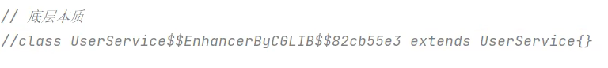

---

# 十五、面向切面编程AOP

IoC使软件组件松耦合。AOP让你能够捕捉系统中经常使用的功能，把它转化成组件。  
AOP（Aspect Oriented Programming）：面向切面编程，一种编程范式。

作用：在不惊动原始设计的基础上为其进行功能增强。  
AOP是对OOP的补充延伸。  
AOP底层使用的就是**动态代理**来实现的。  
Spring的AOP使用的动态代理是：**JDK动态代理 + CGLIB动态代理技术**。Spring在这两种动态代理中灵活切换，如果是代理接口，会默认使用JDK动态代理，如果要代理某个类，这个类没有实现接口，就会切换使用CGLIB。当然，你也可以强制通过一些配置让Spring只使用CGLIB。

---

## 15.1 AOP介绍

一般一个系统当中都会有一些系统服务，例如：日志、事务管理、安全等。这些系统服务被称为：**交叉业务**  
这些**交叉业务**几乎是通用的，不管你是做银行账户转账，还是删除用户数据。日志、事务管理、安全，这些都是需要做的。  
如果在每一个业务处理过程当中，都掺杂这些交叉业务代码进去的话，存在两方面问题：

- 第一：交叉业务代码在多个业务流程中反复出现，显然这个交叉业务代码没有得到复用。并且修改这些交叉业务代码的话，需要修改多处。
- 第二：程序员无法专注核心业务代码的编写，在编写核心业务代码的同时还需要处理这些交叉业务。

使用AOP可以很轻松的解决以上问题。  
请看下图，可以帮助你快速理解AOP的思想：  
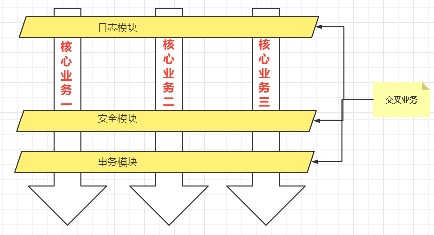  
**用一句话总结AOP：将与核心业务无关的代码独立的抽取出来，形成一个独立的组件，然后以横向交叉的方式应用到业务流程当中的过程被称为AOP。**  
**AOP的优点：**

- **第一：代码复用性增强。**
- **第二：代码易维护。**
- **第三：使开发者更关注业务逻辑。**

---

### **连接点（JoinPoint）**

- **定义**：程序执行过程中的任意位置，粒度可以是执行方法、抛出异常、设置变量等。
- **在 Spring AOP 中的理解**：通常指**方法的执行**。

---

### **切入点（Pointcut）**

- **定义**：用于匹配连接点的表达式。
- **在 Spring AOP 中的作用**：

- 一个切入点可以描述一个具体方法，也可以匹配多个方法。
- **示例**：

- 匹配一个具体方法：`com.itheima.dao` 包下 `BookDao` 接口中的无形参、无返回值的 `save` 方法。
- 匹配多个方法：

- 所有名为 `save` 的方法；
- 所有以 `get` 开头的方法；
- 所有以 `Dao` 结尾的接口中的任意方法；
- 所有带有一个参数的方法。

---

### **通知（Advice）**

- **定义**：在切入点处执行的操作，即共性功能（如日志记录、事务管理等）。
- **在 Spring AOP 中的表现形式**：功能最终以**方法**的形式实现。

---

### **通知类**

- **定义**：用于定义通知逻辑的类。

---

### **切面（Aspect）**

- **定义**：描述通知与切入点之间的对应关系，将共性功能（通知）应用到指定的连接点（切入点）上。

---

✅ **总结**：  
Spring AOP 的核心是通过**切面**将**通知**（共性功能）织入到**切入点**所匹配的**连接点**（方法执行）中，从而实现横切关注点的模块化。

---

## 15.2 AOP的七大术语

```
public class UserService{
    public void do1(){
        System.out.println("do 1");
    }
    public void do2(){
        System.out.println("do 2");
    }
    public void do3(){
        System.out.println("do 3");
    }
    public void do4(){
        System.out.println("do 4");
    }
    public void do5(){
        System.out.println("do 5");
    }
    // 核心业务方法
    public void service(){
        do1();
        do2();
        do3();
        do5();
    }
}
```

- **连接点 Joinpoint**

- 在程序的整个执行流程中，可以织入切面的位置。方法的执行前后，异常抛出之后等位置。连接点描述的是**位置**

- **切点 Pointcut**

- 在程序执行流程中，真正织入切面的方法。（一个切点对应多个连接点）。切点本质上就是**方法**

- **通知 Advice**

- 通知又叫增强，就是具体你要织入的**代码**。
- 通知包括：

- 前置通知
- 后置通知
- 环绕通知
- 异常通知
- 最终通知

- **切面 Aspect**

- **切点 + 通知就是切面。**

- 织入 Weaving

- 把通知应用到目标对象上的过程。

- 目标对象（Target）：

原始功能去掉共性功能对应的类产生的对象，这种对象是无法直接完成最终工作的

- 代理（Proxy）：

目标对象无法直接完成工作，需要对其进行功能回填，通过原始对象的代理对象实现

通过下图，大家可以很好的理解AOP的相关术语：  
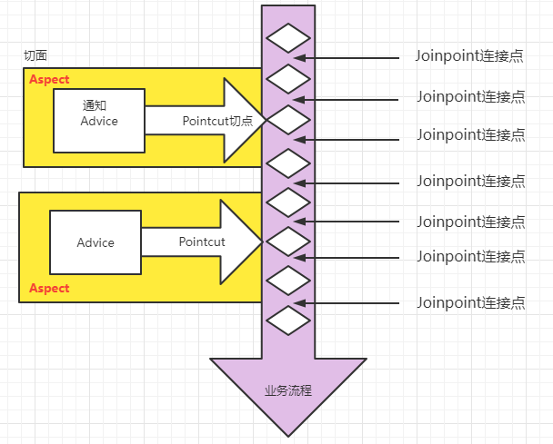

---

## 15.3 切点表达式

切入点：要进行增强的方法  
切入点表达式：要进行增强的方法的描述方式

切入点语法格式：

```
execution([访问控制权限修饰符] 返回值类型 [全限定类名]方法名(形式参数列表) [异常])
```

访问控制权限修饰符：

- 可选项。
- 没写，就是4个权限都包括。
- 写public就表示只包括公开的方法。

返回值类型：

- 必填项。
- ***** 表示返回值类型任意。

全限定类名：

- 可选项。
- 两个点“**..**”代表当前包以及子包下的所有类。
- 省略时表示所有的类。

方法名：

- 必填项。
- ***** 表示所有方法。
- set*表示所有的set方法。

形式参数列表：

- 必填项
- () 表示没有参数的方法
- (..) 参数类型和个数随意的方法
- (*) 只有一个参数的方法
- (*, String) 第一个参数类型随意，第二个参数是String的。

异常：

- 可选项。
- 省略时表示任意异常类型。

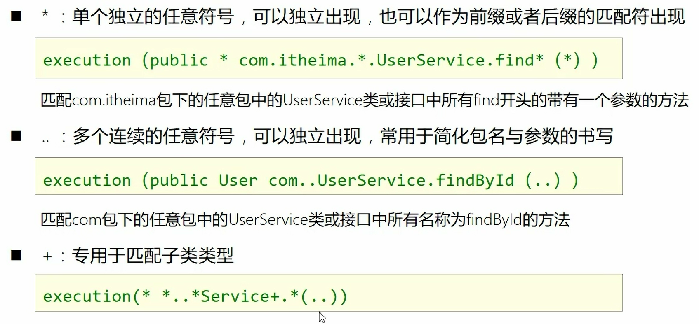

理解以下的切点表达式：

```
execution(public * com.powernode.mall.service.*.delete*(..))
```

```
execution(* com.powernode.mall..*(..))
```

```
execution(* *(..))
```

---

## 15.4 使用Spring的AOP

Spring对AOP的实现包括以下3种方式：

- **第一种方式：Spring框架结合AspectJ框架实现的AOP，基于****注解方式****。**
- **第二种方式：Spring框架结合AspectJ框架实现的AOP，基于****XML方式****。**
- 第三种方式：Spring框架自己实现的AOP，基于XML配置方式。

---

### 15.4.1 准备工作

使用Spring+AspectJ的AOP需要引入的依赖如下：

```
<!--spring context依赖-->
<dependency>
  <groupId>org.springframework</groupId>
  <artifactId>spring-context</artifactId>
  <version>6.0.0-M2</version>
</dependency>

<!--spring aop依赖-->
<dependency>
  <groupId>org.springframework</groupId>
  <artifactId>spring-aop</artifactId>
  <version>6.0.0-M2</version>
</dependency>

<!--spring aspects依赖-->
<dependency>
  <groupId>org.springframework</groupId>
  <artifactId>spring-aspects</artifactId>
  <version>6.0.0-M2</version>
</dependency>
```

Spring配置文件中添加**context**命名空间和**aop**命名空间

```
<?xml version="1.0" encoding="UTF-8"?>
<beans xmlns="http://www.springframework.org/schema/beans"
       xmlns:xsi="http://www.w3.org/2001/XMLSchema-instance"
       xmlns:context="http://www.springframework.org/schema/context"
       xmlns:aop="http://www.springframework.org/schema/aop"
       xsi:schemaLocation="http://www.springframework.org/schema/beans http://www.springframework.org/schema/beans/spring-beans.xsd
                           http://www.springframework.org/schema/context http://www.springframework.org/schema/context/spring-context.xsd
                           http://www.springframework.org/schema/aop http://www.springframework.org/schema/aop/spring-aop.xsd">

</beans>
```

---

### 15.4.2 基于AspectJ的AOP注解式开发

#### 实现步骤

第一步：定义目标类以及目标方法

```
package com.powernode.spring6.service;

// 目标类
@Component
public class OrderService {
    
    // 目标方法
    public void generate(){
        System.out.println("订单已生成！");
    }
}
```

第二步：定义切面类

```
package com.powernode.spring6.service;

import org.aspectj.lang.annotation.Aspect;

// 切面类
@Aspect
public class MyAspect {
}
```

第三步：**目标类和切面类都纳入spring bean管理**  
在目标类OrderService上添加@Component注解**。  
**在切面类MyAspect类上添加@Component注解。  
第四步：在spring配置文件中添加组建扫描

```
<?xml version="1.0" encoding="UTF-8"?>
<beans xmlns="http://www.springframework.org/schema/beans"
       xmlns:xsi="http://www.w3.org/2001/XMLSchema-instance"
       xmlns:context="http://www.springframework.org/schema/context"
       xmlns:aop="http://www.springframework.org/schema/aop"
       xsi:schemaLocation="http://www.springframework.org/schema/beans http://www.springframework.org/schema/beans/spring-beans.xsd
                           http://www.springframework.org/schema/context http://www.springframework.org/schema/context/spring-context.xsd
                           http://www.springframework.org/schema/aop http://www.springframework.org/schema/aop/spring-aop.xsd">
    <!--开启组件扫描-->
    <context:component-scan base-package="com.powernode.spring6.service"/>
</beans>
```

第五步：在切面类中**添加通知@Aspect**

```
package com.powernode.spring6.service;

import org.springframework.stereotype.Component;
import org.aspectj.lang.annotation.Aspect;

// 切面类
@Aspect
@Component
public class MyAspect {
    // 这就是需要增强的代码（通知）
    public void advice(){
        System.out.println("我是一个通知");
    }
}
```

第六步：在通知上**添加切点表达式**

```
package com.powernode.spring6.service;

import org.aspectj.lang.annotation.Before;
import org.springframework.stereotype.Component;
import org.aspectj.lang.annotation.Aspect;

// 切面类
@Aspect
@Component
public class MyAspect {
    
    // 切点表达式
    @Before("execution(* com.powernode.spring6.service.OrderService.*(..))")
    // 这就是需要增强的代码（通知）
    public void advice(){
        System.out.println("我是一个通知");
    }
}
```

**注解@Before表示前置通知。**  
第七步：在spring配置文件中启用自动代理

```
<?xml version="1.0" encoding="UTF-8"?>
<beans xmlns="http://www.springframework.org/schema/beans"
       xmlns:xsi="http://www.w3.org/2001/XMLSchema-instance"
       xmlns:context="http://www.springframework.org/schema/context"
       xmlns:aop="http://www.springframework.org/schema/aop"
       xsi:schemaLocation="http://www.springframework.org/schema/beans http://www.springframework.org/schema/beans/spring-beans.xsd
                           http://www.springframework.org/schema/context http://www.springframework.org/schema/context/spring-context.xsd
                           http://www.springframework.org/schema/aop http://www.springframework.org/schema/aop/spring-aop.xsd">
    <!--开启组件扫描-->
    <context:component-scan base-package="com.powernode.spring6.service"/>
    <!--开启自动代理-->
    <aop:aspectj-autoproxy proxy-target-class="true"/>
</beans>
```

```
<aop:aspectj-autoproxy  proxy-target-class="true"/>
```

开启自动代理之后，凡事带有**@Aspect注解的bean都会生成代理对象**。  
proxy-target-class="true" 表示采用**cglib动态代理**。  
proxy-target-class="false" 表示采用**jdk动态代理**。默认值是false。即使写成false，当没有接口的时候，也会自动选择cglib生成代理类。  
测试程序：

```
package com.powernode.spring6.test;

import com.powernode.spring6.service.OrderService;
import org.junit.Test;
import org.springframework.context.ApplicationContext;
import org.springframework.context.support.ClassPathXmlApplicationContext;

public class AOPTest {
    @Test
    public void testAOP(){
        ApplicationContext applicationContext = new ClassPathXmlApplicationContext("spring-aspectj-aop-annotation.xml");
        OrderService orderService = applicationContext.getBean("orderService", OrderService.class);
        orderService.generate();
    }
}
```

运行结果：  
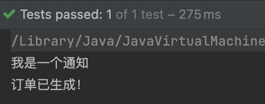

---

#### AOP 通知类型

通知类型包括：

- 前置通知：**@Before** 目标方法执行之前的通知
- 后置通知：**@AfterReturning** 目标方法执行之后的通知
- **环绕通知**：**@Around** 目标方法之前添加通知，同时目标方法执行之后添加通知。

`ProceedingJoinPoint` 是 `JoinPoint` 的子接口，专门用于环绕通知。

`**proceed()**` **方法的作用就是：继续执行原来要调用的那个业务方法**

如果不调用 `proceed()`，那么目标方法 **根本不会被执行**

**环绕是最大的通知，在前置通知之前，在后置通知之后**

- 异常通知：**@AfterThrowing** 发生异常之后执行的通知
- 最终通知：**@After** 放在finally语句块中的通知

接下来，编写程序来测试这几个通知的执行顺序：

```
package com.powernode.spring6.service;

import org.aspectj.lang.ProceedingJoinPoint;
import org.aspectj.lang.annotation.*;
import org.springframework.stereotype.Component;

// 切面类
@Component
@Aspect
public class MyAspect {

    @Around("execution(* com.powernode.spring6.service.OrderService.*(..))")
    public void aroundAdvice(ProceedingJoinPoint proceedingJoinPoint) throws Throwable {
        System.out.println("环绕通知开始");
        // 执行目标方法。
        proceedingJoinPoint.proceed();
        
        System.out.println("环绕通知结束");
    }

    @Before("execution(* com.powernode.spring6.service.OrderService.*(..))")
    public void beforeAdvice(){
        System.out.println("前置通知");
    }

    @AfterReturning("execution(* com.powernode.spring6.service.OrderService.*(..))")
    public void afterReturningAdvice(){
        System.out.println("后置通知");
    }

    @AfterThrowing("execution(* com.powernode.spring6.service.OrderService.*(..))")
    public void afterThrowingAdvice(){
        System.out.println("异常通知");
    }

    @After("execution(* com.powernode.spring6.service.OrderService.*(..))")
    public void afterAdvice(){
        System.out.println("最终通知");
    }

}
```

```
package com.powernode.spring6.service;

import org.springframework.stereotype.Component;

// 目标类
@Component
public class OrderService {
    // 目标方法
    public void generate(){
        System.out.println("订单已生成！");
    }
}
```

```
package com.powernode.spring6.test;

import com.powernode.spring6.service.OrderService;
import org.junit.Test;
import org.springframework.context.ApplicationContext;
import org.springframework.context.support.ClassPathXmlApplicationContext;

public class AOPTest {
    @Test
    public void testAOP(){
        ApplicationContext applicationContext = new ClassPathXmlApplicationContext("spring-aspectj-aop-annotation.xml");
        OrderService orderService = applicationContext.getBean("orderService", OrderService.class);
        orderService.generate();
    }
}
```

执行结果：  
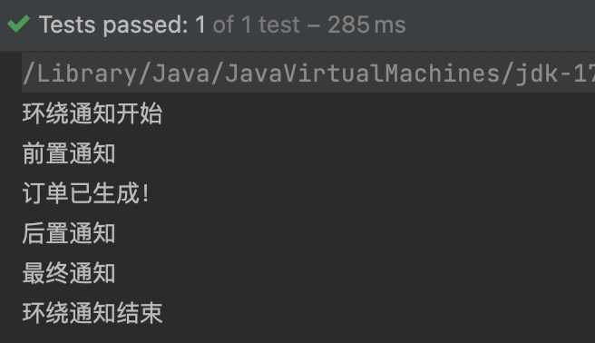  
通过上面的执行结果就可以判断他们的执行顺序了。  
结果中没有异常通知，这是因为目标程序执行过程中没有发生异常。我们尝试让目标方法发生异常：

```
package com.powernode.spring6.service;

import org.springframework.stereotype.Component;

// 目标类
@Component
public class OrderService {
    // 目标方法
    public void generate(){
        System.out.println("订单已生成！");
        if (1 == 1) {
            throw new RuntimeException("模拟异常发生");
        }
    }
}
```

再次执行测试程序，结果如下：  
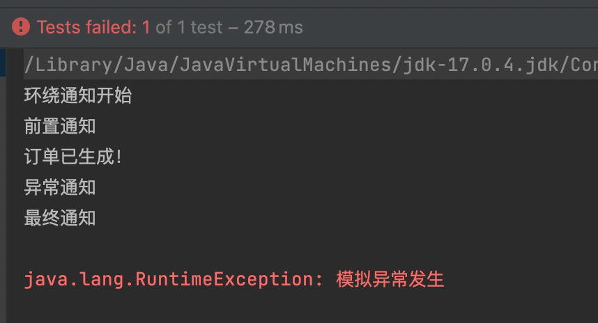  
通过测试得知，当发生异常之后，最终通知也会执行，因为最终通知@After会出现在finally语句块中。  
出现异常之后，**后置通知**和**环绕通知的结束部分**不会执行。

---

**@Around注意事项：**

1. 环绕通知必须依赖形参ProceedingJoinPoint才能实现对原始方法的调用，进而实现原始方法调用前后同时添加通知
2. 通知中如果未使用ProceedingJoinPoint对原始方法进行调用将跳过原始方法的执行
3. 对原始方法的调用可以不接收返回值，通知方法设置成void即可，如果接收返回值，必须设定为Object类型
4. 原始方法的返回值如果是void类型，通知方法的返回值类型可以设置成void，也可以设置成Object
5. 由于无法预知原始方法运行后是否会抛出异常，因此环绕通知方法必须抛出Throwable对象

```
@Around("pt()")
public Object around(ProceedingJoinPoint pjp) throws Throwable {
    System.out.println("around before advice ...");
    Object ret = pjp.proceed();
    System.out.println("around after advice ...");
    return ret;
}
```

---

#### AOP 获取参数数据

**AOP 通知获取参数数据：**

- JoinPoint对象描述了连接点方法的运行状态，可以获取到原始方法的调用参数

```
@Before("pt()")
public void before(JoinPoint jp) {
    Object[] args = jp.getArgs();
    System.out.println(Arrays.toString(args));
}
```

- ProceedingJointPoint是JoinPoint的子类

```
@Around("pt()")
public Object around(ProceedingJoinPoint pjp) throws Throwable {
    Object[] args = pjp.getArgs();
    System.out.println(Arrays.toString(args));
    Object ret = pjp.proceed();
    return ret;
}
```

---

**AOP 通知获取返回值数据：**

- 返回后通知可以获取切入点方法中出现的异常信息，使用形参可以接收对应的异常对象

```
@AfterReturning(value = "pt()", returning = "ret")
public void afterReturning(String ret) {
    System.out.println("afterReturning advice ..." + ret);
}
```

- 环绕通知中可以手工书写对原始方法的调用，得到的结果即为原始方法的返回值

```
@Around("pt()")
public Object around(ProceedingJoinPoint pjp) throws Throwable {
    Object ret = pjp.proceed();
    return ret;
}
```

---

**AOP 获取异常数据（了解）：**

- 异常后通知可以获取切入点方法中出现的异常信息，使用形参可以接收对应的异常对象

```
@AfterThrowing(value = "pt()", throwing = "t")
public void afterThrowing(Throwable t) {
    System.out.println("afterThrowing advice ..." + t);
}
```

- 异常后通知可以获取切入点方法运行的异常信息，使用形参可以接收运行时抛出的异常对象

```
@Around("pt()")
public Object around(ProceedingJoinPoint pjp) {
    Object ret = null;
    try {
        ret = pjp.proceed();
    } catch (Throwable t) {
        t.printStackTrace();
    }
    return ret;
}
```

---

**百度网盘分享链接输入密码数据错误兼容性处理**

```
@Around("DataAdvice.servicePt()")
public Object trimString(ProceedingJoinPoint pjp) throws Throwable {
    Object[] args = pjp.getArgs();
    
    // 对原始参数的每一个参数进行操作
    for (int i = 0; i < args.length; i++) {
        // 如果是字符串数据
        if (args[i].getClass().equals(String.class)) {
            // 取出数据，trim()操作后，更新数据
            args[i] = args[i].toString().trim();
        }
    }
    return pjp.proceed(args);
}
```

---

**说明**：

- 该 AOP 切面用于在方法执行前对所有 `String` 类型参数进行 `trim()` 处理，以解决用户输入密码时可能存在的前后空格问题。
- 使用 `@Around` 环绕通知，在调用原始方法前统一处理参数，提升兼容性和健壮性。
- `pjp.proceed(args)` 会使用修改后的参数调用原方法。

---

#### 切面的先后顺序

我们知道，业务流程当中不一定只有一个切面，可能有的切面控制事务，有的记录日志，有的进行安全控制，如果多个切面的话，顺序如何控制：**可以使用****@Order注解****来标识切面类，为@Order注解的value指定一个整数型的数字，数字越小，优先级越高**。  
再定义一个切面类，如下：

```
package com.powernode.spring6.service;

import org.aspectj.lang.ProceedingJoinPoint;
import org.aspectj.lang.annotation.*;
import org.springframework.core.annotation.Order;
import org.springframework.stereotype.Component;

@Aspect
@Component
@Order(1) //设置优先级
public class YourAspect {

    @Around("execution(* com.powernode.spring6.service.OrderService.*(..))")
    public void aroundAdvice(ProceedingJoinPoint proceedingJoinPoint) throws Throwable {
        System.out.println("YourAspect环绕通知开始");
        // 执行目标方法。
        proceedingJoinPoint.proceed();
        System.out.println("YourAspect环绕通知结束");
    }

    @Before("execution(* com.powernode.spring6.service.OrderService.*(..))")
    public void beforeAdvice(){
        System.out.println("YourAspect前置通知");
    }

    @AfterReturning("execution(* com.powernode.spring6.service.OrderService.*(..))")
    public void afterReturningAdvice(){
        System.out.println("YourAspect后置通知");
    }

    @AfterThrowing("execution(* com.powernode.spring6.service.OrderService.*(..))")
    public void afterThrowingAdvice(){
        System.out.println("YourAspect异常通知");
    }

    @After("execution(* com.powernode.spring6.service.OrderService.*(..))")
    public void afterAdvice(){
        System.out.println("YourAspect最终通知");
    }
}
```

```
package com.powernode.spring6.service;

import org.aspectj.lang.ProceedingJoinPoint;
import org.aspectj.lang.annotation.*;
import org.springframework.core.annotation.Order;
import org.springframework.stereotype.Component;

// 切面类
@Component
@Aspect
@Order(2) //设置优先级
public class MyAspect {

    @Around("execution(* com.powernode.spring6.service.OrderService.*(..))")
    public void aroundAdvice(ProceedingJoinPoint proceedingJoinPoint) throws Throwable {
        System.out.println("环绕通知开始");
        // 执行目标方法。
        proceedingJoinPoint.proceed();
        System.out.println("环绕通知结束");
    }

    @Before("execution(* com.powernode.spring6.service.OrderService.*(..))")
    public void beforeAdvice(){
        System.out.println("前置通知");
    }

    @AfterReturning("execution(* com.powernode.spring6.service.OrderService.*(..))")
    public void afterReturningAdvice(){
        System.out.println("后置通知");
    }

    @AfterThrowing("execution(* com.powernode.spring6.service.OrderService.*(..))")
    public void afterThrowingAdvice(){
        System.out.println("异常通知");
    }

    @After("execution(* com.powernode.spring6.service.OrderService.*(..))")
    public void afterAdvice(){
        System.out.println("最终通知");
    }

}
```

执行测试程序：  
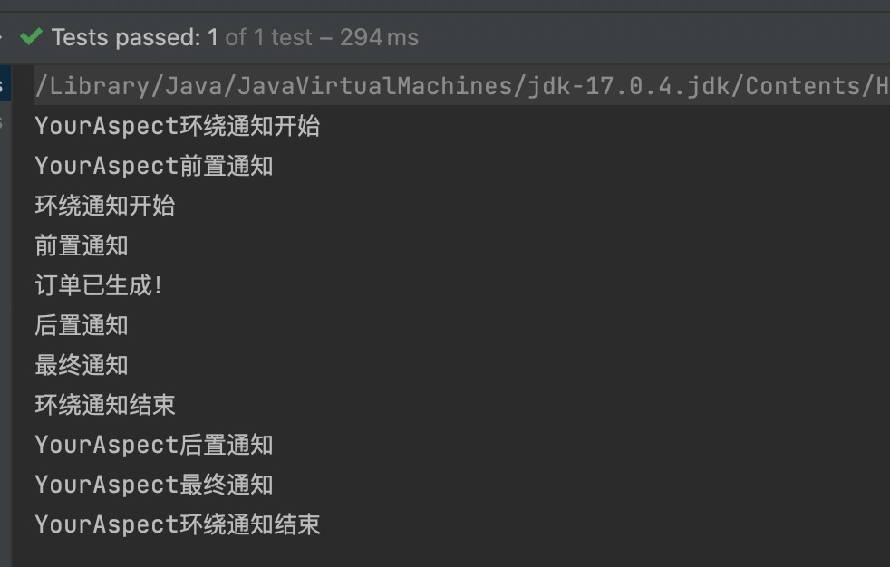  
通过修改**@Order**注解的整数值来切换顺序，执行测试程序：  
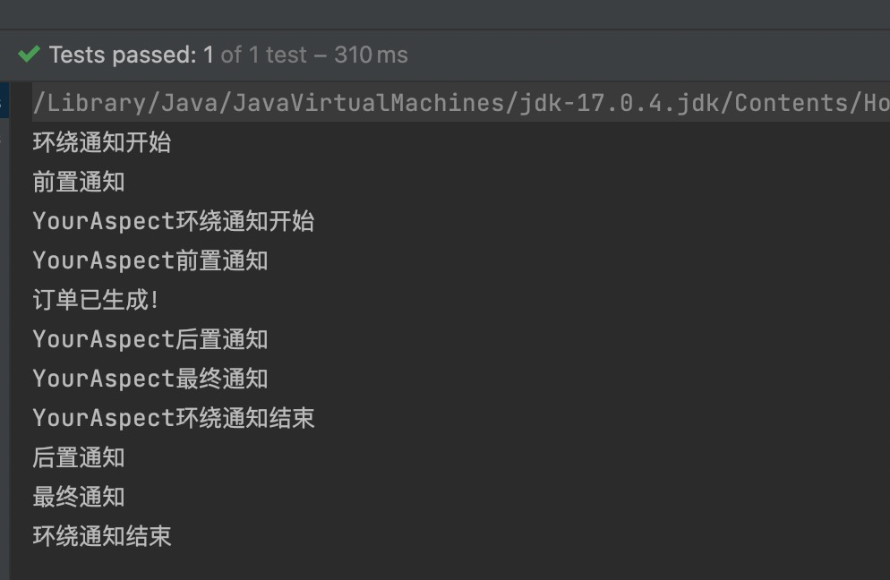

---

#### 优化使用切点表达式

观看以下代码中的切点表达式：

```
package com.powernode.spring6.service;

import org.aspectj.lang.ProceedingJoinPoint;
import org.aspectj.lang.annotation.*;
import org.springframework.core.annotation.Order;
import org.springframework.stereotype.Component;

// 切面类
@Component
@Aspect
@Order(2)
public class MyAspect {

    @Around("execution(* com.powernode.spring6.service.OrderService.*(..))")
    public void aroundAdvice(ProceedingJoinPoint proceedingJoinPoint) throws Throwable {
        System.out.println("环绕通知开始");
        // 执行目标方法。
        proceedingJoinPoint.proceed();
        System.out.println("环绕通知结束");
    }

    @Before("execution(* com.powernode.spring6.service.OrderService.*(..))")
    public void beforeAdvice(){
        System.out.println("前置通知");
    }

    @AfterReturning("execution(* com.powernode.spring6.service.OrderService.*(..))")
    public void afterReturningAdvice(){
        System.out.println("后置通知");
    }

    @AfterThrowing("execution(* com.powernode.spring6.service.OrderService.*(..))")
    public void afterThrowingAdvice(){
        System.out.println("异常通知");
    }

    @After("execution(* com.powernode.spring6.service.OrderService.*(..))")
    public void afterAdvice(){
        System.out.println("最终通知");
    }

}
```

缺点是：

- 第一：切点表达式重复写了多次，没有得到复用。
- 第二：如果要修改切点表达式，需要修改多处，难维护。

使用@Pointcut 注解将切点表达式单独的定义出来，在需要的位置引入即可。如下：

```
package com.powernode.spring6.service;

import org.aspectj.lang.ProceedingJoinPoint;
import org.aspectj.lang.annotation.*;
import org.springframework.core.annotation.Order;
import org.springframework.stereotype.Component;

// 切面类
@Component
@Aspect
@Order(2)
public class MyAspect {
    
    @Pointcut("execution(* com.powernode.spring6.service.OrderService.*(..))")
    public void pointcut(){}

    @Around("pointcut()")
    public void aroundAdvice(ProceedingJoinPoint proceedingJoinPoint) throws Throwable {
        System.out.println("环绕通知开始");
        // 执行目标方法。
        proceedingJoinPoint.proceed();
        System.out.println("环绕通知结束");
    }

    @Before("pointcut()")
    public void beforeAdvice(){
        System.out.println("前置通知");
    }

    @AfterReturning("pointcut()")
    public void afterReturningAdvice(){
        System.out.println("后置通知");
    }

    @AfterThrowing("pointcut()")
    public void afterThrowingAdvice(){
        System.out.println("异常通知");
    }

    @After("pointcut()")
    public void afterAdvice(){
        System.out.println("最终通知");
    }

}
```

使用**@Pointcut**注解来定义独立的切点表达式。  
注意这个@Pointcut注解标注的方法随意，只是起到一个能够让@Pointcut注解编写的位置。如果不是本类使用需要写全限定名。  
  

#### joinPoint.getSignature();获取目标方法的签名

通过方法签名可以获取到一个方法的具体信息

比如获取方法的方法名： **joinPoint.getSignature().getName();**

获取类名：**joinPoint.getSignature().getDeclaringTypeName();**

---

#### 全注解式开发AOP

就是编写一个类，在这个类上面使用大量注解来代替spring的配置文件，spring配置文件消失了，如下：

```
package com.powernode.spring6.service;

import org.springframework.context.annotation.ComponentScan;
import org.springframework.context.annotation.Configuration;
import org.springframework.context.annotation.EnableAspectJAutoProxy;

@Configuration // 代替spring.xml文件
@ComponentScan("com.powernode.spring6.service")  // 组件扫描
@EnableAspectJAutoProxy(proxyTargetClass = true) // 启用aspectj的自动代理机制
public class Spring6Configuration {
}
```

测试程序也变化了：

```
@Test
public void testAOPWithAllAnnotation(){
    ApplicationContext applicationContext = new AnnotationConfigApplicationContext(Spring6Configuration.class);
    OrderService orderService = applicationContext.getBean("orderService", OrderService.class);
    orderService.generate();
}
```

**使用 spring.xml 文件：**

```
ApplicationContext applicationContext = new ClassPathXmlApplicationContext("spring.xml");
```

**使用全注解：**

```
ApplicationContext applicationContext = new AnnotationConfigApplicationContext(Spring6Configuration.class);
```

---

### 15.4.3 基于XML配置方式的AOP（了解）

第一步：编写目标类

```
package com.powernode.spring6.service;

// 目标类
public class VipService {
    public void add(){
        System.out.println("保存vip信息。");
    }
}
```

第二步：编写切面类，并且编写通知

```
package com.powernode.spring6.service;

import org.aspectj.lang.ProceedingJoinPoint;

// 负责计时的切面类
public class TimerAspect {
    
    public void time(ProceedingJoinPoint proceedingJoinPoint) throws Throwable {
        long begin = System.currentTimeMillis();
        //执行目标
        proceedingJoinPoint.proceed();
        long end = System.currentTimeMillis();
        System.out.println("耗时"+(end - begin)+"毫秒");
    }
}
```

第三步：编写spring配置文件

```
<?xml version="1.0" encoding="UTF-8"?>
<beans xmlns="http://www.springframework.org/schema/beans"
       xmlns:xsi="http://www.w3.org/2001/XMLSchema-instance"
       xmlns:context="http://www.springframework.org/schema/context"
       xmlns:aop="http://www.springframework.org/schema/aop"
       xsi:schemaLocation="http://www.springframework.org/schema/beans http://www.springframework.org/schema/beans/spring-beans.xsd
                           http://www.springframework.org/schema/context http://www.springframework.org/schema/context/spring-context.xsd
                           http://www.springframework.org/schema/aop http://www.springframework.org/schema/aop/spring-aop.xsd">

    <!--纳入spring bean管理-->
    <bean id="vipService" class="com.powernode.spring6.service.VipService"/>
    <bean id="timerAspect" class="com.powernode.spring6.service.TimerAspect"/>

    <!--aop配置-->
    <aop:config>
        <!--切点表达式-->
        <aop:pointcut id="p" expression="execution(* com.powernode.spring6.service.VipService.*(..))"/>
        <!--切面-->
        <aop:aspect ref="timerAspect">
            <!--切面=通知 + 切点-->
            <aop:around method="time" pointcut-ref="p"/>
        </aop:aspect>
    </aop:config>
</beans>
```

测试程序：

```
package com.powernode.spring6.test;

import com.powernode.spring6.service.VipService;
import org.junit.Test;
import org.springframework.context.ApplicationContext;
import org.springframework.context.support.ClassPathXmlApplicationContext;

public class AOPTest3 {

    @Test
    public void testAOPXml(){
        ApplicationContext applicationContext = new ClassPathXmlApplicationContext("spring-aop-xml.xml");
        VipService vipService = applicationContext.getBean("vipService", VipService.class);
        vipService.add();
    }
}
```

---

## 15.5 AOP的实际案例：事务处理

项目中的事务控制是在所难免的。在一个业务流程当中，可能需要多条DML语句共同完成，为了保证数据的安全，这多条DML语句要么同时成功，要么同时失败。这就需要添加事务控制的代码。例如以下伪代码：

```
class 业务类1{
    public void 业务方法1(){
        try{
            // 开启事务
            startTransaction();
            
            // 执行核心业务逻辑
            step1();
            step2();
            step3();
            ....
            
            // 提交事务
            commitTransaction();
        }catch(Exception e){
            // 回滚事务
            rollbackTransaction();
        }
    }
    public void 业务方法2(){
        try{
            // 开启事务
            startTransaction();
            
            // 执行核心业务逻辑
            step1();
            step2();
            step3();
            ....
            
            // 提交事务
            commitTransaction();
        }catch(Exception e){
            // 回滚事务
            rollbackTransaction();
        }
    }
    public void 业务方法3(){
        try{
            // 开启事务
            startTransaction();
            
            // 执行核心业务逻辑
            step1();
            step2();
            step3();
            ....
            
            // 提交事务
            commitTransaction();
        }catch(Exception e){
            // 回滚事务
            rollbackTransaction();
        }
    }
}

class 业务类2{
    public void 业务方法1(){
        try{
            // 开启事务
            startTransaction();
            
            // 执行核心业务逻辑
            step1();
            step2();
            step3();
            ....
            
            // 提交事务
            commitTransaction();
        }catch(Exception e){
            // 回滚事务
            rollbackTransaction();
        }
    }
    public void 业务方法2(){
        try{
            // 开启事务
            startTransaction();
            
            // 执行核心业务逻辑
            step1();
            step2();
            step3();
            ....
            
            // 提交事务
            commitTransaction();
        }catch(Exception e){
            // 回滚事务
            rollbackTransaction();
        }
    }
    public void 业务方法3(){
        try{
            // 开启事务
            startTransaction();
            
            // 执行核心业务逻辑
            step1();
            step2();
            step3();
            ....
            
            // 提交事务
            commitTransaction();
        }catch(Exception e){
            // 回滚事务
            rollbackTransaction();
        }
    }
}
//......
```

可以看到，这些业务类中的每一个业务方法都是需要控制事务的，而控制事务的代码又是固定的格式，都是：

```
try{
    // 开启事务
    startTransaction();

    // 执行核心业务逻辑
    //......

    // 提交事务
    commitTransaction();
}catch(Exception e){
    // 回滚事务
    rollbackTransaction();
}
```

这个控制事务的代码就是和业务逻辑没有关系的“**交叉业务**”。以上伪代码当中可以看到这些交叉业务的代码没有得到复用，并且如果这些交叉业务代码需要修改，那必然需要修改多处，难维护，怎么解决？可以采用AOP思想解决。可以把以上控制事务的代码作为环绕通知，切入到目标类的方法当中。接下来我们做一下这件事，有两个业务类，如下：

```
package com.powernode.spring6.biz;

import org.springframework.stereotype.Component;

@Component
// 业务类
public class AccountService {
    // 转账业务方法
    public void transfer(){
        System.out.println("正在进行银行账户转账");
    }
    // 取款业务方法
    public void withdraw(){
        System.out.println("正在进行取款操作");
    }
}
```

```
package com.powernode.spring6.biz;

import org.springframework.stereotype.Component;

@Component
// 业务类
public class OrderService {
    // 生成订单
    public void generate(){
        System.out.println("正在生成订单");
    }
    // 取消订单
    public void cancel(){
        System.out.println("正在取消订单");
    }
}
```

注意，以上两个业务类已经纳入spring bean的管理，因为都添加了@Component注解。  
接下来我们给以上两个业务类的4个方法添加事务控制代码，使用AOP来完成：

```
package com.powernode.spring6.biz;

import org.aspectj.lang.ProceedingJoinPoint;
import org.aspectj.lang.annotation.Around;
import org.aspectj.lang.annotation.Aspect;
import org.springframework.stereotype.Component;

@Aspect
@Component
// 事务切面类
public class TransactionAspect {
    
    @Around("execution(* com.powernode.spring6.biz..*(..))")
    public void aroundAdvice(ProceedingJoinPoint proceedingJoinPoint){
        try {
            System.out.println("开启事务");
            // 执行目标
            proceedingJoinPoint.proceed();
            System.out.println("提交事务");
        } catch (Throwable e) {
            System.out.println("回滚事务");
        }
    }
}
```

你看，这个事务控制代码是不是只需要写一次就行了，并且修改起来也没有成本。编写测试程序：

```
package com.powernode.spring6.test;

import com.powernode.spring6.biz.AccountService;
import com.powernode.spring6.biz.OrderService;
import com.powernode.spring6.service.Spring6Configuration;
import org.junit.Test;
import org.springframework.context.ApplicationContext;
import org.springframework.context.annotation.AnnotationConfigApplicationContext;

public class AOPTest2 {
    @Test
    public void testTransaction(){
        ApplicationContext applicationContext = new AnnotationConfigApplicationContext(Spring6Configuration.class);
        OrderService orderService = applicationContext.getBean("orderService", OrderService.class);
        AccountService accountService = applicationContext.getBean("accountService", AccountService.class);
        // 生成订单
        orderService.generate();
        // 取消订单
        orderService.cancel();
        // 转账
        accountService.transfer();
        // 取款
        accountService.withdraw();
    }
}
```

执行结果：  
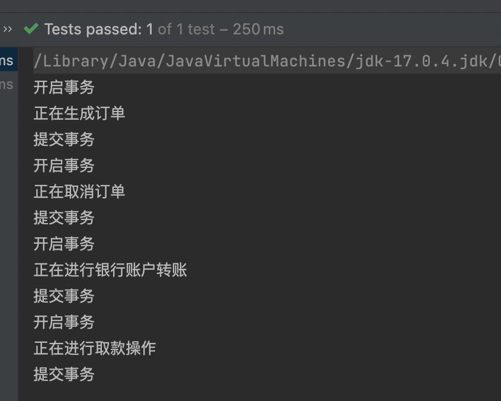  
通过测试可以看到，所有的业务方法都添加了事务控制的代码。

---

## 15.6 AOP的实际案例：安全日志

需求是这样的：项目开发结束了，已经上线了。运行正常。客户提出了新的需求：凡事在系统中进行修改操作的，删除操作的，新增操作的，都要把这个人记录下来。因为这几个操作是属于危险行为。例如有业务类和业务方法：

```
package com.powernode.spring6.biz;

import org.springframework.stereotype.Component;

@Component
//用户业务
public class UserService {
    public void getUser(){
        System.out.println("获取用户信息");
    }
    public void saveUser(){
        System.out.println("保存用户");
    }
    public void deleteUser(){
        System.out.println("删除用户");
    }
    public void modifyUser(){
        System.out.println("修改用户");
    }
}
```

```
package com.powernode.spring6.biz;

import org.springframework.stereotype.Component;

// 商品业务类
@Component
public class ProductService {
    public void getProduct(){
        System.out.println("获取商品信息");
    }
    public void saveProduct(){
        System.out.println("保存商品");
    }
    public void deleteProduct(){
        System.out.println("删除商品");
    }
    public void modifyProduct(){
        System.out.println("修改商品");
    }
}

```

注意：已经添加了@Component注解。  
接下来我们使用aop来解决上面的需求：编写一个负责安全的切面类

```
package com.powernode.spring6.biz;

import org.aspectj.lang.JoinPoint;
import org.aspectj.lang.annotation.Aspect;
import org.aspectj.lang.annotation.Before;
import org.aspectj.lang.annotation.Pointcut;
import org.springframework.stereotype.Component;

@Component
@Aspect
public class SecurityAspect {

    @Pointcut("execution(* com.powernode.spring6.biz..save*(..))")
    public void savePointcut(){}

    @Pointcut("execution(* com.powernode.spring6.biz..delete*(..))")
    public void deletePointcut(){}

    @Pointcut("execution(* com.powernode.spring6.biz..modify*(..))")
    public void modifyPointcut(){}

    @Before("savePointcut() || deletePointcut() || modifyPointcut()")
    public void beforeAdivce(JoinPoint joinpoint){
        System.out.println("XXX操作员正在操作"+joinpoint.getSignature().getName()+"方法");
    }
}
```

```
@Test
public void testSecurity(){
    ApplicationContext applicationContext = new AnnotationConfigApplicationContext(Spring6Configuration.class);
    UserService userService = applicationContext.getBean("userService", UserService.class);
    ProductService productService = applicationContext.getBean("productService", ProductService.class);
    userService.getUser();
    userService.saveUser();
    userService.deleteUser();
    userService.modifyUser();
    productService.getProduct();
    productService.saveProduct();
    productService.deleteProduct();
    productService.modifyProduct();
}
```

执行结果：  
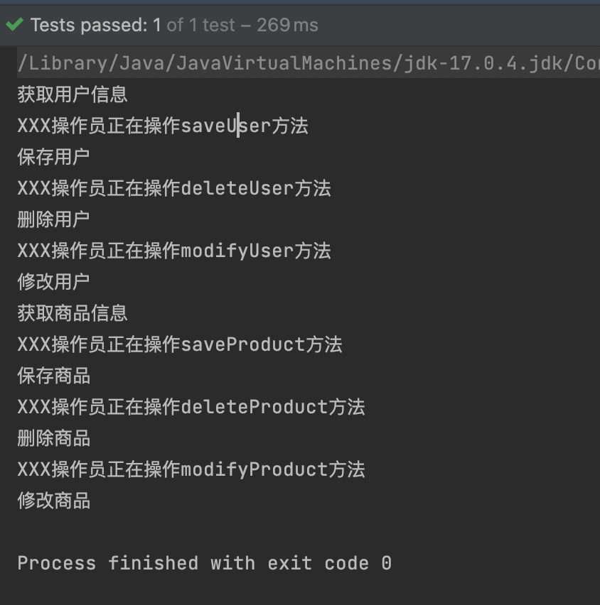

---

# 十六、Spring对事务的支持

## 16.1 事务概述

- 什么是事务

- 在一个业务流程当中，通常需要多条DML（insert delete update）语句共同联合才能完成，这多条DML语句**必须同时成功，或者同时失败**，这样才能保证数据的安全。
- 多条DML要么同时成功，要么同时失败，这叫做事务。
- 事务：Transaction（tx）

- 事务的四个处理过程：

- 第一步：开启事务 (start transaction)
- 第二步：执行核心业务代码
- 第三步：提交事务（如果核心业务处理过程中没有出现异常）(commit transaction)
- 第四步：回滚事务（如果核心业务处理过程中出现异常）(rollback transaction)

- 事务的四个特性：

- A 原子性：事务是最小的工作单元，不可再分。
- C 一致性：事务要求要么同时成功，要么同时失败。事务前和事务后的总量不变。
- I 隔离性：事务和事务之间因为有隔离性，才可以保证互不干扰。
- D 持久性：持久性是事务结束的标志。

---

## 16.2 引入事务场景

以银行账户转账为例学习事务。两个账户act-001和act-002。act-001账户向act-002账户转账10000，必须同时成功，或者同时失败。（一个减成功，一个加成功， 这两条update语句必须同时成功，或同时失败。）  
连接数据库的技术采用Spring框架的JdbcTemplate。  
采用三层架构搭建：  
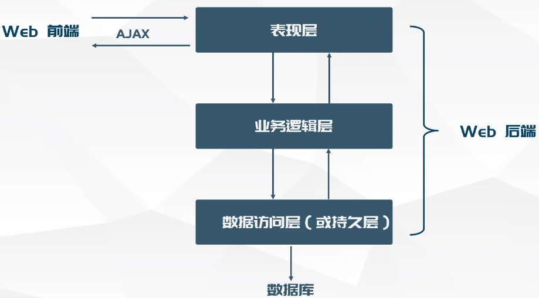  
模块名：spring6-013-tx-bank（依赖如下）

```
<?xml version="1.0" encoding="UTF-8"?>
<project xmlns="http://maven.apache.org/POM/4.0.0"
         xmlns:xsi="http://www.w3.org/2001/XMLSchema-instance"
         xsi:schemaLocation="http://maven.apache.org/POM/4.0.0 http://maven.apache.org/xsd/maven-4.0.0.xsd">
    <modelVersion>4.0.0</modelVersion>
    <groupId>com.powernode</groupId>
    <artifactId>spring6-013-tx-bank</artifactId>
    <version>1.0-SNAPSHOT</version>
    <packaging>jar</packaging>
    <!--仓库-->
    <repositories>
        <!--spring里程碑版本的仓库-->
        <repository>
            <id>repository.spring.milestone</id>
            <name>Spring Milestone Repository</name>
            <url>https://repo.spring.io/milestone</url>
        </repository>
    </repositories>
    <!--依赖-->
    <dependencies>
        <!--spring context-->
        <dependency>
            <groupId>org.springframework</groupId>
            <artifactId>spring-context</artifactId>
            <version>6.2.12</version>
        </dependency>
        <!--spring jdbc-->
        <dependency>
            <groupId>org.springframework</groupId>
            <artifactId>spring-jdbc</artifactId>
            <version>6.2.12</version>
        </dependency>
        <!--mysql驱动-->
        <dependency>
            <groupId>mysql</groupId>
            <artifactId>mysql-connector-java</artifactId>
            <version>8.0.30</version>
        </dependency>
        <!--德鲁伊连接池-->
        <dependency>
            <groupId>com.alibaba</groupId>
            <artifactId>druid</artifactId>
            <version>1.2.13</version>
        </dependency>
        <!--@Resource注解-->
        <dependency>
            <groupId>jakarta.annotation</groupId>
            <artifactId>jakarta.annotation-api</artifactId>
            <version>2.1.1</version>
        </dependency>
        <!--junit-->
        <dependency>
            <groupId>junit</groupId>
            <artifactId>junit</artifactId>
            <version>4.13.2</version>
            <scope>test</scope>
        </dependency>
    </dependencies>
    <properties>
        <maven.compiler.source>17</maven.compiler.source>
        <maven.compiler.target>17</maven.compiler.target>
    </properties>
</project>
```

---

### 第一步：准备数据库表

表结构：  
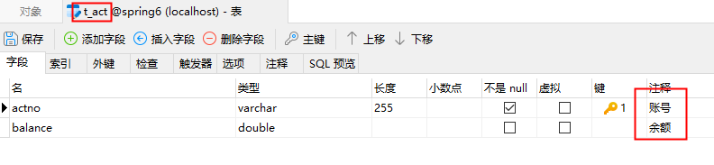  
表数据：  
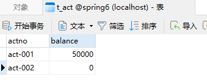

### 第二步：创建包结构

com.powernode.bank.pojo  
com.powernode.bank.service  
com.powernode.bank.service.impl  
com.powernode.bank.dao  
com.powernode.bank.dao.impl

### 第三步：准备POJO类

```
package com.powernode.bank.pojo;

public class Account {
    private String actno;
    private Double balance;

    @Override
    public String toString() {
        return "Account{" +
                "actno='" + actno + '\'' +
                ", balance=" + balance +
                '}';
    }

    public Account() {
    }

    public Account(String actno, Double balance) {
        this.actno = actno;
        this.balance = balance;
    }

    public String getActno() {
        return actno;
    }

    public void setActno(String actno) {
        this.actno = actno;
    }

    public Double getBalance() {
        return balance;
    }

    public void setBalance(Double balance) {
        this.balance = balance;
    }
}
```

### 第四步：编写持久层

```
package com.powernode.bank.dao;

import com.powernode.bank.pojo.Account;

public interface AccountDao {

    /**
     * 根据账号查询余额
     * @param actno
     * @return
     */
    Account selectByActno(String actno);

    /**
     * 更新账户
     * @param act
     * @return
     */
    int update(Account act);

}
```

```
package com.powernode.bank.dao.impl;

import com.powernode.bank.dao.AccountDao;
import com.powernode.bank.pojo.Account;
import jakarta.annotation.Resource;
import org.springframework.jdbc.core.BeanPropertyRowMapper;
import org.springframework.jdbc.core.JdbcTemplate;
import org.springframework.stereotype.Component;

@Repository("accountDao")
public class AccountDaoImpl implements AccountDao {

    @Resource(name = "jdbcTemplate")
    private JdbcTemplate jdbcTemplate;

    @Override
    public Account selectByActno(String actno) {
        String sql = "select actno, balance from t_act where actno = ?";
        Account account = jdbcTemplate.queryForObject(sql, new BeanPropertyRowMapper<>(Account.class), actno);
        return account;
    }

    @Override
    public int update(Account act) {
        String sql = "update t_act set balance = ? where actno = ?";
        int count = jdbcTemplate.update(sql, act.getBalance(), act.getActno());
        return count;
    }
}
```

### 第五步：编写业务层

```
package com.powernode.bank.service;

public interface AccountService {

    /**
     * 转账
     * @param fromActno
     * @param toActno
     * @param money
     */
    void transfer(String fromActno, String toActno, double money);
}
```

```
package com.powernode.bank.service.impl;

import com.powernode.bank.dao.AccountDao;
import com.powernode.bank.pojo.Account;
import com.powernode.bank.service.AccountService;
import jakarta.annotation.Resource;
import org.springframework.stereotype.Service;

@Service("accountService")
public class AccountServiceImpl implements AccountService {

    @Resource(name = "accountDao")
    private AccountDao accountDao;

    @Override
    public void transfer(String fromActno, String toActno, double money) {
        // 查询账户余额是否充足
        Account fromAct = accountDao.selectByActno(fromActno);
        if (fromAct.getBalance() < money) {
            throw new RuntimeException("账户余额不足");
        }
        // 余额充足，开始转账
        Account toAct = accountDao.selectByActno(toActno);
        fromAct.setBalance(fromAct.getBalance() - money);
        toAct.setBalance(toAct.getBalance() + money);
        int count = accountDao.update(fromAct);
        count += accountDao.update(toAct);
        if (count != 2) {
            throw new RuntimeException("转账失败，请联系银行");
        }
    }
}
```

### 第六步：编写Spring配置文件

```
<?xml version="1.0" encoding="UTF-8"?>
<beans xmlns="http://www.springframework.org/schema/beans"
       xmlns:xsi="http://www.w3.org/2001/XMLSchema-instance"
       xmlns:context="http://www.springframework.org/schema/context"
       xsi:schemaLocation="http://www.springframework.org/schema/beans http://www.springframework.org/schema/beans/spring-beans.xsd
                           http://www.springframework.org/schema/context http://www.springframework.org/schema/context/spring-context.xsd">

    <context:component-scan base-package="com.powernode.bank"/>

    <bean id="dataSource" class="com.alibaba.druid.pool.DruidDataSource">
        <property name="driverClassName" value="com.mysql.cj.jdbc.Driver"/>
        <property name="url" value="jdbc:mysql://localhost:3306/spring6"/>
        <property name="username" value="root"/>
        <property name="password" value="root"/>
    </bean>
    <bean id="jdbcTemplate" class="org.springframework.jdbc.core.JdbcTemplate">
        <property name="dataSource" ref="dataSource"/>
    </bean>
</beans>
```

### 第七步：编写表示层（测试程序）

```
package com.powernode.spring6.test;

import com.powernode.bank.service.AccountService;
import org.junit.Test;
import org.springframework.context.ApplicationContext;
import org.springframework.context.support.ClassPathXmlApplicationContext;

public class BankTest {
    @Test
    public void testTransfer(){
        ApplicationContext applicationContext = new ClassPathXmlApplicationContext("spring.xml");
        AccountService accountService = applicationContext.getBean("accountService", AccountService.class);
        try {
            accountService.transfer("act-001", "act-002", 10000);
            System.out.println("转账成功");
        } catch (Exception e) {
            e.printStackTrace();
        }

    }
}
```

执行结果：  
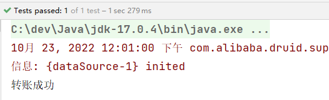  
数据变化：  
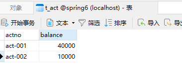

### 模拟异常

```
package com.powernode.bank.service.impl;

import com.powernode.bank.dao.AccountDao;
import com.powernode.bank.pojo.Account;
import com.powernode.bank.service.AccountService;
import jakarta.annotation.Resource;
import org.springframework.stereotype.Service;

@Service("accountService")
public class AccountServiceImpl implements AccountService {

    @Resource(name = "accountDao")
    private AccountDao accountDao;

    @Override
    public void transfer(String fromActno, String toActno, double money) {
        // 查询账户余额是否充足
        Account fromAct = accountDao.selectByActno(fromActno);
        if (fromAct.getBalance() < money) {
            throw new RuntimeException("账户余额不足");
        }
        // 余额充足，开始转账
        Account toAct = accountDao.selectByActno(toActno);
        fromAct.setBalance(fromAct.getBalance() - money);
        toAct.setBalance(toAct.getBalance() + money);
        int count = accountDao.update(fromAct);
        
        // 模拟异常
        String s = null;
        s.toString();

        count += accountDao.update(toAct);
        if (count != 2) {
            throw new RuntimeException("转账失败，请联系银行");
        }
    }
}
```

执行结果：  
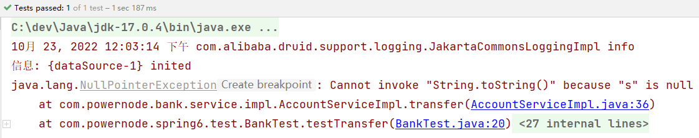  
数据库表中数据：  
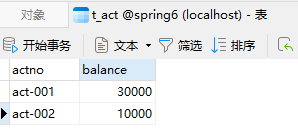  
**丢了1万。**

---

## 16.3 Spring对事务的支持

### Spring实现事务的两种方式

- 编程式事务

- 通过编写代码的方式来实现事务的管理。

- **声明式事务**

- 基于**注解方式**
- 基于**XML配置方式**

### Spring事务管理API

Spring对事务的管理底层实现方式是基于AOP实现的。采用AOP的方式进行了封装。所以Spring专门针对事务开发了一套API，API的核心接口如下：  
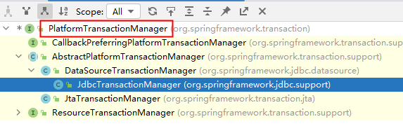  
PlatformTransactionManager接口：spring事务管理器的核心接口。在**Spring6**中它有两个实现：

- **DataSourceTransactionManager**：支持**JdbcTemplate**、**MyBatis**、**Hibernate**等事务管理。
- **JtaTransactionManager**：支持分布式事务管理。

如果要在Spring6中使用JdbcTemplate，就要使用DataSourceTransactionManager来管理事务。（Spring内置写好了，可以直接用。）

---

### Spring 事务角色

- 事务角色

-**事务管理员**：发起事务方，在 Spring 中通常指代业务层开始事务的方法

-**事务协调员**：加入事务方，在 Spring 中通常指代数据层方法，也可以是业务层方法

---

### 事务属性相关配置

#### 事务属性包括哪些

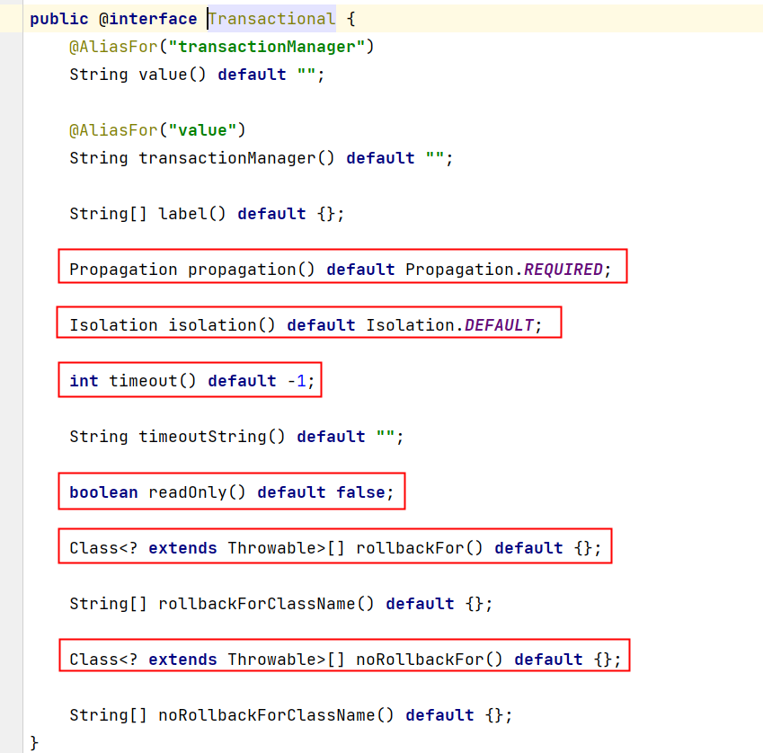  
事务中的**重点属性**：

- **事务传播行为**
- **事务隔离级别**
- **事务超时**
- **只读事务**
- **设置出现哪些异常回滚事务**
- **设置出现哪些异常不回滚事务**

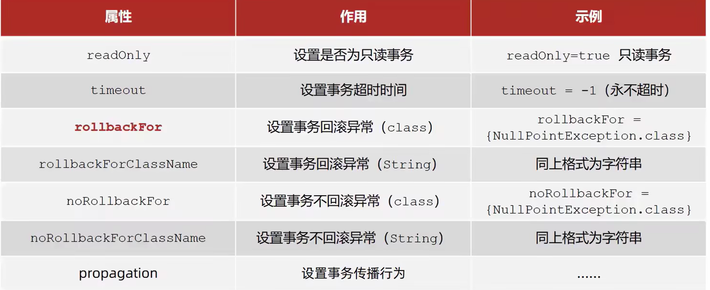

---

#### 事务传播行为

什么是事务的传播行为？

事务传播行为：事务协调员对事务管理员锁携带事务的处理态度。  
在service类中有a()方法和b()方法，a()方法上有事务，b()方法上也有事务，当a()方法执行过程中调用了b()方法，事务是如何传递的？合并到一个事务里？还是开启一个新的事务？这就是事务传播行为。  
事务传播行为在spring框架中被定义为枚举类型：  
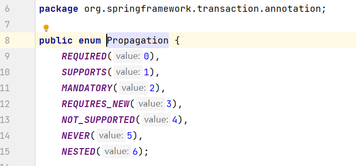  
一共有七种传播行为：

- **REQUIRED**：支持当前事务，如果不存在就新建一个(默认)**【没有就新建，有就加入】**
- **SUPPORTS**：支持当前事务，如果当前没有事务，就以非事务方式执行【有就加入，没有就不管了】
- **MANDATORY**：必须运行在一个事务中，如果当前没有事务正在发生，将抛出一个异常【有就加入，没有就抛异常】
- **REQUIRES_NEW**：开启一个新的事务，如果一个事务已经存在，则将这个存在的事务挂起【不管有没有，直接开启一个新事务，开启的新事务和之前的事务不存在嵌套关系，之前事务被挂起】
- **NOT_SUPPORTED**：以非事务方式运行，如果有事务存在，挂起当前事务【不支持事务，存在就挂起】
- **NEVER**：以非事务方式运行，如果有事务存在，抛出异常【不支持事务，存在就抛异常】
- **NESTED**：如果当前正有一个事务在进行中，则该方法应当运行在一个嵌套式事务中。被嵌套的事务可以独立于外层事务进行提交或回滚。如果外层事务不存在，行为就像REQUIRED一样。**【有事务的话，就在这个事务里再嵌套一个完全独立的事务，嵌套的事务可以独立的提交和回滚。没有事务就和REQUIRED一样。】**

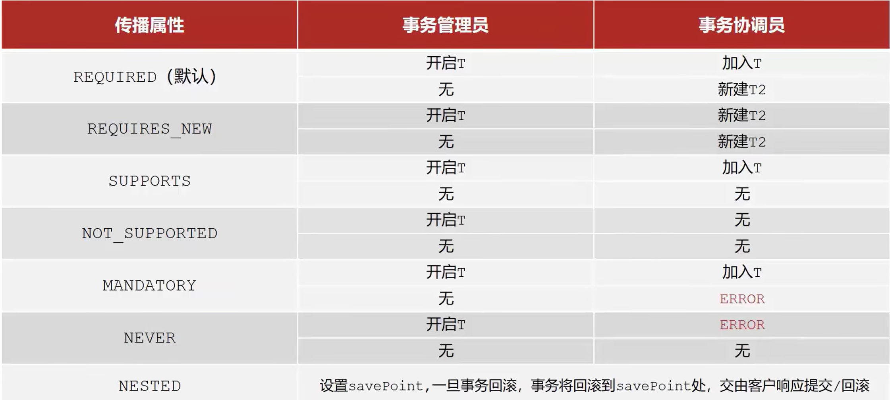

在代码中设置事务的传播行为：

```
@Transactional(propagation = Propagation.REQUIRED)
```

可以编写程序测试一下传播行为：

```
@Transactional(propagation = Propagation.REQUIRED)
public void save(Account act) {

    // 这里调用dao的insert方法。
    accountDao.insert(act); // 保存act-003账户

    // 创建账户对象
    Account act2 = new Account("act-004", 1000.0);
    try {
        accountService.save(act2); // 保存act-004账户
    } catch (Exception e) {

    }
    // 继续往后进行我当前1号事务自己的事儿。
}
```

```
@Override
//@Transactional(propagation = Propagation.REQUIRED)
@Transactional(propagation = Propagation.REQUIRES_NEW)
public void save(Account act) {
    accountDao.insert(act);
    // 模拟异常
    String s = null;
    s.toString();

    // 事儿没有处理完，这个大括号当中的后续也许还有其他的DML语句。
}
```

一定要集成Log4j2日志框架，在日志信息中可以看到更加详细的信息。

---

#### 事务隔离级别

事务隔离级别类似于教室A和教室B之间的那道墙，隔离级别越高表示墙体越厚。隔音效果越好。  
数据库中读取数据存在的三大问题：（三大读问题）

- **脏读：读取到没有提交到数据库的数据，叫做脏读。**
- **不可重复读：在同一个事务当中，第一次和第二次读取的数据不一样。**
- **幻读：读到的数据是假的。**

事务隔离级别包括四个级别：

- 读未提交：**READ_UNCOMMITTED**

- 这种隔离级别，存在脏读问题，所谓的脏读(dirty read)表示能够读取到其它事务未提交的数据。

- 读提交：**READ_COMMITTED**

- 解决了脏读问题，其它事务提交之后才能读到，但存在不可重复读问题。

- 可重复读：**REPEATABLE_READ**

- 解决了不可重复读，可以达到可重复读效果，只要当前事务不结束，读取到的数据一直都是一样的。但存在幻读问题。

- 序列化：**SERIALIZABLE**

- 解决了幻读问题，事务排队执行。不支持并发。

大家可以通过一个表格来记忆：

|   |   |   |   |
|---|---|---|---|
|**隔离级别**|**脏读**|**不可重复读**|**幻读**|
|读未提交|**有**|**有**|**有**|
|读提交|无|**有**|**有**|
|可重复读|无|无|**有**|
|序列化|无|无|无|

在Spring代码中如何设置隔离级别？  
隔离级别在spring中以枚举类型存在：  
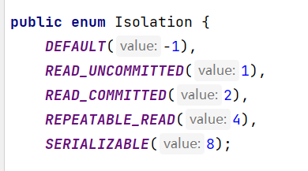

```
@Transactional(isolation = Isolation.READ_COMMITTED)
```

测试事务隔离级别：READ_UNCOMMITTED 和 READ_COMMITTED

**@Transactional(isolation = Isolation.READ_COMMITTED)**  
怎么测试：一个service负责插入，一个service负责查询。负责插入的service要模拟延迟。

```
package com.powernode.bank.service.impl;

import com.powernode.bank.dao.AccountDao;
import com.powernode.bank.pojo.Account;
import jakarta.annotation.Resource;
import org.springframework.stereotype.Service;
import org.springframework.transaction.annotation.Isolation;
import org.springframework.transaction.annotation.Transactional;


@Service("i1")
public class IsolationService1 {

    @Resource(name = "accountDao")
    private AccountDao accountDao;

    // 1号
    // 负责查询
    // 当前事务可以读取到别的事务没有提交的数据。
    //@Transactional(isolation = Isolation.READ_UNCOMMITTED)
    // 对方事务提交之后的数据我才能读取到。
    @Transactional(isolation = Isolation.READ_COMMITTED)
    public void getByActno(String actno) {
        Account account = accountDao.selectByActno(actno);
        System.out.println("查询到的账户信息：" + account);
    }

}
```

```
package com.powernode.bank.service.impl;

import com.powernode.bank.dao.AccountDao;
import com.powernode.bank.pojo.Account;
import jakarta.annotation.Resource;
import org.springframework.stereotype.Service;
import org.springframework.transaction.annotation.Transactional;


@Service("i2")
public class IsolationService2 {

    @Resource(name = "accountDao")
    private AccountDao accountDao;

    // 2号
    // 负责insert
    @Transactional
    public void save(Account act) {
        accountDao.insert(act);
        // 睡眠一会
        try {
            Thread.sleep(1000 * 20);
        } catch (InterruptedException e) {
            e.printStackTrace();
        }
    }

}
```

测试程序

```
@Test
public void testIsolation1(){
    ApplicationContext applicationContext = new ClassPathXmlApplicationContext("spring.xml");
    IsolationService1 i1 = applicationContext.getBean("i1", IsolationService1.class);
    i1.getByActno("act-004");
}

@Test
public void testIsolation2(){
    ApplicationContext applicationContext = new ClassPathXmlApplicationContext("spring.xml");
    IsolationService2 i2 = applicationContext.getBean("i2", IsolationService2.class);
    Account act = new Account("act-004", 1000.0);
    i2.save(act);
}
```

通过执行结果可以清晰的看出隔离级别不同，执行效果不同。

---

#### 事务超时

代码如下：

```
@Transactional(timeout = 10)
```

以上代码表示设置事务的超时时间为10秒。  
**表示超过10秒如果该事务中所有的DML语句还没有执行完毕的话，最终结果会选择回滚。**  
默认值-1，表示没有时间限制。  
**这里有个坑，事务的超时时间指的是哪段时间？**  
**在当前事务当中，最后一条DML语句执行之前的时间。如果最后一条DML语句后面很有很多业务逻辑，这些业务代码执行的时间不被计入超时时间。**

```
@Transactional(timeout = 10) // 设置事务超时时间为10秒。
public void save(Account act) {
    accountDao.insert(act);
    // 睡眠一会
    try {
        Thread.sleep(1000 * 15);
    } catch (InterruptedException e) {
        e.printStackTrace();
    }
}
```

```
@Transactional(timeout = 10) // 设置事务超时时间为10秒。
public void save(Account act) {
    // 睡眠一会
    try {
        Thread.sleep(1000 * 15);
    } catch (InterruptedException e) {
        e.printStackTrace();
    }
    accountDao.insert(act);
}
```

**当然，如果想让整个方法的所有代码都计入超时时间的话，可以在方法最后一行添加一行无关紧要的DML语句。**

#### 只读事务

代码如下：

```
@Transactional(readOnly = true)
```

将当前事务设置为只读事务，在该事务执行过程中只允许select语句执行，delete insert update均不可执行。  
该特性的作用是：**启动spring的优化策略。提高select语句执行效率。**  
如果该事务中确实没有增删改操作，建议设置为只读事务。

---

#### 设置哪些异常回滚事务

代码如下：

```
@Transactional(rollbackFor = RuntimeException.class)
```

表示只有发生RuntimeException异常或该异常的子类异常才回滚。

#### 设置哪些异常不回滚事务

代码如下：

```
@Transactional(noRollbackFor = NullPointerException.class)
```

表示发生NullPointerException或该异常的子类异常不回滚，其他异常则回滚。

---

### 1. 声明式事务之注解实现方式

- 第一步：在spring配置文件中配置事务管理器。

```
<bean id="transactionManager" class="org.springframework.jdbc.datasource.DataSourceTransactionManager">
  <property name="dataSource" ref="dataSource"/>
</bean>
```

- 第二步：在spring配置文件中引入tx命名空间。

```
<?xml version="1.0" encoding="UTF-8"?>
<beans xmlns="http://www.springframework.org/schema/beans"
       xmlns:xsi="http://www.w3.org/2001/XMLSchema-instance"
       xmlns:context="http://www.springframework.org/schema/context"
       xmlns:tx="http://www.springframework.org/schema/tx"
       xsi:schemaLocation="http://www.springframework.org/schema/beans http://www.springframework.org/schema/beans/spring-beans.xsd
                           http://www.springframework.org/schema/context http://www.springframework.org/schema/context/spring-context.xsd
                           http://www.springframework.org/schema/tx http://www.springframework.org/schema/tx/spring-tx.xsd">
```

- 第三步：在spring配置文件中配置“事务注解驱动器”，开始注解的方式控制事务。

```
<tx:annotation-driven transaction-manager="transactionManager"/>
```

- 第四步：在service类上或方法上添加**@Transactional注解**

在类上添加该注解，该类中所有的方法都有事务。

在某个方法上添加该注解，表示只有这个方法使用事务。

```

@Service("accountService")
@Transactional
public class AccountServiceImpl implements AccountService {

    @Resource(name = "accountDao")
    private AccountDao accountDao;

    @Override
    public void transfer(String fromActno, String toActno, double money) {
        // 查询账户余额是否充足
        Account fromAct = accountDao.selectByActno(fromActno);
        if (fromAct.getBalance() < money) {
            throw new RuntimeException("账户余额不足");
        }
        // 余额充足，开始转账
        Account toAct = accountDao.selectByActno(toActno);
        fromAct.setBalance(fromAct.getBalance() - money);
        toAct.setBalance(toAct.getBalance() + money);
        int count = accountDao.update(fromAct);

        // 模拟异常
        String s = null;
        s.toString();

        count += accountDao.update(toAct);
        if (count != 2) {
            throw new RuntimeException("转账失败，请联系银行");
        }
    }
}
```

---

### 2. 事务的全注解式开发

编写一个类来代替配置文件，代码如下：

```

@Configuration
@ComponentScan("com.powernode.bank")
@EnableTransactionManagement
public class Spring6Config {

    @Bean
    public DataSource getDataSource(){
        DruidDataSource dataSource = new DruidDataSource();
        dataSource.setDriverClassName("com.mysql.cj.jdbc.Driver");
        dataSource.setUrl("jdbc:mysql://localhost:3306/spring6");
        dataSource.setUsername("root");
        dataSource.setPassword("root");
        return dataSource;
    }

    @Bean(name = "jdbcTemplate")
    public JdbcTemplate getJdbcTemplate(DataSource dataSource){
        JdbcTemplate jdbcTemplate = new JdbcTemplate();
        jdbcTemplate.setDataSource(dataSource);
        return jdbcTemplate;
    }

    @Bean
    public DataSourceTransactionManager getDataSourceTransactionManager(DataSource dataSource){
        DataSourceTransactionManager dataSourceTransactionManager = new DataSourceTransactionManager();
        dataSourceTransactionManager.setDataSource(dataSource);
        return dataSourceTransactionManager;
    }

}
```

测试程序如下：

```
@Test
public void testNoXml(){
    ApplicationContext applicationContext = new AnnotationConfigApplicationContext(Spring6Config.class);
    AccountService accountService = applicationContext.getBean("accountService", AccountService.class);
    try {
        accountService.transfer("act-001", "act-002", 10000);
        System.out.println("转账成功");
    } catch (Exception e) {
        e.printStackTrace();
    }
}
```

执行结果：  
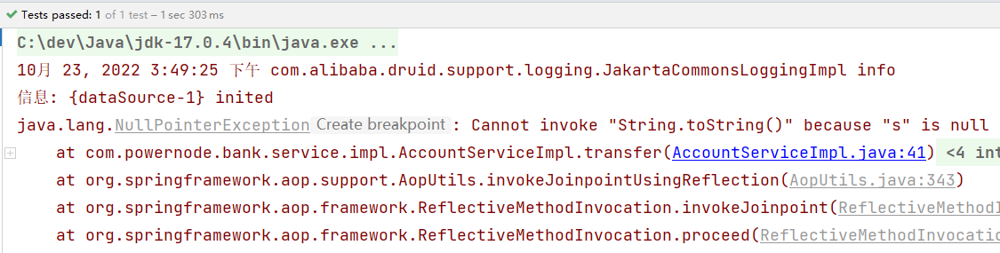  
数据库表中数据：  
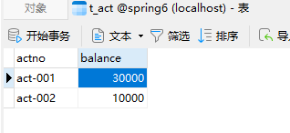

---

① 在业务接口上添加 spring 事务管理

```
public interface AccountService {
    @Transactional
    public void transfer(String out, String in, Double money);
}
```

**注意事项**

Spring注解式事务通常添加在业务层接口中而不会添加到业务层实现类中，降低耦合  
注解式事务可以添加到业务方法上表示当前方法开启事务，也可以添加到接口上表示当前接口所有方法开启事务

---

② 设置事务管理器

```
@Bean
public PlatformTransactionManager transactionManager(DataSource dataSource) {
    DataSourceTransactionManager ptm = new DataSourceTransactionManager();
    ptm.setDataSource(dataSource);
    return ptm;
}
```

注意事项：

事务管理器要根据实现技术选择

Mybatis 框架使用的是 jdbc 事务

---

③ 开始注解式事务驱动

```
@Configuration
@ComponentScan("com.itheima")
@PropertySource("classpath:jdbc.properties")
@Import({JdbcConfig.class, MybatisConfig.class})
@EnableTransactionManagement
public class SpringConfig {
}
```

---

### 3. 声明式事务之XML实现方式

配置步骤：

- 第一步：配置事务管理器
- 第二步：配置通知
- 第三步：配置切面

记得添加aspectj的依赖：

```
<!--aspectj依赖-->
<dependency>
  <groupId>org.springframework</groupId>
  <artifactId>spring-aspects</artifactId>
  <version>6.0.0-M2</version>
</dependency>
```

Spring配置文件如下：  
**记得添加aop的命名空间。**

```
<?xml version="1.0" encoding="UTF-8"?>
<beans xmlns="http://www.springframework.org/schema/beans"
       xmlns:xsi="http://www.w3.org/2001/XMLSchema-instance"
       xmlns:context="http://www.springframework.org/schema/context"
       xmlns:tx="http://www.springframework.org/schema/tx"
       xmlns:aop="http://www.springframework.org/schema/aop"
       xsi:schemaLocation="http://www.springframework.org/schema/beans http://www.springframework.org/schema/beans/spring-beans.xsd
                           http://www.springframework.org/schema/context http://www.springframework.org/schema/context/spring-context.xsd
                           http://www.springframework.org/schema/tx http://www.springframework.org/schema/tx/spring-tx.xsd
                           http://www.springframework.org/schema/aop http://www.springframework.org/schema/aop/spring-aop.xsd">

    <context:component-scan base-package="com.powernode.bank"/>

    <bean id="dataSource" class="com.alibaba.druid.pool.DruidDataSource">
        <property name="driverClassName" value="com.mysql.cj.jdbc.Driver"/>
        <property name="url" value="jdbc:mysql://localhost:3306/spring6"/>
        <property name="username" value="root"/>
        <property name="password" value="root"/>
    </bean>
    <bean id="jdbcTemplate" class="org.springframework.jdbc.core.JdbcTemplate">
        <property name="dataSource" ref="dataSource"/>
    </bean>
    <!--配置事务管理器-->
    <bean id="transactionManager" class="org.springframework.jdbc.datasource.DataSourceTransactionManager">
        <property name="dataSource" ref="dataSource"/>
    </bean>
    <!--配置通知-->
    <tx:advice id="txAdvice" transaction-manager="txManager">
        <tx:attributes>
            <tx:method name="save*" propagation="REQUIRED" rollback-for="java.lang.Throwable"/>
            <tx:method name="del*" propagation="REQUIRED" rollback-for="java.lang.Throwable"/>
            <tx:method name="update*" propagation="REQUIRED" rollback-for="java.lang.Throwable"/>
            <tx:method name="transfer*" propagation="REQUIRED" rollback-for="java.lang.Throwable"/>
        </tx:attributes>
    </tx:advice>
    <!--配置切面-->
    <aop:config>
        <aop:pointcut id="txPointcut" expression="execution(* com.powernode.bank.service..*(..))"/>
        <!--切面 = 通知 + 切点-->
        <aop:advisor advice-ref="txAdvice" pointcut-ref="txPointcut"/>
    </aop:config>
</beans>
```

将AccountServiceImpl类上的@Transactional注解删除。  
编写测试程序：

```
@Test
public void testTransferXml(){
    ApplicationContext applicationContext = new ClassPathXmlApplicationContext("spring2.xml");
    AccountService accountService = applicationContext.getBean("accountService", AccountService.class);
    try {
        accountService.transfer("act-001", "act-002", 10000);
        System.out.println("转账成功");
    } catch (Exception e) {
        e.printStackTrace();
    }
}
```

配置通知为方法进行模糊匹配：

```
<!--配置通知，注意在通知里面要配置事务管理器的id-->
    <tx:advice id="txAdvice" transaction-manager="txManager">
        <tx:attributes>
            <!--之前讲的事务属性都可以在这里配置-->
            <tx:method name="transfer" propagation="REQUIRED" rollback-for="Exception"/>
            <!--模糊匹配-->
            <tx:method name="save*" propagation="REQUIRED" rollback-for="Exception"/>
            <tx:method name="delete*" propagation="REQUIRED" rollback-for="Exception"/>
            <tx:method name="update*" propagation="REQUIRED" rollback-for="Exception"/>
            <tx:method name="modify*" propagation="REQUIRED" rollback-for="Exception"/>
            <tx:method name="query*" read-only="true"/>
            <tx:method name="select*" read-only="true"/>
            <tx:method name="get*" read-only="true"/>

        </tx:attributes>
    </tx:advice>
```

---

# 十七、Spring整合JUnit

## 17.1 Spring对JUnit4的支持

准备工作：

```
<?xml version="1.0" encoding="UTF-8"?>
<project xmlns="http://maven.apache.org/POM/4.0.0"
         xmlns:xsi="http://www.w3.org/2001/XMLSchema-instance"
         xsi:schemaLocation="http://maven.apache.org/POM/4.0.0 http://maven.apache.org/xsd/maven-4.0.0.xsd">
    <modelVersion>4.0.0</modelVersion>
    <groupId>com.powernode</groupId>
    <artifactId>spring6-015-junit</artifactId>
    <version>1.0-SNAPSHOT</version>
    <packaging>jar</packaging>
    <!--仓库-->
    <repositories>
        <!--spring里程碑版本的仓库-->
        <repository>
            <id>repository.spring.milestone</id>
            <name>Spring Milestone Repository</name>
            <url>https://repo.spring.io/milestone</url>
        </repository>
    </repositories>
    <dependencies>
        <!--spring context依赖-->
        <dependency>
            <groupId>org.springframework</groupId>
            <artifactId>spring-context</artifactId>
            <version>6.0.0-M2</version>
        </dependency>
        <!--spring对junit的支持相关依赖-->
        <dependency>
            <groupId>org.springframework</groupId>
            <artifactId>spring-test</artifactId>
            <version>6.0.0-M2</version>
        </dependency>
        <!--junit4依赖-->
        <dependency>
            <groupId>junit</groupId>
            <artifactId>junit</artifactId>
            <version>4.13.2</version>
            <scope>test</scope>
        </dependency>
    </dependencies>
    <properties>
        <maven.compiler.source>17</maven.compiler.source>
        <maven.compiler.target>17</maven.compiler.target>
    </properties>
</project>
```

```
package com.powernode.spring6.bean;

import org.springframework.beans.factory.annotation.Value;
import org.springframework.stereotype.Component;


@Component
public class User {

    @Value("张三")
    private String name;

    @Override
    public String toString() {
        return "User{" +
                "name='" + name + '\'' +
                '}';
    }

    public String getName() {
        return name;
    }

    public void setName(String name) {
        this.name = name;
    }

    public User() {
    }

    public User(String name) {
        this.name = name;
    }
}
```

```
<?xml version="1.0" encoding="UTF-8"?>
<beans xmlns="http://www.springframework.org/schema/beans"
       xmlns:xsi="http://www.w3.org/2001/XMLSchema-instance"
       xmlns:context="http://www.springframework.org/schema/context"
       xsi:schemaLocation="http://www.springframework.org/schema/beans http://www.springframework.org/schema/beans/spring-beans.xsd
                           http://www.springframework.org/schema/context http://www.springframework.org/schema/context/spring-context.xsd">
    <context:component-scan base-package="com.powernode.spring6.bean"/>
</beans>
```

单元测试：

```
package com.powernode.spring6.test;

import com.powernode.spring6.bean.User;
import org.junit.Test;
import org.junit.runner.RunWith;
import org.springframework.beans.factory.annotation.Autowired;
import org.springframework.test.context.ContextConfiguration;
import org.springframework.test.context.junit4.SpringJUnit4ClassRunner;


@RunWith(SpringJUnit4ClassRunner.class) //spring整合junit专用的类加载器
@ContextConfiguration("classpath:spring.xml")
//@ContextConfiguration(classes = SpringConfig.class)
public class SpringJUnit4Test {

    @Autowired
    private User user;

    @Test
    public void testUser(){
        System.out.println(user.getName());
    }
}
```

执行结果如下：  
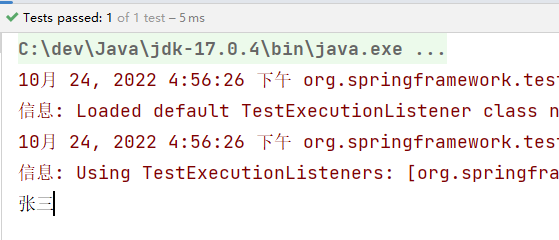  
Spring提供的方便主要是这几个注解：  
**@RunWith(SpringJUnit4ClassRunner.class)****@ContextConfiguration("classpath:spring.xml")**  
在单元测试类上使用这两个注解之后，在单元测试类中的属性上可以使用@Autowired。比较方便。

---

## 17.2 Spring对JUnit5 的支持

引入JUnit5的依赖，Spring对JUnit支持的依赖还是：spring-test，如下：

```
<?xml version="1.0" encoding="UTF-8"?>
<project xmlns="http://maven.apache.org/POM/4.0.0"
         xmlns:xsi="http://www.w3.org/2001/XMLSchema-instance"
         xsi:schemaLocation="http://maven.apache.org/POM/4.0.0 http://maven.apache.org/xsd/maven-4.0.0.xsd">
    <modelVersion>4.0.0</modelVersion>
    <groupId>com.powernode</groupId>
    <artifactId>spring6-015-junit</artifactId>
    <version>1.0-SNAPSHOT</version>
    <packaging>jar</packaging>
    <!--仓库-->
    <repositories>
        <!--spring里程碑版本的仓库-->
        <repository>
            <id>repository.spring.milestone</id>
            <name>Spring Milestone Repository</name>
            <url>https://repo.spring.io/milestone</url>
        </repository>
    </repositories>
    <dependencies>
        <!--spring context依赖-->
        <dependency>
            <groupId>org.springframework</groupId>
            <artifactId>spring-context</artifactId>
            <version>6.0.0-M2</version>
        </dependency>
        <!--spring对junit的支持相关依赖-->
        <dependency>
            <groupId>org.springframework</groupId>
            <artifactId>spring-test</artifactId>
            <version>6.0.0-M2</version>
        </dependency>
        <!--junit5依赖-->
        <dependency>
            <groupId>org.junit.jupiter</groupId>
            <artifactId>junit-jupiter</artifactId>
            <version>5.9.0</version>
            <scope>test</scope>
        </dependency>
    </dependencies>
    <properties>
        <maven.compiler.source>17</maven.compiler.source>
        <maven.compiler.target>17</maven.compiler.target>
    </properties>
</project>
```

```
package com.powernode.spring6.test;

import com.powernode.spring6.bean.User;
import org.junit.jupiter.api.Test;
import org.junit.jupiter.api.extension.ExtendWith;
import org.springframework.beans.factory.annotation.Autowired;
import org.springframework.test.context.ContextConfiguration;
import org.springframework.test.context.junit.jupiter.SpringExtension;


@ExtendWith(SpringExtension.class)
@ContextConfiguration("classpath:spring.xml")
public class SpringJUnit5Test {

    @Autowired
    private User user;

    @Test
    public void testUser(){
        System.out.println(user.getName());
    }
}
```

在JUnit5当中，可以使用Spring提供的以下两个注解，标注到单元测试类上，这样在类当中就可以使用@Autowired注解了。  
**@ExtendWith**(SpringExtension.class)  
**@ContextConfiguration**("classpath:spring.xml")

---

# 十八、Spring集成MyBatis

- Mybatis 程序核心对象分析

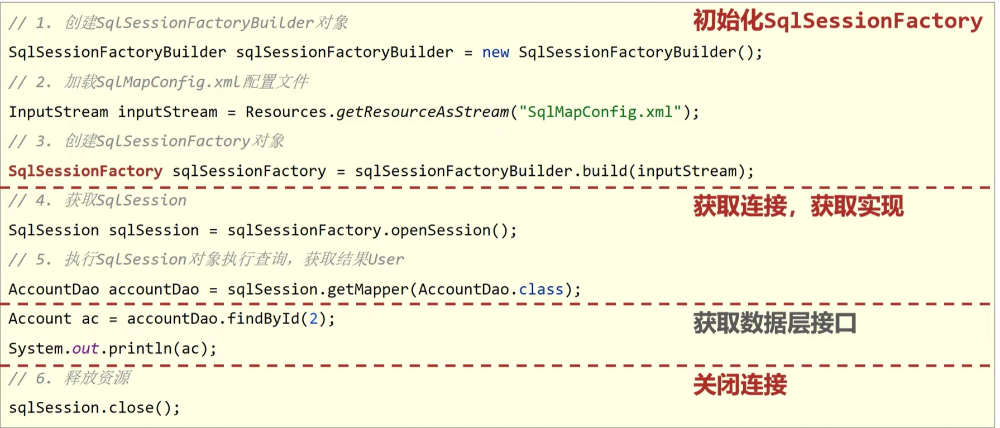

- 整合 Mybatis

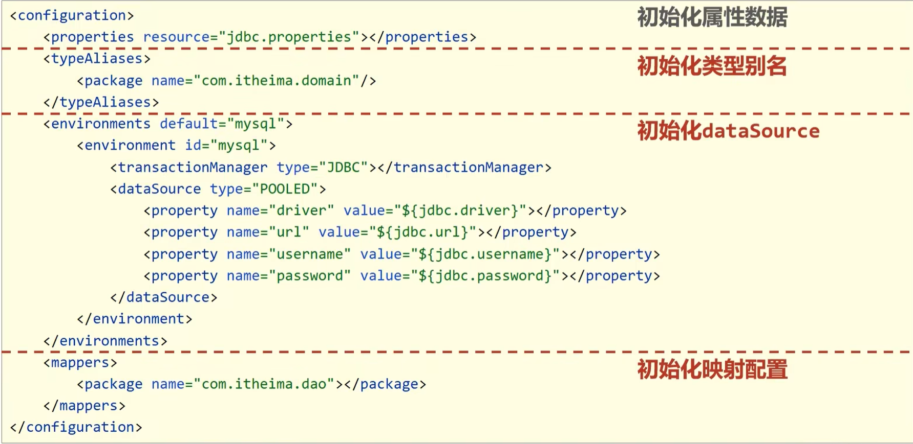

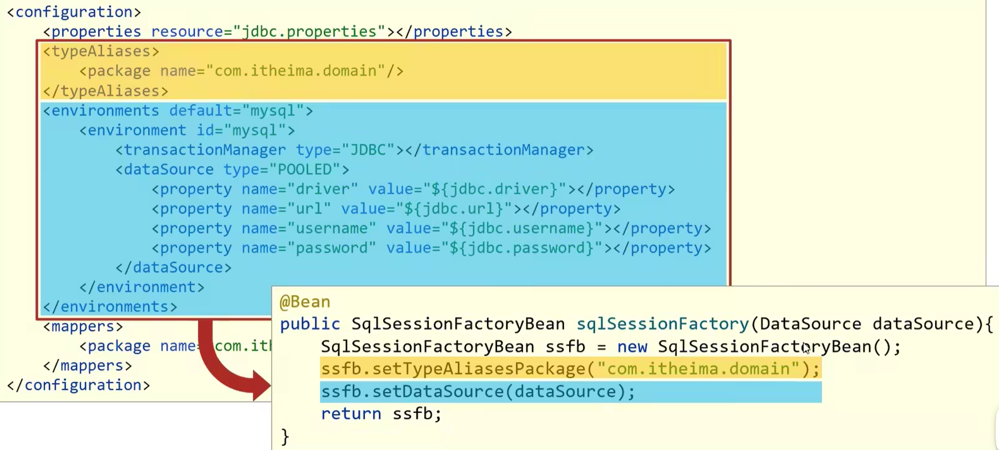

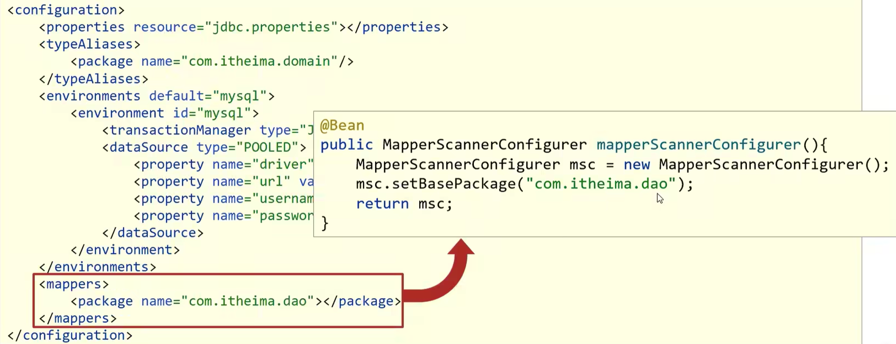

---

## 18.1 实现步骤

- 第一步：准备数据库表

- 使用t_act表（账户表）

- 第二步：IDEA中创建一个模块，并引入依赖

- spring-context
- spring-jdbc
- mysql驱动
- mybatis
- mybatis-spring：**mybatis提供的与spring框架集成的依赖**
- 德鲁伊连接池
- junit

- 第三步：基于三层架构实现，所以提前创建好所有的包

- com.powernode.bank.mapper
- com.powernode.bank.service
- com.powernode.bank.service.impl
- com.powernode.bank.pojo

- 第四步：编写pojo

- Account，属性私有化，提供公开的setter getter和toString。

- 第五步：编写mapper接口

- AccountMapper接口，定义方法

- 第六步：编写mapper配置文件

- 在配置文件中配置命名空间，以及每一个方法对应的sql。

- 第七步：编写service接口和service接口实现类

- AccountService
- AccountServiceImpl

- 第八步：编写jdbc.properties配置文件

- 数据库连接池相关信息

- 第九步：编写mybatis-config.xml配置文件

- 该文件可以没有，大部分的配置可以转移到spring配置文件中。
- 如果遇到mybatis相关的系统级配置，还是需要这个文件。

- 第十步：编写spring.xml配置文件

- 组件扫描
- 引入外部的属性文件
- 数据源
- SqlSessionFactoryBean配置

- 注入mybatis核心配置文件路径
- 指定别名包
- 注入数据源

- Mapper扫描配置器

- 指定扫描的包

- 事务管理器DataSourceTransactionManager

- 注入数据源

- 启用事务注解

- 注入事务管理器

- 第十一步：编写测试程序，并添加事务，进行测试

## 18.2 具体实现

- 第一步：准备数据库表  
    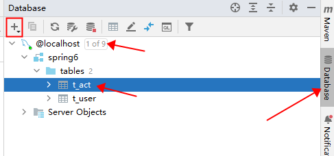  
    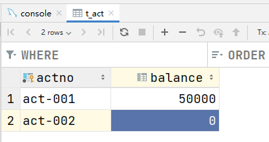

- 第二步：IDEA中创建一个模块，并引入依赖

```
<?xml version="1.0" encoding="UTF-8"?>
<project xmlns="http://maven.apache.org/POM/4.0.0"
         xmlns:xsi="http://www.w3.org/2001/XMLSchema-instance"
         xsi:schemaLocation="http://maven.apache.org/POM/4.0.0 http://maven.apache.org/xsd/maven-4.0.0.xsd">
    <modelVersion>4.0.0</modelVersion>
    <groupId>com.powernode</groupId>
    <artifactId>spring6-016-sm</artifactId>
    <version>1.0-SNAPSHOT</version>
    <packaging>jar</packaging>
    <!--仓库-->
    <repositories>
        <!--spring里程碑版本的仓库-->
        <repository>
            <id>repository.spring.milestone</id>
            <name>Spring Milestone Repository</name>
            <url>https://repo.spring.io/milestone</url>
        </repository>
    </repositories>
    <dependencies>
        <dependency>
            <groupId>org.springframework</groupId>
            <artifactId>spring-context</artifactId>
            <version>6.0.0-M2</version>
        </dependency>
        <dependency>
            <groupId>org.springframework</groupId>
            <artifactId>spring-jdbc</artifactId>
            <version>6.0.0-M2</version>
        </dependency>
        <dependency>
            <groupId>mysql</groupId>
            <artifactId>mysql-connector-java</artifactId>
            <version>8.0.30</version>
        </dependency>
        <dependency>
            <groupId>org.mybatis</groupId>
            <artifactId>mybatis</artifactId>
            <version>3.5.11</version>
        </dependency>
        <dependency>
            <groupId>org.mybatis</groupId>
            <artifactId>mybatis-spring</artifactId>
            <version>2.0.7</version>
        </dependency>
        <dependency>
            <groupId>com.alibaba</groupId>
            <artifactId>druid</artifactId>
            <version>1.2.13</version>
        </dependency>
        <dependency>
            <groupId>junit</groupId>
            <artifactId>junit</artifactId>
            <version>4.13.2</version>
            <scope>test</scope>
        </dependency>
    </dependencies>
    <properties>
        <maven.compiler.source>17</maven.compiler.source>
        <maven.compiler.target>17</maven.compiler.target>
    </properties>
</project>
```

- 第三步：基于三层架构实现，所以提前创建好所有的包

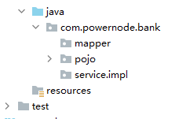

- 第四步：编写pojo

```
package com.powernode.bank.pojo;

public class Account {
    private String actno;
    private Double balance;

    @Override
    public String toString() {
        return "Account{" +
                "actno='" + actno + '\'' +
                ", balance=" + balance +
                '}';
    }

    public Account() {
    }

    public Account(String actno, Double balance) {
        this.actno = actno;
        this.balance = balance;
    }

    public String getActno() {
        return actno;
    }

    public void setActno(String actno) {
        this.actno = actno;
    }

    public Double getBalance() {
        return balance;
    }

    public void setBalance(Double balance) {
        this.balance = balance;
    }
}
```

- 第五步：编写mapper接口

```
package com.powernode.bank.mapper;

import com.powernode.bank.pojo.Account;
import java.util.List;

public interface AccountMapper {

    /**
     * 保存账户
     * @param account
     * @return
     */
    int insert(Account account);

    /**
     * 根据账号删除账户
     * @param actno
     * @return
     */
    int deleteByActno(String actno);

    /**
     * 修改账户
     * @param account
     * @return
     */
    int update(Account account);

    /**
     * 根据账号查询账户
     * @param actno
     * @return
     */
    Account selectByActno(String actno);

    /**
     * 获取所有账户
     * @return
     */
    List<Account> selectAll();
}
```

- 第六步：编写mapper配置文件

一定要注意，按照下图提示创建这个目录。注意是斜杠不是点儿。在resources目录下新建。并且要和Mapper接口包对应上。  
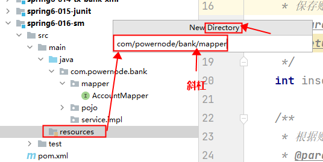  
如果接口叫做AccountMapper，配置文件必须是AccountMapper.xml

```
<?xml version="1.0" encoding="UTF-8" ?>
<!DOCTYPE mapper
        PUBLIC "-//mybatis.org//DTD Mapper 3.0//EN"
        "http://mybatis.org/dtd/mybatis-3-mapper.dtd">
<mapper namespace="com.powernode.bank.mapper.AccountMapper">
    <insert id="insert">
        insert into t_act values(#{actno}, #{balance})
    </insert>
    <delete id="deleteByActno">
        delete from t_act where actno = #{actno}
    </delete>
    <update id="update">
        update t_act set balance = #{balance} where actno = #{actno}
    </update>
    <select id="selectByActno" resultType="Account">
        select * from t_act where actno = #{actno}
    </select>
    <select id="selectAll" resultType="Account">
        select * from t_act
    </select>
</mapper>
```

- 第七步：编写service接口和service接口实现类

注意编写的service实现类纳入IoC容器管理：

```
package com.powernode.bank.service;

import com.powernode.bank.pojo.Account;
import java.util.List;


public interface AccountService {
    /**
     * 开户
     * @param act
     * @return
     */
    int save(Account act);

    /**
     * 根据账号销户
     * @param actno
     * @return
     */
    int deleteByActno(String actno);

    /**
     * 修改账户
     * @param act
     * @return
     */
    int update(Account act);

    /**
     * 根据账号获取账户
     * @param actno
     * @return
     */
    Account getByActno(String actno);

    /**
     * 获取所有账户
     * @return
     */
    List<Account> getAll();

    /**
     * 转账
     * @param fromActno
     * @param toActno
     * @param money
     */
    void transfer(String fromActno, String toActno, double money);
}
```

```
package com.powernode.bank.service.impl;

import com.powernode.bank.mapper.AccountMapper;
import com.powernode.bank.pojo.Account;
import com.powernode.bank.service.AccountService;
import org.springframework.beans.factory.annotation.Autowired;
import org.springframework.stereotype.Service;

import java.util.List;


@Transactional
@Service("accountService")
public class AccountServiceImpl implements AccountService {

    @Autowired
    private AccountMapper accountMapper;

    @Override
    public int save(Account act) {
        return accountMapper.insert(act);
    }

    @Override
    public int deleteByActno(String actno) {
        return accountMapper.deleteByActno(actno);
    }

    @Override
    public int update(Account act) {
        return accountMapper.update(act);
    }

    @Override
    public Account getByActno(String actno) {
        return accountMapper.selectByActno(actno);
    }

    @Override
    public List<Account> getAll() {
        return accountMapper.selectAll();
    }

    @Override
    public void transfer(String fromActno, String toActno, double money) {
        Account fromAct = accountMapper.selectByActno(fromActno);
        if (fromAct.getBalance() < money) {
            throw new RuntimeException("余额不足");
        }
        Account toAct = accountMapper.selectByActno(toActno);
        fromAct.setBalance(fromAct.getBalance() - money);
        toAct.setBalance(toAct.getBalance() + money);
        int count = accountMapper.update(fromAct);
        count += accountMapper.update(toAct);
        if (count != 2) {
            throw new RuntimeException("转账失败");
        }
    }
}
```

- 第八步：编写jdbc.properties配置文件

放在类的根路径下

```
jdbc.driver=com.mysql.cj.jdbc.Driver
jdbc.url=jdbc:mysql://localhost:3306/spring6
jdbc.username=root
jdbc.password=root
```

- 第九步：编写mybatis-config.xml配置文件

放在类的根路径下，只开启日志，其他配置到spring.xml中。

```
<?xml version="1.0" encoding="UTF-8" ?>
<!DOCTYPE configuration
        PUBLIC "-//mybatis.org//DTD Config 3.0//EN"
        "http://mybatis.org/dtd/mybatis-3-config.dtd">
<configuration>
    <settings>
        <setting name="logImpl" value="STDOUT_LOGGING"/>
    </settings>
</configuration>
```

- 第十步：编写spring.xml配置文件

**注意：当你在spring.xml文件中直接写标签内容时，IDEA会自动给你添加命名空间**

```
<?xml version="1.0" encoding="UTF-8"?>
<beans xmlns="http://www.springframework.org/schema/beans"
       xmlns:xsi="http://www.w3.org/2001/XMLSchema-instance"
       xmlns:context="http://www.springframework.org/schema/context" xmlns:tx="http://www.springframework.org/schema/tx"
       xsi:schemaLocation="http://www.springframework.org/schema/beans http://www.springframework.org/schema/beans/spring-beans.xsd http://www.springframework.org/schema/context https://www.springframework.org/schema/context/spring-context.xsd http://www.springframework.org/schema/tx http://www.springframework.org/schema/tx/spring-tx.xsd">
  
    <!--组件扫描-->
    <context:component-scan base-package="com.powernode.bank"/>
  
    <!--外部属性配置文件-->
    <context:property-placeholder location="jdbc.properties"/>

    <!--数据源-->
    <bean id="dataSource" class="com.alibaba.druid.pool.DruidDataSource">
        <property name="driverClassName" value="${jdbc.driver}"/>
        <property name="url" value="${jdbc.url}"/>
        <property name="username" value="${jdbc.username}"/>
        <property name="password" value="${jdbc.password}"/>
    </bean>
    <!--SqlSessionFactoryBean-->
    <bean class="org.mybatis.spring.SqlSessionFactoryBean">
        <!--mybatis核心配置文件路径-->
        <property name="configLocation" value="mybatis-config.xml"/>
        <!--注入数据源-->
        <property name="dataSource" ref="dataSource"/>
        <!--起别名-->
        <property name="typeAliasesPackage" value="com.powernode.bank.pojo"/>
    </bean>
    <!--Mapper扫描器-->
    <bean class="org.mybatis.spring.mapper.MapperScannerConfigurer">
        <property name="basePackage" value="com.powernode.bank.mapper"/>
    </bean>
    <!--事务管理器-->
    <bean id="txManager" class="org.springframework.jdbc.datasource.DataSourceTransactionManager">
        <property name="dataSource" ref="dataSource"/>
    </bean>
    <!--开启事务注解-->
    <tx:annotation-driven transaction-manager="txManager"/>

</beans>
```

- 第十一步：编写测试程序，并添加事务，进行测试

```
package com.powernode.spring6.test;

import com.powernode.bank.service.AccountService;
import org.junit.Test;
import org.springframework.context.ApplicationContext;
import org.springframework.context.support.ClassPathXmlApplicationContext;


public class SMTest {

    @Test
    public void testSM(){
        ApplicationContext applicationContext = new ClassPathXmlApplicationContext("spring.xml");
        AccountService accountService = applicationContext.getBean("accountService", AccountService.class);
        try {
            accountService.transfer("act-001", "act-002", 10000.0);
            System.out.println("转账成功");
        } catch (Exception e) {
            e.printStackTrace();
            System.out.println("转账失败");
        }
    }

}
```

**最后大家别忘了测试事务！！！！**

## 18.3 Spring配置文件的import

spring配置文件有多个，并且可以在spring的核心配置文件中使用import进行引入，我们可以将组件扫描单独定义到一个配置文件中，如下：

```
<?xml version="1.0" encoding="UTF-8"?>
<beans xmlns="http://www.springframework.org/schema/beans"
       xmlns:xsi="http://www.w3.org/2001/XMLSchema-instance"
       xmlns:context="http://www.springframework.org/schema/context"
       xsi:schemaLocation="http://www.springframework.org/schema/beans http://www.springframework.org/schema/beans/spring-beans.xsd http://www.springframework.org/schema/context https://www.springframework.org/schema/context/spring-context.xsd">

    <!--组件扫描-->
    <context:component-scan base-package="com.powernode.bank"/>

</beans>
```

然后在核心配置文件中引入：

```
<?xml version="1.0" encoding="UTF-8"?>
<beans xmlns="http://www.springframework.org/schema/beans"
       xmlns:xsi="http://www.w3.org/2001/XMLSchema-instance"
       xmlns:context="http://www.springframework.org/schema/context" xmlns:tx="http://www.springframework.org/schema/tx"
       xsi:schemaLocation="http://www.springframework.org/schema/beans http://www.springframework.org/schema/beans/spring-beans.xsd http://www.springframework.org/schema/context https://www.springframework.org/schema/context/spring-context.xsd http://www.springframework.org/schema/tx http://www.springframework.org/schema/tx/spring-tx.xsd">

    <!--引入其他的spring配置文件-->
    <import resource="common.xml"/>

</beans>
```

**注意：在实际开发中，service单独配置到一个文件中，dao单独配置到一个文件中，然后在核心配置文件中引入，养成好习惯。**

# 十九、Spring中的八大模式

## 19.1 简单工厂模式

BeanFactory的getBean()方法，通过唯一标识来获取Bean对象。是典型的简单工厂模式（静态工厂模式）；

## 19.2 工厂方法模式

FactoryBean是典型的工厂方法模式。在配置文件中通过factory-method属性来指定工厂方法，该方法是一个实例方法。

## 19.3 单例模式

Spring用的是双重判断加锁的单例模式。请看下面代码，我们之前讲解Bean的循环依赖的时候见过：  
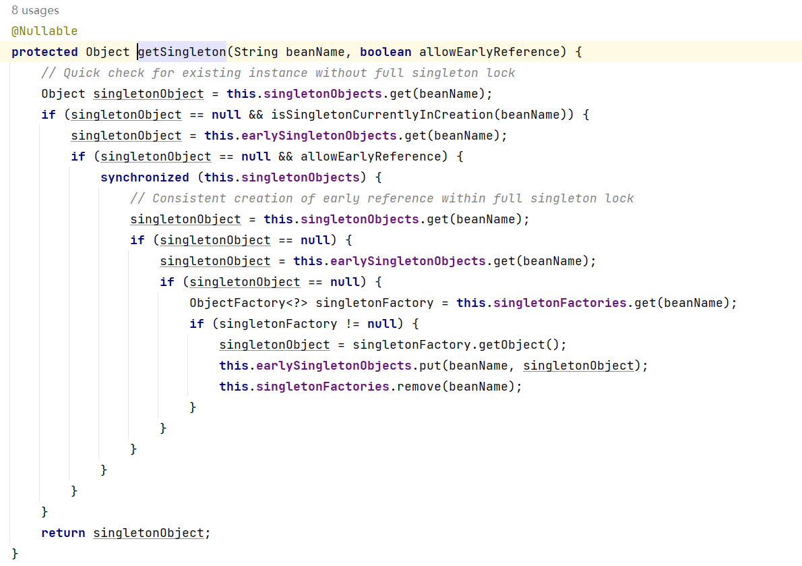

## 19.4 代理模式

Spring的AOP就是使用了动态代理实现的。

## 19.5 装饰器模式

JavaSE中的IO流是非常典型的装饰器模式。  
Spring 中配置 DataSource 的时候，这些dataSource可能是各种不同类型的，比如不同的数据库：Oracle、SQL Server、MySQL等，也可能是不同的数据源：比如apache 提供的org.apache.commons.dbcp.BasicDataSource、spring提供的org.springframework.jndi.JndiObjectFactoryBean等。  
这时，能否在尽可能少修改原有类代码下的情况下，做到动态切换不同的数据源？此时就可以用到装饰者模式。  
Spring根据每次请求的不同，将dataSource属性设置成不同的数据源，以到达切换数据源的目的。  
**Spring中类名中带有：Decorator和Wrapper单词的类，都是装饰器模式。**

## 19.6 观察者模式

定义对象间的一对多的关系，当一个对象的状态发生改变时，所有依赖于它的对象都得到通知并自动更新。Spring中观察者模式一般用在listener的实现。  
Spring中的事件编程模型就是观察者模式的实现。在Spring中定义了一个ApplicationListener接口，用来监听Application的事件，Application其实就是ApplicationContext，ApplicationContext内置了几个事件，其中比较容易理解的是：ContextRefreshedEvent、ContextStartedEvent、ContextStoppedEvent、ContextClosedEvent

## 19.7 策略模式

策略模式是行为性模式，调用不同的方法，适应行为的变化 ，强调父类的调用子类的特性 。  
getHandler是HandlerMapping接口中的唯一方法，用于根据请求找到匹配的处理器。  
比如我们自己写了AccountDao接口，然后这个接口下有不同的实现类：AccountDaoForMySQL，AccountDaoForOracle。对于service来说不需要关心底层具体的实现，只需要面向AccountDao接口调用，底层可以灵活切换实现，这就是策略模式。

## 19.8 模板方法模式

Spring中的JdbcTemplate类就是一个模板类。它就是一个模板方法设计模式的体现。在模板类的模板方法execute中编写核心算法，具体的实现步骤在子类中完成。

---

2025年12月07日完结

---

## 🔗 关联笔记
- [[SpringMVC笔记]]
- [[SpringBoot2笔记]]
- [[Mybatis笔记]]
- [[SpringSecurity笔记]]
- [[JavaWeb笔记]]
