2025年12月08日开启了 springMVC 课程的学习

# 1. 什么是MVC 架构模式？

MVC 是一种软件架构模式（是一种软件架构设计思想）

每一块各司其职，都有自己的事要做，分工协作，互相配合

M 是什么？：**Model（模型）** 负责业务处理及数据收集

模型负责处理请求的所有数据逻辑，直接与数据库交互，处理数据的验证、保存、更新、删除等操作。模型不处理用户请求的成功 / 失败逻辑，仅专注于数据交互，也不与视图直接交互。

V 是什么？：**View（视图）** 负责数据的展示

视图只关心数据的呈现方式，接收控制器发送的信息并将其格式化为用户可查看的形式（如 HTML）。视图不与模型直接交互，仅通过控制器获取数据。

C 是什么？：**Controller（控制器）** 负责调度，它是一个调度中心，它来决定什么时候调用 Model 来处理业务，什么时候调用 View 视图来展示数据

控制器作为中间人处理客户端请求，协调模型和视图。接收请求后向模型请求数据，再根据模型响应结果调用对应视图呈现内容。控制器不包含过多代码，不直接处理数据逻辑。

### 1.1MVC 核心特点

**模型和视图永远不直接交互**，所有交互通过控制器完成。模型专注数据逻辑，视图专注数据呈现，控制器专注流程协调，实现代码解耦和职责分离。

为什么要分为三块？有什么优点？

1.低耦合，扩展能力强

2.代码复用性强

3.代码可维护性强

4.高内聚，让程序更加专注业务的开发

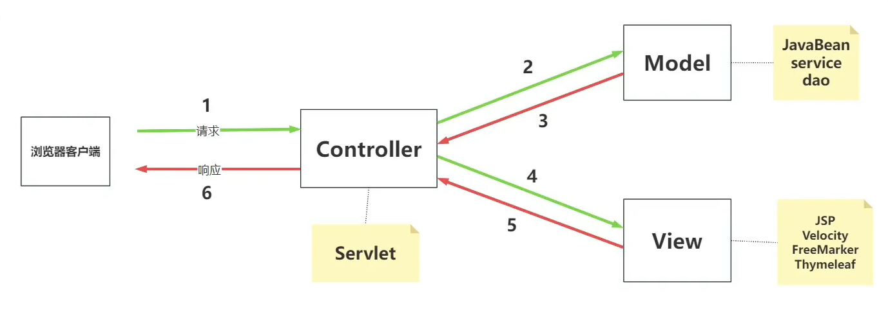

### 1.2 三层模型与 MVC 架构模式有什么区别？

|   |   |   |
|---|---|---|
|方面|三层模型|MVC|
|**目的**|分离系统整体职责（前端、逻辑、数据库）|组织用户界面相关代码|
|**适用范围**|整个应用系统（前后端都可能涉及）|主要在表现层内部使用|
|**层级关系**|通常是垂直分层（一层调用下一层）|是横向协作（三者互相配合）|
|**典型场景**|后台服务、企业系统|Web 前端、桌面 GUI 程序|

三层模型更加关注业务逻辑组件的划分，

MVC 架构模式关注的是整个应用程序的层次关系和分离思想

---

# 2. 什么是 SpringMVC？

### 2.1SpringMVC 概述

SpringMVC 是一个实现了 MVC 架构模式的 Web 框架，底层基于 **Servlet** 实现

SpringMVC 是 spring 框架的一部分

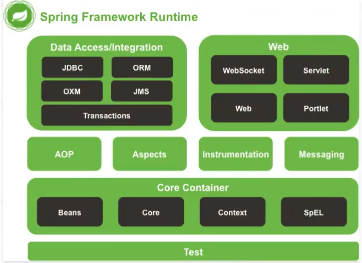

---

### 2.2SpringMVC 帮我们做了什么？

与传统的 Servlet 有什么区别？

1. 入口控制：SpringMVC 框架通过 **DispatcherServlet** 作为入口控制器，负责**接收请求**和**分发请求**。

而在 Servlet 开发中，需要自己编写 Servlet 程序，并在 web.xml 中进行配置，才能接受和处理请求。

2. 在 SpringMVC 中，表单提交时可以自动将表单数据绑定到相应的 JavaBean 对象中，只需要在控制器方法的参数列表中声明该 JavaBean 对象即可，无需手动获取和赋值表单数据。

而在纯粹的 Servlet 开发中，这些都是需要自己手动完成的。

3. IoC 容器：SpringMVC 框架通过 IoC 容器管理对象，只需要在配置文件中进行相应的配置即可获取实例对象，

而在 Servlet 开发中需要手动创建对象实例。

4. 统一处理请求：SpringMVC 框架提供了拦截器、异常处理等统一处理请求的机制，并且可以灵活地配置这些处理器。

而在 Servlet 开发中，需要自行编写过滤器、异常处理器等，增加了代码的复杂度和开发难度。

5. 视图解析：SpringMVC 框架提供了多种视图模板，如 JSP、Freemarker、Velocity 等，并且支持国际化、主题等特性。

而在 Servlet 开发中需要手动处理视图层，增加了代码的复杂度。

与 Servlet 开发相比，SpringMVC 框架可以帮我们节省很多时间和精力，减少代码的复杂度，更加专注于业务开发。同时，也提供了更多的功能和扩展性，可以更好地满足企业级应用的开发需求。

---

### 2.3 SpringMVC 框架的特点

1．轻量级：相对于其他Web框架，Spring MVC框架比较小巧轻便。（只有几个几百KB左右的Jar包文件）  
2．模块化：请求处理过程被分成多个模块，以模块化的方式进行处理。  
a．控制器模块：**Controller**  
b．业务逻辑模块：**Model**  
c．视图模块：**View**  
3．依赖注入：Spring MVC框架利用Spring框架的依赖注入功能实现对象的管理，实现松散耦合。  
4．易于扩展：提供了很多口子，允许开发者根据需要插入自己的代码，以扩展实现应用程序的特殊需求。  
a．Spring MVC框架允许开发人员通过自定义模块和组件来扩展和增强框架的功能。  
b．Spring MVC框架与其他Spring框架及第三方框架集成得非常紧密，这使得开发人员可以非常方便地集成其他框架，以获得更好的功能。  
5．易于测试：支持单元测试框架，提高代码质量和可维护性。（对SpringMVC中的Controller测试时，不需要依靠Web服务器。）  
6．自动化配置：提供自动化配置，减少配置细节。  
a．Spring MVC框架基于约定大于配置的原则，对常用的配置约定进行自动化配置。  
7．灵活性：Spring MVC框架支持多种视图技术，如JSP、FreeMarker、Thymeleaf、FreeMarker等，针对不同的视图配置不同的视图解析器即可。

---

# 3. SpringMVC 程序

## 3.1. SpringMVC 程序的开发流程

#### 3.1.1 创建 Maven 模块

第一步：创建一个空的工程springmvc  
第二步：设置JDK版本  
第三步：设置Maven  
第四步：创建Maven模块（我这里创建的是一个普通的Maven模块）  
第五步：在pom文件中设置打包方式：**war**  
第六步：引入依赖：  
springmvc依赖  
logback依赖  
thymeleaf和spring整合依赖  
servlet依赖（scope设置为provided，表示这个依赖最终由第三方容器来提供。）

#### 3.1.2 给 Maven 模块添加 Web 支持

在模块下 src\main 目录下新建 webapp 目录（默认有一个小蓝点，没有小蓝点，自己添加 Web 支持就有了）

另外，在添加 Web 支持的时候，需要添加 web.xml 文件，注意添加路径

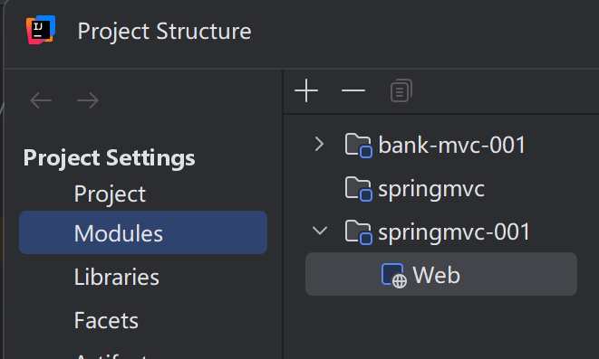

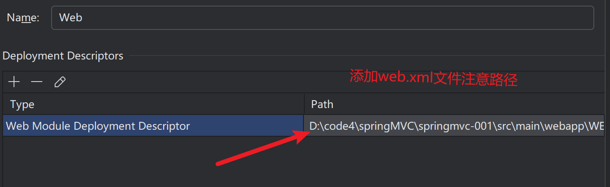

为什么要配置这个 web.xml 文件以及它的作用是什么？？

是为了让开发工具能够：

1. **识别这是一个 Web 项目**
2. **正确部署到服务器（如 Tomcat）**
3. **支持自动配置、运行和调试**

它告诉 Servlet 容器（如 Tomcat）：

- 哪些 Servlet 要加载
- URL 映射规则
- 过滤器（Filter）、监听器（Listener）
- 上下文参数（Context Parameters）

......

我们使用的是 **传统 Spring MVC + Tomcat**，必须确保 `web.xml` 存在且路径正确

#### 3.1.3 在 web.xml 文件中配置

前端控制器（SpringMVC框架内置的一个类：**DispatcherServlet**），所有的请求都应该经过这个DispatcherServlet的处理。  
重点：`**<url-pattern>/</url-pattern>**`  
这里的 `**/**` 表示：除**xx.jsp**结尾的请求路径之外的所有请求路径。  
也就是说，只要不是JSP请求路径，那么一定会走DispatcherServlet。

**DispatcherServlet**前端控制器：SpringMVC 中最核心的类

配置文件如下：

```
<!--配置DispatcherServlet-->
<servlet>
  <servlet-name>springmvc</servlet-name>
  <servlet-class>org.springframework.web.servlet.DispatcherServlet</servlet-class>
</servlet>
<servlet-mapping>
  <servlet-name>springmvc</servlet-name>
  <!--
  / 表示：除了.jsp请求 其他的都由DispatcherServlet处理
  /* 表示：所有请求都由DispatcherServlet处理
  如果是.jsp请求 则由容器默认的servlet处理，不由DispatcherServlet处理
  -->
  <url-pattern>/</url-pattern>
</servlet-mapping>
```

#### 3.1.4 编写 FirstController 类

在类上标注**@Controller** 注解，纳入 IOC 容器管理

#### 3.1.5 配置 SpringMVC 自己的配置文件

在如图所示下新建 **springmvc-servlet.xml** 文件默认存放位置 **WEB-INF** 目录下，

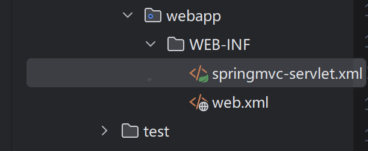

添加如下的 SpringMVC 配置文件：

```
<!--spring MVC 配置文件-->
<!-- 配置扫描路径 -->
<context:component-scan base-package="springmvc.controller"/>

<!-- 配置视图解析器 -->
<bean id="thymeleafViewResolver" class="org.thymeleaf.spring6.view.ThymeleafViewResolver">
	<!-- 作用于视图渲染的过程中，可以设置视图渲染后输出时采用的编码字符集 -->
	<property name="characterEncoding" value="UTF-8"/>
	<!-- 如果配置多个视图解析器，它来决定优先使用哪个视图解析器，它的值越小优先级越高 -->
	<property name="order" value="1"/>
	<!-- 当 ThymeleafViewResolver 渲染模板时，会使用该模板引擎来解析、编译和渲染模板 -->
	<property name="templateEngine">
		<bean class="org.thymeleaf.spring6.SpringTemplateEngine">
			<!--用于指定 Thymeleaf 模板使用的模板解析器。模板解析器负责根据模板位置、模板资源名称、文件编码等信息，加载模板 -->
			<property name="templateResolver">
				<bean class="org.thymeleaf.spring6.templateresolver.SpringResourceTemplateResolver">
					<!-- 设置模板文件的位置（前缀） -->
					<property name="prefix" value="/WEB-INF/thymeleaf/"/>
					<!-- 设置模板文件后缀（后缀），Thymeleaf文件扩展名不一定是html，也可以是其他，例如txt，大部分都是html -->
					<!-- 将来要在xxx.thymeleaf文件中编写符合 Thymeleaf语法格式的字符串：Thymeleaf模版字符串 -->
					<property name="suffix" value=".html"/>
					<!-- 设置模板类型，例如：HTML, TEXT, JAVASCRIPT, CSS等 -->
					<property name="templateMode" value="HTML"/>
					<!-- 用于模板文件在读取和解析过程中采用的编码字符集 -->
					<property name="characterEncoding" value="UTF-8"/>
				</bean>
			</property>
		</bean>
	</property>
</bean>
```

以上配置主要两项：

- 第一项：**组件扫描**。spring扫描这个包中的类，将这个包中的类实例化并纳入IoC容器的管理。
- 第二项：**视图解析器**。视图解析器（View Resolver）的作用主要是将Controller方法返回的逻辑视图名称解析成实际的视图对象。视图解析器将解析出的视图对象返回给DispatcherServlet，并最终由DispatcherServlet将该视图对象转化为响应结果，呈现给用户。

注意：如果采用了其它视图，请配置对应的视图解析器，例如：

- JSP的视图解析器：InternalResourceViewResolver
- FreeMarker视图解析器：FreeMarkerViewResolver
- Velocity视图解析器：VelocityViewResolve

#### 3.1.6 提供视图

在 **WEB-INF** 目录下创建一个 **templates**（dictionary ） 然后再在templates 新建一个 文件first.thymeleaf（file ）

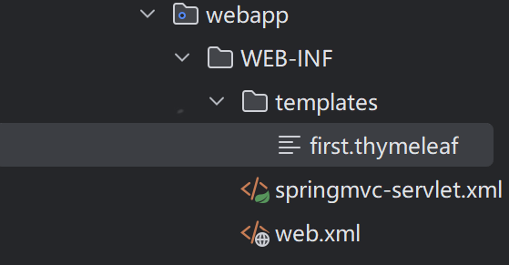

first.thymeleaf里的配置：这里编写的是符合 **Thymeleaf** 语法格式的字符串（Thymeleaf 的模版语句）

```
<!DOCTYPE html>
<html lang="en">
    <head>
        <title>First Spring MVC</title>
    </head>
    <body>
        <h1>First Spring MVC!</h1>
    </body>
</html>
```

#### 3.1.7 提供请求映射

注意返回的字符串是逻辑视图的名称。是 **first****.thymeleaf** 文件的前缀，如果是其它视图也要修改 springmvc-servlet.xml

```
package springmvc.controller;

import org.springframework.stereotype.Controller;
import org.springframework.web.bind.annotation.RequestMapping;

// 使用这个注解表示这是一个控制器类,交给IOC容器管理
@Controller
public class FirstController {

    @RequestMapping(value = "/first")
    public String first() {
        return "first"; // 逻辑视图名称
    }
}
```

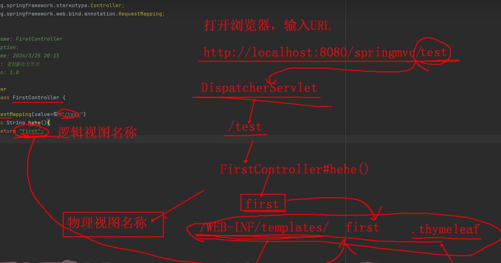

最终会将逻辑视图名称转换为物理视图名称：

逻辑视图名称：first

物理视图名称：前缀 + first + 后缀

最终路径：/WEB-INF/templates/fisrt.thymeleaf

使用 Thymeleaf 模版引擎：上面 的最终路径转换为 HTML 代码，最终响应给浏览器

返回效果图如图所示：

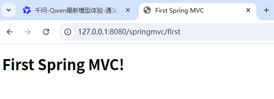

---

## 3.2. `thymeleaf-spring6`依赖

它的作用是什么？

**在 Spring 6（或 Spring Boot 3+）项目中集成 Thymeleaf 模板引擎，用于动态渲染 HTML 页面**。

核心功能包括：

- 将后端数据绑定到 HTML 模板；
- 支持条件、循环、表达式等模板语法；
- 与 Spring MVC 的 Model、ViewResolver 等机制无缝协作。

简言之：**让 Spring 6 应用能用 Thymeleaf 写动态网页**。

注意打包方式为 **war** 包

要引入以下的依赖：

```
<packaging>war</packaging>

<dependencies>
  
  <!-- 引入SpringMVC的依赖 -->
  <dependency>
    <groupId>org.springframework</groupId>
    <artifactId>spring-webmvc</artifactId>
    <version>7.0.1</version>
  </dependency>
  
  <!--servlet依赖-->
  <dependency>
    <groupId>jakarta.servlet</groupId>
    <artifactId>jakarta.servlet-api</artifactId>
    <version>6.0.0</version>
    <!--指定该依赖的范围，provided表示该依赖在编译和测试时需要，但是在运行时不需要 ，由第三方容器提供-->
    <!--打war包的时候，这个依赖不会打入war包内，因为这个依赖是第三方容器提供-->
    <scope>provided</scope>
  </dependency>
  
  <!--logback依赖-->
  <dependency>
    <groupId>ch.qos.logback</groupId>
    <artifactId>logback-classic</artifactId>
    <version>1.5.21</version>
  </dependency>
  
  <!--thymeleaf-spring6-->
  <dependency>
    <groupId>org.thymeleaf</groupId>
    <artifactId>thymeleaf-spring6</artifactId>
    <version>3.1.2.RELEASE</version>
  </dependency>

</dependencies>
```

---

## 3.3. DispatcherServlet 类

**DispatcherServlet**是SpringMVC框架为我们提供的最核心的类  
Web应用程序的主要入口点之一，它的职责包括：

1. **接收客户端的HTTP请求**：DispatcherServlet监听来自Web浏览器的HTTP请求，然后根据请求的URL将请求数据解析为Request对象。
2. **处理请求的URL**：DispatcherServlet将请求的URL（Uniform Resource Locator）与处理程序进行匹配，确定要调用哪个控制器（Controller）来处理此请求。
3. **调用相应的控制器**：DispatcherServlet将请求发送给找到的控制器处理，控制器将执行业务逻辑，然后返回一个模型对象（Model）。
4. **渲染视图**：DispatcherServlet将调用视图引擎，将模型对象呈现为用户可以查看的HTML页面。
5. **返回响应给客户端**：DispatcherServlet将为用户生成的响应发送回浏览器，响应可以包括表单、JSON、XML、HTML以及其它类型的数据。

---

## 3.4. AbstractDispatcherServletInitializer 类

- `**AbstractDispatcherServletInitializer**` 类是 SpringMVC 提供的快速初始化 Web 3.0 容器的抽象类
- `AbstractDispatcherServletInitializer` 提供三个接口方法供用户实现

- `createServletApplicationContext()` 方法，创建 Servlet 容器时，加载 SpringMVC 对应的 bean 并放入 `WebApplicationContext` 对象范围中，而 `WebApplicationContext` 的作用范围为 `ServletContext` 范围，即整个 web 容器范围

```
protected WebApplicationContext createServletApplicationContext() {
    AnnotationConfigWebApplicationContext ctx = new AnnotationConfigWebApplicationContext();
    ctx.register(SpringMvcConfig.class);
    return ctx;
}
```

---

**说明**：

- 该方法用于创建 SpringMVC 的上下文容器（`WebApplicationContext`）。
- 通过 `register(SpringMvcConfig.class)` 注册配置类，加载基于注解的 Spring 配置。
- 返回的 `ctx` 将被 Spring MVC 框架用于管理控制器、服务等组件。

---

- `AbstractDispatcherServletInitializer` 类是 SpringMVC 提供的快速初始化 Web 3.0 容器的抽象类
- `AbstractDispatcherServletInitializer` 提供三个接口方法供用户实现

- `getServletMappings()` 方法，设定 SpringMVC 对应的请求映射路径，设置为 `/` 表示拦截所有请求，任意请求都将转入到 SpringMVC 进行处理

```
protected String[] getServletMappings() {
    return new String[]{"/"};
}
```

---

**说明**：

- `getServletMappings()` 返回的字符串数组定义了 DispatcherServlet 的 URL 映射。
- 返回 `new String[]{"/"}` 表示 DispatcherServlet 拦截所有请求（包括静态资源），通常需配合配置静态资源忽略规则以避免影响性能。

---

- `AbstractDispatcherServletInitializer` 类是 SpringMVC 提供的快速初始化 Web 3.0 容器的抽象类
- `AbstractDispatcherServletInitializer` 提供三个接口方法供用户实现

- `createRootApplicationContext()` 方法，如果创建 Servlet 容器时需要加载非 SpringMVC 对应的 bean，使用当前方法进行，使用方式同 `createServletApplicationContext()`

```
protected WebApplicationContext createRootApplicationContext() {
    return null;
}
```

---

**说明**：

- `createRootApplicationContext()` 用于创建根应用上下文（Root Context），通常用于加载非 MVC 层的组件（如服务层、数据源等）。
- 返回 `null` 表示不创建根上下文，即所有 Bean 都在 Web 上下文中管理。
- 若需分离配置，可在此方法中注册其他配置类（如 `DataSourceConfig.class`）。

---

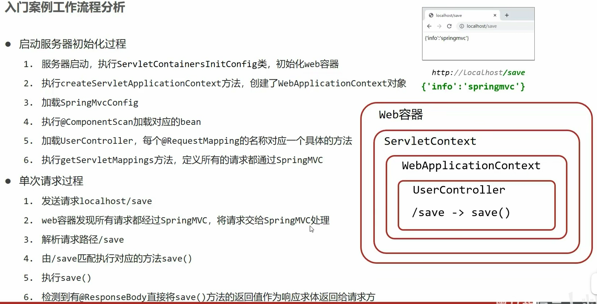

---

## 3.5. **Controller加载控制与业务bean加载控制**

- **名称**：`@ComponentScan`
- **类型**：类注解
- **范例**：

```
@Configuration
@ComponentScan(value = "com.itheima",
    excludeFilters = @ComponentScan.Filter(
        type = FilterType.ANNOTATION,
        classes = Controller.class
    )
)
public class SpringConfig {
    
}
```

- **属性**：

- `excludeFilters`：排除扫描路径中加载的 bean，需要指定类别（type）与具体项（classes）
- `includeFilters`：加载指定的 bean，需要指定类别（type）与具体项（classes）

---

**说明**：

- 上述配置表示：扫描 `com.itheima` 包及其子包下的组件，但**排除所有标注了** `**@Controller**` **的类**。
- 通常用于将控制器（Controller）与业务层 Bean（如 Service、Repository）分离开来管理，避免重复扫描或冲突。
- `FilterType.ANNOTATION` 表示按注解类型过滤，`classes = Controller.class` 指定过滤掉 `@Controller` 注解的类。

---

- **bean的加载格式**

```
public class ServletContainersInitConfig extends AbstractDispatcherServletInitializer {

    protected WebApplicationContext createServletApplicationContext() {
        AnnotationConfigWebApplicationContext ctx = new AnnotationConfigWebApplicationContext();
        ctx.register(SpringMvcConfig.class);
        return ctx;
    }

    protected WebApplicationContext createRootApplicationContext() {
        AnnotationConfigWebApplicationContext ctx = new AnnotationConfigWebApplicationContext();
        ctx.register(SpringConfig.class);
        return ctx;
    }

    protected String[] getServletMappings() {
        return new String[]{"/"};
    }
}
```

---

**说明**：

- 该类继承 `AbstractDispatcherServletInitializer`，用于在 Web 3.0 环境下快速初始化 Spring MVC 容器。
- `createServletApplicationContext()`：创建 SpringMVC 的 Web 上下文，注册 `SpringMvcConfig` 配置类（通常包含 Controller、ViewResolver 等）。
- `createRootApplicationContext()`：创建根上下文，注册 `SpringConfig` 配置类（通常包含 Service、DAO、数据源等非 Web 组件）。
- `getServletMappings()`：设置 DispatcherServlet 映射路径为 `/`，表示拦截所有请求，由 SpringMVC 处理。

✅ 这种配置实现了 **双容器机制**：

- 根容器（Root Context）：加载全局 Bean（如 Service、DAO）。
- Web 容器（Web Context）：加载 Web 层 Bean（如 Controller），并依赖根容器中的 Bean。

---

**简化开发**

```
public class ServletContainersInitConfig extends AbstractAnnotationConfigDispatcherServletInitializer {

    protected Class<?>[] getServletConfigClasses() {
        return new Class[]{SpringMvcConfig.class};
    }

    protected String[] getServletMappings() {
        return new String[]{"/"};
    }

    protected Class<?>[] getRootConfigClasses() {
        return new Class[]{SpringConfig.class};
    }
}
```

---

**说明**：

- 该类继承 `AbstractAnnotationConfigDispatcherServletInitializer`，是 SpringMVC 提供的更简洁的初始化方式。
- `**getServletConfigClasses()**`：返回用于配置 Web 容器（SpringMVC 上下文）的配置类，此处为 `SpringMvcConfig.class`（通常包含 Controller、ViewResolver 等）。
- `**getRootConfigClasses()**`：返回用于配置根容器（全局上下文）的配置类，此处为 `SpringConfig.class`（通常包含 Service、DAO、数据源等非 Web 组件）。
- `**getServletMappings()**`：设置 DispatcherServlet 的映射路径为 `/`，表示拦截所有请求，由 SpringMVC 处理。

✅ 与之前使用 `createServletApplicationContext()` 方式相比，此方式更加简洁，避免了手动创建 `AnnotationConfigWebApplicationContext` 实例，适合基于注解的 Spring 配置。

---

### 3.5 对第一个 SpringMVC 程序的扩展

```
package springmvc.controller;

import org.springframework.stereotype.Controller;
import org.springframework.web.bind.annotation.RequestMapping;

// 使用这个注解表示这是一个控制器类,交给IOC容器管理
@Controller
public class FirstController {

    @RequestMapping(value = "/")
    public String index() {
        return "index"; // 逻辑视图名称
    }

    @RequestMapping(value = "/first")
    public String first() {
        return "first"; // 逻辑视图名称

    }
     @RequestMapping(value = "/second")
    public String Second() {
        return "second"; // 逻辑视图名称
    }
}
```

```
<!DOCTYPE html>
<html lang="en" xmlns:th="http://www.thymeleaf.org">
  <head>
    <title>First Spring MVC</title>
  </head>
  <body>
    <h1>First Spring MVC!</h1>
    <a th:href="@{/second}">去第二个页面</a>
  </body>
</html>


<!DOCTYPE html>
<html lang="en">
    <head>
        <title>First Spring MVC</title>
    </head>
    <body>
        <h1>苟一民是sb</h1>
    </body>
</html>


<!DOCTYPE html>
<html lang="en" xmlns:th="http://www.thymeleaf.org">
    <head>
        <title>First Spring MVC</title>
    </head>
    <body>
        <h1>First Spring MVC!</h1>
        <a th:href="@{/first}">去第一个页面</a>
        <a th:href="@{/second}">去第二个页面</a>
    </body>
</html>
```

---

## 3.6. 第二个 SpringMVC 程序

### 3.6.1. 开发流程

流程大部分都跟第一个 SpringMVC 程序流程差不多

额外需要注意 **web.xml** 文件的配置：

```
<?xml version="1.0" encoding="UTF-8"?>
<web-app xmlns="https://jakarta.ee/xml/ns/jakartaee"
  xmlns:xsi="http://www.w3.org/2001/XMLSchema-instance"
  xsi:schemaLocation="https://jakarta.ee/xml/ns/jakartaee https://jakarta.ee/xml/ns/jakartaee/web-app_6_0.xsd"
  version="6.0">

  <!--前端控制器-->
  <servlet>
    <servlet-name>springmvc</servlet-name>
    <servlet-class>org.springframework.web.servlet.DispatcherServlet</servlet-class>
    <!--初始化参数，指定springmvc的配置文件位置-->
    <init-param>
      <param-name>contextConfigLocation</param-name>
      <!--指定了springmvc的配置文件位置，classpath:表示从类路径下加载配置文件-->
      <!--指定了SpringMVC配置文件的名字是：springmvc.xml-->
      <param-value>classpath:springmvc.xml</param-value>
    </init-param>
    <!--在web 服务器启动的时候，就初始化DispatcherServlet-->
    <!--这是优化方式,可以提高用户第一次发送请求的体验。第一次请求的效率较高-->
    <load-on-startup>0</load-on-startup>
  </servlet>

  <servlet-mapping>
    <servlet-name>springmvc</servlet-name>
    <url-pattern>/</url-pattern>
  </servlet-mapping>
</web-app>
```

设置 DispatcherServlet 的初始化参数：

</init-param>

<!--在web 服务器启动的时候，就初始化DispatcherServlet-->

<!--这是优化方式,可以提高用户第一次发送请求的体验。第一次请求的效率较高-->

<load-on-startup>0</load-on-startup>

建议：在 web 服务器启动时，初始化DispatcherServlet ，这样用户第一次发送请求时，效率较高，体验更好。

**Index.xml** 文件：

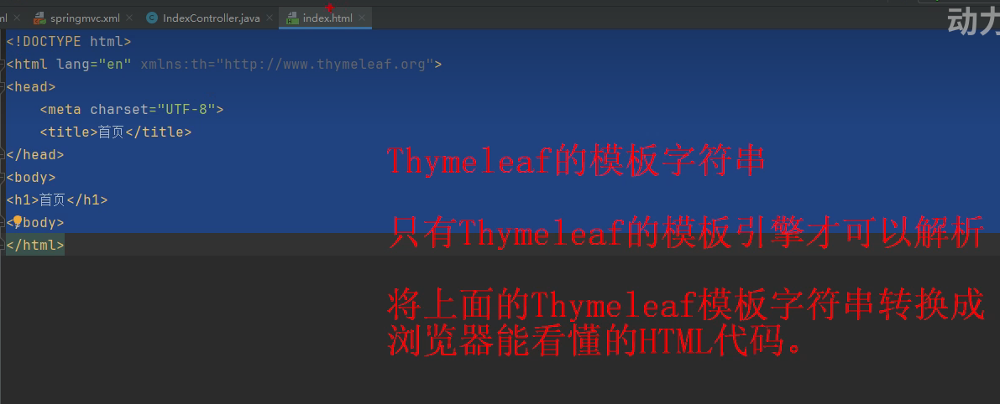

---

# 4. SpringMVC 里重要的注解

## 4.1. @RequestMapping 注解

`@RequestMapping` 是 Spring MVC 框架中的一个控制器注解，用于请求映射到相应处理方法上。具体来说，它可以将指定 URL 的请求绑定到一个特定的方法或类上，从而实现对请求的处理和响应。

源代码图：

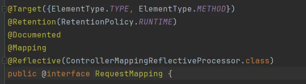

#### 一、基本作用

- **将 Web 请求（如 GET、POST 等）与处理方法绑定**。
- 支持多种匹配方式：URL 路径、HTTP 方法、请求参数、请求头等。

---

#### 二、使用位置

1. **类级别（Class-level）**  
    用于定义该控制器下所有方法的公共路径前缀。

```

@Controller
@RequestMapping("/user")
public class UserController {
    // 方法路径会拼接为 /user/xxx
}
```

2. **方法级别（Method-level）**  
    用于指定具体处理哪个请求路径及方式。

```

@RequestMapping(value = "/profile", method = RequestMethod.GET)
public String   () {
    return "profile";
}
```

---

#### 三、常用属性

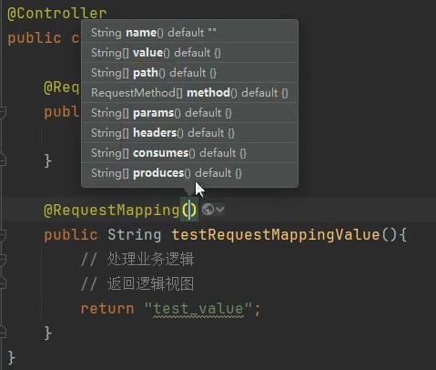

##### **1.value 和 path 属性**：

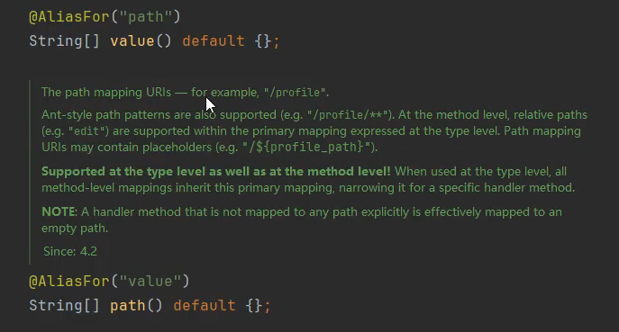

这个**@AiasFor("path")**这个注解的意思是这个 Value 的别名是“path”

很有意思下面跟它是相反的，感觉有点多此一举了（个人意见）

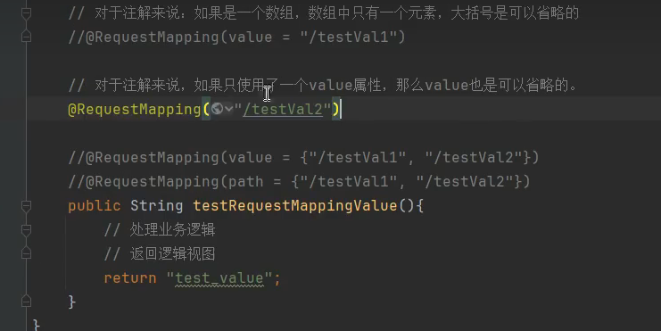

就跟我们之前学的其他内容类似，如果只有一个元素是可以省略这个 path/value

从源码我们能看出来这个 Value 属性是数组类型，既然是数组的话，就表示可以提供多个路径，也就是说在 SpringMVC 中，多个不同的请求路径可以映射同一个控制器的同一个方法，如果你想要这个方法可以使用多个路径

就这样写 **value/path = {" / *" , " / *"}** 注意这对大扩号。

---

**Ant 风格的 value:**

**Ant 风格（Ant-style）**是一种**用于路径匹配的通配符模式**，最初来源于 Apache Ant 构建工具，后来被广泛应用于 Java 生态系统中的各种框架（如 Spring、Spring Boot 等）中，用于资源路径、包扫描、文件匹配等场景

**value**是可以用来匹配路径的，**路径支持模糊匹配**

关于路径中的**通配符**包括：

- `?`，代表任意 单 个字符 (除了 / ? 之外的字符)

例如：`test?.txt` 可以匹配 `test1.txt`、`testA.txt`，但不能匹配 `test12.txt`

- `*`，代表0到N个任意字符 (除了 / ? 之外的字符)

例如：`*.txt` 匹配所有 `.txt` 文件；`log*.log` 匹配 `log1.log`、`logfile.log`

- `**`，代表0到N个任意字符，并且路径中可以出现路径分隔符 `/`

匹配任意数量的目录层级（包括零层），可以跨越路径分隔符。

`**` 通配符在使用时，左右不能出现字符，只能是 `/`

**注意****：**

- 如果使用 Spring 5 以及之前的版本，这样写是没问题的：

```
@RequestMapping(value = "/**/testAntValue")
```

- 如果使用 Spring 6 以及之后的版本，这样写是报错的：

```
@RequestMapping(value = "/**/testAntValue")
```

- 在 Spring 6 当中，`**` 通配符只能作为路径的末尾出现。

---

在 Spring 6 中，为了提高安全性和性能，对 `@RequestMapping` 的路径匹配规则进行了限制，`**` 通配符不能再出现在路径中间，**只能用于路径末尾**。例如：

```
@RequestMapping("/api/**") // 正确
@RequestMapping("/**/test") // 错误（Spring 6 不允许）
```

**value 的占位符（重点）：**

普通的请求路径：

`http://localhost:8080/springmvc/login?username=admin&password=123&age=20`  
RESTful风格的请求路径：

`http://localhost:8080/springmvc/login/admin/123/20`

如果使用 RESTful 风格的请求路径，在控制器中应该如何获取请求中的数据呢？

可以在 `value` 属性中使用占位符，例如：`/login/{id}/{username}/{password}`  
  
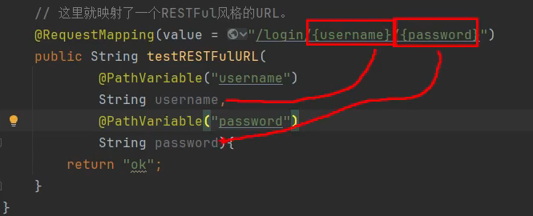

##### 2.method 属性

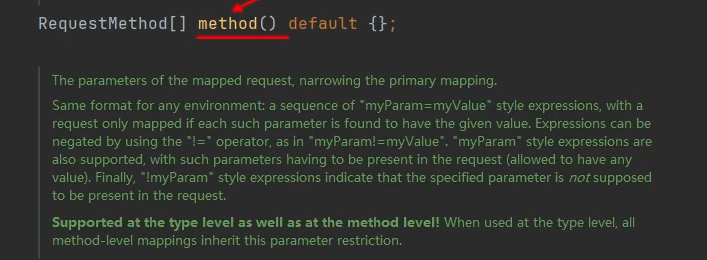

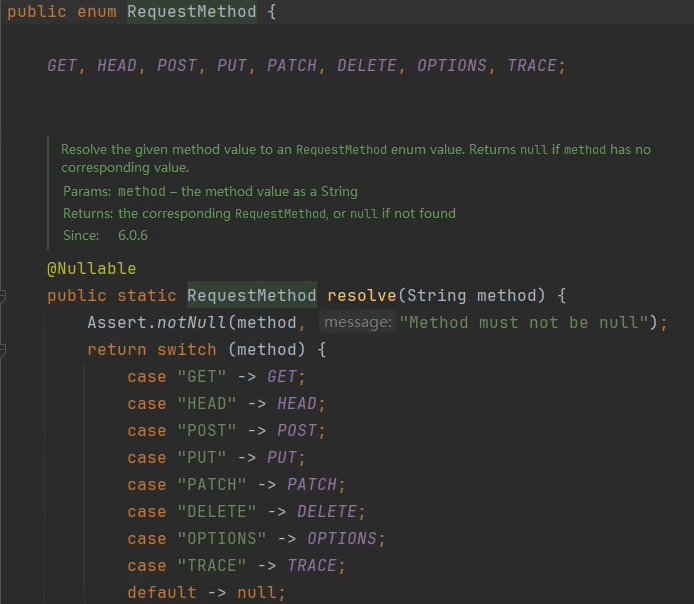

当前端发送的请求路径是 /user/login，并且发送的请求方式是以POST方式请求的，则可以正常映射。

当前端发送的请求路径不是 /user/login，请求方式是POST，不会映射到这个方法上。

当前端发送的请求路径是 /user/login，请求方式不是POST，也不会映射到这个方法上。

```

@RequestMapping(value = "/user/login", method = RequestMethod.POST)
public String userLogin() {
    System.out.println("处理登录的业务......");
    return "ok";
}
```

---

##### 3.params 属性

**关于** `**RequestMapping**` **注解的** `**params**` **属性**

```
@RequestMapping(value="/testParams", params={"username", "password"})
public String testParams() {
    return "ok";
}
```

当 `RequestMapping` 注解中添加了 `params`，则表示又添加了新的约束条件。  
当请求路径是 `/testParams`，并且请求携带的参数有 `username` 和 `password` 的时候，才能映射成功！

---

**关于 Thymeleaf 中怎么发送请求的时候携带数据：**

```
<a th:href="/testParams?name=value&name=value"></a>
<a th:href="/testParams(name='admin', password='1234')"></a>
```

---

##### 4.headers 属性

也是一个数组，用来设置请求头的映射。

```
@RequestMapping(value="/login", headers={"Referer", "Host"})
public String testHeaders() {
    return "ok";
}
```

当请求路径是 `/login`，并且请求头中包含 `Referer`，也包含 `Host` 的时候，映射成功。

#### 四、衍生注解

**衍生 Mapping**

- `@PostMapping` 注解代替的是：`@RequestMapping(value="", method=RequestMethod.POST)`
- `@GetMapping` 注解代替的是：`@RequestMapping(value="", method=RequestMethod.GET)`
- `@PutMapping`
- `@DeleteMapping`
- `@PatchMapping`

---

## 4.2. @PathVariable 注解

使用这个注解让 URL 上的路径参数映射到方法的参数上面

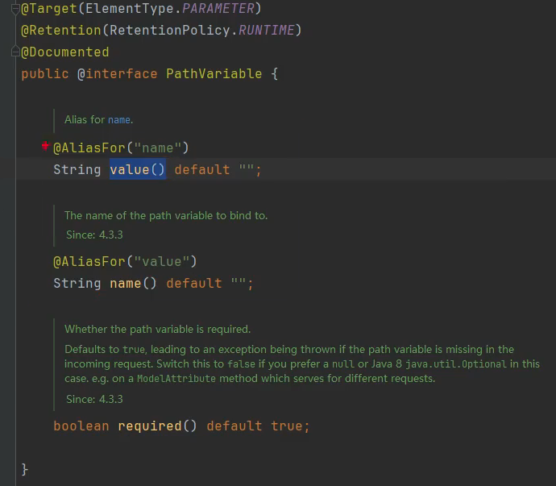

通过源码可以看出属性 value 和 name 是对等的


不使用 **@PathVariable**，路径变量无法绑定到方法参数，参数值将为 null（或默认值）。必须使用该注解才能正确绑定。

基本用法

假设你有一个 RESTful 接口：

```
@GetMapping("/users/{id}")
public String getUser(@PathVariable Long id) {
    // 使用 id 查询用户信息
    return "User ID: " + id;
}
```

- URL：`/users/123`
- `{id}` 是路径中的占位符。
- `@PathVariable Long id` 会自动将 `123` 绑定到 `id` 参数上。

---

显式指定变量名（可选）：

如果方法参数名和路径变量名不一致，可以显式指定：

```
@GetMapping("/users/{userId}")
public String getUser(@PathVariable("userId") Long id) {
    return "User ID: " + id;
}
```

注意：在 Java 8+ 并启用 `-parameters` 编译选项时，Spring 可以通过反射获取参数名，因此通常可以省略括号中的名称。但为了代码清晰或兼容性，建议显式写出。

多个路径变量：

```

@GetMapping("/orders/{orderId}/items/{itemId}")
public String getItem(
    @PathVariable Long orderId,
    @PathVariable Long itemId) {
    return "Order: " + orderId + ", Item: " + itemId;
}
```

URL 示例：`/orders/1001/items/2002`

---

## 4.3. @RequestParam注解

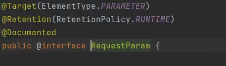

将请求参数映射到方法形参上

```
@PostMapping("/user/reg")
    public String register(@RequestParam(value = "username") String username,
                           @RequestParam(value = "password") String password,
                           @RequestParam(value = "sex") String sex,
                           @RequestParam(value = "interest") String[] interest,
                           @RequestParam(value = "intro") String intro
                           ) {
        System.out.println(sex);
        System.out.println(interest);
        System.out.println(intro);
        System.out.println(username);
        System.out.println(password);
        return "ok";
    }
```

#### 1. **value 属性**

- `value` 属性用于指定**请求参数**的名称。
- 可以使用 `name` 属性代替 `value` 属性（两者功能相同）。

#### 2. **name 属性**

- `name` 属性可以替代 `value` 属性使用，作用一致。

#### 3. **required 属性**

- 用于设置该参数是否为必需的，默认值为 `true`。
- 当 `required=true` 时，前端必须传递该参数，否则会报 `400` 错误。
- 类似于 `@RequestMapping` 注解中的 `params` 属性：

```

@RequestMapping(value="/testParams", params={"username", "password"})
public String testParams(){
    return "ok";
}
```

- 若设置 `required=false`，则该参数非必需。前端未提供时不会报错，但对应的变量值为 `null`。

#### 4. **defaultValue 属性**

- 用于为参数设置**默认值**。
- 如果前端未提供该参数，则使用 `defaultValue` 指定的默认值。
- 示例：`defaultValue="defaultUser"`，当参数未传时，变量将赋值为 `"defaultUser"`。

---

## 4.4. @RequestHeader 注解

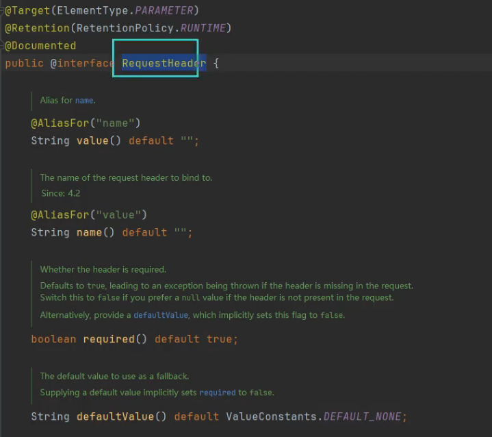

该注解的作用是：将请求头的信息映射到方法的形参上。

@RequestParam 注解将请求参数映射到方法的形参上。和它功能相似。

也有三个属性 **value** , **required** , **defaultValue**

```
@PostMapping("/user/reg")
    public String register2(User user,
                             @RequestHeader(value = "Referer",required = false,defaultValue = "")
                             String referer) {
        System.out.println(user);
        System.out.println(referer);
        return "ok";
    }
```

---

## 4.5. @CookieValue 注解

该注解的作用是：将请求提交的 **Cookie** 数据映射到方法的形参上

同样是三个属性：value,required,defaultValue

**前端页面** `**register.html**` **中发送 Cookie 的代码：**

```
<script type="text/javascript">
function sendCookie(){
    document.cookie = "id=123456789; expires=Thu, 18 Dec 2025 12:00:00 UTC; path=/";
    document.location = "/springmvc/register";
}
</script>
<button onclick="sendCookie()">向服务器端发送Cookie</button>
```

---

**后端** `**UserController**` **代码（Java）：**

```
@GetMapping("/register")
public String register(User user,
                     @RequestHeader(value="Referer", required = false, defaultValue = "")
                     String referer,
                     @CookieValue(value="id", required = false, defaultValue = "2222222222")
                     String id){
    System.out.println(user);
    System.out.println(referer);
    System.out.println(id);
    return "success";
}
```

---

**说明：**

- 前端通过 JavaScript 设置一个名为 `id` 的 Cookie，并跳转到 `/register` 接口。
- 后端使用 `@CookieValue("id")` 注解从请求中获取该 Cookie 的值。
- 如果 Cookie 不存在，则使用默认值 `"2222222222"`。
- 同时也获取了 `Referer` 请求头信息。

---

## 4.6. @ResponseBody 注解

### 4.6.1. 14.1 StringHttpMessageConverter

上面的AJAX案例，Controller的代码可以修改为：

```
package com.powernode.springmvc.controller;

import org.springframework.stereotype.Controller;
import org.springframework.web.bind.annotation.RequestMapping;
import org.springframework.web.bind.annotation.ResponseBody;

@Controller
public class HelloController {

    @RequestMapping(value = "/hello")
    @ResponseBody
    public String hello(){
        // 由于你使用了 @ResponseBody 注解
        // 以下的return语句返回的字符串则不再是“逻辑视图名”了
        // 而是作为响应协议的响应体进行响应。
        return "hello";
    }
}
```

重点：一旦处理器处理器方法上添加了 @ResponseBody 注解，那么 return 返回的语句，返回的将不是一个“逻辑视图名称”了，而是直接将返回结果采用字符串的形式响应给浏览器

以上程序中使用的消息转换器是：**StringHttpMessageConverter**，为什么会启用这个消息转换器呢？因为你添加`@ResponseBody`这个注解。

通常AJAX请求需要服务器给返回一段JSON格式的字符串，可以返回JSON格式的字符串吗？当然可以，代码如下：

```
package com.powernode.springmvc.controller;

import org.springframework.stereotype.Controller;
import org.springframework.web.bind.annotation.RequestMapping;
import org.springframework.web.bind.annotation.ResponseBody;

@Controller
public class HelloController {

    @RequestMapping(value = "/hello")
    @ResponseBody
    public String hello(){
        return "{\"username\":\"zhangsan\",\"password\":\"1234\"}";
    }
}
```

测试：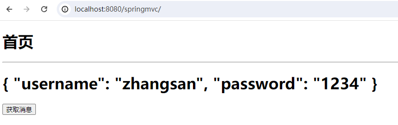

这是完全可以的，此时底层使用的消息转换器还是：**StringHttpMessageConverter**

那如果在程序中是一个POJO对象，怎么将POJO对象以JSON格式的字符串响应给浏览器呢？两种方式：

- 第一种方式：自己写代码将POJO对象转换成JSON格式的字符串，用上面的方式直接return即可。
- 第二种方式：启用`MappingJackson2HttpMessageConverter`消息转换器。

---

### 4.6.2. 14.2 MappingJackson2HttpMessageConverter

启用MappingJackson2HttpMessageConverter消息转换器的步骤如下：

第一步：在 pom.xml 中引入jackson依赖，可以将java对象转换为json格式字符串

也可以将 JSON 格式的字符串转换为 Java 对象

```
<dependency>
  <groupId>com.fasterxml.jackson.core</groupId>
  <artifactId>jackson-databind</artifactId>
  <version>2.17.0</version>
</dependency>
```

第二步： 在spring-mvc.xml 文件中添加注解驱动

```
<mvc:annotation-driven/>
```

- 在 **Spring Boot** 项目中，**自动配置机制**会自动注册 `MappingJackson2HttpMessageConverter`（只要你引入了 Jackson 依赖）。
- 而在 **传统的 Spring MVC（非 Boot）** 项目中，**如果不写** `**<mvc:annotation-driven />**`**，则不会自动注册该转换器**，JSON 功能将无法正常工作。

第三步：准备一个POJO

```
package com.powernode.springmvc.bean;

public class User {
    private String username;
    private String password;

    public User() {
    }

    public User(String username, String password) {
        this.username = username;
        this.password = password;
    }

    public String getUsername() {
        return username;
    }

    public void setUsername(String username) {
        this.username = username;
    }

    public String getPassword() {
        return password;
    }

    public void setPassword(String password) {
        this.password = password;
    }
}
```

第四步：控制器方法使用 @ResponseBody 注解标注(非常重要），控制器方法返回这个POJO对象

```
package com.powernode.springmvc.controller;

import com.powernode.springmvc.bean.User;
import org.springframework.stereotype.Controller;
import org.springframework.web.bind.annotation.RequestMapping;
import org.springframework.web.bind.annotation.ResponseBody;

@Controller
public class HelloController {

    @RequestMapping(value = "/hello")
    @ResponseBody
    public User hello(){
        User user = new User("zhangsan", "22222");
        return user;
    }
}
```

测试：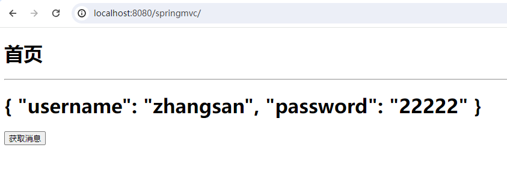

以上代码底层启用的就是 MappingJackson2HttpMessageConverter 消息转换器。他的功能很强大，可以将POJO对象转换成JSON格式的字符串，响应给前端。其实这个消息转换器`MappingJackson2HttpMessageConverter`本质上只是比`StringHttpMessageConverter`多了一个json字符串的转换，其他的还是一样。

---

## 4.7. @RequestBody 注解

### 4.7.1. FormHttpMessageConverter

这个注解的作用是直接将请求体传递给Java程序，在Java程序中可以直接使用一个String类型的变量接收这个请求体的内容。

在没有使用这个注解的时候：

```
@RequestMapping("/save")
public String save(User user){
// 执行保存的业务逻辑
userDao.save(user);
// 保存成功跳转到成功页面
return "success";
}
```

当请求体提交的数据是：

username=zhangsan&password=1234&email=zhangsan@powernode.com

那么Spring MVC会自动使用 `FormHttpMessageConverter`消息转换器，将请求体转换成user对象。

**这个注解只能出现在方法的参数上**

```
@RequestMapping("/save")
public String save(@RequestBody String requestBodyStr){
    System.out.println("请求体：" + requestBodyStr);
    return "success";
}
```

Spring MVC仍然会使用 `FormHttpMessageConverter`消息转换器，将请求体直接以字符串形式传递给 requestBodyStr 变量。测试输出结果：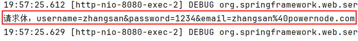

### 4.7.2. 16.2 MappingJackson2HttpMessageConverter

如果在请求体中提交的是一个JSON格式的字符串，这个JSON字符串传递给Spring MVC之后，能不能将JSON字符串转换成POJO对象呢？答案是可以的。

此时必须使用**@RequestBody** 注解来完成 。并且底层使用的消息转换器是：`MappingJackson2HttpMessageConverter`。实现步骤如下：

- 第一步：引入jackson依赖
- 第二步：开启注解驱动
- 第三步：创建POJO类，将POJO类作为控制器方法的参数，并使用 @RequestBody 注解标注该参数

```
@RequestMapping("/send")
@ResponseBody
public String send(@RequestBody User user){
    System.out.println(user);
    System.out.println(user.getUsername());
    System.out.println(user.getPassword());
    return "success";
}
```

- 第四步：在请求体中提交json格式的数据

```
<!DOCTYPE html>
<html lang="en" xmlns:th="http://www.thymeleaf.org">
  <head>
    <meta charset="UTF-8">
    <title>首页</title>
    <script th:src="@{/static/js/vue3.4.21.js}"></script>
    <script th:src="@{/static/js/axios.min.js}"></script>
  </head>
  <body>

    <div id="app">
      <button @click="sendJSON">通过POST请求发送JSON给服务器</button>
      <h1>{{message}}</h1>
    </div>

    <script>
      let jsonObj = {"username":"zhangsan", "password":"1234"}

      Vue.createApp({
        data(){
          return {
            message:""
          }
        },
        methods: {
          async sendJSON(){
            console.log("sendjson")
            try{
              const res = await axios.post('/springmvc/send', JSON.stringify(jsonObj), {
                headers : {
                  "Content-Type" : "application/json"
                }
              })
              this.message = res.data
            }catch(e){
              console.error(e)
            }
          }
        }
      }).mount("#app")
    </script>

  </body>
</html>
```

测试结果：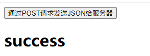

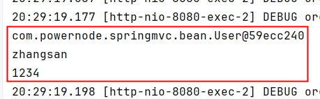

---

## 4.8. @RestController 注解

因为我们现代的开发方式都是基于**AJAX**方式的，因此 @ResponseBody 注解非常重要，很常用。为了方便，Spring MVC中提供了一个注解 @RestController。

这一个注解代表了：**@Controller** + **@ResponseBody**。

@RestController 标注在类上即可。

被它标注的Controller中所有的方法上都会自动标注 @ResponseBody

```
package com.powernode.springmvc.controller;

import com.powernode.springmvc.bean.User;
import org.springframework.web.bind.annotation.RequestMapping;
import org.springframework.web.bind.annotation.RestController;

@RestController
public class HelloController {

    @RequestMapping(value = "/hello")
    public User hello(){
        User user = new User("zhangsan", "22222");
        return user;
    }
}
```

测试：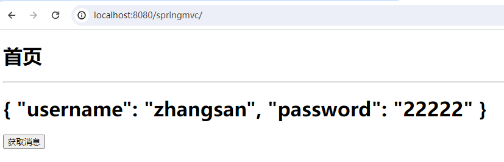

---

# 5. 请求与响应

## 5.1. 请求

### 5.1.1. web 请求方式回顾

**前端向服务器发送请求的方式包括哪些？共9种，前5种常用，后面作为了解：**

增：**POST 请求**

删：**DELETE 请求**

改：**PUT 请求**

查：**GET 请求**

- **HEAD**：适合获取响应头信息
- **PATCH**：部分更改请求。当被请求的资源是可被更改的资源时，请求服务器对该资源进行部分更新，即每次更新一部分。
- **OPTIONS**：请求获得服务器支持的请求方法类型，以及支持的请求头标志。“OPTIONS *”则返回支持全部方法类型的服务器标志。
- **TRACE**：服务器响应输出客户端的 HTTP 请求，主要用于调试和测试。
- **CONNECT**：建立网络连接，通常用于加密 SSL/TLS 连接。

注意：使用 form 表单提交时，如果 method 设置为 put delete head,对不起，发送请求还是 GET 请求。如果要发送 put delete head 请求，请发送 ajax 请求才可以

---

假设有一个请求：`http://localhost:8080/springmvc/register?name=zhangsan&password=123&email=zhangsan@powernode.com`

在 Spring MVC 中应该如何获取请求提交的数据呢？  
在 Spring MVC 中又应该如何获取请求头信息呢？  
在 Spring MVC 中又应该如何获取客户端提交的 Cookie 数据呢？

---

### 5.1.2. 准备工作

跟之前的流程差不多  
register.html 文件：注意 form 标签后面 跟的 th

<form th:action="@{/user/reg}" method="post">

```
<!DOCTYPE html>
<html lang="en" xmlns:th="http://www.thymeleaf.org">
<head>
    <meta charset="UTF-8">
    <title>用户注册</title>
</head>
<body>
<!--注册页面-->
<form th:action="@{/user/reg}" method="post">
    用户名: <input type="text" name="username"><br>
    密码: <input type="password" name="password"><br>
    性别:
    男<input type="radio" name="sex" value="1">
    女<input type="radio" name="sex" value="0"><br>

    兴趣:
    抽烟<input type="checkbox" name="interest" value="smoke">
    喝酒<input type="checkbox" name="interest" value="drink">
    烫头<input type="checkbox" name="interest" value="tt"><br>

    简介:
    <textarea cols="60" rows="10" name="intro"></textarea><br>
    <input type="submit" value="注册">
</form>
</body>
</html>
```

在 springmvc.xml 文件中注意这里

<property name="prefix" value="/WEB-INF/thymeleaf/"/>

看清楚是 **thymeleaf**

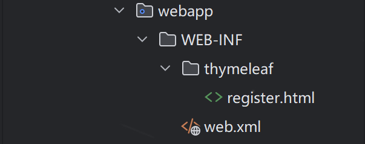

因此在这个 WEB-INF 文件下的文件名也要为 **thymeleaf**

### 7.2 使用原生的 Servlet API 进行获取

注意要在 Tomcat Application context: /springmvc/user/reg

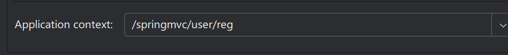

```
@PostMapping("/user/reg")
public String register(HttpServletRequest request, HttpServletResponse response, HttpSession session) {
    //
    System.out.println(request);
    System.out.println(response);
    System.out.println(session);
    // 从请求参数中获取用户名和密码
    String username = request.getParameter("username");
    String password = request.getParameter("password");
    String sex = request.getParameter("sex");
    String[] interest = request.getParameterValues("interest");
    String intro = request.getParameter("intro");
    System.out.println(sex);
    System.out.println(interest);
    System.out.println(intro);
    System.out.println(username);
    System.out.println(password);
    return "ok";
}
```

### 7.3 使用@RequestParam注解获取请求数据

```
@PostMapping("/user/reg")
public String register(@RequestParam(value = "username") String username,
                       @RequestParam(value = "password") String password,
                       @RequestParam(value = "sex") String sex,
                       @RequestParam(value = "interest") String[] interest,
                       @RequestParam(value = "intro") String intro
                      ) {
    System.out.println(sex);
    System.out.println(interest);
    System.out.println(intro);
    System.out.println(username);
    System.out.println(password);
    return "ok";
}
```

相较于 Servlet 方式需要手动获取请求参数的方式，使用 SpringMVC 中的注解**@RequestParam** 参数直接作为方法形参，无需手动解析或转换，语义清晰，代码简洁

---

对于**简单类型**（如 `String`、`int`、`boolean`、数组等）的参数：

即使你不显式使用 `**@RequestParam**` 注解，只要你的 控制器方法的**形参名称**与 HTTP 请求中的**参数名**一致，Spring MVC 仍然可以自动绑定参数，但还是建议加上

对于非简单类型如`List`、`Set` 等集合接口：

- 框架无法自动推断。它不知道你是想把多个同名参数合并成一个 List，还是想做其他处理。
- **解决：** 必须显式加上 `@RequestParam`，告诉 Spring：“请把请求参数填充到这个 List 里”

### 7.4 通过方法的形参名接收数据

1. `**@RequestParam**` **可以省略的前提条件：**

- 方法形参名与提交数据时的 `name` 相同。
- 此功能在 **Spring 6+** 中可用。

2. **Spring 6+ 的必要配置（仅限 Maven 项目）：**

- 必须在 `pom.xml` 中启用编译参数 `-parameters`，以便保留方法参数名。
- 配置项位于 `maven-compiler-plugin` 插件中。

3. **Spring 5 及以下版本：**

- 不需要此配置，因为默认行为已支持。

```
<build>
    <plugins>
        <plugin>
            <groupId>org.apache.maven.plugins</groupId>
            <artifactId>maven-compiler-plugin</artifactId>
            <version>3.12.1</version>
            <configuration>
                <source>21</source>
                <target>21</target>
                <compilerArgs>
                    <arg>-parameters</arg>
                </compilerArgs>
            </configuration>
        </plugin>
    </plugins>
</build>
```

### 7.5 通过 POJO 类/JavaBean 接收数据（最常用）

底层实现原理：反射机制

不过，使用这种方式的前提是：POJO 类的属性名必须和请求参数的名保持一致

**重点：**底层通过反射机制调用 set 方法给属性赋值，所以 set 方法的方法名非常重要。

如果前端提交了参数是：username=zhangsan

那么必须保证 POJO 类当中有一个方法名叫做：setEmail

如果没有对应的 set 方法，将无法给对应的属性赋值

```
@PostMapping("/user/reg")
public String register2(User user) {
System.out.println(user);
return "ok";
}
```

我这里偷个懒用了在黑马 Javaweb 学的知识使用注解为 POJO 类生成了所需的方法，注意使用该注解需要引入 lombok 的依赖

```
package springmvc.pojo;

import lombok.AllArgsConstructor;
import lombok.Data;
import lombok.NoArgsConstructor;

@Data
@NoArgsConstructor
@AllArgsConstructor
public class User {
    private Long id;
    private String username;
    private String password;
    private String sex;
    private String[] interest;
    private String intro;
}
```

---

**步骤：接收请求中的 json 数据**

**①：添加 json 数据转换相关坐标**

```
<dependency>
    <groupId>com.fasterxml.jackson.core</groupId>
    <artifactId>jackson-databind</artifactId>
    <version>2.9.0</version>
</dependency>
```

---

**说明**：

- 该依赖是 **Jackson** 库的核心组件，用于在 SpringMVC 中实现 JSON 数据的序列化与反序列化。
- `jackson-databind` 负责将 JSON 字符串转换为 Java 对象（如 POJO），或将 Java 对象转换为 JSON 格式返回。
- 在 SpringMVC 中，配合 `@RequestBody` 和 `@ResponseBody` 使用，可自动完成请求体中 JSON 数据的解析与响应数据的封装。
- 版本 `2.9.0` 是较早期版本，建议根据项目需要使用更高稳定版本（如 2.15.x 或以上）。

---

**②：设置发送 json 数据（请求 body 中添加 json 数据）**

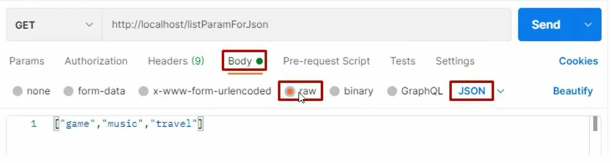

---

**③：开启自动转换 json 数据的支持**

```
@Configuration
@ComponentScan("com.itheima.controller")
@EnableWebMvc
public class SpringMvcConfig {
}
```

---

**注意事项**

`**@EnableWebMvc**` 注解功能强大，该注解整合了多个功能，此处仅使用其中一部分功能，即 JSON 数据进行自动类型转换。

---

**说明**：

- `@EnableWebMvc` 是 SpringMVC 的核心注解，用于启用 Spring MVC 的配置支持。
- 它会自动注册一系列默认的组件，如：

- `HandlerMapping`（处理器映射）
- `HandlerAdapter`（处理器适配器）
- `ViewResolver`（视图解析器）
- `HttpMessageConverter`（HTTP 消息转换器，支持 JSON 自动转换）

- 配合 Jackson 依赖（如前一步添加的 `jackson-databind`），即可实现：

- 请求体中的 JSON → Java 对象（通过 `@RequestBody`）
- Java 对象 → 响应体中的 JSON（通过 `@ResponseBody`）

- 此处重点利用其对 **JSON 自动类型转换** 的支持。

---

**④：设置接收 json 数据**

```
@RequestMapping("/listParamForJson")
@ResponseBody
public String listParamForJson(@RequestBody List<String> likes) {
    System.out.println("list common(json)参数传递 list ==> " + likes);
    return "{ 'module':'list common for json param' }";
}
```

---

**说明**：

- 该方法用于接收客户端发送的 JSON 格式数据。
- `@RequestBody` 注解表示将请求体（request body）中的 JSON 数据自动转换为 Java 对象。
- 此处接收的是一个字符串列表 `List<String>` 类型的参数 `likes`，例如前端发送的 JSON 如：

```
["football", "music", "reading"]
```

- SpringMVC 会自动使用 Jackson 将其解析为 `List<String>` 对象。
- `@ResponseBody` 表示返回值将作为响应体内容输出，通常为 JSON 格式。
- 方法返回一个字符串形式的 JSON，也可返回 POJO 对象以实现自动序列化。

✅ 实现了对 **JSON 数组参数** 的接收与处理。

---

### **7.6 日期类型参数传递**

- 日期类型数据基于系统不同格式也不尽相同

- `2088-08-18`
- `2088/08/18`
- `08/18/2088`

- 接收形参时，根据不同的日期格式设置不同的接收方式

```
@RequestMapping("/dataParam")
@ResponseBody
public String dataParam(Date date,
        @DateTimeFormat(pattern = "yyyy-MM-dd") Date date1,
        @DateTimeFormat(pattern = "yyyy/MM/dd HH:mm:ss") Date date2) {
    System.out.println("参数传递 date ==> " + date);
    System.out.println("参数传递 date(yyyy-MM-dd) ==> " + date1);
    System.out.println("参数传递 date(yyyy/MM/dd HH:mm:ss) ==> " + date2);
    return "{ 'module':'data param' }";
}
```

---

**请求示例**

```
http://localhost/dataParam?date=2088/08/08&date1=2088-08-18&date2=2088/08/28 8:08:08
```

---

**说明**：

- SpringMVC 默认支持部分标准日期格式（如 `yyyy-MM-dd`），但对其他格式需要显式指定。
- 使用 `@DateTimeFormat(pattern = "...")` 注解可以自定义日期解析格式。
- 示例中：

- `date`：使用默认格式（如 `yyyy/MM/dd`）解析。
- `date1`：按 `yyyy-MM-dd` 格式解析（如 `2088-08-18`）。
- `date2`：按 `yyyy/MM/dd HH:mm:ss` 格式解析（如 `2088/08/28 8:08:08`）。

- 注意：如果未使用 `@DateTimeFormat` 注解，SpringMVC 可能无法正确解析非标准格式的日期，导致异常。

✅ 实现了对多种日期格式的支持，提升了参数接收的灵活性。

---

### 5.1.3. web 项目请求乱码问题

#### 5.1.3.1. 6.1get 请求乱码问题

get 请求，提交的数据是在浏览器的地址栏上进行回显。在请求行上提交数据，例如：

/springmvc/login?username=张三&password=123

官方文档中 Tomcat10 或 9 的 URIEncoding 默认就是 UTF-8

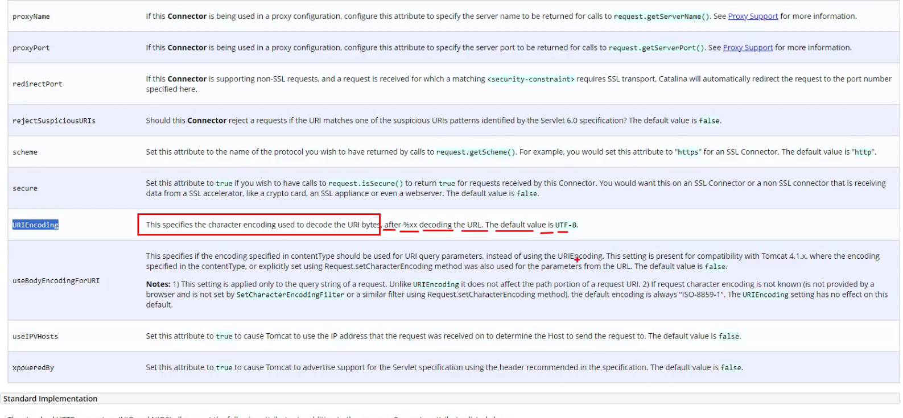

根据在上面的目录找到 server.xml 文件

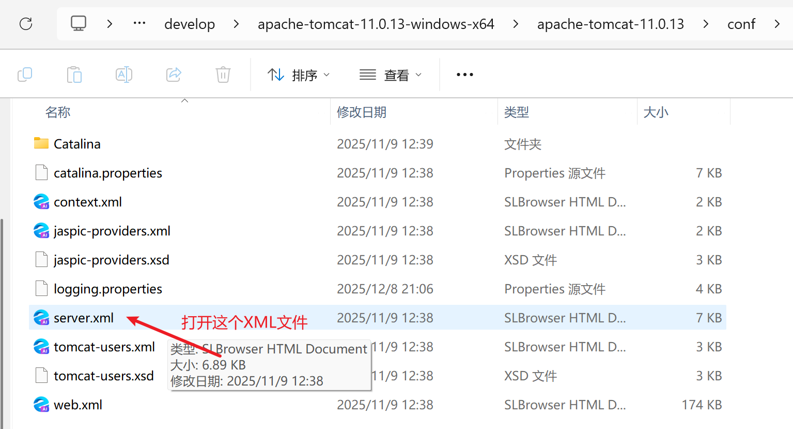

解决乱码问题：

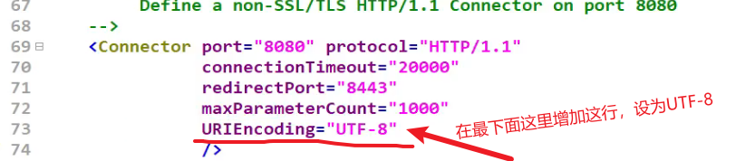

查看自己的 Tomcat 的默认编码方式 可以根据最上面的目录打开这个 http.html 用浏览器查看它的 **URIEncoding**

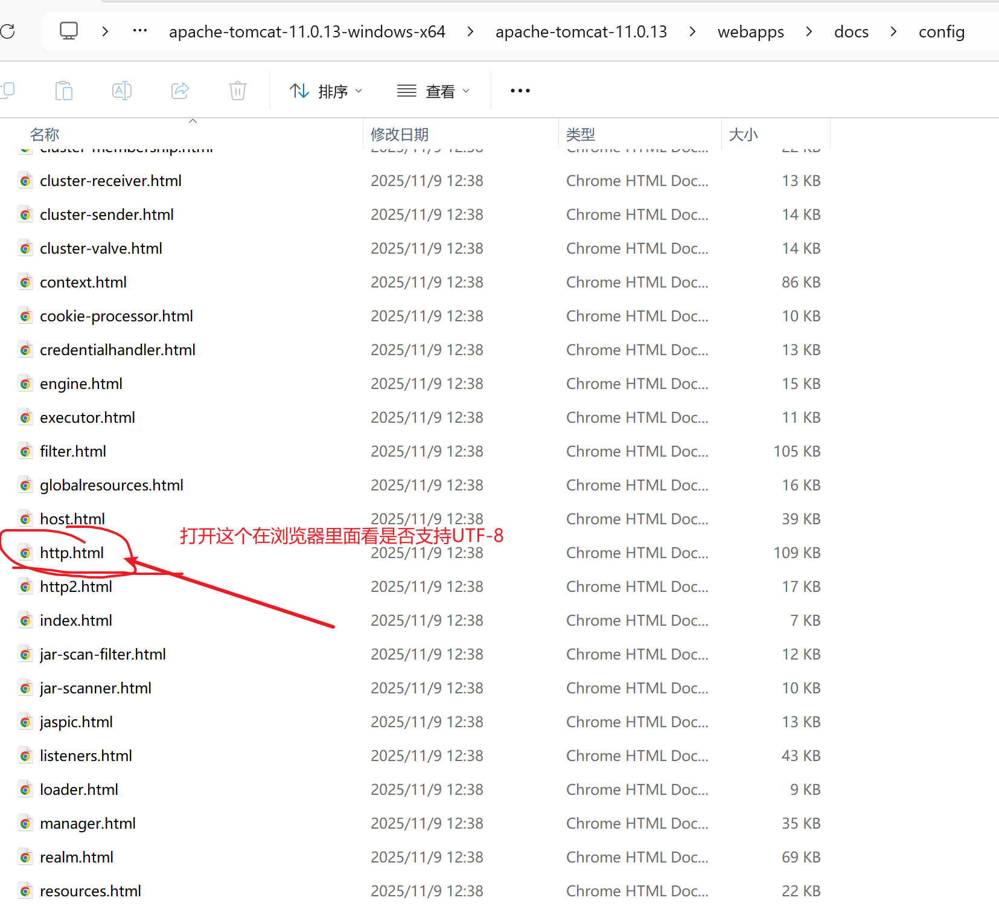

#### 5.1.3.2. post 请求乱码问题

**但如果是在 Tomcat10 及以上版本当中，我们是不需要的**

根据最上面的目录打开这个 **web.xml**

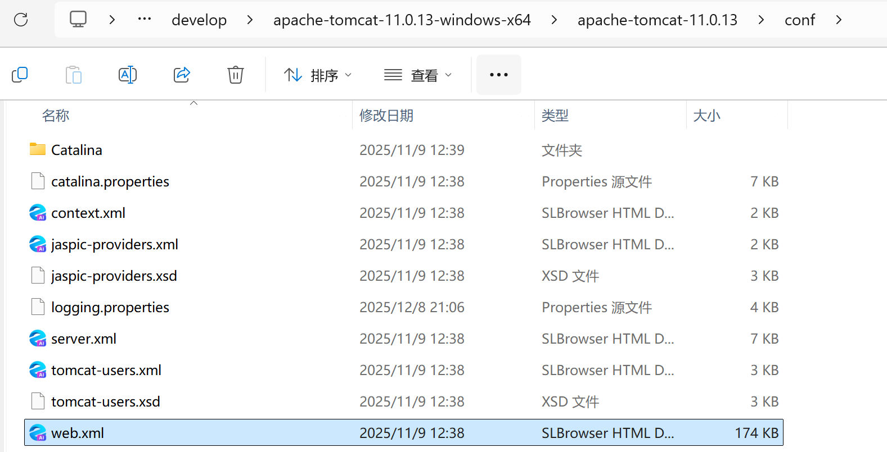

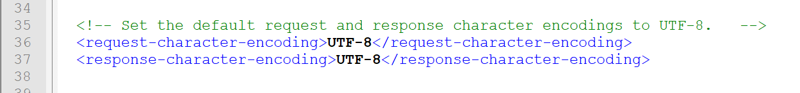

这个配置信息表示：请求体采用 UTF-8 的方式，另外响应的时候也采用 UTF-8 的方式，所以 POST 请求无乱码，响应也没有乱码

**Tomcat9-版本如何解决这个乱码问题？**

**第一个方式：**

String username =request.getParameter("")方法执行之前执行这段代码request.setCharacterEncoding("UTF-8")

**第二个方式：**

自己编写过滤器

```
public class CharacterEncodingFilter implements Filter {
    @Override
    public void doFilter(ServletRequest request, ServletResponse response, FilterChain chain) throws IOException, ServletException {
        // 设置请求体的字符集
        request.setCharacterEncoding("UTF-8");
        // 设置响应的字符集
        response.setContentType("text/html;charset=UTF-8");
        // 执行下一个资源
        chain.doFilter(request, response);
    }
}
```

在 web.xml 中配置字符编码过滤器

```
<!-- 配置字符编码过滤器 -->
<filter>
  <filter-name>characterEncodingFilter</filter-name>
  <filter-class>com.powernode.springmvc.filter.CharacterEncodingFilter</filter-class>
</filter>

<filter-mapping>
  <filter-name>characterEncodingFilter</filter-name>
  <url-pattern>/*</url-pattern>
</filter-mapping>
```

**第三个方式：**

使用的是 SpringMVC 框架内置的字符编码过滤器即可，characterEncodingFilter

```
<!-- 使用SpringMVC框架内置的字符编码过滤器 -->
<filter>
    <filter-name>characterEncodingFilter</filter-name>
    <filter-class>org.springframework.web.filter.CharacterEncodingFilter</filter-class>
    <init-param>
        <param-name>encoding</param-name>
        <!-- 设置字符集 -->
        <param-value>UTF-8</param-value>
    </init-param>
    <init-param>
        <param-name>forceRequestEncoding</param-name>
        <!-- 让请求体的编码方式强行使用以上的字符集。 -->
        <param-value>true</param-value>
    </init-param>
    <init-param>
        <param-name>forceResponseEncoding</param-name>
        <!-- 让响应体的编码方式强行使用以上的字符集。 -->
        <param-value>true</param-value>
    </init-param>
</filter>

<filter-mapping>
    <filter-name>characterEncodingFilter</filter-name>
    <url-pattern>/*</url-pattern>
</filter-mapping>
```

---

## 5.2. 响应

### **响应页面（了解）**

```
@RequestMapping("/toPage")
public String toPage() {
    return "page.jsp";
}
```

---

**说明**：

- 该方法用于处理请求 `/toPage`，并返回一个视图名称。
- 返回值为字符串 `"page.jsp"`，表示将跳转到 `page.jsp` 页面。
- SpringMVC 会通过配置的 `ViewResolver`（如 `InternalResourceViewResolver`）解析该视图名，最终转发至对应的 JSP 页面。
- 此方式适用于传统 Web 开发中跳转页面的场景，属于“视图导向”的响应模式。
- 注意：若未配置正确的视图解析器，可能无法正确找到页面文件。

✅ 用于实现从控制器跳转到指定页面（JSP），是典型的 MVC 视图渲染流程。

---

### **响应文本数据（了解）**

```
@RequestMapping("/toText")
@ResponseBody
public String toText() {
    return "response text";
}
```

---

**说明**：

- 该方法用于处理请求 `/toText`，并返回纯文本数据。
- 使用 `@ResponseBody` 注解表示：**返回值将直接写入 HTTP 响应体**，而不是作为视图名称解析。
- 返回值为字符串 `"response text"`，客户端将接收到原始文本内容。
- 默认情况下，响应头中的 `Content-Type` 为 `text/plain;charset=UTF-8`，适用于返回简单文本信息。
- 常用于 API 接口返回提示信息、错误消息等非结构化文本。

✅ 实现了直接向客户端输出文本内容，是前后端分离或简单接口开发中的常见方式。

---

### **响应 json 数据（对象转 json）**

```
@RequestMapping("/toJsonPOJO")
@ResponseBody
public User toJsonPOJO() {
    User user = new User();
    user.setName("赵云");
    user.setAge(41);
    return user;
}
```

---

**说明**：

- 该方法用于处理请求 `/toJsonPOJO`，并返回一个 `User` 对象。
- 使用 `@ResponseBody` 注解表示：**返回的对象将自动转换为 JSON 格式并写入响应体**。
- SpringMVC 会通过配置的 `HttpMessageConverter`（如 Jackson）将 Java 对象序列化为 JSON 字符串。
- 示例输出（JSON 格式）：

```
{
  "name": "赵云",
  "age": 41
}
```

- 前提条件：

- 已添加 Jackson 依赖（如 `jackson-databind`）。
- 已启用 `@EnableWebMvc` 或相关配置以支持自动转换。

✅ 实现了 POJO 对象到 JSON 的自动转换，是前后端交互中常见的数据返回方式。

---

### **HttpMessageConverter 接口**

```
public interface HttpMessageConverter<T> {

    boolean canRead(Class<?> clazz, @Nullable MediaType mediaType);

    boolean canWrite(Class<?> clazz, @Nullable MediaType mediaType);

    List<MediaType> getSupportedMediaTypes();

    T read(Class<? extends T> clazz, HttpInputMessage inputMessage)
            throws IOException, HttpMessageNotReadableException;

    void write(T t, @Nullable MediaType contentType, HttpOutputMessage outputMessage)
            throws IOException, HttpMessageNotWritableException;
}
```

---

**说明**：

- `HttpMessageConverter<T>` 是 SpringMVC 中用于处理 HTTP 请求/响应消息转换的核心接口。
- 它定义了将 HTTP 消息（请求体或响应体）与 Java 对象之间进行相互转换的能力。
- 主要方法功能如下：

|   |   |
|---|---|
|方法|作用|
|`canRead()`|判断是否支持读取指定类型的数据（如 JSON → Java 对象）|
|`canWrite()`|判断是否支持写入指定类型的数据（如 Java 对象 → JSON）|
|`getSupportedMediaTypes()`|返回该转换器支持的媒体类型（如 `application/json`<br><br>）|
|`read()`|从输入流中读取数据并转换为 Java 对象（配合 `@RequestBody`<br><br>使用）|
|`write()`|将 Java 对象写入输出流（配合 `@ResponseBody`<br><br>使用）|

- 常见实现类：

- `MappingJackson2HttpMessageConverter`：用于 JSON 数据转换（依赖 Jackson）
- `StringHttpMessageConverter`：用于文本数据转换
- `FormHttpMessageConverter`：用于表单数据转换

✅ 是 SpringMVC 实现自动类型转换（如 JSON ↔ POJO）的基础机制。

---

# 6. 三个域对象

## 6.1. Servlet 中的三个域对象

**三大域对象的说明：**

- **请求域**：`request`
- **会话域**：`session`
- **应用域**：`application`

这三个域都具有以下三个常用方法：

```
// 向域中存储数据
void setAttribute(String name, Object obj);

// 从域中读取数据
Object getAttribute(String name);

// 删除域中的数据
void removeAttribute(String name);
```

---

**主要用途：**

主要是通过 `setAttribute()` 和 `getAttribute()` 方法来完成在域中数据的**传递和共享**。

例如：

- `request.setAttribute("msg", "Hello");` 存储数据到请求域。
- `String msg = (String) request.getAttribute("msg");` 从请求域获取数据。

#### 9.1.1request

接口名：HttpServletRequest

简称：request

request 对象代表一次请求，一次请求一个 request

**使用请求域的业务场景**：

如果你想在同一个请求当中共享数据，那么请使用**请求域**

/a------>有一个数据，假设是 user

request.setAttribute("user",user) 转发（一次请求）

/b------>我需要 user 数据，怎么办？

request.getAttribute("user")

#### 9.1.2session

接口名：HttpSession

简称：session

`session` 对象代表了一次会话。从打开浏览器开始访问，到最终浏览器关闭，这是一次完整的会话。每个会话的 `session` 对象都对应一个 **JSESSIONID**，而 JSESSIONID 生成后以 **Cookie 的方式存储在浏览器客户端**。当浏览器关闭时，JSESSIONID 失效，会话结束

**使用请求域的业务场景：**

1. 在 A 资源中通过重定向的方式跳转到 B 资源，因为是重定向，因此从 A 到 B 是两次请求。如果想让 A 资源和 B 资源共享同一个数据，可以将数据存储到 `session` 域中。
2. 登录成功后保存用户的登录状态。

希望在多次请求之间共享同一个数据，可以使用**会话域**

/a------>有一个数据，假设是 user

session.setAttribute("user",user) 重定向（两次请求）

/b------>我需要 user 数据，怎么办？

session.getAttribute("user")

#### 9.1.3application

接口名：ServletContext

简称：application

application 对象代表了整个 web 应用，服务器启动时创建，服务器关闭时销毁，对于一个 web 应用来说，application 对象只用一个

**使用应用域的业务场景**：记录网站的在线人数

---

## 6.2. request 域对象

#### 9.2.1 使用原生的 ServletAPI 方式

在处理器方法上添加 **HttpServletRequest** 参数即可

```
import jakarta.servlet.http.HttpServletRequest;
import org.springframework.stereotype.Controller;
import org.springframework.web.bind.annotation.RequestMapping;


@Controller
public class RequestScopeTestController {

    @RequestMapping("/testServletAPI")
    public String testServletAPI(HttpServletRequest request) {
        // 将共享的数据存储到request域当中
        request.setAttribute("testRequestScope", "在SpringMVC当中使用原生Servlet API完成request域数据共享");

        // 跳转视图，在视图页面将request域中的数据取出来，这样就完成了：Controller和View在同一个请求当中两个组件之间数据的共享。
        // 这个跳转，默认情况下是：转发的方式。（转发forward是一次请求）
        // 返回的是一个逻辑视图名称，经过视图解析器解析，变成物理视图名称。/WEB-INF/thymeleaf/ok.html
        return "ok";
    }
}
```

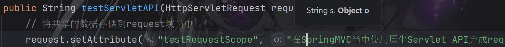

`**setAttribute(**“字符串”，Object 类型**)**` 和`**getAttribute(****“字符串”****)**` 是 **Java Servlet API 中** `**HttpServletRequest**` **对象的方法**，

`**setAttribute(**“字符串”，Object 类型**)**`的作用是：

**将一个****键值对（key-value）****存储到当前 HTTP 请求的** **request 作用域****（request scope）中，以便在同一个请求生命周期内的其他组件（比如 JSP、Thymeleaf 模板、转发的目标页面等）可以访问这个数据。**

`**getAttribute(****“字符串”****)**` 的作用是：

**从当前请求的作用域（request scope）中，根据指定的****属性名（key）****，获取之前通过** `**setAttribute()**` **存储的数据（value）****。**

#### 9.2.2 使用 Model 接口

在 SpringMVC 的处理器方法的参数上添加一个接口类型：Model

注意不要导入错了是 Model 接口！！！

```
@RequestMapping("/testModel")
    public String testModel(Model model){
        // 向request域中绑定数据
        model.addAttribute("testModelScope", "在SpringMVC当中使用Model完成request域数据共享");
        // 转发
        return "ok";
    }
```

这种方式实际上就是 MVC 架构模式：

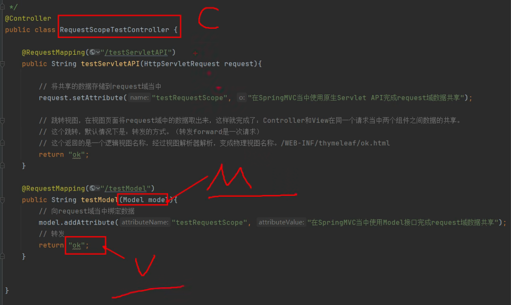

#### 9.2.3 使用 Map 接口

在 springmvc 的处理器方法的参数上添加一个接口类型：Map

```
@RequestMapping("/testMap")
    public String testMap(Map<String, Object> map){
        // 向request域中绑定数据
        map.put("testMapScope", "在SpringMVC当中使用Map完成request域数据共享");
        // 转发
        return "ok";
    }
```

#### 9.2.4 使用 ModelMap 类

在 springmvc 的处理器方法的参数上添加一个类型：ModelMap

```
@RequestMapping("/testModelMap")
    public String testModelMap(ModelMap modelMap){
        // 向request域中绑定数据
        modelMap.addAttribute("testModelScope", "在SpringMVC当中使用Model完成request域数据共享");
        // 转发
        return "ok";
    }
```

#### 9.2.5Mode 接口，Map 接口，ModelMap 类，三者之间有什么关系？

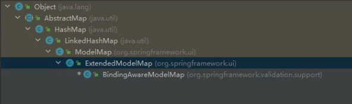

尽管表面上使用的是不同的接口和类（如 `Model`、`Map`、`ModelMap`），但实际上底层都使用了同一个对象：  
`**org.springframework.validation.support.BindingAwareModelMap**`

**类与接口的继承/实现关系图（从上到下**）：

```
BindingAwareModelMap
    ↑ 继承自
ExtendedModelMap
    ↑ 继承自
ModelMap
    ↑ 实现了
Model 接口
    ↑ 继承自
LinkedHashMap
    ↑ 实现了
Map 接口
```

`**Model**` **接口、**`**Map**` **接口、**`**ModelMap**` **类之间通过继承和实现形成一条链式结构**，最终统一到 `BindingAwareModelMap` 这个具体实现类上

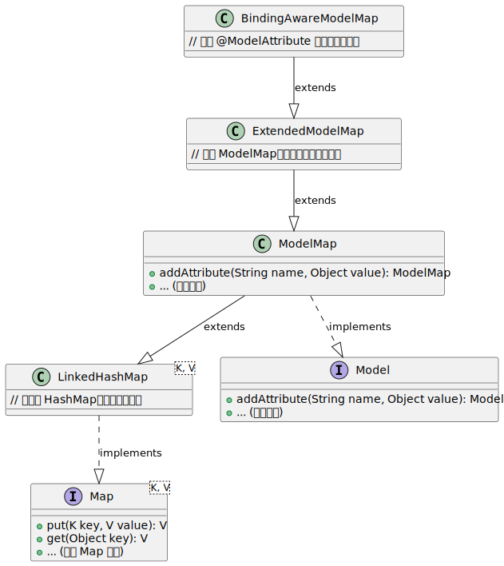

#### 9.2.6 使用 ModelAndView 类

这个类封装了 Model 和 View，也就是说这个类既封装业务逻辑处理之后的数据，也体现了跳转到哪个视图，使用它也可以完成 request 域数据共享

```
@RequestMapping("/testModelAndView")
public ModelAndView testModelAndView(ModelAndView modelAndView){
    // 创建ModelAndView对象
    ModelAndView mav = new ModelAndView();
    // 向request域中绑定数据
    mav.addObject("testModelAndViewScope", "在SpringMVC当中使用ModelAndView完成request域数据共享");
    // 设置视图名称
    mav.setViewName("ok");
    // 返回ModelAndView对象
    return mav;
}
```

注意：

1. 方法的返回值类型不是 `String`，而是 `ModelAndView` 对象。
2. `ModelAndView` 不是出现在方法的参数位置，而是在方法体内通过 `new` 创建的。
3. 需要调用 `addObject()` 方法向域中存储数据。
4. 需要调用 `setViewName()` 方法设置视图的名字。

**总结：**

1. **处理方法的返回值**：  
    无论处理器方法使用的参数是 `Model` 接口、`Map` 接口、`ModelMap` 类，还是 `ModelAndView` 类，最终执行结束后返回的都是 `ModelAndView` 对象。
2. **返回对象的处理流程**：

- 返回的 `ModelAndView` 对象会交给前端控制器 `DispatcherServlet` 处理。
- 当请求路径不是 JSP 时，请求会先经过 `DispatcherServlet`。

3. **DispatcherServlet 的核心方法**：

- `DispatcherServlet` 中有一个核心方法 `doDispatch()`，用于通过请求路径找到对应的处理器方法。
- 调用处理器方法后，该方法返回一个逻辑视图名称（也可能直接返回一个 `ModelAndView` 对象）。

4. **底层处理流程**：

- 框架将逻辑视图名称转换为 `View` 对象。
- 将 `View` 对象与 `Model` 数据结合，封装成一个 `ModelAndView` 对象。
- 最终将该 `ModelAndView` 对象返回给 `DispatcherServlet` 进行后续处理。

总结：在 Spring MVC 中，处理器方法最终返回 `ModelAndView` 对象，由 `DispatcherServlet` 通过 `doDispatch()` 方法进行调度和视图解析，完成页面渲染。

## 6.3. session 域对象

#### 9.3.1 使用原生的 ServletAPI 方式

使用原生的 Servlet API 实现。（在处理器方法的参数上添加一个 HttpSession 参数，SpringMVC 会自动将 Session 对象传递给这个参数）

```
@Controller
public class SessionScopeTestController {

    @RequestMapping("/testSessionServletAPI")
    public String testServletAPI(HttpSession session) {
        // 处理核心业务....
        // 将数据存储到session中
        session.setAttribute("testSessionScope", "在SpringMVC当中使用原生Servlet API完成session域数据共享");
        
        // 返回逻辑视图名称（这是一个转发的行为）
        return "ok";
    }
}
```

#### 9.3.2 使用 SessionAttributes 注解

使用 **@SessionAttributes** 注解标注 Controller:

```
@Controller
//@SessionAttributes(value={"x", "y"})
@SessionAttributes({"x", "y"}) // 标注 x 和 y 都是存储到 session 域中，而不是 request 域
public class SessionScopeTestController {

    @RequestMapping("/testSessionServletAPI")
    public String testServletAPI(HttpSession session) {
        // 处理核心业务....
        // 将数据存储到 session 中
        session.setAttribute("testSessionScope", "在SpringMVC当中使用原生Servlet API完成session域数据共享");

        // 返回逻辑视图名称（这是一个转发的行为）
        return "ok";
    }

    @RequestMapping("/testSessionAttributes")
    public String testSessionAttributes(ModelMap modelMap) {
        // 处理业务
        // 将数据存储到 session 域当中
        modelMap.addAttribute("x", "我是埃克斯");
        modelMap.addAttribute("y", "我是歪");

        // 返回逻辑视图名称
        return "ok";
    }
}
```

你不加这个注解就是 request 域加了这个注解就是 session 域

## 6.4. application 域对象

使用较少，一般采用 ServletAPI 的方式使用

```
@Controller
public class ApplicationScopeTestController {

    @RequestMapping("/testApplicationScope")
    public String testApplicationScope(HttpServletRequest request) {
        // 将数据存储到 application 域当中
        // 获取 application 对象，其实就是获取 ServletContext 对象
        // 怎么获取 ServletContext 对象？通过 request，通过 session 都可以获取。
        ServletContext application = request.getServletContext();
        application.setAttribute("testApplicationScope", "在SpringMVC中使用ServletAPI实现application域共享");

        return "ok";
    }
}
```

---

# 7. 视图 View

Model 三个域：request session application

Controller @RequestMapping @Controller

View

## 7.1. SpringMVC 中视图的实现原理

#### 10.1.1SpringMVC 视图支持可配置

Spring MVC 中配置 **Thymeleaf 视图解析器** 的 XML 配置片段，用于将逻辑视图名解析为实际的 Thymeleaf 模板文件。

```
<!-- 视图解析器 -->
<bean id="thymeleafViewResolver" class="org.thymeleaf.spring6.view.ThymeleafViewResolver">
    <property name="characterEncoding" value="UTF-8"/>
    <property name="order" value="1"/>
    <property name="templateEngine">
        <bean class="org.thymeleaf.spring6.SpringTemplateEngine">
            <property name="templateResolver">
                <bean class="org.thymeleaf.spring6.templateresolver.SpringResourceTemplateResolver">
                    <property name="prefix" value="/WEB-INF/thymeleaf/"/>
                    <property name="suffix" value=".html"/>
                    <property name="templateMode" value="HTML"/>
                    <property name="characterEncoding" value="UTF-8"/>
                </bean>
            </property>
        </bean>
    </property>
</bean>
```

---

功能说明

该配置定义了一个名为 `thymeleafViewResolver` 的 Bean，负责将控制器返回的逻辑视图名（如 `"user/list"`）映射到实际的 HTML 模板文件。

🔹 核心组件层级关系

```
ThymeleafViewResolver
├── templateEngine (SpringTemplateEngine)
│   └── templateResolver (SpringResourceTemplateResolver)
```

---

🔍 各属性详解

|   |   |
|---|---|
|属性|说明|
|`id="thymeleafViewResolver"`|Bean 的唯一标识符，供 Spring 容器管理。|
|`class="org.thymeleaf.spring6.view.ThymeleafViewResolver"`|Thymeleaf 的视图解析器类（Spring 6 版本）。|
|`characterEncoding="UTF-8"`|设置字符编码为 UTF-8，避免中文乱码。|
|`order="1"`|设置解析器优先级（数字越小优先级越高），确保先尝试 Thymeleaf 解析。|

➤ `templateEngine`（模板引擎）

- 使用 `SpringTemplateEngine`，支持 Spring 的表达式语言（SpEL）。
- 负责编译和渲染模板。

➤ `templateResolver`（模板解析器）

- 类型：`SpringResourceTemplateResolver`
- 负责定位模板文件路径。

|   |   |   |
|---|---|---|
|属性|值|说明|
|`prefix`|`/WEB-INF/thymeleaf/`|模板文件的前缀路径，表示模板存放在 `WEB-INF/thymeleaf/`<br><br>目录下。|
|`suffix`|`.html`|模板文件的后缀名。|
|`templateMode`|`HTML`|模板类型，支持 `HTML`<br><br>, `TEXT`<br><br>, `XML`<br><br>, `JAVASCRIPT`<br><br>等。|
|`characterEncoding`|`UTF-8`|模板文件的字符编码，与输出一致。|

---

🧩 示例：如何工作？

假设控制器返回：

```
return "user/list";
```

则：

1. `ThymeleafViewResolver` 会查找路径：

```
/WEB-INF/thymeleaf/user/list.html
```

2. 加载并解析该 HTML 文件，替换其中的 Thymeleaf 表达式（如 `${user.name}`）。
3. 返回渲染后的 HTML 页面给浏览器。

---

🛠️ 注意事项

1. **路径权限**

- `WEB-INF` 下的文件不能被直接访问（安全隔离），只能通过 Servlet 渲染输出。

2. **Spring 版本兼容性**

- 使用 `spring6` 包名（如 `org.thymeleaf.spring6.*`）适用于 Spring Boot 3.x / Spring Framework 6.x。
- 若使用 Spring 5.x，应改为 `org.thymeleaf.spring5.*`。

3. **依赖要求**

- 必须引入以下依赖（以 Maven 为例）：

```
<dependency>
    <groupId>org.springframework.boot</groupId>
    <artifactId>spring-boot-starter-thymeleaf</artifactId>
</dependency>
```

#### 10.1.2SpringMVC 支持的常见视图

|   |   |   |
|---|---|---|
|序号|视图类型|说明|
|1.|**InternalResourceView**|内部资源视图，Spring MVC 框架内置，专为 **JSP 模板语法** 准备，用于渲染 JSP 页面。|
|2.|**RedirectView**|重定向视图，Spring MVC 内置，用于实现 HTTP 重定向（`HTTP 302`<br><br>），将请求跳转到另一个 URL。|
|3.|**ThymeleafView**|Thymeleaf 视图，第三方视图解析器，专为 **Thymeleaf 模板引擎** 设计，支持静态和动态页面渲染。|

🔍 补充说明

- **InternalResourceView**

- 默认用于 JSP 页面，通常配合 `InternalResourceViewResolver` 使用。
- 示例：返回逻辑视图名 `"user/list"` → 解析为 `/WEB-INF/views/user/list.jsp`。

- **RedirectView**

- 不是转发，而是发送重定向响应。
- 示例：`return new RedirectView("/login");` 或直接返回字符串 `"redirect:/login"`。

- **ThymeleafView**

- 需要引入 `thymeleaf-spring5` 依赖。
- 常与 `ThymeleafViewResolver` 配合使用。
- 支持 HTML 中嵌入表达式（如 `${user.name}`），适合前后端分离开发中的模板渲染。

#### 10.1.3SpringMVC 实现视图机制的核心类和核心接口

**1.DispatcherServlet: 前端控制器**

负责接口前端的请求

根据请求路径找到对应的处理器方法

执行处理器方法

并且最终返回 ModelAndView 对象

再往下就是处理视图

**2.ViewResolver 接口：视图解析器接口**

（ThymeleafViewResolver 实现了 ViewResolver 接口，InternalResourceViewResolver 也是实现了ViewResolver 接口）

**这个接口做什么事儿？**

这个接口的作用是将 逻辑视图名称 转换为 物理视图名称

并且最终返回一个 View 接口对象

**核心方法是什么？**

View resolveViewName(String viewName,Locale locale) throws Exception

**3.View 接口：视图接口（ThymeleafView 实现了 View 接口，InternalResourceView 也实现了 View 接口……）**

**这个接口做什么事儿？**

这个接口负责将模版语法的字符串转换为 html 代码

并且将 HTML 代码响应给浏览器（渲染）

**核心方法是什么？**

void render(@Nullable Map<String, ?> model, HttpServletRequest request, HttpServletResponse response) throws Exception;

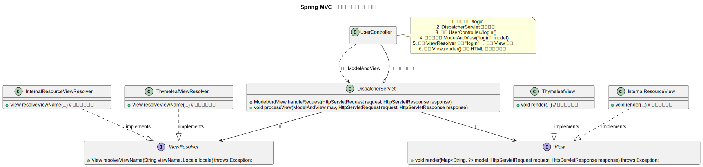

#### 10.1.4SpringMVC 视图机制的原理描述

```
// 前端控制器，SpringMVC最核心的类
public class DispatcherServlet extends FrameworkServlet {
	// 前端控制器最核心的方法，这个方法是负责处理请求的，一次请求，调用一次 doDispatch 方法。
	protected void doDispatch(HttpServletRequest request, HttpServletResponse response) throws Exception {
		// 通过请求获取处理器
		// 请求：http://localhost:8080/springmvc/hello （有URI）
		// 根据请求路径来获取对应的要执行的处理器
		// 实际上返回的是一个处理器执行链对象
		// 这个执行链(链条)把谁串起来了呢？把这一次请求要执行的所有拦截器和处理器串起来了。
		// HandlerExecutionChain是一次请求对应一个对象
		HandlerExecutionChain mappedHandler = getHandler(request);
		
		// 根据处理器获取处理器适配器对象
		HandlerAdapter ha = getHandlerAdapter(mappedHandler.getHandler()); // Handler就是我们写的Controller

		// 执行该请求对应的所有拦截器中的 preHandle 方法
		if (!mappedHandler.applyPreHandle(processedRequest, response)) {
			return;
		}

		// 调用处理器方法，返回ModelAndView对象
		// 在这里进行的数据绑定，实际上调用处理器方法之前要给处理器方法传参
		// 需要传参的话，这个参数实际上是要经过一个复杂的数据绑定过程（将前端提交的表单数据转换成POJO对象）
		mv = ha.handle(processedRequest, response, mappedHandler.getHandler());

		// 执行该请求对应的所有拦截器中的 postHandle 方法
		mappedHandler.applyPostHandle(processedRequest, response, mv);

		// 处理分发结果（本质上就是响应结果到浏览器）
		processDispatchResult(processedRequest, response, mappedHandler, mv, dispatchException);
	}

	private void processDispatchResult(HttpServletRequest request, HttpServletResponse response,
			@Nullable HandlerExecutionChain mappedHandler, @Nullable ModelAndView mv,
			@Nullable Exception exception) throws Exception {
		// 渲染
		render(mv, request, response);
		// 执行该请求所对应的所有拦截器的afterCompletion方法
		mappedHandler.triggerAfterCompletion(request, response, null);
	}

	protected void render(ModelAndView mv, HttpServletRequest request, HttpServletResponse response) throws Exception {
		// 通过视图解析器进行解析，返回视图View对象
		View view = resolveViewName(viewName, mv.getModelInternal(), locale, request);
		// 调用视图对象的渲染方法（完成响应）
		view.render(mv.getModelInternal(), request, response);
	}

	protected View resolveViewName(String viewName, @Nullable Map<String, Object> model,
			Locale locale, HttpServletRequest request) throws Exception {
		// 视图解析器
		ViewResolver viewResolver;
		// 通过视图解析器解析返回视图对象View
		View view = viewResolver.resolveViewName(viewName, locale);
	}
}


// 视图解析器接口
public interface ViewResolver {
	View resolveViewName(String viewName, Locale locale) throws Exception;
}

// 视图解析器接口实现类也很多：ThymeleafViewResolver、InternalResourceViewResolver

// 视图接口
public interface View{
	void render(@Nullable Map<String, ?> model, HttpServletRequest request, HttpServletResponse response)
			throws Exception;
}

// 每一个接口肯定是有接口下的实现类，例如View接口的实现类：ThymeleafView、InternalResourceView....

/*
    核心类：DispatcherServlet
    核心接口1：ViewResolver（如果你使用的事Thymeleaf,那么底层会创建ThymeleafViewResolver对象）
    核心接口2：View(如果你使用的是Thymeleaf,那么底层会创建ThymeleafView对象)

    结论：如果你自己想实现属于自己的视图，你至少需要编写两个类，一个类实现了ViewResolver接口，实现其中的resolveViewName方法
    另一个类实现View接口，实现其中的render方法
*/


```

##### **场景一：Spring MVC 使用 Thymeleaf 作为视图**

流程步骤：

1. **浏览器发送请求给 Web 服务器**
2. **Spring MVC 中的 DispatcherServlet 接收到请求**
3. **DispatcherServlet 根据请求路径分发到对应的 Controller**
4. **DispatcherServlet 调用 Controller 的方法**
5. **Controller 的方法处理业务并返回一个逻辑视图名给 DispatcherServlet**
6. **DispatcherServlet 调用** `**ThymeleafViewResolver**` **的** `**resolveViewName**` **方法**，将**逻辑视图名**转换为**物理视图名**，并创建 `ThymeleafView` 对象返回给 DispatcherServlet
7. **DispatcherServlet 再调用** `**ThymeleafView**` **的** `**render**` **方法**，`render` 方法将模板语言转换为 HTML 代码，响应给浏览器，完成最终的渲染。

---

##### **场景二：Spring MVC 使用 JSP 作为视图**

流程步骤：

1. **浏览器发送请求给 Web 服务器**
2. **Spring MVC 中的 DispatcherServlet 接收到请求**
3. **DispatcherServlet 根据请求路径分发到对应的 Controller**
4. **DispatcherServlet 调用 Controller 的方法**
5. **Controller 的方法处理业务并返回一个逻辑视图名给 DispatcherServlet**
6. **DispatcherServlet 调用** `**InternalResourceViewResolver**` **的** `**resolveViewName**` **方法**，将**逻辑视图名**转换为**物理视图名**，并创建 `InternalResourceView` 对象返回给 DispatcherServlet
7. **DispatcherServlet 再调用** `**InternalResourceView**` **的** `**render**` **方法**，`render` 方法将模板语言（JSP）转换为 HTML 代码，响应给浏览器，完成最终的渲染。

```
<!-- JSP的视图解析器 -->
<bean id="jspViewResolver" class="org.springframework.web.servlet.view.InternalResourceViewResolver">
  <property name="prefix" value="/WEB-INF/jsp/"/>
  <property name="suffix" value=".jsp"/>
</bean>
```

## 7.2. 转发与重定向

#### 10.2.1 转发与重定向的区别

以下是对你提供的内容进行**清晰整理和提取**后的知识点总结，适用于 Java Web 开发中 **Servlet 的转发（Forward）与重定向（Redirect）** 的对比学习：

---

转发 vs 重定向 —— 核心对比

|   |   |   |
|---|---|---|
|对比项|**转发（Forward）**|**重定向（Redirect）**|
|**请求次数**|一次请求|两次请求|
|**浏览器地址栏变化**|不变|变化（显示新路径）|
|**代码实现**|`request.getRequestDispatcher("/index").forward(request, response);`|`response.sendRedirect("/webapproot/index");`|
|**控制权**|服务器内部跳转，由服务器控制|浏览器重新发起请求，由客户端控制|
|**跨域支持**|❌ 不支持跨域跳转|✅ 支持跨域跳转|
|**访问受保护资源**|✅ 可以访问 `WEB-INF`<br><br>下的资源|❌ 无法直接访问 `WEB-INF`<br><br>下的资源（浏览器不能直接访问）|

---

📌 转发原理详解

1. 客户端发送 `/a` 请求 → 执行 AServlet。
2. 在 AServlet 中调用：

```
request.getRequestDispatcher("/b").forward(request, response);
```

3. 服务器将请求从 AServlet **内部转发** 到 BServlet。
4. 整个过程对浏览器透明：**浏览器只看到一个请求** `**/a**`。
5. 所有请求参数、Session 等信息都保留并传递给下一个 Servlet。

特点：**单次请求，服务器内部处理，URL 不变。**

---

📌 重定向原理详解

1. 客户端发送 `/a` 请求 → 执行 AServlet。
2. 在 AServlet 中调用：

```
response.sendRedirect("/webapproot/b");
```

3. 服务器返回状态码 `302 Found`，响应头包含 `Location: /webapproot/b`。
4. 浏览器收到响应后，**自动发起第二次请求**：`GET /webapproot/b`。
5. 浏览器地址栏更新为 `/webapproot/b`。

✅ 特点：**两次请求，浏览器参与，URL 发生变化。**

---

🔍 关键结论记忆口诀

**“转发是一次请求，地址不变；重定向是两次请求，地址改变。”**

- 转发：**服务器内部跳转**，适合流程控制（如登录后跳转首页）。
- 重定向：**浏览器重新请求**，适合页面跳转后需要刷新或避免重复提交。

---

💡 实际应用建议

|   |   |
|---|---|
|场景|推荐方式|
|用户登录成功后跳转首页|✅ 重定向（防止刷新导致重复提交）|
|页面内逻辑跳转（如表单验证失败）|✅ 转发（保持请求上下文）|
|需要跨域跳转（如跳到第三方网站）|✅ 重定向|
|访问 WEB-INF 下的 JSP 文件|✅ 转发（仅限服务器内部访问）|

---

✅ 总结一句话

**转发是“服务器自己跑腿”，重定向是“让浏览器再发一次请求”。**

#### 10.2.2 foward 和 redirect

怎么转发？语法格式是什么？

注意：当 return "a" ;的时候，返回一个逻辑视图名称。这种方式跳转到视图，默认采用的就是 forward 方式跳转过去的，只不过这个底层创建的视图对象：ThymeleadView

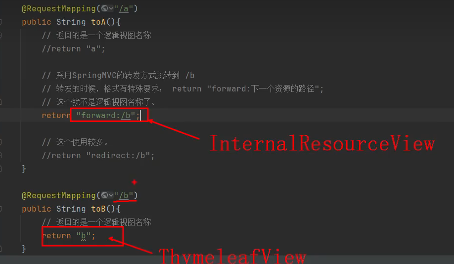

以下是对你提供的内容进行**清晰提取与整理**后的知识点总结，适用于 Spring MVC 中的 **转发（Forward）和重定向（Redirect）** 语法说明：

---

##### 1. 如何实现 **转发（Forward）**？

```
return "forward:/b";
```

- **含义**：将请求转发到 `/b` 路径。
- **特点**：

- 是一次请求（浏览器地址栏不变）。
- 由服务器内部处理，不经过客户端。
- 不能跨域跳转。

- **底层视图对象**：`InternalResourceView` 对象。
- **注意**：

- 必须以 `forward:` 开头。
- `/b` 是资源路径，不是逻辑视图名。

示例：  
`return "forward:/user/list"` → 转发到 `/user/list` 接口或页面。

---

##### 2. 如何实现 **重定向（Redirect）**？

```
return "redirect:/b";
```

- **含义**：重定向到 `/b` 路径。
- **特点**：

- 是两次请求（浏览器地址栏会变化）。
- 由服务器返回 302 状态码，浏览器自动发起新请求。
- 支持跨域跳转。

- **底层视图对象**：`RedirectView` 对象。
- **注意**：

- 必须以 `redirect:` 开头。
- 可以带参数（如 `redirect:/user?name=abc`）。

示例：  
`return "redirect:/login"` → 重定向到登录页。

---

📌 总结对比表

|   |   |   |   |   |   |
|---|---|---|---|---|---|
|类型|语法|请求次数|地址栏变化|底层视图对象|是否支持跨域|
|转发|`return "forward:/b";`|1 次|❌ 不变|`InternalResourceView`|❌ 否|
|重定向|`return "redirect:/b";`|2 次|✅ 变化|`RedirectView`|✅ 是|

---

关键记忆点

- `**forward:**` 表示服务器内部跳转，路径是真实资源路径。
- `**redirect:**` 表示让浏览器重新发送请求，路径可以是任意 URL。
- 两者都必须以对应前缀开头，否则会被当作普通视图名称处理。

---

使用建议

- 登录成功后跳转首页 → 使用 `redirect`
- 表单提交失败返回原页面 → 使用 `forward`
- 需要刷新页面或避免重复提交 → 使用 `redirect`

从一个 Spring MVC 应用（如 `springmvc1`）重定向到另一个 Spring MVC 应用（如 `springmvc2`），即实现 **跨应用、跨域跳转**。

```
@RequestMapping("/a")
public String a() {
    return "redirect:http://localhost:8080/springmvc2/b";
}
```

- 使用 `redirect:` 前缀。
- 目标 URL 必须是完整的 **绝对路径**，包括：

- 协议（`http://` 或 `https://`）
- 主机名（`localhost`）
- 端口号（`8080`）
- 应用上下文路径（`/springmvc2`）
- 具体资源路径（`/b`）

## 7.3. <mvc:view-controller>和<mvc:annotation-drivrn/>

<mvc:view-controller>：视图控制器，

<mvc:annotation-drivrn/>：注解驱动

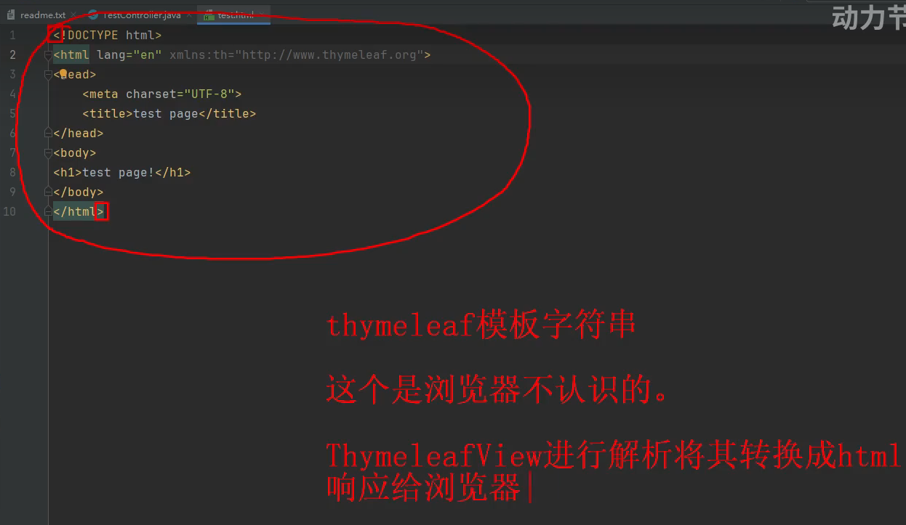

这个配置信息可以在 springmvc.xml 文件中进行配置，作用是什么？

如果一个 Controller 上的方法只是为了完成视图跳转，没有任何业务代码，那么这个 Controller 可以不写，直接在 springmvc.xml 文件中添加<mvc:view-controller path="/test" view-name="test"/>

注意是配置在</bean>标签下

```
<!--配置视图控制器-->
<mvc:view-controller path="/test" view-name="test"/>
```

只写这个配置信息会导致整个项目中使用的注解全部失效，需要使用以下的配置来再次开启注解

```
// 开启注解驱动
<mvc:annotation-drivrn/>
```

## 7.4. 访问静态资源

假设我们在webapp目录下有static目录，static目录下有touxiang.jpeg图片。  
我们可以在浏览器地址栏上直接访问：[http://localhost:8080/springmvc/static/img/touxiang.jpeg](http://localhost:8080/springmvc/static/img/touxiang.jpeg) 吗？不行。因为会走DispatcherServlet，导致发生404错误。

**怎么办？两种解决方案**：

**第一种解决方案**：开启默认的Servlet处理  
在Tomcat服务器中提供了一个默认的Servlet，叫做： org.apache.catalina.servlets.DefaultServlet  
在CATALINA_HOME/conf/web.xml文件中，有这个默认的Servlet的相关配置。  
不过，这个默认的Servlet默认情况下是不开启的。  
你需要在springmvc.xml文件中使用以下配置进行开启：

```
<mvc:annotation-driven/>
<!--开启默认的Servlet处理  -->
<mvc:default-servlet-handler/>
```

开启之后的作用是，当你访问 [http://localhost:8080/springmvc/static/img/touxiang.jpeg的时候，](http://localhost:8080/springmvc/static/img/touxiang.jpeg%E7%9A%84%E6%97%B6%E5%80%99%EF%BC%8C)  
默认先走 DispatcherServlet，如果发生404错误的话，会自动走DefaultServlet，然后DefaultServlet帮你定位静态资源。

**第二种解决方案**：配置静态资源处理，在springmvc.xml文件中添加如下配置：

```
<mvc:resources mapping="/static/**" location="/static/" />
<mvc:annotation-driven/>
```

当请求路径符合 /static/** 的时候，去 /static/ 位置找资源。

---

# 8. REST 风格

## 8.1. RESTFul 是什么？

RESTFul是**WEB服务接口**的一种设计风格。  
RESTFul定义了一组约束条件和规范，可以让WEB服务接口**更加简洁、易于理解、易于扩展、安全可靠**。

RESTFul对一个WEB服务接口都规定了哪些东西？

- 对请求的URL格式有约束和规范
- 对HTTP的请求方式有约束和规范
- 对请求和响应的数据格式有约束和规范
- 对HTTP状态码有约束和规范
- 等 ......

REST对请求方式的约束是这样的：

- 查询必须发送GET请求
- 新增必须发送POST请求
- 修改必须发送PUT请求
- 删除必须发送DELETE请求

**注意事项**

上述行为是约定方式，约定不是规范，可以打破，所以称REST风格，而不是REST规范。  
描述模块的名称通常使用复数，也就是加s的格式描述，表示此类资源，而非单个资源，例如：users、books、accounts……

---

REST对URL的约束是这样的：

- 传统的URL：get请求，/springmvc/getUserById?id=1
- REST风格的URL：get请求，/springmvc/user/1
- 传统的URL：get请求，/springmvc/deleteUserById?id=1
- REST风格的URL：delete请求, /springmvc/user/1

**RESTFul**对**URL**的约束和规范的核心是：通过采用`**不同的请求方式**`**+** `**URL**`来确定WEB服务中的资源**。**

**RESTful 的英文全称是 Representational State Transfer（表述性状态转移）。简称REST。**

表述性（Representational）是：URI + 请求方式。

状态（State）是：服务器端的数据。

转移（Transfer）是：变化。

表述性状态转移是指：通过 URI + 请求方式 来控制服务器端数据的变化。

---

## 8.2. 传统的 URL 与 RESTful URL 的区别

|   |   |
|---|---|
|**传统的 URL**|**RESTful URL**|
|GET /getUserById?id=1|GET /user/1|
|GET /getAllUser|GET /user|
|POST /addUser|POST /user|
|POST /modifyUser|PUT /user|
|GET /deleteUserById?id=1|DELETE /user/1|

---

## 8.3. RESTFul方式演示查询

为什么 `<form>` 表单中写 `method="DELETE"` 或 `method="PUT"` 实际上还是发送了 GET 请求？

**根本原因：HTML 标准限制了** `**<form>**` **元素的** `**method**` **属性只能是** `**GET**` **或** `**POST**`**。**

**解决办法：**

第一步：要想发送 PUT 请求，首先必须是一个 POST 请求（前提）

第二步：在 POST 请求的表单中添加隐藏域

```
<form th:action="@{/user}" method="post">
    <!-- 隐藏域 -->
    <input type="hidden" name="_method" value="put">

    用户名: <input type="text" name="username"><br>
    密码: <input type="password" name="password"><br>
    年龄: <input type="text" name="age"><br>
    <input type="submit" value="修改">
</form>
```

第三步：添加一个过滤器

在 web.xml 文件中进行配置：

**一定要在字符编码过滤器后面配置**

```
<!--添加一个过滤器，这个过滤器是SpringMVC提取写好的，直接用就行了，这个过滤器可以帮助你将请求的POST转换为PUT请求/delete请求-->
    <filter>
        <filter-name>hiddenHttpMethodFilter</filter-name>
        <filter-class>org.springframework.web.filter.HiddenHttpMethodFilter</filter-class>
    </filter>
    <filter-mapping>
        <filter-name>hiddenHttpMethodFilter</filter-name>
        <url-pattern>/*</url-pattern>
    </filter-mapping>
```

```
@RequestMapping(value = "/user",method = RequestMethod.PUT)
public String modify(User user){
System.out.println("正在修改用户信息,用户信息是" + user);
return "ok";
}
```

---

## 8.4. **@RequestBody @RequestParam @PathVariable**

### 8.4.1. **区别**

- `@RequestParam` 用于接收 URL 地址传参或表单传参
- `@RequestBody` 用于接收 JSON 数据
- `@PathVariable` 用于接收路径参数，使用 `{参数名称}` 描述路径参数

### 8.4.2. **应用**

- 后期开发中，发送请求参数超过 1 个时，以 JSON 格式为主，`@RequestBody` 应用较广
- 如果发送非 JSON 格式数据，选用 `@RequestParam` 接收请求参数
- 采用 RESTful 进行开发，当参数数量较少时（例如 1 个），可以采用 `@PathVariable` 接收请求路径变量，通常用于传递 id 值

---

**补充说明**：

- `@RequestParam`：适用于 GET 请求的查询参数（如 `?name=张三&age=25`）或 POST 表单提交。
- `@RequestBody`：适用于 POST/PUT 请求体中的 JSON 数据，常用于对象传输。
- `@PathVariable`：适用于 RESTful 风格的路径参数，如 `/user/{id}`，其中 `{id}` 是路径变量。

✅ 三者在实际开发中根据场景选择使用，是 SpringMVC 参数绑定的核心注解。

---

## 8.5. `@GetMapping``@PostMapping``@PutMapping``@DeleteMapping`

### 8.5.1. **类型**：方法注解

### 8.5.2. **位置**：基于 SpringMVC 的 RESTful 开发控制器方法定义上方

### 8.5.3. **作用**：设置当前控制器方法的请求访问路径与请求动作，每种对应一个请求动作。例如：

- `@GetMapping` 对应 GET 请求
- `@PostMapping` 对应 POST 请求
- `@PutMapping` 对应 PUT 请求
- `@DeleteMapping` 对应 DELETE 请求

### 8.5.4. **范例**：

```
@GetMapping("/{id}")
public String getById(@PathVariable Integer id) {
    System.out.println("book getById..." + id);
    return "{ 'module':'book getById' }";
}
```

---

### 8.5.5. **属性**

- `value`（默认）：请求访问路径

- 示例中 `@GetMapping("/{id}")` 的 `value` 值为 `/{id}`，表示匹配以 `/` 开头并包含路径变量 `id` 的 URL。

---

**说明**：

- 这些注解是 SpringMVC 提供的 **RESTful 风格简化注解**，等价于使用 `@RequestMapping(method = RequestMethod.XXX)`。
- 使用这些注解可以更清晰地表达 HTTP 方法意图，提升代码可读性。
- 结合 `@PathVariable` 可以实现动态路径参数绑定，常用于资源查询（如根据 ID 查询）。

✅ 是现代 Web 开发中实现 RESTful API 的标准方式。

---

# 9. HttpMessageConverter

翻译为： HTTP 消息转换器。该接口下提供了很多实现类，不同的实现类有不同的转换方式

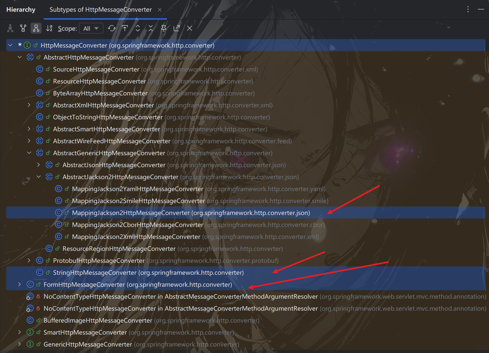

---

## 9.1. HTTP 消息

HTTP 消息就是 HTTP 协议，HTTP 协议包括请求协议和响应协议

请求协议 ： 服务器往浏览器发送

响应协议 : 浏览器往服务器发送

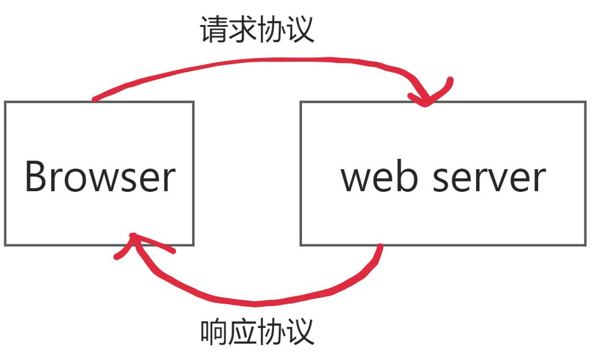

以下是一份HTTP POST请求协议：

```
POST /springmvc/user/login HTTP/1.1                                     --请求行
Content-Type: application/x-www-form-urlencoded                         --请求头
Content-Length: 32
Host: www.example.com
User-Agent: Mozilla/5.0
Connection: Keep-Alive
Accept: text/html,application/xhtml+xml,application/xml;q=0.9,*/*;q=0.8
                                                                         --空白行
username=admin&password=1234                                           	 --请求体
```

以下是一份HTTP GET请求协议：

```
GET /springmvc/user/del?id=1&name=zhangsan HTTP/1.1                          --请求行
Host: www.example.com                                                        --请求头
User-Agent: Mozilla/5.0
Connection: Keep-Alive
Accept: text/html,application/xhtml+xml,application/xml;q=0.9,*/*;q=0.8
```

以下是一份HTTP响应协议：

```
HTTP/1.1 200 OK                                      --状态行
Date: Thu, 01 Jul 2021 06:35:45 GMT                  --响应头
Content-Type: text/plain; charset=utf-8
Content-Length: 12
Connection: keep-alive
Server: Apache/2.4.43 (Win64) OpenSSL/1.1.1g
                                                     --空白行
  <!DOCTYPE html>                                    --响应体
  <html>
  <head>
    <title>hello</title>
  </head>
  <body>
  <h1>Hello World!</h1>
  </body>
  </html>
```

---

## 9.2. 转换器转换的是什么？

转换的是`HTTP协议`与`Java程序中的对象`之间的互相转换。请看下图：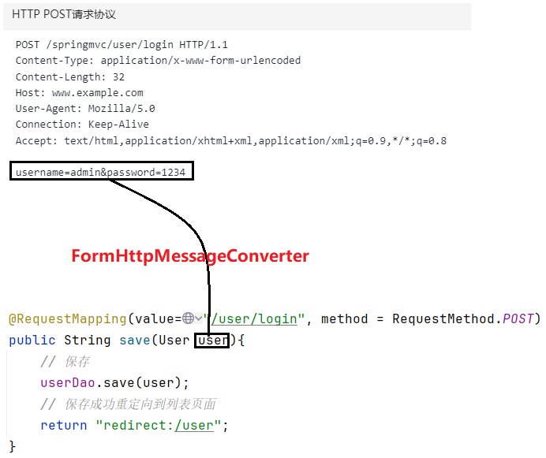

上图是我们之前经常写的代码。请求体中的数据是如何转换成user对象的，底层实际上使用了

`HttpMessageConverter`接口的其中一个实现类`FormHttpMessageConverter`。通过上图可以看出

`FormHttpMessageConverter`是负责将`请求协议`转换为`Java对象`的。

再看下图：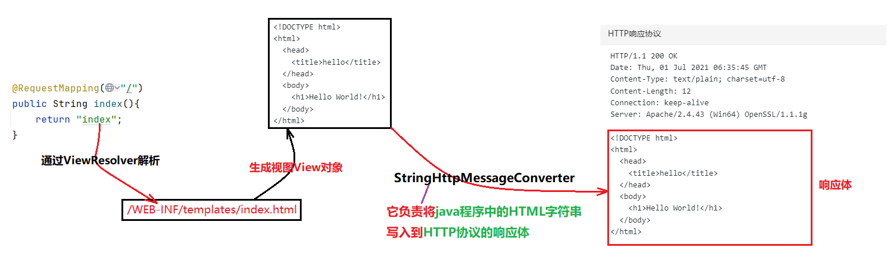上图的代码也是之前我们经常写的，Controller返回值看做逻辑视图名称，视图解析器将其转换成物理视图名称，生成视图对象，`StringHttpMessageConverter`负责将视图对象中的HTML字符串写入到HTTP协议的响应体中。最终完成响应。通过上图可以看出`StringHttpMessageConverter`是负责将`Java对象`转换为`响应协议`的。

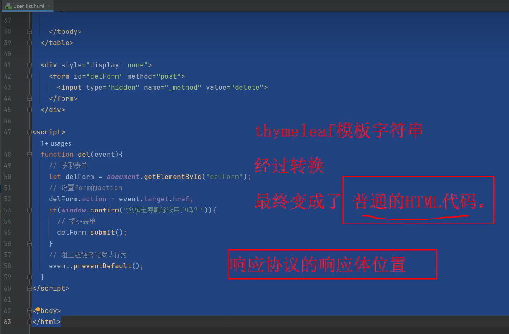  
通过以上内容的学习，大家应该能够了解到`HttpMessageConverter`接口是用来做什么的了：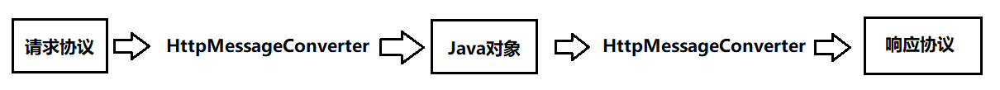如上图所示：HttpMessageConverter接口的可以将请求协议转换成Java对象，也可以把Java对象转换为响应协议。**HttpMessageConverter是接口，SpringMVC帮我们提供了非常多而丰富的实现类。每个实现类都有自己不同的转换风格。****对于我们程序员来说，Spring MVC已经帮助我们写好了，我们只需要在不同的业务场景下，选择合适的HTTP消息转换器即可。****怎么选择呢？当然是通过SpringMVC为我们提供的注解，我们通过使用不同的注解来启用不同的消息转换器。**

在HTTP消息转换器这一小节，我们重点要掌握的是两个注解两个类：

- @ResponseBody
- @RequestBody
- ResponseEntity
- RequestEntity

---

# 10. SpringMVC 中的 AJAX 请求

SpringMVC+Vue3+Thymeleaf+Axios发送一个简单的AJAX请求。

引入Vue和Axios的js文件：

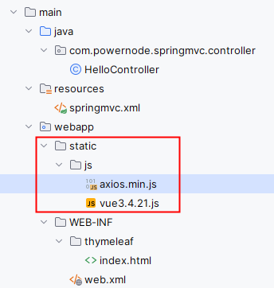

```
<?xml version="1.0" encoding="UTF-8"?>
<beans xmlns="http://www.springframework.org/schema/beans"
  xmlns:xsi="http://www.w3.org/2001/XMLSchema-instance"
  xmlns:context="http://www.springframework.org/schema/context"
  xmlns:mvc="http://www.springframework.org/schema/mvc"
  xsi:schemaLocation="http://www.springframework.org/schema/beans http://www.springframework.org/schema/beans/spring-beans.xsd http://www.springframework.org/schema/context https://www.springframework.org/schema/context/spring-context.xsd http://www.springframework.org/schema/mvc https://www.springframework.org/schema/mvc/spring-mvc.xsd">

  <!--组件扫描-->
  <context:component-scan base-package="com.powernode.springmvc.controller"/>

  <!--视图解析器-->
  <bean id="thymeleafViewResolver" class="org.thymeleaf.spring6.view.ThymeleafViewResolver">
    <property name="characterEncoding" value="UTF-8"/>
    <property name="order" value="1"/>
    <property name="templateEngine">
      <bean class="org.thymeleaf.spring6.SpringTemplateEngine">
        <property name="templateResolver">
          <bean class="org.thymeleaf.spring6.templateresolver.SpringResourceTemplateResolver">
            <property name="prefix" value="/WEB-INF/thymeleaf/"/>
            <property name="suffix" value=".html"/>
            <property name="templateMode" value="HTML"/>
            <property name="characterEncoding" value="UTF-8"/>
          </bean>
        </property>
      </bean>
    </property>
  </bean>

  <!--视图控制器映射-->
  <mvc:view-controller path="/" view-name="index"/>

  <!--开启注解驱动-->
  <mvc:annotation-driven/>

  <!--静态资源处理-->
  <mvc:default-servlet-handler/>

</beans>
```

重点是**静态资源处理**、**开启注解驱动**、**视图控制器映射**等相关配置。

---

Vue3+Thymeleaf+Axios发送AJAX请求:

```
<!DOCTYPE html>
<html lang="en" xmlns:th="http://www.thymeleaf.org">
  <head>
    <meta charset="UTF-8">
    <title>首页</title>
    <script th:src="@{/static/js/vue3.4.21.js}"></script>
    <script th:src="@{/static/js/axios.min.js}"></script>
  </head>
  <body>
    <h1>首页</h1>
    <hr>

    <div id="app">
      <h1>{{message}}</h1>
      <button @click="getMessage">获取消息</button>
    </div>

    <script th:inline="javascript">
      Vue.createApp({
        data(){
          return {
            message : "这里的信息将被刷新"
          }
        },
        methods:{
          async getMessage(){
            try {
              const response = await axios.get([[@{/}]] + 'hello')
              this.message = response.data
            }catch (e) {
              console.error(e)
            }
          }
        }
      }).mount("#app")
    </script>

  </body>
</html>
```

**重点来了，Controller怎么写呢，之前我们都是传统的请求，Controller返回一个**`**逻辑视图名**`**，然后交给**`**视图解析器**`**解析。最后跳转页面。而AJAX请求是不需要跳转页面的，因为AJAX是页面局部刷新，以前我们在Servlet中使用**`**response.getWriter().print("message")**`**的方式响应。在Spring MVC中怎么办呢？当然，我们在Spring MVC中也可以使用Servlet原生API来完成这个功能，代码如下：**

```
package com.powernode.springmvc.controller;

import jakarta.servlet.http.HttpServletResponse;
import org.springframework.stereotype.Controller;
import org.springframework.web.bind.annotation.RequestMapping;

import java.io.IOException;

@Controller
public class HelloController {

    @RequestMapping(value = "/hello")
    public String hello(HttpServletResponse response) throws IOException {
        response.getWriter().print("hello");
        return null;
    }
}
```

或者这样也行：不需要有返回值

```
package com.powernode.springmvc.controller;

import jakarta.servlet.http.HttpServletResponse;
import org.springframework.stereotype.Controller;
import org.springframework.web.bind.annotation.RequestMapping;

import java.io.IOException;

@Controller
public class HelloController {

    @RequestMapping(value = "/hello")
    public void hello(HttpServletResponse response) throws IOException {
        response.getWriter().print("hello");
    }
}
```

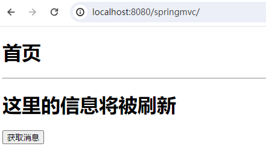

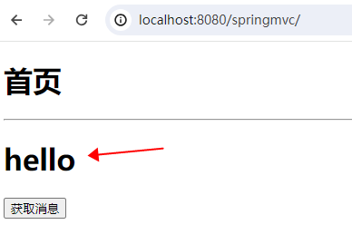

启动服务器测试：[http://localhost:80](http://localhost:8080/springmvc/)[80/springmvc/](http://localhost:8080/springmvc/)**注意：如果采用这种方式响应，则和 springmvc.xml 文件中配置的视图解析器没有关系，不走视图解析器了。**

难道我们以后AJAX请求都要使用原生Servlet API吗？

- 不需要，我们可以使用SpringMVC中提供的HttpMessageConverter消息转换器。

我们要向前端响应一个字符串"hello"，这个"hello"就是响应协议中的响应体。我们可以使用 @ResponseBody 注解来启用对应的消息转换器。而这种消息转换器只负责将Controller返回的信息以响应体的形式写入响应协议。

---

# 11. RequestEntity 和 ResponseEntity 类

## 11.1. RequestEntity

RequestEntity不是一个注解，是一个普通的类。这个类的实例封装了整个请求协议：包括**请求行、请求头、请求体**所有信息。出现在控制器方法的参数上：

```
<!DOCTYPE html>
<html lang="en" xmlns:th="http://www.thymeleaf.org">
  <head>
    <meta charset="UTF-8">
    <title>首页</title>
    <script th:src="@{/static/js/vue3.4.21.js}"></script>
    <script th:src="@{/static/js/axios.min.js}"></script>
  </head>
  <body>

    <div id="app">
      <button @click="sendJSON">通过POST请求发送JSON给服务器</button>
      <h1>{{message}}</h1>
    </div>

    <script>
      let jsonObj = {"username":"zhangsan", "password":"1234"}

      Vue.createApp({
        data(){
          return {
            message:""
          }
        },
        methods: {
          async sendJSON(){
            console.log("sendjson")
            try{
              const res = await axios.post('/springmvc/send', JSON.stringify(jsonObj), {
                headers : {
                  "Content-Type" : "application/json"
                }
              })
              this.message = res.data
            }catch(e){
              console.error(e)
            }
          }
        }
      }).mount("#app")
    </script>

  </body>
</html>
```

```
@RequestMapping("/send")
@ResponseBody
public String send(RequestEntity<User> requestEntity){
    System.out.println("请求方式：" + requestEntity.getMethod());
    System.out.println("请求URL：" + requestEntity.getUrl());
    HttpHeaders headers = requestEntity.getHeaders();
    System.out.println("请求的内容类型：" + headers.getContentType());
    System.out.println("请求头：" + headers);
    // 获取请求体
    User user = requestEntity.getBody();
    System.out.println(user);
    System.out.println(user.getUsername());
    System.out.println(user.getPassword());
    return "success";
}
```

测试结果：

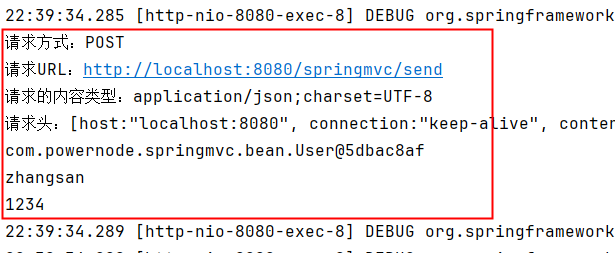

在实际的开发中，如果你需要获取更详细的请求协议中的信息。

可以使用`RequestEntity`

---

## 11.2. ResponseEntity

ResponseEntity不是注解，是一个类。用该类的实例可以封装响应协议，包括：状态行、响应头、响应体。

也就是说：如果你想定制属于自己的响应协议，可以使用该类。假如我要完成这样一个需求：前端提交一个id，后端根据id进行查询，如果返回null，请在前端显示404错误。如果返回不是null，则输出返回的user。

```
@Controller
public class UserController {

    @GetMapping("/users/{id}")
    public ResponseEntity<User> getUserById(@PathVariable Long id) {
        User user = userService.getUserById(id);
        if (user == null) {
            return ResponseEntity.status(HttpStatus.NOT_FOUND).body(null);
        } else {
            return ResponseEntity.ok(user);
        }
    }
}
```

测试：当用户不存在时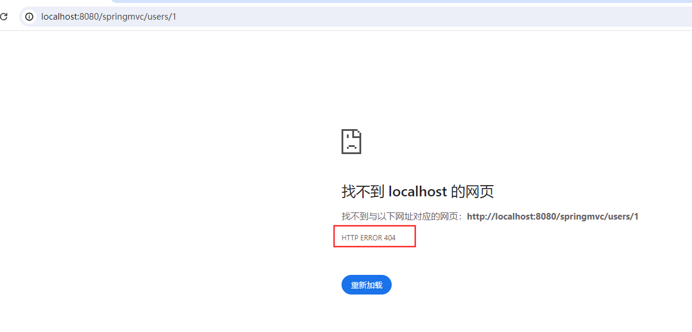

测试：当用户存在时  
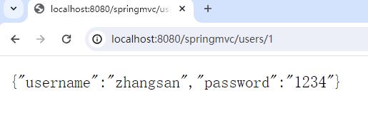

---

# 12. 文件上传与下载

## 12.1. 文件上传

使用SpringMVC6版本，**不需要**添加以下依赖：

```
<dependency>
  <groupId>commons-fileupload</groupId>
  <artifactId>commons-fileupload</artifactId>
  <version>1.5</version>
</dependency>
```

前端页面：

```
<!DOCTYPE html>
<html lang="en" xmlns:th="http://www.thymeleaf.org">
  <head>
    <meta charset="UTF-8">
    <title>文件上传</title>
  </head>
  <body>

    <!--文件上传表单-->
    <form th:action="@{/file/up}" method="post" enctype="multipart/form-data">
      文件：<input type="file" name="fileName"/><br>
      <input type="submit" value="上传">
    </form>

  </body>
</html>
```

重点是：form表单采用post请求，enctype是multipart/form-data，并且上传组件是：type="file"

**web.xml**文件：

```
<!--前端控制器-->
<servlet>
  <servlet-name>dispatcherServlet</servlet-name>
  <servlet-class>org.springframework.web.servlet.DispatcherServlet</servlet-class>
  
  <init-param>
    <param-name>contextConfigLocation</param-name>
    <param-value>classpath:springmvc.xml</param-value>
  </init-param>
  
  <load-on-startup>1</load-on-startup>
  
  <multipart-config>
    <!--设置单个支持最大文件的大小-->
    <max-file-size>102400</max-file-size>
    <!--设置整个表单所有文件上传的最大值-->
    <max-request-size>102400</max-request-size>
    <!--设置最小上传文件大小-->
    <file-size-threshold>0</file-size-threshold>
  </multipart-config>
  
</servlet>

<servlet-mapping>
  <servlet-name>dispatcherServlet</servlet-name>
  <url-pattern>/</url-pattern>
</servlet-mapping>
```

**重点：在DispatcherServlet配置时，添加 multipart-config 配置信息。（这是Spring6，如果是Spring5，则不是这样配置，而是在springmvc.xml文件中配置：CommonsMultipartResolver）SpringMVC6中把这个类已经删除了。废弃了。**

Controller中的代码：

```
package com.powernode.springmvc.controller;

import jakarta.servlet.http.HttpServletRequest;
import org.springframework.stereotype.Controller;
import org.springframework.web.bind.annotation.RequestMapping;
import org.springframework.web.bind.annotation.RequestMethod;
import org.springframework.web.bind.annotation.RequestParam;
import org.springframework.web.multipart.MultipartFile;

import java.io.*;
import java.util.UUID;

@Controller
public class FileController {

    @RequestMapping(value = "/file/up", method = RequestMethod.POST)
    public String fileUp(@RequestParam("fileName") MultipartFile multipartFile, HttpServletRequest request) throws IOException {
        String name = multipartFile.getName();
        System.out.println(name);
        // 获取文件名
        String originalFilename = multipartFile.getOriginalFilename();
        System.out.println(originalFilename);
        // 将文件存储到服务器中
        // 获取输入流
        InputStream in = multipartFile.getInputStream();
        // 获取上传之后的存放目录
        File file = new File(request.getServletContext().getRealPath("/upload"));
        // 如果服务器目录不存在则新建
        if(!file.exists()){
            file.mkdirs();
        }
        // 开始写
        //BufferedOutputStream out = new BufferedOutputStream(new FileOutputStream(file.getAbsolutePath() + "/" + originalFilename));
        // 可以采用UUID来生成文件名，防止服务器上传文件时产生覆盖
        BufferedOutputStream out = new BufferedOutputStream(new FileOutputStream(file.getAbsolutePath() + "/" + UUID.randomUUID().toString() + originalFilename.substring(originalFilename.lastIndexOf("."))));
        byte[] bytes = new byte[1024 * 100];
        int readCount = 0;
        while((readCount = in.read(bytes)) != -1){
            out.write(bytes,0,readCount);
        }
        // 刷新缓冲流
        out.flush();
        // 关闭流
        in.close();
        out.close();

        return "ok";
    }

}
```

---

最终测试结果：

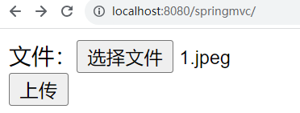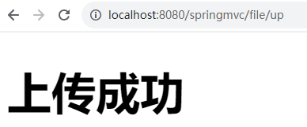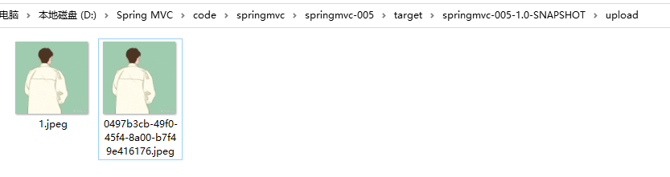

**建议：上传文件时，文件起名采用UUID。以防文件覆盖。**

---

## 12.2. 文件下载

```
<!--文件下载-->
<a th:href="@{/download}">文件下载</a>
```

文件下载核心程序，使用ResponseEntity：

```
@GetMapping("/download")
public ResponseEntity<byte[]> downloadFile(HttpServletResponse response, HttpServletRequest request) throws IOException {
    File file = new File(request.getServletContext().getRealPath("/upload") + "/1.jpeg");
    // 创建响应头对象
    HttpHeaders headers = new HttpHeaders();
    // 设置响应内容类型
    headers.setContentType(MediaType.APPLICATION_OCTET_STREAM);
    // 设置下载文件的名称
    headers.setContentDispositionFormData("attachment", file.getName());

    // 下载文件
    ResponseEntity<byte[]> entity = new ResponseEntity<byte[]>(Files.readAllBytes(file.toPath()), headers, HttpStatus.OK);
    return entity;
}
```

效果：

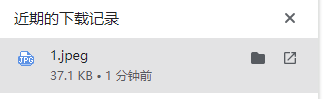

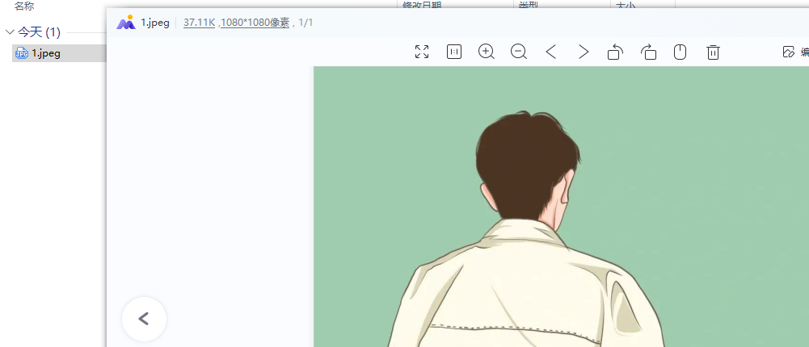

---

# 13. 异常处理

## 13.1. 什么是异常处理器

Spring MVC在`处理器方法`执行过程中出现了异常，可以采用`异常处理器`进行应对。一句话概括异常处理器作用：处理器方法执行过程中出现了异常，跳转到对应的视图，在视图上展示友好信息。

SpringMVC为异常处理提供了一个接口：**HandlerExceptionResolver**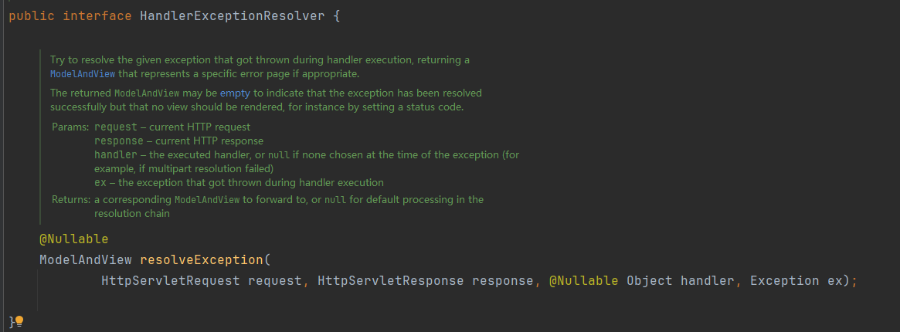核心方法是：**resolveException()**。该方法用来编写具体的异常处理方案。返回值ModelAndView，表示异常处理完之后跳转到哪个视图。

**HandlerExceptionResolver** 接口有两个常用的默认实现：

- **DefaultHandlerExceptionResolver**
- **SimpleMappingExceptionResolver**

---

## 13.2. 默认的异常处理器

DefaultHandlerExceptionResolver 是默认的异常处理器。核心方法：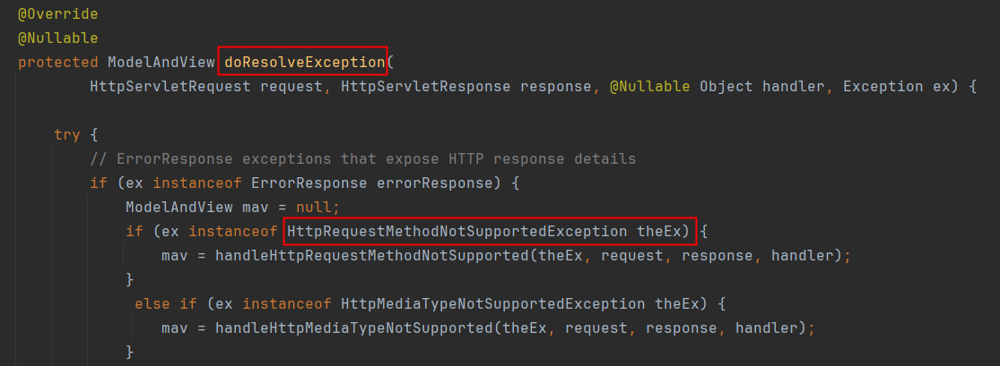当请求方式和处理方式不同时，DefaultHandlerExceptionResolver的默认处理态度是：

---

## 13.3. 自定义的异常处理器

自定义异常处理器需要使用：**SimpleMappingExceptionResolver**自定义异常处理机制有两种语法：

- 通过XML配置文件
- 通过注解

### 13.3.1. 配置文件方式

在 **springvc.xml** 文件中进行配置

```
<bean class="org.springframework.web.servlet.handler.SimpleMappingExceptionResolver">
  <property name="exceptionMappings">
    <props>
      <!-- 这里可以配置很多键值对，key是异常要提供具体的异常类型，包括包名 -->
      <!--用来指定出现异常后，跳转的视图tip.html-->
      <prop key="java.lang.Exception">tip</prop>
    </props>
  </property>
  <!--将异常信息存储到request域，value属性用来指定存储时的key。-->
  <!--底层会执行这样的代码，request.setAttribute("e",异常对象)  -->
  <property name="exceptionAttribute" value="e"/>
</bean>
```

在tip.html 视图页面上展示异常信息：

```
<!DOCTYPE html>
<html lang="en" xmlns:th="http://www.thymeleaf.org">
  <head>
    <meta charset="UTF-8">
    <title>出错了</title>
  </head>
  <body>
    <h1>出错了，请联系管理员！</h1>
    <div th:text="${e}"></div>
  </body>
</html>
```

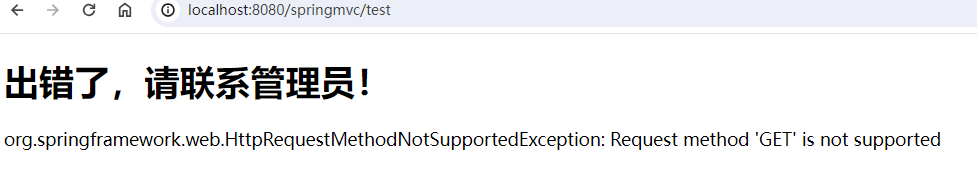

---

### 13.3.2. 注解方式

注意：使用注解方式需要将配置文件中代码注释

**@ControllerAdvice（@RestControllerAdvice）** 和**@ExceptionHandler**

```
@RestControllerAdvice
public class ProjectExceptionAdvice {

    @ExceptionHandler(Exception.class)
    public Result doException(Exception ex) {
        System.out.println("哈哈，异常被我处理了！");
        return new Result(666,null,"系统繁忙，请稍后再试！");
    }
}
```

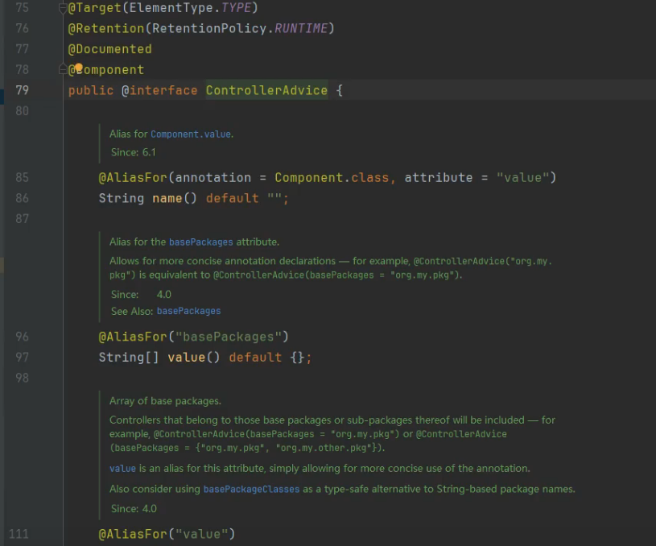

---

## 13.4. 项目异常处理方案

### 13.4.1. **项目异常分类**

- **业务异常（BusinessException）**

- 规范的用户行为产生的异常
- 不规范的用户行为操作产生的异常

- **系统异常（SystemException）**

- 项目运行过程中可预计且无法避免的异常

- **其他异常（Exception）**

- 编程人员未预期到的异常

---

**说明**：

- **业务异常**：通常由业务逻辑触发，如用户输入不符合规则、权限不足等，属于正常业务流程中的异常情况，建议进行友好提示或返回特定状态码。
- **系统异常**：如数据库连接失败、文件读取错误等，是系统层面的问题，可能影响服务稳定性，需记录日志并尝试恢复或降级处理。
- **其他异常**：指程序代码中未捕获或未预料到的异常，如空指针、类型转换错误等，属于开发缺陷，应通过测试和代码审查尽量避免。

✅ 合理分类异常有助于实现统一的异常处理机制（如全局异常处理器），提升系统健壮性和用户体验。

---

### 13.4.2. **项目异常处理方案**

- **业务异常（BusinessException）**

- ✦ 发送对应消息传递给用户，提醒规范操作

- **系统异常（SystemException）**

- ✦ 发送固定消息传递给用户，安抚用户
- ◆ 发送特定消息给运维人员，提醒维护
- ◆ 记录日志

- **其他异常（Exception）**

- ✦ 发送固定消息传递给用户，安抚用户
- ◆ 发送特定消息给编程人员，提醒维护（纳入预期范围内）
- ◆ 记录日志

---

# 14. 拦截器

**拦截器（Interceptor）类似于过滤器（Filter）**Spring MVC的拦截器作用是在请求到达控制器之前或之后进行拦截，可以对请求和响应进行一些特定的处理。拦截器可以用于很多场景下：

1. 登录验证：对于需要登录才能访问的网址，使用拦截器可以判断用户是否已登录，如果未登录则跳转到登录页面。
2. 权限校验：根据用户权限对部分网址进行访问控制，拒绝未经授权的用户访问。
3. 请求日志：记录请求信息，例如请求地址、请求参数、请求时间等，用于排查问题和性能优化。
4. 更改响应：可以对响应的内容进行修改，例如添加头信息、调整响应内容格式等。

拦截器和过滤器的区别在于它们的作用层面不同。

- 过滤器更注重在请求和响应的流程中进行处理，可以修改请求和响应的内容，例如设置编码和字符集、请求头、状态码等。
- 拦截器则更加侧重于对控制器进行前置或后置处理，在请求到达控制器之前或之后进行特定的操作，例如打印日志、权限验证等。

拦截器是 springMVC 里面的，过滤器是 Javaweb 规范里面的

**Filter、Servlet、Interceptor、Controller的执行顺序：**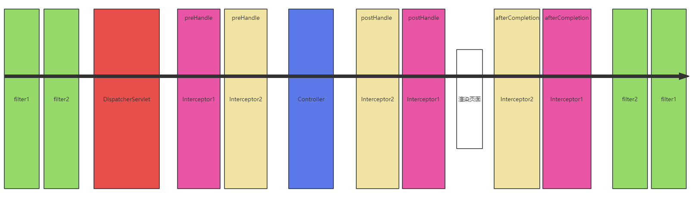

任何一个拦截器都有三个方法：

**preHandle()** **postHandle()** **afterCompletion()**

---

## 14.1. 拦截器的创建与基本配置

#### 14.1.1.1. 定义拦截器

实现`org.springframework.web.servlet.**HandlerInterceptor**` 接口，共有三个方法可以进行选择性的实现：

- preHandle：处理器方法调用之前执行

- **只有该方法有返回值，返回值是布尔类型，true放行，false拦截。**

- postHandle：处理器方法调用之后执行
- afterCompletion：渲染完成后执行

#### 14.1.1.2. 拦截器基本配置

在**springmvc.xml**文件中进行如下配置：第一种方式：

```
<mvc:interceptors>
  <bean class="com.powernode.springmvc.interceptors.Interceptor1"/>
</mvc:interceptors>
```

第二种方式：

```
<mvc:interceptors>
  <ref bean="interceptor1"/>
</mvc:interceptors>
```

第二种方式的前提：

- 前提1：包扫描

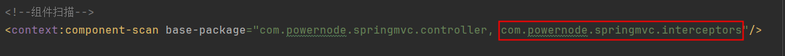

- 前提2：使用 @Component 注解进行标注

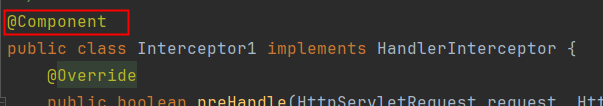

**注意：对于这种基本配置来说，拦截器是拦截所有请求的****。**

---

## 14.2. 拦截器部分源码分析

#### 14.2.1.1. 方法执行顺序的源码分析

```
public class DispatcherServlet extends FrameworkServlet {
    protected void doDispatch(HttpServletRequest request, HttpServletResponse response) throws Exception {
        // 调用所有拦截器的 preHandle 方法
        if (!mappedHandler.applyPreHandle(processedRequest, response)) {
            return;
        }
        // 调用处理器方法
        mv = ha.handle(processedRequest, response, mappedHandler.getHandler());
        // 调用所有拦截器的 postHandle 方法
        mappedHandler.applyPostHandle(processedRequest, response, mv);
        // 处理视图
        processDispatchResult(processedRequest, response, mappedHandler, mv, dispatchException);
    }

    private void processDispatchResult(HttpServletRequest request, HttpServletResponse response,
                                       @Nullable HandlerExecutionChain mappedHandler, @Nullable ModelAndView mv,
                                       @Nullable Exception exception) throws Exception {
        // 渲染页面
        render(mv, request, response);
        // 调用所有拦截器的 afterCompletion 方法
        mappedHandler.triggerAfterCompletion(request, response, null);
    }
}
```

#### 14.2.1.2. 拦截与放行的源码分析

```
public class DispatcherServlet extends FrameworkServlet {
    protected void doDispatch(HttpServletRequest request, HttpServletResponse response) throws Exception {
        // 调用所有拦截器的 preHandle 方法
        if (!mappedHandler.applyPreHandle(processedRequest, response)) {
            // 如果 mappedHandler.applyPreHandle(processedRequest, response) 返回false，以下的return语句就会执行
            return;
        }
    }
}
```

```
public class HandlerExecutionChain {
    boolean applyPreHandle(HttpServletRequest request, HttpServletResponse response) throws Exception {
        for (int i = 0; i < this.interceptorList.size(); i++) {
            HandlerInterceptor interceptor = this.interceptorList.get(i);
            if (!interceptor.preHandle(request, response, this.handler)) {
                triggerAfterCompletion(request, response, null);
                // 如果 interceptor.preHandle(request, response, this.handler) 返回 false，以下的 return false;就会执行。
                return false;
            }
            this.interceptorIndex = i;
        }
        return true;
    }
}
```

---

## 14.3. 拦截器的高级配置

采用以上基本配置方式，拦截器是拦截所有请求路径的。如果要针对某些路径进行拦截，某些路径不拦截，可以采用高级配置：

```
<mvc:interceptors>
  <mvc:interceptor>
    <!--拦截所有路径-->
    <mvc:mapping path="/**"/>
    <!--除 /test 路径之外-->
    <mvc:exclude-mapping path="/test"/>
    <!--拦截器-->
    <ref bean="interceptor1"/>
  </mvc:interceptor>
</mvc:interceptors>
```

以上的配置表示，除 /test 请求路径之外，剩下的路径全部拦截。

---

## 14.4. 拦截器的执行顺序

#### 14.4.1.1. 21.4.1 执行顺序

##### 14.4.1.1.1. 如果所有拦截器preHandle都返回true

按照springmvc.xml文件中配置的顺序，自上而下调用 preHandle：

```
<mvc:interceptors>
  <ref bean="interceptor1"/>
  <ref bean="interceptor2"/>
</mvc:interceptors>
```

执行顺序：

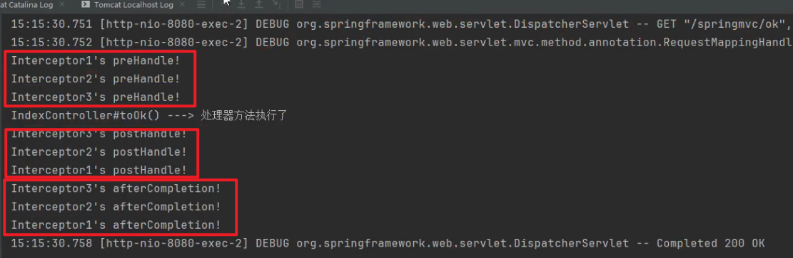

##### 如果其中一个拦截器preHandle返回false

```
<mvc:interceptors>
  <ref bean="interceptor1"/>
  <ref bean="interceptor2"/>
</mvc:interceptors>
```

如果`interceptor3`的preHandle返回false，执行顺序：

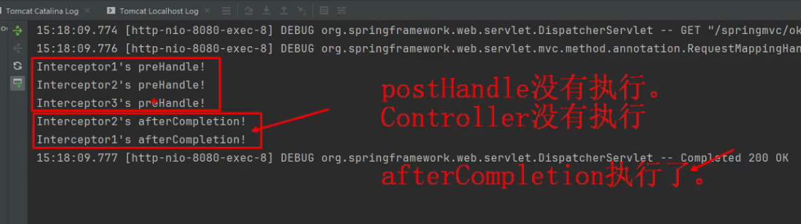

规则：只要有一个拦截器`preHandle`返回false，任何`postHandle`都不执行。但返回false的拦截器的前面的拦截器按照逆序执行`afterCompletion`。

---

#### 14.4.1.2. 21.4.2 源码分析

DispatcherServlet和 HandlerExecutionChain的部分源码：

```
public class DispatcherServlet extends FrameworkServlet {
    protected void doDispatch(HttpServletRequest request, HttpServletResponse response) throws Exception {
        // 按照顺序执行所有拦截器的preHandle方法
        if (!mappedHandler.applyPreHandle(processedRequest, response)) {
            return;
        }
        // 执行处理器方法
        mv = ha.handle(processedRequest, response, mappedHandler.getHandler());
        // 按照逆序执行所有拦截器的 postHanle 方法
        mappedHandler.applyPostHandle(processedRequest, response, mv);
        // 处理视图
        processDispatchResult(processedRequest, response, mappedHandler, mv, dispatchException);
    }

    private void processDispatchResult(HttpServletRequest request, HttpServletResponse response,
                                       @Nullable HandlerExecutionChain mappedHandler, @Nullable ModelAndView mv,
                                       @Nullable Exception exception) throws Exception {
        // 渲染视图
        render(mv, request, response);
        // 按照逆序执行所有拦截器的 afterCompletion 方法
        mappedHandler.triggerAfterCompletion(request, response, null);
    }
}
```

```
public class HandlerExecutionChain {
    // 顺序执行 preHandle
    boolean applyPreHandle(HttpServletRequest request, HttpServletResponse response) throws Exception {
        for (int i = 0; i < this.interceptorList.size(); i++) {
            HandlerInterceptor interceptor = this.interceptorList.get(i);
            if (!interceptor.preHandle(request, response, this.handler)) {
                // 如果其中一个拦截器preHandle返回false
                // 将该拦截器前面的拦截器按照逆序执行所有的afterCompletion
                triggerAfterCompletion(request, response, null);
                return false;
            }
            this.interceptorIndex = i;
        }
        return true;
    }
    // 逆序执行 postHanle
    void applyPostHandle(HttpServletRequest request, HttpServletResponse response, @Nullable ModelAndView mv) throws Exception {
        for (int i = this.interceptorList.size() - 1; i >= 0; i--) {
            HandlerInterceptor interceptor = this.interceptorList.get(i);
            interceptor.postHandle(request, response, this.handler, mv);
        }
    }
    // 逆序执行 afterCompletion
    void triggerAfterCompletion(HttpServletRequest request, HttpServletResponse response, @Nullable Exception ex) {
        for (int i = this.interceptorIndex; i >= 0; i--) {
            HandlerInterceptor interceptor = this.interceptorList.get(i);
            try {
                interceptor.afterCompletion(request, response, this.handler, ex);
            }
            catch (Throwable ex2) {
                logger.error("HandlerInterceptor.afterCompletion threw exception", ex2);
            }
        }
    }
}
```

---

# 15. 执行流程

## 15.1. 从源码角度看执行流程

以下是核心代码：

```
public class DispatcherServlet extends FrameworkServlet {
    protected void doDispatch(HttpServletRequest request, HttpServletResponse response) throws Exception {
        // 根据请求对象request获取
        // 这个对象是在每次发送请求时都创建一个，是请求级别的
        // 该对象中描述了本次请求应该执行的拦截器是哪些，顺序是怎样的，要执行的处理器是哪个
        HandlerExecutionChain mappedHandler = getHandler(processedRequest);

        // 根据处理器获取处理器适配器。（底层使用了适配器模式）
        // HandlerAdapter在web服务器启动的时候就创建好了。（启动时创建多个HandlerAdapter放在List集合中）
        // HandlerAdapter有多种类型：
        // RequestMappingHandlerAdapter：用于适配使用注解 @RequestMapping 标记的控制器方法
        // SimpleControllerHandlerAdapter：用于适配实现了 Controller 接口的控制器
        // 注意：此时还没有进行数据绑定（也就是说，表单提交的数据，此时还没有转换为pojo对象。）
        HandlerAdapter ha = getHandlerAdapter(mappedHandler.getHandler());

        // 执行请求对应的所有拦截器中的 preHandle 方法
        if (!mappedHandler.applyPreHandle(processedRequest, response)) {
            return;
        }

        // 通过处理器适配器调用处理器方法
        // 在调用处理器方法之前会进行数据绑定，将表单提交的数据绑定到处理器方法上。（底层是通过WebDataBinder完成的）
        // 在数据绑定的过程中会使用到消息转换器：HttpMessageConverter
        // 结束后返回ModelAndView对象
        mv = ha.handle(processedRequest, response, mappedHandler.getHandler());

        //  执行请求对应的所有拦截器中的 postHandle 方法
        mappedHandler.applyPostHandle(processedRequest, response, mv);

        // 处理分发结果（在这个方法中完成了响应）
        processDispatchResult(processedRequest, response, mappedHandler, mv, dispatchException);
    }

    // 根据每一次的请求对象来获取处理器执行链对象
    protected HandlerExecutionChain getHandler(HttpServletRequest request) throws Exception {
        if (this.handlerMappings != null) {
            // HandlerMapping在服务器启动的时候就创建好了，放到了List集合中。HandlerMapping也有多种类型
            // RequestMappingHandlerMapping：将 URL 映射到使用注解 @RequestMapping 标记的控制器方法的处理器。
            // SimpleUrlHandlerMapping：将 URL 映射到处理器中指定的 URL 或 URL 模式的处理器。
            for (HandlerMapping mapping : this.handlerMappings) {
                // 重点：这是一次请求的开始，实际上是通过处理器映射器来获取的处理器执行链对象
                // 底层实际上会通过 HandlerMapping 对象获取 HandlerMethod对象，将HandlerMethod 对象传递给 HandlerExecutionChain对象。
                // 注意：HandlerMapping对象和HandlerMethod对象都是在服务器启动阶段创建的。
                // RequestMappingHandlerMapping对象中有多个HandlerMethod对象。
                HandlerExecutionChain handler = mapping.getHandler(request);
                if (handler != null) {
                    return handler;
                }
            }
        }
        return null;
    }

    private void processDispatchResult(HttpServletRequest request, HttpServletResponse response,
                                       @Nullable HandlerExecutionChain mappedHandler, @Nullable ModelAndView mv,
                                       @Nullable Exception exception) throws Exception {
        // 渲染
        render(mv, request, response);
        // 渲染完毕后，调用该请求对应的所有拦截器的 afterCompletion方法。
        mappedHandler.triggerAfterCompletion(request, response, null);
    }

    protected void render(ModelAndView mv, HttpServletRequest request, HttpServletResponse response) throws Exception {
        // 通过视图解析器返回视图对象
        view = resolveViewName(viewName, mv.getModelInternal(), locale, request);
        // 真正的渲染视图
        view.render(mv.getModelInternal(), request, response);
    }

    protected View resolveViewName(String viewName, @Nullable Map<String, Object> model,
            Locale locale, HttpServletRequest request) throws Exception {
        // 通过视图解析器返回视图对象
        View view = viewResolver.resolveViewName(viewName, locale);
    }
}
```

```
public interface ViewResolver {
    View resolveViewName(String viewName, Locale locale) throws Exception;
}
```

```
public interface View {
    void render(@Nullable Map<String, ?> model, HttpServletRequest request, HttpServletResponse response)
    throws Exception;
}
```

---

## 15.2. 从图片角度看执行流程

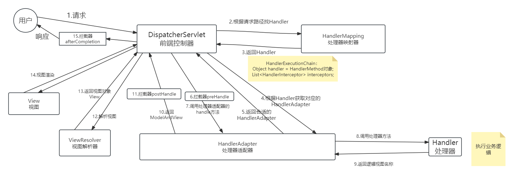

---

## 15.3. 24.WEB服务器启动时都做了什么

先搞明白核心类的继承关系：DispatcherServlet extends FrameworkServlet extends HttpServletBean extends HttpServlet extends GenericServlet implements Servlet

服务器启动阶段完成了：

1. 初始化Spring上下文，也就是创建所有的bean，让IoC容器将其管理起来。
2. 初始化SpringMVC相关的对象：处理器映射器，处理器适配器等。。。

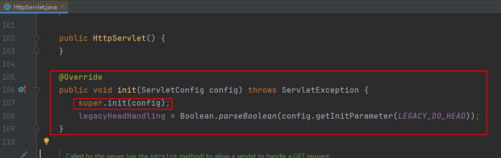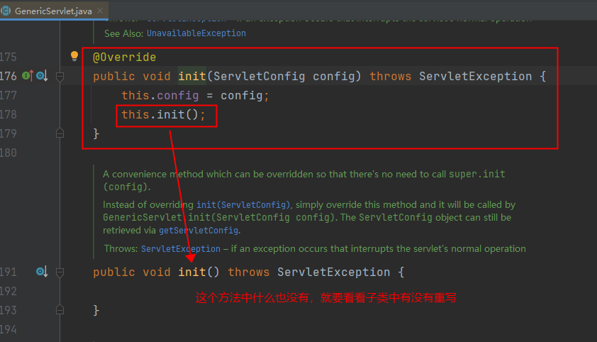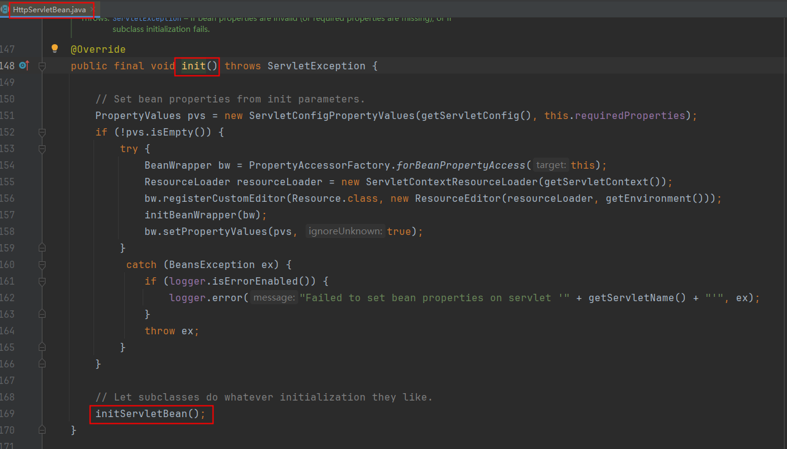

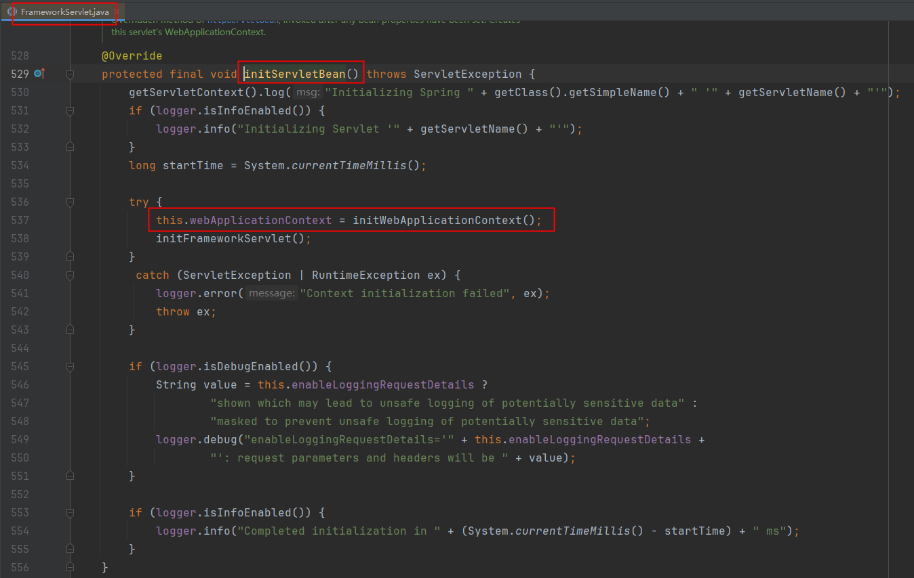

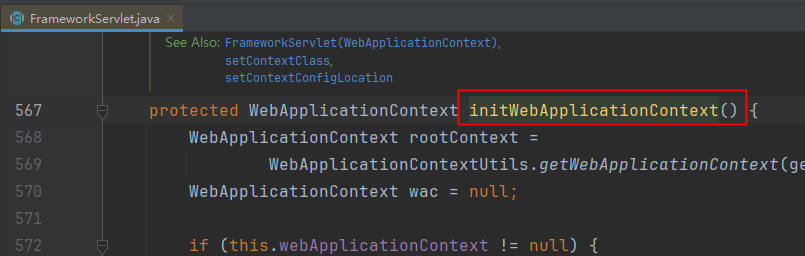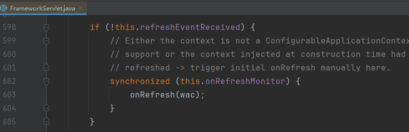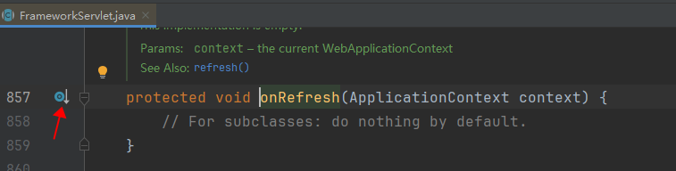

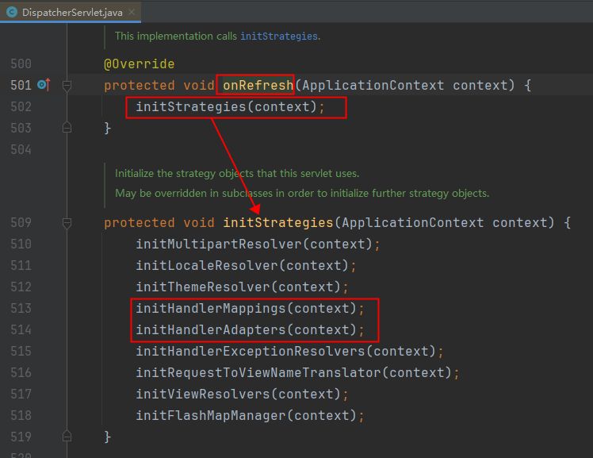

---

# 16. 手写 SpringMVC 框架

---

# 17. 全注解开发

## 17.1. web.xml文件的替代

#### 17.1.1.1. Servlet3.0新特性

Servlet3.0新特性：web.xml文件可以不写了。在Servlet3.0的时候，规范中提供了一个接口：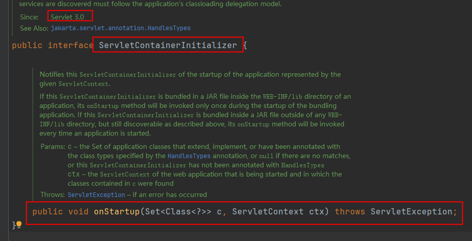

服务器在启动的时候会自动从容器中找 `ServletContainerInitializer`接口的实现类，自动调用它的`onStartup`方法来完成Servlet上下文的初始化。

在Spring3.1版本的时候，提供了这样一个类，实现以上的接口：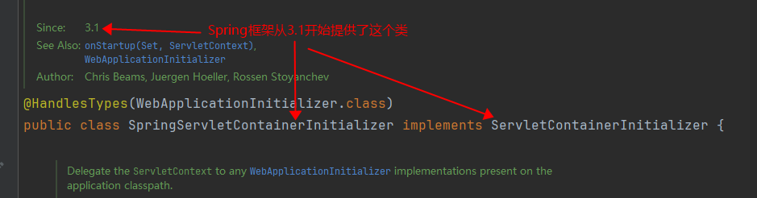

它的核心方法如下：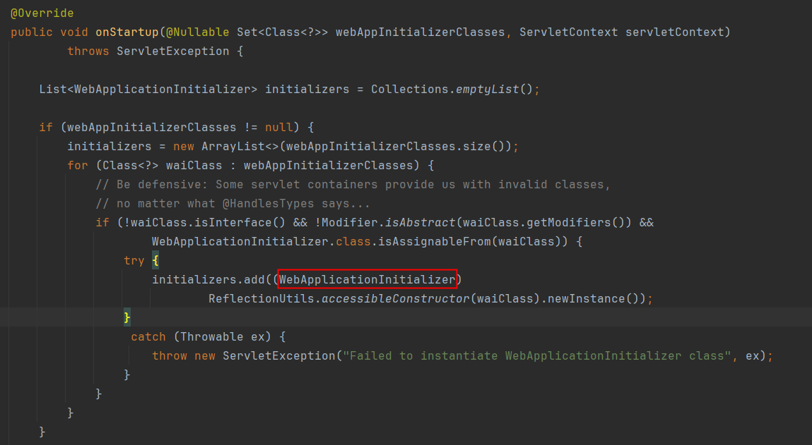

可以看到在服务器启动的时候，它会去加载所有实现`WebApplicationInitializer`接口的类：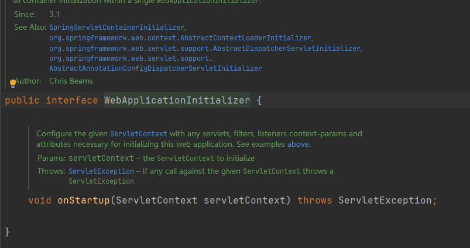这个接口下有一个子类是我们需要的：`AbstractAnnotationConfigDispatcherServletInitializer`

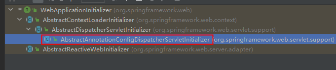当我们编写类继承`AbstractAnnotationConfigDispatcherServletInitializer`之后，web服务器在启动的时候会根据它来初始化Servlet上下文。

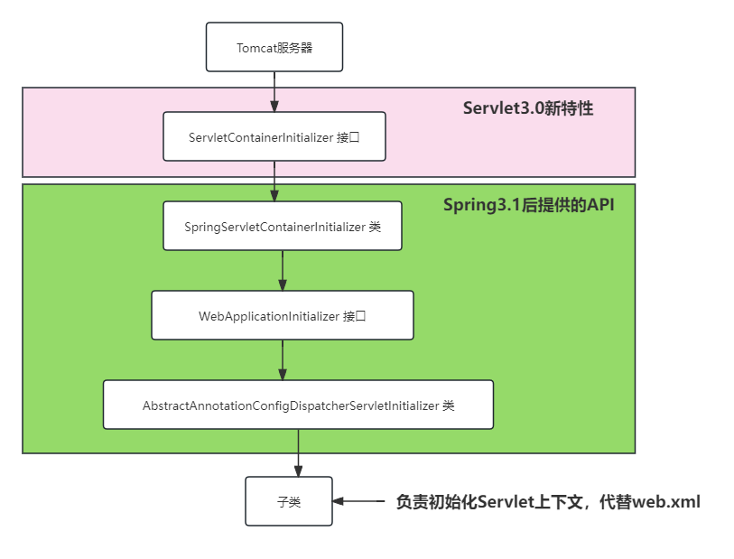

#### 17.1.1.2. 编写WebAppInitializer

以下这个类就是用来代替web.xml文件的：

```
package com.powernode.springmvc.config;

import jakarta.servlet.Filter;
import org.springframework.web.filter.CharacterEncodingFilter;
import org.springframework.web.filter.HiddenHttpMethodFilter;
import org.springframework.web.servlet.support.AbstractAnnotationConfigDispatcherServletInitializer;

/**
 * ClassName: WebAppInitializer
 * Description:
 * Datetime: 2024/3/29 16:50
 * Author: 老杜@动力节点
 * Version: 1.0
 */
public class WebAppInitializer extends AbstractAnnotationConfigDispatcherServletInitializer {
    /**
     * Spring的配置
     * @return
     */
    @Override
    protected Class<?>[] getRootConfigClasses() {
        return new Class[]{SpringConfig.class};
    }

    /**
     * SpringMVC的配置
     * @return
     */
    @Override
    protected Class<?>[] getServletConfigClasses() {
        return new Class[]{SpringMVCConfig.class};
    }

    /**
     * 用于配置 DispatcherServlet 的映射路径
     * @return
     */
    @Override
    protected String[] getServletMappings() {
        return new String[]{"/"};
    }

    /**
     * 配置过滤器
     * @return
     */
    @Override
    protected Filter[] getServletFilters() {
        CharacterEncodingFilter characterEncodingFilter = new CharacterEncodingFilter();
        characterEncodingFilter.setEncoding("UTF-8");
        characterEncodingFilter.setForceRequestEncoding(true);
        characterEncodingFilter.setForceResponseEncoding(true);
        HiddenHttpMethodFilter hiddenHttpMethodFilter = new HiddenHttpMethodFilter();
        return new Filter[]{characterEncodingFilter, hiddenHttpMethodFilter};
    }
}
```

Spring配置如下：

```
package com.powernode.springmvc.config;

import org.springframework.context.annotation.Configuration;

/**
 * ClassName: SpringConfig
 * Description:
 * Datetime: 2024/3/29 17:03
 * Author: 老杜@动力节点
 * Version: 1.0
 */
@Configuration // 使用该注解指定这是一个配置类
public class SpringConfig {
}
```

SpringMVC配置如下：

```
package com.powernode.springmvc.config;

import org.springframework.context.annotation.Configuration;

/**
 * ClassName: SpringMVCConfig
 * Description:
 * Datetime: 2024/3/29 17:03
 * Author: 老杜@动力节点
 * Version: 1.0
 */
@Configuration
public class SpringMVCConfig {
}
```

---

## 17.2. Spring MVC的配置

#### 17.2.1.1. 组件扫描

```
// 指定该类是一个配置类，可以当配置文件使用
@Configuration
// 开启组件扫描
@ComponentScan("com.powernode.springmvc.controller")
public class SpringMVCConfig {
}
```

#### 17.2.1.2. 开启注解驱动

```
// 指定该类是一个配置类，可以当配置文件使用
@Configuration
// 开启组件扫描
@ComponentScan("com.powernode.springmvc.controller")
// 开启注解驱动
@EnableWebMvc
public class SpringMVCConfig {
}
```

#### 视图解析器

```
// 指定该类是一个配置类，可以当配置文件使用
@Configuration
// 开启组件扫描
@ComponentScan("com.powernode.springmvc.controller")
// 开启注解驱动
@EnableWebMvc
public class SpringMVCConfig {

    @Bean
    public ThymeleafViewResolver getViewResolver(SpringTemplateEngine springTemplateEngine) {
        ThymeleafViewResolver resolver = new ThymeleafViewResolver();
        resolver.setTemplateEngine(springTemplateEngine);
        resolver.setCharacterEncoding("UTF-8");
        resolver.setOrder(1);
        return resolver;
    }

    @Bean
    public SpringTemplateEngine templateEngine(ITemplateResolver iTemplateResolver) {
        SpringTemplateEngine templateEngine = new SpringTemplateEngine();
        templateEngine.setTemplateResolver(iTemplateResolver);
        return templateEngine;
    }

    @Bean
    public ITemplateResolver templateResolver(ApplicationContext applicationContext) {
        SpringResourceTemplateResolver resolver = new SpringResourceTemplateResolver();
        resolver.setApplicationContext(applicationContext);
        resolver.setPrefix("/WEB-INF/thymeleaf/");
        resolver.setSuffix(".html");
        resolver.setTemplateMode(TemplateMode.HTML);
        resolver.setCharacterEncoding("UTF-8");
        resolver.setCacheable(false);//开发时关闭缓存，改动即可生效
        return resolver;
    }
}
```

#### 开启默认Servlet处理

让SpringMVCConfig类实现这个接口：`WebMvcConfigurer`并且重写以下的方法：

```
@Override
public void configureDefaultServletHandling(DefaultServletHandlerConfigurer configurer) {
configurer.enable();
}
```

#### view-controller

重写以下方法：

```
@Override
public void addViewControllers(ViewControllerRegistry registry) {
registry.addViewController("/test").setViewName("test");
}
```

#### 异常处理器

重写以下方法：

```
@Override
public void configureHandlerExceptionResolvers(List<HandlerExceptionResolver> resolvers) {
    SimpleMappingExceptionResolver resolver = new SimpleMappingExceptionResolver();
    Properties prop = new Properties();
    prop.setProperty("java.lang.Exception", "tip");
    resolver.setExceptionMappings(prop);
    resolver.setExceptionAttribute("yiChang");
    resolvers.add(resolver);
}
```

#### 拦截器

重写以下方法：

```
@Override
public void addInterceptors(InterceptorRegistry registry) {
MyInterceptor myInterceptor = new MyInterceptor();
registry.addInterceptor(myInterceptor).addPathPatterns("/**").excludePathPatterns("/test");
}
```

---

# 18. SSM 整合

## 18.1. 引入相关依赖

```
<?xml version="1.0" encoding="UTF-8"?>
<project xmlns="http://maven.apache.org/POM/4.0.0"
  xmlns:xsi="http://www.w3.org/2001/XMLSchema-instance"
  xsi:schemaLocation="http://maven.apache.org/POM/4.0.0 http://maven.apache.org/xsd/maven-4.0.0.xsd">
  <modelVersion>4.0.0</modelVersion>

  <groupId>com.powernode</groupId>
  <artifactId>ssmtest</artifactId>
  <version>1.0-SNAPSHOT</version>
  <packaging>war</packaging>

  <dependencies>
    <!--springmvc-->
    <dependency>
      <groupId>org.springframework</groupId>
      <artifactId>spring-webmvc</artifactId>
      <version>6.1.4</version>
    </dependency>
    <!--spring jdbc-->
    <dependency>
      <groupId>org.springframework</groupId>
      <artifactId>spring-jdbc</artifactId>
      <version>6.1.4</version>
    </dependency>
    <!--mybatis-->
    <dependency>
      <groupId>org.mybatis</groupId>
      <artifactId>mybatis</artifactId>
      <version>3.5.15</version>
    </dependency>
    <!--mybatis spring-->
    <dependency>
      <groupId>org.mybatis</groupId>
      <artifactId>mybatis-spring</artifactId>
      <version>3.0.3</version>
    </dependency>
    <!--mysql驱动-->
    <dependency>
      <groupId>com.mysql</groupId>
      <artifactId>mysql-connector-j</artifactId>
      <version>8.3.0</version>
    </dependency>
    <!--德鲁伊连接池-->
    <dependency>
      <groupId>com.alibaba</groupId>
      <artifactId>druid</artifactId>
      <version>1.2.22</version>
    </dependency>
    <!--jackson-->
    <dependency>
      <groupId>com.fasterxml.jackson.core</groupId>
      <artifactId>jackson-databind</artifactId>
      <version>2.17.0</version>
    </dependency>
    <!--servlet api-->
    <dependency>
      <groupId>jakarta.servlet</groupId>
      <artifactId>jakarta.servlet-api</artifactId>
      <version>6.0.0</version>
      <scope>provided</scope>
    </dependency>
    <!--logback-->
    <dependency>
      <groupId>ch.qos.logback</groupId>
      <artifactId>logback-classic</artifactId>
      <version>1.5.3</version>
    </dependency>
    <!--thymeleaf和spring6的整合依赖-->
    <dependency>
      <groupId>org.thymeleaf</groupId>
      <artifactId>thymeleaf-spring6</artifactId>
      <version>3.1.2.RELEASE</version>
    </dependency>
  </dependencies>

  <properties>
    <maven.compiler.source>21</maven.compiler.source>
    <maven.compiler.target>21</maven.compiler.target>
    <project.build.sourceEncoding>UTF-8</project.build.sourceEncoding>
  </properties>

</project>
```

### 18.1.1. 创建包结构

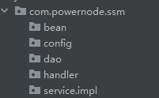

### 18.1.2. 创建webapp目录

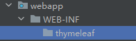

### Spring整合MyBatis

#### 编写jdbc.properties

在类根路径下创建属性配置文件，配置连接数据库的信息：jdbc.properties

```
jdbc.driver=com.mysql.cj.jdbc.Driver
jdbc.url=jdbc:mysql://localhost:3306/powernode?useUnicode=true&serverTimezone=Asia/Shanghai&useSSL=true&characterEncoding=utf-8
jdbc.username=root
jdbc.password=1234
```

#### 编写DataSourceConfig

```
package com.powernode.ssm.config;

import com.alibaba.druid.pool.DruidDataSource;
import org.springframework.beans.factory.annotation.Value;
import org.springframework.context.annotation.Bean;

import javax.sql.DataSource;

/**
 * ClassName: DataSourceConfig
 * Description:
 * Datetime: 2024/4/1 14:25
 * Author: 老杜@动力节点
 * Version: 1.0
 */
public class DataSourceConfig {

    @Value("${jdbc.driver}")
    private String driver;

    @Value("${jdbc.url}")
    private String url;

    @Value("${jdbc.username}")
    private String username;

    @Value("${jdbc.password}")
    private String password;

    @Bean
    public DataSource dataSource(){
        DruidDataSource dataSource = new DruidDataSource();
        dataSource.setDriverClassName(driver);
        dataSource.setUrl(url);
        dataSource.setUsername(username);
        dataSource.setPassword(password);
        return dataSource;
    }
}
```

#### 编写MyBatisConfig

```
package com.powernode.ssm.config;

import org.mybatis.spring.SqlSessionFactoryBean;
import org.mybatis.spring.mapper.MapperScannerConfigurer;
import org.springframework.context.annotation.Bean;

import javax.sql.DataSource;


public class MyBatisConfig {

    @Bean
    public SqlSessionFactoryBean sqlSessionFactory(DataSource dataSource){
        SqlSessionFactoryBean sqlSessionFactoryBean = new SqlSessionFactoryBean();
        sqlSessionFactoryBean.setDataSource(dataSource);
        sqlSessionFactoryBean.setTypeAliasesPackage("com.powernode.ssm.bean");
        return sqlSessionFactoryBean;
    }

    @Bean
    public MapperScannerConfigurer mapperScannerConfigurer(){
        MapperScannerConfigurer msc = new MapperScannerConfigurer();
        msc.setBasePackage("com.powernode.ssm.dao");
        return msc;
    }

}
```

#### 编写SpringConfig

```
package com.powernode.ssm.config;

import org.springframework.context.annotation.ComponentScan;
import org.springframework.context.annotation.Configuration;
import org.springframework.context.annotation.Import;
import org.springframework.context.annotation.PropertySource;

@Configuration
@ComponentScan({"com.powernode.ssm.service"})
@PropertySource("classpath:jdbc.properties")
@Import({DataSourceConfig.class, MyBatisConfig.class})
public class SpringConfig {
}
```

### Spring整合Spring MVC

#### 编写WebAppInitializer（web.xml）

```
package com.powernode.ssm.config;

import jakarta.servlet.Filter;
import org.springframework.context.annotation.Configuration;
import org.springframework.web.filter.CharacterEncodingFilter;
import org.springframework.web.filter.HiddenHttpMethodFilter;
import org.springframework.web.servlet.support.AbstractAnnotationConfigDispatcherServletInitializer;


public class WebAppInitializer extends AbstractAnnotationConfigDispatcherServletInitializer {
    /**
     * Spring的配置
     * @return
     */
    @Override
    protected Class<?>[] getRootConfigClasses() {
        return new Class[]{SpringConfig.class};
    }

    /**
     * SpringMVC的配置
     * @return
     */
    @Override
    protected Class<?>[] getServletConfigClasses() {
        return new Class[]{SpringMvcConfig.class};
    }

    /**
     * 用来配置DispatcherServlet的 <url-pattern>
     * @return
     */
    @Override
    protected String[] getServletMappings() {
        return new String[]{"/"};
    }

    /**
     * 配置过滤器
     * @return
     */
    @Override
    protected Filter[] getServletFilters() {
        // 配置字符编码过滤器
        CharacterEncodingFilter characterEncodingFilter = new CharacterEncodingFilter();
        characterEncodingFilter.setEncoding("UTF-8");
        characterEncodingFilter.setForceResponseEncoding(true);
        characterEncodingFilter.setForceRequestEncoding(true);
        // 配置HiddenHttpMethodFilter
        HiddenHttpMethodFilter hiddenHttpMethodFilter = new HiddenHttpMethodFilter();
        return new Filter[]{characterEncodingFilter, hiddenHttpMethodFilter};
    }
}
```

#### 编写SpringMvcConfig

```
package com.powernode.ssm.config;

import org.springframework.context.ApplicationContext;
import org.springframework.context.annotation.Bean;
import org.springframework.context.annotation.ComponentScan;
import org.springframework.context.annotation.Configuration;
import org.springframework.web.servlet.HandlerExceptionResolver;
import org.springframework.web.servlet.config.annotation.*;
import org.thymeleaf.spring6.SpringTemplateEngine;
import org.thymeleaf.spring6.templateresolver.SpringResourceTemplateResolver;
import org.thymeleaf.spring6.view.ThymeleafViewResolver;
import org.thymeleaf.templatemode.TemplateMode;
import org.thymeleaf.templateresolver.ITemplateResolver;

import java.util.List;


@Configuration
@ComponentScan("com.powernode.ssm.handler")
@EnableWebMvc
public class SpringMvcConfig implements WebMvcConfigurer {

    // 以下三个方法合并起来就是开启视图解析器
    @Bean
    public ThymeleafViewResolver getViewResolver(SpringTemplateEngine springTemplateEngine) {
        ThymeleafViewResolver resolver = new ThymeleafViewResolver();
        resolver.setTemplateEngine(springTemplateEngine);
        resolver.setCharacterEncoding("UTF-8");
        resolver.setOrder(1);
        return resolver;
    }

    @Bean
    public SpringTemplateEngine templateEngine(ITemplateResolver iTemplateResolver) {
        SpringTemplateEngine templateEngine = new SpringTemplateEngine();
        templateEngine.setTemplateResolver(iTemplateResolver);
        return templateEngine;
    }

    @Bean
    public ITemplateResolver templateResolver(ApplicationContext applicationContext) {
        SpringResourceTemplateResolver resolver = new SpringResourceTemplateResolver();
        resolver.setApplicationContext(applicationContext);
        resolver.setPrefix("/WEB-INF/thymeleaf/");
        resolver.setSuffix(".html");
        resolver.setTemplateMode(TemplateMode.HTML);
        resolver.setCharacterEncoding("UTF-8");
        resolver.setCacheable(false);//开发时关闭缓存，改动即可生效
        return resolver;
    }

    // 开启静态资源处理，开启默认的Servlet处理
    @Override
    public void configureDefaultServletHandling(DefaultServletHandlerConfigurer configurer) {
        configurer.enable();
    }

    // 视图控制器
    @Override
    public void addViewControllers(ViewControllerRegistry registry) {}
    // 配置异常处理器
    @Override
    public void configureHandlerExceptionResolvers(List<HandlerExceptionResolver> resolvers) {}

    // 配置拦截器
    @Override
    public void addInterceptors(InterceptorRegistry registry) {}
}
```

#### 添加事务控制

第一步：在SpringConfig中开启事务管理器

```
@EnableTransactionManagement
public class SpringConfig {
}
```

第二步：在DataSourceConfig中添加事务管理器对象

```
@Bean
public PlatformTransactionManager platformTransactionManager(DataSource dataSource){
DataSourceTransactionManager dataSourceTransactionManager = new DataSourceTransactionManager();
dataSourceTransactionManager.setDataSource(dataSource);
return dataSourceTransactionManager;
}
```

第三步：在service类上添加如下注解：

```
@Transactional
public class UserService {}
```

### 实现功能测试ssm整合

#### 数据库表

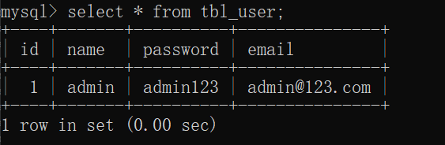

#### pojo类编写

```
package com.powernode.ssm.bean;


public class User {
    private Long id;
    private String name;
    private String password;
    private String email;

    @Override
    public String toString() {
        return "User{" +
        "id=" + id +
        ", name='" + name + '\'' +
        ", password='" + password + '\'' +
        ", email='" + email + '\'' +
        '}';
    }

    public User() {
    }

    public User(Long id, String name, String password, String email) {
        this.id = id;
        this.name = name;
        this.password = password;
        this.email = email;
    }

    public Long getId() {
        return id;
    }

    public void setId(Long id) {
        this.id = id;
    }

    public String getName() {
        return name;
    }

    public void setName(String name) {
        this.name = name;
    }

    public String getPassword() {
        return password;
    }

    public void setPassword(String password) {
        this.password = password;
    }

    public String getEmail() {
        return email;
    }

    public void setEmail(String email) {
        this.email = email;
    }
}
```

#### dao编写

```
package com.powernode.ssm.dao;

import com.powernode.ssm.bean.User;
import org.apache.ibatis.annotations.Select;

public interface UserDao {

    @Select("select * from tbl_user where id = #{id}")
    User selectById(Long id);

}
```

#### service编写

```
package com.powernode.ssm.service;

import com.powernode.ssm.bean.User;


public interface UserService {

    /**
     * 根据id获取用户信息
     * @param id
     * @return
     */
    User getById(Long id);

}
```

```
package com.powernode.ssm.service.impl;

import com.powernode.ssm.bean.User;
import com.powernode.ssm.dao.UserDao;
import com.powernode.ssm.service.UserService;
import org.springframework.beans.factory.annotation.Autowired;
import org.springframework.stereotype.Service;

@Service
public class UserServiceImpl implements UserService {

    @Autowired
    private UserDao userDao;

    @Override
    public User getById(Long id) {
        return userDao.selectById(id);
    }
}
```

#### handler编写

```
package com.powernode.ssm.handler;

import com.powernode.ssm.bean.User;
import com.powernode.ssm.service.UserService;
import org.springframework.beans.factory.annotation.Autowired;
import org.springframework.web.bind.annotation.GetMapping;
import org.springframework.web.bind.annotation.PathVariable;
import org.springframework.web.bind.annotation.RequestMapping;
import org.springframework.web.bind.annotation.RestController;


@RestController
@RequestMapping("/users")
public class UserHandler {

    @Autowired
    private UserService userService;

    @GetMapping("/{id}")
    public User detail(@PathVariable("id") Long id){
        return userService.getById(id);
    }
}
```

### 前端发送ajax

#### 引入js文件

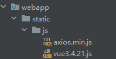

#### 开启静态资源处理

```
@Override
public void configureDefaultServletHandling(DefaultServletHandlerConfigurer configurer) {
configurer.enable();
}
```

#### 视图控制器

```
public void addViewControllers(ViewControllerRegistry registry) {
registry.addViewController("/").setViewName("index");
}
```

#### 编写ajax

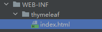

```
<!DOCTYPE html>
<html lang="en" xmlns:th="http://www.thymeleaf.org">
  <head>
    <meta charset="UTF-8">
    <title>ssm整合</title>
    <!--引入vue-->
    <script th:src="@{/static/js/vue3.4.21.js}"></script>
    <!--引入axios-->
    <script th:src="@{/static/js/axios.min.js}"></script>
  </head>
  <body>
    <div id="app">
      <button @click="getMessage">查看id=1的用户信息</button>
      <h1>{{message}}</h1>
    </div>
    <script th:inline="javascript">
      Vue.createApp({
        data(){
          return {
            message : ''
          }
        },
        methods : {
          async getMessage(){
            let response = await axios.get([[@{/}]] + 'users/1')
            this.message = response.data
          }
        }
      }).mount("#app")
    </script>
  </body>
</html>
```

测试结果：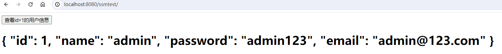

---

2025年12月15日结束了 SpringMVC 课程

# 2. 什么是 SpringMVC？

### 2.1SpringMVC 概述

SpringMVC 是一个实现了 MVC 架构模式的 Web 框架，底层基于 **Servlet** 实现

SpringMVC 是 spring 框架的一部分


---

### 2.2SpringMVC 帮我们做了什么？

与传统的 Servlet 有什么区别？

1. 入口控制：SpringMVC 框架通过 **DispatcherServlet** 作为入口控制器，负责**接收请求**和**分发请求**。

而在 Servlet 开发中，需要自己编写 Servlet 程序，并在 web.xml 中进行配置，才能接受和处理请求。

2. 在 SpringMVC 中，表单提交时可以自动将表单数据绑定到相应的 JavaBean 对象中，只需要在控制器方法的参数列表中声明该 JavaBean 对象即可，无需手动获取和赋值表单数据。

而在纯粹的 Servlet 开发中，这些都是需要自己手动完成的。

3. IoC 容器：SpringMVC 框架通过 IoC 容器管理对象，只需要在配置文件中进行相应的配置即可获取实例对象，

而在 Servlet 开发中需要手动创建对象实例。

4. 统一处理请求：SpringMVC 框架提供了拦截器、异常处理等统一处理请求的机制，并且可以灵活地配置这些处理器。

而在 Servlet 开发中，需要自行编写过滤器、异常处理器等，增加了代码的复杂度和开发难度。

5. 视图解析：SpringMVC 框架提供了多种视图模板，如 JSP、Freemarker、Velocity 等，并且支持国际化、主题等特性。

而在 Servlet 开发中需要手动处理视图层，增加了代码的复杂度。

与 Servlet 开发相比，SpringMVC 框架可以帮我们节省很多时间和精力，减少代码的复杂度，更加专注于业务开发。同时，也提供了更多的功能和扩展性，可以更好地满足企业级应用的开发需求。

---

### 2.3 SpringMVC 框架的特点

1．轻量级：相对于其他Web框架，Spring MVC框架比较小巧轻便。（只有几个几百KB左右的Jar包文件）  
2．模块化：请求处理过程被分成多个模块，以模块化的方式进行处理。  
a．控制器模块：**Controller**  
b．业务逻辑模块：**Model**  
c．视图模块：**View**  
3．依赖注入：Spring MVC框架利用Spring框架的依赖注入功能实现对象的管理，实现松散耦合。  
4．易于扩展：提供了很多口子，允许开发者根据需要插入自己的代码，以扩展实现应用程序的特殊需求。  
a．Spring MVC框架允许开发人员通过自定义模块和组件来扩展和增强框架的功能。  
b．Spring MVC框架与其他Spring框架及第三方框架集成得非常紧密，这使得开发人员可以非常方便地集成其他框架，以获得更好的功能。  
5．易于测试：支持单元测试框架，提高代码质量和可维护性。（对SpringMVC中的Controller测试时，不需要依靠Web服务器。）  
6．自动化配置：提供自动化配置，减少配置细节。  
a．Spring MVC框架基于约定大于配置的原则，对常用的配置约定进行自动化配置。  
7．灵活性：Spring MVC框架支持多种视图技术，如JSP、FreeMarker、Thymeleaf、FreeMarker等，针对不同的视图配置不同的视图解析器即可。

---

# 3. SpringMVC 程序

## 3.1. SpringMVC 程序的开发流程

#### 3.1.1 创建 Maven 模块

第一步：创建一个空的工程springmvc  
第二步：设置JDK版本  
第三步：设置Maven  
第四步：创建Maven模块（我这里创建的是一个普通的Maven模块）  
第五步：在pom文件中设置打包方式：**war**  
第六步：引入依赖：  
springmvc依赖  
logback依赖  
thymeleaf和spring整合依赖  
servlet依赖（scope设置为provided，表示这个依赖最终由第三方容器来提供。）

#### 3.1.2 给 Maven 模块添加 Web 支持

在模块下 src\main 目录下新建 webapp 目录（默认有一个小蓝点，没有小蓝点，自己添加 Web 支持就有了）

另外，在添加 Web 支持的时候，需要添加 web.xml 文件，注意添加路径


为什么要配置这个 web.xml 文件以及它的作用是什么？？

是为了让开发工具能够：

1. **识别这是一个 Web 项目**
2. **正确部署到服务器（如 Tomcat）**
3. **支持自动配置、运行和调试**

它告诉 Servlet 容器（如 Tomcat）：

- 哪些 Servlet 要加载
- URL 映射规则
- 过滤器（Filter）、监听器（Listener）
- 上下文参数（Context Parameters）

......

我们使用的是 **传统 Spring MVC + Tomcat**，必须确保 `web.xml` 存在且路径正确

#### 3.1.3 在 web.xml 文件中配置

前端控制器（SpringMVC框架内置的一个类：**DispatcherServlet**），所有的请求都应该经过这个DispatcherServlet的处理。  
重点：`**<url-pattern>/</url-pattern>**`  
这里的 `**/**` 表示：除**xx.jsp**结尾的请求路径之外的所有请求路径。  
也就是说，只要不是JSP请求路径，那么一定会走DispatcherServlet。

**DispatcherServlet**前端控制器：SpringMVC 中最核心的类

配置文件如下：

```
<!--配置DispatcherServlet-->
<servlet>
  <servlet-name>springmvc</servlet-name>
  <servlet-class>org.springframework.web.servlet.DispatcherServlet</servlet-class>
</servlet>
<servlet-mapping>
  <servlet-name>springmvc</servlet-name>
  <!--
  / 表示：除了.jsp请求 其他的都由DispatcherServlet处理
  /* 表示：所有请求都由DispatcherServlet处理
  如果是.jsp请求 则由容器默认的servlet处理，不由DispatcherServlet处理
  -->
  <url-pattern>/</url-pattern>
</servlet-mapping>
```

#### 3.1.4 编写 FirstController 类

在类上标注**@Controller** 注解，纳入 IOC 容器管理

#### 3.1.5 配置 SpringMVC 自己的配置文件

在如图所示下新建 **springmvc-servlet.xml** 文件默认存放位置 **WEB-INF** 目录下，


添加如下的 SpringMVC 配置文件：

```
<!--spring MVC 配置文件-->
<!-- 配置扫描路径 -->
<context:component-scan base-package="springmvc.controller"/>

<!-- 配置视图解析器 -->
<bean id="thymeleafViewResolver" class="org.thymeleaf.spring6.view.ThymeleafViewResolver">
	<!-- 作用于视图渲染的过程中，可以设置视图渲染后输出时采用的编码字符集 -->
	<property name="characterEncoding" value="UTF-8"/>
	<!-- 如果配置多个视图解析器，它来决定优先使用哪个视图解析器，它的值越小优先级越高 -->
	<property name="order" value="1"/>
	<!-- 当 ThymeleafViewResolver 渲染模板时，会使用该模板引擎来解析、编译和渲染模板 -->
	<property name="templateEngine">
		<bean class="org.thymeleaf.spring6.SpringTemplateEngine">
			<!--用于指定 Thymeleaf 模板使用的模板解析器。模板解析器负责根据模板位置、模板资源名称、文件编码等信息，加载模板 -->
			<property name="templateResolver">
				<bean class="org.thymeleaf.spring6.templateresolver.SpringResourceTemplateResolver">
					<!-- 设置模板文件的位置（前缀） -->
					<property name="prefix" value="/WEB-INF/thymeleaf/"/>
					<!-- 设置模板文件后缀（后缀），Thymeleaf文件扩展名不一定是html，也可以是其他，例如txt，大部分都是html -->
					<!-- 将来要在xxx.thymeleaf文件中编写符合 Thymeleaf语法格式的字符串：Thymeleaf模版字符串 -->
					<property name="suffix" value=".html"/>
					<!-- 设置模板类型，例如：HTML, TEXT, JAVASCRIPT, CSS等 -->
					<property name="templateMode" value="HTML"/>
					<!-- 用于模板文件在读取和解析过程中采用的编码字符集 -->
					<property name="characterEncoding" value="UTF-8"/>
				</bean>
			</property>
		</bean>
	</property>
</bean>
```

以上配置主要两项：

- 第一项：**组件扫描**。spring扫描这个包中的类，将这个包中的类实例化并纳入IoC容器的管理。
- 第二项：**视图解析器**。视图解析器（View Resolver）的作用主要是将Controller方法返回的逻辑视图名称解析成实际的视图对象。视图解析器将解析出的视图对象返回给DispatcherServlet，并最终由DispatcherServlet将该视图对象转化为响应结果，呈现给用户。

注意：如果采用了其它视图，请配置对应的视图解析器，例如：

- JSP的视图解析器：InternalResourceViewResolver
- FreeMarker视图解析器：FreeMarkerViewResolver
- Velocity视图解析器：VelocityViewResolve

#### 3.1.6 提供视图

在 **WEB-INF** 目录下创建一个 **templates**（dictionary ） 然后再在templates 新建一个 文件first.thymeleaf（file ）


first.thymeleaf里的配置：这里编写的是符合 **Thymeleaf** 语法格式的字符串（Thymeleaf 的模版语句）

```
<!DOCTYPE html>
<html lang="en">
    <head>
        <title>First Spring MVC</title>
    </head>
    <body>
        <h1>First Spring MVC!</h1>
    </body>
</html>
```

#### 3.1.7 提供请求映射

注意返回的字符串是逻辑视图的名称。是 **first****.thymeleaf** 文件的前缀，如果是其它视图也要修改 springmvc-servlet.xml

```
package springmvc.controller;

import org.springframework.stereotype.Controller;
import org.springframework.web.bind.annotation.RequestMapping;

// 使用这个注解表示这是一个控制器类,交给IOC容器管理
@Controller
public class FirstController {

    @RequestMapping(value = "/first")
    public String first() {
        return "first"; // 逻辑视图名称
    }
}
```


最终会将逻辑视图名称转换为物理视图名称：

逻辑视图名称：first

物理视图名称：前缀 + first + 后缀

最终路径：/WEB-INF/templates/fisrt.thymeleaf

使用 Thymeleaf 模版引擎：上面 的最终路径转换为 HTML 代码，最终响应给浏览器

返回效果图如图所示：


---

## 3.2. `thymeleaf-spring6`依赖

它的作用是什么？

**在 Spring 6（或 Spring Boot 3+）项目中集成 Thymeleaf 模板引擎，用于动态渲染 HTML 页面**。

核心功能包括：

- 将后端数据绑定到 HTML 模板；
- 支持条件、循环、表达式等模板语法；
- 与 Spring MVC 的 Model、ViewResolver 等机制无缝协作。

简言之：**让 Spring 6 应用能用 Thymeleaf 写动态网页**。

注意打包方式为 **war** 包

要引入以下的依赖：

```
<packaging>war</packaging>

<dependencies>
  
  <!-- 引入SpringMVC的依赖 -->
  <dependency>
    <groupId>org.springframework</groupId>
    <artifactId>spring-webmvc</artifactId>
    <version>7.0.1</version>
  </dependency>
  
  <!--servlet依赖-->
  <dependency>
    <groupId>jakarta.servlet</groupId>
    <artifactId>jakarta.servlet-api</artifactId>
    <version>6.0.0</version>
    <!--指定该依赖的范围，provided表示该依赖在编译和测试时需要，但是在运行时不需要 ，由第三方容器提供-->
    <!--打war包的时候，这个依赖不会打入war包内，因为这个依赖是第三方容器提供-->
    <scope>provided</scope>
  </dependency>
  
  <!--logback依赖-->
  <dependency>
    <groupId>ch.qos.logback</groupId>
    <artifactId>logback-classic</artifactId>
    <version>1.5.21</version>
  </dependency>
  
  <!--thymeleaf-spring6-->
  <dependency>
    <groupId>org.thymeleaf</groupId>
    <artifactId>thymeleaf-spring6</artifactId>
    <version>3.1.2.RELEASE</version>
  </dependency>

</dependencies>
```

---

## 3.3. DispatcherServlet 类

**DispatcherServlet**是SpringMVC框架为我们提供的最核心的类  
Web应用程序的主要入口点之一，它的职责包括：

1. **接收客户端的HTTP请求**：DispatcherServlet监听来自Web浏览器的HTTP请求，然后根据请求的URL将请求数据解析为Request对象。
2. **处理请求的URL**：DispatcherServlet将请求的URL（Uniform Resource Locator）与处理程序进行匹配，确定要调用哪个控制器（Controller）来处理此请求。
3. **调用相应的控制器**：DispatcherServlet将请求发送给找到的控制器处理，控制器将执行业务逻辑，然后返回一个模型对象（Model）。
4. **渲染视图**：DispatcherServlet将调用视图引擎，将模型对象呈现为用户可以查看的HTML页面。
5. **返回响应给客户端**：DispatcherServlet将为用户生成的响应发送回浏览器，响应可以包括表单、JSON、XML、HTML以及其它类型的数据。

---

## 3.4. AbstractDispatcherServletInitializer 类

- `**AbstractDispatcherServletInitializer**` 类是 SpringMVC 提供的快速初始化 Web 3.0 容器的抽象类
- `AbstractDispatcherServletInitializer` 提供三个接口方法供用户实现

- `createServletApplicationContext()` 方法，创建 Servlet 容器时，加载 SpringMVC 对应的 bean 并放入 `WebApplicationContext` 对象范围中，而 `WebApplicationContext` 的作用范围为 `ServletContext` 范围，即整个 web 容器范围

```
protected WebApplicationContext createServletApplicationContext() {
    AnnotationConfigWebApplicationContext ctx = new AnnotationConfigWebApplicationContext();
    ctx.register(SpringMvcConfig.class);
    return ctx;
}
```

---

**说明**：

- 该方法用于创建 SpringMVC 的上下文容器（`WebApplicationContext`）。
- 通过 `register(SpringMvcConfig.class)` 注册配置类，加载基于注解的 Spring 配置。
- 返回的 `ctx` 将被 Spring MVC 框架用于管理控制器、服务等组件。

---

- `AbstractDispatcherServletInitializer` 类是 SpringMVC 提供的快速初始化 Web 3.0 容器的抽象类
- `AbstractDispatcherServletInitializer` 提供三个接口方法供用户实现

- `getServletMappings()` 方法，设定 SpringMVC 对应的请求映射路径，设置为 `/` 表示拦截所有请求，任意请求都将转入到 SpringMVC 进行处理

```
protected String[] getServletMappings() {
    return new String[]{"/"};
}
```

---

**说明**：

- `getServletMappings()` 返回的字符串数组定义了 DispatcherServlet 的 URL 映射。
- 返回 `new String[]{"/"}` 表示 DispatcherServlet 拦截所有请求（包括静态资源），通常需配合配置静态资源忽略规则以避免影响性能。

---

- `AbstractDispatcherServletInitializer` 类是 SpringMVC 提供的快速初始化 Web 3.0 容器的抽象类
- `AbstractDispatcherServletInitializer` 提供三个接口方法供用户实现

- `createRootApplicationContext()` 方法，如果创建 Servlet 容器时需要加载非 SpringMVC 对应的 bean，使用当前方法进行，使用方式同 `createServletApplicationContext()`

```
protected WebApplicationContext createRootApplicationContext() {
    return null;
}
```

---

**说明**：

- `createRootApplicationContext()` 用于创建根应用上下文（Root Context），通常用于加载非 MVC 层的组件（如服务层、数据源等）。
- 返回 `null` 表示不创建根上下文，即所有 Bean 都在 Web 上下文中管理。
- 若需分离配置，可在此方法中注册其他配置类（如 `DataSourceConfig.class`）。

---


---

## 3.5. **Controller加载控制与业务bean加载控制**

- **名称**：`@ComponentScan`
- **类型**：类注解
- **范例**：

```
@Configuration
@ComponentScan(value = "com.itheima",
    excludeFilters = @ComponentScan.Filter(
        type = FilterType.ANNOTATION,
        classes = Controller.class
    )
)
public class SpringConfig {
    
}
```

- **属性**：

- `excludeFilters`：排除扫描路径中加载的 bean，需要指定类别（type）与具体项（classes）
- `includeFilters`：加载指定的 bean，需要指定类别（type）与具体项（classes）

---

**说明**：

- 上述配置表示：扫描 `com.itheima` 包及其子包下的组件，但**排除所有标注了** `**@Controller**` **的类**。
- 通常用于将控制器（Controller）与业务层 Bean（如 Service、Repository）分离开来管理，避免重复扫描或冲突。
- `FilterType.ANNOTATION` 表示按注解类型过滤，`classes = Controller.class` 指定过滤掉 `@Controller` 注解的类。

---

- **bean的加载格式**

```
public class ServletContainersInitConfig extends AbstractDispatcherServletInitializer {

    protected WebApplicationContext createServletApplicationContext() {
        AnnotationConfigWebApplicationContext ctx = new AnnotationConfigWebApplicationContext();
        ctx.register(SpringMvcConfig.class);
        return ctx;
    }

    protected WebApplicationContext createRootApplicationContext() {
        AnnotationConfigWebApplicationContext ctx = new AnnotationConfigWebApplicationContext();
        ctx.register(SpringConfig.class);
        return ctx;
    }

    protected String[] getServletMappings() {
        return new String[]{"/"};
    }
}
```

---

**说明**：

- 该类继承 `AbstractDispatcherServletInitializer`，用于在 Web 3.0 环境下快速初始化 Spring MVC 容器。
- `createServletApplicationContext()`：创建 SpringMVC 的 Web 上下文，注册 `SpringMvcConfig` 配置类（通常包含 Controller、ViewResolver 等）。
- `createRootApplicationContext()`：创建根上下文，注册 `SpringConfig` 配置类（通常包含 Service、DAO、数据源等非 Web 组件）。
- `getServletMappings()`：设置 DispatcherServlet 映射路径为 `/`，表示拦截所有请求，由 SpringMVC 处理。

✅ 这种配置实现了 **双容器机制**：

- 根容器（Root Context）：加载全局 Bean（如 Service、DAO）。
- Web 容器（Web Context）：加载 Web 层 Bean（如 Controller），并依赖根容器中的 Bean。

---

**简化开发**

```
public class ServletContainersInitConfig extends AbstractAnnotationConfigDispatcherServletInitializer {

    protected Class<?>[] getServletConfigClasses() {
        return new Class[]{SpringMvcConfig.class};
    }

    protected String[] getServletMappings() {
        return new String[]{"/"};
    }

    protected Class<?>[] getRootConfigClasses() {
        return new Class[]{SpringConfig.class};
    }
}
```

---

**说明**：

- 该类继承 `AbstractAnnotationConfigDispatcherServletInitializer`，是 SpringMVC 提供的更简洁的初始化方式。
- `**getServletConfigClasses()**`：返回用于配置 Web 容器（SpringMVC 上下文）的配置类，此处为 `SpringMvcConfig.class`（通常包含 Controller、ViewResolver 等）。
- `**getRootConfigClasses()**`：返回用于配置根容器（全局上下文）的配置类，此处为 `SpringConfig.class`（通常包含 Service、DAO、数据源等非 Web 组件）。
- `**getServletMappings()**`：设置 DispatcherServlet 的映射路径为 `/`，表示拦截所有请求，由 SpringMVC 处理。

✅ 与之前使用 `createServletApplicationContext()` 方式相比，此方式更加简洁，避免了手动创建 `AnnotationConfigWebApplicationContext` 实例，适合基于注解的 Spring 配置。

---

### 3.5 对第一个 SpringMVC 程序的扩展

```
package springmvc.controller;

import org.springframework.stereotype.Controller;
import org.springframework.web.bind.annotation.RequestMapping;

// 使用这个注解表示这是一个控制器类,交给IOC容器管理
@Controller
public class FirstController {

    @RequestMapping(value = "/")
    public String index() {
        return "index"; // 逻辑视图名称
    }

    @RequestMapping(value = "/first")
    public String first() {
        return "first"; // 逻辑视图名称

    }
     @RequestMapping(value = "/second")
    public String Second() {
        return "second"; // 逻辑视图名称
    }
}
```

```
<!DOCTYPE html>
<html lang="en" xmlns:th="http://www.thymeleaf.org">
  <head>
    <title>First Spring MVC</title>
  </head>
  <body>
    <h1>First Spring MVC!</h1>
    <a th:href="@{/second}">去第二个页面</a>
  </body>
</html>


<!DOCTYPE html>
<html lang="en">
    <head>
        <title>First Spring MVC</title>
    </head>
    <body>
        <h1>苟一民是sb</h1>
    </body>
</html>


<!DOCTYPE html>
<html lang="en" xmlns:th="http://www.thymeleaf.org">
    <head>
        <title>First Spring MVC</title>
    </head>
    <body>
        <h1>First Spring MVC!</h1>
        <a th:href="@{/first}">去第一个页面</a>
        <a th:href="@{/second}">去第二个页面</a>
    </body>
</html>
```

---

## 3.6. 第二个 SpringMVC 程序

### 3.6.1. 开发流程

流程大部分都跟第一个 SpringMVC 程序流程差不多

额外需要注意 **web.xml** 文件的配置：

```
<?xml version="1.0" encoding="UTF-8"?>
<web-app xmlns="https://jakarta.ee/xml/ns/jakartaee"
  xmlns:xsi="http://www.w3.org/2001/XMLSchema-instance"
  xsi:schemaLocation="https://jakarta.ee/xml/ns/jakartaee https://jakarta.ee/xml/ns/jakartaee/web-app_6_0.xsd"
  version="6.0">

  <!--前端控制器-->
  <servlet>
    <servlet-name>springmvc</servlet-name>
    <servlet-class>org.springframework.web.servlet.DispatcherServlet</servlet-class>
    <!--初始化参数，指定springmvc的配置文件位置-->
    <init-param>
      <param-name>contextConfigLocation</param-name>
      <!--指定了springmvc的配置文件位置，classpath:表示从类路径下加载配置文件-->
      <!--指定了SpringMVC配置文件的名字是：springmvc.xml-->
      <param-value>classpath:springmvc.xml</param-value>
    </init-param>
    <!--在web 服务器启动的时候，就初始化DispatcherServlet-->
    <!--这是优化方式,可以提高用户第一次发送请求的体验。第一次请求的效率较高-->
    <load-on-startup>0</load-on-startup>
  </servlet>

  <servlet-mapping>
    <servlet-name>springmvc</servlet-name>
    <url-pattern>/</url-pattern>
  </servlet-mapping>
</web-app>
```

设置 DispatcherServlet 的初始化参数：

</init-param>

<!--在web 服务器启动的时候，就初始化DispatcherServlet-->

<!--这是优化方式,可以提高用户第一次发送请求的体验。第一次请求的效率较高-->

<load-on-startup>0</load-on-startup>

建议：在 web 服务器启动时，初始化DispatcherServlet ，这样用户第一次发送请求时，效率较高，体验更好。

**Index.xml** 文件：


---

# 4. SpringMVC 里重要的注解

## 4.1. @RequestMapping 注解

`@RequestMapping` 是 Spring MVC 框架中的一个控制器注解，用于请求映射到相应处理方法上。具体来说，它可以将指定 URL 的请求绑定到一个特定的方法或类上，从而实现对请求的处理和响应。

源代码图：


#### 一、基本作用

- **将 Web 请求（如 GET、POST 等）与处理方法绑定**。
- 支持多种匹配方式：URL 路径、HTTP 方法、请求参数、请求头等。

---

#### 二、使用位置

1. **类级别（Class-level）**  
    用于定义该控制器下所有方法的公共路径前缀。

```

@Controller
@RequestMapping("/user")
public class UserController {
    // 方法路径会拼接为 /user/xxx
}
```

2. **方法级别（Method-level）**  
    用于指定具体处理哪个请求路径及方式。

```

@RequestMapping(value = "/profile", method = RequestMethod.GET)
public String   () {
    return "profile";
}
```

---

#### 三、常用属性


##### **1.value 和 path 属性**：


这个**@AiasFor("path")**这个注解的意思是这个 Value 的别名是“path”

很有意思下面跟它是相反的，感觉有点多此一举了（个人意见）


就跟我们之前学的其他内容类似，如果只有一个元素是可以省略这个 path/value

从源码我们能看出来这个 Value 属性是数组类型，既然是数组的话，就表示可以提供多个路径，也就是说在 SpringMVC 中，多个不同的请求路径可以映射同一个控制器的同一个方法，如果你想要这个方法可以使用多个路径

就这样写 **value/path = {" / *" , " / *"}** 注意这对大扩号。

---

**Ant 风格的 value:**

**Ant 风格（Ant-style）**是一种**用于路径匹配的通配符模式**，最初来源于 Apache Ant 构建工具，后来被广泛应用于 Java 生态系统中的各种框架（如 Spring、Spring Boot 等）中，用于资源路径、包扫描、文件匹配等场景

**value**是可以用来匹配路径的，**路径支持模糊匹配**

关于路径中的**通配符**包括：

- `?`，代表任意 单 个字符 (除了 / ? 之外的字符)

例如：`test?.txt` 可以匹配 `test1.txt`、`testA.txt`，但不能匹配 `test12.txt`

- `*`，代表0到N个任意字符 (除了 / ? 之外的字符)

例如：`*.txt` 匹配所有 `.txt` 文件；`log*.log` 匹配 `log1.log`、`logfile.log`

- `**`，代表0到N个任意字符，并且路径中可以出现路径分隔符 `/`

匹配任意数量的目录层级（包括零层），可以跨越路径分隔符。

`**` 通配符在使用时，左右不能出现字符，只能是 `/`

**注意****：**

- 如果使用 Spring 5 以及之前的版本，这样写是没问题的：

```
@RequestMapping(value = "/**/testAntValue")
```

- 如果使用 Spring 6 以及之后的版本，这样写是报错的：

```
@RequestMapping(value = "/**/testAntValue")
```

- 在 Spring 6 当中，`**` 通配符只能作为路径的末尾出现。

---

在 Spring 6 中，为了提高安全性和性能，对 `@RequestMapping` 的路径匹配规则进行了限制，`**` 通配符不能再出现在路径中间，**只能用于路径末尾**。例如：

```
@RequestMapping("/api/**") // 正确
@RequestMapping("/**/test") // 错误（Spring 6 不允许）
```

**value 的占位符（重点）：**

普通的请求路径：

`http://localhost:8080/springmvc/login?username=admin&password=123&age=20`  
RESTful风格的请求路径：

`http://localhost:8080/springmvc/login/admin/123/20`

如果使用 RESTful 风格的请求路径，在控制器中应该如何获取请求中的数据呢？

可以在 `value` 属性中使用占位符，例如：`/login/{id}/{username}/{password}`  
  


##### 2.method 属性


当前端发送的请求路径是 /user/login，并且发送的请求方式是以POST方式请求的，则可以正常映射。

当前端发送的请求路径不是 /user/login，请求方式是POST，不会映射到这个方法上。

当前端发送的请求路径是 /user/login，请求方式不是POST，也不会映射到这个方法上。

```

@RequestMapping(value = "/user/login", method = RequestMethod.POST)
public String userLogin() {
    System.out.println("处理登录的业务......");
    return "ok";
}
```

---

##### 3.params 属性

**关于** `**RequestMapping**` **注解的** `**params**` **属性**

```
@RequestMapping(value="/testParams", params={"username", "password"})
public String testParams() {
    return "ok";
}
```

当 `RequestMapping` 注解中添加了 `params`，则表示又添加了新的约束条件。  
当请求路径是 `/testParams`，并且请求携带的参数有 `username` 和 `password` 的时候，才能映射成功！

---

**关于 Thymeleaf 中怎么发送请求的时候携带数据：**

```
<a th:href="/testParams?name=value&name=value"></a>
<a th:href="/testParams(name='admin', password='1234')"></a>
```

---

##### 4.headers 属性

也是一个数组，用来设置请求头的映射。

```
@RequestMapping(value="/login", headers={"Referer", "Host"})
public String testHeaders() {
    return "ok";
}
```

当请求路径是 `/login`，并且请求头中包含 `Referer`，也包含 `Host` 的时候，映射成功。

#### 四、衍生注解

**衍生 Mapping**

- `@PostMapping` 注解代替的是：`@RequestMapping(value="", method=RequestMethod.POST)`
- `@GetMapping` 注解代替的是：`@RequestMapping(value="", method=RequestMethod.GET)`
- `@PutMapping`
- `@DeleteMapping`
- `@PatchMapping`

---

## 4.2. @PathVariable 注解

使用这个注解让 URL 上的路径参数映射到方法的参数上面


通过源码可以看出属性 value 和 name 是对等的


不使用 **@PathVariable**，路径变量无法绑定到方法参数，参数值将为 null（或默认值）。必须使用该注解才能正确绑定。

基本用法

假设你有一个 RESTful 接口：

```
@GetMapping("/users/{id}")
public String getUser(@PathVariable Long id) {
    // 使用 id 查询用户信息
    return "User ID: " + id;
}
```

- URL：`/users/123`
- `{id}` 是路径中的占位符。
- `@PathVariable Long id` 会自动将 `123` 绑定到 `id` 参数上。

---

显式指定变量名（可选）：

如果方法参数名和路径变量名不一致，可以显式指定：

```
@GetMapping("/users/{userId}")
public String getUser(@PathVariable("userId") Long id) {
    return "User ID: " + id;
}
```

注意：在 Java 8+ 并启用 `-parameters` 编译选项时，Spring 可以通过反射获取参数名，因此通常可以省略括号中的名称。但为了代码清晰或兼容性，建议显式写出。

多个路径变量：

```

@GetMapping("/orders/{orderId}/items/{itemId}")
public String getItem(
    @PathVariable Long orderId,
    @PathVariable Long itemId) {
    return "Order: " + orderId + ", Item: " + itemId;
}
```

URL 示例：`/orders/1001/items/2002`

---

## 4.3. @RequestParam注解


将请求参数映射到方法形参上

```
@PostMapping("/user/reg")
    public String register(@RequestParam(value = "username") String username,
                           @RequestParam(value = "password") String password,
                           @RequestParam(value = "sex") String sex,
                           @RequestParam(value = "interest") String[] interest,
                           @RequestParam(value = "intro") String intro
                           ) {
        System.out.println(sex);
        System.out.println(interest);
        System.out.println(intro);
        System.out.println(username);
        System.out.println(password);
        return "ok";
    }
```

#### 1. **value 属性**

- `value` 属性用于指定**请求参数**的名称。
- 可以使用 `name` 属性代替 `value` 属性（两者功能相同）。

#### 2. **name 属性**

- `name` 属性可以替代 `value` 属性使用，作用一致。

#### 3. **required 属性**

- 用于设置该参数是否为必需的，默认值为 `true`。
- 当 `required=true` 时，前端必须传递该参数，否则会报 `400` 错误。
- 类似于 `@RequestMapping` 注解中的 `params` 属性：

```

@RequestMapping(value="/testParams", params={"username", "password"})
public String testParams(){
    return "ok";
}
```

- 若设置 `required=false`，则该参数非必需。前端未提供时不会报错，但对应的变量值为 `null`。

#### 4. **defaultValue 属性**

- 用于为参数设置**默认值**。
- 如果前端未提供该参数，则使用 `defaultValue` 指定的默认值。
- 示例：`defaultValue="defaultUser"`，当参数未传时，变量将赋值为 `"defaultUser"`。

---

## 4.4. @RequestHeader 注解


该注解的作用是：将请求头的信息映射到方法的形参上。

@RequestParam 注解将请求参数映射到方法的形参上。和它功能相似。

也有三个属性 **value** , **required** , **defaultValue**

```
@PostMapping("/user/reg")
    public String register2(User user,
                             @RequestHeader(value = "Referer",required = false,defaultValue = "")
                             String referer) {
        System.out.println(user);
        System.out.println(referer);
        return "ok";
    }
```

---

## 4.5. @CookieValue 注解

该注解的作用是：将请求提交的 **Cookie** 数据映射到方法的形参上

同样是三个属性：value,required,defaultValue

**前端页面** `**register.html**` **中发送 Cookie 的代码：**

```
<script type="text/javascript">
function sendCookie(){
    document.cookie = "id=123456789; expires=Thu, 18 Dec 2025 12:00:00 UTC; path=/";
    document.location = "/springmvc/register";
}
</script>
<button onclick="sendCookie()">向服务器端发送Cookie</button>
```

---

**后端** `**UserController**` **代码（Java）：**

```
@GetMapping("/register")
public String register(User user,
                     @RequestHeader(value="Referer", required = false, defaultValue = "")
                     String referer,
                     @CookieValue(value="id", required = false, defaultValue = "2222222222")
                     String id){
    System.out.println(user);
    System.out.println(referer);
    System.out.println(id);
    return "success";
}
```

---

**说明：**

- 前端通过 JavaScript 设置一个名为 `id` 的 Cookie，并跳转到 `/register` 接口。
- 后端使用 `@CookieValue("id")` 注解从请求中获取该 Cookie 的值。
- 如果 Cookie 不存在，则使用默认值 `"2222222222"`。
- 同时也获取了 `Referer` 请求头信息。

---

## 4.6. @ResponseBody 注解

### 4.6.1. 14.1 StringHttpMessageConverter

上面的AJAX案例，Controller的代码可以修改为：

```
package com.powernode.springmvc.controller;

import org.springframework.stereotype.Controller;
import org.springframework.web.bind.annotation.RequestMapping;
import org.springframework.web.bind.annotation.ResponseBody;

@Controller
public class HelloController {

    @RequestMapping(value = "/hello")
    @ResponseBody
    public String hello(){
        // 由于你使用了 @ResponseBody 注解
        // 以下的return语句返回的字符串则不再是“逻辑视图名”了
        // 而是作为响应协议的响应体进行响应。
        return "hello";
    }
}
```

重点：一旦处理器处理器方法上添加了 @ResponseBody 注解，那么 return 返回的语句，返回的将不是一个“逻辑视图名称”了，而是直接将返回结果采用字符串的形式响应给浏览器

以上程序中使用的消息转换器是：**StringHttpMessageConverter**，为什么会启用这个消息转换器呢？因为你添加`@ResponseBody`这个注解。

通常AJAX请求需要服务器给返回一段JSON格式的字符串，可以返回JSON格式的字符串吗？当然可以，代码如下：

```
package com.powernode.springmvc.controller;

import org.springframework.stereotype.Controller;
import org.springframework.web.bind.annotation.RequestMapping;
import org.springframework.web.bind.annotation.ResponseBody;

@Controller
public class HelloController {

    @RequestMapping(value = "/hello")
    @ResponseBody
    public String hello(){
        return "{\"username\":\"zhangsan\",\"password\":\"1234\"}";
    }
}
```

测试：

这是完全可以的，此时底层使用的消息转换器还是：**StringHttpMessageConverter**

那如果在程序中是一个POJO对象，怎么将POJO对象以JSON格式的字符串响应给浏览器呢？两种方式：

- 第一种方式：自己写代码将POJO对象转换成JSON格式的字符串，用上面的方式直接return即可。
- 第二种方式：启用`MappingJackson2HttpMessageConverter`消息转换器。

---

### 4.6.2. 14.2 MappingJackson2HttpMessageConverter

启用MappingJackson2HttpMessageConverter消息转换器的步骤如下：

第一步：在 pom.xml 中引入jackson依赖，可以将java对象转换为json格式字符串

也可以将 JSON 格式的字符串转换为 Java 对象

```
<dependency>
  <groupId>com.fasterxml.jackson.core</groupId>
  <artifactId>jackson-databind</artifactId>
  <version>2.17.0</version>
</dependency>
```

第二步： 在spring-mvc.xml 文件中添加注解驱动

```
<mvc:annotation-driven/>
```

- 在 **Spring Boot** 项目中，**自动配置机制**会自动注册 `MappingJackson2HttpMessageConverter`（只要你引入了 Jackson 依赖）。
- 而在 **传统的 Spring MVC（非 Boot）** 项目中，**如果不写** `**<mvc:annotation-driven />**`**，则不会自动注册该转换器**，JSON 功能将无法正常工作。

第三步：准备一个POJO

```
package com.powernode.springmvc.bean;

public class User {
    private String username;
    private String password;

    public User() {
    }

    public User(String username, String password) {
        this.username = username;
        this.password = password;
    }

    public String getUsername() {
        return username;
    }

    public void setUsername(String username) {
        this.username = username;
    }

    public String getPassword() {
        return password;
    }

    public void setPassword(String password) {
        this.password = password;
    }
}
```

第四步：控制器方法使用 @ResponseBody 注解标注(非常重要），控制器方法返回这个POJO对象

```
package com.powernode.springmvc.controller;

import com.powernode.springmvc.bean.User;
import org.springframework.stereotype.Controller;
import org.springframework.web.bind.annotation.RequestMapping;
import org.springframework.web.bind.annotation.ResponseBody;

@Controller
public class HelloController {

    @RequestMapping(value = "/hello")
    @ResponseBody
    public User hello(){
        User user = new User("zhangsan", "22222");
        return user;
    }
}
```

测试：

以上代码底层启用的就是 MappingJackson2HttpMessageConverter 消息转换器。他的功能很强大，可以将POJO对象转换成JSON格式的字符串，响应给前端。其实这个消息转换器`MappingJackson2HttpMessageConverter`本质上只是比`StringHttpMessageConverter`多了一个json字符串的转换，其他的还是一样。

---

## 4.7. @RequestBody 注解

### 4.7.1. FormHttpMessageConverter

这个注解的作用是直接将请求体传递给Java程序，在Java程序中可以直接使用一个String类型的变量接收这个请求体的内容。

在没有使用这个注解的时候：

```
@RequestMapping("/save")
public String save(User user){
// 执行保存的业务逻辑
userDao.save(user);
// 保存成功跳转到成功页面
return "success";
}
```

当请求体提交的数据是：

username=zhangsan&password=1234&email=zhangsan@powernode.com

那么Spring MVC会自动使用 `FormHttpMessageConverter`消息转换器，将请求体转换成user对象。

**这个注解只能出现在方法的参数上**

```
@RequestMapping("/save")
public String save(@RequestBody String requestBodyStr){
    System.out.println("请求体：" + requestBodyStr);
    return "success";
}
```

Spring MVC仍然会使用 `FormHttpMessageConverter`消息转换器，将请求体直接以字符串形式传递给 requestBodyStr 变量。测试输出结果：

### 4.7.2. 16.2 MappingJackson2HttpMessageConverter

如果在请求体中提交的是一个JSON格式的字符串，这个JSON字符串传递给Spring MVC之后，能不能将JSON字符串转换成POJO对象呢？答案是可以的。

此时必须使用**@RequestBody** 注解来完成 。并且底层使用的消息转换器是：`MappingJackson2HttpMessageConverter`。实现步骤如下：

- 第一步：引入jackson依赖
- 第二步：开启注解驱动
- 第三步：创建POJO类，将POJO类作为控制器方法的参数，并使用 @RequestBody 注解标注该参数

```
@RequestMapping("/send")
@ResponseBody
public String send(@RequestBody User user){
    System.out.println(user);
    System.out.println(user.getUsername());
    System.out.println(user.getPassword());
    return "success";
}
```

- 第四步：在请求体中提交json格式的数据

```
<!DOCTYPE html>
<html lang="en" xmlns:th="http://www.thymeleaf.org">
  <head>
    <meta charset="UTF-8">
    <title>首页</title>
    <script th:src="@{/static/js/vue3.4.21.js}"></script>
    <script th:src="@{/static/js/axios.min.js}"></script>
  </head>
  <body>

    <div id="app">
      <button @click="sendJSON">通过POST请求发送JSON给服务器</button>
      <h1>{{message}}</h1>
    </div>

    <script>
      let jsonObj = {"username":"zhangsan", "password":"1234"}

      Vue.createApp({
        data(){
          return {
            message:""
          }
        },
        methods: {
          async sendJSON(){
            console.log("sendjson")
            try{
              const res = await axios.post('/springmvc/send', JSON.stringify(jsonObj), {
                headers : {
                  "Content-Type" : "application/json"
                }
              })
              this.message = res.data
            }catch(e){
              console.error(e)
            }
          }
        }
      }).mount("#app")
    </script>

  </body>
</html>
```

测试结果：


---

## 4.8. @RestController 注解

因为我们现代的开发方式都是基于**AJAX**方式的，因此 @ResponseBody 注解非常重要，很常用。为了方便，Spring MVC中提供了一个注解 @RestController。

这一个注解代表了：**@Controller** + **@ResponseBody**。

@RestController 标注在类上即可。

被它标注的Controller中所有的方法上都会自动标注 @ResponseBody

```
package com.powernode.springmvc.controller;

import com.powernode.springmvc.bean.User;
import org.springframework.web.bind.annotation.RequestMapping;
import org.springframework.web.bind.annotation.RestController;

@RestController
public class HelloController {

    @RequestMapping(value = "/hello")
    public User hello(){
        User user = new User("zhangsan", "22222");
        return user;
    }
}
```

测试：

---

# 5. 请求与响应

## 5.1. 请求

### 5.1.1. web 请求方式回顾

**前端向服务器发送请求的方式包括哪些？共9种，前5种常用，后面作为了解：**

增：**POST 请求**

删：**DELETE 请求**

改：**PUT 请求**

查：**GET 请求**

- **HEAD**：适合获取响应头信息
- **PATCH**：部分更改请求。当被请求的资源是可被更改的资源时，请求服务器对该资源进行部分更新，即每次更新一部分。
- **OPTIONS**：请求获得服务器支持的请求方法类型，以及支持的请求头标志。“OPTIONS *”则返回支持全部方法类型的服务器标志。
- **TRACE**：服务器响应输出客户端的 HTTP 请求，主要用于调试和测试。
- **CONNECT**：建立网络连接，通常用于加密 SSL/TLS 连接。

注意：使用 form 表单提交时，如果 method 设置为 put delete head,对不起，发送请求还是 GET 请求。如果要发送 put delete head 请求，请发送 ajax 请求才可以

---

假设有一个请求：`http://localhost:8080/springmvc/register?name=zhangsan&password=123&email=zhangsan@powernode.com`

在 Spring MVC 中应该如何获取请求提交的数据呢？  
在 Spring MVC 中又应该如何获取请求头信息呢？  
在 Spring MVC 中又应该如何获取客户端提交的 Cookie 数据呢？

---

### 5.1.2. 准备工作

跟之前的流程差不多  
register.html 文件：注意 form 标签后面 跟的 th

<form th:action="@{/user/reg}" method="post">

```
<!DOCTYPE html>
<html lang="en" xmlns:th="http://www.thymeleaf.org">
<head>
    <meta charset="UTF-8">
    <title>用户注册</title>
</head>
<body>
<!--注册页面-->
<form th:action="@{/user/reg}" method="post">
    用户名: <input type="text" name="username"><br>
    密码: <input type="password" name="password"><br>
    性别:
    男<input type="radio" name="sex" value="1">
    女<input type="radio" name="sex" value="0"><br>

    兴趣:
    抽烟<input type="checkbox" name="interest" value="smoke">
    喝酒<input type="checkbox" name="interest" value="drink">
    烫头<input type="checkbox" name="interest" value="tt"><br>

    简介:
    <textarea cols="60" rows="10" name="intro"></textarea><br>
    <input type="submit" value="注册">
</form>
</body>
</html>
```

在 springmvc.xml 文件中注意这里

<property name="prefix" value="/WEB-INF/thymeleaf/"/>

看清楚是 **thymeleaf**


因此在这个 WEB-INF 文件下的文件名也要为 **thymeleaf**

### 7.2 使用原生的 Servlet API 进行获取

注意要在 Tomcat Application context: /springmvc/user/reg


```
@PostMapping("/user/reg")
public String register(HttpServletRequest request, HttpServletResponse response, HttpSession session) {
    //
    System.out.println(request);
    System.out.println(response);
    System.out.println(session);
    // 从请求参数中获取用户名和密码
    String username = request.getParameter("username");
    String password = request.getParameter("password");
    String sex = request.getParameter("sex");
    String[] interest = request.getParameterValues("interest");
    String intro = request.getParameter("intro");
    System.out.println(sex);
    System.out.println(interest);
    System.out.println(intro);
    System.out.println(username);
    System.out.println(password);
    return "ok";
}
```

### 7.3 使用@RequestParam注解获取请求数据

```
@PostMapping("/user/reg")
public String register(@RequestParam(value = "username") String username,
                       @RequestParam(value = "password") String password,
                       @RequestParam(value = "sex") String sex,
                       @RequestParam(value = "interest") String[] interest,
                       @RequestParam(value = "intro") String intro
                      ) {
    System.out.println(sex);
    System.out.println(interest);
    System.out.println(intro);
    System.out.println(username);
    System.out.println(password);
    return "ok";
}
```

相较于 Servlet 方式需要手动获取请求参数的方式，使用 SpringMVC 中的注解**@RequestParam** 参数直接作为方法形参，无需手动解析或转换，语义清晰，代码简洁

---

对于**简单类型**（如 `String`、`int`、`boolean`、数组等）的参数：

即使你不显式使用 `**@RequestParam**` 注解，只要你的 控制器方法的**形参名称**与 HTTP 请求中的**参数名**一致，Spring MVC 仍然可以自动绑定参数，但还是建议加上

对于非简单类型如`List`、`Set` 等集合接口：

- 框架无法自动推断。它不知道你是想把多个同名参数合并成一个 List，还是想做其他处理。
- **解决：** 必须显式加上 `@RequestParam`，告诉 Spring：“请把请求参数填充到这个 List 里”

### 7.4 通过方法的形参名接收数据

1. `**@RequestParam**` **可以省略的前提条件：**

- 方法形参名与提交数据时的 `name` 相同。
- 此功能在 **Spring 6+** 中可用。

2. **Spring 6+ 的必要配置（仅限 Maven 项目）：**

- 必须在 `pom.xml` 中启用编译参数 `-parameters`，以便保留方法参数名。
- 配置项位于 `maven-compiler-plugin` 插件中。

3. **Spring 5 及以下版本：**

- 不需要此配置，因为默认行为已支持。

```
<build>
    <plugins>
        <plugin>
            <groupId>org.apache.maven.plugins</groupId>
            <artifactId>maven-compiler-plugin</artifactId>
            <version>3.12.1</version>
            <configuration>
                <source>21</source>
                <target>21</target>
                <compilerArgs>
                    <arg>-parameters</arg>
                </compilerArgs>
            </configuration>
        </plugin>
    </plugins>
</build>
```

### 7.5 通过 POJO 类/JavaBean 接收数据（最常用）

底层实现原理：反射机制

不过，使用这种方式的前提是：POJO 类的属性名必须和请求参数的名保持一致

**重点：**底层通过反射机制调用 set 方法给属性赋值，所以 set 方法的方法名非常重要。

如果前端提交了参数是：username=zhangsan

那么必须保证 POJO 类当中有一个方法名叫做：setEmail

如果没有对应的 set 方法，将无法给对应的属性赋值

```
@PostMapping("/user/reg")
public String register2(User user) {
System.out.println(user);
return "ok";
}
```

我这里偷个懒用了在黑马 Javaweb 学的知识使用注解为 POJO 类生成了所需的方法，注意使用该注解需要引入 lombok 的依赖

```
package springmvc.pojo;

import lombok.AllArgsConstructor;
import lombok.Data;
import lombok.NoArgsConstructor;

@Data
@NoArgsConstructor
@AllArgsConstructor
public class User {
    private Long id;
    private String username;
    private String password;
    private String sex;
    private String[] interest;
    private String intro;
}
```

---

**步骤：接收请求中的 json 数据**

**①：添加 json 数据转换相关坐标**

```
<dependency>
    <groupId>com.fasterxml.jackson.core</groupId>
    <artifactId>jackson-databind</artifactId>
    <version>2.9.0</version>
</dependency>
```

---

**说明**：

- 该依赖是 **Jackson** 库的核心组件，用于在 SpringMVC 中实现 JSON 数据的序列化与反序列化。
- `jackson-databind` 负责将 JSON 字符串转换为 Java 对象（如 POJO），或将 Java 对象转换为 JSON 格式返回。
- 在 SpringMVC 中，配合 `@RequestBody` 和 `@ResponseBody` 使用，可自动完成请求体中 JSON 数据的解析与响应数据的封装。
- 版本 `2.9.0` 是较早期版本，建议根据项目需要使用更高稳定版本（如 2.15.x 或以上）。

---

**②：设置发送 json 数据（请求 body 中添加 json 数据）**


---

**③：开启自动转换 json 数据的支持**

```
@Configuration
@ComponentScan("com.itheima.controller")
@EnableWebMvc
public class SpringMvcConfig {
}
```

---

**注意事项**

`**@EnableWebMvc**` 注解功能强大，该注解整合了多个功能，此处仅使用其中一部分功能，即 JSON 数据进行自动类型转换。

---

**说明**：

- `@EnableWebMvc` 是 SpringMVC 的核心注解，用于启用 Spring MVC 的配置支持。
- 它会自动注册一系列默认的组件，如：

- `HandlerMapping`（处理器映射）
- `HandlerAdapter`（处理器适配器）
- `ViewResolver`（视图解析器）
- `HttpMessageConverter`（HTTP 消息转换器，支持 JSON 自动转换）

- 配合 Jackson 依赖（如前一步添加的 `jackson-databind`），即可实现：

- 请求体中的 JSON → Java 对象（通过 `@RequestBody`）
- Java 对象 → 响应体中的 JSON（通过 `@ResponseBody`）

- 此处重点利用其对 **JSON 自动类型转换** 的支持。

---

**④：设置接收 json 数据**

```
@RequestMapping("/listParamForJson")
@ResponseBody
public String listParamForJson(@RequestBody List<String> likes) {
    System.out.println("list common(json)参数传递 list ==> " + likes);
    return "{ 'module':'list common for json param' }";
}
```

---

**说明**：

- 该方法用于接收客户端发送的 JSON 格式数据。
- `@RequestBody` 注解表示将请求体（request body）中的 JSON 数据自动转换为 Java 对象。
- 此处接收的是一个字符串列表 `List<String>` 类型的参数 `likes`，例如前端发送的 JSON 如：

```
["football", "music", "reading"]
```

- SpringMVC 会自动使用 Jackson 将其解析为 `List<String>` 对象。
- `@ResponseBody` 表示返回值将作为响应体内容输出，通常为 JSON 格式。
- 方法返回一个字符串形式的 JSON，也可返回 POJO 对象以实现自动序列化。

✅ 实现了对 **JSON 数组参数** 的接收与处理。

---

### **7.6 日期类型参数传递**

- 日期类型数据基于系统不同格式也不尽相同

- `2088-08-18`
- `2088/08/18`
- `08/18/2088`

- 接收形参时，根据不同的日期格式设置不同的接收方式

```
@RequestMapping("/dataParam")
@ResponseBody
public String dataParam(Date date,
        @DateTimeFormat(pattern = "yyyy-MM-dd") Date date1,
        @DateTimeFormat(pattern = "yyyy/MM/dd HH:mm:ss") Date date2) {
    System.out.println("参数传递 date ==> " + date);
    System.out.println("参数传递 date(yyyy-MM-dd) ==> " + date1);
    System.out.println("参数传递 date(yyyy/MM/dd HH:mm:ss) ==> " + date2);
    return "{ 'module':'data param' }";
}
```

---

**请求示例**

```
http://localhost/dataParam?date=2088/08/08&date1=2088-08-18&date2=2088/08/28 8:08:08
```

---

**说明**：

- SpringMVC 默认支持部分标准日期格式（如 `yyyy-MM-dd`），但对其他格式需要显式指定。
- 使用 `@DateTimeFormat(pattern = "...")` 注解可以自定义日期解析格式。
- 示例中：

- `date`：使用默认格式（如 `yyyy/MM/dd`）解析。
- `date1`：按 `yyyy-MM-dd` 格式解析（如 `2088-08-18`）。
- `date2`：按 `yyyy/MM/dd HH:mm:ss` 格式解析（如 `2088/08/28 8:08:08`）。

- 注意：如果未使用 `@DateTimeFormat` 注解，SpringMVC 可能无法正确解析非标准格式的日期，导致异常。

✅ 实现了对多种日期格式的支持，提升了参数接收的灵活性。

---

### 5.1.3. web 项目请求乱码问题

#### 5.1.3.1. 6.1get 请求乱码问题

get 请求，提交的数据是在浏览器的地址栏上进行回显。在请求行上提交数据，例如：

/springmvc/login?username=张三&password=123

官方文档中 Tomcat10 或 9 的 URIEncoding 默认就是 UTF-8


根据在上面的目录找到 server.xml 文件


解决乱码问题：


查看自己的 Tomcat 的默认编码方式 可以根据最上面的目录打开这个 http.html 用浏览器查看它的 **URIEncoding**


#### 5.1.3.2. post 请求乱码问题

**但如果是在 Tomcat10 及以上版本当中，我们是不需要的**

根据最上面的目录打开这个 **web.xml**


这个配置信息表示：请求体采用 UTF-8 的方式，另外响应的时候也采用 UTF-8 的方式，所以 POST 请求无乱码，响应也没有乱码

**Tomcat9-版本如何解决这个乱码问题？**

**第一个方式：**

String username =request.getParameter("")方法执行之前执行这段代码request.setCharacterEncoding("UTF-8")

**第二个方式：**

自己编写过滤器

```
public class CharacterEncodingFilter implements Filter {
    @Override
    public void doFilter(ServletRequest request, ServletResponse response, FilterChain chain) throws IOException, ServletException {
        // 设置请求体的字符集
        request.setCharacterEncoding("UTF-8");
        // 设置响应的字符集
        response.setContentType("text/html;charset=UTF-8");
        // 执行下一个资源
        chain.doFilter(request, response);
    }
}
```

在 web.xml 中配置字符编码过滤器

```
<!-- 配置字符编码过滤器 -->
<filter>
  <filter-name>characterEncodingFilter</filter-name>
  <filter-class>com.powernode.springmvc.filter.CharacterEncodingFilter</filter-class>
</filter>

<filter-mapping>
  <filter-name>characterEncodingFilter</filter-name>
  <url-pattern>/*</url-pattern>
</filter-mapping>
```

**第三个方式：**

使用的是 SpringMVC 框架内置的字符编码过滤器即可，characterEncodingFilter

```
<!-- 使用SpringMVC框架内置的字符编码过滤器 -->
<filter>
    <filter-name>characterEncodingFilter</filter-name>
    <filter-class>org.springframework.web.filter.CharacterEncodingFilter</filter-class>
    <init-param>
        <param-name>encoding</param-name>
        <!-- 设置字符集 -->
        <param-value>UTF-8</param-value>
    </init-param>
    <init-param>
        <param-name>forceRequestEncoding</param-name>
        <!-- 让请求体的编码方式强行使用以上的字符集。 -->
        <param-value>true</param-value>
    </init-param>
    <init-param>
        <param-name>forceResponseEncoding</param-name>
        <!-- 让响应体的编码方式强行使用以上的字符集。 -->
        <param-value>true</param-value>
    </init-param>
</filter>

<filter-mapping>
    <filter-name>characterEncodingFilter</filter-name>
    <url-pattern>/*</url-pattern>
</filter-mapping>
```

---

## 5.2. 响应

### **响应页面（了解）**

```
@RequestMapping("/toPage")
public String toPage() {
    return "page.jsp";
}
```

---

**说明**：

- 该方法用于处理请求 `/toPage`，并返回一个视图名称。
- 返回值为字符串 `"page.jsp"`，表示将跳转到 `page.jsp` 页面。
- SpringMVC 会通过配置的 `ViewResolver`（如 `InternalResourceViewResolver`）解析该视图名，最终转发至对应的 JSP 页面。
- 此方式适用于传统 Web 开发中跳转页面的场景，属于“视图导向”的响应模式。
- 注意：若未配置正确的视图解析器，可能无法正确找到页面文件。

✅ 用于实现从控制器跳转到指定页面（JSP），是典型的 MVC 视图渲染流程。

---

### **响应文本数据（了解）**

```
@RequestMapping("/toText")
@ResponseBody
public String toText() {
    return "response text";
}
```

---

**说明**：

- 该方法用于处理请求 `/toText`，并返回纯文本数据。
- 使用 `@ResponseBody` 注解表示：**返回值将直接写入 HTTP 响应体**，而不是作为视图名称解析。
- 返回值为字符串 `"response text"`，客户端将接收到原始文本内容。
- 默认情况下，响应头中的 `Content-Type` 为 `text/plain;charset=UTF-8`，适用于返回简单文本信息。
- 常用于 API 接口返回提示信息、错误消息等非结构化文本。

✅ 实现了直接向客户端输出文本内容，是前后端分离或简单接口开发中的常见方式。

---

### **响应 json 数据（对象转 json）**

```
@RequestMapping("/toJsonPOJO")
@ResponseBody
public User toJsonPOJO() {
    User user = new User();
    user.setName("赵云");
    user.setAge(41);
    return user;
}
```

---

**说明**：

- 该方法用于处理请求 `/toJsonPOJO`，并返回一个 `User` 对象。
- 使用 `@ResponseBody` 注解表示：**返回的对象将自动转换为 JSON 格式并写入响应体**。
- SpringMVC 会通过配置的 `HttpMessageConverter`（如 Jackson）将 Java 对象序列化为 JSON 字符串。
- 示例输出（JSON 格式）：

```
{
  "name": "赵云",
  "age": 41
}
```

- 前提条件：

- 已添加 Jackson 依赖（如 `jackson-databind`）。
- 已启用 `@EnableWebMvc` 或相关配置以支持自动转换。

✅ 实现了 POJO 对象到 JSON 的自动转换，是前后端交互中常见的数据返回方式。

---

### **HttpMessageConverter 接口**

```
public interface HttpMessageConverter<T> {

    boolean canRead(Class<?> clazz, @Nullable MediaType mediaType);

    boolean canWrite(Class<?> clazz, @Nullable MediaType mediaType);

    List<MediaType> getSupportedMediaTypes();

    T read(Class<? extends T> clazz, HttpInputMessage inputMessage)
            throws IOException, HttpMessageNotReadableException;

    void write(T t, @Nullable MediaType contentType, HttpOutputMessage outputMessage)
            throws IOException, HttpMessageNotWritableException;
}
```

---

**说明**：

- `HttpMessageConverter<T>` 是 SpringMVC 中用于处理 HTTP 请求/响应消息转换的核心接口。
- 它定义了将 HTTP 消息（请求体或响应体）与 Java 对象之间进行相互转换的能力。
- 主要方法功能如下：

|   |   |
|---|---|
|方法|作用|
|`canRead()`|判断是否支持读取指定类型的数据（如 JSON → Java 对象）|
|`canWrite()`|判断是否支持写入指定类型的数据（如 Java 对象 → JSON）|
|`getSupportedMediaTypes()`|返回该转换器支持的媒体类型（如 `application/json`<br><br>）|
|`read()`|从输入流中读取数据并转换为 Java 对象（配合 `@RequestBody`<br><br>使用）|
|`write()`|将 Java 对象写入输出流（配合 `@ResponseBody`<br><br>使用）|

- 常见实现类：

- `MappingJackson2HttpMessageConverter`：用于 JSON 数据转换（依赖 Jackson）
- `StringHttpMessageConverter`：用于文本数据转换
- `FormHttpMessageConverter`：用于表单数据转换

✅ 是 SpringMVC 实现自动类型转换（如 JSON ↔ POJO）的基础机制。

---

# 6. 三个域对象

## 6.1. Servlet 中的三个域对象

**三大域对象的说明：**

- **请求域**：`request`
- **会话域**：`session`
- **应用域**：`application`

这三个域都具有以下三个常用方法：

```
// 向域中存储数据
void setAttribute(String name, Object obj);

// 从域中读取数据
Object getAttribute(String name);

// 删除域中的数据
void removeAttribute(String name);
```

---

**主要用途：**

主要是通过 `setAttribute()` 和 `getAttribute()` 方法来完成在域中数据的**传递和共享**。

例如：

- `request.setAttribute("msg", "Hello");` 存储数据到请求域。
- `String msg = (String) request.getAttribute("msg");` 从请求域获取数据。

#### 9.1.1request

接口名：HttpServletRequest

简称：request

request 对象代表一次请求，一次请求一个 request

**使用请求域的业务场景**：

如果你想在同一个请求当中共享数据，那么请使用**请求域**

/a------>有一个数据，假设是 user

request.setAttribute("user",user) 转发（一次请求）

/b------>我需要 user 数据，怎么办？

request.getAttribute("user")

#### 9.1.2session

接口名：HttpSession

简称：session

`session` 对象代表了一次会话。从打开浏览器开始访问，到最终浏览器关闭，这是一次完整的会话。每个会话的 `session` 对象都对应一个 **JSESSIONID**，而 JSESSIONID 生成后以 **Cookie 的方式存储在浏览器客户端**。当浏览器关闭时，JSESSIONID 失效，会话结束

**使用请求域的业务场景：**

1. 在 A 资源中通过重定向的方式跳转到 B 资源，因为是重定向，因此从 A 到 B 是两次请求。如果想让 A 资源和 B 资源共享同一个数据，可以将数据存储到 `session` 域中。
2. 登录成功后保存用户的登录状态。

希望在多次请求之间共享同一个数据，可以使用**会话域**

/a------>有一个数据，假设是 user

session.setAttribute("user",user) 重定向（两次请求）

/b------>我需要 user 数据，怎么办？

session.getAttribute("user")

#### 9.1.3application

接口名：ServletContext

简称：application

application 对象代表了整个 web 应用，服务器启动时创建，服务器关闭时销毁，对于一个 web 应用来说，application 对象只用一个

**使用应用域的业务场景**：记录网站的在线人数

---

## 6.2. request 域对象

#### 9.2.1 使用原生的 ServletAPI 方式

在处理器方法上添加 **HttpServletRequest** 参数即可

```
import jakarta.servlet.http.HttpServletRequest;
import org.springframework.stereotype.Controller;
import org.springframework.web.bind.annotation.RequestMapping;


@Controller
public class RequestScopeTestController {

    @RequestMapping("/testServletAPI")
    public String testServletAPI(HttpServletRequest request) {
        // 将共享的数据存储到request域当中
        request.setAttribute("testRequestScope", "在SpringMVC当中使用原生Servlet API完成request域数据共享");

        // 跳转视图，在视图页面将request域中的数据取出来，这样就完成了：Controller和View在同一个请求当中两个组件之间数据的共享。
        // 这个跳转，默认情况下是：转发的方式。（转发forward是一次请求）
        // 返回的是一个逻辑视图名称，经过视图解析器解析，变成物理视图名称。/WEB-INF/thymeleaf/ok.html
        return "ok";
    }
}
```


`**setAttribute(**“字符串”，Object 类型**)**` 和`**getAttribute(****“字符串”****)**` 是 **Java Servlet API 中** `**HttpServletRequest**` **对象的方法**，

`**setAttribute(**“字符串”，Object 类型**)**`的作用是：

**将一个****键值对（key-value）****存储到当前 HTTP 请求的** **request 作用域****（request scope）中，以便在同一个请求生命周期内的其他组件（比如 JSP、Thymeleaf 模板、转发的目标页面等）可以访问这个数据。**

`**getAttribute(****“字符串”****)**` 的作用是：

**从当前请求的作用域（request scope）中，根据指定的****属性名（key）****，获取之前通过** `**setAttribute()**` **存储的数据（value）****。**

#### 9.2.2 使用 Model 接口

在 SpringMVC 的处理器方法的参数上添加一个接口类型：Model

注意不要导入错了是 Model 接口！！！

```
@RequestMapping("/testModel")
    public String testModel(Model model){
        // 向request域中绑定数据
        model.addAttribute("testModelScope", "在SpringMVC当中使用Model完成request域数据共享");
        // 转发
        return "ok";
    }
```

这种方式实际上就是 MVC 架构模式：


#### 9.2.3 使用 Map 接口

在 springmvc 的处理器方法的参数上添加一个接口类型：Map

```
@RequestMapping("/testMap")
    public String testMap(Map<String, Object> map){
        // 向request域中绑定数据
        map.put("testMapScope", "在SpringMVC当中使用Map完成request域数据共享");
        // 转发
        return "ok";
    }
```

#### 9.2.4 使用 ModelMap 类

在 springmvc 的处理器方法的参数上添加一个类型：ModelMap

```
@RequestMapping("/testModelMap")
    public String testModelMap(ModelMap modelMap){
        // 向request域中绑定数据
        modelMap.addAttribute("testModelScope", "在SpringMVC当中使用Model完成request域数据共享");
        // 转发
        return "ok";
    }
```

#### 9.2.5Mode 接口，Map 接口，ModelMap 类，三者之间有什么关系？


尽管表面上使用的是不同的接口和类（如 `Model`、`Map`、`ModelMap`），但实际上底层都使用了同一个对象：  
`**org.springframework.validation.support.BindingAwareModelMap**`

**类与接口的继承/实现关系图（从上到下**）：

```
BindingAwareModelMap
    ↑ 继承自
ExtendedModelMap
    ↑ 继承自
ModelMap
    ↑ 实现了
Model 接口
    ↑ 继承自
LinkedHashMap
    ↑ 实现了
Map 接口
```

`**Model**` **接口、**`**Map**` **接口、**`**ModelMap**` **类之间通过继承和实现形成一条链式结构**，最终统一到 `BindingAwareModelMap` 这个具体实现类上


#### 9.2.6 使用 ModelAndView 类

这个类封装了 Model 和 View，也就是说这个类既封装业务逻辑处理之后的数据，也体现了跳转到哪个视图，使用它也可以完成 request 域数据共享

```
@RequestMapping("/testModelAndView")
public ModelAndView testModelAndView(ModelAndView modelAndView){
    // 创建ModelAndView对象
    ModelAndView mav = new ModelAndView();
    // 向request域中绑定数据
    mav.addObject("testModelAndViewScope", "在SpringMVC当中使用ModelAndView完成request域数据共享");
    // 设置视图名称
    mav.setViewName("ok");
    // 返回ModelAndView对象
    return mav;
}
```

注意：

1. 方法的返回值类型不是 `String`，而是 `ModelAndView` 对象。
2. `ModelAndView` 不是出现在方法的参数位置，而是在方法体内通过 `new` 创建的。
3. 需要调用 `addObject()` 方法向域中存储数据。
4. 需要调用 `setViewName()` 方法设置视图的名字。

**总结：**

1. **处理方法的返回值**：  
    无论处理器方法使用的参数是 `Model` 接口、`Map` 接口、`ModelMap` 类，还是 `ModelAndView` 类，最终执行结束后返回的都是 `ModelAndView` 对象。
2. **返回对象的处理流程**：

- 返回的 `ModelAndView` 对象会交给前端控制器 `DispatcherServlet` 处理。
- 当请求路径不是 JSP 时，请求会先经过 `DispatcherServlet`。

3. **DispatcherServlet 的核心方法**：

- `DispatcherServlet` 中有一个核心方法 `doDispatch()`，用于通过请求路径找到对应的处理器方法。
- 调用处理器方法后，该方法返回一个逻辑视图名称（也可能直接返回一个 `ModelAndView` 对象）。

4. **底层处理流程**：

- 框架将逻辑视图名称转换为 `View` 对象。
- 将 `View` 对象与 `Model` 数据结合，封装成一个 `ModelAndView` 对象。
- 最终将该 `ModelAndView` 对象返回给 `DispatcherServlet` 进行后续处理。

总结：在 Spring MVC 中，处理器方法最终返回 `ModelAndView` 对象，由 `DispatcherServlet` 通过 `doDispatch()` 方法进行调度和视图解析，完成页面渲染。

## 6.3. session 域对象

#### 9.3.1 使用原生的 ServletAPI 方式

使用原生的 Servlet API 实现。（在处理器方法的参数上添加一个 HttpSession 参数，SpringMVC 会自动将 Session 对象传递给这个参数）

```
@Controller
public class SessionScopeTestController {

    @RequestMapping("/testSessionServletAPI")
    public String testServletAPI(HttpSession session) {
        // 处理核心业务....
        // 将数据存储到session中
        session.setAttribute("testSessionScope", "在SpringMVC当中使用原生Servlet API完成session域数据共享");
        
        // 返回逻辑视图名称（这是一个转发的行为）
        return "ok";
    }
}
```

#### 9.3.2 使用 SessionAttributes 注解

使用 **@SessionAttributes** 注解标注 Controller:

```
@Controller
//@SessionAttributes(value={"x", "y"})
@SessionAttributes({"x", "y"}) // 标注 x 和 y 都是存储到 session 域中，而不是 request 域
public class SessionScopeTestController {

    @RequestMapping("/testSessionServletAPI")
    public String testServletAPI(HttpSession session) {
        // 处理核心业务....
        // 将数据存储到 session 中
        session.setAttribute("testSessionScope", "在SpringMVC当中使用原生Servlet API完成session域数据共享");

        // 返回逻辑视图名称（这是一个转发的行为）
        return "ok";
    }

    @RequestMapping("/testSessionAttributes")
    public String testSessionAttributes(ModelMap modelMap) {
        // 处理业务
        // 将数据存储到 session 域当中
        modelMap.addAttribute("x", "我是埃克斯");
        modelMap.addAttribute("y", "我是歪");

        // 返回逻辑视图名称
        return "ok";
    }
}
```

你不加这个注解就是 request 域加了这个注解就是 session 域

## 6.4. application 域对象

使用较少，一般采用 ServletAPI 的方式使用

```
@Controller
public class ApplicationScopeTestController {

    @RequestMapping("/testApplicationScope")
    public String testApplicationScope(HttpServletRequest request) {
        // 将数据存储到 application 域当中
        // 获取 application 对象，其实就是获取 ServletContext 对象
        // 怎么获取 ServletContext 对象？通过 request，通过 session 都可以获取。
        ServletContext application = request.getServletContext();
        application.setAttribute("testApplicationScope", "在SpringMVC中使用ServletAPI实现application域共享");

        return "ok";
    }
}
```

---

# 7. 视图 View

Model 三个域：request session application

Controller @RequestMapping @Controller

View

## 7.1. SpringMVC 中视图的实现原理

#### 10.1.1SpringMVC 视图支持可配置

Spring MVC 中配置 **Thymeleaf 视图解析器** 的 XML 配置片段，用于将逻辑视图名解析为实际的 Thymeleaf 模板文件。

```
<!-- 视图解析器 -->
<bean id="thymeleafViewResolver" class="org.thymeleaf.spring6.view.ThymeleafViewResolver">
    <property name="characterEncoding" value="UTF-8"/>
    <property name="order" value="1"/>
    <property name="templateEngine">
        <bean class="org.thymeleaf.spring6.SpringTemplateEngine">
            <property name="templateResolver">
                <bean class="org.thymeleaf.spring6.templateresolver.SpringResourceTemplateResolver">
                    <property name="prefix" value="/WEB-INF/thymeleaf/"/>
                    <property name="suffix" value=".html"/>
                    <property name="templateMode" value="HTML"/>
                    <property name="characterEncoding" value="UTF-8"/>
                </bean>
            </property>
        </bean>
    </property>
</bean>
```

---

功能说明

该配置定义了一个名为 `thymeleafViewResolver` 的 Bean，负责将控制器返回的逻辑视图名（如 `"user/list"`）映射到实际的 HTML 模板文件。

🔹 核心组件层级关系

```
ThymeleafViewResolver
├── templateEngine (SpringTemplateEngine)
│   └── templateResolver (SpringResourceTemplateResolver)
```

---

🔍 各属性详解

|   |   |
|---|---|
|属性|说明|
|`id="thymeleafViewResolver"`|Bean 的唯一标识符，供 Spring 容器管理。|
|`class="org.thymeleaf.spring6.view.ThymeleafViewResolver"`|Thymeleaf 的视图解析器类（Spring 6 版本）。|
|`characterEncoding="UTF-8"`|设置字符编码为 UTF-8，避免中文乱码。|
|`order="1"`|设置解析器优先级（数字越小优先级越高），确保先尝试 Thymeleaf 解析。|

➤ `templateEngine`（模板引擎）

- 使用 `SpringTemplateEngine`，支持 Spring 的表达式语言（SpEL）。
- 负责编译和渲染模板。

➤ `templateResolver`（模板解析器）

- 类型：`SpringResourceTemplateResolver`
- 负责定位模板文件路径。

|   |   |   |
|---|---|---|
|属性|值|说明|
|`prefix`|`/WEB-INF/thymeleaf/`|模板文件的前缀路径，表示模板存放在 `WEB-INF/thymeleaf/`<br><br>目录下。|
|`suffix`|`.html`|模板文件的后缀名。|
|`templateMode`|`HTML`|模板类型，支持 `HTML`<br><br>, `TEXT`<br><br>, `XML`<br><br>, `JAVASCRIPT`<br><br>等。|
|`characterEncoding`|`UTF-8`|模板文件的字符编码，与输出一致。|

---

🧩 示例：如何工作？

假设控制器返回：

```
return "user/list";
```

则：

1. `ThymeleafViewResolver` 会查找路径：

```
/WEB-INF/thymeleaf/user/list.html
```

2. 加载并解析该 HTML 文件，替换其中的 Thymeleaf 表达式（如 `${user.name}`）。
3. 返回渲染后的 HTML 页面给浏览器。

---

🛠️ 注意事项

1. **路径权限**

- `WEB-INF` 下的文件不能被直接访问（安全隔离），只能通过 Servlet 渲染输出。

2. **Spring 版本兼容性**

- 使用 `spring6` 包名（如 `org.thymeleaf.spring6.*`）适用于 Spring Boot 3.x / Spring Framework 6.x。
- 若使用 Spring 5.x，应改为 `org.thymeleaf.spring5.*`。

3. **依赖要求**

- 必须引入以下依赖（以 Maven 为例）：

```
<dependency>
    <groupId>org.springframework.boot</groupId>
    <artifactId>spring-boot-starter-thymeleaf</artifactId>
</dependency>
```

#### 10.1.2SpringMVC 支持的常见视图

|   |   |   |
|---|---|---|
|序号|视图类型|说明|
|1.|**InternalResourceView**|内部资源视图，Spring MVC 框架内置，专为 **JSP 模板语法** 准备，用于渲染 JSP 页面。|
|2.|**RedirectView**|重定向视图，Spring MVC 内置，用于实现 HTTP 重定向（`HTTP 302`<br><br>），将请求跳转到另一个 URL。|
|3.|**ThymeleafView**|Thymeleaf 视图，第三方视图解析器，专为 **Thymeleaf 模板引擎** 设计，支持静态和动态页面渲染。|

🔍 补充说明

- **InternalResourceView**

- 默认用于 JSP 页面，通常配合 `InternalResourceViewResolver` 使用。
- 示例：返回逻辑视图名 `"user/list"` → 解析为 `/WEB-INF/views/user/list.jsp`。

- **RedirectView**

- 不是转发，而是发送重定向响应。
- 示例：`return new RedirectView("/login");` 或直接返回字符串 `"redirect:/login"`。

- **ThymeleafView**

- 需要引入 `thymeleaf-spring5` 依赖。
- 常与 `ThymeleafViewResolver` 配合使用。
- 支持 HTML 中嵌入表达式（如 `${user.name}`），适合前后端分离开发中的模板渲染。

#### 10.1.3SpringMVC 实现视图机制的核心类和核心接口

**1.DispatcherServlet: 前端控制器**

负责接口前端的请求

根据请求路径找到对应的处理器方法

执行处理器方法

并且最终返回 ModelAndView 对象

再往下就是处理视图

**2.ViewResolver 接口：视图解析器接口**

（ThymeleafViewResolver 实现了 ViewResolver 接口，InternalResourceViewResolver 也是实现了ViewResolver 接口）

**这个接口做什么事儿？**

这个接口的作用是将 逻辑视图名称 转换为 物理视图名称

并且最终返回一个 View 接口对象

**核心方法是什么？**

View resolveViewName(String viewName,Locale locale) throws Exception

**3.View 接口：视图接口（ThymeleafView 实现了 View 接口，InternalResourceView 也实现了 View 接口……）**

**这个接口做什么事儿？**

这个接口负责将模版语法的字符串转换为 html 代码

并且将 HTML 代码响应给浏览器（渲染）

**核心方法是什么？**

void render(@Nullable Map<String, ?> model, HttpServletRequest request, HttpServletResponse response) throws Exception;


#### 10.1.4SpringMVC 视图机制的原理描述

```
// 前端控制器，SpringMVC最核心的类
public class DispatcherServlet extends FrameworkServlet {
	// 前端控制器最核心的方法，这个方法是负责处理请求的，一次请求，调用一次 doDispatch 方法。
	protected void doDispatch(HttpServletRequest request, HttpServletResponse response) throws Exception {
		// 通过请求获取处理器
		// 请求：http://localhost:8080/springmvc/hello （有URI）
		// 根据请求路径来获取对应的要执行的处理器
		// 实际上返回的是一个处理器执行链对象
		// 这个执行链(链条)把谁串起来了呢？把这一次请求要执行的所有拦截器和处理器串起来了。
		// HandlerExecutionChain是一次请求对应一个对象
		HandlerExecutionChain mappedHandler = getHandler(request);
		
		// 根据处理器获取处理器适配器对象
		HandlerAdapter ha = getHandlerAdapter(mappedHandler.getHandler()); // Handler就是我们写的Controller

		// 执行该请求对应的所有拦截器中的 preHandle 方法
		if (!mappedHandler.applyPreHandle(processedRequest, response)) {
			return;
		}

		// 调用处理器方法，返回ModelAndView对象
		// 在这里进行的数据绑定，实际上调用处理器方法之前要给处理器方法传参
		// 需要传参的话，这个参数实际上是要经过一个复杂的数据绑定过程（将前端提交的表单数据转换成POJO对象）
		mv = ha.handle(processedRequest, response, mappedHandler.getHandler());

		// 执行该请求对应的所有拦截器中的 postHandle 方法
		mappedHandler.applyPostHandle(processedRequest, response, mv);

		// 处理分发结果（本质上就是响应结果到浏览器）
		processDispatchResult(processedRequest, response, mappedHandler, mv, dispatchException);
	}

	private void processDispatchResult(HttpServletRequest request, HttpServletResponse response,
			@Nullable HandlerExecutionChain mappedHandler, @Nullable ModelAndView mv,
			@Nullable Exception exception) throws Exception {
		// 渲染
		render(mv, request, response);
		// 执行该请求所对应的所有拦截器的afterCompletion方法
		mappedHandler.triggerAfterCompletion(request, response, null);
	}

	protected void render(ModelAndView mv, HttpServletRequest request, HttpServletResponse response) throws Exception {
		// 通过视图解析器进行解析，返回视图View对象
		View view = resolveViewName(viewName, mv.getModelInternal(), locale, request);
		// 调用视图对象的渲染方法（完成响应）
		view.render(mv.getModelInternal(), request, response);
	}

	protected View resolveViewName(String viewName, @Nullable Map<String, Object> model,
			Locale locale, HttpServletRequest request) throws Exception {
		// 视图解析器
		ViewResolver viewResolver;
		// 通过视图解析器解析返回视图对象View
		View view = viewResolver.resolveViewName(viewName, locale);
	}
}


// 视图解析器接口
public interface ViewResolver {
	View resolveViewName(String viewName, Locale locale) throws Exception;
}

// 视图解析器接口实现类也很多：ThymeleafViewResolver、InternalResourceViewResolver

// 视图接口
public interface View{
	void render(@Nullable Map<String, ?> model, HttpServletRequest request, HttpServletResponse response)
			throws Exception;
}

// 每一个接口肯定是有接口下的实现类，例如View接口的实现类：ThymeleafView、InternalResourceView....

/*
    核心类：DispatcherServlet
    核心接口1：ViewResolver（如果你使用的事Thymeleaf,那么底层会创建ThymeleafViewResolver对象）
    核心接口2：View(如果你使用的是Thymeleaf,那么底层会创建ThymeleafView对象)

    结论：如果你自己想实现属于自己的视图，你至少需要编写两个类，一个类实现了ViewResolver接口，实现其中的resolveViewName方法
    另一个类实现View接口，实现其中的render方法
*/


```

##### **场景一：Spring MVC 使用 Thymeleaf 作为视图**

流程步骤：

1. **浏览器发送请求给 Web 服务器**
2. **Spring MVC 中的 DispatcherServlet 接收到请求**
3. **DispatcherServlet 根据请求路径分发到对应的 Controller**
4. **DispatcherServlet 调用 Controller 的方法**
5. **Controller 的方法处理业务并返回一个逻辑视图名给 DispatcherServlet**
6. **DispatcherServlet 调用** `**ThymeleafViewResolver**` **的** `**resolveViewName**` **方法**，将**逻辑视图名**转换为**物理视图名**，并创建 `ThymeleafView` 对象返回给 DispatcherServlet
7. **DispatcherServlet 再调用** `**ThymeleafView**` **的** `**render**` **方法**，`render` 方法将模板语言转换为 HTML 代码，响应给浏览器，完成最终的渲染。

---

##### **场景二：Spring MVC 使用 JSP 作为视图**

流程步骤：

1. **浏览器发送请求给 Web 服务器**
2. **Spring MVC 中的 DispatcherServlet 接收到请求**
3. **DispatcherServlet 根据请求路径分发到对应的 Controller**
4. **DispatcherServlet 调用 Controller 的方法**
5. **Controller 的方法处理业务并返回一个逻辑视图名给 DispatcherServlet**
6. **DispatcherServlet 调用** `**InternalResourceViewResolver**` **的** `**resolveViewName**` **方法**，将**逻辑视图名**转换为**物理视图名**，并创建 `InternalResourceView` 对象返回给 DispatcherServlet
7. **DispatcherServlet 再调用** `**InternalResourceView**` **的** `**render**` **方法**，`render` 方法将模板语言（JSP）转换为 HTML 代码，响应给浏览器，完成最终的渲染。

```
<!-- JSP的视图解析器 -->
<bean id="jspViewResolver" class="org.springframework.web.servlet.view.InternalResourceViewResolver">
  <property name="prefix" value="/WEB-INF/jsp/"/>
  <property name="suffix" value=".jsp"/>
</bean>
```

## 7.2. 转发与重定向

#### 10.2.1 转发与重定向的区别

以下是对你提供的内容进行**清晰整理和提取**后的知识点总结，适用于 Java Web 开发中 **Servlet 的转发（Forward）与重定向（Redirect）** 的对比学习：

---

转发 vs 重定向 —— 核心对比

|   |   |   |
|---|---|---|
|对比项|**转发（Forward）**|**重定向（Redirect）**|
|**请求次数**|一次请求|两次请求|
|**浏览器地址栏变化**|不变|变化（显示新路径）|
|**代码实现**|`request.getRequestDispatcher("/index").forward(request, response);`|`response.sendRedirect("/webapproot/index");`|
|**控制权**|服务器内部跳转，由服务器控制|浏览器重新发起请求，由客户端控制|
|**跨域支持**|❌ 不支持跨域跳转|✅ 支持跨域跳转|
|**访问受保护资源**|✅ 可以访问 `WEB-INF`<br><br>下的资源|❌ 无法直接访问 `WEB-INF`<br><br>下的资源（浏览器不能直接访问）|

---

📌 转发原理详解

1. 客户端发送 `/a` 请求 → 执行 AServlet。
2. 在 AServlet 中调用：

```
request.getRequestDispatcher("/b").forward(request, response);
```

3. 服务器将请求从 AServlet **内部转发** 到 BServlet。
4. 整个过程对浏览器透明：**浏览器只看到一个请求** `**/a**`。
5. 所有请求参数、Session 等信息都保留并传递给下一个 Servlet。

特点：**单次请求，服务器内部处理，URL 不变。**

---

📌 重定向原理详解

1. 客户端发送 `/a` 请求 → 执行 AServlet。
2. 在 AServlet 中调用：

```
response.sendRedirect("/webapproot/b");
```

3. 服务器返回状态码 `302 Found`，响应头包含 `Location: /webapproot/b`。
4. 浏览器收到响应后，**自动发起第二次请求**：`GET /webapproot/b`。
5. 浏览器地址栏更新为 `/webapproot/b`。

✅ 特点：**两次请求，浏览器参与，URL 发生变化。**

---

🔍 关键结论记忆口诀

**“转发是一次请求，地址不变；重定向是两次请求，地址改变。”**

- 转发：**服务器内部跳转**，适合流程控制（如登录后跳转首页）。
- 重定向：**浏览器重新请求**，适合页面跳转后需要刷新或避免重复提交。

---

💡 实际应用建议

|   |   |
|---|---|
|场景|推荐方式|
|用户登录成功后跳转首页|✅ 重定向（防止刷新导致重复提交）|
|页面内逻辑跳转（如表单验证失败）|✅ 转发（保持请求上下文）|
|需要跨域跳转（如跳到第三方网站）|✅ 重定向|
|访问 WEB-INF 下的 JSP 文件|✅ 转发（仅限服务器内部访问）|

---

✅ 总结一句话

**转发是“服务器自己跑腿”，重定向是“让浏览器再发一次请求”。**

#### 10.2.2 foward 和 redirect

怎么转发？语法格式是什么？

注意：当 return "a" ;的时候，返回一个逻辑视图名称。这种方式跳转到视图，默认采用的就是 forward 方式跳转过去的，只不过这个底层创建的视图对象：ThymeleadView


以下是对你提供的内容进行**清晰提取与整理**后的知识点总结，适用于 Spring MVC 中的 **转发（Forward）和重定向（Redirect）** 语法说明：

---

##### 1. 如何实现 **转发（Forward）**？

```
return "forward:/b";
```

- **含义**：将请求转发到 `/b` 路径。
- **特点**：

- 是一次请求（浏览器地址栏不变）。
- 由服务器内部处理，不经过客户端。
- 不能跨域跳转。

- **底层视图对象**：`InternalResourceView` 对象。
- **注意**：

- 必须以 `forward:` 开头。
- `/b` 是资源路径，不是逻辑视图名。

示例：  
`return "forward:/user/list"` → 转发到 `/user/list` 接口或页面。

---

##### 2. 如何实现 **重定向（Redirect）**？

```
return "redirect:/b";
```

- **含义**：重定向到 `/b` 路径。
- **特点**：

- 是两次请求（浏览器地址栏会变化）。
- 由服务器返回 302 状态码，浏览器自动发起新请求。
- 支持跨域跳转。

- **底层视图对象**：`RedirectView` 对象。
- **注意**：

- 必须以 `redirect:` 开头。
- 可以带参数（如 `redirect:/user?name=abc`）。

示例：  
`return "redirect:/login"` → 重定向到登录页。

---

📌 总结对比表

|   |   |   |   |   |   |
|---|---|---|---|---|---|
|类型|语法|请求次数|地址栏变化|底层视图对象|是否支持跨域|
|转发|`return "forward:/b";`|1 次|❌ 不变|`InternalResourceView`|❌ 否|
|重定向|`return "redirect:/b";`|2 次|✅ 变化|`RedirectView`|✅ 是|

---

关键记忆点

- `**forward:**` 表示服务器内部跳转，路径是真实资源路径。
- `**redirect:**` 表示让浏览器重新发送请求，路径可以是任意 URL。
- 两者都必须以对应前缀开头，否则会被当作普通视图名称处理。

---

使用建议

- 登录成功后跳转首页 → 使用 `redirect`
- 表单提交失败返回原页面 → 使用 `forward`
- 需要刷新页面或避免重复提交 → 使用 `redirect`

从一个 Spring MVC 应用（如 `springmvc1`）重定向到另一个 Spring MVC 应用（如 `springmvc2`），即实现 **跨应用、跨域跳转**。

```
@RequestMapping("/a")
public String a() {
    return "redirect:http://localhost:8080/springmvc2/b";
}
```

- 使用 `redirect:` 前缀。
- 目标 URL 必须是完整的 **绝对路径**，包括：

- 协议（`http://` 或 `https://`）
- 主机名（`localhost`）
- 端口号（`8080`）
- 应用上下文路径（`/springmvc2`）
- 具体资源路径（`/b`）

## 7.3. <mvc:view-controller>和<mvc:annotation-drivrn/>

<mvc:view-controller>：视图控制器，

<mvc:annotation-drivrn/>：注解驱动


这个配置信息可以在 springmvc.xml 文件中进行配置，作用是什么？

如果一个 Controller 上的方法只是为了完成视图跳转，没有任何业务代码，那么这个 Controller 可以不写，直接在 springmvc.xml 文件中添加<mvc:view-controller path="/test" view-name="test"/>

注意是配置在</bean>标签下

```
<!--配置视图控制器-->
<mvc:view-controller path="/test" view-name="test"/>
```

只写这个配置信息会导致整个项目中使用的注解全部失效，需要使用以下的配置来再次开启注解

```
// 开启注解驱动
<mvc:annotation-drivrn/>
```

## 7.4. 访问静态资源

假设我们在webapp目录下有static目录，static目录下有touxiang.jpeg图片。  
我们可以在浏览器地址栏上直接访问：[http://localhost:8080/springmvc/static/img/touxiang.jpeg](http://localhost:8080/springmvc/static/img/touxiang.jpeg) 吗？不行。因为会走DispatcherServlet，导致发生404错误。

**怎么办？两种解决方案**：

**第一种解决方案**：开启默认的Servlet处理  
在Tomcat服务器中提供了一个默认的Servlet，叫做： org.apache.catalina.servlets.DefaultServlet  
在CATALINA_HOME/conf/web.xml文件中，有这个默认的Servlet的相关配置。  
不过，这个默认的Servlet默认情况下是不开启的。  
你需要在springmvc.xml文件中使用以下配置进行开启：

```
<mvc:annotation-driven/>
<!--开启默认的Servlet处理  -->
<mvc:default-servlet-handler/>
```

开启之后的作用是，当你访问 [http://localhost:8080/springmvc/static/img/touxiang.jpeg的时候，](http://localhost:8080/springmvc/static/img/touxiang.jpeg%E7%9A%84%E6%97%B6%E5%80%99%EF%BC%8C)  
默认先走 DispatcherServlet，如果发生404错误的话，会自动走DefaultServlet，然后DefaultServlet帮你定位静态资源。

**第二种解决方案**：配置静态资源处理，在springmvc.xml文件中添加如下配置：

```
<mvc:resources mapping="/static/**" location="/static/" />
<mvc:annotation-driven/>
```

当请求路径符合 /static/** 的时候，去 /static/ 位置找资源。

---

# 8. REST 风格

## 8.1. RESTFul 是什么？

RESTFul是**WEB服务接口**的一种设计风格。  
RESTFul定义了一组约束条件和规范，可以让WEB服务接口**更加简洁、易于理解、易于扩展、安全可靠**。

RESTFul对一个WEB服务接口都规定了哪些东西？

- 对请求的URL格式有约束和规范
- 对HTTP的请求方式有约束和规范
- 对请求和响应的数据格式有约束和规范
- 对HTTP状态码有约束和规范
- 等 ......

REST对请求方式的约束是这样的：

- 查询必须发送GET请求
- 新增必须发送POST请求
- 修改必须发送PUT请求
- 删除必须发送DELETE请求

**注意事项**

上述行为是约定方式，约定不是规范，可以打破，所以称REST风格，而不是REST规范。  
描述模块的名称通常使用复数，也就是加s的格式描述，表示此类资源，而非单个资源，例如：users、books、accounts……

---

REST对URL的约束是这样的：

- 传统的URL：get请求，/springmvc/getUserById?id=1
- REST风格的URL：get请求，/springmvc/user/1
- 传统的URL：get请求，/springmvc/deleteUserById?id=1
- REST风格的URL：delete请求, /springmvc/user/1

**RESTFul**对**URL**的约束和规范的核心是：通过采用`**不同的请求方式**`**+** `**URL**`来确定WEB服务中的资源**。**

**RESTful 的英文全称是 Representational State Transfer（表述性状态转移）。简称REST。**

表述性（Representational）是：URI + 请求方式。

状态（State）是：服务器端的数据。

转移（Transfer）是：变化。

表述性状态转移是指：通过 URI + 请求方式 来控制服务器端数据的变化。

---

## 8.2. 传统的 URL 与 RESTful URL 的区别

|   |   |
|---|---|
|**传统的 URL**|**RESTful URL**|
|GET /getUserById?id=1|GET /user/1|
|GET /getAllUser|GET /user|
|POST /addUser|POST /user|
|POST /modifyUser|PUT /user|
|GET /deleteUserById?id=1|DELETE /user/1|

---

## 8.3. RESTFul方式演示查询

为什么 `<form>` 表单中写 `method="DELETE"` 或 `method="PUT"` 实际上还是发送了 GET 请求？

**根本原因：HTML 标准限制了** `**<form>**` **元素的** `**method**` **属性只能是** `**GET**` **或** `**POST**`**。**

**解决办法：**

第一步：要想发送 PUT 请求，首先必须是一个 POST 请求（前提）

第二步：在 POST 请求的表单中添加隐藏域

```
<form th:action="@{/user}" method="post">
    <!-- 隐藏域 -->
    <input type="hidden" name="_method" value="put">

    用户名: <input type="text" name="username"><br>
    密码: <input type="password" name="password"><br>
    年龄: <input type="text" name="age"><br>
    <input type="submit" value="修改">
</form>
```

第三步：添加一个过滤器

在 web.xml 文件中进行配置：

**一定要在字符编码过滤器后面配置**

```
<!--添加一个过滤器，这个过滤器是SpringMVC提取写好的，直接用就行了，这个过滤器可以帮助你将请求的POST转换为PUT请求/delete请求-->
    <filter>
        <filter-name>hiddenHttpMethodFilter</filter-name>
        <filter-class>org.springframework.web.filter.HiddenHttpMethodFilter</filter-class>
    </filter>
    <filter-mapping>
        <filter-name>hiddenHttpMethodFilter</filter-name>
        <url-pattern>/*</url-pattern>
    </filter-mapping>
```

```
@RequestMapping(value = "/user",method = RequestMethod.PUT)
public String modify(User user){
System.out.println("正在修改用户信息,用户信息是" + user);
return "ok";
}
```

---

## 8.4. **@RequestBody @RequestParam @PathVariable**

### 8.4.1. **区别**

- `@RequestParam` 用于接收 URL 地址传参或表单传参
- `@RequestBody` 用于接收 JSON 数据
- `@PathVariable` 用于接收路径参数，使用 `{参数名称}` 描述路径参数

### 8.4.2. **应用**

- 后期开发中，发送请求参数超过 1 个时，以 JSON 格式为主，`@RequestBody` 应用较广
- 如果发送非 JSON 格式数据，选用 `@RequestParam` 接收请求参数
- 采用 RESTful 进行开发，当参数数量较少时（例如 1 个），可以采用 `@PathVariable` 接收请求路径变量，通常用于传递 id 值

---

**补充说明**：

- `@RequestParam`：适用于 GET 请求的查询参数（如 `?name=张三&age=25`）或 POST 表单提交。
- `@RequestBody`：适用于 POST/PUT 请求体中的 JSON 数据，常用于对象传输。
- `@PathVariable`：适用于 RESTful 风格的路径参数，如 `/user/{id}`，其中 `{id}` 是路径变量。

✅ 三者在实际开发中根据场景选择使用，是 SpringMVC 参数绑定的核心注解。

---

## 8.5. `@GetMapping``@PostMapping``@PutMapping``@DeleteMapping`

### 8.5.1. **类型**：方法注解

### 8.5.2. **位置**：基于 SpringMVC 的 RESTful 开发控制器方法定义上方

### 8.5.3. **作用**：设置当前控制器方法的请求访问路径与请求动作，每种对应一个请求动作。例如：

- `@GetMapping` 对应 GET 请求
- `@PostMapping` 对应 POST 请求
- `@PutMapping` 对应 PUT 请求
- `@DeleteMapping` 对应 DELETE 请求

### 8.5.4. **范例**：

```
@GetMapping("/{id}")
public String getById(@PathVariable Integer id) {
    System.out.println("book getById..." + id);
    return "{ 'module':'book getById' }";
}
```

---

### 8.5.5. **属性**

- `value`（默认）：请求访问路径

- 示例中 `@GetMapping("/{id}")` 的 `value` 值为 `/{id}`，表示匹配以 `/` 开头并包含路径变量 `id` 的 URL。

---

**说明**：

- 这些注解是 SpringMVC 提供的 **RESTful 风格简化注解**，等价于使用 `@RequestMapping(method = RequestMethod.XXX)`。
- 使用这些注解可以更清晰地表达 HTTP 方法意图，提升代码可读性。
- 结合 `@PathVariable` 可以实现动态路径参数绑定，常用于资源查询（如根据 ID 查询）。

✅ 是现代 Web 开发中实现 RESTful API 的标准方式。

---

# 9. HttpMessageConverter

翻译为： HTTP 消息转换器。该接口下提供了很多实现类，不同的实现类有不同的转换方式


---

## 9.1. HTTP 消息

HTTP 消息就是 HTTP 协议，HTTP 协议包括请求协议和响应协议

请求协议 ： 服务器往浏览器发送

响应协议 : 浏览器往服务器发送


以下是一份HTTP POST请求协议：

```
POST /springmvc/user/login HTTP/1.1                                     --请求行
Content-Type: application/x-www-form-urlencoded                         --请求头
Content-Length: 32
Host: www.example.com
User-Agent: Mozilla/5.0
Connection: Keep-Alive
Accept: text/html,application/xhtml+xml,application/xml;q=0.9,*/*;q=0.8
                                                                         --空白行
username=admin&password=1234                                           	 --请求体
```

以下是一份HTTP GET请求协议：

```
GET /springmvc/user/del?id=1&name=zhangsan HTTP/1.1                          --请求行
Host: www.example.com                                                        --请求头
User-Agent: Mozilla/5.0
Connection: Keep-Alive
Accept: text/html,application/xhtml+xml,application/xml;q=0.9,*/*;q=0.8
```

以下是一份HTTP响应协议：

```
HTTP/1.1 200 OK                                      --状态行
Date: Thu, 01 Jul 2021 06:35:45 GMT                  --响应头
Content-Type: text/plain; charset=utf-8
Content-Length: 12
Connection: keep-alive
Server: Apache/2.4.43 (Win64) OpenSSL/1.1.1g
                                                     --空白行
  <!DOCTYPE html>                                    --响应体
  <html>
  <head>
    <title>hello</title>
  </head>
  <body>
  <h1>Hello World!</h1>
  </body>
  </html>
```

---

## 9.2. 转换器转换的是什么？

转换的是`HTTP协议`与`Java程序中的对象`之间的互相转换。请看下图：

上图是我们之前经常写的代码。请求体中的数据是如何转换成user对象的，底层实际上使用了

`HttpMessageConverter`接口的其中一个实现类`FormHttpMessageConverter`。通过上图可以看出

`FormHttpMessageConverter`是负责将`请求协议`转换为`Java对象`的。

再看下图：上图的代码也是之前我们经常写的，Controller返回值看做逻辑视图名称，视图解析器将其转换成物理视图名称，生成视图对象，`StringHttpMessageConverter`负责将视图对象中的HTML字符串写入到HTTP协议的响应体中。最终完成响应。通过上图可以看出`StringHttpMessageConverter`是负责将`Java对象`转换为`响应协议`的。

  
通过以上内容的学习，大家应该能够了解到`HttpMessageConverter`接口是用来做什么的了：如上图所示：HttpMessageConverter接口的可以将请求协议转换成Java对象，也可以把Java对象转换为响应协议。**HttpMessageConverter是接口，SpringMVC帮我们提供了非常多而丰富的实现类。每个实现类都有自己不同的转换风格。****对于我们程序员来说，Spring MVC已经帮助我们写好了，我们只需要在不同的业务场景下，选择合适的HTTP消息转换器即可。****怎么选择呢？当然是通过SpringMVC为我们提供的注解，我们通过使用不同的注解来启用不同的消息转换器。**

在HTTP消息转换器这一小节，我们重点要掌握的是两个注解两个类：

- @ResponseBody
- @RequestBody
- ResponseEntity
- RequestEntity

---

# 10. SpringMVC 中的 AJAX 请求

SpringMVC+Vue3+Thymeleaf+Axios发送一个简单的AJAX请求。

引入Vue和Axios的js文件：


```
<?xml version="1.0" encoding="UTF-8"?>
<beans xmlns="http://www.springframework.org/schema/beans"
  xmlns:xsi="http://www.w3.org/2001/XMLSchema-instance"
  xmlns:context="http://www.springframework.org/schema/context"
  xmlns:mvc="http://www.springframework.org/schema/mvc"
  xsi:schemaLocation="http://www.springframework.org/schema/beans http://www.springframework.org/schema/beans/spring-beans.xsd http://www.springframework.org/schema/context https://www.springframework.org/schema/context/spring-context.xsd http://www.springframework.org/schema/mvc https://www.springframework.org/schema/mvc/spring-mvc.xsd">

  <!--组件扫描-->
  <context:component-scan base-package="com.powernode.springmvc.controller"/>

  <!--视图解析器-->
  <bean id="thymeleafViewResolver" class="org.thymeleaf.spring6.view.ThymeleafViewResolver">
    <property name="characterEncoding" value="UTF-8"/>
    <property name="order" value="1"/>
    <property name="templateEngine">
      <bean class="org.thymeleaf.spring6.SpringTemplateEngine">
        <property name="templateResolver">
          <bean class="org.thymeleaf.spring6.templateresolver.SpringResourceTemplateResolver">
            <property name="prefix" value="/WEB-INF/thymeleaf/"/>
            <property name="suffix" value=".html"/>
            <property name="templateMode" value="HTML"/>
            <property name="characterEncoding" value="UTF-8"/>
          </bean>
        </property>
      </bean>
    </property>
  </bean>

  <!--视图控制器映射-->
  <mvc:view-controller path="/" view-name="index"/>

  <!--开启注解驱动-->
  <mvc:annotation-driven/>

  <!--静态资源处理-->
  <mvc:default-servlet-handler/>

</beans>
```

重点是**静态资源处理**、**开启注解驱动**、**视图控制器映射**等相关配置。

---

Vue3+Thymeleaf+Axios发送AJAX请求:

```
<!DOCTYPE html>
<html lang="en" xmlns:th="http://www.thymeleaf.org">
  <head>
    <meta charset="UTF-8">
    <title>首页</title>
    <script th:src="@{/static/js/vue3.4.21.js}"></script>
    <script th:src="@{/static/js/axios.min.js}"></script>
  </head>
  <body>
    <h1>首页</h1>
    <hr>

    <div id="app">
      <h1>{{message}}</h1>
      <button @click="getMessage">获取消息</button>
    </div>

    <script th:inline="javascript">
      Vue.createApp({
        data(){
          return {
            message : "这里的信息将被刷新"
          }
        },
        methods:{
          async getMessage(){
            try {
              const response = await axios.get([[@{/}]] + 'hello')
              this.message = response.data
            }catch (e) {
              console.error(e)
            }
          }
        }
      }).mount("#app")
    </script>

  </body>
</html>
```

**重点来了，Controller怎么写呢，之前我们都是传统的请求，Controller返回一个**`**逻辑视图名**`**，然后交给**`**视图解析器**`**解析。最后跳转页面。而AJAX请求是不需要跳转页面的，因为AJAX是页面局部刷新，以前我们在Servlet中使用**`**response.getWriter().print("message")**`**的方式响应。在Spring MVC中怎么办呢？当然，我们在Spring MVC中也可以使用Servlet原生API来完成这个功能，代码如下：**

```
package com.powernode.springmvc.controller;

import jakarta.servlet.http.HttpServletResponse;
import org.springframework.stereotype.Controller;
import org.springframework.web.bind.annotation.RequestMapping;

import java.io.IOException;

@Controller
public class HelloController {

    @RequestMapping(value = "/hello")
    public String hello(HttpServletResponse response) throws IOException {
        response.getWriter().print("hello");
        return null;
    }
}
```

或者这样也行：不需要有返回值

```
package com.powernode.springmvc.controller;

import jakarta.servlet.http.HttpServletResponse;
import org.springframework.stereotype.Controller;
import org.springframework.web.bind.annotation.RequestMapping;

import java.io.IOException;

@Controller
public class HelloController {

    @RequestMapping(value = "/hello")
    public void hello(HttpServletResponse response) throws IOException {
        response.getWriter().print("hello");
    }
}
```


启动服务器测试：[http://localhost:80](http://localhost:8080/springmvc/)[80/springmvc/](http://localhost:8080/springmvc/)**注意：如果采用这种方式响应，则和 springmvc.xml 文件中配置的视图解析器没有关系，不走视图解析器了。**

难道我们以后AJAX请求都要使用原生Servlet API吗？

- 不需要，我们可以使用SpringMVC中提供的HttpMessageConverter消息转换器。

我们要向前端响应一个字符串"hello"，这个"hello"就是响应协议中的响应体。我们可以使用 @ResponseBody 注解来启用对应的消息转换器。而这种消息转换器只负责将Controller返回的信息以响应体的形式写入响应协议。

---

# 11. RequestEntity 和 ResponseEntity 类

## 11.1. RequestEntity

RequestEntity不是一个注解，是一个普通的类。这个类的实例封装了整个请求协议：包括**请求行、请求头、请求体**所有信息。出现在控制器方法的参数上：

```
<!DOCTYPE html>
<html lang="en" xmlns:th="http://www.thymeleaf.org">
  <head>
    <meta charset="UTF-8">
    <title>首页</title>
    <script th:src="@{/static/js/vue3.4.21.js}"></script>
    <script th:src="@{/static/js/axios.min.js}"></script>
  </head>
  <body>

    <div id="app">
      <button @click="sendJSON">通过POST请求发送JSON给服务器</button>
      <h1>{{message}}</h1>
    </div>

    <script>
      let jsonObj = {"username":"zhangsan", "password":"1234"}

      Vue.createApp({
        data(){
          return {
            message:""
          }
        },
        methods: {
          async sendJSON(){
            console.log("sendjson")
            try{
              const res = await axios.post('/springmvc/send', JSON.stringify(jsonObj), {
                headers : {
                  "Content-Type" : "application/json"
                }
              })
              this.message = res.data
            }catch(e){
              console.error(e)
            }
          }
        }
      }).mount("#app")
    </script>

  </body>
</html>
```

```
@RequestMapping("/send")
@ResponseBody
public String send(RequestEntity<User> requestEntity){
    System.out.println("请求方式：" + requestEntity.getMethod());
    System.out.println("请求URL：" + requestEntity.getUrl());
    HttpHeaders headers = requestEntity.getHeaders();
    System.out.println("请求的内容类型：" + headers.getContentType());
    System.out.println("请求头：" + headers);
    // 获取请求体
    User user = requestEntity.getBody();
    System.out.println(user);
    System.out.println(user.getUsername());
    System.out.println(user.getPassword());
    return "success";
}
```

测试结果：


在实际的开发中，如果你需要获取更详细的请求协议中的信息。

可以使用`RequestEntity`

---

## 11.2. ResponseEntity

ResponseEntity不是注解，是一个类。用该类的实例可以封装响应协议，包括：状态行、响应头、响应体。

也就是说：如果你想定制属于自己的响应协议，可以使用该类。假如我要完成这样一个需求：前端提交一个id，后端根据id进行查询，如果返回null，请在前端显示404错误。如果返回不是null，则输出返回的user。

```
@Controller
public class UserController {

    @GetMapping("/users/{id}")
    public ResponseEntity<User> getUserById(@PathVariable Long id) {
        User user = userService.getUserById(id);
        if (user == null) {
            return ResponseEntity.status(HttpStatus.NOT_FOUND).body(null);
        } else {
            return ResponseEntity.ok(user);
        }
    }
}
```

测试：当用户不存在时

测试：当用户存在时  


---

# 12. 文件上传与下载

## 12.1. 文件上传

使用SpringMVC6版本，**不需要**添加以下依赖：

```
<dependency>
  <groupId>commons-fileupload</groupId>
  <artifactId>commons-fileupload</artifactId>
  <version>1.5</version>
</dependency>
```

前端页面：

```
<!DOCTYPE html>
<html lang="en" xmlns:th="http://www.thymeleaf.org">
  <head>
    <meta charset="UTF-8">
    <title>文件上传</title>
  </head>
  <body>

    <!--文件上传表单-->
    <form th:action="@{/file/up}" method="post" enctype="multipart/form-data">
      文件：<input type="file" name="fileName"/><br>
      <input type="submit" value="上传">
    </form>

  </body>
</html>
```

重点是：form表单采用post请求，enctype是multipart/form-data，并且上传组件是：type="file"

**web.xml**文件：

```
<!--前端控制器-->
<servlet>
  <servlet-name>dispatcherServlet</servlet-name>
  <servlet-class>org.springframework.web.servlet.DispatcherServlet</servlet-class>
  
  <init-param>
    <param-name>contextConfigLocation</param-name>
    <param-value>classpath:springmvc.xml</param-value>
  </init-param>
  
  <load-on-startup>1</load-on-startup>
  
  <multipart-config>
    <!--设置单个支持最大文件的大小-->
    <max-file-size>102400</max-file-size>
    <!--设置整个表单所有文件上传的最大值-->
    <max-request-size>102400</max-request-size>
    <!--设置最小上传文件大小-->
    <file-size-threshold>0</file-size-threshold>
  </multipart-config>
  
</servlet>

<servlet-mapping>
  <servlet-name>dispatcherServlet</servlet-name>
  <url-pattern>/</url-pattern>
</servlet-mapping>
```

**重点：在DispatcherServlet配置时，添加 multipart-config 配置信息。（这是Spring6，如果是Spring5，则不是这样配置，而是在springmvc.xml文件中配置：CommonsMultipartResolver）SpringMVC6中把这个类已经删除了。废弃了。**

Controller中的代码：

```
package com.powernode.springmvc.controller;

import jakarta.servlet.http.HttpServletRequest;
import org.springframework.stereotype.Controller;
import org.springframework.web.bind.annotation.RequestMapping;
import org.springframework.web.bind.annotation.RequestMethod;
import org.springframework.web.bind.annotation.RequestParam;
import org.springframework.web.multipart.MultipartFile;

import java.io.*;
import java.util.UUID;

@Controller
public class FileController {

    @RequestMapping(value = "/file/up", method = RequestMethod.POST)
    public String fileUp(@RequestParam("fileName") MultipartFile multipartFile, HttpServletRequest request) throws IOException {
        String name = multipartFile.getName();
        System.out.println(name);
        // 获取文件名
        String originalFilename = multipartFile.getOriginalFilename();
        System.out.println(originalFilename);
        // 将文件存储到服务器中
        // 获取输入流
        InputStream in = multipartFile.getInputStream();
        // 获取上传之后的存放目录
        File file = new File(request.getServletContext().getRealPath("/upload"));
        // 如果服务器目录不存在则新建
        if(!file.exists()){
            file.mkdirs();
        }
        // 开始写
        //BufferedOutputStream out = new BufferedOutputStream(new FileOutputStream(file.getAbsolutePath() + "/" + originalFilename));
        // 可以采用UUID来生成文件名，防止服务器上传文件时产生覆盖
        BufferedOutputStream out = new BufferedOutputStream(new FileOutputStream(file.getAbsolutePath() + "/" + UUID.randomUUID().toString() + originalFilename.substring(originalFilename.lastIndexOf("."))));
        byte[] bytes = new byte[1024 * 100];
        int readCount = 0;
        while((readCount = in.read(bytes)) != -1){
            out.write(bytes,0,readCount);
        }
        // 刷新缓冲流
        out.flush();
        // 关闭流
        in.close();
        out.close();

        return "ok";
    }

}
```

---

最终测试结果：


**建议：上传文件时，文件起名采用UUID。以防文件覆盖。**

---

## 12.2. 文件下载

```
<!--文件下载-->
<a th:href="@{/download}">文件下载</a>
```

文件下载核心程序，使用ResponseEntity：

```
@GetMapping("/download")
public ResponseEntity<byte[]> downloadFile(HttpServletResponse response, HttpServletRequest request) throws IOException {
    File file = new File(request.getServletContext().getRealPath("/upload") + "/1.jpeg");
    // 创建响应头对象
    HttpHeaders headers = new HttpHeaders();
    // 设置响应内容类型
    headers.setContentType(MediaType.APPLICATION_OCTET_STREAM);
    // 设置下载文件的名称
    headers.setContentDispositionFormData("attachment", file.getName());

    // 下载文件
    ResponseEntity<byte[]> entity = new ResponseEntity<byte[]>(Files.readAllBytes(file.toPath()), headers, HttpStatus.OK);
    return entity;
}
```

效果：


---

# 13. 异常处理

## 13.1. 什么是异常处理器

Spring MVC在`处理器方法`执行过程中出现了异常，可以采用`异常处理器`进行应对。一句话概括异常处理器作用：处理器方法执行过程中出现了异常，跳转到对应的视图，在视图上展示友好信息。

SpringMVC为异常处理提供了一个接口：**HandlerExceptionResolver**核心方法是：**resolveException()**。该方法用来编写具体的异常处理方案。返回值ModelAndView，表示异常处理完之后跳转到哪个视图。

**HandlerExceptionResolver** 接口有两个常用的默认实现：

- **DefaultHandlerExceptionResolver**
- **SimpleMappingExceptionResolver**

---

## 13.2. 默认的异常处理器

DefaultHandlerExceptionResolver 是默认的异常处理器。核心方法：当请求方式和处理方式不同时，DefaultHandlerExceptionResolver的默认处理态度是：

---

## 13.3. 自定义的异常处理器

自定义异常处理器需要使用：**SimpleMappingExceptionResolver**自定义异常处理机制有两种语法：

- 通过XML配置文件
- 通过注解

### 13.3.1. 配置文件方式

在 **springvc.xml** 文件中进行配置

```
<bean class="org.springframework.web.servlet.handler.SimpleMappingExceptionResolver">
  <property name="exceptionMappings">
    <props>
      <!-- 这里可以配置很多键值对，key是异常要提供具体的异常类型，包括包名 -->
      <!--用来指定出现异常后，跳转的视图tip.html-->
      <prop key="java.lang.Exception">tip</prop>
    </props>
  </property>
  <!--将异常信息存储到request域，value属性用来指定存储时的key。-->
  <!--底层会执行这样的代码，request.setAttribute("e",异常对象)  -->
  <property name="exceptionAttribute" value="e"/>
</bean>
```

在tip.html 视图页面上展示异常信息：

```
<!DOCTYPE html>
<html lang="en" xmlns:th="http://www.thymeleaf.org">
  <head>
    <meta charset="UTF-8">
    <title>出错了</title>
  </head>
  <body>
    <h1>出错了，请联系管理员！</h1>
    <div th:text="${e}"></div>
  </body>
</html>
```


---

### 13.3.2. 注解方式

注意：使用注解方式需要将配置文件中代码注释

**@ControllerAdvice（@RestControllerAdvice）** 和**@ExceptionHandler**

```
@RestControllerAdvice
public class ProjectExceptionAdvice {

    @ExceptionHandler(Exception.class)
    public Result doException(Exception ex) {
        System.out.println("哈哈，异常被我处理了！");
        return new Result(666,null,"系统繁忙，请稍后再试！");
    }
}
```


---

## 13.4. 项目异常处理方案

### 13.4.1. **项目异常分类**

- **业务异常（BusinessException）**

- 规范的用户行为产生的异常
- 不规范的用户行为操作产生的异常

- **系统异常（SystemException）**

- 项目运行过程中可预计且无法避免的异常

- **其他异常（Exception）**

- 编程人员未预期到的异常

---

**说明**：

- **业务异常**：通常由业务逻辑触发，如用户输入不符合规则、权限不足等，属于正常业务流程中的异常情况，建议进行友好提示或返回特定状态码。
- **系统异常**：如数据库连接失败、文件读取错误等，是系统层面的问题，可能影响服务稳定性，需记录日志并尝试恢复或降级处理。
- **其他异常**：指程序代码中未捕获或未预料到的异常，如空指针、类型转换错误等，属于开发缺陷，应通过测试和代码审查尽量避免。

✅ 合理分类异常有助于实现统一的异常处理机制（如全局异常处理器），提升系统健壮性和用户体验。

---

### 13.4.2. **项目异常处理方案**

- **业务异常（BusinessException）**

- ✦ 发送对应消息传递给用户，提醒规范操作

- **系统异常（SystemException）**

- ✦ 发送固定消息传递给用户，安抚用户
- ◆ 发送特定消息给运维人员，提醒维护
- ◆ 记录日志

- **其他异常（Exception）**

- ✦ 发送固定消息传递给用户，安抚用户
- ◆ 发送特定消息给编程人员，提醒维护（纳入预期范围内）
- ◆ 记录日志

---

# 14. 拦截器

**拦截器（Interceptor）类似于过滤器（Filter）**Spring MVC的拦截器作用是在请求到达控制器之前或之后进行拦截，可以对请求和响应进行一些特定的处理。拦截器可以用于很多场景下：

1. 登录验证：对于需要登录才能访问的网址，使用拦截器可以判断用户是否已登录，如果未登录则跳转到登录页面。
2. 权限校验：根据用户权限对部分网址进行访问控制，拒绝未经授权的用户访问。
3. 请求日志：记录请求信息，例如请求地址、请求参数、请求时间等，用于排查问题和性能优化。
4. 更改响应：可以对响应的内容进行修改，例如添加头信息、调整响应内容格式等。

拦截器和过滤器的区别在于它们的作用层面不同。

- 过滤器更注重在请求和响应的流程中进行处理，可以修改请求和响应的内容，例如设置编码和字符集、请求头、状态码等。
- 拦截器则更加侧重于对控制器进行前置或后置处理，在请求到达控制器之前或之后进行特定的操作，例如打印日志、权限验证等。

拦截器是 springMVC 里面的，过滤器是 Javaweb 规范里面的

**Filter、Servlet、Interceptor、Controller的执行顺序：**

任何一个拦截器都有三个方法：

**preHandle()** **postHandle()** **afterCompletion()**

---

## 14.1. 拦截器的创建与基本配置

#### 14.1.1.1. 定义拦截器

实现`org.springframework.web.servlet.**HandlerInterceptor**` 接口，共有三个方法可以进行选择性的实现：

- preHandle：处理器方法调用之前执行

- **只有该方法有返回值，返回值是布尔类型，true放行，false拦截。**

- postHandle：处理器方法调用之后执行
- afterCompletion：渲染完成后执行

#### 14.1.1.2. 拦截器基本配置

在**springmvc.xml**文件中进行如下配置：第一种方式：

```
<mvc:interceptors>
  <bean class="com.powernode.springmvc.interceptors.Interceptor1"/>
</mvc:interceptors>
```

第二种方式：

```
<mvc:interceptors>
  <ref bean="interceptor1"/>
</mvc:interceptors>
```

第二种方式的前提：

- 前提1：包扫描


- 前提2：使用 @Component 注解进行标注


**注意：对于这种基本配置来说，拦截器是拦截所有请求的****。**

---

## 14.2. 拦截器部分源码分析

#### 14.2.1.1. 方法执行顺序的源码分析

```
public class DispatcherServlet extends FrameworkServlet {
    protected void doDispatch(HttpServletRequest request, HttpServletResponse response) throws Exception {
        // 调用所有拦截器的 preHandle 方法
        if (!mappedHandler.applyPreHandle(processedRequest, response)) {
            return;
        }
        // 调用处理器方法
        mv = ha.handle(processedRequest, response, mappedHandler.getHandler());
        // 调用所有拦截器的 postHandle 方法
        mappedHandler.applyPostHandle(processedRequest, response, mv);
        // 处理视图
        processDispatchResult(processedRequest, response, mappedHandler, mv, dispatchException);
    }

    private void processDispatchResult(HttpServletRequest request, HttpServletResponse response,
                                       @Nullable HandlerExecutionChain mappedHandler, @Nullable ModelAndView mv,
                                       @Nullable Exception exception) throws Exception {
        // 渲染页面
        render(mv, request, response);
        // 调用所有拦截器的 afterCompletion 方法
        mappedHandler.triggerAfterCompletion(request, response, null);
    }
}
```

#### 14.2.1.2. 拦截与放行的源码分析

```
public class DispatcherServlet extends FrameworkServlet {
    protected void doDispatch(HttpServletRequest request, HttpServletResponse response) throws Exception {
        // 调用所有拦截器的 preHandle 方法
        if (!mappedHandler.applyPreHandle(processedRequest, response)) {
            // 如果 mappedHandler.applyPreHandle(processedRequest, response) 返回false，以下的return语句就会执行
            return;
        }
    }
}
```

```
public class HandlerExecutionChain {
    boolean applyPreHandle(HttpServletRequest request, HttpServletResponse response) throws Exception {
        for (int i = 0; i < this.interceptorList.size(); i++) {
            HandlerInterceptor interceptor = this.interceptorList.get(i);
            if (!interceptor.preHandle(request, response, this.handler)) {
                triggerAfterCompletion(request, response, null);
                // 如果 interceptor.preHandle(request, response, this.handler) 返回 false，以下的 return false;就会执行。
                return false;
            }
            this.interceptorIndex = i;
        }
        return true;
    }
}
```

---

## 14.3. 拦截器的高级配置

采用以上基本配置方式，拦截器是拦截所有请求路径的。如果要针对某些路径进行拦截，某些路径不拦截，可以采用高级配置：

```
<mvc:interceptors>
  <mvc:interceptor>
    <!--拦截所有路径-->
    <mvc:mapping path="/**"/>
    <!--除 /test 路径之外-->
    <mvc:exclude-mapping path="/test"/>
    <!--拦截器-->
    <ref bean="interceptor1"/>
  </mvc:interceptor>
</mvc:interceptors>
```

以上的配置表示，除 /test 请求路径之外，剩下的路径全部拦截。

---

## 14.4. 拦截器的执行顺序

#### 14.4.1.1. 21.4.1 执行顺序

##### 14.4.1.1.1. 如果所有拦截器preHandle都返回true

按照springmvc.xml文件中配置的顺序，自上而下调用 preHandle：

```
<mvc:interceptors>
  <ref bean="interceptor1"/>
  <ref bean="interceptor2"/>
</mvc:interceptors>
```

执行顺序：


##### 如果其中一个拦截器preHandle返回false

```
<mvc:interceptors>
  <ref bean="interceptor1"/>
  <ref bean="interceptor2"/>
</mvc:interceptors>
```

如果`interceptor3`的preHandle返回false，执行顺序：


规则：只要有一个拦截器`preHandle`返回false，任何`postHandle`都不执行。但返回false的拦截器的前面的拦截器按照逆序执行`afterCompletion`。

---

#### 14.4.1.2. 21.4.2 源码分析

DispatcherServlet和 HandlerExecutionChain的部分源码：

```
public class DispatcherServlet extends FrameworkServlet {
    protected void doDispatch(HttpServletRequest request, HttpServletResponse response) throws Exception {
        // 按照顺序执行所有拦截器的preHandle方法
        if (!mappedHandler.applyPreHandle(processedRequest, response)) {
            return;
        }
        // 执行处理器方法
        mv = ha.handle(processedRequest, response, mappedHandler.getHandler());
        // 按照逆序执行所有拦截器的 postHanle 方法
        mappedHandler.applyPostHandle(processedRequest, response, mv);
        // 处理视图
        processDispatchResult(processedRequest, response, mappedHandler, mv, dispatchException);
    }

    private void processDispatchResult(HttpServletRequest request, HttpServletResponse response,
                                       @Nullable HandlerExecutionChain mappedHandler, @Nullable ModelAndView mv,
                                       @Nullable Exception exception) throws Exception {
        // 渲染视图
        render(mv, request, response);
        // 按照逆序执行所有拦截器的 afterCompletion 方法
        mappedHandler.triggerAfterCompletion(request, response, null);
    }
}
```

```
public class HandlerExecutionChain {
    // 顺序执行 preHandle
    boolean applyPreHandle(HttpServletRequest request, HttpServletResponse response) throws Exception {
        for (int i = 0; i < this.interceptorList.size(); i++) {
            HandlerInterceptor interceptor = this.interceptorList.get(i);
            if (!interceptor.preHandle(request, response, this.handler)) {
                // 如果其中一个拦截器preHandle返回false
                // 将该拦截器前面的拦截器按照逆序执行所有的afterCompletion
                triggerAfterCompletion(request, response, null);
                return false;
            }
            this.interceptorIndex = i;
        }
        return true;
    }
    // 逆序执行 postHanle
    void applyPostHandle(HttpServletRequest request, HttpServletResponse response, @Nullable ModelAndView mv) throws Exception {
        for (int i = this.interceptorList.size() - 1; i >= 0; i--) {
            HandlerInterceptor interceptor = this.interceptorList.get(i);
            interceptor.postHandle(request, response, this.handler, mv);
        }
    }
    // 逆序执行 afterCompletion
    void triggerAfterCompletion(HttpServletRequest request, HttpServletResponse response, @Nullable Exception ex) {
        for (int i = this.interceptorIndex; i >= 0; i--) {
            HandlerInterceptor interceptor = this.interceptorList.get(i);
            try {
                interceptor.afterCompletion(request, response, this.handler, ex);
            }
            catch (Throwable ex2) {
                logger.error("HandlerInterceptor.afterCompletion threw exception", ex2);
            }
        }
    }
}
```

---

# 15. 执行流程

## 15.1. 从源码角度看执行流程

以下是核心代码：

```
public class DispatcherServlet extends FrameworkServlet {
    protected void doDispatch(HttpServletRequest request, HttpServletResponse response) throws Exception {
        // 根据请求对象request获取
        // 这个对象是在每次发送请求时都创建一个，是请求级别的
        // 该对象中描述了本次请求应该执行的拦截器是哪些，顺序是怎样的，要执行的处理器是哪个
        HandlerExecutionChain mappedHandler = getHandler(processedRequest);

        // 根据处理器获取处理器适配器。（底层使用了适配器模式）
        // HandlerAdapter在web服务器启动的时候就创建好了。（启动时创建多个HandlerAdapter放在List集合中）
        // HandlerAdapter有多种类型：
        // RequestMappingHandlerAdapter：用于适配使用注解 @RequestMapping 标记的控制器方法
        // SimpleControllerHandlerAdapter：用于适配实现了 Controller 接口的控制器
        // 注意：此时还没有进行数据绑定（也就是说，表单提交的数据，此时还没有转换为pojo对象。）
        HandlerAdapter ha = getHandlerAdapter(mappedHandler.getHandler());

        // 执行请求对应的所有拦截器中的 preHandle 方法
        if (!mappedHandler.applyPreHandle(processedRequest, response)) {
            return;
        }

        // 通过处理器适配器调用处理器方法
        // 在调用处理器方法之前会进行数据绑定，将表单提交的数据绑定到处理器方法上。（底层是通过WebDataBinder完成的）
        // 在数据绑定的过程中会使用到消息转换器：HttpMessageConverter
        // 结束后返回ModelAndView对象
        mv = ha.handle(processedRequest, response, mappedHandler.getHandler());

        //  执行请求对应的所有拦截器中的 postHandle 方法
        mappedHandler.applyPostHandle(processedRequest, response, mv);

        // 处理分发结果（在这个方法中完成了响应）
        processDispatchResult(processedRequest, response, mappedHandler, mv, dispatchException);
    }

    // 根据每一次的请求对象来获取处理器执行链对象
    protected HandlerExecutionChain getHandler(HttpServletRequest request) throws Exception {
        if (this.handlerMappings != null) {
            // HandlerMapping在服务器启动的时候就创建好了，放到了List集合中。HandlerMapping也有多种类型
            // RequestMappingHandlerMapping：将 URL 映射到使用注解 @RequestMapping 标记的控制器方法的处理器。
            // SimpleUrlHandlerMapping：将 URL 映射到处理器中指定的 URL 或 URL 模式的处理器。
            for (HandlerMapping mapping : this.handlerMappings) {
                // 重点：这是一次请求的开始，实际上是通过处理器映射器来获取的处理器执行链对象
                // 底层实际上会通过 HandlerMapping 对象获取 HandlerMethod对象，将HandlerMethod 对象传递给 HandlerExecutionChain对象。
                // 注意：HandlerMapping对象和HandlerMethod对象都是在服务器启动阶段创建的。
                // RequestMappingHandlerMapping对象中有多个HandlerMethod对象。
                HandlerExecutionChain handler = mapping.getHandler(request);
                if (handler != null) {
                    return handler;
                }
            }
        }
        return null;
    }

    private void processDispatchResult(HttpServletRequest request, HttpServletResponse response,
                                       @Nullable HandlerExecutionChain mappedHandler, @Nullable ModelAndView mv,
                                       @Nullable Exception exception) throws Exception {
        // 渲染
        render(mv, request, response);
        // 渲染完毕后，调用该请求对应的所有拦截器的 afterCompletion方法。
        mappedHandler.triggerAfterCompletion(request, response, null);
    }

    protected void render(ModelAndView mv, HttpServletRequest request, HttpServletResponse response) throws Exception {
        // 通过视图解析器返回视图对象
        view = resolveViewName(viewName, mv.getModelInternal(), locale, request);
        // 真正的渲染视图
        view.render(mv.getModelInternal(), request, response);
    }

    protected View resolveViewName(String viewName, @Nullable Map<String, Object> model,
            Locale locale, HttpServletRequest request) throws Exception {
        // 通过视图解析器返回视图对象
        View view = viewResolver.resolveViewName(viewName, locale);
    }
}
```

```
public interface ViewResolver {
    View resolveViewName(String viewName, Locale locale) throws Exception;
}
```

```
public interface View {
    void render(@Nullable Map<String, ?> model, HttpServletRequest request, HttpServletResponse response)
    throws Exception;
}
```

---

## 15.2. 从图片角度看执行流程


---

## 15.3. 24.WEB服务器启动时都做了什么

先搞明白核心类的继承关系：DispatcherServlet extends FrameworkServlet extends HttpServletBean extends HttpServlet extends GenericServlet implements Servlet

服务器启动阶段完成了：

1. 初始化Spring上下文，也就是创建所有的bean，让IoC容器将其管理起来。
2. 初始化SpringMVC相关的对象：处理器映射器，处理器适配器等。。。


---

# 16. 手写 SpringMVC 框架

---

# 17. 全注解开发

## 17.1. web.xml文件的替代

#### 17.1.1.1. Servlet3.0新特性

Servlet3.0新特性：web.xml文件可以不写了。在Servlet3.0的时候，规范中提供了一个接口：

服务器在启动的时候会自动从容器中找 `ServletContainerInitializer`接口的实现类，自动调用它的`onStartup`方法来完成Servlet上下文的初始化。

在Spring3.1版本的时候，提供了这样一个类，实现以上的接口：

它的核心方法如下：

可以看到在服务器启动的时候，它会去加载所有实现`WebApplicationInitializer`接口的类：这个接口下有一个子类是我们需要的：`AbstractAnnotationConfigDispatcherServletInitializer`

当我们编写类继承`AbstractAnnotationConfigDispatcherServletInitializer`之后，web服务器在启动的时候会根据它来初始化Servlet上下文。


#### 17.1.1.2. 编写WebAppInitializer

以下这个类就是用来代替web.xml文件的：

```
package com.powernode.springmvc.config;

import jakarta.servlet.Filter;
import org.springframework.web.filter.CharacterEncodingFilter;
import org.springframework.web.filter.HiddenHttpMethodFilter;
import org.springframework.web.servlet.support.AbstractAnnotationConfigDispatcherServletInitializer;

/**
 * ClassName: WebAppInitializer
 * Description:
 * Datetime: 2024/3/29 16:50
 * Author: 老杜@动力节点
 * Version: 1.0
 */
public class WebAppInitializer extends AbstractAnnotationConfigDispatcherServletInitializer {
    /**
     * Spring的配置
     * @return
     */
    @Override
    protected Class<?>[] getRootConfigClasses() {
        return new Class[]{SpringConfig.class};
    }

    /**
     * SpringMVC的配置
     * @return
     */
    @Override
    protected Class<?>[] getServletConfigClasses() {
        return new Class[]{SpringMVCConfig.class};
    }

    /**
     * 用于配置 DispatcherServlet 的映射路径
     * @return
     */
    @Override
    protected String[] getServletMappings() {
        return new String[]{"/"};
    }

    /**
     * 配置过滤器
     * @return
     */
    @Override
    protected Filter[] getServletFilters() {
        CharacterEncodingFilter characterEncodingFilter = new CharacterEncodingFilter();
        characterEncodingFilter.setEncoding("UTF-8");
        characterEncodingFilter.setForceRequestEncoding(true);
        characterEncodingFilter.setForceResponseEncoding(true);
        HiddenHttpMethodFilter hiddenHttpMethodFilter = new HiddenHttpMethodFilter();
        return new Filter[]{characterEncodingFilter, hiddenHttpMethodFilter};
    }
}
```

Spring配置如下：

```
package com.powernode.springmvc.config;

import org.springframework.context.annotation.Configuration;

/**
 * ClassName: SpringConfig
 * Description:
 * Datetime: 2024/3/29 17:03
 * Author: 老杜@动力节点
 * Version: 1.0
 */
@Configuration // 使用该注解指定这是一个配置类
public class SpringConfig {
}
```

SpringMVC配置如下：

```
package com.powernode.springmvc.config;

import org.springframework.context.annotation.Configuration;

/**
 * ClassName: SpringMVCConfig
 * Description:
 * Datetime: 2024/3/29 17:03
 * Author: 老杜@动力节点
 * Version: 1.0
 */
@Configuration
public class SpringMVCConfig {
}
```

---

## 17.2. Spring MVC的配置

#### 17.2.1.1. 组件扫描

```
// 指定该类是一个配置类，可以当配置文件使用
@Configuration
// 开启组件扫描
@ComponentScan("com.powernode.springmvc.controller")
public class SpringMVCConfig {
}
```

#### 17.2.1.2. 开启注解驱动

```
// 指定该类是一个配置类，可以当配置文件使用
@Configuration
// 开启组件扫描
@ComponentScan("com.powernode.springmvc.controller")
// 开启注解驱动
@EnableWebMvc
public class SpringMVCConfig {
}
```

#### 视图解析器

```
// 指定该类是一个配置类，可以当配置文件使用
@Configuration
// 开启组件扫描
@ComponentScan("com.powernode.springmvc.controller")
// 开启注解驱动
@EnableWebMvc
public class SpringMVCConfig {

    @Bean
    public ThymeleafViewResolver getViewResolver(SpringTemplateEngine springTemplateEngine) {
        ThymeleafViewResolver resolver = new ThymeleafViewResolver();
        resolver.setTemplateEngine(springTemplateEngine);
        resolver.setCharacterEncoding("UTF-8");
        resolver.setOrder(1);
        return resolver;
    }

    @Bean
    public SpringTemplateEngine templateEngine(ITemplateResolver iTemplateResolver) {
        SpringTemplateEngine templateEngine = new SpringTemplateEngine();
        templateEngine.setTemplateResolver(iTemplateResolver);
        return templateEngine;
    }

    @Bean
    public ITemplateResolver templateResolver(ApplicationContext applicationContext) {
        SpringResourceTemplateResolver resolver = new SpringResourceTemplateResolver();
        resolver.setApplicationContext(applicationContext);
        resolver.setPrefix("/WEB-INF/thymeleaf/");
        resolver.setSuffix(".html");
        resolver.setTemplateMode(TemplateMode.HTML);
        resolver.setCharacterEncoding("UTF-8");
        resolver.setCacheable(false);//开发时关闭缓存，改动即可生效
        return resolver;
    }
}
```

#### 开启默认Servlet处理

让SpringMVCConfig类实现这个接口：`WebMvcConfigurer`并且重写以下的方法：

```
@Override
public void configureDefaultServletHandling(DefaultServletHandlerConfigurer configurer) {
configurer.enable();
}
```

#### view-controller

重写以下方法：

```
@Override
public void addViewControllers(ViewControllerRegistry registry) {
registry.addViewController("/test").setViewName("test");
}
```

#### 异常处理器

重写以下方法：

```
@Override
public void configureHandlerExceptionResolvers(List<HandlerExceptionResolver> resolvers) {
    SimpleMappingExceptionResolver resolver = new SimpleMappingExceptionResolver();
    Properties prop = new Properties();
    prop.setProperty("java.lang.Exception", "tip");
    resolver.setExceptionMappings(prop);
    resolver.setExceptionAttribute("yiChang");
    resolvers.add(resolver);
}
```

#### 拦截器

重写以下方法：

```
@Override
public void addInterceptors(InterceptorRegistry registry) {
MyInterceptor myInterceptor = new MyInterceptor();
registry.addInterceptor(myInterceptor).addPathPatterns("/**").excludePathPatterns("/test");
}
```

---

# 18. SSM 整合

## 18.1. 引入相关依赖

```
<?xml version="1.0" encoding="UTF-8"?>
<project xmlns="http://maven.apache.org/POM/4.0.0"
  xmlns:xsi="http://www.w3.org/2001/XMLSchema-instance"
  xsi:schemaLocation="http://maven.apache.org/POM/4.0.0 http://maven.apache.org/xsd/maven-4.0.0.xsd">
  <modelVersion>4.0.0</modelVersion>

  <groupId>com.powernode</groupId>
  <artifactId>ssmtest</artifactId>
  <version>1.0-SNAPSHOT</version>
  <packaging>war</packaging>

  <dependencies>
    <!--springmvc-->
    <dependency>
      <groupId>org.springframework</groupId>
      <artifactId>spring-webmvc</artifactId>
      <version>6.1.4</version>
    </dependency>
    <!--spring jdbc-->
    <dependency>
      <groupId>org.springframework</groupId>
      <artifactId>spring-jdbc</artifactId>
      <version>6.1.4</version>
    </dependency>
    <!--mybatis-->
    <dependency>
      <groupId>org.mybatis</groupId>
      <artifactId>mybatis</artifactId>
      <version>3.5.15</version>
    </dependency>
    <!--mybatis spring-->
    <dependency>
      <groupId>org.mybatis</groupId>
      <artifactId>mybatis-spring</artifactId>
      <version>3.0.3</version>
    </dependency>
    <!--mysql驱动-->
    <dependency>
      <groupId>com.mysql</groupId>
      <artifactId>mysql-connector-j</artifactId>
      <version>8.3.0</version>
    </dependency>
    <!--德鲁伊连接池-->
    <dependency>
      <groupId>com.alibaba</groupId>
      <artifactId>druid</artifactId>
      <version>1.2.22</version>
    </dependency>
    <!--jackson-->
    <dependency>
      <groupId>com.fasterxml.jackson.core</groupId>
      <artifactId>jackson-databind</artifactId>
      <version>2.17.0</version>
    </dependency>
    <!--servlet api-->
    <dependency>
      <groupId>jakarta.servlet</groupId>
      <artifactId>jakarta.servlet-api</artifactId>
      <version>6.0.0</version>
      <scope>provided</scope>
    </dependency>
    <!--logback-->
    <dependency>
      <groupId>ch.qos.logback</groupId>
      <artifactId>logback-classic</artifactId>
      <version>1.5.3</version>
    </dependency>
    <!--thymeleaf和spring6的整合依赖-->
    <dependency>
      <groupId>org.thymeleaf</groupId>
      <artifactId>thymeleaf-spring6</artifactId>
      <version>3.1.2.RELEASE</version>
    </dependency>
  </dependencies>

  <properties>
    <maven.compiler.source>21</maven.compiler.source>
    <maven.compiler.target>21</maven.compiler.target>
    <project.build.sourceEncoding>UTF-8</project.build.sourceEncoding>
  </properties>

</project>
```

### 18.1.1. 创建包结构


### 18.1.2. 创建webapp目录


### Spring整合MyBatis

#### 编写jdbc.properties

在类根路径下创建属性配置文件，配置连接数据库的信息：jdbc.properties

```
jdbc.driver=com.mysql.cj.jdbc.Driver
jdbc.url=jdbc:mysql://localhost:3306/powernode?useUnicode=true&serverTimezone=Asia/Shanghai&useSSL=true&characterEncoding=utf-8
jdbc.username=root
jdbc.password=1234
```

#### 编写DataSourceConfig

```
package com.powernode.ssm.config;

import com.alibaba.druid.pool.DruidDataSource;
import org.springframework.beans.factory.annotation.Value;
import org.springframework.context.annotation.Bean;

import javax.sql.DataSource;

/**
 * ClassName: DataSourceConfig
 * Description:
 * Datetime: 2024/4/1 14:25
 * Author: 老杜@动力节点
 * Version: 1.0
 */
public class DataSourceConfig {

    @Value("${jdbc.driver}")
    private String driver;

    @Value("${jdbc.url}")
    private String url;

    @Value("${jdbc.username}")
    private String username;

    @Value("${jdbc.password}")
    private String password;

    @Bean
    public DataSource dataSource(){
        DruidDataSource dataSource = new DruidDataSource();
        dataSource.setDriverClassName(driver);
        dataSource.setUrl(url);
        dataSource.setUsername(username);
        dataSource.setPassword(password);
        return dataSource;
    }
}
```

#### 编写MyBatisConfig

```
package com.powernode.ssm.config;

import org.mybatis.spring.SqlSessionFactoryBean;
import org.mybatis.spring.mapper.MapperScannerConfigurer;
import org.springframework.context.annotation.Bean;

import javax.sql.DataSource;


public class MyBatisConfig {

    @Bean
    public SqlSessionFactoryBean sqlSessionFactory(DataSource dataSource){
        SqlSessionFactoryBean sqlSessionFactoryBean = new SqlSessionFactoryBean();
        sqlSessionFactoryBean.setDataSource(dataSource);
        sqlSessionFactoryBean.setTypeAliasesPackage("com.powernode.ssm.bean");
        return sqlSessionFactoryBean;
    }

    @Bean
    public MapperScannerConfigurer mapperScannerConfigurer(){
        MapperScannerConfigurer msc = new MapperScannerConfigurer();
        msc.setBasePackage("com.powernode.ssm.dao");
        return msc;
    }

}
```

#### 编写SpringConfig

```
package com.powernode.ssm.config;

import org.springframework.context.annotation.ComponentScan;
import org.springframework.context.annotation.Configuration;
import org.springframework.context.annotation.Import;
import org.springframework.context.annotation.PropertySource;

@Configuration
@ComponentScan({"com.powernode.ssm.service"})
@PropertySource("classpath:jdbc.properties")
@Import({DataSourceConfig.class, MyBatisConfig.class})
public class SpringConfig {
}
```

### Spring整合Spring MVC

#### 编写WebAppInitializer（web.xml）

```
package com.powernode.ssm.config;

import jakarta.servlet.Filter;
import org.springframework.context.annotation.Configuration;
import org.springframework.web.filter.CharacterEncodingFilter;
import org.springframework.web.filter.HiddenHttpMethodFilter;
import org.springframework.web.servlet.support.AbstractAnnotationConfigDispatcherServletInitializer;


public class WebAppInitializer extends AbstractAnnotationConfigDispatcherServletInitializer {
    /**
     * Spring的配置
     * @return
     */
    @Override
    protected Class<?>[] getRootConfigClasses() {
        return new Class[]{SpringConfig.class};
    }

    /**
     * SpringMVC的配置
     * @return
     */
    @Override
    protected Class<?>[] getServletConfigClasses() {
        return new Class[]{SpringMvcConfig.class};
    }

    /**
     * 用来配置DispatcherServlet的 <url-pattern>
     * @return
     */
    @Override
    protected String[] getServletMappings() {
        return new String[]{"/"};
    }

    /**
     * 配置过滤器
     * @return
     */
    @Override
    protected Filter[] getServletFilters() {
        // 配置字符编码过滤器
        CharacterEncodingFilter characterEncodingFilter = new CharacterEncodingFilter();
        characterEncodingFilter.setEncoding("UTF-8");
        characterEncodingFilter.setForceResponseEncoding(true);
        characterEncodingFilter.setForceRequestEncoding(true);
        // 配置HiddenHttpMethodFilter
        HiddenHttpMethodFilter hiddenHttpMethodFilter = new HiddenHttpMethodFilter();
        return new Filter[]{characterEncodingFilter, hiddenHttpMethodFilter};
    }
}
```

#### 编写SpringMvcConfig

```
package com.powernode.ssm.config;

import org.springframework.context.ApplicationContext;
import org.springframework.context.annotation.Bean;
import org.springframework.context.annotation.ComponentScan;
import org.springframework.context.annotation.Configuration;
import org.springframework.web.servlet.HandlerExceptionResolver;
import org.springframework.web.servlet.config.annotation.*;
import org.thymeleaf.spring6.SpringTemplateEngine;
import org.thymeleaf.spring6.templateresolver.SpringResourceTemplateResolver;
import org.thymeleaf.spring6.view.ThymeleafViewResolver;
import org.thymeleaf.templatemode.TemplateMode;
import org.thymeleaf.templateresolver.ITemplateResolver;

import java.util.List;


@Configuration
@ComponentScan("com.powernode.ssm.handler")
@EnableWebMvc
public class SpringMvcConfig implements WebMvcConfigurer {

    // 以下三个方法合并起来就是开启视图解析器
    @Bean
    public ThymeleafViewResolver getViewResolver(SpringTemplateEngine springTemplateEngine) {
        ThymeleafViewResolver resolver = new ThymeleafViewResolver();
        resolver.setTemplateEngine(springTemplateEngine);
        resolver.setCharacterEncoding("UTF-8");
        resolver.setOrder(1);
        return resolver;
    }

    @Bean
    public SpringTemplateEngine templateEngine(ITemplateResolver iTemplateResolver) {
        SpringTemplateEngine templateEngine = new SpringTemplateEngine();
        templateEngine.setTemplateResolver(iTemplateResolver);
        return templateEngine;
    }

    @Bean
    public ITemplateResolver templateResolver(ApplicationContext applicationContext) {
        SpringResourceTemplateResolver resolver = new SpringResourceTemplateResolver();
        resolver.setApplicationContext(applicationContext);
        resolver.setPrefix("/WEB-INF/thymeleaf/");
        resolver.setSuffix(".html");
        resolver.setTemplateMode(TemplateMode.HTML);
        resolver.setCharacterEncoding("UTF-8");
        resolver.setCacheable(false);//开发时关闭缓存，改动即可生效
        return resolver;
    }

    // 开启静态资源处理，开启默认的Servlet处理
    @Override
    public void configureDefaultServletHandling(DefaultServletHandlerConfigurer configurer) {
        configurer.enable();
    }

    // 视图控制器
    @Override
    public void addViewControllers(ViewControllerRegistry registry) {}
    // 配置异常处理器
    @Override
    public void configureHandlerExceptionResolvers(List<HandlerExceptionResolver> resolvers) {}

    // 配置拦截器
    @Override
    public void addInterceptors(InterceptorRegistry registry) {}
}
```

#### 添加事务控制

第一步：在SpringConfig中开启事务管理器

```
@EnableTransactionManagement
public class SpringConfig {
}
```

第二步：在DataSourceConfig中添加事务管理器对象

```
@Bean
public PlatformTransactionManager platformTransactionManager(DataSource dataSource){
DataSourceTransactionManager dataSourceTransactionManager = new DataSourceTransactionManager();
dataSourceTransactionManager.setDataSource(dataSource);
return dataSourceTransactionManager;
}
```

第三步：在service类上添加如下注解：

```
@Transactional
public class UserService {}
```

### 实现功能测试ssm整合

#### 数据库表


#### pojo类编写

```
package com.powernode.ssm.bean;


public class User {
    private Long id;
    private String name;
    private String password;
    private String email;

    @Override
    public String toString() {
        return "User{" +
        "id=" + id +
        ", name='" + name + '\'' +
        ", password='" + password + '\'' +
        ", email='" + email + '\'' +
        '}';
    }

    public User() {
    }

    public User(Long id, String name, String password, String email) {
        this.id = id;
        this.name = name;
        this.password = password;
        this.email = email;
    }

    public Long getId() {
        return id;
    }

    public void setId(Long id) {
        this.id = id;
    }

    public String getName() {
        return name;
    }

    public void setName(String name) {
        this.name = name;
    }

    public String getPassword() {
        return password;
    }

    public void setPassword(String password) {
        this.password = password;
    }

    public String getEmail() {
        return email;
    }

    public void setEmail(String email) {
        this.email = email;
    }
}
```

#### dao编写

```
package com.powernode.ssm.dao;

import com.powernode.ssm.bean.User;
import org.apache.ibatis.annotations.Select;

public interface UserDao {

    @Select("select * from tbl_user where id = #{id}")
    User selectById(Long id);

}
```

#### service编写

```
package com.powernode.ssm.service;

import com.powernode.ssm.bean.User;


public interface UserService {

    /**
     * 根据id获取用户信息
     * @param id
     * @return
     */
    User getById(Long id);

}
```

```
package com.powernode.ssm.service.impl;

import com.powernode.ssm.bean.User;
import com.powernode.ssm.dao.UserDao;
import com.powernode.ssm.service.UserService;
import org.springframework.beans.factory.annotation.Autowired;
import org.springframework.stereotype.Service;

@Service
public class UserServiceImpl implements UserService {

    @Autowired
    private UserDao userDao;

    @Override
    public User getById(Long id) {
        return userDao.selectById(id);
    }
}
```

#### handler编写

```
package com.powernode.ssm.handler;

import com.powernode.ssm.bean.User;
import com.powernode.ssm.service.UserService;
import org.springframework.beans.factory.annotation.Autowired;
import org.springframework.web.bind.annotation.GetMapping;
import org.springframework.web.bind.annotation.PathVariable;
import org.springframework.web.bind.annotation.RequestMapping;
import org.springframework.web.bind.annotation.RestController;


@RestController
@RequestMapping("/users")
public class UserHandler {

    @Autowired
    private UserService userService;

    @GetMapping("/{id}")
    public User detail(@PathVariable("id") Long id){
        return userService.getById(id);
    }
}
```

### 前端发送ajax

#### 引入js文件


#### 开启静态资源处理

```
@Override
public void configureDefaultServletHandling(DefaultServletHandlerConfigurer configurer) {
configurer.enable();
}
```

#### 视图控制器

```
public void addViewControllers(ViewControllerRegistry registry) {
registry.addViewController("/").setViewName("index");
}
```

#### 编写ajax


```
<!DOCTYPE html>
<html lang="en" xmlns:th="http://www.thymeleaf.org">
  <head>
    <meta charset="UTF-8">
    <title>ssm整合</title>
    <!--引入vue-->
    <script th:src="@{/static/js/vue3.4.21.js}"></script>
    <!--引入axios-->
    <script th:src="@{/static/js/axios.min.js}"></script>
  </head>
  <body>
    <div id="app">
      <button @click="getMessage">查看id=1的用户信息</button>
      <h1>{{message}}</h1>
    </div>
    <script th:inline="javascript">
      Vue.createApp({
        data(){
          return {
            message : ''
          }
        },
        methods : {
          async getMessage(){
            let response = await axios.get([[@{/}]] + 'users/1')
            this.message = response.data
          }
        }
      }).mount("#app")
    </script>
  </body>
</html>
```

测试结果：

---

2025年12月15日结束了 SpringMVC 课程

---

## 🔗 关联笔记
- [[Spring6笔记]]
- [[SpringBoot2笔记]]
- [[JavaWeb笔记]]
