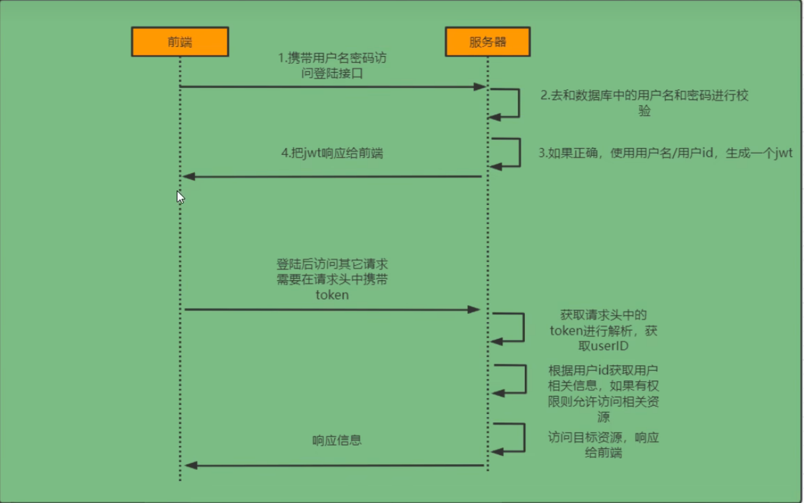
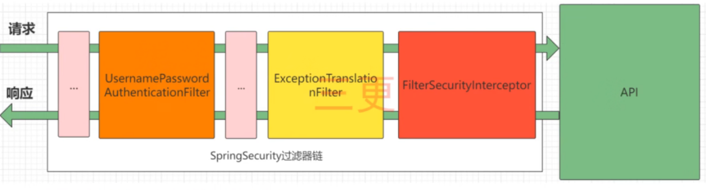
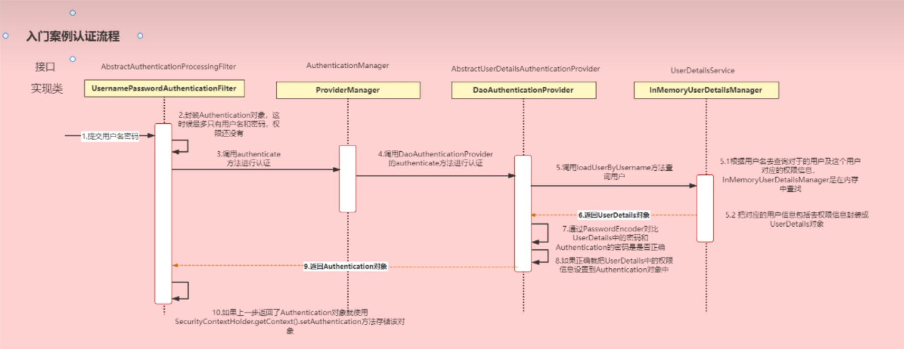

01月31日

# 简介

---

**Spring Security**是Spring家族中的一个安全管理框架。相比与另外一个安全框架Shiro，它提供了更丰富的功能，社区资源也比Shiro丰富。

一般来说中大型的项目都是使用SpringSecurity来做安全框架。小项目有Shiro的比较多，因为相比与SpringSecurity，Shiro的上手更加的简单。

一般Web应用的需要进行**认证**和**授权**。

**认证：验证当前访问系统的是不是本系统的用户，并且要确认具体是哪个用户**

**授权：经过认证后判断当前用户是否有权限进行某个操作**

而认证和授权也是SpringSecurity作为安全框架的核心功能。

# 1. 快速入门

---

## 1.1 准备工作

## 1.2 引入 SpringSecurity

# 2. 认证

---

## 2.1. 登录校验流程



## 2.2. 原理初探

### 2.2.1. SpringSecurity 完整流程

SpringSecurity 的原理其实就是一个过滤器，内部包含了提供各种功能的过滤器。这里我们可以看看入门案例中的过滤器。



### 2.2.2. 认证流程详解



**概念速查：**

Authentication接口：它的实现类，表示当前访问系统的用户，封装了用户相关信息。

AuthenticationManager接口：定义了认证Authentication的方法

UserDetailsService接口：加载用户特定数据的核心接口。里面定义了一个根据用户名查询用户信息的方法。

UserDetails接口：提供核心用户信息。通过UserDetailsService根据用户名获取处理的用户信息要封装成UserDetails对象返回。然后将这些信息封装到Authentication对象中。

## 2.3. 解决问题

### 2.3.1. 思路分析

登录：

① 自定义登录窗口

调用 ProviderManager 的方法进行认证，如果认证通过生成 jwt

把用户信息存入 Redis 中

② 自定义 UserDetailsService

在这个实现中去查询数据库

校验：

① 定义 jwt 认证过滤器

获取 token

解析 token 获取其中的 userid

从 Redis 中获取用户信息

存入 SecurityContextHolder

### 2.3.2. 准备工作

① 添加依赖

```
<!--redis依赖-->
<dependency>
  <groupId>org.springframework.boot</groupId>
  <artifactId>spring-boot-starter-data-redis</artifactId>
</dependency>
<!--fastjson依赖-->
<dependency>
  <groupId>com.alibaba</groupId>
  <artifactId>fastjson</artifactId>
  <version>1.2.33</version>
</dependency>
<!--jwt依赖-->
<dependency>
  <groupId>io.jsonwebtoken</groupId>
  <artifactId>jjwt</artifactId>
  <version>0.9.0</version>
</dependency>
```

② 添加 **Redis** 相关配置

```
import com.alibaba.fastjson.JSON;
import com.alibaba.fastjson.parser.ParserConfig;
import com.alibaba.fastjson.serializer.SerializerFeature;
import org.springframework.data.redis.serializer.RedisSerializer;
import org.springframework.data.redis.serializer.SerializationException;

import java.io.UnsupportedEncodingException;
import java.nio.charset.Charset;

/**
 * Redis使用FastJson序列化
 *
 * @author UnmooredBoat
 */
public class FastJsonRedisSerializer<T> implements RedisSerializer<T> {

    public static final Charset DEFAULT_CHARSET = Charset.forName("UTF-8");

    private Class<T> clazz;

    static {
        ParserConfig.getGlobalInstance().setAutoTypeSupport(true);
    }

    public FastJsonRedisSerializer(Class<T> clazz) {
        super();
        this.clazz = clazz;
    }

    // 补充：无参构造方法（通常用于泛型不确定或通过setter注入类型的情况）
    public FastJsonRedisSerializer() {
    }

    // 补充：反序列化方法
    @Override
    public T deserialize(byte[] bytes) throws SerializationException {
        if (bytes == null || bytes.length == 0) {
            return null;
        }
        try {
            String str = new String(bytes, DEFAULT_CHARSET);
            return JSON.parseObject(str, clazz);
        } catch (UnsupportedEncodingException e) {
            throw new SerializationException("Deserialize error: " + e.getMessage(), e);
        }
    }

    @Override
    public byte[] serialize(T t) throws SerializationException {
        if (t == null) {
            return new byte[0];
        }
        return JSON.toJSONString(t, SerializerFeature.WriteClassName).getBytes(DEFAULT_CHARSET);
    }
}
```

```
import org.springframework.context.annotation.Bean;
import org.springframework.context.annotation.Configuration;
import org.springframework.data.redis.connection.RedisConnectionFactory;
import org.springframework.data.redis.core.RedisTemplate;
import org.springframework.data.redis.serializer.StringRedisSerializer;

@Configuration
public class RedisConfig {

    @Bean
    @SuppressWarnings(value = { "unchecked", "rawtypes" })
    public RedisTemplate<Object, Object> redisTemplate(RedisConnectionFactory connectionFactory) {
        RedisTemplate<Object, Object> template = new RedisTemplate<>();
        template.setConnectionFactory(connectionFactory);

        FastJsonRedisSerializer serializer = new FastJsonRedisSerializer(Object.class);

        // 使用StringRedisSerializer来序列化和反序列化redis的key值
        template.setKeySerializer(new StringRedisSerializer());
        template.setValueSerializer(serializer);

        // Hash的key也采用StringRedisSerializer的序列化方式
        template.setHashKeySerializer(new StringRedisSerializer());
        template.setHashValueSerializer(serializer);

        template.afterPropertiesSet();
        return template;
    }
}
```

③ 响应类

```
import com.fasterxml.jackson.annotation.JsonInclude;
import com.fasterxml.jackson.annotation.JsonInclude.Include;

/**
 * 统一响应结果类
 * @param <T> 响应数据的泛型类型
 */
@JsonInclude(JsonInclude.Include.NON_NULL)
public class ResponseResult<T> {

    /**
     * 状态码
     */
    private Integer code;

    /**
     * 提示信息，如果有错误时，前端可以获取该字段进行提示
     */
    private String msg;

    /**
     * 查询到的结果数据
     */
    private T data;

    // ================================= 构造方法 =================================

    public ResponseResult(Integer code, String msg) {
        this.code = code;
        this.msg = msg;
    }

    public ResponseResult(Integer code, T data) {
        this.code = code;
        this.data = data;
    }

    // ================================= 静态方法（快捷创建对象） =================================

    /**
     * 返回成功结果（仅状态码）
     */
    public static <T> ResponseResult<T> success() {
        return new ResponseResult<>(200, (T) null);
    }

    /**
     * 返回成功结果（带数据）
     */
    public static <T> ResponseResult<T> success(T data) {
        return new ResponseResult<>(200, data);
    }

    /**
     * 返回成功结果（带数据和自定义消息）
     */
    public static <T> ResponseResult<T> success(T data, String msg) {
        ResponseResult<T> result = new ResponseResult<>(200, data);
        result.setMsg(msg);
        return result;
    }

    /**
     * 返回失败结果（通用错误）
     */
    public static <T> ResponseResult<T> error(String msg) {
        return new ResponseResult<>(500, msg);
    }

    /**
     * 返回失败结果（自定义状态码和消息）
     */
    public static <T> ResponseResult<T> error(Integer code, String msg) {
        return new ResponseResult<>(code, msg);
    }

    // ================================= Getter & Setter =================================

    public Integer getCode() {
        return code;
    }

    public void setCode(Integer code) {
        this.code = code;
    }

    public String getMsg() {
        return msg;
    }

    public void setMsg(String msg) {
        this.msg = msg;
    }

    public T getData() {
        return data;
    }

    public void setData(T data) {
        this.data = data;
    }
}
```

④ 工具类

```
import io.jsonwebtoken.Claims;
import io.jsonwebtoken.JwtBuilder;
import io.jsonwebtoken.Jwts;
import io.jsonwebtoken.SignatureAlgorithm;
import javax.crypto.SecretKey;
import javax.crypto.spec.SecretKeySpec;
import java.util.Base64;
import java.util.Date;
import java.util.UUID;

/**
 * JWT工具类
 */
public class JwtUtil {

    // 有效期为 60 * 60 * 1000 = 3600000 (即一个小时)
    // public static final Long JWT_TTL = 60 * 60 *1000L;// 60 * 60 *1000 一个小时
    // 设置秘钥明文 (这里直接使用了字符串，实际生产中建议从配置文件读取或使用更安全的密钥生成方式)
    public static final String JWT_KEY = "sangeng";

    /**
     * 生成UUID字符串（去除其中的"-"符号）
     * @return UUID字符串
     */
    public static String getUUID() {
        String token = UUID.randomUUID().toString().replaceAll("-", "");
        return token;
    }

    // ==================================== 补充的代码从这里开始 ====================================

    /**
     * 生成JWT token
     * @param subject (主题) 可以是用户信息JSON等
     * @param ttl (过期时间毫秒数) 例如 JWT_TTL
     * @return token字符串
     */
    public static String createJWT(String subject, Long ttl) {
        // 1. 获取当前时间
        long nowMillis = System.currentTimeMillis();
        Date now = new Date(nowMillis);

        // 2. 将私钥转为 SecretKey 对象
        // 注意：JWT要求密钥长度至少为256位（32字节），如果密钥太短，需要进行填充或使用更安全的密钥生成方式
        // 这里为了演示简便，直接使用字符串作为密钥。
        byte[] encodeKey = Base64.getDecoder().decode(JWT_KEY);
        SecretKey key = new SecretKeySpec(encodeKey, 0, encodeKey.length, "AES");

        // 3. 构建JWT
        JwtBuilder builder = Jwts.builder()
                .setId(getUUID()) // 设置JWT ID
                .setSubject(subject) // 设置主题
                .setIssuer("admin") // 设置签发者 (可选)
                .setIssuedAt(now) // 设置签发时间
                .signWith(SignatureAlgorithm.HS256, key); // 设置签名算法和密钥

        // 4. 设置过期时间
        if (ttl > 0) {
            builder.setExpiration(new Date(nowMillis + ttl));
        }

        return builder.compact();
    }

    /**
     * 解析JWT token
     * @param token token字符串
     * @return Claims 包含了token中的信息
     */
    public static Claims parseJWT(String token) {
        // 同样需要将密钥转为 SecretKey
        byte[] encodeKey = Base64.getDecoder().decode(JWT_KEY);
        SecretKey key = new SecretKeySpec(encodeKey, 0, encodeKey.length, "AES");

        // 解析并验证token，如果token无效（过期或被篡改）会抛出异常
        return Jwts.parser()
                .setSigningKey(key)
                .parseClaimsJws(token)
                .getBody();
    }
}
```

```
import org.springframework.data.redis.core.RedisTemplate;
import org.springframework.stereotype.Component;
import javax.annotation.Resource;
import java.util.concurrent.TimeUnit;

@Component
public class RedisCache {

    @Resource
    public RedisTemplate redisTemplate;

    /**
     * 缓存基本的对象，Integer、String、实体类等
     *
     * @param key   缓存的键值
     * @param value 缓存的值
     */
    public <T> void setCacheObject(final String key, final T value) {
        redisTemplate.opsForValue().set(key, value);
    }

    /**
     * 缓存基本的对象，Integer、String、实体类等，并设置超时时间
     *
     * @param key     缓存的键值
     * @param value   缓存的值
     * @param timeout 时间
     * @param timeUnit 时间颗粒度
     */
    public <T> void setCacheObject(final String key, final T value, final Long timeout, final TimeUnit timeUnit) {
        redisTemplate.opsForValue().set(key, value, timeout, timeUnit);
    }

    // ===================================== 补充代码区域 =====================================

    /**
     * 获取缓存对象
     *
     * @param key 键值
     * @return 缓存的对象
     */
    public <T> T getCacheObject(final String key) {
        Object obj = redisTemplate.opsForValue().get(key);
        return (T) obj;
    }

    /**
     * 删除单个缓存
     *
     * @param key 键值
     * @return 操作结果 (是否删除成功)
     */
    public Boolean deleteObject(final String key) {
        return redisTemplate.delete(key);
    }

    /**
     * 设置缓存有效期
     *
     * @param key 键值
     * @param timeout 时间长度
     * @param timeUnit 时间单位
     * @return 操作结果
     */
    public Boolean expire(final String key, final Long timeout, final TimeUnit timeUnit) {
        return redisTemplate.expire(key, timeout, timeUnit);
    }
}
```

```
import javax.servlet.http.HttpServletResponse;
import java.io.IOException;

public class WebUtils {

    /**
     * 将字符串渲染到客户端
     *
     * @param response 渲染对象 (HttpServletResponse)
     * @param string   待渲染的字符串 (通常为 JSON 数据)
     * @return null
     */
    public static String renderString(HttpServletResponse response, String string) {
        try {
            // 1. 设置 HTTP 状态码为 200 (OK)
            response.setStatus(200);

            // 2. 设置内容类型为 JSON，防止浏览器乱码或将其当做文件下载
            response.setContentType("application/json");

            // 3. 设置字符编码为 UTF-8，防止中文乱码
            response.setCharacterEncoding("utf-8");

            // 4. 获取输出流并打印字符串
            response.getWriter().print(string);
        } catch (IOException e) {
            // 5. 如果发生 IO 异常，打印错误堆栈
            e.printStackTrace();
        }

        // 6. 方法返回 null
        return null;
    }
}
```

⑤ 实体类

### 2.3.3. 实现

#### 2.3.3.1. 数据库校验用户

**准备工作**

我们先创建一个用户表，建表语句如下：

```
CREATE TABLE `sys_user` (
  `id` BIGINT(20) NOT NULL AUTO_INCREMENT COMMENT '主键',
  `user_name` VARCHAR(64) NOT NULL DEFAULT 'NULL' COMMENT '用户名',
  `nick_name` VARCHAR(64) NOT NULL DEFAULT 'NULL' COMMENT '昵称',
  `password` VARCHAR(64) NOT NULL DEFAULT 'NULL' COMMENT '密码',
  `status` CHAR(1) DEFAULT '0' COMMENT '账号状态(0正常 1停用)',
  `email` VARCHAR(64) DEFAULT NULL COMMENT '邮箱',
  `phonenumber` VARCHAR(32) DEFAULT NULL COMMENT '手机号码',
  `sex` CHAR(1) DEFAULT NULL COMMENT '用户性别(0男,1女,2未知)',
  `avatar` VARCHAR(128) DEFAULT NULL COMMENT '头像',
  `user_type` CHAR(1) NOT NULL DEFAULT '1' COMMENT '用户类型(0管理员,1普通用户)',
  `create_by` BIGINT(20) DEFAULT NULL COMMENT '创建人的用户id',
  `create_time` DATETIME DEFAULT NULL COMMENT '创建时间',
  `update_by` BIGINT(20) DEFAULT NULL COMMENT '更新人',
  `update_time` DATETIME DEFAULT NULL COMMENT '更新时间',
  `del_flag` INT(11) DEFAULT '0' COMMENT '删除标志(0代表未删除,1代表已删除)',
  PRIMARY KEY (`id`)
) ENGINE=INNODB AUTO_INCREMENT=2 DEFAULT CHARSET=utf8mb4 COMMENT='用户表';
```

引入 MybatisPlus 和 MySQL 驱动依赖

```
<dependencies>
  <!-- MyBatis-Plus 适配 Spring Boot 3 -->
  <dependency>
    <groupId>com.baomidou</groupId>
    <artifactId>mybatis-plus-spring-boot3-starter</artifactId>
    <version>3.5.7</version> <!-- 需使用 3.5.3+ 版本 -->
  </dependency>

  <!-- MySQL 驱动 (Spring Boot 3 推荐 8.0.30+) -->
  <dependency>
    <groupId>mysql</groupId>
    <artifactId>mysql-connector-java</artifactId>
    <version>8.2.0</version>
    <scope>runtime</scope>
  </dependency>
</dependencies>
```

配置数据库信息

```
spring:
  datasource:
  url: jdbc:mysql://localhost:3306/sg_security?characterEncoding=utf-8&serverTimezone=UTC
  username: root
  password: root
  driver-class-name: com.mysql.cj.jdbc.Driver
```

定义 Mapper 接口

修改 User 实体类

修改 Mapper 扫描

添加 junit 依赖

测试 MP 是否能正常使用

**核心代码实现**

#### 2.3.3.2. 密码加密存储

实际项目中我们不会把密码明文存储在数据库中。

默认使用的PasswordEncoder要求数据库中的密码格式为：**{id}password**。它会根据id去判断密码的加密方式。但是我们一般不会采用这种方式。所以就需要替换**PasswordEncoder**。

我们一般使用SpringSecurity为我们提供的**BCryptPasswordEncoder**。

我们只需要使用把BCryptPasswordEncoder对象注入Spring容器中，SpringSecurity就会使用该PasswordEncoder来进行密码校验。

我们可以定义一个SpringSecurity的配置类，SpringSecurity要求这个配置类要继承**WebSecurityConfigurerAdapter**。

```
@Configuration
public class SecurityConfig extends WebSecurityConfigurerAdapter {
    @Bean
    public PasswordEncoder passwordEncoder(){
        return new BCryptPasswordEncoder();
    }
}
```

#### 2.3.3.3. 登录接口

#### 2.3.3.4. 认证过滤器

#### 2.3.3.5. 退出登录

# 3. 授权

# 4. 自定义失败显示

# 5. 跨域

# 6. 遗留小问题

---

## 🔗 关联笔记
- [[Spring6笔记]]
- [[SpringBoot2笔记]]
