# 1. jar 包和 war 包的区别

JAR（Java Archive）包和 WAR（Web Application Archive）包都是 Java 应用程序的打包格式，但它们用途不同、结构不同，适用于不同的部署场景。以下是它们的主要区别以及如何选择合适的打包方式：

## 1.1. 一、JAR 包 vs WAR 包的区别

|   |   |   |
|---|---|---|
|特性|JAR 包|WAR 包|
|**全称**|Java Archive|Web Application Archive|
|**用途**|通用 Java 应用（如命令行工具、库、Spring Boot 应用等）|Web 应用（需部署在 Servlet 容器中，如 Tomcat、Jetty）|
|**目录结构**|无固定结构（可自定义）|有标准结构：  <br>- `/WEB-INF/web.xml`<br><br>（可选，Servlet 3.0+ 可注解）  <br>- `/WEB-INF/classes/`<br><br>  <br>- `/WEB-INF/lib/`<br><br>  <br>- 静态资源（HTML、CSS、JS 等）放在根目录|
|**运行方式**|`java -jar xxx.jar`<br><br>（需包含主类）|部署到 Web 容器（如 Tomcat 的 `webapps/`<br><br>目录）|
|**依赖管理**|通常内嵌依赖（如 Spring Boot 的 fat jar）或通过 classpath 引入|依赖放在 `/WEB-INF/lib/`<br><br>，由容器加载|
|**是否包含 Web 资源**|一般不包含（除非是内嵌 Web 服务器的应用）|必须包含（如 JSP、HTML、图片等）|

---

## 1.2. 二、如何选择合适的打包方式？

### 1.2.1. ✅ 选择 JAR 包的情况：

- 你开发的是 **独立运行的 Java 应用**（如微服务、后台任务、命令行工具）。
- 使用 **Spring Boot** 等框架，内嵌了 Web 服务器（如 Tomcat、Undertow），可以直接通过 `java -jar` 启动。
- 不需要部署到传统 Web 容器（如独立 Tomcat）。
- 希望简化部署（一个文件即可运行）。

📌 示例：Spring Boot 默认打包为可执行 JAR，内嵌 Tomcat，适合云原生、Docker 部署。

### 1.2.2. ✅ 选择 WAR 包的情况：

- 你需要将应用部署到 **现有的 Servlet 容器**（如公司已有 Tomcat 集群）。
- 应用是传统的 Java Web 项目（使用 JSP、Servlet、Filter 等）。
- 公司运维规范要求使用 WAR 部署（便于统一管理多个 Web 应用）。
- 你不想内嵌 Web 服务器，希望由容器统一管理（如共享连接池、安全策略等）。

📌 示例：老式 Java EE 项目、需要与现有 Tomcat 集成的系统。

---

## 1.3. 三、Spring Boot 中的特殊说明

Spring Boot 支持同时打包为 JAR 或 WAR：

- **默认是 JAR**：内嵌 Web 服务器，开箱即用。
- **若要打包 WAR**：

- 将 `spring-boot-starter-tomcat` 设为 `provided`（避免内嵌）。
- 继承 `SpringBootServletInitializer`。
- 修改 `pom.xml` 或 `build.gradle` 打包类型为 `war`。

```
<!-- Maven 示例 -->
<packaging>war</packaging>

<dependency>
    <groupId>org.springframework.boot</groupId>
    <artifactId>spring-boot-starter-tomcat</artifactId>
    <scope>provided</scope>
</dependency>
```

---

## 1.4. 四、总结建议

|   |   |
|---|---|
|场景|推荐打包方式|
|微服务、云原生、Docker 部署|✅ JAR|
|传统企业 Web 应用，部署到 Tomcat/JBoss|✅ WAR|
|快速原型、独立应用|✅ JAR|
|需要与已有 Web 容器集成|✅ WAR|

💡 现代开发趋势更倾向于 **可执行 JAR（fat jar）**，因其部署简单、环境隔离好；而 WAR 更多用于遗留系统或特定运维要求的场景。

---

# 2. spring和SpringMVC还有mybatis之间的联系

## 2.1. 一、各自的角色（分工）

|   |   |   |
|---|---|---|
|框架|职责|核心功能|
|**Spring**|**核心容器 & 整合中枢**|管理对象（Bean）的生命周期、依赖注入（DI）、事务管理、AOP 等。它是整个应用的“骨架”和“粘合剂”。|
|**Spring MVC**|**Web 层框架**|处理 HTTP 请求与响应，实现 MVC 架构，负责 URL 路由、参数绑定、视图渲染等。属于 Spring 的一个模块。|
|**MyBatis**|**持久层框架（ORM）**|封装 JDBC，简化数据库操作。通过 XML 或注解将 Java 对象与 SQL 映射，执行 CRUD。|

✅ 简单比喻：

- **Spring** 是“总指挥”，负责协调所有人；
- **Spring MVC** 是“前台接待”，接收用户请求并安排任务；
- **MyBatis** 是“后勤仓库管理员”，负责和数据库打交道，存取数据。

## 2.2. 二、它们是如何协作的？

假设用户访问 `/user/123` 查看用户信息：

### 2.2.1. 1. **请求进入 Spring MVC**

- 浏览器发送 `GET /user/123`
- Spring MVC 的 `DispatcherServlet` 接收请求
- 根据 `@RequestMapping` 找到对应的 Controller 方法

```

@GetMapping("/user/{id}")
public String getUser(@PathVariable Long id, Model model) {
User user = userService.findById(id); // ← 调用 Service
model.addAttribute("user", user);
return "user-detail";
}
```

### 2.2.2. 2. **Controller 调用 Service（由 Spring 管理）**

- `userService` 是一个 Spring Bean（通过 `@Service` 注解）
- Spring 通过 **依赖注入（DI）** 自动将 `UserServiceImpl` 实例注入到 Controller 中

```

@Service
public class UserServiceImpl implements UserService {
    @Autowired
    private UserMapper userMapper; // ← MyBatis 的 Mapper

    public User findById(Long id) {
        return user; // ← 调用 MyBatis
    }
}
```

### 2.2.3. 3. **Service 调用 MyBatis Mapper 访问数据库**

- `UserMapper` 是 MyBatis 的接口，通常加上 `@Mapper` 注解
- Spring 会为该接口生成代理实现类，并将其注册为 Bean，供 Service 注入使用

```
@Mapper
public interface UserMapper {
    @Select("SELECT * FROM user WHERE id = #{id}")
    User selectById(Long id);
}
```

### 2.2.4. 4. **MyBatis 执行 SQL，返回结果**

- MyBatis 使用配置好的数据源（通常由 Spring 管理）连接数据库
- 执行 SQL，自动将结果映射为 `User` 对象

### 2.2.5. 5. **结果返回给前端**

- 数据通过 Model 传递给视图（如 Thymeleaf/JSP）
- 或直接以 JSON 形式返回（如果是 REST API）

---

## 2.3. 三、整合的关键点

|   |   |
|---|---|
|整合环节|说明|
|**Spring 管理 MyBatis 的 Bean**|通过 `@MapperScan("com.example.mapper")`<br><br>，Spring 会自动扫描并注册所有 Mapper 接口为 Bean|
|**数据源由 Spring 配置**|数据库连接池（如 HikariCP）在 Spring 配置文件或 `application.yml`<br><br>中定义，MyBatis 复用该数据源|
|**事务由 Spring 控制**|在 Service 方法上加 `@Transactional`<br><br>，Spring 会自动管理数据库事务（即使底层是 MyBatis）|
|**Spring MVC 是 Spring 的一部分**|只需启用 `@EnableWebMvc`<br><br>或使用 Spring Boot Web Starter，即可自动配置 MVC|

---

## 2.4. 四、常见组合名称

- **SSM 框架**：Spring + Spring MVC + MyBatis（传统 Java Web 经典组合）
- **Spring Boot + MyBatis**：现代简化版，Spring Boot 自动配置了 Spring 和 Spring MVC，只需引入 `mybatis-spring-boot-starter`

```
<!-- Maven 示例 -->
<dependency>
  <groupId>org.springframework.boot</groupId>
  <artifactId>spring-boot-starter-web</artifactId> <!-- 包含 Spring MVC -->
</dependency>
<dependency>
  <groupId>org.mybatis.spring.boot</groupId>
  <artifactId>mybatis-spring-boot-starter</artifactId>
  <version>3.0.3</version>
</dependency>
```

---

## 2.5. 五、总结：三者关系图

```

浏览器
   ↓
[Spring MVC] ← 接收请求、路由、参数绑定、返回视图/JSON
   ↓
[Spring] ← 管理 Controller、Service、Mapper 的 Bean 生命周期和依赖注入
   ↓
[MyBatis] ← 执行 SQL，操作数据库
   ↓
数据库（MySQL/Oracle 等）
```

✅ **一句话概括**：

**Spring 是基础容器，Spring MVC 负责 Web 层交互，MyBatis 负责数据持久化，三者通过 Spring 的依赖注入机制无缝集成，共同构建分层清晰、易于维护的企业级应用。**

---

# 3. AopContext.currentProxy()用法

这段代码：

```
Object proxy = AopContext.currentProxy();
```

**通俗地说，它的作用是：在 Spring AOP（面向切面编程）中，让一个被代理的对象“拿到自己当前的代理对象”。**

---

### 3.1.1. 举个例子更容易理解：

假设你有一个 Spring Bean，叫 `OrderService`，它有两个方法：

- `placeOrder()`
- `validateOrder()`

其中，`validateOrder()` 方法上加了 `@Transactional`（事务注解），而 `placeOrder()` 内部直接调用了 `this.validateOrder()`。

这时候问题来了：**因为是** `**this**` **调用，绕过了 Spring 的代理对象，所以** `**@Transactional**` **不会生效！**

为了解决这个问题，你可以这样写：

```
@Service
public class OrderService {

    public void placeOrder() {
        // 通过代理对象调用，确保 AOP（比如事务）生效
        ((OrderService) AopContext.currentProxy()).validateOrder();
    }

    @Transactional
    public void validateOrder() {
        // ...
    }
}
```

但要使用 `AopContext.currentProxy()`，还需要在启动类上加一个配置：

```
@EnableAspectJAutoProxy(exposeProxy = true)
@MapperScan("com.hmdp.mapper")
@SpringBootApplication
public class HmDianPingApplication {

    public static void main(String[] args) {
        SpringApplication.run(HmDianPingApplication.class, args);
    }
}
```

还需要添加依赖：

```
<dependency>
  <groupId>org.aspectj</groupId>
  <artifactId>aspectjweaver</artifactId>
</dependency>
```

否则会报错，因为默认 Spring 不暴露代理对象。

---

### 3.1.2. 总结一句话：

`AopContext.currentProxy()` 是用来在同一个类内部方法调用时，**通过代理对象调用自己**，从而让 Spring AOP（比如事务、缓存、安全等）能够正常生效。

---

# 4. `MultipartFile` 是 Spring Framework 中用于处理 HTTP 文件上传的接口

## 4.1. 主要特点：

1. **所属框架**：`org.springframework.web.multipart.MultipartFile`
2. **用途**：代表 HTTP 上传请求中的 multipart file（多部分文件），用于接收客户端上传的文件
3. **常见使用场景**：

- 图片上传
- 文档上传
- 任何类型的文件上传

## 4.2. 常用方法：

- `getOriginalFilename()`：获取上传文件的原始文件名
- `getSize()`：获取文件大小（字节）
- `getContentType()`：获取文件的 MIME 类型（如 image/jpeg）
- `isEmpty()`：检查文件是否为空
- `transferTo(File dest)`：将上传的文件保存到指定的目标文件
- `getBytes()`：将文件内容作为字节数组返回

## 4.3. 在你的项目中：

**已查看文件** _UploadController.java（黑马点评）_

在这个项目中，`UploadController` 的 `uploadImage` 方法使用 `MultipartFile` 来接收前端上传的图片文件。

**代码工作流程：**

1. 第 21 行：通过 `@RequestParam("file")` 注解接收前端上传的文件
2. 第 24 行：获取原始文件名
3. 第 26 行：生成新的唯一文件名（防止重名）
4. 第 28 行：使用 `transferTo()` 方法将文件保存到服务器的指定目录
5. 第 31 行：返回保存后的文件名

这是一个典型的 Spring Boot 文件上传实现，`MultipartFile` 作为桥梁，让后端能够方便地处理和保存用户上传的文件。

---

# 5. @Runwith和@ContextConfiguration 注解

## 5.1. 1. `@RunWith(SpringJUnit4ClassRunner.class)`

- **作用**：指定测试类的运行器
- **功能**：让 JUnit 4 测试使用 Spring 的测试运行器来执行
- **目的**：启用 Spring 的测试支持功能（如依赖注入、事务管理等）
- **效果**：没有这个注解，Spring 的注解（如 `@Autowired`）在测试中不会生效

## 5.2. 2. `@ContextConfiguration(classes = SpringConfig.class)`

- **作用**：指定 Spring 配置类
- **功能**：告诉 Spring 测试运行器加载哪个配置类来创建应用上下文
- **参数**：`classes = SpringConfig.class` 表示使用 `SpringConfig` 这个 Java 配置类
- **目的**：加载 Spring 容器所需的 bean 定义

## 5.3. 整体作用

这两个注解配合使用，让你可以在测试类中：

- 自动装配 Spring 管理的 bean（如 `@Autowired private AccountService accountService`）
- 在 Spring 容器环境中进行测试
- 测试 Spring 管理的组件（Service、DAO 等）

简单来说，就是**为测试类启动一个 Spring 容器**，以便进行集成测试。

---

# 6. `@Bean` 注解的主要作用

## 6.1. 1. **声明 Bean**

`@Bean` 注解用于告诉 Spring："这个方法会返回一个对象，请把这个对象作为 Bean 注册到 Spring 容器中"。

## 6.2. 2. **替代 XML 配置**

它是 XML 配置方式的注解版本替代方案。例如：

**XML 方式：**

```
<bean id="myDataSource" class="edu.cqie.spring6.beans.MyDataSource">
    <property name="url" value="jdbc:mysql://localhost:3306/mydb"/>
</bean>
```

**@Bean 注解方式：**

```
@Configuration
public class AppConfig {
    
    @Bean
    public MyDataSource myDataSource() {
        MyDataSource dataSource = new MyDataSource();
        dataSource.setUrl("jdbc:mysql://localhost:3306/mydb");
        return dataSource;
    }
}
```

## 6.3. 3. **使用场景**

- 需要第三方库提供的类（无法在类上加 `@Component`）
- 需要自定义创建逻辑或复杂配置的 Bean
- 需要精确控制 Bean 的初始化过程

## 6.4. 4. **常用属性**

```
@Bean
(name = "customName")  // 指定 Bean 的名称
public MyBean myBean() {
    return new MyBean();
}

@Bean
(initMethod = "init", destroyMethod = "cleanup")  // 指定初始化和销毁方法
public MyBean myBean() {
    return new MyBean();
}
```

## 6.5. 5. **与** `@Component` **的区别**

|   |   |   |
|---|---|---|
|特性|`@Component`|`@Bean`|
|位置|类级别注解|方法级别注解|
|扫描方式|组件扫描自动发现|配置类中手动声明|
|适用场景|自己开发的类|第三方类或需要特殊配置的类|

## 6.6. 实际示例

根据你项目中的代码结构，一个典型的使用场景可能是：

```
@Configuration
public class DatabaseConfig {
    
    @Bean
    public MyDataSource dataSource() {
        MyDataSource ds = new MyDataSource();
        ds.setDriverClassName("com.mysql.cj.jdbc.Driver");
        ds.setUrl("jdbc:mysql://localhost:3306/test");
        ds.setUsername("root");
        ds.setPassword("123456");
        return ds;
    }
    
    @Bean
    public UserDao userDao(MyDataSource dataSource) {
        return new UserDaoImpl(dataSource);
    }
}
```

## 6.7. 总结

`@Bean` 注解让你能够以编程方式在 Spring 容器中注册 Bean，提供了比 XML 更简洁、类型安全的配置方式，特别适合需要复杂初始化逻辑或使用第三方类的场景。

---

# 7. `ServletContainerInitConfig` 为什么不需要添加注解？

**核心原因：这个类是通过 Servlet 3.0+ 的 SPI 机制自动发现的，而不是通过 Spring 的组件扫描。**

## 7.1. 详细解释：

1. **继承关系即配置**

- `ServletContainerInitConfig` 继承了 `AbstractDispatcherServletInitializer`
- 这个父类实现了 `WebApplicationInitializer` 接口
- Servlet 3.0+ 规范规定：容器启动时会自动扫描并加载所有实现 `WebApplicationInitializer` 接口的类

2. **工作原理**

```
Servlet 容器启动 
    → 通过 SPI 机制发现 WebApplicationInitializer 的实现类
        → 自动调用该类的三个方法：
            - createServletApplicationContext()
            - getServletMappings()
            - createRootApplicationContext()
```

3. **与 @Configuration 的区别**

- `@Configuration` 标注的类需要被 Spring 容器扫描到才能生效
- `WebApplicationInitializer` 的实现类是由 **Servlet 容器**直接加载，不依赖 Spring 的组件扫描

4. **对比查看**

- 你看 `SpringMvcConfig.java` 就需要 `@Configuration` 和 `@ComponentScan` 注解
- 因为它是纯粹的 Spring 配置类，需要在 Spring 容器内部被扫描
- 而 `ServletContainerInitConfig` 是 Servlet 容器级别的初始化类

## 7.2. 总结：

```
// 不需要 @Configuration
public class ServletContainerInitConfig extends AbstractDispatcherServletInitializer {
    // 通过继承关系 + SPI 机制自动生效
}
```

这种设计模式让你可以**完全用代码替代 web.xml**，实现零 XML 配置的 Spring MVC 应用。

---

# 8. `@RestControllerAdvice` 和 `@ControllerAdvice` 的区别

## 8.1. 核心区别

### 8.1.1. 1️⃣ **@ControllerAdvice**

- **作用**：全局控制器增强（仅包含 @Controller）
- **返回值处理**：方法返回的是 **视图名称（View）**
- **适用场景**：传统 JSP/Thymeleaf 等模板引擎

```
@ControllerAdvice
public class GlobalExceptionHandler {
    
    @ExceptionHandler(Exception.class)
    public String handleException(Exception e, Model model) {
        // 返回错误页面（视图名）
        model.addAttribute("error", e.getMessage());
        return "error_page";  // ← 跳转到 error_page.jsp 页面
    }
}
```

### 8.1.2. 2️⃣ **@RestControllerAdvice**

- **作用**：全局 RESTful 控制器增强（相当于 @ControllerAdvice + @ResponseBody）
- **返回值处理**：方法返回的是 **数据（JSON/XML）**
- **适用场景**：前后端分离的 RESTful API

```
@RestControllerAdvice
public class GlobalExceptionHandler {
    
    @ExceptionHandler(Exception.class)
    public Result handleException(Exception e) {
        // 直接返回 JSON 数据
        return Result.error(500, e.getMessage());  // ← 自动转为 JSON
        // {"code": 500, "message": "错误信息", "data": null}
    }
}
```

### 8.1.3. 3️⃣ **等价关系**

```
// 这两个是等价的：

// 方式 1：使用 @RestControllerAdvice
@RestControllerAdvice
public class MyAdvice1 { }

// 方式 2：@ControllerAdvice + @ResponseBody
@ControllerAdvice
@ResponseBody
public class MyAdvice2 { }
```

### 8.1.4. 4️⃣ **实际对比示例**

#### 8.1.4.1. **场景：处理异常**

**使用 @ControllerAdvice：**

```
@ControllerAdvice
public class WebExceptionHandler {
    
    @ExceptionHandler(ProjectException.class)
    public ModelAndView handleProjectException(ProjectException e) {
        ModelAndView mv = new ModelAndView();
        mv.addObject("errorMsg", e.getMessage());
        mv.setViewName("project_error");  // ← 跳转到 JSP 页面
        return mv;
    }
}
// 响应：转发到 /WEB-INF/views/project_error.jsp
```

**使用 @RestControllerAdvice：**

```
@RestControllerAdvice
public class RestExceptionHandler {
    
    @ExceptionHandler(ProjectException.class)
    @ResponseStatus(HttpStatus.INTERNAL_SERVER_ERROR)
    public Result handleProjectException(ProjectException e) {
        return Result.error(500, e.getMessage());  // ← 返回 JSON 数据
    }
}
// 响应：{"code": 500, "message": "项目异常", "data": null}
```

### 8.1.5. 5️⃣ **功能对比表**

|   |   |   |
|---|---|---|
|特性|@ControllerAdvice|@RestControllerAdvice|
|**组成**|@Controller + @Advice|@Controller + @ResponseBody + @Advice|
|**返回值**|视图名称（String/ModelAndView）|数据对象（自动转 JSON/XML）|
|**内容协商**|需要手动添加 @ResponseBody|默认启用|
|**适用架构**|传统 MVC（JSP/Thymeleaf）|RESTful API（前后端分离）|
|**典型应用**|服务端渲染页面|移动端/前端框架调用|

### 8.1.6. 6️⃣ **常见用法示例**

#### 8.1.6.1. **@RestControllerAdvice 的典型用法（你的项目）：**

```
@RestControllerAdvice
public class ProjectExceptionAdvice {
    
    // 处理特定异常
    @ExceptionHandler(ProjectException.class)
    public Result handleProjectException(ProjectException e) {
        return Result.error(e.getCode(), e.getMessage());
    }
    
    // 处理所有异常
    @ExceptionHandler(Exception.class)
    public Result handleException(Exception e) {
        e.printStackTrace();
        return Result.error(500, "系统繁忙，请稍后再试");
    }
    
    // 全局数据绑定
    @ModelAttribute
    public void addAttributes(Model model) {
        model.addAttribute("timestamp", System.currentTimeMillis());
    }
}
```

#### 8.1.6.2. **@ControllerAdvice 的典型用法：**

```
@ControllerAdvice
public class GlobalModelAdvice {
    
    // 为所有模型添加公共数据
    @ModelAttribute
    public void addCommonData(Model model) {
        model.addAttribute("siteName", "我的网站");
        model.addAttribute("user", getCurrentUser());
    }
    
    // 全局异常处理，返回错误页面
    @ExceptionHandler(AuthenticationException.class)
    public String handleAuthException(AuthenticationException e) {
        return "redirect:/login";  // ← 重定向到登录页
    }
}
```

### 8.1.7. 📝 **总结**

|   |
|---|
|选择建议|
|✅ **前后端分离项目**（Vue/React + Spring Boot）→ 用 `@RestControllerAdvice`|
|✅ **传统 MVC 项目**（JSP/Thymeleaf）→ 用 `@ControllerAdvice`|
|✅ **RESTful API** → 用 `@RestControllerAdvice`|
|✅ **服务端渲染页面** → 用 `@ControllerAdvice`|

简单记忆：**@RestControllerAdvice = @ControllerAdvice + 自动返回 JSON**

---

# 9. `@Accessors(chain = true)` 注解的作用

`@Accessors(chain = true)` 也是 Lombok 提供的注解，用于控制 setter 方法的生成方式。

## 9.1. 主要功能

这个注解会让 Lombok 生成的 setter 方法**返回当前对象本身（this）**，而不是返回 `void`，从而支持**链式调用**。

## 9.2. 开启前后的对比

**没有** `chain = true` **时（默认）：**

```
// 普通 setter 方法，返回 void
public void setId(Long id) {
    this.id = id;
}

public void setUserId(Long userId) {
    this.userId = userId;
}

// 使用时只能分开设置
Follow follow = new Follow();
follow.setId(1L);
follow.setUserId(100L);
```

**有** `chain = true` **时：**

```
// 链式 setter 方法，返回 this
public Follow setId(Long id) {
    this.id = id;
    return this;  // 返回当前对象
}

public Follow setUserId(Long userId) {
    this.userId = userId;
    return this;  // 返回当前对象
}

// 使用时可以链式调用
Follow follow = new Follow()
    .setId(1L)
    .setUserId(100L)
    .setFollowUserId(200L)
    .setCreateTime(LocalDateTime.now());
```

## 9.3. 在我的代码中的应用

对于 `Follow` 类，因为添加了 `@Accessors(chain = true)`，所有 setter 方法都会返回 `Follow` 对象本身，这样你就可以：

```
// 一行代码完成对象创建和属性设置
Follow follow = new Follow()
    .setId(1L)
    .setUserId(100L)
    .setFollowUserId(200L);
```

这种写法更加简洁优雅，特别适合构建者模式的场景，让代码更具可读性。

---

# 10. WebExceptionAdvic全局异常处理器详解

```
@Slf4j
@RestControllerAdvice //作用：声明这是一个全局异常处理器
public class WebExceptionAdvice {

    @ExceptionHandler(RuntimeException.class)
    public Result handleRuntimeException(RuntimeException e) {
        log.error(e.toString(), e);
        return Result.fail("服务器异常");
    }
}
```

## 10.1. 这个类的整体作用

这是一个**全局异常处理器**,就像餐厅的"投诉处理专员"。当你的程序在运行过程中出现错误 (异常) 时,它会自动捕获这些错误，并统一返回一个友好的错误信息给前端，而不是把一堆难看的错误代码直接暴露出去。

## 10.2. 逐行详细解释

让我用文字示意图来辅助说明:

```
┌─────────────────────────────────────────────┐
│          正常流程 vs 异常流程对比            │
├─────────────────────────────────────────────┤
│                                             │
│  正常流程:                                  │
│  Controller → 业务逻辑 → 返回成功结果       │
│                ↓                            │
│              一切顺利                        │
│                                             │
│  异常流程 (没有这个类):                      │
│  Controller → 业务逻辑 → 抛出异常 → 500 错误 │
│                                    ↓        │
│                          前端收到一堆乱码    │
│                                             │
│  异常流程 (有这个类):                        │
│  Controller → 业务逻辑 → 抛出异常           │
│                    ↓                        │
│              WebExceptionAdvice 捕获        │
│                    ↓                        │
│              返回统一的友好提示              │
│                    ↓                        │
│          前端收到："服务器异常，请稍后再试"   │
└─────────────────────────────────────────────┘
```

## 10.3. 代码详解:

`@Slf4j`

```
作用：自动给你一个日志记录器 (log)
通俗解释：就像是给你的程序安装了一个"录音机"
        程序出了什么问题，它都会记录下来
        
示意图:
┌──────────────┐
│  @Slf4j      │
│   注解       │
└──────┬───────┘
       ↓ 自动生成
┌──────────────┐
│ Logger log = │
│ LoggerFactory│
│ .getLogger() │
└──────────────┘
```

`@RestControllerAdvice`

```
作用：声明这是一个全局异常处理器
通俗解释：就像是贴了个标签，告诉 Spring:"这个类是专门
        处理异常的，哪个地方出错了都来找它"
        
示意图:
正常请求流程:
UserController → 处理用户请求 → 返回结果
     ↓
ShopController → 处理店铺请求 → 返回结果
     ↓
BlogController → 处理博客请求 → 返回结果
                ↓
            任何地方出错
                ↓
        ┌───────────────┐
        │ @RestControllerAdvice │
        │  WebExceptionAdvice   │
        │   (投诉处理专员)       │
        └───────────────┘
```

`@ExceptionHandler(RuntimeException.class)`

```
作用：指定要处理的异常类型
通俗解释：就像是消防队的"出警范围"
        RuntimeException 及其子类异常都归它管
        
示意图:
┌─────────────────────────────────┐
│      Java 异常家族树            │
├─────────────────────────────────┤
│         Exception               │
│            ├──────────────┐     │
│            ↓              ↓     │
│     RuntimeException   其他异常  │
│            ├──────┬──────┤      │
│            ↓      ↓      ↓      │
│      空指针  数组越界  自定义异常 │
│            ↑                     │
│            │                     │
│    ┌───────┴───────┐             │
│    │  @ExceptionHandler │        │
│    │ RuntimeException  │        │
│    │   (只管这一支)    │        │
│    └─────────────────┘             │
└─────────────────────────────────┘
```

`public Result handleRuntimeException(RuntimeException e)`

```
作用：定义处理方法，接收异常参数，返回统一格式的结果
通俗解释：这是具体的"处理投诉"的方法
        输入：出了什么错 (e)
        输出：统一的错误回复 (Result)
        
参数传递示意图:
某个地方抛出了异常:
    throw new RuntimeException("数据库连接失败");
                    ↓
                异常对象 e
                    ↓
        handleRuntimeException(e)
                    ↓
        方法内部处理这个 e
```

`log.error(e.toString(), e);`

```
作用：记录错误日志
通俗解释：把错误详情记入"黑匣子",方便以后排查问题
        
示意图:
┌────────────────────────────────────┐
│         日志记录过程                │
├────────────────────────────────────┤
│  异常发生 → log.error()           │
│      ↓                             │
│  ┌──────────────────┐             │
│  │   日志文件        │             │
│  │ 2026-03-29       │             │
│  │ ERROR: 数据库连接失败│            │
│  │ at xxx.java:123  │             │
│  │ at yyy.java:456  │             │
│  │ [完整堆栈信息...]  │             │
│  └──────────────────┘             │
│      ↓                             │
│  程序员可以看到详细错误            │
└────────────────────────────────────┘
```

`return Result.fail("服务器异常");`

```
作用：返回统一的错误响应给前端
通俗解释：不管内部错得多离谱，对外只说一句话:
        "服务器异常"(不会把敏感信息暴露给用户)
        
数据流向示意图:
┌─────────────┐
│  后端出错    │
│ (空指针/数据库│
│  连接失败...) │
└──────┬──────┘
       ↓
┌─────────────────────┐
│ WebExceptionAdvice  │
│   捕获异常并记录日志 │
└──────┬──────────────┘
       ↓
┌─────────────────────┐
│ Result.fail()       │
│  {                  │
│    "code": 500,     │
│    "msg": "服务器异常"|
│  }                  │
└──────┬──────────────┘
       ↓
┌─────────────┐
│   前端收到   │
│ 友好提示信息 │
└─────────────┘
```

## 10.4. 完整工作流程图

```
┌─────────────────────────────────────────────────────────┐
│                    完整请求处理流程                      │
└─────────────────────────────────────────────────────────┘

第一步：用户发起请求
    ┌──────┐
    │ 用户  │
    └──┬───┘
       ↓ http://localhost:8080/user/login
       
第二步：Controller 处理
    ┌──────────────────┐
    │ UserController   │
    │ login() 方法     │
    └──────┬───────────┘
           ↓
           
第三步 A: 正常情况
    ┌──────────────┐
    │ 业务逻辑执行  │
    │ 成功 ✓       │
    └──────┬───────┘
           ↓
    ┌──────────────┐
    │ Result.ok()  │
    │ 返回成功数据  │
    └──────────────┘


第三步 B: 异常情况
    ┌──────────────┐
    │ 业务逻辑执行  │
    │ 失败 ✗       │
    │ 抛出异常     │
    └──────┬───────┘
           ↓
    ┌─────────────────────┐
    │ WebExceptionAdvice  │ ← 自动拦截
    │ handleRuntimeException│
    │ ①记录日志            │
    │ ②返回统一错误        │
    └──────┬──────────────┘
           ↓
    ┌──────────────┐
    │ Result.fail()│
    │ "服务器异常"  │
    └──────────────┘
```

## 10.5. 为什么需要这个？

**没有它的时候:**

```
用户访问 → 程序出错 → 返回 500 错误页面
                    一堆堆栈信息
                    敏感信息泄露 ❌
                    用户体验差 ❌
```

**有它之后:**

```
用户访问 → 程序出错 → WebExceptionAdvice 捕获
                    ↓
              记录详细日志 (给开发看)
                    ↓
              返回友好提示 (给用户) ✓
              隐藏敏感信息 ✓
              统一错误格式 ✓
```

---

# 11. @SpringBootApplication 详解

**已查看文件** _HmDianPingApplication.java_

## 11.1. 一、通俗理解

把 `@SpringBootApplication` 想象成一个****"超级大礼包"****，它内部包含了 3 个核心注解。就像你买手机时，厂商已经帮你配置好了所有设置，你只需要开机就能用！

---

## 11.2. 二、源码剖析

`@SpringBootApplication` 是一个**复合注解**，它的主要结构如下：

```
@SpringBootConfiguration
@EnableAutoConfiguration
@ComponentScan(excludeFilters = { ... })
public @interface SpringBootApplication {
    // ... 一些属性配置
}
```

它等价于同时添加了以下三个注解：

1. `@SpringBootConfiguration`
2. `@EnableAutoConfiguration`
3. `@ComponentScan`

---

## 11.3. 三、三大核心组件详解

### 11.3.1. 🔹 1. @SpringBootConfiguration

**作用**：标识这是一个配置类

- 它是 `@Configuration` 的特殊版本（专门用于 Spring Boot）
- 标注这个类可以作为配置类，生成 Bean 定义
- **一个项目中只能有一个** `**@SpringBootConfiguration**`

**通俗理解**：告诉 Spring："我是管事的，我说的话（配置）都算数！"

```
// 你的启动类
@SpringBootApplication
public class HmDianPingApplication {  // ← 这个类就是配置类
    public static void main(String[] args) {
        SpringApplication.run(HmDianPingApplication.class, args);
    }
}
```

---

### 11.3.2. 🔹 2. @EnableAutoConfiguration（核心中的核心）

**作用**：**自动配置**

这是 Spring Boot 最强大的功能！它会根据你引入的依赖，自动配置相应的 Bean。

**工作原理**：

1. **扫描 classpath**：查看你引入了哪些 starter 依赖
2. **加载配置类**：从 `META-INF/spring.factories` 中读取所有自动配置类
3. **按需启用**：根据条件注解（`@ConditionalOnClass` 等）判断是否启用

**通俗理解**：Spring Boot 有个"智能管家"，它会：

- 看你买了什么家具（依赖）
- 自动帮你布置房间（配置 Bean）
- 不需要的东西不摆放（条件过滤）

**实际例子**（你的项目）：

```
# application.yaml
spring:
  datasource:
    driver-class-name: com.mysql.jdbc.Driver
    url: jdbc:mysql://127.0.0.1:3306/hmdp
    username: root
    password: 123456
```

```
<!-- pom.xml -->
<dependency>
    <groupId>com.baomidou</groupId>
    <artifactId>mybatis-plus-boot-starter</artifactId>
    <version>3.4.3</version>
</dependency>
```

当你引入 `mybatis-plus-boot-starter` 并配置了数据源后：

Spring Boot 自动配置：

- `DataSource`（数据源）
- `SqlSessionFactory`（MyBatis 工厂）
- `MapperScannerConfigurer`（Mapper 扫描器）
- `TransactionManager`（事务管理器）

**如果没有自动配置**，你需要手动写：

```
@Configuration
public class MybatisConfig {
    
    @Bean
    public DataSource dataSource() {
        HikariDataSource ds = new HikariDataSource();
        ds.setDriverClassName("com.mysql.jdbc.Driver");
        ds.setJdbcUrl("jdbc:mysql://127.0.0.1:3306/hmdp");
        ds.setUsername("root");
        ds.setPassword("123456");
        return ds;
    }
    
    @Bean
    public SqlSessionFactory sqlSessionFactory(DataSource dataSource) throws Exception {
        SqlSessionFactoryBean factoryBean = new SqlSessionFactoryBean();
        factoryBean.setDataSource(dataSource);
        // ... 更多配置
        return factoryBean.getObject();
    }
    
    @Bean
    public PlatformTransactionManager transactionManager(DataSource dataSource) {
        return new DataSourceTransactionManager(dataSource);
    }
}
```

现在这些都不需要了！😎

---

### 11.3.3. 🔹 3. @ComponentScan

**作用**：组件扫描

自动扫描当前包及其子包下的所有组件（`@Component`、`@Service`、`@Controller`、`@Repository` 等），并将它们注册为 Spring 容器中的 Bean。

**默认规则**：

- 扫描启动类所在包及其**子包**
- 不扫描兄弟包或父包

**你的项目结构**：

```
com.hmdp
├── HmDianPingApplication.java  ← 启动类在这里
├── config/                      ✓ 会被扫描
│   ├── MvcConfig.java
│   └── RedissonConfig.java
├── controller/                  ✓ 会被扫描
│   ├── ShopController.java
│   └── UserController.java
├── service/                     ✓ 会被扫描
│   └── impl/
├── mapper/                      ✓ 会被扫描（但需要@MapperScan）
├── entity/                      ✓ 会被扫描
└── utils/                       ✓ 会被扫描
```

**通俗理解**：像一个"雷达"，自动发现并注册所有带注解的类：

```
@Service
public class UserServiceImpl implements IUserService {  // ← 被发现，注册为 Bean
    // ...
}

@Controller
@RequestMapping("/user")
public class UserController {  // ← 被发现，注册为 Bean
    // ...
}
```

---

## 11.4. 四、工作流程图



---

### 11.4.1. 五、实际应用示例

#### 11.4.1.1. 场景 1：为什么你的 Controller 能被访问？

```
@Controller
@RequestMapping("/shop")
public class ShopController {
    
    @Autowired
    private IShopService shopService;  // ← 自动注入
    
    @GetMapping("/{id}")
    public Result queryShopById(@PathVariable Long id) {
        return Result.ok(shopService.queryById(id));
    }
}
```

**原因**：

1. `@ComponentScan` 扫描到 `ShopController`
2. 注册为 Spring Bean
3. Spring MVC 自动注册请求映射
4. 可以处理 `/shop/{id}` 请求

#### 11.4.1.2. 场景 2：为什么 Service 可以自动注入？

```
@Service
public class UserServiceImpl implements IUserService {
    // ...
}

// 在 Controller 中
@Controller
public class UserController {
    
    @Autowired
    private IUserService userService;  // ← 自动注入成功
    
}
```

**原因**：

1. `@ComponentScan` 扫描到 `UserServiceImpl`
2. 因为有 `@Service` 注解，注册为 Bean
3. Spring 自动完成依赖注入

#### 11.4.1.3. 场景 3：为什么 RedisTemplate 可以直接用？

```
@Service
public class CacheClient {
    
    @Autowired
    private StringRedisTemplate stringRedisTemplate;  // ← 没用过也能注入
    
}
```

**原因**：

- 你引入了 `spring-boot-starter-data-redis`
- `@EnableAutoConfiguration` 自动配置了 `RedisTemplate`
- 不需要你手动创建 Bean

---

### 11.4.2. 六、注意事项

#### 11.4.2.1. ⚠️ 1. 包扫描范围问题

```
// ❌ 错误示范
package com.hmdp;

@SpringBootApplication
public class HmDianPingApplication { }

// 如果其他类在 com.example 包下
package com.example.service;  // ← 不会被扫描到！

@Service
public class SomeService { }
```

**解决**：

- 确保所有类都在 `com.hmdp` 及其子包下
- 或者手动指定扫描范围：

```
@SpringBootApplication(scanBasePackages = {"com.hmdp", "com.example"})
public class HmDianPingApplication { }
```

#### 11.4.2.2. ⚠️ 2. 多个启动类问题

一个项目只能有一个 `@SpringBootApplication`，否则会产生冲突。

#### 11.4.2.3. ⚠️ 3. 自定义配置覆盖自动配置

如果你手动配置了某个 Bean，会覆盖自动配置：

```
@Configuration
public class MyConfig {
    
    // 你手动配置的数据源会覆盖自动配置
    @Bean
    public DataSource dataSource() {
        return new CustomDataSource();
    }
}
```

---

### 11.4.3. 七、总结对比表

|   |   |   |
|---|---|---|
|功能|传统 SSM|Spring Boot（@SpringBootApplication）|
|配置类|需要手动 `@Configuration`|自动（`@SpringBootConfiguration`）|
|组件扫描|需要手动 `@ComponentScan`|自动（默认扫描启动类所在包）|
|Bean 配置|手动 `@Bean`|自动配置（`@EnableAutoConfiguration`）|
|依赖管理|手动管理版本|Starter 依赖，版本自动匹配|
|配置复杂度|⭐⭐⭐⭐⭐ 高|⭐ 低|

---

### 11.4.4. 🎯 一句话总结

`@SpringBootApplication` **= 配置类 + 自动配置 + 组件扫描**

它让你只需一个注解，就能启动一个功能完整的 Spring 应用，无需繁琐的 XML 或 Java Config 配置！这就是 Spring Boot "约定优于配置"理念的完美体现！🚀

---

03月30日

# 12. `getRecords()` 方法详解

## 12.1. 方法签名

```
public List<T> getRecords()
```

这是 **MyBatis-Plus** 框架中 `Page<T>` 类的一个核心方法。

---

## 12.2. 一、方法作用

**从分页结果对象中提取当前页的数据列表。**

简单来说：数据库查询返回了 100 条记录，每页显示 10 条，`getRecords()` 就返回当前那一页的 10 条数据。

---

## 12.3. 二、返回值类型

- **返回类型**: `List<T>`（在你的代码中是 `List<Blog>`）
- **内容**: 当前查询页码对应的所有实体对象

---

## 12.4. 三、Page 对象包含的信息

`Page<Blog>` 对象不仅仅包含数据列表，还包含以下分页元数据：

```
Page<Blog> page = ...;

// getRecords() 只返回数据列表
List<Blog> records = page.getRecords();  

// Page 对象的其他重要信息：
long total = page.getTotal();        // 总记录数（例如：100 条）
long pages = page.getPages();        // 总页数（例如：10 页）
long current = page.getCurrent();    // 当前页码（例如：第 3 页）
long size = page.getSize();          // 每页大小（例如：10 条/页）
boolean hasPrevious = page.hasPrevious(); // 是否有上一页
boolean hasNext = page.hasNext();         // 是否有下一页
```

---

## 12.5. 四、实际使用场景示例

假设数据库中有 **25 篇博客**，每页显示 **10 条**：

```
// 查询第 1 页
Page<Blog> page1 = blogService.query()
    .eq("user_id", 123)
    .page(new Page<>(1, 10));

List<Blog> records1 = page1.getRecords();  
// records1 包含：第 1-10 篇博客
// page1.getTotal() = 25
// page1.getPages() = 3

// 查询第 2 页
Page<Blog> page2 = blogService.query()
    .eq("user_id", 123)
    .page(new Page<>(2, 10));

List<Blog> records2 = page2.getRecords();  
// records2 包含：第 11-20 篇博客

// 查询第 3 页
Page<Blog> page3 = blogService.query()
    .eq("user_id", 123)
    .page(new Page<>(3, 10));

List<Blog> records3 = page3.getRecords();  
// records3 包含：第 21-25 篇博客（最后 5 篇）
```

---

## 12.6. 五、为什么需要这个方法？

**问题**：为什么不直接返回 `List<Blog>`，而要封装成 `Page<Blog>`？

**答案**：

1. **前端需要分页信息**：前端展示分页控件时，需要知道总页数、当前页、是否有下一页等信息
2. **分离数据和元数据**：有时候只需要数据（如你的代码），有时候需要完整的分页信息
3. **灵活性**：可以根据需求选择使用 `getRecords()` 只取数据，或使用整个 `Page` 对象

---

## 12.7. 六、在你的代码中的使用

```
@GetMapping("/of/user")
public Result queryBlogByUserId(
        @RequestParam(value = "current", defaultValue = "1") Integer current,
        @RequestParam("id") Long id) {
    
    // 执行分页查询，得到 Page 对象（包含数据和分页元数据）
    Page<Blog> page = blogService.query()
            .eq("user_id", id).page(new Page<>(current, SystemConstants.MAX_PAGE_SIZE));
    
    // 只提取数据部分，丢弃分页元数据
    List<Blog> records = page.getRecords();  
    
    // 将纯净的数据列表返回给前端
    return Result.ok(records);
}
```

**说明**：这个接口的设计是**只返回博客列表**，前端不需要分页元数据（总页数、总数等），所以使用 `getRecords()` 提取纯净的 `List<Blog>`。

---

## 12.8. 七、对比：使用 vs 不使用 getRecords()

|   |   |   |
|---|---|---|
|方式|返回内容|适用场景|
|`return Result.ok(page.getRecords())`|只返回数据列表|前端只需要数据，不需要分页信息|
|`return Result.ok(page)`|返回完整 Page 对象（含总记录数、总页数等）|前端需要做分页控件展示|

---

# 13. `UserHolder` 这个类在黑马点评项目中的作用

## 13.1. 核心作用：线程隔离的用户信息存储

简单来说，`UserHolder` 就像是一个**临时储物柜**，专门用来在当前请求中保存和传递用户信息。

## 13.2. 通俗比喻

想象你去游乐园玩：

- **入园时**（用户登录）：工作人员给你一张手环（Token），上面记录了你的 VIP 等级
- **游玩过程中**（处理请求）：你每玩一个项目，都需要出示手环证明身份
- **离园时**（请求结束）：把手环摘掉，下次再来会发新的

`UserHolder` 就是这个"临时戴手环"的地方。

## 13.3. 代码详解

```
private static final ThreadLocal<UserDTO> tl = new ThreadLocal<>();
```

- **ThreadLocal**：这是一个"线程隔离"的容器
- 每个线程都有自己独立的存储空间，互不干扰
- 就像游乐园的每个游客都有自己独立的手环

```
public static void saveUser(UserDTO user)
```

- **保存用户信息**：在用户登录后，把用户信息存到 ThreadLocal
- 比如：用户 ID、昵称、头像等信息

```
public static UserDTO getUser()
```

- **获取用户信息**：在后续的业务处理中，随时可以取出当前登录用户的信息
- 不需要每次都从数据库查询，也不需要层层传递参数

```
public static void removeUser()
```

- **清理用户信息**：请求处理完后，必须清理，防止内存泄漏
- 就像离园时要摘掉手环

## 13.4. 在你项目中的实际使用场景

**已查看文件** _RefreshTokenInterceptor.java_

**已查看文件** _LoginInterceptor.java_

## 13.5. 完整的工作流程

### 13.5.1. 📍 **场景 1：用户登录后的信息传递**

```
用户发起请求 → 携带 Token → 拦截器验证 → 保存用户信息 → 业务处理 → 清理信息
```

**具体步骤：**

1. **保存用户信息**（在 `RefreshTokenInterceptor` 的前置拦截中）

```
// 第 68 行：从 Redis 中获取用户信息并保存
UserDTO userDTO = BeanUtil.fillBeanWithMap(userMap, new UserDTO(), false);
UserHolder.saveUser(userDTO);  // 👈 存入 ThreadLocal
```

2. **使用用户信息**（在各个业务层中）

- **博客控制器**：获取当前用户发布笔记

```
UserDTO user = UserHolder.getUser();  // 取出当前登录用户
```

- **优惠券订单服务**：获取用户 ID 创建订单

```
Long userId = UserHolder.getUser().getId();  // 获取用户 ID
```

- **关注服务**：获取当前用户进行关注操作

```
Long userId = UserHolder.getUser().getId();
```

3. **清理用户信息**（在 `RefreshTokenInterceptor` 的后置拦截中）

```
// 第 82 行：请求结束时清理
UserHolder.removeUser();  // 👈 必须清理，防止内存泄漏
```

### 13.5.2. 📍 **场景 2：登录检查**（在 `LoginInterceptor` 中）

```
// 第 17 行：检查是否登录
if (UserHolder.getUser() == null){
    response.setStatus(401);  // 未登录，返回 401
    return false;             // 拦截请求
}
```

## 13.6. 为什么要用 ThreadLocal？

### 13.6.1. ❌ **没有 ThreadLocal 的情况：**

想象一下，如果没有 ThreadLocal，你需要这样写：

```
// Controller 层
public Result queryBlog(@RequestParam Long id, UserDTO user) {
    return blogService.queryBlog(id, user);  // 把 user 传给 Service
}

// Service 层  
public Result queryBlog(Long id, UserDTO user) {
    return mapper.query(id, user.getId());   // 把 user 传给 Mapper
}

// Mapper 层
public List<Blog> query(Long id, Long userId) {
    // 最后才用到 userId
}
```

**问题：** 每一层都要传递用户参数，非常麻烦！

### 13.6.2. ✅ **使用 ThreadLocal 后：**

```
// Controller 层
public Result queryBlog(@RequestParam Long id) {
    return blogService.queryBlog(id);  // 不需要传 user
}

// Service 层  
public Result queryBlog(Long id) {
    Long userId = UserHolder.getUser().getId();  // 随时取用
    return mapper.query(id, userId);
}
```

**优势：**

- ✨ 代码简洁，不需要层层传递参数
- ✨ 任何地方都能方便获取当前用户信息
- ✨ 线程安全，不同请求之间互不干扰

## 13.7. ⚠️ 重要注意事项

**必须清理！** 就像你代码中看到的：

```
@Override
public void afterCompletion(...) {
    UserHolder.removeUser();  // 👈 必须清理
}
```

**原因：**

- Tomcat 的线程是复用的（线程池）
- 如果不清理，上一个请求的用户信息会残留到下一个请求
- 导致**内存泄漏**和**数据错乱**（A 用户看到 B 用户的信息）

## 13.8. 总结

`UserHolder` 的作用就是：

1. **临时存储**：在当前请求中临时保存登录用户信息
2. **方便传递**：避免在 Controller、Service、Mapper 之间层层传递用户参数
3. **线程隔离**：保证多个用户的请求不会互相干扰
4. **统一管理**：统一在拦截器中保存和清理，安全可靠

就像你去健身房，前台给你个手环（保存用户信息），你在健身房内用手环证明身份（获取用户信息），离开时归还手环（清理用户信息）。简单、高效、安全！💪

---

# 14. Java 对象是如何变成 JSON 格式传给前端的。

**已查看文件** _pom.xml_

## 14.1. 🎯 核心答案

**是的，**`Result` **是一个 Java 类！** 它能自动变成 JSON 格式，靠的是 **Spring Boot 的自动配置**。

---

## 14.2. 📦 完整转换流程

### 14.2.1. 1️⃣ **关键依赖：spring-boot-starter-web**

```
<dependency>
    <groupId>org.springframework.boot</groupId>
    <artifactId>spring-boot-starter-web</artifactId>
</dependency>
```

这个依赖包含了 **Jackson** 库（默认集成在 Spring Boot Web 中），它负责 Java 对象 ↔ JSON 的转换。

---

### 14.2.2. 2️⃣ **转换的核心组件：HttpMessageConverter**

Spring MVC 中有一个叫 `MappingJackson2HttpMessageConverter` 的转换器，它会自动工作：

```
// Controller 返回 Result 对象
@PostMapping
public Result saveBlog(@RequestBody Blog blog) {
    return blogService.saveBlog(blog);  // 返回 Result 对象
}
```

**Spring 的处理流程：**

```
┌──────────────────────┐
│ Controller 方法       │
│ 返回 Result 对象       │
│ (Java 对象)           │
└──────┬───────────────┘
       ↓
┌──────────────────────┐
│ @RestController      │
│ 注解标记             │
│ (表示返回数据而非页面)│
└──────┬───────────────┘
       ↓
┌──────────────────────┐
│ RequestMappingHandler│
│ Adapter              │
│ (Spring MVC 处理器)   │
└──────┬───────────────┘
       ↓
┌──────────────────────┐
│ HttpMessageConverter │ ← 关键！
│ 检测返回类型          │
│ 发现是对象不是字符串  │
└──────┬───────────────┘
       ↓
┌──────────────────────┐
│ MappingJackson2      │
│ HttpMessageConverter │
│ (Jackson 转换器)      │
│                      │
│ 使用 Jackson 将       │
│ Java 对象 → JSON      │
└──────┬───────────────┘
       ↓
┌──────────────────────┐
│ JSON 响应体           │
│ 发送给前端            │
└──────────────────────┘
```

---

### 14.2.3. 3️⃣ **@RestController 的作用**

```
@RestController  // ← 这个注解很关键！
@RequestMapping("/blog")
public class BlogController {
    
    @PostMapping
    public Result saveBlog(@RequestBody Blog blog) {
        return blogService.saveBlog(blog);
    }
}
```

`@RestController` **=** `@Controller` **+** `@ResponseBody`

- `@Controller` - 标记这是一个控制器类
- `@ResponseBody` - **告诉 Spring："这个方法的返回值不要解析为视图名，直接作为响应体返回"**

有了这个注解，Spring 就知道：

"哦，你要返回的是数据（Result 对象），不是 HTML 页面，我帮你转成 JSON"

---

### 14.2.4. 4️⃣ **Jackson 如何转换？**

Jackson 库会读取 `Result` 类的结构：

```
@Data  // Lombok 注解，自动生成 getter/setter
@NoArgsConstructor
@AllArgsConstructor
public class Result {
    private Boolean success;
    private String errorMsg;
    private Object data;
    private Long total;
}
```

**转换规则：**

|   |   |   |
|---|---|---|
|Java 特性|→|JSON 特性|
|类的字段|→|JSON 的 key|
|getter 方法|→|JSON 的值|
|字段名|→|JSON key 名（默认驼峰）|
|null 值|→|JSON null|

**实际转换示例：**

```
// Java 代码
Result result = new Result(true, null, 10086L, null);
return result;

// Jackson 转换过程
new Result(
    success=true,      → "success": true
    errorMsg=null,     → "errorMsg": null
    data=10086L,       → "data": 10086
    total=null         → "total": null
)

// 最终生成的 JSON
{
    "success": true,
    "errorMsg": null,
    "data": 10086,
    "total": null
}
```

---

### 14.2.5. 5️⃣ **为什么能自动调用 getter 方法？**

虽然你看到的是 `private` 字段，但因为有 `@Data` 注解：

```
@Data  // Lombok 提供的注解
public class Result {
    private Boolean success;
    private String errorMsg;
    private Object data;
    private Long total;
}
```

**编译时，Lombok 会自动生成 getter 方法：**

```
// 编译后实际存在的代码
public class Result {
    private Boolean success;
    private String errorMsg;
    private Object data;
    private Long total;
    
    // Lombok 自动生成的 getter 方法
    public Boolean getSuccess() { return success; }
    public String getErrorMsg() { return errorMsg; }
    public Object getData() { return data; }
    public Long getTotal() { return total; }
    
    // 还有 setter、toString、equals、hashCode...
}
```

Jackson 就是通过调用这些 getter 方法来获取字段值的！

---

## 14.3. 🔍 完整的请求响应示例

### 14.3.1. **场景：用户发布笔记**

```
┌─────────┐  HTTP POST /blog   ┌──────────────┐
│  浏览器  │ ─────────────────→ │ BlogController│
│         │  {                 │              │
│         │    "content":      │              │
│         │    "好吃！"        │              │
│         │  }                 │              │
└─────────┘                    └──────┬───────┘
                                      │
                                      ↓
                              ┌───────────────┐
                              │ saveBlog()    │
                              │ 调用 Service   │
                              └───────┬───────┘
                                      │
                                      ↓
                              ┌───────────────┐
                              │ Result 对象    │
                              │ success=true  │
                              │ data=10086    │
                              └───────┬───────┘
                                      │
                                      ↓
                              ┌───────────────┐
                              │ Jackson       │ ← 转换发生在这里！
                              │ Java → JSON   │
                              └───────┬───────┘
                                      │
                                      ↓
┌─────────┐  HTTP Response    ┌───────────────┐
│  浏览器  │ ← ─────────────── │ {"success":   │
│         │                   │  true,"data": │
│         │                   │  10086,...}   │
│ 解析 JSON │                   └───────────────┘
└─────────┘
```

---

## 14.4. 💡 总结

**Java 对象 → JSON 的关键要素：**

|   |   |   |
|---|---|---|
|要素|作用|在你的项目中|
|**spring-boot-starter-web**|提供 Jackson 转换器|✅ pom.xml 第 32-33 行|
|**@RestController**|标记返回数据而非页面|✅ BlogController 第 27 行|
|**@Data**|生成 getter 方法供 Jackson 调用|✅ Result 类第 9 行|
|**HttpMessageConverter**|自动执行转换|✅ Spring 自动配置|

**整个过程不需要你手动写任何 JSON 转换代码**，Spring Boot 和 Jackson 已经帮你全部搞定了！这就是 Spring Boot "约定优于配置"的理念体现。🎉

---

# 15. `application.yml`（或 `.yaml`）与 `application.properties` 的共存规则，以及 不同层级配置的优先级顺序。

---

## 15.1. ✅简短结论：

**在 Spring Boot 中，**`**application.yml**` **和** `**application.properties**` **可以共存，但它们属于同一配置层级（如 classpath:/、config/ 目录等），且** _**同层级中 properties 文件优先于 yml 文件**_**。若两者都存在且定义了相同属性，**`**application.properties**` **的值会覆盖** `**application.yml**` **的值。**

但注意：**你问题中提到的“类路径 application.properties 属性是否覆盖文件系统 config 目录中 application.yml 属性”——这其实不是“yml 与 properties 共存”的问题，而是** _**不同配置位置（location）的优先级问题**_**。**

---

## 15.2. 🔍 详细解析

### 15.2.1. 1. Spring Boot 配置加载顺序（由高到低）

Spring Boot 按以下顺序加载配置（后加载的覆盖先加载的）：

|   |   |   |
|---|---|---|
|顺序|配置源|说明|
|1|命令行参数（`--key=value`<br><br>）|最高优先级|
|2|`java:comp/env`<br><br>JNDI 属性||
|3|JVM 系统属性（`-Dkey=value`<br><br>）||
|4|操作系统环境变量||
|5|`RandomValuePropertySource`<br><br>（`random.*`<br><br>）||
|6|**打包 jar 外部的** `**config/**`<br><br>**目录下的配置文件**（如 `config/application.yml`<br><br>, `config/application.properties`<br><br>）||
|7|**打包 jar 外部的根目录下的配置文件**（如 `application.yml`<br><br>, `application.properties`<br><br>）||
|8|**classpath:/config/** 下的配置文件||
|9|**classpath:/** 下的配置文件（即 `src/main/resources/`<br><br>）||
|10|`@PropertySource`<br><br>注解指定的文件||

⚠️ 关键点：`**config/**` **目录（外部） > 根目录（外部） > classpath:/config/ > classpath:/**

所以：

- `file:./config/application.yml`（外部 config 目录）  
    **优先级高于**
- `classpath:/application.properties`（类路径根目录）

👉 因此，**类路径** `**application.properties**` **不会覆盖外部** `**config/**` **目录中的** `**application.yml**` **属性** —— 相反，外部 `config/` 中的配置会覆盖类路径中的配置。

---

### 15.2.2. 2. 同一位置下 `.properties` vs `.yml` 的优先级

当在同一位置（如 `classpath:/`）同时存在：

- `application.properties`
- `application.yml`

Spring Boot 会按 **文件名排序加载**（使用 `ResourceLoader.getResources("application.*")`），而默认排序是：

```
application.properties < application.yml   （因为 'p' < 'y' 字典序）
```

但 **Spring Boot 明确规定：**`**.properties**` **优先于** `**.yml**` **加载**（见 [Spring Boot 官方文档](https://docs.spring.io/spring-boot/docs/current/reference/html/features.html#features.external-config)）。

📌 实际行为（经源码验证）：

- Spring Boot 使用 `ConfigDataLocationResolver` 加载配置。
- 对于 `application.*`，它会收集所有匹配的文件，并按 **扩展名优先级** 排序：`properties` > `yaml`/`yml`。
- 所以：**同目录下，**`**application.properties**` **的属性会覆盖** `**application.yml**` **中同名属性**。

✅ 示例验证：

```
# application.yml
server:
  port: 8081
```

```
# application.properties
server.port=8082
```

→ 启动后实际端口为 `8082`（`.properties` 覆盖了 `.yml`）。

---

### 15.2.3. 3. 你的例子分析：

“类路径 `application.properties` 属性是否覆盖文件系统 `config` 目录中 `application.yml` 属性”

- 类路径：`classpath:/application.properties`
- 文件系统 config 目录：`file:./config/application.yml`

根据优先级顺序：

```
file:./config/application.yml  → 优先级 #6  
classpath:/application.properties → 优先级 #9
```

→ `**config/application.yml**` **会覆盖** `**classpath/application.properties**`，而不是反过来。

所以答案是：**不会覆盖；相反，config 目录中的 yml 会覆盖类路径的 properties。**

---

## 15.3. ✅ 总结回答

如果 `application.yml` 与 `application.properties` 在**不同层级**中共存（如一个在 `config/` 目录，一个在类路径），则遵循 Spring Boot 的**配置加载优先级顺序**：外部配置（如 `config/` 目录）优先于类路径配置。因此，`config/application.yml` 的属性会覆盖 `classpath/application.properties` 的同名属性。

若两者在**同一层级**（如同在 `classpath:/`），则 `application.properties` 优先于 `application.yml`，其属性会覆盖后者。

建议：避免混用 `.yml` 和 `.properties` 于同一层级，以防配置覆盖逻辑混乱；统一使用一种格式更清晰可靠。

如需验证，可启动应用时加参数 `--debug` 查看 `ConfigData` 加载日志，或使用 `/actuator/env` 端点查看最终生效的配置。

---

# 16. @MapperScan 的工作原理

```
@MapperScan("edu.cqie.mapper")
         ↓
扫描指定包下的所有接口
         ↓
为每个接口创建动态代理对象
         ↓
将代理对象注册为 Spring Bean
         ↓
可以在 Service 中 @Autowired 注入
```

为每个 mapper 包下的接口都加上@Mapper注解，标注在每一个的接口上就不需要包扫描了

```
@Mapper  // MyBatis 的注解，标注在接口上
public interface UserMapper extends BaseMapper<User> { }
```

普通的类 Spring 可以直接管理，对于接口需要动态代理生成实现

---

# 17. 什么是 session

在 Java 后端技术栈中，**Session（会话）** 是服务器端用于跟踪和识别特定用户状态的一种机制。

由于 HTTP 协议本身是**无状态**的，服务器无法区分连续的两个请求是来自同一个用户还是不同的用户。Session 就是为了解决这个问题，它允许服务器为每个用户创建一个专属的存储空间，用于保存该用户的私有数据（如登录信息、购物车内容等）。

## 17.1. 🤔 一个形象的比喻

你可以把 Session 想象成超市的**储物柜**：

1. **创建会话**：当你第一次去超市（访问服务器），你得到一个储物柜（Session），并拿到一把带有唯一编号的钥匙（Session ID）。
2. **存储数据**：你可以把自己的物品（用户数据）放进这个储物柜里，服务器负责保管。
3. **识别身份**：下次你再来的时候，只需要出示你的钥匙（Session ID），服务器就能通过编号找到你的储物柜，识别出你的身份并让你取回物品。

## 17.2. ⚙️ Session 的工作原理

Session 的工作流程通常与 Cookie 紧密配合，分为以下几个步骤：

1. **首次访问**：当用户第一次访问服务器时，服务器会创建一个唯一的 Session 对象，并生成一个对应的 **Session ID**。
2. **ID 传递**：服务器将这个 Session ID 通过 HTTP 响应头中的 `Set-Cookie` 字段发送给浏览器。在 Java Web 中，这个 Cookie 的默认名称通常是 `JSESSIONID`。
3. **客户端保存**：浏览器接收到响应后，会将这个 `JSESSIONID` 保存为 Cookie。
4. **后续请求**：之后，浏览器每次再向该服务器发送请求时，都会自动在请求头中携带这个 `JSESSIONID` Cookie。
5. **服务器识别**：服务器从请求中获取 `JSESSIONID`，并根据这个 ID 在内存或缓存中找到对应的 Session 对象，从而识别出是哪个用户，并获取其会话数据。

## 17.3. 💻 在 Java 中如何使用 Session

在 Java Web 开发中，主要通过 `javax.servlet.http.HttpSession` 接口来操作 Session。

```
// 1. 获取或创建 Session
// 如果请求中没有 Session，则会创建一个新的
HttpSession session = request.getSession();

// 2. 向 Session 中存储数据
session.setAttribute("username", "zhangsan");
session.setAttribute("userId", 1001);

// 3. 从 Session 中获取数据
String username = (String) session.getAttribute("username");
Integer userId = (Integer) session.getAttribute("userId");

// 4. 销毁 Session (例如用户登出时)
// 调用 invalidate() 方法会立即使 Session 失效
session.invalidate();
```

## 17.4. 🧬 Session 的生命周期

- **创建**：当用户首次调用 `request.getSession()` 且服务器为其创建新的 Session 时。
- **销毁**：主要有三种方式：

1. **超时**：用户在指定的时间内（默认通常为30分钟）没有任何操作，服务器会自动销毁该 Session。
2. **主动销毁**：程序调用 `session.invalidate()` 方法，常见于用户点击“退出登录”功能。
3. **服务器停止**：服务器关闭或重启，除非配置了 Session 持久化，否则存储在内存中的 Session 会丢失。

## 17.5. 🆚 Session 与 Cookie 的核心区别

|   |   |   |
|---|---|---|
|特性|Cookie|Session|
|**存储位置**|客户端（浏览器）|服务器端（内存/Redis/数据库）|
|**安全性**|较低，数据暴露在客户端|较高，敏感数据保存在服务器|
|**存储大小**|小（单个约 4KB）|大（取决于服务器资源）|
|**典型用途**|存储用户偏好、Session ID|存储登录状态、购物车、用户信息|

## 17.6. 💡 常见应用场景

- **用户登录状态保持**：用户登录后，将用户ID、用户名等信息存入 Session，后续请求通过检查 Session 来判断用户是否已登录。
- **购物车功能**：将用户选购的商品信息临时存储在 Session 中，直到用户完成结算。
- **防止表单重复提交**：在页面中生成一个唯一的 Token 存入 Session，提交表单时进行校验，成功后立即移除。

## 17.7. ⚠️ 安全与最佳实践

1. **避免存储敏感信息**：虽然 Session 在服务器端，但仍应避免直接存储密码、信用卡号等极度敏感的信息。
2. **设置合理的超时时间**：根据应用的安全需求，设置合适的 `maxInactiveInterval`，避免 Session 长时间有效带来的风险。
3. **及时销毁**：用户登出时，务必调用 `session.invalidate()` 主动销毁 Session。
4. **使用 HTTPS**：为了防止 Session ID 在网络传输中被窃听（Session 劫持），应始终使用 HTTPS 加密传输。
5. **分布式 Session 管理**：在多台服务器的集群环境中，需要解决 Session 共享问题。主流方案是使用 **Redis** 等集中式缓存来统一存储 Session 数据。

---

# 18. `@Component`的使用情景

## 18.1. 核心判断标准

### 18.1.1. ❌ **不能用** `@Component` **的情况**

需要同时满足以下条件：

1. ✅ 需要**外部传入参数**（尤其是动态参数）
2. ✅ 需要**多次创建不同实例**
3. ✅ 每个实例有**独立的状态**

**典型例子**：

|   |   |   |
|---|---|---|
|类类型|为什么不能用 @Component|正确做法|
|**锁对象**|每次需要不同的锁名|`new SimpleRedisLock(name, redis)`|
|**实体类**|每个对象数据不同|`new User()`, `new Order()`|
|**DTO/VO**|传输的数据不同|`new UserDTO()`, `new Result()`|
|**Builder**|构建的对象不同|`new StringBuilder()`|
|**线程任务**|每个任务参数不同|`new Thread(runnable)`|

### 18.1.2. ✅ **可以用** `@Component` **的情况**

满足以下任一条件：

1. ✅ **无状态**的工具类（方法都是静态的或不需要成员变量）
2. ✅ **单例即可**的服务类（Service、Controller、Mapper）
3. ✅ 所有依赖都能从 **Spring 容器注入**

**典型例子**：

|   |   |   |
|---|---|---|
|类类型|为什么可以用 @Component|示例|
|**Service**|业务逻辑固定，无状态|`UserService`|
|**Controller**|处理请求，依赖可注入|`UserController`|
|**Mapper**|数据库操作，无状态|`UserMapper`|
|**工具类**|纯静态方法或配置固定|`RedisConstants`|
|**配置类**|全局配置，只需一份|`MvcConfig`|

## 18.2. 生活类比

想象一个餐厅：

### 18.2.1. ❌ 不能用"单例"的东西（不能 @Component）

- **餐盘** 🍽️

- 每个客人需要自己的餐盘
- 不能所有人共用一个餐盘
- → 每次 `new Plate()`

- **订单小票** 🧾

- 每桌的点菜内容不同
- 需要传入桌号、菜品等参数
- → 每次 `new Order(tableId, dishes)`

- **储物柜钥匙** 🔑

- 每个柜子编号不同
- 需要传入柜子号码
- → 每次 `new LockerKey(cabinetNumber)`

### 18.2.2. ✅ 可以用"单例"的东西（可以 @Component）

- **厨师** 👨‍🍳

- 一个厨师可以为所有客人做菜
- 不需要为每个客人配一个厨师
- → `@Component Chef`

- **收银台** 💰

- 一个收银台服务所有客人
- → `@Component Cashier`

- **菜单** 📋

- 所有客人看同一份菜单
- → `@Component Menu`

## 18.3. 代码对比示例

### 18.3.1. 错误示范 ❌

```
// 错误：尝试把需要动态参数的类做成 Component
@Component
public class OrderTicket {
    private Long tableId;
    private List<String> dishes;
    
    // Spring 不知道怎么传这些参数！
    public OrderTicket(Long tableId, List<String> dishes) {
        this.tableId = tableId;
        this.dishes = dishes;
    }
}

// 使用时会很尴尬
@Service
public class RestaurantService {
    @Resource
    private OrderTicket ticket;  // tableId 和 dishes 是什么？null？
}
```

### 18.3.2. 正确示范 ✅

```
// 正确：普通类，手动创建
public class OrderTicket {
    private Long tableId;
    private List<String> dishes;
    
    public OrderTicket(Long tableId, List<String> dishes) {
        this.tableId = tableId;
        this.dishes = dishes;
    }
}

// 使用时
@Service
public class RestaurantService {
    public void createOrder(Long tableId, List<String> dishes) {
        // 每次创建新的订单对象
        OrderTicket ticket = new OrderTicket(tableId, dishes);
        // 处理订单...
    }
}
```

## 18.4. 快速判断流程图

```
需要一个类的实例
    ↓
这个类需要外部传入参数吗？
    ↓ 是
参数是动态变化的吗？
    ↓ 是
❌ 不能用 @Component，直接 new
    ↓ 否（参数固定且可从容器获取）
✅ 可以用 @Component

    ↓ 否（不需要外部参数）
这个类需要保存状态吗？
    ↓ 是（每个实例状态不同）
❌ 不能用 @Component，直接 new
    ↓ 否（无状态或全局共享）
✅ 可以用 @Component
```

## 18.5. 你的项目中的实际例子

### 18.5.1. 不能用 @Component 的类

```
// 1. 实体类 - 每个用户数据不同
public class User {
    private Long id;
    private String phone;
    // ...
}
// 使用：new User()

// 2. DTO - 传输的数据不同
public class UserDTO {
    private String nickName;
    private String icon;
    // ...
}
// 使用：new UserDTO()

// 3. 锁对象 - 锁名不同
public class SimpleRedisLock {
    private String name;  // 动态参数
    // ...
}
// 使用：new SimpleRedisLock("order:" + userId, redisTemplate)

// 4. RedisData - 缓存的数据不同
public class RedisData {
    private LocalDateTime expireTime;
    private Object data;
    // ...
}
// 使用：new RedisData()
```

### 18.5.2. 可以用 @Component 的类

```
// 1. Service - 业务逻辑固定
@Service
public class UserServiceImpl implements IUserService {
    @Resource
    private UserMapper userMapper;  // 依赖可注入
}

// 2. 工具类 - 无状态
@Component
public class RedisIdWorker {
    @Resource
    private StringRedisTemplate stringRedisTemplate;
    
    // 所有方法都可以用注入的依赖完成
    public long nextId(String keyPrefix) {
        // ...
    }
}

// 3. 配置类 - 全局配置
@Configuration
public class MvcConfig implements WebMvcConfigurer {
    // 配置信息固定
}
```

## 18.6. 特殊情况提醒

### 18.6.1. ⚠️ 看似需要参数，但可以用 @Component 的情况

如果参数可以从 Spring 容器获取，仍然可以用 `@Component`：

```
@Component
public class CacheClient {
    
    @Resource
    private StringRedisTemplate redisTemplate;  // 从容器注入
    
    @Resource
    private ObjectMapper objectMapper;  // 从容器注入
    
    // 虽然有用到依赖，但都能从容器获取，所以可以用 @Component
    public void setWithLogicalExpire(String key, Object value, Long time, TimeUnit unit) {
        // ...
    }
}
```

**关键区别**：

- ❌ `SimpleRedisLock(String name, ...)` - `name` 是**动态业务参数**，无法从容器获取
- ✅ `CacheClient(RedisTemplate redis)` - `redis` 是**基础设施依赖**，可以从容器获取

## 18.7. 总结口诀

**动态参数要 new，固定依赖可注入；**  
**有状态的多实例，单例模式不适合；**  
**Service、Controller，交给 Spring 来管理；**  
**实体、DTO、锁对象，手动创建最靠谱。**

你现在的理解已经完全正确了！继续保持这种思考方式，遇到新类时先问自己：**"这个类需要外部传参吗？参数是动态的吗？"** 就能快速判断是否该用 `@Component` 了！🎯

---

# 19. DTO，VO，Entity 的区别

## 19.1. 🎯 三者区别的核心概念

**场景类比：想象你去餐厅吃饭**

- **DTO（输入）** = 你点的菜单（告诉厨房你要什么）
- **Entity（存储）** = 仓库里的食材清单（数据库实际存的）
- **VO（输出）** = 端上桌的成品菜（展示给你看的）

---

## 19.2. 1️⃣ **DTO - Data Transfer Object（数据传输对象）**

### 19.2.1. 📥 **作用：接收前端传来的数据**

**生活类比：**  
就像你去银行办业务填的**申请表**：

- 只需要填必要的信息（姓名、身份证号）
- 不需要填银行内部的审批流程、办理时间等

**看你的代码** `EmployeeLoginDTO`**：**

```
public class EmployeeLoginDTO {
    private String username;   // ✅ 登录只需要用户名
    private String password;   // ✅ 和密码
}
```

**特点：**

- ✅ **字段少而精**：只包含前端需要传递的字段
- ✅ **用于接收参数**：比如登录、新增、修改时的输入
- ✅ **可能有多种DTO**：

- `EmployeeLoginDTO`：登录用（只要用户名密码）
- `EmployeeDTO`：新增员工用（要姓名、电话、身份证等）
- `EmployeePageQueryDTO`：分页查询用（要页码、每页条数）

---

## 19.3. 2️⃣ **Entity - 实体类**

### 19.3.1. 💾 **作用：和数据库表一一对应**

**生活类比：**  
就像医院的**完整病历档案**：

- 记录了所有信息：基本信息、病史、用药记录、医生签名...
- 有些信息患者看不到（内部备注、医保编码）

**看你的代码** `Employee`**：**

```
public class Employee {
    private Long id;              // 数据库主键
    private String username;      // 用户名
    private String name;          // 姓名
    private String password;      // 密码（加密后的）
    private String phone;         // 电话
    private String sex;           // 性别
    private String idNumber;      // 身份证号
    private Integer status;       // 账号状态
    private LocalDateTime createTime;  // 创建时间
    private LocalDateTime updateTime;  // 更新时间
    private Long createUser;      // 创建人
    private Long updateUser;      // 更新人
}
```

**特点：**

- ✅ **字段最全**：对应数据库表的所有列
- ✅ **用于操作数据库**：MyBatis、JPA直接映射
- ✅ **一个表一个Entity**：严格对应数据库结构
- ❌ **不直接给前端**：可能包含敏感信息（密码、内部ID）

---

## 19.4. 3️⃣ **VO - View Object（视图对象）**

### 19.4.1. 📤 **作用：返回给前端展示的数据**

**生活类比：**  
就像快递包裹的**物流信息页面**：

- 只显示你需要的：当前状态、预计到达时间
- 不显示内部的：分拣员姓名、仓库编号、运输路线细节

**看你的代码** `EmployeeLoginVO`**：**

```
public class EmployeeLoginVO {
    private Long id;           // ✅ 返回员工ID
    private String userName;   // ✅ 返回用户名
    private String name;       // ✅ 返回真实姓名
    private String token;      // ✅ 返回JWT令牌
    // ❌ 没有password！不能把密码返回给前端
    // ❌ 没有createTime！前端不需要知道
}
```

**特点：**

- ✅ **按需定制**：只返回前端需要的字段
- ✅ **隐藏敏感信息**：密码、内部标识不暴露
- ✅ **可以组合数据**：从多个表查出的数据组装成一个VO
- ✅ **用于响应前端**：Controller返回的就是VO

---

## 19.5. 🔄 完整数据流转过程

用你的**员工登录**功能举例：

```
┌─────────────┐         ┌──────────────┐        ┌─────────────┐
│   前端页面   │         │  Controller  │        │  Service层  │
└──────┬──────┘         └──────┬───────┘        └──────┬──────┘
       │                       │                        │
       │  ①发送登录请求         │                        │
       │  DTO {用户名, 密码}    │                        │
       │ ──────────────────>   │                        │
       │                       │  ②接收DTO              │
       │                       │ ────────────────────>  │
       │                       │                        │ ③查询数据库
       │                       │                        │ ──────> Entity
       │                       │                        │ <────── (从数据库)
       │                       │  ④返回Entity           │
       │                       │ <────────────────────  │
       │                       │                        │
       │                       │  ⑤转换成VO             │
       │  ⑥返回VO              │                        │
       │  {id, 用户名, 姓名,   │                        │
       │   token}              │                        │
       │ <──────────────────   │                        │
       │                       │                        │
```

**具体代码体现：**

```
@PostMapping("/login")
public Result<EmployeeLoginVO> login(@RequestBody EmployeeLoginDTO employeeLoginDTO) {
    // ↑ ① 用DTO接收前端传来的用户名和密码
    
    Employee employee = employeeService.login(employeeLoginDTO);
    // ↑ ② Service层返回的是Entity（从数据库查出来的完整数据）
    
    EmployeeLoginVO employeeLoginVO = EmployeeLoginVO.builder()
            .id(employee.getId())           // 从Entity取数据
            .userName(employee.getUsername()) // 组装成VO
            .name(employee.getName())
            .token(token)
            .build();
    // ↑ ③ 转换成VO，隐藏了password等敏感字段
    
    return Result.success(employeeLoginVO);
    // ↑ ④ 返回VO给前端
}
```

---

## 19.6. 📊 三者对比表

|   |   |   |   |
|---|---|---|---|
|维度|DTO|Entity|VO|
|**中文名称**|数据传输对象|实体类|视图对象|
|**数据方向**|📥 输入（前端→后端）|💾 存储（后端↔数据库）|📤 输出（后端→前端）|
|**字段数量**|精简（只传需要的）|完整（所有字段）|精简（只展示需要的）|
|**典型场景**|登录、新增、修改、查询条件|数据库增删改查|登录成功、列表展示、详情|
|**是否含敏感信息**|可能包含（如密码）|包含所有（密码、内部ID）|❌ 不包含敏感信息|
|**与数据库关系**|无关|一一对应|无关（可跨表组合）|

---

## 19.7. 🤔 为什么要这么麻烦？直接用Entity不行吗？

**❌** **如果只用Entity会有什么问题？**

### 19.7.1. 问题1：安全风险

```
// 假设直接返回Entity
return Result.success(employee);

// 前端收到的数据：
{
  "id": 1001,
  "username": "zhangsan",
  "password": "e10adc3949ba59abbe56e057f20f883e",  // ⚠️ 密码泄露！
  "phone": "13800138000",  // ⚠️ 隐私泄露！
  "idNumber": "110101199001011234",  // ⚠️ 身份证号泄露！
  "createTime": "2024-01-01T10:00:00"  // 前端根本不需要
}
```

### 19.7.2. 问题2：字段不匹配

```
// 登录时前端只传2个字段
{
  "username": "zhangsan",
  "password": "123456"
}

// 但Entity有13个字段，其他字段都是null
Employee employee = new Employee();
employee.setUsername("zhangsan");
employee.setPassword("123456");
employee.setName(null);        // ❌ 多余的null值
employee.setPhone(null);       // ❌ 
employee.setSex(null);         // ❌
// ...一堆null
```

### 19.7.3. 问题3：不同场景需要不同字段

```
// 场景1：登录只需要用户名密码
EmployeeLoginDTO { username, password }

// 场景2：新增员工需要详细信息
EmployeeDTO { username, name, phone, sex, idNumber, ... }

// 场景3：分页查询需要页码
EmployeePageQueryDTO { username, page, pageSize }

// 如果用Entity，一个类无法满足所有场景！
```

---

## 19.8. 💡 一句话总结

- **DTO** = 前端的"快递单"（告诉后端我要干什么，需要什么数据）
- **Entity** = 后端的"仓库库存表"（数据库里实际存的完整数据）
- **VO** = 后端的"发货包裹"（精心包装后给前端展示的数据）

**核心原则：**

- 📥 进来用DTO（保护后端，按需接收）
- 💾 存储用Entity（完整映射数据库）
- 📤 出去用VO（保护敏感信息，按需展示）

这样做的好处：**安全、灵活、清晰！**

---

# 20. "自动菜单生成器"（Docket）

代码实现：

```
@Bean                                    // ← ① 告诉Spring："这个方法要创建一个工具"
public Docket docket() {                 // ← ② 创建一个"文档生成器"
    
    // ===== 第一部分：设置文档基本信息 =====
    ApiInfo apiInfo = new ApiInfoBuilder()
            .title("苍穹外卖项目接口文档")   // ← ③ 文档标题（菜单封面）
            .version("2.0")                // ← ④ 版本号（菜单版本）
            .description("苍穹外卖项目接口文档") // ← ⑤ 描述（菜单简介）
            .build();                      // ← ⑥ 打包这些信息
    
    // ===== 第二部分：配置扫描规则 =====
    Docket docket = new Docket(DocumentationType.SWAGGER_2)  // ← ⑦ 创建Swagger2类型的文档
            .apiInfo(apiInfo)              // ← ⑧ 把上面的基本信息装进去
            .select()                      // ← ⑨ 开始选择要扫描哪些接口
            .apis(RequestHandlerSelectors.basePackage("com.sky.controller"))  // ← ⑩ 扫描这个包下的所有Controller
            .paths(PathSelectors.any())    // ← ⑪ 扫描所有路径（不遗漏任何接口）
            .build();                      // ← ⑫ 完成配置
    
    return docket;                         // ← ⑬ 把这个配置好的生成器交给Spring管理
}
```

🎓 完整工作流程

```
① 你写Controller接口代码
       ↓
② 添加注解说明（可选）
   @ApiOperation("员工登录")
   @ApiModelProperty("用户名")
       ↓
③ Spring启动时执行docket()方法
       ↓
④ Swagger扫描com.sky.controller包
       ↓
⑤ 提取所有接口的信息
       ↓
⑥ 生成HTML网页文档
       ↓
⑦ 访问 http://localhost:8080/doc.html
       ↓
⑧ 看到漂亮的接口文档，还能在线测试！
```

生成的文档会显示：

```
📌 员工登录
路径：POST /admin/employee/login

请求参数：
  ┌──────────┬────────┬──────────┐
  │ 参数名    │ 类型    │ 说明      │
  ├──────────┼────────┼──────────┤
  │ username │ String │ 用户名    │
  │ password │ String │ 密码      │
  └──────────┴────────┴──────────┘

返回结果：
{
  "code": 1,
  "data": {
    "id": 1001,
    "userName": "zhangsan",
    "name": "张三",
    "token": "eyJhbGci..."
  }
}

[试一下] 按钮 ← 点击可以在线测试！
```

🔄 完整的数据流转过程

```
┌─────────────────────────────────────────┐
│ 第一步：你配置 Docket（启动时）          │
└──────────────┬──────────────────────────┘
               ↓
   docket() 方法执行
       ↓
   创建 Docket 对象
       ↓
   存入 Spring 容器
       ↓
┌─────────────────────────────────────────┐
│ 第二步：Swagger 框架工作（内部自动）     │
└──────────────┬──────────────────────────┘
               ↓
   Swagger 从 Spring 容器拿到 Docket
       ↓
   根据配置扫描 com.sky.controller 包
       ↓
   使用反射技术读取所有 Controller
       ↓
   提取接口信息：
   - 路径：/admin/employee/login
   - 方法：POST
   - 参数：username, password
   - 返回值：EmployeeLoginVO
       ↓
   生成 HTML + CSS + JavaScript
       ↓
   存储在内存中
       ↓
┌─────────────────────────────────────────┐
│ 第三步：前端访问（运行时）               │
└──────────────┬──────────────────────────┘
               ↓
   浏览器访问：http://localhost:8080/doc.html
       ↓
   Spring MVC 拦截这个请求
       ↓
   找到静态资源映射（addResourceHandlers）
       ↓
   返回 Knife4j 的 HTML 文件
       ↓
   浏览器渲染成漂亮的界面
       ↓
   🎉 你看到了接口文档网页！
```

🎨 可视化流程

```
━━━━━━━━━━━━━━━━━━━━━━━━━━━━━━━━━━━━━━━━━━━━━━━
  启动阶段（只执行一次）
━━━━━━━━━━━━━━━━━━━━━━━━━━━━━━━━━━━━━━━━━━━━━━━

你的 docket() 方法
    ↓
创建 Docket 对象
    ↓
Spring 容器管理
    ↓
Swagger 框架读取 Docket 配置
    ↓
注册 /v2/api-docs 接口（自动生成）


━━━━━━━━━━━━━━━━━━━━━━━━━━━━━━━━━━━━━━━━━━━━━━━
  运行阶段（每次访问都执行）
━━━━━━━━━━━━━━━━━━━━━━━━━━━━━━━━━━━━━━━━━━━━━━━

用户浏览器访问：http://localhost:8080/doc.html
    ↓
Spring 返回 doc.html 文件（Knife4j 提供的）
    ↓
浏览器加载 HTML + JavaScript
    ↓
JavaScript 发起请求：GET /v2/api-docs
    ↓
Swagger 框架拦截，实时扫描代码
    ↓
返回 JSON 格式的接口信息
    ↓
浏览器 JavaScript 渲染 JSON 成界面
    ↓
🎉 用户看到漂亮的接口文档网页
```

---

🎓 一句话总结：

**docket() 方法只是配置信息，真正返回给前端的是：**

- doc.html = Knife4j 框架自带的 HTML 文件（通过静态资源映射返回）
- /v2/api-docs = Swagger 框架根据你的 Docket 配置，实时扫描代码生成的 JSON 数据
- 浏览器 = 用 JavaScript 把 JSON 数据渲染成漂亮的界面

不需要写任何返回前端的代码，Swagger 框架全包了！ 🎉

---

# 21. @Bean 注解详细执行流程

📊 详细的执行流程

```
启动 Spring Boot 应用
        ↓
┌──────────────────────────┐
│ ① 类加载阶段              │
│    - JVM 加载 .class 文件 │
│    - WebMvcConfiguration │
│      类被加载到内存        │
│    - ❌ @Bean 方法还不执行 │
└────────────┬─────────────┘
             ↓
┌──────────────────────────┐
│ ② Spring 容器初始化       │
│    - 扫描 @Configuration │
│    - 发现这是一个配置类    │
│    - 准备创建 Bean        │
└────────────┬─────────────┘
             ↓
┌──────────────────────────┐
│ ③ 执行 @Bean 方法 ⭐     │
│    - 调用 docket() 方法   │
│    - 创建 Docket 对象     │
│    - 把这个对象存入       │
│      Spring 容器          │
└────────────┬─────────────┘
             ↓
┌──────────────────────────┐
│ ④ 容器启动完成            │
│    - 所有 Bean 准备好了   │
│    - 应用可以接收请求了    │
└────────────┬─────────────┘
             ↓
      🚀 应用正常运行
```

启动项目后，你会在控制台看到：

```
  .   ____          _            __ _ _
 /\\ / ___'_ __ _ _(_)_ __  __ _ \ \ \ \
( ( )\___ | '_ | '_| | '_ \/ _` | \ \ \ \
 \\/  ___)| |_)| | | | | || (_| |  ) ) ) )
  '  |____| .__|_| |_|_| |_\__, | / / / /
 =========|_|==============|___/=/_/_/_/
 :: Spring Boot ::                (v3.5.13)

2024-01-01 10:00:00 [main] INFO  com.sky.SkyApplication - Starting...
2024-01-01 10:00:01 [main] INFO  o.s.b.w.embedded.tomcat.TomcatWebServer - Tomcat initialized
====== docket() 方法被执行了！======    ← ⭐ 在这里执行，只执行一次
2024-01-01 10:00:03 [main] INFO  com.sky.SkyApplication - Started in 3.5 seconds
```

---

# 22. 判断是否需要 Spring 容器管理

问自己三个问题❓

```
1️⃣ 这个方法需要用 static 吗？
   → 是：可能是工具类
   
2️⃣ 这个方法依赖其他对象吗（需要 @Autowired）？
   → 否：可能是工具类
   
3️⃣ 这个方法有"状态"吗（成员变量）？
   → 否：可能是工具类

三个都是 → 不需要 Spring 管理，直接用 static 方法
有一个否 → 考虑交给 Spring 管理
```

🎯 对比表格

|   |   |   |
|---|---|---|
|特性|工具类（如 JwtUtil）|Spring Bean（如 Service）|
|方法类型|static 静态方法|实例方法|
|成员变量|无|有（依赖或状态）|
|依赖注入|不需要|需要 @Autowired|
|使用方式|JwtUtil.xxx()|@Autowired 注入后使用|
|对象创建|不需要 new|Spring 自动 new|
|典型例子|数学计算、字符串处理、加密解密|业务逻辑、数据库操作、事务管理|

---

## 🔗 关联笔记
- [[Spring6笔记]]
- [[SpringBoot2笔记]]
