**高性能分布式搜索引擎**

# 1. 认识和安装

Lucene是一个Java语言的搜索引擎类库，是Apache公司的顶级项目，由Doug Cutting于1999年研发。官网地址：[https://lucene.apache.org/](https://lucene.apache.org/%E3%80%82)

Lucene的优势：

- 易扩展
- 高性能（基于倒排索引）

---

- 2004年Shay Banon基于Lucene开发了Compass
- 2010年Shay Banon 重写了Compass，取名为Elasticsearch。
- 官网地址：[https://www.elastic.co/cn/](https://www.elastic.co/cn/%EF%BC%8C%E7%9B%AE%E5%89%8D%E6%9C%80%E6%96%B0%E7%9A%84%E7%89%88%E6%9C%AC%E6%98%AF%EF%BC%9A8.x.x) ，目前最新的版本是：8.x.x
- elasticsearch具备下列优势：

- 支持分布式，可水平扩展
- 提供Restful接口，可被任何语言调用

---

elasticsearch结合kibana、Logstash、Beats，是一整套技术栈，被叫做ELK。被广泛应用在日志数据分析、实时监控等领域。

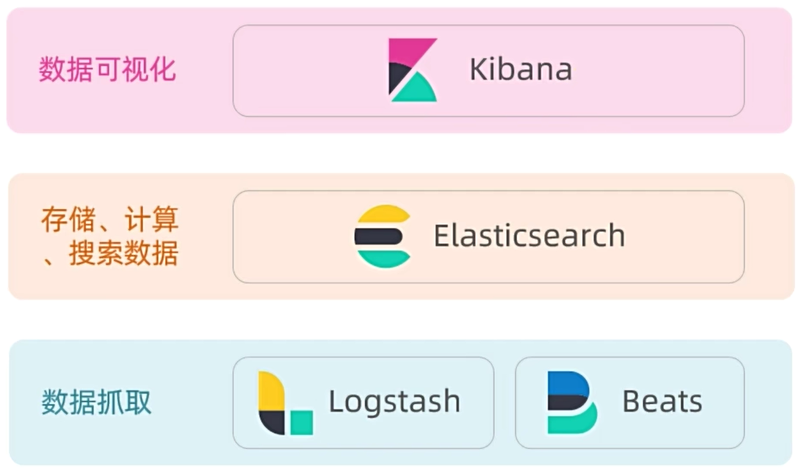

安装教程：[https://my.feishu.cn/wiki/LDLew5xnDiDv7Qk2uPwcoeNpngf](https://my.feishu.cn/wiki/LDLew5xnDiDv7Qk2uPwcoeNpngf)

---

# 2. 倒排索引

传统数据库（如MySQL）采用正向索引，例如给下表（tb_goods）中的id创建索引：

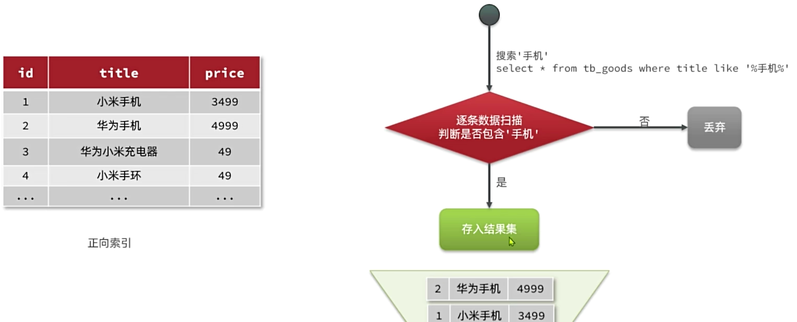

---

elasticsearch采用倒排索引：

- 文档（document）：每条数据就是一个文档
- 词条（term）：文档按照语义分成的词语

---

Elasticsearch 的核心优势之一在于其采用**倒排索引**，这与传统数据库（如 MySQL）的正向索引机制形成鲜明对比。

- **倒排索引的原理**：它不是通过“文档找词条”，而是建立“词条到文档”的映射关系。系统会先将文档内容进行分词，生成词条，然后记录每个词条出现在哪些文档中。
- **应用场景**：这种结构特别适合全文检索。例如，当用户搜索“高性能”时，系统可以直接通过倒排索引快速定位到包含该词条的所有文档，而无需遍历所有数据，从而实现毫秒级响应。

这种设计使得 Elasticsearch 在处理海量非结构化数据（如日志、商品描述、新闻文章）的搜索和分析时，展现出极高的效率和可扩展性。

此处为语雀图册卡片，点击链接查看：[https://www.yuque.com/fangzhou-ze0bw/ckexpk/gg7st4nzhf573ud4#oPkDw](https://www.yuque.com/fangzhou-ze0bw/ckexpk/gg7st4nzhf573ud4#oPkDw)

---

# 3. IK 分词器

中文分词往往需要根据语义分析，比较复杂，这就需要用到中文分词器，例如**IK分词器**。IK分词器是林良益在2006年开源发布的，其采用的正向迭代最细粒度切分算法一直沿用至今。

其安装的方式也比较简单，只要将资料提供好的分词器放入elasticsearch的插件目录即可：

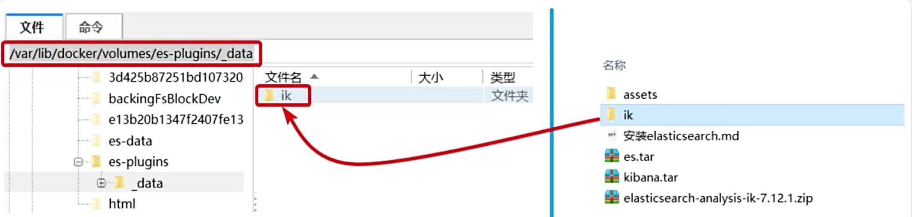

---

## 3.1. 为什么需要IK分词器？

Elasticsearch 默认的分词器对英文处理效果较好，但对中文支持有限。例如，对于“中国人民”这个短语，默认分词器可能会将其拆分为单个汉字“中”、“国”、“人”、“民”，这显然不符合中文的语义习惯。

**IK分词器**通过其智能算法，可以更准确地将中文文本切分为有意义的词汇，如“中国”、“人民”，从而大幅提升中文搜索的准确率和相关性。它是中文环境下使用 Elasticsearch 进行全文检索的必备插件。

---

## 3.2. 测试IK分词器

在Kibana的DevTools中可以使用下面的语法来测试IK分词器：

```
POST /_analyze
{
  "analyzer": "standard",
  "text": "黑马程序员学习java太棒了"
}
```

**语法说明：**

- **POST**：请求方式
- **/_analyze**：请求路径，这里省略了 `[http://192.168.179.140:9200/](http://192.168.179.140:9200/)`，有kibana帮我们补充

---

这段代码是用来测试 Elasticsearch 的分词效果的。

1. `**POST /_analyze**`：这是 Elasticsearch 提供的一个分析 API，用于查看文本经过分词器处理后的结果。
2. `**"analyzer": "standard"**`：这里指定了使用 `standard` 分词器。`standard` 是 Elasticsearch 的默认分词器，它对中文的处理方式是按单个汉字切分。
3. `**"text": "黑马程序员学习java太棒了"**`：这是要进行分词测试的原始文本。

如果你想测试 **IK分词器** 的效果，只需要将 `"analyzer": "standard"` 修改为 `"analyzer": "ik_max_word"`（最细粒度分词）或 `"analyzer": "ik_smart"`（智能分词），就能直观地看到 IK 分词器如何将中文句子切分成有意义的词语，而不是单个汉字。

---

## 3.3. 扩展词典

IK 分词器允许我们配置扩展 词典 来增加自定义的词库：

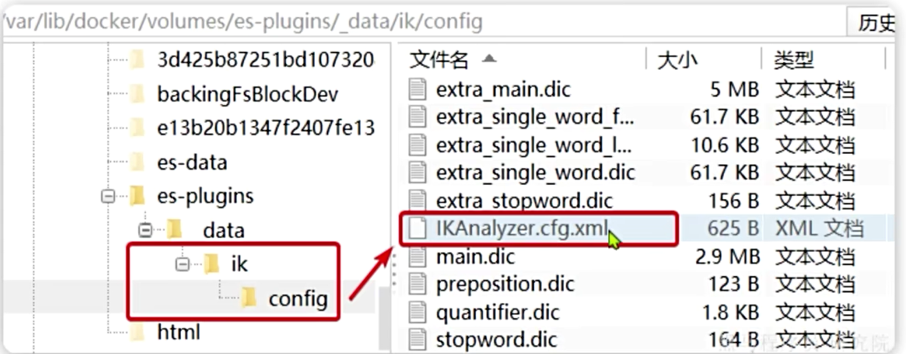

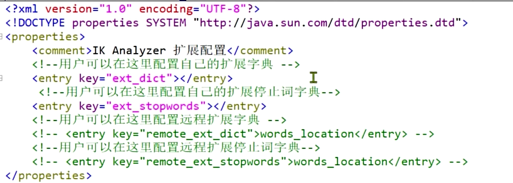

---

# 4. 基础概念

elasticsearch中的文档数据会被序列化为json格式后存储在elasticsearch中。

---

## 4.1. 为什么是 JSON 格式？

- **通用性**：JSON（JavaScript Object Notation）是一种轻量级的数据交换格式，易于人阅读和编写，同时也易于机器解析和生成。它支持的数据结构（对象、数组、字符串、数字等）非常灵活，能很好地映射 Elasticsearch 中的“文档”概念。
- **结构化存储**：在 Elasticsearch 中，每一条数据（即一个“文档”）本质上就是一个 JSON 对象。这种结构化的方式使得数据的增、删、改、查操作都非常直观和高效。
- **与 API 无缝对接**：Elasticsearch 的 RESTful API 本身就是基于 JSON 进行通信的。客户端发送的请求体（Request Body）和服务器返回的响应体（Response Body）都是 JSON 格式，这使得数据的序列化和反序列化过程非常自然和顺畅。

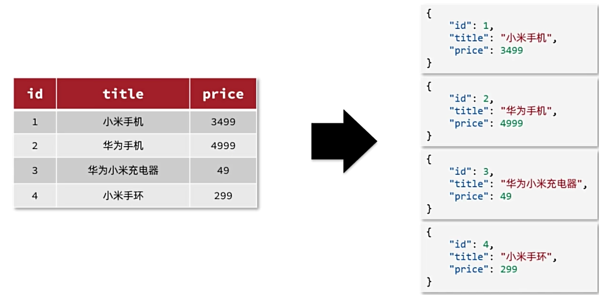

---

## 4.2. ES 的索引与映射

**索引（index）**：相同类型的文档的集合

**映射（mapping**）：索引中文档的字段约束信息，类似表的结构约束

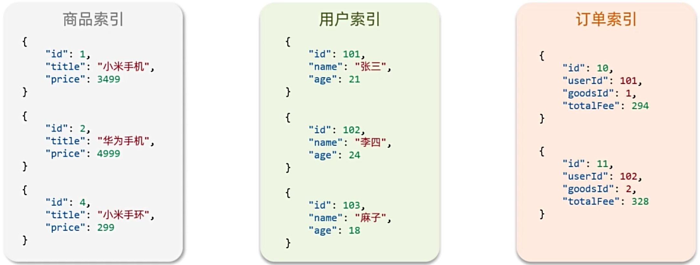

---

## 4.3. 与 MySQL 对比

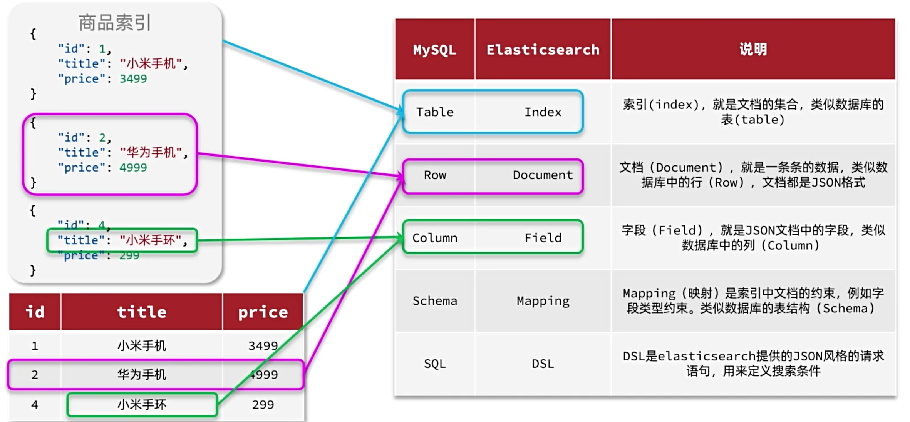

---

# 5. 索引库操作

## 5.1. Mapping 映射属性

mapping是对索引库中文档的约束，常见的mapping属性包括：

- **type**：字段数据类型，常见的简单类型有：

- **字符串**：`text`（可分词的文本）、`keyword`（精确值，例如：品牌、国家、ip地址）
- **数值**：`long`、`integer`、`short`、`byte`、`double`、`float`
- **布尔**：`boolean`
- **日期**：`date`
- **对象**：`object`

- **index**：是否创建索引，默认为`true`
- **analyzer**：使用哪种分词器
- **properties**：该字段的子字段

---

### 5.1.1. 核心属性解析

Mapping 在 Elasticsearch 中的作用类似于关系型数据库中的“表结构”定义。它决定了数据如何被存储和索引，直接影响搜索的准确性和性能。

- `**type**` **的选择至关重要**：

- `text` 类型用于全文检索，会经过分词器处理。
- `keyword` 类型用于精确匹配、排序和聚合，不会被分词。
- 例如，一个 `email` 字段，如果用于搜索收件人，应设为 `keyword`；如果用于搜索邮件正文内容，则应设为 `text`。

- `**analyzer**` **与** `**text**` **类型配合使用**：

- 当字段类型为 `text` 时，必须指定 `analyzer` 来定义分词规则。
- 如之前讨论的，对于中文内容，通常会指定 `analyzer` 为 `ik_max_word` 或 `ik_smart`，以获得更好的分词效果。

- `**index: false**` **的应用场景**：

- 如果某个字段仅用于展示，不需要参与搜索、排序或聚合，可以将其 `index` 设置为 `false`，以节省存储空间和提高索引效率。

---

## 5.2. 索引库 CRUD 操作

Elasticsearch提供的所有API都是Restful的接口，遵循Restful的基本规范。

### 5.2.1. 为什么是 RESTful API？

采用 RESTful 风格的 API 设计，为 Elasticsearch 带来了诸多优势，使其成为一个易于集成和使用的分布式搜索引擎。

- **统一接口**：RESTful API 使用标准的 HTTP 方法（如 `GET`、`POST`、`PUT`、`DELETE`）来对资源进行操作，语义清晰。例如，`GET /index/_doc/id` 用于获取文档，`DELETE /index` 用于删除索引。
- **无状态性**：每个请求都包含处理该请求所需的所有信息，服务器不保存客户端的上下文。这使得 Elasticsearch 集群可以轻松地实现水平扩展，提高系统的可用性和伸缩性。
- **广泛的兼容性**：RESTful API 基于 HTTP 协议，这意味着几乎任何编程语言（如 Java, Python, Go, JavaScript 等）都可以通过发送 HTTP 请求来与 Elasticsearch 进行交互，极大地降低了集成门槛。
- **易于调试和测试**：开发者可以直接使用 `curl` 命令、Postman 或 Kibana 的 DevTools 等工具来发送请求和查看响应，方便进行调试和功能测试。

---

### 5.2.2. 创建索引库

- **语法**：`PUT /索引库名`
- **示例**：`PUT /DriftBoat`

### 5.2.3. 查询索引库

- **语法**：`GET /索引库名`
- **示例**：`GET /DriftBoat`

### 5.2.4. 删除索引库

- **语法**：`DELETE /索引库名`
- **示例**：`DELETE /DriftBoat`

---

这两个操作是 Elasticsearch 中最基础的索引管理命令，用于查询索引信息和清理不再需要的索引。

- **创建索引（PUT）**：执行 `PUT /DriftBoat`时，Elasticsearch 会创建一个名为`DriftBoat`的索引
- **查看索引（GET）**：当你执行 `GET /DriftBoat` 时，Elasticsearch 会返回名为 `DriftBoat` 的索引的详细信息，包括其映射（mapping）、设置（settings）以及状态等。这是一个非常常用的命令，用于确认索引是否存在以及检查其配置。
- **删除索引（DELETE）**：执行 `DELETE /DriftBoat` 会永久删除名为 `DriftBoat` 的索引及其包含的所有文档数据。**这是一个不可逆的操作，请务必谨慎使用**。在生产环境中，删除索引前通常需要二次确认。

---

**索引库和mapping一旦创建无法修改**，但是可以添加新的字段，语法如下：

### 5.2.5. 添加新字段

```
PUT /索引库名/_mapping
{
  "properties": {
    "新字段名": {
      "type": "integer"
    }
  }
}
```

**添加新字段示例:**

```
PUT /heima/_mapping
{
  "properties": {
    "age": {
      "type": "integer"
    }
  }
}
```

---

- **核心限制**：Elasticsearch 中，索引库的 mapping（即数据结构定义）一旦创建，**已存在的字段类型和配置无法被修改**。这是为了保证数据的一致性和索引的稳定性。
- **唯一扩展方式**：虽然不能修改已有字段，但允许向已存在的索引中**追加（添加）新的字段**。这是扩展数据结构的标准做法。
- **语法解析**：

- `PUT /索引库名/_mapping`：这是更新映射的 API 端点。
- `properties`：在请求体中，通过 `properties` 对象来定义要添加的新字段。
- `"新字段名": { "type": "..." }`：指定新字段的名称和其数据类型（如示例中的 `integer`）。

- **实际应用场景**：

- 在 `heima` 索引中，如果最初没有 `age` 字段，但后续业务需要存储用户年龄，就可以通过此语法动态添加 `age` 字段，而无需重建整个索引。

---

# 6. 文档操作

## 6.1. 文档 CRUD

### 6.1.1. ➕ 创建文档

`POST /索引库名/_doc/文档id {json文档}`

### 6.1.2. 🔍 查询文档

`GET /索引库名/_doc/文档id`

### 6.1.3. ➖ 删除文档

`DELETE /索引库名/_doc/文档id`

### 6.1.4. ✏️ 修改文档

- **全量修改**：`PUT /索引库名/_doc/文档id {json文档}`
- **增量修改**：`POST /索引库名/_update/文档id { "doc": {字段} }`

---

### 6.1.5. 操作说明

- **创建文档（POST）**：向指定索引中添加一个新文档。如果文档 ID 已存在，则会覆盖原有文档；如果索引不存在，Elasticsearch 会自动创建该索引。
- **查询文档（GET）**：根据索引名和文档 ID 获取指定文档的完整内容。
- **删除文档（DELETE）**：根据索引名和文档 ID 删除指定文档。删除后数据不可恢复，请谨慎操作。
- **修改文档**：

- **全量修改（PUT）**：会删除旧文档，然后写入一个全新的文档。请求体中必须包含文档的所有字段，否则未提及的字段会被删除。
- **增量修改（POST** `**_update**`**）**：只针对 `doc` 对象中指定的字段进行更新，未提及的字段会保持原样，不会丢失数据。

---

## 6.2. 批量处理

Elasticsearch 允许通过一次请求携带多次文档操作，即批量处理。其核心语法格式如下：

### 6.2.1. 批量处理通用语法

向 `/_bulk` 端点发送 `POST` 请求，请求体由成对的 JSON 行组成。每一对包含一个**操作元数据行**和一个**可选的数据行**。

```
POST /_bulk
{ "index" : { "_index" : "索引库名", "_id" : "1" } }
{ "字段1" : "值1", "字段2" : "值2" }
{ "index" : { "_index" : "索引库名", "_id" : "1" } }
{ "字段1" : "值1", "字段2" : "值2" }
{ "delete" : { "_index" : "test", "_id" : "2" } }
{ "update" : {"_id" : "1", "_index" : "test"} }
{ "doc" : {"field2" : "value2"} }
```

---

### 6.2.2. 操作说明

- **请求端点**：所有批量操作都通过 `POST /_bulk` 发起。
- **操作格式**：请求体由多行 JSON 构成，**每行都必须以换行符** `**\n**` **结尾**，包括最后一行。格式为 `操作元数据` + `数据`（如果操作需要数据，如 `index` 和 `update`）。
- **支持的操作类型**：

- `index`：创建或全量替换文档。如果文档 ID 已存在，则覆盖；如果不存在，则创建。需要后续跟一个包含文档内容的 JSON 行。
- `delete`：删除指定 ID 的文档。**不需要**后续数据行。
- `update`：对文档进行增量更新。需要后续跟一个包含 `doc` 字段的 JSON 行，`doc` 内为要更新的字段。

- **元数据字段**：

- `_index`：指定操作的目标索引库名称。
- `_id`：指定操作的文档唯一 ID。

- **注意事项**：

- 批量操作是**原子性**的，但**不是事务性**的。这意味着单个操作的失败不会回滚其他已成功执行的操作。
- 响应结果会包含每个操作的执行状态，便于排查失败原因。
- 批量处理能显著减少网络请求开销，是提升数据写入和修改效率的推荐方式。

---

# 7. JavaRestClient

## 7.1. 客户端初始化

### 7.1.1. 1. 引入 Maven 依赖

首先，需要在项目的 `pom.xml` 文件中添加 Elasticsearch 的 REST 高级客户端依赖。

```
<dependency>
    <groupId>org.elasticsearch.client</groupId>
    <artifactId>elasticsearch-rest-high-level-client</artifactId>
</dependency>
```

### 7.1.2. 2. 管理版本兼容性

由于 Spring Boot 的父工程（Parent）可能默认管理了一个特定版本的 Elasticsearch（图片中提到默认为 7.17.0），如果你的服务端版本与此不一致，就需要在 `<properties>` 标签中显式覆盖版本号，以避免版本冲突。

```
<properties>
    <elasticsearch.version>7.12.1</elasticsearch.version>
</properties>
```

### 7.1.3. 3. 初始化客户端

最后，通过 Java 代码实例化 `RestHighLevelClient`。你需要构建一个 `RestClient` 并指定 ES 服务的地址（IP 和端口）。

```
RestHighLevelClient client = new RestHighLevelClient(RestClient.builder(
    HttpHost.create("http://192.168.150.101:9200")
));
```

---

### 7.1.4. 💡 补充说明

- **RestHighLevelClient 的现状**：需要注意的是，`RestHighLevelClient` 在 Elasticsearch 7.15.0 版本中已被**弃用**（Deprecated），并在 Elasticsearch 8.0 中被移除。
- **推荐替代方案**：官方推荐使用新的 **Elasticsearch Java API Client**（`co.elastic.clients:elasticsearch-java`）。如果你正在开启新项目，建议优先考虑使用新版客户端，它提供了更现代化的 API 和更好的类型安全性。

---

## 7.2. 商品 Mapping 映射

这张表详细定义了数据库字段与Elasticsearch（ES）索引Mapping之间的映射关系，明确了每个字段的类型、搜索属性及分词策略。以下是提取的核心信息：

### 7.2.1. 📋 字段映射详情

|   |   |   |   |   |   |
|---|---|---|---|---|---|
|字段名|字段类型|类型说明|是否参与搜索|是否参与分词|分词器|
|**id**|long|长整数|✅ 是|❌ 否|—|
|**name**|text|字符串，参与分词搜索|✅ 是|✅ 是|IK|
|**price**|integer|以分为单位，所以是整数|✅ 是|❌ 否|—|
|**stock**|integer|字符串，但需要分词|✅ 是|❌ 否|—|
|**image**|keyword|字符串，但是不分词|❌ 否|❌ 否|—|
|**category**|keyword|字符串，但是不分词|✅ 是|❌ 否|—|
|**brand**|keyword|字符串，但是不分词|✅ 是|❌ 否|—|
|**sold**|integer|销量，整数|✅ 是|❌ 否|—|
|**commentCount**|integer|评价，整数|❌ 否|❌ 否|—|
|**isAD**|boolean|布尔类型|✅ 是|❌ 否|—|
|**updateTime**|Date|更新时间|✅ 是|❌ 否|—|

### 7.2.2. 🔑 关键配置解读

1. **分词策略差异**

- `**name**` **字段**：被设置为 `text` 类型，并明确指定使用 **IK 分词器**。这意味着该字段的内容会被拆解成词条，适合用于全文检索（如商品名称搜索）。
- `**keyword**` **类型字段**：`image`、`category`、`brand` 被定义为 `keyword`，这意味着它们作为整体存储，不进行分词。这种类型通常用于过滤（Filtering）、排序（Sorting）或聚合（Aggregation），例如按品牌或分类筛选商品。

2. **搜索与存储优化**

- `**image**` **字段**：虽然存储了数据，但设置为**不参与搜索**。这是一种常见的优化手段，因为图片链接通常只用于展示，不需要被检索，这样可以减少索引体积，提高检索性能。
- `**commentCount**` **字段**：同样不参与搜索，可能仅用于前端展示或后端统计，无需构建倒排索引。

3. **数据类型注意**

- `**price**` **字段**：类型说明中提到“以分为单位，所以是整数”。这是电商系统中处理金额的常见做法，避免了浮点数运算带来的精度丢失问题。
- `**stock**` **字段**：类型说明中写着“字符串，但需要分词”，但这与其字段类型 `integer` 及“是否参与分词：否”存在描述上的矛盾。在实际ES映射中，`integer` 类型是无法分词的，通常库存也是作为数值进行范围查询或过滤，不进行分词处理。

---

### 7.2.3. 索引库文档结构

```
PUT /items
{
  "mappings": {
    "properties": {
      "id": {
        "type": "keyword"
      },
      "name":{
        "type": "text",
        "analyzer": "ik_max_word"
      },
      "price":{
        "type": "integer"
      },
      "stock":{
        "type": "integer"
      },
      "image":{
        "type": "keyword",
        "index": false
      },
      "category":{
        "type": "keyword"
      },
      "brand":{
        "type": "keyword"
      },
      "sold":{
        "type": "integer"
      },
      "commentCount":{
        "type": "integer",
        "index": false
      },
      "isAD":{
        "type": "boolean"
      },
      "updateTime":{
        "type": "date"
      }
    }
  }
}
```

---

## 7.3. 索引库操作

### 7.3.1. 创建索引库

```
@Test
void testCreateIndex() throws IOException {
    // 1.创建Request对象
    CreateIndexRequest request = new CreateIndexRequest("items");
    // 2.准备请求参数
    request.source(MAPPING_TEMPLATE, XContentType.JSON);
    // 3.发送请求
    client.indices().create(request, RequestOptions.DEFAULT);
}
```

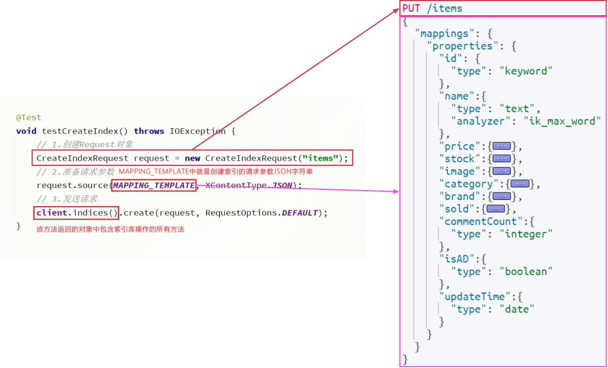

代码分为三步：

- 1）创建Request对象。

- 因为是创建索引库的操作，因此Request是`CreateIndexRequest`。

- 2）添加请求参数

- 其实就是Json格式的Mapping映射参数。因为json字符串很长，这里是定义了静态字符串常量`MAPPING_TEMPLATE`，让代码看起来更加优雅。

- 3）发送请求

- `client.indices()`方法的返回值是`IndicesClient`类型，封装了所有与索引库操作有关的方法。例如创建索引、删除索引、判断索引是否存在等

---

### 7.3.2. 删除索引库

```
@Test
void testDeleteHotelIndex() throws IOException {
    // 1. 创建Request对象
    DeleteIndexRequest request = new DeleteIndexRequest("indexName");
    // 2. 发起请求
    client.indices().delete(request, RequestOptions.DEFAULT);
}
```

- **删除索引库（**`**DeleteIndexRequest**`**）**：该操作会永久删除指定的索引及其包含的所有数据，执行前请务必确认，避免数据丢失。

### 7.3.3. 查询索引库信息

```
@Test
void testExistsHotelIndex() throws IOException {
    // 1. 创建Request对象
    GetIndexRequest request = new GetIndexRequest("indexName");
    // 2. 发起请求
    client.indices().get(request, RequestOptions.DEFAULT);
}
```

- **查询索引库信息（**`**GetIndexRequest**`**）**：该操作可以获取索引的配置信息，如映射（mapping）和设置（settings），常用于验证索引是否存在或检查其结构。

---

## 7.4. 文档操作

### 7.4.1. 新增文档

索引库结构与数据库结构还存在一些差异，因此我们要定义一个索引库结构对应的实体。

在`hm-service`模块的`com.hmall.item.domain.dto`包中定义一个新的DTO：

```
@Data
@ApiModel(description = "索引库实体")
public class ItemDoc{

    @ApiModelProperty("商品id")
    private String id;

    @ApiModelProperty("商品名称")
    private String name;

    @ApiModelProperty("价格（分）")
    private Integer price;

    @ApiModelProperty("商品图片")
    private String image;

    @ApiModelProperty("类目名称")
    private String category;

    @ApiModelProperty("品牌名称")
    private String brand;

    @ApiModelProperty("销量")
    private Integer sold;

    @ApiModelProperty("评论数")
    private Integer commentCount;

    @ApiModelProperty("是否是推广广告，true/false")
    private Boolean isAD;

    @ApiModelProperty("更新时间")
    private LocalDateTime updateTime;
}
```

---

新增文档的请求语法如下：

```
POST /{索引库名}/_doc/1
{
  "name": "Jack",
  "age": 21
}
```

对应的 JavaAPI 如下：

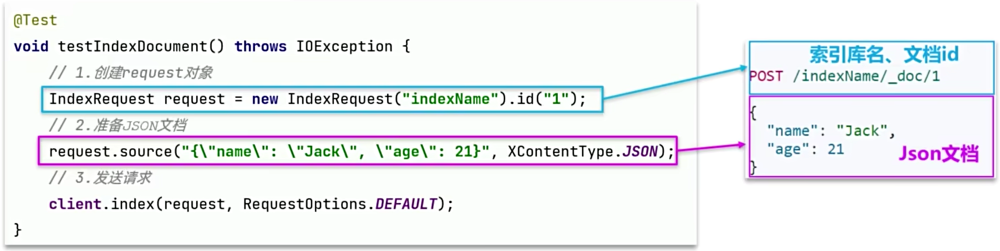

---

在`item-service`的`DocumentTest`测试类中，编写单元测试：

```
@Test
void testAddDocument() throws IOException {
    // 1.根据id查询商品数据
    Item item = itemService.getById(100002644680L);
    // 2.转换为文档类型
    ItemDoc itemDoc = BeanUtil.copyProperties(item, ItemDoc.class);
    // 3.将ItemDTO转json
    String doc = JSONUtil.toJsonStr(itemDoc);
    
    // 1.准备Request对象
    IndexRequest request = new IndexRequest("items").id(itemDoc.getId());
    // 2.准备Json文档
    request.source(doc, XContentType.JSON);
    // 3.发送请求
    client.index(request, RequestOptions.DEFAULT);
}
```

---

### 7.4.2. 查询文档

查询的请求语句如下：

```
GET /{索引库名}/_doc/{id}
```

示例代码如下：

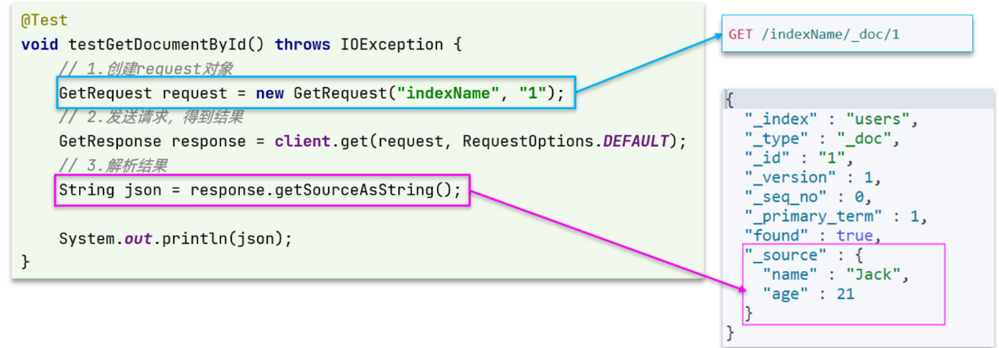

可以看到，响应结果是一个JSON，其中文档放在一个`_source`属性中，因此解析就是拿到`_source`，反序列化为Java对象即可。

其它代码与之前类似，流程如下：

- 1）准备Request对象。这次是查询，所以是`GetRequest`
- 2）发送请求，得到结果。因为是查询，这里调用`client.get()`方法
- 3）解析结果，就是对JSON做反序列化

---

在`item-service`的`DocumentTest`测试类中，编写单元测试：

```
@Test
void testGetDocumentById() throws IOException {
    // 1.准备Request对象
    GetRequest request = new GetRequest("items").id("100002644680");
    // 2.发送请求
    GetResponse response = client.get(request, RequestOptions.DEFAULT);
    // 3.获取响应结果中的source
    String json = response.getSourceAsString();
    
    ItemDoc itemDoc = JSONUtil.toBean(json, ItemDoc.class);
    System.out.println("itemDoc= " + ItemDoc);
}
```

---

### 7.4.3. 删除文档

删除的请求语句如下：

```
DELETE /hotel/_doc/{id}
```

与查询相比，仅仅是请求方式从`DELETE`变成`GET`，可以想象Java代码应该依然是2步走：

- 1）准备Request对象，因为是删除，这次是`DeleteRequest`对象。要指定索引库名和id
- 2）准备参数，无参，直接省略
- 3）发送请求。因为是删除，所以是`client.delete()`方法

在`item-service`的`DocumentTest`测试类中，编写单元测试：

```
@Test
void testDeleteDocument() throws IOException {
    // 1.准备Request，两个参数，第一个是索引库名，第二个是文档id
    DeleteRequest request = new DeleteRequest("item", "100002644680");
    // 2.发送请求
    client.delete(request, RequestOptions.DEFAULT);
}
```

---

### 7.4.4. 修改文档

修改有两种方式：

- 全量修改：本质是先根据id删除，再新增
- 局部修改：修改文档中的指定字段值

在RestClient的API中，全量修改与新增的API完全一致，判断依据是ID：

- 如果新增时，ID已经存在，则修改
- 如果新增时，ID不存在，则新增

局部修改的请求语法如下：

```
POST /{索引库名}/_update/{id}
{
  "doc": {
    "字段名": "字段值",
    "字段名": "字段值"
  }
}
```

代码示例如图：

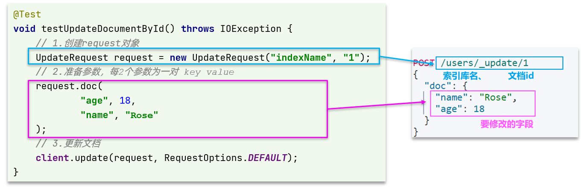

与之前类似，也是三步走：

- 1）准备`Request`对象。这次是修改，所以是`UpdateRequest`
- 2）准备参数。也就是JSON文档，里面包含要修改的字段
- 3）更新文档。这里调用`client.update()`方法

在`item-service`的`DocumentTest`测试类中，编写单元测试：

```
@Test
void testUpdateDocument() throws IOException {
    // 1.准备Request
    UpdateRequest request = new UpdateRequest("items", "100002644680");
    // 2.准备请求参数
    request.doc(
        "price", 58800,
        "commentCount", 1
    );
    // 3.发送请求
    client.update(request, RequestOptions.DEFAULT);
}
```

---

### 7.4.5. 批量导入

在之前的案例中，我们都是操作单个文档。而数据库中的商品数据实际会达到数十万条，某些项目中可能达到数百万条。

我们如果要将这些数据导入索引库，肯定不能逐条导入，而是采用批处理方案。常见的方案有：

- 利用**Logstash**批量导入

- 需要安装Logstash
- 对数据的再加工能力较弱
- 无需编码，但要学习编写Logstash导入配置

- 利用**JavaAPI**批量导入

- 需要编码，但基于JavaAPI，学习成本低
- 更加灵活，可以任意对数据做再加工处理后写入索引库

批处理与前面讲的文档的CRUD步骤基本一致：

- 创建Request，但这次用的是`**BulkRequest**`
- 准备请求参数
- 发送请求，这次要用到`**client.bulk()**`方法

`BulkRequest`本身其实并没有请求参数，其本质就是将多个普通的CRUD请求组合在一起发送。例如：

- 批量新增文档，就是给每个文档创建一个`IndexRequest`请求，然后封装到`BulkRequest`中，一起发出。
- 批量删除，就是创建N个`**DeleteRequest**`请求，然后封装到`**BulkRequest**`，一起发出

因此`BulkRequest`中提供了`**add**`方法，用以添加其它CRUD的请求：

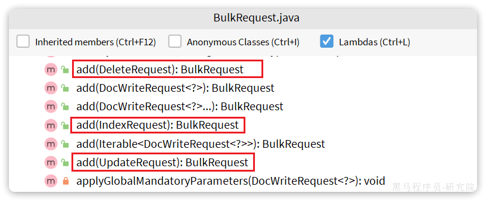

可以看到，能添加的请求有：

- `IndexRequest`，也就是新增
- `UpdateRequest`，也就是修改
- `DeleteRequest`，也就是删除

因此Bulk中添加了多个`IndexRequest`，就是批量新增功能了。示例：

```
@Test
void testBulk() throws IOException {
    // 1.创建Request
    BulkRequest request = new BulkRequest();
    // 2.准备请求参数
    request.add(new IndexRequest("items").id("1").source("json doc1", XContentType.JSON));
    request.add(new IndexRequest("items").id("2").source("json doc2", XContentType.JSON));
    // 3.发送请求
    client.bulk(request, RequestOptions.DEFAULT);
}
```

当我们要导入商品数据时，由于商品数量达到数十万，因此不可能一次性全部导入。建议采用循环遍历方式，每次导入1000条左右的数据。

`item-service`的`DocumentTest`测试类中，编写单元测试：

```
@Test
void testLoadItemDocs() throws IOException {
    // 分页查询商品数据
    int pageNo = 1;
    int size = 1000;
    while (true) {
        Page<Item> page = itemService.lambdaQuery().eq(Item::getStatus, 1).page(new Page<Item>(pageNo, size));
        // 非空校验
        List<Item> items = page.getRecords();
        if (CollUtils.isEmpty(items)) {
            return;
        }
        log.info("加载第{}页数据，共{}条", pageNo, items.size());
        // 1.创建Request
        BulkRequest request = new BulkRequest("items");
        // 2.准备参数，添加多个新增的Request
        for (Item item : items) {
            // 2.1.转换为文档类型ItemDTO
            ItemDoc itemDoc = BeanUtil.copyProperties(item, ItemDoc.class);
            // 2.2.创建新增文档的Request对象
            request.add(new IndexRequest()
                        .id(itemDoc.getId())
                        .source(JSONUtil.toJsonStr(itemDoc), XContentType.JSON));
        }
        // 3.发送请求
        client.bulk(request, RequestOptions.DEFAULT);
    
        // 翻页
        pageNo++;
    }
}
```

---

# 8. DSL 查询

Elasticsearch的查询可以分为两大类：

- **叶子查询（Leaf** **query** **clauses）**：一般是在特定的字段里查询特定值，属于简单查询，很少单独使用。
- **复合查询（Compound query clauses）**：以逻辑方式组合多个叶子查询或者更改叶子查询的行为方式。

查询的语法结构：

```
GET /{索引库名}/_search
{
  "query": {
    "查询类型": {
      // .. 查询条件
    }
  }
}
```

说明：

- `**GET /{索引库名}/_search**`：其中的`**_search**`是**固定路径，不能修改**

执行结果如下：

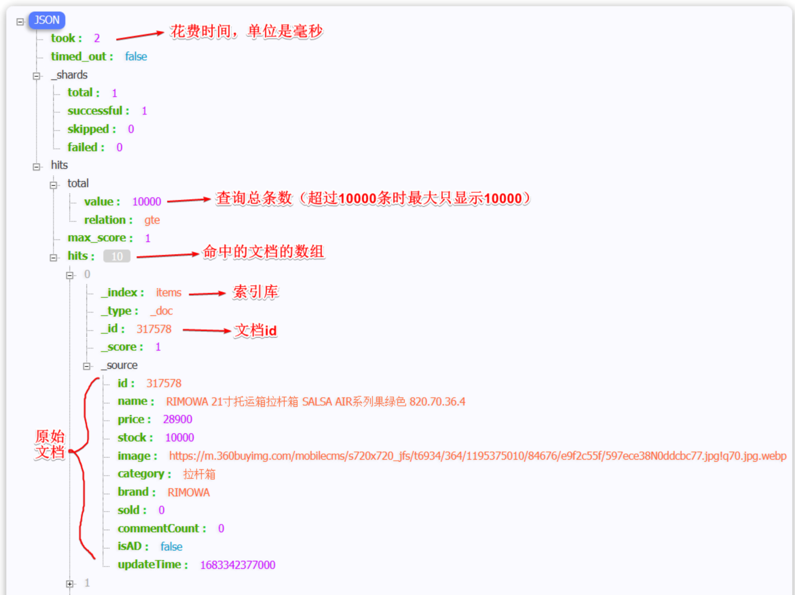

---

## 8.1. 叶子查询

官方文档：[https://www.elastic.co/guide/en/elasticsearch/reference/7.12/query-dsl.html](https://www.elastic.co/guide/en/elasticsearch/reference/7.12/query-dsl.html)

常见的几种：

- **全文检索查询（Full Text Queries）**：利用**分词器**对用户输入搜索条件先分词，得到词条，然后再利用**倒排索引**搜索词条。例如：

- `match`：
- `multi_match`

- **精确查询（****Term-level queries****）**：不对用户输入搜索条件分词，根据字段内容精确值匹配。但只能查找keyword、数值、日期、boolean类型的字段。例如：

- `ids`
- `term`
- `range`

- **地理坐标查询****：**用于搜索地理位置，搜索方式很多，例如：

- `geo_bounding_box`：按矩形搜索
- `geo_distance`：按点和半径搜索

---

### 8.1.1. 全文检索查询

官方文档：[https://www.elastic.co/guide/en/elasticsearch/reference/7.12/full-text-queries.html](https://www.elastic.co/guide/en/elasticsearch/reference/7.12/full-text-queries.html)

以全文检索中的`**match**`为例，语法如下：

```
GET /{索引库名}/_search
{
  "query": {
    "match": {
      "字段名": "搜索条件"
    }
  }
}
```

示例：

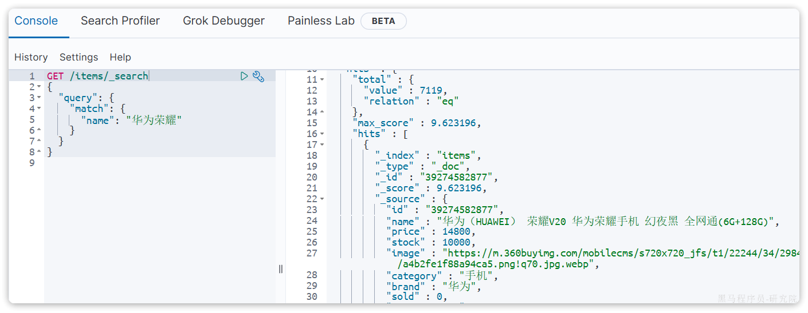

与`match`类似的还有`multi_match`，区别在于可以同时对**多个字段**搜索，而且多个字段都要满足，语法示例：

```
GET /{索引库名}/_search
{
  "query": {
    "multi_match": {
      "query": "搜索条件",
      "fields": ["字段1", "字段2"]
    }
  }
}
```

示例：

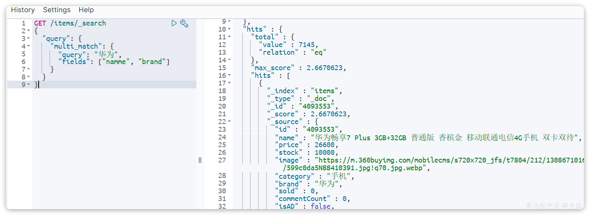

---

### 8.1.2. 精确查询

官网文档：[https://www.elastic.co/guide/en/elasticsearch/reference/7.12/term-level-queries.html](https://www.elastic.co/guide/en/elasticsearch/reference/7.12/term-level-queries.html)

**精确查询**，英文是`**Term-level query**`，顾名思义，词条级别的查询。也就是说不会对用户输入的搜索条件再分词，而是作为一个词条，与搜索的字段内容精确值匹配。因此推荐查找`keyword`、数值、日期、`boolean`类型的字段。例如：

- id
- price
- 城市
- 地名
- 人名

等等，作为一个整体才有含义的字段。

以`**term**`查询为例，其语法如下：

```
GET /{索引库名}/_search
{
  "query": {
    "term": {
      "字段名": {
        "value": "搜索条件"
      }
    }
  }
}
```

示例：

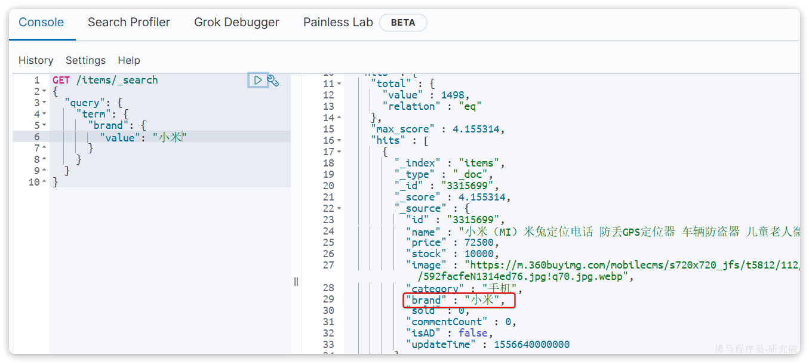

当你输入的搜索条件不是词条，而是短语时，由于不做分词，你反而搜索不到：

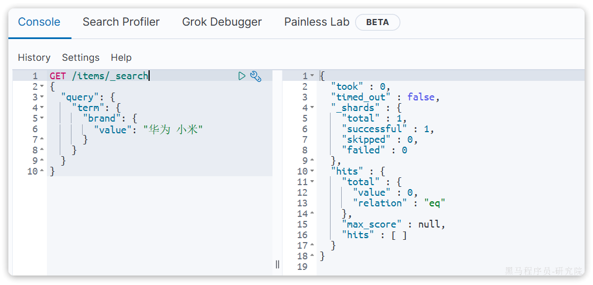

再来看下`range`查询，语法如下：

```
GET /{索引库名}/_search
{
  "query": {
    "range": {
      "字段名": {
        "gte": {最小值},
        "lte": {最大值}
      }
    }
  }
}
```

`range`是范围查询，对于范围筛选的关键字有：

- `gte`：大于等于
- `gt`：大于
- `lte`：小于等于
- `lt`：小于

示例：

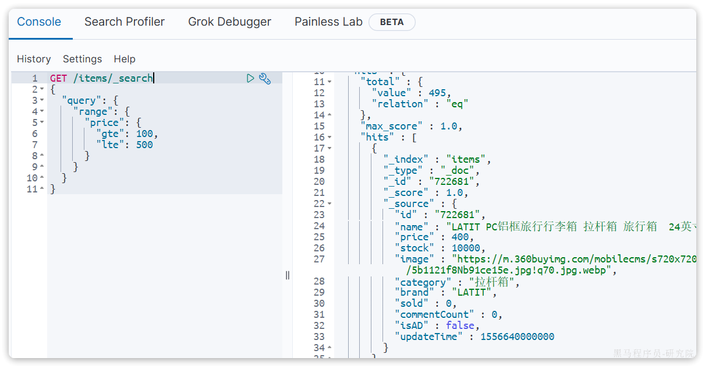

---

## 8.2. 复合查询

官网文档：[https://www.elastic.co/guide/en/elasticsearch/reference/7.12/compound-queries.html](https://www.elastic.co/guide/en/elasticsearch/reference/7.12/compound-queries.html)

复合查询大致可以分为两类：

- 第一类：基于**逻辑运算**组合叶子查询，实现组合条件，例如

- bool

- 第二类：基于某种算法修改查询时的文档相关性算分，从而改变文档排名。例如：

- function_score
- dis_max

### 8.2.1. 算分函数查询（选讲）

当我们利用**match**查询时，文档结果会根据与搜索词条的**关联度打分**（**_score**），返回结果时按照分值降序排列。

例如，我们搜索 "手机"，结果如下：

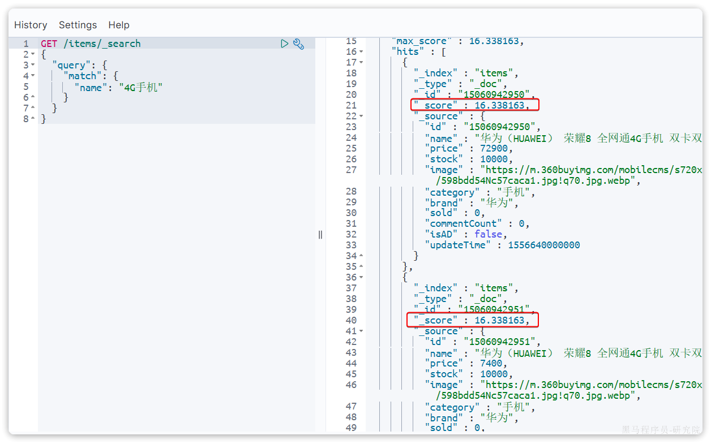

从elasticsearch5.1开始，采用的相关性打分算法是BM25算法，公式如下：

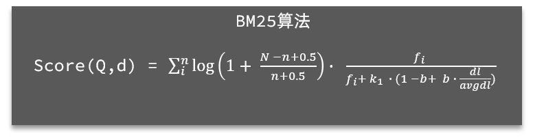

基于这套公式，就可以判断出某个文档与用户搜索的关键字之间的关联度，还是比较准确的。但是，在实际业务需求中，常常会有竞价排名的功能。不是相关度越高排名越靠前，而是掏的钱多的排名靠前。

例如在百度中搜索Java培训，排名靠前的就是广告推广：


要想认为控制相关性算分，就需要利用elasticsearch中的**function score** 查询了。

---

**基本语法**：

**function score** 查询中包含四部分内容：

- **原始查询**条件：query部分，基于这个条件搜索文档，并且基于BM25算法给文档打分，**原始算分**（query score)
- **过滤条件**：filter部分，符合该条件的文档才会重新算分
- **算分函数**：符合filter条件的文档要根据这个函数做运算，得到的**函数算分**（function score），有四种函数

- weight：函数结果是常量
- field_value_factor：以文档中的某个字段值作为函数结果
- random_score：以随机数作为函数结果
- script_score：自定义算分函数算法

- **运算模式**：算分函数的结果、原始查询的相关性算分，两者之间的运算方式，包括：

- multiply：相乘
- replace：用function score替换query score
- 其它，例如：sum、avg、max、min

**function score**的运行流程如下：

- 1）根据**原始条件**查询搜索文档，并且计算相关性算分，称为**原始算分**（query score）
- 2）根据**过滤条件**，过滤文档
- 3）符合**过滤条件**的文档，基于**算分函数**运算，得到**函数算分**（function score）
- 4）将**原始算分**（query score）和**函数算分**（function score）基于**运算模式**做运算，得到最终结果，作为相关性算分。

因此，其中的关键点是：

- 过滤条件：决定哪些文档的算分被修改
- 算分函数：决定函数算分的算法
- 运算模式：决定最终算分结果

示例：给IPhone这个品牌的手机算分提高十倍，分析如下：

- 过滤条件：品牌必须为IPhone
- 算分函数：常量weight，值为10
- 算分模式：相乘multiply

对应代码如下：

```
GET /hotel/_search
{
  "query": {
    "function_score": {
      "query": {  .... }, // 原始查询，可以是任意条件
      "functions": [ // 算分函数
        {
          "filter": { // 满足的条件，品牌必须是Iphone
            "term": {
              "brand": "Iphone"
            }
          },
          "weight": 10 // 算分权重为2
        }
      ],
      "boost_mode": "multipy" // 加权模式，求乘积
    }
  }
}
```

---

### 8.2.2. bool查询

bool查询，即布尔查询。就是利用逻辑运算来组合一个或多个查询子句的组合。bool查询支持的逻辑运算有：

- **must**：必须匹配每个子查询，类似“与”
- **should**：选择性匹配子查询，类似“或”
- **must_not**：必须不匹配，**不参与算分**，类似“非”
- **filter**：必须匹配，**不参与算分**

bool查询的语法如下：

```
GET /items/_search
{
  "query": {
    "bool": {
      "must": [
        {"match": {"name": "手机"}}
      ],
      "should": [
        {"term": {"brand": { "value": "vivo" }}},
        {"term": {"brand": { "value": "小米" }}}
      ],
      "must_not": [
        {"range": {"price": {"gte": 2500}}}
      ],
      "filter": [
        {"range": {"price": {"lte": 1000}}}
      ]
    }
  }
}
```

出于性能考虑，与搜索关键字无关的查询尽量采用**must_not**或**filter**逻辑运算，避免参与相关性算分。

例如黑马商城的搜索页面：


其中输入框的搜索条件肯定要参与相关性算分，可以采用**match**。但是价格范围过滤、品牌过滤、分类过滤等尽量采用filter，不要参与相关性算分。

比如，我们要搜索`手机`，但品牌必须是`华为`，价格必须是`900~1599`，那么可以这样写：

```
GET /items/_search
{
  "query": {
    "bool": {
      "must": [
        {"match": {"name": "手机"}}
      ],
      "filter": [
        {"term": {"brand": { "value": "华为" }}},
        {"range": {"price": {"gte": 90000, "lt": 159900}}}
      ]
    }
  }
}
```

---

## 8.3. 排序

elasticsearch默认是根据相关度算分（`**_score**`）来排序，但是也支持自定义方式对搜索结果排序。不过分词字段无法排序，能参与排序字段类型有：`**keyword**`类型、数值类型、地理坐标类型、日期类型等。

官网文档：[https://www.elastic.co/guide/en/elasticsearch/reference/7.12/sort-search-results.html](https://www.elastic.co/guide/en/elasticsearch/reference/7.12/sort-search-results.html)

语法说明：

```
GET /indexName/_search
{
  "query": {
    "match_all": {}
  },
  "sort": [
    {
      "排序字段": {
        "order": "排序方式asc和desc"
      }
    }
  ]
}
```

示例，我们按照商品价格排序：

```
GET /items/_search
{
  "query": {
    "match_all": {}
  },
  "sort": [
    {
      "price": {
        "order": "desc"
      }
    }
  ]
}
```

---

## 8.4. 分页

elasticsearch 默认情况下只返回top10的数据。而如果要查询更多数据就需要修改分页参数了。

### 8.4.1. 基础分页

elasticsearch中通过修改`from`、`size`参数来控制要返回的分页结果：

- `from`：从第几个文档开始
- `size`：总共查询几个文档

类似于mysql中的`limit ?, ?`

官网文档：[https://www.elastic.co/guide/en/elasticsearch/reference/7.12/paginate-search-results.html](https://www.elastic.co/guide/en/elasticsearch/reference/7.12/paginate-search-results.html)

语法如下：

```
GET /items/_search
{
  "query": {
    "match_all": {}
  },
  "from": 0, // 分页开始的位置，默认为0
  "size": 10,  // 每页文档数量，默认10
  "sort": [
    {
      "price": {
        "order": "desc"
      }
    }
  ]
}
```

---

### 8.4.2. 深度分页

官网文档：[https://www.elastic.co/guide/en/elasticsearch/reference/7.12/paginate-search-results.html](https://www.elastic.co/guide/en/elasticsearch/reference/7.12/paginate-search-results.html)

elasticsearch的数据一般会采用分片存储，也就是把一个索引中的数据分成N份，存储到不同节点上。这种存储方式比较有利于数据扩展，但给分页带来了一些麻烦。

比如一个索引库中有100000条数据，分别存储到4个分片，每个分片25000条数据。现在每页查询10条，查询第99页。那么分页查询的条件如下：

```
GET /items/_search
{
  "from": 990, // 从第990条开始查询
  "size": 10, // 每页查询10条
  "sort": [
    {
      "price": "asc"
    }
  ]
}
```

从语句来分析，要查询第990~1000名的数据。

从实现思路来分析，肯定是将所有数据排序，找出前1000名，截取其中的990~1000的部分。但问题来了，我们如何才能找到所有数据中的前1000名呢？

要知道每一片的数据都不一样，第1片上的第900~1000，在另1个节点上并不一定依然是900~1000名。所以我们只能在每一个分片上都找出排名前1000的数据，然后汇总到一起，重新排序，才能找出整个索引库中真正的前1000名，此时截取990~1000的数据即可。

如图：

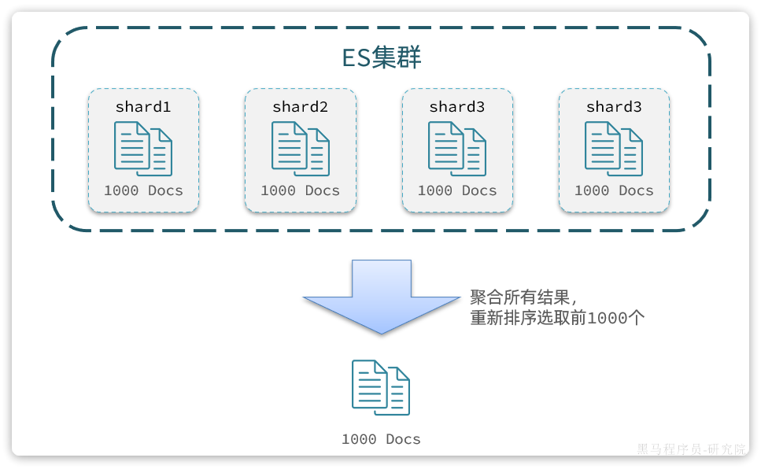

试想一下，假如我们现在要查询的是第999页数据呢，是不是要找第9990~10000的数据，那岂不是需要把每个分片中的前10000名数据都查询出来，汇总在一起，在内存中排序？如果查询的分页深度更深呢，需要一次检索的数据岂不是更多？

由此可知，当查询分页深度较大时，汇总数据过多，对内存和CPU会产生非常大的压力。

因此elasticsearch会禁止`from+ size`超过10000的请求。

针对深度分页，elasticsearch提供了两种解决方案：

- `search after`：分页时需要排序，原理是从上一次的排序值开始，查询下一页数据。官方推荐使用的方式。
- `scroll`：原理将排序后的文档id形成快照，保存下来，基于快照做分页。官方已经不推荐使用。

---

## 8.5. 高亮

### 8.5.1. 高亮原理

什么是高亮显示呢？

我们在百度，京东搜索时，关键字会变成红色，比较醒目，这叫高亮显示：

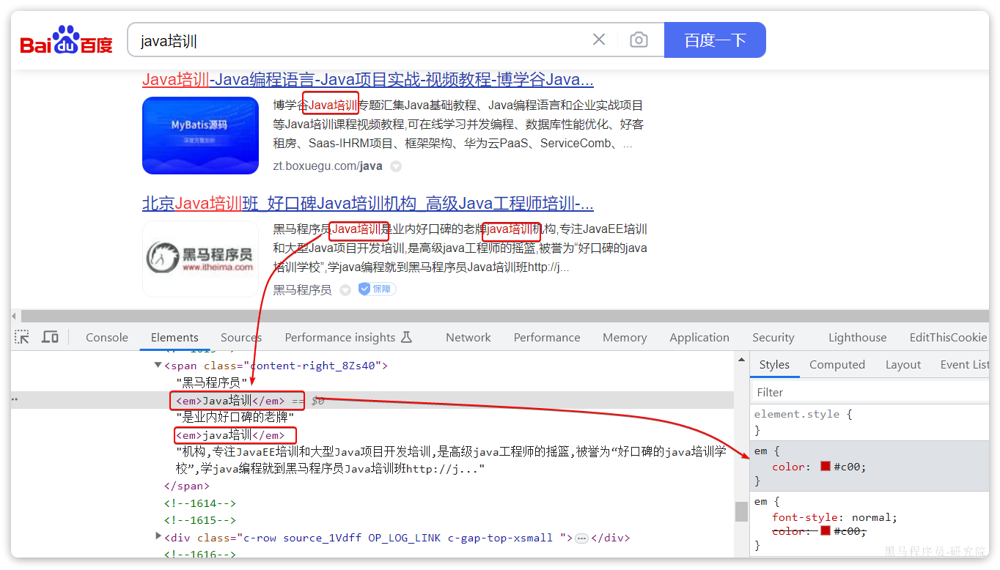

观察页面源码，你会发现两件事情：

- 高亮词条都被加了`**<em>**`标签
- `<em>`标签都添加了红色样式

css样式肯定是前端实现页面的时候写好的，但是前端编写页面的时候是不知道页面要展示什么数据的，不可能给数据加标签。而服务端实现搜索功能，要是有`elasticsearch`做分词搜索，是知道哪些词条需要高亮的。

因此词条的**高亮标签肯定是由服务端提供数据的时候已经加上的**。

因此实现高亮的思路就是：

- 用户输入搜索关键字搜索数据
- 服务端根据搜索关键字到elasticsearch搜索，并给搜索结果中的关键字词条添加`html`标签
- 前端提前给约定好的`html`标签添加`CSS`样式

---

### 8.5.2. 实现高亮

事实上elasticsearch已经提供了给搜索关键字加标签的语法，无需我们自己编码。

基本语法如下：

```
GET /{索引库名}/_search
{
  "query": {
    "match": {
      "搜索字段": "搜索关键字"
    }
  },
  "highlight": {
    "fields": {
      "高亮字段名称": {
        "pre_tags": "<em>",
        "post_tags": "</em>"
      }
    }
  }
}
```

**注意**：

- 搜索必须有查询条件，而且是全文检索类型的查询条件，例如`**match**`
- 参与高亮的字段必须是`**text**`类型的字段
- 默认情况下参与高亮的字段要与搜索字段一致，除非添加：`**required_field_match=false**`

示例：

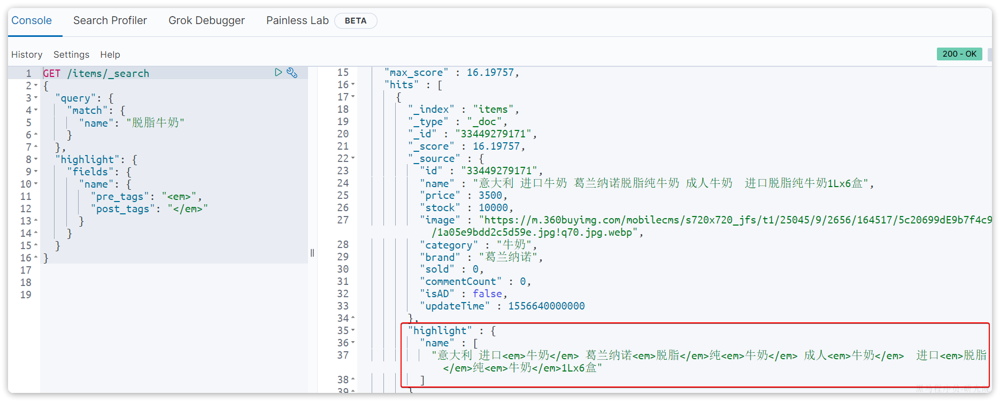

---

## 8.6. 总结

查询的DSL是一个大的JSON对象，包含下列属性：

- `query`：查询条件
- `from`和`size`：分页条件
- `sort`：排序条件
- `highlight`：高亮条件

---

# 9. RestClient查询

文档的查询依然使用 `RestHighLevelClient`对象，查询的基本步骤如下：

- 1）创建`request`对象，这次是搜索，所以是`SearchRequest`
- 2）准备请求参数，也就是查询DSL对应的JSON参数
- 3）发起请求
- 4）解析响应，响应结果相对复杂，需要逐层解析

---

## 9.1. 快速入门

由于Elasticsearch对外暴露的接口都是Restful风格的接口，因此JavaAPI调用就是在发送Http请求。而我们核心要做的就是利用**利用Java代码组织请求参数**，**解析响应结果。**

### 9.1.1. 发送请求

首先以`**match_all**`查询为例，其**DSL**和**JavaAPI**的对比如图：

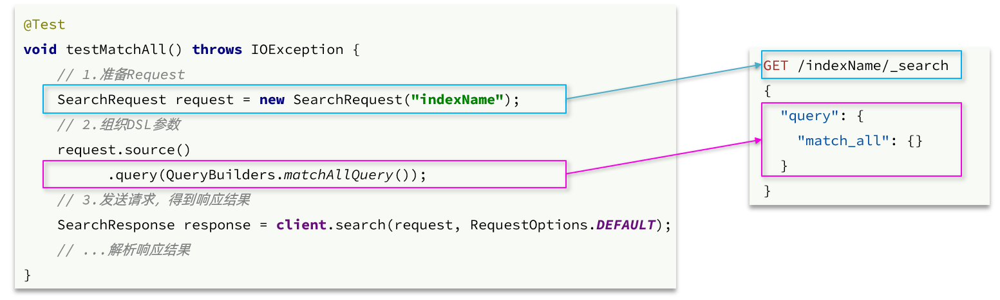

代码解读：

- 第一步，创建`SearchRequest`对象，指定索引库名
- 第二步，利用`request.source()`构建DSL，DSL中可以包含查询、分页、排序、高亮等

- `query()`：代表查询条件，利用`QueryBuilders.matchAllQuery()`构建一个`match_all`查询的DSL

- 第三步，利用`client.search()`发送请求，得到响应

这里关键的API有两个，一个是`**request.source()**`，它构建的就是DSL中的完整JSON参数。其中包含了`**query**`、`**sort**`、`**from**`、`**size**`、`**highlight**`等所有功能：

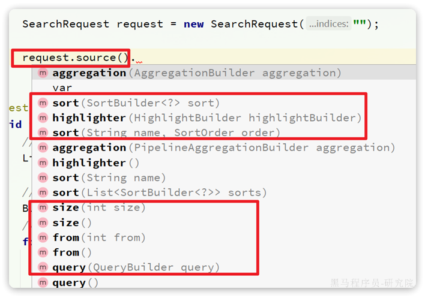

另一个是`**QueryBuilders**`，其中包含了我们学习过的各种**叶子查询**、**复合查询**等：

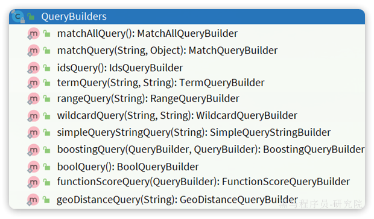

---

### 9.1.2. 解析响应结果

在发送请求以后，得到了响应结果`**SearchResponse**`，这个类的结构与我们在kibana中看到的响应结果JSON结构完全一致：

```
{
  "took" : 0,
  "timed_out" : false,
  "hits" : {
    "total" : {
      "value" : 2,
      "relation" : "eq"
    },
    "max_score" : 1.0,
    "hits" : [
      {
        "_index" : "heima",
        "_type" : "_doc",
        "_id" : "1",
        "_score" : 1.0,
        "_source" : {
          "info" : "Java讲师",
          "name" : "赵云"
        }
      }
    ]
  }
}
```

因此，我们解析`**SearchResponse**`的代码就是在解析这个JSON结果，对比如下：

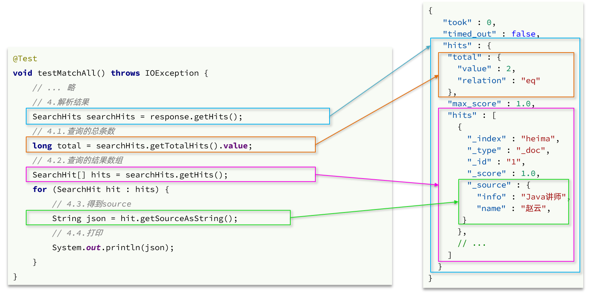

**代码解读**：

elasticsearch返回的结果是一个JSON字符串，结构包含：

- `hits`：命中的结果

- `total`：总条数，其中的value是具体的总条数值
- `max_score`：所有结果中得分最高的文档的相关性算分
- `hits`：搜索结果的文档数组，其中的每个文档都是一个json对象

- `_source`：文档中的原始数据，也是json对象

因此，我们解析响应结果，就是逐层解析JSON字符串，流程如下：

- `SearchHits`：通过`response.getHits()`获取，就是JSON中的最外层的`hits`，代表命中的结果

- `SearchHits``#``getTotalHits().value`：获取总条数信息
- `SearchHits#getHits()`：获取`SearchHit`数组，也就是文档数组

- `SearchHit#getSourceAsString()`：获取文档结果中的`_source`，也就是原始的`json`文档数据

完整代码：

```
@Test
void testMatchAll() throws IOException {
    // 1.创建Request
    SearchRequest request = new SearchRequest("items");
    // 2.组织请求参数
    request.source().query(QueryBuilders.matchAllQuery());
    // 3.发送请求
    SearchResponse response = client.search(request, RequestOptions.DEFAULT);
    // 4.解析响应
    handleResponse(response);
}

private void handleResponse(SearchResponse response) {
    SearchHits searchHits = response.getHits();
    // 1.获取总条数
    long total = searchHits.getTotalHits().value;
    System.out.println("共搜索到" + total + "条数据");
    // 2.遍历结果数组
    SearchHit[] hits = searchHits.getHits();
    for (SearchHit hit : hits) {
        // 3.得到_source，也就是原始json文档
        String source = hit.getSourceAsString();
        // 4.反序列化并打印
        ItemDoc item = JSONUtil.toBean(source, ItemDoc.class);
        System.out.println(item);
    }
}
```

---

### 9.1.3. 总结

文档搜索的基本步骤是：

1. 创建`SearchRequest`对象
2. 准备`request.source()`，也就是DSL。

3. `QueryBuilders`来构建查询条件
4. 传入`request.source()` 的 `query()` 方法

5. 发送请求，得到结果
6. 解析结果（参考JSON结果，从外到内，逐层解析）

---

## 9.2. 叶子查询

所有的查询条件都是由QueryBuilders来构建的，叶子查询也不例外。因此整套代码中变化的部分仅仅是query条件构造的方式，其它不动。

例如`**match**`查询：

```
@Test
void testMatch() throws IOException {
    // 1.创建Request
    SearchRequest request = new SearchRequest("items");
    // 2.组织请求参数
    request.source().query(QueryBuilders.matchQuery("name", "脱脂牛奶"));
    // 3.发送请求
    SearchResponse response = client.search(request, RequestOptions.DEFAULT);
    // 4.解析响应
    handleResponse(response);
}
```

再比如`multi_match`查询：

```
@Test
void testMultiMatch() throws IOException {
    // 1.创建Request
    SearchRequest request = new SearchRequest("items");
    // 2.组织请求参数
    request.source().query(QueryBuilders.multiMatchQuery("脱脂牛奶", "name", "category"));
    // 3.发送请求
    SearchResponse response = client.search(request, RequestOptions.DEFAULT);
    // 4.解析响应
    handleResponse(response);
}
```

还有`**range**`查询：

```
@Test
void testRange() throws IOException {
    // 1.创建Request
    SearchRequest request = new SearchRequest("items");
    // 2.组织请求参数
    request.source().query(QueryBuilders.rangeQuery("price").gte(10000).lte(30000));
    // 3.发送请求
    SearchResponse response = client.search(request, RequestOptions.DEFAULT);
    // 4.解析响应
    handleResponse(response);
}
```

还有`**term**`查询：

```
@Test
void testTerm() throws IOException {
    // 1.创建Request
    SearchRequest request = new SearchRequest("items");
    // 2.组织请求参数
    request.source().query(QueryBuilders.termQuery("brand", "华为"));
    // 3.发送请求
    SearchResponse response = client.search(request, RequestOptions.DEFAULT);
    // 4.解析响应
    handleResponse(response);
}
```

---

## 9.3. 复合查询

复合查询也是由`QueryBuilders`来构建，我们以`bool`查询为例，DSL和JavaAPI的对比如图：

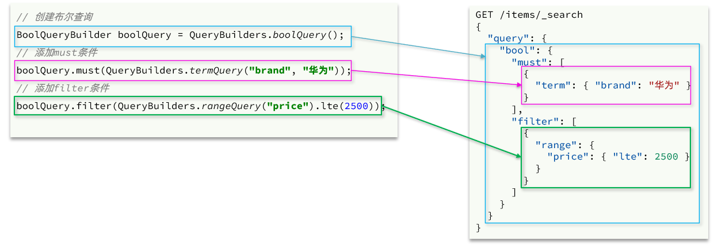

完整代码如下：

```
@Test
void testBool() throws IOException {
    // 1.创建Request
    SearchRequest request = new SearchRequest("items");
    // 2.组织请求参数
    // 2.1.准备bool查询
    BoolQueryBuilder bool = QueryBuilders.boolQuery();
    // 2.2.关键字搜索
    bool.must(QueryBuilders.matchQuery("name", "脱脂牛奶"));
    // 2.3.品牌过滤
    bool.filter(QueryBuilders.termQuery("brand", "德亚"));
    // 2.4.价格过滤
    bool.filter(QueryBuilders.rangeQuery("price").lte(30000));
    request.source().query(bool);
    // 3.发送请求
    SearchResponse response = client.search(request, RequestOptions.DEFAULT);
    // 4.解析响应
    handleResponse(response);
}
```

---

## 9.4. 排序和分页

之前说过，`**requeset.source()**`就是整个请求JSON参数，所以排序、分页都是基于这个来设置，其**DSL**和**JavaAPI**的对比如下：

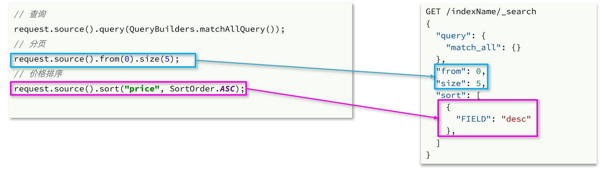

完整示例代码：

```
@Test
void testPageAndSort() throws IOException {
    int pageNo = 1, pageSize = 5;
    
    // 1.创建Request
    SearchRequest request = new SearchRequest("items");
    // 2.组织请求参数
    // 2.1.搜索条件参数
    request.source().query(QueryBuilders.matchQuery("name", "脱脂牛奶"));
    // 2.2.排序参数
    request.source().sort("price", SortOrder.ASC);
    // 2.3.分页参数
    request.source().from((pageNo - 1) * pageSize).size(pageSize);
    // 3.发送请求
    SearchResponse response = client.search(request, RequestOptions.DEFAULT);
    // 4.解析响应
    handleResponse(response);
}
```

---

## 9.5. 高亮

高亮查询与前面的查询有两点不同：

- 条件同样是在`request.source()`中指定，只不过高亮条件要基于`HighlightBuilder`来构造
- 高亮响应结果与搜索的文档结果不在一起，需要单独解析

首先来看高亮条件构造，其DSL和JavaAPI的对比如图：

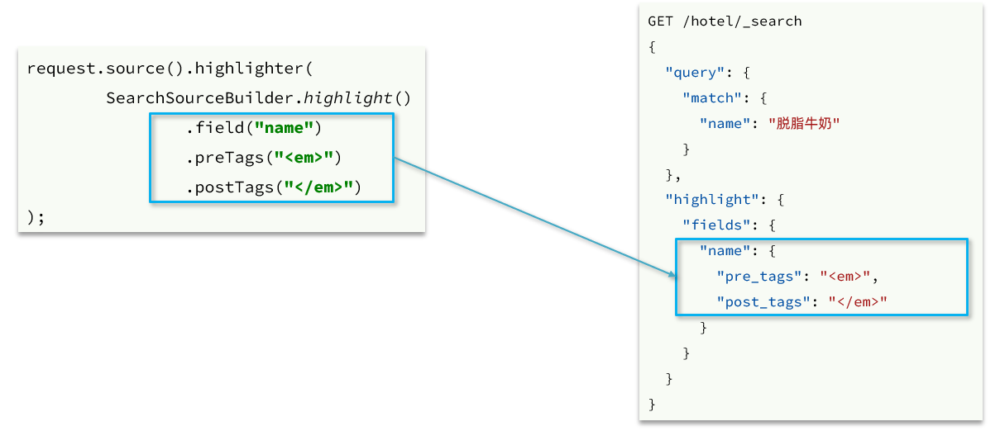

示例代码如下：

```
@Test
void testHighlight() throws IOException {
    // 1.创建Request
    SearchRequest request = new SearchRequest("items");
    // 2.组织请求参数
    // 2.1.query条件
    request.source().query(QueryBuilders.matchQuery("name", "脱脂牛奶"));
    // 2.2.高亮条件
    request.source().highlighter(
        SearchSourceBuilder.highlight()
        .field("name")
        .preTags("<em>")
        .postTags("</em>")
    );
    // 3.发送请求
    SearchResponse response = client.search(request, RequestOptions.DEFAULT);
    // 4.解析响应
    handleResponse(response);
}
```

再来看结果解析，文档解析的部分不变，主要是高亮内容需要单独解析出来，其DSL和JavaAPI的对比如图：

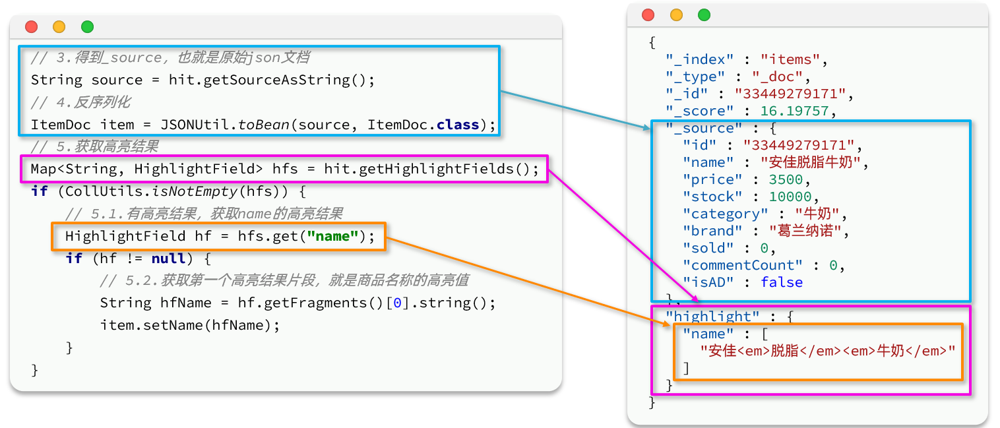

代码解读：

- 第`3、4`步：从结果中获取`**_source**`。`**hit.getSourceAsString()**`，这部分是非高亮结果，json字符串。还需要反序列为`ItemDoc`对象
- 第`5`步：获取高亮结果。`**hit.getHighlightFields()**`，返回值是一个`Map`，key是高亮字段名称，值是`HighlightField`对象，代表高亮值
- 第`5.1`步：从`Map`中根据高亮字段名称，获取高亮字段值对象`HighlightField`
- 第`5.2`步：从`HighlightField`中获取`Fragments`，并且转为字符串。这部分就是真正的高亮字符串了
- 最后：用高亮的结果替换`ItemDoc`中的非高亮结果

完整代码如下：

```
private void handleResponse(SearchResponse response) {
    SearchHits searchHits = response.getHits();
    // 1.获取总条数
    long total = searchHits.getTotalHits().value;
    System.out.println("共搜索到" + total + "条数据");
    // 2.遍历结果数组
    SearchHit[] hits = searchHits.getHits();
    for (SearchHit hit : hits) {
        // 3.得到_source，也就是原始json文档
        String source = hit.getSourceAsString();
        // 4.反序列化
        ItemDoc item = JSONUtil.toBean(source, ItemDoc.class);
        // 5.获取高亮结果
        Map<String, HighlightField> hfs = hit.getHighlightFields();
        if (CollUtils.isNotEmpty(hfs)) {
            // 5.1.有高亮结果，获取name的高亮结果
            HighlightField hf = hfs.get("name");
            if (hf != null) {
                // 5.2.获取第一个高亮结果片段，就是商品名称的高亮值
                String hfName = hf.getFragments()[0].string();
                item.setName(hfName);
            }
        }
        System.out.println(item);
    }
}
```

---

# 10. 数据聚合

## 10.1. DSL实现聚合

### 10.1.1. Bucket聚合

我们要统计所有商品中共有哪些商品分类，其实就是以分类（category）字段对数据分组。category值一样的放在同一组，属于`**Bucket**`聚合中的`**Term**`聚合。

基本语法如下：

```
GET /items/_search
{
  "size": 0, 
  "aggs": {
    "category_agg": {
      "terms": {
        "field": "category",
        "size": 20
      }
    }
  }
}
```

语法说明：

- `size`：设置`size`为0，就是每页查0条，则结果中就**不包含文档**，**只包含聚合**
- `aggs`：定义聚合

- `category_agg`：聚合名称，自定义，但**不能重复**

- `terms`：聚合的类型，按分类聚合，所以用`term`

- `field`：参与聚合的字段名称
- `size`：希望返回的聚合结果的最大数量

来看下查询的结果：

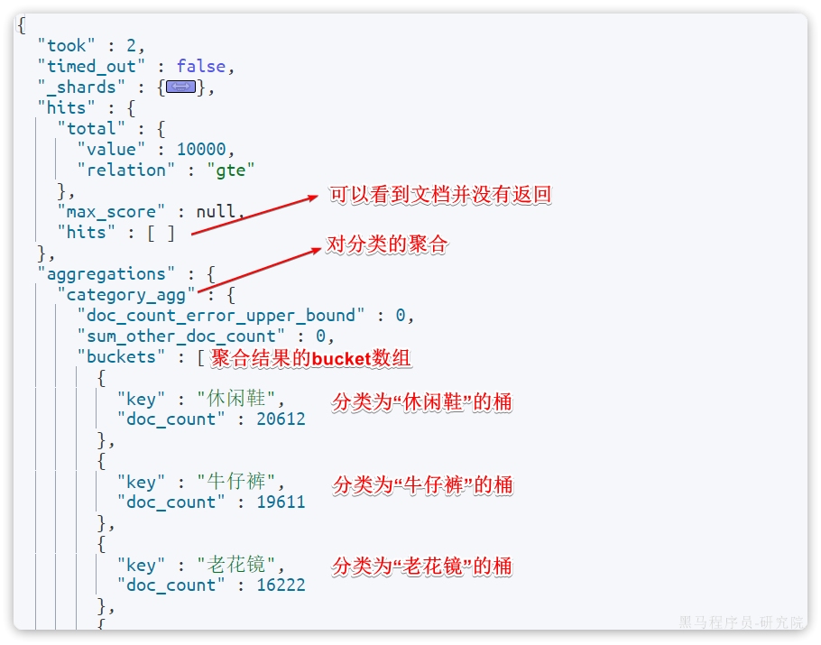

---

### 10.1.2. 带条件聚合

默认情况下，**Bucket聚合**是对索引库的**所有文档**做聚合，例如我们统计商品中所有的品牌，结果如下：

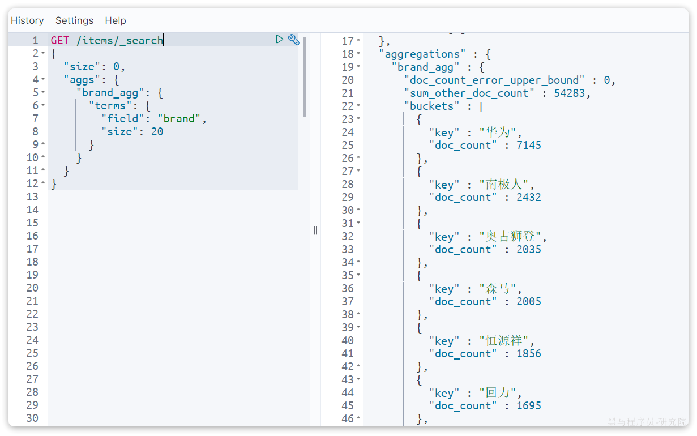

可以看到统计出的品牌非常多。

但真实场景下，用户会输入搜索条件，因此聚合必须是对搜索结果聚合。那么聚合必须添加限定条件。

例如，我想知道价格高于3000元的手机品牌有哪些，该怎么统计呢？

我们需要从需求中分析出搜索查询的条件和聚合的目标：

- 搜索查询条件：

- 价格高于3000
- 必须是手机

- 聚合目标：统计的是品牌，肯定是对brand字段做term聚合

语法如下：

```
GET /items/_search
{
  "query": {
    "bool": {
      "filter": [
        {
          "term": {
            "category": "手机"
          }
        },
        {
          "range": {
            "price": {
              "gte": 300000
            }
          }
        }
      ]
    }
  }, 
  "size": 0, 
  "aggs": {
    "brand_agg": {
      "terms": {
        "field": "brand",
        "size": 20
      }
    }
  }
}
```

聚合结果如下：

```
{
  "took" : 2,
  "timed_out" : false,
  "hits" : {
    "total" : {
      "value" : 13,
      "relation" : "eq"
    },
    "max_score" : null,
    "hits" : [ ]
  },
  "aggregations" : {
    "brand_agg" : {
      "doc_count_error_upper_bound" : 0,
      "sum_other_doc_count" : 0,
      "buckets" : [
        {
          "key" : "华为",
          "doc_count" : 7
        },
        {
          "key" : "Apple",
          "doc_count" : 5
        },
        {
          "key" : "小米",
          "doc_count" : 1
        }
      ]
    }
  }
}
```

可以看到，结果中只剩下3个品牌了。

---

### 10.1.3. Metric聚合

上面，我们统计了价格高于3000的手机品牌，形成了一个个桶。现在我们需要对桶内的商品做运算，获取每个品牌价格的最小值、最大值、平均值。

这就要用到`**Metric**`聚合了，例如`**stat**`聚合，就可以同时获取`**min**`、`**max**`、`**avg**`等结果。

语法如下：

```
GET /items/_search
{
  "query": {
    "bool": {
      "filter": [
        {
          "term": {
            "category": "手机"
          }
        },
        {
          "range": {
            "price": {
              "gte": 300000
            }
          }
        }
      ]
    }
  }, 
  "size": 0, 
  "aggs": {
    "brand_agg": {
      "terms": {
        "field": "brand",
        "size": 20
      },
      "aggs": {
        "stats_meric": {
          "stats": {
            "field": "price"
          }
        }
      }
    }
  }
}
```

可以看到我们在`**brand_agg**`聚合的内部，我们新加了一个`**aggs**`参数。这个聚合就是`brand_agg`的子聚合，会对`brand_agg`形成的每个桶中的文档分别统计。

- `stats_meric`：聚合名称

- `stats`：聚合类型，stats是`metric`聚合的一种

- `field`：聚合字段，这里选择`price`，统计价格

由于**stats**是对**brand_agg**形成的每个品牌桶内文档**分别做统计**，因此每个品牌都会统计出自己的价格最小、最大、平均值。

结果如下：

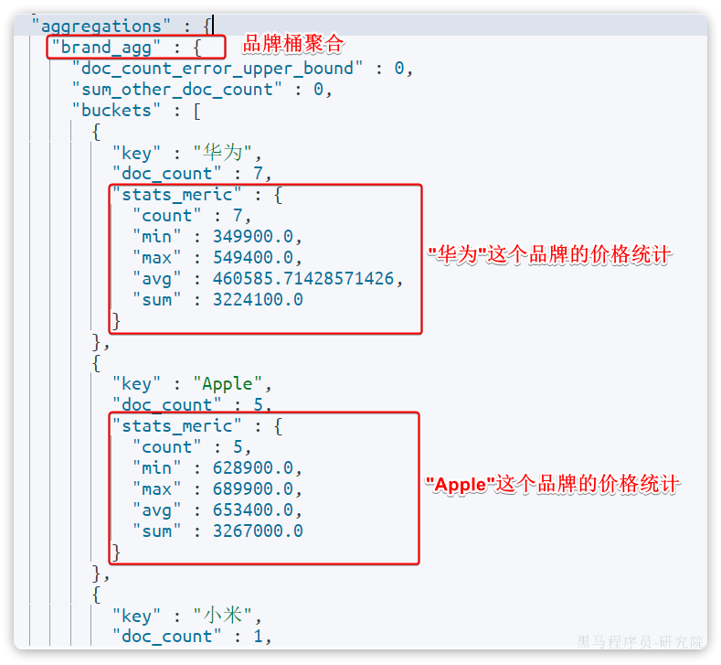

另外，我们还可以让聚合按照每个品牌的价格平均值排序：

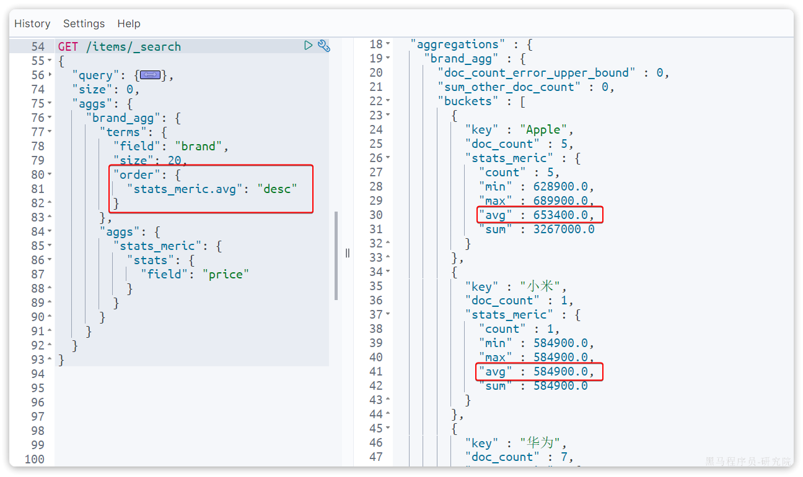

---

### 10.1.4. 总结

aggs代表聚合，与query同级，此时query的作用是？

- 限定聚合的的文档范围

聚合必须的三要素：

- 聚合名称
- 聚合类型
- 聚合字段

聚合可配置属性有：

- size：指定聚合结果数量
- order：指定聚合结果排序方式
- field：指定聚合字段

---

## 10.2. RestClient实现聚合

可以看到在DSL中，`aggs`聚合条件与`query`条件是同一级别，都属于查询JSON参数。因此依然是利用`request.source()`方法来设置。

不过聚合条件的要利用`AggregationBuilders`这个工具类来构造。DSL与JavaAPI的语法对比如下：

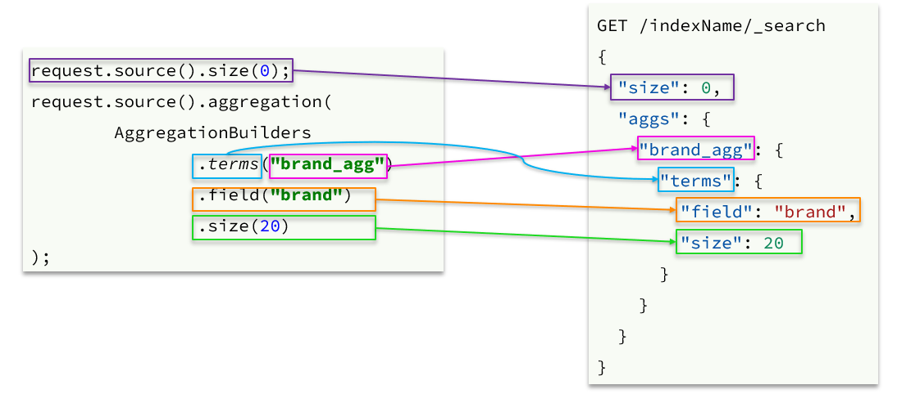

聚合结果与搜索文档同一级别，因此需要单独获取和解析。具体解析语法如下：

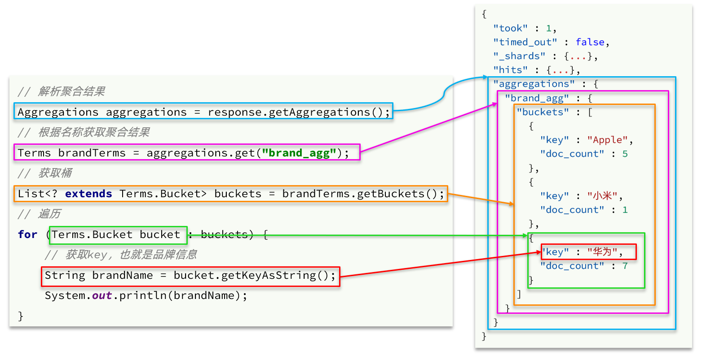

完整代码如下：

```
@Test
void testAgg() throws IOException {
    // 1.创建Request
    SearchRequest request = new SearchRequest("items");
    // 2.准备请求参数
    BoolQueryBuilder bool = QueryBuilders.boolQuery()
                            .filter(QueryBuilders.termQuery("category", "手机"))
                            .filter(QueryBuilders.rangeQuery("price").gte(300000));
    request.source().query(bool).size(0);
    // 3.聚合参数
    request.source().aggregation(
        AggregationBuilders.terms("brand_agg").field("brand").size(5)
    );
    // 4.发送请求
    SearchResponse response = client.search(request, RequestOptions.DEFAULT);
    // 5.解析聚合结果
    Aggregations aggregations = response.getAggregations();
    // 5.1.获取品牌聚合
    Terms brandTerms = aggregations.get("brand_agg");
    // 5.2.获取聚合中的桶
    List<? extends Terms.Bucket> buckets = brandTerms.getBuckets();
    // 5.3.遍历桶内数据
    for (Terms.Bucket bucket : buckets) {
        // 5.4.获取桶内key
        String brand = bucket.getKeyAsString();
        System.out.print("brand = " + brand);
        long count = bucket.getDocCount();
        System.out.println("; count = " + count);
    }
}
```

---

---

## 🔗 关联笔记
- [[数据库与中间件]]
- [[MySQL笔记]]
- [[Redis笔记]]
