**基础篇**

# 一、同步调用

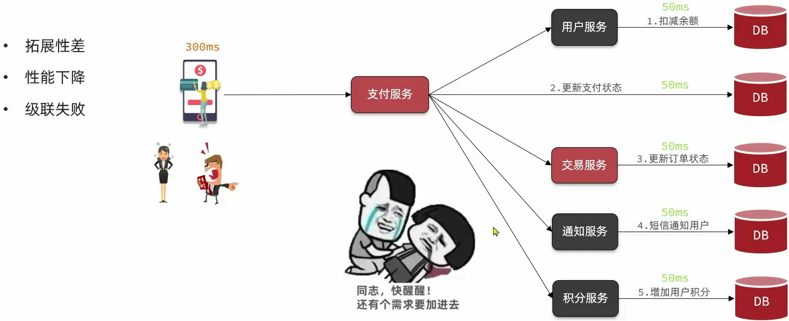

---

在 RabbitMQ 的应用场景中，所谓的“同步调用”通常是指在微服务架构中，服务间采用请求-响应模式的通信方式（如通过 HTTP/REST 或 RPC）

在 RabbitMQ 的应用场景中，所谓的“同步调用”通常是指在微服务架构中，服务间采用请求-响应模式的通信方式（如通过 HTTP/REST 或 RPC）

### 1. 🌟 优点

1. **简单易理解** 同步调用的模式非常直观，就像打电话一样，调用方发出请求后会阻塞并等待接收方处理完成并返回结果，才能继续后续操作。这种线性的、符合人类直觉的编程模型使得业务逻辑清晰，易于开发人员理解和维护。
2. **实时性强** 调用方可以立即获得处理结果，时效性高。这对于需要即时反馈的业务场景至关重要，例如查询用户余额、验证登录信息等。
3. **便于调试** 由于调用顺序是确定的，整个调用链路是线性的，当出现问题时，开发人员可以顺着调用链轻松排查，通过日志和调试工具快速定位问题根源。
4. **确保数据强一致性** 在接收到成功响应时，调用方可以确定操作已经被完整处理。这在金融交易、订单创建等对数据一致性要求极高的场景中非常重要，可以避免异步处理可能带来的数据不一致问题。

### 2. ⚠️ 缺点

1. **性能瓶颈与资源浪费** 调用方在等待响应期间，线程会一直处于阻塞状态，无法处理其他请求，导致系统资源（如线程池）被无效占用。如果调用链很长，总响应时间将是各个环节耗时之和，严重影响系统性能和用户体验。
2. **高耦合与扩展性差** 调用方直接依赖服务提供方的接口和可用性。当业务需求变更，需要增加新的下游服务时，往往需要修改调用方的代码，导致系统耦合度高，难以维护和扩展。
3. **级联故障风险** 这是同步调用最严重的问题。调用链中任何一个下游服务的宕机或响应过慢，都会导致上游服务阻塞甚至崩溃，从而引发“多米诺骨牌”效应，造成整个系统的级联失败或雪崩。
4. **削峰能力差** 突发的流量高峰会直接传递到调用链上的所有服务。如果下游服务无法承受瞬时的高并发，就可能导致其崩溃，进而拖垮整个系统。

---

# 二、异步调用

### 1. 异步调用中的三个角色

- **消息发送者**：负责投递消息的一方，对应于传统同步调用中的**调用方**。
- **消息代理**：负责管理、暂存和转发消息的中间件。图片中用了一个形象的比喻：你可以把它理解成**微信服务器**。
- **消息接收者**：负责接收和处理消息的一方，对应于传统同步调用中的**服务提供方**。

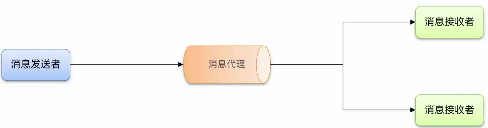

---

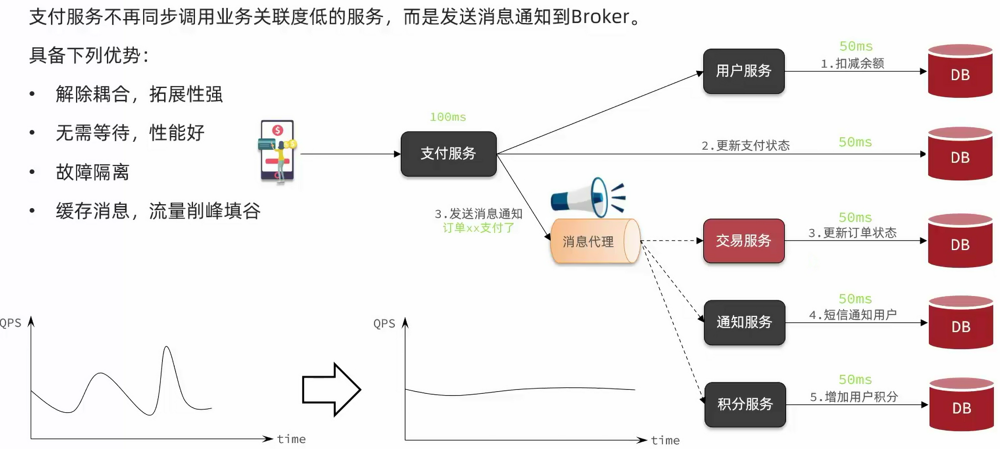

---

### 2. 🌟 优点

1. **耦合度低，拓展性强**

- 生产者与消费者互不干扰，新增业务逻辑只需增加消费者，无需修改现有代码。

2. **异步调用，无需等待，性能好**

- 发送方发送消息后即可返回，无需同步等待处理结果，显著提升了系统的响应速度和吞吐量。

3. **故障隔离**

- 即使下游服务（消费者）发生故障，消息也会暂存在中间件中，不会直接导致上游业务（生产者）崩溃。

4. **缓存消息，流量削峰填谷**

- 在流量洪峰到来时，消息队列可以作为缓冲区，平滑处理突发流量，防止系统被压垮。

### 3. ⚠️ 缺点

1. **时效性差**

- 无法立即得到调用结果，因为处理过程是异步进行的，存在一定的延迟。

2. **结果不确定性**

- 发送方在发送消息后，无法直接确定下游业务是否执行成功，需要额外的机制（如回调或查询）来确认状态。

3. **依赖 Broker 的可靠性**

- 整个业务链路的安全性高度依赖于消息中间件（Broker）的稳定性。如果中间件挂掉或丢失消息，业务将受到影响。

---

# 三、MQ 技术选型

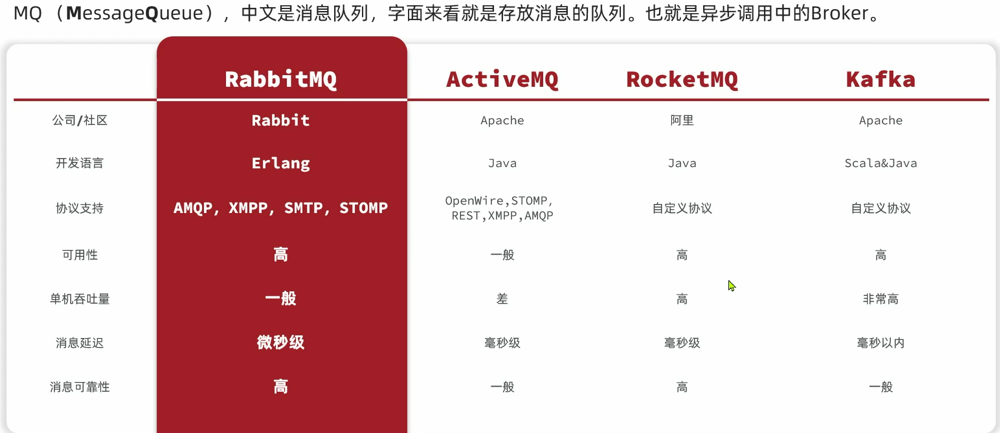

---

# 四、RabbitMQ概述

在 Java 后端项目中，RabbitMQ 主要扮演着**消息中间件**的角色，它是构建高可用、高扩展性分布式系统的核心组件。简单来说，它就像是一个高效的“邮局”或“缓冲区”，帮助不同的服务模块之间进行异步通信和数据交换。

## (一) 核心作用：解耦、异步与削峰

这是 RabbitMQ 在架构设计中最根本的三大价值：

- **服务解耦 (Decoupling)：**

- **痛点：** 在传统模式中，订单服务可能需要直接调用库存、积分、短信等多个服务的接口。如果短信服务挂了，可能导致整个订单流程失败。
- **RabbitMQ 方案：** 订单服务只需将“订单创建”的消息发送到 RabbitMQ，不用关心谁去消费。库存、积分、短信服务各自监听队列独立处理。
- **价值：** 极大地降低了系统间的依赖性，即使某个下游服务宕机，也不会阻塞主流程，提升了系统的容错性。

- **异步处理 (Asynchronous Processing)：**

- **痛点：** 用户注册后需要发送验证邮件或生成复杂报表，这些操作非常耗时，会让用户界面卡顿。
- **RabbitMQ 方案：** 主线程将耗时任务封装成消息丢入队列后立即返回响应，由后台消费者慢慢处理。
- **价值：** 显著缩短接口响应时间，提升用户体验。

- **流量削峰 (Traffic Peak Shaving)：**

- **痛点：** 在秒杀或大促场景下，瞬间涌入的流量可能直接压垮数据库。
- **RabbitMQ 方案：** 请求先写入消息队列，后端服务按照自己的处理能力（如每秒处理 100 个）从队列中拉取消息。
- **价值：** 起到“蓄水池”的作用，平滑突发流量，保护后端数据库不被击垮。

## (二) 进阶能力：延迟任务与可靠性

除了基础通信，RabbitMQ 还能解决很多复杂的业务难题：

- **延迟消息处理：**

- **场景：** 订单下单 30 分钟未支付自动取消。
- **实现：** 利用 **TTL（消息过期时间）+ 死信交换机 (DLX)** 或 **延迟插件**，让消息在指定时间后才被消费者获取，从而触发业务逻辑。

- **任务分发与负载均衡：**

- 多个消费者监听同一个队列，RabbitMQ 会自动将消息分发给空闲的消费者（轮询模式），实现任务的负载均衡处理。

## (三) Java 生态中的集成体验

在 Java (特别是 Spring Boot) 项目中，RabbitMQ 的使用非常成熟：

- **开箱即用：** 通过 `spring-boot-starter-amqp` 依赖，利用自动装配机制，几乎零配置即可接入。
- **核心组件：**

- **RabbitTemplate：** 用于发送消息（生产者）。
- **@RabbitListener：** 用于监听队列并消费消息（消费者）。

- **可靠性保障：** 支持**手动确认 (Manual Ack)** 机制，确保消息只有在被消费者成功处理后才从队列删除，防止数据丢失。

**总结对比：**

|   |   |   |
|---|---|---|
|维度|传统同步调用 (REST/Feign)|引入 RabbitMQ 后|
|**耦合度**|**高** (服务间强依赖，牵一发而动全身)|**低** (通过消息交互，服务独立演进)|
|**响应速度**|**慢** (需等待所有下游处理完成)|**快** (主流程立即返回，后台异步处理)|
|**抗风险能力**|**弱** (下游宕机导致主流程失败)|**强** (消息暂存队列，服务恢复后继续消费)|
|**适用场景**|实时性要求极高的核心链路|耗时任务、非核心链路、高并发写入|

总的来说，RabbitMQ 是构建**微服务架构**、**事件驱动架构**时不可或缺的基础设施，它用“空间换时间”和“异步化”的策略，解决了分布式系统中复杂的通信和一致性问题。

---

## (四) RabbitMQ 快速入门

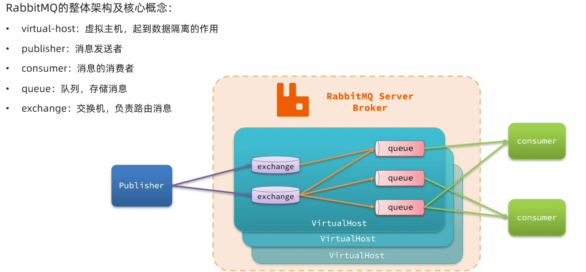

---

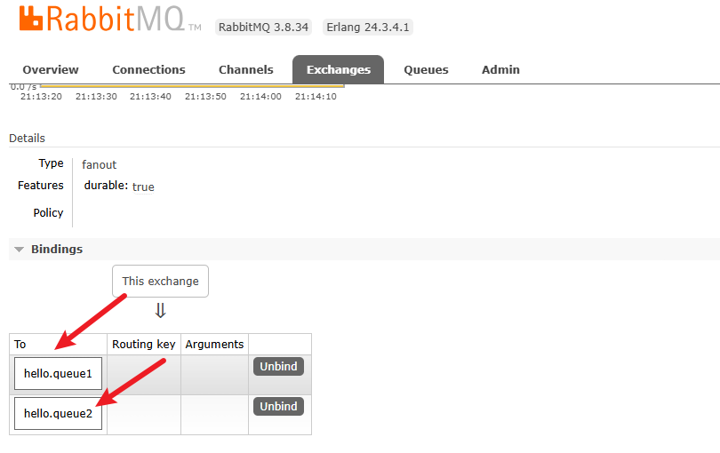

**消息发送的注意事项有哪些？**

- 交换机只能路由消息，无法存储消息
- 交换机只会路由消息给与其绑定的队列，因此队列必须与交换机绑定

---

# 五、数据隔离

RabbitMQ 主要通过 **虚拟主机（Virtual Host，简称 vHost）** 来实现数据隔离。

可以把 vHost 理解为操作系统里的“文件夹”或者 Web 服务器里的“虚拟站点”。它为不同的业务、环境或租户提供了独立的运行空间，确保它们互不干扰。

## (一) 资源隔离（独立的命名空间）

这是最基础的隔离机制。每个 vHost 都有自己完全独立的资源集合，包括：

- **交换机（Exchanges）**
- **队列（Queues）**
- **绑定关系（Bindings）**

**举个例子**：你可以在 `vhost_A` 中创建一个名为 `order_queue` 的队列，同时在 `vhost_B` 中也创建一个名为 `order_queue` 的队列。这两个队列在物理上可能存储在同一个 RabbitMQ 节点上，但在逻辑上是完全独立的两个对象，互不可见，也不会发生冲突。

## (二) 权限隔离（访问控制）

vHost 是 RabbitMQ 权限管理的最小粒度。

- **用户授权**：RabbitMQ 的用户本身没有权限操作任何资源，必须被显式地授予对某个 vHost 的访问权限。
- **细粒度控制**：管理员可以针对每个用户在每个 vHost 上设置具体的权限，比如配置权限（configure）、写权限（write）和读权限（read）。
- **效果**：如果用户 A 只能访问 `vhost_A`，那么即使他知道 `vhost_B` 中存在某个队列，他也无法连接、发送或消费其中的消息。

## (三) 多租户支持（逻辑隔离）

通过上述机制，vHost 使得单个 RabbitMQ 服务器能够安全地服务于多个不同的应用或团队（即“多租户”）。

- **开发/测试/生产环境隔离**：可以在同一个 MQ 集群中创建 `dev`、`test`、`prod` 三个 vHost，避免开发环境的脏数据影响生产环境。
- **不同业务隔离**：订单系统和日志系统可以使用不同的 vHost，确保消息流转的清晰和安全。

**总结来说**，vHost 就像是一堵逻辑上的墙，将 RabbitMQ 服务器划分成了多个互不相通的“小房间”，每个房间里都有独立的交换机、队列，并且只有持有对应钥匙（权限）的人才能进入。

---

# 六、Java 客户端实现

**SpringAmqp的官方地址：**[https://spring.io/projects/spring-amqp](https://spring.io/projects/spring-amqp)

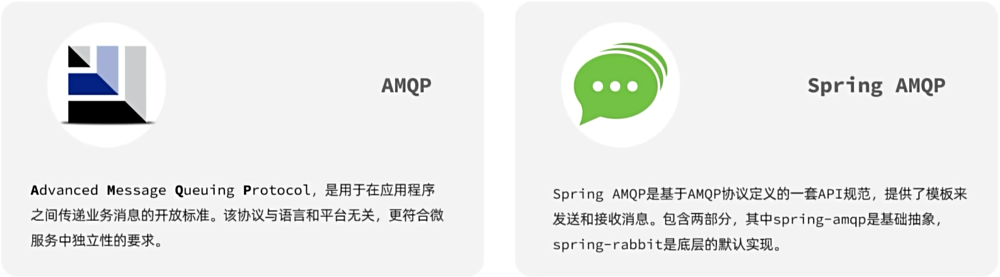

---

## (一) 整合 RabbitMQ

### 1. 引入 spring-amqp 依赖

在父工程中引入 `spring-amqp` 依赖，这样 publisher 和 consumer 服务都可以使用：

```
<!--AMQP依赖，包含RabbitMQ-->
<dependency>
    <groupId>org.springframework.boot</groupId>
    <artifactId>spring-boot-starter-amqp</artifactId>
</dependency>
```

### 2. 配置 RabbitMQ 服务端信息

在每个微服务中引入 MQ 服务端信息，这样微服务才能连接到 RabbitMQ：

```
spring:
  rabbitmq:
    host: 192.168.179.139 # 主机名
    port: 5672 # 端口
    virtual-host: /hmall # 虚拟主机
    username: hmall # 用户名
    password: 123456 # 密码
```

### 3. 发送消息

SpringAMQP 提供了 `RabbitTemplate` 工具类，方便我们发送消息。发送消息代码如下：

```
@Autowired
private RabbitTemplate rabbitTemplate;

@Test
public void testSimpleQueue() {
    // 队列名称
    String queueName = "simple.queue";
    // 消息
    String message = "hello, spring amqp!";
    // 发送消息
    rabbitTemplate.convertAndSend(queueName, message);
}
```

### 4. 接收消息

SpringAMQP提供声明式的消息监听，我们只需要通过**注解**在方法上声明要监听的队列名称，将来SpringAMQP就会把消息传递给当前方法：

```
@Slf4j
@Component
public class SpringRabbitListener {

    @RabbitListener(queues = "simple.queue")
    public void listenSimpleQueueMessage(String msg) throws InterruptedException {
        log.info("spring 消费者接收到消息：【" + msg + "】");
    }
}
```

---

## (二) Work Queues

**Work queues（任务模型）** 简单来说就是让多个消费者绑定到一个队列，共同消费队列中的消息。

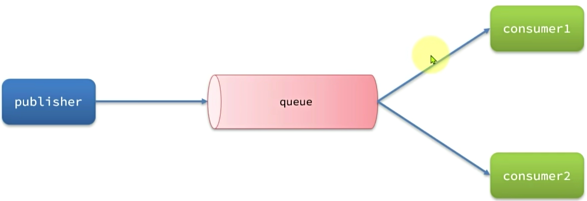

---

默认情况下，RabbitMQ的会将消息依次轮询投递给绑定在队列上的每一个消费者。但这并没有考虑到消费者是否已经处理完消息，可能出现消息堆积。

因此我们需要修改 `**application.yml**`，设置 `**preFetch**` 值为1，确保同一时刻最多投递给消费者1条消息：

```
spring:
  rabbitmq:
    listener:
      simple:
        prefetch: 1 # 每次只能获取一条消息，处理完成才能获取下一个消息
```

**Work模型的使用：**

- 多个消费者绑定到一个队列，可以加快消息处理速度
- 同一条消息只会被一个消费者处理
- 通过设置 **prefetch** 来控制消费者预取的消息数量，处理完一条再处理下一条，实现**能者多劳**

---

## (三) Fanout (广播) 交换机

交换机的作用主要是**接收**发送者发送的消息，并将消息**路由**到与其绑定的队列。

**Fanout Exchange** 会将接收到的消息路由到每一个跟其绑定的 queue，所以也叫广播模式。

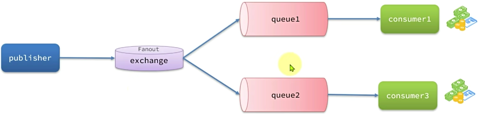

```
/**
 * 监听fanout.queue
 * @param msg
 */
@RabbitListener(queues = "fanout.queue1")
public void listenFanoutQueueMessage1(String msg){
    System.err.println("消费者1 fanout.queue1接收到消息：" + msg + "，" + LocalDateTime.now());
}

@RabbitListener(queues = "fanout.queue2")
public void listenFanoutQueueMessage2(String msg){
    System.err.println("消费者2 fanout.queue2接收到消息：" + msg + "，" + LocalDateTime.now());
}
```

```
/**
 * 测试发送广播模型消息
 */
@Test
public void testFanoutQueue() {
    // 交换机名称
    String exchangeName = "hmall.fanout";
    // 消息
    String message = "hello, spring amqp2!";
    // 发送消息
    rabbitTemplate.convertAndSend(exchangeName, "", message);
}
```

**总结 FanoutExchange 的核心作用:**

- 接收 publisher 发送的消息
- 将消息按照规则路由到与之绑定的队列
- FanoutExchange 的会将消息路由到每个绑定的队列

---

## (四) Direct (定向) 交换机

Direct Exchange 会将接收到的消息根据规则路由到指定的 Queue，因此称为**定向路由**。

- 每一个 Queue 都与 Exchange 设置一个 BindingKey
- 发布者发送消息时，指定消息的 RoutingKey
- Exchange 将消息路由到 BindingKey 与消息 RoutingKey 一致的队列

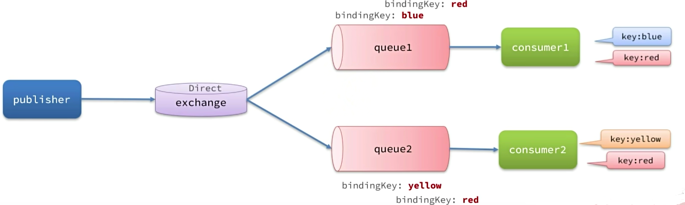

**Direct交换机与Fanout交换机的差异？**

- Fanout交换机将消息路由给每一个与之绑定的队列
- Direct交换机根据**RoutingKey**判断路由给哪个队列
- 如果多个队列具有相同RoutingKey，则与Fanout功能类似

---

## (五) Topic 交换机

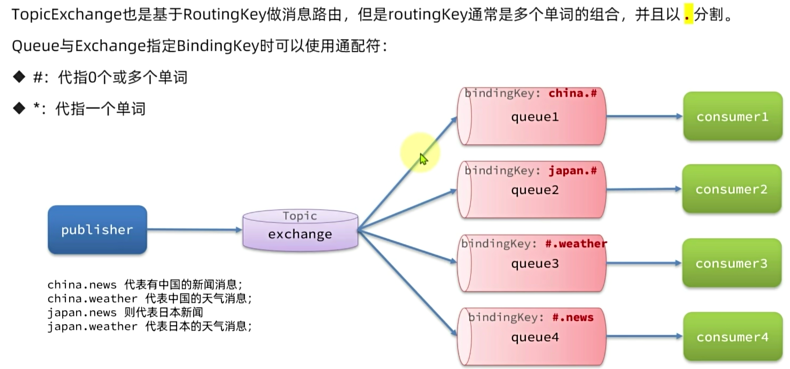

---

## (六) 基于 Bean 声明队列

SpringAMQP提供了几个类，用来声明队列、交换机及其绑定关系：

- Queue：用于声明队列，可以用工厂类QueueBuilder构建
- Exchange：用于声明交换机，可以用工厂类ExchangeBuilder构建
- Binding：用于声明队列和交换机的绑定关系，可以用工厂类BindingBuilder构建

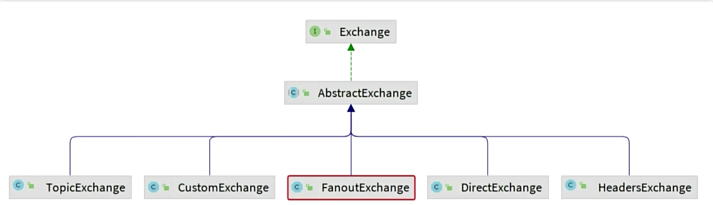

例如，声明一个Fanout类型的交换机，并且创建队列与其绑定：

```
@Configuration
public class FanoutConfig {
    // 声明FanoutExchange交换机
    @Bean
    public FanoutExchange fanoutExchange(){
        return new FanoutExchange("hmall.fanout");
    }
    // 声明第1个队列
    @Bean
    public Queue fanoutQueue1(){
        return new Queue("fanout.queue1");
    }
    // 绑定队列1和交换机
    @Bean
    public Binding bindingQueue1(Queue fanoutQueue1, FanoutExchange fanoutExchange){
        return BindingBuilder.bind(fanoutQueue1).to(fanoutExchange);
    }
    // ... 略，以相同方式声明第2个队列，并完成绑定
}
```

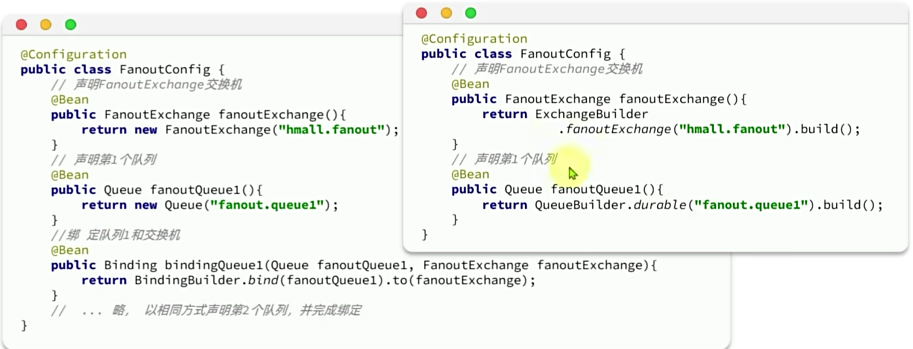

---

## (七) 基于注解声明队列

SpringAMQP还提供了基于**@RabbitListener**注解来声明队列和交换机的方式：

```
@RabbitListener(bindings = @QueueBinding(
    value = @Queue(name = "direct.queue1"),
    exchange = @Exchange(name = "itcast.direct", type = ExchangeTypes.DIRECT),
    key = {"red", "blue"}
))
public void listenDirectQueue1(String msg){
    System.out.println("消费者1接收到Direct消息：【"+msg+"】");
}
```

---

## (八) 消息转换器

Spring的对消息对象的处理是由`org.springframework.amqp.support.converter.MessageConverter`来处理的。而默认实现是`SimpleMessageConverter`，基于JDK的`ObjectOutputStream`完成序列化。

存在下列问题：

- JDK的序列化有安全风险
- JDK序列化的消息太大
- JDK序列化的消息可读性差

---

建议采用JSON序列化代替默认的JDK序列化，要做两件事情：

在publisher和consumer中都要引入**jackson**依赖：

```
<dependency>
    <groupId>com.fasterxml.jackson.core</groupId>
    <artifactId>jackson-databind</artifactId>
</dependency>
```

在publisher和consumer中都要配置**MessageConverter**：

```
@Bean
public MessageConverter messageConverter(){
    return new Jackson2JsonMessageConverter();
}
```

---

## (九) 业务实战

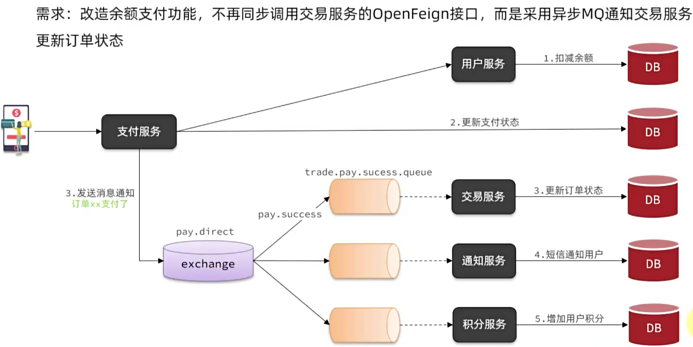

代码：

---

**高级篇**

# 七、生产者的可靠性

## (一) 生产者重连

有的时候由于网络波动，可能会出现发送者连接MQ失败的情况。通过配置我们可以开启连接失败后的重连机制**：**

```
spring:
  rabbitmq:
    connection-timeout: 1s # 设置MQ的连接超时时间
    template:
      retry:
        enabled: true # 开启超时重试机制
        initial-interval: 1000ms # 失败后的初始等待时间
        multiplier: 1 # 失败后下次的等待时长倍数，下次等待时长 = initial-interval * multiplier
        max-attempts: 3 # 最大重试次数
```

这段配置用于Spring Boot项目中集成RabbitMQ时，增强其网络容错能力。当因网络波动导致连接失败时，系统会自动按设定的间隔和次数进行重试，提升消息发送的可靠性。

**注意**

当网络不稳定的时候，利用重试机制可以有效提高消息发送的成功率。不过**SpringAMQP**提供的重试机制是**阻塞式**的重试，也就是说多次重试等待的过程中，当前线程是被阻塞的，会影响业务性能。

如果对于业务性能有要求，建议**禁用**重试机制。如果一定要使用，请合理配置等待时长和重试次数，当然也可以考虑使用**异步**线程来执行发送消息的代码。

---

## (二) 生产者确认

SpringAMQP提供了**Publisher Confirm**和**Publisher Return**两种确认机制。开启确认机制后，当**发送者**发送消息给MQ后，MQ会返回确认结果给发送者。返回的结果有以下几种情况：

- 消息投递到了MQ，但是**路由失败**。此时会通过**PublisherReturn**返回路由异常原因，然后返回**ACK**，告知投递成功
- 临时消息投递到了MQ，并且**入队成功**，返回**ACK**，告知投递成功
- 持久消息投递到了MQ，并且**入队完成持久化**，返回**ACK**，告知投递成功
- 其它情况都会返回**NACK**，告知投递失败

SpringAMQP中消息投递的确认机制，核心是通过ACK（确认）和NACK（否定确认）来反馈消息是否成功投递到MQ。其中，**Publisher Return**用于处理**路由失败**的情况，而**Publisher Confirm**用于确认消息**是否成功入队或持久化**。

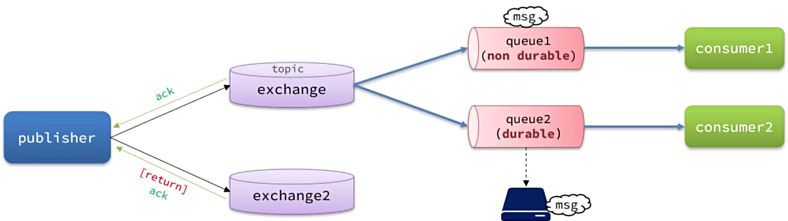

---

### 1. 配置文件：开启 Publisher Confirm 与 Return 机制

在 `publisher` 微服务的 `application.yml` 中添加如下配置：

```
spring:
  rabbitmq:
    publisher-confirm-type: correlated # 开启publisher confirm机制，并设置confirm类型
    publisher-returns: true # 开启publisher return机制
```

**配置说明：**

`publisher-confirm-type` 有三种模式可选：

- **none**：关闭 confirm 机制
- **simple**：同步阻塞等待 MQ 的回执消息
- **correlated**：MQ 异步回调方式返回回执消息（推荐用于高并发场景）

---

### 2. Java 配置类：设置 ReturnCallback

由于每个 `RabbitTemplate` 只能配置一个 `ReturnCallback`，需在项目启动时进行全局配置：

```
@Slf4j
@RequiredArgsConstructor
@Configuration
public class MqConfig {
    private final RabbitTemplate rabbitTemplate;

    @PostConstruct
    public void init() {
        rabbitTemplate.setReturnsCallback(new RabbitTemplate.ReturnsCallback() {
            @Override
            public void returnedMessage(ReturnedMessage returned) {
                log.error("触发return callback,");
                log.debug("exchange: {}", returned.getExchange());
                log.debug("routingKey: {}", returned.getRoutingKey());
                log.debug("message: {}", returned.getMessage());
                log.debug("replyCode: {}", returned.getReplyCode());
                log.debug("replyText: {}", returned.getReplyText());
            }
        });
    }
}
```

此配置用于捕获消息路由失败的情况，例如交换机存在但队列不存在或绑定失败。

---

### 3. 测试代码：发送消息并监听 ConfirmCallback

```
@Test
void testPublisherConfirm() throws InterruptedException {
    // 1. 创建 CorrelationData
    CorrelationData cd = new CorrelationData();
    // 2. 给 Future 添加 ConfirmCallback
    cd.getFuture().addCallback(new ListenableFutureCallback<CorrelationData.Confirm>() {
        @Override
        public void onFailure(Throwable ex) {
            // 2.1. Future 发生异常时的处理逻辑，基本不会触发
            log.error("handle message ack fail", ex);
        }

        @Override
        public void onSuccess(CorrelationData.Confirm result) {
            // 2.2. Future 接收到回执的处理逻辑
            if (result.isAck()) {
                log.debug("发送消息成功，收到 ack!");
            } else {
                log.error("发送消息失败，收到 nack, reason : {}", result.getReason());
            }
        }
    });
    // 3. 发送消息
    rabbitTemplate.convertAndSend("hmall.direct", "red1", "hello", cd);
}
```

通过 `CorrelationData` 关联消息与回调，实现异步确认机制。`isAck()` 为 `true` 表示消息被 Broker 成功接收（无论是否路由成功），`false` 则表示投递失败，可结合 `getReason()` 获取失败原因。

---

# 八、RabbitMQ 的可靠性

## (一) 数据持久化

只有当交换机、队列和消息三者都设置为持久化时，才能真正实现“消息持久化”。其中：

- **交换机持久化**：确保交换机在重启后依然存在；
- **队列持久化**：确保队列在重启后依然存在；
- **消息持久化**：确保消息被写入磁盘，而非仅存于内存。

这三点是确保 RabbitMQ 在 Broker 重启后消息不丢失的关键机制。

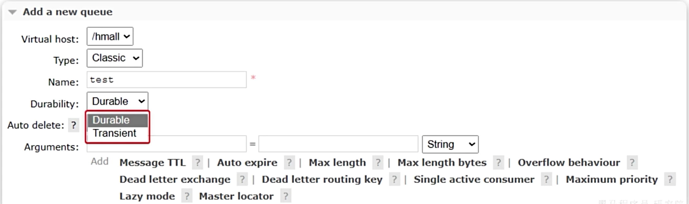

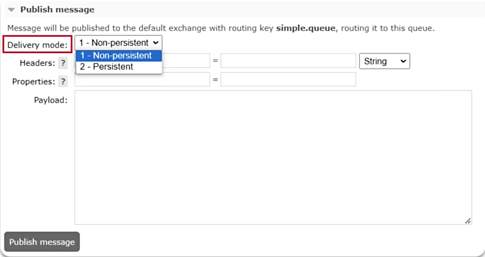

---

## (二) Lazy Queue

**惰性队列的特征如下：**

- 接收到消息后直接存入磁盘，不再存储到内存
- 消费者要消费消息时才会从磁盘读取并加载到内存（可以提前缓存部分消息到内存，最多2048条）

在3.12版本后，所有队列都是**Lazy Queue**模式，无法更改。

---

**补充说明**：  
惰性队列（Lazy Queue）是RabbitMQ为优化内存使用而设计的一种队列模式。它将消息默认存储在**磁盘**上，仅在消费者需要时才加载到内存，从而大幅降低内存占用，适合处理大量积压消息的场景。自RabbitMQ 3.12版本起，该模式已成为默认且唯一模式，用户无需手动配置，系统自动启用。

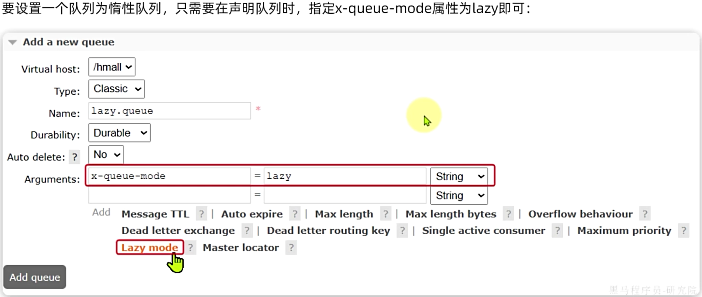

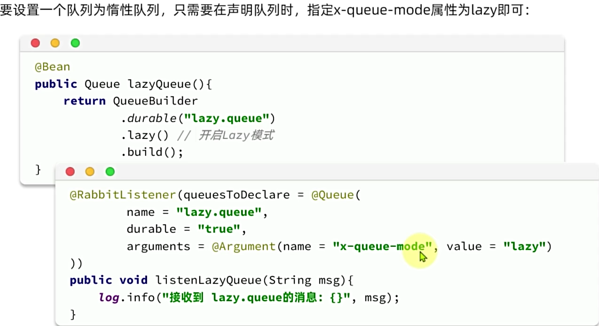

---

# 九、消费者可靠性

## (一) 消费者确认机制

消费者确认机制（Consumer Acknowledgement）是为了确认消费者是否成功处理消息。当消费者处理消息结束后，应该向RabbitMQ发送一个回执，告知RabbitMQ自己消息处理状态。

- **ack**：成功处理消息，RabbitMQ从队列中删除该消息
- **nack**：消息处理失败，RabbitMQ需要再次投递消息
- **reject**：消息处理失败并拒绝该消息，RabbitMQ从队列中删除该消息

在实际开发中，`nack` 通常配合“重新入队”或“死信队列”使用，以避免消息无限重试。

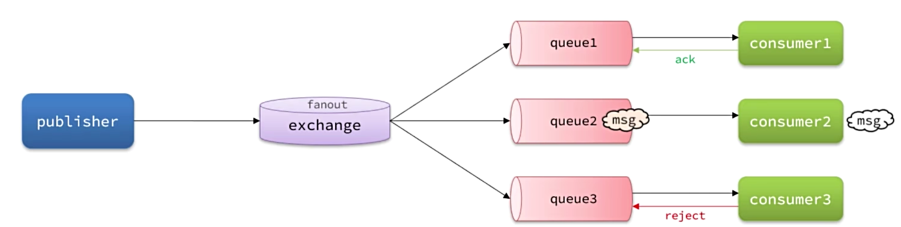

---

### 1. SpringAMQP 消息确认机制（ACK）

SpringAMQP 已实现消息确认功能，允许通过配置文件选择 ACK 处理方式，共三种：

- **none**：不处理。消息投递给消费者后立刻 ack，消息会立刻从 MQ 删除。**非常不安全，不建议使用**。
- **manual**：手动模式。需要在业务代码中调用 API，发送 ack 或 reject。存在业务入侵，但更灵活。
- **auto**：自动模式。SpringAMQP 利用 AOP 对消息处理逻辑做环绕增强。

- 当业务正常执行时，自动返回 **ack**。
- 当业务出现异常时，根据异常判断返回不同结果：

- 如果是业务异常，自动返回 **nack**。
- 如果是消息处理或校验异常，自动返回 **reject**。

### 2. 配置示例

```
spring:
  rabbitmq:
    listener:
      simple:
        prefetch: 1
        acknowledge-mode: none # none: 关闭ack; manual: 手动ack; auto: 自动ack
```

---

## (二) 消费失败处理

### 1. SpringAMQP消费者重试策略

在消费者出现异常时利用本地重试，而不是无限的requeue到mq。我们可以通过在**application.yaml**文件中添加配置来开启重试机制：

```
spring:
  rabbitmq:
    listener:
      simple:
        prefetch: 1
        retry:
          enabled: true # 开启消费者失败重试
          initial-interval: 1000ms # 初始的失败等待时长为1秒
          multiplier: 1 # 下次失败的等待时长倍数，下次等待时长 = multiplier * last-interval
          max-attempts: 3 # 最大重试次数
          stateless: true # true无状态; false有状态。如果业务中包含事务，这里改为false
```

---

### 2. 失败消息处理策略

在开启重试模式后，重试次数耗尽，如果消息依然失败，则需要有 `**MessageRecoverer**` 接口来处理，它包含三种不同的实现：

- **RejectAndDontRequeueRecoverer**：重试耗尽后，直接 **reject**，丢弃消息。**默认**就是这种方式。
- **ImmediateRequeueMessageRecoverer**：重试耗尽后，返回 **nack**，消息重新入队。
- **RepublishMessageRecoverer**：重试耗尽后，将失败消息投递到指定的**交换机**。

这三种策略决定了消息在“本地重试”也失败后的最终命运：

1. **直接丢弃** (`RejectAndDontRequeueRecoverer`)：最简单粗暴，适用于不重要的消息，或者为了防止死循环而必须丢弃的情况。
2. **重新入队** (`ImmediateRequeueMessageRecoverer`)：消息会回到队列头部（或尾部，取决于配置），等待再次被消费。这可能导致消息再次被同一个有问题的消费者消费，造成死循环，需谨慎使用。
3. **投递到死信/异常交换机** (`RepublishMessageRecoverer`)：**这是生产环境最推荐的策略**。它将失败的消息发送到一个专门的“死信交换机”或“异常交换机”，由专门的消费者进行处理（如记录日志、人工干预、存入数据库等），从而保证主业务流的顺畅，不阻塞正常消息。

---

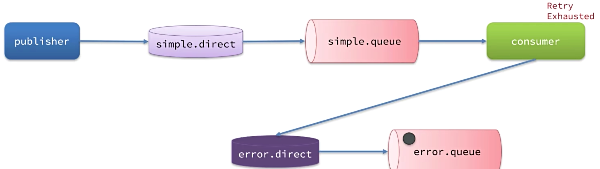

---

### 3. 配置 RepublishMessageRecoverer

将失败处理策略改为 `RepublishMessageRecoverer`：

1. 首先，定义接收失败消息的交换机、队列及其绑定关系，此处略。
2. 然后，定义 `RepublishMessageRecoverer`。

```
@Bean
public MessageRecoverer republishMessageRecoverer(RabbitTemplate rabbitTemplate){
    return new RepublishMessageRecoverer(rabbitTemplate, "error.direct", "error");
}
```

```
@Configuration
public class ErrorMessageConfiguration {

    @Bean
    public DirectExchange errorExchange(){
        return new DirectExchange("error.direct");
    }

    @Bean
    public Queue errorQueue(){
        return new Queue("error.queue");
    }

    @Bean
    public Binding errorQueueBinding(Queue errorQueue, DirectExchange errorExchange){
        return BindingBuilder.bind(errorQueue).to(errorExchange).with("error");
    }

    @Bean
    public MessageRecoverer messageRecoverer(RabbitTemplate rabbitTemplate){
        return new RepublishMessageRecoverer(rabbitTemplate, "error.direct", "error");
    }
}
```

在 Spring 环境中配置 `RepublishMessageRecoverer`，这是处理最终失败消息的最佳实践之一。

- **作用**：当消息经过所有重试（包括本地重试）后仍然失败，`RepublishMessageRecoverer` 会拦截该消息，并将其重新发布（Publish）到一个指定的交换机（Exchange）。
- **参数解析**：

- `rabbitTemplate`：用于发送消息的核心组件。
- `"error.direct"`：这是目标交换机的名称。你需要提前定义好这个交换机。
- `"error"`：这是 Routing Key。结合上面的交换机，消息会被路由到绑定在这个 Key 上的队列（通常是死信队列或异常队列），供后续人工排查或异步处理。

---

## (三) 业务幂等性

- 事务 = 保证单次操作的完整性（要么全做，要么不做）
- Redis锁 = 保证同一时刻只有一个人在做
- 幂等性 = 保证做多次的结果和做一次一样

### 1. 幂等

幂等是一个数学概念，用函数表达式来描述是这样的：**f(x) = f(f(x))**。在程序开发中，则是指同一个业务，执行一次或多次对业务状态的影响是一致的。

这个定义非常关键，特别是在分布式系统和微服务架构中。

- **核心思想**：无论你调用一次还是调用N次，最终的结果（比如数据库里的数据状态）都应该是一样的。
- **常见场景**：

- **支付接口**：用户点击支付按钮多次，或者网络抖动导致请求重发，系统应该只扣款一次。
- **订单创建**：防止用户重复提交订单。
- **消息消费**：在消息队列中，由于网络原因或消费者重试，同一条消息可能会被消费多次，消费者必须保证处理逻辑是幂等的，防止数据错乱（例如库存扣减多次）。

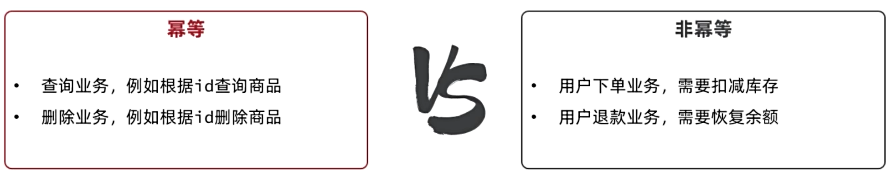

---

### 2. 方案一：利用唯一ID防止消息重复消费

方案一是给每个消息都设置一个唯一id，利用id区分是否是重复消息：

1. 每一条消息都生成一个唯一的id，与消息一起投递给消费者。
2. 消费者接收到消息后处理自己的业务，业务处理成功后将消息ID保存到数据库。
3. 如果下次又收到相同消息，去数据库查询判断是否存在，存在则为重复消息放弃处理。

```
@Bean
public MessageConverter messageConverter(){
    // 1.定义消息转换器
    Jackson2JsonMessageConverter jjmc = new Jackson2JsonMessageConverter();
    // 2.配置自动创建消息id，用于识别不同消息，也可以在业务中基于ID判断是否是重复消息
    jjmc.setCreateMessageIds(true);
    return jjmc;
}
```

---

在 Spring AMQP 中通过配置 `Jackson2JsonMessageConverter` 来自动为消息生成唯一 ID，这是实现消息幂等性（防止重复消费）的基础步骤。

- `**setCreateMessageIds(true)**`：开启此配置后，消息转换器会在发送消息时自动检查消息属性。如果消息没有设置 `messageId`，它会自动生成一个唯一的 ID 并填充进去。
- **后续步骤**：有了这个 ID，消费者就可以按照上述文字描述的步骤（保存到数据库/Redis -> 消费前查询）来实现幂等逻辑。通常建议使用 Redis 的 `SETNX` 命令来实现高性能的去重判断。

---

### 3. 方案二：结合业务逻辑，基于业务具体判断

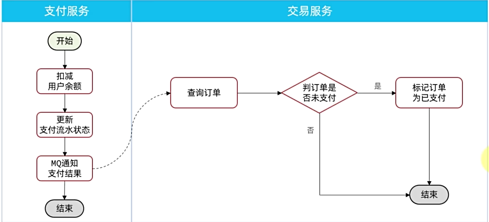

---

# 十、延迟消息

## (一) 延迟消息与延迟任务

- **延迟消息**：发送者发送消息时指定一个时间，消费者不会立刻收到消息，而是在指定时间之后才收到消息。
- **延迟任务**：设置在一定时间之后才执行的任务。、

这两个概念在分布式系统中非常常见，通常用于解耦和异步处理：

- **延迟消息**：常用于订单超时未支付自动取消、预约提醒、定时通知等场景。在 RabbitMQ 中，可以通过 **死信队列（DLX）+ 消息 TTL** 或 **延迟消息插件（rabbitmq_delayed_message_exchange）** 来实现。
- **延迟任务**：是延迟消息的“消费端”体现，即消息到达后触发的业务逻辑。例如，订单超时后自动关闭库存锁定、发送催付短信等。

两者结合，可以构建出强大的定时/延时处理系统。

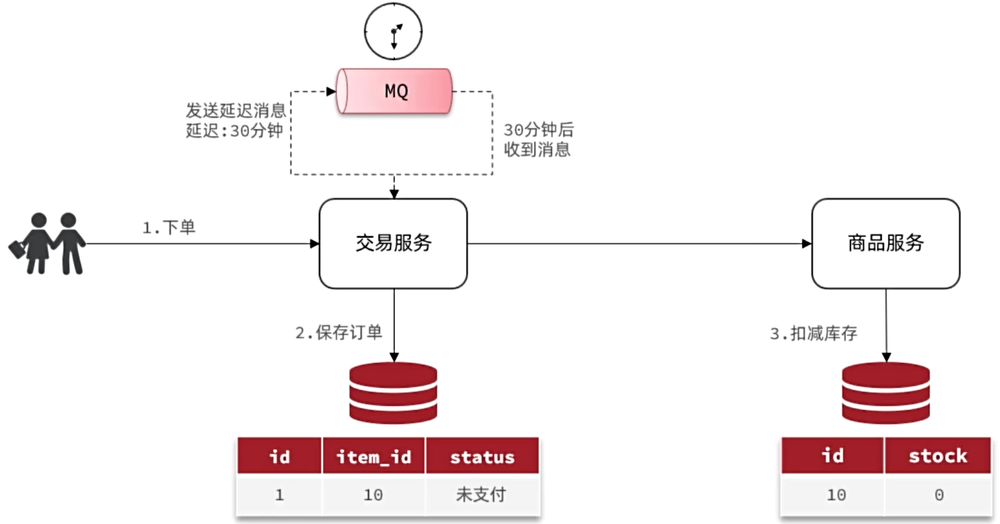

---

## (二) 死信交换机

### 1. 死信（Dead Letter）与死信交换机（DLX）

当一个队列中的消息满足下列情况之一时，就会成为死信（dead letter）：

- 消费者使用 `**basic.reject**` 或 `**basic.nack**` 声明消费失败，并且消息的 `**requeue**` 参数设置为 `**false**`。
- 消息是一个**过期消息**（达到了队列或消息本身设置的过期时间），超时无人消费。
- 要投递的队列**消息堆积满**了，最早的消息可能成为死信。

如果队列通过 `dead-letter-exchange` 属性指定了一个交换机，那么该队列中的死信就会投递到这个交换机中。这个交换机称为死信交换机（Dead Letter Exchange，简称 DLX）。

---

RabbitMQ 中“死信”的三种主要来源以及 DLX 的作用。

- **死信的来源**：

1. **被拒绝**：消费者明确拒绝消息且不重新入队。
2. **已过期**：消息的 TTL（Time-To-Live）到期。
3. **队列满**：队列达到最大长度限制，根据策略（如 `x-overflow`）可能会将旧消息转为死信。

- **DLX 的作用**：它是一个普通的交换机，只是被队列配置为接收死信。通过配置 DLX，可以将这些“异常”或“特殊”的消息路由到专门的队列（死信队列）进行后续处理，比如人工排查、日志记录或重试，而不是直接丢失。这是实现延迟消息和可靠消息处理的关键机制之一。

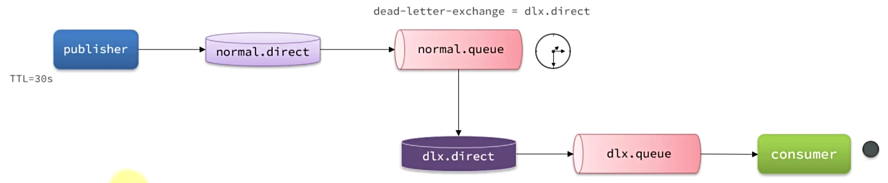

### 2. 代码实现

```
@RabbitListener(bindings = @QueueBinding(
        value = @Queue(name = "dlx.queue", durable = "true"),
        exchange = @Exchange(name = "dlx.direct", type = ExchangeTypes.DIRECT),
        key = {"hi"}
))
public void listenDlxQueue(String message){
    log.info("消费者监听到 dlx.queue的消息：【{}】", message);
}
```

```
@Configuration
public class NormalConfiguration {

    @Bean
    public DirectExchange normalExchange(){
        return new DirectExchange("normal.direct");
    }

    @Bean
    public Queue normalQueue(){
        return QueueBuilder
                .durable("normal.queue")
                .deadLetterExchange("dlx.direct")
                .build();
    }

    @Bean
    public Binding normalExchangeBinding(Queue normalQueue, DirectExchange normalExchange){
        return BindingBuilder.bind(normalQueue).to(normalExchange).with("hi");
    }
}
```

1. `**normalExchange**`：声明了一个名为 `normal.direct` 的直连交换机，用于处理正常的业务消息。
2. `**normalQueue**`：声明了一个名为 `normal.queue` 的持久化队列。

- **关键点**：`.deadLetterExchange("dlx.direct")` 这一行配置了该队列的死信交换机。这意味着，当 `normal.queue` 中的消息变成死信（如被拒绝、过期或队列满）时，它会被自动转发到名为 `dlx.direct` 的交换机。

3. `**normalExchangeBinding**`：将 `normal.queue` 绑定到 `normal.direct` 交换机，并指定 Routing Key 为 `hi`。

---

### 3. 整体架构关联

- **正常流程**：消息发送到 `normal.direct` 交换机 -> 路由到 `normal.queue` -> 消费者处理。
- **异常流程**：如果消息在 `normal.queue` 中处理失败（例如被 `basic.nack` 且 `requeue=false`），它会变成死信 -> 被转发到 `dlx.direct` 交换机 -> 路由到 `dlx.queue`（由之前的消费者监听）-> 由专门的死信消费者处理（如记录日志、告警或重试）。

---

## (三) 延迟消息插件

安装教程：[https://my.feishu.cn/wiki/A9SawKUxsikJ6dk3icacVWb4n3g](https://my.feishu.cn/wiki/A9SawKUxsikJ6dk3icacVWb4n3g)

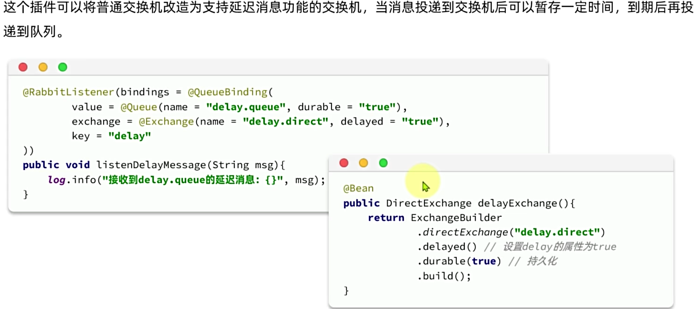

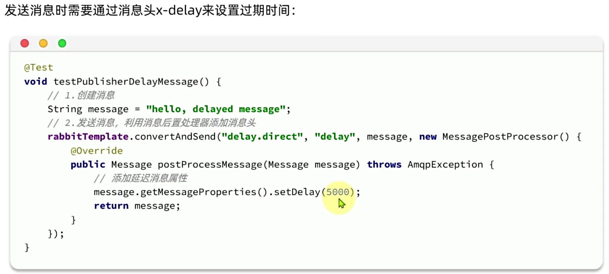

---

## (四) 取消超时订单

### 1. 订单支付状态检查流程

用户下单完成后，发送15分钟延迟消息，在15分钟后接收消息，检查支付状态：

- **已支付**：更新订单状态为已支付
- **未支付**：更新订单状态为关闭订单，恢复商品库存

---

### 2. 业务场景解析

这是一个典型的电商“订单超时未支付自动取消”的业务场景。

- **延迟消息的作用**：它充当了一个“定时器”。用户下单后，系统并不立即执行检查，而是发送一条15分钟后才会被消费的消息。
- **消费逻辑**：

1. 15分钟后，消费者收到消息。
2. 查询数据库中该订单的支付状态。
3. 如果**已支付**，则更新订单状态（可能用于触发发货等后续流程）。
4. 如果**未支付**，则执行“关单”操作，并释放被锁定的商品库存，以便其他用户购买。

这种设计可以有效避免因用户忘记支付而导致的库存被长时间占用，提升了库存周转率。

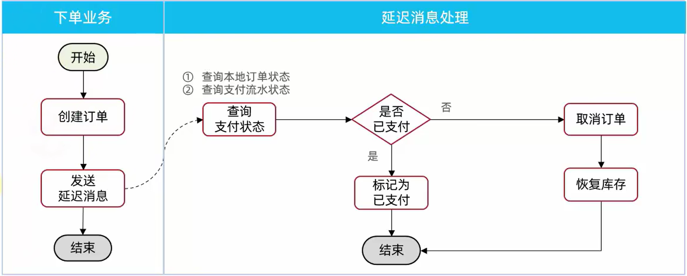

---

---

## 🔗 关联笔记
- [[数据库与中间件]]
- [[RocketMQ笔记]]
- [[黑马点评（Redis 企业实战）]]
