03月08日开启了 Redis 的学习

---

**基础篇**

学习 Redis 对 Java 后端开发非常重要，主要原因如下：

- **提升性能**：Redis 作为内存数据库，读写极快，可缓存热点数据，显著减少数据库压力，加快接口响应。
- **支持高并发**：在高并发场景下，通过缓存和限流等机制保障系统稳定。
- **丰富功能**：提供字符串、哈希、列表、集合等多种数据结构，适用于缓存、排行榜、消息队列、分布式锁等场景。
- **分布式支持**：实现 Session 共享、分布式锁等，解决集群环境下的状态一致性问题。
- **生态集成好**：与 Spring Boot 等主流 Java 框架无缝集成，开发便捷。
- **面试与实战必备**：Redis 是后端开发高频考点，也是中大型项目标配组件。

简言之，Redis 是构建高性能、可扩展 Java 后端系统的关键工具之一。

# 1. Redis 简介

---

**Redis**（Remote Dictionary Server）是一个**开源的、基于内存的高性能键值（Key-Value）数据库**，常被用作**缓存、消息队列和分布式存储系统**。

**核心特点：**

- **速度快**：数据存储在内存中，读写性能极高（每秒可处理数十万次操作）。
- **支持多种数据结构**：如字符串（String）、哈希（Hash）、列表（List）、集合（Set）、有序集合（Sorted Set）等。
- **持久化支持**：可将内存数据定期保存到磁盘（RDB 快照或 AOF 日志），防止重启丢失。
- **高可用与扩展**：支持主从复制、哨兵（Sentinel）自动故障转移、Redis Cluster 分布式集群。
- **丰富的应用场景**：缓存、会话共享、排行榜、计数器、分布式锁、消息队列等。

---

# 2. 初识 Redis

## 2.1. 认识 Nosql

**关系型数据库**和**非关系型数据库**：

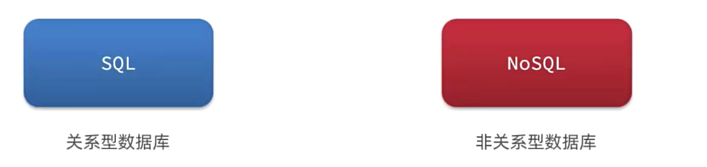

### 2.1.1. 结构化和非结构化：

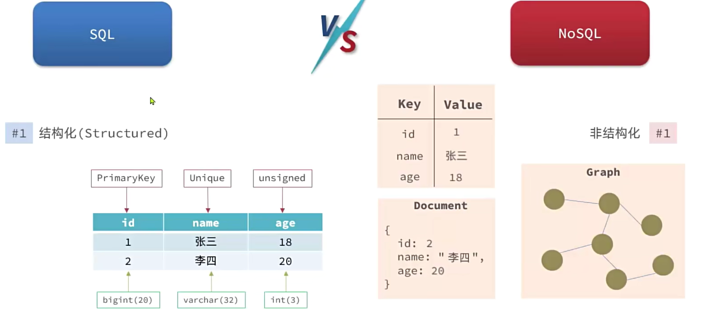

**补充:** 列类型（HBase）、Graph 类型（Neon4j）

---

### 2.1.2. （关联的）Relational 和无关联的

对于 SQL 关联的：

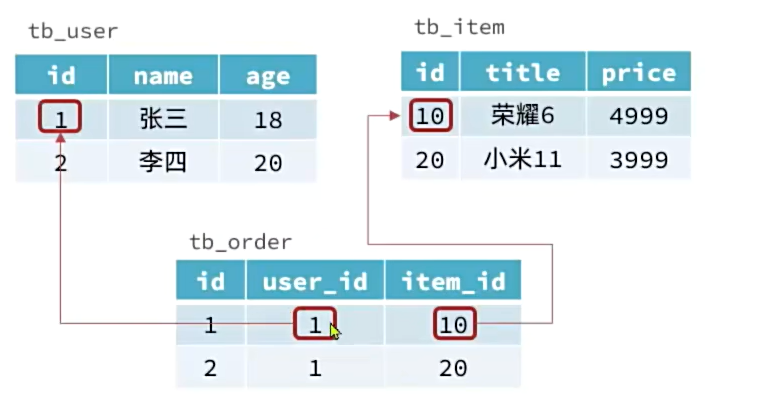

对于 NoSQL 无关联的：

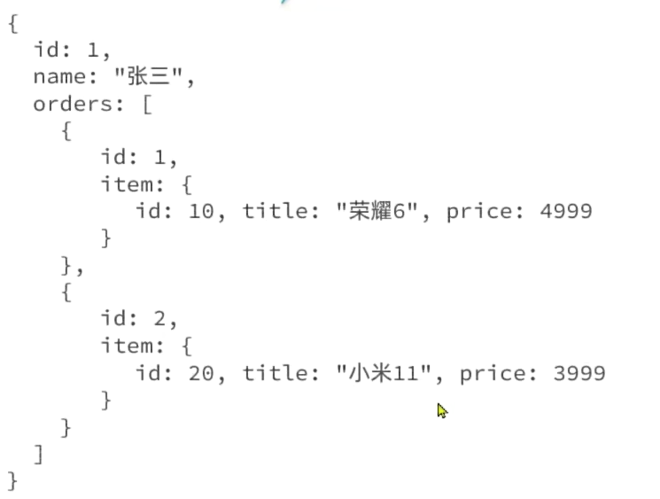

---

### 2.1.3. 查询方式

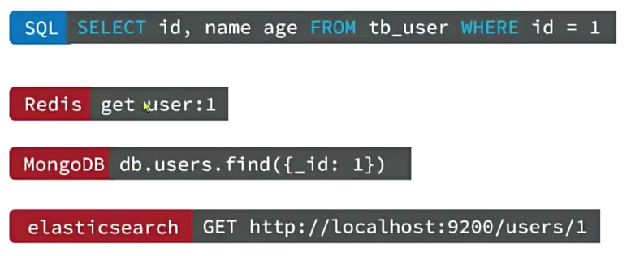

---

#### 2.1.3.1. 一、查询方式的区别

|   |   |   |
|---|---|---|
|维度|SQL（如 MySQL、PostgreSQL）|NoSQL（如 MongoDB、Redis、Cassandra）|
|**查询语言**|使用标准化的 **结构化查询语言（SQL）**，语法统一、功能强大（支持 JOIN、子查询、聚合、窗口函数等）。|没有统一标准，**每种 NoSQL 类型有自己的查询方式**：  <br>• 文档型（MongoDB）：类 JSON 查询 + 聚合管道  <br>• 键值型（Redis）：命令式 API（如 `GET key`<br><br>）  <br>• 列族型（Cassandra）：类 SQL 的 CQL  <br>• 图数据库（Neo4j）：Cypher 语言|
|**数据关联**|支持 **多表 JOIN**，通过外键关联不同表，适合复杂关系查询。|**通常不支持 JOIN**（或性能极差），强调“反范式”设计——把相关数据嵌套存储在一起（如 JSON 文档内包含全部信息）。|
|**查询灵活性**|查询逻辑与数据结构解耦：即使表结构复杂，也能通过声明式 SQL 获取任意组合结果。|查询能力受限于数据模型：  <br>• Redis 只能按 key 查  <br>• MongoDB 可查嵌套字段但不能高效跨文档关联  <br>• 图数据库擅长遍历关系但不擅统计|
|**优化方式**|依赖 **查询优化器** 自动选择执行计划（如走索引还是全表扫描）。|通常需**开发者手动设计数据模型**以匹配查询模式（“查询驱动建模”）。|

**简单比喻**：

- SQL 像“写剧本”：你只说“我要什么”，数据库自己想办法高效拿到。
- NoSQL 像“指挥机器人”：你必须提前把数据摆好，然后精确告诉它去哪拿。

---

#### 2.1.3.2. SQL 的优点

1. **强一致性 & 事务支持**  
    完整 ACID 事务，适合金融、订单等对数据准确性要求高的场景。
2. **复杂查询能力强**  
    多表关联、子查询、窗口函数、CTE 等支持复杂分析。
3. **成熟生态 & 标准化**  
    SQL 是通用语言，工具链丰富（BI 工具、ORM 框架等）。
4. **数据完整性保障**  
    通过主键、外键、约束、触发器等机制防止脏数据。

**适用场景**：ERP、银行系统、电商订单、报表分析等结构化、强一致需求。

---

#### 2.1.3.3. NoSQL 的优点

1. **高扩展性（水平扩展）**  
    天然支持分布式架构，轻松通过加机器应对海量数据和高并发。
2. **灵活的数据模型**  
    无需预定义 Schema，JSON 文档可动态增减字段，适合快速迭代。
3. **高性能读写**  
    • 键值型（Redis）：微秒级响应，适合缓存  
    • 列存储（Cassandra）：高吞吐写入  
    • 文档型（MongoDB）：单文档原子操作快
4. **适配多样数据类型**  
    原生支持 JSON、图、时序、地理空间等非结构化/半结构化数据。

**适用场景**：

- 缓存/会话存储 → **Redis**
- 用户画像、内容管理 → **MongoDB**
- 物联网时序数据 → **InfluxDB**
- 社交关系、推荐系统 → **Neo4j**

---

#### 2.1.3.4. 三、如何选择？

|   |   |
|---|---|
|需求特征|推荐数据库类型|
|数据结构固定、强一致性、复杂查询|**SQL**|
|高并发、海量数据、灵活 Schema|**NoSQL**|
|需要 JOIN 多个实体|**SQL**（或图数据库）|
|快速原型开发、频繁变更字段|**NoSQL（文档型）**|
|超低延迟读写（如缓存）|**NoSQL（键值型）**|

💡 **现代趋势**：**混合架构（Polyglot Persistence）**  
很多系统同时使用 SQL + NoSQL，例如：

- 用 **MySQL** 存核心交易数据（保证一致性）
- 用 **Redis** 做缓存加速
- 用 **Elasticsearch** 支持全文搜索
- 用 **MongoDB** 存用户行为日志

---

### 2.1.4. 事务： ACID 和 BASE

SQL 的事务特性遵循 **ACID** 原则，而 NoSQL 数据库通常采用 **BASE** 模型。

#### 2.1.4.1. 一、ACID（传统关系型数据库）

ACID 是指事务的四个核心特性：

1. **Atomicity（原子性）**

- 事务中的所有操作要么全部成功，要么全部失败回滚。
- 不允许部分执行。

2. **Consistency（一致性）**

- 事务执行前后，数据库必须保持一致性状态（满足所有约束、触发器、外键等规则）。

3. **Isolation（隔离性）**

- 多个并发事务之间互不干扰，每个事务看起来像是串行执行的。

4. **Durability（持久性）**

- 一旦事务提交，其结果将永久保存，即使系统崩溃也不会丢失。

ACID 强调**强一致性**和**数据完整性**，适用于对数据准确性要求高的场景（如银行交易、订单系统等）。

---

#### 2.1.4.2. 二、BASE（多数 NoSQL 数据库）

BASE 是对 ACID 的一种“放松”，强调系统的**高可用性**和**可扩展性**，尤其适用于分布式系统。

BASE 代表：

1. **Basically Available（基本可用）**

- 系统保证大部分时间可用，但可能在某些故障或分区情况下暂时不可用或响应延迟。

2. **Soft state（软状态）**

- 系统状态可以随时间变化，即使没有外部输入（因为数据可能还在同步中）。

3. **Eventually consistent（最终一致性）**

- 系统不要求立即一致，但保证在没有新的更新操作后，经过一段时间，所有节点的数据会达到一致状态。

BASE 牺牲了**强一致性**，换取**高可用性**和**横向扩展能力**，适合社交网络、日志系统、缓存等对一致性容忍度较高的场景。

---

#### 2.1.4.3. 三、对比总结

|   |   |   |
|---|---|---|
|维度|ACID（SQL）|BASE（NoSQL）|
|一致性|强一致性|最终一致性|
|可用性|可能因一致性牺牲可用性|高可用优先|
|分区容忍性|通常不强调（CAP 中选 CA）|强调（CAP 中选 AP）|
|事务支持|支持完整事务|通常不支持或仅支持有限事务|
|典型系统|MySQL, PostgreSQL, Oracle|MongoDB, Cassandra, Redis, DynamoDB|
|适用场景|金融、账务、关键业务系统|大规模 Web 应用、实时分析、缓存等|

---

#### 2.1.4.4. 四、CAP 定理视角

- **CAP 定理**指出：在分布式系统中，**一致性（C）**、**可用性（A）** 和 **分区容忍性（P）** 三者最多只能同时满足两个。
- ACID 数据库倾向于 **CA**（放弃分区容忍性，适用于单机或强一致集群）。
- BASE 数据库倾向于 **AP**（放弃强一致性，确保在网络分区时仍可用）。

---

### 2.1.5. 总结

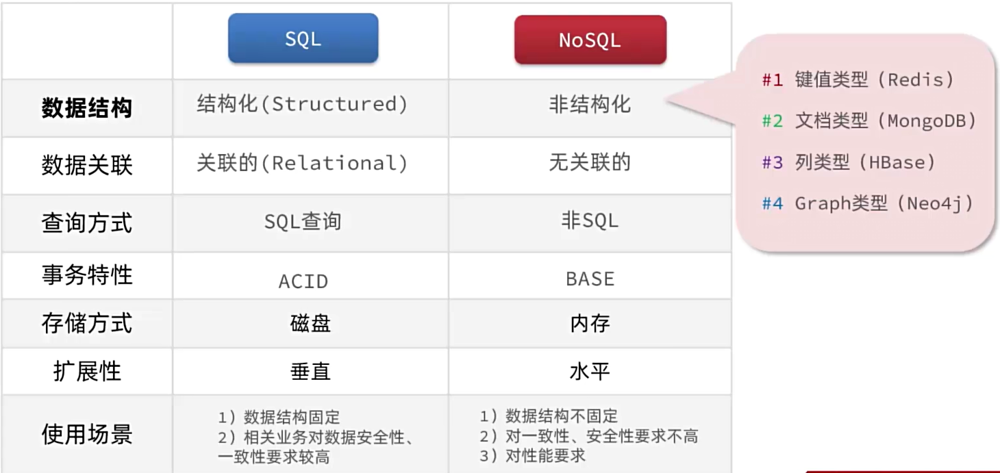

---

## 2.2. 认识 Redis

**Redis**诞生于2009年全称是**Re****mote** **Di****ctionary** **S****erver**，远程词典服务器，是一个**基于内存**的键值型NoSQL数据库。

**特征：**

- 键值（key-value）型，value支持多种不同数据结构，功能丰富
- 单线程，每个命令具备原子性
- 低延迟，速度快（基于内存、IO多路复用、良好的编码）
- 支持数据持久化
- 支持主从集群、分片集群
- 支持多语言客户端

---

## 2.3. 安装 Redis 及启动三种方式

## 2.4. Redis 命令行客户端

## 2.5. Redis 图形化界面客户端

# 3. Redis 命令

## 3.1. Redis 数据结构介绍

---

Redis 是一个 **key - value** 的数据库，**key** 一般是 **String** 类型，不过 **value** 的**类型多种多样**：

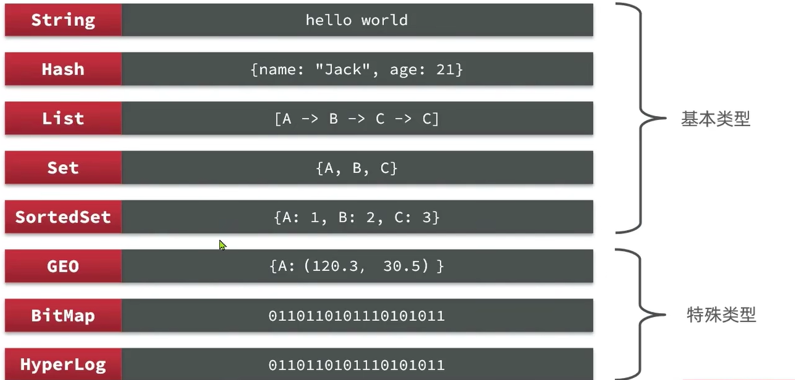

1. 在官方网站查看不同的命令：[https://redis.io/docs/latest/commands/](https://redis.io/docs/latest/commands/)

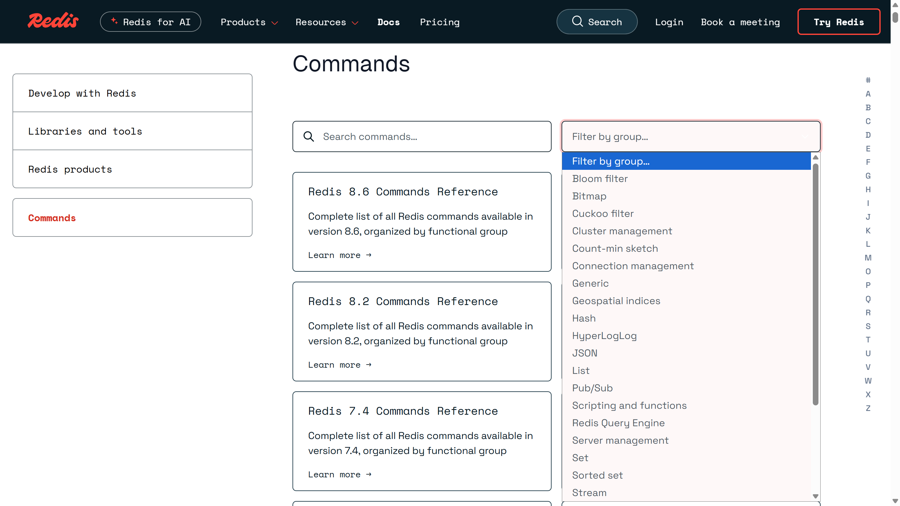

2. 命令行使用 **help** 或者 **help @[command]** 命令：

例如 **help @String**

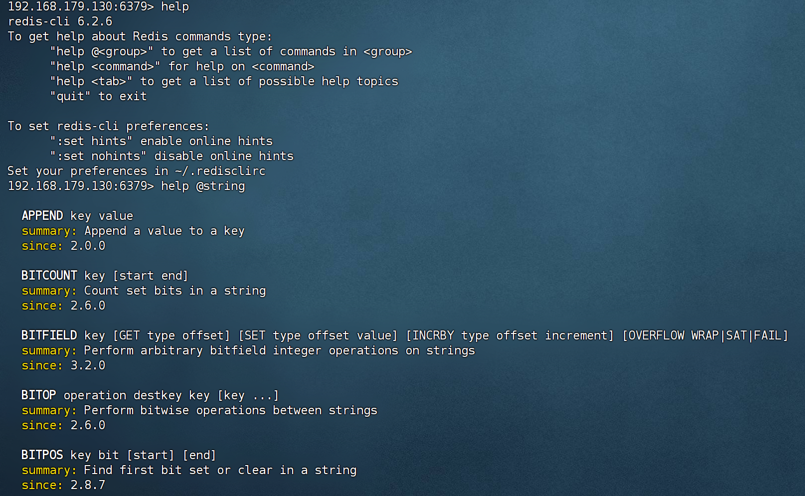

## 3.2. Redis 通用命令

1. 通过官网查看：[https://redis.io/docs/latest/commands/?group=generic](https://redis.io/docs/latest/commands/?group=generic)

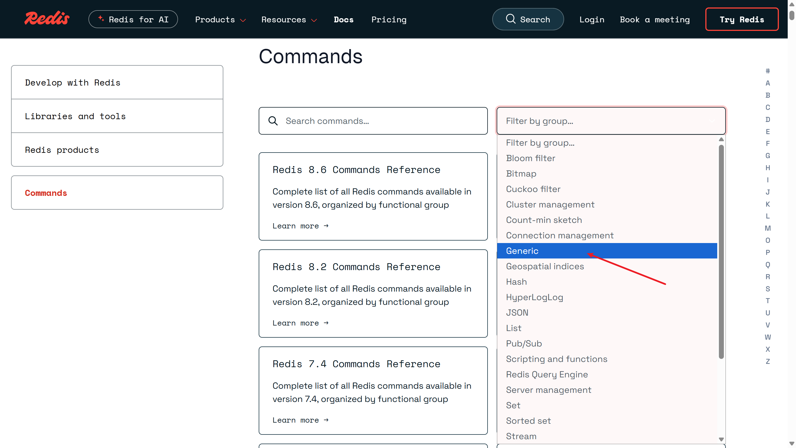

---

2. 使用命令行输入 **help @generic** **:**

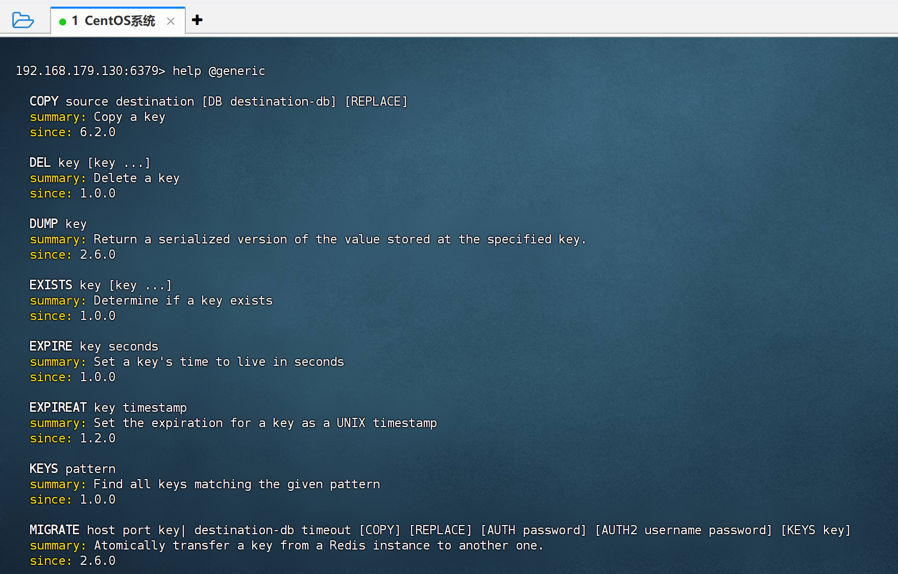

---

通用指令是部分数据类型的，都可以使用的指令，常见的有：  
● KEYS：查看符合模板的所有key，不建议在生产环境设备上使用  
● DEL：删除一个指定的key  
● EXISTS：判断key是否存在  
● EXPIRE：给一个key设置有效期，有效期到期时该key会被自动删除  
● TTL：查看一个KEY的剩余有效期

---

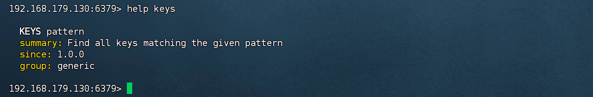

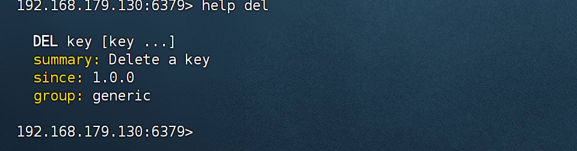

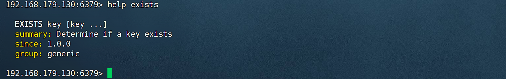

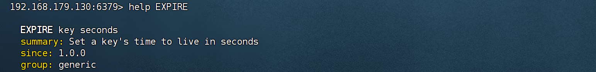

输出结果为 -2 时就说明 Redis 中没有数据了，输出为 -1 说明数据永久有效不会过期：

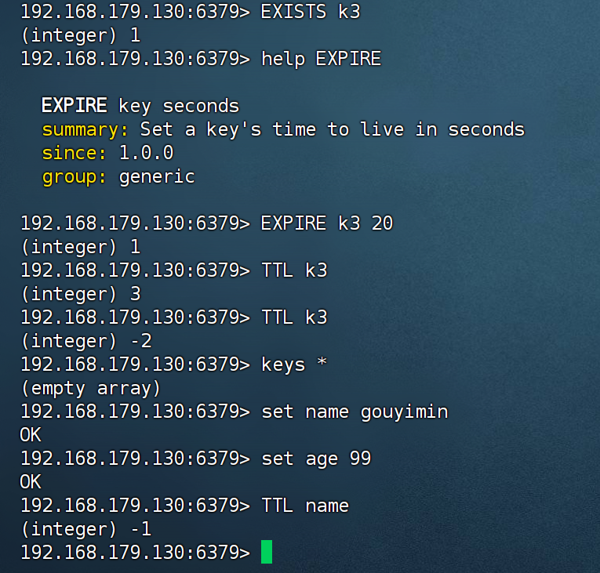

---

## 3.3. String 类型

String类型，也就是字符串类型，是Redis中最简单的存储类型。  
其value是字符串，不过根据字符串的格式不同，又可以分为3类：  
● string：普通字符串  
● int：整数类型，可以做自增、自减操作  
● float：浮点类型，可以做自增、自减操作

不管是哪种格式，底层都是字节数组形式存储，只不过是编码方式不同。字符串类型的最大空间不能超过 521m。


**String类型的常见命令：**  
● SET：添加或者修改已经存在的一个String类型的键值对  
● GET：根据key获取String类型的value  
● MSET：批量添加多个String类型的键值对  
● MGET：根据多个key获取多个String类型的value  
● INCR：让一个整型的key自增1  
● INCRBY：让一个整型的key自增并指定步长，例如：incrby num 2 让num值自增2  
● INCRBYFLOAT：让一个浮点类型的数字自增并指定步长  
● SETNX：添加一个String类型的键值对，前提 是这个key不存在，否则不执行  
● SETEX：添加一个String类型的键值对，并且指定有效期

---

## 3.4. key 的层级结构

Redis的key允许有多个单词形成层级结构，多个单词之间用':'隔开，格式如下：


这个格式并非固定，也可以根据自己的需求来删除或添加词条。

例如我们的项目名称叫 heima，有user和product两种不同类型的数据，我们可以这样定义key：  
◆ user相关的key：heima:user:1  
◆ product相关的key：heima:product:1

如果 value 是一个 Java 对象，例如 User 对象。则可以将对象序列化为 JSON 字符串后存储：

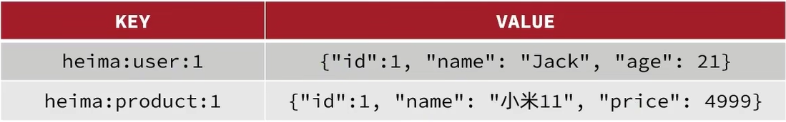

---

## 3.5. Hash 类型

Hash类型，也叫散列，其value是一个无序字典，类似于Java中的HashMap结构。  
String结构是将对象序列化为JSON字符串后存储，当需要修改对象某个字段时很不方便：

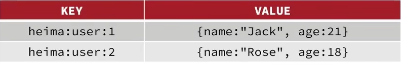

Hash 结构可以将对象中的每个字段独立存储，可以针对单个字段做 CRUD：

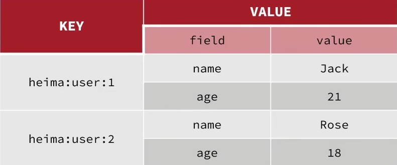

**Hash的常见命令有：**  
● HSET key field value：添加或者修改hash类型key的field的值  
● HGET key field：获取一个hash类型key的field的值  
● HMSET：批量添加多个hash类型key的field的值  
● HMGET：批量获取多个hash类型key的field的值  
● HGETALL：获取一个hash类型的key中的所有的field和value  
● HKEYS：获取一个hash类型的key中的所有的field  
● HVALS：获取一个hash类型的key中的所有的value  
● HINCRBY：让一个hash类型key的字段值自增并指定步长  
● HSETNX：添加一个hash类型的key的field值，前提 是这个field不存在，否则不执行

---

## 3.6. List 类型

Redis中的**List**类型与Java中的**LinkedList**类似，可以看做一个双向链表结构。既可以支持正向检索也可以支持反向检索。

特征也与LinkedList类似：  
● 有序  
● 元素可以重复  
● 插入和删除快  
● 查询速度一般

---

**List的常见命令有：**  
● LPUSH key element ...：向列表左侧插入一个或多个元素  
● LPOP key：移除并返回列表左侧的第一个元素，没有则返回nil  
● RPUSH key element ...：向列表右侧插入一个或多个元素  
● RPOP key：移除并返回列表右侧的第一个元素  
● LRANGE key start end：返回一段角标范围内的所有元素  
● BLPOP和BRPOP：与LPOP和RPOP类似，只不过在没有元素时等待指定时间，而不是直接返回nil

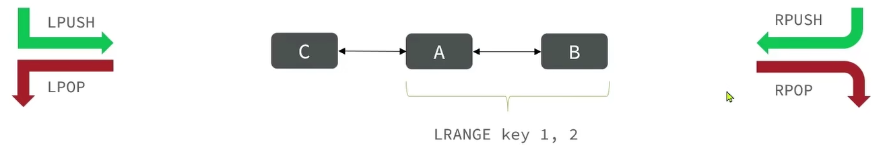

---

## 3.7. Set 类型

Redis的Set结构与Java中的HashSet类似，可以看做是一个value为null的HashMap。因为也是一个hash表，因此具备与HashSet类似的特征：  
● 无序  
● 元素唯一  
● 查找快  
● 支持交集、并集、差集等功能

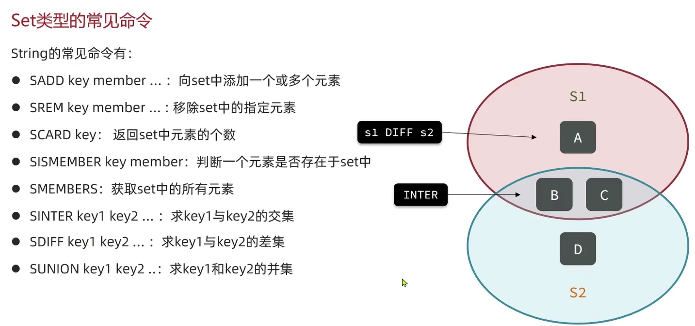

SRANDOMMEMBER：随机删除

SPOP：随机移除并返回集合中一个或多个成员

---

## 3.8. SortedSet 类型

Redis的**SortedSet**是一个可排序的set集合，与Java中的**TreeSet**有些类似，但底层数据结构却差别很大。SortedSet中的每一个元素都带有一个score属性，可以基于score属性对元素排序，底层的实现是一个**跳表（SkipList）**加 **hash表**。

**SortedSet**具备下列特性：  
● 可排序  
● 元素不重复  
● 查询速度快

因为**SortedSet**的**可排序特性**，经常被用来实现排行榜这样的功能。

---

**SortedSet类型的常见命令**  
● **ZADD** **key score member**：添加一个或多个元素到sorted set，如果已经存在则更新其score值  
● **ZREM** **key member**：删除sorted set中的一个指定元素  
● **ZSCORE** **key member**：获取sorted set中的指定元素的score值  
● **ZRANK** **key member**：获取sorted set中的指定元素的排名

● **Z****REV****RANK** **key member**：获取sorted set中的指定元素的排名（倒序）  
● **ZCARD** **key**：获取sorted set中的元素个数  
● **ZCOUNT** **key min max**：统计score值在给定范围内的所有元素的个数  
● **ZINCRBY** **key increment member**：让sorted set中的指定元素自增，步长为指定的increment值  
● **ZRANGE** **key min max**：按照score排序后，获取指定排名范围内的元素

● **Z****REV****RANGE** **key min max**：降序  
● **ZRANGEBYSCORE** **key min max**：按照score排序后，获取指定score范围内的元素  
● **ZDIFF****、****ZINTER****、****ZUNION**：求差集、交集、并集

注意：所有的排名默认是升序，如果要降序则在命令的 **Z** 后面添加 **REV** 即可。

---

# 4. Redis 的 Java 客户端

在Redis官网中提供了各种语言的客户端，地址：[https://redis.io/docs/latest/develop/clients](https://redis.io/docs/latest/develop/clients/lettuce/)

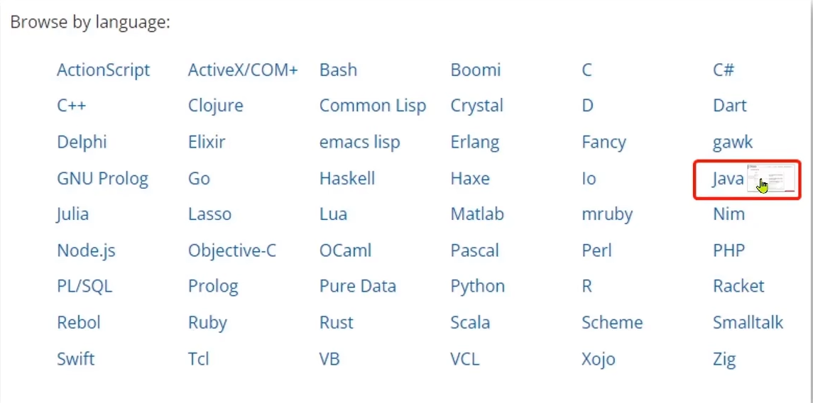

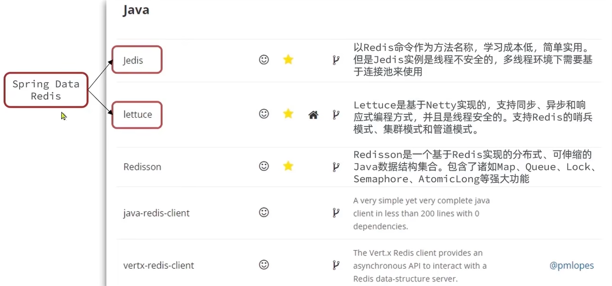

---

## 4.1. Jedis

Jedis 的官网地址：[https://redis.io/docs/latest/develop/clients/jedis/](https://redis.io/docs/latest/develop/clients/jedis/)

1. 引入依赖:

```
<dependency>
  <groupId>redis.clients</groupId>
  <artifactId>jedis</artifactId>
  <version>7.2.0</version>
</dependency>
```

2. 建立连接

新建一个单元测试类，内容如下：

```
public class JedisTest {

    private Jedis jedis;

    @BeforeEach
    void setUp(){
        //1.建立连接
        jedis = new Jedis("192.168.179.130",6379);
        //2.设置密码
        jedis.auth("123456");
        //3.选择库
        jedis.select(0);
    }
}
```

3. 测试：

```
@Test
void testString() {
    // 存入数据
    String result = jedis.set("name", "虎哥");
    System.out.println("result = " + result);
    // 获取数据
    String name = jedis.get("name");
    System.out.println("name = " + name);
}

@Test
void testHash() {
    // 插入hash数据
    jedis.hset("user:1", "name", "Jack");
    jedis.hset("user:1", "age", "21");

    // 获取
    Map<String, String> map = jedis.hgetAll("user:1");
    System.out.println(map);
}
```

4. 释放资源

```
@AfterEach
void tearDown() {
    if (jedis != null) {
        jedis.close();
    }
}
```

---

### 4.1.1. **Jedis 连接池**

Jedis本身是线程不安全的，并且频繁的创建和销毁连接会有性能损耗，因此我们推荐大家使用Jedis连接池代替Jedis的直连方式。

```
package edu.cqie.jedis.util;

import redis.clients.jedis.*;

public class JedisConnectionFactory {

    private static final JedisPool jedisPool;

    static {
        // 配置连接池
        JedisPoolConfig poolConfig = new JedisPoolConfig();
        //最大连接池
        poolConfig.setMaxTotal(8);
        //最大空闲连接
        poolConfig.setMaxIdle(8);
        //最小空闲连接
        poolConfig.setMinIdle(0);
        //设置最长等待时间，ms
        poolConfig.setMaxWaitMillis(1000);
        // 创建连接池对象，参数：连接池配置、服务端ip、服务端端口、超时时间、密码
        jedisPool = new JedisPool(poolConfig, "192.168.150.101", 6379, 1000, "123321");
    }
    //获取Jedis对象
    public static Jedis getJedis(){
        return jedisPool.getResource();
    }
}
```

---

## 4.2. SpringDataRedis

SpringData是Spring中数据操作的模块，包含对各种数据库的集成，其中对Redis的集成模块就叫做SpringDataRedis，官网地址：[https://spring.io/projects/spring-data-redis](https://spring.io/projects/spring-data-redis)

- 提供了对不同Redis客户端的整合（Lettuce和Jedis）
- 提供了RedisTemplate统一API来操作Redis
- 支持Redis的发布订阅模型
- 支持Redis哨兵和Redis集群
- 支持基于Lettuce的响应式编程
- 支持基于JDK、JSON、字符串、Spring对象的数据序列化及反序列化
- 支持基于Redis的JDKCollection实现

SpringDataRedis中提供了RedisTemplate工具类，其中封装了各种对Redis的操作。并且将不同数据类型的操作API封装到了不同的类型中：

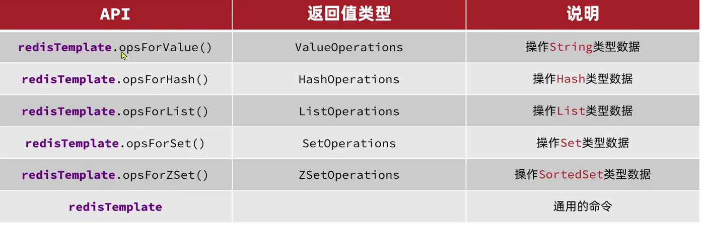

1. 引入依赖

```
<!-- redis依赖-->
<dependency>
  <groupId>org.springframework.boot</groupId>
  <artifactId>spring-boot-starter-data-redis</artifactId>
</dependency>
<!--连接池依赖-->
<dependency>
  <groupId>org.apache.commons</groupId>
  <artifactId>commons-pool2</artifactId>
</dependency>
```

2. 配置文件

```
spring:
  data:
    redis:
      host: 192.168.179.130
      port: 6379
      password: 123456
      lettuce:
        pool:
          max-active: 8 #最大连接
          max-idle: 8  #最大空闲连接
          min-idle: 0  #最小空闲连接
          max-wait: 100ms  # 单位建议加上 ms
```

3. 注入 RedisTemplate

```
@Autowired
private RedisTemplate redisTemplate;
```

4. 编写测试

```
@Test
void testString() {
    //写入一条String数据
    redisTemplate.opsForValue().set("name","lsii");
    //获取String数据
    Object name = redisTemplate.opsForValue().get("name");
    System.out.println("name = " + name);
}
```

---

### 4.2.1. SpringDataRedis 的序列化方式

RedisTemplate可以接收任意Object作为值写入Redis：

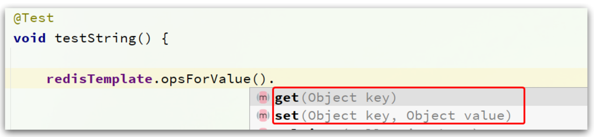

只不过写入前会把Object序列化为字节形式，默认是采用JDK序列化，得到的结果是这样的：

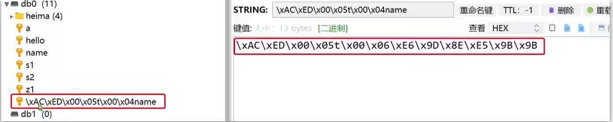

缺点：

- 可读性差
- 内存占用较大

我们可以自定义RedisTemplate 的序列化方式，代码如下：

```
@Configuration //用于标识一个 Java 类为 配置类
public class RedisConfig {

    @Bean
    public RedisTemplate<String,Object> redisTemplate(RedisConnectionFactory connectionFactory){
        //创建RediTemplate对象
        RedisTemplate<String,Object> template = new RedisTemplate<>();
        //设置连接工厂
        template.setConnectionFactory(connectionFactory);
        //创建JSON序列化工具
        GenericJackson2JsonRedisSerializer jsonRedisSerializers = new GenericJackson2JsonRedisSerializer();
        //设置key的序列化
        template.setKeySerializer(RedisSerializer.string());
        template.setHashKeySerializer(RedisSerializer.string());
        //设置value的序列化
        template.setValueSerializer(jsonRedisSerializers);
        template.setHashValueSerializer(jsonRedisSerializers);
        //返回
        return template;
    }
}
```

```
@Autowired
private RedisTemplate<String,Object> redisTemplate;

@Test
void testSave(){
    //写入数据
    redisTemplate.opsForValue().set("user:101",new User("小王",20));
    //获取数据
    User user = (User) redisTemplate.opsForValue().get("user:101");
    System.out.println("输出方数据时：" + user);
}
```

这里采用了JSON序列化来代替默认的JDK序列化方式。最终结果如图：

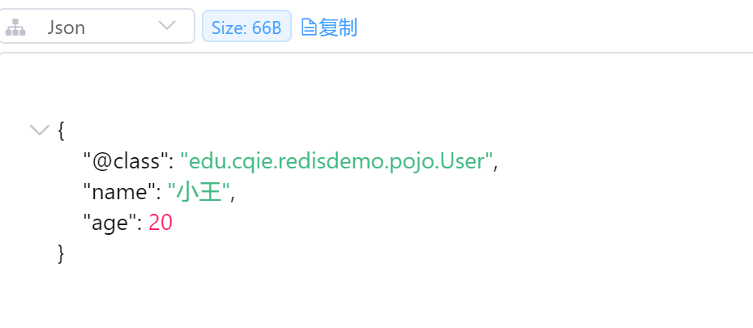

整体可读性有了很大提升，并且能将Java对象自动的序列化为JSON字符串，并且查询时能自动把JSON反序列化为Java对象。不过，其中记录了序列化时对应的class名称，目的是为了查询时实现自动反序列化。这会带来额外的内存开销。

---

为了节省内存空间，我们可以不使用JSON序列化器来处理value，而是统一使用String序列化器，要求只能存储String类型的key和value。当需要存储Java对象时，手动完成对象的序列化和反序列化。

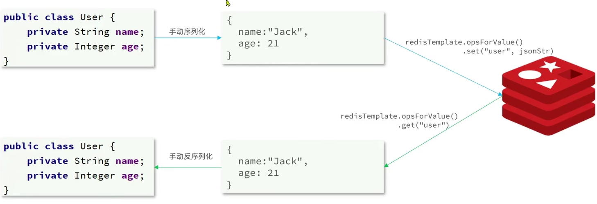

因为存入和读取时的序列化及反序列化都是我们自己实现的，SpringDataRedis就不会将class信息写入Redis了。

---

### 4.2.2. StringRedisTemplate

Spring默认提供了一个`StringRedisTemplate`类，它的key和value的序列化方式默认就是String方式。省去了我们自定义`RedisTemplate`的过程：

```
@Autowired
private StringRedisTemplate stringRedisTemplate;
// JSON工具
private static final ObjectMapper mapper = new ObjectMapper();

@Test
void testStringTemplate() throws JsonProcessingException {
    // 准备对象
    User user = new User("虎哥", 18);
    // 手动序列化
    String json = mapper.writeValueAsString(user);
    // 写入一条数据到redis
    stringRedisTemplate.opsForValue().set("user:200", json);

    // 读取数据
    String val = stringRedisTemplate.opsForValue().get("user:200");
    // 反序列化
    User user1 = mapper.readValue(val, User.class);
    System.out.println("user1 = " + user1);
}
```

---

**高级篇**

# 5. 分布式缓存（Redis 集群）

---

# 6. 多级缓存

---

# 7. Redis 最佳实践

---

**原理篇**

# 8. Redis 数据结构

---

# 9. Redis 网络模型

---

# 10. Redis 通信协议

---

# 11. Redis 内存回收

---

## 🔗 关联笔记
- [[数据库与中间件]]
- [[MySQL笔记]]
- [[黑马点评（Redis 企业实战）]]
- [[《黑马点评》项目学习笔记]]
