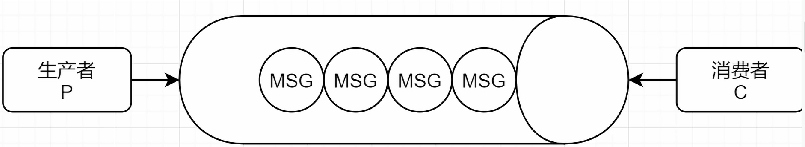
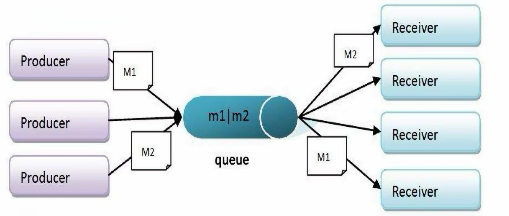
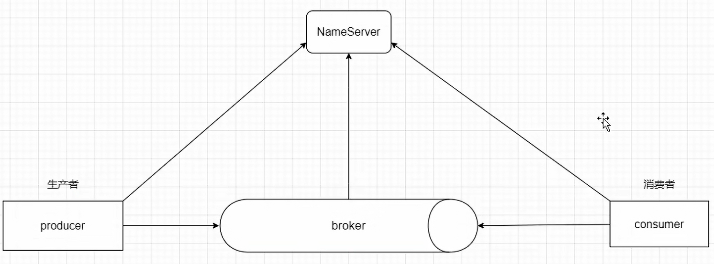
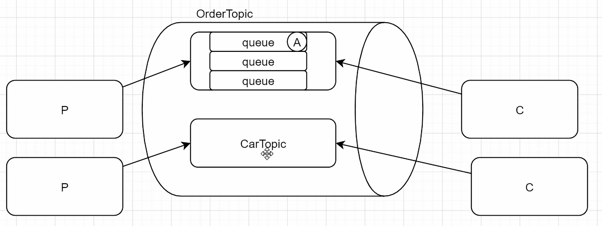
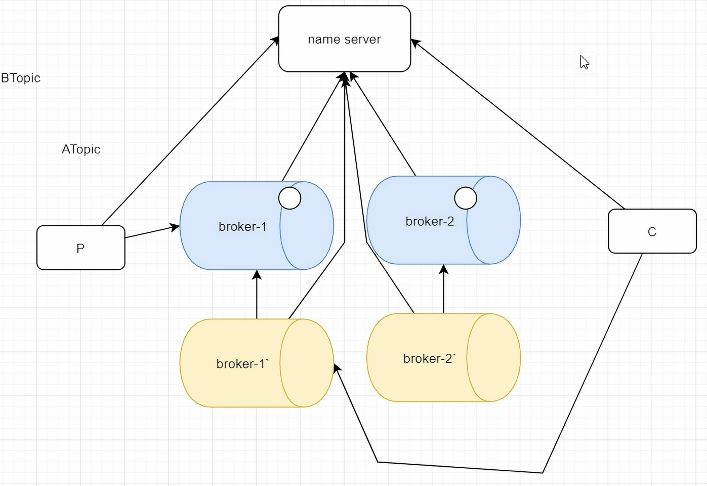

04月13日开始了 RocketMQ 消息队列的学习

# 1. 前言

其实，消息队列（**Message Queue**，简称 **MQ**）这个概念听起来很“技术流”，但在我们的日常生活中，它的逻辑无处不在。简单来说，它就是为了解决**“快与慢”**、**“多与少”**、**“即时与延时”**之间矛盾而存在的。

为了让你更直观地理解，我整理了几个最贴切的生活场景，你可以把它们看作是消息队列在不同功能上的“实体化”：

1. **智能快递柜：最经典的“解耦”与“异步”**

这是理解消息队列最完美的例子。

- **没有快递柜时（同步阻塞）：** 快递员送货必须给你打电话，你必须立刻下楼签收。如果你正在开会（处理其他任务）或者不在家（系统宕机/维护），快递员就得等着，或者改天再送。这导致双方都被“捆绑”在了一起，效率极低。
- **有了快递柜后（消息队列）：**

- **生产者（快递员）：** 把包裹放进柜子（发送消息），柜子给他一个取件码，他就可以立刻离开去送下一单，不需要关心你什么时候在家。
- **消息队列（快递柜）：** 暂存包裹，保证不丢失。
- **消费者（你）：** 你可以在下班后、周末等方便的时候（异步处理）凭码取件。哪怕你出差了，包裹也会在柜子里安全等待（削峰/缓冲）。

2. **餐厅点餐系统：典型的“异步处理”**

当你去快餐店或忙碌的餐厅吃饭时，流程也是这样的。

- **场景：** 你点完餐后，服务员不会站在厨房门口大喊“顾客饿了快做”，而是把单子贴在出单机上（进入队列），然后让你去旁边找位置坐。
- **核心价值：**

- **异步：** 你不需要站在柜台前死盯着厨师炒菜（等待耗时操作），你可以先玩手机或聊天。
- **削峰：** 哪怕突然来了10桌客人（流量洪峰），单子会按顺序排队，厨师（后端服务）按照自己的节奏一道菜一道菜做，不会因为单子太多而“崩溃”或做不出来。

3. **热门景点的排队栏杆：强大的“流量削峰”**

想象一下迪士尼乐园或者春运火车站的检票口。

- **场景：** 外面有一万人想冲进乐园（瞬时高并发），但检票口每分钟只能通过50人。如果没有栏杆（队列），人群会一拥而上，导致踩踏事故（系统瘫痪/数据库宕机）。
- **MQ的作用：** 蜿蜒曲折的“S”型栏杆就是消息队列。它先把一万人拦在外面排队（缓冲），然后以检票口能承受的稳定速度（消费能力）放行。这样既保护了检票系统，又维持了秩序。

4. **公司的“全员通知”：灵活的“发布/订阅”**

在一个大公司里，人事部发布通知的场景。

- **场景：** 人事部发布了一条“公司明天放假”的消息。
- **MQ的作用：** 这条消息发出后，财务部收到了（做考勤统计）、行政部收到了（安排值班）、IT部收到了（安排服务器维护）。
- **解耦：** 人事部不需要知道具体有哪些部门，也不需要一个个去打电话。只要把消息发到“广播台”（MQ），感兴趣的部门（订阅者）自然会去处理。如果以后新成立了一个“合规部”，只要让它也订阅这个消息就行，不需要修改人事部的流程。

5. **闹钟或外卖超时提醒：精准的“延迟队列”**

这是一个比较特殊但非常重要的场景。

- **场景：** 你点外卖时，系统提示“30分钟未接单将自动退款”。或者你设定了一个明天早上8点的闹钟。
- **MQ的作用：** 系统不会每秒钟都去轮询检查“到了吗？到了吗？”。而是把这个任务扔进“延迟队列”，设置好时间（比如30分钟后）。时间一到，消息队列会自动把这条消息“弹”出来告诉系统：“嘿，时间到了，该执行退款了”。

**总结对照表：**

|   |   |   |
|---|---|---|
|生活场景|对应的MQ核心功能|解决什么问题|
|**智能快递柜**|**解耦、异步**|发送方和接收方不需要同时在线，互不干扰。|
|**餐厅后厨出单机**|**异步处理**|避免用户长时间等待，提升体验；让后台按能力处理。|
|**景区排队栏杆**|**流量削峰**|防止瞬间流量过大冲垮系统，保护后端稳定性。|
|**公司全员广播**|**发布/订阅**|一个消息多方处理，系统扩展方便，互不依赖。|
|**定时闹钟**|**延迟队列**|处理定时的任务（如订单超时取消、优惠券过期提醒）。|

---

吞吐量：单位时间内 接收和处理 消息的速度

**activeMq**: java写的(jms协议), 性能一般, 出现早, 功能单一, 吞吐量低  
**rabbitmq**: erlang(amqp协议), 性能好, 功能丰富, 吞吐量一般  
**rocketmq**: java (阿里), 性能好, 功能最丰富, 吞吐量高  
**kafka**:scala写的, 吞吐量最大, 功能单一, 大数据领域

---

# 2. RocketMQ 简介

**RocketMQ** 是阿里巴巴 2016 年 MQ 中间件，使用 Java 语言开发，RocketMQ 是一款开源的**分布式消息系统**，基于高可用分布式集群技术，提供低延时的、高可靠的消息发布与订阅服务。  
同时，广泛应用于多个领域，包括异步通信解耦、企业解决方案、金融支付、电信、电子商务、快递物流、广告营销、社交、即时通信、移动应用、手游、视频、物联网、车联网等。  
具有以下特点：

1. 能够保证严格的消息顺序
2. 提供丰富的消息拉取模式
3. 高效的订阅者水平扩展能力
4. 实时的消息订阅机制
5. 亿级消息堆积能力

## a. 集群与分布式的区别

- 集群：多台机器运行相同的服务，目的是提高并发处理能力和容错性。
- 分布式：将一个业务拆分成多个不同的子服务，部署在不同机器上，目的是解耦和提升单任务效率。

举例：

集群：5 台服务器都运行相同的订单服务（order-service）。

分布式：订单服务、用户服务、库存服务分别部署在不同服务器上。

---

### ⅰ. 🍜 场景：你想开一家“超级面馆”

### ⅱ. ✅ **1. 单机模式（原始状态）**

你一个人干所有事：

- 接待客人
- 煮面
- 收钱
- 洗碗

结果：一忙就乱，客人排队，还容易出错。这就像**单台服务器处理所有请求**。

---

### ⅲ. 🔁 **2. 集群（Cluster）—— 多个“一样的你”一起干**

你复制了**3个一模一样的分店**，每家店都能**独立完成全套服务**：接待 + 煮面 + 收钱 + 洗碗。

- 客人来了，门口有个“调度员”（比如 Nginx），把客人平均分配到3家店。
- 如果其中一家店着火了（宕机），其他两家还能继续营业。
- 但每家店都做**完全一样的事**。

✅ **这就是“集群”**：

**多台机器干同样的活，提高服务能力、防止单点故障。**

💡 关键词：**复制、冗余、高可用、负载均衡**

---

### ⅳ. 🧩 **3. 分布式（Distributed）—— 分工合作，各干各的**

这次你不开分店，而是把工作**拆开**，请不同的人专门负责不同环节：

- 小王：只负责**接待和点单**（前端/网关）
- 小李：只负责**煮面**（订单服务）
- 小张：只负责**管食材库存**（库存服务）
- 小赵：只负责**收钱开发票**（支付服务）

他们通过内部对讲机（API/消息队列）沟通协作，共同完成一碗面的交付。

✅ **这就是“分布式”**：

**把一个大任务拆成多个小任务，由不同专业模块协作完成。**

💡 关键词：**拆分、解耦、专业化、协同**

---

### ⅴ. 🆚 对比总结

|   |   |   |
|---|---|---|
||**集群**|**分布式**|
|核心思想|复制多份，一起干同样的事|拆分成不同部分，各干各的|
|目的|抗压、防挂、提速|解耦、灵活、易维护、可扩展|
|举例|3个相同的 Spring Boot 实例|用户服务 + 订单服务 + 支付服务|
|关系|可以共存！分布式系统里的每个服务**自己也可以集群部署**||

现代大型系统（比如淘宝、微信）**既是分布式的，又在每个服务内部用了集群**！

**🎯** **一句话记住：**

**集群是“人多力量大”，分布式是“术业有专攻”。**

---

## b. 为什么要使用 MQ

1. 要做到系统解耦，当新的模块进来时，可以做到代码改动最小； 能够解耦
2. 设置流程缓冲池，可以让后端系统按自身吞吐能力进行消费，不被冲垮； 能够削峰，限流
3. 强弱依赖梳理能把非关键调用链路的操作异步化并提升整体系统的吞吐能力；能够异步

**MQ** 的作用： **削峰限流 异步 解耦合**

---

### ⅰ. 定义

中间件（缓存中间件 redis memcache 数据库中间件 mycat canal 消息中间件 mq ）  
面向消息的**中间件**（message-oriented middleware）MOM 能够很好的解决以上的问题。  
是指利用**高效可靠的消息传递机制进行与****平台无关（跨平台）的数据交流**，并基于数据通信来进行分布式系统的集成。  
通过提供**消息传递和消息排队模型**在分布式环境下提供应用解耦，弹性伸缩，冗余存储，流量削峰，异步通信，数据同步等

大致流程：  
发送者把消息发给消息服务器，消息服务器把消息存放在若干队列/主题中，在合适的时候，消息服务器会把消息转发给接受者。在这个过程中，发送和接受是异步的，也就是发送无需等待，发送者和接受者的生命周期也没有必然关系在发布 pub/订阅 sub 模式下，也可以完成一对多的通信，可以让一个消息有多个接受者［微信订阅号就是这样的］

---

### ⅱ. 特点

#### 1. **可靠性与高可用性**

- 支持**多主多从架构**，单点故障不影响整体服务。
- 消息支持**多副本存储**（Master/Slave），保障数据不丢失。
- 提供**消息重试机制**和**死信队列**处理消费失败场景。

#### 2. **高性能与扩展性**

- 具备**亿级消息堆积能力**，适用于高吞吐场景（如电商大促）。
- 支持**水平扩展**，可通过增加 Broker 节点提升系统容量。
- 低延迟、高并发设计，满足金融、互联网等严苛业务需求。

#### 3. **消息模型丰富**

- 支持多种消息类型：

- **普通消息**
- **顺序消息**（严格保序）
- **延迟消息**（定时/延后投递）
- **事务消息**（实现本地事务与消息发送的最终一致性，为 RocketMQ 独有特性）

#### 4. **灵活的消费模式**

- 同时支持 **Push 模式**（主动推送）和 **Pull 模式**（主动拉取）。
- 提供 **集群消费** 与 **广播消费** 两种策略，适应不同业务场景。

#### 5. **分布式架构友好**

- 架构组件解耦清晰：NameServer（轻量注册中心）、Broker（消息存储）、Producer/Consumer。
- 无单点依赖，NameServer 无状态，易于运维和扩容。

#### 6. **生态与兼容性**

- 原生 Java 实现，对 JVM 环境高度优化。
- 提供丰富的客户端 SDK（Java、C++、Go、Python 等）和管理工具（如 RocketMQ Dashboard）。

这些特点使 RocketMQ 广泛应用于**异步解耦、流量削峰、日志收集、分布式事务**等场景，尤其适合对消息顺序、事务一致性有强要求的系统。

---

# 3. RocketMQ 重要概念【重点】

**Producer**：消息的发送者，生产者；举例：发件人  
**Consumer**：消息接收者，消费者；举例：收件人  
**Broker**：暂存和传输消息的通道；举例：快递  
**NameServer**：管理 Broker；举例：各个快递公司的管理机构，相当于 broker 的注册中心，保留了 broker 的信息  
**Queue**：队列，消息存放的位置，一个 Broker 中可以有多个队列（真实存在的结构 ）  
**Topic**：主题，消息的分类(虚拟的结构)  
**ProducerGroup**：生产者组  
**ConsumerGroup**：消费者组，多个消费者组可以同时消费一个主题的消息

**消息发送的流程是，****Producer** **询问** **NameServer****，****NameServer** **分配一个** **broker****，然后** **Consumer** **也要询问** **NameServer****，得到一个具体的** **broker****，然后消费消息**

---

吞吐量：单位时间内 接收和处理 消息的速度

**activeMq**: java写的(jms协议), 性能一般, 出现早, 功能单一, 吞吐量低  
**rabbitmq**: erlang(amqp协议), 性能好, 功能丰富, 吞吐量一般  
**rocketmq**: java (阿里), 性能好, 功能最丰富, 吞吐量高  
**kafka**:scala写的, 吞吐量最大, 功能单一, 大数据领域

---

# 2. RocketMQ 简介

**RocketMQ** 是阿里巴巴 2016 年 MQ 中间件，使用 Java 语言开发，RocketMQ 是一款开源的**分布式消息系统**，基于高可用分布式集群技术，提供低延时的、高可靠的消息发布与订阅服务。  
同时，广泛应用于多个领域，包括异步通信解耦、企业解决方案、金融支付、电信、电子商务、快递物流、广告营销、社交、即时通信、移动应用、手游、视频、物联网、车联网等。  
具有以下特点：

1. 能够保证严格的消息顺序
2. 提供丰富的消息拉取模式
3. 高效的订阅者水平扩展能力
4. 实时的消息订阅机制
5. 亿级消息堆积能力

## a. 集群与分布式的区别

- 集群：多台机器运行相同的服务，目的是提高并发处理能力和容错性。
- 分布式：将一个业务拆分成多个不同的子服务，部署在不同机器上，目的是解耦和提升单任务效率。

举例：

集群：5 台服务器都运行相同的订单服务（order-service）。

分布式：订单服务、用户服务、库存服务分别部署在不同服务器上。

---

### ⅰ. 🍜 场景：你想开一家“超级面馆”

### ⅱ. ✅ **1. 单机模式（原始状态）**

你一个人干所有事：

- 接待客人
- 煮面
- 收钱
- 洗碗

结果：一忙就乱，客人排队，还容易出错。这就像**单台服务器处理所有请求**。

---

### ⅲ. 🔁 **2. 集群（Cluster）—— 多个“一样的你”一起干**

你复制了**3个一模一样的分店**，每家店都能**独立完成全套服务**：接待 + 煮面 + 收钱 + 洗碗。

- 客人来了，门口有个“调度员”（比如 Nginx），把客人平均分配到3家店。
- 如果其中一家店着火了（宕机），其他两家还能继续营业。
- 但每家店都做**完全一样的事**。

✅ **这就是“集群”**：

**多台机器干同样的活，提高服务能力、防止单点故障。**

💡 关键词：**复制、冗余、高可用、负载均衡**

---

### ⅳ. 🧩 **3. 分布式（Distributed）—— 分工合作，各干各的**

这次你不开分店，而是把工作**拆开**，请不同的人专门负责不同环节：

- 小王：只负责**接待和点单**（前端/网关）
- 小李：只负责**煮面**（订单服务）
- 小张：只负责**管食材库存**（库存服务）
- 小赵：只负责**收钱开发票**（支付服务）

他们通过内部对讲机（API/消息队列）沟通协作，共同完成一碗面的交付。

✅ **这就是“分布式”**：

**把一个大任务拆成多个小任务，由不同专业模块协作完成。**

💡 关键词：**拆分、解耦、专业化、协同**

---

### ⅴ. 🆚 对比总结

|   |   |   |
|---|---|---|
||**集群**|**分布式**|
|核心思想|复制多份，一起干同样的事|拆分成不同部分，各干各的|
|目的|抗压、防挂、提速|解耦、灵活、易维护、可扩展|
|举例|3个相同的 Spring Boot 实例|用户服务 + 订单服务 + 支付服务|
|关系|可以共存！分布式系统里的每个服务**自己也可以集群部署**||

现代大型系统（比如淘宝、微信）**既是分布式的，又在每个服务内部用了集群**！

**🎯** **一句话记住：**

**集群是“人多力量大”，分布式是“术业有专攻”。**

---

## b. 为什么要使用 MQ

1. 要做到系统解耦，当新的模块进来时，可以做到代码改动最小； 能够解耦
2. 设置流程缓冲池，可以让后端系统按自身吞吐能力进行消费，不被冲垮； 能够削峰，限流
3. 强弱依赖梳理能把非关键调用链路的操作异步化并提升整体系统的吞吐能力；能够异步

**MQ** 的作用： **削峰限流 异步 解耦合**

---

### ⅰ. 定义

中间件（缓存中间件 redis memcache 数据库中间件 mycat canal 消息中间件 mq ）  
面向消息的**中间件**（message-oriented middleware）MOM 能够很好的解决以上的问题。  
是指利用**高效可靠的消息传递机制进行与****平台无关（跨平台）的数据交流**，并基于数据通信来进行分布式系统的集成。  
通过提供**消息传递和消息排队模型**在分布式环境下提供应用解耦，弹性伸缩，冗余存储，流量削峰，异步通信，数据同步等

大致流程：  
发送者把消息发给消息服务器，消息服务器把消息存放在若干队列/主题中，在合适的时候，消息服务器会把消息转发给接受者。在这个过程中，发送和接受是异步的，也就是发送无需等待，发送者和接受者的生命周期也没有必然关系在发布 pub/订阅 sub 模式下，也可以完成一对多的通信，可以让一个消息有多个接受者［微信订阅号就是这样的］

---

### ⅱ. 特点

#### 1. **可靠性与高可用性**

- 支持**多主多从架构**，单点故障不影响整体服务。
- 消息支持**多副本存储**（Master/Slave），保障数据不丢失。
- 提供**消息重试机制**和**死信队列**处理消费失败场景。

#### 2. **高性能与扩展性**

- 具备**亿级消息堆积能力**，适用于高吞吐场景（如电商大促）。
- 支持**水平扩展**，可通过增加 Broker 节点提升系统容量。
- 低延迟、高并发设计，满足金融、互联网等严苛业务需求。

#### 3. **消息模型丰富**

- 支持多种消息类型：

- **普通消息**
- **顺序消息**（严格保序）
- **延迟消息**（定时/延后投递）
- **事务消息**（实现本地事务与消息发送的最终一致性，为 RocketMQ 独有特性）

#### 4. **灵活的消费模式**

- 同时支持 **Push 模式**（主动推送）和 **Pull 模式**（主动拉取）。
- 提供 **集群消费** 与 **广播消费** 两种策略，适应不同业务场景。

#### 5. **分布式架构友好**

- 架构组件解耦清晰：NameServer（轻量注册中心）、Broker（消息存储）、Producer/Consumer。
- 无单点依赖，NameServer 无状态，易于运维和扩容。

#### 6. **生态与兼容性**

- 原生 Java 实现，对 JVM 环境高度优化。
- 提供丰富的客户端 SDK（Java、C++、Go、Python 等）和管理工具（如 RocketMQ Dashboard）。

这些特点使 RocketMQ 广泛应用于**异步解耦、流量削峰、日志收集、分布式事务**等场景，尤其适合对消息顺序、事务一致性有强要求的系统。

---

# 3. RocketMQ 重要概念【重点】

**Producer**：消息的发送者，生产者；举例：发件人  
**Consumer**：消息接收者，消费者；举例：收件人  
**Broker**：暂存和传输消息的通道；举例：快递  
**NameServer**：管理 Broker；举例：各个快递公司的管理机构，相当于 broker 的注册中心，保留了 broker 的信息  
**Queue**：队列，消息存放的位置，一个 Broker 中可以有多个队列（真实存在的结构 ）  
**Topic**：主题，消息的分类(虚拟的结构)  
**ProducerGroup**：生产者组  
**ConsumerGroup**：消费者组，多个消费者组可以同时消费一个主题的消息

**消息发送的流程是，****Producer** **询问** **NameServer****，****NameServer** **分配一个** **broker****，然后** **Consumer** **也要询问** **NameServer****，得到一个具体的** **broker****，然后消费消息**

---

---

## 🔗 关联笔记
- [[数据库与中间件]]
- [[RabbitMQ笔记]]
