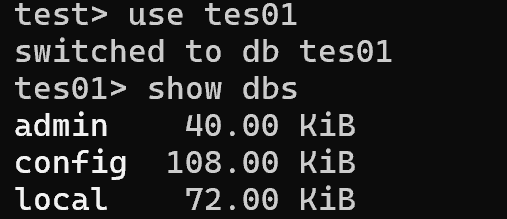

03月14日
# 1. 数据库的字符集和排序规则（Collation）

### 1.1.1. 🔍 排序规则的作用：

排序规则决定了：

- 字符如何比较（比如大小写敏感、是否区分重音符号等）
- 字符串的排序顺序
- 搜索时是否忽略大小写或特殊符号
### 1.1.2. 常见推荐选项说明：

|   |   |
|---|---|
|排序规则|说明|
|`utf8mb4_0900_ai_ci`|✅ **强烈推荐！**  <br>适用于大多数中文、英文、emoji 等场景。  <br>AI = Accent Insensitive（不区分重音）  <br>CI = Case Insensitive（不区分大小写）  <br>适合通用用途。|
|`utf8mb4_0900_as_cs`|区分大小写、区分重音，用于精确匹配（如密码）。|
|`utf8mb4_bin`|二进制排序，完全按字节比较，速度快但不智能，一般不用于普通文本。|
|`utf8mb4_croatian_ci`|克罗地亚语专用，除非你用克罗地亚语，否则不用选。|

---

### 1.1.3. 🎯 推荐选择：

👉 `**utf8mb4_0900_ai_ci**`

这是 MySQL 8.0+ 的默认排序规则，支持：

- 中文、英文、日文、韩文
- Emoji 表情
- 不区分大小写和重音（如 "café" 和 "cafe" 被认为相等）

适合绝大多数网站、管理系统、博客、电商系统等。

---

### 1.1.4. 💡 小贴士：

- 如果你要做**精确搜索**（比如用户名、密码），可以考虑 `utf8mb4_0900_as_cs`
- 如果你的应用主要使用英文且需要区分大小写，可以用 `utf8mb4_0900_as_cs`
- 避免使用 `utf8mb4_bin` 作为默认排序规则，除非你明确知道要做什么。

---

# 2. MapRecord 类的解释说明

`MapRecord` 是 Spring Data Redis 中的一个类，专门用于处理 Redis Stream 数据类型。

## 2.1. MapRecord 是什么？

`MapRecord` 是 Spring Data Redis 中专门用于处理 **Redis Stream** 数据类型的类。它表示 Redis Stream 中的一条消息记录。

在你的代码中（第 90-103 行），使用 Redis Stream 来异步处理秒杀订单：

- Redis Stream 是一种数据结构，类似于消息队列
- 每条消息包含：消息 ID、Stream Key、消息内容（字段 - 值对）
- `MapRecord<String, Object, Object>` 就是封装了这些信息

## 2.2. MapRecord 与 Map 的联系和区别

### 2.2.1. 联系：

1. **都存储键值对数据** - `MapRecord` 内部也使用 `Map` 来存储消息内容
2. **可以相互转换** - 通过 `record.getValue()` 可以获得一个 `Map<Object, Object>`

### 2.2.2. 核心区别：

|   |   |   |
|---|---|---|
|特性|**MapRecord**|**Map**|
|**用途**|专门用于 Redis Stream 消息|通用的键值对数据结构|
|**包含内容**|消息 ID + Stream Key + 消息内容 (Map)|仅键值对|
|**泛型**|`MapRecord<K, HK, HV>`  <br>K=Stream Key 类型  <br>HK=Field 类型  <br>HV=Value 类型|`Map<K, V>`  <br>K=Key 类型  <br>V=Value 类型|
|**来源**|Spring Data Redis 特有|Java 标准库|
|**额外方法**|`getId()`(消息 ID)  <br>`getStream()`(Stream 名称)  <br>`getValue()`(消息内容 Map)|`get()`, `put()`, `keySet()` 等通用方法|

## 2.3. 代码示例解析

```
// 从 Redis Stream 读取消息
List<MapRecord<String, Object, Object>> list = stringRedisTemplate.opsForStream().read(...);

// 获取第一条消息
MapRecord<String, Object, Object> record = list.get(0);

// MapRecord 的结构：
// - record.getStream() → "stream.orders" (Stream 的 key)
// - record.getId() → "1678901234567-0" (消息 ID)
// - record.getValue() → {userId=123, voucherId=456, id=789} (Map 类型的消息内容)

// 提取消息内容并转换为实体对象
Map<Object, Object> values = record.getValue();  // 获取内部的 Map
VoucherOrder voucherOrder = BeanUtil.fillBeanWithMap(values, new VoucherOrder(), true);
```

## 2.4. 总结

- `MapRecord` **= Redis Stream 消息的完整封装**（包含元数据 + 内容）
- `Map` **= 纯粹的键值对集合**
- 可以把 `MapRecord` 理解为"带有额外信息的特殊 Map"，专门用于 Redis 消息队列场景

你的项目中使用 Redis Stream 实现异步订单处理，`MapRecord` 就是从消息队列中读取的标准格式。

---

# 3. isMember 方法

**已查看文件** _BlogServiceImpl.java（黑马点评）_

## 3.1. `isMember` 方法的作用

`isMember` 是 Spring Data Redis 中 `StringRedisTemplate` 提供的一个方法，用于**判断某个元素是否存在于 Redis 的 Set 集合中**。

## 3.2. 具体说明：

**方法签名：**

```
Boolean isMember(String key, Object o)
```

**参数：**

- `key`: Redis 中 Set 集合的键名
- `o`: 要查询的元素

**返回值：**

- `true`: 元素存在于 Set 中
- `false`: 元素不存在于 Set 中
- `null`: Key 不存在

## 3.3. 在你的代码中的用途：

在第 81 行：

```
Boolean isMember = stringRedisTemplate.opsForSet().isMember(key, userId.toString());
```

这个方法用于**判断当前用户是否已经给这篇笔记点赞过**：

- `key = "blog:liked" + id`：存储某篇博客点赞用户的 Set 集合
- `userId.toString()`：当前登录用户的 ID

**业务逻辑：**

- 如果 `isMember` 为 `false` → 用户未点赞 → 执行点赞操作（数据库点赞数 +1，用户 ID 加入 Redis Set）
- 如果 `isMember` 为 `true` → 用户已点赞 → 执行取消点赞（数据库点赞数 -1，用户 ID 从 Redis Set 移除）

这样可以快速判断用户的点赞状态，避免重复点赞。

---

# 4. MongoDB 执行了 `use tes01`，但 `show dbs` 没有显示 `tes01` 数据库



---

### 4.1.1. 🔍 原因分析：

在 MongoDB 中，**只有当你向某个数据库中写入数据后，该数据库才会被真正创建并出现在** `**show dbs**` **的列表中**。

- `use tes01` 只是切换到名为 `tes01` 的数据库上下文，并不会实际创建它。
- `show dbs` 会列出所有**已经存在且包含数据的数据库**（即非空数据库）。
- 如果你只是 `use tes01`，但没有插入任何文档，MongoDB 实际上并不会创建这个数据库文件或将其加入系统记录中。

---

### 4.1.2. 解决方法：

需要**向** `**tes01**` **数据库中插入一条数据**，才能让它被识别为“存在的数据库”。

#### 4.1.2.1. 示例：

```
tes01> db.test.insertOne({name: "hello"})
```

然后再次运行：

```
tes01> show dbs
```

你应该就能看到 `tes01` 出现在列表中了。

---

### 4.1.3. 📌 小贴士：

- MongoDB 是 **按需创建数据库** 的，只有写入数据时才真正创建。
- `admin`, `config`, `local` 是系统数据库，即使为空也会显示，因为它们是系统保留的。
- 如果你只是想测试，可以先插入一条数据再查看。

---

### 4.1.4. 验证是否成功：

```
tes01> db.test.find()
```

如果返回 `{ "_id" : ObjectId(...), "name" : "hello" }`，说明数据已写入，数据库也已创建。

---

### 4.1.5. 总结：

❌ `use tes01` 不会创建数据库✅ 必须 `insert` 数据后，`tes01` 才会出现在 `show dbs` 列表中

---

# 5. MongoDB 比较操作符

在 MongoDB 中，**不能直接使用** `**>=**`**、**`**<=**`**、**`**>**`**、**`**<**` **这样的符号**（像 SQL 那样），而是使用**专门的操作符（Operators）** 来表示比较关系

这些操作符都是以 `**$**` **开头的关键词**，写在查询条件的对象中。

---

### 5.1.1. MongoDB 比较操作符对照表

|   |   |   |
|---|---|---|
|含义|SQL 写法|MongoDB 写法|
|大于|`>`|`{ field: { $gt: value } }`|
|大于等于|`>=`|`{ field: { $gte: value } }`|
|小于|`<`|`{ field: { $lt: value } }`|
|小于等于|`<=`|`{ field: { $lte: value } }`|
|等于|`=`|`{ field: value }`<br><br>（直接写值）|
|不等于|`!=`<br><br>或 `<>`|`{ field: { $ne: value } }`|

---

### 5.1.2. 📌 使用示例（假设字段是 `price`）

```
// 价格 > 50
db.books.find({ price: { $gt: 50 } })

// 价格 >= 50
db.books.find({ price: { $gte: 50 } })

// 价格 < 30
db.books.find({ price: { $lt: 30 } })

// 价格 <= 30
db.books.find({ price: { $lte: 30 } })

// 价格 = 50（等于不需要操作符）
db.books.find({ price: 50 })

// 价格 ≠ 50
db.books.find({ price: { $ne: 50 } })
```

---

### 5.1.3. 🔍 组合使用（例如：50 ≤ 价格 < 100）

```
db.books.find({
  price: {
    $gte: 50,
    $lt: 100
  }
})
```

💡 注意：同一个字段下可以同时写多个比较操作符，MongoDB 会自动理解为“且”（AND）关系。

---

### 5.1.4. ⚠️ 重要提醒

1. **字段值必须是数字类型**  
    如果 `price` 存的是字符串（如 `"59.9"`），比较结果会出错或不符合预期。务必确保是 **Number 类型**（整数或浮点数）。
2. **操作符必须放在对象里**  
    ❌ 错误写法：

```
db.books.find({ price > 50 })  // 语法错误！
```

正确写法：

```
db.books.find({ price: { $gt: 50 } })
```

3. **大小写敏感**  
    `$gt`、`$gte` 等必须小写，`$GT` 是无效的。

---

### 5.1.5. 快速记忆口诀

- **gt** → **g**reater **t**han（大于）
- **gte** → **g**reater **t**han or **e**qual（大于等于）
- **lt** → **l**ess **t**han（小于）
- **lte** → **l**ess **t**han or **e**qual（小于等于）

---

# 6. **如何在查询时只看书名、不看** `**_id**`**？为什么** `**_id**` **默认总会显示？**

## 6.1. 投影写法：

```
db.books.find({}, { title: 1, _id: 0 }).pretty()
```

- `{ title: 1 }` 表示**包含**`title` 字段；
- `{ _id: 0 }` 表示**排除**`_id` 字段。

💡 注意：不能只写 `{ title: 1 }` 而不处理 `_id`，否则 `_id` 仍会显示。

## 6.2. 🔍 为什么 `_id` 默认总是显示？

- 根据 MongoDB 的设计规范，**每个文档必须有唯一的** `**_id**` **字段**（作为主键）。
- 在查询返回结果时，**除非显式排除（**`**_id: 0**`**），否则系统默认包含** `**_id**`。
- 这是为了确保客户端能唯一标识每条记录，避免数据混淆。

---

# 7. `**skip(5).limit(5)**` **和** `**limit(5).skip(5)**` **的执行顺序会影响结果吗？**

**不会影响最终结果，但 MongoDB 内部会自动优化执行顺序。**

虽然你在代码中可以写成任意顺序，例如：

```
// 写法1
db.books.find().skip(5).limit(5)

// 写法2
db.books.find().limit(5).skip(5)
```

但实际上，**MongoDB 查询引擎会始终按照** `**skip → limit**` **的逻辑执行**，即：

**先跳过 N 条，再取 M 条**

这是因为：

- 如果先 `limit(5)` 再 `skip(5)`，结果将永远为空（从5条中跳过5条 = 0条）；
- MongoDB 智能地将两者重排为合理的执行计划，保证分页语义正确。

**结论**：  
你可以按习惯书写，但**推荐写成** `**skip().limit()**`，更符合逻辑直觉，也便于他人阅读。

---

# 8. **正则** `**/^A/**` **和** `**/A/**` **匹配结果有什么不同？**

|   |   |   |   |
|---|---|---|---|
|正则表达式|含义|匹配示例|不匹配示例|
|`/A/`|**包含**字母 A（ anywhere ）|`"Apple"`, `"Banana"`, `"Cat"`<br><br>❌（无A）|`"Dog"`|
|`/^A/`|**以 A 开头**（`^` 表示行首）|`"Apple"`, `"Ant"`|`"Banana"`, `"cat"`|

## 8.1. 📌 关键区别：

- `/A/` 是**模糊匹配**：只要字符串中** anywhere 出现 A** 就匹配；
- `/^A/` 是**前缀匹配**：必须**从第一个字符开始就是 A** 才匹配。

## 8.2. 💡 应用场景：

- 查“姓王”的作者 → 用 `/^王/`（不能用 `/王/`，否则会匹配“欧阳王”）；
- 查书名含“数据” → 用 `/数据/`；
- 查以“Python”开头的书 → 用 `/^Python/`。

⚠️ 注意：正则区分大小写，如需忽略大小写，加 `i` 标志：`/^python/i`

---

## 8.3. 总结

|   |   |
|---|---|
|问题|核心要点|
|隐藏 `_id`|必须显式写 `_id: 0`<br><br>；因 `_id`<br><br>是 MongoDB 默认主键|
|`skip`<br><br>与 `limit`<br><br>顺序|书写顺序不影响结果，MongoDB 自动优化为先 skip 后 limit|
|`/^A/`<br><br>vs `/A/`|`^`<br><br>表示“开头”，无 `^`<br><br>表示“包含”|

---

# 9. 什么是时间戳？

**时间戳就是一个数字，用来记录某个具体的时间点。**

## 9.1. 通俗解释

想象一下：

- 📅 **普通日期时间**：2026年4月10日 15:30:25（人类看得懂）
- 🔢 **时间戳**：1744268425（计算机看得懂）

它们表示的是**同一个时刻**，只是表达方式不同！

## 9.2. 时间戳的本质

```
时间戳 = 从"起点时间"到"现在"经过的秒数（或毫秒数）

起点时间（ Unix Epoch ）：1970年1月1日 00:00:00（世界标准时间UTC）
```

**示意图：**

```
时间轴：
━━━━━━━━━━━━━━━━━━━━━━━━━━━━━━━━━━━━━━━━━━━━→

起点          你的生日              现在
1970-01-01    1990-05-15         2026-04-10 15:30:25
     |--------------|------------------|
          643,000,000 秒      1,744,268,425 秒
                                    ↑
                              这就是时间戳！
```

## 9.3. 具体例子

```
// 当前时间：2026年4月10日 15:30:25

// 方式1：人类可读格式
"2026-04-10 15:30:25"

// 方式2：时间戳（秒）
1744268425

// 方式3：时间戳（毫秒）
1744268425000
```

## 9.4. 为什么用时间戳？

```
✅ 优点1：简单统一
━━━━━━━━━━━━━━━━━
全球都用同一个标准，没有时区问题
北京：2026-04-10 23:30:25 (UTC+8)
纽约：2026-04-10 11:30:25 (UTC-4)
时间戳都是：1744268425

✅ 优点2：方便比较
━━━━━━━━━━━━━━━━━
1744268425 > 1744268400  → 前者更晚
直接比数字大小就知道谁先谁后！

✅ 优点3：计算方便
━━━━━━━━━━━━━━━━━
想知道两个时间差多少秒？
1744268425 - 1744268400 = 25秒
超级简单！

✅ 优点4：节省空间
━━━━━━━━━━━━━━━━━
存字符串："2026-04-10 15:30:25" (19个字符)
存数字：1744268425 (4-8字节)
数据库存储更高效！
```

## 9.5. 实际应用场景

### 9.5.1. 场景1：邮件排序（我们之前讲的收件箱）

```
// 每封邮件都有时间戳
Email msg1 = { subject: "会议通知", timestamp: 1744268400 };  // 较早
Email msg2 = { subject: "项目更新", timestamp: 1744268425 };  // 较晚
Email msg3 = { subject: "午餐计划", timestamp: 1744268350 };  // 最早

// 按时间戳降序排列（从大到小）
msg2 (1744268425) ← 最新，排第一
msg1 (1744268400) ← 第二
msg3 (1744268350) ← 最旧，排第三
```

### 9.5.2. 场景2：判断数据是否过期

```
long cacheTimestamp = 1744268400;  // 缓存创建的时间戳
long nowTimestamp = System.currentTimeMillis() / 1000;  // 当前时间戳
long expireTime = 3600;  // 过期时间：1小时 = 3600秒

if (nowTimestamp - cacheTimestamp > expireTime) {
    // 缓存已过期，需要重新获取
    System.out.println("缓存已过期！");
} else {
    // 缓存有效
    System.out.println("缓存还在有效期内");
}
```

### 9.5.3. 场景3：生成唯一ID

```
// 用时间戳 + 随机数生成唯一ID
String uniqueId = "msg_" + System.currentTimeMillis();
// 结果：msg_1744268425123
// 因为时间戳一直在变，所以ID几乎不会重复
```

## 9.6. Java 中获取时间戳

```
public class TimestampDemo {
    public static void main(String[] args) {
        // 方式1：获取当前时间戳（毫秒）
        long timestampMillis = System.currentTimeMillis();
        System.out.println("当前时间戳(毫秒): " + timestampMillis);
        // 输出：1744268425123

        // 方式2：获取当前时间戳（秒）
        long timestampSeconds = System.currentTimeMillis() / 1000;
        System.out.println("当前时间戳(秒): " + timestampSeconds);
        // 输出：1744268425

        // 方式3：将时间戳转换为可读日期
        Date date = new Date(timestampMillis);
        System.out.println("可读日期: " + date);
        // 输出：Fri Apr 10 15:30:25 CST 2026

        // 方式4：指定日期转时间戳
        LocalDateTime localDateTime = LocalDateTime.of(2026, 4, 10, 15, 30, 25);
        long specificTimestamp = localDateTime.atZone(ZoneId.systemDefault())
                                              .toInstant()
                                              .toEpochMilli();
        System.out.println("指定日期时间戳: " + specificTimestamp);
    }
}
```

## 9.7. Redis 中的时间戳应用

回到我们之前的收件箱例子：

```
# Sorted Set 结构
ZADD inbox:user1001 1744268425 msg_025
ZADD inbox:user1001 1744268400 msg_024
ZADD inbox:user1001 1744268350 msg_023

# Score 就是时间戳
# 数字越大 = 时间越晚 = 越新

# 查询最新的10封邮件
ZREVRANGEBYSCORE inbox:user1001 +inf -inf LIMIT 0 10
# 从正无穷到负无穷，倒序取10条
# 结果：[msg_025, msg_024, msg_023, ...]
```

**图解：**

```
Redis ZSET (按时间戳排序):
┌──────────────────────────────┐
│ Score (时间戳) │ Member      │
├──────────────────────────────┤
│ 1744268425     │ msg_025     │ ← 最新 (2026-04-10 15:30:25)
│ 1744268400     │ msg_024     │ ← 25秒前
│ 1744268350     │ msg_023     │ ← 75秒前
│ 1744268300     │ msg_022     │ ← 125秒前
│ ...            │ ...         │
└──────────────────────────────┘
       ↓
数字越大，时间越新！
直接比较数字大小就能知道先后顺序
```

## 9.8. 常见误区

```
❌ 误区1：时间戳是从2000年开始算的
✅ 正确：从1970年1月1日开始算

❌ 误区2：时间戳是全球统一的字符串
✅ 正确：时间戳是数字，不是字符串

❌ 误区3：时间戳有时区
✅ 正确：时间戳本身没有时区概念，转换时才需要考虑时区
```

## 9.9. 总结

**时间戳 = 从1970年1月1日到现在的秒数（或毫秒数）**

就像是一个**宇宙通用计时器**：

- 🌍 全球统一标准
- 🔢 就是一个数字
- ⚡ 方便比较和计算
- 💾 节省存储空间

在我们讲的收件箱滚动分页中，**用时间戳作为游标（cursor）**，就能准确地告诉Redis："给我比这个时间点更旧的邮件"，实现高效的分页查询！

---

# 10. **全局唯一ID 的作用**

## 10.1. 核心问题：为什么要"全局唯一"？

想象你在开一家连锁店，有100家分店，每家店每天都要处理成千上万个订单。

### 10.1.1. 场景1：如果只用简单的自增ID ❌

**分店A的订单号**：

```
订单1, 订单2, 订单3, ... 订单100
```

**分店B的订单号**：

```
订单1, 订单2, 订单3, ... 订单100
```

**问题来了**：  
当所有分店的订单汇总到总部数据库时：

- 分店A的"订单1"和分店B的"订单1"**冲突了**！
- 你根本分不清这是哪家店的订单

**类比**：  
就像每个班级都有自己的"1号学生"，但全校开会时，只说"1号学生请上台"，谁知道是哪个班的？

---

## 10.2. 全局唯一ID的5大作用

### 10.2.1. 作用1：分布式系统中的身份标识 🆔

**现代系统架构**：

```
用户请求 → 负载均衡 → [服务器1] [服务器2] [服务器3]
                          ↓        ↓        ↓
                       数据库集群（主库+从库）
```

**问题**：

- 3台服务器同时生成订单
- 如果用各自的数据库自增ID，一定会重复

**解决方案**：  
用全局唯一ID，保证**任何服务器、任何时间**生成的ID都不重复。

**实际例子**：

```
服务器1生成: 175777802752000123
服务器2生成: 175777802752000456
服务器3生成: 175777802752000789
```

三个ID完全不同，不会冲突！

---

### 10.2.2. 作用2：数据分片（分库分表）的基础 📊

**场景**：你的电商平台每天有1亿个订单，一个数据库存不下了！

**解决方案**：把数据分散到100个数据库里

```
订单ID尾号是0 → 存到数据库0
订单ID尾号是1 → 存到数据库1
...
订单ID尾号是9 → 存到数据库9
```

**查询时**：

```
// 要找订单 175777802752000123
int dbIndex = 123 % 10;  // = 3
// 直接去数据库3找，不用遍历所有数据库！
```

**如果没有全局唯一ID**：

- 不同数据库可能有相同的ID
- 根本没法做这种路由

**类比**：  
就像快递分拣中心，根据快递单号的最后几位，自动分到不同的传送带上。如果单号重复，就乱套了！

---

### 10.2.3. 作用3：防止恶意猜测和攻击 🛡️

**如果使用连续自增ID**：

```
订单1001
订单1002
订单1003
...
```

**黑客可以**：

1. 下一个订单，拿到ID是 `1001`
2. 猜到下一个订单是 `1002`
3. 直接访问 `/order/1002`，可能看到别人的订单信息！

**使用全局唯一ID后**：

```
订单 175777802752000123
订单 175777802752000456
订单 175777802752000789
```

**黑客懵了**：

- ID看起来毫无规律
- 根本猜不到下一个ID是多少
- 无法批量爬取数据

**类比**：

- 自增ID = 房间号101、102、103（容易猜）
- 全局唯一ID = 随机生成的房卡密码（猜不到）

---

### 10.2.4. 作用4：数据合并和迁移更方便 🔄

**场景**：公司并购，要把两个系统的用户数据合并

**系统A的用户ID**：

```
1, 2, 3, 4, 5
```

**系统B的用户ID**：

```
1, 2, 3, 4, 5  // 完全重复！
```

**合并时**：

- ID冲突，必须重新生成所有ID
- 所有关联数据（订单、评论、收藏）都要跟着改
- **工作量巨大，容易出错**

**如果用全局唯一ID**：

```
系统A: 175777802752000123, 175777802752000456, ...
系统B: 186888913863111234, 186888913863111567, ...
```

**天然不重复**，直接合并即可！

---

### 10.2.5. 作用5：支持高并发场景 ⚡

**你的项目场景**：秒杀优惠券

```
10万人同时抢1000张券
↓
每秒要生成几万个订单ID
↓
传统数据库自增ID扛不住（单点瓶颈）
```

**Redis生成全局ID的优势**：

1. **速度快**：Redis内存操作，微秒级响应
2. **无冲突**：Redis单线程，天然保证唯一性
3. **高可用**：可以部署Redis集群

**代码中的体现**：

```
// Redis自增，即使10万人同时调用，也不会重复
long count = stringRedisTemplate.opsForValue()
    .increment("icr:voucher:2026:04:19");
```

---

## 10.3. 在你的项目中的实际应用

看你的代码结构，全局唯一ID会用在这些场景：

### 10.3.1. 1. 优惠券订单（VoucherOrder）

```
// VoucherOrder实体类
public class VoucherOrder {
    private Long id;  // ← 用全局唯一ID
    private Long userId;
    private Long voucherId;
    // ...
}
```

**为什么需要**：

- 秒杀时大量并发下单
- 多个服务实例同时运行
- 必须保证订单ID不重复

### 10.3.2. 2. 博客文章（Blog）

```
public class Blog {
    private Long id;  // ← 用全局唯一ID
    private String title;
    private Long userId;
    // ...
}
```

**为什么需要**：

- 用户发布博客
- 未来可能分库分表
- 防止ID被猜测（隐私保护）

### 10.3.3. 3. 用户关注关系（Follow）

```
public class Follow {
    private Long id;  // ← 用全局唯一ID
    private Long userId;
    private Long followUserId;
    // ...
}
```

---

## 10.4. 对比其他方案

|   |   |   |   |   |
|---|---|---|---|---|
|方案|唯一性|性能|安全性|复杂度|
|**数据库自增ID**|❌ 单机唯一|⭐⭐|❌ 可猜测|简单|
|**UUID**|✅ 全局唯一|⭐|✅ 不可猜|简单|
|**雪花算法**|✅ 全局唯一|⭐⭐⭐⭐|⚠️ 部分可猜|中等|
|**Redis生成ID**（你的方案）|✅ 全局唯一|⭐⭐⭐⭐⭐|✅ 不可猜|中等|

### 10.4.1. 为什么不用UUID？

```
String uuid = UUID.randomUUID().toString();
// 结果: "550e8400-e29b-41d4-a716-446655440000"
```

**问题**：

1. **太长**：36个字符，占用空间大
2. **无序**：无法排序，数据库索引效率低
3. **不可读**：看不出任何信息

**你的方案优势**：

```
ID: 175777802752000123
↑ 短小精悍（18位数字）
↑ 趋势递增（便于索引）
↑ 包含时间信息（可追溯）
```

---

## 10.5. 生活中的类比

### 10.5.1. 类比1：身份证号码 🪪

- **全国唯一**：不会有两个人身份证号相同
- **包含信息**：前6位是地区，中间8位是生日
- **有序性**：同一天出生的人，序号递增

你的全局ID就是"订单的身份证"！

### 10.5.2. 类比2：快递单号 📦

- **全网唯一**：顺丰、圆通、申通的单号都不会重复
- **可追踪**：能看出是哪个网点、哪天发出的
- **防伪造**：有校验规则，随便编的通不过

---

## 10.6. 总结

**为什么需要全局唯一ID？**

1. 🌐 **分布式环境**：多台服务器同时工作，不能冲突
2. 📊 **分库分表**：数据分散存储，需要唯一标识
3. 🛡️ **安全防护**：防止ID被猜测，保护用户隐私
4. 🔄 **数据整合**：系统合并、迁移时不会冲突
5. ⚡ **高并发**：支持秒杀等海量请求场景

**在你的项目中**：

- 秒杀优惠券订单必须用全局唯一ID
- 否则会出现：订单覆盖、数据混乱、超卖等问题

**通俗理解**：  
全局唯一ID就像给每个数据发一个"全球通用的身份证"，无论在哪里生成、什么时候生成，都能确保**独一无二、可追溯、安全可靠**！🎯

---

---

## 🔗 关联笔记
- [[MySQL笔记]]
- [[Redis笔记]]
- [[MongoDB笔记]]
- [[Elasticsearch笔记]]
- [[RabbitMQ笔记]]
- [[RocketMQ笔记]]
