**实战篇**

03月10日

# 1. 短信登录

## 1.1. 导入黑马点评项目

1. **导入资料提供的 SQL 文件：**

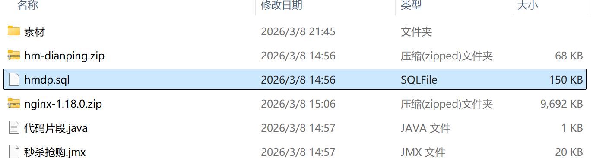

其中的表有：

- tb_user：用户表
- tb_user_info：用户详情表
- tb_shop：商户信息表
- tb_shop_type：商户类型表
- tb_blog：用户日记表（达人探店日记）
- tb_follow：用户关注表
- tb_voucher：优惠券表
- tb_voucher_order：优惠券的订单表

2. **项目整体架构：**

手机或者app端发起请求，请求我们的**nginx**服务器，nginx基于七层模型走的是 **HTTP协议**，可以实现基于**Lua**直接绕开tomcat访问**redis**，也可以作为**静态资源服务器**，轻松扛下上万并发， 负载均衡到下游tomcat服务器，打散流量，我们都知道一台4核8G的tomcat，在优化和处理简单业务的加持下，大不了就处理1000左右的并发， 经过nginx的负载均衡分流后，利用集群支撑起整个项目，同时nginx在部署了前端项目后，更是可以做到动静分离，进一步降低tomcat服务的压力，这些功能都得靠nginx起作用，所以nginx是整个项目中重要的一环。

在tomcat支撑起并发流量后，我们如果让tomcat直接去访问Mysql，根据经验Mysql企业级服务器只要上点并发，一般是16或32 核心cpu，32 或64G内存，像企业级mysql加上固态硬盘能够支撑的并发，大概就是4000起~7000左右，上万并发， 瞬间就会让Mysql服务器的cpu，硬盘全部打满，容易崩溃，所以我们在高并发场景下，会选择使用mysql集群，同时为了进一步降低Mysql的压力，同时增加访问的性能，我们也会加入Redis，同时使用Redis集群使得Redis对外提供更好的服务。

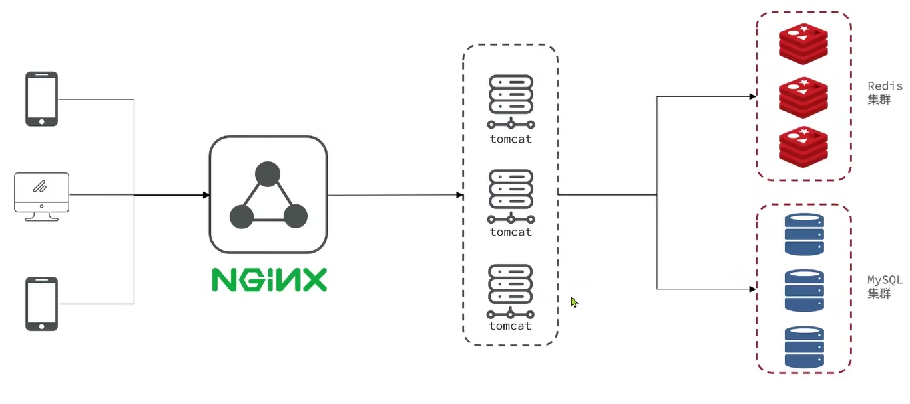

---

3. **导入后端项目：**

导入资料中的项目源码：

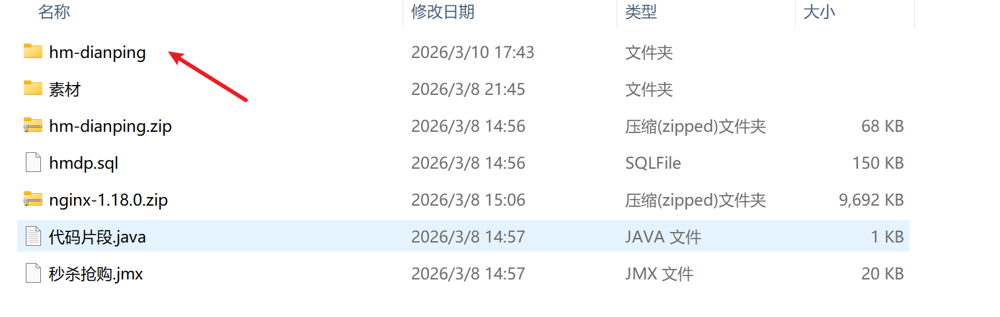

**启动项目后，在浏览器访问：**[**http://localhost:8081/shop-type/list**](http://localhost:8081/shop-type/list)**，如果可以看到数据则证明运行没有问题**。

**注意：**不要忘了修改 `**application.yaml**` 文件中的 **MySQL**、**Redis** 地址信息。

**运行项目发生错误可以用如下方式解决：**

---

**3.1 pom.xml 文件中升级 Spring Boot 到 2.7.18**

```
<parent>
  <groupId>org.springframework.boot</groupId>
  <artifactId>spring-boot-starter-parent</artifactId>
  <version>2.7.18</version>
  <relativePath/> 
</parent>
```

**3.2 pom.xml 文件中指定 Java 版本需要修改为 17**

```
<properties>
  <java.version>17</java.version>
</properties>
```

**3.3 最后再重新编译一遍** **compile** **一下**

---

4. **导入前端项目**

找到文件名为 **nginx** 文件夹。

将其复制到任意目录，要确保该目录不包含中文、特殊字符和空格，例如：

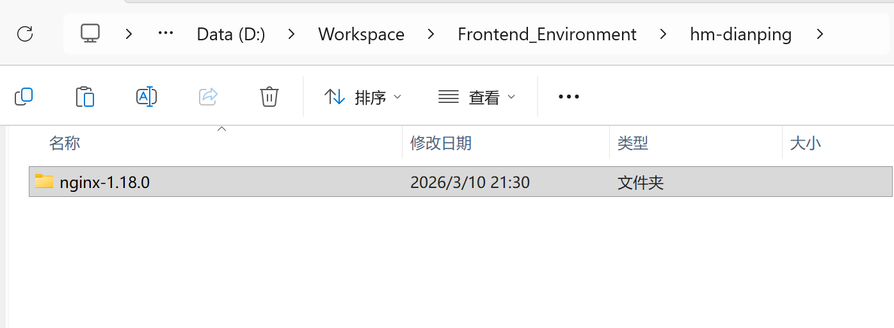

---

5. **运行前端项目**

打开 **niginx.exe** 目录 **cmd** 回车输入 ：**start nginx.exe** 命令

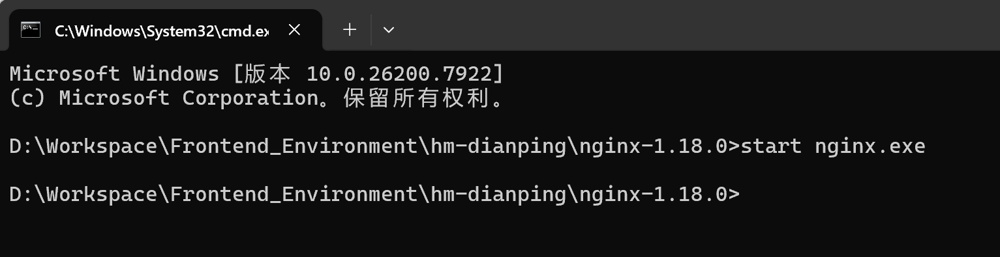

打开 Chrome 浏览器，在空白页点击鼠标右键，选择检查，即可打开开发者工具：

|                                                                                                             |                                                                                                             |     |
| ----------------------------------------------------------------------------------------------------------- | ----------------------------------------------------------------------------------------------------------- | --- |
|                                                                                                             |                                                                                                             |     |
| 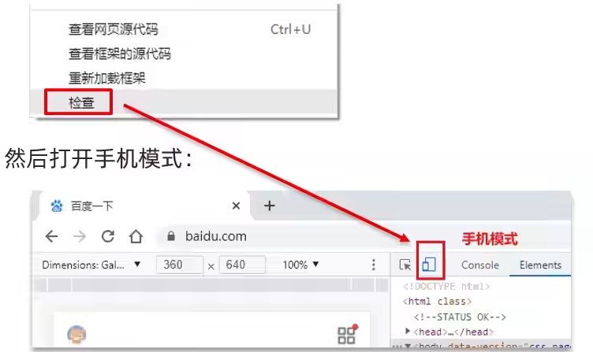 |  |     |
| 然后访问：[http://localhost:8080/](http://localhost:8080/),即可看到界面：                                               |                                                                                                             |     |

---

## 1.2. 基于 Session 实现登录

**发送验证码：**

用户在提交手机号后，会校验手机号是否合法，如果不合法，则要求用户重新输入手机号

如果手机号合法，后台此时生成对应的验证码，同时将验证码进行保存，然后再通过短信的方式将验证码发送给用户

**短信验证码登录、注册：**

用户将验证码和手机号进行输入，后台从session中拿到当前验证码，然后和用户输入的验证码进行校验，如果不一致，则无法通过校验，如果一致，则后台根据手机号查询用户，如果用户不存在，则为用户创建账号信息，保存到数据库，无论是否存在，都会将用户信息保存到session中，方便后续获得当前登录信息

**校验登录状态:**

用户在请求时候，会从cookie中携带者JsessionId到后台，后台通过JsessionId从session中拿到用户信息，如果没有session信息，则进行拦截，如果有session信息，则将用户信息保存到threadLocal中，并且放行

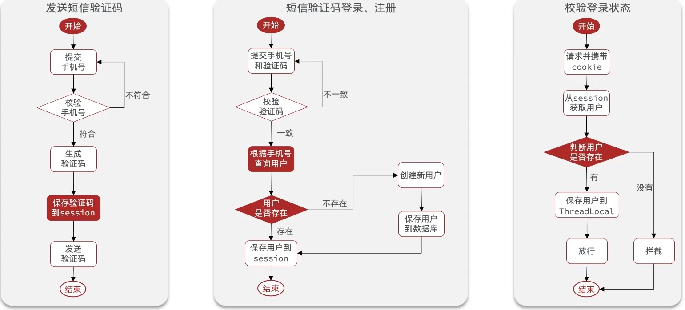

---

## 1.3. 实现发送短信验证码功能

**发生短信验证码：**

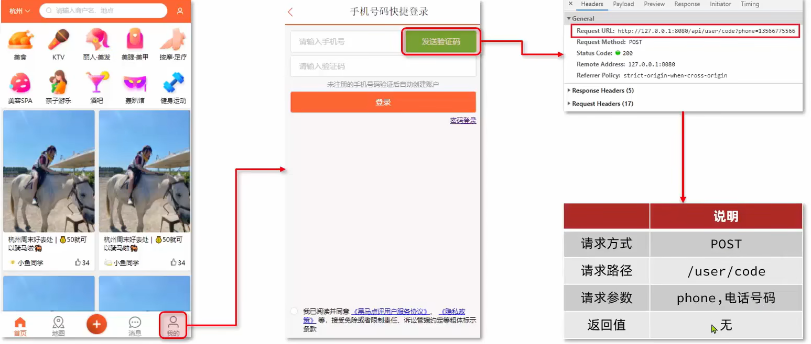

**短信验证码登录：**

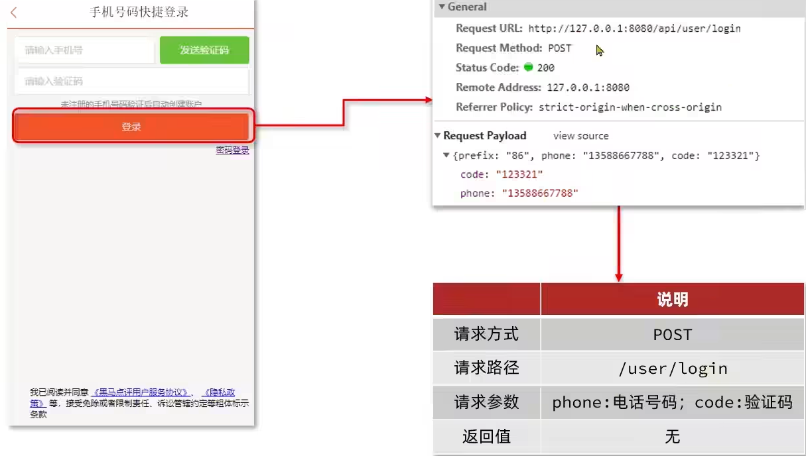

---

- 发送验证码

```
@Override
public Result sendCode(String phone, HttpSession session) {
    // 1.校验手机号
    if (RegexUtils.isPhoneInvalid(phone)) {
        // 2.如果不符合，返回错误信息
        return Result.fail("手机号格式错误！");
    }
    // 3.符合，生成验证码
    String code = RandomUtil.randomNumbers(6);

    // 4.保存验证码到 session
    session.setAttribute("code",code);
    // 5.发送验证码
    log.debug("发送短信验证码成功，验证码：{}", code);
    // 返回ok
    return Result.ok();
}
```

- 登录

```
    @Override
    public Result login(LoginFormDTO loginForm, HttpSession session) {
        // 1.校验手机号
        String phone = loginForm.getPhone();
        if (RegexUtils.isPhoneInvalid(phone)) {
            // 2.如果不符合，返回错误信息
            return Result.fail("手机号格式错误！");
        }
        // 3.校验验证码
        Object cacheCode = session.getAttribute("code");
        String code = loginForm.getCode();
        if(cacheCode == null || !cacheCode.toString().equals(code)){
             //3.不一致，报错
            return Result.fail("验证码错误");
        }
        //一致，根据手机号查询用户
        User user = query().eq("phone", phone).one();

        //5.判断用户是否存在
        if(user == null){
            //不存在，则创建
            user =  createUserWithPhone(phone);
        }
        //7.保存用户信息到session中
        session.setAttribute("user",user);

        return Result.ok();
    }
```

---

## 1.4. 实现登录拦截功能

Tomcat 的运行原理

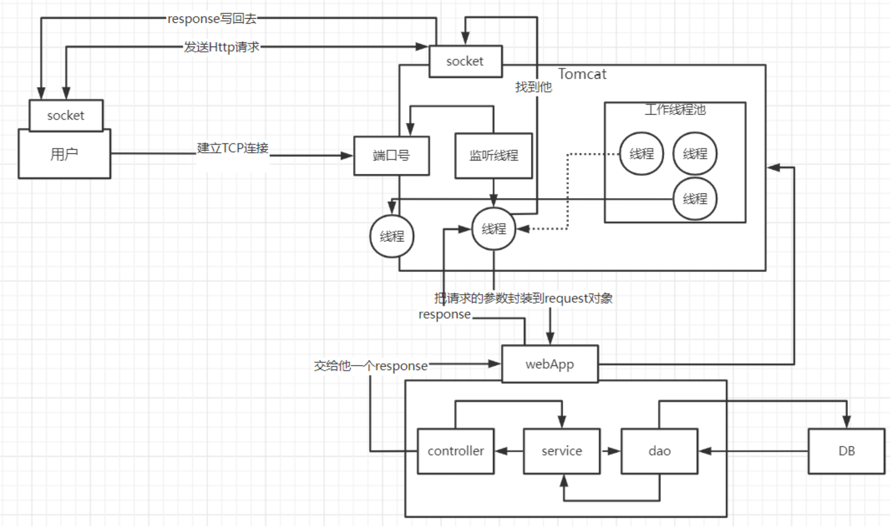

当用户发起请求时，会访问我们像tomcat注册的端口，任何程序想要运行，都需要有一个线程对当前端口号进行监听，tomcat也不例外，当监听线程知道用户想要和tomcat连接连接时，那会由监听线程创建socket连接，socket都是成对出现的，用户通过socket像互相传递数据，当tomcat端的socket接受到数据后，此时监听线程会从tomcat的线程池中取出一个线程执行用户请求，在我们的服务部署到tomcat后，线程会找到用户想要访问的工程，然后用这个线程转发到工程中的controller，service，dao中，并且访问对应的DB，在用户执行完请求后，再统一返回，再找到tomcat端的socket，再将数据写回到用户端的socket，完成请求和响应

通过以上讲解，我们可以得知 每个用户其实对应都是去找tomcat线程池中的一个线程来完成工作的， 使用完成后再进行回收，既然每个请求都是独立的，所以在每个用户去访问我们的工程时，我们可以使用threadlocal来做到线程隔离，每个线程操作自己的一份数据

**温馨小贴士：关于threadlocal**

如果小伙伴们看过threadLocal的源码，你会发现在threadLocal中，无论是他的put方法和他的get方法， 都是先从获得当前用户的线程，然后从线程中取出线程的成员变量map，只要线程不一样，map就不一样，所以可以通过这种方式来做到线程隔离

**登录验证功能：**

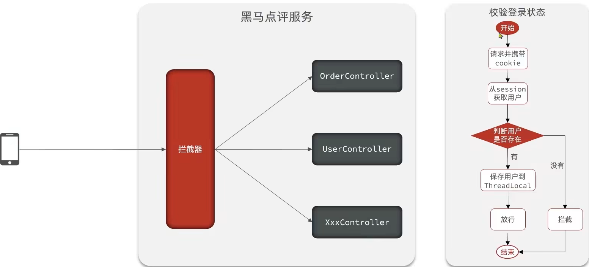

- 拦截器代码

```
public class LoginInterceptor implements HandlerInterceptor {

    @Override
    public boolean preHandle(HttpServletRequest request, HttpServletResponse response, Object handler) throws Exception {
       //1.获取session
        HttpSession session = request.getSession();
        //2.获取session中的用户
        Object user = session.getAttribute("user");
        //3.判断用户是否存在
        if(user == null){
              //4.不存在，拦截，返回401状态码
              response.setStatus(401);
              return false;
        }
        //5.存在，保存用户信息到Threadlocal
        UserHolder.saveUser((User)user);
        //6.放行
        return true;
    }
}
```

- 让拦截器生效

```
@Configuration
public class MvcConfig implements WebMvcConfigurer {

    @Resource
    private StringRedisTemplate stringRedisTemplate;

    @Override
    public void addInterceptors(InterceptorRegistry registry) {
        // 登录拦截器
        registry.addInterceptor(new LoginInterceptor())
                .excludePathPatterns(
                        "/shop/**",
                        "/voucher/**",
                        "/shop-type/**",
                        "/upload/**",
                        "/blog/hot",
                        "/user/code",
                        "/user/login"
                ).order(1);
        // token刷新的拦截器
        registry.addInterceptor(new RefreshTokenInterceptor(stringRedisTemplate)).addPathPatterns("/**").order(0);
    }
}
```

---

## 1.5. 隐藏用户敏感信息

我们通过浏览器观察到此时用户的全部信息都在，这样极为不靠谱，所以我们应当在返回用户信息之前，将用户的敏感信息进行隐藏，采用的核心思路就是书写一个UserDto对象，这个UserDto对象就没有敏感信息了，我们在返回前，将有用户敏感信息的User对象转化成没有敏感信息的UserDto对象，那么就能够避免这个尴尬的问题了

**在登录方法处修改**

```
//7.保存用户信息到session中
session.setAttribute("user", BeanUtils.copyProperties(user,UserDTO.class));
```

**在拦截器处**

```
//5.存在，保存用户信息到Threadlocal
UserHolder.saveUser((UserDTO) user);
```

**在UserHolder处：将user对象换成UserDTO**

```
public class UserHolder {
    private static final ThreadLocal<UserDTO> tl = new ThreadLocal<>();

    public static void saveUser(UserDTO user){
        tl.set(user);
    }

    public static UserDTO getUser(){
        return tl.get();
    }

    public static void removeUser(){
        tl.remove();
    }
}
```

---

## 1.6. 集群 session 共享问题

**核心思路分析：**

每个tomcat中都有一份属于自己的session,假设用户第一次访问第一台tomcat，并且把自己的信息存放到第一台服务器的session中，但是第二次这个用户访问到了第二台tomcat，那么在第二台服务器上，肯定没有第一台服务器存放的session，所以此时 整个登录拦截功能就会出现问题，我们能如何解决这个问题呢？早期的方案是session拷贝，就是说虽然每个tomcat上都有不同的session，但是每当任意一台服务器的session修改时，都会同步给其他的Tomcat服务器的session，这样的话，就可以实现session的共享了

但是这种方案具有两个大问题

1、每台服务器中都有完整的一份session数据，服务器压力过大。

2、session拷贝数据时，可能会出现延迟

所以咱们后来采用的方案都是基于redis来完成，我们把session换成redis，redis数据本身就是共享的，就可以避免session共享的问题了

**session 共享问题**：多台 Tomcat 并不共享 session 存储空间,当请求到不同 Tomcat 服务时导致数据丢失的问题。

Session 的替代方案应该满足：

- 数据共享
- 内存存储
- key、value 结构

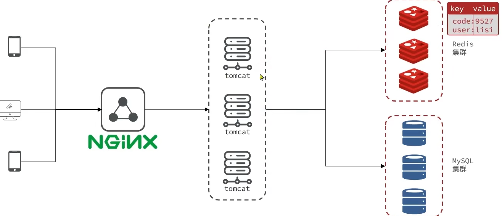

---

## 1.7. Redis代替session的业务流程

### 1.7.1. 设计key的结构

首先我们要思考一下利用redis来存储数据，那么到底使用哪种结构呢？由于存入的数据比较简单，我们可以考虑使用String，或者是使用哈希，如下图，如果使用String，同学们注意他的value，用多占用一点空间，如果使用哈希，则他的value中只会存储他数据本身，如果不是特别在意内存，其实使用String就可以啦。

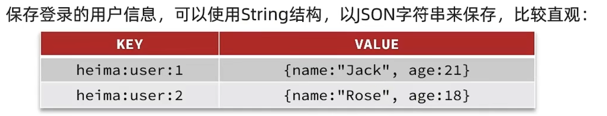

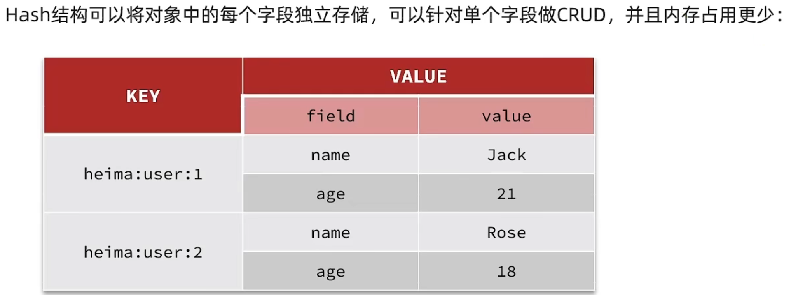

---

### 1.7.2. 设计key的具体细节

所以我们可以使用String结构，就是一个简单的key，value键值对的方式，但是关于key的处理，session他是每个用户都有自己的session，但是redis的key是共享的，咱们就不能使用code了

在设计这个key的时候，我们之前讲过需要满足两点

1、key要具有唯一性

2、key要方便携带

如果我们采用phone：手机号这个的数据来存储当然是可以的，但是如果把这样的敏感数据存储到redis中并且从页面中带过来毕竟不太合适，所以我们在后台生成一个随机串token，然后让前端带来这个token就能完成我们的整体逻辑了

---

### 1.7.3. 整体访问流程

当注册完成后，用户去登录会去校验用户提交的手机号和验证码，是否一致，如果一致，则根据手机号查询用户信息，不存在则新建，最后将用户数据保存到redis，并且生成token作为redis的key，当我们校验用户是否登录时，会去携带着token进行访问，从redis中取出token对应的value，判断是否存在这个数据，如果没有则拦截，如果存在则将其保存到threadLocal中，并且放行。

---

## 1.8. 基于 Redis 实现共享 Session 登录

这里需要考虑 Redis 的 key 值应该是什么？

Redis 的 key 不能是 code 因为不同的手机号都用 code 就覆盖了。既然每一个手机号都要有不同的 key 所以我们就可以直接使用手机号作为 key 存储验证码。

保存用户信息的类型：

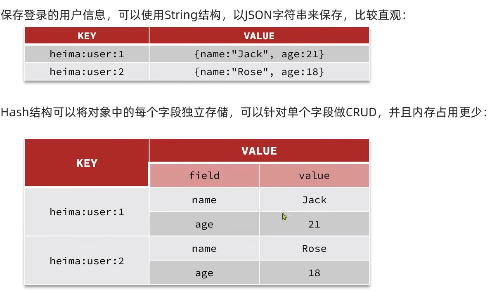

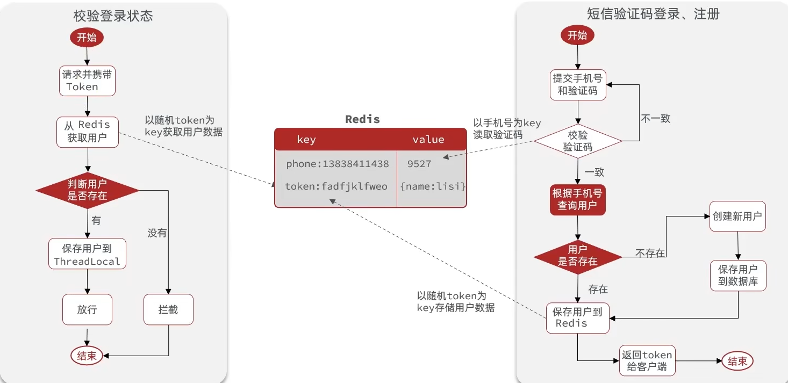

```
@Override
public Result login(LoginFormDTO loginForm, HttpSession session) {
    // 1.校验手机号
    String phone = loginForm.getPhone();
    if (RegexUtils.isPhoneInvalid(phone)) {
        // 2.如果不符合，返回错误信息
        return Result.fail("手机号格式错误！");
    }
    // 3.从redis获取验证码并校验
    String cacheCode = stringRedisTemplate.opsForValue().get(LOGIN_CODE_KEY + phone);
    String code = loginForm.getCode();
    if (cacheCode == null || !cacheCode.equals(code)) {
        // 不一致，报错
        return Result.fail("验证码错误");
    }

    // 4.一致，根据手机号查询用户 select * from tb_user where phone = ?
    User user = query().eq("phone", phone).one();

    // 5.判断用户是否存在
    if (user == null) {
        // 6.不存在，创建新用户并保存
        user = createUserWithPhone(phone);
    }

    // 7.保存用户信息到 redis中
    // 7.1.随机生成token，作为登录令牌
    String token = UUID.randomUUID().toString(true);
    // 7.2.将User对象转为HashMap存储
    UserDTO userDTO = BeanUtil.copyProperties(user, UserDTO.class);
    Map<String, Object> userMap = BeanUtil.beanToMap(userDTO, new HashMap<>(),
            CopyOptions.create()
                    .setIgnoreNullValue(true)
                    .setFieldValueEditor((fieldName, fieldValue) -> fieldValue.toString()));
    // 7.3.存储
    String tokenKey = LOGIN_USER_KEY + token;
    stringRedisTemplate.opsForHash().putAll(tokenKey, userMap);
    // 7.4.设置token有效期
    stringRedisTemplate.expire(tokenKey, LOGIN_USER_TTL, TimeUnit.MINUTES);

    // 8.返回token
    return Result.ok(token);
}
```

---

## 1.9. 解决状态登录刷新问题

### 1.9.1. 初始方案思路总结：

在这个方案中，他确实可以使用对应路径的拦截，同时刷新登录token令牌的存活时间，但是现在这个拦截器他只是拦截需要被拦截的路径，假设当前用户访问了一些不需要拦截的路径，那么这个拦截器就不会生效，所以此时令牌刷新的动作实际上就不会执行，所以这个方案他是存在问题的

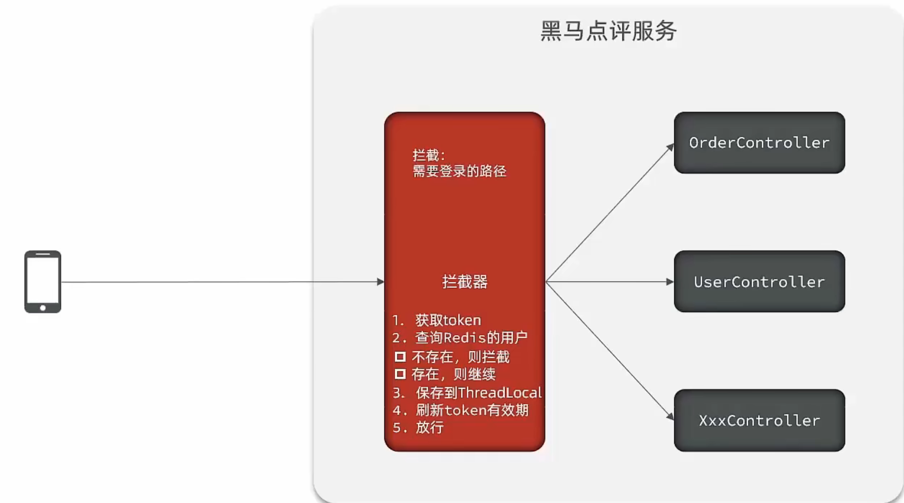

### 1.9.2. 优化方案

既然之前的拦截器无法对不需要拦截的路径生效，那么我们可以添加一个拦截器，在第一个拦截器中拦截所有的路径，把第二个拦截器做的事情放入到第一个拦截器中，同时刷新令牌，因为第一个拦截器有了threadLocal的数据，所以此时第二个拦截器只需要判断拦截器中的user对象是否存在即可，完成整体刷新功能。

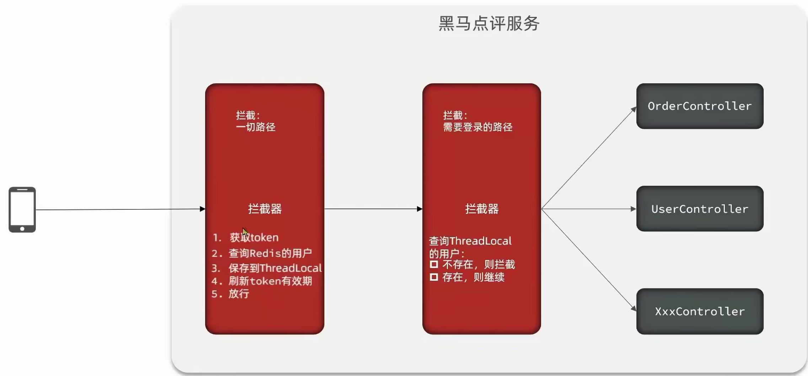

### 1.9.3. 代码

```
public class RefreshTokenInterceptor implements HandlerInterceptor {

    private StringRedisTemplate stringRedisTemplate;

    public RefreshTokenInterceptor(StringRedisTemplate stringRedisTemplate) {
        this.stringRedisTemplate = stringRedisTemplate;
    }

    @Override
    public boolean preHandle(HttpServletRequest request, HttpServletResponse response, Object handler) throws Exception {
        // 1.获取请求头中的token
        String token = request.getHeader("authorization");
        if (StrUtil.isBlank(token)) {
            return true;
        }
        // 2.基于TOKEN获取redis中的用户
        String key  = LOGIN_USER_KEY + token;
        Map<Object, Object> userMap = stringRedisTemplate.opsForHash().entries(key);
        // 3.判断用户是否存在
        if (userMap.isEmpty()) {
            return true;
        }
        // 5.将查询到的hash数据转为UserDTO
        UserDTO userDTO = BeanUtil.fillBeanWithMap(userMap, new UserDTO(), false);
        // 6.存在，保存用户信息到 ThreadLocal
        UserHolder.saveUser(userDTO);
        // 7.刷新token有效期
        stringRedisTemplate.expire(key, LOGIN_USER_TTL, TimeUnit.MINUTES);
        // 8.放行
        return true;
    }

    @Override
    public void afterCompletion(HttpServletRequest request, HttpServletResponse response, Object handler, Exception ex) throws Exception {
        // 移除用户
        UserHolder.removeUser();
    }
}
	
```

```
public class LoginInterceptor implements HandlerInterceptor {

    @Override
    public boolean preHandle(HttpServletRequest request, HttpServletResponse response, Object handler) throws Exception {
        // 1.判断是否需要拦截（ThreadLocal中是否有用户）
        if (UserHolder.getUser() == null) {
            // 没有，需要拦截，设置状态码
            response.setStatus(401);
            // 拦截
            return false;
        }
        // 有用户，则放行
        return true;
    }
}
```

---

# 2. 商户查询缓存

## 2.1. 什么是缓存

**缓存**就是数据交换的缓冲区（称作Cache [ˈkeɪf]），是存贮数据的临时地方，一般读写性能较高。

```
例1:Static final ConcurrentHashMap<K,V> map = new ConcurrentHashMap<>(); 本地用于高并发

例2:static final Cache<K,V> USER_CACHE = CacheBuilder.newBuilder().build(); 用于redis等缓存

例3:Static final Map<K,V> map =  new HashMap(); 本地缓存
```

由于其被**Static**修饰,所以随着类的加载而被加载到**内存之中**,作为本地缓存,由于其又被**final**修饰,所以其引用(例3:map)和对象(例3:new HashMap())之间的关系是固定的,不能改变,因此不用担心赋值(=)导致缓存失效;

### 2.1.1. 为什么要使用缓存

一句话:因为**速度快,好用**

缓存数据存储于代码中,而代码运行在内存中,内存的读写性能远高于磁盘,缓存可以大大降低**用户访问并发量带来的**服务器读写压力

实际开发过程中,企业的数据量,少则几十万,多则几千万,这么大数据量,如果没有缓存来作为"避震器",系统是几乎撑不住的,所以企业会大量运用到缓存技术;

但是缓存也会增加代码复杂度和运营的成本:

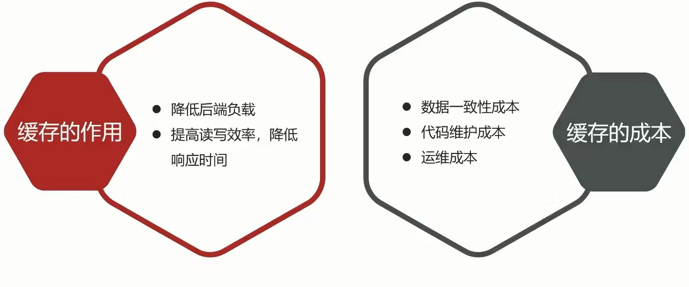

### 2.1.2. 如何使用缓存

实际开发中,会构筑多级缓存来使系统运行速度进一步提升,例如:本地缓存与redis中的缓存并发使用

**浏览器缓存**：主要是存在于浏览器端的缓存

**应用层缓存：**可以分为tomcat本地缓存，比如之前提到的map，或者是使用redis作为缓存

**数据库缓存：**在数据库中有一片空间是 buffer pool，增改查数据都会先加载到mysql的缓存中

**CPU缓存：**当代计算机最大的问题是 cpu性能提升了，但内存读写速度没有跟上，所以为了适应当下的情况，增加了cpu的L1，L2，L3级的缓存

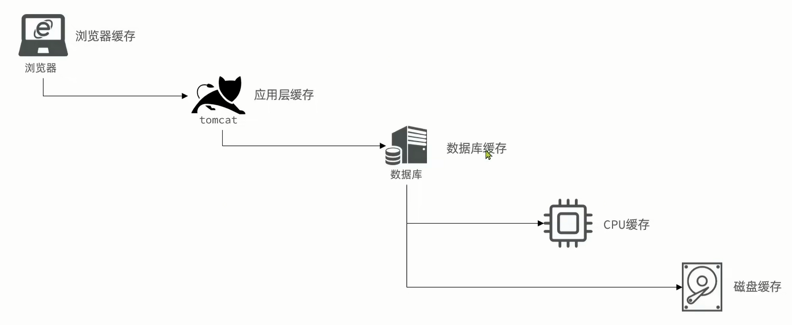

---

## 2.2. 添加商户缓存

在我们查询商户信息时，我们是直接操作从数据库中去进行查询的，大致逻辑是这样，直接查询数据库那肯定慢咯，所以我们需要增加缓存

```
@GetMapping("/{id}")
public Result queryShopById(@PathVariable("id") Long id) {
    //这里是直接查询数据库
    return shopService.queryById(id);
}
```

### 2.2.1. 缓存模型和思路

标准的操作方式就是查询数据库之前先查询缓存，如果缓存数据存在，则直接从缓存中返回，如果缓存数据不存在，再查询数据库，然后将数据存入redis。

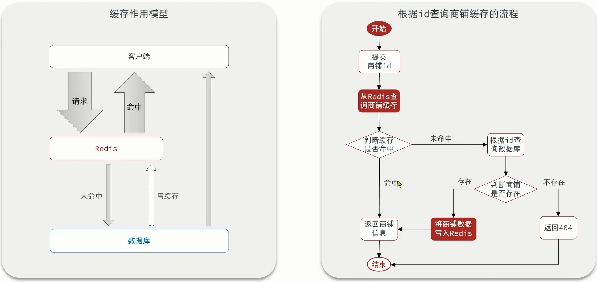

### 2.2.2. 代码如下

代码思路：如果缓存有，则直接返回，如果缓存不存在，则查询数据库，然后存入redis。

```
@Override
public Result queryById(Long id) {
    String key = "cache:shop:" + id;

    // 1. 从 Redis 查询商铺缓存
    String shopJson = stringRedisTemplate.opsForValue().get(key);

    // 2. 判断是否存在
    if (StrUtil.isNotBlank(shopJson)) {
        // 3. 存在，直接返回
        Shop shop = JSONUtil.toBean(shopJson, Shop.class);
        return Result.ok(shop);
    }

    // 4. 不存在，根据 id 查询数据库
    Shop shop = getById(id);

    // 5. 不存在，返回错误
    if (shop == null) {
        return Result.fail("店铺不存在！");
    }

    // 6. 存在，写入 Redis
    stringRedisTemplate.opsForValue().set(key, JSONUtil.toJsonStr(shop));

    // 7. 返回
    return Result.ok(shop);
}
```

---

## 2.3. 缓存更新策略

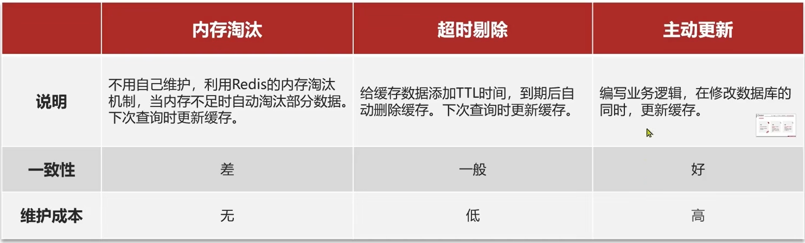

业务场景：

- 低一致性需求：使用内存淘汰机制。例如店铺类型的查询缓存
- 高一致性需求：主动更新，并以超时剔除作为兜底方案。例如店铺详情查询的缓存

---

### 2.3.1. 数据库缓存不一致解决方案：

由于我们的**缓存的数据源来自于数据库**,而数据库的**数据是会发生变化的**,因此,如果当数据库中**数据发生变化,而缓存却没有同步**,此时就会有**一致性问题存在**,其后果是:

用户使用缓存中的过时数据,就会产生类似多线程数据安全问题,从而影响业务,产品口碑等;怎么解决呢？有如下几种方案：

1. **Cache Aside Pattern** 人工编码方式：缓存调用者在更新完数据库后再去更新缓存，也称之为双写方案

2. **Read/Write Through Pattern** : 由系统本身完成，数据库与缓存的问题交由系统本身去处理

3. **Write Behind Caching Pattern** ：调用者只操作缓存，其他线程去异步处理数据库，实现最终一致

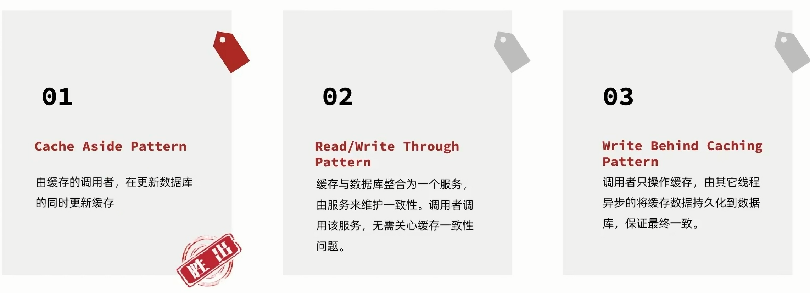

---

### 2.3.2. 数据库和缓存不一致采用什么方案

综合考虑使用方案一，但是方案一调用者如何处理呢？这里有几个问题

操作缓存和数据库时有三个问题需要考虑：

如果采用第一个方案，那么假设我们每次操作数据库后，都操作缓存，但是中间如果没有人查询，那么这个更新动作实际上只有最后一次生效，中间的更新动作意义并不大，我们可以把缓存删除，等待再次查询时，将缓存中的数据加载出来

操作缓存和数据库时有三个问题需要考虑：

1. **删除缓存还是更新缓存？**

- 更新缓存：每次更新数据库都更新缓存，无效写操作较多 ❌
- 删除缓存：更新数据库时让缓存失效，查询时再更新缓存 ✅

2. **如何保证缓存与数据库的操作的同时成功或失败？**

- 单体系统：将缓存与数据库操作放在一个事务中
- 分布式系统：利用TCC等分布式事务方案

3. **先操作缓存还是先操作数据库？**

- 先删除缓存，再操作数据库
- 先操作数据库，再删除缓存

先删除缓存，再操作数据库：

此处为语雀图册卡片，点击链接查看：[https://www.yuque.com/fangzhou-ze0bw/ckexpk/azmdmofcd82ldfol#menrG](https://www.yuque.com/fangzhou-ze0bw/ckexpk/azmdmofcd82ldfol#menrG)

先操作数据库，再删除缓存（推荐）：

此处为语雀图册卡片，点击链接查看：[https://www.yuque.com/fangzhou-ze0bw/ckexpk/azmdmofcd82ldfol#Q9aFX](https://www.yuque.com/fangzhou-ze0bw/ckexpk/azmdmofcd82ldfol#Q9aFX)

这种异常的情况概率比较低。

---

**缓存更新策略的最佳实践方案：**

1. **低一致性需求**：使用Redis自带的内存淘汰机制
2. **高一致性需求**：主动更新，并以超时剔除作为兜底方案

- **读操作**：

- 缓存命中则直接返回
- 缓存未命中则查询数据库，并写入缓存，设定超时时间

- **写操作**：

- 先写数据库，然后再删除缓存
- 要确保数据库与缓存操作的原子性

---

## 2.4. 实现商铺和缓存与数据库双写一致

核心思路如下：

修改ShopController中的业务逻辑，满足下面的需求：

根据id查询店铺时，如果缓存未命中，则查询数据库，将数据库结果写入缓存，并设置超时时间

根据id修改店铺时，先修改数据库，再删除缓存

**修改重点代码1**：修改**ShopServiceImpl**的queryById方法

**设置redis缓存时添加过期时间**

```
@Override
public Result queryById(Long id) {
    String key = CACHE_SHOP_KEY + id;

    // 1. 从 redis 查询商铺缓存
    String shopJson = stringRedisTemplate.opsForValue().get(key);

    // 2. 判断是否存在
    if (StrUtil.isNotBlank(shopJson)) {
        // 3. 存在，直接返回
        Shop shop = JSONUtil.toBean(shopJson, Shop.class);
        return Result.ok(shop);
    }

    // 4. 不存在，根据 id 查询数据库
    Shop shop = getById(id);

    // 5. 不存在，返回错误
    if (shop == null) {
        return Result.fail("店铺不存在！");
    }

    // 6. 存在，写入 redis（带 30 分钟过期时间）
    stringRedisTemplate.opsForValue().set(key, JSONUtil.toJsonStr(shop), 30L, TimeUnit.MINUTES);

    // 7. 返回
    return Result.ok(shop);
}
```

**修改重点代码2**

代码分析：通过之前的淘汰，我们确定了采用删除策略，来解决双写问题，当我们修改了数据之后，然后把缓存中的数据进行删除，查询时发现缓存中没有数据，则会从mysql中加载最新的数据，从而避免数据库和缓存不一致的问题

```
@Override
@Transactional
public Result update(Shop shop) {
    Long id = shop.getId();
    if (id == null) {
        return Result.fail("店铺id不能为空");
    }

    // 1. 更新数据库
    updateById(shop);

    // 2. 删除缓存
    stringRedisTemplate.delete(CACHE_SHOP_KEY + id);

    return Result.ok();
}
```

---

## 2.5. 缓存穿透

### 2.5.1. 缓存穿透问题的解决思路

**缓存穿透：**是指客户端请求的数据在缓存中和数据库都不存在，这样缓存永远不会生效，这些请求都会打到数据库。

不断的发起这样的请求会给数据库带来巨大的压力。

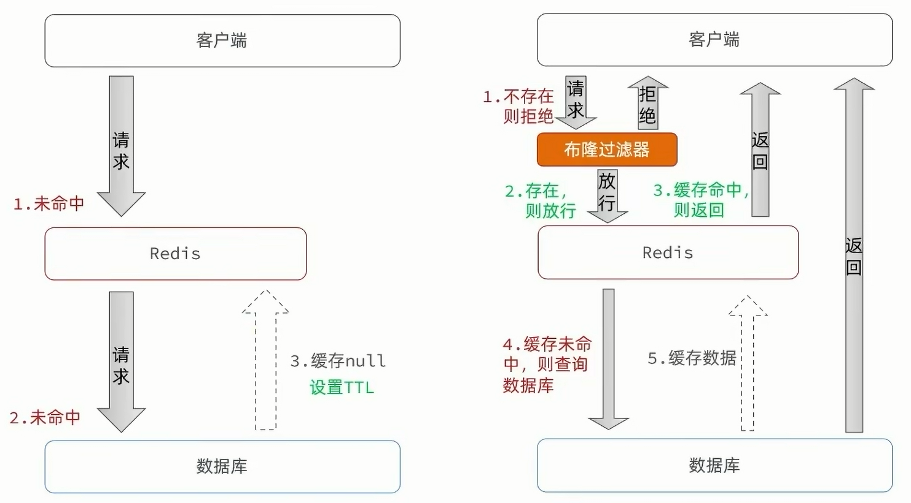

常见的解决方案有两种：

**-缓存空对象：**

- 优点：实现简单，维护方便
- 缺点：

- 额外的内存消耗

- 可能造成短期的不一致

**-布隆过滤：**

- 优点：内存占用少，没有多余 key
- 缺点：

-实现复杂

-存在误判可能

---

**缓存空对象思路分析：**

当我们客户端访问不存在的数据时，先请求redis，但是此时redis中没有数据，此时会访问到数据库，但是数据库中也没有数据，这个数据穿透了缓存，直击数据库，我们都知道数据库能够承载的并发不如redis这么高，如果大量的请求同时过来访问这种不存在的数据，这些请求就都会访问到数据库，简单的解决方案就是哪怕这个数据在数据库中也不存在，我们也把这个数据存入到redis中去，这样，下次用户过来访问这个不存在的数据，那么在redis中也能找到这个数据就不会进入到缓存了

**布隆过滤：**

布隆过滤器其实采用的是哈希思想来解决这个问题，通过一个庞大的二进制数组，走哈希思想去判断当前这个要查询的这个数据是否存在，如果布隆过滤器判断存在，则放行，这个请求会去访问redis，哪怕此时redis中的数据过期了，但是数据库中一定存在这个数据，在数据库中查询出来这个数据后，再将其放入到redis中，

假设布隆过滤器判断这个数据不存在，则直接返回

这种方式优点在于节约内存空间，存在误判，误判原因在于：布隆过滤器走的是哈希思想，只要哈希思想，就可能存在哈希冲突

---

### 2.5.2. 编码解决商品查询的缓存穿透问题：

核心思路：

在原来的逻辑中，我们如果发现这个数据在mysql中不存在，直接就返回404了，这样是会存在缓存穿透问题的

现在的逻辑中：如果这个数据不存在，我们不会返回404 ，还是会把这个数据写入到Redis中，并且将value设置为空，欧当再次发起查询时，我们如果发现命中之后，判断这个value是否是null，如果是null，则是之前写入的数据，证明是缓存穿透数据，如果不是，则直接返回数据

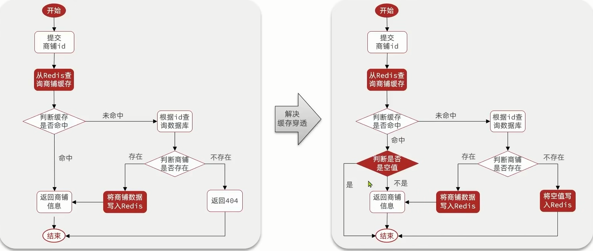

**小总结：**

缓存穿透产生的原因是什么？

- 用户请求的数据在缓存中和数据库中都不存在，不断发起这样的请求，给数据库带来巨大压力

缓存穿透的解决方案有哪些？

- 缓存null值
- 布隆过滤
- 增强id的复杂度，避免被猜测id规律
- 做好数据的基础格式校验
- 加强用户权限校验
- 做好热点参数的限流

---

## 2.6. 缓存雪崩问题及解决思路

**缓存雪崩:**是指在同一时间段大量的缓存 key 同时失效或者 Redis 服务宕机，导致大量请求到达数据库，带来巨大压力。

解决方案：

- 给不同的 key 的 TTL 添加随机值
- 利用 Redis 集群提供服务的可用性
- 给缓存业务添加降级限流策略
- 给业务添加多级缓存

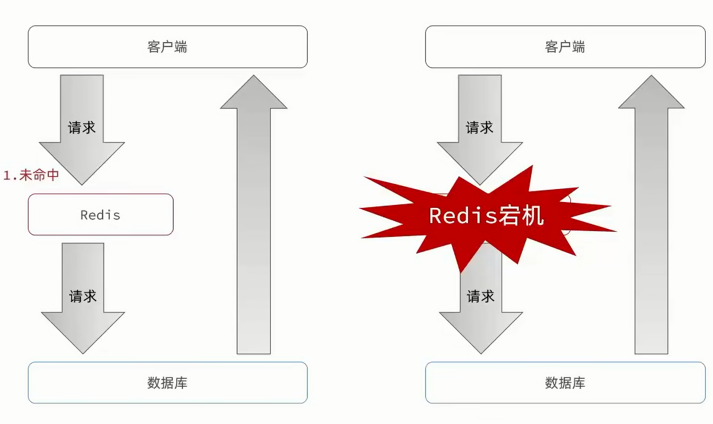

---

## 2.7. 缓存击穿

### 2.7.1. 缓存击穿问题及解决思路

缓存击穿问题：也叫 key 问题，就是一个被高并发访问并且缓存重建业务较复杂的 key 突然失效了，无数的请求访问会在瞬间给数据库带来巨大的冲击。

常见的解决方案有两种：

- 互斥锁
- 逻辑过期

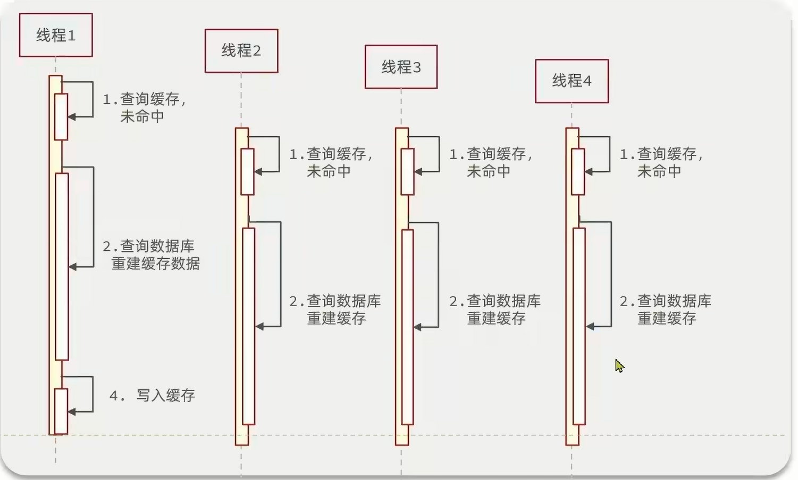

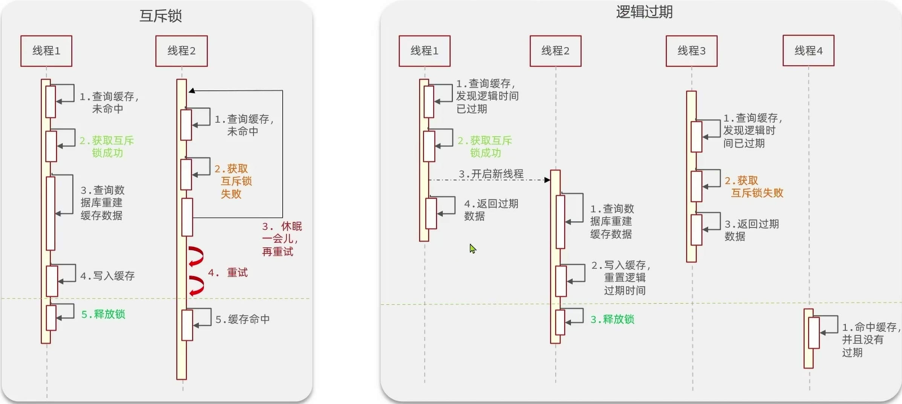

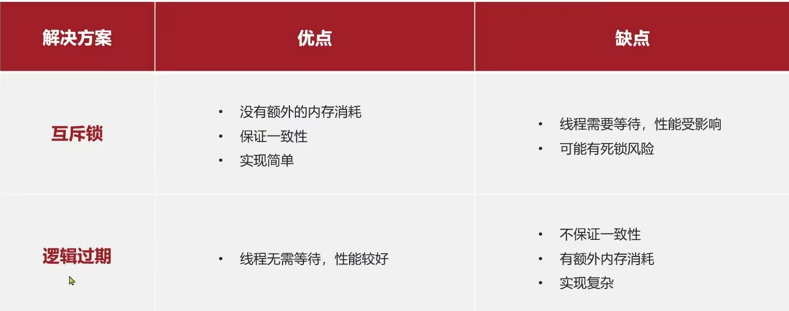

---

### 2.7.2. 利用互斥锁解决缓存击穿问题

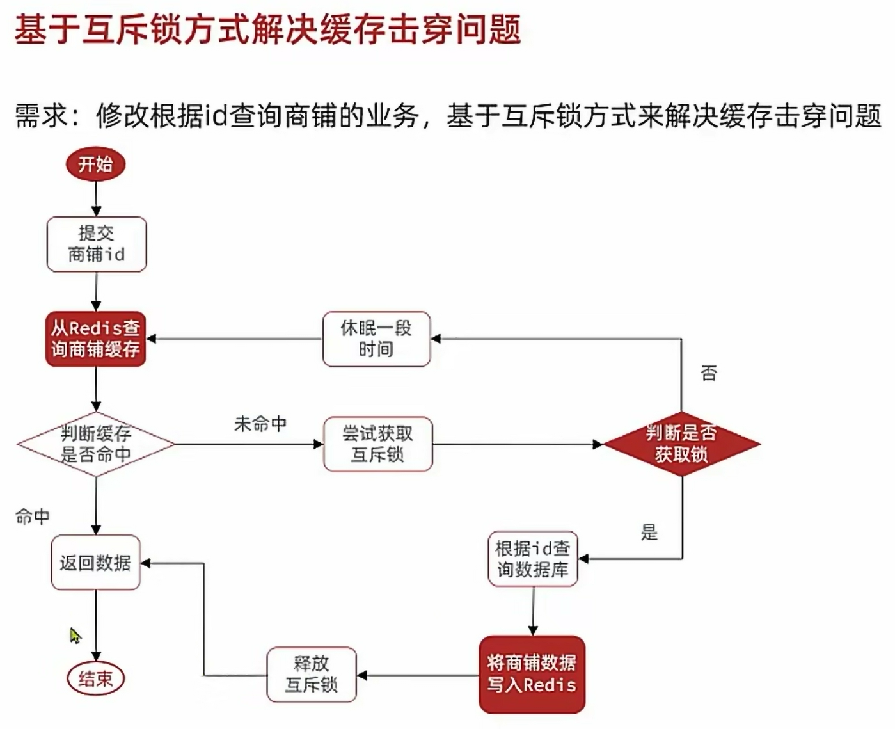

### 2.7.3. 利用逻辑过期解决缓存击穿问题

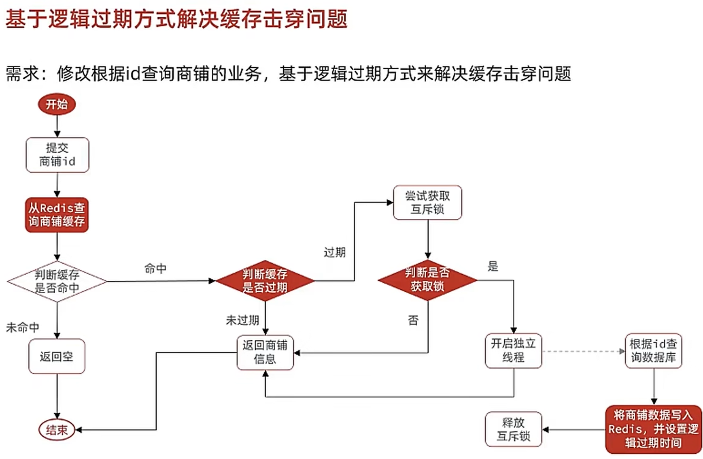

---

## 2.8. 缓存工具封装

基于 `StringRedisTemplate` 封装一个缓存工具类，满足下列需求：

- 方法1：将任意 Java 对象序列化为 JSON 并存储在 string 类型的 key 中，并且可以设置 **TTL 过期**时间
- 方法2：将任意 Java 对象序列化为 JSON 并存储在 string 类型的 key 中，并且可以设置**逻辑过期**时间，用于处理**缓存击穿**问题
- 方法3：根据指定的 key 查询缓存，并反序列化为指定类型，利用**缓存空值**的方式解决**缓存穿透**问题
- 方法4：根据指定的 key 查询缓存，并反序列化为指定类型，需要利用**逻辑过期**解决**缓存击穿**问题

---

# 3. 优惠卷秒杀

## 3.1. 全局唯一 ID

每个店铺都可以发优惠卷：


当用户抢购时，就会生成订单并保存到 `tb_voucher_order` 这张表中，而订单表如果使用数据库自增 ID 就存在一些问题：

- id 的规律性太明显
- 受单表数据量的限制

全局 ID 生成器，是一种在分布式系统下用来生成全局唯一 ID 的工具，一般要满足下列特性：

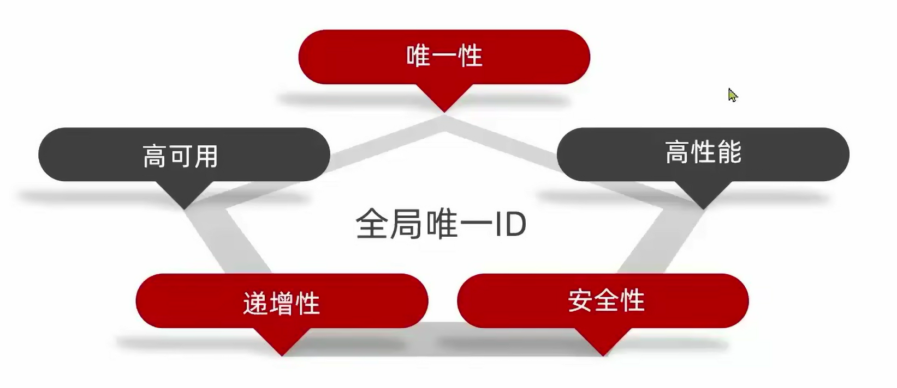

为了增加 ID 的安全性。我们可以不直接使用 Redis 自增的数值，而是拼接一些其它信息：

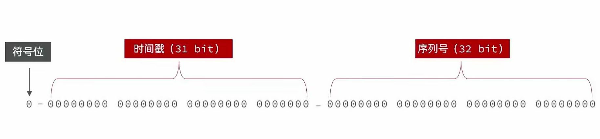

ID 的组成部分：

- 符号位：1bit，永远为 0
- 时间戳：31bit，以秒为单位，可以使用 69 年
- 序列号：32bit，秒内的计数器，支持每秒产生 2^32 不同 ID

全局唯一 ID 生成策略：

- UUID
- Redis 自增
- snowflake 算法
- 数据库自增

Redis 自增 ID 策略：

- 每天一个 key，方便统计订单量
- ID 构造是时间戳 + 计数器

---

03月15日

## 3.2. 添加优惠卷

每个店铺都可以分布优惠卷，分为平价劵特价劵。平价劵可以任意购买，二特价劵需要秒杀抢购：


表关系如下：

- tb-voucher:优惠卷的基本信息，优惠金额、使用规则等
- tb_seckill_voucher:优惠卷库存、开始抢购时间，结束抢购时间。特价优惠卷才需要填写这些信息。

平价卷由于优惠力度并不是很大，所以是可以任意领取；

而代金券由于优惠力度大，所以像第二种卷，就得限制数量，从表结构上也能看出，特价卷除了具有优惠卷的基本信息以外，还具有库存，抢购时间，结束时间等等字段

## 3.3. 实现优惠券秒杀下单

下单核心思路：当我们点击抢购时，会触发右侧的请求，我们只需要编写对应的controller即可

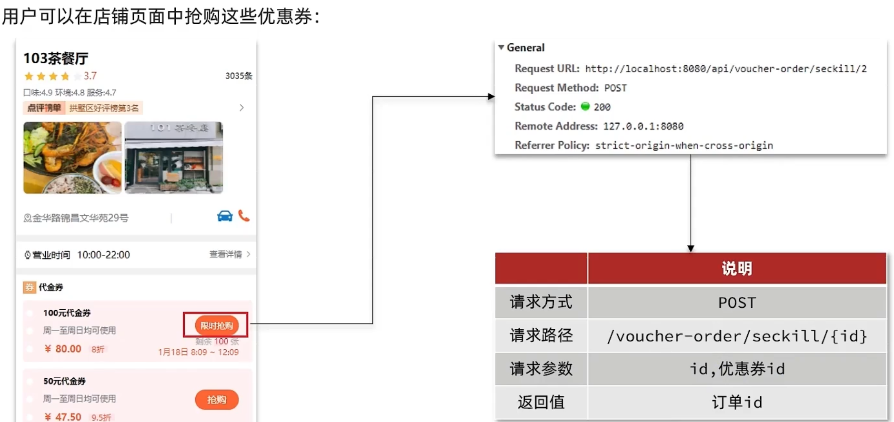

秒杀下单应该思考的内容：

下单时需要判断两点：

- 秒杀是否开始或结束，如果尚未开始或已经结束则无法下单
- 库存是否充足，不足则无法下单

下单核心逻辑分析：

当用户开始进行下单，我们应当去查询优惠卷信息，查询到优惠卷信息，判断是否满足秒杀条件

比如时间是否充足，如果时间充足，则进一步判断库存是否足够，如果两者都满足，则扣减库存，创建订单，然后返回订单id，如果有一个条件不满足则直接结束。

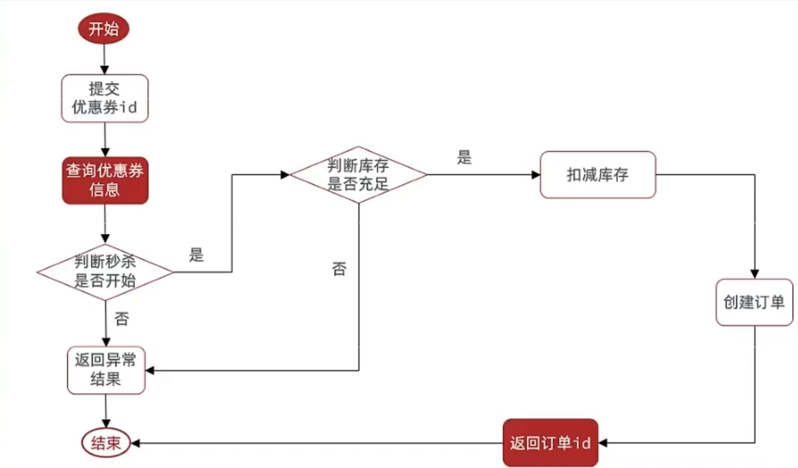

```
@Override
public Result seckillVoucher(Long voucherId) {
    // 1.查询优惠券
    SeckillVoucher voucher = seckillVoucherService.getById(voucherId);
    // 2.判断秒杀是否开始
    if (voucher.getBeginTime().isAfter(LocalDateTime.now())) {
        // 尚未开始
        return Result.fail("秒杀尚未开始！");
    }
    // 3.判断秒杀是否已经结束
    if (voucher.getEndTime().isBefore(LocalDateTime.now())) {
        // 尚未开始
        return Result.fail("秒杀已经结束！");
    }
    // 4.判断库存是否充足
    if (voucher.getStock() < 1) {
        // 库存不足
        return Result.fail("库存不足！");
    }
    //5，扣减库存
    boolean success = seckillVoucherService.update()
            .setSql("stock= stock -1")
            .eq("voucher_id", voucherId).update();
    if (!success) {
        //扣减库存
        return Result.fail("库存不足！");
    }
    //6.创建订单
    VoucherOrder voucherOrder = new VoucherOrder();
    // 6.1.订单id
    long orderId = redisIdWorker.nextId("order");
    voucherOrder.setId(orderId);
    // 6.2.用户id
    Long userId = UserHolder.getUser().getId();
    voucherOrder.setUserId(userId);
    // 6.3.代金券id
    voucherOrder.setVoucherId(voucherId);
    save(voucherOrder);

    return Result.ok(orderId);

}
```

---

## 3.4. 超卖问题

有关超卖问题分析：在我们原有代码中是这么写的

```
 if (voucher.getStock() < 1) {
        // 库存不足
        return Result.fail("库存不足！");
    }
    //5，扣减库存
    boolean success = seckillVoucherService.update()
            .setSql("stock= stock -1")
            .eq("voucher_id", voucherId).update();
    if (!success) {
        //扣减库存
        return Result.fail("库存不足！");
    }
```

假设线程1过来查询库存，判断出来库存大于1，正准备去扣减库存，但是还没有来得及去扣减，此时线程2过来，线程2也去查询库存，发现这个数量一定也大于1，那么这两个线程都会去扣减库存，最终多个线程相当于一起去扣减库存，此时就会出现库存的超卖问题。

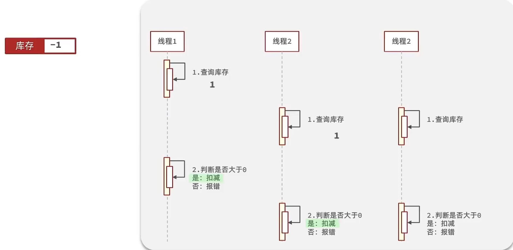

超卖问题是典型的多线程安全问题，针对这一问题的常见解决方案就是加锁：而对于加锁，我们通常有两种解决方案：见下图：

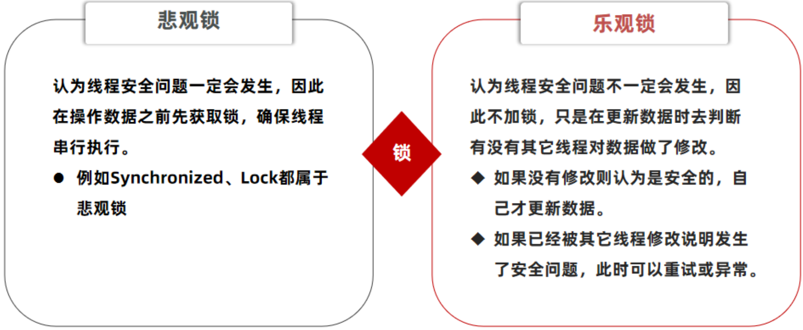

**悲观锁：**

悲观锁可以实现对于数据的串行化执行，比如syn，和lock都是悲观锁的代表，同时，悲观锁中又可以再细分为公平锁，非公平锁，可重入锁，等等

**乐观锁：**

乐观锁：会有一个版本号，每次操作数据会对版本号+1，再提交回数据时，会去校验是否比之前的版本大1 ，如果大1 ，则进行操作成功，这套机制的核心逻辑在于，如果在操作过程中，版本号只比原来大1 ，那么就意味着操作过程中没有人对他进行过修改，他的操作就是安全的，如果不大1，则数据被修改过，当然乐观锁还有一些变种的处理方式比如cas

乐观锁的典型代表：就是cas，利用cas进行无锁化机制加锁，var5 是操作前读取的内存值，while中的var1+var2 是预估值，如果预估值 == 内存值，则代表中间没有被人修改过，此时就将新值去替换 内存值

其中do while 是为了在操作失败时，再次进行自旋操作，即把之前的逻辑再操作一次。

```
int var5;
do {
    var5 = this.getIntVolatile(var1, var2);
} while(!this.compareAndSwapInt(var1, var2, var5, var5 + var4));

return var5;
```

**课程中的使用方式：**

课程中的使用方式是没有像cas一样带自旋的操作，也没有对version的版本号+1 ，他的操作逻辑是在操作时，对版本号进行+1 操作，然后要求version 如果是1 的情况下，才能操作，那么第一个线程在操作后，数据库中的version变成了2，但是他自己满足version=1 ，所以没有问题，此时线程2执行，线程2 最后也需要加上条件version =1 ，但是现在由于线程1已经操作过了，所以线程2，操作时就不满足version=1 的条件了，所以线程2无法执行成功

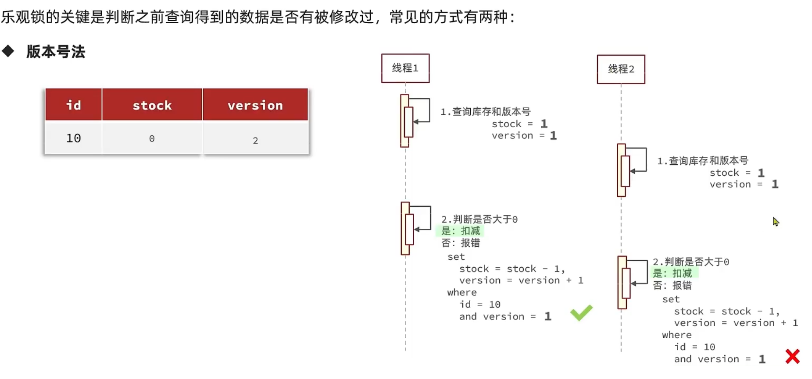

## 3.5. 乐观锁解决超卖问题

**修改代码方案一、**

VoucherOrderServiceImpl 在扣减库存时，改为：

```
boolean success = seckillVoucherService.update()
.setSql("stock= stock -1") //set stock = stock -1
.eq("voucher_id", voucherId).eq("stock",voucher.getStock()).update(); //where id = ？ and stock = ?
```

以上逻辑的核心含义是：只要我扣减库存时的库存和之前我查询到的库存是一样的，就意味着没有人在中间修改过库存，那么此时就是安全的，但是以上这种方式通过测试发现会有很多失败的情况，失败的原因在于：在使用乐观锁过程中假设100个线程同时都拿到了100的库存，然后大家一起去进行扣减，但是100个人中只有1个人能扣减成功，其他的人在处理时，他们在扣减时，库存已经被修改过了，所以此时其他线程都会失败

**修改代码方案二、**

之前的方式要修改前后都保持一致，但是这样我们分析过，成功的概率太低，所以我们的乐观锁需要变一下，改成stock大于0 即可

```
boolean success = seckillVoucherService.update()
.setSql("stock= stock -1")
.eq("voucher_id", voucherId).update().gt("stock",0); //where id = ? and stock > 0
```

**知识小扩展：**

针对cas中的自旋压力过大，我们可以使用Longaddr这个类去解决

Java8 提供的一个对AtomicLong改进后的一个类，LongAdder

大量线程并发更新一个原子性的时候，天然的问题就是自旋，会导致并发性问题，当然这也比我们直接使用syn来的好

所以利用这么一个类，LongAdder来进行优化

如果获取某个值，则会对cell和base的值进行递增，最后返回一个完整的值

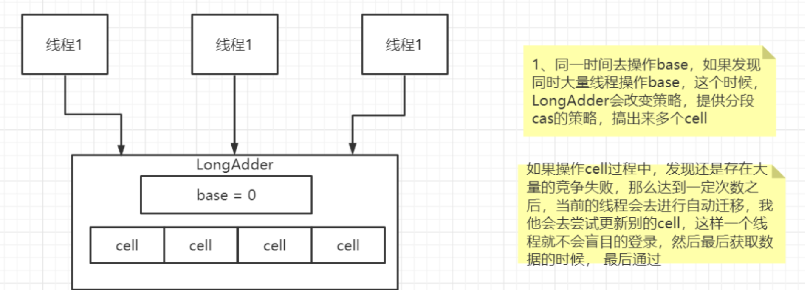

---

## 3.6. 一人一单

需求：修改秒杀业务，要求同一个优惠券，一个用户只能下一单

**现在的问题在于：**

优惠卷是为了引流，但是目前的情况是，一个人可以无限制的抢这个优惠卷，所以我们应当增加一层逻辑，让一个用户只能下一个单，而不是让一个用户下多个单

具体操作逻辑如下：比如时间是否充足，如果时间充足，则进一步判断库存是否足够，然后再根据优惠卷id和用户id查询是否已经下过这个订单，如果下过这个订单，则不再下单，否则进行下单

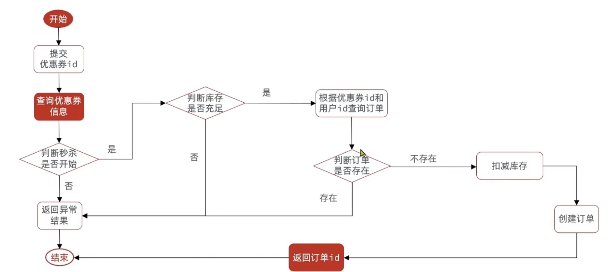

**初步代码：增加一人一单逻辑**

```
@Override
public Result seckillVoucher(Long voucherId) {
// 1.查询优惠券
SeckillVoucher voucher = seckillVoucherService.getById(voucherId);
// 2.判断秒杀是否开始
if (voucher.getBeginTime().isAfter(LocalDateTime.now())) {
    // 尚未开始
    return Result.fail("秒杀尚未开始！");
}
// 3.判断秒杀是否已经结束
if (voucher.getEndTime().isBefore(LocalDateTime.now())) {
    // 尚未开始
    return Result.fail("秒杀已经结束！");
}
// 4.判断库存是否充足
if (voucher.getStock() < 1) {
    // 库存不足
    return Result.fail("库存不足！");
}
// 5.一人一单逻辑
// 5.1.用户id
Long userId = UserHolder.getUser().getId();
int count = query().eq("user_id", userId).eq("voucher_id", voucherId).count();
// 5.2.判断是否存在
if (count > 0) {
    // 用户已经购买过了
    return Result.fail("用户已经购买过一次！");
}

//6，扣减库存
boolean success = seckillVoucherService.update()
.setSql("stock= stock -1")
.eq("voucher_id", voucherId).update();
if (!success) {
    //扣减库存
    return Result.fail("库存不足！");
}
//7.创建订单
VoucherOrder voucherOrder = new VoucherOrder();
// 7.1.订单id
long orderId = redisIdWorker.nextId("order");
voucherOrder.setId(orderId);

voucherOrder.setUserId(userId);
// 7.3.代金券id
voucherOrder.setVoucherId(voucherId);
save(voucherOrder);

return Result.ok(orderId);

}
```

**存在问题：**现在的问题还是和之前一样，并发过来，查询数据库，都不存在订单，所以我们还是需要加锁，但是乐观锁比较适合更新数据，而现在是插入数据，所以我们需要使用悲观锁操作

**注意：**在这里提到了非常多的问题，我们需要慢慢的来思考，首先我们的初始方案是封装了一个createVoucherOrder方法，同时为了确保他线程安全，在方法上添加了一把synchronized 锁

```
@Transactional
public synchronized Result createVoucherOrder(Long voucherId) {

    Long userId = UserHolder.getUser().getId();
    // 5.1.查询订单
    int count = query().eq("user_id", userId).eq("voucher_id", voucherId).count();
    // 5.2.判断是否存在
    if (count > 0) {
        // 用户已经购买过了
        return Result.fail("用户已经购买过一次！");
    }

    // 6.扣减库存
    boolean success = seckillVoucherService.update()
    .setSql("stock = stock - 1") // set stock = stock - 1
    .eq("voucher_id", voucherId).gt("stock", 0) // where id = ? and stock > 0
    .update();
    if (!success) {
        // 扣减失败
        return Result.fail("库存不足！");
    }

    // 7.创建订单
    VoucherOrder voucherOrder = new VoucherOrder();
    // 7.1.订单id
    long orderId = redisIdWorker.nextId("order");
    voucherOrder.setId(orderId);
    // 7.2.用户id
    voucherOrder.setUserId(userId);
    // 7.3.代金券id
    voucherOrder.setVoucherId(voucherId);
    save(voucherOrder);

    // 7.返回订单id
    return Result.ok(orderId);
}
```

，但是这样添加锁，锁的粒度太粗了，在使用锁过程中，控制**锁粒度** 是一个非常重要的事情，因为如果锁的粒度太大，会导致每个线程进来都会锁住，所以我们需要去控制锁的粒度，以下这段代码需要修改为：**intern()** 这个方法是从常量池中拿到数据，如果我们直接使用userId.toString() 他拿到的对象实际上是不同的对象，new出来的对象，我们使用锁必须保证锁必须是同一把，所以我们需要使用intern()方法

```
@Transactional
public  Result createVoucherOrder(Long voucherId) {
Long userId = UserHolder.getUser().getId();
synchronized(userId.toString().intern()){
    // 5.1.查询订单
    int count = query().eq("user_id", userId).eq("voucher_id", voucherId).count();
    // 5.2.判断是否存在
    if (count > 0) {
        // 用户已经购买过了
        return Result.fail("用户已经购买过一次！");
    }

    // 6.扣减库存
    boolean success = seckillVoucherService.update()
    .setSql("stock = stock - 1") // set stock = stock - 1
    .eq("voucher_id", voucherId).gt("stock", 0) // where id = ? and stock > 0
    .update();
    if (!success) {
        // 扣减失败
        return Result.fail("库存不足！");
    }

    // 7.创建订单
    VoucherOrder voucherOrder = new VoucherOrder();
    // 7.1.订单id
    long orderId = redisIdWorker.nextId("order");
    voucherOrder.setId(orderId);
    // 7.2.用户id
    voucherOrder.setUserId(userId);
    // 7.3.代金券id
    voucherOrder.setVoucherId(voucherId);
    save(voucherOrder);

    // 7.返回订单id
    return Result.ok(orderId);
}
}
```

但是以上代码还是存在问题，问题的原因在于当前方法被spring的事务控制，如果你在方法内部加锁，可能会导致当前方法事务还没有提交，但是锁已经释放也会导致问题，所以我们选择将当前方法整体包裹起来，确保事务不会出现问题：如下：

在seckillVoucher 方法中，添加以下逻辑，这样就能保证事务的特性，同时也控制了锁的粒度  
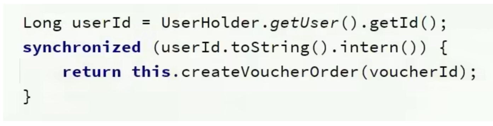

但是以上做法依然有问题，因为你调用的方法，其实是this.的方式调用的，事务想要生效，还得利用代理来生效，所以这个地方，我们需要获得原始的事务对象， 来操作事务

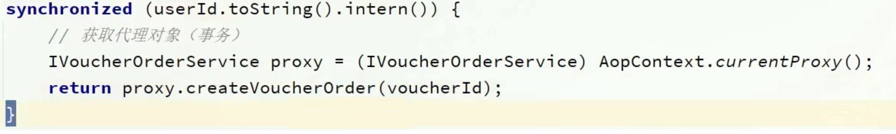

---

## 3.7. 集群下的并发问题

通过加锁可以解决在单机情况下的一人一单安全问题，但是在集群模式下就不行了。

1、我们将服务启动两份，端口分别为8081和8082：

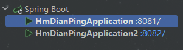

2、然后修改nginx的conf目录下的nginx.conf文件，配置反向代理和负载均衡：

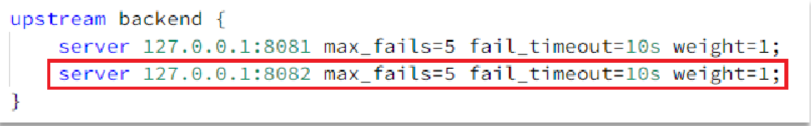

**有关锁失效原因分析**

由于现在我们部署了多个tomcat，每个tomcat都有一个属于自己的jvm，那么假设在服务器A的tomcat内部，有两个线程，这两个线程由于使用的是同一份代码，那么他们的锁对象是同一个，是可以实现互斥的，但是如果现在是服务器B的tomcat内部，又有两个线程，但是他们的锁对象写的虽然和服务器A一样，但是锁对象却不是同一个，所以线程3和线程4可以实现互斥，但是却无法和线程1和线程2实现互斥，这就是 集群环境下，syn锁失效的原因，在这种情况下，我们就需要使用分布式锁来解决这个问题。

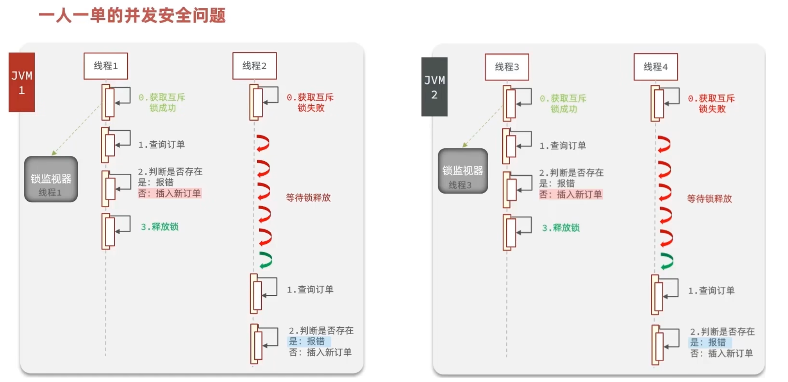

---

# 4. 分布式锁

## 4.1. 基本原理和实现方式对比

分布式锁：满足分布式系统或集群模式下多进程可见并且互斥的锁。

分布式锁的核心思想就是让大家都使用同一把锁，只要大家使用的是同一把锁，那么我们就能锁住线程，不让线程进行，让程序串行执行，这就是分布式锁的核心思路

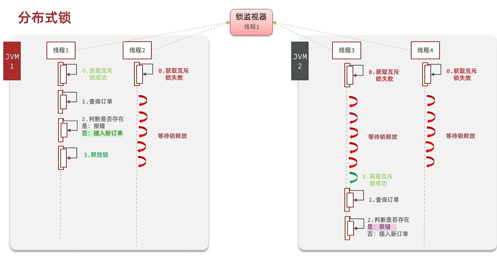

那么分布式锁他应该满足一些什么样的条件呢？

可见性：多个线程都能看到相同的结果，注意：这个地方说的可见性并不是并发编程中指的内存可见性，只是说多个进程之间都能感知到变化的意思

互斥：互斥是分布式锁的最基本的条件，使得程序串行执行

高可用：程序不易崩溃，时时刻刻都保证较高的可用性

高性能：由于加锁本身就让性能降低，所有对于分布式锁本身需要他就较高的加锁性能和释放锁性能

安全性：安全也是程序中必不可少的一环

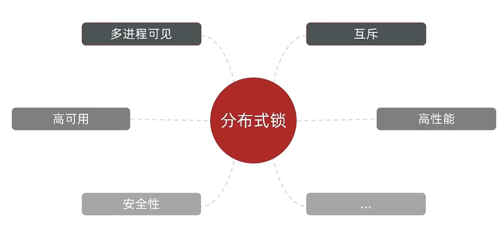

  
常见的分布式锁有三种

Mysql：mysql本身就带有锁机制，但是由于mysql性能本身一般，所以采用分布式锁的情况下，其实使用mysql作为分布式锁比较少见

Redis：redis作为分布式锁是非常常见的一种使用方式，现在企业级开发中基本都使用redis或者zookeeper作为分布式锁，利用setnx这个方法，如果插入key成功，则表示获得到了锁，如果有人插入成功，其他人插入失败则表示无法获得到锁，利用这套逻辑来实现分布式锁

Zookeeper：zookeeper也是企业级开发中较好的一个实现分布式锁的方案，由于本套视频并不讲解zookeeper的原理和分布式锁的实现，所以不过多阐述

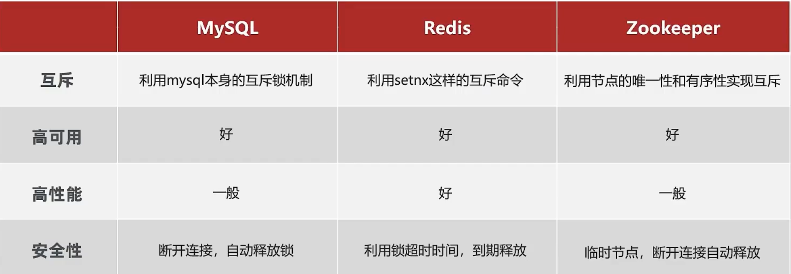

---

## 4.2. Redis分布式锁的实现核心思路

实现分布式锁时需要实现的两个基本方法：

- 获取锁：

- 互斥：确保只能有一个线程获取锁
- 非阻塞：尝试一次，成功返回true，失败返回false

释放锁：

- 手动释放
- 超时释放：获取锁时添加一个超时时间


核心思路：

我们利用redis 的**setNx** 方法，当有多个线程进入时，我们就利用该方法，第一个线程进入时，redis 中就有这个key 了，返回了1，如果结果是1，则表示他抢到了锁，那么他去执行业务，然后再删除锁，退出锁逻辑，没有抢到锁的哥们，等待一定时间后重试即可

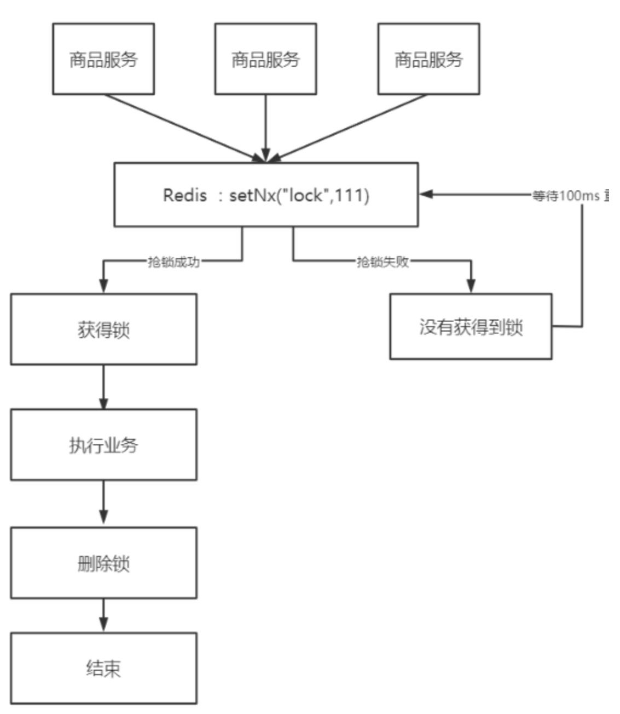

---

## 4.3. 实现分布式锁版本一

- 加锁逻辑

**锁的基本接口**

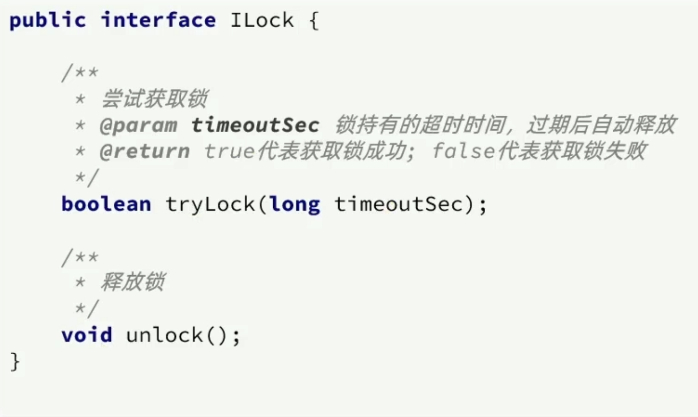

利用**setnx**方法进行加锁，同时增加过期时间，防止死锁，此方法可以保证加锁和增加过期时间具有原子性

```
private static final String KEY_PREFIX="lock:"

@Override
public boolean tryLock(long timeoutSec) {
    // 获取线程标示
    String threadId = Thread.currentThread().getId()
    // 获取锁
    Boolean success = stringRedisTemplate.opsForValue()
    .setIfAbsent(KEY_PREFIX + name, threadId + "", timeoutSec, TimeUnit.SECONDS);
    return Boolean.TRUE.equals(success);
}
```

- 释放锁逻辑

释放锁，防止删除别人的锁

```
public void unlock() {
    //通过del删除锁
    stringRedisTemplate.delete(KEY_PREFIX + name);
}
```

- 修改业务代码

```
@Override
public Result seckillVoucher(Long voucherId) {
    // 1.查询优惠券
    SeckillVoucher voucher = seckillVoucherService.getById(voucherId);
    // 2.判断秒杀是否开始
    if (voucher.getBeginTime().isAfter(LocalDateTime.now())) {
        // 尚未开始
        return Result.fail("秒杀尚未开始！");
    }
    // 3.判断秒杀是否已经结束
    if (voucher.getEndTime().isBefore(LocalDateTime.now())) {
        // 尚未开始
        return Result.fail("秒杀已经结束！");
    }
    // 4.判断库存是否充足
    if (voucher.getStock() < 1) {
        // 库存不足
        return Result.fail("库存不足！");
    }
    Long userId = UserHolder.getUser().getId();
    //创建锁对象(新增代码)
    SimpleRedisLock lock = new SimpleRedisLock("order:" + userId, stringRedisTemplate);
    //获取锁对象
    boolean isLock = lock.tryLock(1200);
    //加锁失败
    if (!isLock) {
        return Result.fail("不允许重复下单");
    }
    try {
        //获取代理对象(事务)
        IVoucherOrderService proxy = (IVoucherOrderService) AopContext.currentProxy();
        return proxy.createVoucherOrder(voucherId);
    } finally {
        //释放锁
        lock.unlock();
    }
}
```

---

03月16日

## 4.4. 分布式锁的误删问题

## 4.5. 解决Redis分布式锁误删问题

## 4.6. 分布式锁的原子问题

## 4.7. Lua脚本解决多条命令原子性问题

## 4.8. 利用Java代码调用Lua脚本改造分布式锁

---

# 5. 分布式锁-redission

## 5.1. 功能介绍

### 5.1.1. 快速入门

## 5.2. 可重入锁原理

## 5.3. redission锁重入和WatchDog机制

---

03月17日

## 5.4. redission锁的MutiLock原理

Redisson 分布式锁主从一致性问题

原理：多个独立的 Redis 节点，必须在所有节点都获取重入锁，才算获取锁成功。

缺点：运维成本高、实现复杂

---

# 6. Redis 优化秒杀

秒杀业务的优化思路是什么？

① 先利用 Redis 完成库存余量、一人一档判断，完成抢单业务

② 再将下单业务放入阻塞队列，利用独立线程异步下单

基于阻塞队列的一部秒杀存在哪些问题？

- 内存限制问题
- 数据安全问题

---

# 7. Redis 消息队列

消息队列（Message Queue），字面意思就是存放消息的队列。最简单的消息队列模型包括3个角色：

- **消息队列**：存储和管理消息，也被称为消息代理（Message Broker）
- **生产者**：发送消息到消息队列
- **消费者**：从消息队列获取消息并处理消息

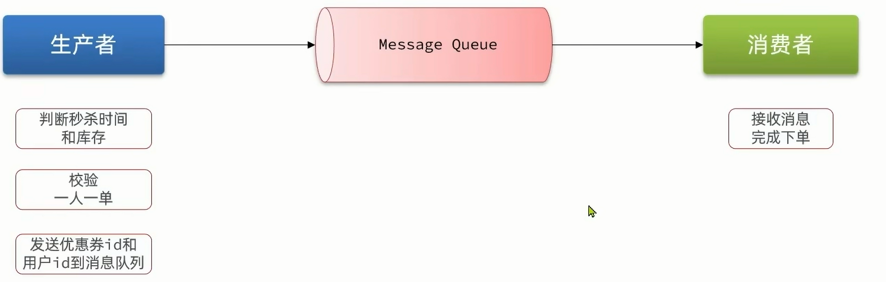

Redis提供了三种不同的方式来实现消息队列：

- **list结构**：基于List结构模拟消息队列
- **PubSub**：基本的点对点消息模型
- **Stream**：比较完善的消息队列模型

消息队列相较于阻塞队列的主要优势可简要概括如下：

1. **解耦**：消息队列允许生产者和消费者彼此独立，无需知道对方的存在，系统组件间耦合度更低。
2. **异步通信**：生产者发送消息后可立即返回，无需等待消费者处理，提高系统响应速度和吞吐量。
3. **削峰填谷**：在高并发场景下，消息队列可缓冲突发流量，避免系统过载，平滑处理请求。
4. **可靠性与持久化**：多数消息队列支持消息持久化、确认机制和重试策略，保障消息不丢失。
5. **跨系统/跨语言支持**：消息队列（如 RabbitMQ、Kafka）通常提供标准协议（AMQP、MQTT 等），便于不同系统或语言集成。
6. **可扩展性**：消费者可水平扩展，按需增加处理能力，提升整体系统伸缩性。

相比之下，阻塞队列（如 Java 中的 `BlockingQueue`）主要用于**单机多线程**间的同步与通信，不具备网络传输、持久化、跨服务等能力，适用范围更局限。

---

## 7.1. 基于 List 结构模拟消息队列

- **消息队列（Message Queue）**：字面意思是存放消息的队列。
- **Redis 的 list 数据结构**：是一个双向链表，容易模拟出队列效果。

- 队列的入口和出口不在同一侧，可通过 **LPUSH 结合 RPOP** 或 **RPUSH 结合 LPOP** 实现。
- 当队列中无消息时，RPOP 或 LPOP 会返回 null，不会阻塞等待。
- 为实现阻塞效果，应使用 **BRPOP** 或 **BLPOP**。

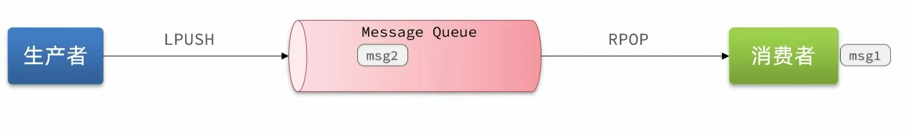

**基于List的消息队列有哪些优缺点？**

**优点：**

- 利用Redis存储，不受限于JVM内存上限
- 基于Redis的持久化机制，数据安全性有保证
- 可以满足消息有序性

**缺点：**

- 无法避免消息丢失
- 只支持单消费者

---

## 7.2. 基于 PubSub 的消息队列

**PubSub（发布订阅）** 是 Redis 2.0 版本引入的消息传递模型。顾名思义，消费者可以订阅一个或多个 channel，生产者向对应 channel 发送消息后，所有订阅者都能收到相关消息。

- **SUBSCRIBE channel [channel]**：订阅一个或多个频道
- **PUBLISH channel msg**：向一个频道发送消息
- **PSUBSCRIBE pattern [pattern]**：订阅与 pattern 格式匹配的所有频道

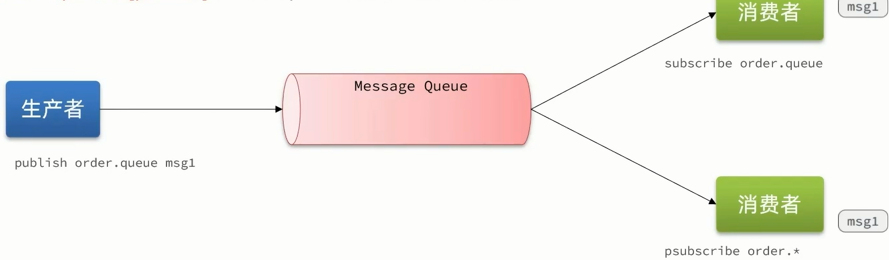

**基于PubSub的消息队列有哪些优缺点？**

**优点：**

- 采用发布订阅模型，支持多生产、多消费

**缺点：**

- 不支持数据持久化
- 无法避免消息丢失
- 消息堆积有上限，超出时数据丢失

---

## 7.3. 基于 Stream 的消息队列-单消费模式

Steam 是 Redis5.0 引入的一种新数据类型，可以实现一个功能非常完善的信息队列。

① 发送消息的命令 **XADD**：

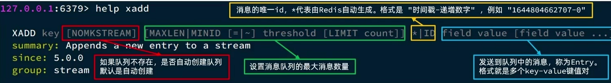

例如：

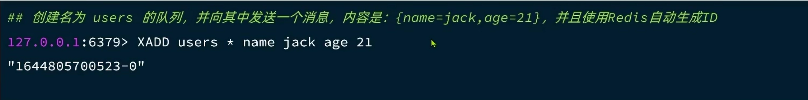

② 读取消息的方式一：**XREAD**

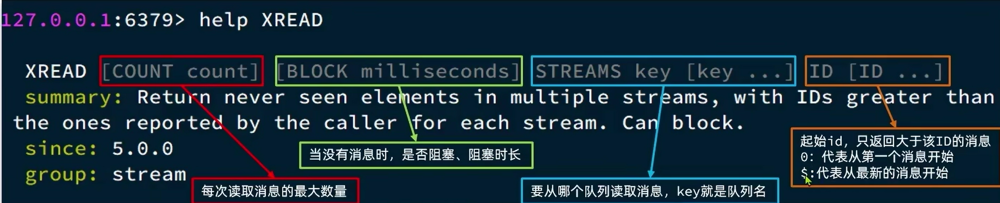

XREAD 阻塞方式，读取最新的消息：

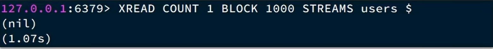

在业务开发中，我们可以循环的调用 XREAD 阻塞方式来查询最新消息，从而实现持续监听队列的效果，伪代码如下：

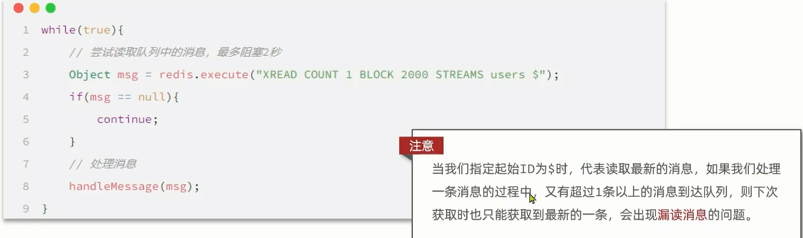

**STREAM类型消息队列的XREAD命令特点：**

- 消息可回溯
- 一个消息可以被多个消费者读取
- 可以阻塞读取
- 有消息漏读的风险

---

## 7.4. 基于 Stream 的消息队列-消费组模式

**消费者组（Consumer Group）**：将多个消费者划分到一个组中，监听同一个队列。具备下列特点：

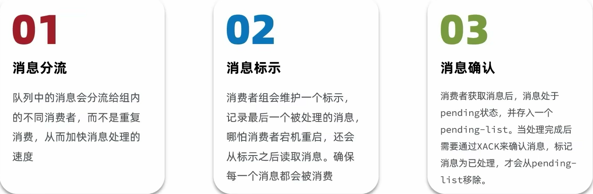

**创建消费者组：**

```
XGROUP CREATE key groupName ID [MKSTREAM]
```

- **key**：队列名称
- **groupName**：消费者组名称
- **ID**：起始ID标示，`$`代表队列中最后一个消息，`0`则代表队列中第一个消息
- **MKSTREAM**：队列不存在时自动创建队列

**其它常见命令：**


**从消费者组读取消息：**

```
XREADGROUP GROUP group consumer [COUNT count] [BLOCK milliseconds] [NOACK] STREAMS key [key ...] ID [ID ...]
```

- **group**：消费组名称
- **consumer**：消费者名称，如果消费者不存在，会自动创建一个消费者
- **count**：本次查询的最大数量
- **BLOCK milliseconds**：当没有消息时最长等待时间（单位：毫秒）
- **NOACK**：无需手动 ACK，获取到消息后自动确认
- **STREAMS key**：指定队列名称
- **ID**：获取消息的起始 ID：

- `">"`：从下一个未消费的消息开始
- 其它：根据指定 ID 从 pending-list 中获取已消费但未确认的消息，例如 `0`，是从 pending-list 中的第一个消息开始

消费者监听消息的基本思路：

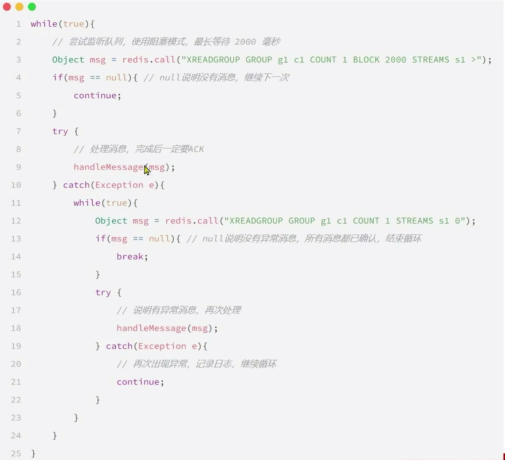

**STREAM类型消息队列的XREADGROUP命令特点：**

- 消息可回溯
- 可以多消费者争抢消息，加快消费速度
- 可以阻塞读取
- 没有消息漏读的风险
- 有消息确认机制，保证消息至少被消费一次

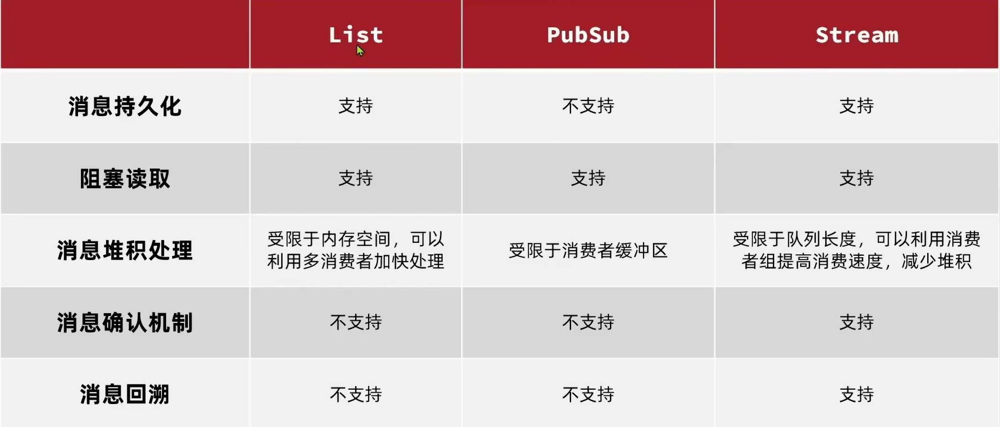

## 7.5. 基于 Stream 的消息队列实现异步秒杀

```
@Slf4j
@Service
public class VoucherOrderServiceImpl extends ServiceImpl<VoucherOrderMapper, VoucherOrder> implements IVoucherOrderService {
// ... existing code ...

//线程池
private static final ExecutorService SECKILL_ORDER_EXECUTOR = Executors.newSingleThreadExecutor();

// 标记是否正在运行
private final AtomicBoolean running = new AtomicBoolean(true);

@PostConstruct
private void init(){
    SECKILL_ORDER_EXECUTOR.submit(new VoucherOrderHandler());
}

@PreDestroy
public void destroy() {
    running.set(false);
    SECKILL_ORDER_EXECUTOR.shutdownNow();
    log.info("订单处理线程已停止");
}

//这个线程会持续运行，监听 Redis Stream 中的订单消息

/**
 * 这是一个基于 Redis Stream 的订单异步处理器，用于处理秒杀优惠券订单
 */
//线程任务
private class VoucherOrderHandler implements Runnable{
    String queueName = "stream.orders";
    @Override
    public void run() {
        while (running.get()){   // 无限循环，持续监听
            try {
                //1.获取队列中的订单信息，读取 Redis Stream 消息
                List<MapRecord<String, Object, Object>> list = stringRedisTemplate.opsForStream().read(
                    Consumer.from("g1", "c1"),  // 消费者组：g1，消费者 ID：c1
                    StreamReadOptions.empty().count(1).block(Duration.ofSeconds(2)), // 每次读 1 条，阻塞 2 秒
                    StreamOffset.create(queueName, ReadOffset.lastConsumed()) // 从上次消费的位置继续
                );

                //2.判断消息获取是否成功
                if (list == null || list.isEmpty()) {
                    //获取失败，说明没有信息，继续下一次循环
                    continue;
                }
                //解析消息中的订单信息
                MapRecord<String, Object, Object> record = list.get(0);
                Map<Object, Object> values = record.getValue();
                VoucherOrder voucherOrder = BeanUtil.fillBeanWithMap(values, new VoucherOrder(), true);
                //3.如果获取成功，创建订单
                handleVoucherOrder(voucherOrder);

                //4.ACK 确认
                stringRedisTemplate.opsForStream().acknowledge(queueName, record);

            }catch (Exception e){
                if (running.get()) {
                    handlePendingList();
                    log.error("处理订单异常", e);
                }
            }
        }
    }

    private void handlePendingList() {

        while (running.get()){
            try {
                //1.获取队列中的订单信息，读取 Redis Stream 消息
                List<MapRecord<String, Object, Object>> list = stringRedisTemplate.opsForStream().read(
                    Consumer.from("g1", "c1"),  // 消费者组：g1，消费者 ID：c1
                    StreamReadOptions.empty().count(1).block(Duration.ofSeconds(2)), // 每次读 1 条，阻塞 2 秒
                    StreamOffset.create(queueName, ReadOffset.from("0")) // 从上次消费的位置继续
                );

                //2.判断消息获取是否成功
                if (list == null || list.isEmpty()) {
                    //获取失败，说明 pending-list 没有信息，结束下一次循环
                    break;
                }
                //解析消息中的订单信息
                MapRecord<String, Object, Object> record = list.get(0);
                Map<Object, Object> values = record.getValue();
                VoucherOrder voucherOrder = BeanUtil.fillBeanWithMap(values, new VoucherOrder(), true);
                //3.如果获取成功，创建订单
                handleVoucherOrder(voucherOrder);

                //4.ACK 确认
                stringRedisTemplate.opsForStream().acknowledge(queueName, record);

            }catch (Exception e){
                if (!running.get()) {
                    break;
                }
                log.error("处理 pending-list 订单异常", e);
                try {
                    Thread.sleep(2000);
                } catch (InterruptedException ex) {
                    Thread.currentThread().interrupt();
                    break;
                }
            }
        }

    }
}
```

主要修改点：

添加 @Slf4j 注解：引入日志记录器

添加 AtomicBoolean running 标志：用于控制线程的生命周期

添加 @PreDestroy 方法：在 Spring 容器销毁前优雅地关闭线程池

修改循环条件：将 while(true) 改为 while(running.get())，使得可以通过标志位控制线程退出

在异常处理中检查运行状态：避免在应用关闭后继续处理

修复 handlePendingList() 的阻塞设置：添加 .block(Duration.ofSeconds(2))，避免空转消耗资源

正确处理中断异常：使用 Thread.currentThread().interrupt() 恢复中断状态

这些修改确保了在应用关闭时能够优雅地停止后台线程，避免在 Redis 连接池关闭后继续访问导致的异常。

---

03月21日

# 8. 达人探店

## 8.1. 发布探店笔记

**探店笔记类比点评网站的评价，通常是图文结合。对应的数据库表有两个：**

- **tb_blog**：探店笔记表，包含笔记中的标题、文字、图片等内容
- **tb_blog_comments**：其他用户对探店笔记的评价（评论）

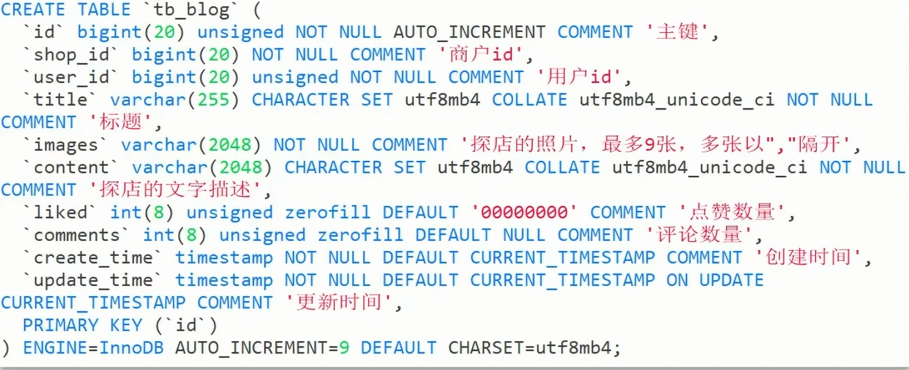

点击首页最下方菜单栏中的+按钮，即可发布探店图文：

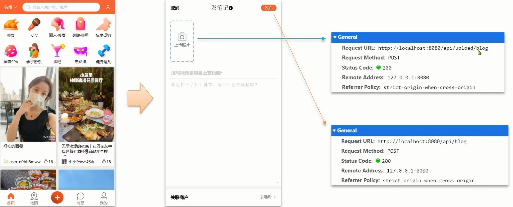

需求：点击首页的探店笔记，会进入详情页面，实现该页面的查询接口：

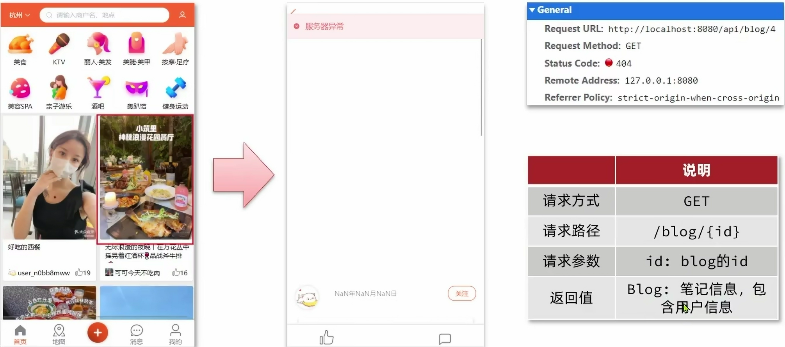

---

## 8.2. 点赞

在首页的探店笔记排行榜和探店图文详情界面都有点赞的功能

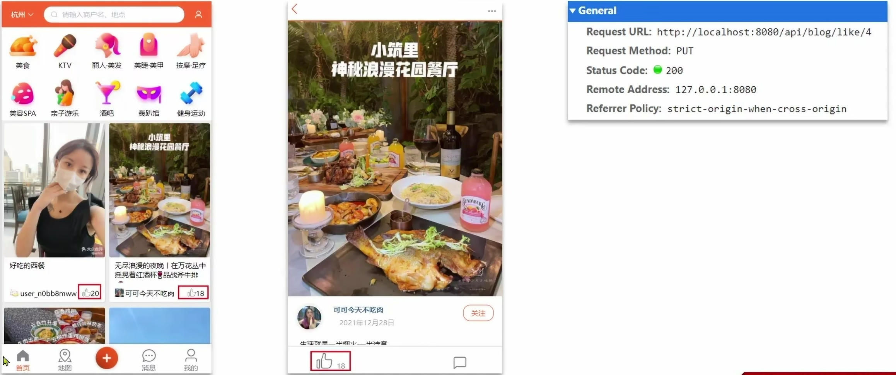

**完善点赞功能**

**需求：**

- 同一个用户只能点赞一次，再次点击则取消点赞
- 如果当前用户已经点赞，则点赞按钮高亮显示（前端已实现，判断字段 Blog 类的 isLike 属性）

**实现步骤：**  
① 给 Blog 类中添加一个 isLike 字段，标示是否被当前用户点赞  
② 修改点赞功能，利用 Redis 的 set 集合判断是否点赞过：未点赞过则点赞数 +1，已点赞过则点赞数 -1  
③ 修改根据 id 查询 Blog 的业务，判断当前登录用户是否点赞过，赋值给 isLike 字段  
④ 修改分页查询 Blog 业务，判断当前登录用户是否点赞过，赋值给 isLike 字段

---

## 8.3. 点赞排行榜

在探店笔记的详情界面，应该把给该笔记点赞的人显示出来，比如最早点赞的 top5，形成排行榜：

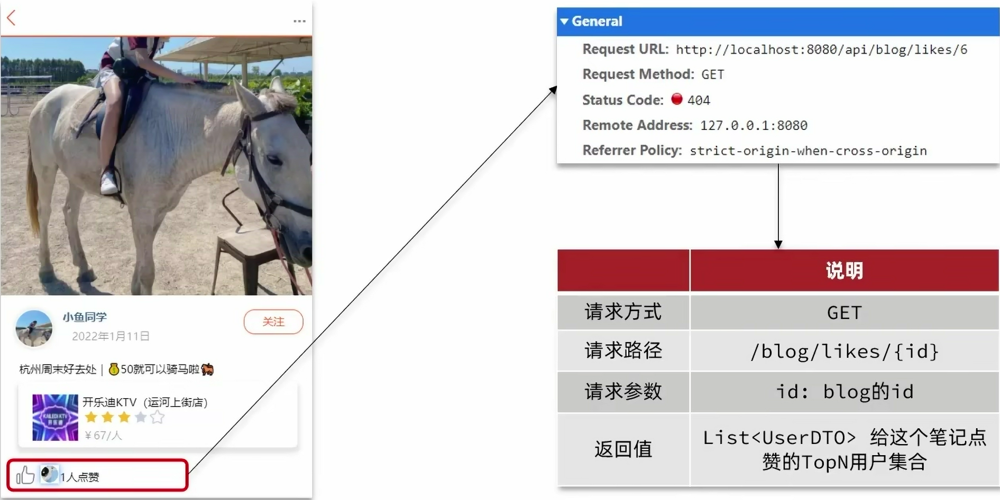

**实现查询点赞排行榜的接口**

需求：按照点赞时间的先后顺序，返回 top5 的用户

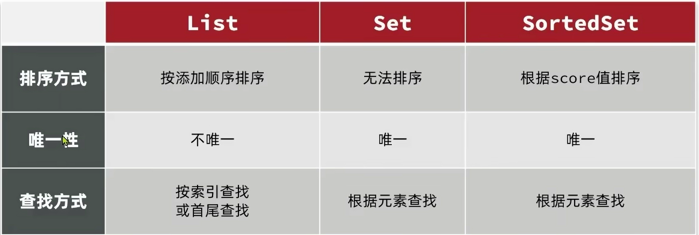

---

# 9. 好友关注

## 9.1. 关注和取关

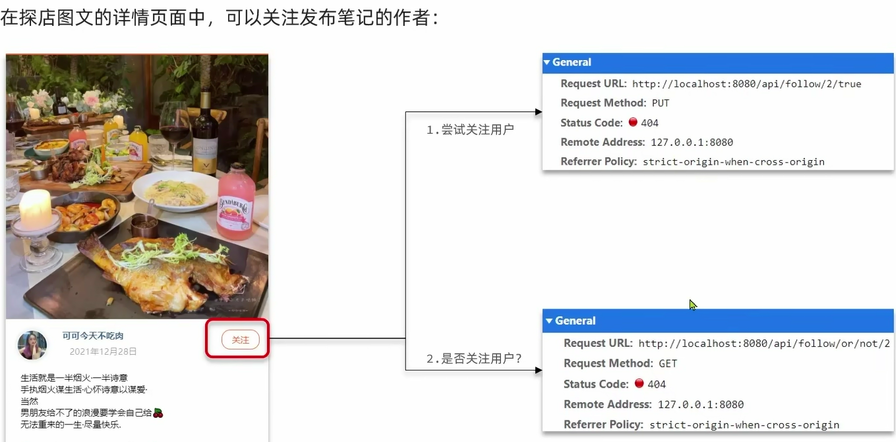

---

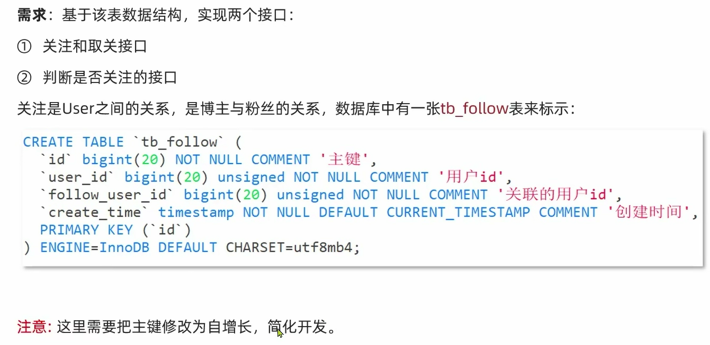

## 9.2. 共同关注

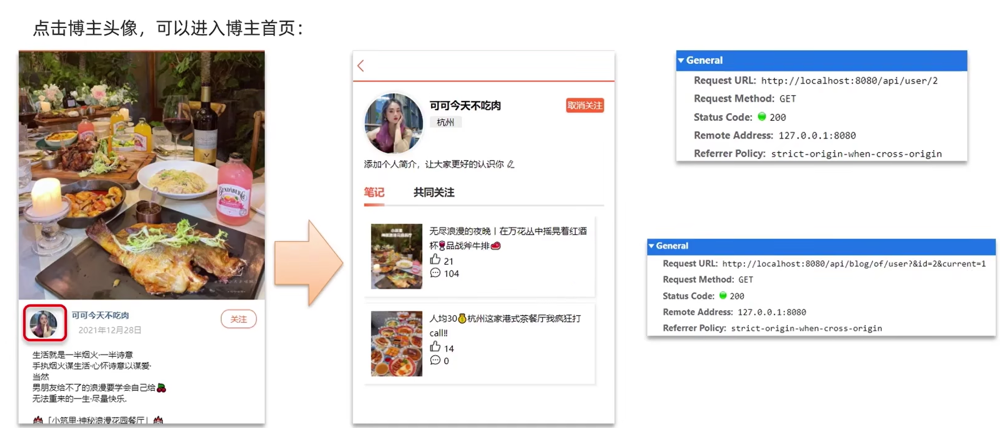

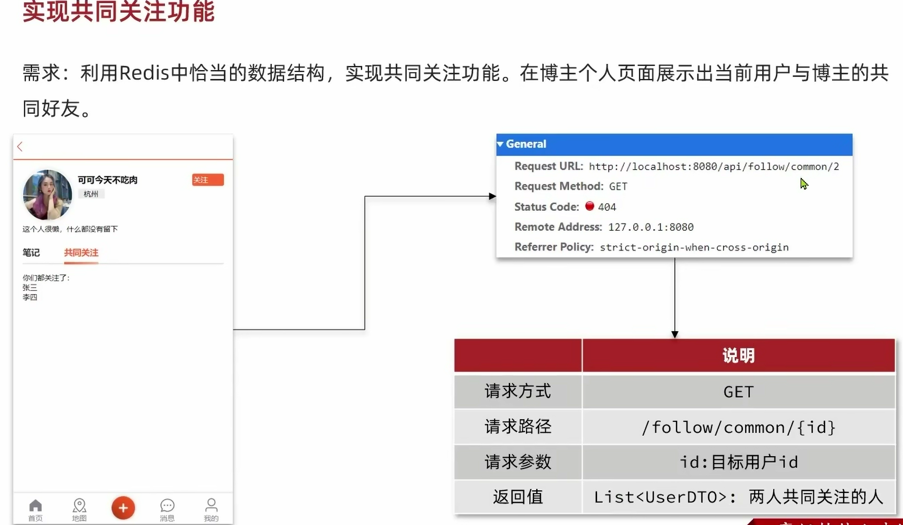

---

## 9.3. 关注推送

关注推送也叫做Feed流，直译为**投喂**。为用户持续地提供“沉浸式”的体验，通过无限下拉刷新获取新的信息。

---

**说明**

- **Feed流**：指将用户关注的内容（如动态、文章、视频等）按时间或算法排序，持续推送给用户。
- **“投喂”**：形象化表达系统不断向用户推送内容的过程。
- **沉浸式体验**：用户无需主动搜索，即可在滚动中持续接收信息，提升粘性。
- **无限下拉刷新**：常见于社交、资讯类 App（如微博、抖音、知乎），实现“刷不完”的内容流。


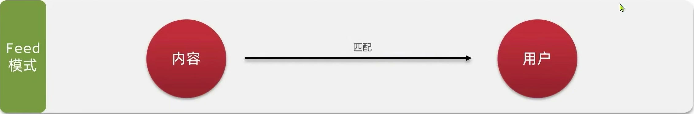

### 9.3.1. **Feed 流的模式**

Feed流产品有两种常见模式：

- **Timeline**：不做内容筛选，简单的按照内容发布时间排序，常用于好友或关注。例如朋友圈  
    ➤ 优点：信息全面，不会有缺失。并且实现也相对简单  
    ➤ 缺点：信息噪音较多，用户不一定感兴趣，内容获取效率低
- **智能排序**：利用智能算法屏蔽掉违规的、用户不感兴趣的内容。推送用户感兴趣信息来吸引用户  
    ➤ 优点：投喂用户感兴趣信息，用户粘度很高，容易沉迷  
    ➤ 缺点：如果算法不精准，可能起到反作用

---

**说明**

- **Timeline 模式**：强调“时间线”逻辑，适合社交关系强的场景（如微信朋友圈），保证内容完整但可能冗余。
- **智能排序模式**：依赖推荐算法（如机器学习、用户行为分析），提升个性化体验，广泛应用于抖音、微博、今日头条等平台。

总结：

- Timeline：简单直接，重在“全”
- 智能排序：精准高效，重在“准”

---

本例中的个人页面，是基于关注的好友来做Feed流，因此采用Timeline的模式。该模式的实现方案有三种：

① 拉模式  
② 推模式  
③ 推拉结合

---

**说明**

- **Timeline模式**：按时间顺序展示好友发布的动态，适用于社交类场景（如朋友圈）。
- **三种实现方式**：

1. **拉模式**：用户主动请求获取最新内容（如下拉刷新），由客户端发起请求。
2. **推模式**：服务器主动将新内容推送给用户（如WebSocket、消息队列），实时性强。
3. **推拉结合**：综合使用推和拉，兼顾实时性与稳定性，是实际应用中常见的优化方案。

选择依据：

- 实时性要求高 → 推模式或推拉结合
- 系统资源有限 → 拉模式更节省服务器压力
- 平衡体验与成本 → 推拉结合最常见

**Feed 流的实现方案 1：**

**拉模式：**也叫读扩散

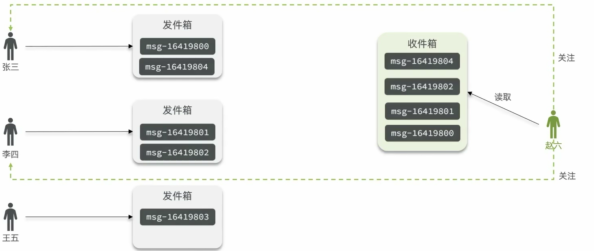

---

**Feed 流的实现方案 2：**

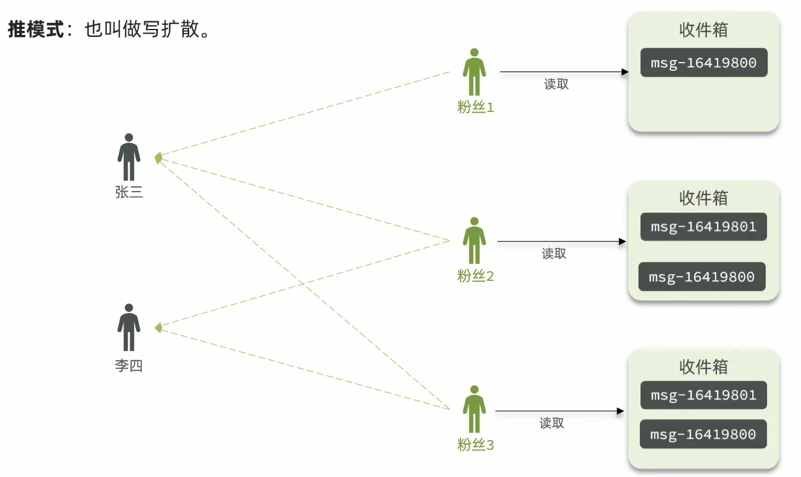

---

**Feed 流的实现方案 3：**

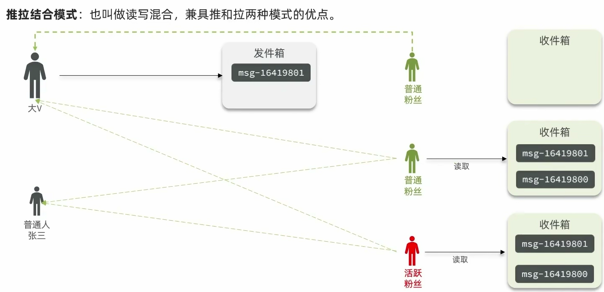

---

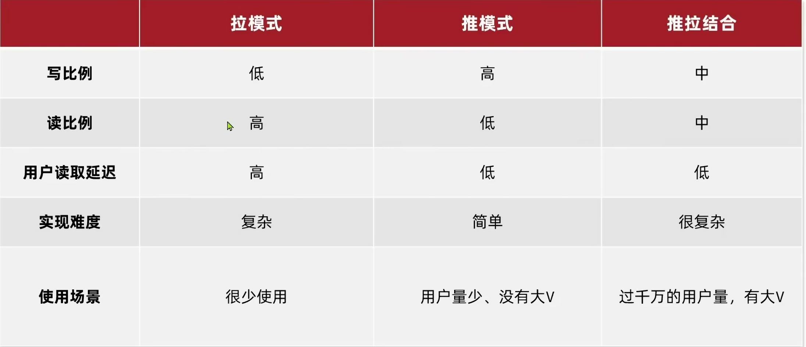

---

**Feed 流分页问题：**

Feed 流中的数据会不断跟新，所以数据的角标也在变化，因此不能采用传统的分页模式

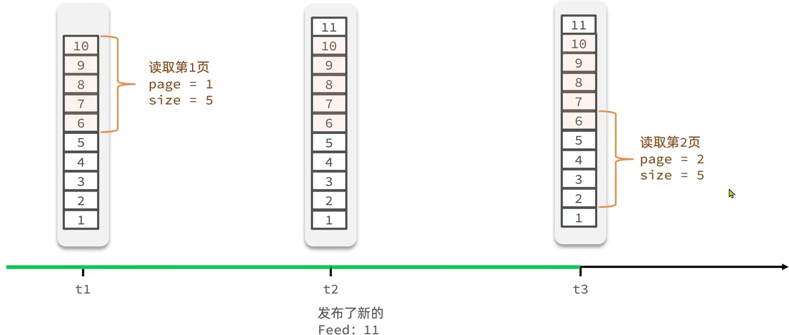

---

**Feed 流的滚动分页**

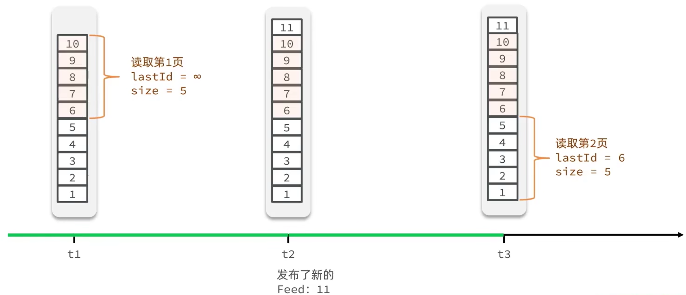

---

### 9.3.2. 滚动分页查询收件箱的思路

关于 **Redis 实现滚动分页查询收件箱** 的思路，主要是为了解决类似“朋友圈”或“关注动态流（Feed 流）”这类场景下的分页问题。传统的分页方式（如 `offset + limit`）在数据频繁变动时会出现重复、遗漏等问题，因此采用了 **基于 Redis 的 ZSet（有序集合）+ 时间戳滚动查询** 的方式来实现。

---

**一、为什么不能用传统分页？**

传统分页是这样的：

- 第1页：取第 0~9 条
- 第2页：取第 10~19 条
- ……

但 Feed 流的数据是**实时插入**的（比如你关注的人刚发了一条新动态），这就导致：

- 原本第10条可能变成第11条；
- 用户下拉刷新时，可能会看到重复内容，或者漏掉某些内容。

所以，**传统分页不适合动态流式数据**。

---

**二、黑马点评的解决方案核心思想**

**用“上次看到的最后一条的时间戳”作为下次查询的起点，而不是用偏移量（offset）**

这就叫 **滚动分页（也叫游标分页、时间戳分页）**。

---

**三、具体怎么用 Redis 实现？**

1. 数据结构选择：ZSet（有序集合）

- **Key**：每个用户的收件箱，比如 `feed:用户ID`
- **Value（member）**：动态（比如博客）的 ID
- **Score（分数）**：动态发布时的 **时间戳（毫秒）**

这样，ZSet 就能自动按时间倒序排列所有动态。

2. 查询命令：`ZREVRANGEBYSCORE`

```
ZREVRANGEBYSCORE feed:123 +inf <上次最小时间戳> LIMIT 0 10
```

- `+inf` 表示最大值（最新）
- `<上次最小时间戳>` 是上一页查到的**最小时间戳**
- `LIMIT 0 10` 表示最多查10条

注意：第一次查询时，“上次最小时间戳”可以用当前时间（`System.currentTimeMillis()`）

3. 处理相同时间戳的问题（关键细节！）

如果多条动态**时间戳完全一样**（比如批量导入、高并发发布），只靠时间戳无法区分先后。

黑马点评的解决办法是：

- 在返回结果时，除了返回**最小时间戳**，还要返回一个 **offset（偏移量）**
- 这个 offset 表示“在这个时间戳下，已经跳过了多少条”

下次查询时：

- `max = 上次最小时间戳`
- `offset = 上次累计的偏移量`

这样就能准确跳过已读内容，避免重复或遗漏。

---

**四、前端 & 后端配合流程**

1. **前端首次请求**：

- 不传 `lastId` 和 `offset`
- 后端用当前时间作为 max 查询

2. **后端返回**：

- 动态列表（含博客ID）
- `minTime`（这批数据中最小的时间戳）
- `offset`（该时间戳下已读数量）

3. **前端下拉刷新时**：

- 把上次的 `minTime` 和 `offset` 传给后端

4. **后端再次查询**：

- 用 `ZREVRANGEBYSCORE key +inf minTime LIMIT offset 10`
- 如果刚好卡在相同时间戳边界，就继续用 offset 跳过

---

**五、举个例子** 🌰

假设用户收件箱里有这些动态（按时间倒序）：

|   |   |
|---|---|
|博客ID|时间戳|
|101|1710000010|
|102|1710000010|
|103|1710000010|
|104|1710000005|
|105|1710000000|

- 第一次查：max=当前时间，limit=2 → 返回 [101, 102]，minTime=1710000010，offset=2
- 第二次查：max=1710000010，offset=2，limit=2 → 跳过前2个相同时间戳，返回 [103, 104]
- 第三次查：max=1710000005，offset=0 → 返回 [105]

完美避免重复和遗漏！

---

**总结**

黑马点评中 Redis 滚动分页的核心要点：

|   |   |
|---|---|
|要点|说明|
|数据结构|使用 ZSet，score 为时间戳|
|查询方式|`ZREVRANGEBYSCORE`+ 动态 max/min|
|分页依据|不用 offset，而用“上次最小时间戳 + 偏移量”|
|相同时间戳处理|通过 offset 累计跳过已读项|
|适用场景|Feed 流、朋友圈、关注动态等实时更新列表|

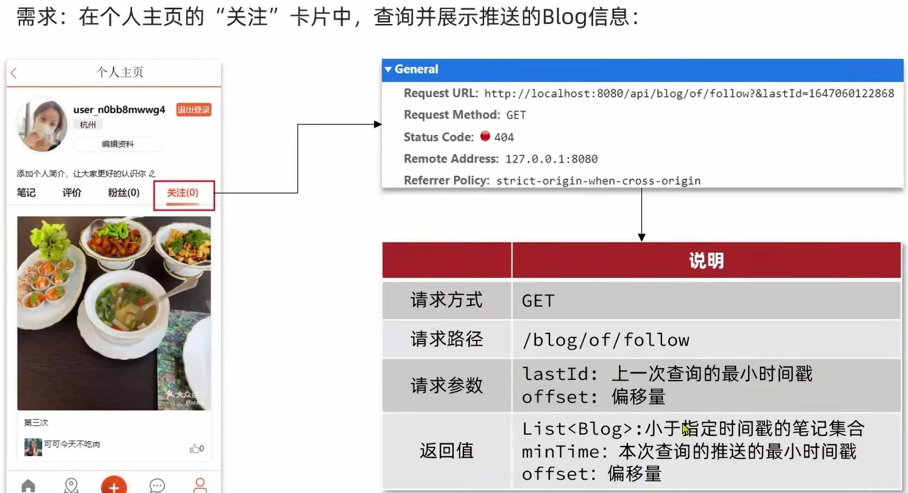

---

### 9.3.3. 实现滚动分页查询收件箱

---

# 10. 附近商户

## 10.1. GEO 数据结构

---

🔹 **Redis GEO 命令（地理空间索引）**

|   |   |
|---|---|
|命令|功能说明|
|`**GEOADD**`|添加一个地理空间成员（member），参数：经度（longitude）、纬度（latitude）、值（member）|
|`**GEODIST**`|计算两个指定成员之间的距离（默认单位：米）|
|`**GEOHASH**`|将指定成员的经纬度坐标转换为 Geohash 字符串并返回|
|`**GEOPOS**`|返回一个或多个成员的经纬度坐标（数组形式）|
|`**GEORADIUS**`|_（已废弃于 Redis 6.2+）_ 指定圆心（经度、纬度）与半径，查找该圆内所有成员，并按距圆心距离排序返回|
|`**GEOSEARCH**`|_（Redis 6.2+ 新增）_ 在指定范围内搜索成员；支持圆形或矩形区域；结果按距中心点距离排序返回|
|`**GEOSEARCHSTORE**`|_（Redis 6.2+ 新增）_ 与 `GEOSEARCH`<br><br>功能一致，但可将结果存储到指定 key 中|

**补充说明**：

- `GEO` 是 `Geolocation` 的缩写，用于存储和查询基于经纬度的地理位置数据；
- Redis 3.2 起支持 GEO，底层使用 **Geohash 编码** 实现空间索引；
- `GEORADIUS` 和 `GEOSEARCH` 可指定单位（如 `m`, `km`, `ft`, `mi`）；
- `GEOSEARCH` 支持更灵活的形状（如矩形 `BOX`）和排序/分页参数。

---

## 10.2. 附近商户搜索

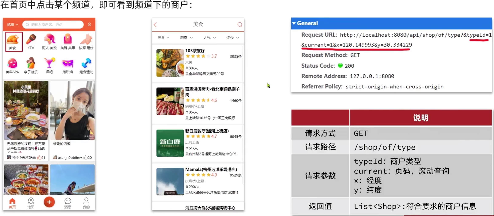

按照商户类型做分组，类型相同的商户作为同一组，以typeId为key存入同一个GEO集合中即可


---

# 11. 用户签到

## 11.1. BitMap 用法

我们按月来统计用户签到信息签到记录为 1，未签到则记录为 0

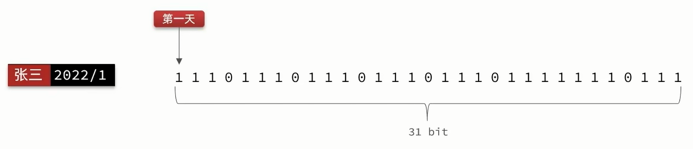

把每一个 bit 位对应当月的每一天，形成了映射关系。用 0 和 1 标示业务状态，这种思路就称为位图（BitMap）。

**Redis** 中是利用 **string** 类型数据结构实现 **BitMap**，因此最大上限是 512 MB，转换为 bit 则是 (2^{32}) 个 bit 位。

BitMap的操作命令有：  
**SETBIT**：向指定位置（offset）存入一个0或1  
**GETBIT**：获取指定位置（offset）的bit值  
**BITCOUNT**：统计BitMap中值为1的bit位的数量  
**BITFIELD**：操作（查询、修改、自增）BitMap中bit数组中的指定位置（offset）的值  
**BITFIELD_RO**：获取BitMap中bit数组，并以十进制形式返回  
**BITOP**：将多个BitMap的结果做位运算（与、或、异或）  
**BITPOS**：查找bit数组中指定范围内第一个0或1出现的位置

---

## 11.2. 签到功能

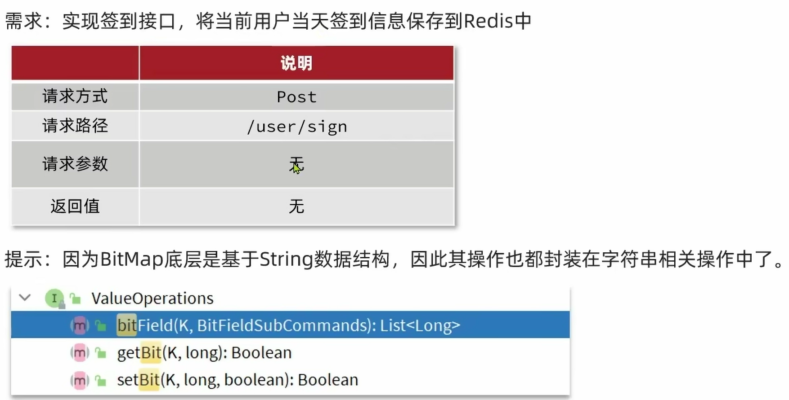

```
@Override
public Result sign() {
    //1.获取当前登录用户
    Long userId = UserHolder.getUser().getId();
    //2.获取日期
    LocalDateTime now = LocalDateTime.now();
    //3.拼接key
    String keySuffix = now.format(DateTimeFormatter.ofPattern(":yyyyMM"));
    String key = USER_SIGN_KEY + userId + keySuffix;
    //4.获取今天是本月的第几天
    int dayOfMonth = now.getDayOfMonth();
    //5.写入Redis SETBIT key offset 1
    stringRedisTemplate.opsForValue().setBit(key,dayOfMonth - 1, true );
    return Result.ok();
}
```

---

## 11.3. 签到统计

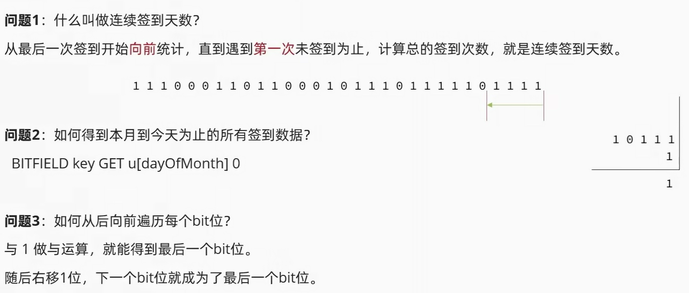

---

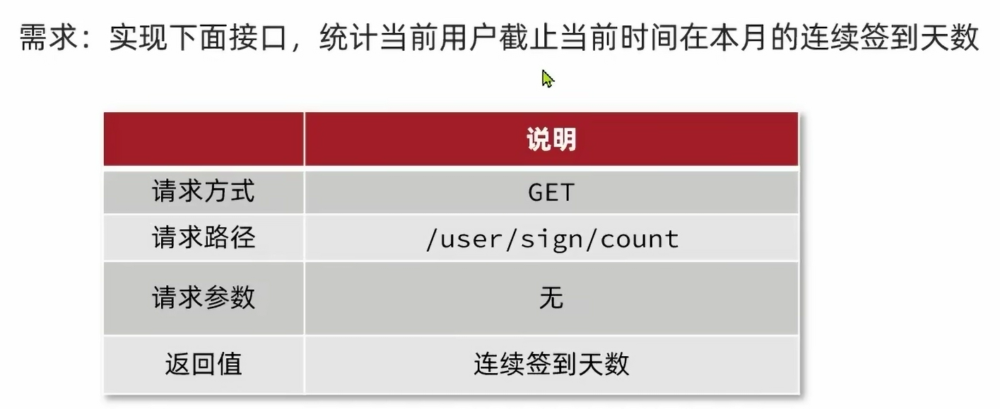

```
@Override
    public Result signCount() {
        //1.获取当前登录用户
        Long userId = UserHolder.getUser().getId();
        //2.获取日期
        LocalDateTime now = LocalDateTime.now();
        //3.拼接key
        String keySuffix = now.format(DateTimeFormatter.ofPattern(":yyyyMM"));
        String key = USER_SIGN_KEY + userId + keySuffix;
        //4.获取今天是本月的第几天
        int dayOfMonth = now.getDayOfMonth();
        //5.获取本月截止今天连续签到的天数，返回的是一个十进制的数字
        List<Long> result = stringRedisTemplate.opsForValue().bitField(
                key,
                BitFieldSubCommands.create()
                        .get(BitFieldSubCommands.BitFieldType.unsigned(dayOfMonth)).valueAt(0)
        );
        if (result == null || result.isEmpty()){
            //没有任何签到结果
            return Result.ok(0);
        }
        Long num = result.get(0);
        if (num == null || num == 0){
            return Result.ok(0);
        }
        int count = 0;
        //6.循环遍历
        while (true){
            if ((num & 1) == 0){
                //0 表示未签到
                break;
            }else {
                //1 表示已签到
                count++;
            }
            //签到数+1
            num = num >> 1;
        }
        return Result.ok(count);
    }
```

---

# 12. UV统计

## 12.1. HyperLogLog 用法

首先要搞懂两个概念：

- **UV**：全称**U**nique **V**isitor，也叫独立访客量，是指通过互联网访问、浏览这个网页的自然人。1天内同一个用户多次访问该网站，只记录1次。
- **PV**：全称**P**age **V**iew，也叫页面访问量或点击量，用户每访问网站的一个页面，记录1次PV，用户多次打开页面，则记录多次PV。往往用来衡量网站的流量。

**Hyperloglog(HLL)**是从**Loglog**算法派生的概率算法，用于确定非常大的集合的基数，而不需要存储其所有值。相关算法原理大家可以参考：[https://juejin.cn/post/6844903785744056333#heading-0](https://juejin.cn/post/6844903785744056333#heading-0)  
**Redis**中的HLL是基于**string**结构实现的，单个HLL的内存永远小于16kb，内存占用低的令人发指！作为代价，其测量结果是概率性的，有小于0.81%的误差。不过对于UV统计来说，这完全可以忽略。

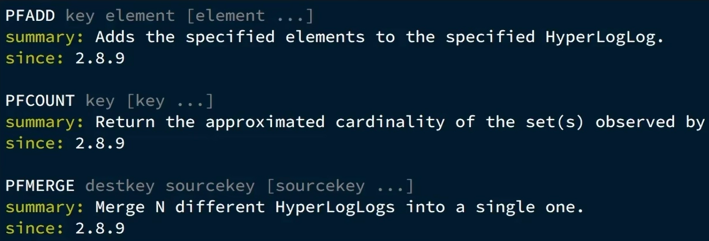

---

## 12.2. 实现 UV 统计

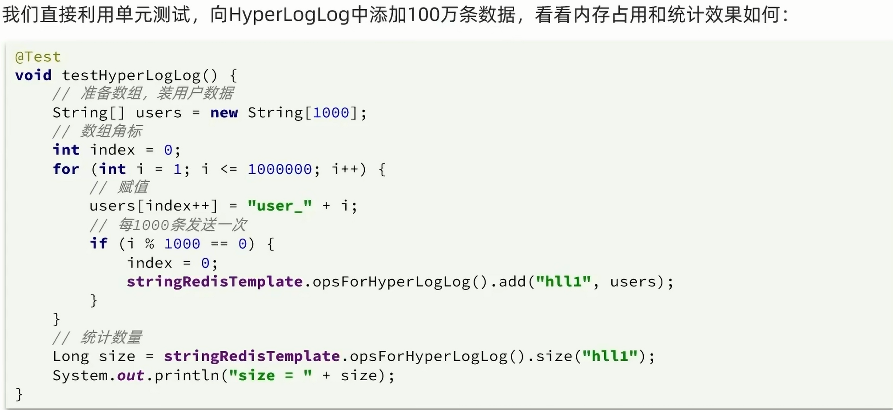

---

04月13日完成黑马点评项目

---

## 🔗 关联笔记
- [[Redis笔记]]
- [[数据库与中间件]]
- [[《黑马点评》项目学习笔记]]
