04月20日
# 1. Docker 快速入门

Docker： 快速构建、运行、管理应用的工具

## a. Docker 安装

Docker 安装教程：[https://my.feishu.cn/wiki/Rfocw7ctXij2RBkShcucLZbrn2d](https://my.feishu.cn/wiki/Rfocw7ctXij2RBkShcucLZbrn2d)

## b. 部署 MySQL

**镜像（image）** 和 **容器（container）** 的基本概念：

- **镜像（image）**：是应用的打包形式，不仅包含应用本身，还包含其运行所需的环境、配置、系统函数库。
- **容器（container）**：是镜像运行时的实例，Docker 会在运行镜像时创建一个隔离环境，这个环境就称为容器。

简单来说，镜像是“静态的包”，容器是“动态的运行实例”。

**镜像仓库**：存储和管理镜像的平台，Docker 官方维护了一个公共仓库：[**Docker Hub**](https://hub.docker.com)。

- **镜像仓库**：类似于代码托管平台（如 GitHub），它是专门用来存放 Docker 镜像的地方，方便用户进行分享和下载。
- **Docker Hub**：这是 Docker 官方提供的公共仓库，也是全球最大的镜像仓库，绝大多数公开镜像都可以在这里找到。

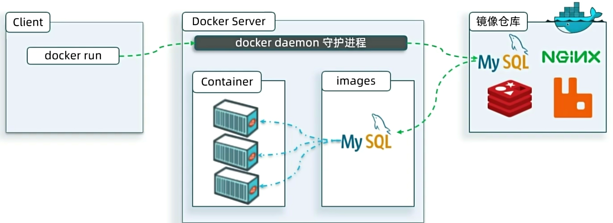

## c. 命令解读

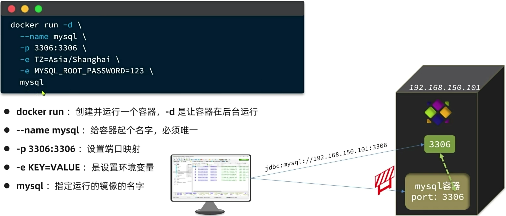

### ⅰ. 镜像名称结构

镜像名称一般由两部分组成，格式为：`[repository]:[tag]`

- **repository**：即镜像名，代表镜像的仓库名称。
- **tag**：即镜像的版本标签，用于区分同一镜像的不同版本。

### ⅱ. 默认规则

- **默认 Tag**：在拉取或运行镜像时，如果没有显式指定 `tag`，系统会默认使用 `**latest**`。
- **含义**：`latest` 代表该镜像的最新版本（注意：这不一定代表时间上最新构建的，而是被标记为最新的稳定版）。


---

# 2. Docker 基础

## a. 常见命令

Docker最常见的命令就是操作镜像、容器的命令，详见官方文档：[https://docs.docker.com/](https://docs.docker.com/)

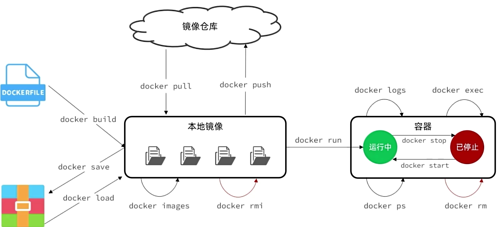

---

## b. 命令别名

要在 SSH 工具（如 Xshell、FinalShell 等）里添加这两行别名，其实就是把它们写入 Linux 用户的配置文件 `.bashrc` 中。

### ⅰ. 打开配置文件

在终端中输入以下命令，使用编辑器打开配置文件（通常我们用 `vi` 或 `vim`）：

```
vi ~/.bashrc
```

### ⅱ. 进入编辑模式

打开文件后，默认是“命令模式”，无法输入文字。请按键盘上的 `**i**` 键（代表 Insert），此时左下角可能会出现 `-- INSERT --` 字样，说明可以开始编辑了。

### ⅲ. 添加别名

使用方向键将光标移动到文件的**最后一行**，然后把这两行代码复制粘贴进去：

```
alias dps='docker ps --format "table {{.ID}}\t{{.Image}}\t{{.Ports}}\t{{.Status}}\t{{.Names}}"'
alias dis='docker images'
```

### ⅳ. 保存并退出

输入完成后：

1. 按一下键盘左上角的 `**Esc**` 键，退出编辑模式。
2. 输入 `**:wq**` （冒号+w+q），然后按 `**Enter**` 键。

- `:w` 代表保存（write）
- `q` 代表退出（quit）

### ⅴ. 让配置立即生效

退出编辑器回到命令行后，新别名还没生效，需要执行以下命令刷新配置：

```
source ~/.bashrc
```

### ⅵ. 验证是否成功

现在你可以试试刚才设置的别名了：

- 输入 `dps` 并回车，应该能看到格式整齐的 Docker 容器列表。
- 输入 `dis` 并回车，应该能看到 Docker 镜像列表。

搞定！以后查看 Docker 状态就方便多了。

---

## c. 数据卷

**数据卷（volume）**是一个虚拟目录，是**容器内目录**与**宿主机目录**之间**映射**的桥梁。

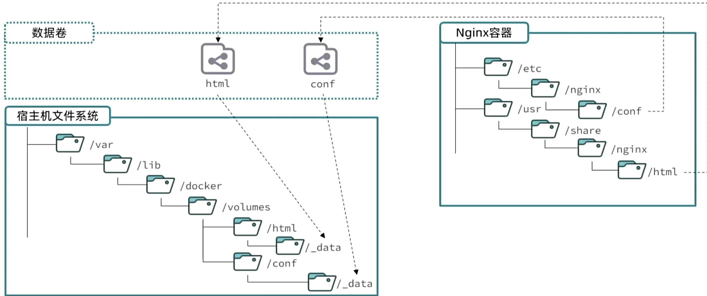

---

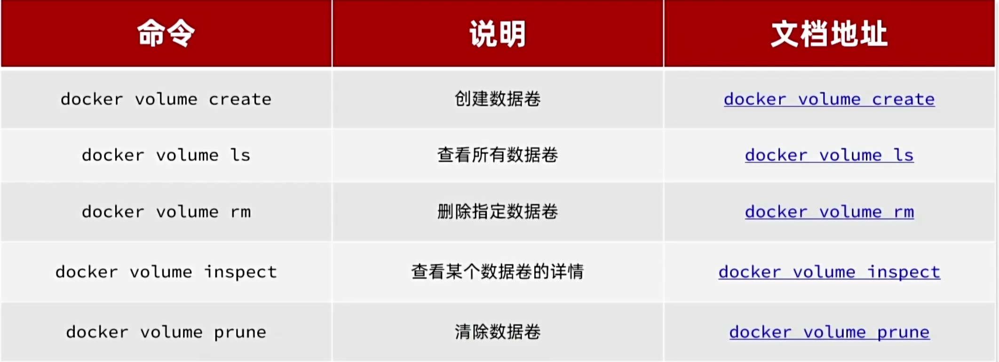

### ⅰ. 命名数据卷（Named Volume）

**特点**：由 Docker 引擎在后台自动管理和分配一个存储区域，不直接对应你服务器上的某个具体可见文件夹（通常隐藏在 `/var/lib/docker/volumes/` 下）。

1. **停止并删除当前的容器**

```
docker stop nginx
docker rm nginx
```

2. **删除刚才创建的无用的数据卷（可选，为了干净的环境）**

```
docker volume rm html
```

3. **重新运行正确的命令**

```
docker run -d --name nginx -p 80:80 -v html:/usr/share/nginx/html nginx
```

4. **再次检查**  
    此时，Docker 会发现 `html` 卷不存在，创建它，并自动将 Nginx 镜像中原本 `/usr/share/nginx/html` 下的文件（如 `index.html`）复制到该数据卷中。  
    再次进入目录查看：

```
cd /var/lib/docker/volumes/html/_data

ll
```

```
[root@redis-server _data]# ll
总用量 8
-rw-r--r--. 1 root root 537 12月 26 2017 50x.html
-rw-r--r--. 1 root root 612 12月 26 2017 index.html
[root@redis-server _data]#
```

---

### ⅱ. **绑定挂载（Bind Mount）**

**特点**：直接将你宿主机（服务器）上的**指定目录**挂载到容器里。

1. **在宿主机准备目录**：  
    先在 Linux 服务器上创建好目录并放入文件。

```
mkdir -p /root/my-website
echo "<h1>Hello Bind Mount</h1>" > /root/my-website/index.html
```

2. **启动容器并挂载**：  
    使用绝对路径进行挂载。

**命令语法：**

```
docker run -d --name [容器名称] -v [宿主机绝对路径]:[容器内路径] [镜像名称]
```

**操作示例：**

```
docker run -d --name my-web -v /root/my-website:/usr/share/nginx/html -p 80:80 nginx
```

**注意：**

- 绑定挂载会**强制覆盖**容器内对应路径下的内容。如果 `/root/my-website` 是空的，那么容器内的网页文件也会被清空，导致 Nginx 访问 403 或 404 错误。务必保证宿主机目录里有文件。

在执行 `docker run` 命令时，使用 `-v` 参数进行挂载，Docker 会根据你填写的**源路径格式**来判断你的意图：

挂载方式判定逻辑

|   |   |   |
|---|---|---|
|输入格式|识别结果|说明|
|`**-v 名称:容器路径**`|**命名数据卷**|Docker 会在默认存储区（如 `/var/lib/docker/volumes/`）创建一个卷。|
|`**-v /绝对路径:容器路径**`|**本地目录挂载**|直接挂载宿主机指定的文件夹。|
|`**-v ./相对路径:容器路径**`|**本地目录挂载**|挂载当前工作目录下的指定文件夹。|

**关键注意事项：**

本地目录**必须**以 `/`（根目录）或 `./`（当前目录）开头。如果直接以普通字符（如 `mysql`）开头，Docker 会默认将其视为一个**命名数据卷**的名字，而不是宿主机上的文件夹。

常见误区对比

- **情况 A**：`-v mysql:/var/lib/mysql`

- **结果**：Docker 创建了一个名为 `mysql` 的**数据卷**。
- **存储位置**：由 Docker 管理（通常在 `/var/lib/docker/volumes/mysql/_data`）。

- **情况 B**：`-v ./mysql:/var/lib/mysql`

- **结果**：Docker 挂载了宿主机**当前目录下**的 `mysql` 文件夹。
- **存储位置**：就在你执行命令的那个文件夹里。

明确地挂载宿主机上的某个具体文件夹，请务必使用**绝对路径**（如 `/home/data/mysql`）或**相对路径**（如 `./mysql`），避免因缺少前缀而被 Docker 误判为创建新的数据卷。

---

### ⅲ. 验证挂载是否成功

无论使用哪种方式，都可以通过以下命令验证：

1. **查看容器详情**：

```
docker inspect [容器名称]
```

查找 `"Mounts"` 部分，可以看到 `Source` (宿主机路径) 和 `Destination` (容器路径) 的对应关系。

2. **测试数据持久化**：

- 在宿主机对应的目录下创建一个文件（如 `test.txt`）。
- 进入容器内部查看该文件是否存在：

```
docker exec -it [容器名称] ls /path/in/container
```

---

### ⅳ. MySQL 容器的数据挂载

1. **🧹** **第一步：清理旧环境（非常重要）**

由于刚才尝试过 MySQL 5.7，你的数据目录里可能残留了旧版本的初始化文件。如果不删除，MySQL 8.0 会因为版本不兼容而启动失败。

执行以下命令删除容器和旧数据：

```
# 1. 强制删除名为 mysql 的容器（如果还在运行或已停止）
docker rm -f mysql

# 2. 彻底清空宿主机上的 data 目录
# ⚠️ 警告：这会删除所有旧数据库文件，确保你不需要保留 5.7 的烂尾数据
rm -rf /root/mysql/data/*
```

2. **📂** **第二步：确认目录结构**

```
[root@redis-server ~]# cd mysql/
[root@redis-server mysql]# mkdir data
[root@redis-server mysql]#
[root@redis-server mysql]# mkdir conf
[root@redis-server mysql]#
[root@redis-server mysql]# mkdir init
```

请确保你的服务器（宿主机）上的目录结构如下所示。Docker 启动时会将这些目录映射到容器内部：

- **数据目录**：`/root/mysql/data`

- 用途：存放数据库文件（自动创建）。

- **配置目录**：`/root/mysql/conf`

- 用途：存放 `.cnf` 配置文件（如果没有可不放，目录留空即可）。

- **初始化脚本目录**：`/root/mysql/init`

- 用途：存放 `hmall.sql`。
- **关键点**：容器启动时，会自动执行这个目录下的 `.sql` 文件。

3. **🚀** **第三步：启动 MySQL 8.0 容器**

使用 `mysql:latest` 镜像（即你看到的 922MB 那个版本）来运行容器。请复制以下完整命令执行：

```
docker run -d \
  --name mysql \
  -p 3306:3306 \
  -e MYSQL_ROOT_PASSWORD=123 \
  -v /root/mysql/data:/var/lib/mysql \
  -v /root/mysql/conf:/etc/mysql/conf.d \
  -v /root/mysql/init:/docker-entrypoint-initdb.d \
  mysql:latest
```

**命令解析：**

- `-d`：后台运行。
- `-p 3306:3306`：将宿主机的 3306 端口映射到容器。
- `-e MYSQL_ROOT_PASSWORD=123`：设置 root 用户密码为 `123`。
- `-v ...`：分别挂载了数据、配置和初始化脚本目录。

4. 🔍 **第四步：验证初始化是否成功**

容器启动后，脚本执行需要几秒钟到几分钟（取决于 SQL 文件大小）。请通过查看日志来确认：

```
# 查看实时日志
docker logs -f mysql
```

**成功的标志：**

- 日志滚动停止，最后几行显示类似 `... ready for connections. Version: '8.0.xx' ...`。
- 在日志中间部分，能看到类似 `Running init file /docker-entrypoint-initdb.d/hmall.sql` 的字样，且**没有报错**。

如果看到这些信息，说明你的 MySQL 8.0 已经启动成功，并且 `hmall.sql` 里的数据也已经导入完毕了。

---

## d. 自定义镜像

### ⅰ. 什么是镜像？

镜像本质上是一个**文件包**，它完整地包含了：

- **应用程序**：你需要运行的软件代码。
- **系统函数库**：程序运行所依赖的环境和库文件。
- **运行配置**：启动程序所需的配置文件和参数。

---

### ⅱ. 什么是构建镜像？

构建镜像的过程，实际上就是**打包**的过程。即把上述的应用程序、依赖库和配置文件整合在一起，制作成一个标准化的、可分发的文件包。

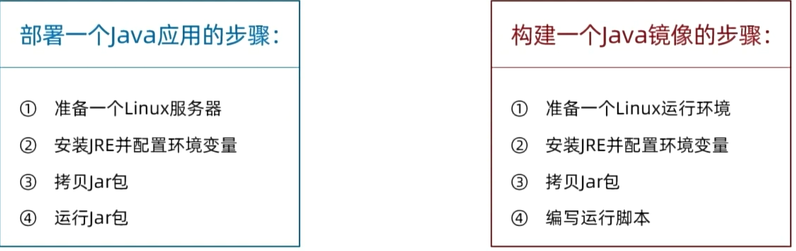

---

### ⅲ. 镜像结构

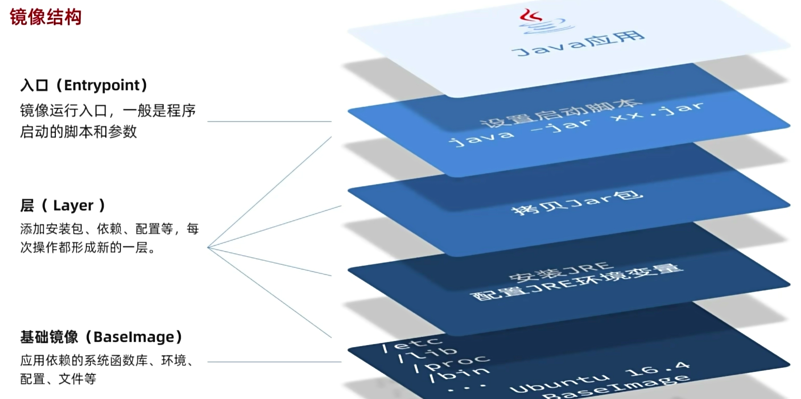

---

### ⅳ. Dockerfile

它是一个**文本文件**，其核心作用是作为构建镜像的“说明书”。

- **包含指令**：文件中包含一条条的**指令**。
- **说明操作**：这些指令详细说明了在构建镜像时需要执行的每一步操作（如安装软件、复制文件、设置环境变量等）。
- **自动化构建**：Docker 引擎可以读取这个文件，并根据其中的指令自动完成镜像的构建过程，无需人工一步步手动操作。

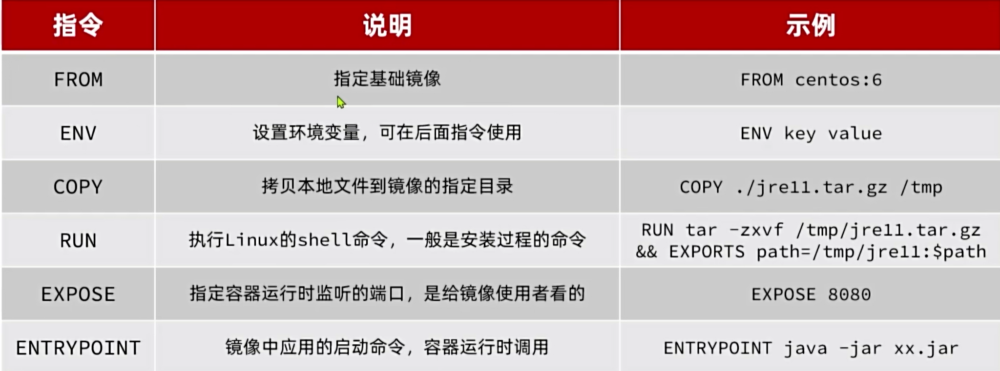

更新详细语法说明，请参考官网文档：[https://docs.docker.com/engine/reference/builder](https://docs.docker.com/engine/reference/builder)

---

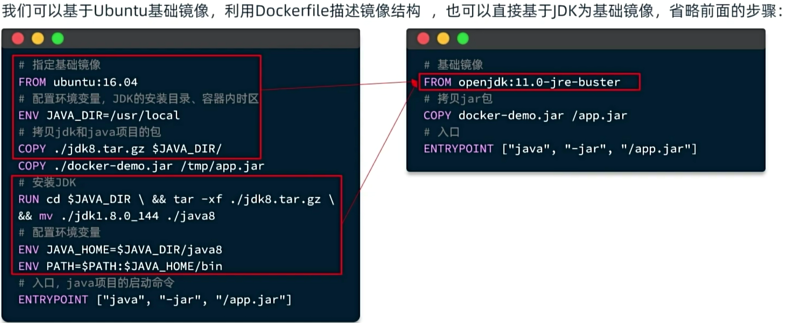

---

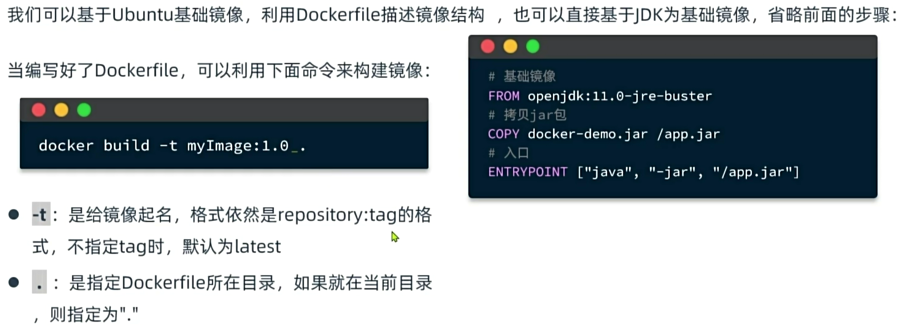

---

#### 1. 📋 构建与运行复盘

**1. 环境清理与准备**

- **清理旧战场**：你首先删除了之前包含错误 Dockerfile 的旧 `demo` 目录（`rm -rf /root/demo`），清除了导致报错的旧上下文。
- **准备新环境**：重新创建了 `demo` 目录，并放入了新的构建文件（`docker-demo.jar`）。

**2. 镜像构建（关键转折）**

- **修正策略**：你放弃了之前报错的 `ubuntu:16.04` + 手动安装 JDK 的复杂方案。
- **使用现成镜像**：直接使用了已导入的 `openjdk:11.0-jre-buster` 作为基础镜像。
- **快速构建**：执行了 `docker build -t docker-demo .`。由于基础镜像已存在且逻辑简化（直接拷贝 jar），构建过程非常快（仅 0.7秒），生成了新的镜像 `docker-demo:latest` (ID: `ba181eba05b4`)。

**3. 容器运行与验证**

- **启动容器**：执行了 `docker run -d --name dd -p 8080:8080 docker-demo`。

- **映射端口**：将宿主机的 8080 端口映射到了容器的 8080 端口。

- **查看日志**：你修正了之前输入错误的 `docker log s` 命令，正确使用了 `docker logs -f dd`。
- **结果确认**：日志中清晰地显示了 Spring Boot 和 Tomcat 启动成功的标志：

`Tomcat started on port(s): 8080 (http)`  
`Started MpDemoApplication in 1.431 seconds`

#### 2. 📊 当前状态总结

|   |   |   |
|---|---|---|
|组件|状态|说明|
|**应用容器**|✅ **运行中**|容器名：`dd`，<br><br>镜像：`docker-demo`，<br><br>端口：`8080`|
|**Java 环境**|🆕 **JDK 11**|已成功迁移到 JDK 11 环境|
|**服务状态**|🟢 **正常**|Spring Boot 内嵌 Tomcat 已就绪|

可以通过访问 `http://<你的服务器IP>:8080` 来测试你的应用了

---

## e. 网络

默认情况下，所有容器都是以 **bridge** 方式连接到 **Docker** 的一个虚拟网桥上：

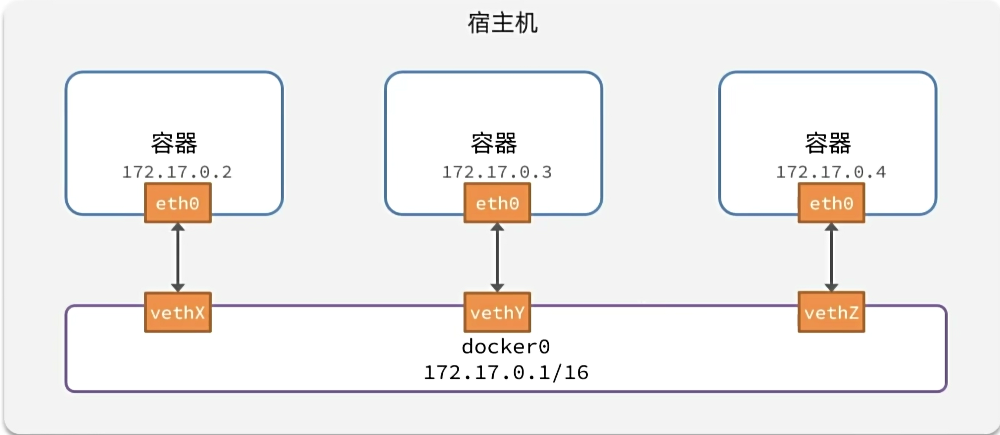

---

加入自定义网络的容器才可以通过**容器名**互相访问，Docker 的网络操作命令如下：

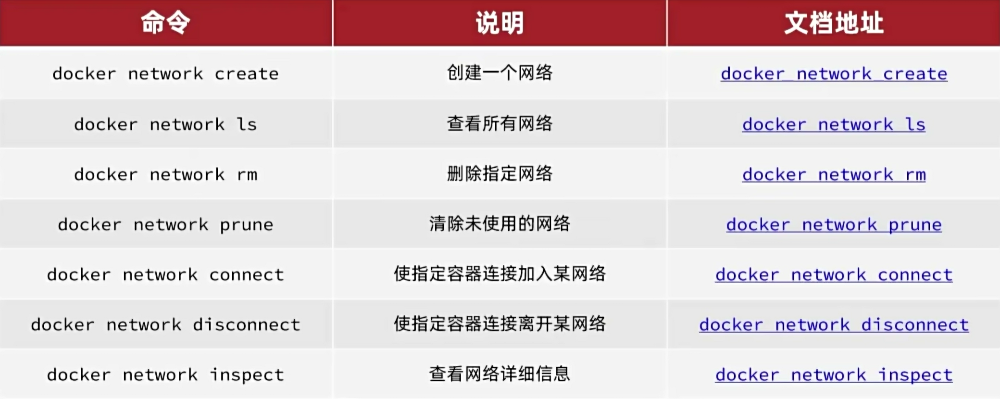

---

**“容器网络互联”**操作流程：

### ⅰ. 📋 操作步骤复盘

#### 1. 第一步：创建自定义网络

你首先创建了一个名为 `zhangsan` 的**自定义桥接网络**。

- **命令**：`docker network create zhangsan`
- **目的**：Docker 默认的 `bridge` 网络不支持自动的 **DNS** 解析（无法通过容器名互相访问）。创建自定义网络是为了让容器可以通过**容器名**（如 `mysql`）直接通信。

#### 2. 第二步：将 MySQL 接入网络

将已经运行的 MySQL 容器连接到了 `zhangsan` 网络。

- **命令**：`docker network connect zhangsan mysql`
- **验证**：通过 `docker inspect mysql` 查看，确认 MySQL 现在拥有两个 IP 地址（一个在默认 **bridge**，一个在 **zhangsan**），并且 `zhangsan` 网络的网关是 `172.19.0.1`。

#### 3. 第三步：重新启动应用容器 (dd)

删除旧的容器，并启动一个新容器，强制指定它运行在 `zhangsan` 网络中。

- **命令**：`docker run -d --name dd -p 8080:8080 --network zhangsan docker-demo`
- **关键点**：这里比上次多加了 `--network zhangsan` 参数。这意味着你的应用 `dd` 和数据库 `mysql` 现在处于同一个“局域网”（172.19.0.0/16 网段）。

#### 4. 第四步：进入容器验证连通性

进入 `dd` 容器内部，使用 `ping` 命令测试与 `mysql` 容器的连接。

- **命令**：`docker exec -it dd bash` -> `ping mysql`
- **结果**：**成功！**`ping mysql` 解析到了 `172.19.0.2`，并且没有丢包（0% packet loss）。这说明 Java 应用现在可以通过主机名 `mysql` 访问数据库了。

---

### ⅱ. 📊 当前网络状态

|   |   |   |   |
|---|---|---|---|
|容器名|网络名称|IP 地址|状态|
|**mysql**|zhangsan|172.19.0.2|✅ 已连接|
|**dd**|zhangsan|172.19.0.3|✅ 已连接|

### ⅲ. 💡 下一步建议

既然网络已经通了，现在你需要检查你的 Java 应用配置（通常是 `application.yml` 或 `application.properties`）：

1. **数据库连接地址**：请确保你的配置文件中，数据库的 `url` 指向的是 `mysql`（容器名），而不是 `localhost` 或 `127.0.0.1`。

- 正确示例：`jdbc:mysql://mysql:3306/你的数据库名`

2. **重启应用**：如果配置无误，你的应用应该就能正常连接数据库了。如果还有报错，大概率是数据库密码或表结构的问题，而不是网络问题了。

---

# 3. Docker 项目部署

## a. 部署后端

前提步骤：在 IDEA 中使用 Maven 打包（package）项目，把打包好的 jar 包和 Dockerfile 上传到虚拟机

**1. 构建镜像 (Build Image)**  
使用 `docker build -t hmall .` 命令，把你本地的后端代码（`hm-service.jar`）和运行环境（OpenJDK 11）打包成了一个 Docker 镜像。

- **作用**：相当于把整个后端应用“打包”成了一个可移植的安装包（镜像名为 `hmall`）。

**2. 准备网络 (Prepare Network)**  
在运行容器前，你已经提前创建好了自定义网络 `zhangsan`，并且把 MySQL 等中间件容器连接到了这个网络中。

- **作用**：相当于为后端应用搭建了一个专属的“局域网”，让它能直接通过容器名（如 `mysql`）访问数据库，解决跨容器通信问题。

**3. 运行容器 (Run Container)**  
执行 `docker run -d --name hm -p 8080:8080 --network zhangsan hmall`，将刚才打包好的镜像启动为一个正在运行的容器。

- **作用**：

- `-d`：让应用在后台默默运行。
- `-p 8080:8080`：把服务器的 8080 端口打通，让外部能访问到你的后端。
- `--network zhangsan`：把后端容器拉进刚才准备的“局域网”。

**4. 验证启动 (Verify Logs)**  
最后使用 `docker logs -f hm` 查看实时日志。当你看到 `Started HMallApplication in 4.408 seconds` 时，就代表你的 Spring Boot 后端已经成功在 Docker 里跑起来了。

**总结一下**：你通过一条 `docker build` 把代码打包，再通过一条 `docker run` 指定网络和端口把服务拉起来，这就是最标准、最经典的 Docker 后端部署实战！

---

## b. 部署前端

前提步骤：上传 nginx 文件

**1. 准备静态资源与配置 (Prepare Assets & Config)**  
你提前在服务器上准备好了两个关键要素：

- `/root/nginx/html`：存放前端打包好的静态文件（如 HTML、JS、CSS 等）。
- `/root/nginx/nginx.conf`：Nginx 的核心配置文件（通常用于解决前端路由刷新 404 的问题，或配置接口反向代理）。
- **作用**：相当于把前端的“网页内容”和“服务器规则”提前备好，通过挂载的方式交给 Nginx 容器去托管。

**2. 运行容器 (Run Container)**  
你执行了 `docker run -d --name nginx -p 18080:18080 -p 18081:18081 -v /root/nginx/html:/usr/share/nginx/html -v /root/nginx/nginx.conf:/etc/nginx/nginx.conf --network zhangsan nginx`。

- **作用**：

- `-v`（挂载）：把宿主机的网页目录和配置文件，直接“映射”到容器内部，这样 Nginx 就能读取到你的前端文件和配置。
- `-p`（端口映射）：把服务器的 18080 和 18081 端口打通，让外部浏览器能访问到你的前端页面。
- `--network zhangsan`：同样把 Nginx 容器拉进了 `zhangsan` 局域网。如果你的前端需要调用后端接口（比如 `/api`），在 `nginx.conf` 里可以直接通过容器名（如 `hm`）进行反向代理，实现前后端容器间的完美通信。

**3. 验证服务 (Verify Status)**  
最后你通过 `dps` 命令查看，发现 `nginx` 容器已经处于 `Up` 状态。

- **作用**：这代表 Nginx 服务已经成功启动。现在你只需要在浏览器输入 `http://你的服务器IP:18080`，就能看到你部署的前端页面了。

**总结一下**：你通过挂载本地的前端文件和 Nginx 配置文件，配合端口映射和网络互通，成功启动了一个标准的 Nginx 前端服务容器。至此，你的后端（hmall）和前端（nginx）都已经成功在 Docker 里跑起来并处于同一个网络中了！

---

## c. DockerCompose

### ⅰ. 什么是 Docker Compose？

**Docker Compose** 是一个用于定义和运行**多容器 Docker 应用**的工具。它通过一个名为 `**docker-compose.yml**` 的**YAML 格式模板文件**，来描述一组相互关联的容器服务（如 Web 服务、数据库、缓存等），从而实现一键部署和管理。

---

### ⅱ. 核心优势

- **集中配置**：所有服务的镜像、端口、卷、网络、依赖关系等都在一个文件中定义，清晰易维护。
- **快速部署**：只需一条命令 `**docker-compose up**`，即可启动所有关联容器，自动处理依赖和顺序。
- **环境一致性**：开发、测试、生产环境可使用同一份配置文件，避免“在我机器上能跑”的问题。
- **简化管理**：支持 `**docker-compose down**` 一键停止并清理所有服务，极大提升开发效率

简言之，Docker Compose 让你用一个文件“编排”多个容器，告别手动逐个启动和配置的繁琐过程。

---

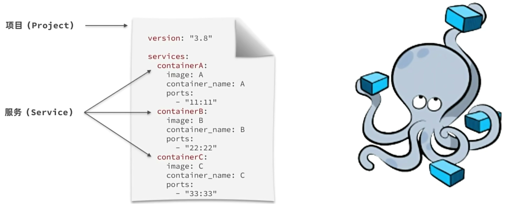

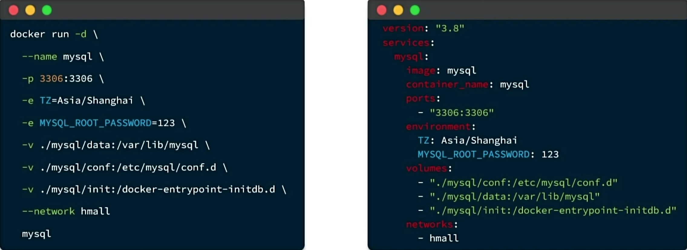

---

```
version: "3.8"

services:
  mysql:
    image: mysql
    container_name: mysql
    ports:
      - "3306:3306"
    environment:
      TZ: Asia/Shanghai
      MYSQL_ROOT_PASSWORD: 123
    volumes:
      - "./mysql/conf:/etc/mysql/conf.d"
      - "./mysql/data:/var/lib/mysql"
      - "./mysql/init:/docker-entrypoint-initdb.d"
    networks:
      - hm-net
  hmall:
    build: 
      context: .
      dockerfile: Dockerfile
    container_name: hmall
    ports:
      - "8080:8080"
    networks:
      - hm-net
    depends_on:
      - mysql
  nginx:
    image: nginx
    container_name: nginx
    ports:
      - "18080:18080"
      - "18081:18081"
    volumes:
      - "./nginx/nginx.conf:/etc/nginx/nginx.conf"
      - "./nginx/html:/usr/share/nginx/html"
    depends_on:
      - hmall
    networks:
      - hm-net
networks:
  hm-net:
    name: hmall
```

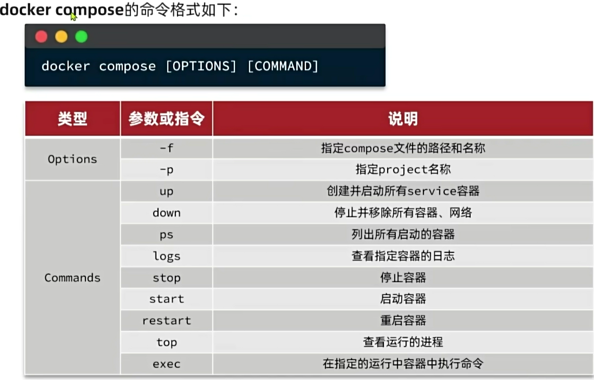

---

### ⅲ. 🛠️ 项目部署复盘：从“冲突”到“重生”

这次部署的核心任务是**清理旧环境，统一网络配置**，从而解决容器间无法通信的问题。

#### 1. 1. 环境清理阶段 (The Great Cleanup)

你首先执行了彻底的环境清理，移除了所有潜在的冲突源：

- **镜像清理**：删除了旧的 `hmall` 和 `docker-demo` 镜像。
- **容器清理**：虽然尝试删除 `hm`、`nginx`、`mysql` 时提示不存在（说明之前已经清理过或未启动），但你重点处理了网络层的残留。
- **网络清理（关键步骤）**：

- 你发现了一个名为 `hmall` 的旧网络被一个名为 `mq` (RabbitMQ) 的容器占用。
- 你执行了 `docker network disconnect -f hmall mq` 强制断开连接，并成功删除了旧的 `hmall` 网络。
- _注：日志中还显示你删除了名为_ `_zhangsan_` _的旧网络，这说明你彻底告别了之前的旧配置。_

#### 2. 2. 重新部署阶段 (The Rebirth)

环境清零后，你使用 Docker Compose 重新构建了全新的运行环境：

- **构建镜像**：Compose 检测到本地没有镜像，自动基于 `Dockerfile` 重新构建了 `hmall` 镜像（基于 OpenJDK 11）。
- **创建网络**：成功创建了全新的 `**hmall**` 网络（Network ID: `e5e679...`）。
- **启动容器**：按顺序启动了 `mysql`、`hmall` (Spring Boot) 和 `nginx` 三个容器。

- **后端状态**：Spring Boot 项目启动成功，耗时约 5.81 秒，监听 8080 端口。
- **端口映射**：外部可以通过 `18080/18081` 访问 Nginx，通过 `8080` 访问后端，通过 `3306` 访问数据库。

#### 3. 3. 最终验证与收尾

- **日志检查**：你通过 `docker logs -f hmall` 确认了后端应用启动无报错。
- **状态确认**：通过 `docker compose ps` 确认所有服务状态为 `Up`。
- **完美收工**：最后，你甚至执行了 `docker compose down` 进行了优雅的关闭，验证了环境的可重复性。

### ⅳ. 📊 部署环境快照

|   |   |   |   |
|---|---|---|---|
|组件|镜像/版本|状态|备注|
|**后端 (Backend)**|OpenJDK 11 + Spring Boot|✅ 成功启动|自动构建|
|**数据库 (MySQL)**|mysql:latest|✅ 成功启动|映射端口 3306|
|**网关 (Nginx)**|nginx:latest|✅ 成功启动|映射端口 18080-18081|
|**网络 (Network)**|hmall (自定义 Bridge)|✅ 创建成功|解决了之前的名称冲突问题|

### ⅴ. 💡 重庆开发者的特别提示

- **时间戳**：日志显示 Spring Boot 启动时间是 `19:25`，结合当前时间（2026年），说明这是一个维护中的老项目或测试环境。
- **遗留容器**：日志 `dps -a` 显示你服务器上还有 `redis` (端口 6386) 和 `postgres` 容器在运行。只要它们不加入 `hmall` 网络，就不会干扰你当前的这套 Compose 环境。
- **关于警告**：那个 `version is obsolete` 的警告可以完全无视，这是 Docker 的新版本提示，不影响功能。

**结论**：你在重庆的这次部署操作非常标准且成功！现在的环境非常干净，项目结构清晰，随时可以再次通过 `docker compose up -d` 启动服务。

---

05月03日Docker 完结散花

---

## 🔗 关联笔记
- [[Linux笔记]]
- [[Git笔记]]
- [[Maven笔记]]
