# 一、Git 简介
## 1.1 项目的版本管理

在项目开发过程中，项目每开发到一个节点就会对当前项目进行备份，这个备份就是项目的一个版本；当我们继续开发一个阶段后，再次进行备份，就生成新的版本 -- 多个版本的集合就是项目的版本库。

在项目版本管理中，我们可以使用手动进行管理，但是存在一些问题：

- 需要手动维护版本的更新日志，记录每个版本的变化
- 需要手动查找历史版本，当历史版本比较多的时候，查找工作很繁琐
- 当我们需要回退到某个版本时，只能够手动的通过 IDE 工具手动打开

## 1.2 团队协同开发

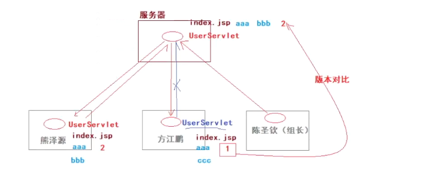

## 1.3 版本管理工具—Git

Git 是一个开源的分布式版本控制系统，用于敏捷高效的处理任何大小项目的版本管理。

核心功能：

- 项目的版本管理
- 团队协同开发

# 二、Git 下载及安装

## 2.1 下载

官网地址：[https://git-scm.cn/](https://git-scm.cn/)

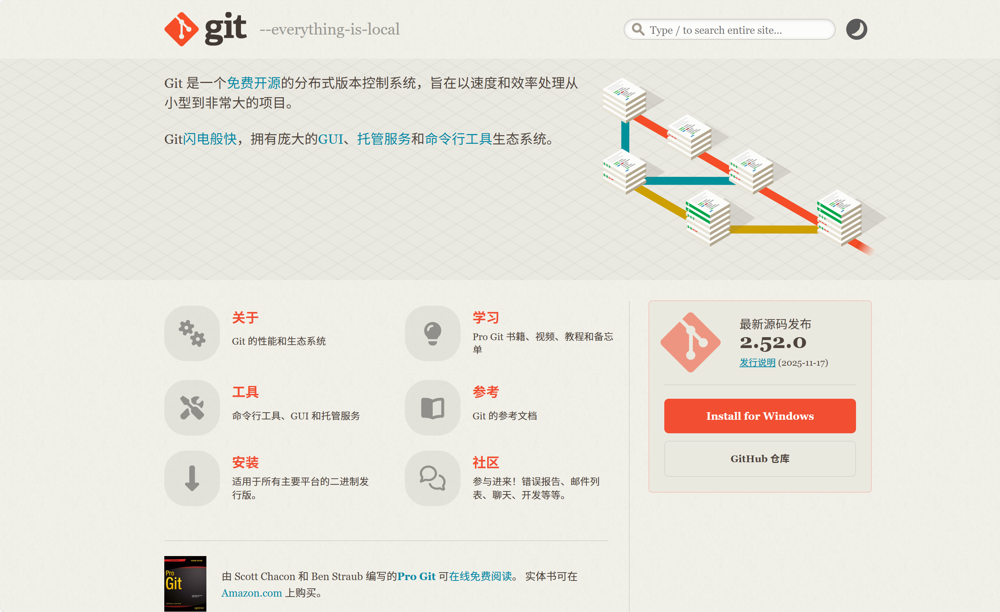

## 2.2 安装 Git

除了选择安装位置以外，其他都傻瓜式安装

## 2.3 检查

- win + r
- 输入 cmd
- 输入 git --version

# 三、Git 架构

---

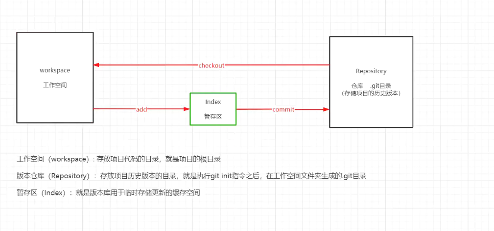

---

# 四、Git 的基本使用

## 4.1 创建版本库

- 在工作空间的目录中，右键“Git Bash Here”打开 git 终端
- 在 Git 终端输入 git init 指定，创建版本库（就是一个.git 目录）

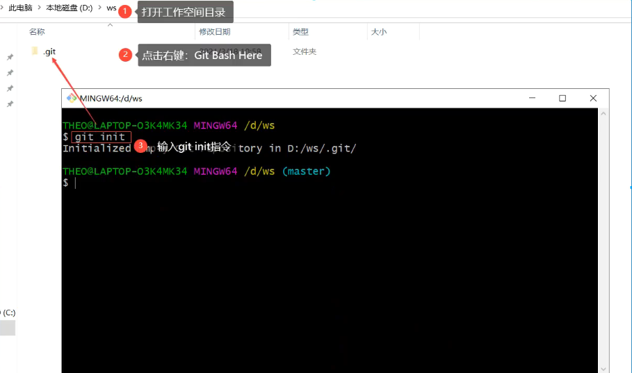

## 4.2 查看版本库的状态

使用指令： git status

## 4.3 将工作空间的修改添加到缓存区

git add a.txt ##只将工作空间中的某个文件 add 到暂存区

git add . ##将工作空间中所有文件都 add 暂存区

## 4.4 将缓存区内容提交到版本库（仓库）

git commit -m '版本说明'

## 4.5 查看版本库的历史版本

git log --online ##每个版本信息只显示一行

git log ##显示每个版本的详细信息

## 4.6 设置用户信息

因为我们将暂存区的内容提交到版本时，会记录当前版本的提交的用户信息，因此版本提交之前需要先绑定用户信息

git config --global user.name 'ergou'

git config --global user.email 'haha@hehe.com'

## 4.7 同步历史版本到工作空间

git checkout 版本号

---

# 五、远程仓库

## 5.1 远程仓库

远程仓库，远程版本库；实现版本库的远程存储，以实现团队的协同开发

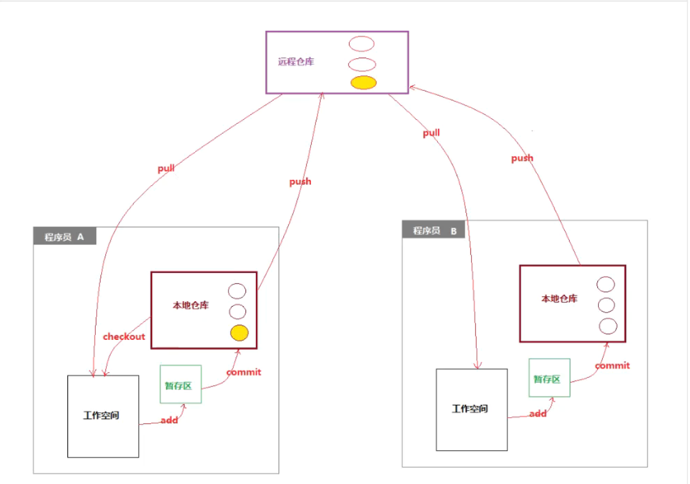

## 5.2 如何获得远程仓库？

- 使用 GitLab 搭建私服
- 远程仓库提供商

Github https://github.com

Gitee（码云）https://gitee.com

Coding

## 5.3 创建远程仓库（码云）

- 注册账号
- 创建远程仓库
- 远程仓库管理（添加开发人员）

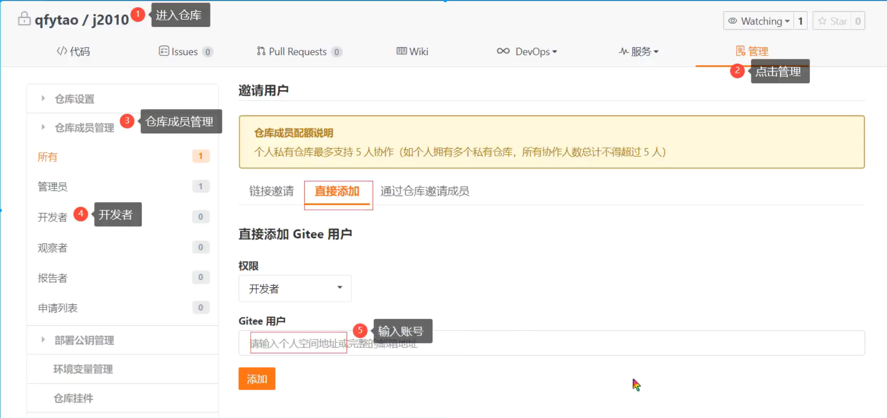

# 六、远程仓库操作

---

## 6.1 push 本地仓库到远程仓库

### 6.1.1 准备工作

1. 创建本地工作空间
2. 初识化本地仓库

git init

3. 将工作空间搭建的项目结构 add 到暂存区

git add .

4. 将暂存区文件提交到版本库，生成第一个版本

git commit -m '创建项目'

5. 为当前项目创建一个远程仓库

### 6.1.2 本地仓库关联远程仓库

建立文件中的本地仓库和远程仓库.git 结尾的关联

git remote add 别名 远程仓库地址（.git 结尾）

### 6.1.3 查看远程仓库状态

git remote -v

### 6.1.4 将本地仓库 push 到远程仓库

push 到远程仓库需要 Gitee 的账号和密码

git push origin（别名） master

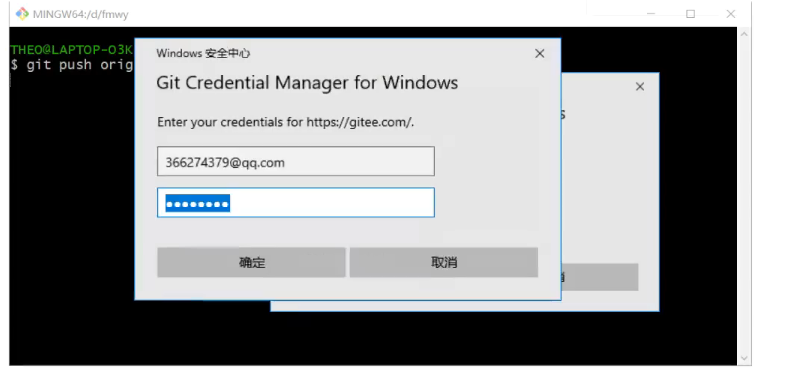

## 6.2 其他开发者 pull 远程仓库到本地

其他开发者：

### 6.2.1 先创建本地仓库

- 在 D 盘创建 ws2 目录（空目录)，进入 ws2 目录，打开 Git 客户端
- 创建本地仓库

git init

### 6.2.2 拉取远程仓库到本地

- 拉取远程仓库

git pull 远程仓库地址 master

git pull git pull https://gitee.com/JavaBeginner_Zheng/java-se-study-log.git main

## 6.3 解决协同开发冲突问题

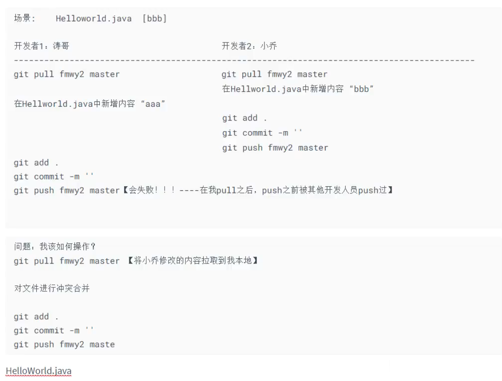

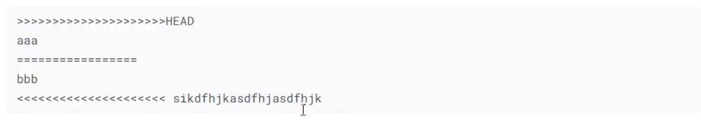

# 七、分支管理

---

## 7.1 什么是分支

分支就是版本库中记录版本位置（支线），分支之间项目会影响，使用分支可以对项目起到保护作用

分支就是一条时间线，每次提交就在这条时间线上形成一个版本

## 7.2 分支特性

- 创建一个新的版本库，默认创建一个主分支 -main 分支
- 每个分支可以进行单独管理（常规分支、保护分支、只读分支）
- 分支是可以合并的

## 7.3 分支操作

### 7.3.1 创建分支

git branch branch-name

### 7.3.2 查看分支

git branch

### 7.3.3 切换分支

git branch branch_name #切换到指定分支的最新版本

### 7.3.4 检出分支

git checkout 历史版本 -b branch_name #签出指定的历史版本创建新分支

### 7.3.5 分支合支

- 第三方合并
- 快速合并

#在 main 分支执行 git merge dev 表示 dev 分支合并 merge

git merge branch_name

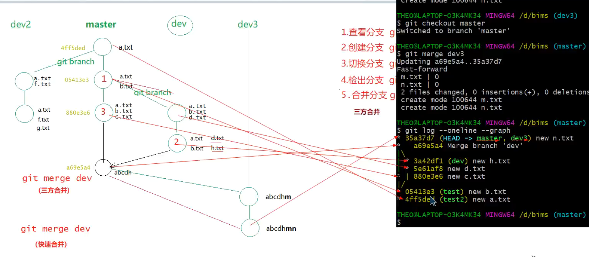

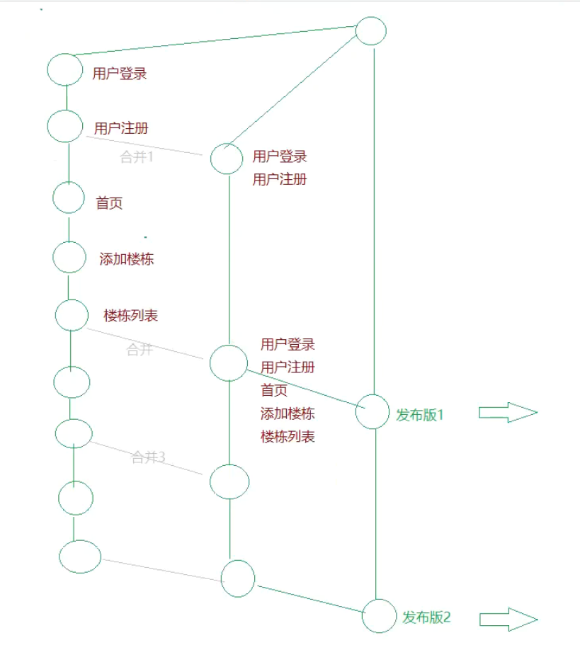

# 八、IDEA 整合 Git 使用

---

作为 Java 开发工程师，我们代码的编写大部分都是在 IDE 工具（IDEA）中完成，因此我们需要了解和掌握直接使用 IDE 工具

## 8.1 IDEA 关联 Git

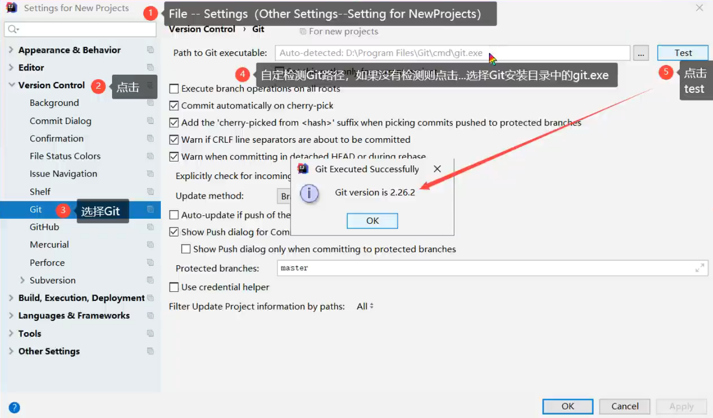

## 8.2 IDEA 中 Git 版本管理

准备工作：打开 IDEA 新建 web 一个工程

### 8.2.1 创建本地版本库

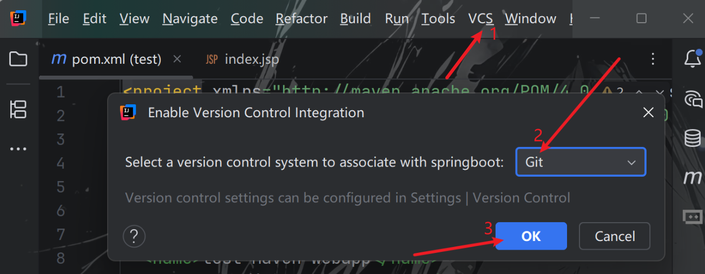

### 8.2.2 设置忽略文件

在工作空间中有些文件是不需要记录到版本库中的（例如.idea,target,.iml 文件）,可以通过设置忽略提交来实现

- 在工作空间的根目录（项目录的根目录）中创建一个名为 .gitigonre 文件
- 在 .gitignore 文件配置忽略过滤条件

.idea

target

*.iml

### 8.2.3 将工作空间 add 到暂存区

- 选择项目/某个文件 - 右键 - Git - add
- 如果一个文件创建好之后还没有添加到暂存区 -- 棕红色
- 添加到暂存区的操作可以设置默认添加

### 8.2.4 将暂存区提交到版本库

- 选择项目/文件 -- 右键 -- Git -- Commit（）
- 如果对记录到版本库的文件进行了修改，也就是说工作空间和版本不一致 -- 蓝色、

## 8.3 IDEA 中 Git 分支管理

### 8.3.1 创建分支

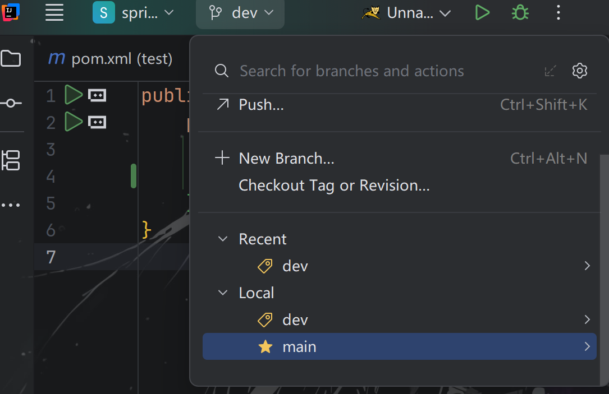

- 点击 IDEA 上方的 Git
- 在弹窗中点击 new Branch
- 输入新分支的名称

### 8.3.2 切换分支

- 点击 IDEA 上面的 Git
- 点击非当前分支右边的箭头
- 在选项页面点击 checkout

### 8.3.3 删除分支

点击分支页面最下面的 delete

### 8.3.4 合并分支

例如：将 dev 合并到 main

- 切换到 main 分支
- 点击 dev 分支后面的箭头，在展开的菜单中选择 Merge 'dev' into 'main'

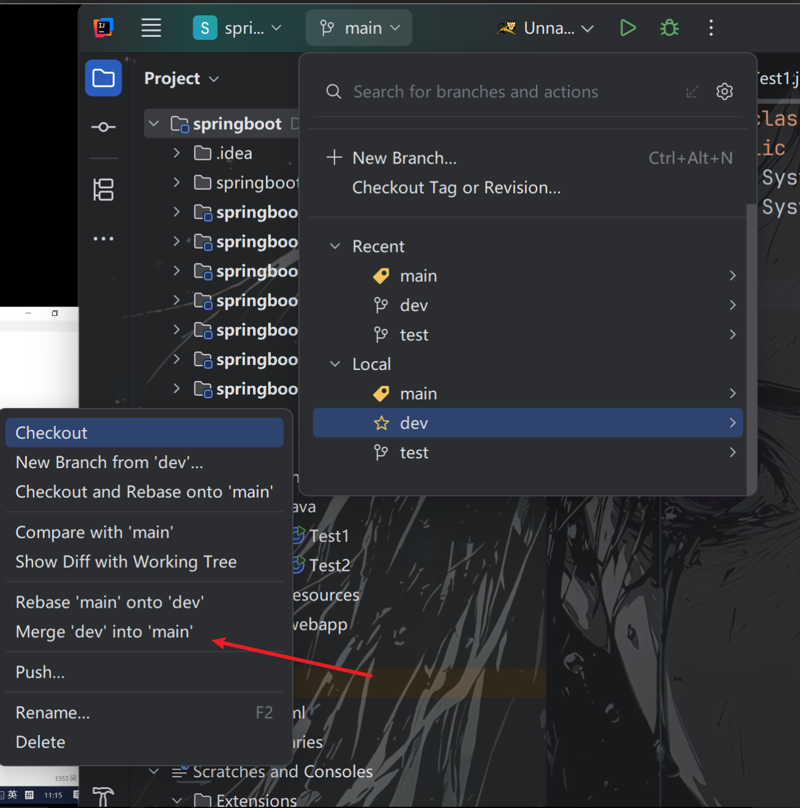

## 8.4 IDEA 中使用 Git 进行团队协同开发

### 8.4.1 项目管理者

1. 完成项目创建
2. 为当前项目创建本地版本库
3. 将搭建好的项目提交到本地版本库

add 到暂存区

Commit 到版本库

4. 创建远程版本仓库（远程仓库）

仓库地址（.git 结尾）

管理 -- 添加开发者

5. 将本地仓库 push 到远程仓库

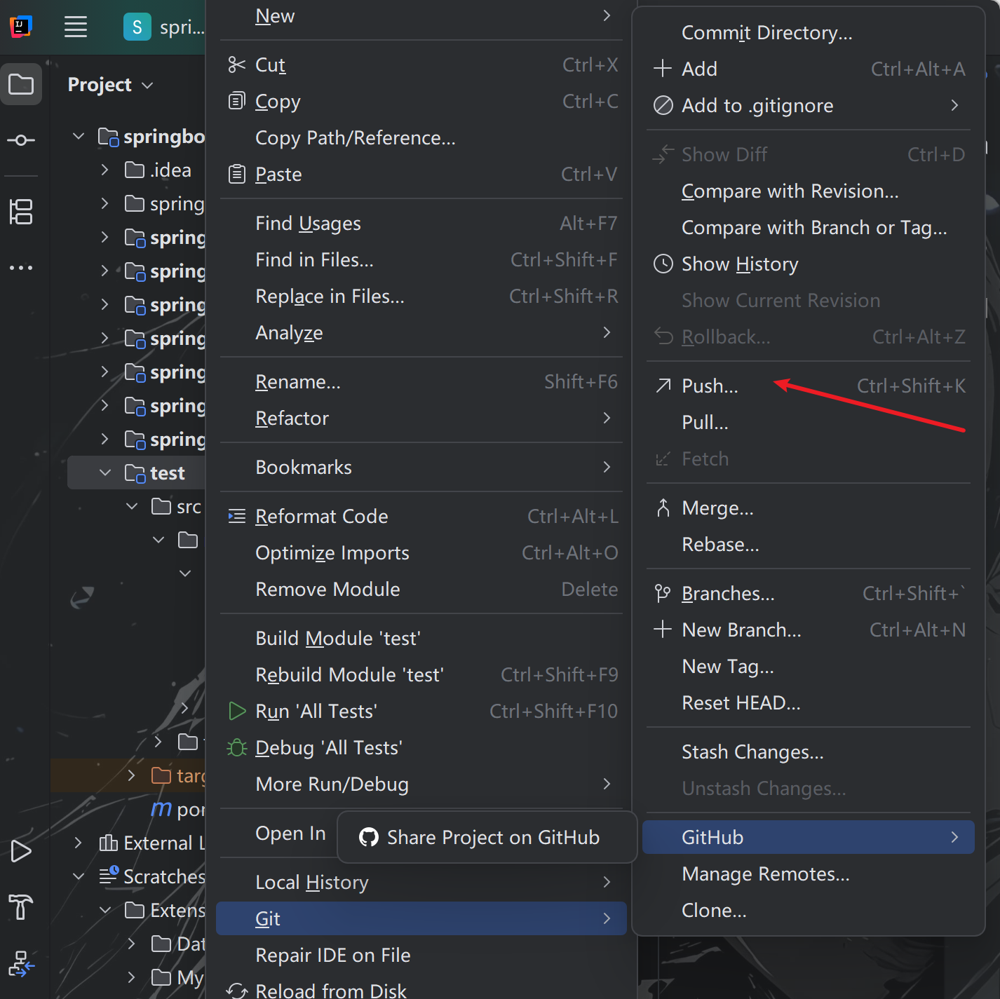

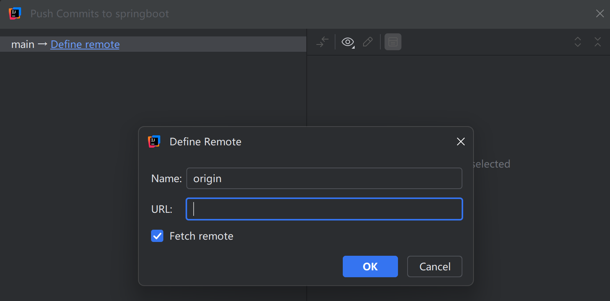

6. 在远程仓库新建 dev 分支（master 需要进行保护）

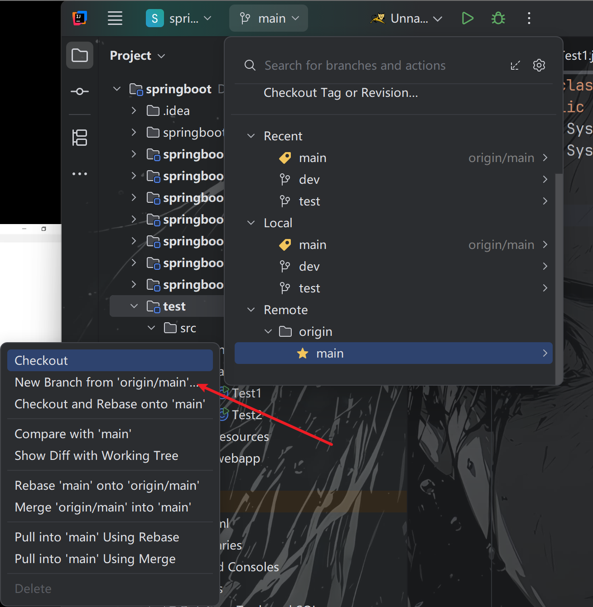

7. 将本地 dev 分支 push 到远程仓库，新建远程仓库的 dev 分支
8. 设置远程仓库 main 分支为保护分支

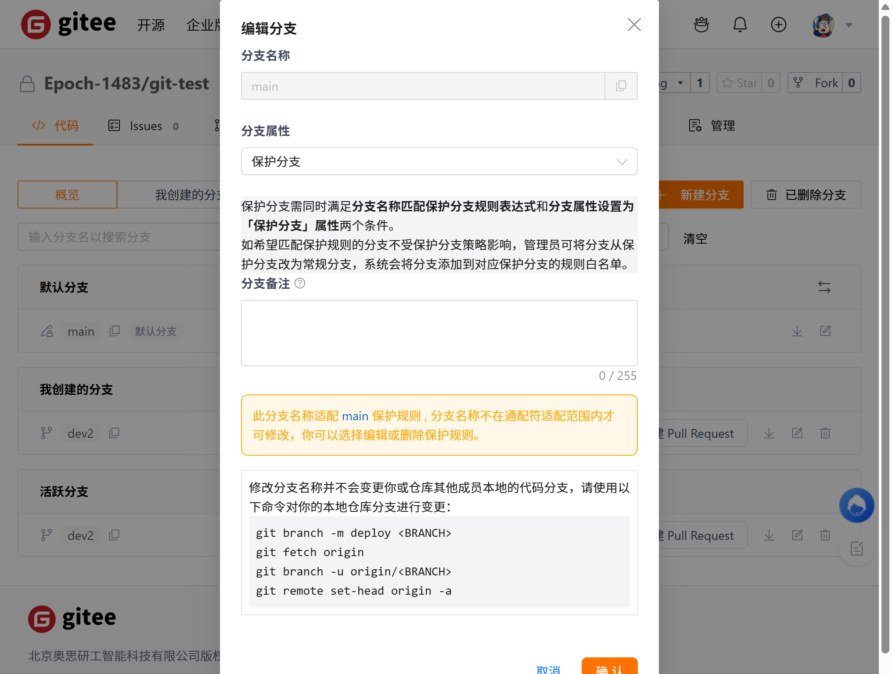

### 8.4.2 项目开发者

1. 从管理员提供的远程仓库 pull 项目到本地
2. 打开项目
3. 开发步骤：

- 选择要修改的文件 - pull
- 进行修改操作
- 测试本地修改
- add 到暂存区
- Commit 到本地仓库
- push 到远程仓库（dev 分支）

## 8.5 解决团队协同开发的冲突问题

冲突：在 pull 之后，push 之前被其他开发者 push 成功

- 选择产生冲突的文件 -- pull
- 弹出弹窗提示 ： accept yours | accept theirs | Merge

**accept yours** 保留自己的版本（提交时会覆盖其它开发者的代码）

**accept theirs** 保留远程仓库上的版本（会导致自己修改的代码丢失）

**Merge** 手动合并（推荐）

补充：

IntelliJ IDEA **没有自动识别它为 Maven 项目**，导致：

1. 没有加载依赖（External Libraries 为空）
2. 没有标记 `src/main/java` 为 Source Root
3. 没有创建运行配置
4. 所以 Java 类无法编译，图标也变黄

**✔️** **方法：手动添加 Maven 项目**

1. 在项目根目录找到 `pom.xml` 文件
2. **右键点击** `**pom.xml**`
3. 选择：**Add as Maven Project**

---

## 🔗 关联笔记
- [[Docker笔记]]
- [[Linux笔记]]
- [[Maven笔记]]
