**为什么学习Java后端开发也要学习Linux呢？：**

1. **生产环境主流操作系统**：绝大多数 Java 后端服务部署在 Linux 服务器上（如 CentOS、Ubuntu），因为其稳定、高效、开源且资源占用低。
2. **部署与运维需求**：你需要通过 Linux 命令启动/停止服务、查看日志（如 `tail -f`）、监控进程（`ps`, `top`）、管理端口（`netstat`, `ss`）等。
3. **环境配置**：安装 JDK、Tomcat、MySQL、Redis、Nginx 等中间件通常在 Linux 上进行，需熟悉路径、权限、环境变量等操作。
4. **调试与排错**：线上问题排查（如内存溢出、CPU 飙高）依赖 Linux 工具（`jstack`, `jmap`, `grep`, `awk`, `vim` 等）。
5. **自动化与 DevOps**：CI/CD 脚本（Shell）、Docker、Kubernetes 等都基于 Linux 环境运行。

# 1. Linux 初识

Linux由林纳斯·托瓦兹在1991年创立并发展至今，成为**服务器操作系统领域**的核心系统。

---

## 1.1. Linux 内核

Linux 系统的组成如下：

- Linux 系统内核
- 系统级应用程序

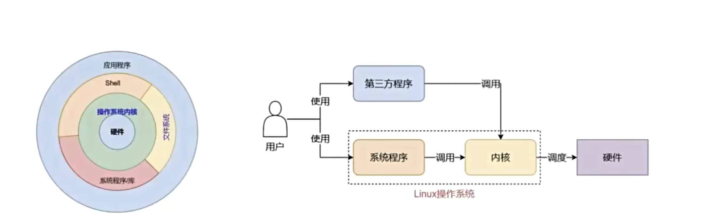

- **内核**提供系统**最核心**的功能，如：调度CPU、调度内存、调度文件系统、调度网络通讯、调度IO等。
- **系统级应用程序**，可以理解为出厂自带程序，可供用户快速上手操作系统，如：  
    文件管理器、任务管理器、图片查看、音乐播放等。

可以看出，**内核**是Linux操作系统最核心的所在，**系统级应用程序**只是锦上添花。  
Linux内核是免费开源的，任何人都可以下载内核源码并查看且修改。  
可以通过：[https://www.kernel.org](https://www.kernel.org/) 去下载Linux内核

## 1.2. Linux 发行版

内核是免费、开源的，这也就代表了：

- 任何人都可以获得并修改内核，并且自行集成系统级程序
- 提供了**内核**+**系统级程序**的完整封装，称之为**Linux发行版**

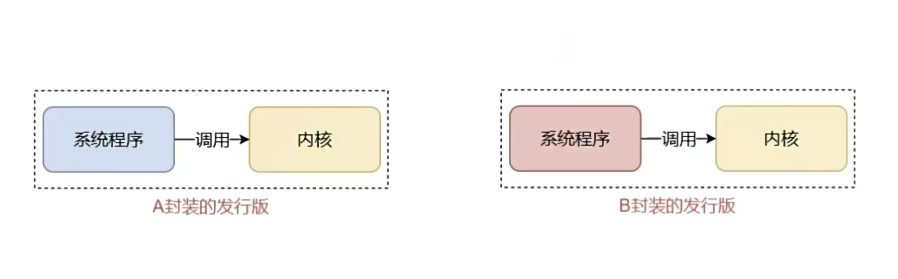

任何人都可以封装 Linux，目前市面上由非常多 Linux 发行版，常用的、知名的如下：


---

# 2. 虚拟机

## 2.1. 什么是虚拟机？

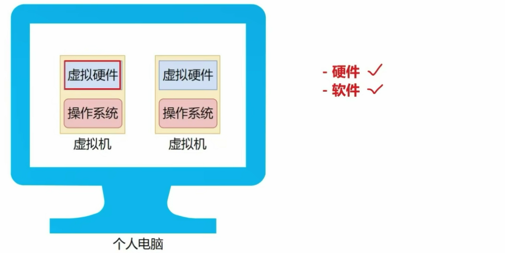

借助虚拟化技术，我们可以在系统中，通过软件：模拟计算机硬件，并给虚拟硬件安装真实的操作系统。

这样，就可以在电脑中，虚拟出一个完整的电脑，以供我们学习的 Linux 系统。

## 2.2. 为什么要使用虚拟机？

1. 学习Linux系统，需要有Linux系统环境。

2. 我们不能给自己电脑重装系统为Linux，所以通过虚拟机的形式，得到可以用的Linux系统环境，供后续学习使用。

---

# 3. 虚拟化软件

通过虚拟化技术，可以虚拟出计算机的硬件，我们可以通过虚拟化的软件来获得虚拟机。


## 3.1. VMware 安装和配置

官网地址：[https://support.broadcom.com/group/ecx/downloads](https://support.broadcom.com/group/ecx/downloads)

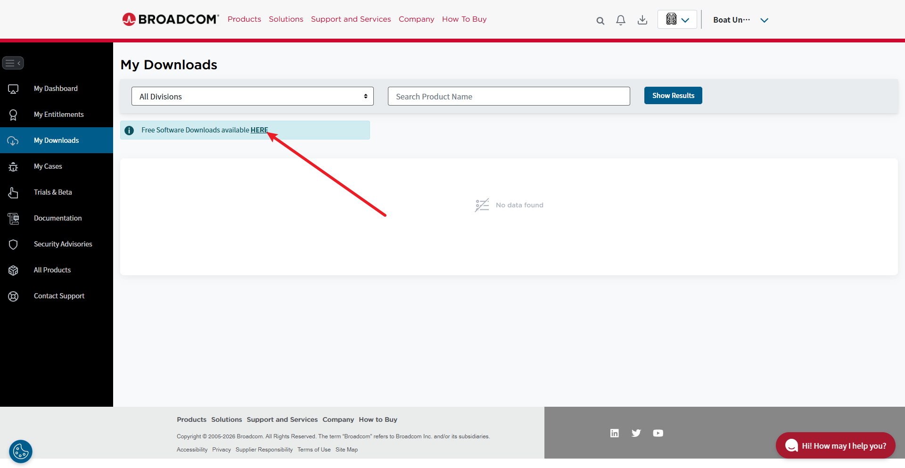

软件安装完成后，验证一下网络适配器是否正常配置

通过快捷键： **win + R** 输入 **ncpa.cpl** 然后回车

详细安装教程：

[https://blog.csdn.net/weixin_52799373/article/details/139041173?fromshare=blogdetail&sharetype=blogdetail&sharerId=139041173&sharerefer=PC&sharesource=UnmooredBoat&sharefrom=from_link](https://blog.csdn.net/weixin_52799373/article/details/139041173?fromshare=blogdetail&sharetype=blogdetail&sharerId=139041173&sharerefer=PC&sharesource=UnmooredBoat&sharefrom=from_link)

---

## 3.2. VMware 中安装 CentOS 7

下载地址：[https://mirrors.huaweicloud.com/centos/7/isos/x86_64/](https://mirrors.huaweicloud.com/centos/7/isos/x86_64/)

下载 CentOS 7

详细安装教程：

[https://blog.csdn.net/weixin_52799373/article/details/140797573?fromshare=blogdetail&sharetype=blogdetail&sharerId=140797573&sharerefer=PC&sharesource=UnmooredBoat&sharefrom=from_link](https://blog.csdn.net/weixin_52799373/article/details/140797573?fromshare=blogdetail&sharetype=blogdetail&sharerId=140797573&sharerefer=PC&sharesource=UnmooredBoat&sharefrom=from_link)

---

# 4. 远程连接 Linux 系统

## 4.1. 图形化、命令行

对于操作系统的使用，有2种使用形式：

- 图形化页面使用操作系统
- 以命令的形式使用操作系统

不论是Windows还是Linux亦或是MacOS系统，都是支持这两种使用形式。

- 图形化：使用操作系统提供的图形化页面，以获得图形化反馈的形式去使用操作系统。
- 命令行：使用操作系统提供的各类命令，以获得字符反馈的形式去使用操作系统。

## 4.2. Windows 系统的图形化和命令行

---

**图形化界面:**

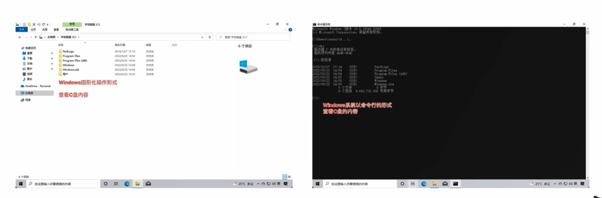

---

**使用命令行学习Linux系统**

尽管图形化是大多数人使用计算机的第一选择，但是在Linux操作系统上，这个选择被反转了。

无论是企业开发亦或是个人开发，使用Linux操作系统，多数都是使用的：**命令行**。

---

**这是因为：**

- Linux从诞生至今，在图形化页面的优化上，并未重点发力。所以Linux操作系统的图形化页面：**不好用、不稳定**。
- 在开发中，使用**命令行形式**，效率更高，更加直观，并且**资源占用低**，程序运行更稳定。

## 4.3. FinalShell

### 4.3.1. **1. 连接 FinallShell**

在 VMware 中打开终端使用 **Ifconfig** 指令 ，可以得到如下图所示：

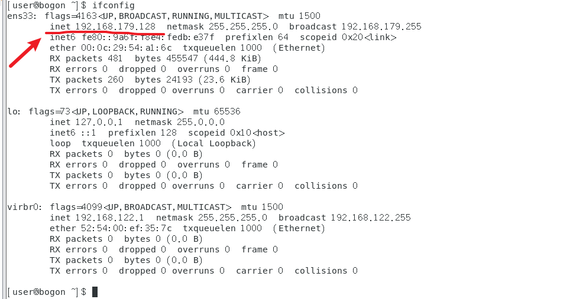

打开 FinallShell 主机名就填刚才在VMware 终端得到的地址。点击确定再双击就能连接成功。

### 4.3.2. **2. 为什么使用FinalShell连接Linux去使用**

- 操作Linux系统中间跨越VMware窗口会导致交互不太方便
- 我们只需要使用命令行无需使用图形化，所以通过命令行远程连接使用即可

### 4.3.3. **3. 如何查看Linux的IP地址并远程连接呢**

- 在Linux操作系统中，桌面空白右键点击：open in terminal
- 输入ifconfig，即可看到IP地址
- 在FinalShell中配置好IP地址，账号密码后即可连接成功

## 4.4. 在 **FinalShell** 中清除之前的命令输出内容常用方法：

|   |   |
|---|---|
|方法|操作|
|快捷键|`Ctrl + L`|
|命令行|`clear`|
|右键菜单|右键 → “清空”|
|强制重置|`reset`|

推荐使用 `**Ctrl + L**` 或 `**clear**`，简单高效！

---

# 5. WSL（扩展）

WSL作为Windows10系统带来的全新特性，正在逐步颠覆开发人员既有的选择。

- 传统方式获取Linux操作系统环境，是安装完整的虚拟机，如VMware
- 使用WSL，可以以非常轻量化的的方式，得到Linux系统环境

目前，开发者正在逐步抛弃以虚拟机的形式获取Linux系统环境，而在逐步拥抱WSL环境。  
所以，课程也紧跟当下趋势，为同学们讲解如何使用WSL，简单、快捷地获得Linux系统环境。

所以，为什么要用WSL，其实很简单：

- 开发人员都在用，大家都用的，我们也要学习
- 实在是太方便了，简单、好用、轻量化、省内存

---

## 5.1. 什么是 WSL

WSL：Windows Subsystem for Linux，是用于Windows系统之上的Linux子系统。  
作用很简单，可以在**Windows系统中获得Linux系统环境**，并完全**直连计算机硬件**，无需通过**虚拟机虚拟硬件**。

---

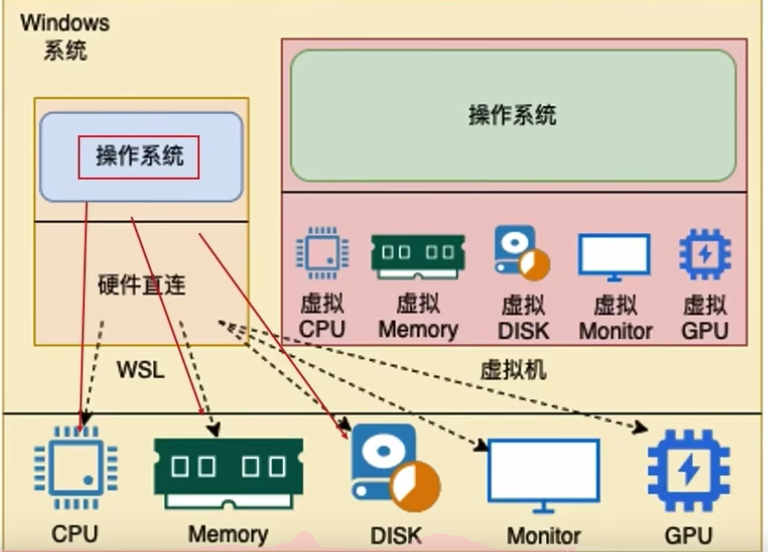

简而言之：  
Windows10的**WSL**功能，可以无需单独虚拟一套硬件设备，  
就可以**直接使用主机的物理硬件**，构建**Linux操作系统**，  
并不会影响**Windows系统本身的运行**。

## 5.2. WSL 部署

打开 Windows 的控制面板 -> 程序 -> 程序和功能：

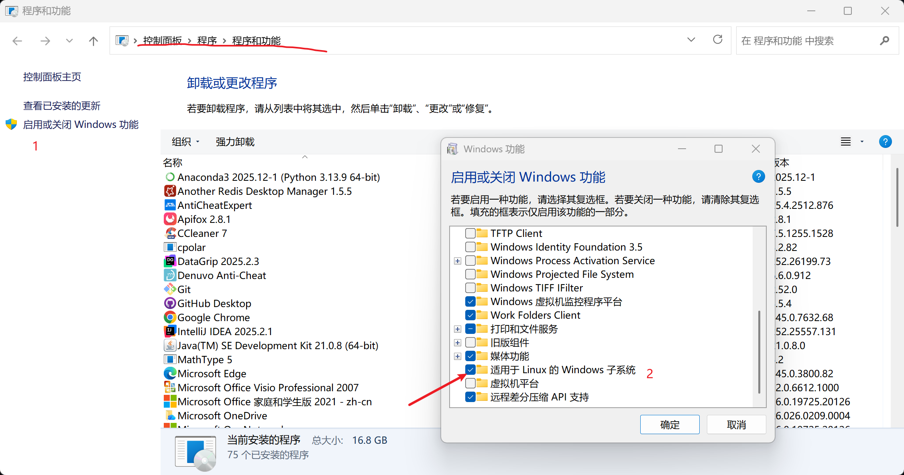

点击确定最后重启电脑

在 Microsoft Store 下载 Ubuntu:

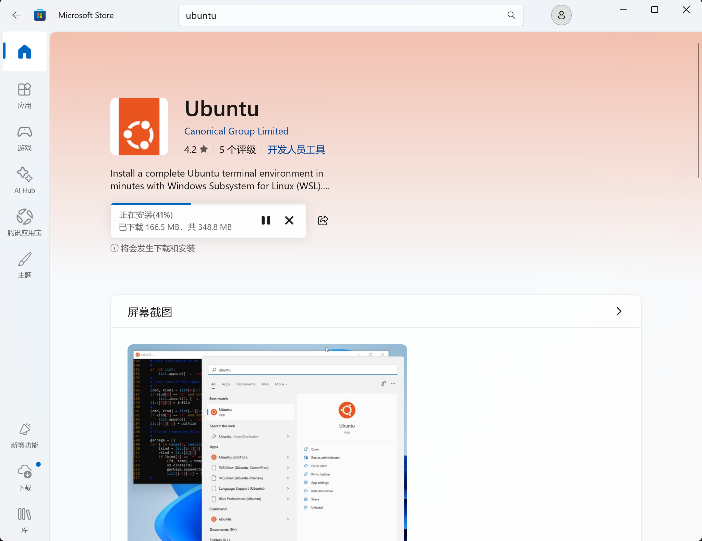

## 5.3. 发生 **0x80071772 错误**🔧 **解决方法**

错误代码 **0x80071772** 在安装 WSL（Windows Subsystem for Linux）发行版（如 Ubuntu）时，通常表示：

**“The specified network resource or device is no longer available.”**  
（指定的网络资源或设备不再可用。）

### 5.3.1. 步骤 1：以管理员身份打开 PowerShell 或 CMD

点击“开始” → 搜索 “PowerShell” → 右键选择 **“以管理员身份运行”**

### 5.3.2. 步骤 2：启用必要组件

依次运行以下命令：

```
dism.exe /online /enable-feature /featurename:Microsoft-Windows-Subsystem-Linux /all /norestart
```

```
dism.exe /online /enable-feature /featurename:VirtualMachinePlatform /all /norestart
```

⚠️ 注意：两个都要启用！尤其是第二个（VirtualMachinePlatform）常被忽略。

### 5.3.3. 步骤 3：重启电脑

必须重启才能生效。

### 5.3.4. 步骤 5：重新从 Microsoft Store 安装 Ubuntu

卸载之前失败的 Ubuntu（如果已部分安装），然后重新从 Microsoft Store 安装。

## 5.4. 安装 Window Terminal 软件

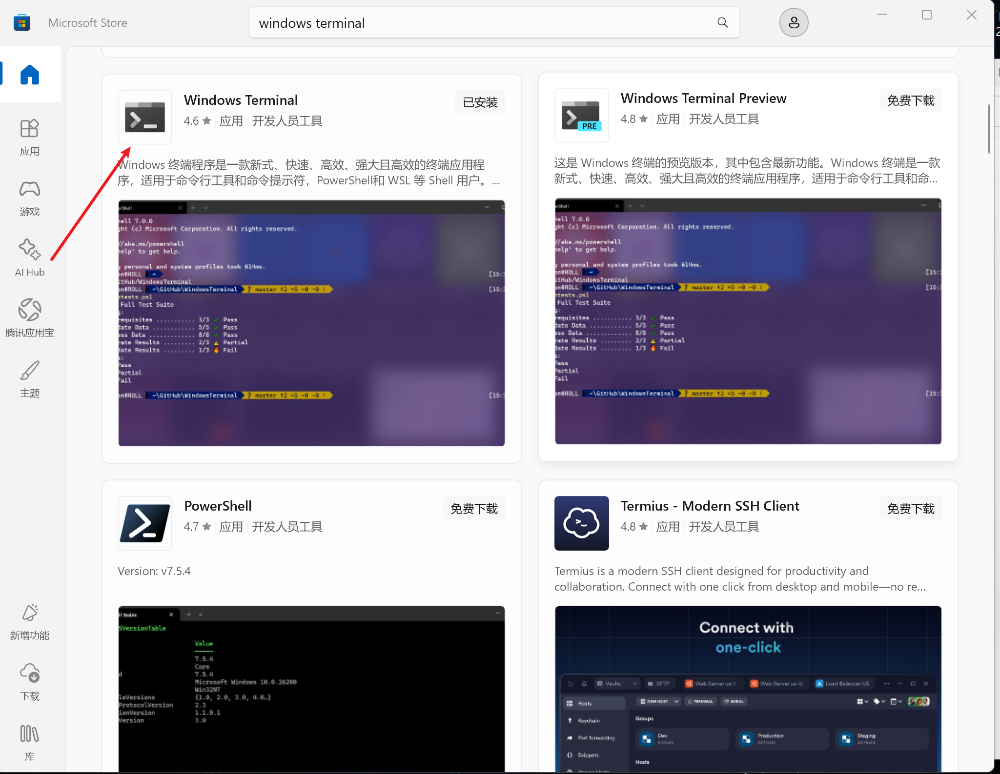

---

# 6. 虚拟机快照

在学习阶段我们无法避免的可能损坏 Linux 操作系统

如果损坏的话，重新安装一个 Linux 操作系统就会十分麻烦。

VMware虚拟机（Workstation和Fusion）支持为虚拟机制作快照。  
通过快照将当前虚拟机的**状态保存下来**，在以后可以通过**快照恢复虚拟机到保存的状态**。

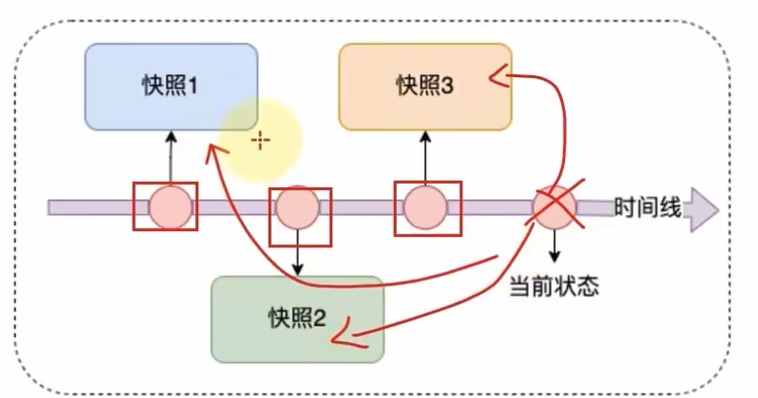

## 6.1. 在 VMware 设置快照：

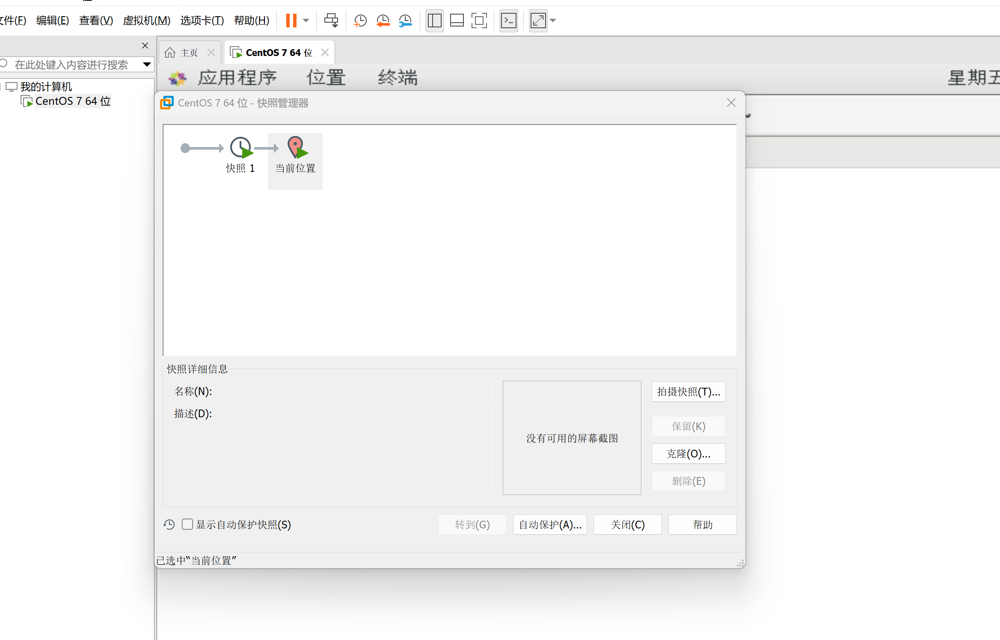

---

# 7. Linux 目录

linux 的目录结构是一个树型结构

windows 系统可以拥有多个**盘符**，如c盘，d盘，e盘

linux 没有盘符这个概念，只有一个**根目录（顶级目录）** **/** , 所有文件都在它下面

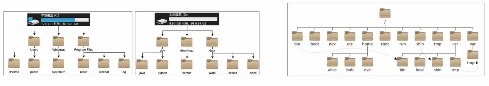

- 在linux系统中，路径之间的层级关系，使用： **/** 来表示
- 在windows系统中，路径之间的层级关系，使用：**\** 来表示

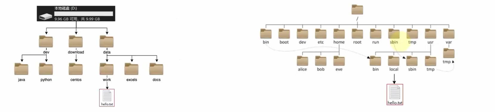

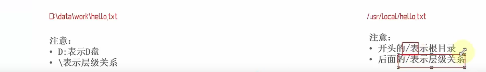

---

# 8. Linux 命令

## 8.1. Linux 命令基础

**什么是命令、命令行？**

学习Linux，本质上是学习在命令行下熟练使用Linux的各类命令。

- 命令行：即 Linux 终端，可以提供字符化的操作页面供命令执行。

- 命令：即 Linux 操作的指令，是相同内置的程序，可以以字符化的形式去使用。

**Linux 命令基础格式**

### 8.1.1. Linux 命令通用格式

无论是什么命令，用于什么用途，在 Linux 中，命令有其通用的格式：

```
command [-options] [parameter]
```

- **command**：命令本身
- **-options**：[可选，非必填] 命令的一些选项，可以通过选项控制命令的行为细节
- **parameter**：[可选，非必填] 命令的参数，多数用于命令的指向目标等

**说明**：语法中的 `[ ]` 表示可选的意思。

---

### 8.1.2. 示例

1. `ls -l /home/user`

- `ls` 是命令本身
- `-l` 是选项
- `/home/user`是参数
- **含义**：以列表的形式显示 `/home/user`目录内的内容

2. `cp -r test1 test2`

- `cp` 是命令本身
- `-r` 是选项
- `test1` 和 `test2` 是参数
- **含义**：复制文件夹 `test1` 成为 `test2`

---

## 8.2. Linux 命令入门

### 8.2.1. **ls 命令**

**作用**：  
`ls` 命令用于列出目录下的内容。

**语法格式**：

```
ls [-a -l -h] [Linux路径]
```

- `-a`、`-l`、`-h` 是可选的选项：

- `-a`：显示所有文件，包括隐藏文件（以 `.` 开头的文件）
- `-l`：以长列表形式显示文件详细信息（如权限、所有者、大小、修改时间等）
- `-h`：以人类可读的形式显示文件大小（如 KB、MB）

- `[Linux路径]` 是可选的参数，表示要查看的目录路径。若不指定，则默认为当前工作目录。

**说明**：  
当不使用任何选项和参数，直接执行 `ls` 命令时，表示：以平铺形式（简洁列表）列出当前工作目录下的内容。


---

## 8.3. **HOME目录和工作目录**

**问题**：  
直接输入 `ls` 命令，表示列出当前工作目录下的内容。那么，当前工作目录是什么？

---

### 8.3.1. **Linux系统命令行终端的默认行为**

在启动时，Linux系统的命令行终端会默认加载以下设置：

- **当前登录用户的 HOME 目录** 被设为 **当前工作目录**。  
    因此，执行 `ls` 命令时，显示的是该用户的 HOME 目录内容。

---

### 8.3.2. **HOME目录说明**

- **定义**：每个 Linux 操作用户在系统中都有一个个人账户目录，称为 HOME 目录。
- **路径格式**：`/home/用户名`

- 示例：图中用户为 user，其 HOME 目录为：`/home/user`

- **备注**：Windows 和 Linux 系统都设有用户的 HOME 目录（如 Windows 中的 `C:\Users\用户名`）。

---

### 8.3.3. **示例输出**

```
[user@bogon ~]$ ls
Desktop  Documents  Downloads  Music  Pictures  Public  Templates  Videos
```

- 此输出是 `ls` 命令的结果，显示的是当前用户 `itheima` 的 HOME 目录内容。
- `~` 符号代表当前用户的 HOME 目录。

---

**总结**：

- 启动终端后，默认工作目录是当前用户的 HOME 目录。
- 执行 `ls` 不带参数时，实际查看的是 `/home/用户名` 下的内容。
- `~` 是 HOME 目录的快捷符号。

---

## 8.4. Linux 命令的参数和选项

### 8.4.1. **ls 命令的选项与参数说明**

刚刚展示了直接使用 `ls` 命令，未使用任何选项和参数。

**命令格式回顾**：

```
ls [-a -l -h] [Linux路径]
```

那么，`ls` 的选项和参数具体有什么作用呢？我们先来看**参数**部分。

---

#### 8.4.1.1. **参数的作用**

- **当 ls 不使用参数时**：  
    表示列出 **当前工作目录** 的内容，即用户的 **HOME 目录**。  
    （例如：用户为 user，则显示 `/home/user`下的内容）
- **当使用参数时**：  
    `ls` 命令的参数表示指定一个 Linux 路径，用于列出该路径下的内容。例如：

```
ls /
```

将列出 `/` 目录下的文件和子目录。

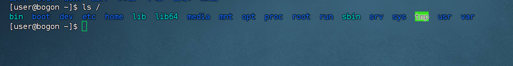

---

**总结**：

- 参数是可选的，用于指定要查看的目录路径。
- 若不指定参数，默认查看当前工作目录（通常是用户的 HOME 目录）。
- 使用参数可以灵活地查看系统中任意目录的内容。

### 8.4.2. **ls 命令的** `**-a**` **选项**

#### 8.4.2.1. **语法说明**

`ls` 命令支持使用选项，其通用语法为：

```
ls [-a -l -h] [Linux路径]
```

- `**-a**` **选项**：表示 "all"（全部），用于列出目录下的**所有文件和文件夹**，包括**隐藏的文件/文件夹**。

---

#### 8.4.2.2. **示例对比**

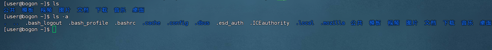

- 可以看到，`ls -a` 列出的内容比普通 `ls` 更多。
- 多出的以 `.` 开头的文件或目录是 Linux 系统中的**隐藏文件/隐藏文件夹**。

---

#### 8.4.2.3. **隐藏文件规则**

- 在 Linux 中，只要文件或文件夹名称**以** `**.**` **开头**，就会被系统自动隐藏。
- 常见隐藏文件示例：

- `.bash_history`：记录命令历史
- `.bash_profile`：用户登录时执行的配置文件
- `.config`、`.cache`：应用程序配置和缓存目录

---

#### 8.4.2.4. **关键点总结**

- 普通 `ls` 不显示隐藏文件。
- 只有通过 `-a` 选项，才能查看这些以 `.` 开头的隐藏文件/文件夹。
- `-a` 是查看完整目录结构的重要选项，尤其在调试或配置系统时非常有用。

---

### 8.4.3. **ls 命令的** `**-l**` **选项**

#### 8.4.3.1. **语法回顾**

```
ls [-a -l -h] [Linux路径]
```

- `**-l**` **选项**：表示以“列表”（竖向排列）的形式展示目录内容，并显示更多详细信息。

---

#### 8.4.3.2. **示例对比**

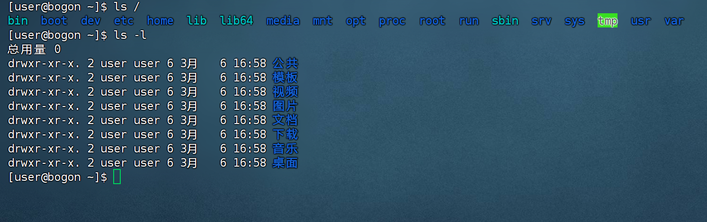

---

#### 8.4.3.3. **输出字段说明**（从左到右）

|   |   |
|---|---|
|字段|含义|
|`drwxr-xr-x.`|文件权限（d 表示目录，rwx 分别为所有者、组、其他用户的读写执行权限）|
|`2`|链接数（硬链接数量）|
|`itheima`|所有者用户名|
|`itheima`|所属用户组名|
|`6`|文件大小（单位：块）|
|`9月 22 23:57`|最后修改时间|
|`Desktop`|文件/文件夹名称|

注意：`-l` 选项会以长格式列出每个条目的详细信息，适合查看文件属性。

---

#### 8.4.3.4. **图形化类比**

- `-l` 选项的效果类似于图形界面中将文件夹以“**列表视图**”方式排列。
- 在图形界面中点击“列表”图标，与 `ls -l` 的效果一致。

---

#### 8.4.3.5. **总结**

- 使用 `ls -l` 可以查看目录下文件的权限、所有者、大小、修改时间等详细信息。
- 是日常 Linux 操作中非常常用的命令形式，尤其适用于系统管理与文件排查。

---

### 8.4.4. **ls 命令选项的组合使用**

#### 8.4.4.1. **核心概念**

在 Linux 中，`ls` 命令的选项可以**组合使用**，以同时实现多个功能。  
例如：`-a`（显示所有文件）和 `-l`（以列表形式详细显示）可以组合应用。

除了选项本身可以组合以外，选项和参数也可以一起使用。

---

#### 8.4.4.2. **常见写法**

以下三种写法是等价的，均表示同时启用 `-l` 和 `-a` 选项：

1. `ls -l -a`
2. `ls -la`
3. `ls -al`
4. `ls -la /`

上面前三种写法效果完全相同，都表示：**以长列表形式列出所有文件（包括隐藏文件）**。

---

#### 8.4.4.3. **示例输出**

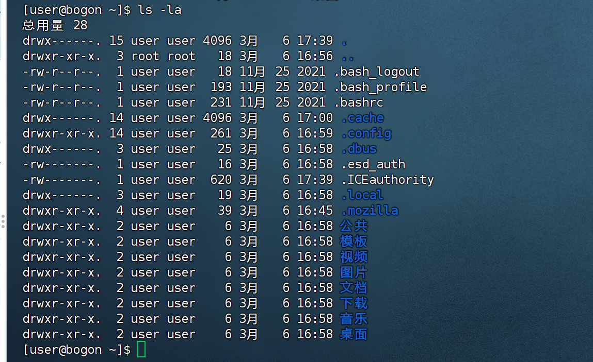

- 输出包含：

- 所有文件（包括以 `.` 开头的隐藏文件）
- 每个文件的权限、所有者、大小、修改时间等详细信息

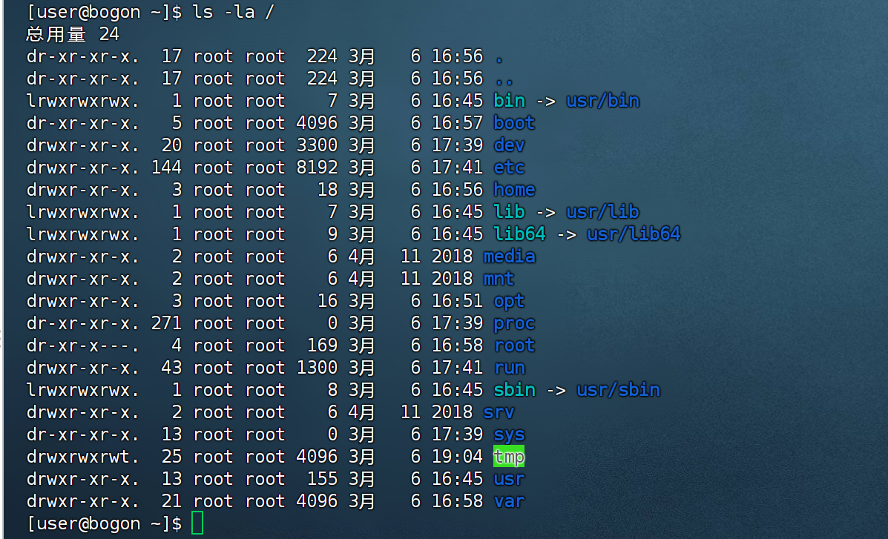

---

#### 8.4.4.4. **说明**

- `ls -la` 是最常用的组合写法之一，广泛用于查看用户目录的完整内容。
- 选项顺序不影响结果（如 `-la` 和 `-al` 效果一致），但通常推荐使用 `ls -la` 的格式。

---

**总结**：  
Linux 命令的选项支持组合使用，`ls -l -a`、`ls -la`、`ls -al` 、`ls -la /`

都表示“以详细列表形式显示所有文件”，包括隐藏文件。这是日常运维和学习中非常实用的命令用法。

以下是图片中内容的提取和整理：

---

### 8.4.5. **ls 命令的** `**-h**` **选项**

#### 8.4.5.1. **语法回顾**

```
ls [-a -l -h] [Linux路径]
```

- `**-h**` **选项**：表示以**易于阅读的形式**显示文件大小，单位为 **K（KB）、M（MB）、G（GB）** 等。

---

#### 8.4.5.2. **关键说明**

- **作用**：  
    将 `ls -l` 中显示的文件大小（以字节或块为单位）转换为更直观的单位，例如：

- `1024 字节 → 1.0K`
- `1048576 字节 → 1.0M`
- `1073741824 字节 → 1.0G`

- **使用限制**：  
    `-h` 选项**必须与** `**-l**` **一起使用**，不能单独使用。  
    否则会报错或无效果。

正确用法示例：

```
ls -lh
ls -la -h
ls -alh
```

---

#### 8.4.5.3. **示例对比**

```
# 不使用 -h
ls -l
...
-rw-r--r--. 1 itheima itheima 1024000 9月  22 23:57 file.txt

# 使用 -h
ls -lh
...
-rw-r--r--. 1 itheima itheima 1.0M 9月  22 23:57 file.txt
```

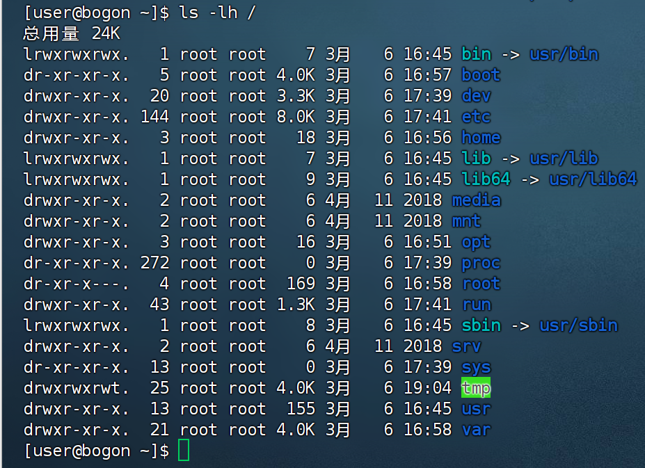

可见，`-h` 让文件大小更易读，尤其适合查看大文件。

---

#### 8.4.5.4. **总结**

- `-h` 是一个实用的辅助选项，用于提升文件大小的可读性。
- 必须配合 `-l` 使用，常与 `-a` 组合形成 `ls -lah`，用于完整、清晰地查看目录内容。

---

### 8.4.6. **ls 命令使用总结**

#### 8.4.6.1. **1. ls 命令的参数作用**

- 参数用于指定要查看的文件夹（目录）的内容。
- 如果不指定参数，则默认查看**当前工作目录**的内容。

---

#### 8.4.6.2. **2. ls 命令的常用选项**

|   |   |
|---|---|
|选项|功能说明|
|`-a`|显示所有文件，包括以 `.`<br><br>开头的隐藏文件/文件夹。  <br>（默认情况下，Linux 系统会隐藏以 `.`<br><br>开头的文件）|
|`-l`|以列表形式（长格式）显示内容，包含权限、所有者、大小、修改时间等详细信息。|
|`-h`|需要与 `-l`<br><br>搭配使用，将文件大小以更易读的形式显示（如 KB、MB、GB）。|

---

#### 8.4.6.3. **3. 命令选项的组合使用**

- Linux 命令的选项可以组合使用，简化输入。
- 例如：

```
ls -lah
```

等同于：

```
ls -a -l -h
```

`ls -lah` 是最常用的组合之一，表示：

- 显示所有文件（含隐藏）
- 以详细列表形式展示
- 文件大小以人性化单位（K/M/G）显示

---

#### 8.4.6.4. 总结要点：

- 参数决定查看哪个路径的内容。
- 选项控制显示方式和细节。
- 多个选项可组合使用，提升效率与可读性。

📌 推荐掌握命令：`ls -lah` —— 查看目录完整信息的标准用法。

## 8.5. 目录切换相关命令（cd/pwd）

---

### 8.5.1. **cd 命令：切换工作目录**

#### 8.5.1.1. **基本概念**

- 当 Linux 终端（命令行）打开时，默认以当前用户的 **HOME 目录** 作为初始工作目录。
- 我们可以通过 `cd` 命令更改当前所在的工作目录。

`cd` 是英文 **Change Directory** 的缩写，意为“切换目录”。

---

#### 8.5.1.2. **语法格式**

```
cd [Linux路径]
```

- `cd` 命令**没有选项**，只有参数。
- 参数表示要切换到的目标目录路径。

---

#### 8.5.1.3. **常用用法说明**

1. **指定路径切换目录**

```
cd /home/user/Documents
```

- 表示切换到 `/home/user/Documents` 目录下。

2. **不带参数执行 cd 命令**

```
cd
```

- 表示回到当前用户的 **HOME 目录**。
- 等价于：`cd ~` 或 `cd $HOME`

---

#### 8.5.1.4. **补充说明**

- 在终端中，`~` 符号代表当前用户的 HOME 目录。
- 使用 `cd` 可以在不同目录之间自由切换，是日常操作中最常用的命令之一。

---

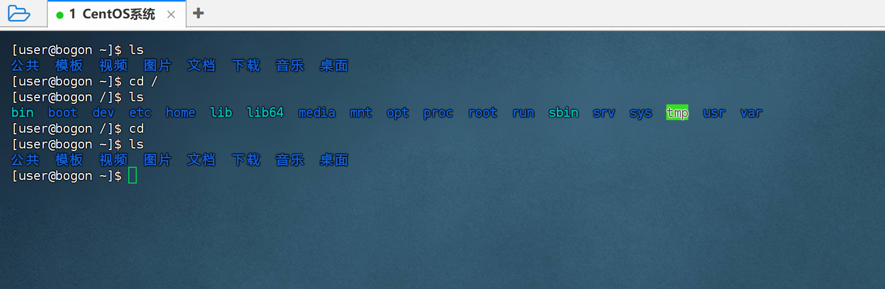

---

### 8.5.2. **pwd 命令：查看当前工作目录**

#### 8.5.2.1. **背景说明**

- 通过 `ls` 命令来验证当前工作目录是**不恰当**的，因为 `ls` 只列出目录内容，不能明确显示路径。
- 更准确的方式是使用 `pwd` 命令来查看当前所在的工作目录。

---

#### 8.5.2.2. **命令来源**

- `pwd` 是英文 **P****rint** **W****orking** **D****irectory** 的缩写，意为“打印当前工作目录”。

---

#### 8.5.2.3. **语法格式**

```
pwd
```

- `pwd` 命令**无选项、无参数**，直接输入即可执行。

---

#### 8.5.2.4. **示例演示**

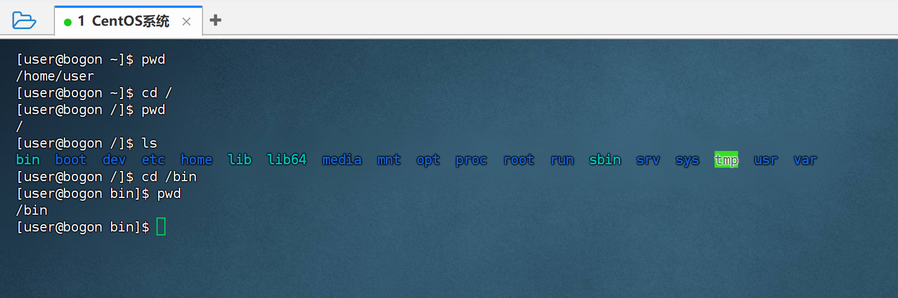

输出解释：

- 第一次执行 `pwd`：显示当前在用户 HOME 目录 `/home/user`
- 执行 `cd /` 后，切换到根目录，`pwd` 显示 `/`
- 再次执行 `cd`（无参数），返回 HOME 目录，`pwd` 再次显示 `/home/user`

---

**小贴士**：  
终端提示符中的 `~` 或 `/` 等符号只是提示，实际路径需用 `pwd` 确认。

## 8.6. 相对路径和绝对路径

### 8.6.1. **cd 命令参数写法示例**

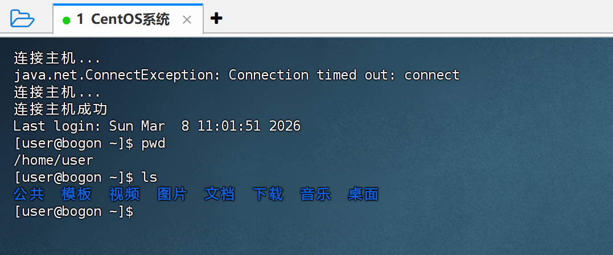

#### 8.6.1.1. **背景说明**

- 通过 `pwd` 命令已确认当前所在目录为用户的 HOME 目录：

```
/home/user
```

- 现在希望使用 `cd` 命令切换到 **Desktop** 文件夹。

---

#### 8.6.1.2. **问题**

如何正确书写 `cd` 命令的参数（Linux 路径）？

---

#### 8.6.1.3. **两种正确的写法**

1. **绝对路径写法**

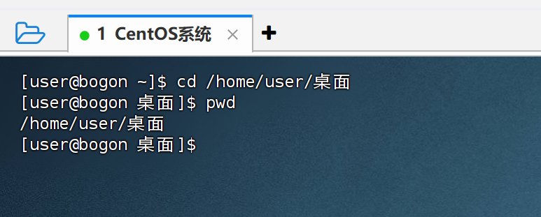

```
cd /home/user/Desktop
```

- 从**根目录** `**/**` **开始**，完整指定目标路径。
- 优点：明确、不易出错，适用于任何位置。

2. **相对路径写法**

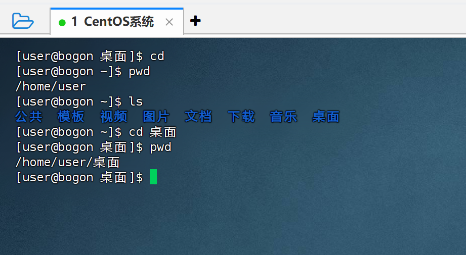

```
cd Desktop
```

- 以**当前目录为起点**，直接输入子目录名，无需以 / 开头。
- 因为当前在 `/home/user`，而 `Desktop` 是其子目录，所以可以直接访问。

---

#### 8.6.1.4. **结论**

- 上述两种写法都可以成功切换到 `Desktop` 目录。
- **绝对路径**：适合跨目录操作或脚本编写。
- **相对路径**：简洁方便，适用于当前目录下的子目录。

---

## 8.7. 特殊路径符

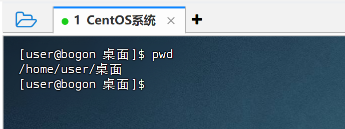

如图当前工作目录处于： /home/user/桌面

现在想要，向上回退一级，切换到/home/user 中，如何做？

- 可以通过 cd，即可回到 home 目录
- 也可以通过特殊路径符来完成

**特殊路径符：**

- **.** 表示当前目录，比如 **cd ./Desktop** 表示切换到当前目录下的Desktop目录内，和**cd Desktop**效果一致
- **..** 表示上一级目录，比如：**cd ..** 即可切换到上一级目录，**cd ../..** 切换到上二级的目录
- **~** 表示HOME目录，比如：**cd ~** 即可切换到HOME目录 或 **cd ~/Desktop**，切换到HOME内的Desktop目录, **~** 永远指向当前登录用户的主目录

## 8.8. 创建目录命令（mkdir）

---

### 8.8.1. mkdir命令创建新的目录（文件夹）

**mkdir**来自英文：**M**a**k**e **Dir**ectory  
语法: `**mkdir** [-p] Linux` 路径

- 参数**必填**，表示Linux路径，即要创建的文件夹的路径，相对路径或绝对路径均可
- **-p**选项可选，表示自动创建不存在的父目录，适用于创建连续多层级的目录

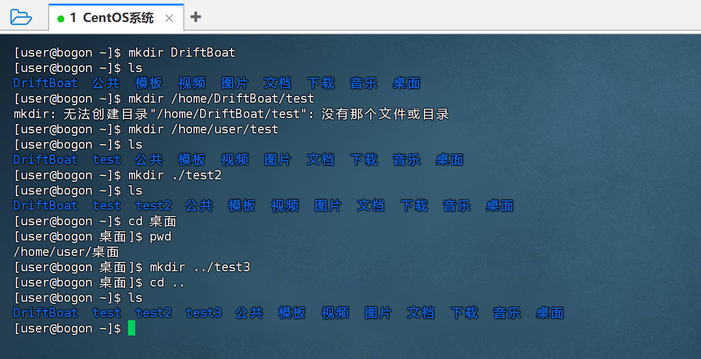

### 8.8.2. mkdir -p 选项

如果想要一次性创建多个层级的目录，如下图

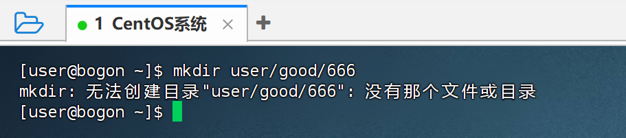

会报错，因为上级目录 itcast 和 good 并不存在，所以无法创建 666 目录

可以通过**-p** 选项，将一整个链条都创建完成

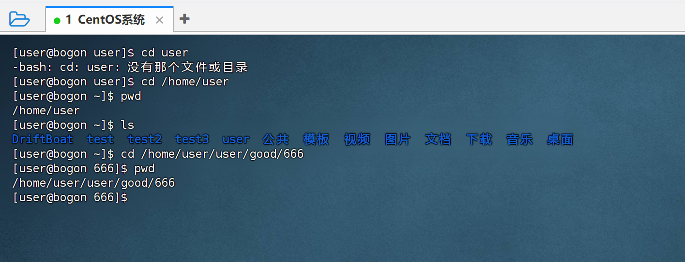

注意：**创建文件夹需要修改权限，请确保操作均在HOME目录内，不要在HOME外操作  
****涉及到权限问题，HOME外无法成功**  
后续我们会讲解权限管控的知识

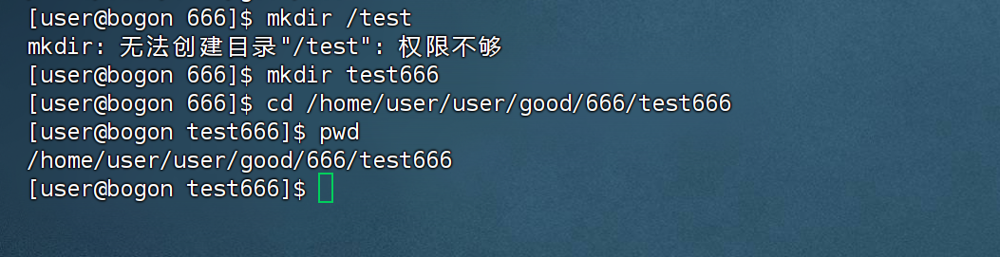

## 8.9. 文件操作命令

### 8.9.1. touch、cat、more 命令

---

1. **touch 创建文件:**  
    可以通过touch命令创建文件  
    语法： **touch** **Linux路径**

- touch命令无选项，**参数必填**，表示要创建的文件路径，相对、绝对、特殊路径符均可以使用

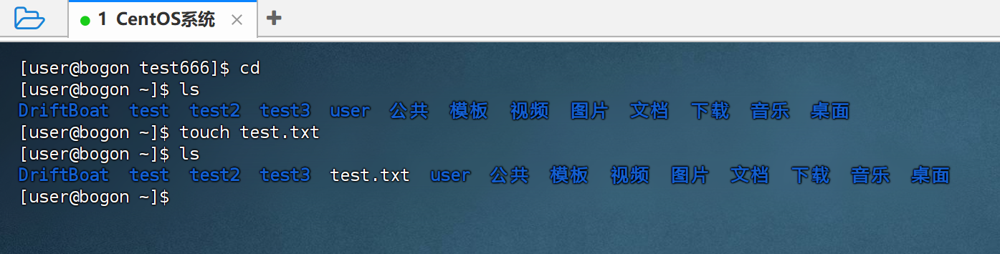

---

2. **cat 命令查看文件内容：**

准备好文件内容后，可以通过**cat**查看内容。  
语法： **cat** **Linux路径**

- cat同样没有选项，只有**必填参数**，参数表示：被查看的文件路径，相对、绝对、特殊路径符都可以使用

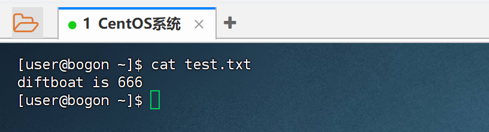

---

3. **more 命令：分页查看文件内容：**

**基本功能**

`more` 命令用于查看文件内容，与 `cat` 类似，但更适合查看**较长的文件**。

---

**与 cat 的区别**

|   |   |   |
|---|---|---|
|特性|`cat`|`more`|
|显示方式|直接将文件内容**全部显示**在终端中|支持**分页翻页**，一页一页展示|
|适用场景|文件较短时使用|文件内容较多时推荐使用|

使用 `more` 可以避免内容过长导致终端被刷屏，便于阅读。

---

**语法格式**

```
more Linux路径
```

- **无选项**：`more` 命令不支持常用选项。
- **参数必填**：必须指定要查看的文件路径。

- 支持：

- 相对路径（如：`my_file.txt`）
- 绝对路径（如：`/home/itheima/test.txt`）
- 特殊路径符（如：`~/notes.txt`）

---

**使用示例**

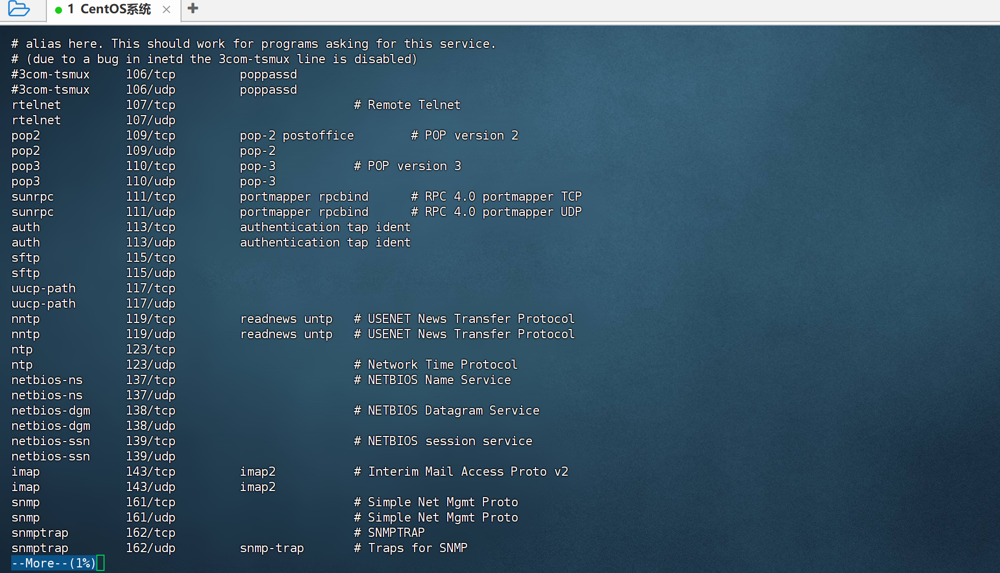

📌 查看时，按 **空格键** 翻页，按 `**q**` 键退出。

**注意事项**

- 若文件较小，`more` 和 `cat` 效果类似，但 `more` 更安全。
- 对于大文件，建议优先使用 `more` 或 `less`（更强大的分页工具）。

---

**分辨文件和文件夹：**

1.文件夹一般是紫色，文件一般是白色

2.使用 ls -l 命令：以 d 开头是就是文件夹，以 - 开头的就是文件

---

### 8.9.2. cp、mv、rm 命令

1. **cp 命令复制文件 \ 文件夹，cp 命令来自英文单词：****c****op****y**

`**cp**` **命令语法说明**：

```
cp [-r] 参数1 参数2
```

- `**-r**` **选项**（可选）：用于复制目录，表示**递归复制**（recursive）
- **参数1**：Linux 路径，表示**被复制的文件或文件夹**
- **参数2**：Linux 路径，表示**目标位置**（即要复制到的地方）

示例：

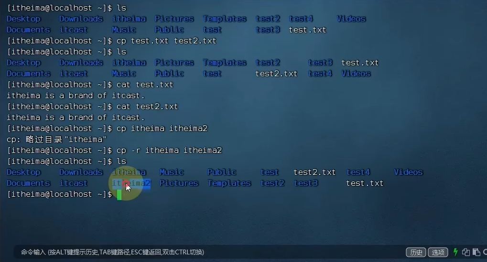

---

2. `**mv**` **命令说明**：

- **用途**：用于移动文件/文件夹，也可用于重命名；命令源自英文单词 **m****o****v****e**
- **语法**：

```
mv 参数1 参数2
```

- **参数1**：Linux 路径，表示**被移动的文件或文件夹**
- **参数2**：Linux 路径，表示**目标位置**

- 若目标路径**不存在** → 视为**重命名**操作（将源文件改名为参数2）
- 若目标路径**存在且为目录** → 将源文件/夹移入该目录
- 若目标路径**存在且为文件** → 通常会覆盖（需注意权限与 `-i` 交互选项）

示例：  
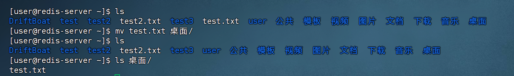

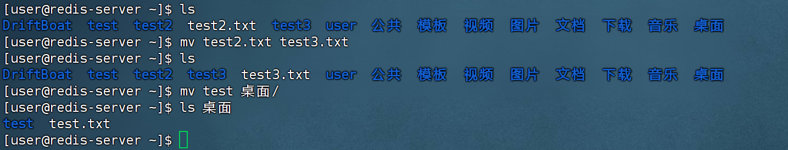

---

3. `**rm**` **命令说明**：

- **用途**：删除文件或目录
- **词源**：源自英文单词 **r****e****m****ove**
- **语法**：

```
rm [-r -f] 参数1 参数2 …… 参数N
```

- **选项说明**：

- `-r`：递归删除（用于删除**目录及其内容**，类似 `cp -r` 的逻辑）
- `-f`：强制删除（**force**），不提示确认；

- 普通用户删除时通常无提示；
- root 用户删除时默认会有提示，加 `-f` 可跳过；
- ⚠️ 高风险操作，慎用

- **参数**：  
    `参数1`, `参数2`, …, `参数N` —— 表示要删除的**一个或多个文件/目录路径**，以空格分隔

示例：

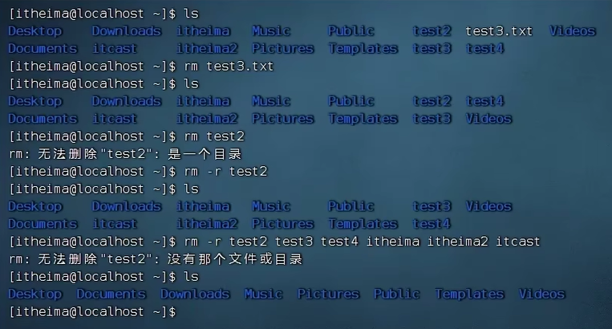

---

`**rm**` **命令中的通配符** `*****` **模糊匹配规则**：

- `*` 是 **通配符（wildcard）**，表示匹配**任意内容（含空字符串）**
- 常用于路径或文件名匹配，示例如下：

- `test*` → 匹配以 `test` 开头的文件/目录（如 `test.txt`, `test123`, `test`）
- `*test` → 匹配以 `test` 结尾的文件/目录（如 `a_test`, `mytest`, `test`）
- `*test*` → 匹配**包含**`test` 的任意名称（如 `test`, `atestb`, `x_test_y`）

⚠️ 注意：

- `*` 由 **Shell 解析**（非 `rm` 自身处理），在执行前已展开为实际路径列表；
- 若无匹配项，部分 Shell 会原样传递 `*test*` 给 `rm`，可能导致报错（如 `rm: cannot remove '*test*': No such file or directory`）；
- 使用时建议先用 `ls *pattern*` 预览匹配结果，避免误删。

演示：

- 删除所有 test 开头的文件或文件夹

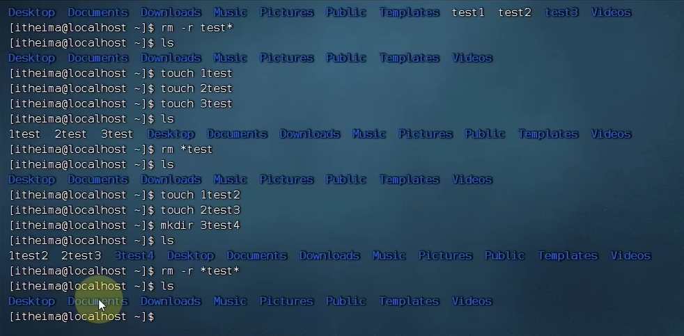

---

## 8.10. 查找命令（which、find）

### 8.10.1. which 命令

我们在前面学习的Linux命令，其实它们的本体就是一个个的二进制可执行程序。  
和Windows系统中的.exe文件，是一个意思。

我们可以通过which命令，查看所使用的一系列命令的程序文件存放在哪里  
语法： **which** 要查找的命令

```
[itheima@bogon ~]$ which cd
/usr/bin/cd
[itheima@bogon ~]$ which pwd
/usr/bin/pwd
[itheima@bogon ~]$ which touch
/usr/bin/touch
[itheima@bogon ~]$ which mkdir
/usr/bin/mkdir
[itheima@bogon ~]$ which cp
/usr/bin/cp
[itheima@bogon ~]$ which mv
/usr/bin/mv
```

---

### 8.10.2. find 命令 - 按文件名查找文件

同样，在 **Linux** 系统中，我们可以通过 `find` 命令去搜索指定的文件。

**语法：**

```
find 起始路径 -name "被查找文件名"
```

**说明：**

- `find`：文件查找命令。
- `起始路径`：指定从哪个目录开始搜索。
- `-name`：按照文件名进行搜索的参数。

---

### 8.10.3. find 命令 - 通配符

根据语法：`find 起始路径 -name "被查找文件名"`

被查找文件名，支持使用通配符 `*` 来做模糊查询。

- **符号** `*****`：表示通配符，即匹配任意内容（包含空）。

**示例说明：**

- `test*`：表示匹配任何以 **test** 开头的内容。
- `*test`：表示匹配任何以 **test** 结尾的内容。
- `*test*`：表示匹配任何包含 **test** 的内容。

基于通配符的含义，可以结合 `find` 命令做文件的模糊查询。

---

### 8.10.4. find 命令 - 按文件大小查找文件

**语法：**

```
find 起始路径 -size +|-n[kMG]
```

**参数说明：**

- `+`、`-`：分别表示“大于”和“小于”。
- `n`：表示具体的大小数值。
- `kMG`：表示大小单位，其中 `k`（小写字母）代表 KB，`M` 代表 MB，`G` 代表 GB。

**示例：**

- 查找小于 10KB 的文件：`find / -size -10k`
- 查找大于 100MB 的文件：`find / -size +100M`
- 查找大于 1GB 的文件：`find / -size +1G`

---

## 8.11. grep、wc 和管道符

### 8.11.1. grep 命令

可以通过 **grep** 命令，从文件中通过关键字**过滤文件行**。

**语法：**

```
grep [-n] 关键字 文件路径
```

**参数说明：**

- **选项** `**-n**`：可选，表示在结果中显示匹配的行的行号。
- **参数** `**关键字**`：必填，表示过滤的关键字。如果关键字带有空格或其它特殊符号，建议使用 `""`（双引号）将关键字包围起来。
- **参数** `**文件路径**`：必填，表示要过滤内容的文件路径，**可作为内容输入端口**。

---

### 8.11.2. wc 命令

可以通过 **wc** 命令统计文件的行数、单词数量等。

**语法：**

```
wc [-c -m -l -w] 文件路径
```

**选项说明：**

- **选项** `**-c**`：统计 bytes 数量（字节数）。
- **选项** `**-m**`：统计字符数量。
- **选项** `**-l**`：统计行数。
- **选项** `**-w**`：统计单词数量。

**参数说明：**

- **参数** `**文件路径**`：被统计的文件，**可作为内容输入端口**。

---

### 8.11.3. 管道符

学习了 `grep` 命令后，我们来学习一个新的特殊符号：**管道符（**`**|**`**）**。

**管道符的含义：**  
将管道符左边命令的结果，作为右边命令的输入。

**示例命令：**

```
cat itheima.txt | grep itheima
```

**执行过程解析：**

- `cat itheima.txt` 的输出结果（即文件内容）
- 作为右边 `grep` 命令的输入（被过滤的内容）

**命令输出：**

```
itheima is a brand of itcast.
```

---

## 8.12. echo、tail 和重定向符

### 8.12.1. echo 命令

可以使用 **echo** 命令在命令行内输出指定内容。

**语法：**

```
echo 输出的内容
```

**使用说明：**

- 无需选项，只有一个参数，表示要输出的内容。
- 如果内容复杂（例如包含空格或特殊符号），建议用 `""`（双引号）将其包围。

**演示：**

- **在终端上显示：Hello Linux**

```
[itheima@bogon ~]$ echo Hello Linux
Hello Linux
```

- **带有空格或** `**\**` **等特殊符号，建议使用双引号包围**

- **原因**：如果不包围，空格后的内容很容易被识别为第二个参数。尽管 `echo` 命令本身不受影响，但养成这个习惯对使用其他命令非常重要。

```
[itheima@bogon ~]$ echo "Hello Linux"
Hello Linux
```

---

### 8.12.2. 反引号 `

问题示例：`echo pwd`

```
[itheima@bogon ~]$ echo pwd
pwd
```

**问题分析：**  
本意是想输出当前的工作路径，但 `pwd` 被作为普通字符输出了，而不是执行 `pwd` 命令。

解决方案：使用**反引号（`）**

我们可以通过将命令用 **反引号**（通常也称之为 **飘号**）**`** 将其包围。

**作用：**  
被 **`** 包围的内容，会被作为命令执行，而非普通字符。

正确示例：

```
[itheima@bogon ~]$ echo `pwd`
/home/itheima
```

---

### 8.12.3. 重定向符

我们来学习两个特殊符号，**重定向符**：`>` 和 `>>`

- `**>**`：将左侧命令的结果，**覆盖**写入到符号右侧指定的文件中。
- `**>>**`：将左侧命令的结果，**追加**写入到符号右侧指定的文件中。

演示

- `**echo "Hello Linux" > itheima.txt**`

```
[itheima@bogon ~]$ echo "Hello Linux" > itheima.txt
[itheima@bogon ~]$ cat itheima.txt
Hello Linux
```

- `**echo "Hello itheima" > itheima.txt**`，再次执行，**覆盖新内容**。

```
[itheima@bogon ~]$ echo "Hello itheima" > itheima.txt
[itheima@bogon ~]$ cat itheima.txt
Hello itheima
```

- `**echo "Hello itcast" >> itheima.txt**`，再次执行，使用 `>>` **追加新内容**。

```
[itheima@bogon ~]$ echo "Hello itcast" >> itheima.txt
[itheima@bogon ~]$ cat itheima.txt
Hello itheima
Hello itcast
```

---

### 8.12.4. tail 命令

使用 `tail` 命令，可以查看文件尾部内容，跟踪文件的最新更改。

**语法：**

```
tail [-f -num] Linux路径
```

**参数与选项说明：**

- **参数** `**Linux路径**`：表示被跟踪的文件路径。
- **选项** `**-f**`：表示持续跟踪。
- **选项** `**-num**`：表示查看尾部多少行，不填默认 10 行。

---

## 8.13. vi 编辑器

---

## 🔗 关联笔记
- [[Docker笔记]]
- [[Git笔记]]
