- 下载 jar 包（mvn）
- 将下载的 jar 包拷贝到项目中（WEB-INF/lib）
- 选择 jar 文件 - 右键 - **Add as Library**

## 1.2 传统导入 jar 包的方式存在什么问题？

- 步骤多 -- 繁琐
- 在不同项目中如果需要相同的 jar 包，需要分别存储这个 jar 文件 -- 冗余、项目体积大
- 在不同的环境下看可能因为 jar 文件版本不一致导致项目无法运行（重新配置）-- 移植性差

## 1.3 项目生命周期

项目从编译到运行的整个过程  
完整的生命周期：清理缓存—校验—编译—测试—打包—安装—部署

- IDEA 提供了一键构建项目的功能，但是如果我们需要自定义的生命周期管理，却没有现成的工具（清理缓存）

## 1.4 Maven 简介

Maven 是一个基于项目对象模型（POM）用于进行项目的依赖管理、生命周期管理的工具软件

**核心功能**

- 依赖管理
- 生命周期管理
- 聚合工程

# 二、Maven 安装及配置

## 2.1 Maven下载

- [http://maven.apache.org/download.cgi](http://maven.apache.org/download.cgi)

## 2.2 Maven安装

Maven是基于Java语言进行开发的，因此依赖JDK（建议JDK1.7+）

开箱即用：直接解压即可

- 解压(d/mvn)
- 目录结构：

bin： 存放指令文件(Maven提供了一个mvn指令)

boot：包含了一个类加载框架的jar文件

conf：包含了Maven的核心配置文件settings.xml

lib： 存放了maven运行所需的jar文件

## 2.3 配置环境变量

- MAVEN_HOME D:\mvn\apache-maven-3.6.3
- Path %MAVEN_HOME %bin

# 三、Maven 的项目结构

---

使用 Maven 进行项目还有一个好处；无论使用什么样的开发工具（eclipse/idea）项目的结构是统一的。

## 3.1 Maven 的项目结构

```
my-project/									-- 项目名称
├── pom.xml                 -- 项目核心配置文件
├── src/
│   ├── main/               -- 主代码（生产环境代码）
│   │   ├── java/           -- Java 源代码
│   │   ├── resources/      -- 资源文件（配置文件、XML等）
│   │   └── webapp/         -- Web应用资源（仅限Web项目，如JSP、WEB-INF）
│   └── test/               -- 测试代码
│       ├── java/           -- 测试用例源代码（如JUnit）
│       └── resources/      -- 测试专用资源文件
└── target/                 -- 构建输出目录（自动生成）
    ├── classes/            -- 编译后的主类文件
    ├── test-classes/       -- 编译后的测试类文件
    └── my-project-1.0.jar  -- 最终打包产物
```

## 3.2 pom.xml

POM Project Object Model ，Maven 可以根据 pom 文件的配置对此项目进行依赖管理；也就是说项目中需要依赖，直接在 pom.xml 进行配置即可。

```
<?xml version="1.0" encoding="UTF-8"?>
<project xmlns="http://maven.apache.org/POM/4.0.0"
  xmlns:xsi="http://www.w3.org/2001/XMLSchema-instance"
  xsi:schemaLocation="http://maven.apache.org/POM/4.0.0 
  http://maven.apache.org/xsd/maven-4.0.0.xsd">

  <!-- 指定POM模型版本，Maven 2 和 3 必须为 4.0.0 -->
  <modelVersion>4.0.0</modelVersion>

  <!-- 1. 项目坐标 (唯一标识) -->
  <groupId>com.example</groupId>
  <artifactId>my-app</artifactId>
  <version>1.0.0-SNAPSHOT</version>
  
  <packaging>jar</packaging> <!-- 打包方式: jar, war, pom 等 -->

  <!-- 2. 项目元数据 -->
  <name>My Application</name>
  <description>A sample Maven project</description>
  <url>http://www.example.com</url>

  <!-- 3. 父项目配置 (可选，用于继承) -->
  <!--
  <parent>
  <groupId>org.springframework.boot</groupId>
  <artifactId>spring-boot-starter-parent</artifactId>
  <version>3.1.0</version>
  <relativePath/> 
</parent>
  -->

  <!-- 4. 属性配置 (定义变量) -->
  <properties>
    <maven.compiler.source>17</maven.compiler.source>
    <maven.compiler.target>17</maven.compiler.target>
    <project.build.sourceEncoding>UTF-8</project.build.sourceEncoding>
    <junit.version>5.10.0</junit.version>
  </properties>

  <!-- 5. 依赖管理 -->
  <dependencies>
    <!-- 示例：JUnit 5 测试依赖 -->
    <dependency>
      <groupId>org.junit.jupiter</groupId>
      <artifactId>junit-jupiter</artifactId>
      <version> $ {junit.version}</version>
      <scope>test</scope>
    </dependency>

    <!-- 示例：Lombok 依赖 -->
    <!--
    <dependency>
    <groupId>org.projectlombok</groupId>
    <artifactId>lombok</artifactId>
    <version>1.18.30</version>
    <scope>provided</scope>
  </dependency>
    -->
  </dependencies>

  <!-- 6. 构建配置 -->
  <build>
    <finalName> $ {artifactId}</finalName> <!-- 最终打包文件名 -->

    <!-- 资源文件配置 -->
    <resources>
      <resource>
        <directory>src/main/resources</directory>
        <filtering>true</filtering> <!-- 开启过滤，允许替换占位符 -->
      </resource>
    </resources>

    <!-- 插件配置 -->
    <plugins>
      <!-- 编译插件 -->
      <plugin>
        <groupId>org.apache.maven.plugins</groupId>
        <artifactId>maven-compiler-plugin</artifactId>
        <version>3.11.0</version>
        <configuration>
          <source> $ {maven.compiler.source}</source>
          <target> $ {maven.compiler.target}</target>
        </configuration>
      </plugin>

      <!-- 打包可执行 JAR (如果是 Spring Boot 项目需要) -->
      <!--
      <plugin>
      <groupId>org.springframework.boot</groupId>
      <artifactId>spring-boot-maven-plugin</artifactId>
      <version>3.1.0</version>
    </plugin>
      -->
    </plugins>
  </build>

  <!-- 7. 多环境配置 (Profiles) -->
    <profiles>
        <profile>
            <id>dev</id>
            <properties>
                <env>development</env>
            </properties>
            <activation>
                <activeByDefault>true</activeByDefault> <!-- 默认激活 -->
            </activation>
        </profile>
        <profile>
            <id>prod</id>
            <properties>
                <env>production</env>
            </properties>
        </profile>
    </profiles>

</project>
```

# 四、依赖管理

---

## 4.1 Maven 依赖管理的流程

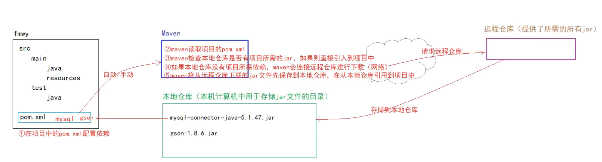

## 4.2 Maven 仓库介绍

- 本地仓库：就是计算机上的某个文件夹（可以是自定义的任何文件夹）
- 远程仓库：就是远程主机上的 jar 文件仓库

中央仓库：Maven 官方提供的仓库，包含了所需的一切依赖（免配置）

公共仓库：除了中央仓库以外的第三方仓库都是公共仓库，例如 aliyun (需要配置)

私服：企业搭建的供内部使用的 Maven 仓库

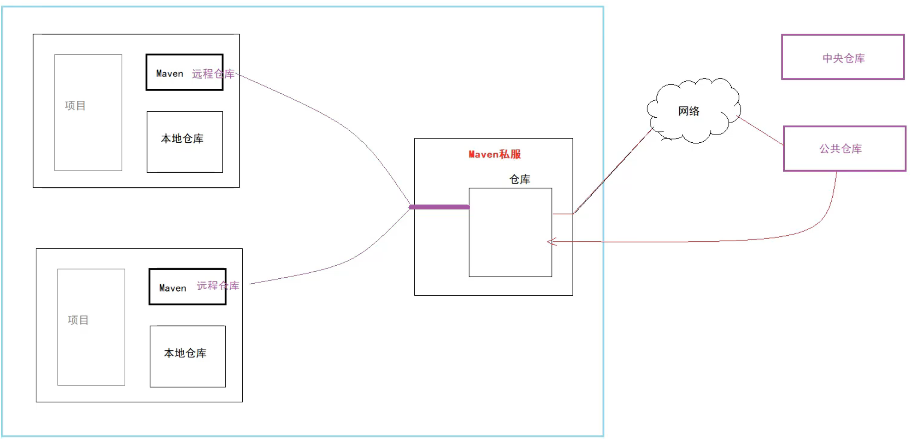

## 4.3 Maven 仓库配置

- 在maven_home/conf/settings.xml中进行配置

**配置本地仓库**

```
<localRepository>D:/Study/Java/utils/maven/repository</localRepository>
```

**配置公共仓库**

```
<mirrors>
    <!-- 阿里云 -->
    <mirror>
      <id>aliyun-maven</id>
      <mirrorOf>central</mirrorOf>
      <url>https://maven.aliyun.com/repository/public</url>
      <blocked>false</blocked>
    </mirror>
  </mirrors>
```

**检测是否成功**

在命令行窗口输入以下指令：

```
mvn help:system
```

看看你的本地仓库文件里面是否多出来一些文件

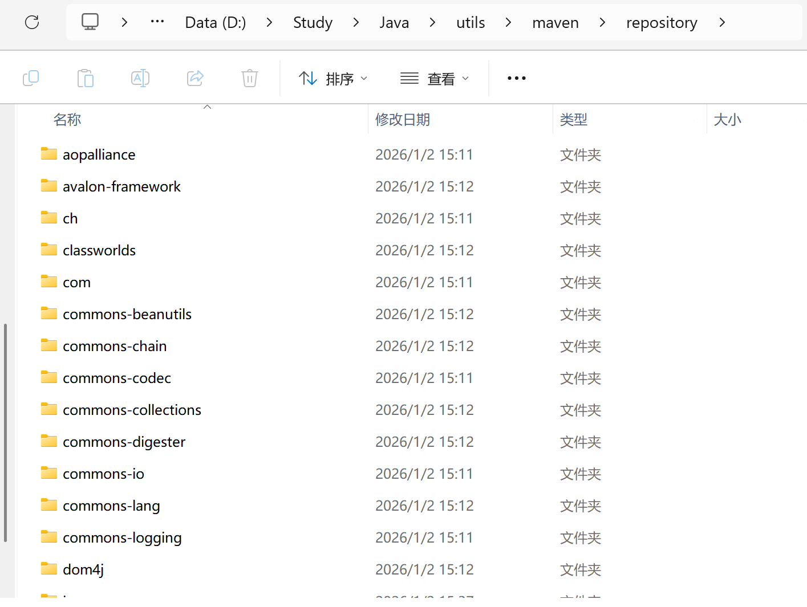

如果有就说明配置成功了

# 五、项目生命周期管理

---

## 5.1 生命周期介绍

项目构建的声明周期：项目开发结束之后部署到运行环境运行的过程

- 清除缓存
- 检查
- 编译
- 测试（就会执行maven项目中test目录下的单元测试）
- 打包（war、jar）
- 安装（jar会被安装到本地仓库）
- 部署（将项目生成的包放到外部服务器中-私服仓库）

## 5.2 生命周期管理指令

在项目的根目录下执行 mvn 命令（此目录下必须包含 pom.xml）

- 清除缓存

```
mvn clean
```

- 检查

```
mvn check
```

- 编译

```
mvn compile
```

- 打包

```
mvn package
```

- 安装

```
mvn install
```

- 部署

```
mvn deploy
```

# 六、基于 IDEA 的 Maven 使用

## 6.1 在 IDEA 中关联 Maven

**局部配置：**

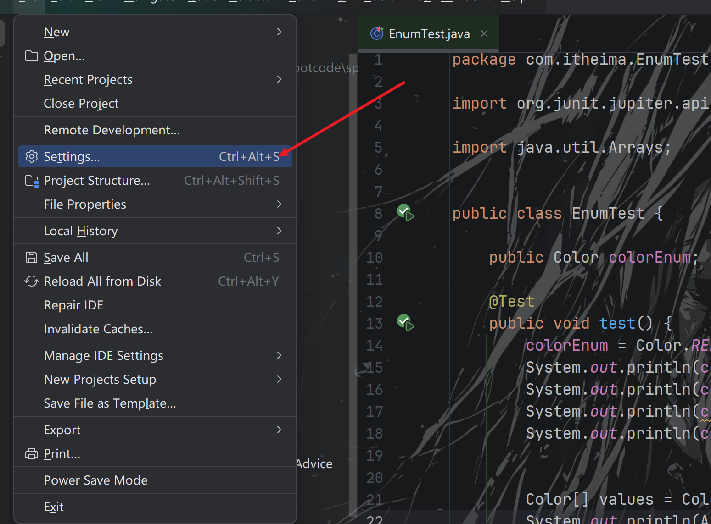

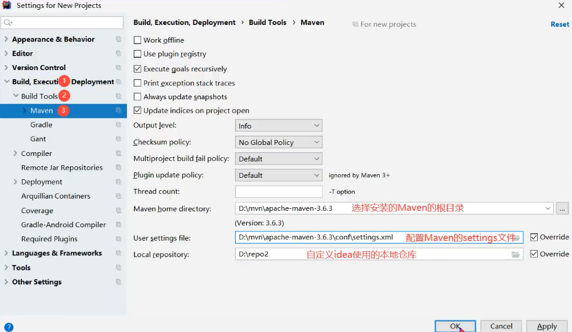

**全局配置：**

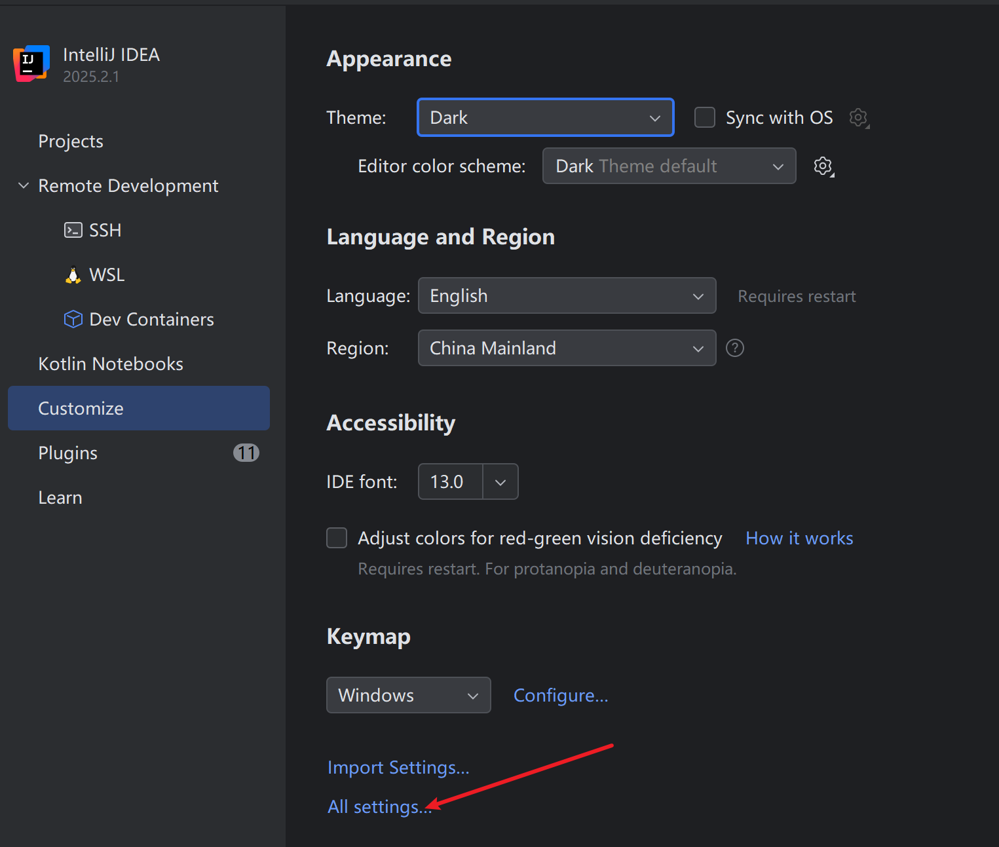

进去后就和局部配置一样的操作

说明：IDEA 本身集成了 Maven，考虑到 IDEA 和 Maven 版本的兼容性，IDEA 不建议配置比默认版本更新的版本，建议使用 IDEA 自带的 Maven。

## 6.2 使用 IDEA 创建 Maven 项目

### 6.2.1 创建 Java 项目

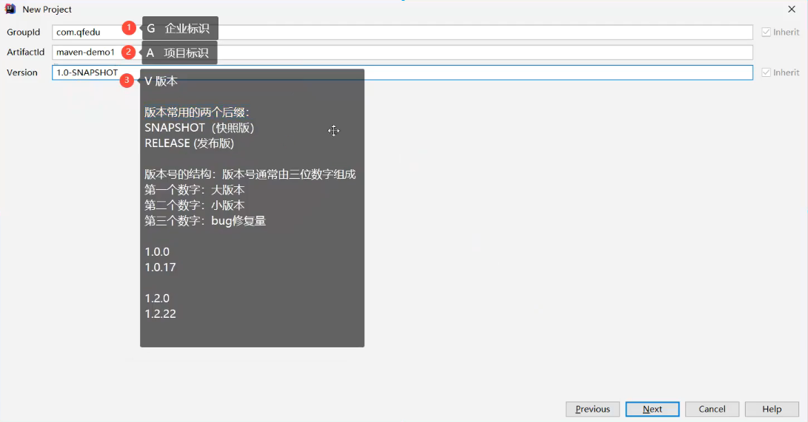

### 6.2.2 创建 Web 项目

- 创建 Maven 项目
- 在 pom.xml 文件中设置项目打包方式为 war 包

```
<packaging>war</packaging>
```

- 完成 web 项目结构

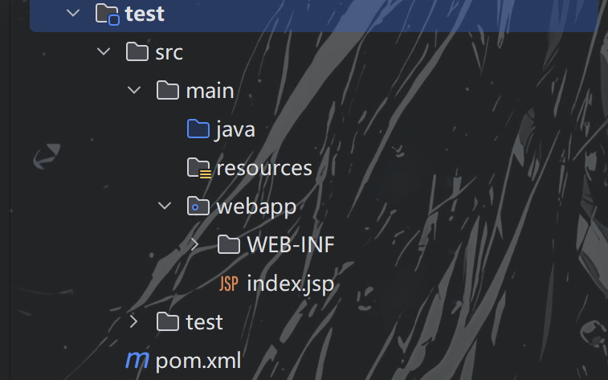

- 配置 web 组件 -- Tomcat

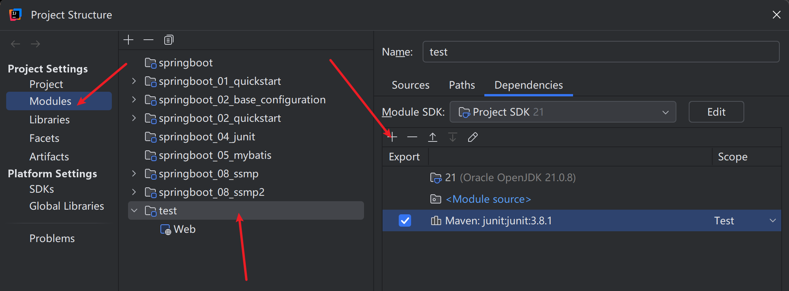

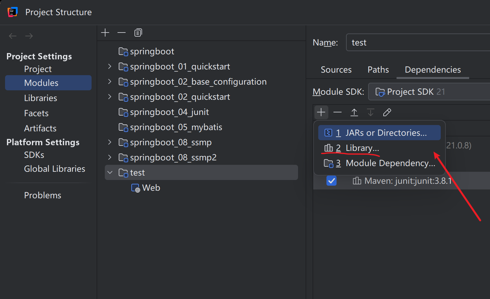

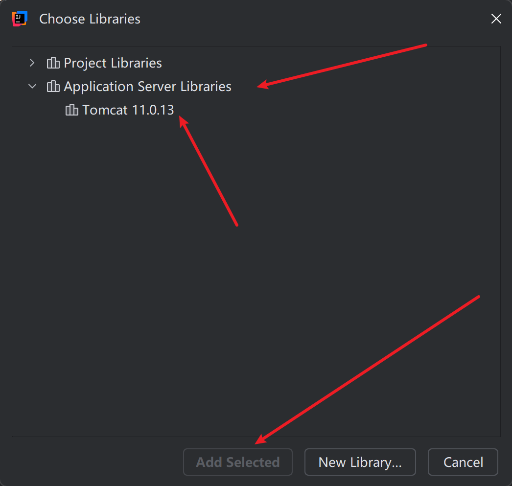

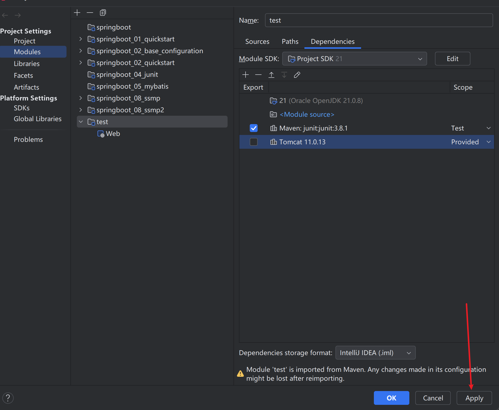

- 部署 web 项目

## 6.3 在 IDEA 中使用 Maven 进行依赖管理

### 6.3.1 查找依赖坐标

- [https://mvnrepository.com/](https://mvnrepository.com/)

### 6.3.2 添加依赖

- 将依赖的坐标配置到项目的 pom.xml 文件 dependencies

### 6.3.3 依赖范围

在通过dependency添加依赖时，可以通过scope标签配置当前依赖的适用范围

- test 只在项目测试阶段引入当前依赖(编译、测试)

```
  <dependency>
    <groupId>junit</groupId>
    <artifactId>junit</artifactId>
    <version>3.8.1</version>
    <scope>test</scope>
  </dependency>
```

- runtime 只在运行时使用(运行、测试运行)
- provided在(编译、测试、运行)
- compile在(编译、测试、运行、打包)都引入

## 6.4 在 IDEA 中使用 Maven 进行项目构建

### 6.4.1 Maven 项目构建生命周期说明

- clean 清理缓存 清理项目生成的缓存
- validate 校验验证项目需要是正确的(项目信息、依赖)
- compile 编译编译项目专供的源代码
- test 测试运行项目中的单元测试
- package 打包将项目编译后的代码打包成发布格式
- verify 检查对集成测试的结果进行检查，确保项目的质量是达标的
- install 安装将包安装到maven的本地仓库，以便在本地的其他项目中可以引用此项目(聚合工程)
- site
- deploy 部署将包安装到私服的仓库，以供其他开发人员共享

### 6.4.2 IDEA 进行生命周期管理

- 可视化

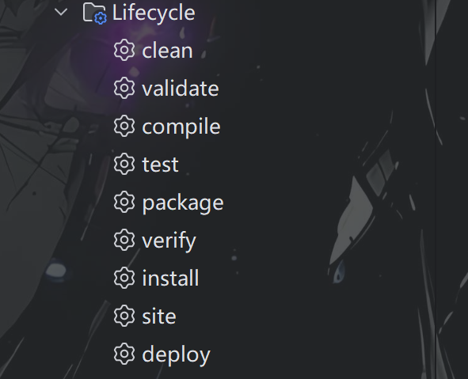

- 终端命令

选择项目名称 - 右键 - open in Terminal

例如： mvn clean

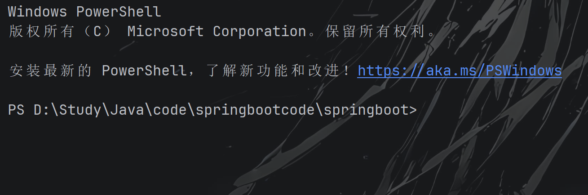

# 七、私服

企业搭建供内部使用

## 7.1 私服搭建

### 7.1.1 下载 nexus

- 官网 [https://www.sonatype.com/products/repository](https://www.sonatype.com/products/repository)
- 下载 [Download Archives - Repository Manager 3](https://help.sonatype.com/repomanager3/product-information/download/download-archives---repository-manager-3)

### 7.1.2 解压 nexus

### 7.1.3 安装并运行 nexus

[https://blblbl.blog.csdn.net/article/details/132579773?fromshare=blogdetail&sharetype=blogdetail&sharerId=132579773&sharerefer=PC&sharesource=UnmooredBoat&sharefrom=from_link](https://blblbl.blog.csdn.net/article/details/132579773?fromshare=blogdetail&sharetype=blogdetail&sharerId=132579773&sharerefer=PC&sharesource=UnmooredBoat&sharefrom=from_link)

---

# 八、 Maven 聚合工程

---

## 8.1 Maven 聚合工程概念

Maven 聚合工程：就是可以在一个 Maven 父工程中创建多个组件（项目）这个多个组件之间可以相互依赖，实现组件的复用

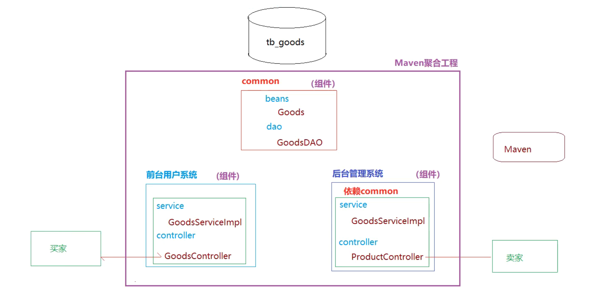

## 8.2 创建 Maven 聚合工程

Maven 聚合工程的父工程 packing 必须为 pom

### 8.2.1 创建 Maven 父工程

- 创建一个 Maven 工程
- 修改父工程的 **pom.xml**，设置打包方式为 **pom**

```
<?xml version="1.0" encoding="UTF-8"?>
<project xmlns="http://maven.apache.org/POM/4.0.0"
  xmlns:xsi="http://www.w3.org/2001/XMLSchema-instance"
  xsi:schemaLocation="http://maven.apache.org/POM/4.0.0 
  http://maven.apache.org/xsd/maven-4.0.0.xsd">
  <modelVersion>4.0.0</modelVersion>

  <groupId>com.qfedu</groupId>
  <artifactId>maven-parent</artifactId>
  <version>1.0.0</version>
  <packaging>pom</packaging>
</project>
```

- 父工程用于管理子工程，不进行业务实现，因此 **src** 目录库选择性删除

### 8.2.2 创建 Module

- 选择父工程--右键--New--Module
- 输入子工程名称
- 子工程的 pom 文件：

```
<?xml version="1.0" encoding="UTF-8"?>
<project xmlns="http://maven.apache.org/POM/4.0.0"
         xmlns:xsi="http://www.w3.org/2001/XMLSchema-instance"
         xsi:schemaLocation="http://maven.apache.org/POM/4.0.0 http://maven.apache.org/xsd/maven-4.0.0.xsd">
    <modelVersion>4.0.0</modelVersion>
  
    <parent>
        <groupId>com.unmooredboat</groupId>
        <artifactId>maven-partent</artifactId>
        <version>1.0-SNAPSHOT</version>
    </parent>

    <artifactId>common</artifactId>

    <properties>
        <maven.compiler.source>21</maven.compiler.source>
        <maven.compiler.target>21</maven.compiler.target>
        <project.build.sourceEncoding>UTF-8</project.build.sourceEncoding>
    </properties>

</project>
```

- 父工程的 pom 文件：

```
<?xml version="1.0" encoding="UTF-8"?>
<project xmlns="http://maven.apache.org/POM/4.0.0"
         xmlns:xsi="http://www.w3.org/2001/XMLSchema-instance"
         xsi:schemaLocation="http://maven.apache.org/POM/4.0.0 http://maven.apache.org/xsd/maven-4.0.0.xsd">
    <modelVersion>4.0.0</modelVersion>

    <groupId>com.unmooredboat</groupId>
    <artifactId>maven-partent</artifactId>
    <version>1.0-SNAPSHOT</version>
    <packaging>pom</packaging>

    <!--声明当前父工程的子module-->
    <modules>
        <module>common</module>
    </modules>


    <properties>
        <maven.compiler.source>21</maven.compiler.source>
        <maven.compiler.target>21</maven.compiler.target>
        <project.build.sourceEncoding>UTF-8</project.build.sourceEncoding>
    </properties>

</project>
```

## 8.3 Maven 聚合工程依赖继承

### 8.3.1 依赖继承

- 在父工程的 pom 文件添加依赖，会被子工程继承

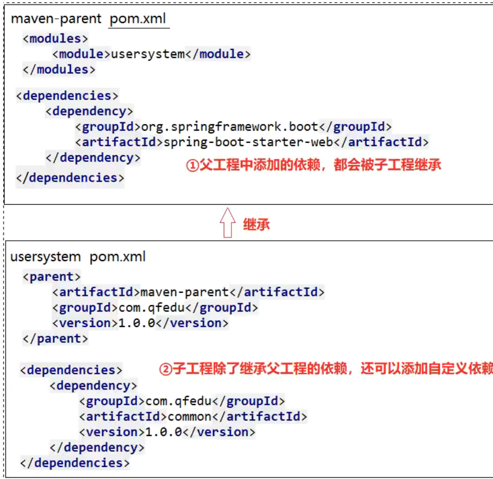

### 8.3.2 依赖版本管理

在父工程的 pom.xml 的 dependencyManagement 中添加依赖，表示定义子工程中依赖的默认版本（此定义并不会让子工程中添加当前依赖）

```
<!--dependencyManagement 中添加依赖的默认版本，表示定义子工程中依赖的默认版本-->
<dependencyManagement>
    <dependencies>
        <dependency>
            <groupId>com.google.code.gson</groupId>
            <artifactId>gson</artifactId>
            <version>2.6.1</version>
        </dependency>
    </dependencies>
</dependencyManagement>
```

---

## 🔗 关联笔记
- [[Maven笔记]]
- [[Git笔记]]
