# 1. Maven 概述

## 1.1. 什么是 Maven


## 1.2. Maven 的作用

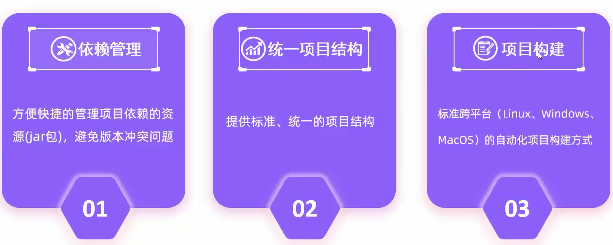

### 1.2.1. 依赖管理

Maven 的依赖管理是指通过 `pom.xml` 文件声明项目所依赖的第三方库（JAR 包），Maven 会自动从中央仓库或配置的远程仓库下载这些依赖，并处理它们之间的传递性依赖（即依赖的依赖），从而简化项目的构建和维护。

**简要概述：**

- **声明式管理**：在 `pom.xml` 中使用 `<dependencies>` 标签列出所需依赖。
- **自动下载**：Maven 自动从仓库（如 Maven Central）下载依赖 JAR 包。
- **传递性依赖**：自动引入间接依赖，避免手动添加所有子依赖。
- **版本冲突解决**：Maven 使用“最近优先”策略解决版本冲突。

**举例说明：**

假设你的 Java 项目需要使用 JUnit 进行单元测试，只需在 `pom.xml` 中添加：

```
<dependencies>
    <dependency>
        <groupId>junit</groupId>
        <artifactId>junit</artifactId>
        <version>4.13.2</version>
        <scope>test</scope>
    </dependency>
</dependencies>
```

Maven 会：

1. 自动下载 `junit-4.13.2.jar`；
2. 如果 JUnit 本身依赖其他库（如 `hamcrest-core`），也会自动下载；
3. 将这些 JAR 包加入项目的 classpath（测试阶段）。

这样，开发者无需手动管理 JAR 文件，提高了开发效率和项目可维护性。

---

### 1.2.2. 统一项目结构

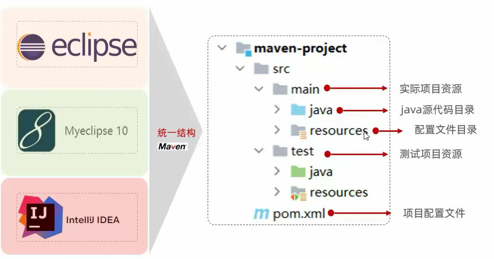

---

### 1.2.3. 项目构建

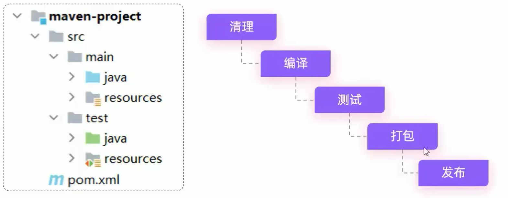

---

## 1.3. **Maven 总结**

- **Apache Maven** 是一个项目管理和构建工具，它基于项目对象模型（POM）的概念，通过一小段描述信息来管理项目的构建。
- **作用：**

➤ 方便的依赖管理  
➤ 统一的项目结构  
➤ 标准的项目构建流程

- **官网：**[http://maven.apache.org/](http://maven.apache.org/)

---

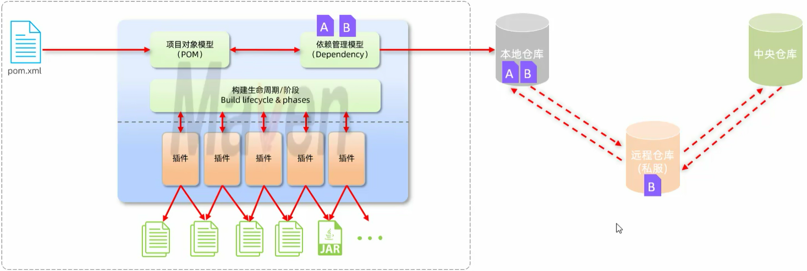

---

**仓库：** 用于存储资源，管理各种 jar 包。

- **本地仓库：** 自己计算机上的一个目录。
- **中央仓库：** 由 Maven 团队维护的全球唯一的。仓库地址：[https://repo1.maven.org/maven2/](https://repo1.maven.org/maven2/)
- **远程仓库（私服）：** 一般由公司团队搭建的私有仓库。

---

**说明**

- **本地仓库**：Maven 下载依赖后会缓存到本地，避免重复下载，通常位于用户主目录下的 `.m2/repository`。
- **中央仓库**：官方公共仓库，包含绝大多数开源项目的 jar 包。
- **远程仓库（私服）**：企业内部搭建的镜像或私有仓库，用于存放公司内部组件或加速访问（如 Nexus、Artifactory）。

工作流程：

1. Maven 先检查本地仓库是否有依赖；
2. 若无，则从中央仓库或配置的远程仓库下载；
3. 下载后存入本地仓库，供后续项目使用。

---

# 2. Maven 安装

**安装步骤：**

1. 解压 `apache-maven-3.6.1-bin.zip`。
2. 配置本地仓库：修改 `conf/settings.xml` 中的 `<localRepository>` 为一个指定目录。

```
<localRepository>E:\develop\apache-maven-3.6.1\mvn_repo</localRepository>
```

1. 配置阿里云私服：修改 `conf/settings.xml` 中的 `<mirrors>` 标签，为其添加如下子标签：

```
<mirror>
  <id>alimaven</id>
  <name>aliyun maven</name>
  <url>http://maven.aliyun.com/nexus/content/groups/public/</url>
  <mirrorOf>central</mirrorOf>
</mirror>
```

1. 配置环境变量：

- 设置 `MAVEN_HOME` 为 Maven 的解压目录；
- 将其 `bin` 目录加入 `PATH` 环境变量。

---

**说明**

- **Apache Maven 3.6.1**：版本号，适用于 Java 项目构建。
- **本地仓库路径**：可自定义，避免默认路径权限问题或空间不足。
- **阿里云镜像（私服）**：国内访问更快，替代中央仓库（`https://repo1.maven.org/maven2/`），提升依赖下载速度。
- **环境变量配置**：确保命令行中可执行 `mvn` 命令。

推荐操作：

- 使用阿里云镜像可显著加快 Maven 构建速度（尤其在大陆地区）。
- 安装完成后可通过 `mvn -v` 验证是否成功。

---

# 3. IDEA 集成 Maven

## 3.1. 配置 Maven 环境

**当前工程：**

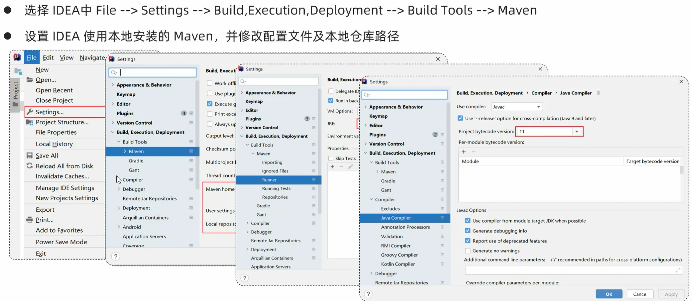

**全局：**

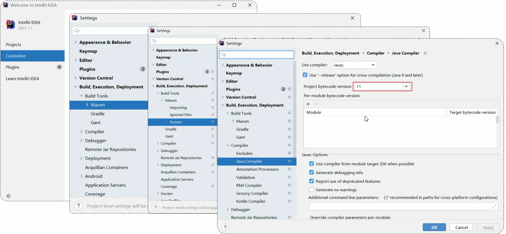

---

## 3.2. 创建 Maven 项目

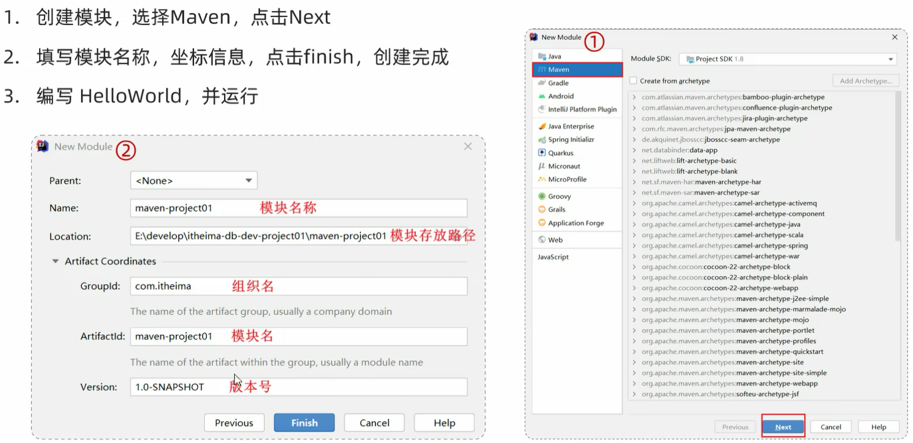

---

## 3.3. 导入 Maven 项目

---

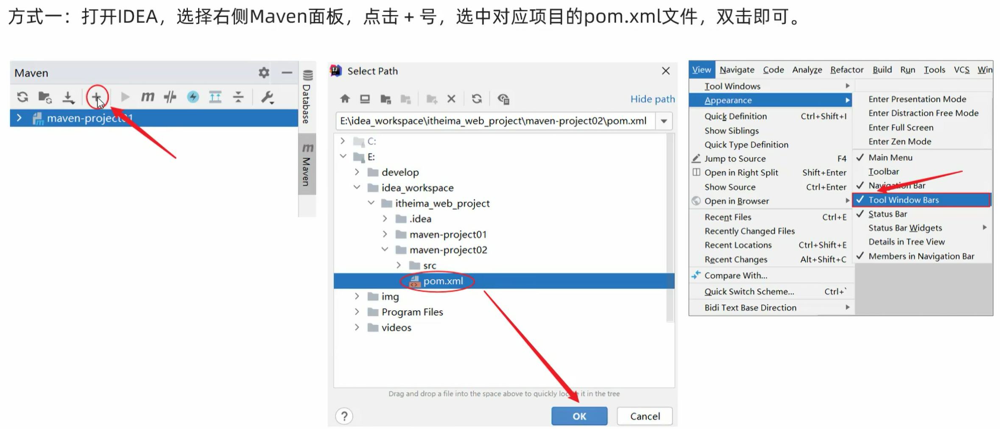

---

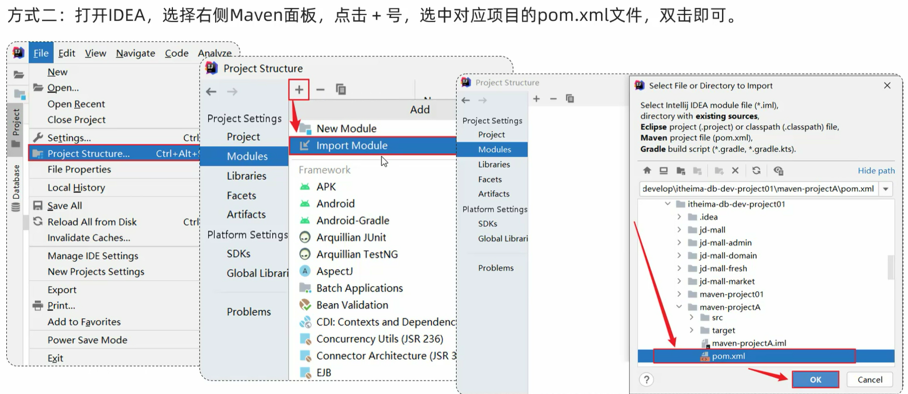

---

# 4. Maven 坐标

- **什么是坐标？**

➤ Maven 中的坐标是**资源的唯一标识**，通过该坐标可以唯一定位资源位置。  
➤ 使用坐标来定义项目或引入项目中需要的依赖。

---

- **Maven 坐标主要组成**

➤ **groupId**：定义当前 Maven 项目隶属组织名称（通常是域名反写，例如：`com.itheima`）  
➤ **artifactId**：定义当前 Maven 项目名称（通常是模块名称，例如 `order-service`、`goods-service`）  
➤ **version**：定义当前项目版本号

---

**示例代码**

示例 1：自定义项目坐标

```
<groupId>com.itheima</groupId>
<artifactId>maven-project01</artifactId>
<version>1.0-SNAPSHOT</version>
```

示例 2：依赖项坐标（如 logback）

```
<dependency>
  <groupId>ch.qos.logback</groupId>
  <artifactId>logback-classic</artifactId>
  <version>1.2.3</version>
</dependency>
```

---

**说明**

- Maven 通过 `groupId` + `artifactId` + `version` 三者组合，唯一确定一个资源（jar 包、项目等）。
- 在 `pom.xml` 中使用 `<dependency>` 标签引入外部依赖时，必须提供这三个信息。
- `SNAPSHOT` 表示开发中的快照版本，会定期更新；正式发布版本一般为固定数字（如 `1.2.3`）。

小结：

- **groupId** → 组织/公司
- **artifactId** → 模块/项目名
- **version** → 版本号三者共同构成 Maven 的“坐标系统”，实现依赖的精准管理。

---

# 5. 依赖管理

## 5.1. 依赖配置

- **依赖**：指当前项目运行所需要的 jar 包，一个项目中可以引入多个依赖。
- **配置**：

1. 在 `pom.xml` 中编写 `<dependencies>` 标签
2. 在 `<dependencies>` 标签中使用 `<dependency>` 引入坐标
3. 定义坐标的 `groupId`、`artifactId`、`version`
4. 点击刷新按钮，引入最新加入的坐标

```
<dependencies>
  <dependency>
    <groupId>ch.qos.logback</groupId>
    <artifactId>logback-classic</artifactId>
    <version>1.2.3</version>
  </dependency>
</dependencies>
```

---

**说明：**

- Maven 通过 `pom.xml` 文件管理项目的依赖关系。
- 每个 `<dependency>` 对应一个外部库（如 logback），由其坐标唯一标识。
- 添加依赖后，需在 IDE（如 IntelliJ IDEA 或 Eclipse）中执行“刷新”操作（或运行 `mvn clean install`），Maven 才会从仓库下载对应的 jar 包到本地仓库，并加入项目类路径。

示例作用：

- 引入 `logback-classic` 可用于日志记录功能。
- Maven 自动处理依赖传递（transitive dependencies），例如 logback 依赖 slf4j，也会自动下载。

---

**注意事项**

- 如果引入的依赖在本地仓库不存在，将会连接远程仓库/中央仓库，然后下载依赖。（这个过程会比较耗时，耐心等待）
- 如果不知道依赖的坐标信息，可以到 [https://mvnrepository.com/](https://mvnrepository.com/) 中搜索。

---

**说明**

- **本地仓库**：Maven 本地缓存目录，首次使用时为空。
- **远程仓库**：如中央仓库（`repo1.maven.org`）或阿里云镜像等，用于下载缺失的依赖。
- **mvnrepository.com**：是 Maven 依赖的官方搜索网站，提供 `groupId`、`artifactId`、`version` 等完整坐标信息，便于快速查找和复制。

使用建议：

- 首次构建项目时，可能需要较长时间下载依赖，请保持网络畅通。
- 建议将常用依赖添加到公司私有仓库（私服），提升下载效率。

---

## 5.2. 依赖传递

- **依赖具有传递性**

➤ **直接依赖**：在当前项目中通过依赖配置建立的依赖关系  
➤ **间接依赖**：被依赖的资源如果依赖其他资源，当前项目间接依赖其他资源

---

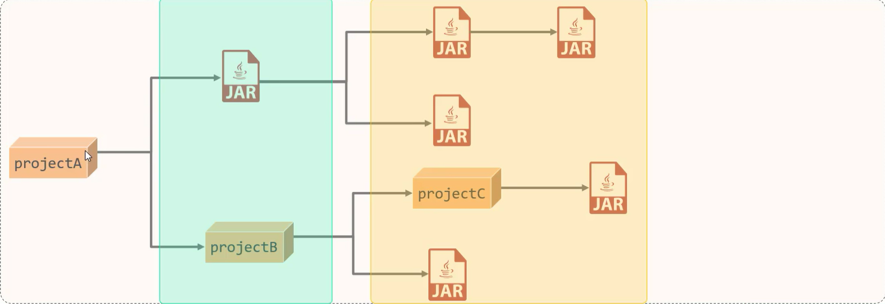

**说明**

- **直接依赖**：明确在 `pom.xml` 中声明的依赖，例如：

```
<dependency>
  <groupId>org.springframework</groupId>
  <artifactId>spring-core</artifactId>
  <version>5.3.0</version>
</dependency>
```

此时 `spring-core` 是项目的**直接依赖**。

- **间接依赖（传递性依赖）**：比如 `spring-core` 本身依赖了 `spring-jcl`，那么 `spring-jcl` 就是当前项目的**间接依赖**，Maven 会自动下载并引入。

示例：

- 项目 A 依赖 B
- B 依赖 C  
    → 则 A 间接依赖 C，无需手动声明 C 的坐标

⚠️ **注意**：

- Maven 默认开启依赖传递，但可通过 `<scope>` 控制（如 `provided`、`test`）来排除某些传递依赖。
- 可能导致版本冲突（如多个依赖引入不同版本的同一个库），需使用 `dependencyManagement` 或 `exclusions` 处理。

---

- 排除依赖

排除依赖指主动断开依赖的资源，被排除的资源无需指定版本。

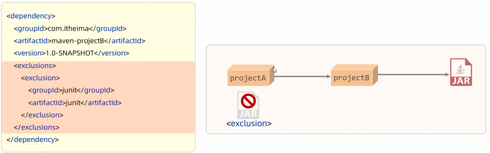

---

## 5.3. 依赖范围

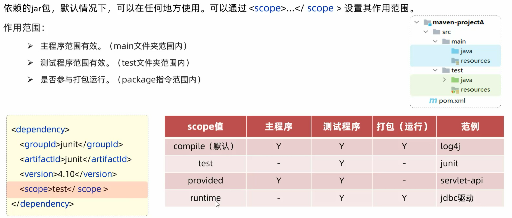

---

## 5.4. 生命周期

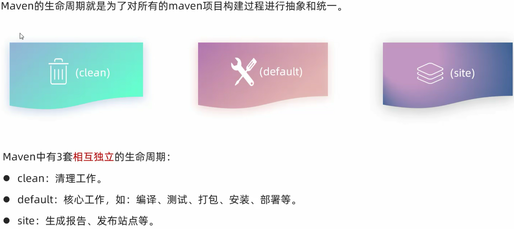

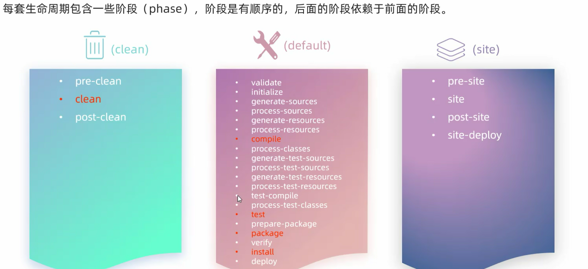

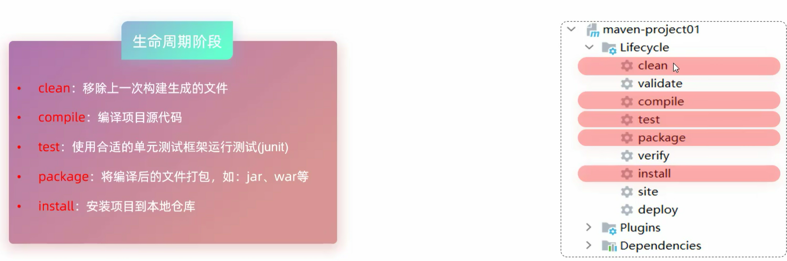

---

**注意事项**

- 在同一套生命周期中，当运行后面的阶段时，前面的阶段都会运行。

---

**说明**

- Maven 的生命周期是**有序的、阶段性的**。每个生命周期包含多个阶段（Phase），它们按顺序执行。
- 例如：在 `default` 生命周期中，执行 `mvn package` 时，Maven 会自动依次执行以下阶段：

- `validate`
- `compile`
- `test`
- `package`

特点：

- **不可跳过前置阶段**：即使你只调用 `package`，前面的 `compile` 和 `test` 也会自动运行。
- 这种设计确保了构建过程的完整性与一致性。

📌 示例：

```
mvn install
```

将自动执行从 `compile` 到 `install` 的所有阶段，包括编译、测试、打包、安装等。

⚠️ 注意：

- 如果某个阶段失败（如编译错误），后续阶段将不会执行。
- 可通过 `mvn clean compile` 等命令控制具体执行流程。

---

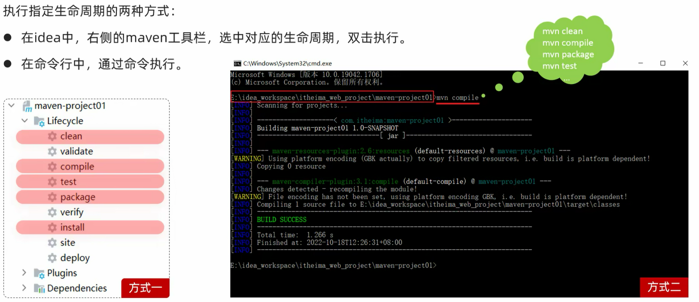

---

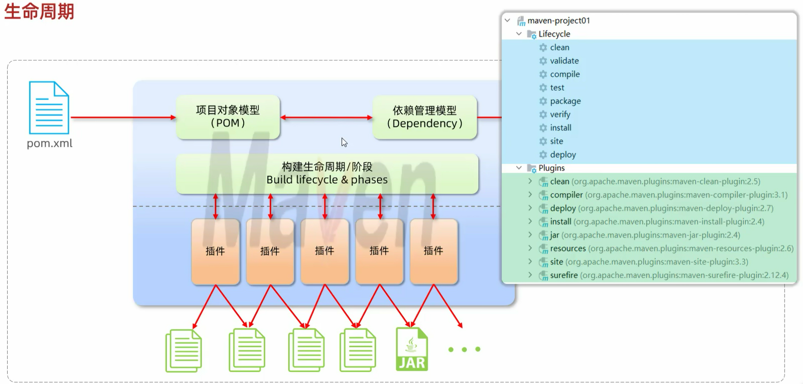

---

# 6. 分模块设计与开发

- 为什么？

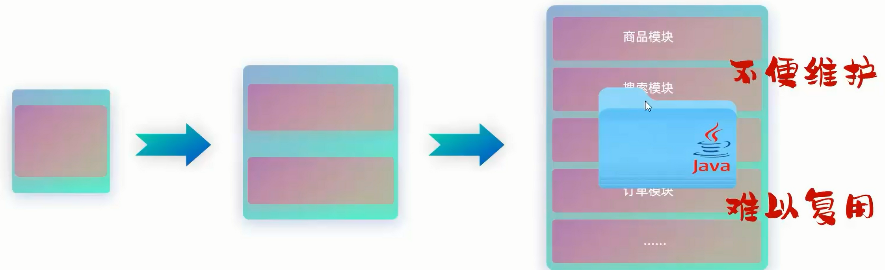

---

- 为什么？将项目安装功能拆分成若干个子模块，方便项目的管理维护、扩展，也方便模块间的相互调用，资源共享


---

- 实际

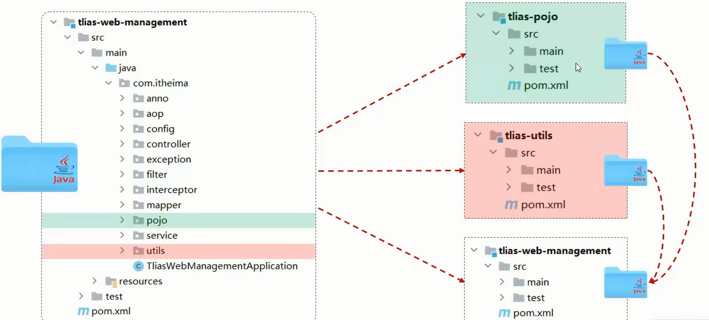

---

# 7. 继承与聚合

## 7.1. 继承

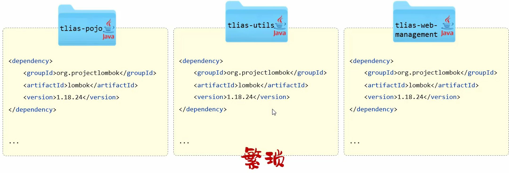

---

### 7.1.1. 继承关系

- 概念：**继承**描述的是两个工程间的关系，与java中的继承相似，子工程可以继承父工程中的配置信息，常见于依赖关系的继承。
- 作用：简化依赖配置、统一管理依赖
- 实现：`<parent> ... </parent>`

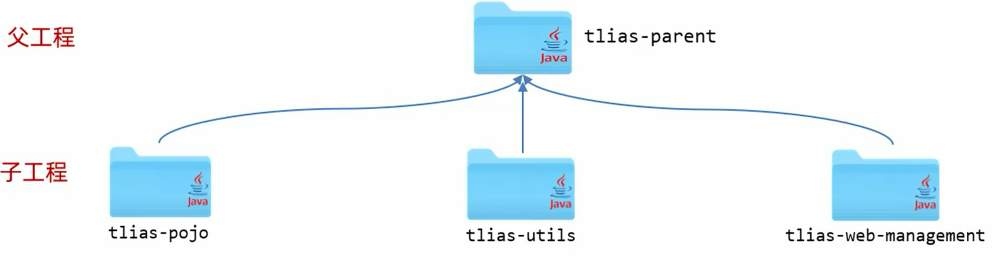

---

jar：普通模块打包，springboot项目基本都是jar包（内嵌tomcat运行）  
war：普通web程序打包，需要部署在外部的tomcat服务器中运行  
pom：父工程或聚合工程，该模块不写代码，仅进行依赖管理

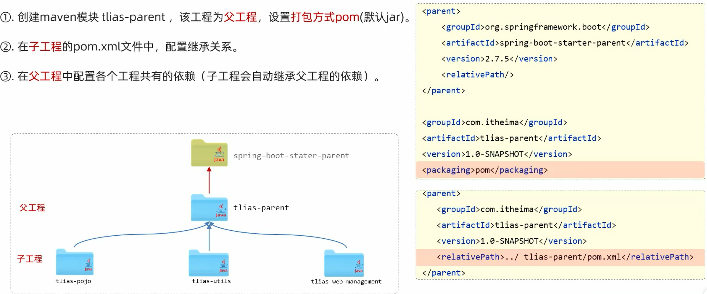

---

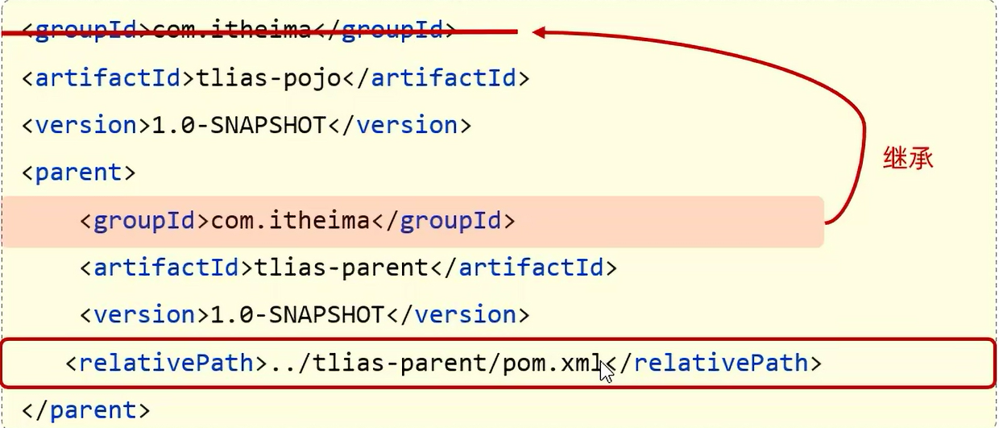

**注意事项**

- 在子工程中，配置了继承关系之后，坐标中的**groupId**是可以省略的，因为会自动继承父工程的。
- relativePath指定父工程的pom文件的相对位置（如果不指定，将从本地仓库/远程仓库查找该工程）。
- 若父子工程都配置了同一个依赖的不同版本，以子工程的为准。

---

### 7.1.2. 版本锁定

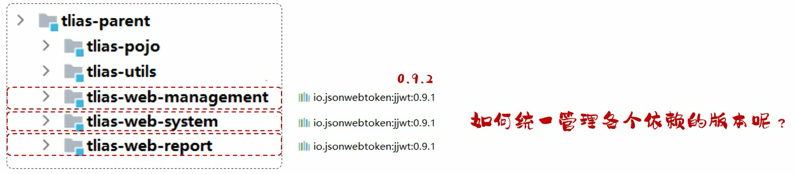

---

- 在maven中，可以在父工程的pom文件中通过 `<dependencyManagement>` 来统一管理依赖版本。

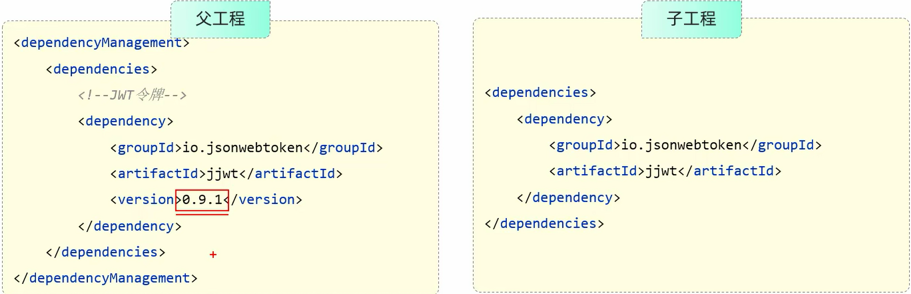

**注意事项**

- 子工程引入依赖时，无需指定 `<version>` 版本号，父工程统一管理。变更依赖版本，只需在父工程中统一变更。

---

- 自定义属性/引用属性

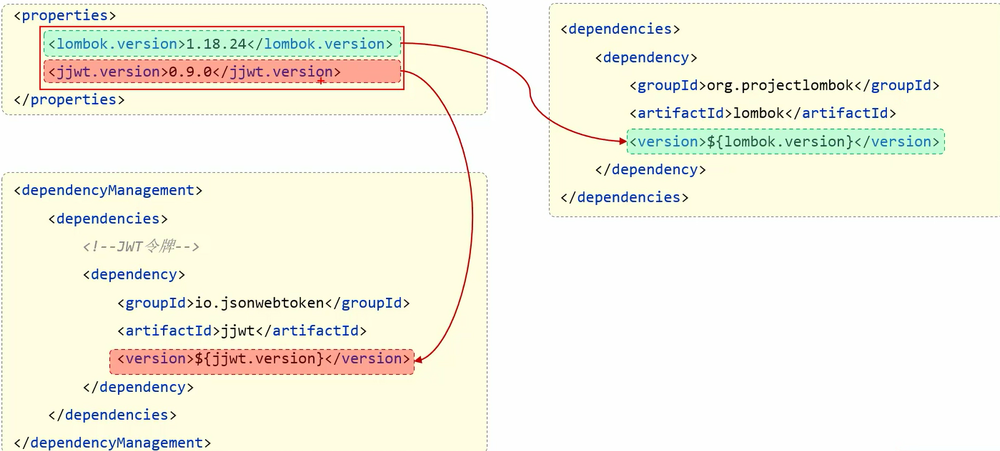

---

## 7.2. 聚合

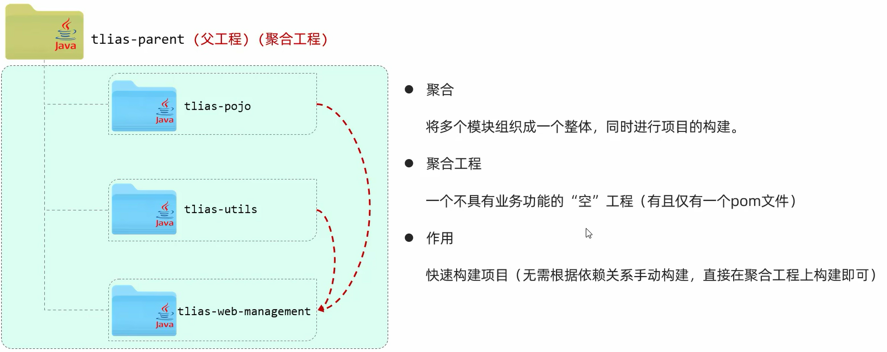

---

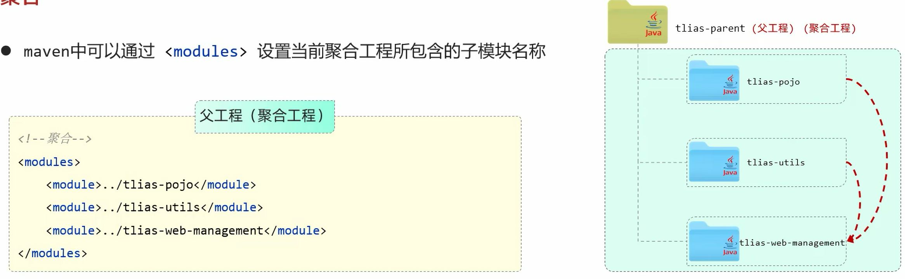

**注意事项**

- 聚合工程中所包含的模块，在构建时，会自动根据模块间的依赖关系设置构建顺序，与聚合工程中模块的配置书写位置无关。

---

## 7.3. 总结

- 作用  
    ▪ 聚合用于快速构建项目▪ 继承用于简化依赖配置、统一管理依赖
- 相同点：  
    ▪ 聚合与继承的pom.xml文件打包方式均为pom，可以将两种关系制作到同一个pom文件中▪ 聚合与继承均属于设计型模块，并无实际的模块内容
- 不同点：  
    ▪ 聚合是在聚合工程中配置关系，聚合可以感知到参与聚合的模块有哪些▪ 继承是在子模块中配置关系，父模块无法感知哪些子模块继承了自己

---

# 8. 多环境开发

① 定义多环境

- 使用 `<profiles>` 定义多个环境配置
- 每个环境通过 `<profile>` 定义，需指定唯一 `<id>`（如 `env_dep`、`env_pro`）
- 环境专属属性在 `<properties>` 中定义（例如：`<jdbc.url>jdbc:mysql://127.0.0.1:3306/ssm_db</jdbc.url>`）
- 可通过 `<activation><activeByDefault>true</activeByDefault></activation>` 设置默认激活的环境

示例结构：

```
<!--定义多环境  -->
<profiles>
  <!--定义具体的的环境：生产环境  -->
  <profile>
    <!--定义环境对应的唯一名称  -->
    <id>env_dep</id>
    <!--定义环境中专用的属性值  -->
    <properties>
      <jdbc.url>jdbc:mysql://127.0.0.1:3306/ssm_db</jdbc.url>
    </properties>
    <!--设置默认启动  -->
    <activation>
      <activeByDefault>true</activeByDefault>
    </activation>
  </profile>
  <!--定义具体的环境：开发环境  -->
  <profile>
    <id>env_pro</id>
    <!-- 其他环境配置 -->
  </profile>
</profiles>
```

---

② 使用多环境（构建过程）

- Maven 命令语法：`**mvn <goal> -P <环境定义id>**`
- `-P` 参数用于激活指定的 profile（即通过 `<profile><id>xxx</id></profile>` 定义的环境 ID）
- 范例：`**mvn install -P pro_env**`  
    → 激活 ID 为 `pro_env` 的环境配置进行构建

---

# 9. 跳过测试

## 9.1. 第一种方式

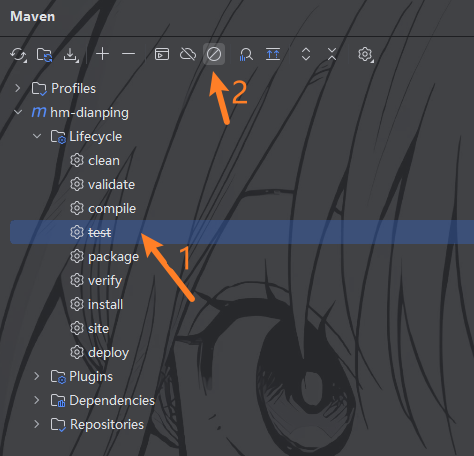

## 9.2. 第二种方式

- **跳过测试**

- Maven 指令：`mvn <goal> -D skipTests`
- 范例：`mvn install -D skipTests`

- **注意事项**  
    执行的项目构建指令**必须包含测试生命周期**，否则 `-D skipTests` 无效。例如：仅执行 `compile` 生命周期（不经过 `test` 阶段），则跳过测试参数无效果。

## 9.3. 第三种方式

**细粒度控制跳过测试**（通过 Maven 插件配置）

- 使用 `maven-surefire-plugin`（版本 `2.22.1`）
- 在 `<configuration>` 中可实现精准控制：

- **全局跳过测试**：`<skipTests>true</skipTests>`
- **包含指定测试用例**：

```
<includes>
  <include>**/User*Test.java</include>
</includes>
```

- **排除指定测试用例**：

```
<excludes>
  <exclude>**/User*TestCase.java</exclude>
</excludes>
```

说明：

- `includes` 和 `excludes` 支持 Ant 风格通配符（如 `**/`, `*`）
- 优先级：`excludes` > `includes`；若同时配置，被 `exclude` 匹配的类将不执行，即使它也匹配 `include`
- 此方式比 `-D skipTests` 更精细，适用于仅跳过部分测试或按命名规则筛选执行

---

# 10. 私服

## 10.1. 介绍

- 私服是一种特殊的远程仓库，它是架设在局域网内的仓库服务，用来代理位于外部的中央仓库，用于解决团队内部的资源共享与资源同步问题。

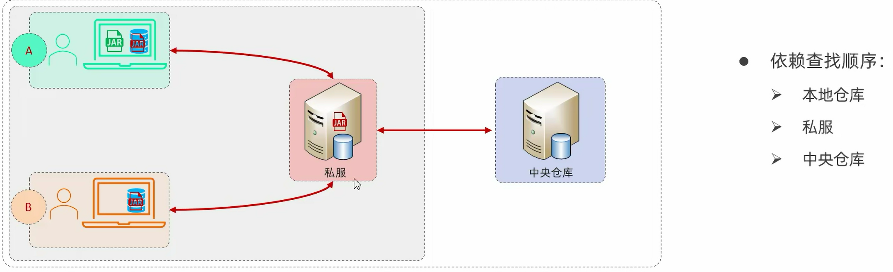

**注意事项**

- 私服在企业项目开发中，一个项目/公司，只需要一台即可（无需我们自己搭建，会使用即可）。

---

## 10.2. 资源上传与下载

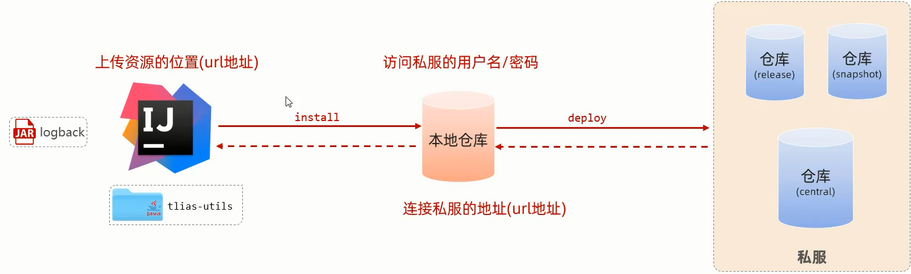


---

### 10.2.1. 设置私服的访问用户名/密码（settings.xml 中的 servers 中配置）

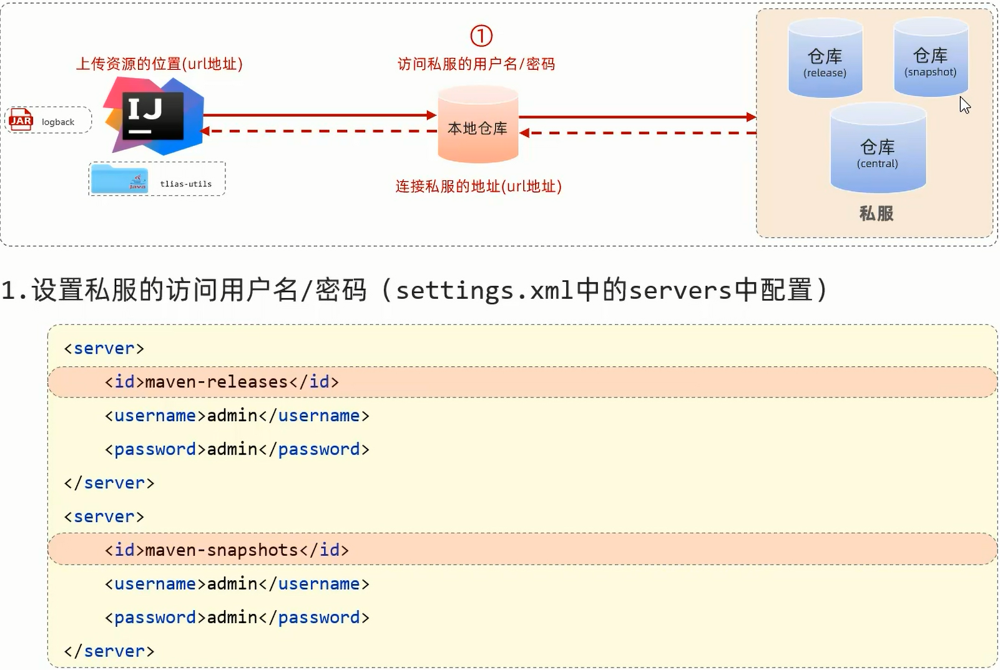

---

### 10.2.2. IDEA 的 Maven 工程的 pom 文件中配置上传（发布）地址

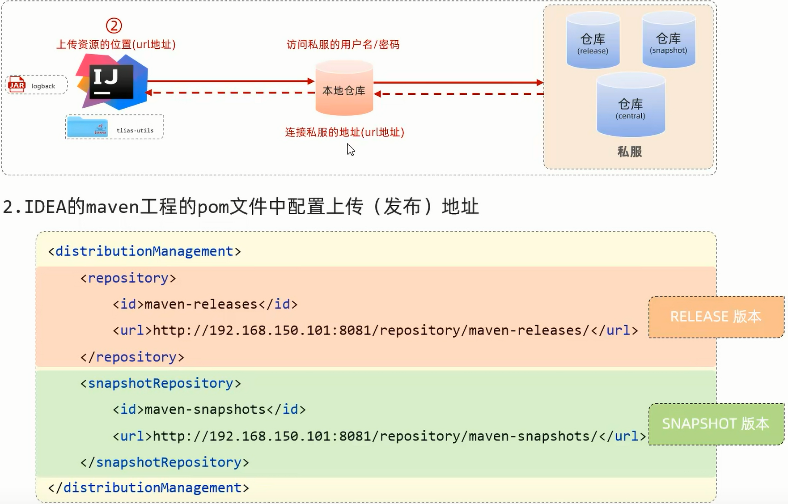

---

### 10.2.3. 设置私服依赖下载的仓库地址（settings.xml 中的 mirrors、profiles 中配置）

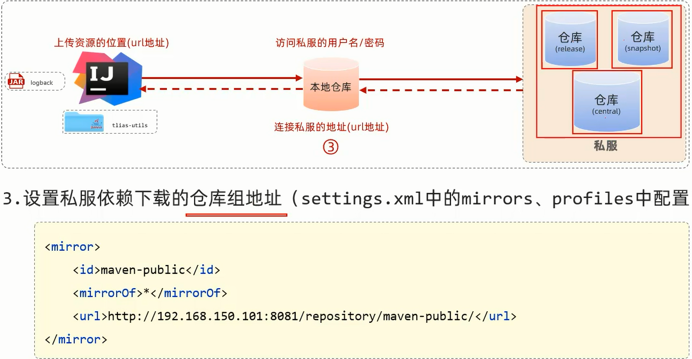

---

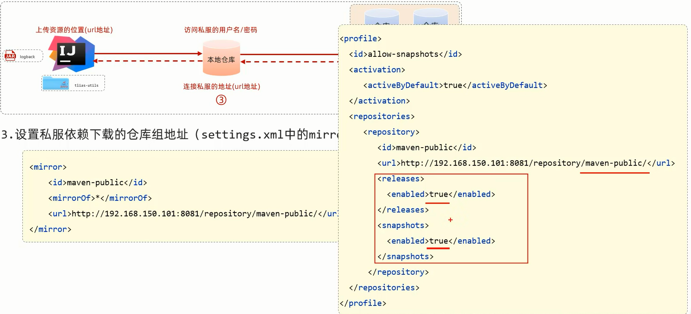

---

---

## 🔗 关联笔记
- [[Maven笔记-补充篇]]
- [[Git笔记]]
- [[Docker笔记]]
