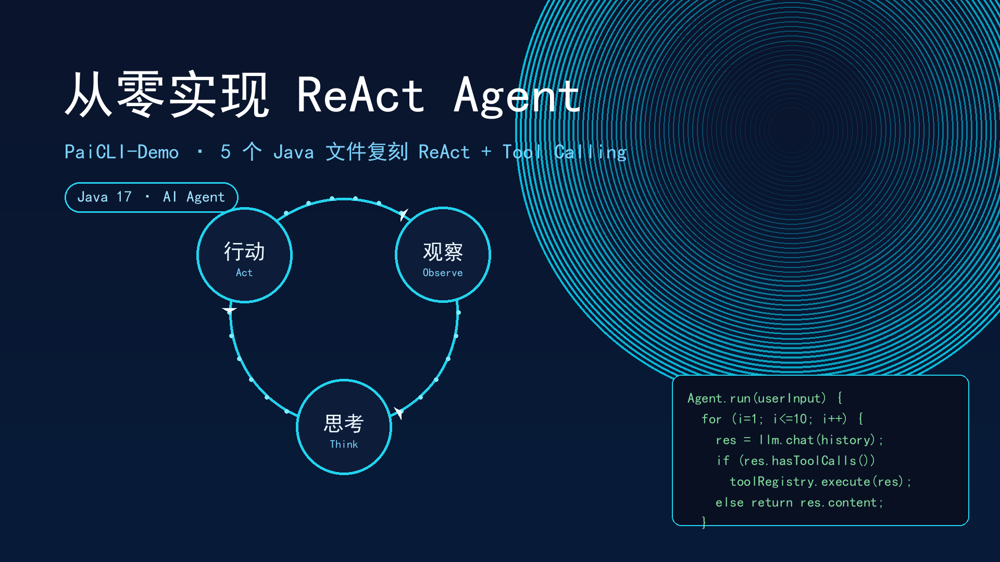

# PaiCLI-Demo：从零实现 ReAct Agent + Tool Call

> 📅 更新日期：2026-07-15

> 基于 [[《PaiCLI》项目学习笔记|PaiCLI]] 原始架构，用 5 个 Java 文件（约 500 行）复刻出一个极简的 ReAct Agent。
> 项目路径：`D:\Workspace\Code_Projects_Practice\paicli-demo`
> 依赖：Jackson + OkHttp + SLF4J（无 Spring Boot），纯 Java 17。

## 整体架构

5 个文件，每个文件职责单一，像流水线上的工位：

```
src/main/java/edu/cqie/paiclidemo/
├── llm/
│   ├── LlmClient.java     ← 地基：Message、ToolCall、Tool、ChatResponse 等 record
│   └── GLMClient.java     ← 通信管道：HTTP 请求构建 + SSE 流式解析
├── tool/
│   └── ToolRegistry.java  ← 工具仓库：注册 / 查找 / 执行 + JSON Schema 生成
├── agent/
│   └── Agent.java         ← 大脑：ReAct 循环（思考→调用→观察→循环）
└── cli/
    └── Main.java          ← 总装：REPL 交互 + 示例工具注册
```

数据流向：

```
用户输入 → Main(REPL) → Agent(run) → GLMClient(chat) → GLM API
                                      ↑                   │
                                      └── ToolRegistry ──┘
                                           (执行工具)
```

---

## 一、LlmClient —— 数据模型（地基）

### 为什么先写这个文件

不管 GLMClient 发请求、Agent 做循环、还是 ToolRegistry 注册工具，都需要同一套数据结构来沟通。先把"通信协议"定好，后面写代码不混乱。

### 四个核心 Record

用 Java 17 `record` 而不是普通 `class`，原因：

- **一行定义**：自动生成构造函数、getter（`role()` 而非 `getRole()`）、`equals()`、`hashCode()`、`toString()`
- **不可变**：字段自动 `final`，消息一旦创建不能改——对话历史天然线程安全
- **类比**：record 像快递包裹，打包好后里面的东西不能换

```java
public interface LlmClient {
    ChatResponse chat(List<Message> messages, List<Tool> tools) throws IOException;
    String getModelName();
}
```

#### Message —— 对话消息

```java
record Message(String role, String content, List<ToolCall> toolCalls, String toolCallId)
```

4 个字段对应 OpenAI 兼容协议的 message 对象。`role` 取 4 种值：

| role | 含义 | 用到的字段 | 不用的字段 |
|------|------|-----------|-----------|
| `system` | 系统设定（"你是助手"） | role + content | toolCalls, toolCallId |
| `user` | 用户输入 | role + content | toolCalls, toolCallId |
| `assistant` | 模型回复（可能带工具调用） | role + content + toolCalls | toolCallId |
| `tool` | 工具执行结果 | role + content + toolCallId | toolCalls |

这就是工厂方法里很多参数设为 `null` 的原因——不同类型的消息只用其中一部分字段。

#### ToolCall —— 工具调用请求

```java
record ToolCall(String id, Function function) {
    record Function(String name, String arguments) {}
}
```

`Function` 是嵌套 record，因为 API 返回的 JSON 结构本身就是嵌套的：

```json
{ "id": "call_xxx", "type": "function",
  "function": { "name": "calculator", "arguments": "{\"expression\":\"2+3\"}" } }
```

保持 record 结构和 JSON 结构一致，序列化和反序列化时不用做额外转换。

#### Tool —— 工具定义（给模型看的"菜单"）

```java
record Tool(String name, String description, JsonNode parameters) {}
```

`parameters` 用 JSON Schema 描述参数类型和必填项——模型看到后才知道"调这个工具要传什么"。

#### ChatResponse —— 模型回复

```java
record ChatResponse(String content, List<ToolCall> toolCalls, int inputTokens, int outputTokens)
```

关键判断：`hasToolCalls()` 是 ReAct 循环的**出口判断**——有工具调用则继续循环，没有则退出。

### 面试可展开

- Record vs Class：不可变性、线程安全、简洁性
- 静态工厂方法模式：`Message.user()` 比 `new Message("user", ..., null, null)` 更安全、可读、语义清晰
- 嵌套 record 与 JSON 结构对齐的设计原则

---

## 二、GLMClient —— 通信管道

### 职责：三件事

1. **打包请求**（`buildRequestBody`）：把 Message 列表 + Tool 列表序列化为 JSON
2. **发 HTTP 请求**（`chat`）：通过 OkHttp POST 到智谱 GLM API
3. **解析响应**（`parseSseStream`）：逐行读 SSE 流，累积拼接为完整 ChatResponse

### 请求体结构

```json
{
  "model": "glm-4.5-air",
  "stream": true,
  "messages": [
    {"role": "system", "content": "你是一个智能助手..."},
    {"role": "user", "content": "帮我算1+1"},
    {"role": "assistant", "tool_calls": [{"id":"call_xxx","type":"function","function":{"name":"calculator","arguments":"{...}"}}]},
    {"role": "tool", "tool_call_id": "call_xxx", "content": "1+1 = 2"}
  ],
  "tools": [
    {"type":"function","function":{"name":"calculator","description":"...","parameters":{...}}}
  ]
}
```

代码做的事就是把 Java record 列表逐个翻译成这个 JSON。注意 `stream: true` 表示流式响应。

### SSE 流式响应解析

模型不是一次性返回答案，而是**一个字一个字**地吐（SSE = Server-Sent Events）：

```
data: {"choices":[{"delta":{"content":"你"}}]}
data: {"choices":[{"delta":{"content":"好"}}]}
data: {"choices":[{"delta":{"tool_calls":[{"index":0,"id":"call_xxx","function":{"name":"calc","arguments":""}}]}}]}
data: {"choices":[{"delta":{"tool_calls":[{"index":0,"function":{"arguments":"{\"expr"}}]}}]}
data: {"usage":{"prompt_tokens":150,"completion_tokens":30}}
data: [DONE]
```

两个"收集箱"：

- `StringBuilder contentBuilder` —— 累积文本碎片
- `List<ToolCallAccumulator>` —— 累积工具调用碎片（一个 tool_call 可能被拆成多个 chunk）

`ToolCallAccumulator` 是**可变**对象（与不可变 record 形成对比），因为流式传输中需要逐步拼接。拼完后用 `buildToolCalls()` 转成正式的 `ToolCall` record。

### 超时配置

```java
.connectTimeout(60, TimeUnit.SECONDS)   // 建连
.readTimeout(300, TimeUnit.SECONDS)     // 读取（模型推理可能慢）
.callTimeout(600, TimeUnit.SECONDS)     // 总超时
```

readTimeout 设 300 秒因为模型推理（尤其深度思考模式）可能很慢。

---

## 三、ToolRegistry —— 工具仓库

### 三个职责

1. **注册**：`register(name, description, parameters, executor)` → 存入 `ConcurrentHashMap`
2. **执行**：`executeTool(toolCall)` → 查 Map → 解析参数 → 调 lambda → 返回结果
3. **生成定义**：`getToolDefinitions()` → 把内部 Tool（带执行器）转成 `LlmClient.Tool`（不带执行器）发给 API

### 内部 Tool vs API Tool

| 类型 | 包含执行逻辑 | 用途 |
|------|------------|------|
| `ToolRegistry.Tool` | 有 `ToolExecutor` | 内部管理 |
| `LlmClient.Tool` | 无执行逻辑 | 发给模型 |

模型只需要"菜单"（名字+描述+参数定义），不需要也不应该看到执行代码。

### 参数解析流程

```
模型返回 arguments JSON: {"expression": "2+3"}
    → parseArguments(): JSON 字符串 → Map<String, String>
    → executor.execute(args): args.get("expression") = "2+3"
```

### JSON Schema 构建

`createParameters()` 是便捷方法，快速生成参数的 JSON Schema：

```java
createParameters(new Param("expression", "string", "要计算的数学表达式"))
```

生成：

```json
{ "type": "object",
  "properties": { "expression": { "type": "string", "description": "要计算的数学表达式" } },
  "required": ["expression"] }
```

没有这个 Schema，模型就不知道该传什么参数——这是"模型输出"与"代码输入"之间唯一的契约桥梁。

### 面试可展开

- ConcurrentHashMap 选择原因：多线程安全（将来可能并行执行多个工具）
- 函数式接口 `ToolExecutor`：用 lambda 注册执行逻辑，简洁灵活
- JSON Schema 在 Function Calling 中的作用：让 LLM 结构化输出参数

---

## 四、Agent —— ReAct 循环（核心）

### 循环流程

```
用户输入 → 加入 conversationHistory
  │
  ▼
┌─ for 循环（最多 10 轮）───────────────────┐
│                                            │
│  调用 GLMClient.chat(history, toolDefs)    │
│        │                                   │
│    hasToolCalls?                           │
│   ╱          ╲                             │
│  YES          NO                           │
│  │            │                            │
│  执行工具      输出最终回复                  │
│  结果加入历史  return 退出                   │
│  │                                         │
│  └──── continue（下一轮迭代）──────────────┘
```

### 核心代码结构

```java
public String run(String userInput) {
    conversationHistory.add(Message.user(userInput));  // ① 用户消息入历史
    List<Tool> toolDefs = toolRegistry.getToolDefinitions();

    for (int i = 1; i <= MAX_ITERATIONS; i++) {       // ② 最多 10 轮
        ChatResponse response = llmClient.chat(conversationHistory, toolDefs); // ③ 调模型

        if (response.hasToolCalls()) {                 // ④ 分支 A：有工具调用
            conversationHistory.add(Message.assistant(null, response.toolCalls())); // 记录模型意图
            for (ToolCall tc : response.toolCalls()) {
                String result = toolRegistry.executeTool(tc);                      // 执行工具
                conversationHistory.add(Message.tool(tc.id(), result));             // 结果入历史
            }
            // continue → 下一轮迭代，模型看到工具结果继续推理
        } else {                                       // ④ 分支 B：无工具调用
            conversationHistory.add(Message.assistant(response.content()));
            return response.content();                 // 最终回复，退出循环
        }
    }
    return "[警告] 达到最大迭代次数";                    // ⑤ 安全网
}
```

### 设计哲学

**不是你的代码决定什么时候停，是模型自己决定。** 代码只负责：模型说调工具就调，模型说完了就完了。Agent 是"跑腿的"，决策权全在模型手里。

- **好处**：灵活性极高，加新工具不用改 Agent 代码
- **缺点**：依赖模型质量，模型判断失误会陷入死循环或提前退出
- **安全网**：`MAX_ITERATIONS = 10`，到轮数强制刹车

### conversationHistory 的作用

它是贯穿所有轮次的**唯一状态载体**。每轮 `chat()` 都把整个历史发给模型，模型看到上一轮自己做了什么、拿到了什么结果，据此继续推理。循环不是靠计数器硬转，而是靠历史持续增长把「思考→行动→观察」串成链条回灌。

### 完整例子

用户问："帮我算 2 的 10 次方"

| 轮次 | 历史消息 | 模型返回 | 动作 |
|------|---------|---------|------|
| 1 | system + user | toolCall(calculator, `2**10`) | 执行工具 → "1024"，结果入历史 |
| 2 | system + user + assistant + tool | "2 的 10 次方等于 1024" | 无 toolCall → return |

---

## 五、Main —— 总装 + REPL

### 启动流程

```java
① System.getenv("GLM_API_KEY")         // 读密钥（环境变量，不硬编码）
② new GLMClient(apiKey)                // 通信客户端
③ createToolRegistry()                 // 工具仓库（含 2 个示例工具）
④ new Agent(llmClient, toolRegistry)   // ReAct 引擎
⑤ while(true) 循环                    // REPL：读输入→Agent处理→输出结果
```

API Key 从环境变量读取是安全实践——密钥永远不会被提交到 Git。

### 示例工具

| 工具名 | 参数 | 功能 | 执行逻辑 |
|--------|------|------|---------|
| `calculator` | `expression` (string) | 数学表达式求值 | 安全的递归下降解析器（只允许数字和运算符） |
| `get_current_time` | 无 | 获取当前时间 | `LocalDateTime.now()` 格式化 |

### ExpressionParser —— 安全计算器

为什么不用 `ScriptEngine`（可直接执行 JS）？不安全——模型可能传恶意表达式读取系统文件。手写递归下降解析器只认 `+ - * / ** ()`，其他字符直接报错。

---

## 六、各文件在 ReAct 循环中的协作

```
用户: "帮我算 2 的 10 次方"
  │
  ├─ Main.java：读输入，传给 Agent
  │
  ├─ Agent.java（迭代 1）：
  │   ├─ GLMClient.chat(history, tools)
  │   │   ├─ buildRequestBody → JSON 请求体
  │   │   ├─ OkHttp POST → 智谱 API
  │   │   └─ parseSseStream → ChatResponse(toolCalls=[calculator])
  │   │
  │   ├─ ToolRegistry.executeTool(calculator, "2**10")
  │   │   ├─ tools.get("calculator") → 找到工具
  │   │   ├─ parseArguments → Map
  │   │   └─ executor.execute() → "2**10 = 1024"
  │   │
  │   └─ 结果加入 conversationHistory，continue
  │
  ├─ Agent.java（迭代 2）：
  │   ├─ GLMClient.chat(history, tools)
  │   │   └─ 模型看到工具结果 → ChatResponse(content="2 的 10 次方等于 1024")
  │   └─ 无 toolCalls → return 最终回复
  │
  └─ Main.java：打印结果
```

---

## 运行方式

```bash
# 设置 API Key
set GLM_API_KEY=你的密钥

# 方式一：Maven exec 插件
mvn exec:java -q

# 方式二：打包后运行
mvn package -q && java -jar target/paicli-demo-0.1.0.jar
```

---

## 与原版 PaiCLI 的对比

| 特性       | PaiCLI 原版                              | PaiCLI-Demo（本笔记） |
| -------- | -------------------------------------- | ---------------- |
| 文件数      | 200+ 文件                                | 5 个文件            |
| 工具数      | 16 个内置 + MCP 动态工具                      | 2 个示例工具          |
| Agent 模式 | ReAct + Plan-and-Execute + Multi-Agent | 仅 ReAct          |
| 流式输出     | SSE 实时渲染到终端                            | SSE 累积后一次性返回     |
| 记忆系统     | 短期 + 长期 + 压缩 + 语义检索                    | 仅对话历史            |
| HITL     | 危险工具审批                                 | 无                |
| MCP      | stdio + HTTP 双传输                       | 无                |
| 安全       | PathGuard + CommandGuard + AuditLog    | 仅表达式白名单          |

---

## 相关阅读

- [[ReAct主循环]] —— 原版 PaiCLI 的 Agent.run 详细分析
- [[Function Calling工具定义]] —— 工具的 name / description / parameters 各自回答什么问题
- [[ReAct循环退出条件]] —— 为什么退出交给 LLM 而非固定轮数
- [[ReAct循环保险阀]] —— 原版 PaiCLI 的四阀兜底机制
- [[请求响应配对]] —— tool_call_id 如何把工具结果绑回对应调用

---

> 作为还在学习路上的大学生，这些都是我踩坑踩出来的经验，分享出来希望能帮到同样在学 Java 的小伙伴～如果有写得不对的地方，欢迎大佬们指正！
> 你们在学习的时候有遇到过什么有意思的坑吗？评论区聊聊呀👇
> 🎓 我是 ***小小放舟***，一个正在努力打怪升级的后端学习者
> 🌊 个人主页：[小小放舟的 CSDN](https://blog.csdn.net/UnmooredBoat?spm=1010.2135.5343)
> ✨ 点赞收藏不迷路，我们一起放舟技术海～
