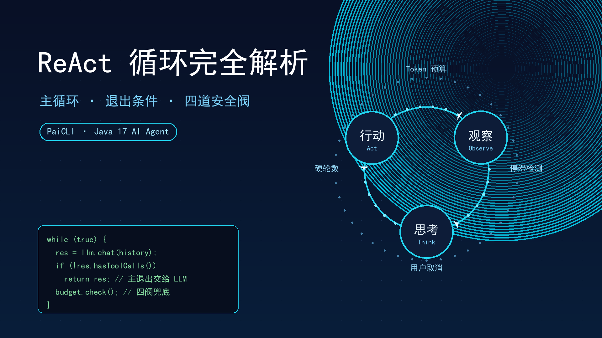
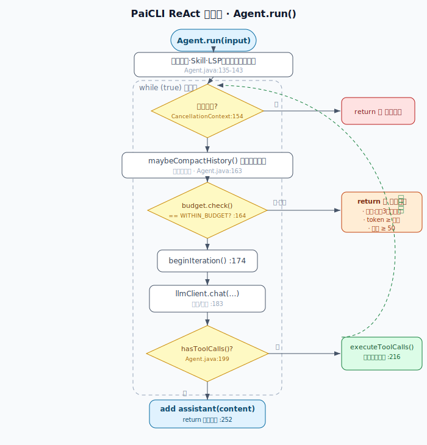
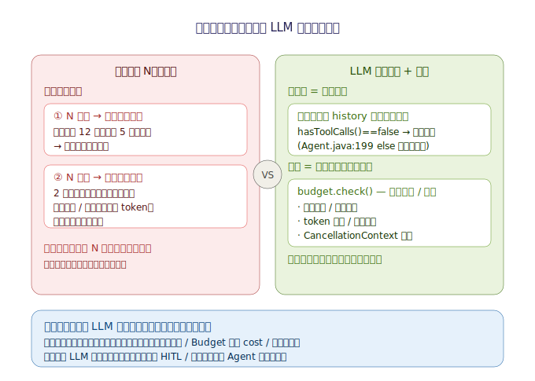
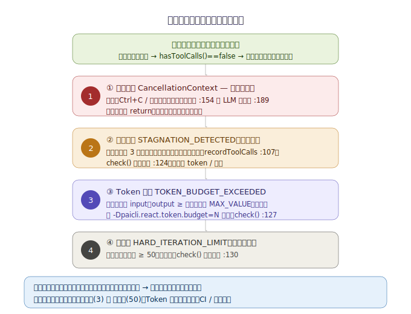

# PaiCLI ReAct 循环完全解析

> 📅 更新日期：2026-07-15

写这篇的时候我一直在想一个问题。ReAct 循环网上讲的人很多，但很少有人说清它「怎么知道该停了」。我自己从零实现 PaiCLI 的 Agent 时，就被这个点卡了挺久。所以这篇不堆代码，我把当时想通的那些弯弯绕串起来，重点放在「为什么这么设计」上。

## 一、先把整体样子画出来

PaiCLI 的 Agent 核心就一个 `run` 方法，它干两件事：进循环之前先把准备工作做完，然后进一个 `while (true)` 死循环。

准备工作里真正要紧的有三步。把用户这次的输入存进短期记忆；顺手去长期记忆里检索一下跟这个问题相关的背景，塞进 system prompt；最后把用户输入追加进一个叫 `conversationHistory` 的列表。

注意第三步，这个 `conversationHistory` 是整个循环里最要命的东西，后面会反复出现。

循环本体长这样，图里画的是每一轮依次做的事：



每一轮进来，先做取消检查、历史压缩、预算检查，然后让模型思考并决定要不要调工具，最后根据有没有工具调用来分流：有就执行工具、把结果写回历史，没有就直接写最终答案收工。

## 二、循环靠什么转起来

一句话：`conversationHistory` 是串起所有轮次的唯一状态载体。

每一轮一开始，我们把整段历史连同工具定义一起发给模型。模型如果决定调工具，我们就把「我要调这些工具」的消息和「工具跑出来的结果」依次追加进同一个历史列表。下一轮再把变长之后的历史发回去，模型于是看见了自己上一轮干了什么、拿到了什么结果，接着往下推理。

所以循环不是靠一个计数器硬转，而是靠历史自己变长，把「思考 → 行动 → 观察」一节一节喂回去。哪一轮还有工具结果没消化完，就再来一轮。

这里有个细节值得单独说。历史会越攒越长，迟早撑爆上下文窗口，所以每次调模型之前，会把太早的历史压成一段摘要腾地方。这个压缩对模型是透明的，它看到的始终是一段连贯的对话。

把一轮拆开看就是三步：

- 思考（THINK）：把历史和工具定义发给模型，拿回它的回复。模型在这一步决定下一步调哪个工具。
- 行动（ACT）：真正去执行工具调用。如果工具比较危险，比如写文件、跑命令，或者来自外部 MCP，这时候会弹个确认框让你审一下。多个工具可以一起跑。
- 观察（OBSERVE）：每个工具的结果按它对应的调用 ID 配对回填进历史，同时记一笔短期记忆。这就是下一轮思考时模型能看到的观察。

顺序别搞反：先写「我要调这些工具」并带上 ID，再去执行，最后把结果按 ID 填回去。这样模型下一轮才知道哪条结果是回应哪次调用的。

## 三、真正难的是什么时候停

让循环转起来不难，难的是让它在该停的时候停。

PaiCLI 的思路很干脆：把「停不停」这个判断交给模型自己，而不是写死一个轮数。主退出条件就一句话，模型不再返回任何工具调用，就说明它觉得信息够了，直接写答案走人。

### 为什么不能写死轮数

「任务到底做完了没」这件事，只有模型自己能判断，代码在编译期永远不可能知道。你要是写死一个 N，两头都不讨好：

- N 太小，比如 5。遇到个真要 12 步的重构任务，第 5 步就被强行打断，吐出来的东西是残的。
- N 太大，比如 30。简单任务 2 步就做完了，但循环没理由停，模型为了填满轮数开始硬编工具调用凑字数，白白烧 token，还可能误触发写文件、跑命令这种有副作用的工具。

说白了，你选的任何一个 N，对有些任务太小、对另一些又太大，没有刚好那一个。而模型能当这个裁判，恰恰是因为 `conversationHistory` 把全部上下文都喂给了它：走到第 k 轮，它眼前既有最初的问题，也有自己前面每一步做了什么、看到了什么，判断够不够回答用户所需的信息它全有。



### 但模型也可能不收敛

把退出完全交给模型有个隐患：它万一死循环、反复横跳、永远觉得还差一点怎么办。所以 PaiCLI 留了几道兜底的安全阀。这些阀平时不上场，只有模型一直调工具不肯自己停的时候才出来拦；模型主动停，走的是上面的主退出。

容易误以为这几道阀是平级的，其实不是。最高优先级的一道在架构之外，就是用户取消。它是独立的检查，优先级最高，两处会查：每轮最开头先查一次，连预算检查都轮不到；模型刚返回、还没执行工具之前再查一次，这样生成到一半你点取消，它也不会去跑本来要跑的工具。

剩下三道都在预算检查里，而且有固定先后。

先说停滞检测。每轮把工具名加参数拼成一个签名，维护一个最近 3 轮的滑动窗口，窗口满了且三次完全一样，就断定是死循环，强制收尾。这里有个坑：它认的是严格连续相同，不是两个工具来回振荡。A 调完调 B、B 调完又调 A，只要参数不同签名就不同，窗口对不上，它抓不到，得靠最后一道硬轮数兜着。

再看 token 预算。累计输入加输出的 token 超了就停。不过默认这个值被设成了最大整数，等于关掉了，真要严控成本比如 CI 批跑才手动开。

最后是硬轮数，跑满 50 轮无条件停。这是最后的地板，前面都没拦住它兜底。



用伪代码把上面的优先级串一下：

```
while (true):
    用户取消了？           -> 直接收尾        // 最高优先级
    压缩一下历史
    预算检查：
        连续 3 轮重复调用？  -> 收尾           // 停滞
        token 超了？        -> 收尾           // 默认关着
        轮数到 50？         -> 收尾           // 地板
    让模型思考、决定调不调工具
    有工具调用 -> 执行、回填历史、再来一轮
    没工具调用 -> 写答案、return
```

所以开箱即用时，真正会触发的兜底其实只有两道：停滞（连续 3 轮相同）和硬轮数（50 轮），token 那道是给自动化场景留的。这个设计和「把 LLM 当不可信的决策者」是一脉相承的：语义判断交给它，但真要兜边界，靠的是执行侧的护栏，而不是替它下结论。

## 四、一句话收尾

一个 `while (true)`，靠 `conversationHistory` 不断变长把每轮的「工具意图 + 结果」串回去；一轮内思考是发请求、行动是执行工具、观察是把结果写回历史；模型不再返回工具调用就写答案退出，停不停它自己说了算，预算和轮数只是防失控的保险丝（四道阀：用户取消 > 停滞 > token > 硬轮数）。

我自己的体会是，这套设计最聪明的地方就在于信任模型的判断力，但用护栏兜住它的边界。刚开始我总想用轮数把它框死，后来才明白，框死了反而两头不讨好。

## 相关阅读

- [[ReAct主循环]] —— run() 的整体结构与 while(true)
- [[ReAct循环退出条件]] —— 为什么退出交给 LLM、budget 是保险丝
- [[ReAct循环保险阀]] —— 兜底四阀的触发条件与优先级
- [[请求响应配对]] —— tool_call_id 如何把工具结果绑回对应调用
- [[HITL全部放行双维度]] —— 行动阶段的工具审批
- [[Function Calling工具定义]] —— 工具定义如何让模型产出 toolCalls
- [[Prompt注入防御]] —— 「LLM 是不可信决策者」的安全哲学

> 上面这些是我 vault 里的关联笔记，发到 CSDN 后会换成真实的文章链接。

---

> 作为还在学习路上的大学生，这些都是我踩坑踩出来的经验，分享出来希望能帮到同样在学 Java 的小伙伴～如果有写得不对的地方，欢迎大佬们指正！
> 你们在学习的时候有遇到过什么有意思的坑吗？评论区聊聊呀👇
> 🎓 我是 ***小小放舟***，一个正在努力打怪升级的后端学习者
> 🌊 个人主页：[小小放舟的 CSDN](https://blog.csdn.net/UnmooredBoat?spm=1010.2135.5343)
> ✨ 点赞收藏不迷路，我们一起放舟技术海～
