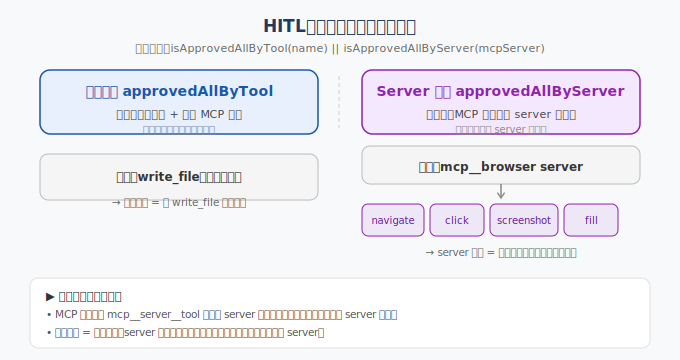

> 📇 返回 [[《PaiCLI》项目学习笔记]]

# HITL「全部放行」的两个维度

## 机制
放行判定在 `HitlToolRegistry.java:48-51`：
```java
String mcpServer = ApprovalPolicy.mcpServerName(name);
if (hitlHandler.isApprovedAllByTool(name) || hitlHandler.isApprovedAllByServer(mcpServer)) {
    return super.doExecuteTool(name, argumentsJson);
}
```
两个独立集合（`TerminalHitlHandler.java:36-37`，`ConcurrentHashMap.newKeySet`）：
- `approvedAllByTool`：按工具名放行
- `approvedAllByServer`：按 MCP server 名放行



## 为什么分两个维度
1. **MCP 工具天然带 server 分组**，内置工具是单例：`mcp__{server}__{tool}`（`ApprovalPolicy.java:70-80`）。server 维度是 MCP 才有的第二根轴，内置工具那侧不存在（`mcpServerName` 返回 null）。
2. **信任粒度 = 放行粒度**，server 是外部信任边界：可只信单工具、不信整 server。
3. **UX**：浏览器类 server 连续触发大量工具调用，server 维度一次性放行免去逐个审批（注释行 175「连续浏览器操作推荐」）。
4. **生命周期独立**：`clearApprovedAllForServer(serverName)` 可单独撤一个 server，不必清掉所有工具放行。

## 机制差异
- 内置工具按 `a` → 只进 tool 集合，无 server 可选。
- MCP 工具按 `a` → 弹 menu 选 `[tool]` 仅本工具 / `[server]` 整个 server。

## 关联
- [[Function Calling工具定义]] —— 工具 name/description/parameters 的设计
- [[SSRF安全防护]] —— 执行侧的另一道围栏
- [[Prompt注入防御]] —— 把 LLM 当不可信决策者，HITL 是最后兜底
