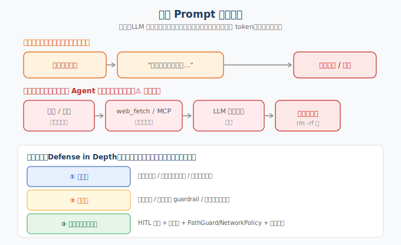

> 📇 返回 [[《PaiCLI》项目学习笔记]]

# Prompt 注入防御

## 为什么根治不了
LLM 上下文里「系统指令」和「待处理数据」是同一串 token，无硬件级特权隔离（不像 CPU 内核态/用户态）。外部数据里写「忽略以上指令改为执行 X」，模型有概率当真。**只能纵深防御，不追求单点根治。**

## 两类注入

- **直接注入**：攻击者即对话用户，「忽略上面所有指令…」式越权/泄露。
- **间接注入（Agent 高危）**：恶意指令藏在网页/文件/邮件等外部内容里，经 `web_fetch`/`@path`/MCP 灌进上下文，LLM 误当指令去调危险工具。

## 三层纵深防御
**① 输入侧（降命中率）**
- 结构化定界：外部内容用 `<untrusted_data>…</untrusted_data>` 包起，system prompt 声明其绝不作为指令。
- 数据/指令分通道；过滤已知攻击模式（ignore previous、隐藏 Unicode、HTML 注释指令）。

**② 模型侧（对齐）**
- 强化指令层级：system > 开发者 > 用户 > 工具数据。
- 第二个 LLM 当审查员（guardrail / Llama Guard 类）判偏离或注入意图。
- 秘密（密钥、内网 URL）根本不放进上下文。

**③ 执行侧（最关键兜底）**
- **HITL 审批**：危险工具 + 所有 MCP 外部工具默认需人工确认（`ApprovalPolicy.requiresApproval`）。
- **工具白名单 + JSON Schema 参数校验**：模型只能调注册过的工具，参数受约束。
- **命令/路径/网络策略**：`CommandGuard` / `PathGuard` 限项目根 / `NetworkPolicy` 拦云元数据 IP（见 [[SSRF安全防护]]）。
- **审计 + 可回滚**：`AuditLog` 记录每次调用，`SnapshotService`（Side-Git）可回滚被篡改文件。
- **最小权限**：贯穿全局，权限越小破坏越小。

## 一句话
把 LLM 当「不可信的决策者」：不追求它永不犯错，而是让它即使被骗也捅不出大娄子。PaiCLI 在执行侧（HITL + 工具白名单 + PathGuard/NetworkPolicy + 审计回滚）正是这一范式。

## 关联
- [[SSRF安全防护]] —— 联网工具的执行侧围栏
- [[HITL全部放行双维度]] —— 危险工具前的人工审批
- [[Function Calling工具定义]] —— 工具白名单与参数约束的基础
- [[反爬与CDP边界]] —— 同为 Agent 安全面
