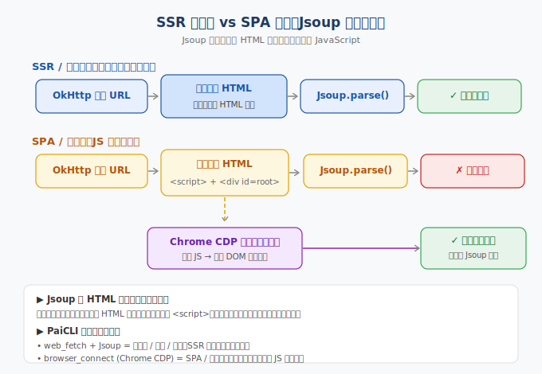

> 📇 返回 [[《PaiCLI》项目学习笔记]]

# SPA 与 Jsoup

## SPA 是什么
SPA（Single Page Application，单页应用）：浏览器请求 URL 时，服务器返回的 HTML 只是空壳（一个空的 `<div id="root">` + 一个 `<script>`）。真实内容由浏览器用 JavaScript（React/Vue 等）在本地发请求拉数据、动态生成 DOM 后塞进 root。**正文在 JS 执行后才存在。**

对应传统 SSR（服务端渲染）：服务器返回时就已带完整正文。

## Jsoup 是什么
Jsoup 是 Java 的 HTML 解析库，把一段静态 HTML 字符串解析成 DOM 树，可用 CSS 选择器查元素、提文本。关键：**它是纯解析器，没有 JS 引擎**，不执行 `<script>`、不发请求、不等渲染。

PaiCLI 的 `HtmlExtractor.java:45`：
```java
Document doc = Jsoup.parse(html, baseUrl == null ? "" : baseUrl, Parser.htmlParser());
```
这里的 `html` 是 `WebFetcher` 用 OkHttp 抓回的 HTTP 响应体（字符串）。

## 为什么 Jsoup 拿不到 SPA / 防爬站内容
空壳 HTML 经 `pickMainElement` 打分：所有候选块 `score()`（文本长度 − 链接占比惩罚）都 < 80 → 返回 `main == null` → 空 Markdown（`HtmlExtractor.java:29` 注释已说明）。所以 `web_fetch` 对 SPA/防爬站返回空正文。



## PaiCLI 怎么补
`browser_connect`（Chrome CDP）真正启动浏览器执行 JS、等 DOM 渲染后再把内容交给 Jsoup/Readability。分层：
- `web_search` 找 URL；`web_fetch` + Jsoup 抓 SSR 页（快、省）；`browser_connect` 对付 SPA/防爬站。

## 关联
- [[web_search与web_fetch]] —— 搜索与抓取的两步分工
- [[反爬与CDP边界]] —— CDP 只破反爬最外层，headless 反而是 bot 信号
