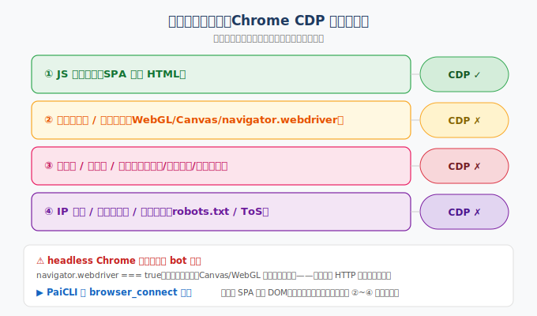

> 📇 返回 [[《PaiCLI》项目学习笔记]]

# 反爬与 CDP 边界

## 核心结论
Chrome CDP 只破反爬最外层「JS 动态渲染」，且 headless 本身就是强 bot 信号——所以反爬远没失去意义。

## 反爬是分层防御
| 层 | 防什么 | CDP（真实浏览器）能破吗 |
|----|--------|------------------------|
| ① JS 动态渲染 | 裸 HTTP/Jsoup 拿不到正文 | ✓ 能 |
| ② 浏览器指纹 | WebGL/Canvas/字体/时区等特征 | ✗ 破不了，headless 更明显 |
| ③ 无头检测 | `navigator.webdriver`、`window.cdc_*` 等 | ✗ 反而暴露 |
| ④ 登录墙/验证码 | 要登录、过滑块 | ✗ 需账号+打码 |
| ⑤ 行为风控 | 频率/轨迹/停留 | ✗ 需拟人脚本 |
| ⑥ IP/限流 | 同 IP 高频封禁 | ✗ 需代理池 |
| ⑦ 法律/ToS | robots.txt、协议 | ✗ 技术无解 |

## 为什么反爬仍有意义
- **headless 是 bot 信号**：`navigator.webdriver === true`、无真实鼠标轨迹、特征变量等，开 CDP 往往比 Jsoup 更快被识别封 IP。
- **本质是经济威慑不是造墙**：用最低成本拦掉 95% 裸爬虫；把剩下 5% 逼到必须投入代理/打码/养号/伪造指纹，成本指数上升。

## PaiCLI 边界
`browser_connect` 定位是「渲染 SPA」，**不是对抗反爬**：无 stealth、无指纹伪造、无代理轮换。抓公开文档站没问题，遇微信/小红书这种登录墙+风控仍被拦。

## 关联
- [[SPA与Jsoup]] —— 为什么 Jsoup 拿不到 SPA 内容
- [[web_search与web_fetch]] —— 联网工具分工
- [[Prompt注入防御]] —— 防爬与注入都是 Agent 安全面
