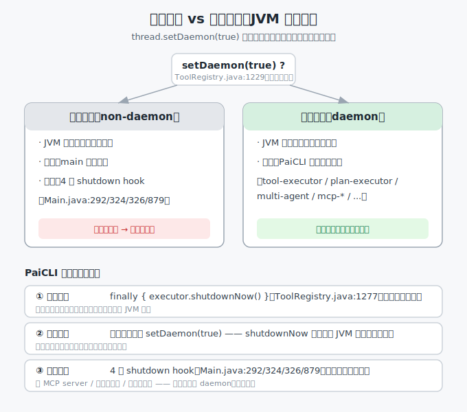

> 📇 返回 [[《PaiCLI》项目学习笔记]]

# 守护线程（daemon）在 PaiCLI 的应用

Java 的线程分两类：用户线程（non-daemon）和守护线程（daemon）。两者的唯一差别体现在 JVM 退出时：JVM 必须等所有用户线程跑完才退出；如果只剩守护线程存活，JVM 会立即退出，把守护线程直接强杀，不等它执行完。判定方式就是 `thread.setDaemon(true)`。

PaiCLI 把所有"干活"的线程都标成了 daemon。下面讲清楚为什么这么设计、标在哪些位置、边界又在哪里。



## 一、PaiCLI 里 daemon 标记的位置

工具执行线程在 `ToolRegistry` 的线程工厂里标 daemon（`ToolRegistry.java:1226-1231`）：

```java
ExecutorService executor = Executors.newFixedThreadPool(
    parallelism,
    r -> {
        Thread t = new Thread(r, "paicli-tool-executor");
        t.setDaemon(true);   // 工具线程标记为守护
        return t;
    }
);
```

全量核查下来，所有干活线程都是 daemon，无一例外：

- 工具执行：`paicli-tool-executor`（ToolRegistry:1229）、`paicli-command-output`（ToolRegistry:1314）、`paicli-rg-reader`（RipgrepCodeSearchEngine:49）
- 调度层：`paicli-plan-executor`（PlanExecuteAgent:385）、`paicli-multi-agent`（AgentOrchestrator:418）
- Agent 运行：`paicli-agent-runner`（Main:1112）、`paicli-tui-agent-runner`（TuiSessionController:73）、`paicli-task-worker`（DurableTaskManager:78）、`paicli-runtime-api`（RuntimeApiServer:25）
- MCP：`paicli-mcp-startup` / `-progress`（McpServerManager:95/176）、`paicli-mcp-jsonrpc-timeout`（JsonRpcClient:34）、`paicli-mcp-notifications`（NotificationRouter:28）、`paicli-mcp-stdio-stdout/stderr`（StdioTransport:141/160）
- 其它：`paicli-snapshot-writer`（SnapshotService:20）、`paicli-activity-display`（InlineActivityDisplay:55）、`paicli-wechat-agent`（WechatAgentSession:23）、`paicli-wechat-channel`（Main:1051）
- 所有 `ExecutorService`（newFixedThreadPool / newSingleThreadExecutor / newCachedThreadPool / ScheduledExecutor）均用 daemon 线程工厂，池内线程同样是 daemon。

唯一的非 daemon 线程是 JVM `main` 入口，以及 `Main.java` 里的 4 个 shutdown hook（:292 mcp-shutdown / :324 task-shutdown / :326 wechat-shutdown / :879 清理 hook）。

## 二、为什么把工具线程标成 daemon

三个理由：

1. CLI 退出不留僵尸进程。用户在终端按 Ctrl+C 退出 PaiCLI（主线程结束），如果工具线程是非守护，JVM 会阻塞等它结束，进程卡在后台关不掉。标 daemon 后进程直接干净退出。
2. 异常路径兜底。代码里 `finally { executor.shutdownNow() }`（ToolRegistry:1277）是正常关闭路径，但 finally 不 100% 可靠（System.exit、OOM、异常吞掉时可能不执行）。daemon 标记是第二道保险：就算 shutdownNow 没跑到，JVM 退出也会把线程清掉。
3. 语义上工具线程是辅助性的。工具执行服务于 Agent 主循环，本身不是必须完成的关键工作。主流程（推理）才是核心，辅助线程跟着主进程生死即可。

## 三、daemon 的坑：关键工作不能放 daemon

daemon 线程被强杀时不保证善终，这反而印证了为什么 PaiCLI 要写 shutdownNow：

- 不执行 finally：被强杀时清理代码不一定跑，资源可能泄漏。
- 不保证 flush：正在写的文件、未提交的事务可能被截断。
- 任何"必须完成"的任务（写文件落盘、提交事务、发确认消息）都不该放 daemon 线程。

PaiCLI 的判断是成立的：工具执行结果在 `executeTools` 返回时已经收集到 `ToolExecutionResult` 列表，有意义的结果不丢在 daemon 线程内部；少数执行到一半被强杀的工具，最多本次拿不到结果、LLM 下一轮重试，不影响数据一致性。

## 四、反例：shutdown hook 为什么不能标 daemon

shutdown hook 是 JVM 在退出阶段才启动、且会等它跑完的特殊线程。如果"关闭 MCP server / 刷任务状态 / 停微信通道"这些清理逻辑放在 daemon 线程，JVM 可能在清理跑到一半时就退出了，导致子进程残留、状态没落盘。所以必须完成的清理走 shutdown hook（保证跑完），可丢弃的辅助工作才放 daemon（可被强杀）。shutdown hook 不会让 CLI 关不掉，它只在退出序列里激活，正常运行时不参与"阻塞 JVM 退出"的判断。

## 五、三道退出防御（小结）

PaiCLI 的退出治理是三层分工：

1. `finally { executor.shutdownNow() }`（ToolRegistry:1277）—— 正常路径，优雅关线程池。
2. 所有干活线程 `setDaemon(true)` —— 异常路径，JVM 退出兜底强杀，进程绝不卡死。
3. 4 个 shutdown hook（Main:292/324/326/879）—— 退出阶段，跑必须完成的清理。

daemon 负责不阻塞，shutdown hook 负责收尾，两者不冲突。

## 相关
- [[并行工具执行与HITL]] —— 并行执行用的就是 daemon 线程池（FixedThreadPool(4)）
- [[MCP与JSON-RPC]] —— MCP 的 stdout/stderr reader、启动、通知线程也都是 daemon
- [[ReAct主循环]] —— 工具执行是 ReAct 的 ACT 阶段，结果回填是 OBSERVE
