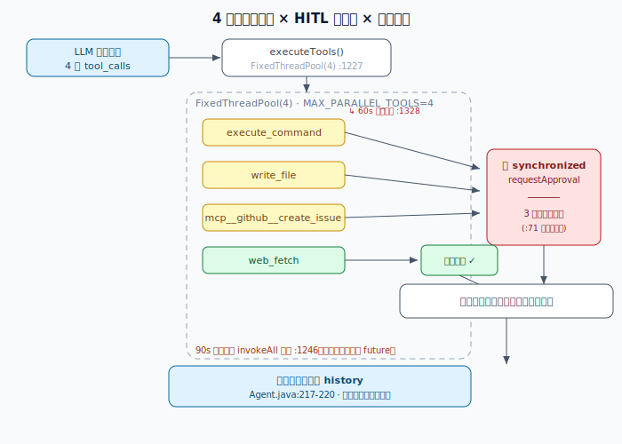

> 📇 返回 [[《PaiCLI》项目学习笔记]]

# 并行工具执行 × HITL 串行化 × 双层超时

LLM 一轮 `chat()` 可能同时返回多个 `tool_calls`。PaiCLI 用线程池并行执行以提速，但两类约束必须处理：**危险工具的 HITL 审批要串行化（同一时刻只能有一个弹窗）**，以及**任何工具都不能无限阻塞，需要双层超时兜底**。

> 上图按 `ToolRegistry` / `Agent` / `TerminalHitlHandler` 真实代码绘制：LLM 返回 4 个 tool_calls → `executeTools()` 丢进 `FixedThreadPool(4)` → 危险工具经 `synchronized requestApproval` 排队串行过审批门，安全工具直接执行 → 各线程并行跑工具（不持锁）→ 结果与 tool_calls 原序回填 history。

## 一、并行调度（FixedThreadPool）

- 入口：`Agent.java:678` `toolRegistry.executeTools(invocations)`。
- 实现（`ToolRegistry.java`）：`parallelism = min(invocations.size(), MAX_PARALLEL_TOOLS)`（`:1226`），`MAX_PARALLEL_TOOLS = 4`（`:63`）；`Executors.newFixedThreadPool(parallelism, ...)`（`:1227`）为每个工具建一个 task，**各线程并行执行工具体，执行阶段不持任何锁**。
- 注意：并行的是「工具执行」，不是「审批」——审批门在工具执行前，且被 synchronized 锁住（见下）。

## 二、HITL 串行化（一次一个弹窗）

- 危险工具（`execute_command` / `write_file` / 所有 MCP 外部工具）执行前先调 `requestApproval`。
- `requestApproval` 是 **synchronized**：同一时刻只有一个线程能进审批门（`TerminalHitlHandler`，图注 `:71`「一次只一个」）。所以即使 4 个工具并行，其中 3 个危险调用也会**排队串行**弹窗，不会同时蹦出多个确认框把终端刷爆。
- 安全工具（如 `web_fetch`）无需审批，**直接执行**，不进审批门。

## 三、双层超时（防卡死）

| 层级         | 位置                                                                            | 作用                                            |
| ---------- | ----------------------------------------------------------------------------- | --------------------------------------------- |
| 内层·单工具命令超时 | `timedOut` 分支（`ToolRegistry.java:1417` 一带；图注 `:1328`）                         | 单个命令执行超时就标记超时并取消该 future，不拖垮整批                |
| 外层·批次超时    | `executor.invokeAll(tasks, toolBatchTimeoutSeconds, SECONDS)`（`:1246`，默认 90s） | 整批所有 task 的最长等待；到点**只取消未完成的 future**，已完成的照常返回 |
|            |                                                                               |                                               |

两层配合：内层保「单个工具不僵尸」，外层保「整批不无限等待」。

## 四、结果按原序回填

所有 future 完成后，工具结果按 `tool_calls` 的**原始顺序**写回 `conversationHistory`（`Agent.java:217-220`）——回填顺序与工具实际完成先后**无关**。这点很关键：它保证每个结果的 `tool_call_id` 仍对齐对应的调用（见 [[请求响应配对]]），不会因为「谁先跑完」而错位。

## 一句话总结

PaiCLI 用 `FixedThreadPool(4)` 并行跑工具提速，但用 `synchronized requestApproval` 把危险工具的 HITL 弹窗串行化（一次一个），用「单工具命令超时 + 批次 invokeAll 90s」双层超时防卡死，最后结果按原序回填 history 保证 tool_call_id 不错位。并行的是执行，串行的是审批，超时是保险。

## 相关
- [[HITL全部放行双维度]] —— 放行按「工具 / server」两维度，审批门在这里触发
- [[ReAct主循环]] —— 一轮内 ACT=executeToolCalls，结果回填是 OBSERVE
- [[请求响应配对]] —— 原序回填如何保证 tool_call_id 不错位
- [[Prompt注入防御]] —— 并行执行的危险工具同样受 HITL / 护栏兜底
