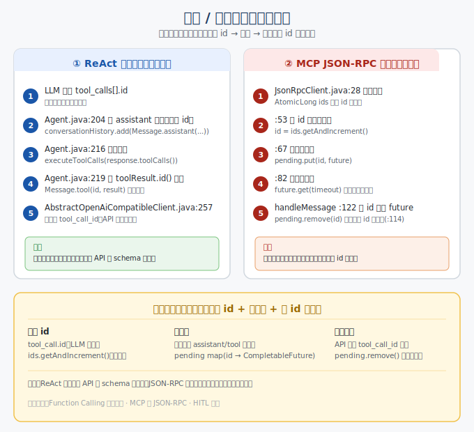

> 📇 返回 [[《PaiCLI》项目学习笔记]]

# 请求 / 响应配对

PaiCLI 里"请求和响应的配对"其实有**两套独立机制**，对应两个不同的通信边界。两者本质是相同的思想：发请求时生成一个唯一 id 并登记，收响应时按 id 取回配对——只是落点不同。



## 一、ReAct 循环：tool_call ↔ tool_result 配对

这是**对话历史里**一问一答的配对：LLM 说"我要调工具 X"，工具跑完的结果必须"认领"回那次调用。核心字段是 `tool_call_id`（OpenAI / Anthropic Function Calling 强制要求：工具结果消息必须带 `tool_call_id`，且等于 assistant 消息里对应 `tool_calls[].id`，否则 API 直接报错）。

代码链路（`src/main/java/com/paicli/agent/Agent.java`）：

```java
// 1) LLM 返回带 id 的 tool_calls，先作为 assistant 消息存进历史（保留 id）
conversationHistory.add(LlmClient.Message.assistant(
        response.reasoningContent(), response.content(), response.toolCalls()));  // :204-208

// 2) 执行工具
List<ToolExecutionResult> toolResults = executeToolCalls(response.toolCalls(), iteration);  // :216

// 3) 关键配对：工具结果消息用 toolResult.id() 回填，这个 id 就是上面那个 tool_call 的 id
for (ToolExecutionResult toolResult : toolResults) {
    conversationHistory.add(LlmClient.Message.tool(toolResult.id(), toolResult.result()));  // :219
}
```

执行侧把 id 一路带下去（`Agent.java:672`）：

```java
invocations.add(new ToolInvocation(toolCall.id(), toolName, toolArgs));
```

序列化时再写回 API（`src/main/java/com/paicli/llm/AbstractOpenAiCompatibleClient.java`）：

- 请求侧：assistant 的 `tool_calls[].id` 原样写出（`:249` `tcNode.put("id", tc.id())`）
- 结果侧：工具结果消息写 `tool_call_id`（`:257-258`）

```java
if (msg.toolCallId() != null) {
    msgNode.put("tool_call_id", msg.toolCallId());
}
```

**一句话**：`tool_call.id` 在"存 assistant 消息 → 执行工具 → 回写 tool 结果 → 序列化上送"整条链上被原样传递，API 端靠 `tool_call_id` 把结果绑回对应调用。这份配对是**同线程同步**完成的，主要为了满足对话 API 的 schema 正确性。

## 二、MCP 通信：JSON-RPC request ↔ response 配对

这是**网络层**的配对：PaiCLI 通过 stdio / HTTP 跟 MCP server 双向收发，一条通道上会同时飞好多请求，响应回来必须知道"你是回答我哪条请求的"。机制在 `src/main/java/com/paicli/mcp/jsonrpc/JsonRpcClient.java`——经典的相关联请求-响应多路复用。

```java
private final AtomicLong ids = new AtomicLong(1);                         // :28 单号生成器
private final ConcurrentHashMap<Long, CompletableFuture<JsonNode>> pending   // :30 待回复登记表
        = new ConcurrentHashMap<>();

public JsonNode request(String method, JsonNode params, long timeoutSeconds) {
    long id = ids.getAndIncrement();                  // :53 取唯一单号
    request.put("id", id);                            // :58 写进请求
    CompletableFuture<JsonNode> future = new CompletableFuture<>();
    pending.put(id, future);                          // :67 登记：(id → 等结果的盒子)
    scheduler.schedule(() -> {                        // :70-76 超时炸弹
        CompletableFuture<JsonNode> removed = pending.remove(id);
        if (removed != null) removed.completeExceptionally(new TimeoutException(...));
    }, timeoutSeconds, TimeUnit.SECONDS);
    transport.send(request);                          // :80 发出
    return future.get(timeoutSeconds + 1, ...);       // :82 当前线程卡住等结果
}
```

收包时的配对（`handleMessage`，`:111-136`）：

```java
JsonNode idNode = message.get("id");
if (idNode == null || idNode.isNull()) {              // :114 没有 id → 是「通知」
    for (Consumer<JsonNode> l : notificationListeners) l.accept(message);
    return;
}
long id = idNode.asLong();
CompletableFuture<JsonNode> future = pending.remove(id);   // :122 按 id 取回盒子（配对核心）
if (future == null) return;
JsonNode error = message.get("error");
if (error != null) future.completeExceptionally(...);      // :129 错误分支
else future.complete(message.get("result"));              // :135 成功：唤醒阻塞的调用方
```

**一句话**：发请求时 `getAndIncrement()` 拿全局唯一 id，把 `(id, future)` 塞进 `pending`；响应从同一通道回来后，`handleMessage` 读 `id` 去 `pending.remove(id)` 取回对应 future 并 `complete()`，调用方 `future.get()` 随即返回。没有 id 的消息当作通知（notification）单独路由，不走配对。这是异步多路复用通道上的请求-响应相关。

## 三、共同内核对照

| | ReAct tool 配对 | JSON-RPC 配对 |
|---|---|---|
| 唯一 id | `tool_call.id`（LLM 生成） | `ids.getAndIncrement()`（自增） |
| 登记表 | 对话历史里的 assistant / tool 消息对 | `pending` map（id → future） |
| 配对时机 | 同线程同步回填 | 异步响应到达时按 id 取回 |
| 防错 | API 强制 `tool_call_id` 匹配 | `pending.remove` 取空即丢弃 |

两者本质都是同一句：**发请求时生成一个唯一 id，把"id → 等待的 future / 待回填的消息"登记下来；收响应时按 id 取回并完成配对。** 区别只是 ReAct 那层是为了满足对话 API 的 schema 正确性，JSON-RPC 那层是为了在一条多路复用的双向通道上区分并发的异步请求。

## 相关
- [[Function Calling工具定义]] —— 工具的 name / description / parameters 怎么让 LLM 产出 tool_call
- [[MCP与JSON-RPC]] —— MCP 协议、传输方式与 JsonRpcClient 的并发安全设计
