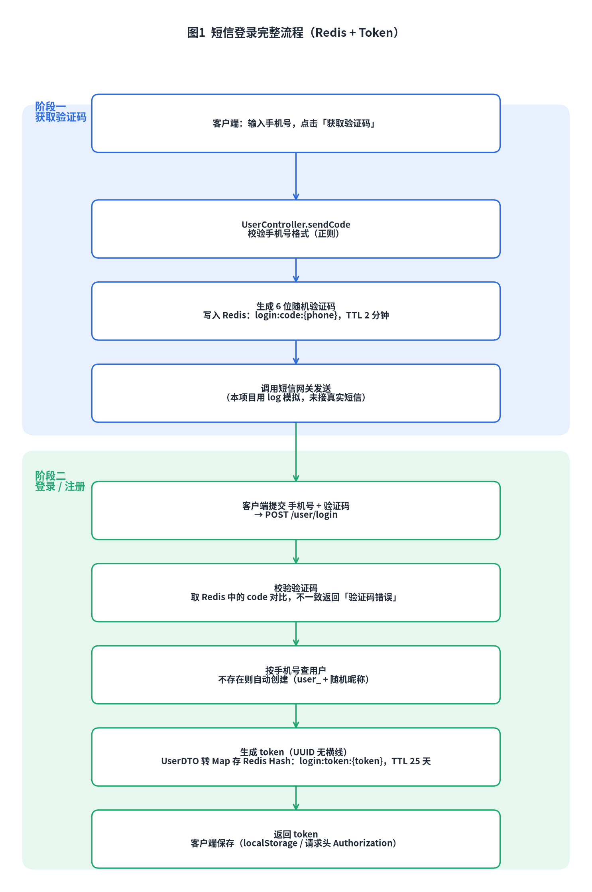
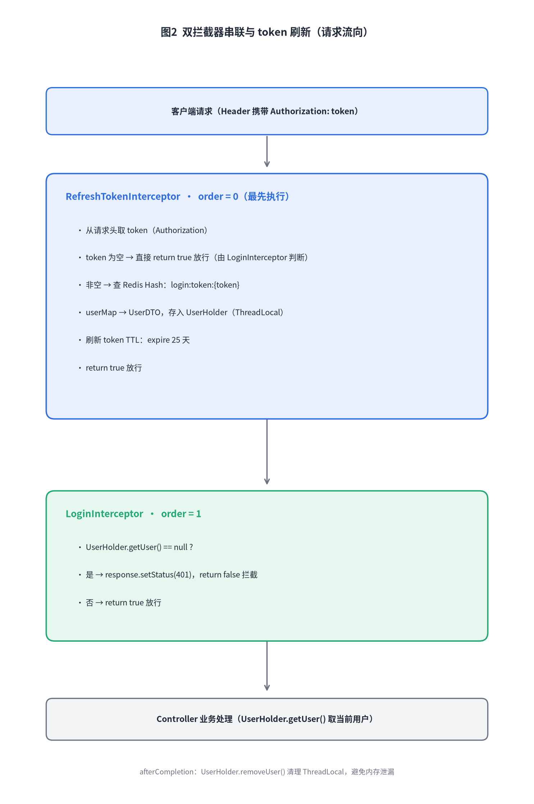
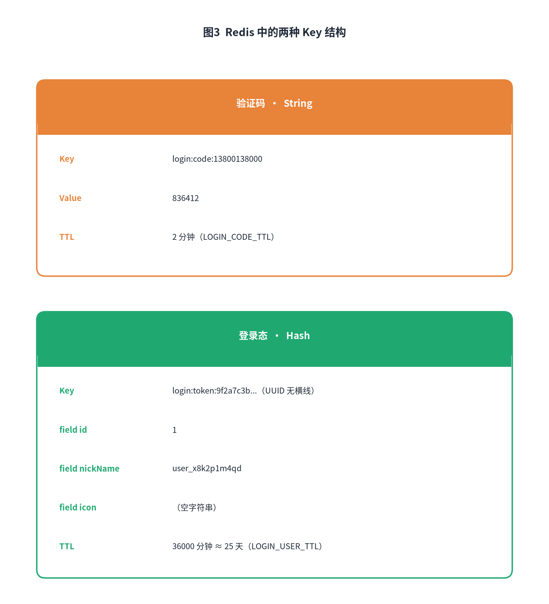

# 黑马点评短信登录：从思路到实现

> 📅 更新日期：2026-07-09

短信登录现在太常见了，点外卖、打车、刷短视频基本都是手机号 + 验证码一套。黑马点评这个项目的登录逻辑也是这套，但和传统 Session 方案不太一样：它把登录状态放到了 Redis，用 token 做身份识别，再用两个拦截器完成权限校验。这篇文章我按自己读代码的顺序，把整条链路串一遍。

## 为什么不用 Session？

课程一开始其实用的是 `HttpSession`：把验证码存 session，登录成功后再把 `UserDTO` 存 session。后面改成 Redis，原因很简单——**session 不适合分布式部署**。

- 后端只有一台机器时，session 存在 Tomcat 内存里没问题。
- 一旦多台机器，负载均衡可能把请求打到不同实例，A 机器上的 session 在 B 机器读不到。
- 解决办法要么 Session 复制、要么粘滞会话、要么 Spring Session，都比较麻烦。

把登录态抽出来放到 Redis，所有机器都读同一个地方，天然解决共享问题。这个思路在后面很多项目里都能看到。

## 整体方案

整个登录链路分三个阶段：

1. 用户输入手机号，后端生成 6 位验证码，存 Redis，有效期 2 分钟。
2. 用户输入手机号 + 验证码，后端校验，通过则查用户，没有就自动注册，生成 token，把用户信息以 Hash 形式存 Redis，有效期 25 天。
3. 后续请求在 Header 里带上 token，后端拦截器校验 token 有效性，并刷新 token 的有效期。



下面逐段看代码。

## 1. 发送验证码

`UserController` 只负责接收和转发：

```java
@PostMapping("code")
public Result sendCode(@RequestParam("phone") String phone, HttpSession session) {
    return userService.setCode(phone, session);
}
```

实际逻辑在 `UserServiceImpl.setCode`：

```java
@Override
public Result setCode(String phone, HttpSession session) {
    // 1. 校验手机号格式
    if (RegexUtils.isPhoneInvalid(phone)) {
        return Result.fail("手机号格式错误！！！");
    }
    // 2. 生成 6 位验证码
    String code = RandomUtil.randomNumbers(6);
    // 3. 写入 Redis，key = login:code:手机号，有效期 2 分钟
    stringRedisTemplate.opsForValue().set(
        LOGIN_CODE_KEY + phone, code, LOGIN_CODE_TTL, TimeUnit.MINUTES);
    // 4. 发送验证码（这里用日志模拟，未接真实短信网关）
    log.info("发送验证码成功，验证码:{}", code);
    return Result.ok();
}
```

注意项目没有接真实短信平台，只是用 `log.info` 模拟。本地学习这样够用了；真正上线时把这里换成第三方短信服务即可。

Redis 里验证码对应的 key：

```java
public static final String LOGIN_CODE_KEY = "login:code:";
public static final Long LOGIN_CODE_TTL = 2L;
```

TTL 是 2 分钟，验证码必须在有效期内使用，否则登录时 Redis 查不到，会返回「验证码错误」。

## 2. 登录 / 自动注册

`UserController.login` 接收手机号和验证码：

```java
@PostMapping("/login")
public Result login(@RequestBody LoginFormDTO loginForm, HttpSession session) {
    return userService.login(loginForm, session);
}
```

`LoginFormDTO` 长这样：

```java
@Data
public class LoginFormDTO {
    private String phone;
    private String code;
    private String password;
}
```

密码字段在短信登录模式下没有用到，只校验 phone 和 code。

`UserServiceImpl.login` 是整条链路的核心，我把它拆成七步来看：

```java
@Override
public Result login(LoginFormDTO loginForm, HttpSession session) {
    // 1. 校验手机号格式
    String phone = loginForm.getPhone();
    if (RegexUtils.isPhoneInvalid(phone)) {
        return Result.fail("手机号格式错误！！！");
    }

    // 2. 校验验证码
    String cacheCode = stringRedisTemplate.opsForValue().get(LOGIN_CODE_KEY + phone);
    String code = loginForm.getCode();
    if (cacheCode == null || !cacheCode.toString().equals(code)) {
        return Result.fail("验证码错误");
    }

    // 3. 按手机号查用户，不存在则自动注册
    User user = query().eq("phone", phone).one();
    if (user == null) {
        user = createUserWithPhone(phone);
    }

    // 4. 生成 token，作为登录令牌
    String token = UUID.randomUUID().toString(true);

    // 5. 用户信息脱敏为 UserDTO，再转为 Map
    UserDTO userDTO = BeanUtil.copyProperties(user, UserDTO.class);
    Map<String, Object> userMap = BeanUtil.beanToMap(userDTO, new HashMap<>(),
            CopyOptions.create()
                .setIgnoreNullValue(true)
                .setFieldValueEditor((fieldName, fieldValue) -> fieldValue.toString()));

    // 6. 写入 Redis Hash
    String tokenKey = LOGIN_USER_KEY + token;
    stringRedisTemplate.opsForHash().putAll(tokenKey, userMap);

    // 7. 设置 token 有效期
    stringRedisTemplate.expire(tokenKey, LOGIN_USER_TTL, TimeUnit.MINUTES);

    return Result.ok(token);
}
```

`createUserWithPhone` 负责新用户初始化：

```java
private User createUserWithPhone(String phone) {
    User user = new User();
    user.setPhone(phone);
    user.setNickName(USER_NICK_NAME_PREFIX + RandomUtil.randomString(10));
    save(user);
    return user;
}
```

这里有个细节值得注意：`BeanUtil.beanToMap` 时，id 是 Long 类型，但 `StringRedisTemplate` 的 Hash 要求 key 和 value 都是字符串。代码通过 `setFieldValueEditor` 把所有字段值转成 String，否则写入 Redis 会报错。我第一次看的时候也被这个 `toString()` 绕了一下，因为直觉上觉得 Hutool 会自动处理，但实际上对于 StringRedisTemplate 不行。

返回的 token 交给前端保存，后续请求带上它即可。

## 3. 双拦截器与 token 刷新

这是整段逻辑里我最喜欢的部分。`MvcConfig` 里注册了两个拦截器：

```java
@Override
public void addInterceptors(InterceptorRegistry registry) {
    // 先执行：解析 token、刷新有效期、注入用户信息
    registry.addInterceptor(new RefreshTokenInterceptor(stringRedisTemplate))
            .addPathPatterns("/**")
            .order(0);

    // 后执行：真正判断是否需要登录
    registry.addInterceptor(new LoginInterceptor())
            .excludePathPatterns(
                "/shop/**", "/voucher/**", "/shop-type/**",
                "/upload/**", "/blog/hot",
                "/user/code", "/user/login"
            )
            .order(1);
}
```

拆成两个拦截器，职责很清晰：

- `RefreshTokenInterceptor` 拦截所有请求，只负责从 token 解析用户并刷新 token 有效期。没有 token 的请求它也不拦，放行。
- `LoginInterceptor` 负责真正的权限判断。哪些接口需要登录、哪些接口游客可以访问，在这里配置。

像 `/shop/**`、`/blog/hot`、`/user/code`、`/user/login` 这些接口不需要登录，所以用 `excludePathPatterns` 排除掉。但即使排除的接口，请求仍然会经过 `RefreshTokenInterceptor`，因为它配置了 `/**`。如果用户已经登录，访问这些页面时也能拿到用户信息，只是不会被强制要求登录。



`RefreshTokenInterceptor` 的关键代码：

```java
@Override
public boolean preHandle(HttpServletRequest request, HttpServletResponse response,
                         Object handler) throws Exception {
    String token = request.getHeader("Authorization");
    if (StrUtil.isBlank(token)) {
        return true; // 没有 token，放行，交给 LoginInterceptor 判断
    }

    String key = LOGIN_USER_KEY + token;
    Map<Object, Object> userMap = stringRedisTemplate.opsForHash().entries(key);
    if (userMap.isEmpty()) {
        return true; // token 无效或过期，同样放行，交给 LoginInterceptor
    }

    // 转成 UserDTO 并存入 ThreadLocal
    UserDTO userDTO = BeanUtil.fillBeanWithMap(userMap, new UserDTO(), false);
    UserHolder.saveUser(userDTO);

    // 刷新 token 有效期
    stringRedisTemplate.expire(key, RedisConstants.LOGIN_USER_TTL, TimeUnit.MINUTES);
    return true;
}

@Override
public void afterCompletion(HttpServletRequest request, HttpServletResponse response,
                            Object handler, Exception ex) throws Exception {
    UserHolder.removeUser(); // 请求结束，清理 ThreadLocal
}
```

三个关键点：

1. token 为空或者 Redis 查不到用户，都直接放行，不抛异常。真正的拦截交给 `LoginInterceptor`。
2. 查到用户后，先转成 `UserDTO`，存入 `UserHolder`（ThreadLocal），然后刷新 token 的 TTL。
3. `afterCompletion` 里必须清理 ThreadLocal，否则线程池复用线程时可能出现用户信息残留。

`UserHolder` 的代码非常简单：

```java
public class UserHolder {
    private static final ThreadLocal<UserDTO> tl = new ThreadLocal<>();

    public static void saveUser(UserDTO user) {
        tl.set(user);
    }

    public static UserDTO getUser() {
        return tl.get();
    }

    public static void removeUser() {
        tl.remove();
    }
}
```

ThreadLocal 让每个请求有独立的用户副本，不会被其他线程覆盖。`removeUser` 放在 `afterCompletion` 清理，防止内存泄漏。

`LoginInterceptor` 只干一件事：

```java
@Override
public boolean preHandle(HttpServletRequest request, HttpServletResponse response,
                         Object handler) throws Exception {
    if (UserHolder.getUser() == null) {
        response.setStatus(401);
        return false;
    }
    return true;
}
```

如果 `RefreshTokenInterceptor` 在前面没有成功注入用户，说明没登录或者 token 无效，这里直接返回 401。

## 4. Redis 数据结构设计

Redis 里用了两种 key，分别对应验证码和登录态：



验证码相关：

```java
public static final String LOGIN_CODE_KEY = "login:code:";
public static final Long LOGIN_CODE_TTL = 2L;
```

登录态相关：

```java
public static final String LOGIN_USER_KEY = "login:token:";
public static final Long LOGIN_USER_TTL = 36000L;
```

`LOGIN_USER_TTL = 36000` 分钟，也就是 25 天。这个值看起来很长，但没关系，因为每次请求都会刷新 TTL。只要用户持续活跃，登录状态就不会过期。

登录态用 Hash 而不是 String，是因为用户信息包含多个字段（id、nickName、icon）。Hash 查一次能拿到全部字段，也方便后续扩展。

## 5. 踩坑与注意事项

1. **Long 类型 id 必须转 String**。`StringRedisTemplate` 的 Hash 要求 key 和 value 都是字符串。如果直接把 `UserDTO` 的 `beanToMap` 塞进去会报错，必须用 `setFieldValueEditor` 把所有值转成 String。

2. **token 刷新机制**。`RefreshTokenInterceptor` 每次请求都刷新 TTL，这是关键设计。否则固定 25 天过期，用户用着用着就会掉线。

3. **ThreadLocal 必须清理**。`afterCompletion` 里调用 `removeUser()` 不是可选操作，是必选项。Tomcat 线程池会复用线程，不清除会有残留。

4. **Authorization 大小写**。代码里从请求头取 `Authorization`，前端发送时大小写要一致。

5. **拦截器 order 顺序**。`order` 值越小越先执行。`RefreshTokenInterceptor` 是 0，`LoginInterceptor` 是 1，顺序不能反。

6. **登录即注册**。这个项目里没有独立的注册接口，手机号不存在就直接创建用户，昵称默认是 `user_` + 随机字符串。业务上如果要完善，后续可以引导用户修改资料。

## 总结

黑马点评的短信登录方案，本质是把「用户登录态」从 Tomcat 的 session 里搬出来，放到 Redis 里用 token 维护。这样做最大的好处是支持水平扩展，不用处理 session 共享问题。

整条链路的核心点：

- 验证码：Redis 临时存，2 分钟有效期。
- 登录：校验验证码、自动注册、生成 token、写 Redis Hash。
- 双拦截器：一个刷新 token 和用户信息，一个负责真正拦截。
- ThreadLocal：请求内共享用户信息，请求结束清理。

如果你准备面试或者写项目，建议能手画这套流程。理解它之后，后面的签到、秒杀、优惠券等功能基本都是在这个用户体系上做的。

---

作为还在学习路上的大学生，这些都是我踩坑踩出来的经验，分享出来希望能帮到同样在学 Java 的小伙伴～如果有写得不对的地方，欢迎大佬们指正！
你们在学习的时候有遇到过什么有意思的坑吗？评论区聊聊呀👇
🎓 我是 ***小小放舟***，一个正在努力打怪升级的后端学习者
🌊 个人主页：[小小放舟的 CSDN](https://blog.csdn.net/UnmooredBoat?spm=1010.2135.3001.5343)
✨ 点赞收藏不迷路，我们一起放舟技术海～


---

## 🔗 关联笔记
- [[《黑马点评》项目学习笔记]]
- [[Redis笔记]]
- [[黑马点评（Redis 企业实战）]]
