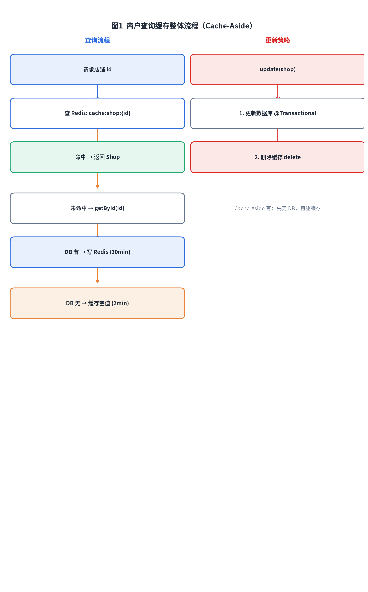
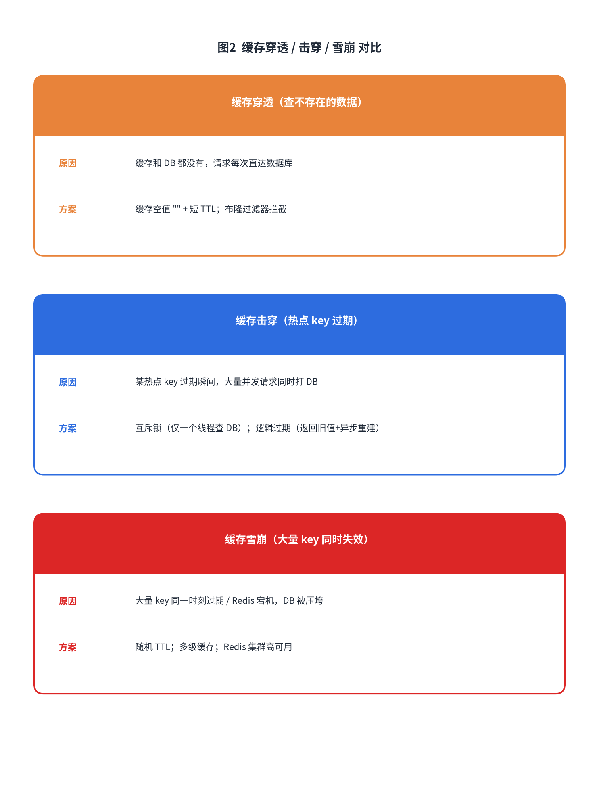
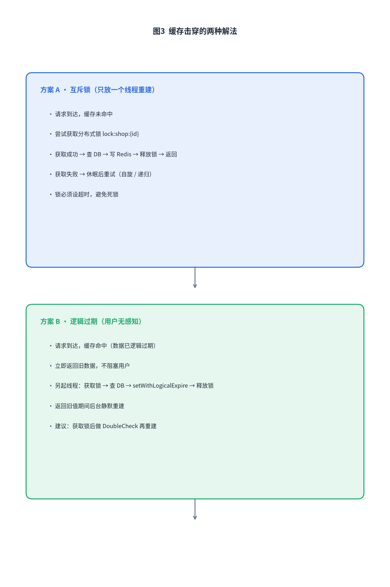

# 黑马点评商户缓存实战：穿透、击穿、雪崩与工具封装

读多写少的场景下缓存几乎是必选项。黑马点评里的店铺信息就是典型的读多写少，谁进 App 都要查商户。这篇文章我把项目里商户查询相关的缓存代码拆开看，包括更新策略、穿透、击穿、雪崩，以及最后封装出来的 `CacheClient`。

## 1. 整体思路：Cache-Aside

项目里采用的是最常见的 **Cache-Aside** 模式：

- 读：先查缓存，命中直接返回；没命中再查数据库，然后回写缓存。
- 写：先更新数据库，再删除缓存。



这套模式简单直接，缺点是对一致性要求特别高的场景需要额外处理。但对店铺详情这种可以容忍秒级不一致的业务，已经够用了。

## 2. 缓存更新策略

`ShopServiceImpl.update` 是缓存更新的入口：

```java
@Override
@Transactional
public Result update(Shop shop) {
    Long id = shop.getId();
    if (id == null) {
        return Result.fail("店铺ID不存");
    }
    // 1. 更新数据库
    updateById(shop);
    // 2. 删除缓存
    stringRedisTemplate.delete(CACHE_SHOP_KEY + id);

    return Result.ok();
}
```

思路是 **先更新数据库，再删除缓存**。如果反过来，先删缓存再更 DB，在更新完成前另一个读请求可能把旧数据重新写回缓存，导致缓存和数据库不一致。先更 DB 再删，虽然仍有短暂不一致窗口，但概率小很多，也足够日常业务使用。

那能不能直接更新缓存而不是删除？可以，但会有并发覆盖的问题。比如两个线程同时更新同一个字段，先写的缓存可能被后写但内容较旧的线程覆盖。删除缓存相当于下次读取时重新从 DB 拉最新值，简单可靠。

店铺类型 `ShopTypeServiceImpl` 也是类似的 Cache-Aside，只是它缓存的是一个列表：

```java
@Override
public Result queryTypeList() {
    String key = CACHE_SHOP_TYPE_KEY;
    String shopTypes = stringRedisTemplate.opsForValue().get(key);
    if (StrUtil.isNotBlank(shopTypes)) {
        List<ShopType> shopTypeList = JSONUtil.toList(shopTypes, ShopType.class);
        return Result.ok(shopTypeList);
    }
    List<ShopType> shoplist = query().list();
    if (CollectionUtil.isEmpty(shoplist)) {
        return Result.fail("没有数据");
    }
    stringRedisTemplate.opsForValue().set(key, JSONUtil.toJsonPrettyStr(shoplist));
    stringRedisTemplate.expire(key, CACHE_SHOP_TYPE_TTL, TimeUnit.MINUTES);
    return Result.ok(shoplist);
}
```

## 3. 缓存穿透

缓存穿透指的是查询一个缓存和数据库里都没有的数据，导致每次请求都打到 DB。如果被人恶意用大量不存在的 id 刷接口，DB 会被打挂。

项目里用 `CacheClient.queryWithPassThrough` 来解决：

```java
public <R, ID> R queryWithPassThrough(String keyPrefix, ID id, Class<R> type,
        Function<ID, R> dbFallback, Long time, TimeUnit unit) {
    String key = keyPrefix + id;
    String json = stringRedisTemplate.opsForValue().get(key);

    if (StrUtil.isNotBlank(json)) {
        return JSONUtil.toBean(json, type);
    }
    // 命中空值：说明之前已经查过 DB 且不存在
    if (json != null) {
        return null;
    }

    R r = dbFallback.apply(id);
    if (r == null) {
        // DB 也不存在，缓存空值 ""，TTL 2 分钟
        stringRedisTemplate.opsForValue().set(key, "", CACHE_NULL_TTL, TimeUnit.MINUTES);
        return null;
    }

    this.set(key, r, time, unit);
    return r;
}
```

关键点：

- 命中空字符串 `""` 直接返回 null，不会再去查 DB。
- 非空字符串反序列化后返回。
- 数据库没有就缓存空值，TTL 只有 2 分钟，避免空值长期占用缓存。

这个方案简单有效，但有一个前提：大量不存在的 id 空间不能太大，否则空值也会占不少内存。如果 id 范围无限，布隆过滤器会是更好的选择，不过项目里没有引入。

## 4. 缓存击穿

缓存击穿是热点 key 过期的那一瞬间，大量并发请求同时发现缓存里没有，然后一起去查数据库。对商户详情页这种可能出现的热门店铺来说，风险真实存在。



项目里提供了两种解决思路，目前实际调用的是 **逻辑过期**：

```java
@Override
public Result queryById(Long id) {
    Shop shop = cacheClient.queryWithLogicalExpire(
            CACHE_SHOP_KEY, id, Shop.class, this::getById, 20L, TimeUnit.SECONDS);
    if (shop == null) {
        return Result.fail("店铺不存在");
    }
    return Result.ok(shop);
}
```

### 方案 A：互斥锁

项目里 `CacheClient` 有 `tryLock/unlock` 方法，靠 Redis 的 `setIfAbsent` 实现：

```java
private boolean tryLock(String key) {
    Boolean flag = stringRedisTemplate.opsForValue()
            .setIfAbsent(key, "1", 10, TimeUnit.SECONDS);
    return BooleanUtil.isTrue(flag);
}

private void unlock(String key) {
    stringRedisTemplate.delete(key);
}
```

思路是：缓存未命中时，所有线程抢锁，只有一个线程能查 DB 并回写缓存，其他线程等待或重试。`ShopServiceImpl` 里有一段被注释掉的 `queryWithMutex` 就是这种写法。

互斥锁简单，但缺点是用户要等待，如果重建慢，响应会变差。

### 方案 B：逻辑过期（当前采用）

逻辑过期的核心思想是：**缓存里的 key 永远不会被 Redis 物理删除**，而是在 value 里额外保存一个过期时间。即使过期了，也继续返回旧数据，同时另起一个线程异步重建。

`RedisData` 就是用来包装逻辑过期时间的：

```java
@Data
public class RedisData {
    private LocalDateTime expireTime;
    private Object data;
}
```

`CacheClient.queryWithLogicalExpire` 的逻辑：

```java
public <R, ID> R queryWithLogicalExpire(String keyPrefix, ID id, Class<R> type,
        Function<ID, R> dbFallback, Long time, TimeUnit unit) {
    String key = keyPrefix + id;
    String shopJSON = stringRedisTemplate.opsForValue().get(key);
    if (StrUtil.isBlank(shopJSON)) {
        return null;
    }

    RedisData redisData = JSONUtil.toBean(shopJSON, RedisData.class);
    R r = JSONUtil.toBean((JSONObject) redisData.getData(), type);
    LocalDateTime expireTime = redisData.getExpireTime();

    if (expireTime.isAfter(LocalDateTime.now())) {
        return r; // 未过期，直接返回
    }

    // 已过期，异步重建
    String lockKey = LOCK_SHOP_KEY + id;
    boolean isLock = tryLock(lockKey);
    if (isLock) {
        CACHE_REBUILD_EXECUTOR.submit(() -> {
            try {
                R r1 = dbFallback.apply(id);
                this.setWithLogicalExpire(key, r1, time, unit);
            } catch (Exception e) {
                throw new RuntimeException(e);
            } finally {
                unlock(lockKey);
            }
        });
    }
    return r; // 返回过期数据，用户无感知
}
```



`setWithLogicalExpire` 写入 Redis 时并不设置 Redis 的 TTL：

```java
public void setWithLogicalExpire(String key, Object value, Long time, TimeUnit unit) {
    RedisData redisData = new RedisData();
    redisData.setData(value);
    redisData.setExpireTime(LocalDateTime.now().plusSeconds(unit.toSeconds(time)));
    stringRedisTemplate.opsForValue().set(key, JSONUtil.toJsonStr(redisData));
}
```

注意：它只把过期时间存在 value 里，没有 `expire` 命令。所以 `cache:shop:{id}` 在 Redis 里是长期存在的，除非被内存淘汰。

这种做法的好处是：

- 热点 key 不会因为物理过期而瞬间失效。
- 重建期间用户仍然能拿到旧数据，响应不会阻塞。
- 互斥锁只用于控制重建线程的数量，而不是阻塞读请求。

风险是可能返回旧数据，以及长期占用 Redis 内存。对店铺详情这种读多写少、允许短暂不一致的场景很合适。

## 5. 缓存雪崩

缓存雪崩是大量 key 同时过期，或者 Redis 直接宕机，导致所有请求涌向 DB。和缓存击穿不同，击穿是一个 key，雪崩是一片 key。

项目里的应对：

- `queryWithLogicalExpire` 的 key 没有物理 TTL，不存在过期瞬间，自然规避了雪崩。
- 如果用 `queryWithPassThrough` 的缓存，TTL 是固定的 30 分钟。批量导入数据时如果同时写入，确实可能同时失效。可以改成基础 TTL + 随机偏移，比如 `30 + random(1, 10)` 分钟。
- 另外就是 Redis 本身的高可用，主从、哨兵、集群，避免单点故障。

代码里雪崩并没有被显式处理（没有随机 TTL），但逻辑过期方案本身解决了商户详情这部分的雪崩风险。

## 6. 缓存工具封装

如果每个 Service 都自己写一套「查缓存 → 查 DB → 写缓存」的逻辑，会重复很多代码。项目里把通用逻辑抽到了 `CacheClient`。

`CacheClient` 提供的能力：

- `set(key, value, time, unit)`：普通缓存写入。
- `setWithLogicalExpire(key, value, time, unit)`：带逻辑过期时间写入。
- `queryWithPassThrough(...)`：解决穿透。
- `queryWithLogicalExpire(...)`：解决击穿。

通过泛型和 `Function<ID, R> dbFallback` 回调，可以复用到任何实体上：

```java
Shop shop = cacheClient.queryWithLogicalExpire(
    CACHE_SHOP_KEY, id, Shop.class, this::getById, 20L, TimeUnit.SECONDS);
```

调用的 Service 只需要关心业务查询 `this::getById`，缓存的通用流程全在 `CacheClient` 里。

另外，`SimpleRedisLock` 也做了独立封装，用 UUID + 线程 ID 作为锁的标识，并用 Lua 脚本保证释放锁的原子性：

```java
public class SimpleRedisLock implements ILock {
    private String name;
    private StringRedisTemplate stringRedisTemplate;

    private static final String KEY_PREFIX = "lock";
    private static final String ID_PREFIX = UUID.randomUUID().toString(true) + "-";

    private static final DefaultRedisScript<Long> UNLOCK_SCRIPT;
    static {
        UNLOCK_SCRIPT = new DefaultRedisScript<>();
        UNLOCK_SCRIPT.setLocation(new ClassPathResource("unlock.lua"));
        UNLOCK_SCRIPT.setResultType(Long.class);
    }

    @Override
    public boolean tryLock(long timeoutSec) {
        String threadId = ID_PREFIX + Thread.currentThread().getId();
        Boolean success = stringRedisTemplate.opsForValue()
            .setIfAbsent(KEY_PREFIX + name, threadId, timeoutSec, TimeUnit.SECONDS);
        return Boolean.TRUE.equals(success);
    }

    @Override
    public void unlock() {
        stringRedisTemplate.execute(
            UNLOCK_SCRIPT,
            Collections.singletonList(KEY_PREFIX + name),
            ID_PREFIX + Thread.currentThread().getId()
        );
    }
}
```

用 Lua 脚本是为了避免“判断锁是不是自己的”和“删除锁”之间被其他线程打断，导致误删。`CacheClient` 里的 `unlock` 是简单 `delete`，只作为重建锁使用；真正需要安全释放的场景建议用 `SimpleRedisLock`。

## 7. 踩坑总结

1. **Cache-Aside 更新一定是先 DB 后删缓存**。反过来的话，并发读容易把旧值重新写回缓存。
2. **缓存空值要设短 TTL**。否则空值长期占内存，而且业务数据一旦真的新增，缓存里还是空。
3. **逻辑过期不设置 Redis TTL**。这意味着缓存不会自动过期，要预留内存淘汰策略，且能接受短期旧数据。
4. **DoubleCheck 建议加上**。`queryWithLogicalExpire` 拿到锁后，最好再查一次 Redis 是否已过期，避免多个线程重复重建。
5. **互斥锁需要超时**。防止获取锁的线程挂掉后导致死锁。
6. **JSON 序列化用 Hutool 的 JSONUtil**。注意 `RedisData` 里的 `data` 是 `Object`，需要二次转换为具体类型。

## 8. 总结

黑马点评的商户缓存覆盖了日常最经典的几类问题：

- Cache-Aside 更新策略：先更 DB 再删缓存。
- 缓存穿透：缓存空值 + 短 TTL。
- 缓存击穿：互斥锁或逻辑过期，项目里用的是逻辑过期。
- 缓存雪崩：逻辑过期无物理 TTL，规避了批量过期风险。
- 工具封装：`CacheClient` 把通用逻辑抽出来，`SimpleRedisLock` 提供安全的分布式锁。

这些代码不是纸上谈兵，都是可以直接在面试和项目里拿出来讲的实现。

---

作为还在学习路上的大学生，这些都是我踩坑踩出来的经验，分享出来希望能帮到同样在学 Java 的小伙伴～如果有写得不对的地方，欢迎大佬们指正！

你们在学习的时候有遇到过什么有意思的坑吗？评论区聊聊呀👇

🎓 我是 ***小小放舟***，一个正在努力打怪升级的后端学习者

🌊 个人主页：[小小放舟的 CSDN](https://blog.csdn.net/UnmooredBoat?spm=1010.2135.3001.5343)

✨ 点赞收藏不迷路，我们一起放舟技术海～


---

## 🔗 关联笔记
- [[《黑马点评》项目学习笔记]]
- [[Redis笔记]]
- [[黑马点评（Redis 企业实战）]]
