04月18日
**微服务治理**

# 1. 认识微服务

**微服务** 是一种软件架构风格，它是以专注于单一职责的很多小型项目为基础，组合出复杂的大型应用。

## 1.1. 微服务架构演变

### 1.1.1. **单体架构**

**单体架构（monolithic structure）**：顾名思义，整个项目中所有功能模块都在一个工程中开发；项目部署时需要对所有模块一起编译、打包；项目的架构设计、开发模式都非常简单。

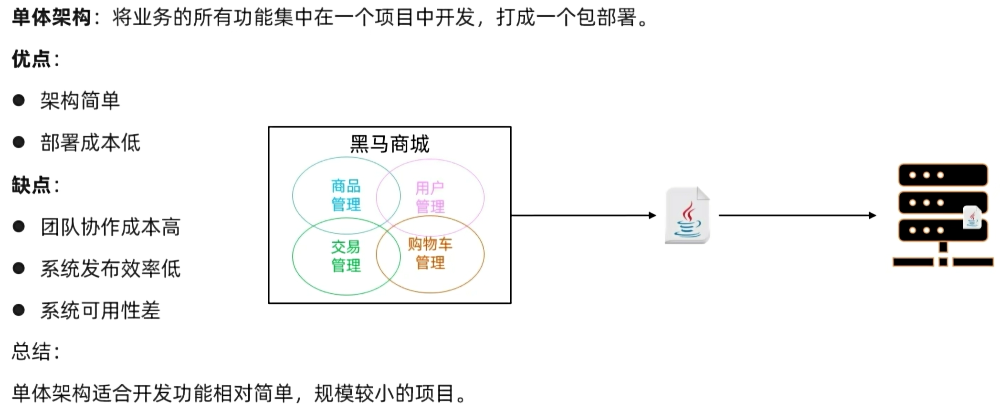

### 1.1.2. **分布式架构**

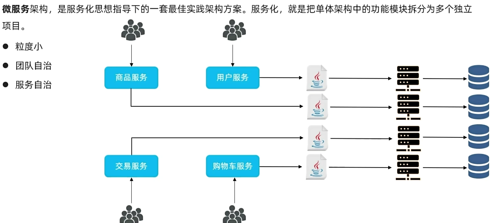

**服务治理：**

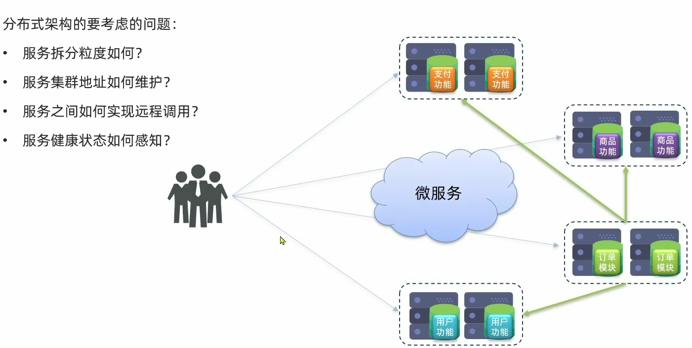

---

#### 1.1.2.1. **微服务介绍**

**微服务：**是分布式架构的一种具体实现形式是一种经过良好架构设计的**分布式架构方案**。

- **单一职责**：微服务拆分粒度更小，每一个服务都对应唯一的业务能力，做到单一职责，避免重复业务开发。
- **面向服务**：微服务对外暴露业务接口。
- **自治**：团队独立、技术独立、数据独立、部署独立。
- **隔离性强**：服务调用做好隔离、容错、降级，避免出现级联问题。

---

#### 1.1.2.2. 微服务技术对比

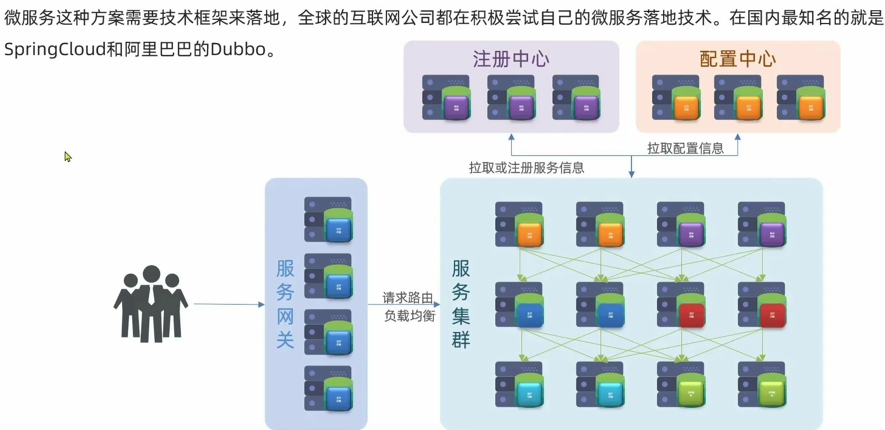

---

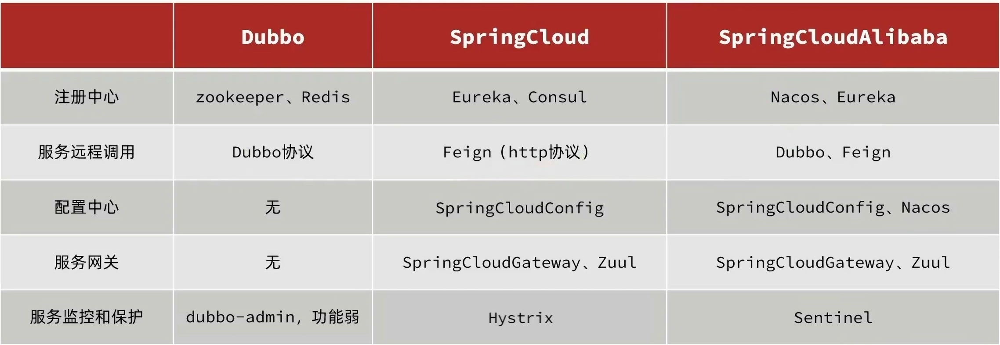

---

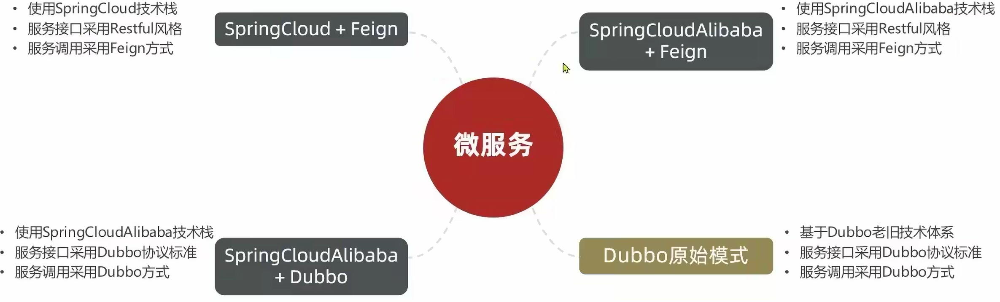

**总结：**

**单体架构**

- **特点**：简单方便，高度耦合，扩展性差。
- **适用场景**：适合小型项目，例如学生管理系统。

**分布式架构**

- **特点**：松耦合，扩展性好，但架构复杂，难度大。
- **适用场景**：适合大型互联网项目，例如京东、淘宝。

**微服务：**（一种良好的分布式架构方案）

- **优点**：拆分粒度更小、服务更独立、耦合度更低。
- **缺点**：架构非常复杂，运维、监控、部署难度提高。

---

## 1.2. SpringCloud

- **Spring Cloud** 是目前国内使用最广泛的微服务框架，其官网地址为：[https://spring.io/projects/spring-cloud](https://spring.io/projects/spring-cloud)
- 它集成了多种微服务功能组件，并基于 **Spring Boot** 实现了自动装配，从而提供了开箱即用的良好开发体验。

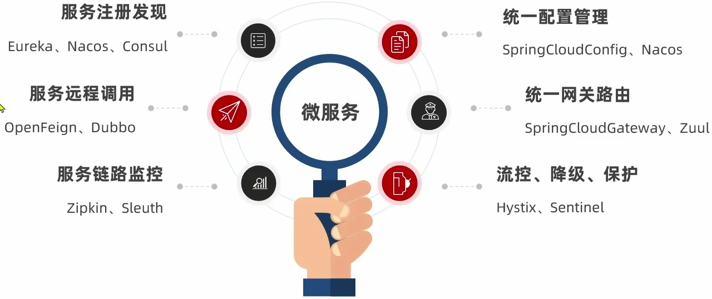

---

- SpringCloud 与 SpringBoot 的版本兼容关系如下：

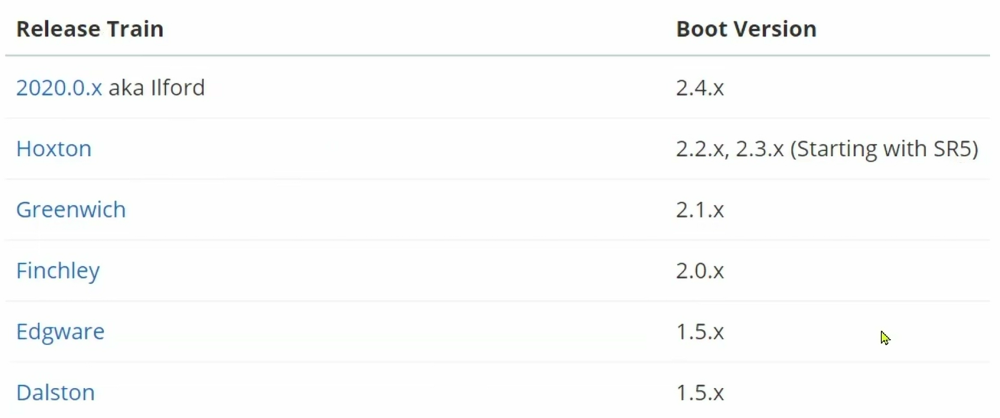

---

# 2. 微服务拆分及远程调用

## 2.1. 微服务拆分原则

**注意事项：**

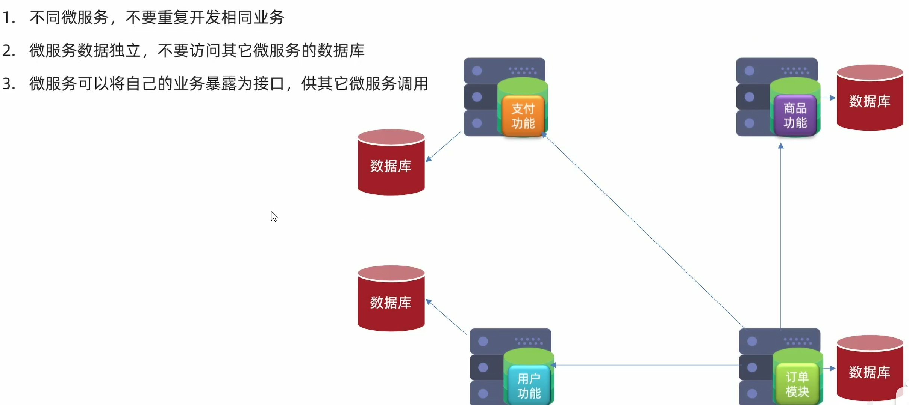

---

### 2.1.1. 什么时候拆分？

- **创业型项目**：建议先采用**单体架构**，以实现快速开发和快速试错。待项目规模扩大后，再逐步进行服务拆分。
- **确定的大型项目**：若项目资金充足、目标明确，可直接选择**微服务架构**，以避免后续因业务增长而进行架构拆分的复杂性和成本。

---

### 2.1.2. 怎么拆分？

1. **拆分目标**

- **高内聚**：每个微服务的职责要尽量单一，包含的业务相互关联度高、完整度高。
- **低耦合**：每个微服务的功能要相对独立，尽量减少对其他微服务的依赖。

2. **拆分方式**

- **纵向拆分**：按照业务模块来拆分。
- **横向拆分**：抽取公共服务，提高复用性。

---

**远程调用：**

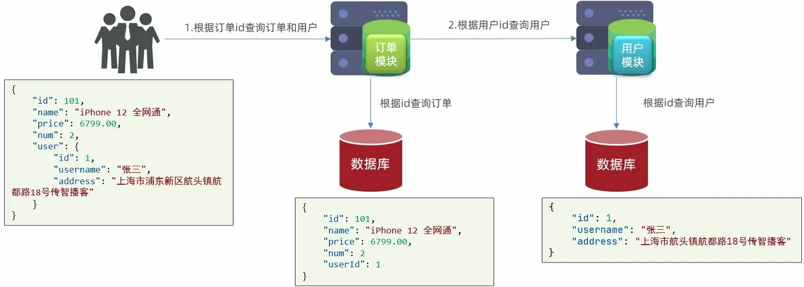

---

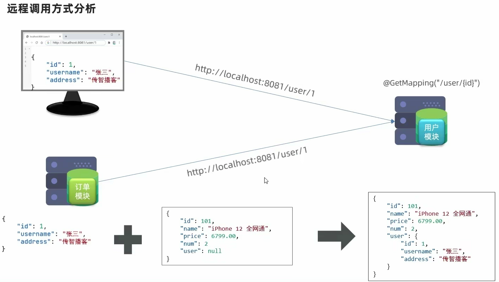

---

## 2.2. 服务远程调用

### 2.2.1. **注册RestTemplate**

在**order-service**的OrderApplication中注册**RestTemplate**

```
@MapperScan("cn.itcast.order.mapper")
@SpringBootApplication
public class OrderApplication {

    public static void main(String[] args) {
        SpringApplication.run(OrderApplication.class, args);
    }

    @Bean
    public RestTemplate restTemplate(){
        return new RestTemplate();
    }
}
```

在 `**OrderApplication**` 主类中，通过 `**@Bean**` 注解定义了一个 `**RestTemplate**` 实例。这使得 `RestTemplate` 成为 Spring 容器管理的一个 Bean，从而可以在其他组件（如 Service 层）中通过 `**@Autowired**` 注解直接注入和使用，实现了服务间的远程调用功能。

---

### 2.2.2. **远程调用RestTemplate**

```
public <T> ResponseEntity<T> exchange(
    String url,                 // 请求路径
    HttpMethod method,          // 请求方式
    @Nullable HttpEntity<?> requestEntity,  // 请求实体，可以为空
    Class<T> responseType,      // 返回值类型
    Map<String, ?> uriVariables // 请求参数
)
```

右侧的参数示例为：

- `**url**`: `"http://localhost:8081/items?id={id}"`
- `**method**`: `HttpMethod.GET`
- `**requestEntity**`: 未提供（可为空）
- `**responseType**`: `User.class`
- `**uriVariables**`: `Map.of("id", "1")`

这个方法通常用于 Spring 框架中的 `RestTemplate` 或 `WebClient`，用于执行一个 HTTP 请求并返回一个包含响应体和状态码的 `ResponseEntity` 对象。其中 `<T>` 是一个泛型，表示响应体的类型，由 `responseType` 参数指定。`uriVariables` 用于替换 URL 中的占位符 `{id}`。

修改order-service中的OrderService的queryOrderById方法：

```
@Service
public class OrderService {

    @Autowired
    private RestTemplate restTemplate;

    public Order queryOrderById(Long orderId) {
        // 1.查询订单
        Order order = orderMapper.findById(orderId);
        // TODO 2.查询用户
        String url = "http://localhost:8081/user/" + order.getUserId();
        User user = restTemplate.getForObject(url, User.class);
        // 3.封装user信息
        order.setUser(user);
        // 4.返回
        return order;
    }
}
```

在一个订单服务（`OrderService`）中，通过 `RestTemplate` 调用另一个运行在 `localhost:8081` 的用户服务，以获取与订单关联的用户信息，并将其封装到订单对象中返回。

---

# 3. 服务注册与发现

## 3.1. Nacos 注册中心

### 3.1.1. 前置准备

目前开源的注册中心框架有很多，国内比较常见的有：

- **Eureka**：Netflix公司出品，目前被集成在SpringCloud当中，一般用于Java应用
- **Nacos**：Alibaba公司出品，目前被集成在SpringCloudAlibaba中，一般用于Java应用
- Consul：HashiCorp公司出品，目前集成在SpringCloud中，不限制微服务语言

其中的`nacos/custom.env`文件中，有一个**MYSQL_SERVICE_HOST**也就是mysql地址，需要修改为你自己的虚拟机IP地址：

```
# Nacos 注册实例时优先使用主机名（hostname）而不是 IP 地址
PREFER_HOST_MODE=hostname

# 启动模式：standalone 表示单机模式，cluster 表示集群模式
# 单机模式通常用于开发或测试环境
MODE=standalone

# 指定 Spring 数据源平台为 MySQL
# 如果不配置此项，Nacos 默认使用内置的 Derby 数据库
SPRING_DATASOURCE_PLATFORM=mysql

# MySQL 数据库服务器的 IP 地址（请确保 Nacos 容器能访问此 IP）
MYSQL_SERVICE_HOST=192.168.179.140

# Nacos 使用的数据库名称
# 需要提前在 MySQL 中创建好该数据库，并导入 Nacos 的 SQL 脚本
MYSQL_SERVICE_DB_NAME=nacos

# MySQL 数据库端口，默认为 3306
MYSQL_SERVICE_PORT=3306

# 连接 MySQL 的用户名
MYSQL_SERVICE_USER=root

# 连接 MySQL 的密码
MYSQL_SERVICE_PASSWORD=123
```

在 SSH 终端进入root目录，然后执行下面的docker命令：

```
docker run -d \
--name nacos \
--env-file ./nacos/custom.env \
-p 8848:8848 \
-p 9848:9848 \
-p 9849:9849 \
--restart=always \
nacos/nacos-server:v2.1.0-slim
```

---

## 3.2. 服务注册

### 3.2.1. 引入版本管理依赖

首先需要在父工程（`cloud-demo`）的 `pom.xml` 中添加 Spring Cloud Alibaba 的依赖管理（BOM），以统一版本控制。

**Maven 配置代码：**

```
<dependency>
    <groupId>com.alibaba.cloud</groupId>
    <artifactId>spring-cloud-alibaba-dependencies</artifactId>
    <version>2.2.5.RELEASE</version>
    <type>pom</type>
    <scope>import</scope>
</dependency>
```

### 3.2.2. 移除旧依赖

在具体的业务服务模块（如 `order-service` 和 `user-service`）中，需要注释或删除原有的 **Eureka** 客户端依赖，避免冲突。

### 3.2.3. 引入 Nacos 客户端依赖

在业务服务模块中添加 Nacos 的服务发现依赖，使服务具备向 Nacos 注册的能力。

```
<!--nacos 服务注册发现-->
<dependency>
    <groupId>com.alibaba.cloud</groupId>
    <artifactId>spring-cloud-starter-alibaba-nacos-discovery</artifactId>
</dependency>
```

### 3.2.4. 配置Nacos

在`item-service`的`application.yml`中添加nacos地址配置：

```
spring:
  application:
    name: item-service # 服务名称
  cloud:
    nacos:
      server-addr: 192.168.150.101:8848 # nacos地址
```

**关键点说明：**

- **层级结构**：配置位于 `spring.cloud.nacos` 下。
- **属性名称**：使用 `server-addr` 指定 Nacos 服务器的 IP 和端口。
- **默认端口**：Nacos 的默认端口通常是 **8848**，如图中所示。

### 3.2.5. 配置服务实例

为了测试一个服务多个实例的情况，我们再配置一个`item-service`的部署实例：

```
-Dserver.port=8083
```

---

## 3.3. 服务发现

### 3.3.1. 引入依赖

服务发现除了要引入nacos依赖以外，由于还需要负载均衡，因此要引入SpringCloud提供的LoadBalancer依赖。

我们在`cart-service`中的`pom.xml`中添加下面的依赖：

```
<!--nacos 服务注册发现-->
<dependency>
  <groupId>com.alibaba.cloud</groupId>
  <artifactId>spring-cloud-starter-alibaba-nacos-discovery</artifactId>
</dependency>
```

这个依赖中同时包含了**服务注册**和**发现**的功能。因为任何一个微服务都可以调用别人，也可以被别人调用，即可以是**调用者**，也可以是**提供者**。

### 3.3.2. 配置Nacos地址

在`cart-service`的`application.yml`中添加nacos地址配置：

```
spring:
  cloud:
    nacos:
      server-addr: 192.168.150.101:8848
```

### 3.3.3. 发现并调用服务

接下来，服务调用者`cart-service`就可以去订阅`item-service`服务了。不过item-service有多个实例，而真正发起调用时只需要知道一个实例的地址。因此，服务调用者必须利用负载均衡的算法，从多个实例中挑选一个去访问

另外，服务发现需要用到一个工具，DiscoveryClient，SpringCloud已经帮我们自动装配，我们可以直接注入使用：

通过 `**DiscoveryClient**` 客户端，消费者可以拉取指定服务的实例列表，并从中选择一个实例进行调用。

```
private final DiscoveryClient discoveryClient;

private void handleCartItems(List<CartVO> vos) {
    // 1. 根据服务名称，拉取服务的实例列表
    List<ServiceInstance> instances = discoveryClient.getInstances("item-service");

    // 2. 负载均衡，挑选一个实例
    // (此处示例为随机选择，实际生产中通常使用 Ribbon 或 Spring Cloud LoadBalancer)
    ServiceInstance instance = instances.get(RandomUtil.randomInt(instances.size()));

    // 3. 获取实例的IP和端口
    URI uri = instance.getUri();

    // ... 略 (后续通常拼接URL并使用RestTemplate发起调用)
}
```

整个流程可以概括为：

1. **引入依赖**：添加 `spring-cloud-starter-alibaba-nacos-discovery`。
2. **配置连接**：在配置文件中指定 Nacos 服务器地址和自身服务名。
3. **服务发现**：在代码中注入 `DiscoveryClient`，调用 `getInstances("服务名")` 获取可用实例列表，再通过**负载均衡**策略选择一个实例，获取其地址进行远程调用。

---

## 3.4. Nacos 服务分级存储模型

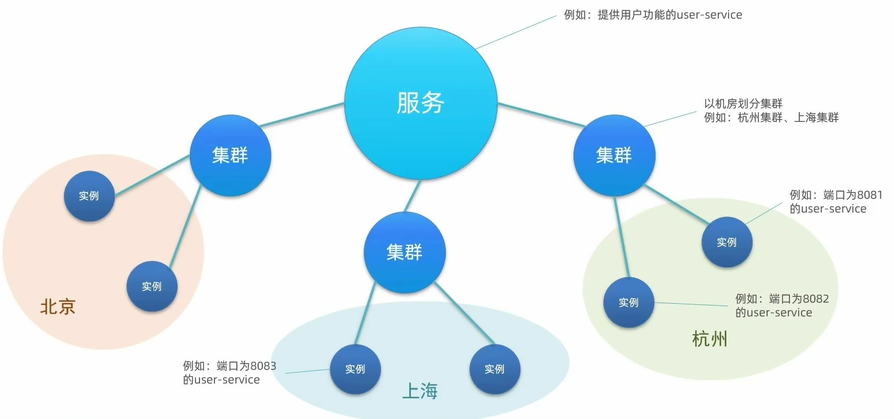

#### 3.4.1.1. 服务跨集群调用问题

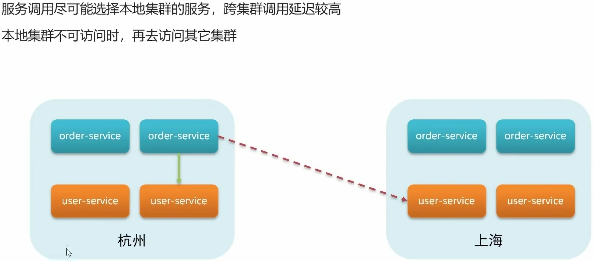

---

#### 3.4.1.2. 服务集群属性

1. 修改 `application.yml` 文件：

在 `spring.cloud.nacos` 下添加 `discovery` 配置块，并设置 `cluster-name`

```
spring:
  cloud:
    nacos:
      server-addr: localhost:8848 # nacos 服务端地址
      discovery:
        cluster-name: HZ # 配置集群名称，也就是机房位置，例如：HZ，杭州
```

**配置说明**

- `**server-addr**`：指定 Nacos 服务器的地址，默认端口为 **8848**。
- `**cluster-name**`：用于标识当前服务实例所属的集群。这通常用于区分不同的机房或区域（如杭州 HZ、上海 SH）。

---

2. 在 **Nacos 控制台**可以看到集群变化：

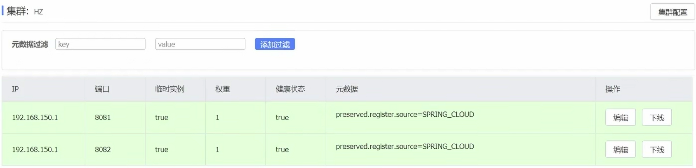

---

**核心概念**

1. **Nacos 服务分级存储模型**  
    Nacos 采用三级结构来组织服务实例，从大到小依次为：

- **一级是服务**：例如 `userservice`，代表一个具体的微服务应用。
- **二级是集群**：例如“杭州”或“上海”，代表服务部署的物理区域或逻辑分组（机房位置）。
- **三级是实例**：例如“杭州机房的某台部署了 `userservice` 的服务器”，代表具体的服务运行节点（IP:Port）。

2. **如何设置实例的集群属性**  
    要将服务实例注册到指定的集群，只需修改配置文件：

- 打开 `application.yml` 文件。
- 添加配置属性 `spring.cloud.nacos.discovery.cluster-name`。
- 设置该属性的值为你想要的集群名称（如 `HZ` 或 `SH`）。

通过这种分级模型，Nacos 能够支持同机房优先调用（就近访问）等高级负载均衡策略。

---

## 3.5. Nacos 负载均衡策略

### 3.5.1. 配置当前服务集群

首先修改 `order-service` 的 `application.yml` 文件，设置当前服务所属的集群为 **HZ**。

**YAML 配置示例：**

```
spring:
  cloud:
    nacos:
      server-addr: localhost:8848 # nacos 服务端地址
      discovery:
        cluster-name: HZ # 配置集群名称，也就是机房位置
```

### 3.5.2. 配置负载均衡规则

接着在 `order-service` 中设置 Ribbon 的负载均衡规则为 `NacosRule`。该规则会优先寻找与自己处于同一集群（同机房）的服务实例进行调用。

**YAML 配置示例：**

```
userservice:
  ribbon:
    NFLoadBalancerRuleClassName: com.alibaba.cloud.nacos.ribbon.NacosRule # 负载均衡规则
```

### 3.5.3. 权重设置提醒

最后需要注意，应将 `user-service` 的权重都设置为 **1**，以确保负载均衡策略能按预期工作。

---

### 3.5.4. 总结

**NacosRule 负载均衡策略**

该策略主要遵循以下三个步骤：

1. **优先同集群**  
    首先会优先选择与消费者处于**同一集群**的服务实例列表。这是为了减少跨机房调用带来的网络延迟。
2. **跨集群容错**  
    如果在本地集群中**找不到**可用的服务提供者，才会去其他集群寻找，并且系统会**报警告**日志。这保证了服务的高可用性。
3. **随机挑选实例**  
    确定了可用的实例列表（无论是同集群还是跨集群）后，再采用**随机负载均衡**的方式从中挑选具体的实例进行调用。

---

## 3.6. 服务实例的权重设置

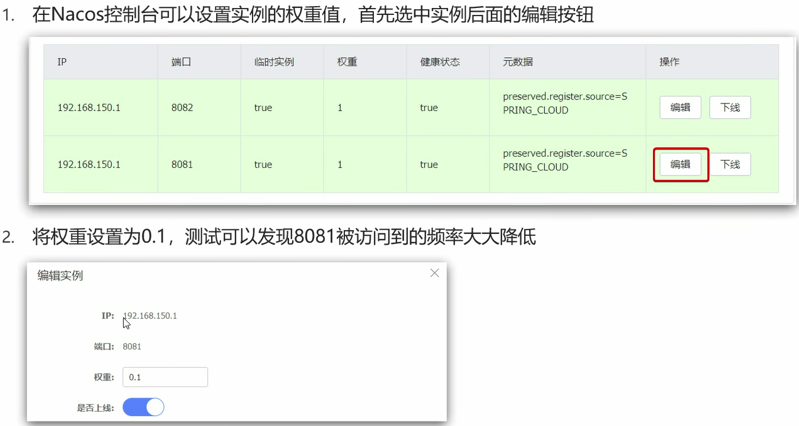

1. **权重设置范围**  
    可以在 Nacos 控制台设置实例的权重值，其取值范围在 **0 到 1** 之间。
2. **权重与访问频率的关系**  
    对于同一集群内的多个实例，**权重越高**，该实例被访问的**频率就越高**。这通常用于性能较强的机器承担更多流量。
3. **权重为 0 的特殊情况**  
    如果将实例的权重设置为 **0**，则该实例**完全不会被访问**。这常用于灰度发布或临时下线实例进行维护，而不需要真正停止服务。

---

# 4. OpenFegin

## 4.1. Fegin 替代 RestTemplate

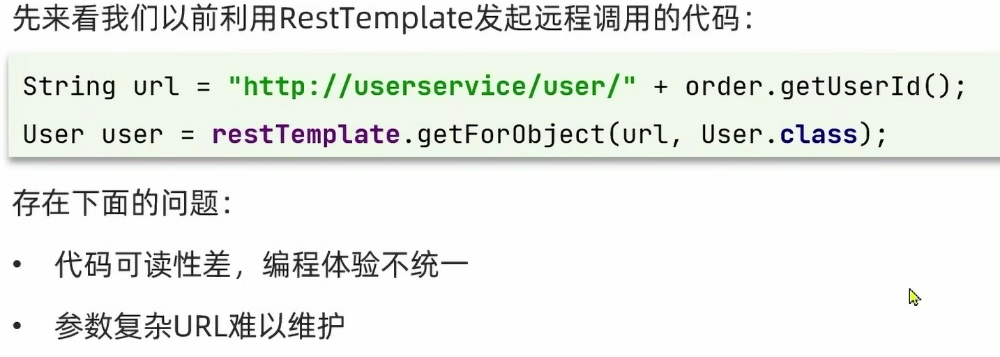

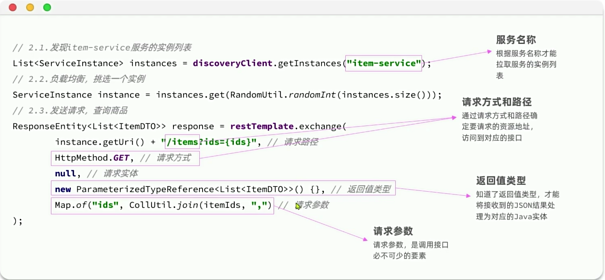

---

- **定义**：OpenFeign 是一个声明式的 HTTP 客户端。
- **官方地址**：[https://github.com/OpenFeign/feign](https://github.com/OpenFeign/feign)
- **核心作用**：帮助开发者优雅地实现 HTTP 请求的发送，从而解决传统 HTTP 调用中代码冗余、耦合度高等问题。

简单来说，Feign 让你像调用本地方法一样调用远程服务，无需手动构建 HTTP 请求、处理连接和解析响应，极大提升了微服务间通信的开发效率和代码可读性。

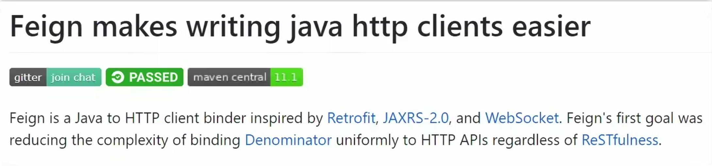

---

### 4.1.1. 1. 引入依赖

在项目的 `pom.xml` 文件中添加 OpenFeign 的 Starter 依赖：

```
<!--OpenFeign-->
<dependency>
    <groupId>org.springframework.cloud</groupId>
    <artifactId>spring-cloud-starter-openfeign</artifactId>
</dependency>
<!--负载均衡-->
<dependency>
    <groupId>org.springframework.cloud</groupId>
    <artifactId>spring-cloud-starter-loadbalancer</artifactId>
</dependency>
```

### 4.1.2. 2. 开启 Feign 功能

在 Spring Boot 启动类上添加 `@EnableFeignClients` 注解，以启用 Feign 客户端功能：

```
@EnableFeignClients  // 启用 OpenFeign 客户端
@MapperScan("cn.itcast.order.mapper")
@SpringBootApplication
public class OrderApplication {
    public static void main(String[] args) {
        SpringApplication.run(OrderApplication.class, args);
    }
}
```

### 4.1.3. 3. 编写 FeginClient

在 Java 代码定义了一个名为 `UserClient` 的接口，用于声明对 `userservice` 服务的远程调用：

```
/**
 * 这是一个FeignClient，用于调用商品服务，这个接口不需要实现类，
 * Feign会自动生成一个代理对象来实现这个接口，并且在调用方法时会发送HTTP请求到指定的服务。
 */

@FeignClient("item-service")
public interface ItemClient {

    @GetMapping("/items")
    List<ItemDTO> queryItemByIds(@RequestParam("ids") Collection<Long> ids);

}
```

- **服务名称**：`userservice` —— 由 `@FeignClient` 注解指定，表示要调用的目标服务。
- **请求方式**：`GET` —— 由 `@GetMapping` 注解指定。
- **请求路径**：`/items/{ids}` —— 由 `@GetMapping` 注解指定，其中 `{ids}` 是路径变量。
- **请求参数**：`Long id` —— 方法参数，通过 `@PathVariable("id")` 注解绑定到 URL 路径中的 `{id}`。
- **返回值类型**：`List<ItemDTO>` —— 方法声明的返回类型，表示远程调用成功后返回的对象。

---

## 4.2. Fegin 性能优化（连接池）

### 4.2.1. Feign 底层客户端实现

Feign 支持多种底层 HTTP 客户端，它们在连接管理上有所不同：

- **URLConnection**：这是 **Feign** 的 **默认实现**，但它 **不支持连接池**，每次请求都会新建连接，性能较低。
- **Apache HttpClient**：支持连接池，可以复用连接，提升性能。
- **OKHttp**：同样支持连接池，是另一个高性能的可选实现。

### 4.2.2. Feign 性能优化策略

基于上述实现，优化 Feign 性能主要有两个方向：

1. **使用连接池代替默认的 URLConnection**  
    将底层客户端从默认的 `URLConnection` 切换为支持连接池的 `Apache HttpClient` 或 `OKHttp`，可以显著减少建立和销毁连接的开销，提高吞吐量。
2. **调整日志级别**  
    Feign 的日志记录会带来一定的性能损耗。在生产环境中，建议将日志级别设置为 `BASIC` 或 `NONE`，避免使用 `FULL` 级别，以减少不必要的 I/O 操作和日志处理开销。

---

### 4.2.3. 连接池配置

1. **引入 HttpClient 依赖**

首先，需要在项目的 `pom.xml` 中添加 `feign-httpclient` 依赖，以启用对 Apache HttpClient 的支持：

```
<!--httpClient的依赖 -->
<dependency>
    <groupId>io.github.openfeign</groupId>
    <artifactId>feign-httpclient</artifactId>
</dependency>
```

首先，需要在项目的 pom.xml 文件中引入 feign-okhttp 依赖，以使用 OkHttp 作为 Feign 的底层 HTTP 客户端

```
<!--ok-http-->
<dependency>
  <groupId>io.github.openfeign</groupId>
  <artifactId>feign-okhttp</artifactId>
</dependency>
```

2. **配置连接池与日志**

接着，在 `application.yml` 配置文件中进行相关设置，开启 HttpClient 并调整连接池大小及日志级别：

```
feign:
  client:
    config:
      default: # default表示全局配置
        loggerLevel: BASIC # 日志级别设为BASIC，仅记录基本请求和响应信息
  httpclient:
    enabled: true # 开启feign对HttpClient的支持
    max-connections: 200 # 设置最大连接数
    max-connections-per-route: 50 # 设置每个路由的最大连接数
```

通过以上配置，Feign 将不再使用默认的 `URLConnection`，而是使用支持连接池的 `Apache HttpClient`，从而有效提升微服务间调用的性能和稳定性。

在 application.yml 或 application.properties 配置文件中，通过设置 feign.okhttp.enabled 为 true 来启用 OkHttp 的连接池支持。

```
feign:
  okhttp:
    enabled: true # 开启OkHttp连接池支持
```

---

## 4.3. Fegin 的最佳实践

### 4.3.1. 方式一：继承

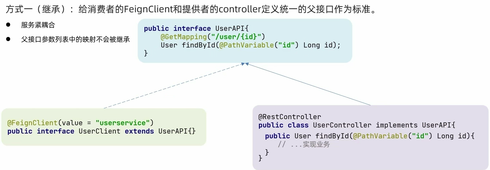

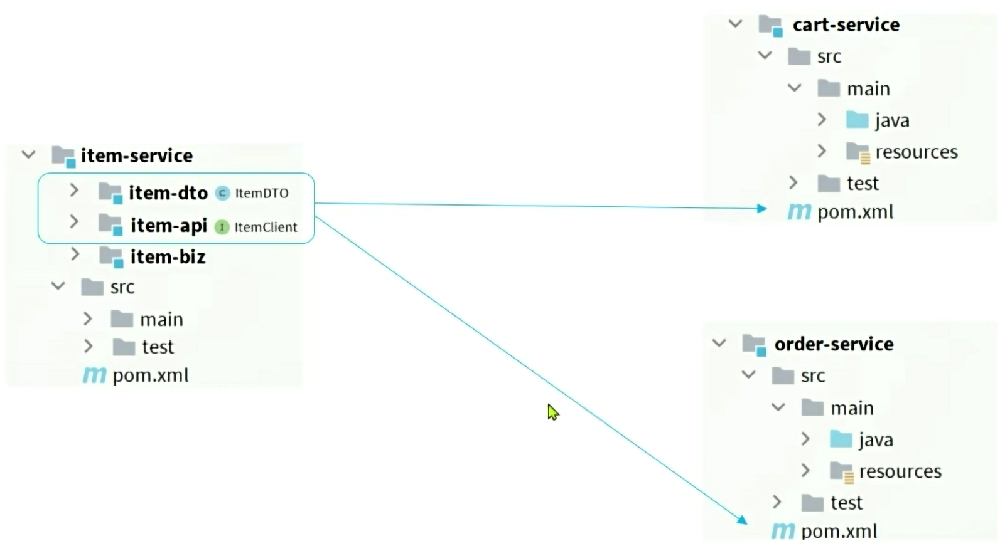

---

### 4.3.2. 方式二：抽取

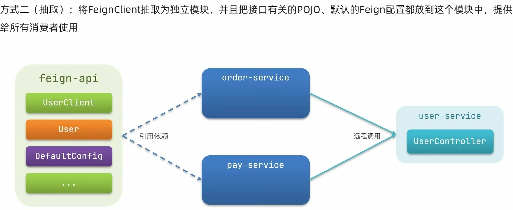、

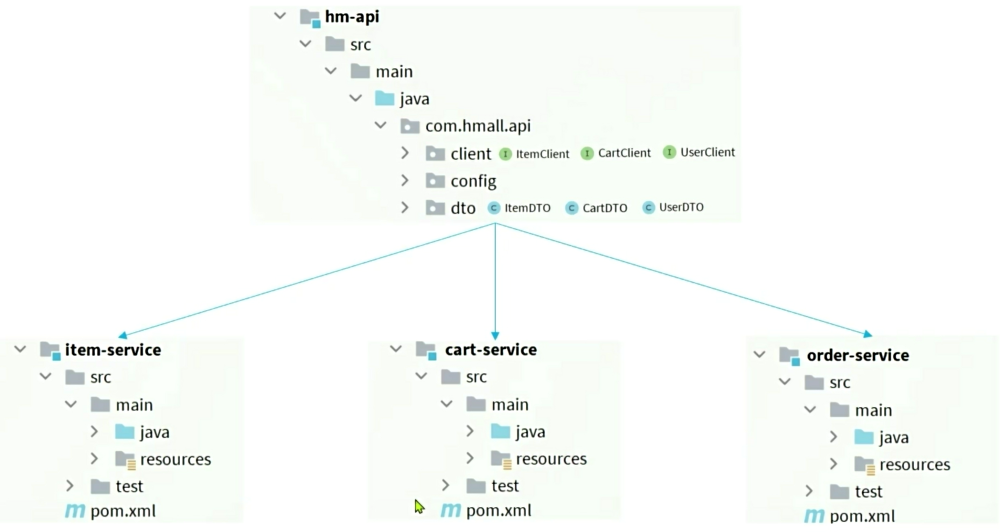

---

当 `FeignClient` 接口不在 Spring Boot 主启动类的默认扫描包范围内时，如何解决的两种方案。

默认情况下，`@SpringBootApplication` 注解只会扫描其所在包及其子包下的组件。如果 `FeignClient` 定义在其他包中，就需要手动指定扫描范围。

**方式一：指定 FeignClient 所在包**

通过在 `@EnableFeignClients` 注解中使用 `basePackages` 属性，指定需要扫描的基础包路径。这种方式适用于 FeignClient 比较集中的情况。

```
@EnableFeignClients(basePackages = "com.hmall.api.clients")
```

**方式二：指定 FeignClient 字节码**

通过在 `@EnableFeignClients` 注解中使用 `clients` 属性，直接指定具体的 FeignClient 接口的 Class 对象。这种方式更加精确，适用于 FeignClient 比较分散或者只想启用特定客户端的情况。

```
@EnableFeignClients(clients = {UserClient.class})
```

---

## 4.4. Fegin 自定义配置日志

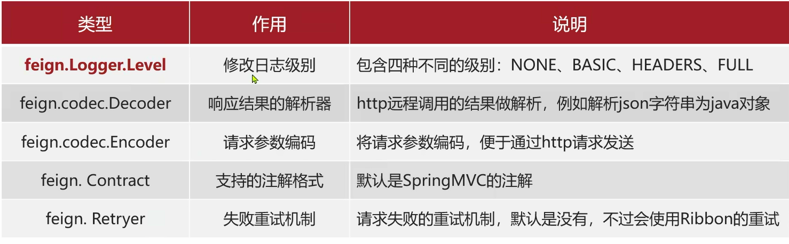

---

在 Spring Cloud 中配置 **Feign 日志**的两种主要方式：通过配置文件和通过 Java 代码。

### 4.4.1. 配置文件方式

这种方式通过修改 `application.yml` 或 `application.properties` 文件来配置日志级别，操作简单直接。

#### 4.4.1.1. 全局生效

使用 `default` 关键字作为配置键，可以对项目中所有的 Feign 客户端生效。

```
feign:
  client:
    config:
      default: # 使用 default 表示全局配置
        loggerLevel: FULL # 日志级别设为 FULL
```

#### 4.4.1.2. 局部生效

使用具体的服务名称（如 `userservice`）作为配置键，则配置只对指定的 Feign 客户端生效。

```
feign:
  client:
    config:
      userservice: # 使用服务名，仅对该服务生效
        loggerLevel: FULL # 日志级别设为 FULL
```

### 4.4.2. Java 代码方式

这种方式需要编写一个配置类，通过声明一个 `Logger.Level` 类型的 Bean 来实现。

#### 4.4.2.1. 1. 创建配置类

首先，创建一个**配置类**，并在其中定义一个返回 `Logger.Level` 的 Bean。

```
public class FeignClientConfiguration {
    @Bean
    public Logger.Level feignLogLevel(){
        return Logger.Level.BASIC; // 设置日志级别为 BASIC
    }
}
```

#### 4.4.2.2. 2. 应用配置

然后，根据需求选择全局或局部应用此配置类。

- **全局配置**：在启动类的 `@EnableFeignClients` 注解中，通过 `defaultConfiguration` 属性指定配置类。

```
@EnableFeignClients(defaultConfiguration = FeignClientConfiguration.class)
```

- **局部配置**：在具体的 `@FeignClient` 注解中，通过 `configuration` 属性指定配置类。

```
@FeignClient(value = "item-service", configuration = FeignClientConfiguration.class)
```

---

# 5. 网关路由

## 5.1. 网关介绍

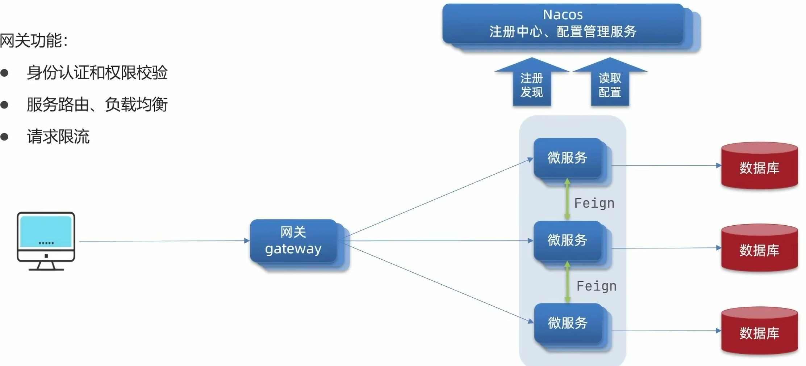

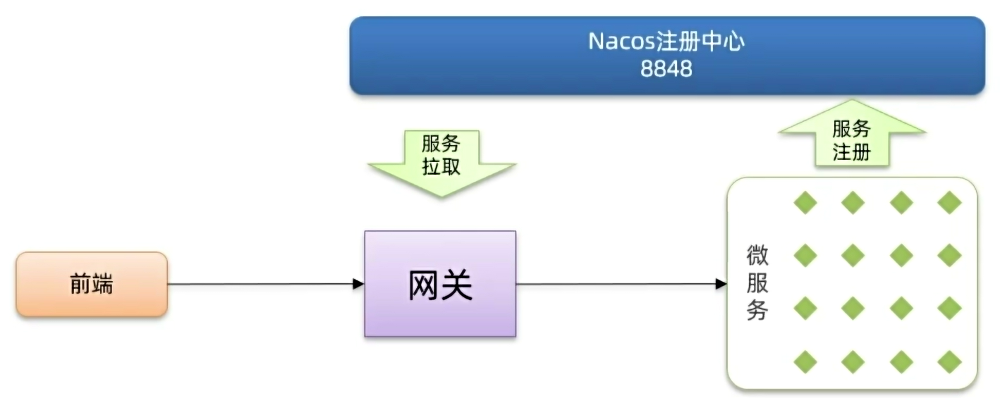

---

在 Spring Cloud 生态中，网关的实现主要有两种：

- **Spring Cloud Gateway**
- **Zuul**

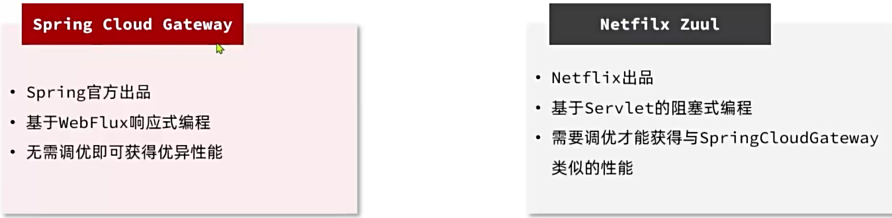

**核心区别**

|   |   |   |
|---|---|---|
|特性|Zuul|Spring Cloud Gateway|
|**技术基础**|基于 Servlet|基于 Spring 5 的 WebFlux|
|**编程模型**|阻塞式编程|响应式编程|
|**性能表现**|相对较低|具备更好的性能|

简单来说，**Zuul** 是早期的网关解决方案，采用传统的**阻塞 I/O** 模型；

而 **Spring Cloud Gateway** 是新一代网关，利用**响应式**编程模型，在高并发场景下能提供更优的性能和吞吐量。

---

## 5.2. 搭建网关

### 5.2.1. 创建新模块并引入依赖

需要创建一个新的 Maven 或 Gradle 模块，并在其配置文件中添加以下两个关键依赖：

1. **Spring Cloud Gateway 依赖**

这是网关服务的核心，负责路由、过滤等网关功能。

```
<dependency>
    <groupId>org.springframework.cloud</groupId>
    <artifactId>spring-cloud-starter-gateway</artifactId>
</dependency>
```

2. **Nacos 服务发现依赖**

此依赖使网关能够与 Nacos 注册中心通信，从而发现并路由到后端微服务。

```
<dependency>
    <groupId>com.alibaba.cloud</groupId>
    <artifactId>spring-cloud-starter-alibaba-nacos-discovery</artifactId>
</dependency>
```

关键点说明

- **Spring Cloud Gateway**：是 Spring 官方推出的响应式网关，性能优于旧版的 Zuul。
- **Nacos Discovery**：用于服务注册与发现，是微服务架构中不可或缺的一环。网关通过它动态获取服务实例列表，实现负载均衡。

这是 Spring Cloud Gateway 的配置示例，核心是定义路由规则和 Nacos 地址。

---

### 5.2.2. 配置路由

接下来，在`hm-gateway`模块的`resources`目录新建一个`application.yaml`文件，内容如下：

```
server:
  port: 8080
spring:
  application:
    name: gateway
  cloud:
    nacos:
      server-addr: 192.168.150.101:8848
    gateway:
      routes:
        - id: item # 路由规则id，自定义，唯一
          uri: lb://item-service # 路由的目标服务，lb代表负载均衡，会从注册中心拉取服务列表
          predicates: # 路由断言，判断当前请求是否符合当前规则，符合则路由到目标服务
            - Path=/items/**,/search/** # 这里是以请求路径作为判断规则
        - id: cart
          uri: lb://cart-service
          predicates:
            - Path=/carts/**
        - id: user
          uri: lb://user-service
          predicates:
            - Path=/users/**,/addresses/**
        - id: trade
          uri: lb://trade-service
          predicates:
            - Path=/orders/**
        - id: pay
          uri: lb://pay-service
          predicates:
            - Path=/pay-orders/**
```

**关键概念说明**

- `**uri: lb://userservice**`：`lb` 是 `LoadBalancer` 的缩写，表示网关会通过负载均衡策略，从 Nacos 中获取 `userservice` 服务的实例列表，并自动选择一个实例进行转发。
- `**predicates**`：是路由的匹配条件，只有满足条件的请求才会被转发到对应的 `uri`。这里 `Path=/user/**` 表示匹配所有以 `/user/` 开头的路径。

---

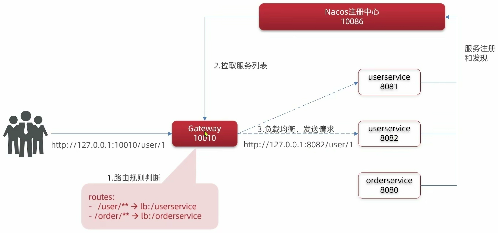：

**网关路由转发流程：**

1. **用户访问**  
    客户端发起请求，访问网关地址：`http://localhost:8080/items/123`。
2. **网关接收**  
    网关服务启动在 `8080` 端口，成功监听到并接收该请求。
3. **匹配规则**  
    网关内部进行路径匹配，发现请求路径 `/items/123` 符合配置文件中定义的断言规则 `Path=/items/**`。
4. **查询服务**  
    根据匹配到的路由规则，网关去 **Nacos 注册中心** 查找名为 `item-service` 的服务实例列表及其实际地址。
5. **转发请求**  
    网关通过**负载均衡**策略选择一个实例（例如实际地址为 `http://192.168.1.100:8081`），并将请求转发过去。
6. **返回结果**  
    `item-service` 处理完业务逻辑后，将响应结果返回给网关，网关最终将结果响应回给用户。

---

## 5.3. 路由断言工厂 GatewayPredicateFactory

1. **路由 ID (**`**id**`**)**

- **作用**：这是路由的**唯一标识**。
- **说明**：在配置文件中，每一个路由规则都必须有一个独一无二的 ID，用于区分不同的路由策略。

2. **路由目的地 (**`**uri**`**)**

- **作用**：定义请求最终要被转发到哪里去。
- **协议支持**：

- `lb://`：基于负载均衡（LoadBalancer）的转发，通常配合注册中心（如 Nacos）使用，后面跟服务名。
- `http://`：直接转发到具体的外部 URL 地址。

3. **路由断言 (**`**predicates**`**)**

- **作用**：这是路由的**匹配条件**。
- **逻辑**：网关会判断进来的请求是否符合这里设定的规则（比如路径是否为 `/user/**`，请求头是否包含特定信息等）。只有**符合要求**的请求，才会被转发到上述的 `uri`。

4. **路由过滤器 (**`**filters**`**)**

- **作用**：用于在请求被转发**之前**或**之后**对请求或响应进行**修改/加工**。
- **场景**：比如添加请求头、移除请求参数、修改响应内容等。

---

|   |   |   |
|---|---|---|
|配置项|核心含义|通俗理解|
|**id**|唯一标识|给规则起个名字|
|**uri**|目标地址|决定请求“去哪”|
|**predicates**|匹配规则|决定“谁”能去|
|**filters**|拦截处理|路上顺便“做点什么”|

---

### 5.3.1. 核心机制：Predicate Factory

1. **配置即字符串**  
    我们在 YAML 配置文件中写的断言规则（如 `Path=/user/**`），本质上只是一串普通的字符串。
2. **工厂模式解析**  
    这些字符串会被专门的 **Predicate Factory** 读取并处理，最终转化为 Java 代码中的路由判断逻辑。
3. **具体实例**  
    以路径匹配为例，`Path=/user/**` 这条规则，实际上是由 `org.springframework.cloud.gateway.handler.predicate.PathRoutePredicateFactory` 这个类来负责解析和执行的。

### 5.3.2. 扩展知识

Spring Cloud Gateway 内置了十几种这样的断言工厂，除了路径匹配，还支持根据**时间、请求头、请求参数、Cookie** 等多种条件进行路由判断。

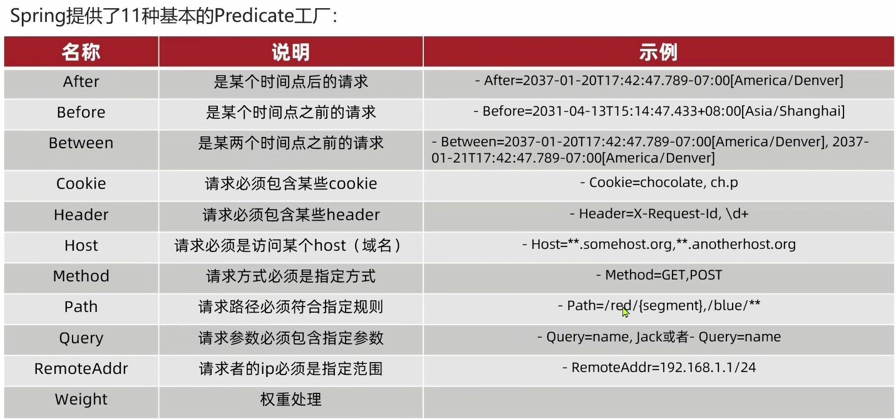

---

## 5.4. 跨域问题

**跨域**：域名不一致就是跨域，主要包括：

- 域名不同：[www.taobao.com](http://www.taobao.com/) 和 [www.taobao.org](http://www.taobao.org/) 和 [www.jd.com](http://www.jd.com/) 和 miaosha.jd.com
- 域名相同，端口不同：localhost:8080和localhost8081

**跨域问题**：浏览器禁止请求的发起者与服务端发生跨域**ajax**请求，请求被浏览器拦截的问题  
**解决方案**：CORS

在 **Spring Cloud Gateway** 网关中配置 **CORS（跨域资源共享）** 的 `application.yml` 配置片段，用于解决前端跨域请求问题。

```
spring:
  cloud:
    gateway:
      # ...
      globalcors: # 全局的跨域处理
        add-to-simple-url-handler-mapping: true # 解决options请求被拦截问题
        corsConfigurations:
          '[/**]':
            allowedOrigins: # 允许哪些网站的跨域请求
              - "http://localhost:8090"
              - "http://www.leyou.com"
            allowedMethods: # 允许的跨域ajax的请求方式
              - "GET"
              - "POST"
              - "DELETE"
              - "PUT"
              - "OPTIONS"
            allowedHeaders: "*" # 允许在请求中携带的头信息
            allowCredentials: true # 是否允许携带cookie
            maxAge: 360000 # 这次跨域检测的有效期
```

---

# 6. 网关登录校验

## 6.1. 鉴权思路分析

我们的登录是基于JWT来实现的，校验JWT的算法复杂，而且需要用到秘钥。如果每个微服务都去做登录校验，这就存在着两大问题：

- 每个微服务都需要知道JWT的秘钥，不安全
- 每个微服务重复编写登录校验代码、权限校验代码，麻烦

既然网关是所有微服务的入口，一切请求都需要先经过网关。我们完全可以把登录校验的工作放到网关去做，这样之前说的问题就解决了：

- 只需要在网关和用户服务保存秘钥
- 只需要在网关开发登录校验功能

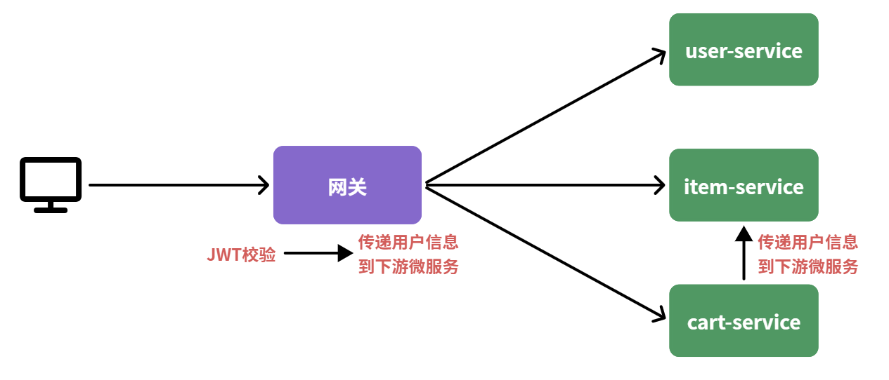

不过，这里存在几个问题：

- 网关路由是配置的，请求转发是Gateway内部代码，我们如何在转发之前做登录校验？
- 网关校验JWT之后，如何将用户信息传递给微服务？
- 微服务之间也会相互调用，这种调用不经过网关，又该如何传递用户信息？

---

## 6.2. 网关过滤器

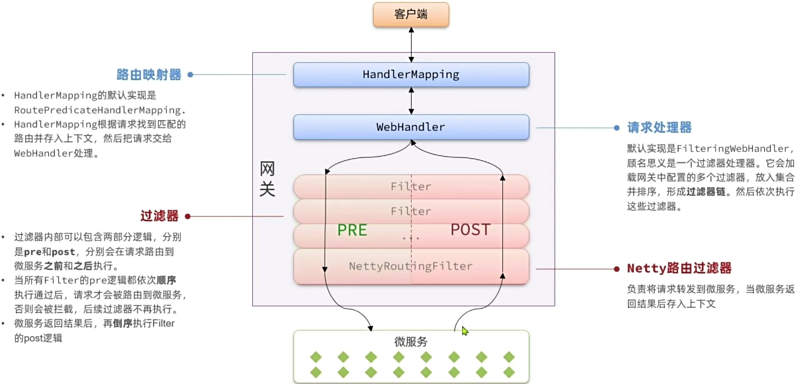

1. 客户端请求进入网关后由`HandlerMapping`对请求做判断，找到与当前请求匹配的路由规则（`**Route**`），然后将请求交给`WebHandler`去处理。
2. `WebHandler`则会加载当前路由下需要执行的过滤器链（`**Filter chain**`），然后按照顺序逐一执行过滤器（后面称为`**Filter**`）。
3. 图中`Filter`被虚线分为左右两部分，是因为`Filter`内部的逻辑分为`pre`和`post`两部分，分别会在请求路由到微服务**之前**和**之后**被执行。
4. 只有所有`Filter`的`pre`逻辑都依次顺序执行通过后，请求才会被路由到微服务。
5. 微服务返回结果后，再倒序执行`Filter`的`post`逻辑。
6. 最终把响应结果返回。

最终请求转发是有一个名为`**NettyRoutingFilter**`的过滤器来执行的，而且这个过滤器是整个过滤器链中顺序最靠后的一个。**如果我们能够定义一个过滤器，在其中实现登录校验逻辑，并且将过滤器执行顺序定义到**`**NettyRoutingFilter**`**之前**，这就符合我们的需求了！

---

## 6.3. 实现登录校验

```
@CommonsLog
@RequiredArgsConstructor
public class AuthGlobalFilter implements GlobalFilter, Ordered {

    private final AuthProperties authProperties;

    private final JwtTool jwtTool;

    private AntPathMatcher antPathMatcher = new AntPathMatcher();

    @Override
    public Mono<Void> filter(ServerWebExchange exchange, GatewayFilterChain chain) {
        // 1. 获取请求参数
        ServerHttpRequest request = exchange.getRequest();

        //2.判断是否需要做登录拦截
        if (isExclude(request.getPath().toString())){

            //不需要做登录拦截
            return chain.filter(exchange);
        }

        //3.获取token
        String token = null;
        List<String> headers = request.getHeaders().get("Authorization");
        if (headers != null && !headers.isEmpty()) {
            token = headers.get(0);
        }
        //4.校验并解析 token
        Long userId = null;
        try {
            userId = jwtTool.parseToken(token);
        }catch (UnauthorizedException e) {
            //拦截，设置状态码为401
            ServerHttpResponse response = exchange.getResponse();
            response.setStatusCode(HttpStatus.UNAUTHORIZED);
            return response.setComplete();
        }
        //传递用户信息
        System.out.println("userId" + userId);

        return chain.filter(exchange);

    }

    private boolean isExclude(String path) {
        for (String pathPattern : authProperties.getExcludePaths()){
            if (antPathMatcher.match(pathPattern, path)) {
                return true;
            }
        }
        return false;
    }

    @Override
    public int getOrder() {
        return 0;
    }
}
```

---

## 6.4. 网关传递用户

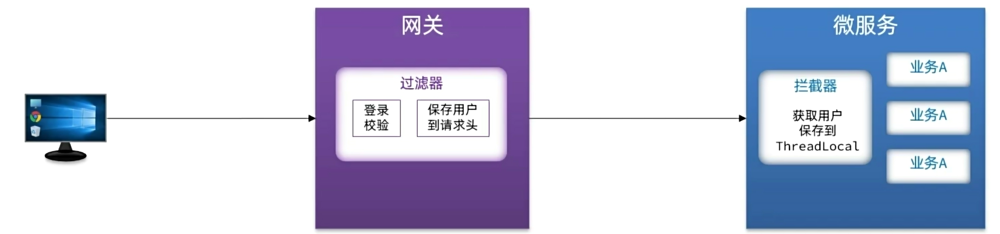

---

**需求描述**

修改网关模块中的登录校验拦截器，在校验成功后，将用户信息保存到转发给下游微服务的请求头中。

要修改转发到微服务的请求，需要用到 `**ServerWebExchange**` 类提供的 API。

```
exchange.mutate() // mutate就是对下游请求做更改
    .request(builder -> builder.header("user-info", userInfo))
    .build();
```

通过 `**mutate()**` 方法构建一个新的 `ServerWebExchange` 对象，并在请求构建器中添加名为 `user-info` 的请求头，从而实现信息的传递。

---

### 6.4.1. OpenFefin 传递用户

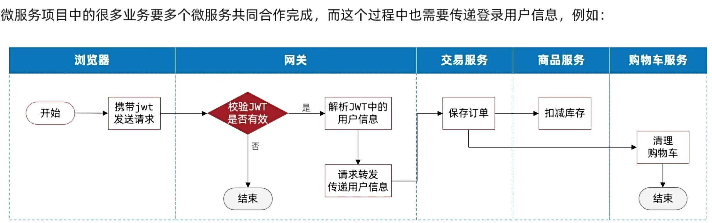

---

OpenFeign 框架中用于统一处理请求的核心组件——**请求拦截器（RequestInterceptor）**。

OpenFeign 提供了一个名为 `RequestInterceptor` 的接口。它的主要作用是在 Feign 客户端发起实际的网络请求之前，对请求进行预处理。

```
public interface RequestInterceptor {

    /**
     * Called for every request. Add data using methods on the supplied {@link RequestTemplate}.
     */
    void apply(RequestTemplate template);
}
```

1. **统一拦截**：所有通过 OpenFeign 发起的请求，在构建阶段都会先调用实现了 `RequestInterceptor` 接口的拦截器。
2. **修改请求**：开发者可以通过实现 `apply` 方法，利用传入的 `RequestTemplate` 对象来修改请求模板。
3. **常见场景**：

- **添加请求头**：例如在微服务调用中传递 Token、用户信息或链路追踪 ID。
- **添加请求参数**：统一添加某些公共的查询参数。
- **日志记录**：记录请求的基本信息。

通过这种机制，可以避免在每个 Feign 客户端的方法上重复编写相同的请求构建代码，实现逻辑的解耦和复用。

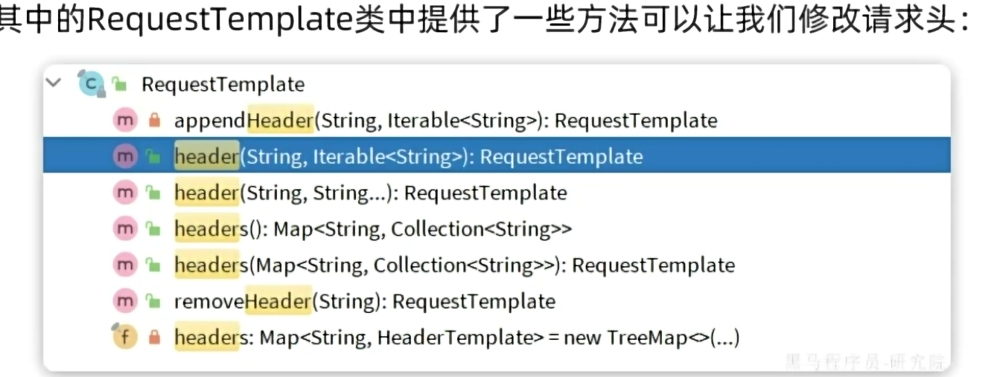

```
public class DefaultFeignConfig {

    @Bean
    public Logger.Level feignLogLevel(){
        return Logger.Level.BASIC; // 设置日志级别为 BASIC
    }

    @Bean
    public RequestInterceptor requestInterceptor(){
        return new RequestInterceptor() {
            @Override
            public void apply(feign.RequestTemplate template) {
                // Add custom headers or modify the request template
                Long userId = UserContext.getUser();
                if (userId != null) {
                    template.header("user-info", userId.toString());
                }
            }
        };
    }
}
```

---

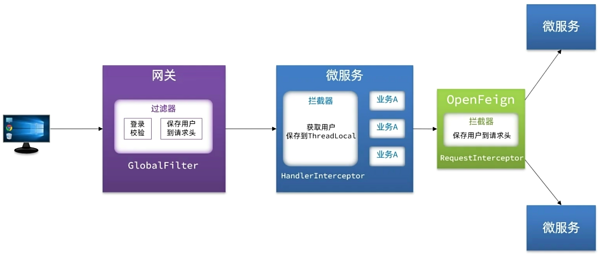

---

### 6.4.2. 路由过滤器 GatewayFilter

简单来说，路由过滤器就是网关的“拦截器”和“加工站”。它主要在请求转发前后，提供以下核心能力：

- **修改请求/响应**：增删改请求头、参数或路径。
- **权限校验**：统一检查 Token 或身份，非法请求直接拦截，不发给下游。
- **日志监控**：记录请求耗时、路径等信息，用于统计分析。
- **流量控制**：实现限流、熔断，防止系统被突发流量冲垮。

一句话总结：**过滤器让网关具备了在请求流转过程中“动手脚”和“把关”的能力。**

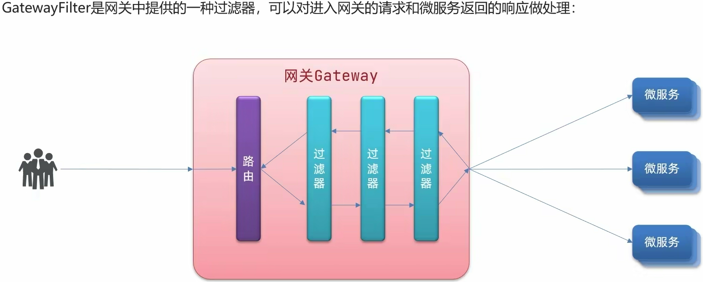

---

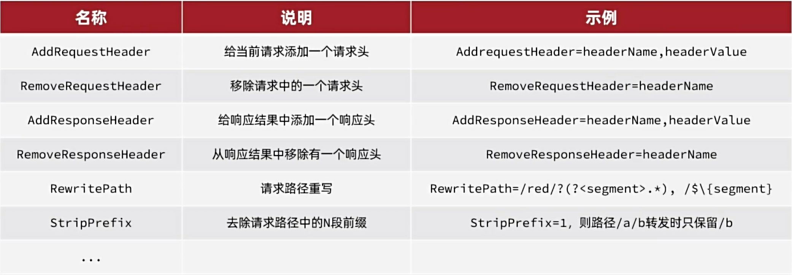

---

```
spring:
  cloud:
    gateway:
      routes:
        - id: user-service # 路由ID，唯一标识
          uri: lb://userservice # 目标服务URI，lb代表从注册中心负载均衡获取
          predicates: # 断言：匹配规则
            - Path=/user/** # 当请求路径以 /user/ 开头时匹配
          filters: # 过滤器：对请求进行处理
            # 1. 添加请求头
            - AddRequestHeader=Truth, Itcast is freaking awesome!
            
            # 2. 常用：去除路径前缀 (例如 /user/api/1 -> /api/1)
            - StripPrefix=1
            
            # 3. 常用：添加请求参数
            - AddRequestParameter=source, gateway
```

```
spring:
  application:
    name: gateway # 服务名称
  cloud:
    nacos:
      server-addr: localhost:8848 # nacos地址
    gateway:
      routes: # 网关路由配置
        id: user-service
          uri: lb://userservice
          predicates:
            Path=/user/**
        id: order-service
          uri: lb://orderservice
          predicates:
            Path=/order/**
      default-filters: # 默认过滤器，会对所有的路由请求都生效
        AddRequestHeader=Truth, Itcast is freaking awesome! # 添加请求头
```

---

### 6.4.3. 全局过滤器 GlobalFilter

#### 6.4.3.1. 全局过滤器的核心概念

全局过滤器的作用是处理一切进入网关的请求和微服务响应，其作用范围是全局的。它与 GatewayFilter 的主要区别在于：

- **GatewayFilter**：通过配置文件定义，处理逻辑是固定的（例如添加请求头、重写路径等）。
- **GlobalFilter**：逻辑需要开发者**自己编写代码实现**，通常用于实现更复杂的业务需求，如权限校验、日志记录或流量监控。

#### 6.4.3.2. GlobalFilter 接口定义

定义全局过滤器的方式是实现 `**GlobalFilter**` 接口。图片中展示了该接口的核心方法定义及参数说明：

```
public interface GlobalFilter {
    /**
     * 处理当前请求，有必要的话通过{@link GatewayFilterChain}将请求交给下一个过滤器处理
     *
     * @param exchange 请求上下文，里面可以获取Request、Response等信息
     * @param chain 用来把请求委托给下一个过滤器
     * @return {@code Mono<Void>} 返回标示当前过滤器业务结束
     */
    Mono<Void> filter(ServerWebExchange exchange, GatewayFilterChain chain);
}
```

**关键参数说明：**

- **exchange (ServerWebExchange)**：这是请求的上下文对象，通过它可以获取到请求（Request）和响应（Response）的所有信息。
- **chain (GatewayFilterChain)**：过滤器链，用于将请求传递给下一个过滤器。如果不调用 **chain.filter()**，请求将被拦截。
- **返回值 (Mono)**：基于 **Reactor** 模型的响应式编程返回值，表示过滤器的处理逻辑是一个异步操作。

```
@Component
//@Order(-1)
public class AuthorizeFilter implements GlobalFilter, Ordered {
    @Override
    public Mono<Void> filter(ServerWebExchange exchange, GatewayFilterChain chain) {
        // 1. 获取请求参数
        ServerHttpRequest request = exchange.getRequest();
        MultiValueMap<String, String> params = request.getQueryParams();
        // 2. 获取参数中的 authorization 参数
        String auth = params.getFirst("authorization");
        // 3. 判断参数值是否等于 admin
        if ("admin".equals(auth)) {
            // 4. 是，放行
            return chain.filter(exchange);
        }
        // 5. 否，拦截
        // 5.1. 设置状态码
        exchange.getResponse().setStatusCode(HttpStatus.UNAUTHORIZED);
        // 5.2. 拦截请求
        return exchange.getResponse().setComplete();
    }

    @Override
    public int getOrder() {
        return 0;
    }
}
```

---

### 6.4.4. 过滤器执行顺序

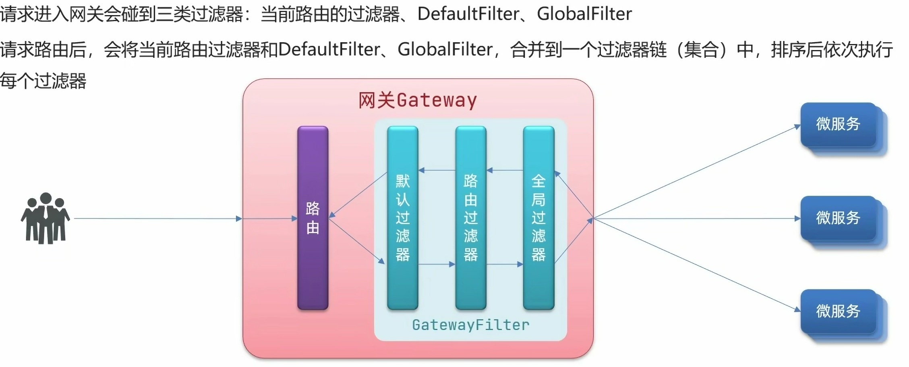

---

- 每一个过滤器都必须指定一个int类型的order值，**order值越小，优先级越高，执行顺序越靠前**。
- GlobalFilter通过实现Ordered接口，或者添加@Order注解来指定order值，由我们自己指定
- 路由过滤器和defaultFilter的order由Spring指定，默认是按照声明顺序从1递增。
- 当过滤器的order值一样时，会按照 **defaultFilter > 路由过滤器 > GlobalFilter** 的顺序执行。

---

# 7. Nacos 配置管理

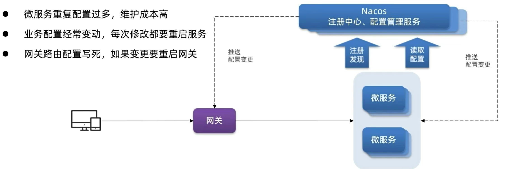

### 7.1.1. 统一配置管理

此处为语雀图册卡片，点击链接查看：[https://www.yuque.com/fangzhou-ze0bw/ckexpk/tsl1tehuvqa9gnw7#cgBrh](https://www.yuque.com/fangzhou-ze0bw/ckexpk/tsl1tehuvqa9gnw7#cgBrh)

配置内容中不需要把所有 **yaml** 格式中的内容全部粘贴过来，只把有热更新需求的内容拿过来

此处为语雀图册卡片，点击链接查看：[https://www.yuque.com/fangzhou-ze0bw/ckexpk/tsl1tehuvqa9gnw7#N8pjc](https://www.yuque.com/fangzhou-ze0bw/ckexpk/tsl1tehuvqa9gnw7#N8pjc)

---

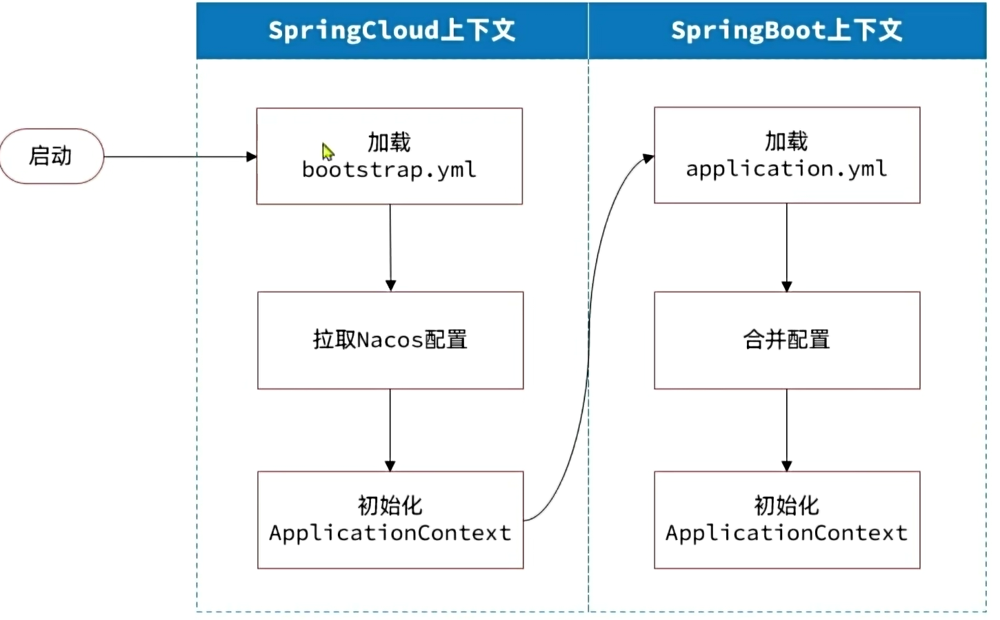

---

#### 7.1.1.1. 步骤 1：引入依赖

```
<!--nacos配置管理依赖-->
<dependency>
    <groupId>com.alibaba.cloud</groupId>
    <artifactId>spring-cloud-starter-alibaba-nacos-config</artifactId>
</dependency>

<!--读取bootstrap文件 -->
<dependency>
    <groupId>org.springframework.cloud</groupId>
    <artifactId>spring-cloud-starter-bootstrap</artifactId>
</dependency>
```

- **Nacos Config**：使应用能够连接到 Nacos 服务器，动态获取和刷新配置，避免硬编码和重启服务。
- **Bootstrap**：在 Spring Boot 应用启动的早期阶段加载配置，确保在应用上下文初始化前就能读取到远程配置中心的配置信息。

---

#### 7.1.1.2. 步骤 2：配置 `bootstrap.yml`

其次，在 `userservice` 服务的 `resources` 目录下创建 `**bootstrap.yml**` 文件。

**为什么使用** `**bootstrap.yml**`**？**  
这是一个**引导配置文件**，它的加载优先级 **高于**`application.yml`。在应用启动初期，系统会优先加载这个文件中的配置，从而确保能从 Nacos 配置中心拉取到最新的配置信息。

**配置内容如下：**

```
spring:
  application:
    name: cart-service # 服务名称
  profiles:
    active: dev
  cloud:
    nacos:
      server-addr: 192.168.179.140 # nacos地址
      config:
        file-extension: yaml # 文件后缀名
        shared-configs: # 共享配置
          - dataId: shared-jdbc.yaml # 共享mybatis配置
          - dataId: shared-log.yaml # 共享日志配置
          - dataId: shared-swagger.yaml # 共享日志配置
```

---

### 7.1.2. 配置热更新

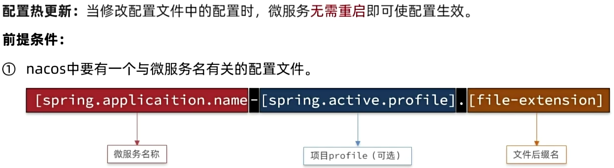

**方式一**：通过在类上添加 `**@RefreshScope**` 注解来实现。

```
@Slf4j
@RestController
@RequestMapping("/user")
@RefreshScope  // 关键注解：开启刷新作用域
public class UserController {

    // 注入配置项
    @Value("${pattern.dateformat}")
    private String dateformat;

    // ...
}
```

如果在使用 `@Value` 注解读取 Nacos 配置时发现修改配置后值没有更新，通常就是因为缺少了 `@RefreshScope` 注解。添加该注解后，应用就能实时感知并应用最新的配置了。

---

**方式二**，即通过 `**@ConfigurationProperties**` 注解来实现配置的热更新

这种方式通常比 `@Value` 更适合管理成组的配置。

在 Java 代码定一个专门用于封装配置属性的类 `PatternProperties`：

```
@Data
@Component
@ConfigurationProperties(prefix = "hm.cart")
public class CartProperties {

    private Integer maxItems;
}
```

---

### 7.1.3. 多环境配置共享

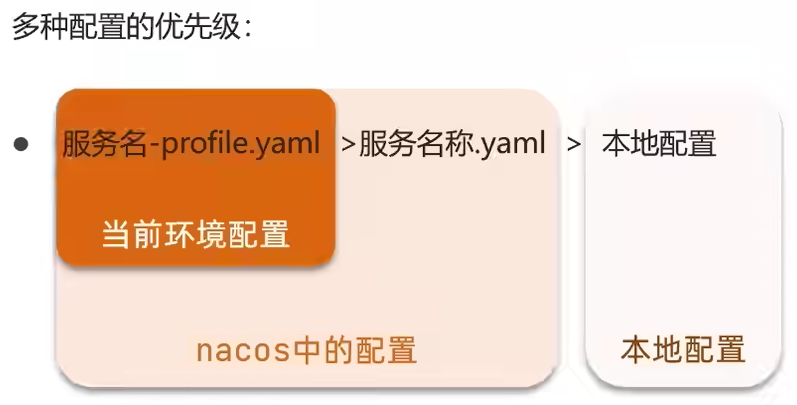

---

#### 7.1.3.1. 📁 Nacos 配置文件类型

微服务会从 Nacos 读取两类配置文件：

1. **环境配置**

- 命名格式：`[服务名]-[spring.profile.active].yaml`
- 说明：用于存放特定环境的配置。

2. **默认配置**

- 命名格式：`[服务名].yaml`
- 说明：作为默认配置，可供多个环境共享。

#### 7.1.3.2. 📈 配置优先级

当多种配置同时存在时，加载的优先级顺序如下（从高到低）：

1. `[服务名]-[环境].yaml`
2. `[服务名].yaml`
3. 本地配置

这意味着，高优先级的配置会覆盖低优先级中相同的配置项。

---

### 7.1.4. 动态路由

Nacos 官网教程：[https://nacos.io/zh-cn/docs/sdk.html](https://nacos.io/zh-cn/docs/sdk.html)

动态路由的核心作用是：不重启网关，就能实时更新路由规则。

#### 7.1.4.1. 监听 Nacos 配置

```
@Component
@Slf4j
@RequiredArgsConstructor
public class DynamicRouteLoader {

    private final NacosConfigManager nacosConfigManager;

    private final String dataId = "gateway-routes.json";

    private final String group = "DEFAULT_GROUP";

    /**
     * 监听配置
     */
    @PostConstruct
    public void initRouteConfigListener() throws NacosException {
        // 1.项目启动时，先拉取一次配置，并且添加配置监听器
        String configInfo = nacosConfigManager.getConfigService()
                .getConfigAndSignListener(dataId, group, 5000, new Listener() {
                    @Override
                    public Executor getExecutor() {
                        return null;
                    }

                    // 1 usage
                    @Override
                    public void receiveConfigInfo(String configInfo) {
                        // 2.监听到配置变更，需要去更新路由表
                        updateConfigInfo(configInfo);
                    }
                });
        // 3.第一次读取到配置，也需要更新到路由表
        updateConfigInfo(configInfo);
    }

    // 2 usages
    public void updateConfigInfo(String configInfo){
        // TODO
    }
}
```

---

#### 7.1.4.2. 更新路由表

利用 **RouteDefinitionWriter** ，用于在监听路由信息后更新路由表

```
/**
 * @author Spencer Gibb
 */
public interface RouteDefinitionWriter {
    /**
     * 更新路由到路由表，如果路由id重复，则会覆盖旧的路由
     */
    Mono<Void> save(Mono<RouteDefinition> route);

    /**
     * 根据路由id删除某个路由
     */
    Mono<Void> delete(Mono<String> routeId);
}
```

- `**save**` **方法**：用于将路由定义保存到路由表中。如果路由 ID 已存在，则会覆盖原有的路由配置。
- `**delete**` **方法**：用于根据路由 ID 删除指定的路由。

该接口是 Spring Cloud Gateway 中用于动态管理路由的核心组件，支持响应式编程模型（基于 `Mono`）

为了方便从Nacos读取路由配置，推荐使用的JSON格式路由配置模板，以及对应的Spring Cloud Gateway YAML配置示例

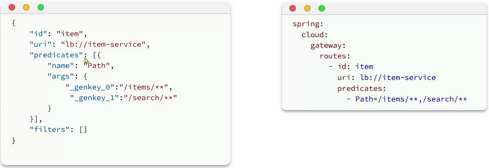

```
@Component
@Slf4j
@RequiredArgsConstructor
public class DynamicRouteLoader {

    private final NacosConfigManager nacosConfigManager;

    private final String dataId = "gateway-routes.json";

    private final String group = "DEFAULT_GROUP";

    private final RouteDefinitionWriter writer;

    private Set<String> routeIds = new HashSet<>();

    /**
     * 监听配置
     */
    @PostConstruct
    public void initRouteConfigListener() throws NacosException {
        // 1.项目启动时，先拉取一次配置，并且添加配置监听器
        String configInfo = nacosConfigManager.getConfigService()
                .getConfigAndSignListener(dataId, group, 5000, new Listener() {
                    @Override
                    public Executor getExecutor() {
                        return null;
                    }

                    // 1 usage
                    @Override
                    public void receiveConfigInfo(String configInfo) {
                        // 2.监听到配置变更，需要去更新路由表
                        updateConfigInfo(configInfo);
                    }
                });
        // 3.第一次读取到配置，也需要更新到路由表
        updateConfigInfo(configInfo);
    }

    public void updateConfigInfo(String configInfo){
        // 1.解析配置信息，转为RouteDefinition
        List<RouteDefinition> routeDefinitions = JSONUtil.toList(configInfo, RouteDefinition.class);

        // 2.删除旧的路由表
        for (String routeId : routeIds) {
            writer.delete(Mono.just(routeId)).subscribe();
        }
        routeIds.clear();

        // 3.更新路由表
        for (RouteDefinition routeDefinition : routeDefinitions) {
            // 3.1.更新路由表
            writer.save(Mono.just(routeDefinition)).subscribe();
            // 3.2.记录路由id，便于下一次更新时删除
            routeIds.add(routeDefinition.getId());
        }
    }
}
```

---

### 7.1.5. 搭建 Nacos 集群。

1. **搭建 MySQL 集群并初始化数据库表**

- 这是 Nacos 持久化存储的基础，需要先准备好数据库环境。

2. **下载解压 Nacos**

- 获取 Nacos 的安装包并进行解压，准备部署文件。

3. **修改集群配置与数据库配置**

- 配置集群节点信息（`cluster.conf`），并修改配置文件以连接到第一步搭建的 MySQL 数据库。

4. **分别启动多个 Nacos 节点**

- 在不同的端口或机器上启动多个 Nacos 实例，组成集群。

5. **配置 Nginx 反向代理**

- 使用 Nginx 作为负载均衡器，对外提供统一的访问入口，实现高可用。

---

---

## 🔗 关联笔记
- [[（面试篇）SpringCloud微服务笔记]]
- [[（高级篇）SpringCloud微服务笔记]]
- [[分布式与网关杂记]]
