# 1. Eureka 注册中心
## 1.1. 服务调用

### 1.1.1. 服务调用关系

- **服务提供者**：负责暴露接口，供其他微服务进行调用。
- **服务消费者**：负责调用其他微服务所提供的接口。
- **角色相对性**：服务提供者与消费者的角色并不是绝对的，而是相对的。
- **双重身份**：在复杂的微服务网络中，同一个服务往往既是服务提供者（对外提供功能），又是服务消费者（依赖其他服务的功能）。

### 1.1.2. 服务调用出现的问题

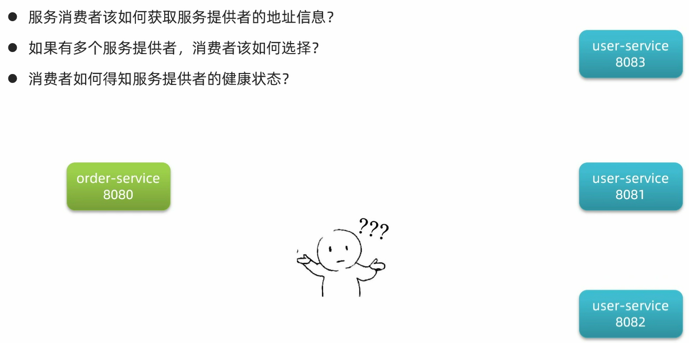

---

## 1.2. **Eureka**

### 1.2.1. **eureka 介绍**

**Eureka 架构中的微服务角色**

- **EurekaServer（服务端/注册中心）**

- **记录服务信息**：维护所有注册服务的元数据。
- **心跳监控**：监控客户端的健康状态，确保服务可用性。

- **EurekaClient（客户端）**

客户端主要包含两种角色，它们通常存在于同一个微服务应用中：

**Provider（服务提供者）**

- _例如案例中的_ `_user-service_`
- **注册信息**：启动时将自己的网络地址等信息注册到 EurekaServer。
- **发送心跳**：每隔 30 秒向 EurekaServer 发送心跳，证明自己还“活着”。

**Consumer（服务消费者）**

- _例如案例中的_ `_order-service_`
- **拉取列表**：根据服务名称从 EurekaServer 获取可用的服务列表。
- **远程调用**：基于获取到的服务列表进行负载均衡，选中一个具体的微服务实例发起远程调用。

---

### 1.2.2. **eureka 的作用**

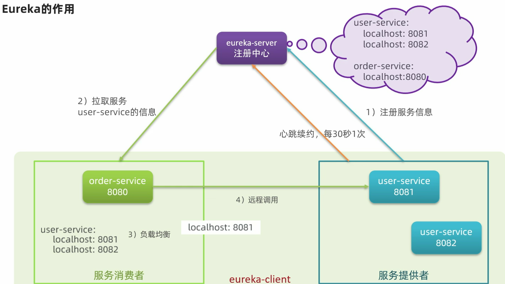

---

1. **消费者如何获取服务提供者信息？**

- **注册**：服务提供者在启动时，会将自己的服务信息注册到 Eureka Server。
- **保存**：Eureka Server 会保存这些注册信息。
- **拉取**：消费者根据服务名称向 Eureka Server 发起请求，拉取可用的服务提供者列表。

2. **如果有多个服务提供者，消费者该如何选择？**

- **负载均衡**：服务消费者会利用**负载均衡**算法，从获取到的服务实例列表中挑选一个进行调用。

3. **消费者如何感知服务提供者的健康状态？**

- **心跳检测**：服务提供者会每隔 30 秒向 Eureka Server 发送心跳请求，以此报告自己的健康状态。
- **剔除机制**：Eureka Server 会更新记录服务列表信息，如果发现某个服务心跳不正常（如超时未发送），就会将其从列表中剔除。
- **更新感知**：消费者随后拉取到的服务列表就是更新后的最新信息，从而避免了调用已宕机的服务。

---

## 1.3. 具体实现

### 1.3.1. 搭建 EurekaServer 服务

1. **创建项目，引入依赖**  
    需要在 Maven 或 Gradle 项目中引入 `**spring-cloud-starter-netflix-eureka-server**` 依赖。

```
<dependency>
    <groupId>org.springframework.cloud</groupId>
    <artifactId>spring-cloud-starter-netflix-eureka-server</artifactId>
</dependency>
```

2. **编写启动类**  
    在 Spring Boot 的主启动类上添加 `**@EnableEurekaServer**` 注解，以开启 Eureka 服务端功能。
3. **添加配置文件**  
    在 `**application.yml**` 文件中编写相关配置，指定端口、应用名称以及注册中心的地址。

```
server:
  port: 10086
spring:
  application:
    name: eurekaserver
eureka:
  client:
    service-url:
      defaultZone: http://127.0.0.1:10086/eureka/
```

---

### 1.3.2. 注册 user-service

1. **引入依赖**

在 `user-service` 项目的 `pom.xml` 文件中，引入 `spring-cloud-starter-netflix-eureka-client` 依赖。

```
<dependency>
    <groupId>org.springframework.cloud</groupId>
    <artifactId>spring-cloud-starter-netflix-eureka-client</artifactId>
</dependency>
```

2. **编写配置**

在 `application.yml` 文件中，编写配置以指定服务名称和 Eureka Server 的地址。

```
spring:
  application:
    name: userservice
eureka:
  client:
    service-url:
      defaultZone: http://127.0.0.1:10086/eureka/
```

---

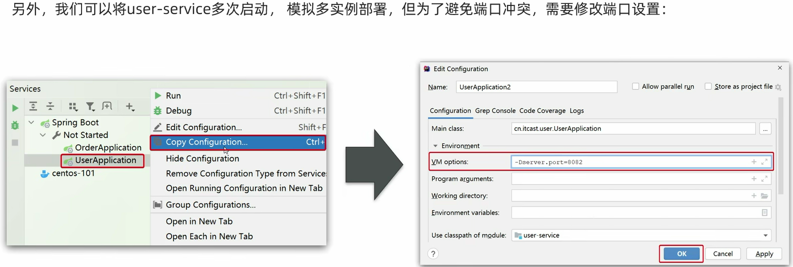

---

### 1.3.3. 服务发现

通过服务名进行服务调用和负载均衡的配置方法。

1. **修改访问URL路径**  
    在 `OrderService` 的代码中，将原本使用 IP 和端口的 URL 路径，修改为使用**服务名**。

```
String url = "http://userservice/user/" + order.getUserId();
```

2. **添加负载均衡注解**  
    在 `order-service` 项目的启动类 `OrderApplication` 中，为 `RestTemplate` 的 Bean 定义添加 `**@LoadBalanced**` 注解，以开启客户端负载均衡功能。

```
@Bean
@LoadBalanced
public RestTemplate restTemplate() {
    return new RestTemplate();
}
```

---

## 1.4. 总结

1. **搭建 EurekaServer（注册中心）**

这是微服务架构的基础设施，主要包含以下步骤：

- **引入依赖**：在项目中引入 `eureka-server` 的相关依赖。
- **开启注解**：在 Spring Boot 启动类上添加 `@EnableEurekaServer` 注解，标识这是一个注册中心服务。
- **配置文件**：在 `application.yml` 中配置 Eureka 的具体地址及相关参数。

2. **服务注册（Provider 端）**

服务提供者需要将自己注册到注册中心，以便被发现：

- **引入依赖**：引入 `eureka-client` 依赖，使服务具备客户端能力。
- **配置地址**：在 `application.yml` 中配置 Eureka Server 的地址，告诉服务该去哪里注册。

3. **服务发现（Consumer 端）**

服务消费者需要从注册中心获取服务列表并进行调用：

- **引入依赖**：同样需要引入 `eureka-client` 依赖。
- **配置地址**：在 `application.yml` 中配置 Eureka Server 的地址，以便拉取服务列表。
- **开启负载均衡**：给 `RestTemplate` 添加 `@LoadBalanced` 注解，赋予其负载均衡的能力。
- **远程调用**：在代码中直接使用服务提供者的**服务名称**进行远程调用，而不是硬编码 IP 地址。

---

# 2. 环境隔离

## 2.1. 环境隔离是什么

- **多环境搭建**：企业通常会搭建多个运行环境，例如开发环境、测试环境、发布环境等。
- **隔离需求**：不同环境之间需要进行隔离，以避免相互干扰。
- **Nacos 场景**：当不同项目共用一套 Nacos 时，项目之间也必须进行环境隔离，确保配置和注册信息的独立性。

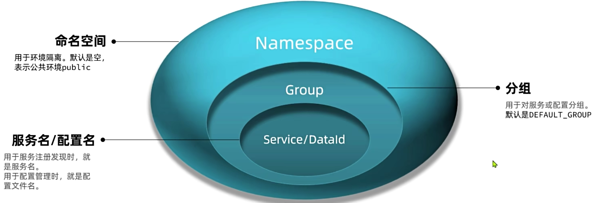

---

## 2.2. Nacos 控制台搭建namespace

在 Nacos 控制台可以创建 namespace,用来隔离不同环境

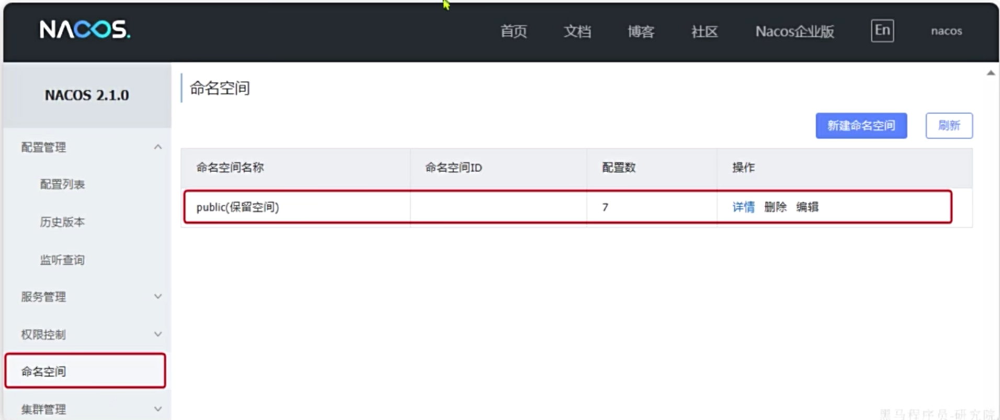

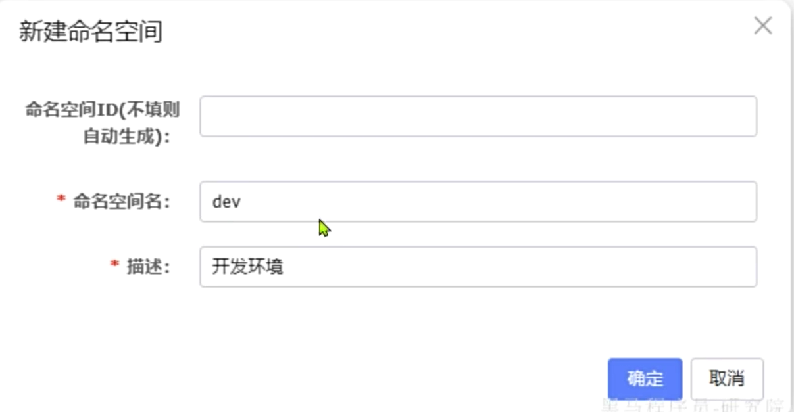

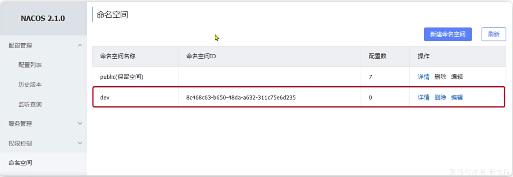

---

## 2.3. 文件配置

在微服务中，我们可以通过配置文件指定当前服务所属的 namespace：

```
spring:
  application:
    name: item-service # 服务名称
  profiles:
    active: dev
  cloud:
    nacos:
      server-addr: 192.168.150.101:8848 # nacos地址
      config:
        namespace: 8c468c63-b650-48da-a632-311c75e6d235 # 设置namespace, 必须用id
        file-extension: yaml
        shared-configs:
          - dataId: shared-jdbc.yaml
          - dataId: shared-log.yaml
          - dataId: shared-swagger.yaml
          - dataId: shared-seata.yaml
      discovery: # 服务发现配置
        namespace: 8c468c63-b650-48da-a632-311c75e6d235 # 设置namespace, 必须用id
```

- **服务命名与激活**：定义了服务名为 `item-service`，并激活了 `dev` 环境。
- **Nacos 连接**：指定了 Nacos 服务器的地址。
- **配置管理**：通过 `namespace` 实现了环境隔离，并引入了多个共享配置文件。
- **服务发现**：同样通过 `namespace` 确保服务注册与发现的隔离性。

```
spring:
  datasource:
    url: jdbc:mysql://localhost:3306/heima?useSSL=false
    username: root
    password: 123
    driver-class-name: com.mysql.jdbc.Driver
  cloud:
    nacos:
      server-addr: localhost:8848
      discovery:
        cluster-name: SH # 上海
        namespace: 492a7d5d-237b-46a1-a99a-fa8e98e4b0f9 # 命名空间，填ID
```

- `**namespace**`: 这里填写的是命名空间的 **ID**（如 `492a7d5d...`），而不是名称。
- **作用**: 配置命名空间通常用于实现**环境隔离**（如开发、测试、生产环境隔离），不同命名空间下的服务默认互不可见。
- `**cluster-name**`: 图片中同时配置了集群名为 `SH`（上海），这通常与命名空间配合使用，进行更细粒度的流量管理。

---

# 3. 服务分级存储模型

大厂的服务可能部署在多个不同机房，物理上被隔离为多个集群。Nacos支持对于这种集群的划分。


---

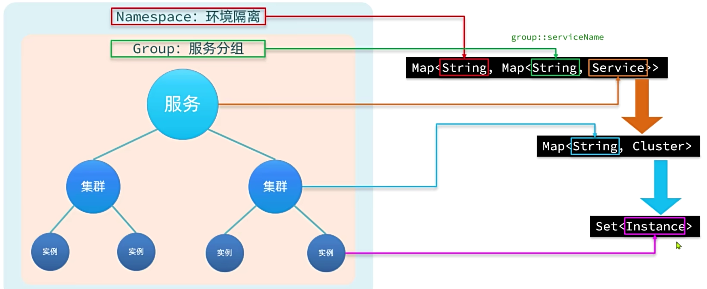

---

## 3.1. 服务跨集群调用问题


---

## 3.2. 服务集群属性

1. 修改 `application.yml` 文件：

在 `spring.cloud.nacos` 下添加 `discovery` 配置块，并设置 `cluster-name`

```
spring:
  cloud:
    nacos:
      server-addr: localhost:8848 # nacos 服务端地址
      discovery:
        cluster-name: HZ # 配置集群名称，也就是机房位置，例如：HZ，杭州
```

**配置说明**

- `**server-addr**`：指定 Nacos 服务器的地址，默认端口为 **8848**。
- `**cluster-name**`：用于标识当前服务实例所属的集群。这通常用于区分不同的机房或区域（如杭州 HZ、上海 SH）。

---

2. 在 **Nacos 控制台**可以看到集群变化：


---

**核心概念**

1. **Nacos 服务分级存储模型**  
    Nacos 采用三级结构来组织服务实例，从大到小依次为：

- **一级是服务**：例如 `userservice`，代表一个具体的微服务应用。
- **二级是集群**：例如“杭州”或“上海”，代表服务部署的物理区域或逻辑分组（机房位置）。
- **三级是实例**：例如“杭州机房的某台部署了 `userservice` 的服务器”，代表具体的服务运行节点（IP:Port）。

2. **如何设置实例的集群属性**  
    要将服务实例注册到指定的集群，只需修改配置文件：

- 打开 `application.yml` 文件。
- 添加配置属性 `spring.cloud.nacos.discovery.cluster-name`。
- 设置该属性的值为你想要的集群名称（如 `HZ` 或 `SH`）。

通过这种分级模型，Nacos 能够支持同机房优先调用（就近访问）等高级负载均衡策略。

---

## 3.3. 临时实例和非临时实例

在 Spring Cloud 应用中，通过配置文件设置 Nacos 服务实例的**注册模式**（临时或非临时）

```
spring:
  cloud:
    nacos:
      discovery:
        ephemeral: false # 设置为非临时实例
```

关键属性说明

- `**ephemeral**`: 这是控制实例注册类型的核心属性。

- `**false**`: 表示注册为**非临时实例**（Persistent Instance）。非临时实例通常使用**心跳机制**来检测健康状态，且 Nacos 服务器会持久化存储这些实例信息。即使实例宕机，Nacos 也不会立即将其剔除，而是标记为不健康。
- `**true**` (默认值): 表示注册为**临时实例**（Ephemeral Instance）。临时实例依赖客户端的**心跳上报**，如果 Nacos 服务器在一定时间内未收到心跳，会直接将该实例剔除。

---

# 4. Nacos 和 Eureaka 对比

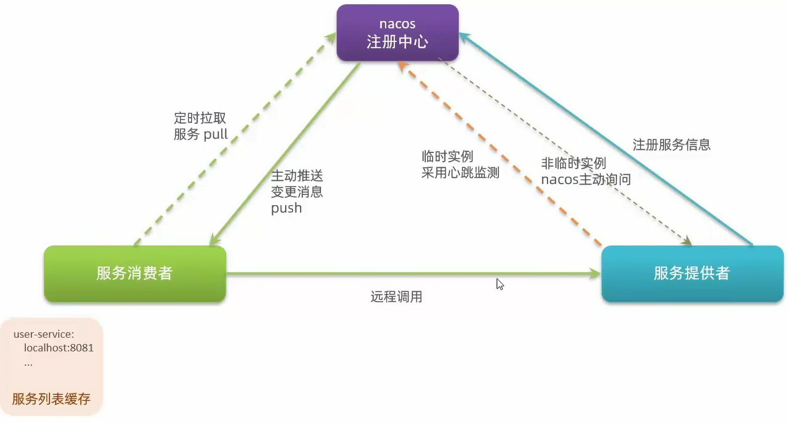

---

## 4.1. Nacos 与 Eureka 的共同点

两者在基础功能上非常相似：

- **服务注册与发现**：都支持服务提供者注册和服务消费者拉取服务列表。
- **健康检测**：都支持通过服务提供者发送心跳的方式来检测服务健康状况。

---

## 4.2. Nacos 与 Eureka 的核心区别

Nacos 在 Eureka 的基础上做了功能增强，主要区别如下：

1. **健康检测机制更灵活**

- **Nacos**：支持服务端主动检测。对于**临时实例**采用心跳模式，而对于**非临时实例**则采用主动检测模式（如 TCP/HTTP 探测）。
- **Eureka**：主要依赖客户端心跳。

2. **实例剔除策略不同**

- **临时实例**：如果心跳不正常，会被 Nacos 或 Eureka 直接剔除。
- **非临时实例**：在 Nacos 中，即使心跳不正常也**不会被剔除**，而是被标记为不健康，这保证了关键服务的元数据不丢失。

3. **服务列表更新方式**

- **Nacos**：支持**消息推送**模式。当服务列表变更时，Nacos 会主动推送给客户端，更新更及时。
- **Eureka**：主要依赖客户端定时拉取（轮询），实时性相对较弱。

4. **一致性协议（CAP）**

- **Nacos**：支持 AP 和 CP 切换。默认采用 **AP**（可用性）方式；但当集群中存在非临时实例时，会自动切换到 **CP**（一致性）模式。
- **Eureka**：仅采用 **AP** 方式，保证高可用性。

---

# 5. 远程调用

## 5.1. Ribbon 负载均衡器

如果说 **Nacos** 或 **Eureka** 解决了“服务在哪里”的问题，那么 **Ribbon** 解决的就是**“具体调用哪一个服务实例”**的问题。简单来说，它就像一个“智能流量调度员”，运行在服务消费者的本地，负责把请求均匀地分发到后端的多个服务实例上。

## 5.2. 负载均衡原理

负载均衡流程：

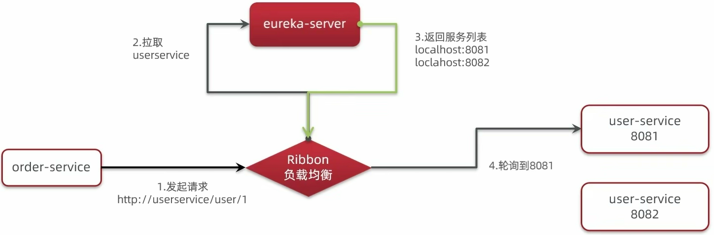

---

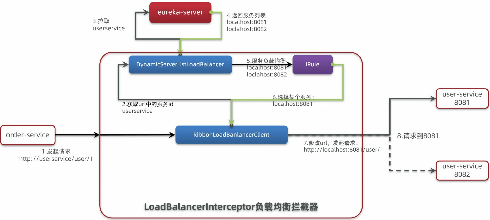

---

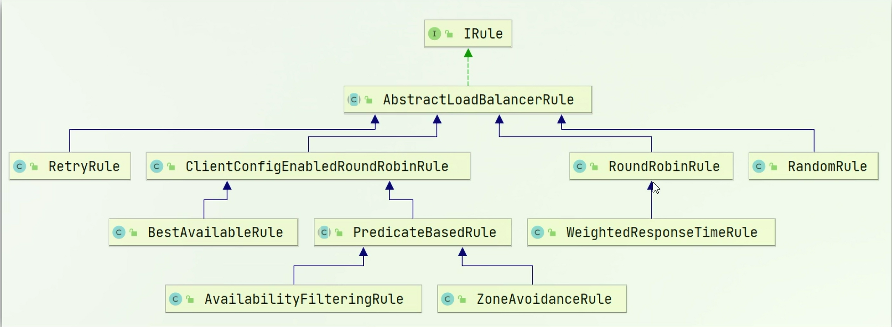

### 5.2.1. 核心概念：IRule 接口

`**IRule**` 是 Ribbon 中定义负载均衡算法的核心接口。通过实现或继承这个接口，开发者可以自定义或选择不同的服务实例选择策略。

### 5.2.2. 常见的 IRule 子接口（负载均衡规则）

以下是 Ribbon 内置的一些常用规则：

- **RoundRobinRule（轮询）**：轮询策略，这是**默认规则**。它按顺序循环选择服务器。
- **RandomRule**：随机策略，随机选择一个服务器。
- **WeightedResponseTimeRule**：加权响应时间策略，响应时间越短的服务器被选中的权重越大。
- **BestAvailableRule**：最佳可用策略，会先过滤掉故障实例，然后选择并发请求数最小的服务器。
- **RetryRule**：重试策略，先按照 `RoundRobinRule` 的策略获取服务，如果获取失败，则在指定时间内进行重试。
- **AvailabilityFilteringRule**：可用性过滤策略，会先过滤掉故障或并发连接数超过阈值的服务器，然后在剩余的服务器中进行轮询。
- **ZoneAvoidanceRule**：区域规避策略，这是默认规则的增强版。它会综合判断服务器所在区域的性能和可用性来选择服务器。

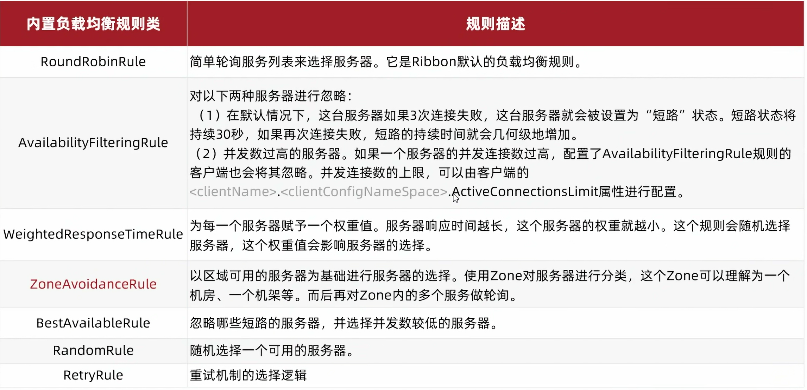

---

通过在 Spring Boot 启动类（如 `OrderApplication`）或任意配置类中定义一个 `**IRule**` 类型的 Bean，可以直接覆盖默认的负载均衡策略。

**示例代码：**

```
@Bean
public IRule randomRule(){
    return new RandomRule();
}
```

这种方式会将负载均衡策略修改为**随机规则**（RandomRule）。

---

2. **配置文件方式 (YAML)**

你也可以直接在 `application.yml` 文件中针对特定的服务进行配置，无需编写 Java 代码。

**示例配置：**

```
userservice:  # 这里填写的是目标服务的服务名
  ribbon:
    NFLoadBalancerRuleClassName: com.netflix.loadbalancer.RandomRule # 负载均衡规则
```

这种方式同样将针对 `userservice` 的调用策略修改为**随机规则**。

**核心总结：**  
这两种方式都能达到修改负载均衡规则的目的。代码方式更加直观，适合需要复杂逻辑控制的场景；配置文件方式则更加灵活，修改配置后无需重新编译代码即可生效（配合 Spring Cloud Config 等配置中心时尤为方便）。

---

## 5.3. 饥饿加载

1. **核心概念对比**

- **默认懒加载**：Ribbon 默认采用**懒加载**模式，即只有在第一次发起请求访问某个服务时，才会去创建对应的 `LoadBalanceClient`。这会导致第一次请求因为需要初始化客户端而耗时较长。
- **饥饿加载**：开启后，Ribbon 会在项目启动时就**预先创建**好 `**LoadBalanceClient**`，从而避免第一次请求的延迟，提升用户体验。

2. **开启饥饿加载的配置**

可以通过在配置文件中添加以下配置来开启饥饿加载，并指定需要预加载的服务：

```
ribbon:
  eager-load:
    enabled: true  # 开启饥饿加载
    clients: userservice  # 指定对 userservice 这个服务进行饥饿加载
```

这个配置的作用是：在应用启动时，就为 `userservice` 服务初始化 Ribbon 客户端，从而消除首次调用的延迟。

---

# 6. 微服务保护算法

## 6.1. 固定窗口计数器算法

关于**固定窗口计数器算法**的概念说明，其核心内容如下：

- **时间划分**：将时间划分为多个窗口，窗口时间跨度称为 Interval，本例中为 1000ms；
- **计数与限流**：每个窗口分别计数统计，每有一次请求就将计数器加一，限流即设置计数器阈值，本例为 3；
- **超限处理**：如果计数器超过了限流阈值，则超出阈值的请求都将被丢弃。

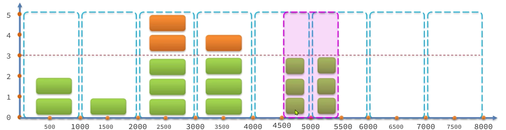

---

## 6.2. **滑动窗口计数器算法**

关于**滑动窗口计数器算法**的说明，其核心概念如下：

- **窗口划分**：算法会将一个大的时间窗口划分为n个更小的区间。例如，当窗口时间跨度Interval为1秒，区间数量n=2时，每个小区间的时间跨度为500ms，并且每个区间都拥有一个独立的计数器。
- **限流规则**：限流阈值依然设定为3。当在一个完整的时间窗口（1秒）内，请求数量超过该阈值时，超出的请求将被限流。
- **窗口移动**：窗口会根据当前请求的时间（currentTime）进行滑动。窗口的范围是从（currentTime-Interval）之后的第一个时区开始，一直到currentTime所在的时区结束。

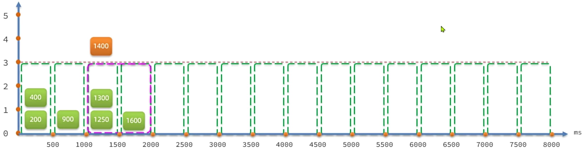

---

## 6.3. 漏桶算法

关于**漏桶算法**的说明，其核心概念如下：

- **请求存储**：将每个请求视作“水滴”放入“漏桶”中进行存储。
- **固定速率处理**：“漏桶”以固定的速率向外“漏”出请求来执行，如果“漏桶”空了则停止“漏水”。
- **溢出丢弃**：如果“漏桶”满了，则多余的“水滴”会被直接丢弃。
- **排队理解**：可以理解成请求在桶内排队等待处理。

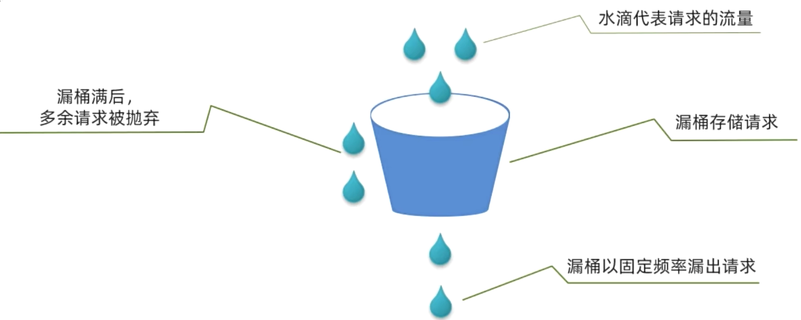

---

关于 **Sentinel 基于漏桶算法实现排队等待效果** 的说明，核心内容如下：

- **桶容量决定因素**：桶的容量取决于限流的 QPS 阈值以及允许等待的最大超时时间。
- **示例说明**：当限流 QPS=5、队列超时时间为 2000ms 时，所有请求进入队列（如同进入漏桶）。由于漏桶以固定频率执行，QPS=5 意味着每 200ms 执行一个请求。第 N 个请求的预期执行时间为 (N - 1) * 200ms。若请求预期执行时间超出最大时长 2000ms，说明“桶满了”，新请求将被拒绝。

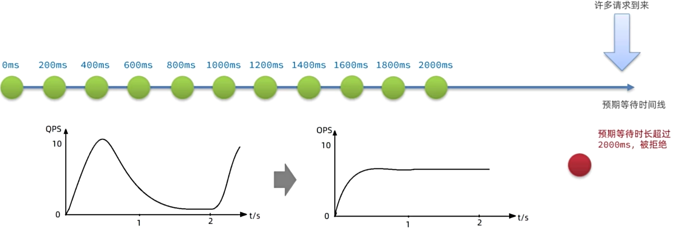

---

## 6.4. 令牌桶算法

关于**令牌桶算法**的说明，其核心概念如下：

- **令牌生成**：系统会以固定的速率生成令牌，并存入令牌桶中。如果令牌桶满了，就会停止生成新的令牌。
- **请求处理**：当一个请求进入后，必须先尝试从桶中获取一个令牌。只有成功获取到令牌，该请求才能被处理。
- **无令牌处理**：如果令牌桶中没有令牌，请求可以选择等待，或者直接被丢弃。

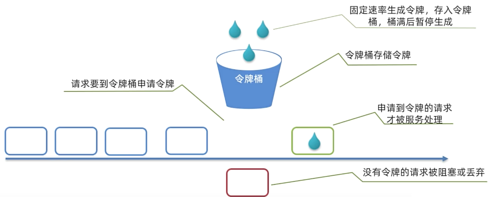

---

## 6.5. **Sentinel 限流与 Gateway 限流有什么差异？**

- **Gateway 限流**：采用基于 Redis 实现的 **令牌桶算法**。
- **Sentinel 限流**：内部机制更复杂，结合了多种算法：

- **默认模式**：基于 **滑动时间窗口算法，**另外 Sentinel 中断路器的计数也是基于滑动时间窗口算法。
- **排队等待**：在限流后提供排队等待功能，此功能基于 **漏桶算法**。
- **热点参数限流**：专门针对热点参数的限流，基于 **令牌桶算法**。

---

05月11日

---

## 🔗 关联笔记
- [[（实用篇）SpringCloud微服务笔记]]
- [[（高级篇）SpringCloud微服务笔记]]
- [[分布式与网关杂记]]
