# 1. 微服务保护
## a. 初识 Sentinel

### ⅰ. 雪崩问题及解决方案

1. **什么是雪崩问题？**

- 微服务之间相互调用，因为调用链中的**一个服务故障**，引起**整个链路**都无法访问的情况

1. **如何避免因服务故障引起的雪崩问题？**

- **超时处理**：设定超时时间，请求超过一定时间没有响应就返回错误信息，不会无休止等待
- **线程隔离**：限定每个业务能使用的**线程数**，避免耗尽整个tomcat的资源，因此也叫**舱壁模式**。
- **熔断降级**：由断路器统计业务执行的**异常比例**，如果超出阈值则会熔断该业务，拦截访问该业务的一切请求。

3. **如何避免因瞬间高并发浏览而导致服务故障？**

- **流量控制（请求限流）**：限制业务访问的QPS，避免服务因流量的突增而故障。


### ⅱ. 服务保护技术对比

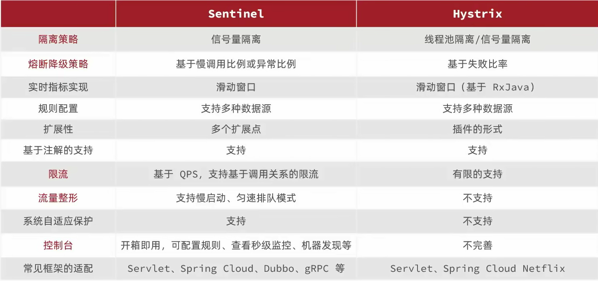

---

### ⅲ. Sentinel 介绍和安装

**Sentinel**是阿里巴巴开源的一款微服务流量控制组件。官网地址：[https://sentinelguard.io/zh-cn/index.html](https://sentinelguard.io/zh-cn/index.html)

**Sentinel** 具有以下特征：

- **丰富的应用场景**：Sentinel 承接了阿里巴巴近 10 年的双十一大促流量的核心场景，例如秒杀（即突发流量控制在系统容量可以承受的范围）、消息削峰填谷、集群流量控制、实时熔断下游不可用应用等。
- **完备的实时监控**：Sentinel 同时提供实时的监控功能。您可以在控制台中看到接入应用的单台机器秒级数据，甚至 500 台以下规模的集群的汇总运行情况。
- **广泛的开源生态**：Sentinel 提供开箱即用的与其它开源框架/库的整合模块，例如与 Spring Cloud、Dubbo、gRPC 的整合。您只需要引入相应的依赖并进行简单的配置即可快速地接入 Sentinel。
- **完善的 SPI 扩展点**：Sentinel 提供简单易用、完善的 SPI 扩展接口。您可以通过实现扩展接口来快速地定制逻辑。例如定制规则管理、适配动态数据源等。

---

```
java -Dserver.port=8090 -Dcsp.sentinel.dashboard.server=localhost:8090 -Dproject.name=sentinel-dashboard -jar sentinel-dashboard.jar
```

访问[http://localhost:8090](http://localhost:8080)页面，就可以看到sentinel的控制台了：

需要输入账号和密码，默认都是：**sentinel**

登录后，即可看到控制台，默认会监控sentinel-dashboard服务本身：

---

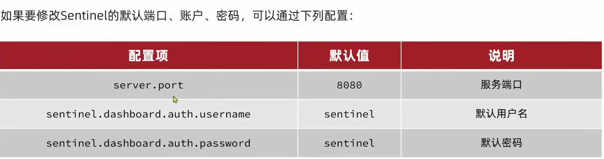

---

### ⅳ. 微服务整合 Sentinel

1. **引入sentinel依赖：**

我们在`cart-service`模块中整合sentinel，连接`sentinel-dashboard`控制台，引入sentinel依赖

```
<!--sentinel-->
<dependency>
    <groupId>com.alibaba.cloud</groupId>
    <artifactId>spring-cloud-starter-alibaba-sentinel</artifactId>
</dependency>
```

2. **配置控制台地址：**

修改application.yaml文件，添加下面内容：

```
spring:
  cloud:
    sentinel:
      transport:
        dashboard: localhost:8080		#Sentinel控制台地址
```

3. **访问微服务的任意端点，触发sentinel监控**

重启`cart-service`，然后访问查询购物车接口，sentinel的客户端就会将服务访问的信息提交到`sentinel-dashboard`控制台

---

## b. 限流规则

### ⅰ. **簇点链路**

**簇点链路**：就是项目内的单机调用链路，链路中**被监控**的每个接口就是一个资源。默认情况下sentinel会监控SpringMVC的每一个端点Endpoint（http 接口），因此SpringMVC的每一个端点（**Endpoint**）就是调用链路中的一个资源。

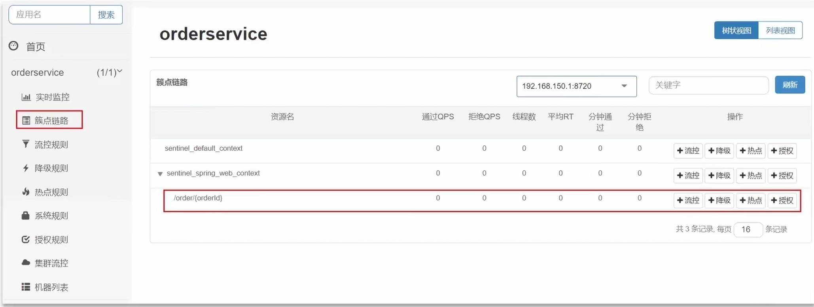

**Restful风格的API请求路径一般都相同，这会导致簇点资源名称重复。因此我们要修改配置，把请求方式+请求路径作为簇点资源名称：**

```
spring:
  cloud:
    sentinel:
      transport:
        dashboard: localhost:8090
      http-method-specify: true # 开启请求方式前缀
```

通过设置`http-method-specify: true`，系统会将HTTP请求方法（如GET、POST）与请求路径组合，作为唯一的资源标识，从而更精确地进行流量控制和熔断降级。

---

在簇点链路后面点击流控按钮，即可对其做限流配置：

此处为语雀图册卡片，点击链接查看：[https://www.yuque.com/fangzhou-ze0bw/ckexpk/nhi6a9kd5gxcbnvt#TBcAk](https://www.yuque.com/fangzhou-ze0bw/ckexpk/nhi6a9kd5gxcbnvt#TBcAk)

QPS：每秒钟请求的数量

---

### ⅱ. 流控模式

在添加限流规则时，点击高级选项，可以选择**三种流控模式**：

- **直接**：统计当前资源的请求，触发阈值时对当前资源直接限流，也是默认的模式
- **关联**：统计与当前资源相关的另一个资源，触发阈值时，对当前资源限流
- **链路**：统计从指定链路访问到本资源的请求，触发阈值时，对指定链路限流

1. **流控模式-直接**

对当前资源限流

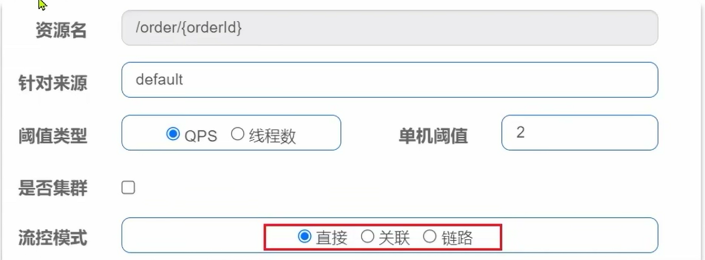

---

2. **流控模式-关联**

- **关联模式：**统计与当前资源相关的另一个资源，触发阈值时，对当前资源限流
- 使用场景：比如用户支付时需要修改订单状态，同时用户要查询订单。查询和修改操作会争抢数据库锁，产生竞争。业务需求是有限支付和更新订单的业务，因此当修改订单业务触发阈值时，需要对查询订单业务限流。

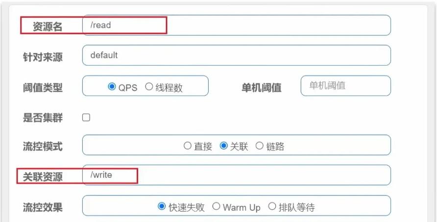

当**/write** 资源访问量触发阈值时，就会对**/read** 资源限流，避免影响/write 资源

---

**小结**

满足下面条件可以使用关联模式：

- 两个有竞争关系的资源
- 一个优先级较高，一个优先级较低（限流）

高优先级资源触发阈值，对低优先级资源限流

---

3. **流控模式-链路**

**链路模式**：只针对从指定链路访问到本资源的请求做统计，判断是否超过阈值。

例如有两条请求链路：

- `/test1` -> `/common`
- `/test2` -> `/common`

如果只希望统计从 `/test2` 进入到 `/common` 的请求，则可以这样配置：

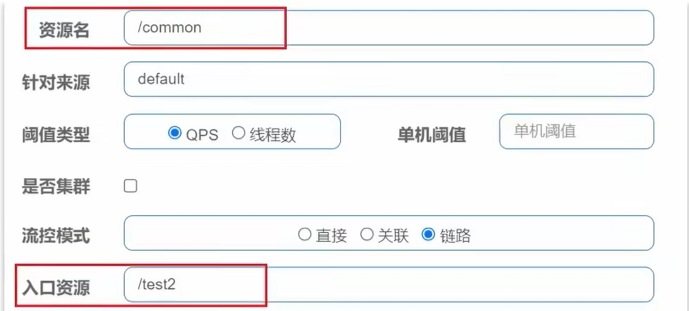

---

- **Sentinel** 默认只标记 **Controller** 中的方法为资源，如果要标记其它方法，需要利用 `**@SentinelResource**` 注解，示例：

```
@SentinelResource("goods")
public void queryGoods() {
    System.err.println("查询商品");
}
```

- **Sentinel** 默认会将 **Controller** 方法做 **context** 整合，导致链路模式的流控失效，需要修改 `**application.yml**`，添加配置：

```
spring:
  cloud:
    sentinel:
      web-context-unify: false # 关闭context整合
```

阈值统计时，只统计从指定资源进入当前资源的请求，是对请求来源的限流

---

### ⅲ. 流控效果

**流控效果**是指请求达到**流控阈值**时应该采取的措施，包括三种：

- **快速失败**：达到阈值后，新的请求会被立即拒绝并抛出 **FlowException** 异常（默认的处理方式）。
- **warm up**：预热模式，对超出阈值的请求同样是拒绝并抛出异常。但这种模式阈值会动态变化，从一个较小值逐渐增加到最大阈值。
- **排队等待**：让所有的请求按照先后次序排队执行，两个请求的间隔不能小于指定时长

1. **流控效果-快速失败**

QPS 超出阈值时，拒绝新的请求

2. **流控效果-warm up**

**warm up**也叫预热模式，是应对服务冷启动的一种方案。请求阈值初始值是 **threshold / coldFactor**，持续指定时长后，逐渐提高到threshold值。而coldFactor的默认值是3。

例如，我设置QPS的threshold为10，预热时间为5秒，那么初始阈值就是 10 / 3 ，也就是3，然后在5秒后逐渐增长到10。

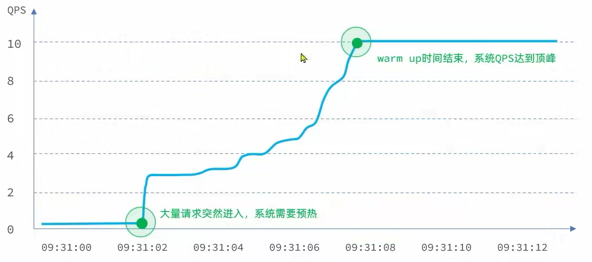

QPS 超过阈值时，拒绝新的请求；QPS 阈值时逐渐提升的，可以避免冷启动时高并发导致服务宕机

---

3. **流控效果-排队等待**

当请求超过QPS阈值时，快速失败和warm up 会拒绝新的请求并抛出异常。而排队等待则是让所有请求进入一个**队列**中，然后按照阈值允许的时间间隔依次执行。后来的请求必须等待前面执行完成，如果请求预期的等待时间超出最大时长，则会被拒绝。

例如：QPS = 5，意味着每200ms处理一个队列中的请求；timeout = 2000，意味着预期等待超过2000ms的请求会被拒绝并抛出异常

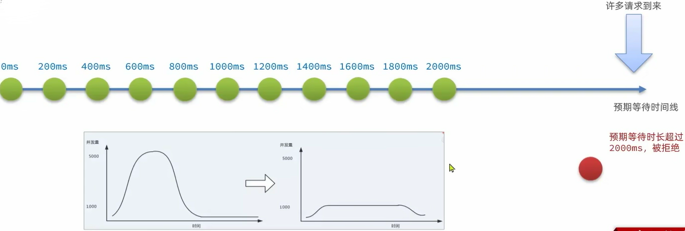

请求会进入队列，按照阈值允许的时间间隔依次执行请求；如果请求预期等待时长大于超时时间，直接拒绝

---

### ⅳ. 热点参数限流

之前的限流是统计访问某个资源的所有请求，判断是否超过QPS阈值。而热点参数限流是分别统计**参数值相同**的请求，判断是否超过QPS阈值。

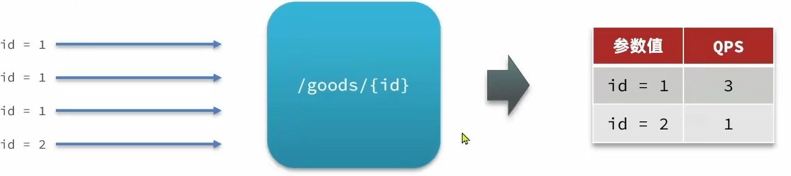

配置示例：

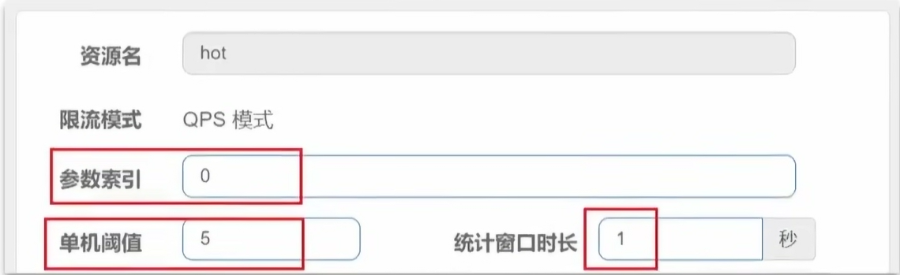

代表的含义是：对 hot 这个资源的 0 号参数（第一个参数）做统计，每一秒**相同参数值**的请求数不能超过 5

---

在热点参数限流的高级选项中，可以对部分参数设置例外配置：

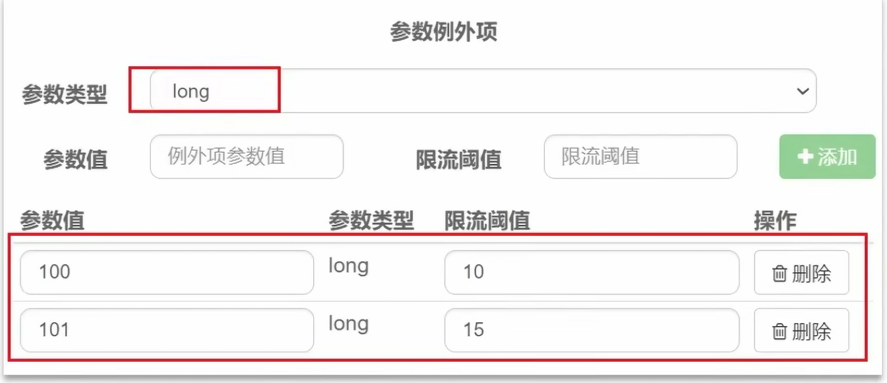

结合上一个配置，这里的含义是对0号的long类型参数限流，每1秒相同参数的QPS不能超过5，有两个例外：

- 如果参数值是100，则每1秒允许的QPS为10
- 如果参数值是101，则每1秒允许的QPS为15

**注意：**热点参数限流对默认的 SpringMVC 资源无效

---

## c. 隔离和降级

### ⅰ. FeignClient 整合 Sentinel

虽然限流可以尽量避免因高并发而引起的服务故障，但服务还会因为其它原因而故障。而要将这些故障控制在一定范围，避免雪崩，就要靠线程隔离（舱壁模式）和熔断降级手段了。

不管是线程隔离还是熔断降级，都是对**客户端（调用方）**的保护。

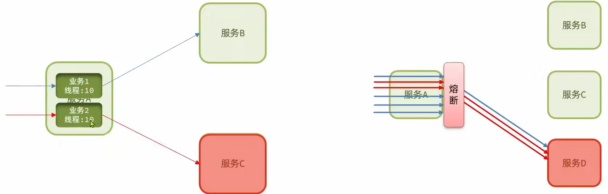

---

SpringCloud中，微服务调用都是通过**Feign**来实现的，因此做客户端保护必须整合Feign和Sentinel。

1. **修改OrderService的application.yml文件，开启Feign的Sentinel功能**

```
feign:
  sentinel:
    enabled: true # 开启Feign的Sentinel功能
```

2. **给FeignClient编写失败后的降级逻辑**  
    ① 方式一：**FallbackClass**，无法对远程调用的异常做处理  
    ② 方式二：**FallbackFactory**，可以对远程调用的异常做处理，我们选择这种

---

- **核心背景**：在SpringCloud体系中，**Feign**是声明式的Web服务客户端，用于简化服务间的HTTP调用。为了防止某个服务故障导致整个链路瘫痪（雪崩效应），需要引入Sentinel作为流量防卫兵。
- **配置关键**：必须在配置文件（`application.yml`）中显式开启 `feign.sentinel.enabled: true`，否则Sentinel对Feign的自动装配不会生效。
- **降级策略对比**：

- **FallbackClass**：虽然能实现基本的降级返回，但它无法感知具体的异常原因，只能“一刀切”地处理所有错误。
- **FallbackFactory**：这是更推荐的方案。它允许开发者获取到导致降级的具体异常对象（`Throwable`），从而根据不同的错误类型（如超时、服务不可用）执行不同的逻辑，或者将异常信息记录到日志中，便于排查问题。、

---

**步骤一：在feign-api项目中定义类，实现FallbackFactory：**

```
@Slf4j
public class UserClientFallbackFactory implements FallbackFactory<UserClient> {
    @Override
    public UserClient create(Throwable throwable) {
        // 创建UserClient接口实现类，实现其中的方法，编写失败降级的处理逻辑
        return new UserClient() {
            @Override
            public User findById(Long id) {
                // 记录异常信息
                log.error("查询用户失败", throwable);
                // 根据业务需求返回默认的数据，这里是空用户
                return new User();
            }
        };
    }
}
```

**步骤二：在feign-api项目中的DefaultFeignConfiguration类中将UserClientFallbackFactory注册为一个Bean：**

```
@Bean
public UserClientFallbackFactory userClientFallback(){
    return new UserClientFallbackFactory();
}
```

**步骤三：在feign-api项目中的UserClient接口中使用UserClientFallbackFactory：**

```
@FeignClient(value = "userservice", fallbackFactory = UserClientFallbackFactory.class)
public interface UserClient {

    @GetMapping("/user/{id}")
    User findById(@PathVariable("id") Long id);
}
```

**核心逻辑解析**

这三步操作构成了一个标准的微服务容错处理模式：

1. **定义降级工厂（步骤一）**：

- 创建 `UserClientFallbackFactory` 类实现 `FallbackFactory<UserClient>` 接口。
- 重写 `create` 方法，该方法接收一个 `Throwable throwable` 参数，这正是导致调用失败的**根本原因**。
- 在内部匿名类中实现 `findById` 方法：首先利用 `@Slf4j` 记录错误日志（这是 `FallbackFactory` 相比普通 `Fallback` 最大的优势，能感知异常），然后返回一个空的 `User` 对象作为兜底数据，防止程序崩溃。

2. **注册组件（步骤二）**：

- 通过 `@Bean` 注解将工厂类注入到 Spring 容器中，确保 Feign 能够扫描并管理它。

3. **关联客户端（步骤三）**：

- 在 `@FeignClient` 注解中，通过 `fallbackFactory` 属性指定刚才编写的工厂类。
- 这样，当 `userservice` 服务不可用或超时时，Feign 就会自动调用工厂中定义的逻辑，而不是直接抛出异常给前端。

```
用户请求 → cart-service → 通过Feign调用 item-service
                                ↓
                            调用成功？ 
                            ↙     ↘
                            是       否（超时/异常/服务不可用）
                            ↓                ↓
                        返回正常结果    触发 ItemClientFallback
                                             ↓
                                    根据方法执行降级逻辑
                                            - queryItemByIds → 返回空列表
                                            - deductStock → 抛异常回滚
```

---

### ⅱ. 线程隔离

有两种实现：

- **线程隔离**
- **信号量隔离（Sentinel 默认采用）**

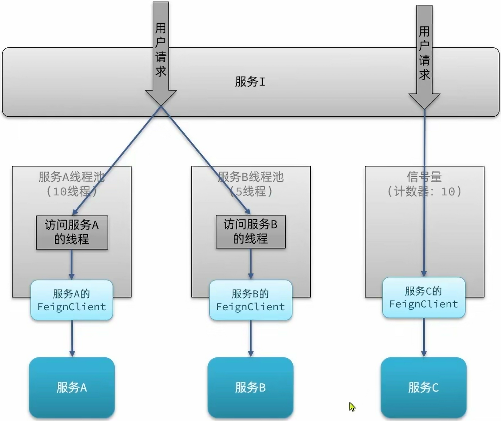

---

1. **信号量隔离**

- **优点**：轻量级，无额外开销。没有线程切换开销。适合高频调用、延迟极低的操作。资源消耗小
- **缺点**：不支持主动超时，不支持异步调用。隔离性不如线程池（所有调用共用主线程）。如果调用阻塞，会拖慢整个系统
- **场景**：适用于高频调用、高扇出（即一个服务调用多个下游服务）的场景。

2. **线程池隔离**

- **优点**：支持主动超时，支持异步调用。完全隔离，一个服务挂了不影响其他服务。可以设置超时、排队等精细控制。能监控每个线程池的健康状态
- **缺点**：线程的额外开销比较大（每个线程池都要占用内存）。线程切换有性能开销。
- **场景**：适用于低扇出的场景。

---

3. **核心区别解读**

- **资源控制方式不同**：

- **信号量隔离**更像是一个计数器，它不创建独立的线程池，而是通过限制并发线程的数量（信号量）来控制资源。这种方式非常轻量，但一旦请求处理时间过长，会占用宝贵的信号量，导致后续请求无法进入。
- **线程池隔离**则是为特定的依赖服务分配一个独立的线程池。请求在独立的线程中执行，互不干扰。虽然创建和维护线程池有开销，但它能有效隔离故障，防止某个慢服务耗尽整个系统的线程资源。

- **功能支持不同**：

- 由于信号量隔离是在当前线程中执行，它无法强制中断正在执行的任务，因此**不支持主动超时**。
- 线程池隔离因为任务在独立线程运行，框架可以更容易地控制任务的执行时间，从而实现**主动超时**和**异步调用**。

---

**舱壁模式：**

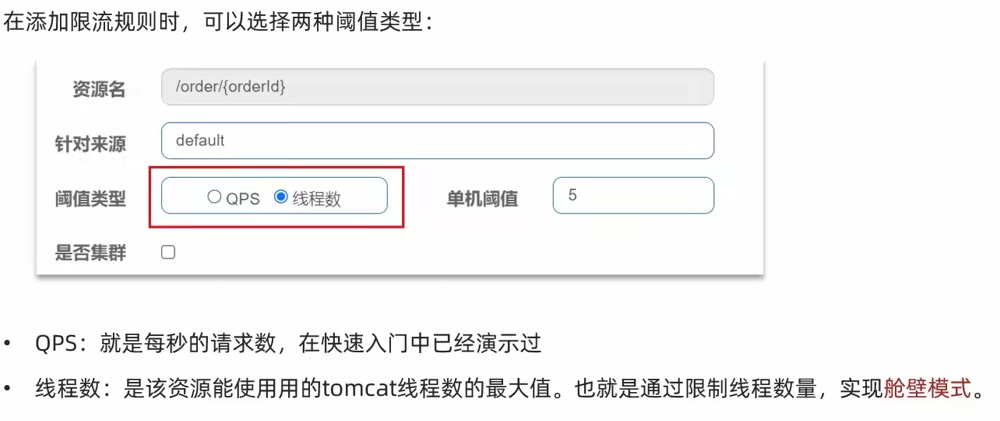

---

### ⅲ. 熔断降级

熔断降级是解决雪崩问题的重要手段。其思路是由**断路器**统计服务调用的异常比例、慢请求比例，如果超出阈值则会**熔断**该服务。即拦截访问该服务的一切请求；而当服务恢复时，断路器会放行访问该服务的请求。

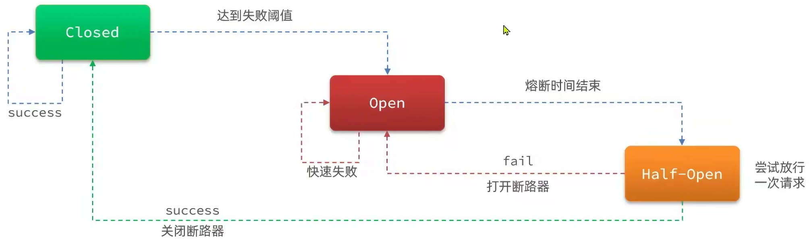

---

- **慢调用比例**：超过指定时长的调用为慢调用，统计单位时长内慢调用的比例，超过阈值则熔断
- **异常比例**：统计单位时长内异常调用的比例，超过阈值则熔断
- **异常数**：统计单位时长内异常调用的次数，超过阈值则熔断

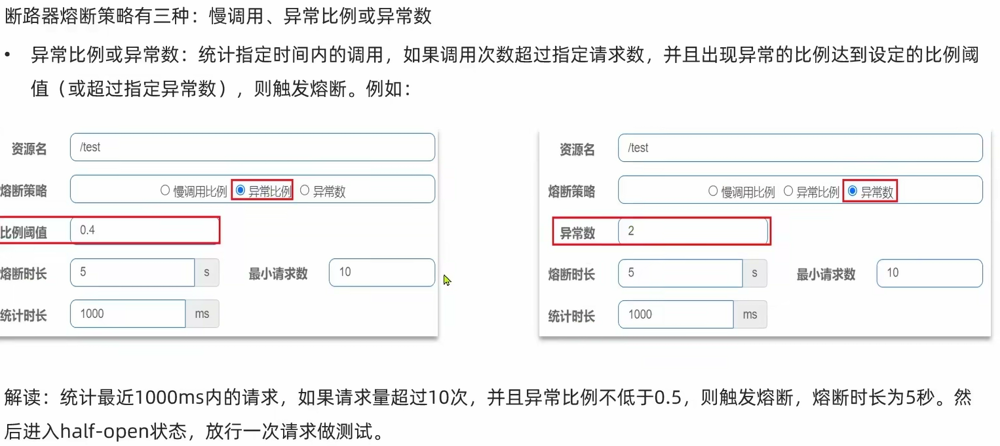

---

1. **慢调用比例**：关注服务的**响应速度**。当服务响应变慢（超过设定的RT），且慢请求占比过高时触发熔断。这通常意味着下游服务负载过高或资源不足。
2. **异常比例**：关注服务的**成功率**。当业务报错（如HTTP 500）的比例过高时触发熔断。这适用于服务虽然响应快，但处理逻辑频繁失败的场景。
3. **异常数**：关注异常的**绝对数量**。与比例不同，它不关心总请求量多少，只看错误次数是否超过设定值。这适用于对错误容忍度极低的场景，哪怕只有少量错误也不能接受。

---

## d. 授权规则

### ⅰ. 授权规则

- **白名单**：来源（origin）在白名单内的调用者允许访问
- **黑名单**：来源（origin）在黑名单内的调用者不允许访问


**核心机制解读**

1. **白名单模式（默认拒绝）**：这是一种严格的安全策略。只有明确被信任的来源（Origin）才能访问资源，其他所有未列出的来源都会被自动拦截。
2. **黑名单模式（默认允许）**：这是一种相对宽松的策略。除了被明确禁止的恶意来源外，其他所有调用者都可以正常访问。

---

**代码实现：解析请求来源**

Sentinel是通过RequestOriginParser这个接口的parseOrigin来获取请求的来源的。

```
public interface RequestOriginParser {
    /**
     * 从请求request对象中获取origin，获取方式自定义
     */
    String parseOrigin(HttpServletRequest request);
}
```

例如，我们尝试从request中获取一个名为origin的请求头，作为origin的值：

```
@Component
public class HeaderOriginParser implements RequestOriginParser {
    @Override
    public String parseOrigin(HttpServletRequest request) {
        String origin = request.getHeader("origin");
        if(StringUtils.isEmpty(origin)){
            return "blank";
        }
        return origin;
    }
}
```

**网关配置：添加 Origin 头**

我们还需要在gateway服务中，利用网关的过滤器添加名为gateway的origin头：

```
spring:
  cloud:
    gateway:
      default-filters:
        - AddRequestHeader=origin,gateway # 添加名为origin的请求头，值为gateway
```

**规则配置：设置白名单**

给`/order/{orderId}`配置授权规则：

|   |   |   |
|---|---|---|
|配置项|值|说明|
|**资源名**|`/order/{orderId}`|需要保护的资源路径|
|**流控应用**|`gateway`|对应请求头中的 origin 值|
|**授权类型**|**白名单**|选中状态（黑名单未选中）|

---

流程总结

1. **定义解析器**：通过实现 `RequestOriginParser` 接口，告诉 Sentinel 如何从 HTTP 请求中提取来源标识（例如从 Header 中获取 `origin` 字段）。
2. **网关打标**：在网关层统一给请求添加 `origin: gateway` 的头部信息，作为身份标识。
3. **配置白名单**：在 Sentinel 控制台配置规则，指定资源 `/order/{orderId}` 只允许 `origin` 为 `gateway` 的请求访问。这意味着只有经过网关转发的请求才能通过，直接调用服务的请求会被拦截。

---

### ⅱ. 自定义异常结果

默认情况下，发生限流、降级、授权拦截时，都会抛出异常到调用方。如果要自定义异常时的返回结果，需要实现 BlockExceptionHandler接口：

```
public interface BlockExceptionHandler {

    /**
     * 处理请求被限流、降级、授权拦截时抛出的异常：BlockException
     */
    void handle(HttpServletRequest request, HttpServletResponse response, BlockException e) throws Exception;
}
```

---

核心逻辑解析

1. **默认行为**：当请求被 Sentinel 规则（限流、降级、授权）拦截时，框架默认会抛出 `BlockException`。如果开发者不进行处理，调用方通常会收到一个标准的错误页面或 JSON 错误信息。
2. **自定义扩展**：为了给用户返回更友好的提示（例如：“系统繁忙，请稍后再试”或返回特定的 JSON 格式），开发者需要实现 `BlockExceptionHandler` 接口。
3. **核心方法**：`handle` 方法是处理逻辑的入口。开发者可以在这里编写代码，直接向 `HttpServletResponse` 写入自定义的数据或设置状态码，从而覆盖默认的错误响应。

---

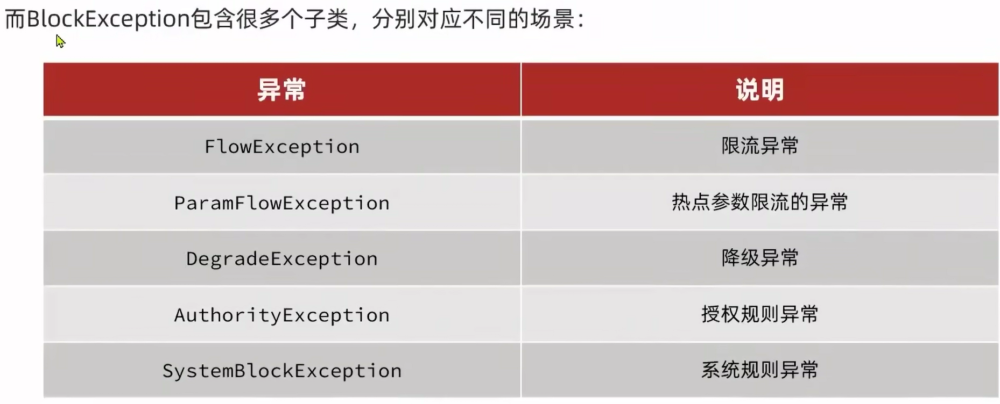

---

我们在**order-service**中定义类，实现BlockExceptionHandler接口：

```
@Component
public class SentinelBlockHandler implements BlockExceptionHandler {
    @Override
    public void handle(
            HttpServletRequest httpServletRequest,
            HttpServletResponse httpServletResponse, BlockException e) throws Exception {
        String msg = "未知异常";
        int status = 429;
        if (e instanceof FlowException) {
            msg = "请求被限流了！";
        } else if (e instanceof DegradeException) {
            msg = "请求被降级了！";
        } else if (e instanceof ParamFlowException) {
            msg = "热点参数限流！";
        } else if (e instanceof AuthorityException) {
            msg = "请求没有权限！";
            status = 401;
        }
        httpServletResponse.setContentType("application/json;charset=utf-8");
        httpServletResponse.setStatus(status);
        httpServletResponse.getWriter().println("{\"message\": \"" + msg + "\", \"status\": " + status + "}");
    }
}
```

**代码逻辑解析**

这个自定义异常处理器通过判断 `BlockException` 的具体子类型，返回不同的提示信息和 HTTP 状态码：

1. **限流 (FlowException)**：返回“请求被限流了！”，状态码 429。
2. **降级 (DegradeException)**：返回“请求被降级了！”，状态码 429。
3. **热点参数限流 (ParamFlowException)**：返回“热点参数限流！”，状态码 429。
4. **授权失败 (AuthorityException)**：返回“请求没有权限！”，状态码 401。

最后，它统一设置响应内容类型为 JSON，并将构造好的 JSON 字符串写回给客户端。

---

## e. 规则持久化

### ⅰ. 规则管理模式

1. **原始模式（内存模式）**  
    这是 Sentinel 的默认行为。规则直接存储在应用服务的内存中。

- **优点**：简单直接，无需额外组件。
- **缺点**：规则不具备持久性。一旦服务重启，所有在控制台配置的规则都会丢失，需要重新配置。

2. **Pull 模式（拉模式）**  
    在这种模式下，**客户端**（应用服务）会定期（例如每隔几秒）主动去**配置中心**（如 Nacos、Zookeeper）拉取最新的规则。

- **优点**：规则实现了持久化，重启服务后可以从配置中心重新加载。
- **缺点**：规则的更新存在一定的延迟，取决于客户端拉取的频率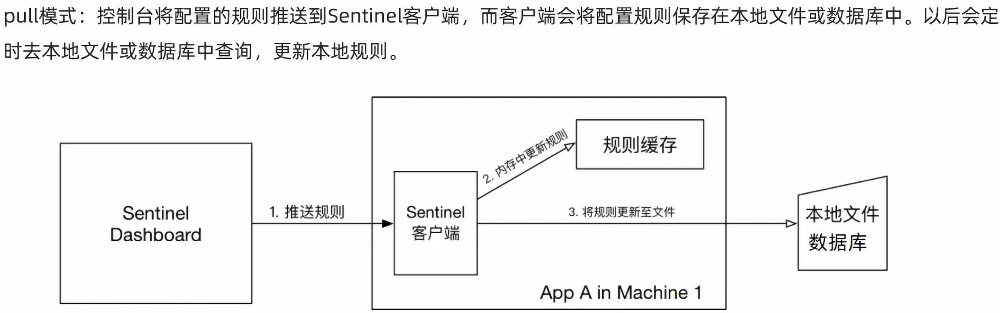

3. **Push 模式（推模式）**  
    这是生产环境推荐使用的模式。控制台将规则推送到**远程配置中心**，配置中心再通过长连接或监听机制，即时通知客户端更新规则。

- **优点**：规则持久化且更新实时性高，几乎无延迟。
- **缺点**：架构相对复杂，需要引入配置中心组件并建立推送通道。

push模式：控制台将配置规则推送到远程配置中心，例如Nacos。Sentinel客户端监听Nacos，获取配置变更的推送消息，完成本地配置更新。

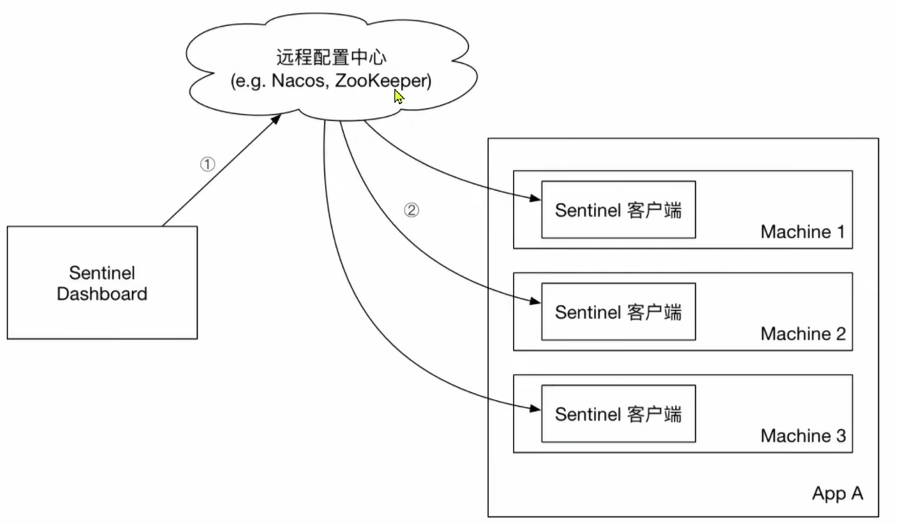

---

### ⅱ. 实现 push 模式

1. **添加依赖**

```
<dependency>
  <groupId>com.alibaba.csp</groupId>
  <artifactId>sentinel-datasource-nacos</artifactId>
</dependency>
```

2. **配置 nacos 地址**

在**order-service**中的**application.yml**文件配置**nacos**地址及监听的配置信息：

```
spring:
  cloud:
    sentinel:
      datasource:
        flow:
          nacos:
            server-addr: localhost:8848 # nacos地址
            dataId: orderservice-flow-rules
            groupId: SENTINEL_GROUP
            rule-type: flow # 还可以是: degrade、authority、param-flow
```

---

配置项详解

这段 YAML 配置定义了 Sentinel 如何从 Nacos 获取流控规则，具体参数含义如下：

- `**server-addr**`：指定 Nacos 服务器的地址，这里是本地 `localhost:8848`。
- `**dataId**`：指定在 Nacos 中存储规则的配置 ID，这里是 `orderservice-flow-rules`。
- `**groupId**`：指定配置所属的组，这里是 `SENTINEL_GROUP`。
- `**rule-type**`：指定该数据源对应的规则类型。这里配置为 `flow`（流控规则），注释中也提示了还可以配置为 `degrade`（降级规则）、`authority`（授权规则）或 `param-flow`（热点参数限流规则）。

通过这种配置，Sentinel 客户端就能连接到 Nacos，并监听指定 `dataId` 和 `groupId` 下的规则变更，实现规则的动态更新。

3. **修改 Sentinel-dashboard 源码****⚠️**

执行命令：**java --add-opens java.base/java.lang=ALL-UNNAMED -jar sentinel-dashboard.jar**

- **Nacos 默认端口**：8848（访问路径通常是 `/nacos`）
- **Sentinel 默认端口**：8848（访问路径通常是 `/sentinel`）

---

# 2. 分布式事务

回顾知识：**事务的 ACID 原则**

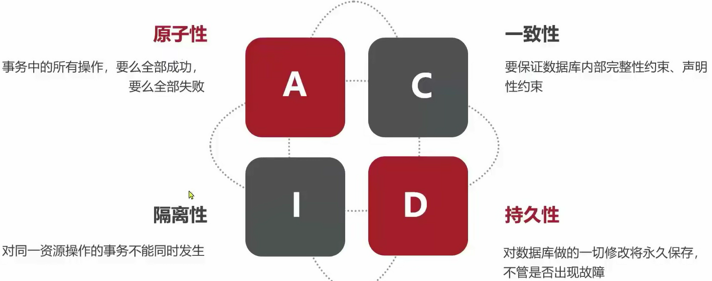

---

在分布式系统下，一个业务跨越多个服务或数据源，每个服务都是一个分支事务，要保证所有分支事务最终状态一致，这样的事务就是**分布式事务**。

核心概念解析

- **跨越边界**：事务不再局限于单个数据库实例，而是横跨多个微服务或不同的数据存储。
- **分支事务**：整个大事务被拆分为各个服务内部的本地事务，每一个都称为“分支事务”。
- **最终一致性**：这是分布式事务的核心目标。无论中间过程如何，所有参与的服务要么全部成功提交，要么全部回滚，确保系统数据的逻辑正确性。

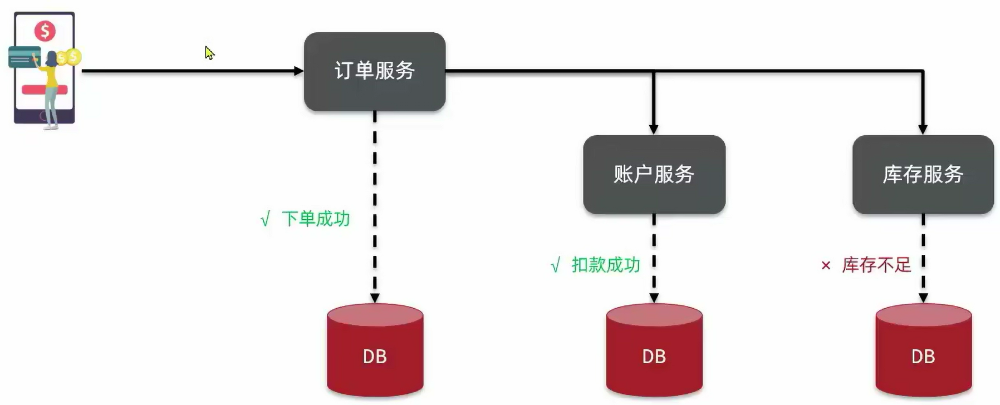

---

## a. 理论基础

### ⅰ. **CAP 定理**

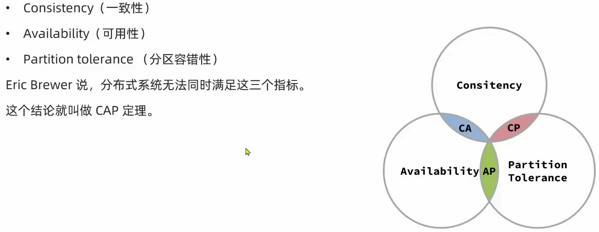

---

1. **Consistency（一致性）**

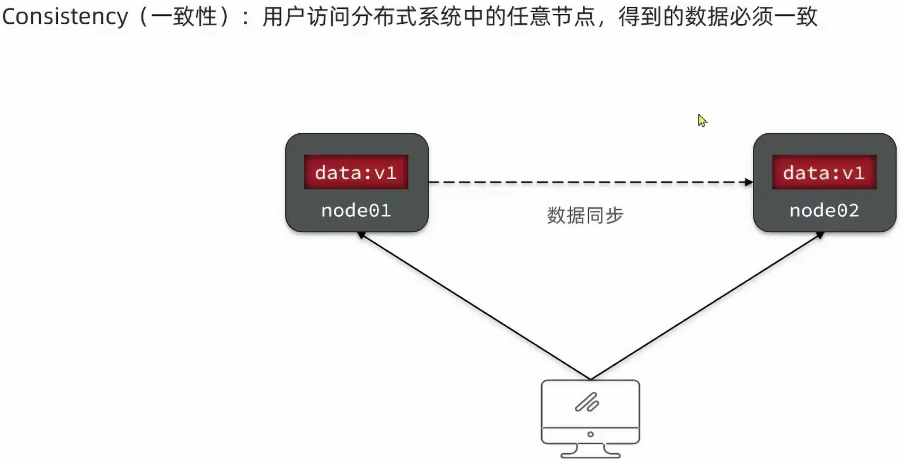

---

2. **Availablity（可用性）**

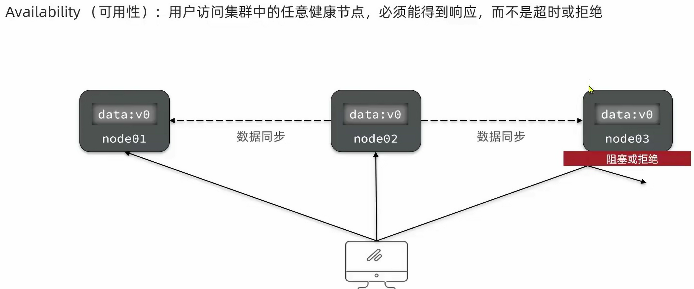

---

3. **Partition tolerance（分区容错性）**

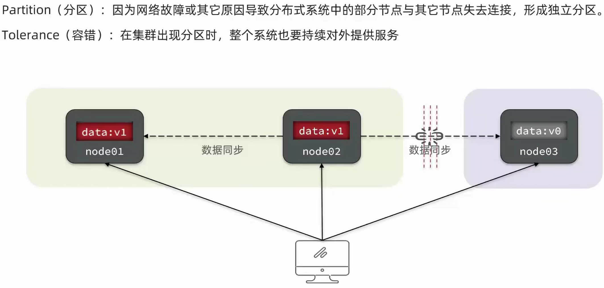

---

1. **分区容错性（P）是必然的**：分布式系统节点通过网络连接，一定会出现分区问题（P）。在分布式系统中，由于网络是不可靠的，节点间的通信随时可能因为网络故障而中断（即发生“分区”）。因此，系统设计必须考虑到这一点，P（Partition Tolerance）是分布式系统必须具备的基础属性。
2. **CP 与 AP 的权衡**：当分区出现时，系统的一致性（C）和可用性（A）就无法同时满足。既然网络分区（P）不可避免，那么当分区真的发生时，系统就必须在 **一致性（Consistency）**和**可用性（Availability）**之间做出选择，无法兼得。

- **选择 CP**：为了保证数据的一致性，系统可能需要暂停服务（牺牲可用性），直到分区恢复。
- **选择 AP**：为了保证服务始终可用，系统可能会允许不同节点间的数据暂时不一致（牺牲强一致性）。

---

### ⅱ. **BASE 理论**

**BASE理论**是对**CAP**的一种**解决思路**，包含三个思想：

1. **基本可用 (Basically Available)**  
    这意味着当系统遇到故障（如服务器宕机、网络抖动）时，不需要保证 100% 的服务可用，而是优先保证核心功能的可用。例如，电商大促时，下单功能必须可用，但评论、推荐等非核心功能可以暂时不可用或降级。
2. **软状态 (Soft State)**  
    这是对“状态”的重新定义。系统不需要时刻保持强一致的状态，允许存在“中间状态”。例如，在转账过程中，A 账户的钱扣了，但 B 账户的钱还没到账，这个“钱在途中”的状态就是软状态。
3. **最终一致性 (Eventually Consistent)**  
    这是 BASE 理论的终极目标。虽然系统允许在一段时间内处于不一致的**软状态**，但必须保证在经过一定时间后，所有节点的数据最终会达到**一致**的状态。这通常通过异步复制、消息队列等机制来实现。

---

**AP 模式 (追求可用性)**

- **核心思想**：优先保证系统可用，允许数据在一段时间内不一致，通过后续的补偿机制（如消息队列、定时任务）来最终达成数据一致。
- **适用场景**：对一致性要求不高的业务，如电商的购物车、收藏夹、用户评论等。
- **优点**：系统响应快，可用性高。
- **缺点**：实现复杂，存在数据不一致的窗口期。

**CP 模式 (追求一致性)**

- **核心思想**：优先保证数据的强一致性，所有子事务必须同步协调，要么全部成功，要么全部失败回滚。在协调过程中，系统会阻塞等待，牺牲了部分可用性。
- **适用场景**：对数据一致性要求极高的业务，如金融转账、订单支付、库存扣减等。
- **优点**：数据绝对可靠，逻辑清晰。
- **缺点**：系统性能较低，可用性较差，容易出现阻塞。

解决分布式事务，各个子系统之间必须能感知到彼此的事务状态，才能保证状态一致，因此需要一个**事务协调者**来协调每一个事务的**参与者（子系统事务）**。这里的子系统事务，称为**分支事务**；有关联的各个分支事务在一起称为**全局事务**。

---

**核心概念解析**

- **事务协调者 (Transaction Coordinator)**：这是分布式事务的“大脑”。它负责发起**全局事务**，协调所有参与者（子系统）的执行，并根据各参与者的反馈决定是提交还是回滚整个事务。常见的实现如 **Seata** 的 **TC (Transaction Coordinator)**。
- **分支事务 (Branch Transaction)**：这是指每个参与分布式事务的微服务或子系统内部的本地事务。例如，在下单流程中，“扣减库存”和“扣减余额”就是两个独立的分支事务。
- **全局事务 (Global Transaction)**：这是指由事务协调者管理的、包含所有相关分支事务的完整业务逻辑。它的目标是确保所有分支事务要么全部成功，要么全部失败，从而实现**跨服务的数据一致性**。

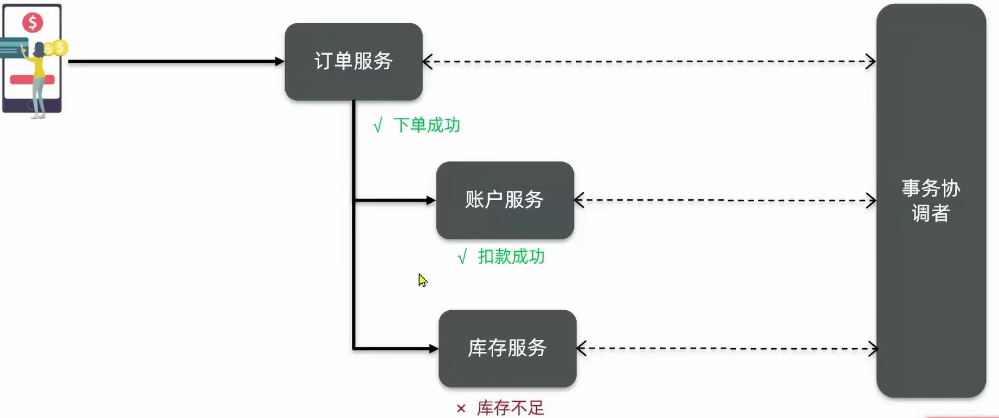

---

## b. 初识 Seata

### ⅰ. Seata 的架构

**Seata** 是 2019 年 1 月份蚂蚁金服和阿里巴巴共同开源的**分布式事务解决方案**。致力于提供高性能和简单易用的分布式事务服务，为用户打造一站式的分布式解决方案。

官网地址：[http://seata.io/](http://seata.io/%EF%BC%8C%E5%85%B6%E4%B8%AD%E7%9A%84%E6%96%87%E6%A1%A3%E3%80%81%E6%92%AD%E5%AE%A2%E4%B8%AD%E6%8F%90%E4%BE%9B%E4%BA%86%E5%A4%A7%E9%87%8F%E7%9A%84%E4%BD%BF%E7%94%A8%E8%AF%B4%E6%98%8E%E3%80%81%E6%BA%90%E7%A0%81%E5%88%86%E6%9E%90%E3%80%82) ，其中的文档、播客中提供了大量的使用说明、源码分析。

---

**Seata 简介**

- **开源背景**：由蚂蚁金服和阿里巴巴在 2019 年 1 月联合开源，是业界主流的**分布式事务框架**之一。
- **核心目标**：旨在解决微服务架构下**跨服务**的**数据一致性问题**，提供高性能、易用的一站式解决方案。
- **官方资源**：官网提供了详尽的文档、使用教程和源码分析，是学习和使用 Seata 的首选入口。

**Seata**事务管理中有三个重要的角色：

- **TC (Transaction Coordinator) - 事务协调者**：维护全局和分支事务的状态，协调全局事务提交或回滚。
- **TM (Transaction Manager) - 事务管理器**：定义全局事务的范围、开始全局事务、提交或回滚全局事务。
- **RM (Resource Manager) - 资源管理器**：管理分支事务处理的资源，与TC交谈以注册分支事务和报告分支事务的状态，并驱动分支事务提交或回滚。

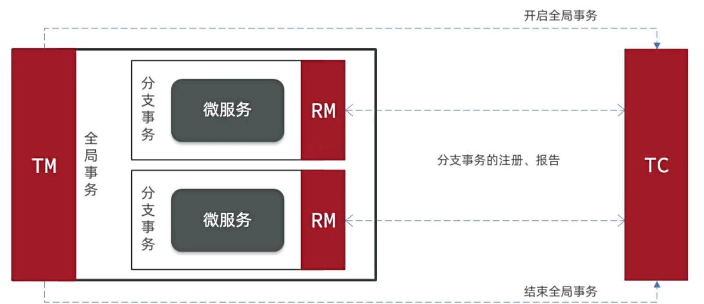

这三个角色共同协作，完成了一次完整的分布式事务流程：

1. **TC (事务协调者)**  
    这是 **Seata** 的核心服务端组件。它**独立部署**，负责维护全局事务和所有分支事务的状态，并根据 **TM** 的指令来驱动全局事务的提交或回滚。
2. **TM (事务管理器)**  
    这是事务的发起方，通常嵌入在业务应用中。它负责开启一个全局事务，并最终决定是提交还是回滚这个全局事务。
3. **RM (资源管理器)**  
    这是事务的参与方，也嵌入在业务应用中。它负责管理具体的数据库资源，向 TC 注册分支事务，并向 TC 报告分支事务的执行状态，最后执行 TC 下发的分支提交或回滚指令。

---

**Seata**提供了四种不同的分布式事务解决方案：

- **XA模式**：强一致性分阶段事务模式，牺牲了一定的可用性，无业务侵入
- **TCC模式**：最终一致的分阶段事务模式，有业务侵入
- **AT模式**：最终一致的分阶段事务模式，无业务侵入，也是Seata的默认模式
- **SAGA模式**：长事务模式，有业务侵入

---

**XA 模式**

- **特点**：基于标准的 XA 协议，提供强一致性，但会牺牲部分可用性。
- **适用场景**：对数据一致性要求极高的场景，如金融核心交易。

**TCC 模式**

- **特点**：通过 **Try**、**Confirm**、**Cancel** 三个接口实现，提供最终一致性，但需要业务方实现这三个接口，侵入性强。
- **适用场景**：对性能要求高、业务逻辑复杂的场景。

**AT 模式**

- **特点**：Seata 的**默认模式**，通过自动生成回滚日志实现最终一致性，对业务无侵入。
- **适用场景**：大多数通用的业务场景，是快速接入分布式事务的首选。

**SAGA 模式**

- **特点**：适用于长事务，通过**正向服务**和**补偿服务**来实现最终一致性，同样有业务侵入。
- **适用场景**：业务流程长、涉及多个服务调用的复杂业务场景。

---

### ⅱ. 部署 TC 服务

启动报错解决办法：

```
%JAVACMD% %JAVA_OPTS% -server --add-opens java.base/java.lang=ALL-UNNAMED --add-opens java.base/java.lang.invoke=ALL-UNNAMED --add-opens java.base/java.lang.reflect=ALL-UNNAMED -Xmx2048m -Xms2048m -Xmn1024m -Xss512k -XX:SurvivorRatio=10 -XX:MetaspaceSize=128m -XX:MaxMetaspaceSize=256m -XX:MaxDirectMemorySize=1024m -XX:-OmitStackTraceInFastThrow -XX:-UseAdaptiveSizePolicy -XX:+HeapDumpOnOutOfMemoryError -XX:HeapDumpPath="%BASEDIR%"/logs/java_heapdump.hprof -XX:+DisableExplicitGC -Xloggc:"%BASEDIR%"/logs/seata_gc.log -verbose:gc -Dio.netty.leakDetectionLevel=advanced -Dlogback.color.disable-for-bat=true -classpath %CLASSPATH% -Dapp.name="seata-server" -Dapp.repo="%REPO%" -Dapp.home="%BASEDIR%" -Dbasedir="%BASEDIR%" io.seata.server.Server %CMD_LINE_ARGS%


```

---

### ⅲ. 微服务集成 Seata

1. **引入依赖**

```
<dependency>
    <groupId>com.alibaba.cloud</groupId>
    <artifactId>spring-cloud-starter-alibaba-seata</artifactId>
    <exclusions>
        <!--版本较低, 1.3.0, 因此排除-->
        <exclusion>
            <artifactId>seata-spring-boot-starter</artifactId>
            <groupId>io.seata</groupId>
        </exclusion>
    </exclusions>
</dependency>
<!--seata starter 采用1.4.2版本-->
<dependency>
    <groupId>io.seata</groupId>
    <artifactId>seata-spring-boot-starter</artifactId>
    <version>${seata.version}</version>
</dependency>
```

2. **配置 application.yml。让微服务通过注册中心找到 seata-tc-server**

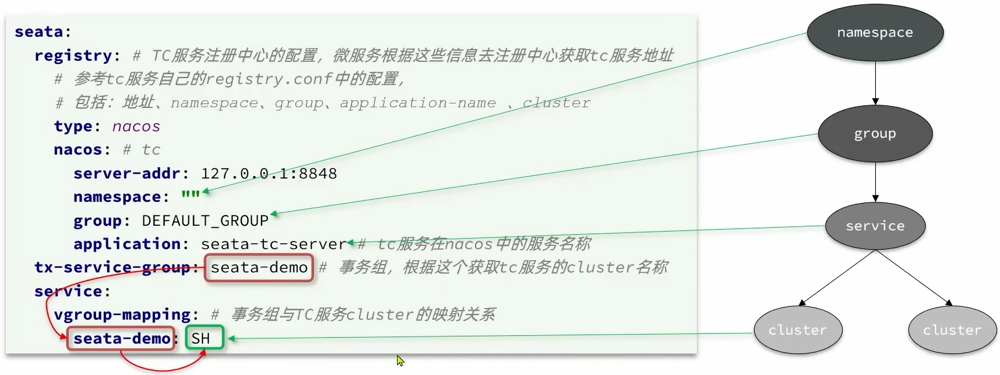

TODO: 其它几个模块都需要配置

---

## c. Seata 实战

### ⅰ. XA 模式

**XA** 规范是 X/Open 组织定义的**分布式事务处理（DTP，Distributed Transaction Processing）标准**，XA 规范描述了全局的 **TM** 与局部的 **RM** 之间的接口，几乎所有主流的数据库都对 XA 规范提供了支持。

---

**XA 规范核心解读**

- **行业标准**：它不是某家公司的私有技术，而是由 X/Open 组织（现 The Open Group）制定的工业标准，这意味着它具有极高的通用性。
- **定义接口**：它主要规定了事务管理器（TM）和资源管理器（RM，通常指数据库）之间应该如何通信。这种标准化的接口使得不同的数据库都能接入统一的分布式事务管理。
- **广泛支持**：正是因为其标准地位，目前市面上几乎所有主流的关系型数据库（如 MySQL、Oracle、PostgreSQL 等）都原生支持 XA 协议，这为分布式事务的实现提供了底层基础。

此处为语雀图册卡片，点击链接查看：[https://www.yuque.com/fangzhou-ze0bw/ckexpk/nhi6a9kd5gxcbnvt#okCQh](https://www.yuque.com/fangzhou-ze0bw/ckexpk/nhi6a9kd5gxcbnvt#okCQh)

---

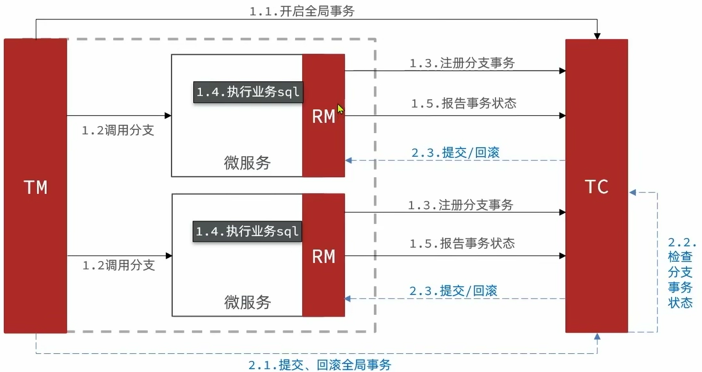

---

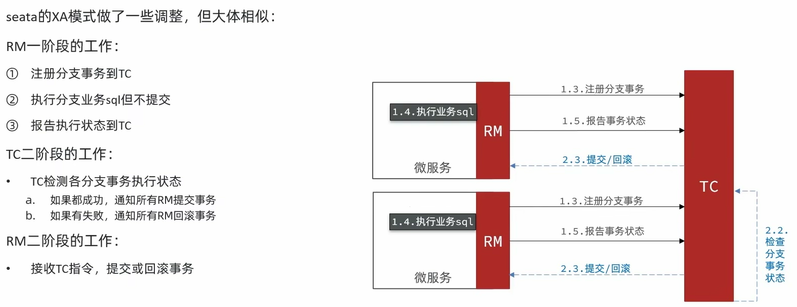

---

**核心优势：数据绝对安全与开发便捷**

1. **强一致性**：这是 XA 模式最大的卖点。它严格遵循 ACID（原子性、一致性、隔离性、持久性）原则，确保所有参与节点要么全部提交，要么全部回滚，数据永远不会处于中间状态。
2. **无代码侵入**：由于大多数主流关系型数据库（如 MySQL、Oracle）都内置了 XA 协议支持，开发者通常只需要在配置层面开启 XA 事务，而无需在业务代码中编写复杂的补偿逻辑或状态管理代码。

**核心劣势：性能瓶颈与架构限制**

1. **性能较差（同步阻塞）**：这是 XA 模式最致命的弱点。在两阶段提交（2PC）的过程中，从“准备阶段”到“提交阶段”结束，数据库资源（行锁、表锁）一直被持有。如果网络波动或协调者处理缓慢，所有相关资源都会被长时间锁定，导致系统吞吐量急剧下降。
2. **架构局限性**：XA 强依赖于关系型数据库的事务能力。在如今微服务架构中，如果涉及非关系型数据库（如 Redis、MongoDB）或跨服务的复杂业务逻辑，XA 模式往往难以直接适用。

**适用场景建议**

鉴于以上优缺点，XA 模式更适合**对数据一致性要求极高，但对并发性能要求不高**的场景，例如银行转账、金融核心账务处理等。对于高并发的互联网业务（如电商下单），通常会优先考虑基于最终一致性的方案（如 TCC 或 AT 模式）。

---

**实现 XA 模式**

Seata的starter已经完成了XA模式的自动装配，实现非常简单，步骤如下：

1. **修改application.yml文件（每个参与事务的微服务），开启XA模式：**

```
seata:
  data-source-proxy-mode: XA # 开启数据源代理的XA模式
```

这是关键的一步，它告诉 Seata 的数据源代理使用 XA 协议来管理事务，而不是默认的 AT 模式。

2. **给发起全局事务的入口方法添加****@GlobalTransactional****注解，**本例中是OrderServiceImpl中的create方法：

```
@Override
@GlobalTransactional
public Long create(Order order) {
    // 创建订单
    orderMapper.insert(order);
    // 扣余额 ...略
    // 扣减库存 ...略
    return order.getId();
}
```

在业务入口方法（这里是订单创建的 `create` 方法）上添加 `@GlobalTransactional` 注解。

- **作用**：这个注解标志着该方法是一个全局事务的发起者（TM）。
- **流程**：当方法执行时，**Seata** 会自动开启全局事务，协调下游的扣余额、扣库存等分支事务。如果方法执行过程中抛出异常，Seata 会触发**全局回滚**。

3. **重启服务并测试**

---

### ⅱ. AT 模式

AT 模式同样是分阶段提交的事务模型，不过却弥补了 XA 模型中资源锁定周期过长的缺陷。

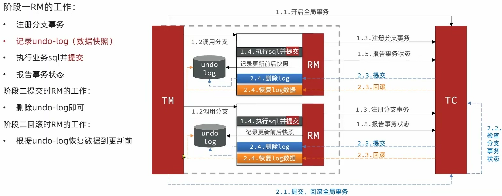

---

案例分析：

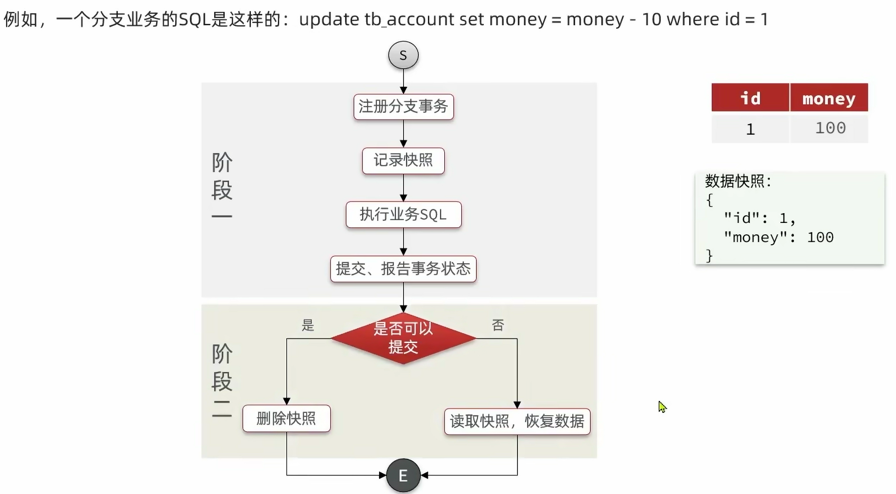

---

#### 1. AT 模式的脏写问题

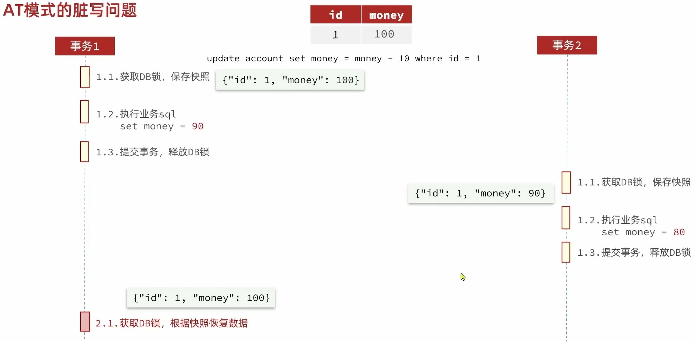

---

#### 2. AT 模式的写隔离

**全局锁**：由 **TC** 记录当前正在操作某行数据的事务，该事务持有全局锁，具备执行权。

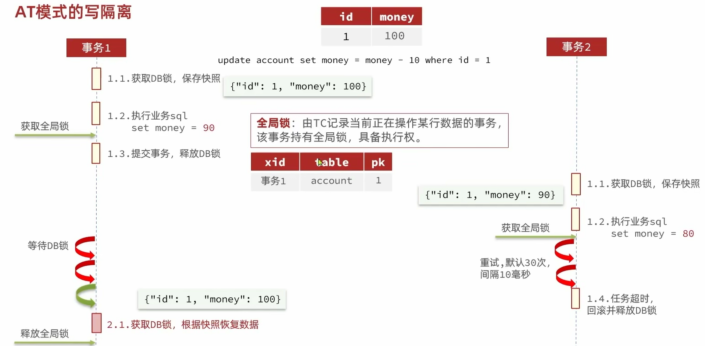

---

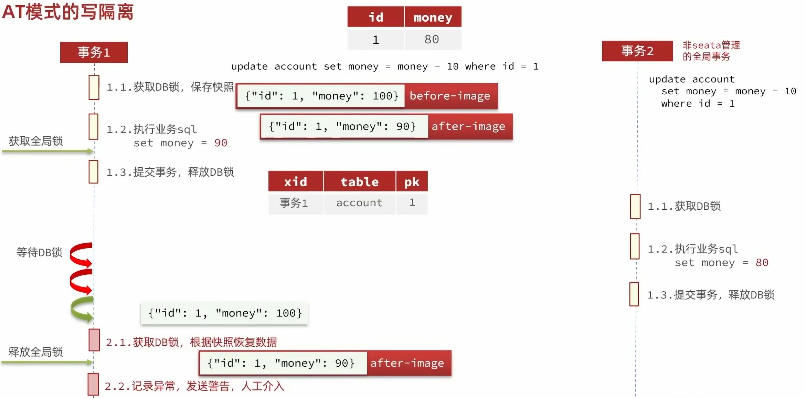

---

#### 3. 实现 AT 模式

1. **导入 SQL 文件**

- 执行 `seata-at.sql` 文件。
- **注意**：`lock_table` 需导入到 **TC 服务** 关联的数据库中；`undo_log` 表需导入到 **微服务** 关联的数据库中。

2. **修改配置文件**

- 打开 `application.yml` 文件。
- 将事务模式修改为 AT 模式。
- **配置示例**：

```
seata:
  data-source-proxy-mode: AT # 开启数据源代理的AT模式
```

3. **重启与测试**

- 重启相关服务，并进行功能测试以验证配置是否生效。

---

### ⅲ. TCC 模式

案例分析：

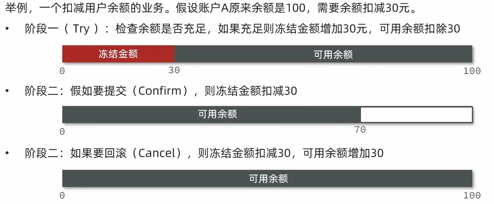

---

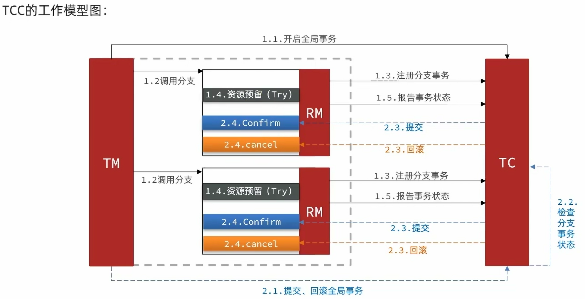

---

TCC 模式将分布式事务拆分为三个明确的操作步骤：

- **Try（尝试）**：负责**资源检查和预留**。在这个阶段，系统会检测业务逻辑所需的资源是否充足，并进行必要的预留（如冻结库存），但不真正执行业务。
- **Confirm（确认）**：负责**业务执行和提交**。如果所有参与者的 Try 阶段都成功，则调用 Confirm 接口真正执行业务，使用 Try 阶段预留的资源。Confirm 操作通常被认为是不会失败的。
- **Cancel（取消）**：负责**预留资源的释放**。如果任一参与者的 Try 阶段失败，则调用 Cancel 接口回滚，释放 Try 阶段预留的资源。

**TCC 模式的优缺点**

- **优点**

1. **性能优异**：一阶段（Try）完成后直接提交本地事务，能够迅速释放数据库资源，不长期锁定数据库。
2. **无全局锁**：相比 AT 模型，TCC 无需生成数据快照，也无需使用全局锁，因此在高并发场景下性能最强。
3. **适用范围广**：不依赖底层数据库的事务特性，而是依赖业务层面的补偿操作，因此可以用于非事务型数据库（如 NoSQL）。

- **缺点**

1. **代码侵入性强**：这是最大的痛点。开发人员需要为每个业务逻辑手动编写 `Try`、`Confirm` 和 `Cancel` 三个接口，开发工作量大且繁琐。
2. **数据一致性**：属于“软状态”，事务只能保证**最终一致性**，在中间状态下数据可能是不一致的。
3. **开发复杂度高**：需要开发人员自行处理 `Confirm` 和 `Cancel` 操作可能失败的情况，必须设计好幂等性控制、空回滚和防悬挂等机制（即文中提到的“幂等处理”）。

---

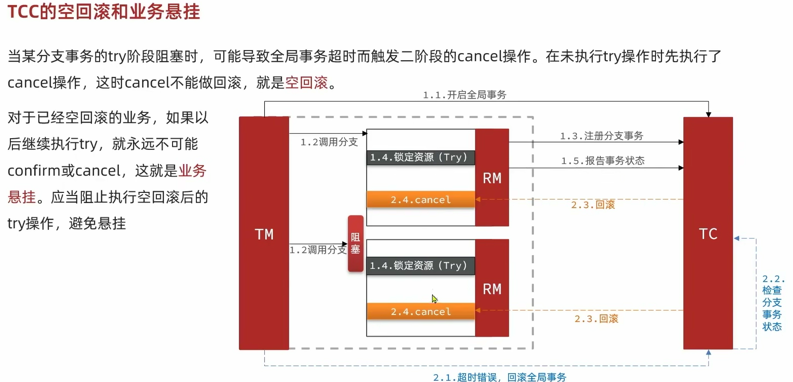

---

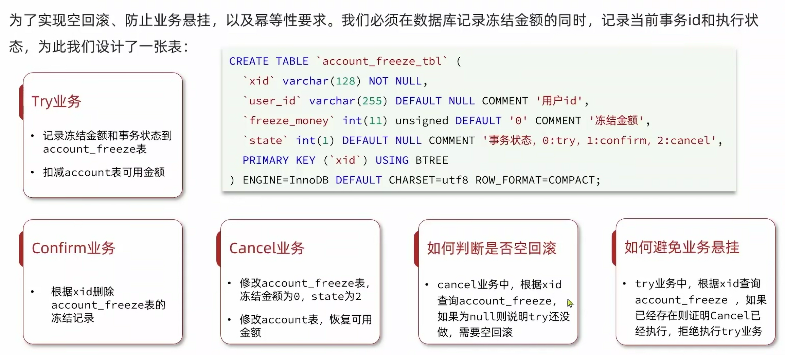

---

在 Java 代码中定义 TCC（Try-Confirm-Cancel）模式的接口。通过注解的方式，将业务逻辑中的 Try、Confirm 和 Cancel 三个方法关联起来。

1. **接口注解**

- 使用 `**@LocalTCC**` 注解来标记这是一个本地的 TCC 服务接口。

2. **Try 方法 (一阶段)**

- 这是 TCC 流程的入口方法，负责资源的检查和预留。
- 必须使用 `**@TwoPhaseBusinessAction**` 注解进行声明。
- `**name**`: 指定当前 Try 操作的名称，通常与 Try 方法名保持一致。
- `**commitMethod**`: 指定二阶段提交时调用的方法名，这里指向 `confirm` 方法。
- `**rollbackMethod**`: 指定二阶段回滚时调用的方法名，这里指向 `cancel` 方法。
- **参数传递**: 使用 `**@BusinessActionContextParameter**` 注解来标记需要传递给二阶段 Confirm 或 Cancel 方法的参数。

3. **Confirm 方法 (二阶段提交)**

- 该方法在 Try 成功后执行，用于真正提交业务。
- 方法名必须与 `**@TwoPhaseBusinessAction**` 注解中的 `commitMethod` 属性值（"confirm"）一致。
- 接收一个 `BusinessActionContext` 类型的参数，用于获取 Try 阶段传递过来的上下文和参数。
- 返回一个 `boolean` 值，表示执行是否成功。

4. **Cancel 方法 (二阶段回滚)**

- 该方法在 Try 失败时执行，用于释放预留的资源。
- 方法名必须与 `@TwoPhaseBusinessAction` 注解中的 `rollbackMethod` 属性值（"cancel"）一致。
- 同样接收 `BusinessActionContext` 参数以获取上下文信息。
- 返回一个 `boolean` 值，表示执行是否成功。

代码结构概览

```
@LocalTCC
public interface TCCService {

    /**
     * Try 逻辑：资源检查和预留
     */
    @TwoPhaseBusinessAction(name = "prepare", commitMethod = "confirm", rollbackMethod = "cancel")
    void prepare(@BusinessActionContextParameter(paramName = "param") String param);

    /**
     * Confirm 逻辑：业务执行和提交
     */
    boolean confirm(BusinessActionContext context);

    /**
     * Cancel 逻辑：预留资源的释放
     */
    boolean cancel(BusinessActionContext context);
}
```

```
@Service
@Slf4j
public class AccountTCCServiceImpl implements AccountTCCService {

    @Autowired
    private AccountMapper accountMapper;

    @Autowired
    private AccountFreezeMapper accountFreezeMapper;

    /**
     * "尝试扣款"阶段（TRY）
     * 作用：当用户下单时，先冻结一部分钱
     * @param userId
     * @param money
     */
    @Override
    public void deduct(String userId, int money) {
        //获取事务id
        String xid = RootContext.getXID();

        //判断freeze中是否有冻结记录，如果有，一定是cancel执行过了
        AccountFreeze oldFreeze = accountFreezeMapper.selectById(xid);
        if (oldFreeze != null){
            //cancel执行过，拒绝业务
            return;
        }

        //1.扣减可用金额
        accountMapper.deduct(userId, money);

        //2.记录冻结金额，事务状态
        AccountFreeze freeze = AccountFreeze.builder()
        .userId(userId)                 // 谁的钱
        .freezeMoney(money)             // 冻了多少
        .state(AccountFreeze.State.TRY) // 状态：尝试阶段
        .xid(xid)                       // 交易身份证号
        .build();

        accountFreezeMapper.insert(freeze);
    }

    /**
     * "确认扣款"阶段（CONFIRM）
     *  作用：如果整个订单流程成功，就彻底完成扣款，删除冻结记录
     * @param ctx
     * @return
     */
    @Override
    public boolean confirm(BusinessActionContext ctx) {
        //1.获取事务id
        String xid = ctx.getXid();

        //2.根据id删除冻结记录
        int count = accountFreezeMapper.deleteById(xid);

        return count == 1;
    }

    /**
     * "取消回滚"阶段（CANCEL）
     * 作用：如果订单失败，把钱退回去（这是最复杂的方法）
     * @param ctx
     * @return
     */
    @Override
    public boolean cancel(BusinessActionContext ctx) {

        String xid = ctx.getXid();

        String userId = ctx.getActionContext("userId").toString();

        // 先查一下有没有冻结记录
        AccountFreeze freeze = accountFreezeMapper.selectById(xid);

        //空回滚判断：如果freeze是null，说明try阶段根本没执行
        if (freeze == null){
            //证明try没有执行，需要"空回滚"（记个记录，避免重复处理）
            freeze = AccountFreeze.builder()
            .userId(userId)
            .freezeMoney(0)                     // 没扣钱，所以是0
            .state(AccountFreeze.State.CANCEL)
            .xid(xid)
            .build();
            accountFreezeMapper.insert(freeze);

            return true;
        }
        //幂等判断：如果已经是CANCEL状态，说明之前处理过了
        if (freeze.getState() == AccountFreeze.State.CANCEL){
            //已经处理过cancel了，无需重复处
            return true;
        }

        //1.恢复可用金额（把冻结的钱还回去）
        accountMapper.refund(freeze.getUserId(), freeze.getFreezeMoney());

        //2.将冻结金额清零，状态改为cancel
        freeze.setFreezeMoney(0);
        freeze.setState(AccountFreeze.State.CANCEL);
        int result = accountFreezeMapper.updateById(freeze);

        return result == 1;
    }
}
```

---

### ⅳ. Saga 模式

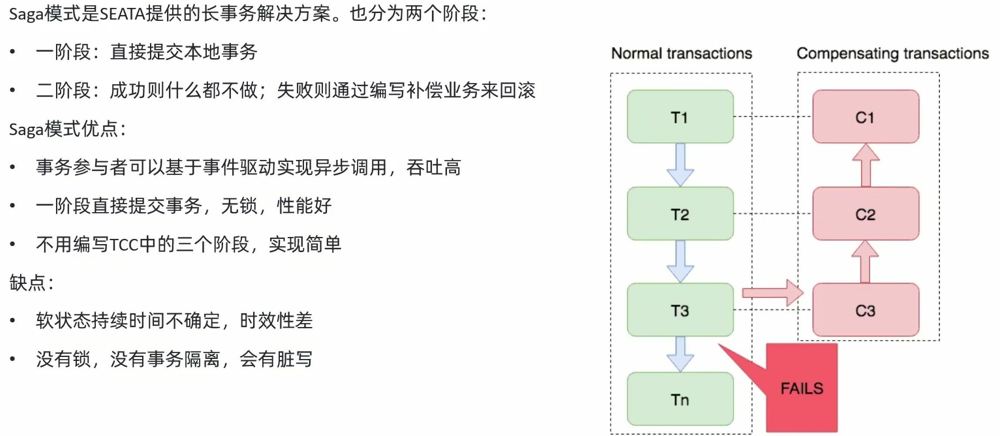

---

### ⅴ. 四种模式对比

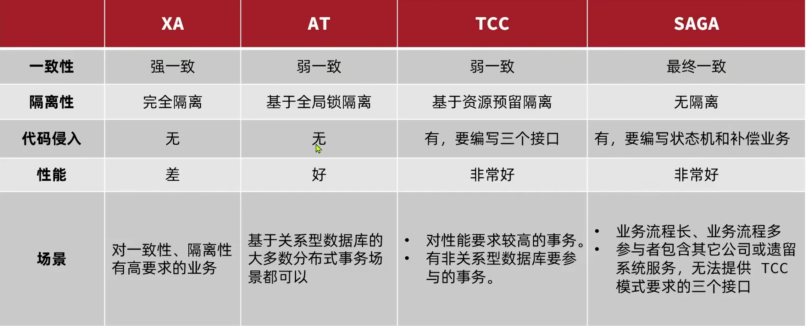

---

### ⅵ. 最大努力通知

这是一种实现**最终一致性**的分布式事务方案。

- **核心机制**：通过**消息通知**的方式，告知事务的参与方去执行相应的业务逻辑。
- **可靠性保障**：如果业务执行失败，系统会进行**多次通知**（重试），尽最大努力确保对方最终能收到并处理。
- **架构特点**：该方案**无需**引入任何复杂的分布式事务组件，实现相对轻量。

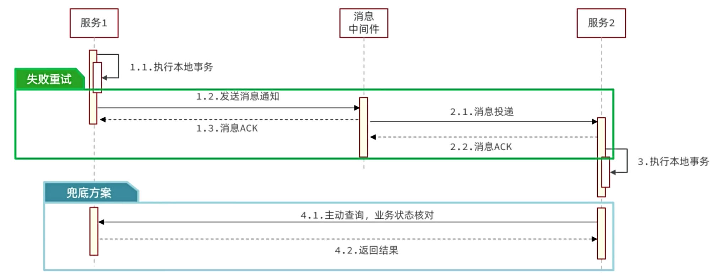

---

## d. 高可用

### ⅰ. 高可用集群结构

**TC 的异地多机房容灾架构**

TC 服务作为 Seatea 的核心服务，一定要保证高可用和异地容灾。

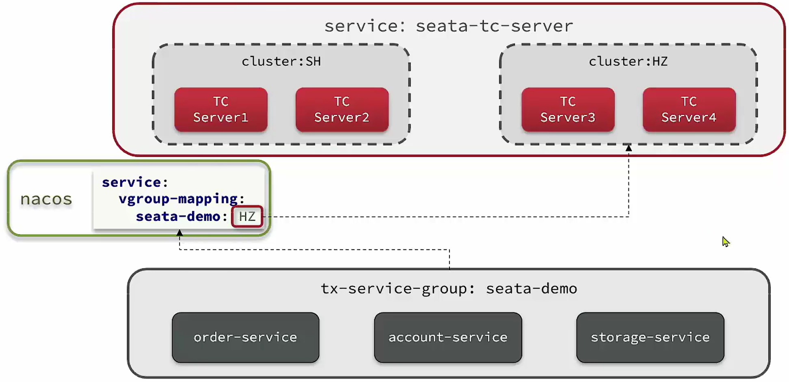

---

### ⅱ. 实现高可用集群

TC服务的高可用和异地容灾

1. **模拟异地容灾的TC集群**

计划启动两台seata的tc服务节点：

|   |   |   |   |
|---|---|---|---|
|节点名称|ip地址|端口号|集群名称|
|seata|127.0.0.1|8091|SH|
|seata2|127.0.0.1|8092|HZ|

之前我们已经启动了一台seata服务，端口是8091，集群名为SH。

现在，将seata目录复制一份，起名为seata2

修改**seata2/conf/registry.conf**内容如下：

```
registry {
  # tc服务的注册中心类，这里选择nacos，也可以是eureka、zookeeper等
  type = "nacos"

  nacos {
    # seata tc 服务注册到 nacos的服务名称，可以自定义
    application = "seata-tc-server"
    serverAddr = "127.0.0.1:8848"
    group = "DEFAULT_GROUP"
    namespace = ""
    cluster = "HZ"
    username = "nacos"
    password = "nacos"
  }
}

config {
  # 读取tc服务端的配置文件的方式，这里是从nacos配置中心读取，这样如果tc是集群，可以共享配置
  type = "nacos"
  # 配置nacos地址等信息
  nacos {
    serverAddr = "127.0.0.1:8848"
    namespace = ""
    group = "SEATA_GROUP"
    username = "nacos"
    password = "nacos"
    dataId = "seataServer.properties"
  }
}
```

进入seata2/bin目录，然后运行命令：

```
seata-server.bat -p 8092
```

打开nacos控制台，查看服务列表：

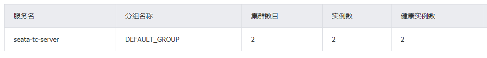

点进详情查看：

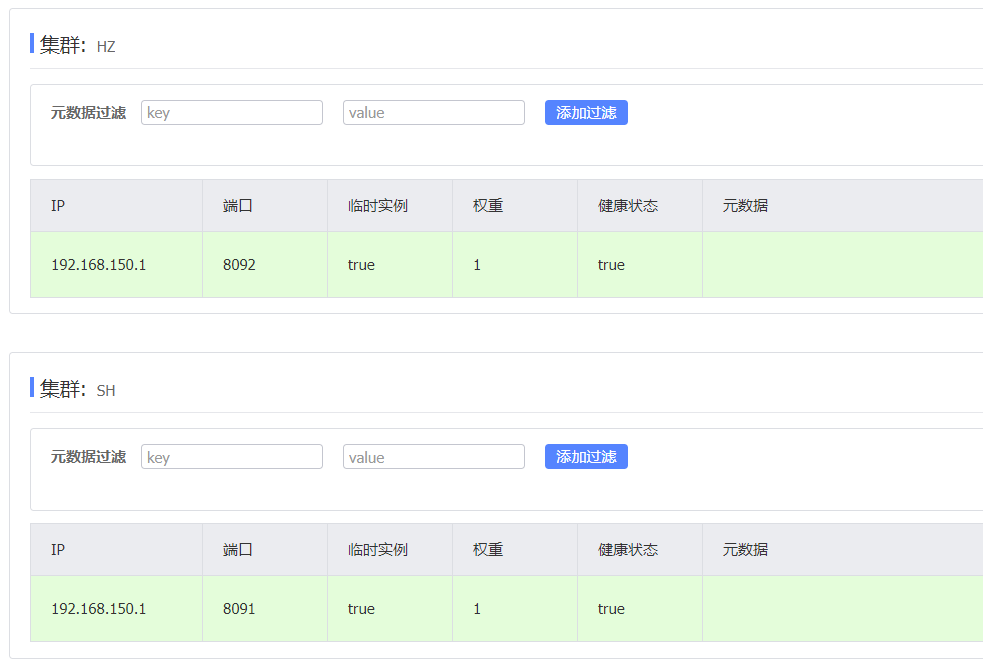

2. **将事务组映射配置到nacos**

接下来，我们需要将tx-service-group与cluster的映射关系都配置到nacos配置中心。

新建一个配置：

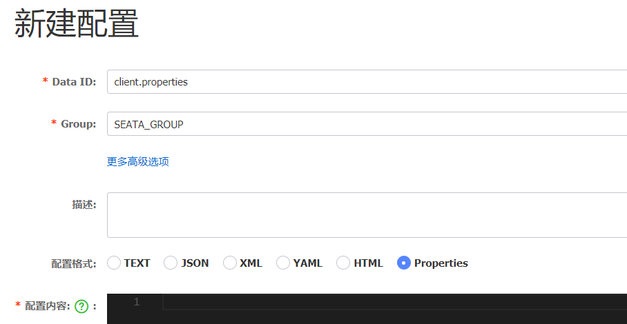

配置的内容如下：

```
# 事务组映射关系
service.vgroupMapping.seata-demo=SH

service.enableDegrade=false
service.disableGlobalTransaction=false
# 与TC服务的通信配置
transport.type=TCP
transport.server=NIO
transport.heartbeat=true
transport.enableClientBatchSendRequest=false
transport.threadFactory.bossThreadPrefix=NettyBoss
transport.threadFactory.workerThreadPrefix=NettyServerNIOWorker
transport.threadFactory.serverExecutorThreadPrefix=NettyServerBizHandler
transport.threadFactory.shareBossWorker=false
transport.threadFactory.clientSelectorThreadPrefix=NettyClientSelector
transport.threadFactory.clientSelectorThreadSize=1
transport.threadFactory.clientWorkerThreadPrefix=NettyClientWorkerThread
transport.threadFactory.bossThreadSize=1
transport.threadFactory.workerThreadSize=default
transport.shutdown.wait=3
# RM配置
client.rm.asyncCommitBufferLimit=10000
client.rm.lock.retryInterval=10
client.rm.lock.retryTimes=30
client.rm.lock.retryPolicyBranchRollbackOnConflict=true
client.rm.reportRetryCount=5
client.rm.tableMetaCheckEnable=false
client.rm.tableMetaCheckerInterval=60000
client.rm.sqlParserType=druid
client.rm.reportSuccessEnable=false
client.rm.sagaBranchRegisterEnable=false
# TM配置
client.tm.commitRetryCount=5
client.tm.rollbackRetryCount=5
client.tm.defaultGlobalTransactionTimeout=60000
client.tm.degradeCheck=false
client.tm.degradeCheckAllowTimes=10
client.tm.degradeCheckPeriod=2000

# undo日志配置
client.undo.dataValidation=true
client.undo.logSerialization=jackson
client.undo.onlyCareUpdateColumns=true
client.undo.logTable=undo_log
client.undo.compress.enable=true
client.undo.compress.type=zip
client.undo.compress.threshold=64k
client.log.exceptionRate=100
```

3. **微服务读取nacos配置**

接下来，需要修改每一个微服务的application.yml文件，让微服务读取nacos中的client.properties文件：

```
seata:
  config:
    type: nacos
    nacos:
      server-addr: 127.0.0.1:8848
      username: nacos
      password: nacos
      group: SEATA_GROUP
      data-id: client.properties
```

重启微服务，现在微服务到底是连接tc的SH集群，还是tc的HZ集群，都统一由nacos的**client.properties**来决定了。

---

# 3. 分布式缓存

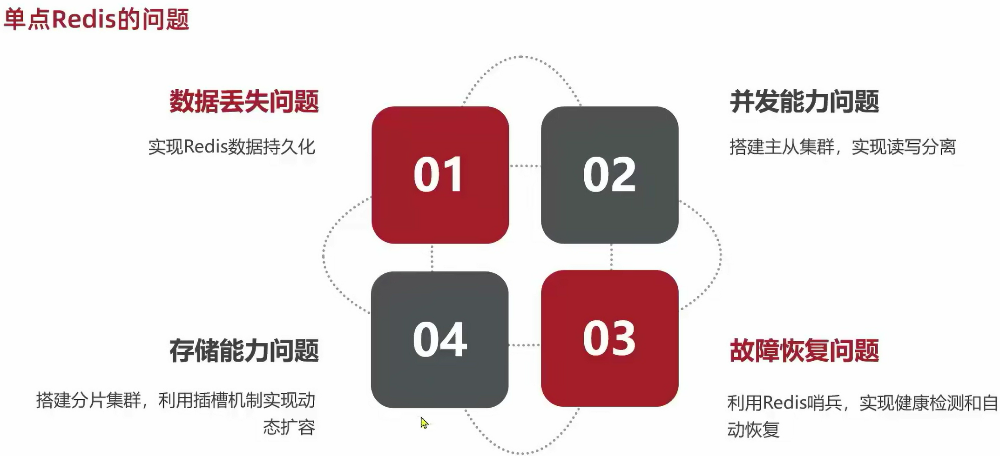

---

## a. Redis 持久化（数据丢失问题）

### ⅰ. **RDB 持久化**

1. 核心定义

- **全称**：Redis Database Backup file（Redis数据备份文件）。
- **别名**：Redis数据快照。
- **核心原理**：将内存中的所有数据记录到磁盘中。

2. 主要作用

- **数据恢复**：当 Redis 实例发生故障并重启后，系统会从磁盘读取该快照文件，从而恢复之前的数据。

3. 文件存储

- **文件名**：快照文件被称为 **RDB 文件**。
- **默认位置**：默认保存在 Redis 的当前运行目录下。

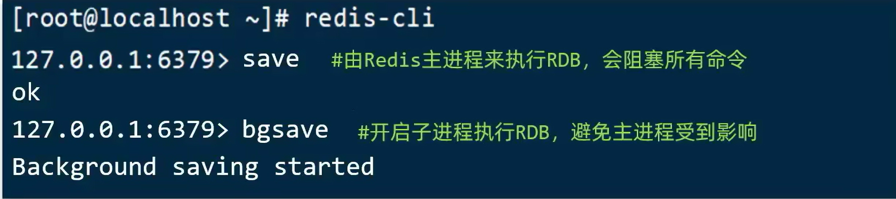

**(默认)Redis 停机时会执行一次 RDB**

---

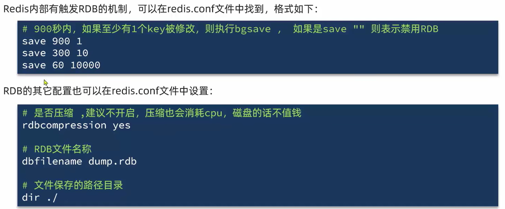

---

#### 1. bgsave 的核心流程

1. **Fork 子进程**：`bgsave` 开始执行时，Redis 主进程会通过 `fork` 系统调用创建一个子进程。
2. **共享内存**：子进程创建后，它与主进程**共享**同一份内存数据，而不是立即复制所有数据。
3. **写入 RDB**：子进程负责将共享内存中的数据读取并写入到 **RDB** 文件中，完成持久化操作。

#### 2. Copy-on-Write（写时复制）技术详解

这是 `fork` 操作能够高效运行的关键机制，它决定了主进程和子进程如何管理内存：

- **读操作（无开销）**：当主进程执行**读操作**时，它和子进程一样，直接访问共享的内存数据，没有任何额外的性能损耗。
- **写操作（按需复制）**：当主进程执行**写操作**（修改数据）时，操作系统才会真正地将需要修改的那部分内存数据**拷贝**一份副本给主进程，然后在副本上执行写操作。这样保证了子进程看到的数据是 `fork` 发生那一刻的“快照”，而主进程可以继续处理新的写请求，互不干扰。

这种机制极大地减少了 `bgsave` 期间的内存开销和 CPU 消耗，是 Redis 实现高性能持久化的重要手段。

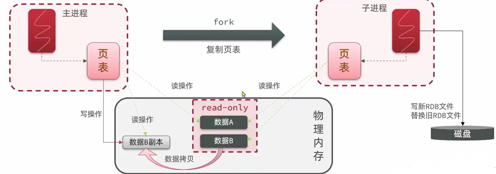

---

#### 3. RDB 的核心缺点

1. **数据丢失风险**

- **原因**：RDB 是定时快照，执行间隔时间通常较长。
- **后果**：如果 Redis 在两次快照之间发生故障（如断电、崩溃），这段时间内写入的数据将无法恢复，存在丢失风险。

2. **性能开销大**

- **原因**：RDB 生成过程涉及多个耗时操作。
- **具体环节**：

- **Fork 子进程**：虽然使用了写时复制，但在数据量大时，Fork 操作本身会阻塞主线程。
- **压缩与写入**：子进程需要对内存数据进行压缩并写入磁盘，这会消耗大量的 CPU 和 I/O 资源，可能导致 Redis 服务响应变慢。

---

### ⅱ. **AOF 持久化**

**AOF 核心定义：**

- **全称**：**Append Only File**（追加文件）。
- **工作原理**：Redis 会将处理的**每一个写命令**都记录在 AOF 文件中。
- **本质**：它本质上是一个**命令日志文件**，记录了服务器执行的所有写操作，用于在重启时重新执行这些命令来恢复数据。

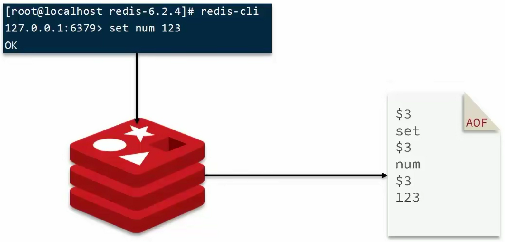

---

#### 1. AOF 配置

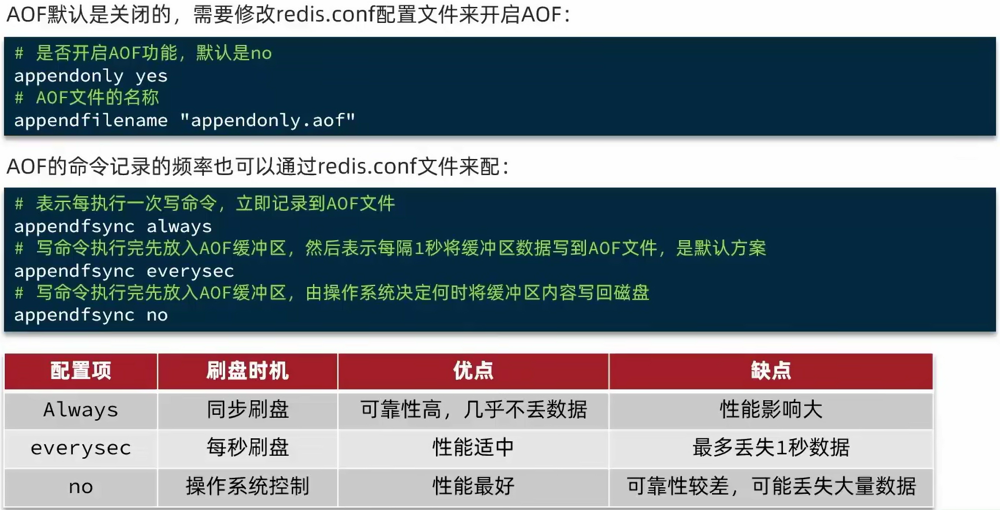

---

#### 2. bgrewriteaof 命令

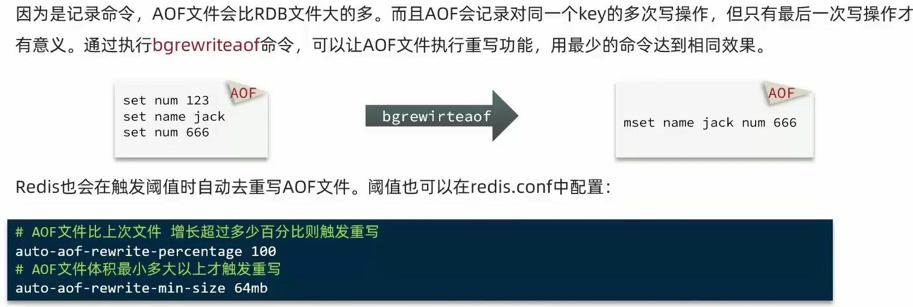

---

### ⅲ. 总结与对比

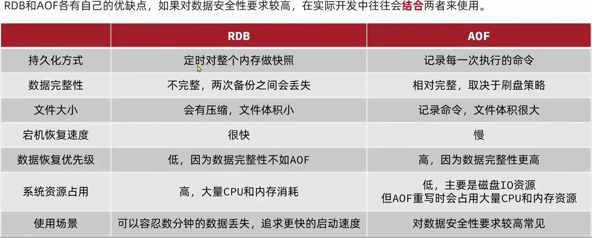

---

## b. Redis 主从集群（并发能力问题）

### ⅰ. 搭建主从集群

单节点的 Redis 的并发能力是有上限的，要进一步提高 Redis 的并发能力，就需要搭建主从集群，实现读写分离

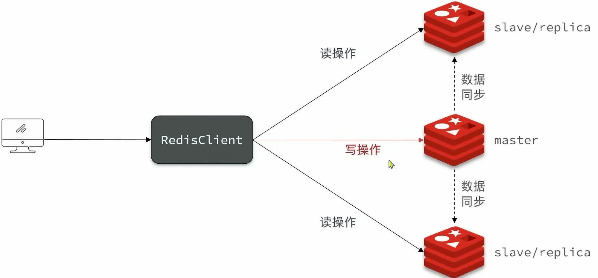

---

详细搭建步骤：[https://my.feishu.cn/wiki/Jck7w4GBSia4sukQn1vc9s3anMf](https://my.feishu.cn/wiki/Jck7w4GBSia4sukQn1vc9s3anMf)

---

### ⅱ. 主从数据同步原理 （全量同步）

主从第一次同步时**全量同步**：

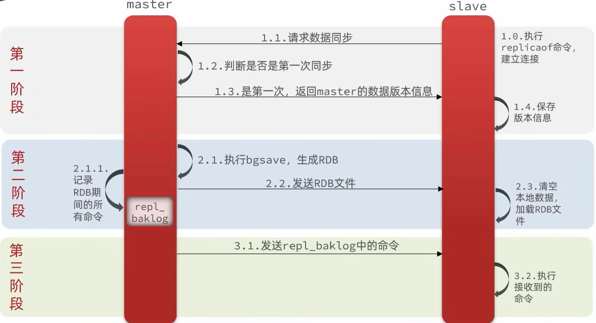

---

1. **触发条件**：当 Slave 请求增量同步，但 Master 发现双方的 `replid` 不一致（通常意味着 Slave 断线时间过长，或者 Master 发生了故障转移，导致 `replid` 改变），Master 会拒绝增量同步请求。
2. **全量同步启动**：

- **Master 端**：执行 `bgsave` 生成当前的 RDB 快照文件，并将其发送给 Slave。同时，Master 会开启一个缓冲区（`repl_backlog`），记录在生成 RDB 期间产生的所有新的写命令。
- **Slave 端**：接收到 RDB 文件后，首先清空自己本地的旧数据，然后加载 Master 发来的 RDB 文件，使数据状态与 Master 生成快照时一致。

3. **最终一致性**：

- Master 将缓冲区（`repl_baklog`）中记录的增量命令发送给 Slave。
- Slave 执行这些命令，从而追上 Master 的最新状态，完成同步。

---

#### 1. 核心判断机制

Master 节点通过对比 Slave 发送过来的两个关键信息——`Replication Id` 和 `offset`，来决定是进行**全量同步**还是**部分同步**。

#### 2. Replication Id (replid)

- **定义**：数据集的唯一标记。
- **规则**：

- 每一个 Master 节点都有一个唯一的 `replid`。
- 当 Slave 与 Master 建立连接并开始同步时，Slave 会继承 Master 的 `replid`。

- **作用**：如果 Master 和 Slave 的 `replid` 一致，说明它们之前属于同一个数据集，Slave 可能只是短暂断线，有机会进行部分同步。

#### 3. offset (偏移量)

- **定义**：记录数据同步进度的指标。
- **规则**：

- 随着 Master 将写命令记录在 `repl_backlog`（复制积压缓冲区）中，offset 会逐渐增大。
- Slave 在完成同步后，也会记录自己当前处理到的 offset。

- **作用**：

- 如果 Slave 的 offset 小于 Master 的 offset，说明 Slave 的数据落后于 Master，需要更新。
- Master 会根据 offset 的差值，判断 `repl_backlog` 中是否还存有 Slave 缺失的那部分命令数据。

#### 4. 总结流程

当 Slave 尝试与 Master 同步数据时，必须向 Master 声明自己的 `replication id` 和 `offset`。Master 收到后：

1. **检查** `**replid**`：判断 Slave 是否是自己的“旧部”。
2. **检查** `**offset**`：判断 Slave 落后了多少数据。

只有当 `replid` 匹配，且缺失的数据仍在 `repl_backlog` 缓冲区内时，Master 才会执行**部分同步**（只发送缺失的命令）；否则，将触发**全量同步**（重新生成 RDB 并发送）。

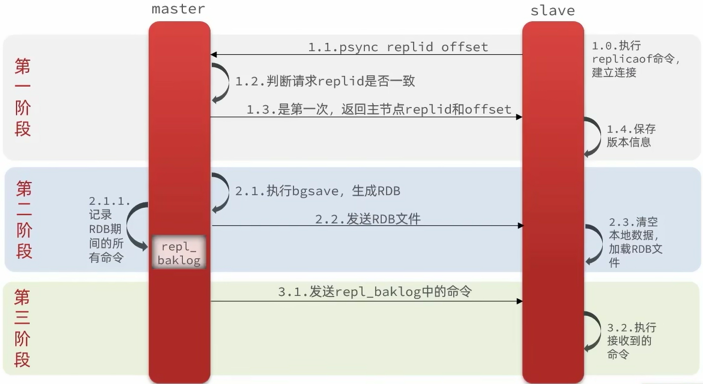

---

### ⅲ. 主从数据同步原理 （增量同步）

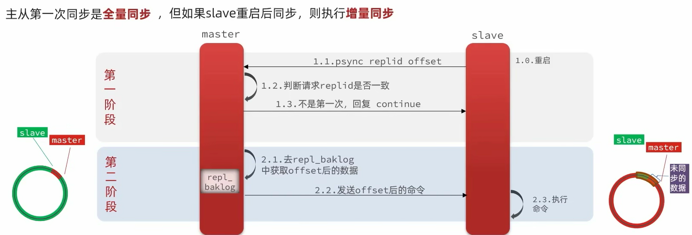

- **repl_backlog 的特性**：其大小有上限，是一个固定大小的环形缓冲区。当写满后，新的数据会覆盖最早的数据。
- **对同步的影响**：如果 Slave 节点断开连接的时间过长，导致 Master 的 `repl_backlog` 中尚未同步给 Slave 的那部分数据被新数据覆盖，那么 Slave 就无法再通过增量同步来追赶 Master。
- **最终结果**：在这种情况下，系统将无法基于 `log` 进行增量同步，只能退而求其次，再次执行一次**全量同步**。

Redis 主从复制中的“部分重同步”（增量同步）是有条件的。它依赖于 `repl_backlog` 的大小和 Slave 的断线时长。如果断线时间超过了 `repl_backlog` 能容纳的写操作时间窗口，就必须进行成本更高的全量同步。

---

### ⅳ. 优化 Redis 主从集群

优化 Redis 主从集群的四个关键策略，旨在提升性能、减少磁盘 I/O 并增强系统的稳定性。

1. **启用无磁盘复制**  
    在 Master 节点中配置 `**repl-diskless-sync yes**`。这个设置可以让 Master 在生成 RDB 快照后，不先写入磁盘，而是直接通过网络将数据流式传输给 Slave。这能有效避免在全量同步时产生大量的磁盘 I/O 操作，尤其适合**磁盘性能较差**或**网络带宽充足**的环境。
2. **控制单节点内存大小**  
    建议 Redis 单个节点的内存占用不要设置得过大。因为 RDB 持久化和主从全量同步都需要 fork 子进程，而 fork 操作的耗时与内存数据量成正比。内存过大不仅会导致 fork 阻塞主线程时间变长，还会增加 RDB 文件生成和传输的磁盘 I/O 压力。
3. **增大复制积压缓冲区（repl_backlog）**  
    适当提高 `**repl_backlog**` 的大小。`repl_backlog` 是一个环形缓冲区，用于支持部分重同步（增量同步）。增大它的容量可以容纳更长时间的写命令，从而在 Slave 短暂断线后，有更大的概率通过增量同步快速恢复，避免触发昂贵的全量同步。
4. **采用主-从-从链式结构**  
    限制单个 Master 节点直接挂载的 Slave 数量。如果一个 Master 需要同时向大量 Slave 进行全量同步，会消耗巨大的网络和 CPU 资源，严重影响 Master 的性能。解决方案是采用**“主-从-从”**的链式复制结构，让部分 Slave 作为其他 Slave 的 Master，从而分散同步压力，减轻主节点的负载。

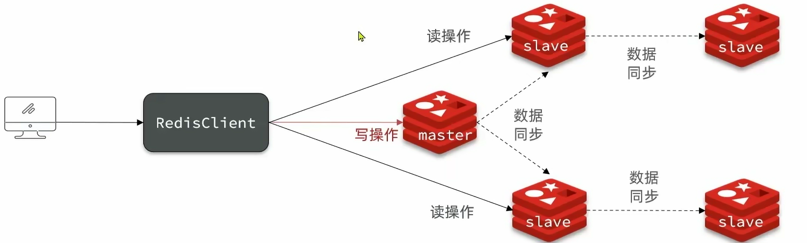

---

### ⅴ. 小结

1. 简述全量同步和增量同步区别？

- **全量同步**：master将完整内存数据生成RDB，发送RDB到slave。后续命令则记录在repl_baklog，逐个发送给slave。
- **增量同步**：slave提交自己的offset到master，master获取repl_baklog中从offset之后的命令给slave。

2. 什么时候执行全量同步？

- slave节点第一次连接master节点时。
- slave节点断开时间太久，repl_baklog中的**offset**已经被**覆盖**时。

3. 什么时候执行增量同步？

- slave节点断开又恢复，并且在repl_baklog中能找到**offset**时。

---

## c. Redis 哨兵集群（故障恢复问题）

### ⅰ. 哨兵的作用和原理

#### 1. Sentinel 的三个作用是什么❓️

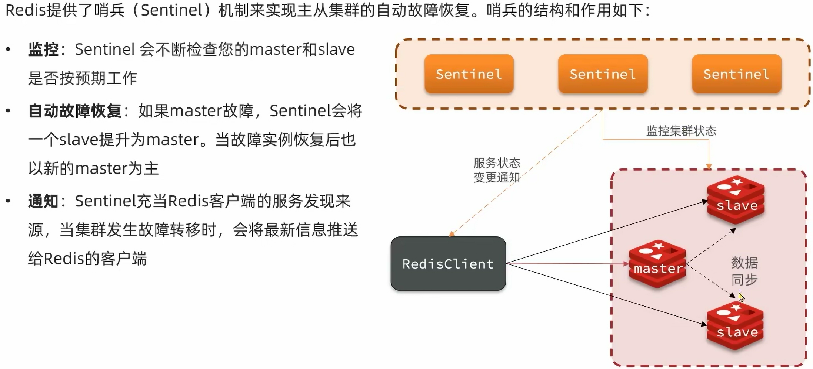

---

#### 2. Sentinel 如何判断一个 Redis 实例是否健康❓️

1. **心跳监测**  
    Sentinel 基于**心跳机制**工作，它会**每隔 1 秒**向集群中的每个实例发送 `**ping**` 命令，以此来探测实例是否存活。
2. **主观下线 (Subjectively Down, SDOWN)**

- **定义**：这是单个 Sentinel 节点的独立判断。
- **触发条件**：如果某个 Sentinel 节点发现某个实例（Master 或 Slave）未在规定的时间（`down-after-milliseconds`）内响应 `ping` 命令，该 Sentinel 节点就会认为这个实例已经**主观下线**。

3. **客观下线 (Objectively Down, ODOWN)**

- **定义**：这是 Sentinel 集群的集体共识，通常用于判断 Master 节点是否真正下线，以触发故障转移。
- **触发条件**：当一个 Sentinel 节点判断 Master 主观下线后，它会询问其他 Sentinel 节点的意见。如果认为该 Master 主观下线的 Sentinel 数量超过了配置中指定的阈值（`quorum`），那么该 Master 就会被标记为**客观下线**。
- **配置建议**：图片中特别提到，`**quorum**` 的值最好超过 Sentinel 实例总数量的**一半**，以确保决策的准确性，防止因网络波动导致的误判。

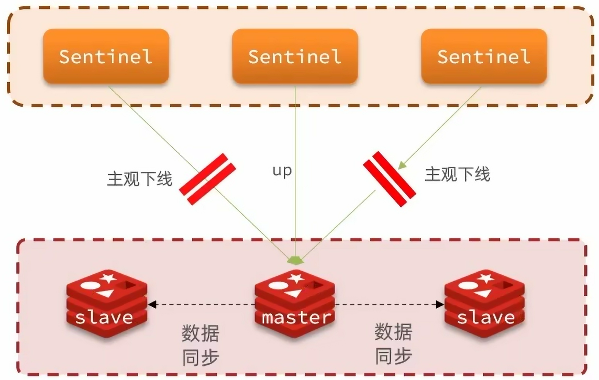

---

#### 3. ⚠️故障转移步骤有哪些❓️

**一旦发现master故障，sentinel需要在salve中选择一个作为新的master，选择依据是这样的：**

- 首先会判断slave节点与master节点断开时间长短，如果超过指定值（down-after-milliseconds * 10）则会排除该slave节点
- 然后判断slave节点的slave-priority值，越小优先级越高，如果是0则永不参与选举
- 如果slave-prority一样，则判断slave节点的offset值，越大说明数据越新，优先级越高
- 最后是判断slave节点的运行id大小，越小优先级越高。

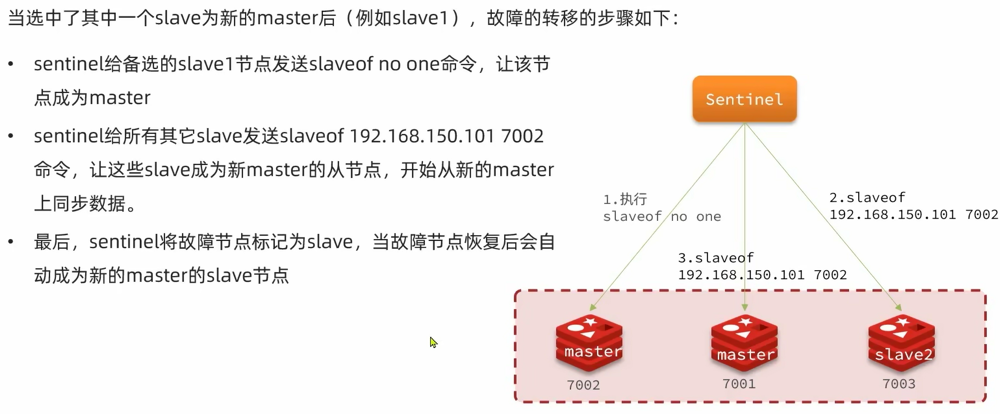

---

### ⅱ. 搭建哨兵架构

参考课前资料《Redis 集群.md》

---

### ⅲ. RedisTemplate 的哨兵模式

- **问题背景**：在 Sentinel 集群监管下的 Redis 主从集群，其节点会因为自动故障转移而发生变化（例如，原来的 Slave 变成了新的 Master）。
- **客户端要求**：Redis 的客户端必须能够感知到这种拓扑结构的变化，并及时更新连接信息，以确保服务不中断。
- **解决方案**：Spring 的 `RedisTemplate` 底层利用了 `**lettuce**` 客户端，实现了节点变化的**自动感知**和连接的**自动切换**。

---

#### 1. 在pom文件中引入redis的starter依赖：

```
<dependency>
    <groupId>org.springframework.boot</groupId>
    <artifactId>spring-boot-starter-data-redis</artifactId>
</dependency>
```

#### 2. 然后在配置文件application.yml中指定sentinel相关信息：

```
spring:
  redis:
    sentinel:
      master: mymaster # 指定master名称
      nodes: # 指定redis-sentinel集群信息
        - 192.168.150.101:27001
        - 192.168.150.101:27002
        - 192.168.150.101:27003
```

#### 3. 配置主从读写分离

```
@Bean
public LettuceClientConfigurationBuilderCustomizer configurationBuilderCustomizer() {
    return configBuilder -> configBuilder.readFrom(ReadFrom.REPLICA_PREFERRED);
}
```

这里的ReadFrom是配置Redis的读取策略，是一个枚举，包括下面选择：

- **MASTER**：从主节点读取
- **MASTER_PREFERRED**：优先从master节点读取，master不可用才读取replica
- **REPLICA**：从slave（replica）节点读取
- **REPLICA_PREFERRED**：优先从slave（replica）节点读取，所有的slave都不可用才读取master

---

## d. Redis 分片集群（存储能力问题）

### ⅰ. 搭建分片集群

主从和哨兵模式虽然能解决高可用和高并发读的问题，但仍存在两个核心瓶颈：

- **海量数据存储问题**：单个主节点的存储容量有限，无法应对数据量持续增长的需求。
- **高并发写的问题**：所有的写操作都集中在主节点上，当写入请求量巨大时，主节点会成为性能瓶颈。

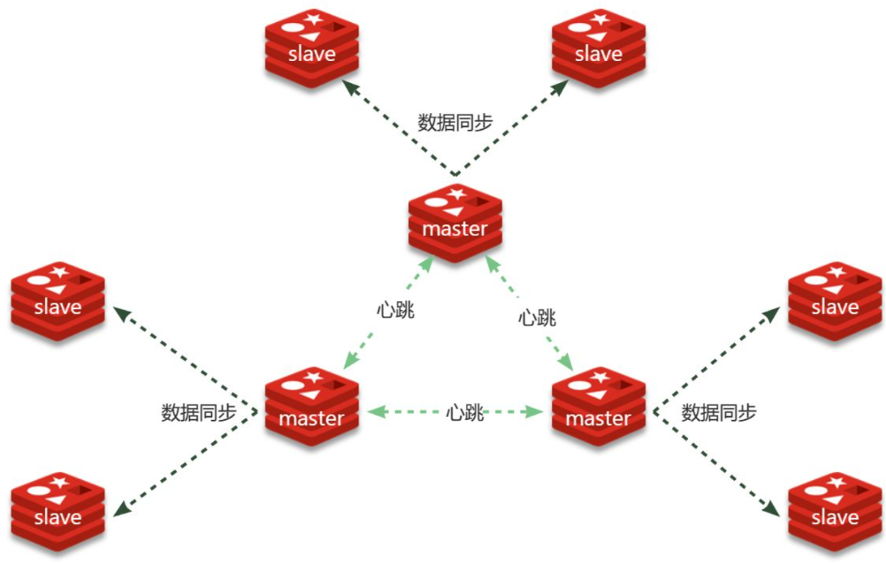

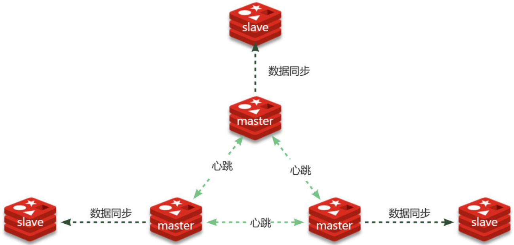

分片集群通过数据分片（Sharding）来水平扩展系统，有效解决了上述问题。其核心特征包括：

- **多主节点，数据分片**：集群中包含多个主节点（master），每个主节点负责存储一部分数据，从而实现数据的分布式存储，解决了海量数据存储问题。
- **主从复制，高可用**：每个主节点都可以配置多个从节点（slave），形成主从复制关系，保证了数据的高可用性和读能力的扩展。
- **节点健康监控**：主节点之间通过**心跳机制（**如ping）相互监测健康状态，确保集群的稳定运行。
- **请求路由透明**：客户端可以向集群中的任意节点发送请求，该节点会自动将请求路由到负责该数据的正确节点上，对客户端透明。

---

#### 1. 集群配置

分片集群中的Redis节点必须开启集群模式，一般在配置文件中添加下面参数：

```
port 7000
cluster-enabled yes
cluster-config-file nodes.conf
cluster-node-timeout 5000
appendonly yes
```

其中有3个我们没见过的参数：

- `cluster-enabled`：是否开启集群模式
- `cluster-config-file`：集群模式的配置文件名称，无需手动创建，由集群自动维护
- `cluster-node-timeout`：集群中节点之间心跳超时时间

一般搭建部署集群肯定是给每个节点都配置上述参数，不过考虑到我们计划用`docker-compose`部署，因此可以直接在启动命令中指定参数，偷个懒。

在虚拟机的`/root`目录下新建一个`redis-cluster`目录，然后在其中新建一个`docker-compose.yaml`文件，内容如下：

```
version: "3.2"

services:
  r1:
    image: redis
    container_name: r1
    network_mode: "host"
    entrypoint: ["redis-server", "--port", "7001", "--cluster-enabled", yes, --cluster-config-file, node.conf]
  r2:
    image: redis
    container_name: r2
    network_mode: "host"
    entrypoint: ["redis-server", "--port", "7002", "--cluster-enabled", yes, --cluster-config-file, node.conf]
  r3:
    image: redis
    container_name: r3
    network_mode: "host"
    entrypoint: ["redis-server", "--port", "7003", "--cluster-enabled", yes, --cluster-config-file, node.conf]
  r4:
    image: redis
    container_name: r4
    network_mode: "host"
    entrypoint: ["redis-server", "--port", "7004", "--cluster-enabled", yes, --cluster-config-file, node.conf]
  r5:
    image: redis
    container_name: r5
    network_mode: "host"
    entrypoint: ["redis-server", "--port", "7005", "--cluster-enabled", yes, --cluster-config-file, node.conf]
  r6:
    image: redis
    container_name: r6
    network_mode: "host"
    entrypoint: ["redis-server", "--port", "7006", "--cluster-enabled", yes, --cluster-config-file, node.conf]
```

**注意**：使用Docker部署Redis集群，network模式必须采用host

---

#### 2. 启动集群

进入`/root/redis-cluster`目录，使用命令启动redis：

```
docker-compose up -d
```

启动成功，可以通过命令查看启动进程：

```
ps -ef | grep redis
# 结果：
root       4822   4743  0 14:29 ?        00:00:02 redis-server *:7002 [cluster]
root       4827   4745  0 14:29 ?        00:00:01 redis-server *:7005 [cluster]
root       4897   4778  0 14:29 ?        00:00:01 redis-server *:7004 [cluster]
root       4903   4759  0 14:29 ?        00:00:01 redis-server *:7006 [cluster]
root       4905   4775  0 14:29 ?        00:00:02 redis-server *:7001 [cluster]
root       4912   4732  0 14:29 ?        00:00:01 redis-server *:7003 [cluster]
```

可以发现每个redis节点都以cluster模式运行。不过节点与节点之间并未建立连接。

接下来，我们使用命令创建集群：

```
# 进入任意节点容器
docker exec -it r1 bash
# 然后，执行命令
redis-cli --cluster create --cluster-replicas 1 \
192.168.150.101:7001 192.168.150.101:7002 192.168.150.101:7003 \
192.168.150.101:7004 192.168.150.101:7005 192.168.150.101:7006
```

命令说明：

- `redis-cli --cluster`：代表集群操作命令
- `create`：代表是创建集群
- `--cluster-replicas 1` ：指定集群中每个`master`的副本个数为1

- 此时`节点总数 ÷ (replicas + 1)` 得到的就是`master`的数量`n`。因此节点列表中的前`n`个节点就是`master`，其它节点都是`slave`节点，随机分配到不同`master`

输入命令后控制台会弹出下面的信息：

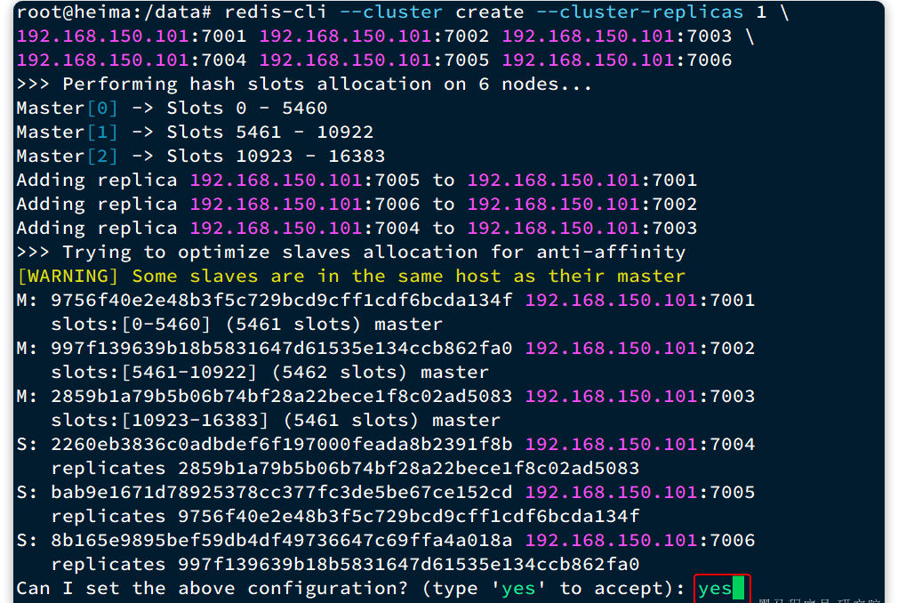

这里展示了集群中`master`与`slave`节点分配情况，并询问你是否同意。节点信息如下：

- `7001`是`master`，节点`id`后6位是`da134f`
- `7002`是`master`，节点`id`后6位是`862fa0`
- `7003`是`master`，节点`id`后6位是`ad5083`
- `7004`是`slave`，节点`id`后6位是`391f8b`，认`ad5083`（7003）为`master`
- `7005`是`slave`，节点`id`后6位是`e152cd`，认`da134f`（7001）为`master`
- `7006`是`slave`，节点`id`后6位是`4a018a`，认`862fa0`（7002）为`master`

输入`yes`然后回车。会发现集群开始创建，并输出下列信息：


接着，我们可以通过命令查看集群状态：

```
redis-cli -p 7001 cluster nodes
```

结果：


---

### ⅱ. 散列插槽

数据要分片存储到不同的Redis节点，肯定需要有分片的依据，这样下次查询的时候才能知道去哪个节点查询。很多数据分片都会采用一致性hash算法。而Redis则是利用散列插槽（`**hash slot**`）的方式实现数据分片。

详见官方文档：

https://redis.io/docs/management/scaling/#redis-cluster-101

在Redis集群中，共有16384个`hash slots`，集群中的每一个master节点都会分配一定数量的`hash slots`。具体的分配在集群创建时就已经指定了：


如图中所示：

- Master[0]，本例中就是7001节点，分配到的插槽是0~5460
- Master[1]，本例中就是7002节点，分配到的插槽是5461~10922
- Master[2]，本例中就是7003节点，分配到的插槽是10923~16383

当我们读写数据时，Redis基于`CRC16` 算法对`key`做`hash`运算，得到的结果与`16384`取余，就计算出了这个`key`的`slot`值。然后到`slot`所在的Redis节点执行读写操作。

不过`hash slot`的计算也分两种情况：

- 当`key`中包含`{}`时，根据`{}`之间的字符串计算`hash slot`
- 当`key`中不包含`{}`时，则根据整个`key`字符串计算`hash slot`

例如：

- key是`user`，则根据`user`来计算hash slot
- key是`user:{age}`，则根据`age`来计算hash slot

我们来测试一下，先于`7001`建立连接：

```
# 进入容器
docker exec -it r1 bash
# 进入redis-cli
redis-cli -p 7001
# 测试
set user jack
```

会发现报错了：


提示我们`MOVED 5474`，其实就是经过计算，得出`user`这个`key`的`hash slot` 是`5474`，而`5474`是在`7002`节点，不能在`7001`上写入！！

说好的任意节点都可以读写呢？

这是因为我们连接的方式有问题，连接集群时，要加`-c`参数：

```
# 通过7001连接集群
redis-cli -c -p 7001
# 存入数据
set user jack
```

结果如下：


可以看到，客户端自动跳转到了`5474`这个`slot`所在的`7002`节点。

现在，我们添加一个新的key，这次加上`{}`：

```
# 试一下key中带{}
set user:{age} 21

# 再试一下key中不带{}
set age 20
```

结果如下：

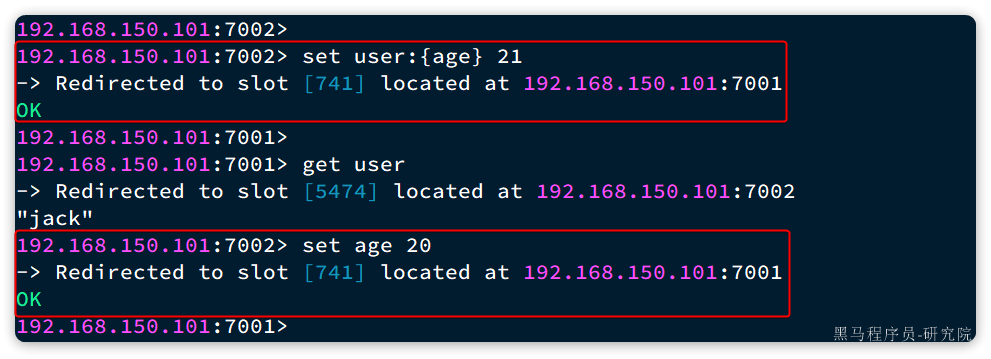

可以看到`user:{age}`和`age`计算出的`slot`都是`741`。

---

### ⅲ. 3.3.故障转移

分片集群的节点之间会互相通过ping的方式做心跳检测，超时未回应的节点会被标记为下线状态。当发现master下线时，会将这个master的某个slave提升为master。

我们先打开一个控制台窗口，利用命令监测集群状态：

```
watch docker exec -it r1 redis-cli -p 7001 cluster nodes
```

命令前面的watch可以每隔一段时间刷新执行结果，方便我们实时监控集群状态变化。

接着，我们故技重施，利用命令让某个master节点休眠。比如这里我们让`7002`节点休眠，打开一个新的ssh控制台，输入下面命令：

```
docker exec -it r2 redis-cli -p 7002 DEBUG sleep 30
```

可以观察到，集群发现7002宕机，标记为下线：


过了一段时间后，7002原本的小弟7006变成了`master`：


而7002被标记为`slave`，而且其`master`正好是7006，主从地位互换。

---

### ⅳ. 3.4.总结

Redis分片集群如何判断某个key应该在哪个实例？

- 将16384个插槽分配到不同的实例
- 根据key计算哈希值，对16384取余
- 余数作为插槽，寻找插槽所在实例即可

如何将同一类数据固定的保存在同一个Redis实例？

- Redis计算key的插槽值时会判断key中是否包含`{}`，如果有则基于`{}`内的字符计算插槽
- 数据的key中可以加入`{类型}`，例如key都以`{typeId}`为前缀，这样同类型数据计算的插槽一定相同

---

### ⅴ. 3.5.Java客户端连接分片集群（选学）

RedisTemplate底层同样基于lettuce实现了分片集群的支持，而使用的步骤与哨兵模式基本一致，参考`2.5节`：

1）引入redis的starter依赖

2）配置分片集群地址

3）配置读写分离

与哨兵模式相比，其中只有分片集群的配置方式略有差异，如下：

```
spring:
  redis:
    cluster:
      nodes:
        - 192.168.150.101:7001
        - 192.168.150.101:7002
        - 192.168.150.101:7003
        - 192.168.150.101:8001
        - 192.168.150.101:8002
        - 192.168.150.101:8003
```

---

## e. Redis 数据结构

### ⅰ. RedisObje

在Redis内部，无论是键还是值，都会被统一封装成一个名为 **RedisObject** 的结构体，也常被称为Redis对象。

这个设计是Redis实现其动态类型系统、内存管理和高效数据操作的核心基础。

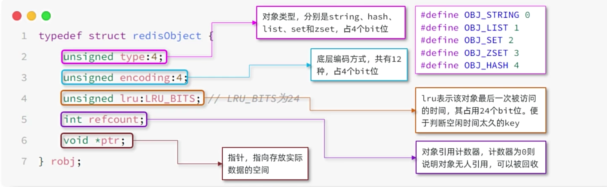

---

Redis 中会根据存储的数据类型不同，选择不同的编码方式，共包含 12 种不同类型：

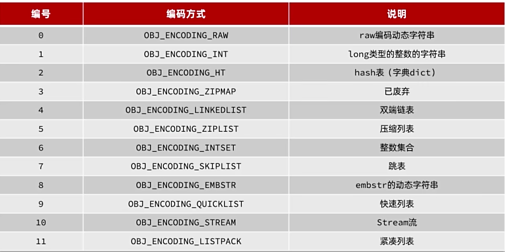

每种数据类型的使用的编码方式如下：

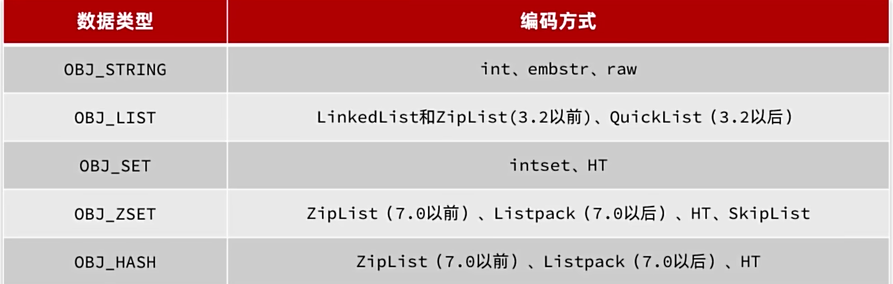

---

### ⅱ. SkipList

**SkipList（跳表）**首先是链表，但与传统链表相比有几点差异：

- **有序性**：跳表中的元素是**按照升序排列存储**的。
- **多层索引结构**：跳表的节点**可能包含多个指针**，这些指针指向不同距离的后续节点，从而形成不同的“跨度”。

跳表通过在有序链表的基础上，为部分节点增加指向更远节点的“快进”指针，构建出一个多层的索引结构。

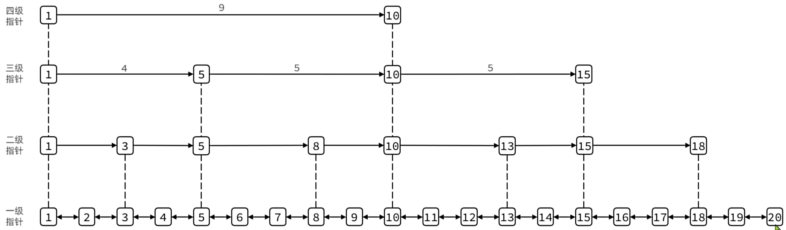

**📝** **SkipList 核心特性**

- **有序双向链表**  
    跳表本质上是一个**有序的双向链表**，这意味着数据在底层是按顺序排列的，且支持双向遍历。
- **随机层级结构**  
    每个节点可以包含多层指针（即“索引”），其层数是 **1 到 32 之间的随机数**。这种随机化机制代替了平衡树复杂的旋转操作来维持平衡。
- **跨度与层级关系**  
    不同层级的指针跨度不同，遵循**层级越高，跨度越大**的规律。高层指针用于快速“跳跃”过大量数据，低层指针用于精细查找。
- **性能与实现权衡**

- **效率**：增删改查的时间复杂度与**红黑树**基本一致（平均为 $O(\log n)$）。
- **实现**：相比红黑树，跳表的**实现逻辑更简单**，不需要复杂的旋转调整。
- **代价**：由于需要维护多层指针，其**空间复杂度更高**（以空间换时间）。

---

### ⅲ. SortedSet

**SortedSet 数据结构的特点：**

- **数据组成**：每组数据都由 **score**（分值）和 **member**（成员）两部分组成。
- **成员唯一性**：**member** 在集合中是唯一的，不能重复。
- **排序方式**：集合中的元素可以依据 **score** 进行排序，从而实现有序存储和访问。

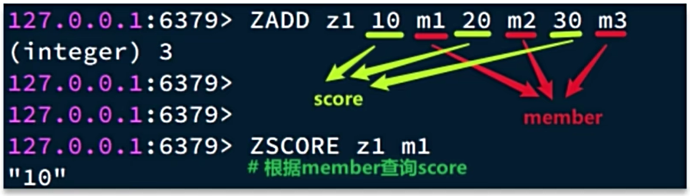

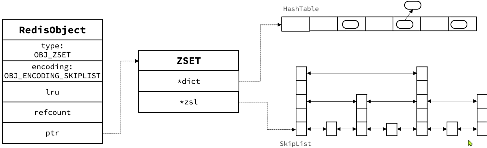

---

SortedSet 的底层实际上是 **哈希表（Hash Table）** 和 **跳表（Skip List）** 的结合体：

1. **哈希表（用于快速查找）**

- **作用**：为了保证能根据 `member` 快速查询到 `score`。
- **结构**：以 `member` 为键（Key），以 `score` 为值（Value）。
- **场景**：当你执行“根据成员查分值”的操作时，系统会直接查询这个哈希表，时间复杂度为 O(1)。

2. **跳表（用于排序）**

- **作用**：为了保证数据能根据 `score` 进行排序，并支持范围查询。
- **结构**：底层维护了一个跳表结构，节点按 `score` 升序排列。
- **场景**：当你需要“根据分值排序”或“查询某个分值范围内的数据”时，系统会基于跳表进行操作，时间复杂度为 O(log N)。

**总结：**

这种“哈希表 + 跳表”的双重结构设计，让 **SortedSet** 既能像哈希表一样通过 Key 快速定位，又能像**平衡树**一样支持高效的范围查询和排序。

---

## f. Redis 内存回收

### ⅰ. 过期 key 处理

Redis 提供了 expire 命令，给 key 设置 TTL（存活时间）：

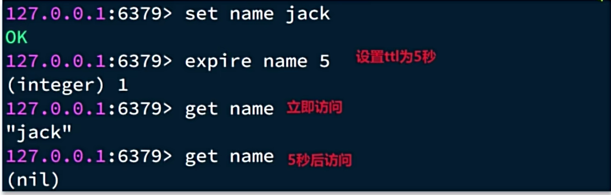

- **过期现象**：当 Key 的 TTL（生存时间）到期后，再次访问该 Key（例如 `name`），返回的结果是 `nil`。
- **内存释放**：返回 `nil` 意味着该 Key 已经被删除，其占用的内存空间也随之被释放。
- **最终目的**：这一过程实现了自动的内存回收，防止内存被过期的数据长期占用。

---

**Redis 数据存储结构：**

Redis 作为一个键值型数据库，其所有数据都存储在一个名为 `redisDB` 的结构体中。这个结构体内部包含两个核心的哈希表：

- `**dict**` **(字典)**：

- **作用**：这是 Redis 的主存储空间。
- **内容**：保存了数据库中所有的**键值对**（Key-Value pairs）。当你存取数据时，主要操作的就是这个字典。

- `**expires**` **(过期字典)**：

- **作用**：专门用于管理键的过期时间。
- **内容**：保存了所有**设置了过期时间的 Key** 以及它们对应的**到期时间戳**（通常是写入时间 + TTL）。

这种分离式设计使得 Redis 能够高效地管理数据和过期策略，互不干扰。

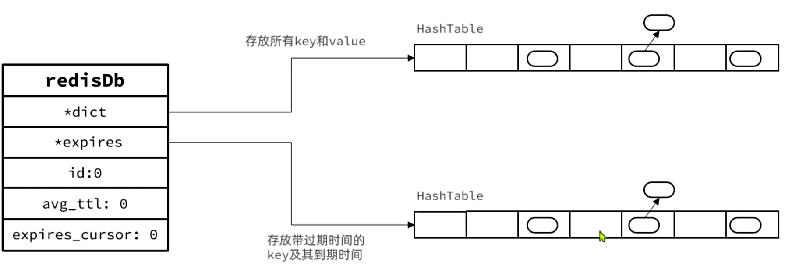

---

Redis 不会在键过期的瞬间立即删除，而是采用**惰性删除**和**周期删除**相结合的策略，以在内存利用率和 CPU 性能之间取得平衡。

**核心策略：**

- **惰性删除 (Lazy Deletion)**

- **机制**：这是一种被动策略。只有当客户端尝试访问某个 key 时，Redis 才会检查该 key 是否已过期。
- **优点**：对 CPU 友好，只在必要时才进行删除操作。
- **缺点**：如果一个 key 已经过期但从未被访问，它会一直占用内存，导致内存浪费。

- **周期删除 (Periodic Deletion)**

- **机制**：这是一种主动策略。Redis 会通过一个后台定时任务，周期性地随机抽取一部分设置了过期时间的 key 进行检查和删除。
- **优点**：能有效清理那些不再被访问的过期 key，回收内存。
- **缺点**：会占用一定的 CPU 时间。

**周期删除的两种模式：**

为了更精细地控制周期删除对性能的影响，Redis 将其分为了两种模式：

1. **SLOW 模式**

- **执行频率**：默认每秒执行 10 次（频率受 `server.hz` 参数影响）。
- **执行时长**：每次执行时间上限为 **25ms**，以避免长时间阻塞主线程。

2. **FAST 模式**

- **执行频率**：不固定，跟随 Redis 内部的 IO 事件循环执行。
- **执行间隔**：两次任务之间的间隔不低于 **2ms**。
- **执行时长**：每次执行时间上限更短，不超过 **1ms**。

通过这两种模式的配合，Redis 能够在系统空闲时（FAST 模式）快速清理少量过期键，也能在常规周期内（SLOW 模式）进行更彻底的清理，从而在保证服务响应速度的同时，尽可能地回收内存。

---

### ⅱ. 内存淘汰策略

当 Redis 的内存使用量达到设定的**最大阈值**（`**maxmemory**`）时，为了防止内存溢出，Redis 会根据预设的策略主动挑选并删除部分 Key，从而腾出空间写入新数据。

Redis 会在**每次处理客户端命令**时检查内存使用情况，如果内存已满且需要写入新数据，就会触发淘汰流程。列举了以下几种具体的淘汰策略：

1. **不淘汰策略**

- **noeviction**：这是 Redis 的**默认策略**。它不会淘汰任何 Key。当内存满时，如果尝试写入新数据，Redis 会直接报错（写入失败），但读操作不受影响。

2. **基于随机淘汰**

- **allkeys-random**：从**所有** Key 中随机挑选并淘汰。
- **volatile-random**：仅从设置了过期时间（TTL）的 Key 中随机挑选并淘汰。

3. **基于 TTL（生存时间）淘汰**

- **volatile-ttl**：仅针对**设置了过期时间**的 Key。TTL（剩余生存时间）越小的 Key（即越快过期的），越优先被淘汰。

4. **基于 LRU（最近最少使用）淘汰**

- **allkeys-lru**：从**所有** Key 中，基于 LRU 算法淘汰最近最少使用的 Key。这是最常用的策略之一，适合大部分缓存场景。
- **volatile-lru**：仅从**设置了过期时间**的 Key 中，基于 LRU 算法淘汰最近最少使用的 Key。

5. **基于 LFU（最不经常使用）淘汰**

- **allkeys-lfu**：从**所有** Key 中，基于 LFU 算法淘汰访问频率最低的 Key。
- **volatile-lfu**：仅从**设置了过期时间**的 Key 中，基于 LFU 算法淘汰访问频率最低的 Key。

---

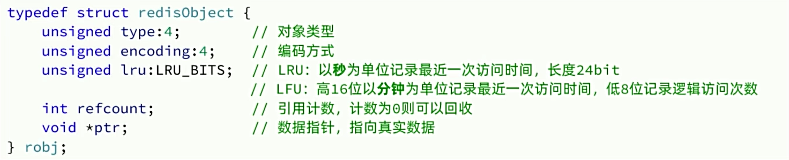

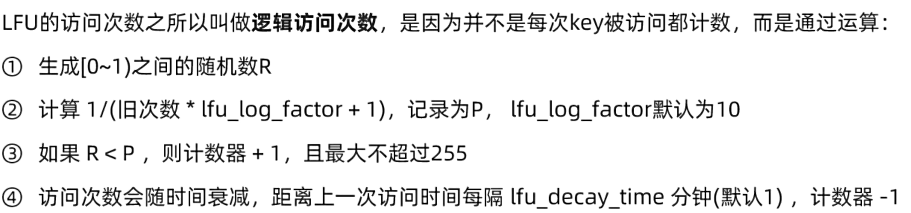

---

## g. Redis 缓存

### ⅰ. 缓存一致性

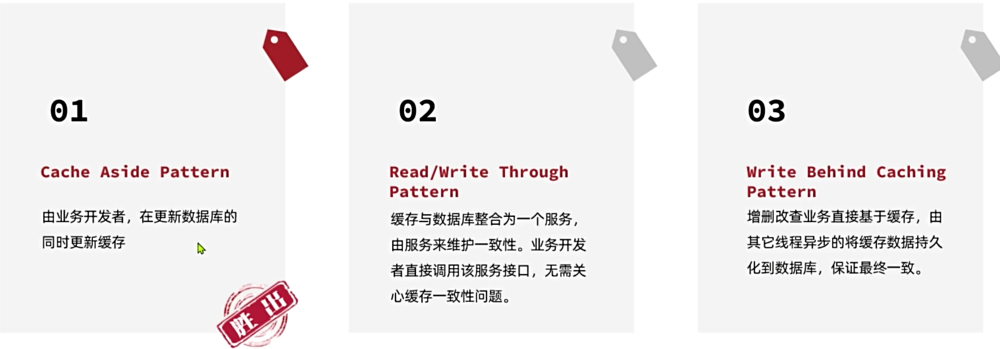

---

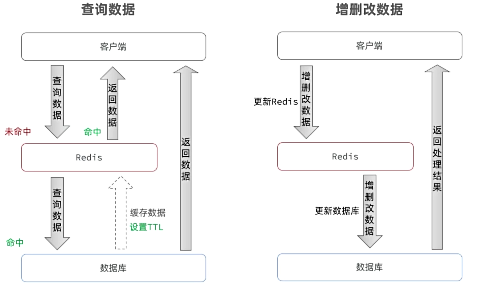

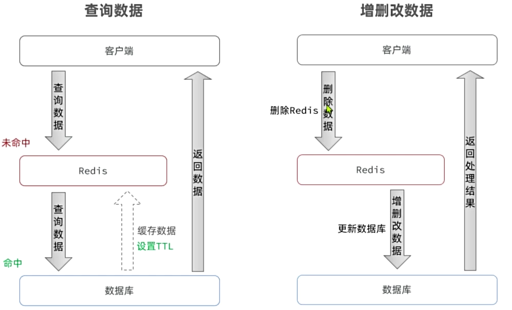

---

---

## 🔗 关联笔记
- [[（实用篇）SpringCloud微服务笔记]]
- [[（面试篇）SpringCloud微服务笔记]]
- [[分布式与网关杂记]]
